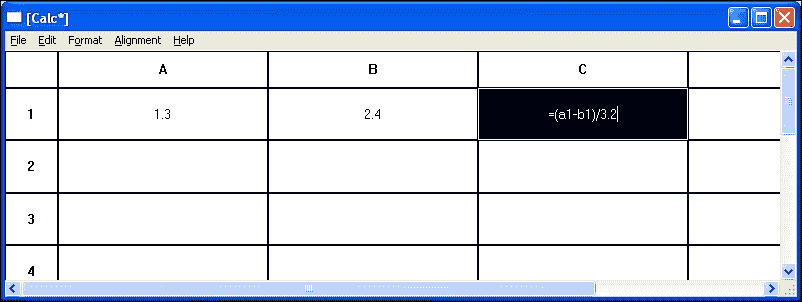

# 第九章：公式解释

电子表格程序能够处理文本、数值和由四个算术运算符组成的公式。为了做到这一点，我们需要解释公式。我们还需要找到公式的来源（公式中引用的单元格）和单元格的目标（受单元格变化影响的单元格）。

在本章中，我们将探讨以下主题：

+   数值表达式的解释（扫描和解析）

+   解析和语法树

+   公式的评估

+   参考和矩阵

+   绘制单元格

+   单元格的加载和保存

在以下电子表格中，正在编辑的单元格是`C3`：


# 公式解释

电子表格程序的核心是其解释公式的能力。当用户在单元格中输入一个公式时，它会被解释并计算其值。公式解释的过程分为三个独立的步骤。首先，给定输入字符串，**扫描器**生成**标记列表**，然后**解析器**生成**语法树**，最后**评估器**确定值。


标记是公式中最不重要的部分。例如，`a1`被解释为引用，而`1.2`被解释为值。假设根据以下表格，单元格具有以下值，公式解释过程将如下所示。请记住，公式是以等号（`**=**`）开头的文本。



## 标记

扫描器以字符串作为输入，并找到其最不重要的部分——其标记。标记之间的空格被忽略，扫描器对大小写没有区别。`Value`标记需要额外信息来跟踪实际值，这被称为**属性**。同样，`Reference`需要一个属性来跟踪引用。在这个应用中，有九种不同的标记：

**Token.h**

```cpp
enum TokenId {Plus, Minus, Star, Slash, LeftParenthesis, 
              RightParenthesis, RefToken, Number, EndOfLine}; 

```

| **Token** | **描述** |
| --- | --- |
| `Plus`, `Minus`, `Star`, 和 `Slash` | 这四个是算术运算符："`+`", "`-`", "`*`", 和 "`/`" |
| `LeftParenthesis` 和 `RightParenthesis` | 这是左右括号："`(`" 和 "`)`" |
| 值 | 这是一个数值，例如，`124`，`3.14`，或`-0.23`。无论是整数还是小数，都无关紧要。同样，如果存在小数点，它前面或后面是否有数字也无关紧要。然而，值必须至少包含一个数字。这需要一个类型为`double`的值作为属性。 |
| 参考 | 这是一个参考，例如，`b8, c6`。这需要一个`Reference`对象作为属性。 |
| 行尾 | 这是行尾，字符串中没有更多（非空格）字符。 |

如前所述，字符串`1.2 * (b2 + c3)`生成了下一页表中的令牌。列表末尾添加了行尾令牌。

| **文本** | **令牌** | **属性** |
| --- | --- | --- |
| 1.2 | 值 | 1.2 |
| * | 星号 |  |
| ( | 左括号 |  |
| b2 | 引用 | 行 `1`，列 `1` |
| + | 加号 |  |
| c3 | 引用 | 行 `2`，列 `2` |
| ) | 右括号 |  |
|  | 行尾 |  |

令牌在`Token`类中定义。令牌由一个令牌标识符、在值令牌的情况下一个双精度值，以及在引用令牌的情况下一个`Reference`对象组成。

**Token.h**

```cpp
class Token { 
  public: 
    Token(TokenId tokenId); 
    Token(double value); 
    Token(Reference reference); 

    TokenId Id() const {return tokenId;} 
    double Value() const {return value;} 
    Reference ReferenceField() const {return reference;} 

  private: 
    TokenId tokenId; 
    double value; 
    Reference reference; 
}; 

```

**Token.cpp**

```cpp
#include "..\\SmallWindows\\SmallWindows.h" 
#include "Token.h" 

Token::Token(TokenId tokenId) 
 :tokenId(tokenId) { 
  // Empty. 
} 

Token::Token(double value) 
 :tokenId(Number), 
  value(value) { 
  // Empty. 
} 

Token::Token(Reference reference) 
 :tokenId(RefToken), 
  reference(reference) { 
  // Empty. 
} 

```

## 树节点

如前所述，解析器生成一个语法树。更具体地说，它生成一个`Tree`类的对象（在第十二章辅助类中描述），这是一个具有节点类型的模板类：`TreeNode`。节点有 10 个标识符，类似于`Token`，值节点有一个双精度值作为其属性，引用节点有一个引用对象作为属性。

**TreeNode.h**

```cpp
enum TreeId {EmptyTree, UnaryAdd, UnarySubtract, BinaryAdd, BinarySubtract, 
             Multiply, Divide, Parenthesis, RefId, ValueId}; 

```

当从文件或剪贴板缓冲区读取值时，使用默认构造函数。

```cpp
class TreeNode { 
  public: 
    TreeNode(); 
    TreeNode(TreeId id); 
    TreeNode(Reference reference); 
    TreeNode(double value); 

```

电子表格的一个单元格可以保存到文件中，也可以剪切、复制和粘贴，因此我们包含了以下方法：

```cpp
    bool WriteTreeNodeToStream(ostream& outStream) const; 
    bool ReadTreeNodeFromStream(istream& inStream); 
    void WriteTreeNodeToClipboard(InfoList& infoList) const; 
    void ReadTreeNodeFromClipboard(InfoList& infoList); 

```

节点的标识符和值只能被检查，不能被修改。然而，引用可以被修改，因为它在用户复制单元格并将其粘贴到另一个位置时会被更新：

```cpp
    TreeId Id() const {return id;} 
    double Value() const {return value;} 
    Reference ReferenceField() const {return reference;} 
    Reference& ReferenceField() {return reference;} 

  private: 
    TreeId id; 
    Reference reference; 
    double value; 
}; 

```

**TreeNode.cpp**

```cpp
#include "..\\SmallWindows\\SmallWindows.h" 
#include "TreeNode.h" 

TreeNode::TreeNode() 
 :id(EmptyTree), 
  value(0) { 
  // Empty. 
} 

TreeNode::TreeNode(TreeId id) 
 :id(id), 
  value(0) { 
    // Empty. 
} 

TreeNode::TreeNode(Reference reference) 
: id(RefId), 
  value(0), 
  reference(reference) { 
  // Empty. 
} 

TreeNode::TreeNode(double value) 
 :id(ValueId), 
  value(value) { 
  // Empty. 
} 

```

节点标识符、值和引用被写入和读取，如下所示：

```cpp
bool TreeNode::WriteTreeNodeToStream(ostream& outStream) const { 
  outStream.write((char*) &id, sizeof id); 
  outStream.write((char*) &value, sizeof value); 
  reference.WriteReferenceToStream(outStream); 
  return ((bool) outStream); 
} 

bool TreeNode::ReadTreeNodeFromStream(istream& inStream) { 
  inStream.read((char*) &id, sizeof id); 
  inStream.read((char*) &value, sizeof value); 
  reference.ReadReferenceFromStream(inStream); 
  return ((bool) inStream); 
} 

void TreeNode::WriteTreeNodeToClipboard(InfoList& infoList) const  { 
  infoList.AddValue<TreeId>(id); 
  infoList.AddValue<double>(value); 
  reference.WriteReferenceToClipboard(infoList); 
} 

void TreeNode::ReadTreeNodeFromClipboard(InfoList& infoList) { 
  infoList.GetValue<TreeId>(id); 
  infoList.GetValue<double>(value); 
  reference.ReadReferenceFromClipboard(infoList); 
} 

```

## `Scanner` – 生成令牌列表

`Scanner`类的任务是分组字符为令牌。例如，`*12.34*`被解释为值`*12.34*`。构造函数接受一个字符串作为参数，而`Scan`通过重复调用`NextToken`直到字符串为空来生成令牌列表。

**Scanner.h**

```cpp
class Scanner { 
  public: 
    Scanner(String buffer); 
    list<Token> Scan(); 

```

当`NextToken`方法遇到字符串的末尾时，它返回`EndOfLine`。如果`ScanValue`和`ScanReference`方法遇到值或引用，则返回`true`：

```cpp
    Token NextToken(); 
    bool ScanValue(double& value); 
    bool ScanReference(Reference& reference); 

```

下一个令牌会不断地从缓冲区中读取，直到它为空：

```cpp
  private: 
    String buffer; 
}; 

```

**Scanner.cpp**

```cpp
#include "..\\SmallWindows\\SmallWindows.h" 
#include "Token.h" 
#include "Error.h" 
#include "Scanner.h" 

```

为了简单起见，向字符串中添加了`TEXT('\0')`；而不是检查剩余的文本是否为空，我们寻找`null`字符：

```cpp
Scanner::Scanner(String buffer) 
 :buffer(buffer + TEXT('\0')) { 
  // Empty. 
} 

```

`Scan`方法将缓冲区中的令牌添加到`tokenList`中，直到遇到`EndOfLine`。最后，返回列表：

```cpp
list<Token> Scanner::Scan() { 
  list<Token> tokenList; 

  while (true) { 
    Token token = NextToken(); 
    tokenList.push_back(token); 

    if (token.Id() == EndOfLine) { 
      break; 
    } 
  } 

  return tokenList; 
} 

```

`NextToken`方法通过在缓冲区中找到下一个令牌来完成扫描器的实际工作。首先，我们跳过空白字符。当涉及到算术符号和括号时，提取令牌相当简单。我们只需检查缓冲区的下一个字符。当涉及到数值或引用时，这会变得稍微困难一些。为此，我们有两个辅助方法：`ScanValue`和`ScanReference`。看看以下代码：

```cpp
Token Scanner::NextToken() { 
  while (buffer[0] == TEXT(' ')) { 
    buffer.erase(0, 1); 
  } 

   switch (buffer[0]) { 
    case TEXT('\0'): 
      return Token(EndOfLine); 

    case TEXT('+'): 
      buffer.erase(0, 1); 
      return Token(Plus); 

    case TEXT('-'): 
      buffer.erase(0, 1); 
      return Token(Minus); 

    case TEXT('*'): 
      buffer.erase(0, 1); 
      return Token(Star); 

    case TEXT('/'): 
      buffer.erase(0, 1); 
      return Token(Slash); 

    case TEXT('('): 
      buffer.erase(0, 1); 
      return Token(LeftParenthesis); 

    case TEXT(')'): 
      buffer.erase(0, 1); 
      return Token(RightParenthesis); 

```

如果没有适用任何简单情况，标记可能是一个值或一个引用。`ScanValue` 和 `ScanReference` 方法会找出是否是这样。如果不是，扫描器遇到了未知字符，并抛出语法错误异常：

```cpp
    default: { 
      double value; 
      Reference reference; 
      if (ScanValue(value)) { 
        return Token(value); 
      } 

      else if (ScanReference(reference)) { 
        return Token(reference); 
      } 
      else { 
        throw Error(SyntaxError); 
      } 
    } 
    break; 
  } 
} 

```

`ScanValue` 使用 `_stscanf_s` 标准函数，这是 `sscanf` 的安全通用版本。返回值存储在 `fieldCount` 中，如果成功读取双精度值，则将其设置为 `1`。我们还需要读取的字符数，它存储在 `charCount` 中，以便从缓冲区中删除正确的字符数：

```cpp
bool Scanner::ScanValue(double& value) { 
  int charCount; 
  int fieldCount = _stscanf_s(buffer.c_str(), TEXT("%lf%n"), 
                              &value, &charCount); 

  if (fieldCount > 0) { 
    buffer.erase(0, charCount); 
    return true; 
  } 

  return false; 
} 

```

`ScanReference` 检查前两个字符是否为字母和数字。如果是，它将提取引用的列和行：

```cpp
bool Scanner::ScanReference(Reference& reference) { 
  if (isalpha(buffer[0]) && (isdigit(buffer[1]))) { 

```

我们通过从 *a* 减去小写字母来提取列，这给出第一列的索引为零，并从缓冲区中删除字母。

```cpp
    reference.Col() = tolower(buffer[0]) - TEXT('a'); 
    buffer.erase(0, 1); 

```

与 `ScanValue` 类似，我们通过调用 `_stscanf_s` 来提取行，它读取行整数值和字符数，我们使用这些信息来从缓冲区中删除读取的字符：

```cpp
    int row; 
    int charCount; 
    _stscanf_s(buffer.c_str(), TEXT("%d%n"), &row, &charCount); 
    reference.Row() = row - 1; 
    buffer.erase(0, charCount); 
    return true; 
  } 

  return false; 
} 

```

## 解析器 – 生成语法树

用户输入一个以等号（**=**）开头的公式。解析器的任务是翻译扫描器的标记列表为语法树。有效公式的语法可以通过**语法**来定义。让我们从一个处理使用算术运算符的表达式的语法开始：


语法是一组规则。在先前的语法中，有八个规则。**公式**和**表达式**被称为**非终结符**；**行尾**、**值**以及字符**+**、**-**、*****、**/**、**(** 和 **)**被称为**终结符**。终结符和非终结符统称为符号。其中一条规则是语法的**起始规则**，在我们的例子中是第一条规则。起始规则左侧的符号被称为语法的**起始符号**，在我们的例子中是**公式**。

箭头可以读作“**是**”，先前的语法可以读作：

*公式是一个表达式后跟行尾。表达式是两个表达式的和、差、积、商，或者括号内的表达式、引用或数值。*

这是一个好的开始，但有几个问题。让我们测试字符串 *1 + 2 * 3* 是否被语法接受。我们可以通过进行**推导**来测试，从起始符号 `Formula` 开始，应用规则，直到只剩下终结符。以下推导中的数字指的是语法规则：


推导可以通过**解析树**的发展来表示。

让我们尝试对同一个字符串进行另一种推导，这次按照不同的顺序应用规则。

这个推导生成了一个不同的解析树，如下所示：


如果一个语法可以针对同一个输入字符串生成两个不同的解析树，那么它被认为是**歧义的**。第二个树显然违反了数学定律，即乘法的优先级高于加法，但语法并不知道这一点。避免歧义的一种方法是为每个优先级级别引入一组新的规则：


新的语法不是歧义的。如果我们用这个语法尝试我们的字符串，我们只能生成一个解析树，无论我们选择应用规则的顺序如何。有正式的方法可以证明语法不是歧义的；然而，这超出了本书的范围。请参阅本章末尾的参考文献。


这个推导给出了以下树。由于不可能从同一个输入字符串推导出两个不同的树，因此语法是**无歧义的**。


现在我们已经准备好编写解析器了。本质上，有两种类型的解析器：**自顶向下解析器**和**自底向上解析器**。正如术语所暗示的，自顶向下解析器从语法的起始符号和输入字符串开始，并尝试应用规则，直到我们只剩下终结符。自底向上解析器从输入字符串开始，并尝试反向应用规则，直到我们达到起始符号。

构建自底向上解析器是一个复杂的问题。通常不是手动完成的；相反，有**解析器生成器**为给定的语法构建一个**解析器表**和解析器实现的骨架代码。然而，自底向上解析的理论超出了本书的范围。

构建自顶向下解析器比构建自底向上解析器更容易。构建一个简单但效率低下的自顶向下解析器的一种方法是在随机顺序中应用所有可能的规则。如果我们遇到了死胡同，我们只需回溯并尝试另一条规则。一个更高效但相对简单的解析器是前瞻解析器。给定一个合适的语法，我们只需要查看下一个标记，就可以唯一确定要应用的规则。如果我们遇到了死胡同，我们不需要回溯；我们只需得出结论，即输入字符串根据语法是不正确的——它被称为**语法错误**。

实现一个前瞻解析器的第一次尝试可能是为语法中的每个规则编写一个函数。不幸的是，我们目前还不能这样做，因为这会导致一个像`Expression`这样的函数：

```cpp
Tree<TreeNode>* Parser::Expression() { 
  Token token = tokenList.front(); 

  switch (token.Id()) { 
    case Plus: 
      Tree<TreeNode>* plusTree = Expression(); 
      // ... 
      break; 
  } 
} 

```

你看到问题了吗？该方法在未改变输入流的情况下调用自身，这将导致无限次的递归调用。这被称为**左递归**。然而，我们可以通过简单的转换来解决该问题。


前面的规则可以转换为等价的规则集（其中 epsilon ε表示空字符串）：


如果我们将这种转换应用于前面语法中的**表达式**和**项**规则，我们将得到以下语法：


让我们用我们的字符串*1 + 2 * 3*尝试这个新语法。


推导生成了以下解析树：


语法适合前瞻解析器的条件是，具有相同左侧符号的每个规则集必须以不同的终结符开始其右侧。如果没有空规则，它最多只能有一个以非终结符作为右侧第一个符号的规则。我们前面讨论的语法满足这些要求。

现在我们已经准备好编写解析器了。然而，解析器还应生成某种类型的输出，表示字符串。一种这样的表示是**语法树**，它可以被视为一个抽象的解析树——我们只保留必要的信息。例如，前面的解析树有一个匹配的语法，如下所示：


下面的代码是`Parser`类。其思路是，我们为每个具有相同左侧符号的规则集编写一个方法。每个这样的方法生成结果语法树的一部分。构造函数接受要解析的文本，并让扫描器生成一个标记列表。然后，`Parse`开始解析过程，并返回生成的语法树。如果在解析过程中发生错误，将抛出语法错误异常。当标记列表被解析后，我们应该确保列表中没有除`EndOfLine`之外的额外标记。此外，如果输入缓冲区完全为空（用户只输入了一个等号），列表中仍然有`EndOfLine`标记。

解析的结果是一个表示公式的语法树。例如，公式*a1 * c3 / 3.6 + 2.4 * (b2 - 2.4)*生成了以下语法树，我们利用了第十二章中的`Tree`类，*辅助类*。


如前文在 `TreeNode` 节中所述，有九种类型的语法树：四个算术运算符、一元加法和减法、括号内的表达式、引用和数值。我们实际上不需要括号来正确存储公式，因为表达式的优先级存储在语法树本身中。然而，我们需要它来从语法树中重新生成原始字符串，当它在单元格中写入时。

**Parser.h**

```cpp
class Parser { 
  public: 
    Parser(String buffer); 
    Tree<TreeNode>* Parse(); 
    void Match(int tokenId); 
    Tree<TreeNode>* Expression(); 
    Tree<TreeNode>* NextExpression(Tree<TreeNode>* leftTermPtr); 
    Tree<TreeNode>* Term(); 
    Tree<TreeNode>* NextTerm(Tree<TreeNode>* leftFactorPtr); 
    Tree<TreeNode>* Factor(); 

  private: 
    list<Token> tokenList; 
}; 

```

`Parse` 方法被调用以解释用户输入的文本。它接收来自扫描器的标记列表，其中至少包含 `EndOfLine` 标记，并解析标记列表并接收指向语法树的指针。当标记列表被解析后，它会检查下一个标记是否为 `EndOfLine` 以确保缓冲区中没有多余的字符（除了空格）：

**Parser.cpp**

```cpp
#include "..\\SmallWindows\\SmallWindows.h" 
#include "Token.h" 
#include "Error.h" 
#include "Scanner.h" 
#include "TreeNode.h" 
#include "Parser.h" 

Parser::Parser(String buffer) { 
  Scanner scanner(buffer); 
  tokenList = scanner.Scan(); 
} 

Tree<TreeNode>* Parser::Parse() { 
  Tree<TreeNode>* resultTreePtr = Expression(); 
  Match(EndOfLine); 
  return resultTreePtr; 
} 

```

`Match` 方法用于匹配列表中的下一个标记与期望的标记。如果它们不匹配或如果标记列表为空，则抛出一个语法错误异常。否则，下一个标记将从列表中移除：

```cpp
void Parser::Match(int tokenId) { 
  if (tokenList.empty() || (tokenList.front().Id() != tokenId)) { 
    throw Error(SyntaxError); 
  } 

  tokenList.pop_front(); 
} 

```

其余的方法实现了我们之前讨论的语法。对于 `Expression`、`NextExpression`、`Term`、`NextTerm` 和 `Factor` 符号，每个都有一个方法：

```cpp
Tree<TreeNode>* Parser::Expression() { 
  Tree<TreeNode>* termTreePtr = Term(); 
  return NextExpression(termTreePtr); 
} 

```

`NextExpression` 方法负责处理加法和减法。如果下一个标记是 `Plus` 或 `Minus`，我们将其匹配并解析其右操作数。然后，我们创建并返回一个新的包含运算符的语法树。如果下一个标记既不是 `Plus` 也不是 `Minus`，我们假设适用另一条规则，并返回给定的左语法树：

```cpp
Tree<TreeNode>* Parser::NextExpression(Tree<TreeNode>* 
                                       leftTermTreePtr) { 
  Token token = tokenList.front();  
  switch (token.Id()) { 
    case Plus: { 
      Match(Plus); 
      Tree<TreeNode>* rightTermTreePtr = Term(); 
      Tree<TreeNode>* sumTreePtr = 
        new Tree<TreeNode>(TreeNode(BinaryAdd), 
                           {leftTermTreePtr, rightTermTreePtr}); 
      assert(sumTreePtr != nullptr); 
      return NextExpression(sumTreePtr); 
    } 

    case Minus: { 
      Match(Minus); 
      Tree<TreeNode>* rightTermTreePtr = Term(); 
         Tree<TreeNode>* diffTreePtr = 
             new Tree<TreeNode>(TreeNode(BinarySubtract),
                                {leftTermTreePtr, rightTermTreePtr});
      assert(diffTreePtr != nullptr); 
      return NextExpression(diffTreePtr); 
    } 

    default: 
      return leftTermTreePtr; 
  } 
}  

Tree<TreeNode>* Parser::Term() { 
  Tree<TreeNode>* pFactorTree = Factor(); 
  return NextTerm(pFactorTree); 
} 

```

`NextTerm` 方法以类似于 `NextExpression` 的方式处理乘法和除法。记住，我们需要为语法中的每个优先级级别的方法集。

```cpp
Tree<TreeNode>* Parser::NextTerm(Tree<TreeNode>*leftFactorTreePtr) { 
  Token token = tokenList.front(); 

  switch (token.Id()) { 
    case Star: { 
      Match(Star); 
      Tree<TreeNode>* rightFactorTreePtr = Factor(); 
      Tree<TreeNode>* productTreePtr = 
        new Tree<TreeNode>(TreeNode(Multiply), 
      Tree<TreeNode>* productTreePtr = 
        new Tree<TreeNode>(TreeNode(Multiply), 
                       {leftFactorTreePtr, rightFactorTreePtr}); 
      assert(productTreePtr != nullptr); 
      return NextExpression(productTreePtr); 
    } 

    case Slash: { 
      Match(Slash); 
      Tree<TreeNode>* rightFactorTreePtr = Factor(); 
      Tree<TreeNode>* quotientTreePtr = 
        new Tree<TreeNode>(TreeNode(Divide), 
                       {leftFactorTreePtr, rightFactorTreePtr}); 
      assert(quotientTreePtr != nullptr); 
      return NextExpression(quotientTreePtr); 
    } 

    default: 
      return leftFactorTreePtr; 
  } 
} 

```

`Factor` 方法解析括号内的值、引用和表达式。如果下一个标记是一元运算符（加号或减号），我们解析其表达式并创建一个包含表达式的语法树：

```cpp
Tree<TreeNode>* Parser::Factor() { 
  Token token = tokenList.front(); 

  switch (token.Id()) { 
    case Plus: { 
      Match(Plus); 
      Tree<TreeNode>* nextExprTreePtr = Expression(); 
      Tree<TreeNode>* plusTreePtr = 
        new Tree<TreeNode>(TreeNode(UnaryAdd), 
                           {nextExprTreePtr}); 
      assert(plusTreePtr!= nullptr); 
      return plusTreePtr; 
    } 

    case Minus: { 
      Match(Minus); 
      Tree<TreeNode>* nextExprTreePtr = Expression(); 
      Tree<TreeNode>* minusTreePtr = 
        new Tree<TreeNode>(TreeNode(UnaryAdd), 
                           {nextExprTreePtr}); 
      assert(minusTreePtr!= nullptr); 
      return minusTreePtr; 
    } 

```

如果下一个标记是左括号，我们将其匹配，解析随后的表达式，并匹配关闭的右括号：

```cpp
    case LeftParenthesis: { 
      Match(LeftParenthesis); 
      Tree<TreeNode>* innerExprTreePtr = Expression(); 
      Match(RightParenthesis); 
      Tree<TreeNode>* resultTreePtr =  
        new Tree<TreeNode>(TreeNode(Parenthesis), 
                           {innerExprTreePtr}); 
      assert(resultTreePtr != nullptr); 
      return resultTreePtr; 
    } 

```

如果下一个标记是引用，我们接收带有其行和列的引用属性并匹配引用标记。我们创建一个新的包含引用的语法树。请注意，解析器不会检查引用是否有效（是否指向电子表格内的单元格）；这是公式值评估的任务：

```cpp
    case RefToken: { 
      Match(RefToken); 
      Tree<TreeNode>* resultTreePtr = 
        new Tree<TreeNode>(TreeNode(token.ReferenceField())); 
      assert(resultTreePtr != nullptr); 
      return resultTreePtr; 
    }  

    case Number: { 
      Match(Number); 
      Tree<TreeNode>* resultTreePtr = 
        new Tree<TreeNode>(TreeNode(token.Value())); 
      assert(resultTreePtr != nullptr); 
      return resultTreePtr; 
    } 

```

如果前面的任何标记都不适用，则用户输入了一个无效的表达式，并抛出一个语法错误异常：

```cpp
    default: 
      throw Error(SyntaxError); 
  } 
} 

```

# 矩阵和引用

当存储电子表格的单元格时使用 `Matrix` 类，当访问电子表格中的单元格时使用 `Reference` 类。

## 引用类

`Reference` 类在 `Matrix` 类中持有单元格的行和列，如下一节所示：

**Reference.h**

```cpp
namespace SmallWindows { 
  class Reference; 
  extern const Reference ZeroReference;  

  class Reference { 
    public: 

```

默认构造函数将行和列初始化为零。引用可以通过 `new` 关键字初始化，并赋值给另一个引用：

```cpp
      Reference(); 
      Reference(int row, int col); 
      Reference(const Reference& ref); 
      Reference& operator=(const Reference& ref); 

```

比较运算符首先比较行。如果它们相等，则比较列：

```cpp
      friend bool operator==(const Reference& ref1, 
                             const Reference& ref2); 
      friend bool operator!=(const Reference& ref1, 
                             const Reference& ref2); 
      friend bool operator<(const Reference& ref1, 
                            const Reference& ref2); 
      friend bool operator<=(const Reference& ref1, 
                             const Reference& ref2); 

      friend bool operator>(const Reference& ref1, 
                            const Reference& ref2); 
      friend bool operator>=(const Reference& ref1, 
                             const Reference& ref2); 

```

加法运算符分别对行和列进行加法和减法操作：

```cpp
      Reference& operator+=(const Reference& ref); 
      Reference& operator-=(const Reference& ref); 
      friend Reference operator+(const Reference& ref1, 
                                 const Reference& ref2); 
      friend Reference operator-(const Reference& ref1, 
                                 const Reference& ref2); 

```

`Clear` 方法将行和列都设置为零，如果行和列为零，则 `IsEmpty` 返回 `true`：

```cpp
      void Clear() {row = 0; col = 0;} 
      bool IsEmpty() const {return ((row == 0) && (col == 0));} 

```

`ToString` 方法返回表示引用的字符串：

```cpp
      String ToString() const; 

```

如果一个引用大于或等于最小引用且小于或等于最大引用，则它位于由最小和最大引用定义的引用块内：

```cpp
      bool Inside(Reference minRef, Reference maxRef); 

```

引用可以写入和读取到文件流、剪贴板和注册表中：

```cpp
      bool WriteReferenceToStream(ostream& outStream) const; 
      bool ReadReferenceFromStream(istream& inStream); 
      void WriteReferenceToClipboard(InfoList& infoList) const; 
      void ReadReferenceFromClipboard(InfoList& infoList); 
      void WriteReferenceToRegistry(String key) const; 
      void ReadReferenceFromRegistry(String key, 
                            Reference defaultRef = ZeroReference); 

```

行和列通过常量方法进行检查，通过非常量方法进行修改：

```cpp
      int Row() const {return row;} 
      int Col() const {return col;} 
      int& Row() {return row;} 
      int& Col() {return col;} 

    private: 
      int row, col; 
  }; 
}; 

```

**Reference.cpp**

```cpp
#include "..\\SmallWindows\\SmallWindows.h"  
namespace SmallWindows { 
  const Reference ZeroReference(0, 0);  
  Reference::Reference() 
   :row(0), 
    col(0) { 
    // Empty. 
  }  

  Reference::Reference(int row, int col) 
   :row(row), 
    col(col) { 
    // Empty. 
  }  

  Reference::Reference(const Reference& ref) 
   :row(ref.row), 
    col(ref.col) { 
    // Empty. 
  }  

  Reference& Reference::operator=(const Reference& ref) { 
    if (this != &ref) { 
      row = ref.row; 
      col = ref.col; 
    } 
    return *this; 
  } 

  bool operator==(const Reference& ref1, const Reference& ref2) { 
    return (ref1.row == ref2.row) && (ref1.col == ref2.col); 
  } 

  bool operator!=(const Reference& ref1, const Reference& ref2) { 
    return !(ref1 == ref2); 
  } 

  bool operator<(const Reference& ref1, const Reference& ref2) { 
    return (ref1.row < ref2.row) || 
           ((ref1.row == ref2.row) && (ref1.col < ref2.col)); 
  } 

  bool operator<=(const Reference& ref1, const Reference& ref2) { 
    return (ref1 < ref2) || (ref1 == ref2); 
  } 

  bool operator>(const Reference& ref1, const Reference& ref2) { 
    return !(ref1 <= ref2); 
  } 

  bool operator>=(const Reference& ref1, const Reference& ref2) { 
    return !(ref1 < ref2); 
  }  

  Reference& Reference::operator+=(const Reference& ref) { 
    row += ref.row; 
    col += ref.col; 
    return *this; 
  }  

  Reference& Reference::operator-=(const Reference& ref) { 
    row -= ref.row; 
    col -= ref.col; 
    return *this; 
  }  

  Reference operator+(const Reference& ref1, 
                      const Reference& ref2) { 
    return Reference(ref1.row + ref2.row, ref1.col + ref2.col); 
  }  

  Reference operator-(const Reference& ref1, 
                      const Reference& ref2) { 
    return Reference(ref1.row - ref2.row, ref1.col - ref2.col); 
  } 

```

`ToString` 方法返回引用作为字符串。我们增加行数，意味着行零对应于 *1*。列被转换为字符，意味着列零对应于 *a*。如果行数或列数小于零，则返回 `?`：

```cpp
  String Reference::ToString() const {
    String result;

    if (row >= 0) {
      result.push_back((TCHAR) (col + TEXT('a')));
    }
    else {
      result.push_back(TEXT('?'));
    }

    if (col >= 0) {
      result.append(to_String(row + 1));
    }
    else {
      result.push_back(TEXT('?'));
    }

    return result;
  } 

  bool Reference::Inside(Reference minRef, Reference maxRef) { 
    return ((minRef.row <= row) && (row <= maxRef.row) &&
            (minRef.col <= col) && (col <= maxRef.col));
  } 

  bool Reference::WriteReferenceToStream(ostream& outStream)const { 
    outStream.write((char*) &row, sizeof row); 
    outStream.write((char*) &col, sizeof col); 
    return ((bool) outStream); 
  } 

  bool Reference::ReadReferenceFromStream(istream& inStream) { 
    inStream.read((char*) &row, sizeof row); 
    inStream.read((char*) &col, sizeof col); 
    return ((bool) inStream); 
  } 

  void Reference::WriteReferenceToClipboard(InfoList& infoList) const { 
    infoList.AddValue<int>(row); 
    infoList.AddValue<int>(col); 
  } 

  void Reference::ReadReferenceFromClipboard(InfoList& infoList) { 
    infoList.GetValue<int>(row); 
    infoList.GetValue<int>(col); 
  } 

```

当与注册表通信时，我们使用 `WriteBuffer` 和 `ReadBuffer` 静态方法。为了使其工作，我们将行和列值放入 `ReferenceStruct` 结构体中：

```cpp
  struct ReferenceStruct {int row, col;}; 

  void Reference::WriteReferenceToRegistry(String key) const { 
    ReferenceStruct writeStruct = {row, col}; 
    Registry::WriteBuffer(key, &writeStruct, sizeof writeStruct); 
  } 

  void Reference::ReadReferenceFromRegistry(String key,
                      Reference defaultRef /* = ZeroReference */){
    ReferenceStruct readStruct; 
    ReferenceStruct defaultStruct = 
      {defaultRef.row, defaultRef.col}; 
    Registry::ReadBuffer(key, &readStruct, sizeof readStruct, 
                         &defaultStruct); 
    row = readStruct.row; 
    col = readStruct.col; 
  } 
} 

```

## `Matrix` 类

`Matrix` 类包含一组按行和列组织的单元格。

**Matrix.h**

```cpp
namespace SmallWindows { 
  template <int Rows, int Cols, class Type> 

  class Matrix { 
    public: 

```

矩阵可以通过 `new` 关键字初始化或赋值给另一个矩阵；在这两种情况下，它们都调用 `Init` 来执行实际的初始化：

```cpp
    public: 
      Matrix(); 
      Matrix(const Matrix& matrix); 
      Matrix& operator=(const Matrix& matrix); 

    private: 
      void Init(const Matrix<Rows,Cols,Type>& matrix); 

```

索引运算符接受一个行或 `Reference` 对象。在行的情况下，返回一个列数组（技术上，返回其第一个值的地址），可以通过常规索引运算符进一步索引以获取缓冲区中的值。在引用的情况下，通过索引缓冲区的行和列直接访问值。请注意，在这个类中，垂直行坐标持有第一个索引，水平列坐标持有第二个索引：

```cpp
    public: 
      const Type* operator[](int row) const 
                          {return ((const Type*) buffer[row]);} 

      Type& operator[](const Reference& ref) 
                      {return buffer[ref.Row()][ref.Col()];} 
      Type operator[](const Reference& ref) const 
                     {return buffer[ref.Row()][ref.Col()];} 

    private: 
      Type buffer[Rows][Cols]; 
  }; 

```

由于 `Matrix` 是一个模板类，我们将其方法的定义放在 `header` 文件中。默认构造函数允许默认单元格构造函数初始化单元格：

```cpp
  template <int Rows, int Cols, class Type> 
  Matrix<Rows,Cols,Type>::Matrix() { 
    // Empty. 
  } 

```

复制构造函数和赋值运算符通过调用 `Init` 来复制单元格：

```cpp
  template <int Rows, int Cols, class Type> 
  Matrix<Rows,Cols,Type>::Matrix(const Matrix<Rows,Cols,Type>& 
                                 matrix) { 
    Init(matrix); 
  } 

  template<int Rows, int Cols, class Type> 
  Matrix<Rows,Cols,Type>& Matrix<Rows,Cols,Type>::operator= 
                          (const Matrix<Rows,Cols,Type>& matrix) { 
    if (this != &matrix) { 
      Init(matrix); 
    } 

    return *this; 
  } 

  template <int Rows, int Cols, class Type> 
  void Matrix<Rows,Cols,Type>::Init 
                        (const Matrix<Rows,Cols,Type>& matrix) { 
    for (int row = 0; row < Rows; ++row) { 
      for (int col = 0; col < Cols; ++col) { 
        buffer[row][col] = matrix.buffer[row][col]; 
      } 
    } 
  } 
} 

```

# 单元格

单元格可以保持三种模式：（可能的空）文本、数值或公式。其模式存储在 `cellMode` 字段中。它可以保持 `TextMode`、`ValueMode` 或 `FormulaMode` 的值。类似于本章中的 `CalcDocument` 和前几章中的 `WordDocument`，我们在 **文本模式**、**数值模式** 和 **公式模式** 等表达式中引用 `cellMode` 的当前值。

`HeaderWidth`、`HeaderHeight`、`ColWidth` 和 `RowHeight` 是电子表格标题和单元格的大小。为了防止单元格文本覆盖单元格的边框，使用 `CellMargin`。电子表格由十行和四列组成。

**Cell.h**

```cpp
extern const int HeaderWidth, HeaderHeight, 
                 ColWidth, RowHeight, CellMargin; 

#define Rows 10 
#define Cols 4 

```

单元格可以在水平方向上左对齐、居中对齐、右对齐或两端对齐，并且在垂直方向上可以顶部对齐、居中对齐或底部对齐：

```cpp
enum Alignment {Left, Center, Right, Justified, Top, Bottom};  

class Cell { 
  public: 
    Cell(); 
    ~Cell(); 

    Cell(const Cell& cell); 
    Cell& operator=(const Cell& cell); 

```

当用户选择新菜单项时，会调用 `Clear` 方法，并在调用 `Reset` 之前清除单元格的字体和背景颜色，`Reset` 清除文本并将单元格设置为文本模式。`Reset` 也会在用户删除单元格时被调用，在这种情况下，文本会被清除，但字体或颜色不会被清除：

```cpp
    void Clear(); 
    void Reset(); 

```

当用户输入一个字符，该字符插入到当前字符之前或根据 `keyboardMode` 参数的值覆盖它时，会调用 `CharDown` 方法。当用户在单元格中的文本上双击时，`MouseToIndex` 计算被点击字符的索引：

```cpp
    void CharDown(int editIndex, TCHAR tChar, 
                  KeyboardMode keyboardMode); 
    int MouseToIndex(int x) const; 

```

`Text` 和 `CaretList` 方法返回单元格的文本和光标矩形列表。

```cpp
    vector<Rect> CaretList() const {return caretList;} 

    String GetText() const {return text;} 
    void SetText(String& t) {text = t;} 

    bool IsFormula() const {return (cellMode == FormulaMode);} 

```

单元格的字体和背景颜色都可以修改和检查，同样也可以修改水平和垂直对齐方式：

```cpp
    Font CellFont() const {return font;} 
    Font& CellFont() {return font;} 
    Color BackgroundColor() const {return backgroundColor;} 
    Color& BackgroundColor() {return backgroundColor;} 

    Alignment HorizontalAlignment() const 
                        {return horizontalAlignignment;} 
    Alignment& HorizontalAlignment() 
                         {return horizontalAlignignment;} 
    Alignment VerticalAlignment() const 
                      {return verticalAlignignment;} 
    Alignment& VerticalAlignment() {return verticalAlignignment;} 

```

`DrawCell` 方法用黑色绘制单元格的边框，用背景色填充单元格，并绘制文本。如果反转参数为 `true`，则所有颜色都会反转，这发生在单元格正在编辑或被标记的情况下：

```cpp
    void DrawCell(Graphics& graphics, Reference cellRef, 
                  bool inverse) const; 
    void GenerateCaretList(Window* windowPtr); 

```

当用户开始编辑单元格时，会调用 `DisplayFormula` 方法。带有公式的单元格可以显示其值或其公式。当用户编辑单元格时，显示公式。当用户标记它时，显示其值。`DisplayFormula` 方法将值替换为公式（或错误信息，如果公式不正确）：

```cpp
    void DisplayFormula (); 

```

`InterpretCell` 方法解释单元格的文本，该文本被解释为文本、数值或公式。如果公式包含语法错误，则抛出异常：

```cpp
    void InterpretCell(set<Reference>& sourceSet); 

```

在 `formula` 模式下，`GenerateSourceSet` 分析公式并返回所有引用的（可能为空）集合。在 `text` 或 `value` 模式下，返回一个空集合：

```cpp
    void GenerateSourceSet(set<Reference>& sourceSet) const; 
    void GenerateSourceSet(Tree<TreeNode>* syntaxNodePtr, 
                           set<Reference>& sourceSet) const; 

```

在 `formula` 模式下，`TreeToString` 返回从语法树转换成字符串的公式，该字符串在编辑单元格时显示在单元格中：

```cpp
    String TreeToString() const; 
    String TreeToString(Tree<TreeNode>* syntaxNodePtr) const; 

```

当用户剪切、复制和粘贴单元格时，它们的引用会更新。`UpdateTree` 更新公式模式下的所有引用：

```cpp
    void UpdateTree(Reference diffRef, set<Reference>& sourceSet); 
    void UpdateTree(Tree<TreeNode>* syntaxNodePtr, 
                    Reference diffRef, set<Reference>& sourceSet); 

```

`HasValue` 方法返回 `true` 如果单元格包含一个值：在 `value` 模式下为 `true`，在 `text` 模式下为 `false`，在 `formula` 模式下如果已评估为值则为 `true`，如果发生评估错误（缺少值、引用超出范围、循环引用或除以零）则为 `false`：

```cpp
    bool HasValue() const; 
    double GetValue() const {return value;} 

```

`Evaluate` 方法评估公式的语法树；`valueMap` 保存源集合中单元格的值：

```cpp
    void Evaluate(map<Reference,double>& valueMap); 
    double Evaluate(Tree<TreeNode>* syntaxNodePtr, 
                    map<Reference,double>& valueMap); 

```

单元格可以保存到文件或剪切、复制和粘贴：

```cpp
    bool WriteCellToStream(ostream& outStream) const; 
    bool ReadCellFromStream(istream& inStream); 

    void WriteCellToClipboard(InfoList& infoList) const; 
    void ReadCellFromClipboard(InfoList& infoList); 

```

如本节开头所述，单元格可以保存（可能为空）文本、数值或公式，由`cellMode`的值指示：

```cpp
  private: 
    enum CellMode {TextMode, ValueMode, FormulaMode} cellMode; 

```

单元格中的所有字符都持有相同的字体和背景颜色。单元格可以水平对齐在左、中、右或两端对齐，并且可以垂直对齐在顶部、居中或底部：

```cpp
    Font font; 
    Color backgroundColor; 
    Alignment horizontalAlignignment, verticalAlignignment; 

```

`text`字段保存单元格中显示的文本。在`edit`模式下，它是用户当前输入的文本。在`mark`模式下，它是用户输入的文本（在文本模式下），用户输入的数值转换为文本，公式的计算值或错误消息（缺失值、引用超出范围、循环引用或除以零）：

```cpp
    String text; 

```

光标列表保存了`text`中每个字符的光标矩形。它还保存了最后一个字符之后的索引的矩形，这意味着光标列表的大小总是比文本多一个：

```cpp
    vector<Rect> caretList; 

```

当计算公式的值时，它可能得到一个值或我们之前讨论过的任何错误。如果单元格包含一个值，则`hasValue`为`true`，`value`包含实际值：

```cpp
    bool hasValue; 
    double value; 

```

当用户以`=*`开头输入公式时，它被`Scanner`和`Parser`类解释为语法树，并存储在`syntaxTreePtr`中：

```cpp
    Tree<TreeNode>* syntaxTreePtr; 
}; 

```

**Cell.cpp**

```cpp
#include "..\\SmallWindows\\SmallWindows.h" 
#include "Token.h" 
#include "Error.h" 
#include "Scanner.h" 
#include "TreeNode.h" 
#include "Parser.h" 
#include "Cell.h" 

const int CellMargin = 100, 
          ColWidth = 4000, RowHeight = 1000, 
          HeaderWidth = 1000, HeaderHeight = 700; 

```

单元格的宽度是列宽减去边距，其高度是行高减去边距：

```cpp
const int CellWidth = ColWidth - (2 * CellMargin), 
          CellHeight = RowHeight - (2 * CellMargin); 

```

当创建单元格时，它是空的，它持有文本模式，它在水平和垂直方向上居中对齐，并且它持有系统字体，文本为黑色，背景为白色：

```cpp
Cell::Cell() 
 :cellMode(TextMode), 
  font(SystemFont), 
  backgroundColor(White), 
  horizontalAlignignment(Center), 
  verticalAlignignment(Center), 
  hasValue(false), 
  value(0), 
  syntaxTreePtr(nullptr) { 
  // Empty. 
} 

```

复制构造函数和赋值运算符检查`syntaxTreePtr`是否为`null`，如果不是`null`，则动态复制，其构造函数继续递归地复制其子节点。仅仅复制指针是不够的，因为原始单元格或复制单元格的公式中可能有一个被更改，而另一个没有：

```cpp
Cell::Cell(const Cell& cell) 
 :cellMode(cell.cellMode), 
  font(cell.font), 
  backgroundColor(cell.backgroundColor), 
  horizontalAlignignment(cell.horizontalAlignignment), 
  verticalAlignignment(cell.verticalAlignignment), 
  text(cell.text), 
  caretList(cell.caretList), 
  hasValue(cell.hasValue), 
  value(cell.value) { 
  if (cell.syntaxTreePtr != nullptr) { 
    syntaxTreePtr = new Tree<TreeNode>(*cell.syntaxTreePtr); 
    assert(syntaxTreePtr != nullptr); 
  } 
  else { 
    syntaxTreePtr = nullptr; 
  } 
} 

```

复制构造函数和赋值运算符之间的一个区别是，在赋值运算符中我们删除了语法树指针，因为它可能指向动态分配的内存，而在复制构造函数中不是这样。如果它指向`null`，则`delete`运算符不执行任何操作：

```cpp
Cell& Cell::operator=(const Cell& cell) { 
  if (this != &cell) { 
    cellMode = cell.cellMode; 
    font = cell.font; 
    backgroundColor = cell.backgroundColor; 
    horizontalAlignignment = cell.horizontalAlignignment; 
    verticalAlignignment = cell.verticalAlignignment; 
    text = cell.text; 
    caretList = cell.caretList; 
    hasValue = cell.hasValue; 
    value = cell.value; 
    delete syntaxTreePtr; 

    if (cell.syntaxTreePtr != nullptr) { 
      syntaxTreePtr = new Tree<TreeNode>(*cell.syntaxTreePtr); 
      assert(syntaxTreePtr != nullptr); 
    } 

    else { 
      syntaxTreePtr = nullptr; 
    } 
  } 

  return *this; 
} 

```

语法树是单元格中唯一的动态分配的内存。再次强调，如果指针为`null`，则`delete`不执行任何操作：

```cpp
Cell::~Cell() { 
  delete syntaxTreePtr; 
} 

```

`Clear`和`Reset`之间的区别是：

+   当用户选择**新建**菜单项时，会调用`Clear`，此时电子表格应完全清除，并且单元格的字体、颜色和对齐方式也应重置。

+   当用户删除单元格及其模式时，会调用`Reset`，此时其模式和文本应重置。

```cpp
void Cell::Clear() { 
  font = SystemFont; 
  backgroundColor = White; 
  horizontalAlignignment = Center; 
  verticalAlignignment = Center; 
  Reset(); 
} 

void Cell::Reset() { 
  cellMode = TextMode; 
  text.clear(); 
  delete syntaxTreePtr; 
  syntaxTreePtr = nullptr; 
} 

```

## 字符输入

`CharDown`方法由`WindowProc`（它反过来由 Windows 系统调用）在用户按下图形字符时调用。如果输入索引位于文本的末尾（文本右侧一步），我们只需添加末尾的字符。如果不是文本的末尾，我们必须考虑键盘模式，它可以是插入或覆盖。

在插入的情况下，我们插入字符，在覆盖的情况下，我们覆盖位于编辑索引处的先前字符。与前几章中的文字处理器不同，我们不需要处理字体，因为单元格中的所有字符都有相同的字体：

```cpp
void Cell::CharDown(int editIndex, TCHAR tChar, 
                    KeyboardMode keyboardMode) { 
  if (editIndex == text.length()) { 
    text.append(1, tChar); 
  } 
  else { 
    switch (keyboardMode) { 
      case InsertKeyboard: 
        text.insert(editIndex, 1, tChar); 
        break; 

      case OverwriteKeyboard: 
        text[editIndex] = tChar; 
        break; 
    } 
  } 
} 

```

当用户双击单元格时，会调用`MouseToIndex`方法。首先，我们需要从鼠标位置减去单元格边距，然后遍历光标列表并返回鼠标击中的字符位置。如果用户击中第一个字符的左侧（居中对齐或右对齐），则返回零索引，如果他们击中最后一个字符的右侧（左对齐或居中对齐），则返回文本的大小，这对应于最后一个字符右侧的索引：

```cpp
int Cell::MouseToIndex(int x) const { 
  x -= CellMargin; 

  if (x < caretList[0].Left()) { 
    return 0; 
  } 

  int size = text.length(); 
  for (int index = 0; index < size; ++index) { 
    if (x < caretList[index].Right()) { 
      return index; 
    } 
  } 

  return size; 
} 

```

## 绘制

当需要绘制单元格内容时，会调用`Draw`方法。文本的绘制相当直接——对于字符列表中的每个字符，我们只需在其光标矩形中绘制该字符。这个特定的单元格可能被标记或正在被编辑，在这种情况下，情况正好相反。在这种情况下，文本、背景和边框颜色被反转。为了不覆盖单元格的边框，我们还要考虑单元格边距：

```cpp
void Cell::DrawCell(Graphics& graphics, Reference cellRef, 
                    bool inverse) const { 
  Point topLeft(HeaderWidth + cellRef.Col() * ColWidth, 
                HeaderHeight + cellRef.Row() * RowHeight); 
  Size cellSize(ColWidth, RowHeight); 
  Rect cellRect(topLeft, cellSize); 

  Color textColor = font.FontColor(), 
        backColor = backgroundColor, borderColor = Black; 

  if (inverse) { 
    textColor = textColor.Inverse(); 
    backColor = backColor.Inverse(); 
    borderColor = borderColor.Inverse(); 
  } 

  graphics.FillRectangle(cellRect, borderColor, backColor); 
  Size marginSize(CellMargin, CellMargin); 
  int size = text.length(); 

  for (int index = 0; index < size; ++index) { 
    TCHAR tChar = text[index]; 
    Rect caretRect = caretList[index]; 

    Rect charRect = (topLeft + marginSize) + caretRect; 
    TCHAR text[] = {tChar, TEXT('\0')}; 
    graphics.DrawText(charRect, text, font, textColor, backColor); 
  } 
} 

```

## 光标矩形列表生成

当用户向单元格的文本中添加或删除字符、更改其字体或对齐方式时，需要重新计算光标矩形。`GenerateCaretList`可以被认为是前几章中文字处理器的`GenerateParagraph`的简化版本。其任务是计算字符矩形，这些矩形用于设置光标、绘制文本和计算鼠标点击的索引。

首先，我们需要计算每个字符的宽度以及文本的宽度，以便设置其水平起始位置。在两端对齐的情况下，我们计算不带空格的文本宽度并计算空格的数量：

```cpp
void Cell::GenerateCaretList(Window* windowPtr) { 
  vector<int> widthList; 
  int textWidth = 0, spaceCount = 0, noSpaceWidth = 0; 

  for (const TCHAR tChar : text) { 
    int charWidth = windowPtr->GetCharacterWidth(font, tChar); 
    widthList.push_back(charWidth); 
    textWidth += charWidth; 

    if (horizontalAlignignment == Justified) { 
      if (tChar == TEXT(' ')) { 
        ++spaceCount; 
      } 
      else { 
        noSpaceWidth += charWidth; 
      } 
    } 
  } 

```

当我们计算出文本宽度时，我们设置水平起始位置。在左对齐或两端对齐的情况下，起始位置设置为单元格边距。在两端对齐的情况下，我们还设置文本中每个空格的宽度。在右对齐的情况下，我们将单元格宽度与文本宽度的差值加到单元格边距上，以便将文本的最右侧部分放置在单元格的右边界上。在居中对齐的情况下，我们添加一半的差值，以便将文本放置在单元格的中间：

```cpp
  int startPos = 0, spaceWidth, cellWidth = ColWidth - (2 * CellMargin); 

  switch (horizontalAlignignment) { 
    case Left: 
      startPos = CellMargin; 
      break; 

    case Justified: { 
        startPos = CellMargin; 
        if (spaceCount > 0) { 
          spaceWidth = max(0,(cellWidth-noSpaceWidth)/spaceCount); 
        } 
      } 
      break; 

    case Right: 
      startPos = CellMargin + max(0, cellWidth - textWidth); 
      break; 

    case Center: 
      startPos = CellMargin + max(0, (cellWidth - textWidth) / 2); 
      break; 
  } 

```

垂直顶部位置以类似的方式设置。在顶部对齐的情况下，顶部位置设置为单元格边距。在底部对齐的情况下，我们将单元格高度与文本高度的差值加到单元格边距上，以便将文本的底部部分放置在单元格的底部边界。在居中对齐的情况下，我们添加一半的差值，以便将文本放置在单元格的中间：

```cpp
  int topPos = 0, 
      textHeight = windowPtr->GetCharacterHeight(font), 
      cellHeight = RowHeight - (2 * CellMargin); 

  switch (verticalAlignignment) { 
    case Top: 
      topPos = CellMargin; 
      break; 

    case Bottom: 
      topPos = CellMargin + max(0, cellHeight - textHeight); 
      break; 

    case Center: 
      topPos = CellMargin + max(0, (cellHeight - textHeight) / 2); 
      break; 
  } 

```

当水平起始位置和顶部垂直位置已设置后，我们遍历字符，并将每个字符的矩形添加到`caretList`中。请注意，在两端对齐的情况下，我们使用`spaceWidth`的值来处理空格：

```cpp
  caretList.clear(); 
  int size = text.size(); 
  for (int index = 0; index < size; ++index) { 
    int charWidth = widthList[index]; 

    if ((horizontalAlignignment == Justified) && 
        (text[index] == TEXT(' '))) { 
      charWidth = spaceWidth; 
    } 

    Point topLeft(startPos, topPos); 
    Size charSize(charWidth, textHeight); 
    caretList.push_back(Rect(topLeft, charSize)); 
    startPos += charWidth; 
  } 

```

当每个矩形被添加时，我们将文本右侧字符的矩形添加到其中。我们将其宽度设置为单元格字体平均字符的宽度：

```cpp
  Point topLeft(startPos, topPos); 
  int averageWidth = windowPtr->GetCharacterAverageWidth(font); 
  Size charSize(averageWidth, textHeight); 
  caretList.push_back(Rect(topLeft, charSize)); 
} 

```

## 公式解释

当用户单击或双击单元格时，其文本在文本或值模式下保持不变，但在公式模式下会发生变化。在公式模式下，公式的计算值以标记模式显示，而在编辑模式下，显示公式本身。`DisplayFormula`在公式模式下调用`TreeToString`，生成公式的文本：

```cpp
void Cell::DisplayFormula() { 
  switch (cellMode) { 
    case TextMode: 
    case ValueMode: 
      break; 

    case FormulaMode: 
      text = TEXT("=") + TreeToString(syntaxTreePtr); 
      break; 
  } 
} 

```

当用户通过按***Enter***或***Tab***键或单击鼠标来终止文本输入时，会调用`InterpretCell`方法。如果用户输入了一个公式（以`=*`开头），则对其进行解析。`Parse`返回包含公式的语法树或抛出语法错误时的异常。请注意，`InterpretCell`仅报告语法错误。所有其他错误（缺失值、引用超出范围、循环引用或除以零）都由下面的`Evaluate`处理：

```cpp
void Cell::InterpretCell(set<Reference>& sourceSet) { 
  String trimText = Trim(text); 

  if (IsNumeric(trimText)) { 
    cellMode = ValueMode; 
    value = stod(trimText); 
  } 
  else if (!trimText.empty() && (trimText[0] == TEXT('='))) { 
    cellMode = FormulaMode; 
    Parser parser(trimText.substr(1)); 
    syntaxTreePtr = parser.Parse(); 
    GenerateSourceSet(syntaxTreePtr, sourceSet); 
  } 
  else { 
    cellMode = TextMode; 
  } 
} 

```

`GenerateSourceSet`方法遍历语法树，并在公式模式下提取所有引用的（可能为空）集合。在文本或值模式下，集合为空，因为只有公式包含引用：

```cpp
void Cell::GenerateSourceSet(set<Reference>& sourceSet) const{ 
  if (cellMode == FormulaMode) { 
    GenerateSourceSet(syntaxTreePtr, sourceSet); 
  } 
} 

```

在一元加法或减法或括号内的表达式中，返回其子节点的源集：

```cpp
void Cell::GenerateSourceSet(Tree<TreeNode>* syntaxNodePtr, 
                             set<Reference>& sourceSet) const{ 
  DynamicList<Tree<TreeNode>*> childList = 
    syntaxNodePtr->ChildList();  
  switch (syntaxNodePtr->NodeValue().Id()) { 
    case UnaryAdd: 
    case UnarySubtract: 
    case Parenthesis: 
      return GenerateSourceSet(childList[0]); 

```

在二元表达式中，返回两个子集的源集的并集：

```cpp
    case BinaryAdd: 
    case BinarySubtract: 
    case Multiply: 
    case Divide: { 
        set<Reference> leftSet = GenerateSourceSet(childList[0]), 
                       rightSet = GenerateSourceSet(childList[1]); 
        leftSet.insert(rightSet.begin(), rightSet.end()); 
        return leftSet; 
      } 

```

在引用的情况下，如果它位于电子表格中，则返回仅包含引用的集合。集合中不包含电子表格外的任何引用：

```cpp
    case RefId: { 
        set<Reference> singleSet; 
        Reference sourceRef = 
          syntaxNodePtr->NodeValue().ReferenceField(); 

        if ((sourceRef.Row() >= 0) && (sourceRef.Row() < Rows) && 
            (sourceRef.Col() >= 0) && (sourceRef.Col() < Cols)) { 
          singleSet.insert(sourceRef); 
        } 

        return singleSet; 
      } 

```

最后，在值的情况下，返回一个空集：

```cpp
    case ValueId: 
      return set<Reference>(); 
  } 

  assert(false); 
  return set<Reference>(); 
} 

```

`TreeToString`方法遍历语法树并将其转换为字符串。请注意，可能存在具有超出作用域引用的公式。然而，在这种情况下，`Reference`类返回`?`：

```cpp
String Cell::TreeToString() const { 
  if (cellMode == FormulaMode) { 
    return TEXT("=") + TreeToString(syntaxTreePtr); 
  } 

  else { 
    return text; 
  } 
} 

```

在一元加法或减法的情况下，将`+`或`-`添加到子节点文本中：

```cpp
String Cell::TreeToString(Tree<TreeNode>* syntaxNodePtr) const { 
  DynamicList<Tree<TreeNode>*> childList = 
    syntaxNodePtr->ChildList(); 

  switch (syntaxNodePtr->NodeValue().Id()) { 
    case UnaryAdd: 
      return TEXT("+") + TreeToString(childList[0]); 

    case UnarySubtract: 
      return TEXT("-") + TreeToString(childList[0]); 
      break; 

```

在二元表达式`+`、`-`、`*`或`/`之间插入子节点文本：

```cpp
    case BinaryAdd: 
      return TreeToString(childList[0]) + TEXT("+") + 
             TreeToString(childList[1]); 

    case BinarySubtract: 
      return TreeToString(childList[0]) + TEXT("-") + 
             TreeToString(childList[1]); 

    case Multiply: 
      return TreeToString(childList[0]) + TEXT("*") + 
             TreeToString(childList[1]); 

    case Divide: 
      return TreeToString(childList[0]) + TEXT("/") + 
             TreeToString(childList[1]); 

```

在括号内的表达式的情况下，返回括号内子节点的文本：

```cpp
    case Parenthesis: 
      return TEXT("(") + TreeToString(childList[0]) + TEXT(")"); 

```

在引用的情况下，返回其文本。再次强调，如果引用超出范围，`?`会被返回：

```cpp
    case RefId: 
      return syntaxNodePtr-> 
             NodeValue().ReferenceField().ToString(); 

```

在值的情况下，返回其转换后的文本：

```cpp
    case ValueId: 
      return to_String(syntaxNodePtr->NodeValue().Value()); 
  } 

  assert(false); 
  return TEXT(""); 
} 

```

当用户复制粘贴一组单元格时，每个公式的引用是相对的，并且会更新。`UpdateTree`会在语法树中查找并更新引用。在所有其他情况下，它会遍历子列表，并对每个子项递归调用`UpdateTree`（一元表达式和括号表达式各有一个子项，二元表达式有两个子项，值或引用没有子项）：

```cpp
void Cell::UpdateTree(Reference diffRef,set<Reference>&sourceSet) { 
  if (cellMode == FormulaMode) { 
    UpdateTree(syntaxTreePtr, diffRef, sourceSet); 
  } 
}  

void Cell::UpdateTree(Tree<TreeNode>* syntaxNodePtr, 
                 Reference diffRef, set<Reference>& sourceSet) { 
  if (syntaxNodePtr->NodeValue().Id() == RefId) { 
    syntaxNodePtr->NodeValue().ReferenceField() += diffRef;
    sourceSet.insert(syntaxNodePtr->NodeValue().ReferenceField()); 
  } 
  else { 
    for (Tree<TreeNode>* childNodePtr : 
         syntaxNodePtr->ChildList()) { 
      UpdateTree(childNodePtr, diffRef, sourceSet); 
    } 
  } 
} 

```

当公式的值被评估时，它可能返回一个有效值，在这种情况下，`hasValue`被设置为`true`。然而，如果在评估过程中发生错误（值缺失、引用超出范围、循环引用或除以零），`hasValue`被设置为`false`。当评估另一个单元格的公式值时，会调用`hasValue`。如果它返回`false`，评估将导致缺失值错误：

```cpp
bool Cell::HasValue() const{ 
  switch (cellMode) { 
    case TextMode: 
      return false;  
    case ValueMode: 
      return true; 

    case FormulaMode: 
      return hasValue; 
  }  

  assert(false); 
  return false; 
} 

```

在公式模式下，公式正在被评估为值。如果发生错误（值缺失、引用超出范围、循环引用或除以零），`Evaluate`会抛出异常，并将单元格文本设置为错误消息文本。请注意，可以输入超出范围的引用，`InterpretCell`可以接受这些引用。然而，`Evaluate`会抛出一个包含错误消息的异常，该错误消息会在单元格中显示。

此外，完全有可能剪切、复制和粘贴一个单元格，使其引用超出范围，然后再次剪切、复制和粘贴，使引用变得有效。然而，如果用户编辑超出范围的引用的公式，`Reference`类的`ToString`方法会返回`?`，因为很难用负列表示引用：

```cpp
void Cell::Evaluate(map<Reference,double>& valueMap) { 
  if (cellMode == FormulaMode) { 
    try { 
      value = Evaluate(syntaxTreePtr, valueMap); 
      text = to_String(value); 
      hasValue = true; 
    } 
    catch (Error error) { 
      text = error.ErrorText(); 
      hasValue = false; 
    } 
  } 
} 

```

`Evaluate`方法通过查找公式引用的单元格的值来找到单元格的当前值：

```cpp
double Cell::Evaluate(Tree<TreeNode>* syntaxNodePtr, 
                      map<Reference,double>& valueMap) { 
  DynamicList<Tree<TreeNode>*> childList = 
    syntaxNodePtr->ChildList(); 

```

在一元或二元表达式的情况下，值会被计算（一元加法只是为了完整性，不会改变值）：

```cpp
  switch (syntaxNodePtr->NodeValue().Id()) { 
    case UnaryAdd: 
      return Evaluate(childList[0], valueMap); 

    case UnarySubtract: 
      return -Evaluate(childList[0], valueMap); 

    case BinaryAdd: 
      return Evaluate(childList[0], valueMap) + 
             Evaluate(childList[1], valueMap); 

    case BinarySubtract: 
      return Evaluate(childList[0], valueMap) - 
             Evaluate(childList[1], valueMap); 

    case Multiply: 
      return Evaluate(childList[0], valueMap) * 
             Evaluate(childList[1], valueMap); 

```

在除以零的情况下，会抛出异常。

```cpp
    case Divide: { 
        double remainder = Evaluate(childList[1], valueMap); 

        if (remainder != 0) { 
          return Evaluate(childList[0], valueMap) / remainder; 
        } 
        else { 
          throw Error(DivisionByZero); 
        } 
      } 
      break; 

```

在括号内的表达式的情况下，我们只需返回其评估值：

```cpp
    case Parenthesis: 
      return Evaluate(childList[0], valueMap); 

```

在引用的情况下，我们在`valueMap`中查找源单元格。在源单元格缺失值（不在`valueMap`中）或引用超出范围（引用工作表外的单元格）的情况下，会抛出异常：

```cpp
    case RefId: { 
        Reference sourceRef = 
          syntaxNodePtr->NodeValue().ReferenceField(); 

        if ((sourceRef.Row() >= 0) && (sourceRef.Row() < Rows) && 
            (sourceRef.Col() >= 0) && (sourceRef.Col() < Cols)) { 
          if (valueMap.find(sourceRef) != valueMap.end()) { 
            return valueMap[sourceRef]; 
          } 
          else { 
            throw Error(MissingValue); 
          } 
        } 
        else { 
          throw Error(ReferenceOutOfRange); 
        } 
      } 
      break; 

```

在值的情况下，我们直接返回该值：

```cpp
    case ValueId: 
      return syntaxNodePtr->NodeValue().Value(); 
  } 

  assert(false); 
  return 0; 
} 

```

## 文件管理

每次用户从文件菜单中选择**保存**或**另存为**菜单项时，`CalcDocument`都会调用`WriteDocumentToStream`方法。在公式模式下，我们在语法树上调用`WriteTreeToStream`：

```cpp
bool Cell::WriteCellToStream(ostream& outStream) const { 
  outStream.write((char*) &cellMode, sizeof cellMode); 
  outStream.write((char*) &horizontalAlignignment, 
                  sizeof horizontalAlignignment); 
  outStream.write((char*) &verticalAlignignment, 
                  sizeof verticalAlignignment); 
  outStream.write((char*) &hasValue, sizeof hasValue); 
  outStream.write((char*) &value, sizeof value); 

  backgroundColor.WriteColorToStream(outStream); 
  font.WriteFontToStream(outStream); 

  int charListSize = text.size(); 
  outStream.write((char*) &charListSize, sizeof charListSize); 

  for (const TCHAR tChar : text) { 
    outStream.write((char*) &tChar, sizeof tChar); 
  } 

  for (const Rect caretRect : caretList) { 
    caretRect.WriteRectToStream(outStream); 
  } 

  if (cellMode == FormulaMode) { 
    syntaxTreePtr->WriteTreeToStream(outStream); 
  } 

  return ((bool) outStream); 
} 

```

在`ReadCellFromStream`中，我们动态地在公式模式下创建和读取语法树：

```cpp
bool Cell::ReadCellFromStream(istream& inStream) { 
  inStream.read((char*) &cellMode, sizeof cellMode); 
  inStream.read((char*) &horizontalAlignignment, 
                sizeof horizontalAlignignment); 
  inStream.read((char*) &verticalAlignignment, 
                sizeof verticalAlignignment); 
  inStream.read((char*) &hasValue, sizeof hasValue); 
  inStream.read((char*) &value, sizeof value); 

  backgroundColor.ReadColorFromStream(inStream); 
  font.ReadFontFromStream(inStream); 

  int charListSize; 
  inStream.read((char*) &charListSize, sizeof charListSize); 

  for (int count = 0; count < charListSize; ++count) { 
    TCHAR tChar; 
    inStream.read((char*) &tChar, sizeof tChar); 
    text.append(1, tChar); 
  } 

  for (int count = 0; count < (charListSize + 1); ++count) { 
    Rect caretRect; 
    caretRect.ReadRectFromStream(inStream); 
    caretList.push_back(caretRect); 
  } 

  if (cellMode == FormulaMode) { 
    syntaxTreePtr = new Tree<TreeNode>(); 
    assert(syntaxTreePtr != nullptr); 
    syntaxTreePtr->ReadTreeFromStream(inStream); 
  } 
  else { 
    syntaxTreePtr = nullptr; 
  } 

  return ((bool) inStream); 
} 

```

当用户剪切、复制和粘贴单元格时，`CalcDocument`会调用`WriteCellToClipboard`和`ReadCellFromClipboard`方法。它的工作方式与之前我们看到的`WriteDocumentToStream`和`ReadCellFromStream`相同：

```cpp
void Cell::WriteCellToClipboard(InfoList& infoList) const { 
  infoList.AddValue<CellMode>(cellMode); 
  infoList.AddValue<Alignment>(horizontalAlignignment); 
  infoList.AddValue<Alignment>(verticalAlignignment); 
  infoList.AddValue<double>(value); 
  infoList.AddValue<bool>(hasValue); 

  font.WriteFontToClipboard(infoList); 
  backgroundColor.WriteColorToClipboard(infoList); 
  infoList.AddValue<int>(text.size()); 

  for (const TCHAR tChar : text) { 
    infoList.AddValue<TCHAR>(tChar); 
  } 

  if (cellMode == FormulaMode) { 
    syntaxTreePtr->WriteTreeToClipboard(infoList); 
  } 
} 

void Cell::ReadCellFromClipboard(InfoList& infoList) { 
  infoList.GetValue<CellMode>(cellMode); 
  infoList.GetValue<Alignment>(horizontalAlignignment); 
  infoList.GetValue<Alignment>(verticalAlignignment); 
  infoList.GetValue<double>(value); 
  infoList.GetValue<bool>(hasValue); 

  font.ReadFontFromClipboard(infoList); 
  backgroundColor.ReadColorFromClipboard(infoList); 

  int listSize; 
  infoList.GetValue<int>(listSize); 

  for (int count = 0; count < listSize; ++count) { 
    TCHAR tChar; 
    infoList.GetValue<TCHAR>(tChar); 
    text.push_back(tChar);
  } 

  for (int count = 0; count < (listSize + 1); ++count) { 
    Rect caretRect; 
    caretRect.ReadRectFromClipboard(infoList); 
    caretList.push_back(caretRect); 
  } 

  if (cellMode == FormulaMode) { 
    syntaxTreePtr = new Tree<TreeNode>(); 
    assert(syntaxTreePtr != nullptr); 
    syntaxTreePtr->ReadTreeFromClipboard(infoList); 
  } 
  else { 
    syntaxTreePtr = nullptr; 
  } 
} 

```

# 进一步阅读

如果本章的扫描器和解析器让你对编译器产生了兴趣，我建议你参考 A. V. Aho 等人所著的《编译原理、技术和工具》（第二版，Addison Wesley，2007）。这是经典之作《龙书》的第二版。作者从扫描和解析到高级优化，解释了编译器的理论和实践。

如果图的概念引起了你的兴趣，我推荐 D. B. West 所著的《图论导论》（Prentice Hall，2000），它从数学的角度对图进行推理。

# 摘要

在本章中，我们介绍了电子表格程序的实施。本章结束了本书的第一部分：如何使用小窗口开发应用程序。第十章，《框架》，介绍了第二部分：小窗口的实现。
