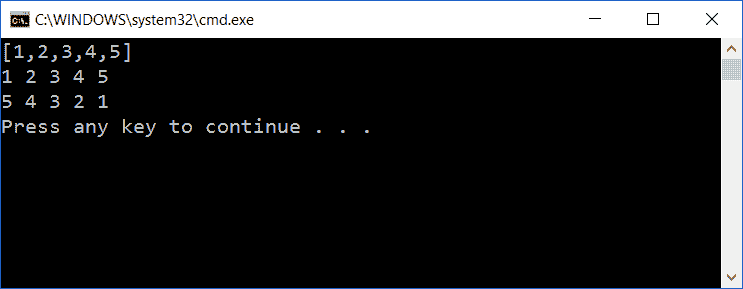
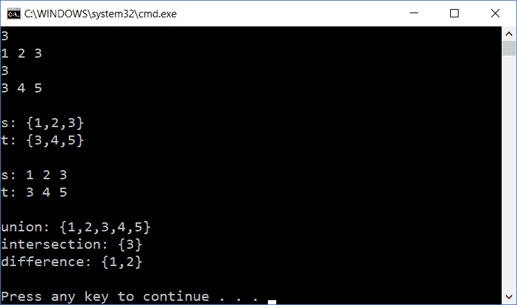

# 数据结构和算法

在上一章中，我们创建了 `stack` 和 `queue` 抽象数据类型的类。在这一章中，我们将继续 `list` 和 `set` 抽象数据类型。

类似于上一章中的栈和队列，列表是一个有序结构，有开始和结束。然而，可以在列表的任何位置添加和删除值。还可以遍历列表。

另一方面，集合是无序的值结构。我们只能说集合中是否存在某个值。我们无法说一个值相对于其他值有任何位置。

在这一章中，我们将探讨以下主题：

+   我们将从列表和集合类的相对简单且效率不高的版本开始。我们还将研究搜索和排序的基本算法。

+   然后，我们将继续创建列表和集合类的更高级版本，并研究更高级的搜索和排序算法。我们还将介绍新的概念，如模板、运算符重载、异常和引用重载。

我们还将研究搜索算法线性搜索，它适用于任何序列，有序和无序，但效率较低，以及二分搜索，它更有效，但仅适用于有序序列。

最后，我们将研究相对简单的排序算法，插入排序、选择排序和冒泡排序，以及更高级且更有效的归并排序和快速排序算法。

# The List class

`LinkedList` 类比栈和队列更复杂，它可以在列表的任何位置添加和删除值。还可以遍历列表。

# The Cell class

本节中的单元格是 `stack` 和 `queue` 节中的单元格的扩展。类似于它们，它包含一个值和一个指向下一个单元格的指针。然而，这个版本还包含一个指向前一个单元格的指针，这使得本节中的列表成为双向链表。

注意，构造函数是 `private` 的，这意味着单元格对象只能通过其自己的方法创建。然而，有一种方法可以绕过这种限制。我们可以定义一个类或函数作为 `LinkedList` 的朋友。这样，我们将 `LinkedList` 定义为 `Cell` 的朋友。这意味着 `LinkedList` 可以访问 `Cell` 的所有私有和受保护成员，包括构造函数，从而可以创建 `Cell` 对象。

**Cell.h:**

```cpp
class Cell { 
  private: 
    Cell(double value, Cell *previous, Cell *next); 
    friend class LinkedList; 

  public: 
    double getValue() const { return m_value; } 
    void setValue(double value) { m_value = value; } 

    Cell *getPrevious() const { return m_previous; } 
    void setPrevious(Cell *previous) { m_previous = previous; } 

    Cell *getNext() const { return m_next; } 
    void setNext(Cell *getNext) { m_next = getNext; } 

  private: 
    double m_value; 
    Cell *m_previous, *m_next; 
}; 
```

**Cell.cpp:**

```cpp
#include "Cell.h" 

Cell::Cell(double value, Cell *previous, Cell *next) 
 :m_value(value), 
  m_previous(previous), 
  m_next(next) { 
  // Empty. 
} 
```

# The Iterator class

在遍历列表时，我们需要一个迭代器，它被初始化为列表的开始，并逐步移动到其结束。类似于前面的单元格，`Iterator` 的构造函数是私有的，但我们也将 `LinkedList` 定义为 `Iterator` 的朋友。

**Iterator.h:**

```cpp
class Iterator { 
  private: 
    Iterator(Cell *cellPtr); 
    friend class LinkedList; 

  public: 
    Iterator(); 
```

第三个构造函数是一个`复制构造函数`。它接受另一个迭代器并将其复制。我们不能仅仅接受迭代器作为参数。相反，我们定义一个引用参数。`&`符号表示该参数是迭代器对象的引用，而不是迭代器对象本身。这样，迭代器的内存地址作为参数传递，而不是对象本身。我们还声明所引用的对象是常量，因此构造函数不能修改它。

在这种情况下，使用引用参数是必要的。如果我们定义了一个简单的迭代器对象作为参数，它将导致不确定的循环初始化。然而，在其他情况下，我们出于效率原因使用这种技术。传递对象地址所需的时间比复制对象本身作为参数所需的时间更少，并且需要的内存也更少：

```cpp
    Iterator(const Iterator& iterator); 

    double getValue() { return m_cellPtr->getValue(); } 
    void setValue(double value) { m_cellPtr->setValue(value); } 
```

`hasNext`方法返回`true`，如果迭代器尚未到达列表的末尾，`next`方法将迭代器向前移动一步，向列表的末尾移动，如下面的示例所示：

```cpp
    bool hasNext() const { return (m_cellPtr != nullptr); } 
    void next() { m_cellPtr = m_cellPtr->getNext(); } 
```

同样，`hasPrevious`方法返回`true`，如果迭代器尚未到达列表的开始，`previous`方法将迭代器向后移动一步，到列表的开始：

```cpp
    bool hasPrevious() const { return (m_cellPtr != nullptr); } 
    void previous() { m_cellPtr = m_cellPtr->getPrevious(); } 

  private: 
    Cell *m_cellPtr; 
}; 
```

**Iterator.cpp:**

```cpp
#include "Cell.h" 
#include "Iterator.h" 

Iterator::Iterator(Cell *cellPtr) 
 :m_cellPtr(cellPtr) { 
  // Empty. 
}  

Iterator::Iterator() 
 :m_cellPtr(nullptr) { 
  // Empty. 
} 

Iterator::Iterator(const Iterator& iterator) 
 :m_cellPtr(iterator.m_cellPtr) { 
  // Empty. 
} 
```

# `List`类

`LinkedList`类包含查找、添加、插入和删除值的方法，以及比较列表的方法。此外，它还包含读取和写入列表的方法，以及正向和反向遍历列表的方法。实际上，这是一个双向链表。我们可以从两个方向跟踪单元格的链接：从开始到结束，以及从结束到开始的反向：

**LinkedList.h:**

```cpp
class LinkedList { 
  public: 
    LinkedList(); 
```

`复制构造函数`和`assign`方法都复制给定的列表：

```cpp
    LinkedList(const LinkedList& list); 
    void assign(const LinkedList& list); 
```

析构函数释放链表中所有单元格分配的内存：

```cpp
    ~LinkedList(); 

    int size() const {return m_size;} 
    bool empty() const {return (m_size == 0);} 
```

`find`方法搜索`value`。如果找到`value`，则返回`true`并将`findIterator`设置为`value`的位置：

```cpp
    bool find(double value, Iterator& findIterator); 
```

`equal`和`notEqual`方法比较这个链表与给定的链表，如果它们相等或不相等，则分别返回`true`，如下面的代码片段所示：

```cpp
    bool equal(const LinkedList& list) const; 
    bool notEqual(const LinkedList& list) const; 
```

如果我们想在现有列表中添加一个值或另一个列表，`add`方法将值或另一个列表添加到列表的末尾，而`insert`方法将值或列表插入到迭代器指定的位置：

```cpp
    void add(double value); 
    void add(const LinkedList& list); 

    void insert(const Iterator& insertPosition, double value); 
    void insert(const Iterator& insertPosition, 
                const LinkedList& list); 
```

`erase`方法删除给定位置上的值，而`clear`方法删除列表中的所有值，如下面的示例所示：

```cpp
    void erase(const Iterator& erasePosition); 
    void clear(); 
```

`remove`方法从第一个迭代器到最后一个迭代器（包括）删除值。第二个参数是默认参数。这意味着该方法可以用一个或两个参数调用。如果只有一个参数，则第二个参数在声明中给出的值，在这种情况下是表示列表末尾位置一步之外的`Iterator(nullptr)`。这意味着当`remove`用一个迭代器调用时，从该迭代器（包括）到列表末尾的所有值都将被删除。`nullptr`指针实际上是一个特殊的指针，它被转换为它指向的类型或与之比较。在这种情况下，一个指向`Cell`的指针。非正式地说，我们可以称一个指针为 null，当它持有值`nullptr`时：

```cpp
    void remove(const Iterator& firstPosition, 
                const Iterator& lastPosition = Iterator(nullptr)); 
```

`first`和`last`方法返回位于列表第一个和最后一个值处的迭代器：

```cpp
    Iterator first() const { return Iterator(m_firstCellPtr); } 
    Iterator last() const { return Iterator(m_lastCellPtr); } 
```

`read`和`write`方法从输入文件流中读取列表的值并将其写入输出文件流。文件流用于与文件通信。请注意，我们在前面的章节中使用的`cin`和`cout`对象实际上是输入和输出流对象：

```cpp
    void read(istream& inStream); 
    void write(ostream& outStream); 
```

与前一部分的队列类似，该列表持有指向链表第一个和最后一个单元格的指针：

```cpp
  private: 
    int m_size; 
    Cell *m_firstCellPtr, *m_lastCellPtr; 
}; 
```

**LinkedList.cpp:**

```cpp
#include <IOStream> 
using namespace std; 

#include "Cell.h" 
#include "Iterator.h" 
#include "List.h" 

LinkedList::LinkedList() 
 :m_size(0), 
  m_firstCellPtr(nullptr), 
  m_lastCellPtr(nullptr) { 
  // Empty. 
} 
```

构造函数简单地调用`assign`来复制`list`参数的值：

```cpp
LinkedList::LinkedList(const LinkedList& list) { 
  assign(list); 
} 
```

`assign`方法将给定的列表复制到其自己的链表中：

```cpp
void LinkedList::assign(const LinkedList& list) { 
  m_size = 0; 
  m_firstCellPtr = nullptr; 
  m_lastCellPtr = nullptr; 
  Cell *listCellPtr = list.m_firstCellPtr;
  add(list);
} 
```

析构函数简单地调用`clear`来释放链表单元格分配的所有内存：

```cpp
LinkedList::~LinkedList() { 
  clear(); 
} 
```

`clear`方法遍历链表并释放每个单元格：

```cpp
void LinkedList::clear() { 
  Cell *currCellPtr = m_firstCellPtr; 
```

对于链表中的每个单元格，我们首先必须将其地址保存在`deleteCellPtr`中，然后在链表中前进，并释放该单元格。如果我们直接在`currCellPtr`上调用`delete`，那么接下来的`getNext`调用将不会工作，因为在这种情况下，我们会调用一个已释放对象的函数：

```cpp
  while (currCellPtr != nullptr) { 
    Cell *deleteCellPtr = currCellPtr; 
    currCellPtr = currCellPtr->getNext(); 
    delete deleteCellPtr; 
  } 
```

当列表变为空时，两个单元格指针都是 null，大小为零：

```cpp
  m_firstCellPtr = nullptr; 
  m_lastCellPtr = nullptr; 
  m_size = 0; 
} 
```

`find`方法遍历链表，设置`findIterator`，并在找到值时返回`true`。如果没有找到值，则返回`false`，并且`findIterator`保持不变。为了使这起作用，`findIterator`必须是一个`Iterator`对象的引用，而不是`Iterator`对象本身。一个`Iterator`对象的指针也会工作：

```cpp
bool LinkedList::find(double value, Iterator& findIterator) { 
  Iterator iterator = first(); 

  while (iterator.hasNext()) { 
    if (value == iterator.getValue()) { 
      findIterator = iterator; 
      return true; 
    } 

    iterator.next(); 
  } 

  return false; 
} 
```

如果两个列表的大小不同，它们不相等。同样，如果它们的大小相同，但值不同，它们也不相等：

```cpp
bool LinkedList::equal(const LinkedList& list) const { 
  if (m_size != list.m_size) { 
    return false; 
  } 

  Iterator thisIterator = first(), listIterator = list.first(); 

  while (thisIterator.hasNext()) { 
    if (thisIterator.getValue() != listIterator.getValue()) { 
      return false; 
    } 

    thisIterator.next(); 
    listIterator.next(); 
  } 
```

然而，如果列表持有相同的大小和相同的值，它们是相等的：

```cpp
  return true; 
} 
```

当我们需要决定两个列表是否不相等时，我们只需调用`equal`。感叹号（`!`）是逻辑非运算符，如下例所示：

```cpp
bool LinkedList::notEqual(const LinkedList& list) const { 
  return !equal(list); 
} 
```

当向列表添加值时，我们动态分配一个单元格：

```cpp
void LinkedList::add(double value) { 
  Cell *newCellPtr = new Cell(value, m_lastCellPtr, nullptr); 
```

如果第一个单元格指针为 null，我们将其设置为指向新单元格，因为列表为空：

```cpp
  if (m_firstCellPtr == nullptr) { 
    m_firstCellPtr = newCellPtr; 
  } 
```

然而，如果第一个单元格指针不为空，列表不为空，我们将最后一个单元格指针的下一个指针设置为指向新单元格：

```cpp
  else { 
    m_lastCellPtr->setNext(newCellPtr); 
  } 
```

无论哪种方式，我们都将最后一个单元格指针设置为指向新单元格，并增加列表的大小：

```cpp
  m_lastCellPtr = newCellPtr; 
  ++m_size; 
} 
```

# 向现有列表中添加列表

当向列表中添加整个列表时，我们对列表中的每个值所采取的行动与我们在`add`中添加单个值时相同。如果第一个单元格指针为空，我们动态分配一个新的单元格，并将其分配给指向新单元格。如果它不为空，我们将最后一个单元格指针的下一个指针设置为指向新单元格。无论哪种方式，我们都将最后一个单元格指针设置为指向新单元格：

```cpp
void LinkedList::add(const LinkedList& list) { 
  Cell *listCellPtr = list.m_firstCellPtr; 
```

`while`语句会一直重复，直到其条件为真。在这种情况下，只要我们没有到达列表的末尾：

```cpp
  while (listCellPtr != nullptr) { 
    double value = listCellPtr->getValue(); 
    Cell *newCellPtr = new Cell(value, m_lastCellPtr, nullptr);  
```

如果`m_firstList`为空，我们的链表仍然是空的，而`newCellPtr`指向新链表的第一个单元格。在这种情况下，我们让`m_firstList`指向新单元格：

```cpp
    if (m_firstCellPtr == nullptr) { 
      m_firstCellPtr = newCellPtr; 
    } 
```

如果`m_firstList`不为空，我们的列表不为空，且`m_firstList`不应被修改。相反，我们将`m_lastCellPtr`的下一个指针设置为指向新单元格：

```cpp
    else {       
      m_lastCellPtr->setNext(newCellPtr); 
    } 
```

无论哪种方式，都将最后一个单元格指针设置为新的单元格指针：

```cpp
    m_lastCellPtr = newCellPtr; 
```

最后，将列表单元格指针设置为指向其下一个单元格指针。最终，列表单元格指针将为空，`while`语句结束：

```cpp
    listCellPtr = listCellPtr->getNext(); 
  } 

  m_size += list.m_size; 
} 
```

当在迭代器给出的位置插入值时，我们将它的前指针设置为指向列表中该位置之前的单元格（如果位置是列表中的第一个，则该位置为空）。然后我们以与前面`add`方法相同的方式检查第一个单元格指针是否为空：

```cpp
void LinkedList::insert(const Iterator& insertPosition, 
                        double value) { 
  Cell *insertCellPtr = insertPosition.m_cellPtr; 
  Cell *newCellPtr = 
    new Cell(value, insertCellPtr->getPrevious(), insertCellPtr);  
  insertCellPtr->setPrevious(newCellPtr); 

  if (insertCellPtr == m_firstCellPtr) { 
    m_firstCellPtr = newCellPtr; 
  } 
  else { 
    newCellPtr->getPrevious()->setNext(newCellPtr); 
  } 

  ++m_size; 
} 
```

当插入列表时，我们首先检查位置是否表示空指针。在这种情况下，位置超出了我们列表的末尾，我们只需调用`add`：

```cpp
void LinkedList::insert(const Iterator& insertPosition, 
                        const LinkedList& list) { 
  Cell *insertCellPtr = insertPosition.m_cellPtr; 

  if (insertCellPtr == nullptr) { 
    add(list); 
  } 
  else { 
    Cell *firstInsertCellPtr = nullptr, 
         *lastInsertCellPtr = nullptr, 
         *listCellPtr = list.m_firstCellPtr; 

    while (listCellPtr != nullptr) { 
      Cell *newCellPtr = new Cell(listCellPtr->getValue(), 
                                  lastInsertCellPtr, nullptr); 

      if (firstInsertCellPtr == nullptr) { 
        firstInsertCellPtr = newCellPtr; 
      } 
      else { 
        lastInsertCellPtr->setNext(newCellPtr); 
      } 

      lastInsertCellPtr = newCellPtr; 
      listCellPtr = listCellPtr->getNext(); 
    } 
```

我们通过比较`firstInsertCellPtr`与`nullptr`来检查要插入的列表是否为空。由于`firstInsertCellPtr`指向列表的第一个值，如果它是空的，则列表为空：

```cpp
    if (firstInsertCellPtr != nullptr) { 
      if (insertCellPtr->getPrevious() != nullptr) { 
        insertCellPtr->getPrevious()->setNext(firstInsertCellPtr); 
        firstInsertCellPtr-> 
          setPrevious(insertCellPtr->getPrevious()); 
      } 
      else { 
        m_firstCellPtr = firstInsertCellPtr; 
      } 
    } 

    if (lastInsertCellPtr != nullptr) { 
      lastInsertCellPtr->setNext(insertCellPtr); 
      insertCellPtr->setPrevious(lastInsertCellPtr); 
    } 

    m_size += list.m_size; 
  } 
} 
```

# 从列表中删除值

`erase`方法简单地调用`remove`，并将给定位置作为其起始和结束位置：

```cpp
void LinkedList::erase(const Iterator& removePosition) { 
  remove(removePosition, removePosition); 
} 
```

当从列表中删除值时，我们遍历列表，并为要删除的每个值释放单元格：

```cpp
void LinkedList::remove(const Iterator& firstPosition, 
           const Iterator& lastPosition /*= Iterator(nullptr)*/) { 
  Cell *firstCellPtr = firstPosition.m_cellPtr, 
       *lastCellPtr = lastPosition.m_cellPtr; 
  lastCellPtr = (lastCellPtr == nullptr) 
                ? m_lastCellPtr : lastCellPtr; 

  Cell *previousCellPtr = firstCellPtr->getPrevious(), 
       *nextCellPtr = lastCellPtr->getNext(); 

  Cell *currCellPtr = firstCellPtr; 
  while (currCellPtr != nextCellPtr) { 
    Cell *deleteCellPtr = currCellPtr; 
    currCellPtr = currCellPtr->getNext(); 
    delete deleteCellPtr; 
    --m_size; 
  } 
```

当我们必须删除单元格时，我们有三种情况要考虑。如果第一个要移除的单元格之前的最后一个单元格不为空，这意味着在移除位置之前有列表的剩余部分，我们将它的下一个指针设置为指向移除位置之后的第一个单元格。如果第一个要移除的单元格之前的最后一个单元格为空，我们将第一个单元格指针设置为指向该单元格：

```cpp
  if (previousCellPtr != nullptr) { 
    previousCellPtr->setNext(nextCellPtr); 
  } 
  else { 
    m_firstCellPtr = nextCellPtr; 
  } 
```

我们对要移除的最后一个单元格之后的列表位置做同样的事情。如果有列表的剩余部分，我们将它的第一个单元格的前指针设置为指向移除部分之前的最后一个单元格：

```cpp
  if (nextCellPtr != nullptr) { 
    nextCellPtr->setPrevious(previousCellPtr); 
  } 
  else { 
    m_lastCellPtr = previousCellPtr; 
  } 
} 
```

当读取列表时，我们首先读取其`size`。然后读取值：

```cpp
void LinkedList::read(istream& inStream) { 
  int size; 
  inStream >> size; 

  int count = 0; 
  while (count < size) { 
    double value; 
    inStream >> value; 
    add(value); 
    ++count; 
  } 
} 
```

当写入列表时，我们以逗号分隔值，并用括号("`[`"和"`]`")括起来：

```cpp
void LinkedList::write(ostream& outStream) { 
  outStream << "["; 
  bool firstValue = true; 

  Iterator iterator = first(); 
  while (iterator.hasNext()) { 
    outStream << (firstValue ? "" : ",") << iterator.getValue(); 
    firstValue = false; 
    iterator.next(); 
  } 

  outStream << "]"; 
} 
```

我们通过添加一些值并正向和反向遍历来测试列表：

**Main.cpp:**

```cpp
#include <IOStream> 
using namespace std; 

#include "Cell.h" 
#include "Iterator.h" 
#include "List.h" 

void main() { 
  LinkedList list; 
  list.add(1); 
  list.add(2); 
  list.add(3); 
  list.add(4); 
  list.add(5); 
  list.write(cout); 
  cout << endl; 

  { Iterator iterator = list.first(); 
    while (iterator.hasNext()) { 
      cout << iterator.getValue() << " "; 
      iterator.next(); 
    } 
    cout << endl; 
  } 

  { Iterator iterator = list.last(); 
    while (iterator.hasPrevious()) { 
      cout << iterator.getValue() << " "; 
      iterator.previous(); 
    } 
    cout << endl; 
  } 
} 
```

当执行代码时，输出显示在命令窗口中：



# `Set`类

集合是一个无序的结构，不包含重复项。`Set`类是`LinkedList`的子类。请注意，继承是私有的，这导致`LinkedList`的所有公共和受保护成员在`Set`中都是私有的：

**Set.h:**

```cpp
class Set : private LinkedList { 
  public: 
    Set(); 
    Set(double value); 
    Set(const Set& set); 
    void assign(const Set& set); 
    ~Set(); 
```

`equal`方法如果集合包含这些值则返回`true`。请注意，我们不在意集合中的任何顺序：

```cpp
    bool equal(const Set& set) const; 
    bool notEqual(const Set& set) const; 
```

`exists`方法如果给定的值或给定集合中的每个值分别存在，则返回`true`：

```cpp
    bool exists(double value) const; 
    bool exists(const Set& set) const; 
```

`insert`方法插入给定的值或给定集合中的每个值。它只插入集合中尚未存在的值，因为集合不包含重复项：

```cpp
    bool insert(double value); 
    bool insert(const Set& set); 
```

`remove`方法如果存在，则移除给定的值或给定集合中的每个值：

```cpp
    bool remove(double value); 
    bool remove(const Set& set); 
```

`size`、`empty`和`first`方法简单地调用`LinkedList`中的对应方法。由于集合中没有顺序，因此覆盖`LinkedList`中的`end`方法是没有意义的：

```cpp
    int size() const { return LinkedList::size(); } 
    bool empty() const { return LinkedList::empty(); } 
    Iterator first() const { return LinkedList::first(); } 
```

`unionSet`、`intersection`和`difference`独立函数是`Set`的朋友，这意味着它们可以访问`Set`的所有私有和受保护成员：

我们不能将`unionSet`方法命名为`union`，因为在 C++中它是关键字：

注意，当一个类中的方法被标记为`friend`时，实际上它不是该类的方法，而是一个函数：

```cpp
    friend Set unionSet(const Set& leftSet, const Set& rightSet); 
    friend Set intersection(const Set& leftSet, 
                            const Set& rightSet); 
    friend Set difference(const Set& leftSet, 
                          const Set& rightSet); 
```

`read`和`write`方法以与`LinkedList`中的对应方法相同的方式读取和写入集合：

```cpp
    void read(istream& inStream); 
    void write(ostream& outStream); 
}; 
```

`unionSet`、`intersection`和`difference`函数是`Set`的朋友，它们在类定义外部声明：

```cpp
Set unionSet(const Set& leftSet, const Set& rightSet);
Set intersection(const Set& leftSet, const Set& rightSet);
Set difference(const Set& leftSet, const Set& rightSet);
```

**Set.cpp:**

```cpp
#include <IOStream> 
using namespace std; 

#include "..\ListBasic\Cell.h" 
#include "..\ListBasic\Iterator.h" 
#include "..\ListBasic\List.h" 
#include "Set.h" 
```

构造函数调用`LinkedList`中的对应函数。默认构造函数（无参数）实际上隐式调用`LinkedList`的默认构造函数：

```cpp
Set::Set() { 
  // Empty. 
} 

Set::Set(double value) { 
  add(value); 
} 

Set::Set(const Set& set) 
 :LinkedList(set) { 
  // Empty. 
} 
```

析构函数隐式调用`LinkedList`中的对应函数，从而释放与集合值关联的内存。在这种情况下，我们可以省略析构函数，使用以下代码调用`LinkedList`的析构函数：

```cpp
Set::~Set() { 
  // Empty. 
} 
```

`assign`方法简单地清除集合并添加给定的集合：

```cpp
void Set::assign(const Set& set) { 
  clear(); 
  add(set); 
} 
```

如果两个集合具有相同的`大小`，并且一个集合中的每个值都存在于另一个集合中，那么这两个集合是相等的。在这种情况下，另一个集合中的每个值也必须存在于第一个集合中：

```cpp
bool Set::equal(const Set& set) const { 
  if (size() != set.size()) { 
    return false; 
  } 

  Iterator iterator = first(); 
  while (iterator.hasNext()) { 
    if (!set.exists(iterator.getValue())) { 
      return false; 
    } 

    iterator.next(); 
  } 

  return true;          
} 

bool Set::notEqual(const Set& set) const { 
  return !equal(set); 
} 
```

`exists`方法使用`LinkedList`的迭代器遍历集合。如果找到该值，则返回`true`：

```cpp
bool Set::exists(double value) const { 
  Iterator iterator = first(); 

  while (iterator.hasNext()) { 
    if (value == iterator.getValue()) { 
      return true; 
    } 

    iterator.next(); 
  } 

  return false; 
} 
```

第二个`exists`方法遍历给定的集合，如果其中任何值不在集合中，则返回`false`。如果所有值都在集合中，则返回`true`：

```cpp
bool Set::exists(const Set& set) const { 
  Iterator iterator = set.first(); 

  while (iterator.hasNext()) { 
    if (!exists(iterator.getValue())) { 
      return false; 
    } 

    iterator.next(); 
  } 

  return true; 
} 
```

第一个 `insert` 方法如果值不在集合中则添加它：

```cpp
bool Set::insert(double value) { 
  if (!exists(value)) { 
    add(value); 
    return true; 
  } 

  return false; 
} 
```

第二个 `insert` 方法遍历给定的集合，通过调用第一个插入方法将每个值插入。这样，每个不在集合中已经存在的值都会被插入：

```cpp
bool Set::insert(const Set& set) { 
  bool inserted = false; 
  Iterator iterator = set.first(); 

  while (iterator.hasNext()) { 
    double value = iterator.getValue(); 

    if (insert(value)) { 
      inserted = true; 
    } 

    iterator.next(); 
  } 

  return inserted; 
} 
```

第一个 `remove` 方法移除值，如果它在集合中存在则返回 `true`。如果不存在，则返回 `false`：

```cpp
bool Set::remove(double value) { 
  Iterator iterator; 

  if (find(value, iterator)) { 
    erase(iterator); 
    return true; 
  } 

  return false; 
} 
```

第二个 `remove` 方法遍历给定的集合并移除其每个值。如果至少移除了一个值，则返回 `true`：

```cpp
bool Set::remove(const Set& set) { 
  bool removed = false; 
  Iterator iterator = set.first(); 

  while (iterator.hasNext()) { 
    double value = iterator.getValue(); 

    if (remove(value)) { 
      removed = true; 
    } 

    iterator.next(); 
  } 

  return removed; 
} 
```

# 并集、交集和差集操作

`unionSet` 函数创建一个以左侧集合初始化的结果集合，然后添加右侧集合：

```cpp
Set unionSet(const Set& leftSet, const Set& rightSet) { 
  Set result(leftSet); 
  result.insert(rightSet); 
  return result; 
} 
```

`intersection` 方法比 `union` 或 `difference` 方法稍微复杂一些。两个集合 A 和 B 的交集可以定义为它们的并集与它们的差集之差：

*A∩B=(A∪B)-((A-B)-(B-A))*

```cpp
Set intersection(const Set& leftSet, const Set& rightSet) { 
  return difference(difference(unionSet(leftSet, rightSet), 
                               difference(leftSet, rightSet)), 
                    difference(rightSet, leftSet)); 
} 
```

`difference` 方法创建一个结果集合，以左侧集合为基础，然后移除右侧集合：

```cpp
Set difference(const Set& leftSet, const Set& rightSet) { 
  Set result(leftSet); 
  result.remove(rightSet); 
  return result; 
} 
```

`read` 方法与 `LinkedList` 中的对应方法类似。然而，`insert` 被调用而不是 `add`。这样，就不会在集合中插入重复项：

```cpp
void Set::read(istream& inStream) { 
  int size; 
  inStream >> size; 

  int count = 0; 
  while (count < size) { 
    double value; 
    inStream >> value; 
    insert(value); 
    ++count; 
  } 
} 
```

`write` 方法与 `LinkedList` 中的对应方法类似。然而，集合是用括号 ("`{`" 和 "`}`") 而不是方括号 ("`[`" 和 "`]`") 括起来的：

```cpp
void Set::write(ostream& outStream) { 
  outStream << "{"; 
  bool firstValue = true; 
  Iterator iterator = first(); 

  while (iterator.hasNext()) { 
    outStream << (firstValue ? "" : ",") << iterator.getValue(); 
    firstValue = false; 
    iterator.next(); 
  } 

  outStream << "}"; 
} 
```

我们通过让用户输入两个集合并评估它们的并集、交集和差集来测试集合。

**Main.cpp:** 

```cpp
#include <IOStream> 
using namespace std; 

#include "..\ListBasic\Cell.h" 
#include "..\ListBasic\Iterator.h" 
#include "..\ListBasic\List.h" 
#include "Set.h" 

void main() { 
  Set s, t; 
  s.read(cin); 
  t.read(cin); 

  cout << endl << "s = "; 
  s.write(cout); 
  cout << endl; 

  cout << endl << "t = "; 
  t.write(cout); 
  cout << endl << endl; 

  cout << "union: "; 
  unionSet(s, t).write(cout); 
  cout << endl; 

  cout << "intersection: "; 
  unionSet(s, t).write(cout); 
  cout << endl; 

  cout << "difference: "; 
  unionSet(s, t).write(cout); 
  cout << endl; 
} 
```

# 基本搜索和排序

在本章中，我们还将研究一些搜索和排序算法。当使用线性搜索查找值时，我们只需从列表的开始遍历到结束。我们返回值的零基于索引，如果没有找到则返回负一。

**Search.h:** 

```cpp
int linarySearch(double value, const LinkedList& list); 
```

**Search.cpp:** 

```cpp
#include <IOStream> 
using namespace std; 

#include "..\ListBasic\Cell.h" 
#include "..\ListBasic\Iterator.h" 
#include "..\ListBasic\List.h" 
#include "Search.h" 

int linarySearch(double value, const LinkedList& list) { 
  int index = 0; 
```

我们使用列表的 `first` 方法来获取我们用来遍历列表的迭代器；`hasNext` 只要列表中还有另一个值就返回 `true`，`next` 将迭代器在列表中向前移动一步：

```cpp
  Iterator iterator = list.first(); 

  while (iterator.hasNext()) { 
    if (iterator.getValue() == value) { 
      return index; 
    } 

    ++index; 
    iterator.next(); 
  } 

  return -1; 
} 
```

现在我们研究选择排序、插入排序和冒泡排序算法。请注意，它们接受列表的引用，而不是列表本身，以便列表可以改变。还请注意，在这些情况下引用不是常量；如果它是常量，我们就无法对列表进行排序。

**Sort.h:** 

```cpp
void selectSort(LinkedList& list); 
void insertSort(LinkedList& list); 
void bubbleSort(LinkedList& list); 
```

**Sort.cpp:** 

```cpp
#include <IOStream> 
using namespace std; 

#include "..\ListBasic\Cell.h" 
#include "..\ListBasic\Iterator.h" 
#include "..\ListBasic\List.h" 
#include "Sort.h" 

void insert(double value, LinkedList& list); 
void swap(Iterator iterator1, Iterator iterator2); 
```

# 选择排序算法

选择排序算法相当简单，我们重复遍历列表直到它为空。在每次迭代中，我们找到最小的值，将其从列表中移除并添加到结果列表中。这样，结果列表最终将填充与列表相同的值。由于值是有序选择的，因此结果列表是有序的。最后，我们将结果列表赋值给原始列表：

```cpp
void selectSort(LinkedList& list) { 
  LinkedList result; 

  while (!list.empty()) { 
    Iterator minIterator = list.first(); 
    double minValue = minIterator.getValue(); 

    Iterator iterator = list.first(); 

    while (iterator.hasNext()) { 
      if (iterator.getValue() < minValue) { 
        minIterator = iterator; 
        minValue = iterator.getValue(); 
      } 

      iterator.next(); 
    } 

    list.erase(minIterator); 
    result.add(minValue); 
  } 

  list.assign(result); 
} 
```

# 插入排序算法

在插入排序算法中，我们遍历列表，并为每个值将其插入到结果列表中的适当位置。然后我们将结果列表赋值给原始列表：

```cpp
void insertSort(LinkedList& list) { 
  LinkedList result; 
  Iterator iterator = list.first(); 

  while (iterator.hasNext()) { 
    insert(iterator.getValue(), result); 
    iterator.next(); 
  } 

  list.assign(result); 
} 
```

`insert` 函数接受一个列表和一个值，并将该值放置在列表中的正确位置。它遍历列表，并将值放置在第一个小于它的值之前。如果列表中没有这样的值，该值将被添加到列表的末尾：

```cpp
void insert(double value, LinkedList& list) { 
  Iterator iterator = list.first(); 

  while (iterator.hasNext()) { 
    if (value < iterator.getValue()) { 
      list.insert(iterator, value); 
      return; 
    } 

    iterator.next(); 
  } 

  list.add(value); 
} 
```

# 冒泡排序算法

冒泡排序算法逐对比较值，如果它们出现在错误的位置，则允许它们交换位置。在第一次迭代之后，我们知道最大的值位于列表的末尾。因此，我们不需要第二次遍历整个列表，可以省略最后一个值。这样，我们最多遍历列表的值数减一，因为当除了第一个值之外的所有值都位于其正确的位置时，第一个值也位于其正确的位置。然而，列表可能在那时已经正确排序。因此，我们在每次迭代后检查是否有任何一对值被交换。如果没有，则列表已经正确排序，我们可以退出算法：

```cpp
void bubbleSort(LinkedList& list) { 
  int listSize = list.size(); 

  if (listSize > 1) { 
    int currSize = listSize - 1; 
    int outerCount = 0; 
    while (outerCount < (listSize - 1)) { 
      Iterator currIterator = list.first(); 
      Iterator nextIterator = currIterator; 
      nextIterator.next(); 
      bool changed = false; 

      int innerCount = 0; 
      while (innerCount < currSize) { 
        if (currIterator.getValue() > nextIterator.getValue()) { 
          swap(currIterator, nextIterator); 
          changed = true; 
        } 

        ++innerCount; 
        currIterator.next(); 
        nextIterator.next(); 
      } 

      if (!changed) { 
        break; 
      } 

      --currSize; 
      ++outerCount; 
    } 
  } 
} 
```

`swap` 函数交换由迭代器给出的位置的值：

```cpp
void swap(Iterator iterator1, Iterator iterator2) { 
  double tempValue = iterator1.getValue(); 
  iterator1.setValue(iterator2.getValue()); 
  iterator2.setValue(tempValue); 
} 
```

我们通过向列表中添加一些值并排序列表来测试这些算法。

**Main.cpp:**

```cpp
#include <IOStream> 
#include <CStdLib> 

using namespace std; 

#include "..\ListBasic\Cell.h" 
#include "..\ListBasic\Iterator.h" 
#include "..\ListBasic\List.h" 

#include "Search.h" 
#include "Sort.h" 

void main() { 
  cout << "LinkedList" << endl; 

  LinkedList list; 
  list.add(9); 
  list.add(7); 
  list.add(5); 
  list.add(3); 
  list.add(1); 

  list.write(cout); 
  cout << endl; 
```

我们使用 `iterator` 类遍历列表，并对列表中的每个值调用 `linarySearch`：

```cpp
  Iterator iterator = list.first(); 
  while (iterator.hasNext()) { 
    cout << "<" << iterator.getValue() << "," 
         << linarySearch(iterator.getValue(), list) << "> "; 
    iterator.next(); 
  } 
```

我们还测试了列表中不存在的值的搜索算法，它们的索引将是负一：

```cpp
  cout << "<0," << linarySearch(0, list) << "> "; 
  cout << "<6," << linarySearch(6, list) << "> "; 
  cout << "<10," << linarySearch(10, list) << ">" 
       << endl; 
```

我们通过冒泡排序、选择排序和插入排序算法对列表进行排序：

```cpp
  cout << "Bubble Sort "; 
  bubbleSort(list); 
  list.write(cout); 
  cout << endl; 

  cout << "Select Sort "; 
  selectSort(list); 
  list.write(cout); 
  cout << endl; 

  cout << "Insert Sort "; 
  insertSort(list); 
  list.write(cout); 
  cout << endl; 
} 
```

将搜索和排序算法进行分类的一种方法是用大 O 表示法。非正式地说，该表示法关注最坏的情况。在插入排序的情况下，我们为每个值遍历列表一次，并且可能需要为每个值遍历整个列表以找到其正确的位置。同样，在选择排序的情况下，我们为每个值遍历列表一次，并且可能需要为每个值遍历整个列表。

最后，在冒泡排序的情况下，我们为每个值遍历列表一次，并且可能需要为每个值遍历整个列表。在所有三种情况下，我们可能需要在包含 *n* 个值的列表上执行 *n*² 次操作。因此，插入、选择和冒泡排序算法在时间效率方面具有大-O *n*²，或 O (*n*²)。然而，当涉及到空间效率时，冒泡排序更好，因为它在同一个列表上操作，而插入和选择排序则需要额外的列表来存储排序后的列表。

# 扩展的 List 类

在本节中，我们将重新审视 `LinkedList` 类。然而，我们将以几种方式扩展它：

+   `Cell` 类有一组 `set` 和 `get` 方法。相反，我们将每个对替换为一对重载的引用方法。

+   之前的列表只能存储`double`类型的值。现在我们将列表定义为`template`，这样它就可以存储任意类型的值。

+   我们将用重载运算符替换一些方法。

+   `Cell`和`Iterator`原本是独立类。现在我们将它们定义为`LinkedList`内部的内部类：

**List.h:** 

```cpp
class OutOfMemoryException : public exception { 
  // Empty. 
}; 
```

在前几节的课程中，列表存储的是`double`类型的值。然而，在这些类中，我们不再使用`double`，而是使用模板类型`T`，它是一种泛型类型，可以被任何任意类型实例化。本节中的`LinkedList`类是`template`的，具有泛型类型`T`：

```cpp
template <class T> 
class LinkedList { 
  private: 
    class Cell { 
      private: 
        Cell(const T& value, Cell* previous, Cell* next); 
```

`value`方法有两个重载版本。第一个版本是常量版本，返回一个常量值。另一个版本不是常量版本，返回值的引用。这样，就可以将值赋给单元格的值，如下面的示例所示：

```cpp
      public: 
        const T value() const { return m_value; } 
        T& value() { return m_value; } 
```

`Cell*&`构造意味着方法返回一个指向`Cell`对象的指针的引用。然后，可以使用这个引用将新值赋给指针：

```cpp
        const Cell* previous() const { return m_previous; } 
        Cell*& previous() { return m_previous; } 

        const Cell* next() const { return m_next; } 
        Cell*& next() { return m_next; } 

        friend class LinkedList; 

    private: 
      T m_value; 
      Cell *m_previous, *m_next; 
  }; 

  public: 
    class Iterator { 
      public: 
        Iterator(); 

      private: 
        Iterator(Cell* cellPtr); 

      public: 
        Iterator(const Iterator& iterator); 
        Iterator& operator=(const Iterator& iterator); 
```

我们用重载的相等和不等运算符替换了`equal`和`notEqual`：

```cpp
        bool operator==(const Iterator& iterator); 
        bool operator!=(const Iterator& iterator); 
```

我们还用增量（`++`）和减量（`--`）运算符替换了增量方法和减量方法。每个运算符有两种版本——前缀和后缀。不带参数的版本是前缀版本（`++i`和`--i`），带有整数参数的版本是后缀版本（`i++`和`i--`）。请注意，实际上我们没有传递整数参数给运算符。参数只包含在内以区分两个版本，并且被编译器忽略：

```cpp
        bool operator++();    // prefix: ++i 
        bool operator++(int); // postfix: i++ 

        bool operator--();    // prefix: --i 
        bool operator--(int); // postfix: i-- 
```

我们用两个重载的解引用运算符（`*`）替换了`getValue`和`setValue`方法。它们的工作方式与前面`Cell`类中的`value`方法类似。第一个版本是常量版本，返回一个值，而第二个版本不是常量版本，返回值的引用：

```cpp
        T operator*() const; 
        T& operator*(); 

        friend class LinkedList; 

      private: 
        Cell *m_cellPtr; 
    }; 
```

# `ReverseIterator`类

为了从末尾到开头以及从开头到末尾进行迭代，我们添加了`ReverseIterator`。它与之前使用的`Iterator`几乎相同；唯一的区别是增量运算符和减量运算符的方向相反：

```cpp
    class ReverseIterator { 
      public: 
        ReverseIterator(); 

      private: 
        ReverseIterator(Cell* cellPtr); 

      public: 
        ReverseIterator(const ReverseIterator& iterator); 
        const ReverseIterator& 
              operator=(const ReverseIterator& iterator); 

        bool operator==(const ReverseIterator& iterator); 
        bool operator!=(const ReverseIterator& iterator); 

        bool operator++();    // prefix: ++i 
        bool operator++(int); // postfix: i++ 

        bool operator--(); 
        bool operator--(int); 

        T operator*() const; 
        T& operator*(); 

        friend class LinkedList; 

      private: 
        Cell *m_cellPtr; 
  }; 

  public: 
    LinkedList(); 
    LinkedList(const LinkedList& list); 
    LinkedList& operator=(const LinkedList& list); 
    ~LinkedList(); 
    void clear(); 

    int size() const {return m_size;} 
    bool empty() const {return (m_size == 0);} 

    bool operator==(const LinkedList& list) const; 
    bool operator!=(const LinkedList& list) const; 

    void add(const T& value); 
    void add(const LinkedList& list); 

    void insert(const Iterator& insertPosition, const T& value); 
    void insert(const Iterator& insertPosition, 
                const LinkedList& list); 

    void erase(const Iterator& erasePosition); 
    void remove(const Iterator& firstPosition, 
                const Iterator& lastPosition = Iterator(nullptr)); 
```

在前面的章节中，只有`first`和`last`方法，它们返回一个迭代器。在本节中，使用`begin`和`end`方法进行正向迭代，而`rbegin`和`rend`（表示反向开始和反向结束）用于反向迭代：

```cpp
    Iterator begin() const { return Iterator(m_firstCellPtr); } 
    Iterator end() const { return Iterator(nullptr); } 
    ReverseIterator rbegin() const 
      {return ReverseIterator(m_lastCellPtr);} 
    ReverseIterator rend() const 
      { return ReverseIterator(nullptr); } 
```

我们用重载的输入和输出流运算符替换了`read`和`write`方法。由于它们是函数而不是方法，它们需要自己的模板标记：

```cpp
    template <class U> 
    friend istream& operator>>(istream& outStream, 
                               LinkedList<U>& list); 

    template <class U> 
    friend ostream& operator<<(ostream& outStream, 
                               const LinkedList<U>& list); 

  private: 
    int m_size; 
    Cell *m_firstCellPtr, *m_lastCellPtr; 
}; 
```

注意，当我们实现`template`类的成员函数时，我们是在头文件中实现的。因此，在实现`template`类时，我们不需要实现文件。

与类定义类似，方法定义必须以 `template` 关键字开头。请注意，类名 `LinkedList` 后跟类型标记 `<T>`：

```cpp
template <class T> 
LinkedList<T>::Cell::Cell(const T& value, Cell* previous, 
                          Cell* next) 
 :m_value(value), 
  m_previous(previous), 
  m_next(next) { 
  // Empty. 
} 

template <class T> 
LinkedList<T>::Iterator::Iterator() 
 :m_cellPtr(nullptr) { 
  // Empty. 
}  
```

注意，当我们实现内部类的方法时，我们需要在实现中包含外部类（`LinkedList`）和内部类（`Cell`）的名称：

```cpp
template <class T> 
LinkedList<T>::Iterator::Iterator(Cell* cellPtr) 
 :m_cellPtr(cellPtr) { 
  // Empty. 
}  

template <class T> 
LinkedList<T>::Iterator::Iterator(const Iterator& position) 
 :m_cellPtr(position.m_cellPtr) { 
  // Empty. 
} 
```

由于 `LinkedList` 是一个 `template` 类，编译器并不知道其内部类 `Iterator` 实际上是一个类。就编译器所知，迭代器可能是一个类型、一个值或一个类。因此，我们需要通过使用 `typename` 关键字来通知编译器：

```cpp
template <class T> 
typename LinkedList<T>::Iterator& 
LinkedList<T>::Iterator::operator=(const Iterator& iterator) { 
  m_cellPtr = iterator.m_cellPtr; 
  return *this; 
} 
```

以下运算符版本与之前版本 `LinkedList` 中的方法对应方式相同。也就是说，`equal` 方法已被等式运算符（`operator==`）所取代，而 `notEqual` 方法已被不等式运算符（`operator!=`）所取代：

```cpp
template <class T> 
bool LinkedList<T>::Iterator::operator==(const Iterator&position){ 
  return (m_cellPtr == position.m_cellPtr); 
} 

template <class T> 
bool LinkedList<T>::Iterator::operator!=(const Iterator&position){ 
  return !(*this == position); 
} 
```

增量运算符已被前缀和后缀版本的 `operator++` 所取代。它们之间的区别在于，前缀版本不接收任何参数，而后缀版本接收一个整数参数作为参数。请注意，整数参数不会被运算符使用。它的值是未定义的（然而，通常设置为零）并且总是被忽略。它的存在只是为了区分前缀和后缀情况：

```cpp
template <class T> 
bool LinkedList<T>::Iterator::operator++() { 
  if (m_cellPtr != nullptr) { 
    m_cellPtr = m_cellPtr->next(); 
    return true; 
  } 

  return false; 
} 

template <class T> 
bool LinkedList<T>::Iterator::operator++(int) { 
  if (m_cellPtr != nullptr) { 
    m_cellPtr = m_cellPtr->next(); 
    return true; 
  } 

  return false; 
} 
```

`decrease` 运算符也有前缀和后缀版本，其工作方式与 `increase` 运算符类似：

```cpp
template <class T> 
bool LinkedList<T>::Iterator::operator--() { 
  if (m_cellPtr != nullptr) { 
    m_cellPtr = m_cellPtr->previous(); 
    return true; 
  } 

  return false; 
} 

template <class T> 
bool LinkedList<T>::Iterator::operator--(int) { 
  if (m_cellPtr != nullptr) { 
    m_cellPtr = m_cellPtr->previous(); 
    return true; 
  } 

  return false; 
} 
```

取引用运算符也有两种版本。第一种是常量版本，返回一个值。第二种版本不是常量版本，返回对值的引用，而不是值本身。这样，第一种版本可以在常量对象上调用，在这种情况下，我们不允许更改其值。第二种版本只能在非常量对象上调用，我们可以通过将新值赋给方法返回的值来更改值：

```cpp
template <class T> 
T LinkedList<T>::Iterator::operator*() const { 
  return m_cellPtr->value(); 
} 

template <class T> 
T& LinkedList<T>::Iterator::operator*() { 
  return m_cellPtr->value(); 
} 
```

`ReverseIterator` 类有三个构造函数。第一个构造函数是一个默认构造函数，第二个构造函数使用一个 `Cell` 指针进行初始化，第三个构造函数是一个 `copy` 构造函数。它接受另一个 `ReverseIterator` 对象的引用，并初始化 `Cell` 指针：

```cpp
template <class T> 
LinkedList<T>::ReverseIterator::ReverseIterator() 
 :m_cellPtr(nullptr) { 
  // Empty. 
}  

template <class T> 
LinkedList<T>::ReverseIterator::ReverseIterator(Cell* currCellPtr) 
 :m_cellPtr(currCellPtr) { 
  // Empty. 
}  

template <class T> 
LinkedList<T>::ReverseIterator::ReverseIterator 
                                (const ReverseIterator& position) 
 :m_cellPtr(position.m_cellPtr) { 
  // Empty. 
} 
```

等于运算符使用给定 `ReverseIterator` 对象引用的 `Cell` 指针初始化 `Cell` 指针：

```cpp
template <class T> 
const typename LinkedList<T>::ReverseIterator& 
LinkedList<T>::ReverseIterator::operator=(const ReverseIterator& position) { 
  m_cellPtr = position.m_cellPtr; 
  return *this; 
} 
```

两个反向迭代器相等，如果它们的单元格指针指向相同的单元格：

```cpp
template <class T> 
bool LinkedList<T>::ReverseIterator::operator== 
                           (const ReverseIterator& position) { 
  return (m_cellPtr == position.m_cellPtr); 
} 

template <class T> 
bool LinkedList<T>::ReverseIterator::operator!= 
                           (const ReverseIterator& position) { 
  return !(*this == position); 
} 
```

`Iterator` 和 `ReverseIterator` 类的增量运算符和减量运算符之间的区别在于，在 `Iterator` 中，增量运算符调用 `next`，而 `decrement` 运算符调用 `Cell` 中的 `previous`。在 `ReverseIterator` 中情况相反：增量运算符调用 `previous`，而减量运算符调用 `next`。正如其名称所暗示的：`Iterator` 向前迭代，而 `ReverseIterator` 向后迭代：

```cpp
template <class T> 
bool LinkedList<T>::ReverseIterator::operator++() { 
  if (m_cellPtr != nullptr) { 
    m_cellPtr = m_cellPtr->previous(); 
    return true; 
  } 

  return false; 
} 

template <class T> 
bool LinkedList<T>::ReverseIterator::operator++(int) { 
  if (m_cellPtr != nullptr) { 
    m_cellPtr = m_cellPtr->previous(); 
    return true; 
  } 

  return false; 
} 

template <class T> 
bool LinkedList<T>::ReverseIterator::operator--() { 
  if (m_cellPtr != nullptr) { 
    m_cellPtr = m_cellPtr->next(); 
    return true; 
  } 

  return false; 
} 

template <class T> 
bool LinkedList<T>::ReverseIterator::operator--(int) { 
  if (m_cellPtr != nullptr) { 
    m_cellPtr = m_cellPtr->next(); 
    return true; 
  } 

  return false; 
} 

template <class T> 
T LinkedList<T>::ReverseIterator::operator*() const { 
  return m_cellPtr->value(); 
} 

template <class T> 
T& LinkedList<T>::ReverseIterator::operator*() { 
  return m_cellPtr->value(); 
} 
```

`LinkedList`的默认构造函数将列表初始化为空，第一个和最后一个单元格的指针设置为 null：

```cpp
template <class T> 
LinkedList<T>::LinkedList() 
 :m_size(0), 
  m_firstCellPtr(nullptr), 
  m_lastCellPtr(nullptr) { 
  // Empty. 
} 

template <class T> 
LinkedList<T>::LinkedList(const LinkedList<T>& list) { 
 *this = list; 
} 
```

赋值操作符以与非模板方法相同的方式复制给定列表的值：

```cpp
template <class T> 
LinkedList<T>& LinkedList<T>::operator=(const LinkedList<T>&list){ 
  m_size = 0; 
  m_firstCellPtr = nullptr; 
  m_lastCellPtr = nullptr; 

  if (list.m_size > 0) { 
    for (Cell *listCellPtr = list.m_firstCellPtr, 
              *nextCellPtr = list.m_lastCellPtr->next(); 
         listCellPtr != nextCellPtr; 
         listCellPtr = listCellPtr->next()) { 
      Cell *newCellPtr = new Cell(listCellPtr->value(), 
                                  m_lastCellPtr, nullptr); 

      if (m_firstCellPtr == nullptr) { 
        m_firstCellPtr = newCellPtr; 
      } 
```

注意，我们使用`next`方法的引用版本，这允许我们将值分配给方法调用。由于`next`返回单元格下一个指针的引用，我们可以将`newCellPtr`的值分配给该指针：

```cpp
      else { 
        m_lastCellPtr->next() = newCellPtr; 
      } 

      m_lastCellPtr = newCellPtr; 
      ++m_size; 
    } 
  } 

  return *this; 
} 
```

析构函数简单地调用`clear`方法，该方法遍历链表并删除每个单元格：

```cpp
template <class T> 
LinkedList<T>::~LinkedList() { 
  clear(); 
} 

template <class T> 
void LinkedList<T>::clear() { 
  Cell *currCellPtr = m_firstCellPtr; 

  while (currCellPtr != nullptr) { 
    Cell *deleteCellPtr = currCellPtr; 
    currCellPtr = currCellPtr->next(); 
    delete deleteCellPtr; 
  } 
```

当单元格被删除时，第一个和最后一个单元格的指针被设置为 null：

```cpp
  m_size = 0; 
  m_firstCellPtr = nullptr; 
  m_lastCellPtr = nullptr; 
} 
```

如果两个列表具有相同的大小，并且它们的单元格包含相同的值，则这两个列表相等：

```cpp
template <class T> 
bool LinkedList<T>::operator==(const LinkedList<T>& list) const { 
  if (m_size != list.m_size) { 
    return false; 
  } 

  for (Iterator thisIterator = begin(), 
                listIterator = list.begin(); 
       thisIterator != end(); ++thisIterator, ++listIterator) { 
    if (*thisIterator != *listIterator) { 
      return false; 
    } 
  } 

  return true; 
} 

template <class T> 
bool LinkedList<T>::operator!=(const LinkedList<T>& list) const { 
  return !(*this == list); 
} 
```

`add`方法在列表末尾添加一个具有新值的单元格，如下例所示：

```cpp
template <class T> 
void LinkedList<T>::add(const T& value) { 
  Cell *newCellPtr = new Cell(value, m_lastCellPtr, nullptr); 

  if (m_lastCellPtr == nullptr) { 
    m_firstCellPtr = newCellPtr; 
    m_lastCellPtr = newCellPtr; 
  } 
  else { 
    m_lastCellPtr->next() = newCellPtr; 
    m_lastCellPtr = newCellPtr; 
  } 

  ++m_size; 
} 
```

`add`的第二个版本将给定的列表添加到列表的末尾，如下例所示：

```cpp
template <class T> 
void LinkedList<T>::add(const LinkedList<T>& list) { 
  for (Cell *listCellPtr = list.m_firstCellPtr; 
       listCellPtr != nullptr; listCellPtr = listCellPtr->next()){ 
    const T& value = listCellPtr->value(); 
    Cell *newCellPtr = new Cell(value, m_lastCellPtr, nullptr); 

    if (m_lastCellPtr == nullptr) { 
      m_firstCellPtr = newCellPtr; 
    } 
    else {       
      m_lastCellPtr->next() = newCellPtr; 
    } 

    m_lastCellPtr = newCellPtr; 
  } 

  m_size += list.m_size; 
} 
```

`insert`方法在给定位置添加一个值或一个列表：

```cpp
template <class T> 
void LinkedList<T>::insert(const Iterator& insertPosition, 
                           const T& value) { 
  if (insertPosition.m_cellPtr == nullptr) { 
    add(value); 
  } 
  else { 
    Cell *insertCellPtr = insertPosition.m_cellPtr; 
    Cell *newCellPtr = 
      new Cell(value, insertCellPtr->previous(), insertCellPtr); 

    insertCellPtr->previous() = newCellPtr; 

    if (insertCellPtr == m_firstCellPtr) { 
      m_firstCellPtr = newCellPtr; 
    } 
    else { 
      newCellPtr->previous()->next() = newCellPtr; 
    } 

    ++m_size; 
  } 
} 

template <class T> 
void LinkedList<T>::insert(const Iterator& insertPosition, 
                           const LinkedList<T>& list) { 
  if (insertPosition.m_cellPtr == nullptr) { 
    add(list); 
  } 
  else { 
    Cell *insertCellPtr = insertPosition.m_cellPtr; 

    Cell *firstInsertCellPtr = nullptr, 
         lastInsertCellPtr = nullptr; 
    for (Cell *listCellPtr = list.m_firstCellPtr; 
         listCellPtr != nullptr;listCellPtr=listCellPtr->next()) { 
      double value = listCellPtr->value(); 
      Cell *newCellPtr = 
        new Cell(value, lastInsertCellPtr, nullptr); 

      if (firstInsertCellPtr == nullptr) { 
        firstInsertCellPtr = newCellPtr; 
      } 
      else { 
        lastInsertCellPtr->next() = newCellPtr; 
      } 

      lastInsertCellPtr = newCellPtr; 
    } 

    if (firstInsertCellPtr != nullptr) { 
      if (insertCellPtr->previous() != nullptr) { 
        insertCellPtr->previous()->next() = firstInsertCellPtr; 
        firstInsertCellPtr->previous() = 
          insertCellPtr->previous(); 
      } 
      else { 
        m_firstCellPtr = firstInsertCellPtr; 
      } 
    } 

    if (lastInsertCellPtr != nullptr) { 
      lastInsertCellPtr->next() = insertCellPtr; 
      insertCellPtr->previous() = lastInsertCellPtr; 
    } 

    m_size += list.m_size; 
  } 
} 

```

`erase`和`remove`方法从列表中移除子列表的值：

```cpp
template <class T> 
void LinkedList<T>::erase(const Iterator& removePosition) { 
  remove(removePosition, removePosition); 
} 

template <class T> 
void LinkedList<T>::remove(const Iterator& firstPosition, 
           const Iterator& lastPosition /*= Iterator(nullptr)*/) { 
  Cell *firstCellPtr = firstPosition.m_cellPtr, 
      *lastCellPtr = lastPosition.m_cellPtr; 
  lastCellPtr = (lastCellPtr == nullptr) 
                ? m_lastCellPtr : lastCellPtr; 

  Cell *previousCellPtr = firstCellPtr->previous(), 
      *nextCellPtr = lastCellPtr->next(); 

  Cell *currCellPtr = firstCellPtr; 
  while (currCellPtr != nextCellPtr) { 
    Cell *deleteCellPtr = currCellPtr; 
    currCellPtr = currCellPtr->next(); 
    delete deleteCellPtr; 
    --m_size; 
  } 

  if (previousCellPtr != nullptr) { 
    previousCellPtr->next() = nextCellPtr;   
  } 
  else { 
    m_firstCellPtr = nextCellPtr; 
  } 

  if (nextCellPtr != nullptr) { 
    nextCellPtr->previous() = previousCellPtr; 
  } 
  else { 
    m_lastCellPtr = previousCellPtr; 
  } 
} 
```

输入流操作符首先读取列表的`size`，然后读取值本身：

```cpp
template <class T> 
istream& operator>>(istream& inStream, LinkedList<T>& list) { 
  int size; 
  inStream >> size; 

  for (int count = 0; count < size; ++count) { 
    T value; 
    inStream >> value; 
    list.add(value); 
  } 

  return inStream; 
} 
```

输出流操作符将列表写入给定的流中，列表被括号包围，并且值之间用逗号分隔：

```cpp
template <class T> 
ostream& operator<<(ostream& outStream,const LinkedList<T>& list){ 
  outStream << "["; 

  bool first = true; 
  for (const T& value : list) { 
    outStream << (first ? "" : ",") << value; 
    first = false; 
  } 

  outStream << "]"; 
  return outStream; 
} 
```

我们通过让用户输入一个列表，然后自动使用`for`语句以及手动使用前向和后向迭代器来迭代该列表，来测试`LinkedList`类。

**Main.cpp:**

```cpp
#include <IOStream> 
#include <Exception> 
using namespace std; 

#include "List.h" 

void main() { 
  LinkedList<double> list; 
  cin >> list; 
  cout << list <&amp;lt; endl; 
```

注意，可以直接在列表上使用`for`语句，因为扩展的列表包含`begin`方法，该方法返回一个具有前缀增量（`++`）和解除引用（`*`）操作符的迭代器：

```cpp
  for (double value : list) { 
    cout << value << " "; 
  } 
  cout << endl; 
```

我们还可以使用`Iterator`类的`begin`和`end`方法手动遍历列表：

```cpp
  for (LinkedList<double>::Iterator iterator = list.begin(); 
       iterator != list.end(); ++iterator) { 
    cout << *iterator << " "; 
  } 
  cout << endl; 
```

使用`rbegin`和`rend`方法以及`ReverseIterator`类，我们可以从其末尾迭代到其开头。注意，我们仍然使用增量（`++`）而不是减量（`--`），尽管我们正在反向遍历列表：

```cpp
  for (LinkedList<double>::ReverseIterator iterator = 
       list.rbegin(); iterator != list.rend(); ++iterator) { 
    cout << *iterator << " "; 
  } 
  cout << endl; 
} 
```

# 扩展的`Set`类

与前一个章节的版本相比，本节中的`Set`类在三个方面进行了扩展：

+   集合被存储为有序列表，这使得一些方法更有效

+   该类是一个模板；只要这些类型支持排序，它就可以存储任意类型的值

+   该类具有操作符重载，这（希望）使得它更容易且更直观地使用

在 C++ 中，我们可以使用 `typedef` 关键字定义自己的类型。我们将 `Set` 的 `Iterator` 定义为与 `LinkedList` 中的相同迭代器。在前面的小节中，`Iterator` 是一个独立的类，我们可以在处理集合时重用它。然而，在本节中，`Iterator` 是一个内部类。否则，在处理集合时无法访问 `LinkedList`，因为 `Set` 是私有继承 `LinkedList` 的。记住，当我们私有继承时，基类的所有方法和字段都成为子类的私有成员。

**Set.h:**

```cpp
template <class T> 
class Set : private LinkedList<T> { 
  public: 
    typedef LinkedList<T>::Iterator Iterator; 

    Set(); 
    Set(const T& value); 
    Set(const Set& set); 
    Set& operator=(const Set& set); 
    ~Set(); 
```

我们用重载的比较运算符替换 `equal` 和 `notEqual` 方法。这样，就可以像比较两个整数一样比较两个集合：

```cpp
    bool operator==(const Set& set) const; 
    bool operator!=(const Set& set) const; 

    int size() const { return LinkedList<T>::size(); } 
    bool empty() const { return LinkedList<T>::empty(); } 
    Iterator begin() const { return LinkedList<T>::begin(); } 
```

我们用加法、乘法和减法运算符替换 `unionSet`、`intersection` 和 `difference` 方法：

```cpp
    Set operator+(const Set& set) const; 
    Set operator*(const Set& set) const; 
    Set operator-(const Set& set) const; 
```

`merge` 函数由集合方法调用以执行集合的高效合并。由于它是一个函数而不是方法，它必须有自己的模板标记：

```cpp
  private: 
    template <class U> 
    friend Set<U> 
      merge(const Set<U>& leftSet, const Set<U>& rightSet, 
            bool addLeft, bool addEqual, bool addRight); 

  public: 
    Set& operator+=(const Set& set); 
    Set& operator*=(const Set& set); 
    Set& operator-=(const Set& set); 
```

与前面的 `LinkedList` 类类似，我们用重载的流运算符替换 `read` 和 `write` 方法。由于它们也是函数而不是方法，它们也需要自己的模板标记：

```cpp
    template <class U> 
    friend istream& operator>>(istream& inStream, Set<U>& set); 

    template <class U> 
    friend ostream& operator<<(ostream& outStream, 
                               const Set<U>& set); 
}; 
```

与非模板版本相比，构造函数看起来几乎相同：

```cpp
template <class T> 
Set<T>::Set() { 
  // Empty. 
} 

template <class T> 
Set<T>::Set(const T& value) { 
  add(value); 
} 

template <class T> 
Set<T>::Set(const Set& set) 
 :LinkedList(set) { 
  // Empty. 
} 

template <class T> 
Set<T>::~Set() { 
  // Empty. 
} 

template <class T> 
Set<T>& Set<T>::operator=(const Set& set) { 
  clear(); 
  add(set); 
  return *this; 
} 
```

在测试两个集合是否相等时，我们可以直接在 `LinkedList` 中调用等号运算符，因为本节中的集合是有序的：

```cpp
template <class T> 
bool Set<T>::operator==(const Set& set) const { 
  return LinkedList::operator==(set); 
} 
```

与前面的类类似，我们通过调用 `equal` 来测试两个集合是否不相等。然而，在这个类中，我们通过使用 `this` 指针比较自身对象（对象本身）与给定的集合来显式使用等号运算符：

```cpp
template <class T> 
bool Set<T>::operator!=(const Set& set) const { 
  return !(*this == set); 
} 
```

# 并集、交集和差集

我们用加法、减法和乘法运算符替换 `unionSet`、`intersection` 和 `difference` 方法。它们都调用 `merge`，并为 `addLeft`、`addEqual` 和 `addRight` 参数提供不同的集合和值。在并集的情况下，这三个都是 `true`，这意味着应包含左手集合中仅存在的值、两个集合都存在的值或右手集合中仅存在的值：

```cpp
template <class T> 
Set<T> Set<T>::operator+(const Set& set) const { 
  return merge(*this, set, true, true, true); 
} 
```

在交集的情况下，只有 `addEqual` 是 `true`，这意味着应包含两个集合中存在的值，但不包含只存在于一个集合中的值，在交集集中。看看以下示例：

```cpp
template <class T> 
Set<T> Set<T>::operator*(const Set& set) const { 
  return merge(*this, set, false, true, false); 
} 
```

如果有差异，只有 `addLeft` 是 `true`，这意味着只有左手集合中存在但不在两个集合或右手集合中存在的值应包含在差集中：

```cpp
template <class T> 
Set<T> Set<T>::operator-(const Set& set) const { 
  return merge(*this, set, true, false, false); 
} 
```

`merge` 方法接受两个集合和三个布尔值 `addLeft`、`addEqual` 和 `addRight`。如果 `addLeft` 是 `true`，则将左手集合中存在的值添加到结果集中；如果 `addEqual` 是 `true`，则将两个集合中存在的值添加；如果 `rightAdd` 是 `true`，则将右手集合中仅存在的值添加：

```cpp
template <class T> 
Set<T> merge(const Set<T>& leftSet, const Set<T>& rightSet, 
             bool addLeft, bool addEqual, bool addRight) { 
  Set<T> result; 
  Set<T>::Iterator leftIterator = leftSet.begin(), 
                   rightIterator = rightSet.begin(); 
```

`while`语句在左侧集合和右侧集合中还有值时持续迭代：

```cpp
  while ((leftIterator != leftSet.end()) && 
         (rightIterator != rightSet.end())) { 
```

如果左侧值较小，如果`addLeft`为`true`，则将其添加到结果集合中。然后增加左侧集合的迭代器：

```cpp
    if (*leftIterator < *rightIterator) { 
      if (addLeft) { 
        result.add(*leftIterator); 
      } 

      ++leftIterator; 
    } 
```

如果右侧值较小，如果`addRight`为`true`，则将其添加到结果集合中。然后增加右侧集合的迭代器：

```cpp
    else if (*leftIterator > *rightIterator) { 
      if (addRight) { 
        result.add(*rightIterator); 
      } 

      ++rightIterator; 
    } 
```

最后，如果值相等，其中一个（但不是两个，因为集合中没有重复项）被添加，并且两个迭代器都增加：

```cpp
    else { 
      if (addEqual) { 
        result.add(*leftIterator); 
      } 

      ++leftIterator; 
      ++rightIterator; 
    } 
  } 
```

如果`addLeft`为`true`，则将左侧集合的所有剩余值（如果有）添加到结果集合中：

```cpp
  if (addLeft) { 
    while (leftIterator != leftSet.end()) { 
      result.add(*leftIterator); 
      ++leftIterator; 
    } 
  } 
```

如果`addRight`为`true`，则将右侧集合的所有剩余值（如果有）添加到结果集合中：

```cpp
  if (addRight) { 
    while (rightIterator != rightSet.end()) { 
      result.add(*rightIterator); 
      ++rightIterator; 
    } 
  } 
```

最后，使用以下方式返回结果集合：

```cpp
  return result; 
} 
```

当对这个集合和另一个集合执行并集操作时，我们只需调用加法操作符。注意，我们通过使用`this`指针返回自己的对象：

```cpp
template <class T> 
Set<T>& Set<T>::operator+=(const Set& set) { 
 *this = *this + set; 
  return *this; 
} 
```

以相同的方式，我们在对集合和另一个集合执行交集和差集操作时调用乘法和减法操作符。查看以下示例：

```cpp
template <class T> 
Set<T>& Set<T>::operator*=(const Set& set) { 
 *this = *this * set; 
  return *this; 
} 

template <class T> 
Set<T>& Set<T>::operator-=(const Set& set) { 
 *this = *this - set; 
  return *this; 
} 
```

读取集合时，首先输入集合的值数，然后输入值本身。这个函数与`LinkedList`类中的对应函数非常相似。然而，为了避免重复，我们调用复合加法操作符(`+=`)而不是`add`方法：

```cpp
template <class T> 
istream& operator>>(istream& inStream, Set<T>& set) { 
  int size; 
  inStream >> size; 

  for (int count = 0; count < size; ++count) { 
    T value; 
    inStream >> value; 
    set += value; 
  } 

  return inStream; 
} 
```

当编写集合时，我们将值放在括号中（"{"和"}"），而不是方括号中（"["和"]"），就像列表的情况一样：

```cpp
template <class T> 
ostream& operator<<(ostream& outStream, const Set<T>& set) { 
  outStream << "{"; 
  bool first = true; 

  for (const T& value : set) { 
    outStream << (first ? "" : ",") << value; 
    first = false; 
  } 

  outStream << "}"; 
  return outStream; 
} 
```

我们通过让用户输入两个集合来测试集合，我们手动使用迭代器和自动使用`for`语句迭代。我们还评估集合之间的并集、交集和差集。

**Main.cpp:**

```cpp
#include <IOStream> 
using namespace std; 

#include "..\ListAdvanced\List.h" 
#include "Set.h" 

void main() { 
  Set<double> s, t; 
  cin >> s >> t; 

  cout << endl << "s: " << s << endl; 
  cout << "t: " << t << endl; 

  cout << endl << "s: "; 
  for (double value : s) { 
    cout << value << " "; 
  } 

  cout << endl << "t: "; 
  for (Set<double>::Iterator iterator = t.begin(); 
       iterator != t.end(); ++iterator) { 
    cout << *iterator << " "; 
  } 

  cout << endl << endl << "union: " << (s + t) << endl; 
  cout << "intersection: " << (s *t) << endl; 
  cout << "difference: " << (s - t) << endl << endl; 
} 
```

当我们执行程序时，输出显示在命令窗口中：



# 高级搜索和排序

我们在前面章节中讨论了线性搜索。在本节中，我们将讨论二分搜索。二分搜索算法在列表中间查找值，然后使用列表的一半进行搜索。因此，它具有*O(log2n)*，因为它在每次迭代中都将列表分成两半。

**Search.h:**

```cpp
template <class ListType, class ValueType> 
int binarySearch(const ValueType& value, const ListType& list) { 
  ListType::Iterator* positionBuffer = 
    new ListType::Iterator[list.size()]; 

  int index = 0; 
  for (ListType::Iterator position = list.begin(); 
       position != list.end(); ++position) { 
    positionBuffer[index++] = position; 
  } 

  int minIndex = 0, maxIndex = list.size() - 1; 

  while (minIndex <= maxIndex) { 
    int middleIndex = (maxIndex + minIndex) / 2; 
    ListType::Iterator iterator = positionBuffer[middleIndex]; 
    const ValueType& middleValue = *iterator; 

    if (value == middleValue) { 
      return middleIndex; 
    } 
    else if (value < middleValue) { 
      maxIndex = middleIndex - 1; 
    } 
    else { 
      minIndex = middleIndex + 1; 
    } 
  } 

  return -1; 
} 
```

# 归并排序算法

归并排序算法将列表分为两个相等的子列表，通过递归调用（方法或函数调用自身时发生递归调用）对子列表进行排序，然后以类似于前面章节中扩展版本的`Set`类中的`merge`方法的方式合并排序后的子列表。

**Sort.h:**

```cpp
template <class ListType, class ValueType> 
void mergeSort(ListType& list) { 
  int size = list.size(); 

  if (size > 1) { 
    int middle = list.size() / 2; 
    ListType::Iterator iterator = list.begin(); 

    ListType leftList; 
    for (int count = 0; count < middle; ++count) { 
      leftList.add(*iterator); 
      ++iterator; 
    } 

    ListType rightList; 
    for (; iterator != list.end(); ++iterator) { 
      rightList.add(*iterator); 
    } 

    mergeSort<ListType, ValueType>(leftList); 
    mergeSort<ListType,ValueType>(rightList); 

    ListType resultList; 
    merge<ListType,ValueType>(leftList, rightList, resultList); 
    list = resultList; 
  } 
} 
```

本节中的`merge`方法重用了本章前面扩展`Set`类中`merge`的想法：

```cpp
template <class ListType, class ValueType> 
void merge(ListType& leftList, ListType& rightList, 
           ListType& result) { 
  ListType::Iterator leftPosition = leftList.begin(); 
  ListType::Iterator rightPosition = rightList.begin(); 

  while ((leftPosition != leftList.end()) && 
         (rightPosition != rightList.end())) { 
    if (*leftPosition < *rightPosition) { 
      result.add(*leftPosition); 
      ++leftPosition; 
    } 
    else { 
      result.add(*rightPosition); 
      ++rightPosition; 
    } 
  } 

  while (leftPosition != leftList.end()) { 
    result.add(*leftPosition); 
    ++leftPosition; 
  } 

  while (rightPosition != rightList.end()) { 
    result.add(*rightPosition); 
    ++rightPosition; 
  } 
} 
```

# 快速排序算法

快速排序算法选择第一个值（称为**基准值**），然后将所有小于基准值的值放在较小的子列表中，所有大于或等于基准值的值放在较大的子列表中。然后通过递归调用对两个列表进行排序，然后将它们连接起来。让我们看看以下示例：

```cpp
template <class ListType, class ValueType> 
void quickSort(ListType& list) { 
  if (list.size() > 1) { 
    ListType smaller, larger; 
    ValueType pivotValue = *list.begin(); 

    ListType::Iterator position = list.begin(); 
    ++position; 

    for (;position != list.end(); ++position) { 
      if (*position < pivotValue) { 
        smaller.add(*position); 
      } 
      else { 
        larger.add(*position); 
      } 
    } 

    quickSort<ListType,ValueType>(smaller); 
    quickSort<ListType,ValueType>(larger); 
    list = smaller; 
    list.add(pivotValue); 
    list.add(larger); 
  } 
} 
```

归并排序算法在平衡方面做得很好，它总是将列表分成两个相等的部分并对其进行排序。算法必须遍历列表一次以将它们分成两个子列表并对子列表进行排序。给定一个值列表，它必须遍历其*n*个值并将列表分成*log[2]n*次。因此，归并排序*O(n log[2]n)*。

快速排序算法，另一方面，在最坏的情况下（如果列表已经排序），并不比插入、选择或冒泡排序好：*O(n²)*。然而，在平均情况下，它很快。

# 摘要

在本章中，我们为抽象数据类型列表和集合创建了类。列表是一个有序结构，有开始和结束，而集合是一个无序结构。

我们从相对简单的版本开始，其中列表有单独的单元格和迭代器类。然后我们创建了一个更高级的版本，其中我们使用了模板和运算符重载。我们还把单元格和迭代器类放在列表类内部。最后，我们引入了重载引用方法。

同样，我们首先创建了一个相对简单且效率较低的集合类版本。然后我们创建了一个更高级的版本，其中我们使用了模板和运算符重载，以便能够更有效地执行并集、交集和差集操作。

此外，我们还实现了线性搜索和二分搜索算法。线性搜索适用于每个无序序列，但效率较低。二分搜索更有效，但它只适用于有序序列。

最后，我们探讨了排序算法。我们从简单但效率较低的插入、选择和冒泡排序算法开始。然后我们继续使用更高级和有效的归并排序和快速排序算法。

在下一章中，我们将开始构建一个图书馆管理系统。
