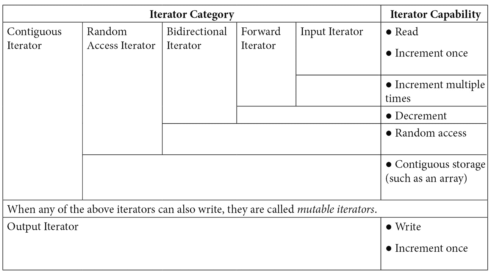
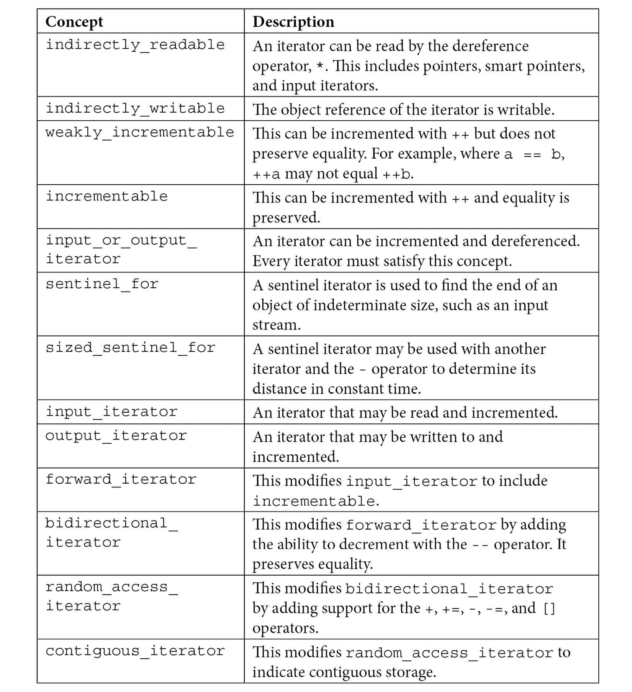
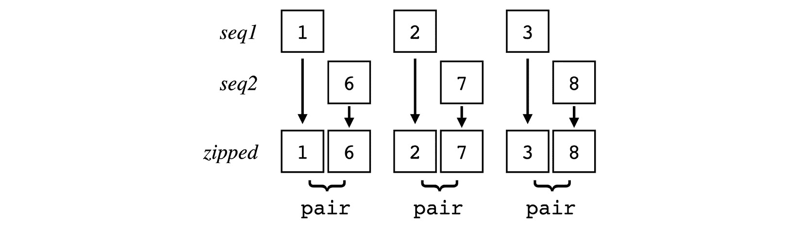

# *第四章*：兼容迭代器

迭代器是 STL 中的基本概念。迭代器使用与 C 指针相同的语义实现，使用相同的增量、减量和解引用运算符。指针习语对大多数 C/C++ 程序员来说都很熟悉，它允许 *算法* 如 `std::sort` 和 `std::transform` 在原始内存缓冲区和 STL 容器上工作。

# 迭代器是基本概念

STL 使用迭代器来导航其容器类的元素。大多数容器包括 `begin()` 和 `end()` 迭代器。这些通常被实现为返回迭代器对象的成员函数。`begin()` 迭代器指向容器中的初始元素，而 `end()` 迭代器指向最终元素之后：


图 4.1 – begin() 和 end() 迭代器

`end()` 迭代器可以作为不定长度容器的 *哨兵*。我们将在本章中看到一些示例。

大多数 STL 容器定义了自己的特定 *迭代器类型*。例如，对于一个 `int` 类型的 `vector`：

```cpp
std::vector<int> v;
```

迭代器类型将被定义为：

```cpp
std::vector<int>::iterator v_it;
```

你可以看到这很容易失控。如果我们有一个 `vector` 的 `vector` 的 `string`：

```cpp
std::vector<std::vector<int, std::string>> v;
```

它的迭代器类型将是：

```cpp
std::vector<std::vector<int, std::string>>::iterator v_it;
```

幸运的是，C++11 给我们带来了自动类型推导和 `auto` 类型。通过使用 `auto`，我们很少需要使用完整的迭代器类型定义。例如，如果我们需要在 `for` 循环中使用迭代器，我们可以使用 `auto` 类型：

```cpp
for(auto v_it = v.begin(); v_it != v.end(); ++v_it) {
    cout << *v_it << '\n';
}
```

注意使用解引用运算符 `*` 从迭代器访问元素。这与您用于解引用指针的语法相同：

```cpp
const int a[]{ 1, 2, 3, 4, 5 };
size_t count{ sizeof(a) / sizeof(int) };
for(const int* p = a; count > 0; ++p, --count) {
    cout << *p << '\n';
}
```

这也意味着你可以使用基于范围的 `for` 循环与原始数组：

```cpp
const int a[]{ 1, 2, 3, 4, 5 };
for(auto e : a) {
    cout << e << '\n';
}
```

或者使用 STL 容器：

```cpp
std::vector<int> v{ 1, 2, 3, 4, 5 };
for(auto e : v) {
    cout << e << '\n';
}
```

基于范围的 `for` 循环只是带有迭代器的 `for` 循环的简写：

```cpp
{
    auto begin_it{ std::begin(container) };
    auto end_it{ std::end(container) };
    for ( ; begin_it != end_it; ++begin_it) {
        auto e{ *begin_it };
        cout << e << '\n';
    } 
}
```

因为迭代器使用与原始指针相同的语法，基于范围的 `for` 循环与任何容器都可以同样工作。

注意到基于范围的 `for` 循环调用 `std::begin()` 和 `std::end()`，而不是直接调用成员函数 `begin()` 和 `end()`。`std::` 函数调用成员函数以获取迭代器。那么，为什么不直接调用成员函数呢？`std::` 非成员函数被设计为也可以与原始数组一起工作。这就是为什么 `for` 循环可以与数组一起工作：

```cpp
const int arr[]{ 1, 2, 3, 4, 5 };
for(auto e : arr) {
    cout << format("{} ", e);
}
```

输出：

```cpp
1 2 3 4 5
```

对于大多数用途，我倾向于更喜欢成员函数 `begin()` 和 `end()`，因为它们更明确。其他人更喜欢 `std::` 非成员函数，因为它们更通用。六或七八个；我建议你选择一种风格并坚持下去。

## 迭代器类别

在 C++20 之前，迭代器根据其能力被分为几个类别：



这些类别是分层的，其中更强大的迭代器继承了较不强大的迭代器的功能。换句话说，*输入迭代器*可以读取和递增一次。*正向迭代器*具有输入迭代器的功能*加上*可以多次递增。*双向迭代器*具有这些功能*加上*可以递减。依此类推。

*输出迭代器*可以写入和递增一次。如果其他迭代器也可以写入，则被认为是*可变迭代器*。

## 迭代器概念

*概念*和*约束*是 C++20 中引入的。概念只是一个命名约束，它限制了模板函数或类的参数类型，并帮助编译器选择合适的特化。

从 C++20 开始，STL 以概念而不是类别来定义迭代器。这些概念都在`std::`命名空间中。



您可以使用这些概念来约束模板的参数：

```cpp
template<typename T>
requires std::random_access_iterator<typename T::iterator>
void printc(const T & c) {
        for(auto e : c) {
        cout << format("{} ", e);
    }
    cout << '\n';
    cout << format("element 0: {}\n", c[0]);
}
```

此函数需要一个`random_access_iterator`。如果我用`list`（它不是一个随机访问容器）调用它，编译器会给我一个错误：

```cpp
int main()
{
    list<int> c{ 1, 2, 3, 4, 5 };
    printc(c);       
}
```

`list`迭代器类型不支持`random_access_iterator`概念。因此，编译器会给我一个错误：

```cpp
error: no matching function for call to 'printc(std::__cxx11::list<int>&)'
   27 |     printc(c);
      |     ~~~~~~^~~
note: candidate: 'template<class T>  requires  random_access_iterator<typename T::iterator> void printc(const T&)'
   16 | void printc(const T & c) {
      |      ^~~~~~
note:   template argument deduction/substitution failed:
note: constraints not satisfied
```

这是 GCC 的错误输出。您的错误可能看起来不同。

如果我用`vector`（它是一个随机访问容器）调用它：

```cpp
int main()
{
    vector<int> c{ 1, 2, 3, 4, 5 };
    printc(c);       
}
```

现在它编译并运行没有错误：

```cpp
$ ./working
1 2 3 4 5
element 0: 1
```

尽管有不同类型的迭代器用于不同类型的能力（和概念），但复杂性是为了支持易用性。

在介绍了迭代器之后，我们现在继续本章的以下食谱：

+   创建一个可迭代的范围

+   使您的迭代器与 STL 迭代器特性兼容

+   使用迭代器适配器填充 STL 容器

+   将生成器作为迭代器创建

+   使用反向迭代器适配器进行反向迭代

+   使用哨兵迭代未知长度的对象

+   构建一个 zip 迭代器适配器

+   创建一个随机访问迭代器

# 技术要求

您可以在 GitHub 上找到本章的代码文件，地址为[`github.com/PacktPublishing/CPP-20-STL-Cookbook/tree/main/chap04`](https://github.com/PacktPublishing/CPP-20-STL-Cookbook/tree/main/chap04)。

# 创建一个可迭代的范围

这个食谱描述了一个简单的类，它生成一个可迭代的范围，适用于与基于范围的`for`循环一起使用。想法是创建一个*序列生成器*，它从起始值迭代到结束值。

要完成这个任务，我们需要一个迭代器类，以及对象接口类。

## 如何做到这一点...

这个食谱有两个主要部分，主接口`Seq`和`iterator`类。

+   首先，我们将定义`Seq`类。它只需要实现`begin()`和`end()`成员函数：

    ```cpp
    template<typename T>
    class Seq {
        T start_{};
        T end_{};
    public:
        Seq(T start, T end) : start_{start}, end_{end} {}
        iterator<T> begin() const {
            return iterator{start_};
        }
        iterator<T> end() const { return iterator{end_}; }
    };
    ```

构造函数设置了 `start_` 和 `end_` 变量。这些变量分别用于构建 `begin()` 和 `end()` 迭代器。成员函数 `begin()` 和 `end()` 返回 `iterator` 对象。

+   迭代器类通常定义在容器类的公共部分中。这被称为 *成员类* 或 *嵌套类*。我们将它插入到 `Seq` 构造函数之后：

    ```cpp
    public:
        Seq(T start, T end) : start_{ start }, end_{ end } {}
        class iterator {
            T value_{};
        public:
            explicit iterator(T position = 0)
                : value_{position} {}
            T operator*() const { return value_; }
            iterator& operator++() {
                ++value_;
                return *this;
            }
            bool operator!=(const iterator& other) const {
                return value_ != other.value_;
            }
        };
    ```

通常将迭代器类命名为 `iterator`。这允许它被引用为 `Seq<`*类型*`>::iterator`。

`iterator` 构造函数被标记为 `explicit` 以避免隐式转换。

`value_` 变量由迭代器维护。这用于从指针解引用返回值。

支持基于范围的 `for` 循环的最小要求是一个解引用运算符 `*`、一个前缀增量运算符 `++` 和一个不等比较运算符 `!=`。

+   现在我们可以编写一个 `main()` 函数来测试我们的序列生成器：

    ```cpp
    int main()
    {
        Seq<int> r{ 100, 110 };
        for (auto v : r) {
            cout << format("{} ", v);
        }
        cout << '\n';
    }
    ```

这会构建一个 `Seq` 对象并打印出其序列。

输出看起来像这样：

```cpp
$ ./seq
100 101 102 103 104 105 106 107 108 109
```

## 它是如何工作的…

这个菜谱的目的是制作一个与基于范围的 `for` 循环一起工作的序列生成器。让我们首先考虑基于范围的 `for` 循环的等效代码：

```cpp
{
    auto begin_it{ std::begin(container) };
    auto end_it{ std::end(container) };
    for ( ; begin_it != end_it; ++begin_it) {
        auto v{ *begin_it };
        cout << v << '\n';
    } 
}
```

从这段等效代码中，我们可以推导出对象与 `for` 循环一起工作的要求：

+   `begin()` 和 `end()` 迭代器

+   对不等比较运算符 `!=` 的迭代器支持

+   对前缀增量运算符 `++` 的迭代器支持

+   对解引用运算符 `*` 的迭代器支持

我们的主要 `Seq` 类接口只有三个公共成员函数：构造函数，以及 `begin()` 和 `end()` 迭代器：

```cpp
Seq(T start, T end) : start_{ start }, end_{ end } {}
iterator begin() const { return iterator{start_}; }
iterator end() const { return iterator{end_}; }
```

`Seq::iterator` 类的实现携带实际的负载：

```cpp
class iterator {
    T value_{};
```

这是一种常见的配置，因为有效负载仅通过迭代器访问。

我们只实现了所需的三个运算符：

```cpp
    T operator*() const { return value_; }
    iterator& operator++() {
        ++value_;
        return *this;
    }
    bool operator!=(const iterator& other) const {
        return value_ != other.value_;
    }
```

这是我们支持基于范围的 `for` 循环所需的所有内容：

```cpp
Seq<int> r{ 100, 110 };
for (auto v : r) {
    cout << format("{} ", v);
}
```

## 还有更多…

将迭代器定义为容器的成员类是传统做法，但不是必需的。这允许 `iterator` 类型从属于容器类型：

```cpp
Seq<int>::iterator it = r.begin();
```

由于 `auto` 类型，C++11 之后这并不那么重要，但它仍然被认为是最佳实践。

# 使你的迭代器与 STL 迭代器特性兼容

许多 STL 算法要求迭代器符合某些特性。不幸的是，这些要求在编译器、系统和 C++ 版本之间不一致。

为了我们的目的，我们将使用来自 *创建可迭代范围* 菜谱的类来说明这个问题。如果你在继续之前先阅读那个菜谱，可能会更容易理解。

在 `main()` 中，如果添加对 `minmax_element()` 算法的调用：

```cpp
Seq<int> r{ 100, 110 };
auto [min_it, max_it] = minmax_element(r.begin(), r.end());
cout << format("{} - {}\n", *min_it, *max_it);
```

它无法编译。错误信息模糊、晦涩，并且是级联的，但如果你仔细观察，你会发现我们的迭代器不符合与该算法兼容的要求。

好的，让我们来修复这个问题。

## 如何做到这一点…

我们需要对我们迭代器做一些简单的添加，使其与算法兼容。我们的迭代器需要满足前向迭代器的最低要求，所以让我们从这里开始：

+   我们几乎有所有必要的运算符来支持前向迭代器。我们唯一缺少的是相等比较运算符`==`。我们可以很容易地通过`operator==()`重载来添加这个运算符：

    ```cpp
    bool operator==(const iterator& other) const {
        return value_ == other.value_;
    }
    ```

有趣的是，这使得代码在某些系统上编译和运行，但在*Clang*上则不行，我们得到错误信息：

```cpp
No type named 'value_type' in 'std::iterator_traits<Seq<int>::iterator>'
```

这告诉我我们需要在迭代器中设置特性。

+   `iterator_traits`类在`iterator`类中寻找一组类型定义（实现为`using`别名）：

    ```cpp
    public:
        using iterator_concept  = std::forward_iterator_tag;
        using iterator_category = 
          std::forward_iterator_tag;
        using value_type        = std::remove_cv_t<T>;
        using difference_type   = std::ptrdiff_t;
        using pointer           = const T*;
        using reference         = const T&;
    ```

我倾向于将这些放在`iterator`类的`public:`部分的顶部，这样它们就很容易看到了。

现在我们有一个完全符合规范的*前向迭代器*类，代码在所有我有的编译器上都能运行。

## 它是如何工作的……

`using`语句是特性，可以用来定义迭代器可以执行的能力。让我们看看它们中的每一个：

```cpp
using iterator_concept  = std::forward_iterator_tag;
using iterator_category = std::forward_iterator_tag;
```

前两个是*类别*和*概念*，两者都设置为`forward_iterator_tag`。这个值表示迭代器符合前向迭代器规范。

一些代码不会查看这些值，而是寻找单个设置和能力：

```cpp
using value_type        = std::remove_cv_t<T>;
using difference_type   = std::ptrdiff_t;
using pointer           = const T*;
using reference         = const T&;
```

`value_type`别名设置为`std::remove_cv_t<T>`，这是值的类型，任何`const`限定符都被移除。

`difference_type`别名设置为`std::ptrdiff_t`，这是一个用于指针差异的特殊类型。

`指针`和`引用`别名分别设置为指针和引用的`const`限定版本。

定义这些类型别名是大多数迭代器的基本要求。

## 还有更多……

值得注意的是，定义这些特性允许我们使用概念受限的模板与我们的迭代器一起使用。例如：

```cpp
template<typename T>
requires std::forward_iterator<typename T::iterator>
void printc(const T & c) {
    for(auto v : c) {
        cout << format("{} ", v);
    }
    cout << '\n';
}
```

这个打印我们序列的函数受`forward_iterator`概念的约束。如果我们的类没有限定，它就不会编译。

我们也可以使用算法的`ranges::`版本：

```cpp
auto [min_it, max_it] = ranges::minmax_element(r);
```

这使得使用我们的迭代器更加方便。

我们可以使用静态断言来测试`forward_range`兼容性：

```cpp
static_assert(ranges::forward_range<Seq<int>>);
```

# 使用迭代器适配器填充 STL 容器

迭代器本质上是一种抽象。它有一个特定的接口，并且以特定的方式使用。但除此之外，它只是代码，它可以用于其他目的。一个*迭代器适配器*是一个看起来像迭代器但做其他事情的类。

STL 附带了一系列迭代器适配器。通常与`algorithm`库一起使用，它们非常有用。STL 迭代器适配器通常分为三类：

+   **插入迭代器**，或*插入器*，用于将元素插入到容器中。

+   **流迭代器**从流中读取并写入。

+   **反向迭代器**反转迭代器的方向。

## 如何做到这一点……

在这个菜谱中，我们将查看一些 STL 迭代器适配器的示例：

+   我们将从打印容器内容的一个简单函数开始：

    ```cpp
    void printc(const auto & v, const string_view s = "") {
        if(s.size()) cout << format("{}: ", s);
        for(auto e : v) cout << format("{} ", e);
        cout << '\n';
    }
    ```

`printc()` 函数使我们能够轻松查看算法的结果。它包括一个可选的 `string_view` 参数用于描述。

+   在我们的 `main()` 函数中，我们将定义几个 `deque` 容器。我们使用 `deque` 容器是因为我们可以在两端插入元素：

    ```cpp
    int main() {
        deque<int> d1{ 1, 2, 3, 4, 5 };
        deque<int> d2(d1.size());
        copy(d1.begin(), d1.end(), d2.begin());
        printc(d1);
        printc(d2, "d2 after copy"); 
    }
    ```

输出：

```cpp
1 2 3 4 5
d2 after copy: 1 2 3 4 5
```

我们定义了包含五个 `int` 值的 `deque` 容器 `d1`，以及有相同元素数量的空间用于 `d2`。`copy()` 算法不会分配空间，所以 `d2` 必须有足够的空间来存放元素。

`copy()` 算法接受三个迭代器：*开始* 和 *结束* 迭代器指示要复制的元素的范围，以及目标范围的开头迭代器。它不会检查迭代器以确保它们是有效的。（在没有在 `vector` 中分配空间的情况下尝试此操作，你会得到一个 *segmentation fault* 错误。）

我们在两个容器上调用 `printc()` 来显示结果。

+   `copy()` 算法并不总是方便用于此。有时你想要在容器的末尾复制并添加元素。有一个算法为每个元素调用 `push_back()` 会很好。这就是迭代器适配器有用的地方。让我们在 `main()` 函数的末尾添加一些代码：

    ```cpp
    copy(d1.begin(), d1.end(), back_inserter(d2));
    printc(d2, "d2 after back_inserter");
    ```

输出：

```cpp
d2 after back_inserter: 1 2 3 4 5 1 2 3 4 5
```

`back_inserter()` 是一个 *插入迭代器适配器*，它为分配给它的每个项目调用 `push_back()`。你可以在期望输出迭代器的任何地方使用它。

+   此外，还有一个 `front_inserter()` 适配器，当你想在容器的开头插入元素时使用：

    ```cpp
    deque<int> d3{ 47, 73, 114, 138, 54 };
    copy(d3.begin(), d3.end(), front_inserter(d2));
    printc(d2, "d2 after front_inserter");
    ```

输出：

```cpp
d2 after front_inserter: 54 138 114 73 47 1 2 3 4 5 1 2 3 4 5
```

`front_inserter()` 适配器使用容器的 `push_front()` 方法在前面插入元素。注意，目标中的元素是反转的，因为每个元素都是插入在之前元素之前。

+   如果我们想在中间插入，我们可以使用 `inserter()` 适配器：

    ```cpp
    auto it2{ d2.begin() + 2};
    copy(d1.begin(), d1.end(), inserter(d2, it2));
    printc(d2, "d2 after middle insert");
    ```

输出：

```cpp
d2 after middle insert: 54 138 1 2 3 4 5 114 73 47 ...
```

`inserter()` 适配器接受一个用于插入起点的迭代器。

+   *流迭代器* 对于从和向 `iostream` 对象读写数据非常方便，这是 `ostream_iterator()`：

    ```cpp
    cout << "ostream_iterator: ";
    copy(d1.begin(), d1.end(), ostream_iterator<int>(cout));
    cout << '\n';
    ```

输出：

```cpp
ostream_iterator: 12345
```

+   这里是 `istream_iterator()`：

    ```cpp
    vector<string> vs{};
    copy(istream_iterator<string>(cin), 
        istream_iterator<string>(),
        back_inserter(vs));
    printc(vs, "vs2");
    ```

输出：

```cpp
$ ./working < five-words.txt
vs2: this is not a haiku
```

如果没有传递流，`istream_iterator()` 适配器默认会返回一个结束迭代器。

+   *反向适配器* 通常包含在大多数容器中，作为函数成员 `rbegin()` 和 `rend()`：

    ```cpp
    for(auto it = d1.rbegin(); it != d1.rend(); ++it) {
        cout << format("{} ", *it);
    }
    cout << '\n';
    ```

输出：

```cpp
5 4 3 2 1
```

## 它是如何工作的…

迭代器适配器通过包装现有的容器来工作。当你调用一个适配器，比如 `back_inserter()` 与一个容器对象一起时：

```cpp
copy(d1.begin(), d1.end(), back_inserter(d2));
```

适配器返回一个模仿迭代器的对象，在这种情况下是一个 `std::back_insert_iterator` 对象，每次将值分配给迭代器时，它都会在容器对象上调用 `push_back()` 方法。这允许适配器在执行其有用任务的同时替代迭代器。

`istream_adapter()`也需要一个*哨兵*。哨兵表示不确定长度迭代器的结束。当你从流中读取时，直到遇到结束，你都不知道流中有多少个对象。当流遇到结束时，哨兵将与迭代器相等，表示流的结束。当`istream_adapter()`不带参数调用时，它将创建一个哨兵：

```cpp
auto it = istream_adapter<string>(cin);
auto it_end = istream_adapter<string>();  // creates sentinel
```

这允许你测试流的结束，就像测试任何容器一样：

```cpp
for(auto it = istream_iterator<string>(cin);
        it != istream_iterator<string>();
        ++it) {
    cout << format("{} ", *it);
}
cout << '\n';
```

输出：

```cpp
$ ./working < five-words.txt
this is not a haiku
```

# 将生成器作为迭代器创建

*生成器*是一个生成其自己的值序列的迭代器。它不使用容器。它即时创建值，按需一次返回一个。C++生成器独立存在；它不需要包装在另一个对象周围。

在这个菜谱中，我们将构建一个用于生成*斐波那契序列*的生成器。这是一个序列，其中每个数字都是序列中前两个数字的和，从 0 和 1 开始：


图 4.2 – 斐波那契序列的定义

斐波那契序列的前十个值（不计零）是：1, 1, 2, 3, 5, 8, 13, 21, 34, 55。这是自然界中发现的*黄金比例*的近似值。

## 如何实现...

斐波那契序列通常使用*递归循环*创建。生成器中的递归可能很困难且资源密集，所以我们只是保存序列中的前两个值并将它们相加。这更有效。

+   首先，让我们定义一个打印序列的函数：

    ```cpp
    void printc(const auto & v, const string_view s = "") {
        if(s.size()) cout << format("{}: ", s);
        for(auto e : v) cout << format("{} ", e);
        cout << '\n';
    }
    ```

我们之前已经使用过这个`printc()`函数。它打印一个可迭代的范围，如果提供了描述字符串，还会打印描述字符串。

+   我们的这个类从*类型别名*和一些对象变量开始，所有这些都在`private`部分。

    ```cpp
    class fib_generator {
        using fib_t = unsigned long;
        fib_t stop_{};
        fib_t count_ { 0 };
        fib_t a_ { 0 };
        fib_t b_ { 1 };
    ```

`stop_`变量将稍后用作*哨兵*。它被设置为要生成的值的数量。`count_`用于跟踪我们已经生成了多少个值。`a_`和`b_`是序列中的前两个值，用于计算下一个值。

+   仍然在`private`部分，我们有一个用于计算斐波那契序列中下一个值的简单函数。

    ```cpp
        constexpr void do_fib() {
            const fib_t old_b = b_;
            b_ += a_;
            a_  = old_b;
        }
    ```

+   现在在`public`部分，我们有一个带有默认值的简单构造函数：

    ```cpp
    public:
        explicit fib_generator(fib_t stop = 0) : stop_{ stop } {}
    ```

这个构造函数在没有参数的情况下使用，用于创建哨兵。`stop`参数初始化`stop_`变量，表示要生成的值的数量。

+   其余的公共函数是期望的*前向迭代器*的运算符重载：

    ```cpp
        fib_t operator*() const { return b_; }
        constexpr fib_generator& operator++() {
            do_fib();
            ++count_;
            return *this;
        }
        fib_generator operator++(int) {
            auto temp{ *this };
            ++*this;
            return temp; 
        }
        bool operator!=(const fib_generator &o) const {
            return count_ != o.count_; 
        }
        bool operator==(const fib_generator&o) const { 
            return count_ == o.count_; 
        }
        const fib_generator& begin() const { return *this; }
        const fib_generator end() const { 
            auto sentinel = fib_generator();
            sentinel.count_ = stop_;
            return sentinel;
        }
        fib_t size() { return stop_; }
    };
    ```

此外，还有一个简单的`size()`函数，如果你需要为复制操作初始化目标容器，这可能很有用。

+   现在我们可以通过简单的调用`printc()`来在我们的主函数中使用生成器：

    ```cpp
    int main() {
        printc(fib_generator(10));
    }
    ```

这创建了一个匿名`fib_generator`对象，用于传递给`printc()`函数。

+   我们用前 10 个斐波那契数字得到这个输出，不包括零：

    ```cpp
    1 1 2 3 5 8 13 21 34 55
    ```

## 它是如何工作的...

`fib_generator`类作为一个前向迭代器运行，因为它提供了所有必要的接口函数：

```cpp
fib_generator {
public:
    fib_t operator*() const;
    constexpr fib_generator& operator++();
    fib_generator operator++(int);
    bool operator!=(const fib_generator &o) const;
    bool operator==(const fib_generator&o) const;
    const fib_generator& begin() const;
    const fib_generator end() const;
};
```

就基于范围的`for`循环而言，这是一个迭代器，因为它看起来像迭代器。

值是在`do_fib()`函数中计算的：

```cpp
constexpr void do_fib() {
    const fib_t old_b = b_;
    b_ += a_;
    a_  = old_b;
}
```

这只是简单地添加`b_ += a_`，将结果存储在`b_`中，并将旧的`b_`存储在`a_`中，为下一次迭代做准备。

解引用运算符`*`返回`b_`的值，这是序列中的下一个值：

```cpp
fib_t operator*() const { return b_; }
```

`end()`函数创建一个对象，其中`count_`变量等于`stop_`变量，创建一个*哨兵*：

```cpp
const fib_generator end() const { 
    auto sentinel = fib_generator();
    sentinel.count_ = stop_;
    return sentinel;
}
```

现在相等比较运算符可以轻松检测序列的结束：

```cpp
bool operator==(const fib_generator&o) const { 
    return count_ == o.count_; 
}
```

## 还有更多...

如果我们想让我们的生成器与`algorithm`库一起工作，我们需要提供`traits`别名。这些别名位于`public`部分的顶部：

```cpp
public:
    using iterator_concept  = std::forward_iterator_tag;
    using iterator_category = std::forward_iterator_tag;
    using value_type        = std::remove_cv_t<fib_t>;
    using difference_type   = std::ptrdiff_t;
    using pointer           = const fib_t*;
    using reference         = const fib_t&;
```

现在，我们可以使用我们的生成器与算法一起工作：

```cpp
fib_generator fib(10);
auto x = ranges::views::transform(fib, 
    [](unsigned long x){ return x * x; });
printc(x, "squared:");
```

这使用`ranges::views`版本的`transform()`算法来平方每个值。结果对象可以在任何可以使用迭代器的地方使用。我们从`printc()`调用中获取这个输出：

```cpp
squared:: 1 1 4 9 25 64 169 441 1156 3025
```

# 使用反向迭代器适配器向后迭代

*反向迭代器适配器*是一个反转迭代器类方向的抽象。它需要一个双向迭代器。

## 如何做到这一点...

STL 中的大多数双向容器都包含一个反向迭代器适配器。其他容器，如原始的 C 数组，则没有。让我们看看一些例子：

+   让我们从本章中使用的`printc()`函数开始：

    ```cpp
    void printc(const auto & c, const string_view s = "") {
        if(s.size()) cout << format("{}: ", s);
        for(auto e : c) cout << format("{} ", e);
        cout << '\n';
    }
    ```

这使用基于范围的`for`循环来打印容器中的元素。

+   基于范围的`for`循环甚至可以与没有迭代器类的原始 C 数组一起工作。因此，我们的`printc()`函数已经可以与 C 数组一起使用：

    ```cpp
    int main() {
        int array[]{ 1, 2, 3, 4, 5 };
        printc(array, "c-array");
    }
    ```

我们得到这个输出：

```cpp
c-array: 1 2 3 4 5
```

+   我们可以使用`begin()`和`end()`迭代器适配器为 C 数组创建正常的正向迭代器：

    ```cpp
    auto it = std::begin(array);
    auto end_it = std::end(array);
    while (it != end_it) {
        cout << format("{} ", *it++);
    }
    ```

`for`循环的输出：

```cpp
1 2 3 4 5
```

+   或者我们可以使用`rbegin()`和`rend()`反向迭代器适配器来为 C 数组创建反向迭代器：

    ```cpp
    auto it = std::rbegin(array);
    auto end_it = std::rend(array);
    while (it != end_it) {
        cout << format("{} ", *it++);
    }
    ```

现在我们的输出是反转的：

```cpp
5 4 3 2 1
```

+   我们甚至可以创建一个修改版的`printc()`，使其反向打印：

    ```cpp
    void printr(const auto & c, const string_view s = "") {
        if(s.size()) cout << format("{}: ", s);
        auto rbegin = std::rbegin(c);
        auto rend = std::rend(c);
        for(auto it = rbegin; it != rend; ++it) {
            cout << format("{} ", *it);
        }
        cout << '\n';
    }
    ```

当我们用 C 数组调用它时：

```cpp
printr(array, "rev c-array");
```

我们得到这个输出：

```cpp
rev c-array: 5 4 3 2 1
```

+   当然，这也适用于任何双向 STL 容器：

    ```cpp
    vector<int> v{ 1, 2, 3, 4, 5 };
    printc(v, "vector");
    printr(v, "rev vector");
    ```

输出：

```cpp
vector: 1 2 3 4 5
rev vector: 5 4 3 2 1
```

## 它是如何工作的...

一个普通的迭代器类有一个指向第一个元素的`begin()`迭代器，以及一个指向最后一个元素之后的`end()`迭代器：


图 4.3 – 前向迭代器

您通过使用`++`运算符递增`begin()`迭代器来迭代容器，直到它达到`end()`迭代器的值。

反向迭代器适配器会拦截迭代器接口并将其反转，使得`begin()`迭代器指向最后一个元素，而`end()`迭代器指向第一个元素之前。`++`和`--`运算符也被反转：


图 4.4 – 反向迭代器适配器

在反向迭代器中，`++` 运算符递减，而 `--` 运算符递增。

值得注意的是，大多数双向 STL 容器已经包含了反向迭代器适配器，可以通过成员函数 `rbegin()` 和 `rend()` 访问：

```cpp
vector<int> v;
it = v.rbegin();
it_end = v.rend();
```

这些迭代器将反向操作，适用于许多用途。

# 使用哨兵遍历未知长度的对象

一些对象没有特定的长度。要知道它们的长度，你需要遍历它们的所有元素。例如，在本章的其它地方，我们看到了一个没有特定长度的**生成器**。一个更常见的例子是**C 字符串**。

C 字符串是一个以 null `'\0'` 值终止的字符的原始 C 数组。

![图 4.5 – 带有 null 终止符的 C 字符串]

![图 B18267_04_05.jpg]

图 4.5 – 带有 null 终止符的 C 字符串

我们经常使用 C 字符串，即使我们没有意识到这一点。C/C++ 中的任何**字面量**字符串都是一个 C 字符串：

```cpp
std::string s = "string";
```

这里，STL 字符串 `s` 使用字面量字符串初始化。字面量字符串是一个 C 字符串。如果我们查看单个字符的十六进制表示，我们会看到 null 终止符：

```cpp
for (char c : "string") {
    std::cout << format("{:02x} ", c);
}
```

“string”这个词有六个字母。我们循环的输出显示了数组中的七个元素：

```cpp
73 74 72 69 6e 67 00
```

第七个元素是 null 终止符。

循环看到的是字符的原始 C 数组，有七个值。它是字符串的事实是一个对循环不可见的抽象。如果我们想让循环将其视为字符串，我们需要一个**迭代器**和一个**哨兵**。

一个**哨兵**是一个表示不确定长度迭代器末尾的对象。当迭代器遇到数据末尾时，哨兵将与迭代器比较相等。

要了解它是如何工作的，让我们为 C 字符串构建一个迭代器！

## 如何做到这一点...

要使用哨兵与 C 字符串一起使用，我们需要构建一个自定义迭代器。它不需要很复杂，只需要用于基于范围的 `for` 循环的基本要素。

+   我们将从一个方便的定义开始：

    ```cpp
    using sentinel_t = const char;
    constexpr sentinel_t nullchar = '\0';
    ```

`sentinel_t` 的 `using` 别名为 `const char`。我们将在我们的类中使用这个哨兵。

我们还定义了用于 null 字符终止符的常量 `nullchar`。

+   现在，我们可以定义我们的迭代器类型：

    ```cpp
    class cstr_it {
        const char *s{};
    public:
        explicit cstr_it(const char *str) : s{str} {}
        char operator*() const { return *s; }
        cstr_it& operator++() {
            ++s;
            return *this;
        }
        bool operator!=(sentinel_t) const {
            return s != nullptr && *s != nullchar;
        }
        cstr_it begin() const { return *this; }
        sentinel_t end() const { return nullchar; }
    };
    ```

这很简单。这是基于范围的 `for` 循环所必需的最小内容。注意 `end()` 函数返回一个 `nullchar`，而 `operator!=()` 重载与 `nullchar` 进行比较。这就是我们需要的哨兵。

+   现在，我们可以定义一个函数，使用哨兵打印我们的 C 字符串：

    ```cpp
    void print_cstr(const char * s) {
        cout << format("{}: ", s);
        for (char c : cstr_it(s)) {
            std::cout << format("{:02x} ", c);
        }
        std::cout << '\n';
    }
    ```

在这个函数中，我们首先打印字符串。然后我们使用 `format()` 函数打印每个单独的字符作为十六进制值。

+   现在，我们可以在 `main()` 函数中调用 `print_cstr()`：

    ```cpp
    int main() {
        const char carray[]{"array"};
        print_cstr(carray);
        const char * cstr{"c-string"};
        print_cstr(cstr);
    }
    ```

输出看起来像这样：

```cpp
array: 61 72 72 61 79
c-string: 63 2d 73 74 72 69 6e 67
```

注意，这里没有多余的字符和空终止符。这是因为我们的哨兵告诉 for 循环在看到 `nullchar` 时停止。

## 它是如何工作的...

迭代器类的哨兵部分非常简单。我们可以通过在 `end()` 函数中返回它来轻松地使用空终止符作为哨兵值：

```cpp
sentinel_t end() const { return nullchar; }
```

然后不等比较运算符可以用来测试它：

```cpp
bool operator!=(sentinel_t) const {
    return s != nullptr && *s != nullchar;
}
```

注意，参数只是一个类型 (`sentinel_t`)。参数类型对于函数签名是必要的，但我们不需要值。所有必要的只是将当前迭代器与哨兵进行比较。

这种技术应该在你有一个没有预定比较终点的类型或类时非常有用。

# 构建 zip 迭代器适配器

许多脚本语言包括一个用于将两个序列 *zip* 在一起的函数。典型的 zip 操作将接受两个输入序列，并为每个输入中的每个位置返回一对值：

考虑两个序列的情况 – 它们可以是容器、迭代器或初始化列表：


图 4.6 – 要 zip 的容器

我们想要 *zip* 它们在一起，以创建一个新的序列，包含来自前两个序列的元素对：



图 4.7 – Zip 操作

在这个菜谱中，我们将使用迭代器适配器来完成这个任务。

## 如何做到这一点...

在这个菜谱中，我们将构建一个 zip 迭代器适配器，它接受两个相同类型的容器，并将值压缩到 `std::pair` 对象中：

+   在我们的 `main()` 函数中，我们想要用两个向量调用我们的适配器：

    ```cpp
    int main()
    {
        vector<std::string> vec_a {"Bob", "John", "Joni"};
        vector<std::string> vec_b {"Dylan", "Williams", 
            "Mitchell"};
        cout << "zipped: ";
        for(auto [a, b] : zip_iterator(vec_a, vec_b)) {
            cout << format("[{}, {}] ", a, b);
        }
        cout << '\n';
    }
    ```

这允许我们使用 `zip_iterator` 替代单个 `vector` 迭代器。

我们期望得到这样的输出：

```cpp
zipped: [Bob, Dylan] [John, Williams] [Joni, Mitchell]
```

+   我们的迭代器适配器在一个名为 `zip_iterator` 的类中。我们将从一些类型别名开始，以方便起见：

    ```cpp
    template<typename T>
    class zip_iterator {
        using val_t = typename T::value_type;
        using ret_t = std::pair<val_t, val_t>;
        using it_t = typename T::iterator;
    ```

这些允许我们方便地定义对象和函数。

+   我们在迭代器中不存储任何数据。我们只存储目标容器的 `begin()` 和 `end()` 迭代器的副本：

    ```cpp
    it_t ita_{};
    it_t itb_{};
    // for begin() and end() objects
    it_t ita_begin_{};
    it_t itb_begin_{};
    it_t ita_end_{};
    it_t itb_end_{};
    ```

`ita_` 和 `itb_` 是目标容器的迭代器。其他四个迭代器用于为 `zip_iterator` 适配器生成 `begin()` 和 `end()` 迭代器。

+   我们还有一个私有构造函数：

    ```cpp
    // private constructor for begin() and end() objects
    zip_iterator(it_t ita, it_t itb) : ita_{ita}, itb_{itb} {}
    ```

这用于稍后构建特定于 `begin()` 和 `end()` 迭代器的适配器对象。

+   在 `public` 部分，我们首先从迭代器 *traits* 类型定义开始：

    ```cpp
    public:
        using iterator_concept  = 
          std::forward_iterator_tag;
        using iterator_category = 
          std::forward_iterator_tag;
        using value_type        = std::pair<val_t, val_t>;
        using difference_type   = long int;
        using pointer           = const val_t*;
        using reference         = const val_t&;
    ```

+   构造函数设置所有私有迭代器变量：

    ```cpp
    zip_iterator(T& a, T& b) : 
        ita_{a.begin()},
        itb_{b.begin()},
        ita_begin_{ita_},
        itb_begin_{itb_},
        ita_end_{a.end()},
        itb_end_{b.end()}
    {}
    ```

+   我们定义了最小操作符重载以与前向迭代器一起工作：

    ```cpp
    zip_iterator& operator++() {
        ++ita_;
        ++itb_;
        return *this;
    }
    bool operator==(const zip_iterator& o) const {
        return ita_ == o.ita_ || itb_ == o.itb_;
    }
    bool operator!=(const zip_iterator& o) const {
        return !operator==(o);
    }
    ret_t operator*() const {
        return { *ita_, *itb_ };
    }
    ```

+   最后，`begin()` 和 `end()` 函数返回相应的迭代器：

    ```cpp
    zip_iterator begin() const
        { return zip_iterator(ita_begin_, itb_begin_); }
    zip_iterator end() const
        { return zip_iterator(ita_end_, itb_end_); }
    ```

这些通过存储的迭代器和私有构造函数变得简单。

+   现在让我们扩展我们的 `main()` 函数以进行测试：

    ```cpp
    int main()
    {
        vector<std::string> vec_a {"Bob", "John", "Joni"};
        vector<std::string> vec_b {"Dylan", "Williams", 
            "Mitchell"};
        cout << "vec_a: ";
        for(auto e : vec_a) cout << format("{} ", e);
        cout << '\n';
        cout << "vec_b: ";
        for(auto e : vec_b) cout << format("{} ", e);
        cout << '\n';
        cout << "zipped: ";
        for(auto [a, b] : zip_iterator(vec_a, vec_b)) {
            cout << format("[{}, {}] ", a, b);
        }
        cout << '\n';
    }
    ```

+   这给我们想要的输出：

    ```cpp
    vec_a: Bob John Joni
    vec_b: Dylan Williams Mitchell
    zipped: [Bob, Dylan] [John, Williams] [Joni, Mitchell]
    ```

## 它是如何工作的...

*zipped iterator adapter* 是一个例子，说明了迭代器抽象可以有多灵活。我们可以取两个容器的迭代器，并将它们用于一个聚合迭代器中。让我们看看它是如何工作的。

`zip_iterator` 类的主构造函数接受两个容器对象。为了讨论的目的，我们将把这些对象称为 *目标* 对象。

```cpp
zip_iterator(T& a, T& b) : 
    ita_{a.begin()},
    itb_{b.begin()},
    ita_begin_{ita_},
    itb_begin_{itb_},
    ita_end_{a.end()},
    itb_end_{b.end()}
{}
```

构造函数从目标 `begin()` 迭代器初始化 `ita_` 和 `itb_` 变量。这些将用于导航目标对象。目标 `begin()` 和 `end()` 迭代器也保存起来以供以后使用。

这些变量在 `private` 部分定义：

```cpp
it_t ita_{};
it_t itb_{};
// for begin() and end() objects
it_t ita_begin_{};
it_t itb_begin_{};
it_t ita_end_{};
it_t itb_end_{};
```

`it_t` 类型被定义为目标迭代器类的类型：

```cpp
using val_t = typename T::value_type;
using ret_t = std::pair<val_t, val_t>;
using it_t = typename T::iterator;
```

其他别名类型是 `val_t` 用于目标值的类型，以及 `ret_t` 用于返回 `pair`。这些类型定义在类中用于方便。

`begin()` 和 `end()` 函数使用一个只初始化 `ita_` 和 `itb_` 值的私有构造函数：

```cpp
zip_iterator begin() const
  { return zip_iterator(ita_begin_, itb_begin_); }
zip_iterator end() const
  { return zip_iterator(ita_end_, itb_end_); }
```

`private` 构造函数看起来是这样的：

```cpp
// private constructor for begin() and end() objects
zip_iterator(it_t ita, it_t itb) : ita_{ita}, itb_{itb} {}
```

这是一个接受 `it_t` 迭代器作为参数的构造函数。它只初始化 `ita_` 和 `itb_`，以便它们可以在比较运算符重载中使用。

类的其余部分就像一个正常的迭代器一样工作，但它操作的是目标类的迭代器：

```cpp
zip_iterator& operator++() {
    ++ita_;
    ++itb_;
    return *this;
}
bool operator==(const zip_iterator& o) const {
    return ita_ == o.ita_ || itb_ == o.itb_;
}
bool operator!=(const zip_iterator& o) const {
    return !operator==(o);
}
```

解引用运算符返回一个 `std::pair` 对象（`ret_t` 是 `std::pair<val_t, val_t>` 的别名）。这是从迭代器检索值的接口。

```cpp
ret_t operator*() const {
    return { *ita_, *itb_ };
}
```

## 还有更多...

`zip_iterator` 适配器可以用来轻松地将对象压缩到 `map` 中：

```cpp
map<string, string> name_map{};
for(auto [a, b] : zip_iterator(vec_a, vec_b)) {
    name_map.try_emplace(a, b);
}
cout << "name_map: ";
for(auto [a, b] : name_map) {
    cout << format("[{}, {}] ", a, b);
}
cout << '\n';
```

如果我们将此代码添加到 `main()` 中，我们得到以下输出：

```cpp
name_map: [Bob, Dylan] [John, Williams] [Joni, Mitchell]
```

# 创建一个随机访问迭代器

这个配方是一个完整的连续/随机访问迭代器的例子。这是容器中最完整类型的迭代器。随机访问迭代器包括所有其他类型容器迭代器的所有功能，以及它的随机访问能力。

虽然我认为在本章中包含一个完整的迭代器很重要，但这个例子有超过 700 行代码，比本书中的其他例子要大得多。在这里，我将介绍代码的必要组件。请参阅完整的源代码[`github.com/PacktPublishing/CPP-20-STL-Cookbook/blob/main/chap04/container-iterator.cpp`](https://github.com/PacktPublishing/CPP-20-STL-Cookbook/blob/main/chap04/container-iterator.cpp)。

## 如何做到这一点...

我们需要一个容器来存储我们的迭代器。我们将使用一个简单的数组来完成这项工作，并将其称为 `Container`。`iterator` 类嵌套在 `Container` 类中。

所有这些设计都是为了与 STL 容器接口保持一致。

+   `Container` 被定义为 `template` 类。它的 `private` 部分只有两个元素：

    ```cpp
    template<typename T>
    class Container {
        std::unique_ptr<T[]> c_{};
        size_t n_elements_{};
    ```

我们使用 `unique_pointer` 来管理数据。我们让 `smart pointer` 管理自己的内存。这减轻了对 `~Container()` 析构函数的需求。`n_elements_` 变量保持我们容器的大小。

+   在公共部分，我们有我们的构造函数：

    ```cpp
    Container(initializer_list<T> l) : n_elements_{l.size()} {
        c_ = std::make_unique<T[]>(n_elements_);
        size_t index{0};
        for(T e : l) {
            c_[index++] = e;
        }
    }
    ```

第一个构造函数使用 `initializer_list` 传递容器中的元素。我们调用 `make_unique` 来分配空间，并通过基于范围的 `for` 循环填充容器。

+   我们还有一个构造函数，它分配空间但不填充元素：

    ```cpp
    Container(size_t sz) : n_elements_{sz} {
        c_ = std::make_unique<T[]>(n_elements_);
    }
    ```

`make_unique()` 函数为元素构造空对象。

+   `size()` 函数返回元素的数量：

    ```cpp
    size_t size() const {
        return n_elements_;
    }
    ```

+   `operator[]()` 函数返回一个索引元素：

    ```cpp
    const T& operator[](const size_t index) const {
        return c_[index];
    }
    ```

+   `at()` 函数返回一个带边界检查的索引元素：

    ```cpp
    T& at(const size_t index) const {
        if(index > n_elements_ - 1) {
            throw std::out_of_range(
                "Container::at(): index out of range"
            );
        }
        return c_[index];
    }
    ```

这与 STL 使用一致。`at()` 函数是首选方法。

+   `begin()` 和 `end()` 函数调用迭代器构造函数，并传递容器数据的地址。

    ```cpp
    iterator begin() const { return iterator(c_.get()); }
    iterator end() const { 
        return iterator(c_.get() + n_elements_); 
    }
    ```

`unique_ptr::get()` 函数从智能指针返回地址。

+   `iterator` 类作为 `public` 成员嵌套在 `Container` 类中。

    ```cpp
    class iterator {
        T* ptr_;
    ```

迭代器类有一个私有成员，一个指针，它在 `Container` 类的 `begin()` 和 `end()` 方法中被初始化。

+   迭代器构造函数接受容器数据的指针。

    ```cpp
    iterator(T* ptr = nullptr) : ptr_{ptr} {}
    ```

我们提供默认值，因为标准要求有默认构造函数。

### 运算符重载

这个迭代器为以下运算符提供了运算符重载：`++`、*后缀* `++`、`--`、*后缀* `--`、`[]`、*默认比较* `<=>` *(C++20)*、`==`、`*`、`->`、`+`、*非成员* `+`、*数值* `-`、*对象* `-`、`+=` 和 `-=`。我们在这里将介绍一些显著的重载。请参阅源代码以获取所有内容。

+   C++20 默认比较运算符 `<=>` 提供了完整比较运算符集的功能，除了等式 `==` 运算符：

    ```cpp
    const auto operator<=>(const iterator& o) const {
        return ptr_ <=> o.ptr_;
    }
    ```

这是一个 C++20 特性，因此它需要一个符合标准的编译器和库。

+   有两个 `+` 运算符重载。这些支持 *it + n* 和 *n + it* 操作。

    ```cpp
    iterator operator+(const size_t n) const {
        return iterator(ptr_ + n);
    }
    // non-member operator (n + it)
    friend const iterator operator+(
            const size_t n, const iterator& o) {
        return iterator(o.ptr_ + n);
    }
    ```

`friend` 声明是一个特殊情况。当在模板类成员函数中使用时，它等同于一个非成员函数。这允许在类上下文中定义一个非成员函数。

+   `-` 运算符也有两个重载。我们需要支持一个数值操作数和一个迭代器操作数。

    ```cpp
    const iterator operator-(const size_t n) {
        return iterator(ptr_ - n);
    }
    const size_t operator-(const iterator& o) {
        return ptr_ - o.ptr_;
    }
    ```

这允许进行 *it – n* 和 *it – it* 操作。不需要非成员函数，因为 *n – it* 不是一个有效的操作。

### 验证代码

C++20 规范 §23.3.4.13 要求对有效的随机访问迭代器有一组特定的操作和结果。我在源代码中包含了一个 `unit_tests()` 函数来验证这些要求。

`main()` 函数创建一个 `Container` 对象并执行一些简单的验证函数。

+   首先，我们创建一个包含十个值的 `Container<string>` 对象 `x`。

    ```cpp
    Container<string> x{"one", "two", "three", "four", "five", 
        "six", "seven", "eight", "nine", "ten" };
    cout << format("Container x size: {}\n", x.size());
    ```

输出给出元素的数量：

```cpp
Container x size: 10
```

+   我们使用基于范围的 `for` 循环显示容器的元素：

    ```cpp
    puts("Container x:");
    for(auto e : x) {
        cout << format("{} ", e);
    }
    cout << '\n';
    ```

输出：

```cpp
Container x:
one two three four five six seven eight nine ten
```

+   接下来，我们测试几个直接访问方法：

    ```cpp
    puts("direct access elements:");
    cout << format("element at(5): {}\n", x.at(5));
    cout << format("element [5]: {}\n", x[5]);
    cout << format("element begin + 5: {}\n",
        *(x.begin() + 5));
    cout << format("element 5 + begin: {}\n",
        *(5 + x.begin()));
    cout << format("element begin += 5: {}\n",
        *(x.begin() += 5));
    ```

输出：

```cpp
direct access elements:
element at(5): six
element [5]: six
element begin + 5: six
element 5 + begin: six
element begin += 5: six
```

+   我们使用 `ranges::views` 管道和 `views::reverse` 测试容器：

    ```cpp
    puts("views pipe reverse:");
    auto result = x | views::reverse;
    for(auto v : result) cout << format("{} ", v);
    cout << '\n';
    ```

输出：

```cpp
views pipe reverse:
ten nine eight seven six five four three two one
```

+   最后，我们创建一个包含 10 个未初始化元素的 `Container` 对象 `y`：

    ```cpp
    Container<string> y(x.size());
    cout << format("Container y size: {}\n", y.size());
    for(auto e : y) {
        cout << format("[{}] ", e);
    }
    cout << '\n';
    ```

输出：

```cpp
Container y size: 10
[] [] [] [] [] [] [] [] [] []
```

## 它是如何工作的…

虽然代码量很大，但这个迭代器并不比一个更小的迭代器复杂。大部分代码都在运算符重载中，这些重载通常是每行一到两行代码。

容器本身由一个*智能指针*管理。由于它是一个平铺数组，不需要扩展或压缩，这一点得到了简化。

当然，STL 提供了平铺的`std::array`类，以及其他更复杂的数据结构。然而，你可能觉得揭示一个完整迭代器类的工作原理是有价值的。
