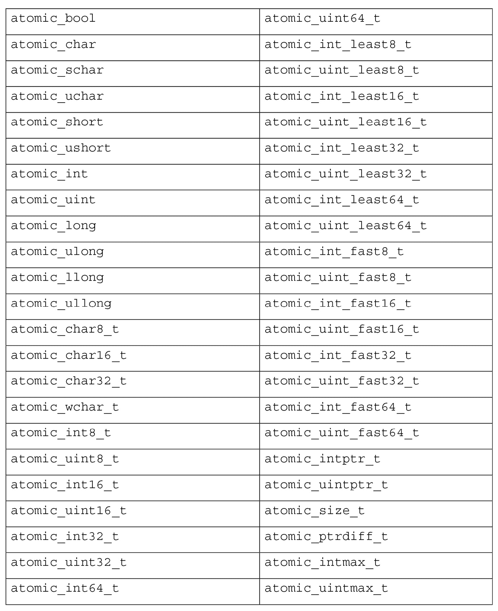

# *第九章*：并发与并行

并发和并行是指能够在独立的*执行线程*中运行代码的能力。

更具体地说，*并发*是指能够在后台运行线程的能力，而*并行*是指能够在处理器的不同核心上同时运行线程的能力。运行时库以及宿主操作系统将为给定硬件环境中的给定线程选择并发或并行执行模型。

在现代多任务操作系统中，`main()`函数已经代表了一个执行线程。当启动一个新线程时，它被称为由现有线程*孵化*的。一组线程可能被称为*蜂群*。

在 C++标准库中，`std::thread`类提供了线程执行的基本单元。其他类基于`thread`提供*锁*、*互斥锁*和其他并发模式。根据系统架构，执行线程可能在一个处理器上并发运行，或者在多个核心上并行运行。

在本章中，我们将介绍以下配方中的这些工具和更多内容：

+   休眠特定的时间长度

+   使用`std::thread`实现并发

+   使用`std::async`实现并发

+   使用执行策略并行运行 STL 算法

+   使用互斥锁和锁安全地共享数据

+   使用`std::atomic`共享标志和值

+   使用`std::call_once`初始化线程

+   使用`std::condition_variable`解决生产者-消费者问题

+   实现多个生产者和消费者

# 技术要求

您可以在 GitHub 上找到本章的代码文件，链接为[`github.com/PacktPublishing/CPP-20-STL-Cookbook/tree/main/chap09`](https://github.com/PacktPublishing/CPP-20-STL-Cookbook/tree/main/chap09)。

# 休眠特定的时间长度

`<thread>`头文件提供了两个用于使线程休眠的功能，`sleep_for()`和`sleep_until()`。这两个函数都在`std::this_thread`命名空间中。

这个配方探讨了这些函数的使用，因为我们将在本章后面使用它们。

## 如何做到这一点...

让我们看看如何使用`sleep_for()`和`sleep_until()`函数：

+   与休眠相关的函数位于`std::this_thread`命名空间中。因为它只有几个符号，我们将继续为`std::this_thread`和`std::chrono_literals`发出`using`指令：

    ```cpp
    using namespace std::this_thread;
    using namespace std::chrono_literals;
    ```

`chrono_literals`命名空间有表示持续时间的符号，例如`1s`表示一秒，或`100ms`表示 100 毫秒。

+   在`main()`中，我们将使用`steady_clock::now()`标记一个时间点，这样我们就可以计时我们的测试：

    ```cpp
    int main() {
        auto t1 = steady_clock::now();
        cout << "sleep for 1.3 seconds\n";
        sleep_for(1s + 300ms);
        cout << "sleep for 2 seconds\n";
        sleep_until(steady_clock::now() + 2s);
        duration<double> dur1 = steady_clock::now() - t1;
        cout << format("total duration: {:.5}s\n", 
          dur1.count());
    }
    ```

`sleep_for()`函数接受一个`duration`对象来指定休眠的时间长度。参数`(1s + 300ms)`使用了`chrono_literal`运算符来返回一个表示 1.3 秒的`duration`对象。

`sleep_until()`函数接受一个`time_point`对象来指定从休眠中恢复的具体时间。在这种情况下，使用了`chrono_literal`运算符来修改由`steady_clock::now()`返回的`time_point`对象。

这是我们的输出：

```cpp
sleep for 1.3 seconds
sleep for 2 seconds
total duration: 3.3005s
```

## 它是如何工作的…

`sleep_for(duration)` 和 `sleep_until(time_point)` 函数将暂停当前线程的执行，直到指定的 `duration` 完成，或者直到 `time_point` 到达。

如果支持，`sleep_for()` 函数将使用 `steady_clock` 实现。否则，持续时间可能会受到时间调整的影响。这两个函数可能会因为调度或资源延迟而阻塞更长的时间。

## 还有更多…

一些系统支持 POSIX 函数 `sleep()`，该函数暂停执行指定的时间数秒：

```cpp
unsigned int sleep(unsigned int seconds);
```

`sleep()` 函数是 POSIX 标准的一部分，而不是 C++ 标准的一部分。

# 使用 `std::thread` 进行并发

*线程* 是并发的单位。`main()` 函数可以被认为是 *主要执行线程*。在操作系统的上下文中，主线程与其他进程拥有的线程并发运行。

`std::thread` 类是 STL 中并发的根基。所有其他并发特性都是建立在 `thread` 类的基础之上。

在这个菜谱中，我们将检查 `std::thread` 的基础知识以及 `join()` 和 `detach()` 如何确定其执行上下文。

## 如何做到这一点…

在这个菜谱中，我们创建了一些 `std::thread` 对象，并实验了它们的执行选项。

+   我们从一个用于休眠线程的方便函数开始，以毫秒为单位：

    ```cpp
    void sleepms(const unsigned ms) {
        using std::chrono::milliseconds;
        std::this_thread::sleep_for(milliseconds(ms));
    }
    ```

`sleep_for()` 函数接受一个 `duration` 对象，并阻塞当前线程的执行，持续指定的时间。这个 `sleepms()` 函数作为一个方便的包装器，接受一个表示休眠毫秒数的 `unsigned` 值。

+   现在，我们需要一个用于我们的线程的函数。这个函数根据一个整数参数休眠可变数量的毫秒：

    ```cpp
    void fthread(const int n) {
        cout << format("This is t{}\n", n);

        for(size_t i{}; i < 5; ++i) {
            sleepms(100 * n);
            cout << format("t{}: {}\n", n, i + 1);
        }
        cout << format("Finishing t{}\n", n);
    }
    ```

`fthread()` 调用 `sleepms()` 五次，每次休眠 `100 * n` 毫秒。

+   我们可以在 `main()` 中使用 `std::thread` 在单独的线程中运行这个操作：

    ```cpp
    int main() {
        thread t1(fthread, 1);
        cout << "end of main()\n";
    }
    ```

它可以编译，但当我们运行它时得到这个错误：

```cpp
terminate called without an active exception
Aborted
```

（你的错误信息可能会有所不同。这是在 Debian 上使用 GCC 时的错误信息。）

问题在于操作系统不知道当线程对象超出作用域时该如何处理。我们必须指定调用者是否等待线程，或者线程是否分离并独立运行。

+   我们使用 `join()` 方法来表示调用者将等待线程完成：

    ```cpp
    int main() {
        thread t1(fthread, 1);
        t1.join();
        cout << "end of main()\n";
    }
    ```

输出：

```cpp
This is t1
t1: 1
t1: 2
t1: 3
t1: 4
t1: 5
Finishing t1
end of main()
```

现在，`main()` 等待线程完成。

+   如果我们调用 `detach()` 而不是 `join()`，那么 `main()` 不会等待，程序在线程运行之前就结束了：

    ```cpp
    thread t1(fthread, 1);
    t1.detach();
    ```

输出：

```cpp
end of main()
```

+   当线程分离时，我们需要给它运行的时间：

    ```cpp
    thread t1(fthread, 1);
    t1.detach();
    cout << "main() sleep 2 sec\n";
    sleepms(2000);
    ```

输出：

```cpp
main() sleep 2 sec
This is t1
t1: 1
t1: 2
t1: 3
t1: 4
t1: 5
Finishing t1
end of main()
```

+   让我们启动并分离第二个线程，看看会发生什么：

    ```cpp
    int main() {
        thread t1(fthread, 1);
        thread t2(fthread, 2);
        t1.detach();
        t2.detach();
        cout << "main() sleep 2 sec\n";
        sleepms(2000);
        cout << "end of main()\n";
    }
    ```

输出：

```cpp
main() sleep 2 sec
This is t1
This is t2
t1: 1
t2: 1
t1: 2
t1: 3
t2: 2
t1: 4
t1: 5
Finishing t1
t2: 3
t2: 4
t2: 5
Finishing t2
end of main()
```

因为我们的 `fthread()` 函数使用其参数作为 `sleepms()` 的乘数，所以第二个线程比第一个线程运行得慢一些。我们可以在输出中看到计时器的交错。

+   如果我们用 `join()` 而不是 `detach()` 来做这件事，我们会得到类似的结果：

    ```cpp
    int main() {
        thread t1(fthread, 1);
        thread t2(fthread, 2);
        t1.join();
        t2.join();
        cout << "end of main()\n";
    }
    ```

输出：

```cpp
This is t1
This is t2
t1: 1
t2: 1
t1: 2
t1: 3
t2: 2
t1: 4
t1: 5
Finishing t1
t2: 3
t2: 4
t2: 5
Finishing t2
end of main()
```

因为 `join()` 等待线程完成，所以我们不再需要在 `main()` 中的 `sleepms()` 2 秒来等待线程完成。

## 它是如何工作的...

`std::thread` 对象代表一个执行线程。对象与线程之间存在一对一的关系。一个 `thread` 对象代表一个线程，一个线程由一个 `thread` 对象表示。`thread` 对象不能被复制或赋值，但它可以被移动。

`thread` 构造函数看起来像这样：

```cpp
explicit thread( Function&& f, Args&&… args );
```

线程使用函数指针和零个或多个参数进行构造。函数会立即使用提供的参数调用：

```cpp
thread t1(fthread, 1);
```

这创建了对象 `t1` 并立即调用函数 `fthread(int)`，将字面值 `1` 作为参数。

在创建线程后，我们必须在线程上使用 `join()` 或 `detach()`：

```cpp
t1.join();
```

`join()` 方法会阻塞调用线程的执行，直到 `t1` 线程完成：

```cpp
t1.detach();
```

`detach()` 方法允许调用线程独立于 `t1` 线程继续执行。

## 更多内容...

C++20 提供了 `std::jthread`，它会在其作用域结束时自动连接调用者：

```cpp
int main() {
    std::jthread t1(fthread, 1);
    cout "< "end of main("\n";
}
```

输出：

```cpp
end of main()
This is t1
t1: 1
t1: 2
t1: 3
t1: 4
t1: 5
Finishing t1
```

这允许 `t1` 线程独立执行，并在其作用域结束时自动连接到 `main()` 线程。

# 使用 std::async 进行并发

`std::async()` 异步运行目标函数并返回一个 `std::future` 对象来携带目标函数的返回值。这样，`async()` 的操作方式与 `std::thread` 类似，但允许返回值。

让我们通过几个示例来考虑 `std::async()` 的使用。

## 如何实现...

在其最简单的形式中，`std::async()` 函数执行的任务与 `std::thread` 类似，无需调用 `join()` 或 `detach()`，同时还可以通过 `std::future` 对象允许返回值。

在这个菜谱中，我们将使用一个函数来计算一个范围内的素数数量。我们将使用 `chrono::steady_clock` 来计时每个线程的执行。

+   我们将开始使用一些便利别名：

    ```cpp
    using launch = std::launch;
    using secs = std::chrono::duration<double>;
    ```

`std::launch` 有启动策略常量，用于与 `async()` 调用一起使用。`secs` 别名是一个 `duration` 类，用于计时我们的素数计算。

+   我们的目标函数计算一个范围内的素数。这本质上是一种通过消耗一些时钟周期来理解执行策略的方法：

    ```cpp
    struct prime_time {
        secs dur{};
        uint64_t count{};
    };
    prime_time count_primes(const uint64_t& max) {
        prime_time ret{};
        constexpr auto isprime = [](const uint64_t& n) {
            for(uint64_t i{ 2 }; i < n / 2; ++i) {
                if(n % i == 0) return false;
            }
            return true;
        };
        uint64_t start{ 2 };
        uint64_t end{ max };
        auto t1 = steady_clock::now();
        for(uint64_t i{ start }; i <= end ; ++i) {
            if(isprime(i)) ++ret.count;
        }
        ret.dur = steady_clock::now() - t1;
        return ret;
    }
    ```

`prime_time` 结构用于返回值，包含持续时间和计数的元素。这允许我们计时循环本身。`isprime` lambda 函数在值是素数时返回 `true`。我们使用 `steady_clock` 来计算计算素数的循环的持续时间。

+   在 `main()` 中，我们调用我们的函数并报告其计时：

    ```cpp
    int main() {
        constexpr uint64_t MAX_PRIME{ 0x1FFFF };
        auto pt = count_primes(MAX_PRIME);
        cout << format("primes: {} {:.3}\n", pt.count, 
          pt.dur);
    }
    ```

输出：

```cpp
primes: 12252 1.88008s
```

+   现在，我们可以使用 `std::async()` 异步运行 `count_primes()`：

    ```cpp
    int main() {
        constexpr uint64_t MAX_PRIME{ 0x1FFFF };
        auto primes1 = async(count_primes, MAX_PRIME);
        auto pt = primes1.get();
        cout << format("primes: {} {:.3}\n", pt.count, 
          pt.dur);
    }
    ```

这里，我们使用 `async()` 函数和 `count_primes` 函数以及 `MAX_PRIME` 参数进行调用。这将在后台运行 `count_primes()`。

`async()`返回一个`std::future`对象，该对象携带异步操作的返回值。`future`对象的`get()`方法会阻塞，直到异步函数完成，然后返回函数的返回对象。

这与没有使用`async()`时几乎相同的计时：

```cpp
primes: 12252 1.97245s
```

+   `async()`函数可以可选地将其第一个参数作为执行策略标志：

    ```cpp
    auto primes1 = async(launch::async, count_primes, MAX_PRIME);
    ```

选项是`async`或`deferred`。这些标志位于`std::launch`命名空间中。

`async`标志启用异步操作，而`deferred`标志启用延迟评估。这些标志是位映射的，并且可以使用位或`|`运算符组合。

默认情况下，两个位都被设置，就像指定了`async | deferred`一样。

+   我们可以使用`async()`同时运行我们函数的几个实例：

    ```cpp
    int main() {
        constexpr uint64_t MAX_PRIME{ 0x1FFFF };
        list<std::future<prime_time>> swarm;
        cout << "start parallel primes\n";
        auto t1{ steady_clock::now() };
        for(size_t i{}; i < 15; ++i) {
            swarm.emplace_back(
                async(launch::async, count_primes, 
                  MAX_PRIME)
            );
        }
        for(auto& f : swarm) {
            static size_t i{};
            auto pt = f.get();
            cout << format("primes({:02}): {} {:.5}\n",
                ++i, pt.count, pt.dur);
        }
        secs dur_total{ steady_clock::now() - t1 };
        cout << format("total duration: {:.5}s\n", 
            dur_total.count());
    }
    ```

我们知道`async`返回一个`future`对象。因此，我们可以通过将`future`对象存储在容器中来运行 15 个线程。以下是在 6 核 i7 上运行 Windows 的输出：

```cpp
start parallel primes
primes(01): 12252 4.1696s
primes(02): 12252 3.7754s
primes(03): 12252 3.78089s
primes(04): 12252 3.72149s
primes(05): 12252 3.72006s
primes(06): 12252 4.1306s
primes(07): 12252 4.26015s
primes(08): 12252 3.77283s
primes(09): 12252 3.77176s
primes(10): 12252 3.72038s
primes(11): 12252 3.72416s
primes(12): 12252 4.18738s
primes(13): 12252 4.07128s
primes(14): 12252 2.1967s
primes(15): 12252 2.22414s
total duration: 5.9461s
```

即使 6 核 i7 无法在单独的核心上运行所有进程，它仍然在 6 秒内完成了 15 个实例。

它看起来在前 13 个线程大约用了 4 秒完成，然后又花了 2 秒来完成最后 2 个线程。它似乎利用了 Intel 的 Hyper-Threading 技术，在某些情况下允许一个核心下运行 2 个线程。

当我们在 12 核 Xeon 上运行相同的代码时，我们得到这个结果：

```cpp
start parallel primes
primes(01): 12252 0.96221s
primes(02): 12252 0.97346s
primes(03): 12252 0.92189s
primes(04): 12252 0.97499s
primes(05): 12252 0.98135s
primes(06): 12252 0.93426s
primes(07): 12252 0.90294s
primes(08): 12252 0.96307s
primes(09): 12252 0.95015s
primes(10): 12252 0.94255s
primes(11): 12252 0.94971s
primes(12): 12252 0.95639s
primes(13): 12252 0.95938s
primes(14): 12252 0.92115s
primes(15): 12252 0.94122s
total duration: 0.98166s
```

12 核 Xeon 在不到一秒内就完成了所有 15 个进程。

## 它是如何工作的...

理解`std::async`的关键在于其使用`std::promise`和`std::future`。

`promise`类允许一个`thread`存储一个对象，该对象可能稍后由一个`future`对象异步检索。

例如，假设我们有一个这样的函数：

```cpp
void f() {
    cout << "this is f()\n";
}
```

我们可以像这样使用`std::thread`来运行它：

```cpp
int main() {
    std::thread t1(f);
    t1.join();
    cout << "end of main()\n";
}
```

对于没有返回值的简单函数来说，这没问题。当我们想要从`f()`函数中返回一个值时，我们可以使用`promise`和`future`。

我们在`main()`线程中设置了 promise 和 future 对象：

```cpp
int main() {
    std::promise<int> value_promise;
    std::future<int> value_future = 
      value_promise.get_future();
    std::thread t1(f, std::move(value_promise));
    t1.detach();
    cout << format("value is {}\n", value_future.get());
    cout << "end of main()\n";
}
```

我们将`promise`对象传递给我们的函数：

```cpp
void f(std::promise<int> value) {
    cout << "this is f()\n";
    value.set_value(47);
}
```

注意，`promise`对象不能被复制，因此我们需要使用`std::move`将其传递给函数。

`promise`对象充当了`future`对象的一个桥梁，允许我们在值可用时检索它。

`std::async()`只是一个辅助函数，用于简化`promise`和`future`对象的创建。使用`async()`，我们可以这样做：

```cpp
int f() {
    cout << "this is f()\n";
    return 47;
}
int main() {
    auto value_future = std::async(f);
    cout << format("value is {}\n", value_future.get());
    cout << "end of main()\n";
}
```

这就是`async()`函数的价值。对于许多用途来说，它使得使用`promise`和`future`变得更加容易。

# 使用执行策略并行运行 STL 算法

从 C++17 开始，许多标准 STL 算法可以以*并行执行*的方式运行。这个特性允许算法将其工作分割成子任务，以便在多个核心上同时运行。这些算法接受一个执行策略对象，该对象指定了应用于算法的并行类型。这个特性需要硬件支持。

## 如何做…

执行策略在 `<execution>` 头文件和 `std::execution` 命名空间中定义。在本例中，我们将使用 `std::transform()` 算法测试可用的策略：

+   为了计时，我们将使用带有 `std::milli` 比率的 `duration` 对象，这样我们就可以以毫秒为单位进行测量：

    ```cpp
    using dur_t = duration<double, std::milli>;
    ```

+   为了演示目的，我们将从一个包含 1000 万个随机值的 `int` `vector` 开始：

    ```cpp
    int main() {
        std::vector<unsigned> v(10 * 1000 * 1000);
        std::random_device rng;
        for(auto &i : v) i = rng() % 0xFFFF;
        ...
    ```

+   现在，我们应用一个简单的转换：

    ```cpp
    auto mul2 = [](int n){ return n * 2; };
    auto t1 = steady_clock::now();
    std::transform(v.begin(), v.end(), v.begin(), mul2);
    dur_t dur1 = steady_clock::now() - t1;
    cout << format("no policy: {:.3}ms\n", dur1.count());
    ```

`mul2` lambda 简单地将一个值乘以 2。`transform()` 算法将 `mul2` 应用到向量的每个成员上。

此转换没有指定执行策略。

输出：

```cpp
no policy: 4.71ms
```

+   我们可以在算法的第一个参数中指定执行策略：

    ```cpp
    std::transform(execution::seq,
        v.begin(), v.end(), v.begin(), mul2);
    ```

`seq` 策略意味着算法不应并行化。这与没有执行策略相同。

输出：

```cpp
execution::seq: 4.91ms
```

注意到持续时间与没有策略时大致相同。它永远不会完全精确，因为每次运行时都会变化。

+   `execution::par` 策略允许算法并行化其工作负载：

    ```cpp
    std::transform(execution::par,
        v.begin(), v.end(), v.begin(), mul2);
    ```

输出：

```cpp
execution::par: 3.22ms
```

注意到算法在并行执行策略下运行得更快。

+   `execution::par_unseq` 策略允许无序并行执行工作负载：

    ```cpp
    std::transform(execution::par_unseq,
        v.begin(), v.end(), v.begin(), mul2);
    ```

输出：

```cpp
execution::par_unseq: 2.93ms
```

这里，我们注意到使用此策略性能又有提升。

`execution::par_unseq` 策略对算法的要求更严格。算法不得执行需要并发或顺序操作的操作。

## 它是如何工作的…

执行策略接口没有指定算法工作负载是如何并行化的。它旨在与各种硬件和处理器在不同负载和环境下一起工作。它可能完全在库中实现，也可能依赖于编译器或硬件支持。

并行化将在那些做超过 *O(n)* 工作的算法上显示出最大的改进。例如，`sort()` 显示出显著的改进。这是一个没有并行化的 `sort()`：

```cpp
auto t0 = steady_clock::now();
std::sort(v.begin(), v.end());
dur_t dur0 = steady_clock::now() - t0;
cout << format("sort: {:.3}ms\n", dur0.count());
```

输出：

```cpp
sort: 751ms
```

使用 `execution::par`，我们看到显著的性能提升：

```cpp
std::sort(execution::par, v.begin(), v.end());
```

输出：

```cpp
sort: 163ms
```

使用 `execution::par_unseq` 的改进效果更好：

```cpp
std::sort(execution::par_unseq, v.begin(), v.end());
```

输出：

```cpp
sort: 152ms
```

在使用并行算法时进行大量测试是个好主意。如果你的算法或谓词不适合并行化，你可能会得到最小的性能提升或意外的副作用。

注意

在撰写本文时，执行策略在 GCC 中支持不佳，LLVM/Clang 还不支持。本食谱在运行 Windows 10 的 6 核 i7 和 Visual C++ 预览版上进行了测试。

# 使用互斥锁和锁安全地共享数据

术语 *互斥锁* 指的是对共享资源的互斥访问。互斥锁通常用于避免由于多个执行线程尝试访问相同数据而导致的数据损坏和竞态条件。互斥锁通常会使用 *锁* 来限制一次只允许一个线程访问。

STL 在 `<mutex>` 头文件中提供了 *互斥锁* 和 *锁* 类。

## 如何做…

在这个菜谱中，我们将使用一个简单的 `Animal` 类来实验对 `mutex` 的 `锁定` 和 `解锁`：

+   我们首先创建一个 `mutex` 对象：

    ```cpp
    std::mutex animal_mutex;
    ```

`mutex` 在全局范围内声明，因此它对所有相关对象都是可访问的。

+   我们的 `Animal` 类有一个名字和一个朋友列表：

    ```cpp
    class Animal {
        using friend_t = list<Animal>;
        string_view s_name{ "unk" };
        friend_t l_friends{};
    public:
        Animal() = delete;
        Animal(const string_view n) : s_name{n} {}
        ...
    }
    ```

添加和删除朋友将是我们 `mutex` 的一个有用的测试用例。

+   等于运算符是我们唯一需要的运算符：

    ```cpp
    bool operator==(const Animal& o) const {
        return s_name.data() == o.s_name.data();
    }
    ```

`s_name` 成员是一个 `string_view` 对象，因此我们可以测试其数据存储的地址是否相等。

+   `is_friend()` 方法测试另一个 `Animal` 是否在 `l_friends` 列表中：

    ```cpp
    bool is_friend(const Animal& o) const {
        for(const auto& a : l_friends) {
            if(a == o) return true;
        }
        return false;
    }
    ```

+   `find_friend()` 方法返回一个 `optional`，如果找到则包含对 `Animal` 的迭代器：

    ```cpp
    optional<friend_t::iterator>
    find_friend(const Animal& o) noexcept {
        for(auto it{l_friends.begin()};
                it != l_friends.end(); ++it) {
            if(*it == o) return it;
        }
        return {};
    }
    ```

+   `print()` 方法打印 `s_name` 以及 `l_friends` 列表中每个 `Animal` 对象的名字：

    ```cpp
    void print() const noexcept {
        auto n_animals{ l_friends.size() };
        cout << format("Animal: {}, friends: ", s_name);
        if(!n_animals) cout << "none";
        else {
            for(auto n : l_friends) {
                cout << n.s_name;
                if(--n_animals) cout << ", ";
            }
        }
        cout << '\n';
    }
    ```

+   `add_friend()` 方法将一个 `Animal` 对象添加到 `l_friends` 列表中：

    ```cpp
    bool add_friend(Animal& o) noexcept {
        cout << format("add_friend {} -> {}\n", s_name, 
          o.s_name);
        if(*this == o) return false;
        std::lock_guard<std::mutex> l(animal_mutex);
        if(!is_friend(o)) l_friends.emplace_back(o);
        if(!o.is_friend(*this))
          o.l_friends.emplace_back(*this);
        return true;
    }
    ```

+   `delete_friend()` 方法从 `l_friends` 列表中删除一个 `Animal` 对象：

    ```cpp
    bool delete_friend(Animal& o) noexcept {
        cout << format("delete_friend {} -> {}\n",
            s_name, o.s_name);
        if(*this == o) return false;
        if(auto it = find_friend(o)) 
          l_friends.erase(it.value());
        if(auto it = o.find_friend(*this))
            o.l_friends.erase(it.value());
        return true;
    }
    ```

+   在 `main()` 函数中，我们创建了一些 `Animal` 对象：

    ```cpp
    int main() {
        auto cat1 = std::make_unique<Animal>("Felix");
        auto tiger1 = std::make_unique<Animal>("Hobbes");
        auto dog1 = std::make_unique<Animal>("Astro");
        auto rabbit1 = std::make_unique<Animal>("Bugs");
        ...
    ```

+   我们使用 `async()` 在我们的对象上调用 `add_friends()`，以在单独的线程中运行它们：

    ```cpp
    auto a1 = std::async([&]{ cat1->add_friend(*tiger1); });
    auto a2 = std::async([&]{ cat1->add_friend(*rabbit1); });
    auto a3 = std::async([&]{ rabbit1->add_friend(*dog1); });
    auto a4 = std::async([&]{ rabbit1->add_friend(*cat1); });
    a1.wait();
    a2.wait();
    a3.wait();
    a4.wait();
    ```

我们调用 `wait()` 以允许线程在继续之前完成。

+   我们调用 `print()` 来查看我们的 `Animals` 和它们的关系：

    ```cpp
    auto p1 = std::async([&]{ cat1->print(); });
    auto p2 = std::async([&]{ tiger1->print(); });
    auto p3 = std::async([&]{ dog1->print(); });
    auto p4 = std::async([&]{ rabbit1->print(); });
    p1.wait();
    p2.wait();
    p3.wait();
    p4.wait();
    ```

+   最后，我们调用 `delete_friend()` 来删除我们的一种关系：

    ```cpp
    auto a5 = std::async([&]{ cat1->delete_friend(*rabbit1); });
    a5.wait();
    auto p5 = std::async([&]{ cat1->print(); });
    auto p6 = std::async([&]{ rabbit1->print(); });
    ```

+   在这个阶段，我们的输出看起来是这样的：

    ```cpp
    add_friend Bugs -> Felix
    add_friend Felix -> Hobbes
    add_friend Felix -> Bugs
    add_friend Bugs -> Astro
    Animal: Felix, friends: Bugs, Hobbes
    Animal: Hobbes, friends: Animal: Bugs, friends: FelixAnimal: Astro, friends: Felix
    , Astro
    Bugs
    delete_friend Felix -> Bugs
    Animal: Felix, friends: Hobbes
    Animal: Bugs, friends: Astro
    ```

这个输出有些混乱。每次运行时它都会有所不同。有时可能没问题，但不要被它迷惑。我们需要添加一些 mutex 锁来控制对数据的访问。

+   使用 `mutex` 的一种方法是通过其 `lock()` 和 `unlock()` 方法。让我们将它们添加到 `add_friend()` 函数中：

    ```cpp
    bool add_friend(Animal& o) noexcept {
        cout << format("add_friend {} -> {}\n", s_name, o.s_name);
        if(*this == o) return false;
        animal_mutex.lock();
        if(!is_friend(o)) l_friends.emplace_back(o);
        if(!o.is_friend(*this)) o.l_friends.emplace_back(*this);
        animal_mutex.unlock();
        return true;
    }
    ```

`lock()` 方法尝试获取 `mutex` 的锁。如果 `mutex` 已经被锁定，它将等待（阻塞执行）直到 `mutex` 被解锁。

+   我们还需要给 `delete_friend()` 添加一个锁：

    ```cpp
    bool delete_friend(Animal& o) noexcept {
        cout << format("delete_friend {} -> {}\n",
            s_name, o.s_name);
        if(*this == o) return false;
        animal_mutex.lock();
        if(auto it = find_friend(o)) 
          l_friends.erase(it.value());
        if(auto it = o.find_friend(*this))
            o.l_friends.erase(it.value());
        animal_mutex.unlock();
        return true;
    }
    ```

+   现在，我们需要给 `print()` 添加一个锁，以确保在打印时数据不会被更改：

    ```cpp
    void print() const noexcept {
        animal_mutex.lock();
        auto n_animals{ l_friends.size() };
        cout << format("Animal: {}, friends: ", s_name);
        if(!n_animals) cout << "none";
        else {
            for(auto n : l_friends) {
                cout << n.s_name;
                if(--n_animals) cout << ", ";
            }
        }
        cout << '\n';
        animal_mutex.unlock();
    }
    ```

现在，我们的输出是有意义的：

```cpp
add_friend Bugs -> Felix
add_friend Bugs -> Astro
add_friend Felix -> Hobbes
add_friend Felix -> Bugs
Animal: Felix, friends: Bugs, Hobbes
Animal: Hobbes, friends: Felix
Animal: Astro, friends: Bugs
Animal: Bugs, friends: Felix, Astro
delete_friend Felix -> Bugs
Animal: Felix, friends: Hobbes
Animal: Bugs, friends: Astro
```

由于异步操作，您的输出行可能顺序不同。

+   `lock()` 和 `unlock()` 方法很少直接调用。`std::lock_guard` 类通过带有 `lock_guard` 的 `add_friend()` 方法管理锁：

    ```cpp
    bool add_friend(Animal& o) noexcept {
        cout << format("add_friend {} -> {}\n", s_name, o.s_name);
        if(*this == o) return false;
        std::lock_guard<std::mutex> l(animal_mutex);
        if(!is_friend(o)) l_friends.emplace_back(o);
        if(!o.is_friend(*this)) 
          o.l_friends.emplace_back(*this);
        return true;
    }
    ```

`lock_guard` 对象被创建并保持锁定状态，直到它被销毁。像 `lock()` 方法一样，`lock_guard` 也会阻塞，直到获得锁。

+   让我们将 `lock_guard` 应用于 `delete_friend()` 和 `print()` 方法。

下面是 `delete_friend()` 的代码：

```cpp
bool delete_friend(Animal& o) noexcept {
    cout << format("delete_friend {} -> {}\n",
        s_name, o.s_name);
    if(*this == o) return false;
    std::lock_guard<std::mutex> l(animal_mutex);
    if(auto it = find_friend(o)) 
      l_friends.erase(it.value());
    if(auto it = o.find_friend(*this))
        o.l_friends.erase(it.value());
    return true;
}
```

下面是 `print()` 的代码：

```cpp
void print() const noexcept {
    std::lock_guard<std::mutex> l(animal_mutex);
    auto n_animals{ l_friends.size() };
    cout << format("Animal: {}, friends: ", s_name);
    if(!n_animals) cout << "none";
    else {
        for(auto n : l_friends) {
            cout << n.s_name;
            if(--n_animals) cout << ", ";
        }
    }
    cout << '\n';
}
```

我们的输出保持一致：

```cpp
add_friend Felix -> Hobbes
add_friend Bugs -> Astro
add_friend Felix -> Bugs
add_friend Bugs -> Felix
Animal: Felix, friends: Bugs, Hobbes
Animal: Astro, friends: Bugs
Animal: Hobbes, friends: Felix
Animal: Bugs, friends: Astro, Felix
delete_friend Felix -> Bugs
Animal: Felix, friends: Hobbes
Animal: Bugs, friends: Astro
```

和之前一样，由于异步操作，您的输出行可能顺序不同。

## 它是如何工作的...

重要的是要理解 `mutex` 并不会锁定数据；它会阻塞执行。正如这个菜谱所示，当 `mutex` 应用在对象方法中时，它可以用来强制对数据的互斥访问。

当一个线程使用`lock()`或`lock_guard`锁定`mutex`时，该线程被称为*拥有*该`mutex`。任何尝试锁定相同`mutex`的其他线程都将被阻塞，直到它被所有者解锁。

当任何线程拥有`mutex`对象时，不能销毁该对象。同样，拥有`mutex`的线程也不能被销毁。符合 RAII 规范的包装器，如`lock_guard`，将有助于确保这种情况不会发生。

## 还有更多...

虽然`std::mutex`提供了适用于许多目的的独占互斥锁，但 STL 确实提供了一些其他选择：

+   `shared_mutex`允许多个线程同时拥有互斥锁。

+   `recursive_mutex`允许一个线程在单个互斥锁上堆叠多个锁。

+   `timed_mutex`为互斥锁块提供超时。`shared_mutex`和`recursive_mutex`也有可用的定时版本。

# 使用 std::atomic 共享标志和值

`std::atomic`类封装了一个单个对象，并保证它是*原子的*。写入*原子对象*受内存顺序策略控制，并且可以同时发生读取。它通常用于在不同线程之间同步访问。

`std::atomic`从其模板类型定义了一个*原子类型*。类型必须是*平凡的*。如果一个类型占用连续的内存，没有用户定义的构造函数，并且没有虚拟成员函数，则该类型是平凡的。所有原始类型都是平凡的。

虽然可以构造平凡的类型，但`std::atomic`通常与简单的原始类型一起使用，例如`bool`、`int`、`long`、`float`和`double`。

## 如何做到这一点...

这个配方使用一个简单的函数，该函数遍历一个计数器来演示共享原子对象。我们将生成一群这样的循环作为共享原子值的线程：

+   原子对象通常放置在全局命名空间中。它们必须对所有需要共享其值的线程都是可访问的：

    ```cpp
    std::atomic<bool> ready{};
    std::atomic<uint64_t> g_count{};
    std::atomic_flag winner{};
    ```

`ready`对象是一个`bool`类型，当所有线程都准备好开始计数时，将其设置为`true`。

`g_count`对象是一个全局计数器。每个线程都会增加它。

`winner`对象是一个特殊的`atomic_flag`类型。它用于指示哪个线程先完成。

+   我们使用一些常量来控制线程的数量和每个线程的循环次数：

    ```cpp
    constexpr int max_count{1000 * 1000};
    constexpr int max_threads{100};
    ```

我将其设置为运行 100 个线程，并在每个线程中计数 1,000,000 次迭代。

+   为每个线程生成`countem()`函数。它循环`max_count`次，并在循环的每次迭代中增加`g_count`。这就是我们使用原子值的地方：

    ```cpp
    void countem (int id) {
        while(!ready) std::this_thread::yield();
        for(int i{}; i < max_count; ++i) ++g_count;
        if(!winner.test_and_set()) {
            std::cout << format("thread {:02} won!\n", 
              id);
        }
    };
    ```

使用`ready`原子值来同步线程。每个线程将调用`yield()`，直到`ready`值设置为`true`。`yield()`函数将执行权交给了其他线程。

`for`循环的每次迭代都会增加`g_count`原子值。最终值应该等于`max_count * max_threads`。

循环完成后，使用`winner`对象的`test_and_set()`方法报告获胜的线程。`test_and_set()`是`atomic_flag`类的一个方法。它设置标志并返回设置之前的`bool`值。

+   我们之前已经使用过`make_commas()`函数。它显示带有千位分隔符的数字：

    ```cpp
    string make_commas(const uint64_t& num) {
        string s{ std::to_string(num) };
        for(long l = s.length() - 3; l > 0; l -= 3) {
            s.insert(l, ",");
        }
        return s;
    }
    ```

+   `main()`函数创建线程并报告结果：

    ```cpp
    int main() {
        vector<std::thread> swarm;
        cout << format("spawn {} threads\n", max_threads);
        for(int i{}; i < max_threads; ++i) {
            swarm.emplace_back(countem, i);
        }
        ready = true;
        for(auto& t : swarm) t.join();
        cout << format("global count: {}\n",
            make_commas(g_count));
        return 0;
    }
    ```

这里，我们创建一个`vector<std::thread>`对象来保存线程。

在`for`循环中，我们使用`emplace_back()`在`vector`中创建每个`thread`。

一旦线程被创建，我们设置`ready`标志，以便线程可以开始它们的循环。

输出：

```cpp
spawn 100 threads
thread 67 won!
global count: 100,000,000
```

每次运行它时，都会有一个不同的线程获胜。

## 它是如何工作的…

`std::atomic`类封装了一个对象，以在多个线程之间同步访问。

封装的对象必须是一个*平凡类型*，这意味着它占用连续的内存，没有用户定义的构造函数，并且没有虚成员函数。所有原始类型都是平凡的。

使用一个简单的结构体和`atomic`：

```cpp
struct Trivial {
    int a;
    int b;
};
std::atomic<Trivial> triv1;
```

虽然这种用法是可能的，但并不实用。任何超出设置和检索复合值的行为都会失去原子性的好处，最终需要使用一个*互斥锁*。原子类最适合*标量*值。

### 特殊化

`atomic`类有几个特殊化，用于不同的目的：

+   `std::atomic<U*>`特殊化包括对原子指针算术操作的支持，包括`fetch_add()`用于加法和`fetch_sub()`用于减法。

+   `float`、`double`和`long double`，`std::atomic`包括对原子浮点算术操作的支持，包括`fetch_add()`用于加法和`fetch_sub()`用于减法。

+   `std::atomic`提供了对额外的原子操作的支持，包括`fetch_add()`、`fetch_sub()`、`fetch_and()`、`fetch_or()`和`fetch_xor()`。

### 标准别名

STL 为所有标准标量整型类型提供了类型别名。这意味着我们可以在代码中使用这些声明：

```cpp
std::atomic<bool> ready{};
std::atomic<uint64_t> g_count{};
```

我们可以使用：

```cpp
std::atomic_bool ready{};
std::atomic_uint64_t g_count{};
```

有 46 个标准别名，每个对应一个标准整型类型：



### 无锁变体

大多数现代架构都提供了执行原子操作的*原子 CPU 指令*。`std::atomic`应该在硬件支持的情况下使用原子指令。某些原子类型可能在某些硬件上不受支持。`std::atomic`可能使用一个*互斥锁*来确保这些特殊化的线程安全操作，导致线程在等待其他线程完成操作时阻塞。使用硬件支持的特殊化被称为*无锁*，因为它们不需要互斥锁。

`is_lock_free()`方法检查一个特殊化是否是无锁的：

```cpp
cout << format("is g_count lock-free? {}\n", 
    g_count.is_lock_free());
```

输出：

```cpp
is g_count lock-free? true
```

这个结果对于大多数现代架构将是`true`。

有几种保证的 `std::atomic` 无锁变体可用。这些特化保证了每个目的都使用最有效的硬件原子操作：

+   `std::atomic_signed_lock_free` 是一个对有符号整型最有效无锁特化的别名。

+   `std::atomic_unsigned_lock_free` 是对无符号整型最有效无锁特化的别名。

+   `std::atomic_flag` 类提供了一个无锁原子布尔类型。

    重要提示

    当前 Windows 系统不支持 64 位硬件整数，即使在 64 位系统上也是如此。在我实验室的这些系统上测试此代码时，将 `std::atomic<uint64_t>` 替换为 `std::atomic_unsigned_lock_free` 导致性能提高了*3 倍*。在 64 位 Linux 和 Mac 系统上性能没有变化。

## 还有更多...

当多个线程同时读写变量时，一个线程可能观察到的变化顺序与它们写入的顺序不同。`std::memory_order` 指定了原子操作周围的内存访问的排序方式。

`std::atomic` 提供了访问和更改其管理值的方法。与相关运算符不同，这些访问方法提供了指定 `memory_order` 的参数。例如：

```cpp
g_count.fetch_add(1, std::memory_order_seq_cst);
```

在这种情况下，`memory_order_seq_cst` 指定*顺序一致*排序。因此，这个 `fetch_add()` 调用将以顺序一致排序将 1 添加到 `g_count` 的值。

可能的 `memory_order` 常量有：

+   `memory_order_relaxed`：这是一个*非同步操作*。不施加任何同步或排序约束；仅保证操作的原子性。

+   `memory_order_consume`：这是一个*消费操作*。当前线程依赖于值的访问不能在此加载之前进行重排序。这仅影响编译器优化。

+   `memory_order_acquire`：这是一个*获取操作*。访问不能在此加载之前进行重排序。

+   `memory_order_release`：这是一个*存储操作*。当前线程在此存储之后不能对访问进行重排序。

+   `memory_order_acq_rel`：这是*获取*和*释放*的结合。当前线程在此存储之前或之后不能对访问进行重排序。

+   `memory_order_seq_cst`：这是*顺序一致*排序，根据上下文可以是*获取*或*释放*。一个加载执行获取，一个存储执行释放，一个读写/修改同时执行两者。所有线程以相同的顺序观察到所有修改。

如果没有指定 `memory_order`，则 `memory_order_seq_cst` 是默认值。

# 使用 std::call_once 初始化线程

你可能需要在多个线程中运行相同的代码，但只需初始化一次该代码。

一种解决方案是在运行线程之前调用初始化代码。这种方法可以工作，但有一些缺点。通过分离初始化，它可能在不需要时被调用，或者在需要时被遗漏。

`std::call_once` 函数提供了一个更健壮的解决方案。`call_once` 在 `<mutex>` 头文件中。

## 如何实现...

在这个配方中，我们使用一个打印函数来进行初始化，这样我们可以清楚地看到它何时被调用：

+   我们将使用一个常量来指定要生成的线程数：

    ```cpp
    constexpr size_t max_threads{ 25 };
    ```

我们还需要一个 `std::once_flag` 来同步 `std::call_once` 函数：

```cpp
std::once_flag init_flag;
```

+   我们的初始化函数简单地打印一个字符串，让我们知道它已被调用：

    ```cpp
    void do_init(size_t id) {
        cout << format("do_init ({}): ", id);
    }
    ```

+   我们的工人函数 `do_print()` 使用 `std::call_once` 调用初始化函数然后打印其自己的 `id`：

    ```cpp
    void do_print(size_t id) {
        std::call_once(init_flag, do_init, id);
        cout << format("{} ", id);
    }
    ```

+   在 `main()` 中，我们使用 `list` 容器来管理 `thread` 对象：

    ```cpp
    int main() {
        list<thread> spawn;
        for (size_t id{}; id < max_threads; ++id) {
            spawn.emplace_back(do_print, id);
        }
        for (auto& t : spawn) t.join();
        cout << '\n';
    }
    ```

我们的结果显示初始化首先发生，并且只发生一次：

```cpp
do_init (8): 12 0 2 1 9 6 13 10 11 5 16 3 4 17 7 15 8 14 18 19 20 21 22 23 24 
```

注意，并不总是第一个生成的线程（`0`）最终调用初始化函数，但它总是第一个被调用。如果你反复运行它，你会看到线程 `0` 经常得到初始化，但并不总是。在一个核心较少的系统上，你会看到线程 `0` 在初始化中出现的频率更高。

## 它是如何工作的...

`std::call_once` 是一个模板函数，它接受一个标志、一个 *可调用对象*（函数或函数对象）以及参数包：

```cpp
template<class Callable, class... Args>
void call_once(once_flag& flag, Callable&& f, Args&&... args);
```

可调用对象 `f` 只被调用一次。即使 `call_once` 从多个线程并发调用，`f` 也只会被调用一次。

这需要一个 `std::once_flag` 对象来进行协调。`once_flag` 构造函数将其状态设置为指示可调用函数尚未被调用。

当 `call_once` 调用可调用对象时，对同一 `once_flag` 的任何其他调用都会被阻塞，直到可调用对象返回。在可调用对象返回后，`once_flag` 被设置，并且任何后续对 `call_once` 的调用都不会调用 `f`。

# 使用 std::condition_variable 解决生产者-消费者问题

简单版本的 *生产者-消费者问题* 是指有一个进程 *生产* 数据，另一个进程 *消费* 数据，使用一个 *缓冲区* 或容器来存储数据。这需要生产者和消费者之间的协调来管理缓冲区并防止不希望出现的副作用。

## 如何实现...

在这个配方中，我们考虑了一个简单的解决方案来处理生产者-消费者问题，使用 `std::condition_variable` 来协调进程：

+   为了方便起见，我们开始进行一些命名空间和别名声明：

    ```cpp
    using namespace std::chrono_literals;
    namespace this_thread = std::this_thread;
    using guard_t = std::lock_guard<std::mutex>;
    using lock_t = std::unique_lock<std::mutex>;
    ```

`lock_guard` 和 `unique_lock` 别名使得使用这些类型时更不容易出错。

+   我们使用了一些常量：

    ```cpp
    constexpr size_t num_items{ 10 };
    constexpr auto delay_time{ 200ms };
    ```

将这些内容放在一个地方可以使其更安全，也更容易对不同值进行实验。

+   我们使用这些全局变量来协调数据存储：

    ```cpp
    std::deque<size_t> q{};
    std::mutex mtx{};
    std::condition_variable cond{};
    bool finished{};
    ```

我们使用 `deque` 来存储数据，作为一个 **先进先出**（**FIFO**）队列。

`mutex` 与 `condition_variable` 一起使用来协调数据从生产者到消费者的移动。

`finished` 标志表示没有更多数据。

+   生产者线程将使用这个函数：

    ```cpp
    void producer() {
        for(size_t i{}; i < num_items; ++i) {
            this_thread::sleep_for(delay_time);
            guard_t x{ mtx };
            q.push_back(i);
            cond.notify_all();
        }
        guard_t x{ mtx };
        finished = true;
        cond.notify_all();
    }
    ```

`producer()` 函数循环 `num_items` 次迭代，每次循环都将一个数字推入 `deque`。

我们包括一个 `sleep_for()` 调用来模拟每次产生值时的延迟。

`conditional_variable` 需要一个 `mutex` 锁来操作。我们使用 `lock_guard`（通过 `guard_t` 别名）来获取锁，然后将值推入 `deque`，然后在 `conditional_variable` 上调用 `notify_all()`。这告诉消费者线程有新的值可用。

当循环完成时，我们设置 `finished` 标志并通知消费者线程生产者已完成。

+   消费者线程等待从生产者那里获取每个值，将其显示在控制台上，然后等待 `finished` 标志：

    ```cpp
    void consumer() {
        while(!finished) {
            lock_t lck{ mtx };
            cond.wait(lck, [] { return !q.empty() || 
              finished; });
            while(!q.empty()) {
                cout << format("Got {} from the queue\n",
                    q.front());
                q.pop_front();
            }
        }
    }
    ```

`wait()` 方法等待被生产者通知。它使用 lambda 作为谓词，继续等待直到 `deque` 不为空或 `finished` 标志被设置。

当我们获取一个值时，我们显示它，然后从 `deque` 中弹出它。

+   我们在 `main()` 中使用简单的 `thread` 对象运行它：

    ```cpp
    int main() {
        thread t1{ producer };
        thread t2{ consumer };
        t1.join();
        t2.join();
        cout << "finished!\n";
    }
    ```

输出：

```cpp
Got 0 from the queue
Got 1 from the queue
Got 2 from the queue
Got 3 from the queue
Got 4 from the queue
Got 5 from the queue
Got 6 from the queue
Got 7 from the queue
Got 8 from the queue
Got 9 from the queue
finished!
```

注意到每行之间有 200 毫秒的延迟。这告诉我们生产者-消费者协调工作如预期。

## 它是如何工作的…

生产者-消费者问题需要在缓冲区或容器中写入和读取之间进行协调。在这个例子中，我们的容器是一个 `deque<size_t>`：

```cpp
std::deque<size_t> q{};
```

`condition_variable` 类可以在修改共享变量时阻塞一个线程或多个线程。然后它可以通知其他线程值已可用。

`condition_variable` 需要一个 `mutex` 来执行锁定：

```cpp
std::lock_guard x{ mtx };
q.push_back(i);
cond.notify_all();
```

`std::lock_guard` 获取一个锁，这样我们就可以将一个值推入我们的 `deque`。

`condition_variable` 上的 `wait()` 方法用于阻塞当前线程，直到它收到通知：

```cpp
void wait( std::unique_lock<std::mutex>& lock );
void wait( std::unique_lock<std::mutex>& lock,
    Pred stop_waiting );
```

`wait()` 的谓词形式等同于：

```cpp
while (!stop_waiting()) {
    wait(lock);
}
```

谓词形式用于防止在等待特定条件时产生虚假唤醒。我们在示例中使用 lambda：

```cpp
cond.wait(lck, []{ return !q.empty() || finished; });
```

这防止了消费者在 `deque` 有数据或 `finished` 标志被设置之前醒来。

`condition_variable` 类有两个通知方法：

+   `notify_one()` 解锁一个等待的线程

+   `notify_all()` 解锁所有等待的线程

我们在示例中使用了 `notify_all()`。因为只有一个消费者线程，所以任何通知方法都会产生相同的效果。

注意

注意，`unique_lock` 是支持 `condition_variable` 对象上的 `wait()` 方法的 *唯一* 锁形式。

# 实现多个生产者和消费者

*生产者-消费者问题* 实际上是一组问题。如果缓冲区是有界的或无界的，或者有多个生产者、多个消费者或两者都有，解决方案将不同。

让我们考虑一个具有多个生产者、多个消费者和有界（有限容量）缓冲区的案例。这是一个常见的情况。

## 如何做到这一点…

在这个菜谱中，我们将查看一个具有多个生产者和消费者以及 *有界缓冲区* 的案例，使用我们在本章中介绍的各种技术：

+   我们将使用一些常量来提高便利性和可靠性：

    ```cpp
    constexpr auto delay_time is a duration object, used with sleep_for().
    ```

+   `consumer_wait` 是一个 `duration` 对象，与 `consumer` 条件变量一起使用。

+   `queue_limt` 是缓冲区限制 - `deque` 中的最大项目数。

+   `num_items` 是每个 `producer` 产生的最大项目数。

+   `num_producers` 是生成的生产者数量。

+   `num_producers` 是生成的消费者数量。

+   现在，我们需要一些对象来控制这个过程：

    ```cpp
    deque<string> qs is a deque of string that holds the produced objects.
    ```

    +   `q_mutex` 控制对 `deque` 的访问。*   `cv_producer` 是一个条件变量，用于协调生产者。*   `cv_consumer` 是一个条件变量，用于协调消费者。*   当所有生产者线程完成后，`production_complete` 被设置为 `true`。*   `producer()` 线程运行此函数：

    ```cpp
    void producer(const size_t id) {
        for(size_t i{}; i < num_items; ++i) {
            this_thread::sleep_for(delay_time * id);
            unique_lock<mutex> lock(q_mutex);
            cv_producer.wait(lock,
                [&]{ return qs.size() < queue_limit; });
            qs.push_back(format("pid {}, qs {}, 
              item {:02}\n", id, qs.size(), i + 1));
            cv_consumer.notify_all();
        }
    }
    ```

传递的值 `id` 是一个顺序号，用于识别生产者。

主要的 `for` 循环重复 `num_item` 次。使用 `sleep_for()` 函数来模拟生产一个项目所需的一些工作。

然后，我们从 `q_mutex` 获取 `unique_lock` 并在 `cv_producer` 上调用 `wait()`，使用一个 lambda 检查 `deque` 的大小与 `queue_limit` 常量的比较。如果 `deque` 达到最大大小，生产者将等待消费者线程减少 `deque` 的大小。这代表了生产者的 *有界缓冲区* 限制。

一旦条件满足，我们将一个 *item* 推送到 `deque`。该项目是一个格式化的字符串，包含生产者的 `id`、`qs` 的大小以及来自循环控制变量的项目编号 (`i + 1`)。

最后，我们通过在 `cv_consumer` 条件变量上使用 `notify_all()` 来通知消费者有新数据可用。

+   `consumer()` 线程运行此函数：

    ```cpp
    void consumer(const size_t id) {
        while(!production_complete) {
            unique_lock<mutex> lock(q_mutex);
            cv_consumer.wait_for(lock, consumer_wait,
                [&]{ return !qs.empty(); });
            if(!qs.empty()){
                cout << format("cid {}: {}", id, 
                  qs.front());
                qs.pop_front();
            }
            cv_producer.notify_all();
        }
    }
    ```

传递的 `id` 值是一个顺序号，用于识别消费者。

主要的 `while()` 循环将继续，直到 `production_complete` 被设置。

我们从 `q_mutex` 获取 `unique_lock` 并在 `cv_consumer` 条件变量上调用 `wait_for()`，带有超时和一个 lambda，该 lambda 检查 `deque` 是否为空。我们需要超时，因为有可能生产者线程已经完成，而一些消费者线程仍在运行，导致 `deque` 为空。

一旦我们有一个非空的 `deque`，我们就可以打印 (*消费*) 一个 *item* 并将其从 `deque` 中弹出。

+   在 `main()` 中，我们使用 `async()` 来生成 `producer` 和 `consumer` 线程。`async()` 符合 RAII 模式，所以如果可能，我通常会优先选择 `async()` 而不是 `thread`。`async()` 返回一个 `future` 对象，因此我们将保留 `future<void>` 对象的列表以进行进程管理：

    ```cpp
    int main() {
        list<future<void>> producers;
        list<future<void>> consumers;
        for(size_t i{}; i < num_producers; ++i) {
            producers.emplace_back(async(producer, i));
        }
        for(size_t i{}; i < num_consumers; ++i) {
            consumers.emplace_back(async(consumer, i));
        }
        ...
    ```

我们使用 `for` 循环来创建 `producer` 和 `consumer` 线程。

+   最后，我们使用 `future` 对象的 `list` 来确定我们的 `producer` 和 `consumer` 线程何时完成：

    ```cpp
    for(auto& f : producers) f.wait();
    production_complete = true;
    cout << "producers done.\n";
    for(auto& f : consumers) f.wait();
    cout << "consumers done.\n";
    ```

我们遍历 `producers` 容器，调用 `wait()` 允许 `producer` 线程完成。然后，我们可以设置 `production_complete` 标志。我们同样遍历 `consumers` 容器，调用 `wait()` 允许 `consumer` 线程完成。我们可以在这里执行任何最终的解析或完成过程。

+   输出内容较长，无法全部展示：

    ```cpp
    cid 0: pid 0, qs  0, item 01
    cid 0: pid 0, qs  1, item 02
    cid 0: pid 0, qs  2, item 03
    cid 0: pid 0, qs  3, item 04
    cid 0: pid 0, qs  4, item 05
    ...
    cid 4: pid 2, qs  0, item 12
    cid 4: pid 2, qs  0, item 13
    cid 3: pid 2, qs  0, item 14
    cid 0: pid 2, qs  0, item 15
    producers done.
    consumers done.
    ```

## 它是如何工作的…

这个方法的精髓在于使用两个 `condition_variable` 对象来异步控制 `producer` 和 `consumer` 线程：

```cpp
condition_variable cv_producer{};
condition_variable cv_consumer{};
```

在 `producer()` 函数中，`cv_producer` 对象获取一个 `unique_lock`，等待 `deque` 可用，并在有项目被生产时通知 `cv_consumer` 对象：

```cpp
void producer(const size_t id) {
    for(size_t i{}; i < num_items; ++i) {
        this_thread::sleep_for(delay_time * id);
        unique_lock<mutex> lock(q_mutex);
        cv_producer.wait(lock,
            [&]{ return qs.size() < queue_limit; });
        qs.push_back(format("pid {}, qs  {}, item {:02}\n",
            id, qs.size(), i + 1));
        cv_consumer.notify_all();
    }
}
```

相反，在 `consumer()` 函数中，`cv_consumer` 对象获取一个 `unique_lock`，等待 `deque` 中有项目，并在有项目被消费时通知 `cv_producer` 对象：

```cpp
void consumer(const size_t id) {
    while(!production_complete) {
        unique_lock<mutex> lock(q_mutex);
        cv_consumer.wait_for(lock, consumer_wait,
            [&]{ return !qs.empty(); });
        if(!qs.empty()) {
            cout << format("cid {}: {}", id, qs.front());
            qs.pop_front();
        }
        cv_producer.notify_all();
    }
}
```

这些互补的锁、等待和通知构成了多个生产者和消费者之间协调的平衡。
