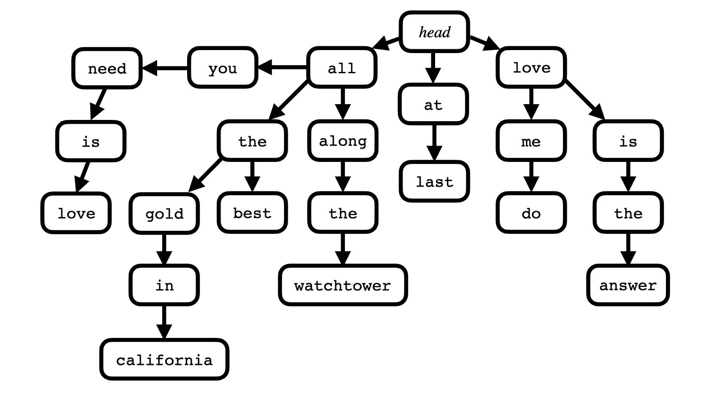

# *第十一章*：一些更多想法

我们在这本书中学到了一些有用的技术，包括可选值、容器、迭代器、算法、智能指针等。我们看到了这些概念的应用示例，并有机会进行实验并将它们应用于一些小型项目。现在让我们将这些技术应用于一些更多实际的想法。

在本章中，我们将介绍以下食谱：

+   为搜索建议创建一个 trie 类

+   计算两个向量的误差和

+   构建自己的算法：`split`

+   利用现有算法：`gather`

+   移除连续空白

+   将数字转换为文字

# 技术要求

你可以在 GitHub 上找到本章的代码文件 [`github.com/PacktPublishing/CPP-20-STL-Cookbook/tree/main/chap11`](https://github.com/PacktPublishing/CPP-20-STL-Cookbook/tree/main/chap11)。

# 为搜索建议创建一个 trie 类

*trie*，有时称为 *前缀树*，是一种搜索树类型，常用于预测文本和其他搜索应用。trie 是一种递归结构，旨在进行深度优先搜索，其中每个 *节点* 既是键又是另一个 trie。

一个常见的用例是 *字符串 trie*，其中每个节点是句子中的一个字符串。例如：



图 11.1 – 字符串 trie

我们通常从 trie 的 *头部* 开始搜索，寻找以特定单词开头的句子。在这个例子中，当我搜索 `all` 时，我得到三个节点：`you`、`the` 和 `along`。如果搜索 `love`，我得到 `me` 和 `is`。

字符串 trie 通常用于创建搜索建议。在这里，我们将使用 `std::map` 来实现字符串 trie 的结构。

## 如何做…

在这个食谱中，我们创建了一个递归 `trie` 类，它在一个 `std::map` 容器中存储节点。这是一个针对小内存 trie 的简单解决方案。这是一个相当大的类，所以我们只在这里展示重要的部分。

对于完整的类，请参阅源代码 [`github.com/PacktPublishing/CPP-20-STL-Cookbook/blob/main/chap11/trie.cpp`](https://github.com/PacktPublishing/CPP-20-STL-Cookbook/blob/main/chap11/trie.cpp)。

+   我们有一个便利别名：

    ```cpp
    using ilcstr = initializer_list<const char *>;
    ```

我们在搜索 `trie` 时使用 `ilcstr`。

+   我们将把这个类放在一个私有命名空间中，以避免冲突：

    ```cpp
    namespace bw {
        using std::map;
        using std::deque;
        using std::initializer_list;
    ```

在这个命名空间中，我们为了方便起见有一些 `using` 语句。

+   这个类本身被称为 `trie`。它有三个数据成员：

    ```cpp
    class trie {
        using get_t = deque<deque<string>>;
        using nodes_t = map<string, trie>;
        using result_t = std::optional<const trie*>;
        nodes_t nodes{};
        mutable get_t result_dq{};
        mutable deque<string> prefix_dq{};
    ```

`trie` 类有几个局部类型别名：

+   `get_t` 是一个 `deque` 的 `deque` 的 `string`，用于字符串结果。

+   `nodes_t` 是一个以 `string` 为键的 `trie` 类的映射。

+   `result_t` 是一个指向 `trie` 的指针的 `optional`，用于返回搜索结果。一个空的 `trie` 是一个有效的结果，所以我们使用 `optional` 值。

`nodes` 对象用于存储节点的递归 `map`，其中 `trie` 上的每个节点都是另一个 `trie`。

+   公共接口经常调用私有接口中的实用函数。例如，`insert()` 方法接受一个 `initializer_list` 对象并调用私有函数 `_insert()`：

    ```cpp
    void insert(const ilcstr& il) {
        _insert(il.begin(), il.end());
    }
    ```

私有的 `_insert()` 函数执行插入元素的工作：

```cpp
template <typename It>
void _insert(It it, It end_it) {
    if(it == end_it) return;
    nodes[*it]._insert(++it, end_it);
}
```

这便于进行必要的递归函数调用以导航 `trie`。注意，引用 `map` 中未出现的关键字会创建一个具有该键的空元素。因此，在 `nodes` 元素上调用 `_insert()` 的行，如果该元素不存在，将创建一个空的 `trie` 对象。

+   `get()` 方法返回一个 `get_t` 对象，它是 `deque` 的 `deque` 的 `string` 的别称。这允许我们返回多组结果：

    ```cpp
    get_t& get() const {
        result_dq.clear();
        deque<string> dq{};
        _get(dq, result_dq);
        return result_dq;
    }
    ```

`get()` 方法调用私有的 `_get()` 函数，该函数递归遍历 `trie`：

```cpp
void _get(deque<string>& dq, get_t& r_dq) const {
    if(empty()) {
        r_dq.emplace_back(dq);
        dq.clear();
    }
    for(const auto& p : nodes) {
        dq.emplace_back(p.first);
        p.second._get(dq, r_dq);
    }
}
```

+   `find_prefix()` 函数返回一个包含所有与部分字符串匹配的 `deque`。

    ```cpp
    deque<string>& find_prefix(const char * s) const {
        _find_prefix(s, prefix_dq);
        return prefix_dq;
    }
    ```

公共接口调用私有函数 `_find_prefix()`：

```cpp
void _find_prefix(const string& s, auto& pre_dq) const {
    if(empty()) return;
    for(const auto& [k, v] : nodes) {
        if(k.starts_with(s)) {
            pre_dq.emplace_back(k);
            v._find_prefix(k, pre_dq);
        }
    }
}
```

私有的 `_find_prefix()` 函数递归遍历 `trie`，将前缀与每个键的开头进行比较。`starts_with()` 方法是 C++20 中的新功能。在较旧的 STL 中，您可以使用 `find()` 方法并检查返回值是否为 `0`：

```cpp
if(k.find(s) == 0) {
    ...
```

+   `search()` 函数返回一个 `optional<const trie*>`，别名为 `result_t`。它有两个重载版本：

    ```cpp
    result_t search(const ilcstr& il) const {
        return _search(il.begin(), il.end());
    }
    result_t search(const string& s) const {
        const ilcstr il{s.c_str()};
        return _search(il.begin(), il.end());
    }
    ```

这些方法将迭代器传递给私有成员函数 `_search()`，该函数执行搜索工作：

```cpp
template <typename It>
result_t _search(It it, It end_it) const {
    if(it == end_it) return {this};
    auto found_it = nodes.find(*it);
    if(found_it == nodes.end()) return {};
    return found_it->second._search(++it, end_it);
}
```

`_search()` 函数递归搜索，直到找到匹配项，然后返回 `result_t` 对象中的一个节点。如果没有找到匹配项，它返回非值 `optional`。

+   我们还有两个重载版本的 `print_trie_prefix()` 函数。此函数从用作搜索键的前缀打印 `trie` 的内容。一个版本使用 `string` 作为前缀，另一个使用 C-字符串的 `initializer_list`：

    ```cpp
    void print_trie_prefix(const bw::trie& t,
            const string& prefix) {
        auto& trie_strings = t.get();
        cout << format("results for \"{}...\":\n", prefix);
        for(auto& dq : trie_strings) {
            cout << format("{} ", prefix);
            for(const auto& s : dq) cout << format("{} ", s);
            cout << '\n';
        }
    }
    void print_trie_prefix(const bw::trie& t,
            const ilcstr & prefix) {
        string sprefix{};
        for(const auto& s : prefix) sprefix += 
            format("{} ", s);
        print_trie_prefix(t, sprefix);
    }
    ```

这些函数调用 `get()` 成员函数从 `trie` 中检索结果。

+   现在，我们可以在 `main()` 函数中测试 `trie` 类。首先，我们声明一个 `trie` 并插入一些句子：

    ```cpp
    int main() {
        bw::trie ts;
        ts.insert({ "all", "along", "the", "watchtower" });
        ts.insert({ "all", "you", "need", "is", "love" });
        ts.insert({ "all", "shook", "up" });
        ts.insert({ "all", "the", "best" });
        ts.insert({ "all", "the", "gold", "in",
            "california" });
        ts.insert({ "at", "last" });
        ts.insert({ "love", "the", "one", "you're",        "with" });
        ts.insert({ "love", "me", "do" });
        ts.insert({ "love", "is", "the", "answer" });
        ts.insert({ "loving", "you" });
        ts.insert({ "long", "tall", "sally" });
        ...
    ```

`insert()` 调用传递一个包含句子中所有字符串的 `initializer_list`。句子中的每个字符串都插入到 `trie` 的层次结构中。

+   现在我们可以搜索 `trie`。这里是一个简单的搜索，搜索单个字符串 `"love"`。

    ```cpp
    const auto prefix = {"love"};
    if (auto st = ts.search(prefix); st.have_result) {
        print_trie_prefix(*st.t, prefix);
    }
    cout << '\n';
    ```

这将 `ts.search()` 与一个包含一个 C-字符串的 `initializer_list`（称为 `prefix`）一起调用。然后，将结果以及 `prefix` 传递给 `print_trie_prefix()` 函数。

输出是：

```cpp
results for "love...":
love is the answer
love me do
love the one you're with
```

+   这里是一个搜索两个字符串前缀的例子：

    ```cpp
    const auto prefix = {"all", "the"};
    if (auto st = ts.search(prefix); st.have_result) {
        print_trie_prefix(*st.t, prefix);
    }
    cout << '\n';
    ```

输出：

```cpp
results for "all the ...":
all the  best
all the  gold in california
```

+   这里是一个使用 `find_prefix()` 函数搜索部分前缀的例子：

    ```cpp
    const char * prefix{ "lo" };
    auto prefix_dq = ts.find_prefix(prefix);
    for(const auto& s : prefix_dq) {
        cout << format("match: {} -> {}\n", prefix, s);
        if (auto st = ts.search(s); st.have_result) {
            print_trie_prefix(*st.t, s);
        }
    }
    cout << '\n';
    ```

输出：

```cpp
match: lo -> long
results for "long...":
long tall sally
match: lo -> love
results for "love...":
love is the answer
love me do
love the one you're with
match: lo -> loving
results for "loving...":
loving you
```

`find_prefix()` 搜索返回了几个结果，我们将每个结果传递给其自己的搜索，从而为每个结果产生了多个结果。

## 它是如何工作的…

`trie` 类的数据存储在递归的 `map` 容器中。`map` 中的每个节点都包含另一个 `trie` 对象，该对象反过来又有一个自己的 `map` 节点。

```cpp
using nodes_t = map<string, trie>
```

`_insert()` 函数接受 `begin` 和 `end` 迭代器，并使用它们递归地在新节点上调用 `_insert()`：

```cpp
template <typename It>
void _insert(It it, It end_it) {
    if(it == end_it) return;
    nodes[*it]._insert(++it, end_it);
}
```

同样，`_search()` 函数递归地在其找到的节点上调用 `_search()`：

```cpp
template <typename It>
result_t _search(It it, It end_it) const {
    if(it == end_it) return {this};
    auto found_it = nodes.find(*it);
    if(found_it == nodes.end()) return {};
    return found_it->second._search(++it, end_it);
}
```

使用 `std::map` 的这种递归方法使我们能够简洁且高效地实现 trie 类。

# 计算两个向量的误差和

给定两个仅量化或分辨率不同的相似向量，我们可以使用 `inner_product()` 算法来计算一个 *误差和*，定义为：


图 11.2 – 错误和定义

其中 *e* 是误差和，即两个向量中一系列点之间差值的平方和。

我们可以使用来自 `<numeric>` 头文件的 `inner_product()` 算法来计算两个向量之间的误差和。

## 如何做到这一点...

在这个菜谱中，我们定义了两个向量，每个向量都有一个 *正弦波*。一个 `vector` 的值类型为 `double`，另一个的值类型为 `int`。这给了我们量化不同的向量，因为 `int` 类型不能表示分数值。然后我们使用 `inner_product()` 来计算两个向量之间的误差和：

+   在我们的 `main()` 函数中，我们定义了我们的向量和方便的 `index` 变量：

    ```cpp
    int main() {
        constexpr size_t vlen{ 100 };
        vector<double> ds(vlen);
        vector<int> is(vlen);
        size_t index{};
        ...
    ```

`ds` 是 `double` 正弦波的 `vector`，`is` 是 `int` 正弦波的 `vector`。每个 `vector` 有 100 个元素来存储正弦波。`index` 变量用于初始化 `vector` 对象。

+   我们使用循环和 lambda 在 `double` 正弦波的 `vector` 中生成正弦波：

    ```cpp
    auto sin_gen = [&index]{
      return 5.0 * sin(index++ * 2 * pi / 100);
    };
    for(auto& v : ds) v = sin_gen();
    ```

Lambda 捕获了对 `index` 变量的引用，以便它可以递增。

`pi` 常量来自 `std::numbers` 库。

+   现在我们有一个 `double` 正弦波，我们可以用它来推导出 `int` 版本：

    ```cpp
    index = 0;
    for(auto& v : is) {
        v = static_cast<int>(round(ds.at(index++)));
    }
    ```

这将 `ds` 中的每个点取整，将其转换为 `int`，并在 `is` 容器中更新其位置。

+   我们使用简单的循环显示我们的正弦波：

    ```cpp
    for(const auto& v : ds) cout << format("{:-5.2f} ", v);
    cout << "\n\n";
    for(const auto& v : is) cout << format("{:-3d} ", v);
    cout << "\n\n";
    ```

我们的输出是两个容器中的正弦波数据点：

```cpp
0.00  0.31  0.63  0.94  1.24  1.55  1.84  2.13  2.41
0.00  0.31  0.63  0.94  1.24  1.55  1.84  2.13  2.41
2.68  2.94  3.19  3.42  3.64  3.85  4.05  4.22  4.38
4.52  4.65  4.76  4.84  4.91  4.96  4.99  5.00  4.99
4.96  4.91  4.84  4.76  4.65  4.52  4.38  4.22  4.05
3.85  3.64  3.42  3.19  2.94  2.68  2.41  2.13  1.84
1.55  1.24  0.94  0.63  0.31  0.00 -0.31 -0.63 -0.94 -1.24 -1.55 -1.84 -2.13 -2.41 -2.68 -2.94 -3.19 -3.42 -3.64 -3.85 -4.05 -4.22 -4.38 -4.52 -4.65 -4.76 -4.84 -4.91 -4.96 -4.99 -5.00 -4.99 -4.96 -4.91 -4.84 -4.76 -4.65 -4.52 -4.38 -4.22 -4.05 -3.85 -3.64 -3.42 -3.19 -2.94 -2.68 -2.41 -2.13 -1.84 -1.55 -1.24 -0.94 -0.63 -0.31
0   0   1   1   1   2   2   2   2   3   3   3   3   4   4 4   4   4   5   5   5   5   5   5   5   5   5   5   5   5 5   5   5   4   4   4   4   4   3   3   3   3   2   2   2 2   1   1   1   0   0   0   -1   -1   -1   -2   -2   -2 -2   -3   -3   -3   -3   -4   -4   -4   -4   -4   -5   -5 -5   -5   -5   -5   -5   -5   -5   -5   -5   -5   -5   -5 -5   -4   -4   -4   -4   -4   -3   -3   -3   -3   -2   -2 -2   -2   -1   -1   -1   0
```

+   现在我们使用 `inner_product()` 来计算错误和：

    ```cpp
    double errsum = inner_product(ds.begin(), ds.end(), 
        is.begin(), 0.0, std::plus<double>(),
        [](double a, double b){ return pow(a - b, 2); });
    cout << format("error sum: {:.3f}\n\n", errsum);
    ```

Lambda 表达式返回公式中的 (*a*i – *b*i)² 部分。`std::plus()` 算法执行求和操作。

输出：

```cpp
error sum: 7.304
```

## 它是如何工作的...

`inner_product()` 算法在第一个输入范围内计算乘积的和。其签名是：

```cpp
T inner_product(InputIt1 first1, InputIt1 last1,
    InputIt2 first2, T init, BinaryOperator1 op1,
    BinaryOperator2 op2)
```

函数接受两个二元运算符函数，`op1` 和 `op2`。第一个 `op1` 用于 *求和*，第二个 `op2` 用于 *乘积*。我们使用 `std::plus()` 作为求和运算符，并使用 lambda 作为乘积运算符。

`init` 参数可以用作起始值或偏差。我们传递给它字面值，`0.0`。

返回值是乘积的累积和。

## 还有更多...

我们可以通过将 `inner_product()` 放入循环来计算累积的错误和：

```cpp
cout << "accumulated error:\n";
for (auto it{ds.begin()}; it != ds.end(); ++it) {
    double accumsum = inner_product(ds.begin(), it, 
        is.begin(), 0.0, std::plus<double>(),
        [](double a, double b){ return pow(a - b, 2); });
    cout << format("{:-5.2f} ", accumsum);
}
cout << '\n';
```

输出：

```cpp
accumulated error:
0.00  0.00  0.10  0.24  0.24  0.30  0.51  0.53  0.55  0.72  0.82  0.82  0.86  1.04  1.16  1.19  1.19  1.24  1.38  1.61  1.73  1.79  1.82  1.82  1.83  1.83  1.83  1.83  1.83  1.84  1.86  1.92  2.04  2.27  2.42  2.46  2.47  2.49  2.61  2.79  2.83  2.83  2.93  3.10  3.12  3.14  3.35  3.41  3.41  3.55  3.65  3.65  3.75  3.89  3.89  3.95  4.16  4.19  4.20  4.37  4.47  4.48  4.51  4.69  4.82  4.84  4.84  4.89  5.03  5.26  5.38  5.44  5.47  5.48  5.48  5.48  5.48  5.48  5.48  5.49  5.51  5.57  5.70  5.92  6.07  6.12  6.12  6.14  6.27  6.45  6.48  6.48  6.59  6.75  6.77  6.80  7.00  7.06  7.07  7.21
```

这可能在某些统计应用中很有用。

# 构建你自己的算法：split

STL 有一个丰富的 `algorithm` 库。然而，有时你可能发现它缺少你需要的东西。一个常见的需求是 `split` 函数。

一个 `split` 函数在字符分隔符上拆分字符串。例如，这是一个来自标准 Debian 安装的 Unix `/etc/passwd` 文件：

```cpp
root:x:0:0:root:/root:/bin/bash
daemon:x:1:1:daemon:/usr/sbin:/usr/sbin/nologin
bin:x:2:2:bin:/bin:/usr/sbin/nologin
sys:x:3:3:sys:/dev:/usr/sbin/nologin
sync:x:4:65534:sync:/bin:/bin/sync
```

每个字段由冒号 `:` 字符分隔，字段包括：

1.  登录名

1.  可选加密密码

1.  用户 ID

1.  组 ID

1.  用户名或注释

1.  主目录

1.  可选命令解释器

这是一个基于 POSIX 的操作系统中的标准文件，还有其他类似文件。大多数脚本语言都包含一个用于在分隔符上拆分字符串的内置函数。在 C++ 中有简单的方法来做这件事，尽管 `std::string` 只是 STL 中的另一个容器，一个在分隔符上拆分容器的通用算法可以作为工具箱中的一个有用的补充。所以，让我们构建一个。

## 如何实现...

在这个菜谱中，我们构建了一个通用算法，该算法在分隔符上拆分容器并将结果放入目标容器中。

+   我们算法位于 `bw` 命名空间中，以避免与 `std` 冲突：

    ```cpp
    namespace bw {
        template<typename It, typename Oc, typename V,
            typename Pred>
        It split(It it, It end_it, Oc& dest,
                const V& sep, Pred& f) {
            using SliceContainer = typename 
              Oc::value_type;
            while(it != end_it) {
                SliceContainer dest_elm{};
                auto slice{ it };
                while(slice != end_it) {
                    if(f(*slice, sep)) break;
                    dest_elm.push_back(*slice++);
                }
                dest.push_back(dest_elm);
                if(slice == end_it) return end_it;
                it = ++slice;
            }
            return it;
        }
    };
    ```

`split()` 算法在容器中搜索分隔符，并将分离的片段收集到一个新的输出容器中，其中每个片段都是输出容器内的容器。

我们希望 `split()` 算法尽可能通用，就像 `algorithm` 库中的那些一样。这意味着所有参数都是模板化的，代码将能够与各种参数类型一起工作。

首先，让我们看看模板参数：

+   `It` 是源容器的输入迭代器类型。

+   `Oc` 是输出容器类型。这是一个容器容器。

+   `V` 是分隔符类型。

+   `Pred` 用于谓词函数。

我们的输出类型是一个容器容器。它需要容纳切片容器。它可以是 `vector<string>`，其中字符串值是切片，或者 `vector<vector<int>>`，其中内层的 `vector<int>` 包含切片。这意味着我们需要从输出容器类型派生出内部容器的类型。我们通过函数体内的 `using` 声明来实现这一点。

```cpp
using SliceContainer = typename Oc::value_type;
```

这也是为什么我们不能使用输出迭代器作为输出参数的原因。根据定义，输出迭代器无法确定其内容的类型，其 `value_type` 被设置为 `void`。

我们使用 `SliceContainer` 定义一个临时容器，该容器通过语句添加到输出容器中：

```cpp
dest.push_back(dest_elm);
```

+   谓词是一个二元运算符，它比较输入元素与分隔符。我们在 `bw` 命名空间中包含了一个默认的相等运算符：

    ```cpp
    constexpr auto eq = [](const auto& el, const auto& sep) {
        return el == sep;
    };
    ```

+   我们还包括一个使用默认 `eq` 操作符的 `split()` 特殊化：

    ```cpp
    template<typename It, typename Oc, typename V>
    It split(It it, const It end_it, Oc& dest, const V& sep) {
        return split(it, end_it, dest, sep, eq);
    }
    ```

+   因为拆分 `string` 对象是这个算法的常见用例，所以我们包括一个用于该特定目的的辅助函数：

    ```cpp
    template<typename Cin, typename Cout, typename V>
    Cout& strsplit(const Cin& str, Cout& dest, const V& sep) {
        split(str.begin(), str.end(), dest, sep, eq);
        return dest;
    }
    ```

+   我们通过 `main()` 函数测试我们的拆分算法，从一个 `string` 对象开始：

    ```cpp
    int main() {
        constexpr char strsep{ ':' };
        const string str
            { "sync:x:4:65534:sync:/bin:/bin/sync" };
        vector<string> dest_vs{};
        bw::split(str.begin(), str.end(), dest_vs, strsep, 
            bw::eq);
        for(const auto& e : dest_vs) cout <<
            format("[{}] ", e);
        cout << '\n';
    }
    ```

我们使用 `/etc/passwd` 文件中的字符串来测试我们的算法，得到以下结果：

```cpp
[sync] [x] [4] [65534] [sync] [/bin] [/bin/sync]
```

+   使用我们的 `strsplit()` 辅助函数甚至更简单：

    ```cpp
    vector<string> dest_vs2{};
    bw::strsplit(str, dest_vs2, strsep);
    for(const auto& e : dest_vs2) cout << format("[{}] ", e);
    cout << '\n';
    ```

输出：

```cpp
[sync] [x] [4] [65534] [sync] [/bin] [/bin/sync]
```

这将使解析 `/etc/passwd` 文件变得容易。

+   当然，我们可以使用相同的算法来处理任何容器：

    ```cpp
    constexpr int intsep{ -1 };
    vector<int> vi{ 1, 2, 3, 4, intsep, 5, 6, 7, 8, intsep,
        9, 10, 11, 12 };
    vector<vector<int>> dest_vi{};
    bw::split(vi.begin(), vi.end(), dest_vi, intsep);
    for(const auto& v : dest_vi) {
        string s;
        for(const auto& e : v) s += format("{}", e);
        cout << format("[{}] ", s);
    }
    cout << '\n';
    ```

输出：

```cpp
[1234] [5678] [9101112]
```

## 它是如何工作的…

分割算法本身相对简单。这个菜谱中的魔法在于使用模板使其尽可能通用。

`using` 声明中定义的派生类型允许我们创建一个用于输出容器的容器：

```cpp
using SliceContainer = typename Oc::value_type;
```

这给我们一个 `SliceContainer` 类型，我们可以用它来创建切片的容器：

```cpp
SliceContainer dest_elm{};
```

这是一个临时容器，它被添加到输出容器中的每个切片：

```cpp
dest.push_back(dest_elm);
```

# 利用现有算法：聚集

`gather()` 是利用现有算法的算法示例。

`gather()` 算法接受一对容器迭代器，并将满足谓词的元素移动到序列中的枢轴位置，返回一个包含满足谓词的元素的迭代器对。

例如，我们可以使用 `gather` 算法将所有偶数排序到 `vector` 的中点：

```cpp
vector<int> vint{ 0, 1, 2, 3, 4, 5, 6, 7, 8, 9 };
gather(vint.begin(), vint.end(), mid(vint), is_even);
for(const auto& el : vint) cout << el;
```

我们输出的是：

```cpp
1302468579
```

注意，所有的偶数都位于输出的中间。

在这个菜谱中，我们将使用标准 STL 算法实现一个 `gather` 算法。

## 如何做…

我们的 `gather` 算法使用 `std::stable_partition()` 算法将元素移动到枢轴迭代器之前，然后再移动到枢轴之后。

+   我们将算法放在 `bw` 命名空间中，以避免冲突。

    ```cpp
    namespace bw {
    using std::stable_partition;
    using std::pair;
    using std::not_fn;
    template <typename It, typename Pred>
    pair<It, It> gather(It first, It last, It pivot,
            Pred pred) {
        return {stable_partition(first, pivot, not_fn(pred)),
                stable_partition(pivot, last, pred)};
    }
    };
    ```

`gather()` 算法返回一个迭代器对，这是从两次调用 `stable_partition()` 返回的。

+   我们还包含了一些辅助的 lambda 表达式：

    ```cpp
    constexpr auto midit = [](auto& v) {
        return v.begin() + (v.end() - v.begin()) / 2;
    };
    constexpr auto is_even = [](auto i) {
        return i % 2 == 0;
    };
    constexpr auto is_even_char = [](auto c) {
        if(c >= '0' && c <= '9') return (c - '0') % 2 == 0;
        else return false;
    };
    ```

这三个 lambda 表达式如下：

+   `midit` 返回一个在容器中点位置的迭代器，用作枢轴点。

+   `is_even` 如果值是偶数，则返回布尔值 `true`，用作谓词。

+   `is_even_char` 如果值是介于 `'0'` 和 `'9'` 之间的字符且为偶数，则返回布尔值 `true`，用作谓词。

+   我们从 `main()` 函数中调用 `gather()`，传递一个 `int` 类型的向量，如下所示：

    ```cpp
    int main() {
        vector<int> vint{ 0, 1, 2, 3, 4, 5, 6, 7, 8, 9 };
        auto gathered_even = bw::gather(vint.begin(),
            vint.end(), bw::midit(vint), bw::is_even);
        for(const auto& el : vint) cout << el;
        cout << '\n';
    }
    ```

我们的输出显示偶数已经被聚集在中间：

```cpp
1302468579
```

`gather()` 函数返回一个包含仅偶数值的迭代器对：

```cpp
auto& [it1, it2] = gathered_even;
for(auto it{ it1 }; it < it2; ++it) cout << *it;
cout << '\n';
```

输出：

```cpp
02468
```

+   我们可以将枢轴点设置为 `begin()` 或 `end()` 迭代器：

    ```cpp
    bw::gather(vint.begin(), vint.end(), vint.begin(), 
        bw::is_even);
    for(const auto& el : vint) cout << el;
    cout << '\n';
    bw::gather(vint.begin(), vint.end(), vint.end(),
        bw::is_even);
    for(const auto& el : vint) cout << el;
    cout << '\n';
    ```

输出：

```cpp
0246813579
1357902468
```

+   因为 `gather()` 是基于迭代器的，所以我们可以用它与任何容器一起使用。这里是一个字符数字的字符串：

    ```cpp
    string jenny{ "867-5309" };
    bw::gather(jenny.begin(), jenny.end(), jenny.end(),
        bw::is_even_char);
    for(const auto& el : jenny) cout << el;
    cout << '\n';
    ```

这将所有偶数位移动到字符串的末尾：

输出：

```cpp
7-539860
```

## 它是如何工作的…

`gather()` 函数使用 `std::stable_partition()` 算法将匹配谓词的元素移动到枢轴点。

`gather()` 函数调用了两次 `stable_partition()`，一次是使用谓词，另一次是使用否定谓词：

```cpp
template <typename It, typename Pred>
pair<It, It> gather(It first, It last, It pivot, Pred pred) {
    return { stable_partition(first, pivot, not_fn(pred)),
             stable_partition(pivot, last, pred) };
}
```

从两个 `stable_partition()` 调用返回的迭代器在 `pair` 中返回。

# 删除连续空白

当从用户接收输入时，字符串中经常会有过多的连续空白字符。这个菜谱提供了一个用于删除连续空格的函数，即使它包括制表符或其他空白字符。

## 如何做…

这个函数利用 `std::unique()` 算法从字符串中移除连续的空白字符。

+   在 `bw` 命名空间中，我们从一个检测空白的函数开始：

    ```cpp
    template<typename T>
    bool isws(const T& c) {
        constexpr const T whitespace[]{ " \t\r\n\v\f" };
        for(const T& wsc : whitespace) {
            if(c == wsc) return true;
        }    
        return false;
    }
    ```

这个模板化的 `isws()` 函数应该可以与任何字符类型一起工作。

+   `delws()` 函数使用 `std::unique()` 来擦除字符串中的连续空白字符：

    ```cpp
    string delws(const string& s) {
        string outstr{s};
        auto its = unique(outstr.begin(), outstr.end(),
            [](const auto &a, const auto &b) {
                return isws(a) && isws(b);
            });
        outstr.erase(its, outstr.end());
        outstr.shrink_to_fit();
        return outstr;
    }
    ```

`delws()` 函数会复制输入的字符串，移除连续的空白字符，并返回新的字符串。

+   我们在 `main()` 中使用一个 `string` 来调用它：

    ```cpp
    int main() {
        const string s{ "big     bad    \t   wolf" };
        const string s2{ bw::delws(s) };
        cout << format("[{}]\n", s);
        cout << format("[{}]\n", s2);
        return 0;
    }
    ```

输出：

```cpp
[big     bad           wolf]
[big bad wolf]
```

## 它是如何工作的...

这个函数使用 `std::unique()` 算法和比较 lambda 表达式来在一个 `string` 对象中找到连续的空白字符。

比较 lambda 调用我们自己的 `isws()` 函数来确定我们是否找到了连续的空白字符：

```cpp
auto its = unique(outstr.begin(), outstr.end(),
    [](const auto &a, const auto &b) {
        return isws(a) && isws(b);
    });
```

我们可以使用标准库中的 `isspace()` 函数，但它是一个依赖于从 `int` 到 `char` 的类型缩窄转换的标准 C 函数。这可能在某些现代 C++ 编译器上引发警告，并且不能保证在没有显式转换的情况下工作。我们的 `isws()` 函数使用模板类型，应该可以在任何系统上工作，并且与任何 `std::string` 的特化一起工作。

# 将数字转换为文字

在我的职业生涯中，我使用过很多编程语言。在学习一门新语言时，我喜欢有一个项目来工作，这样我可以接触到语言的细微差别。`numwords` 类是我最喜欢的这种用途的练习之一。多年来，我曾在数十种语言中编写过它，包括几次在 C 和 C++ 中。

`numwords` 是一个将数字转换为文字的类。它在应用中的样子如下：

```cpp
int main() {
    bw::numword nw{};
    uint64_t n;
    nw = 3; bw::print("n is {}, {}\n", nw.getnum(), nw);
    nw = 47; bw::print("n is {}, {}\n", nw.getnum(), nw);
    n = 100073; bw::print("n is {}, {}\n", n, 
      bw::numword{n});
    n = 1000000001; bw::print("n is {}, {}\n", n, 
      bw::numword{n});
    n = 123000000000; bw::print("n is {}, {}\n", n, 
      bw::numword{n});
    n = 1474142398007; bw::print("n is {}, {}\n", n, 
      nw.words(n));
    n = 999999999999999999; bw::print("n is {}, {}\n", n, 
      nw.words(n));
    n = 1000000000000000000; bw::print("n is {}, {}\n", n, 
        nw.words(n));
}
```

输出：

```cpp
n is 3, three
n is 47, forty-seven
n is 100073, one hundred thousand seventy-three
n is 1000000001, one billion one
n is 123000000000, one hundred twenty-three billion
n is 1474142398007, one trillion four hundred seventy-four billion one hundred forty-two million three hundred ninety-eight thousand seven
n is 999999999999999999, nine hundred ninety-nine quadrillion nine hundred ninety-nine trillion nine hundred ninety-nine billion nine hundred ninety-nine million nine hundred ninety-nine thousand nine hundred ninety-nine
n is 1000000000000000000, error
```

## 如何做到这一点...

这个菜谱最初是作为一个创建生产就绪代码的练习而出现的。因此，它分布在三个不同的文件中：

+   `numword.h` 是 `numwords` 类的头文件/接口文件。

+   `numword.cpp` 是 `numwords` 类的实现文件。

+   `numword-test.cpp` 是用于测试 `numword` 类的应用程序文件。

类本身大约有 180 行代码，所以我们只概述一下亮点。你可以在 [`github.com/PacktPublishing/CPP-20-STL-Cookbook/tree/main/chap11/numword`](https://github.com/PacktPublishing/CPP-20-STL-Cookbook/tree/main/chap11/numword) 找到完整的源代码。

+   在 `numword.h` 文件中，我们将类放在 `bw` 命名空间中，并开始使用一些 `using` 语句：

    ```cpp
    namespace bw {
        using std::string;
        using std::string_view;
        using numnum = uint64_t; 
        using bufstr = std::unique_ptr<string>;
    ```

我们在代码中使用了 `string` 和 `string_view` 对象。

`uint64_t` 是我们的主要整数类型，因为它可以存储非常大的数字。由于类名为 `numword`，我喜欢 `numnum` 作为整数类型。

`_bufstr` 是主要输出缓冲区。它是一个 `string`，被 `unique_ptr` 包装，这处理了内存管理以实现自动 RAII 兼容。

+   我们还有一些用于各种目的的常量：

    ```cpp
    constexpr numnum maxnum = 999'999'999'999'999'999;
    constexpr int zero_i{ 0 };
    constexpr int five_i{ 5 };
    constexpr numnum zero{ 0 };
    constexpr numnum ten{ 10 };
    constexpr numnum twenty{ 20 };
    constexpr numnum hundred{ 100 };
    constexpr numnum thousand{ 1000 };
    ```

`maxnum` 常数翻译为 "九百九十九兆九百九十九万亿九百九十九亿九百九十九千万九百九十九"，对于大多数用途来说应该足够了。

其余的 `numnum` 常数用于避免代码中的字面量。

+   主要数据结构是 `constexpr` 数组，包含 `string_view` 对象，代表输出中使用的单词。`string_view` 类对于这些常量来说非常完美，因为它提供了最小开销的封装：

    ```cpp
    constexpr string_view errnum{ "error" };
    constexpr string_view _singles[] {
        "zero", "one", "two", "three", "four", "five", 
        "six", "seven", "eight", "nine"
    };
    constexpr string_view _teens[] {
        "ten", "eleven", "twelve", "thirteen", "fourteen", 
        "fifteen", "sixteen", "seventeen", "eighteen", 
        "nineteen"
    };
    constexpr string_view _tens[] {
        errnum, errnum, "twenty", "thirty", "forty", 
        "fifty", "sixty", "seventy", "eighty", "ninety",
    };
    constexpr string_view _hundred_string = "hundred";
    constexpr string_view _powers[] {
        errnum, "thousand", "million", "billion", 
        "trillion", "quadrillion"
    };
    ```

单词被分组到各个部分，这对于将数字转换为单词很有用。许多语言使用类似的分解，因此这种结构应该很容易翻译到那些语言。

+   `numword` 类有几个私有成员：

    ```cpp
    class numword {
        bufstr _buf{ std::make_unique<string>(string{}) };
        numnum _num{};
        bool _hyphen_flag{ false };
    ```

    +   `_buf` 是输出字符串缓冲区。其内存由 `unique_ptr` 管理。

    +   `_num` 保存当前的数值。

    +   `_hyphen_flag` 在翻译过程中用于在单词之间插入连字符，而不是空格字符。

+   这些私有方法用于操作输出缓冲区。

    ```cpp
    void clearbuf();
    size_t bufsize();
    void appendbuf(const string& s);
    void appendbuf(const string_view& s);
    void appendbuf(const char c);
    void appendspace();
    ```

此外，还有一个用于计算 `numnum` 类型中 *x*y 的私有方法 `pow_i()`：

```cpp
numnum pow_i(const numnum n, const numnum p);
```

`pow_i()` 用于区分数字值的部分以进行单词输出。

+   公共接口包括构造函数和调用 `words()` 方法的各种方式，该方法是翻译 `numnum` 到单词字符串的工作：

    ```cpp
    numword(const numnum& num = 0) : _num(num) {}
    numword(const numword& nw) : _num(nw.getnum()) {}
    const char * version() const { return _version; }
    void setnum(const numnum& num) { _num = num; }
    numnum getnum() const { return _num; }
    numnum operator= (const numnum& num);
    const string& words();
    const string& words(const numnum& num);
    const string& operator() (const numnum& num) {
        return words(num); };
    ```

+   在实现文件 `numword.cpp` 中，大部分工作是在 `words()` 成员函数中处理的：

    ```cpp
    const string& numword::words( const numnum& num ) {
        numnum n{ num };
        clearbuf();
        if(n > maxnum) {
            appendbuf(errnum);
            return *_buf;
        }
        if (n == 0) {
            appendbuf(_singles[n]);
            return *_buf;
        }
        // powers of 1000
        if (n >= thousand) {
            for(int i{ five_i }; i > zero_i; --i) {
                numnum power{ pow_i(thousand, i) };
                numnum _n{ ( n - ( n % power ) ) / power };
                if (_n) {
                    int index = i;
                    numword _nw{ _n };
                    appendbuf(_nw.words());
                    appendbuf(_powers[index]);
                    n -= _n * power;
                }
            }
        }
        // hundreds
        if (n >= hundred && n < thousand) {
            numnum _n{ ( n - ( n % hundred ) ) / hundred };
            numword _nw{ _n };
            appendbuf(_nw.words());
            appendbuf(_hundred_string);
            n -= _n * hundred;
        }
        // tens
        if (n >= twenty && n < hundred) {
            numnum _n{ ( n - ( n % ten ) ) / ten };
            appendbuf(_tens[_n]);
            n -= _n * ten;
            _hyphen_flag = true;
        }
        // teens
        if (n >= ten && n < twenty) {
            appendbuf(_teens[n - ten]);
            n = zero;
        }
        // singles
        if (n > zero && n < ten) {
            appendbuf(_singles[n]);
        }
        return *_buf;
    }
    ```

函数的每个部分都递归地使用十的幂的模数剥离数字的一部分，并在千位的情况下追加来自 `string_view` 常量数组的字符串。

+   `appendbuf()` 有三个重载。一个添加一个 `string`：

    ```cpp
    void numword::appendbuf(const string& s) {
        appendspace();
        _buf->append(s);
    }
    ```

另一个添加一个 `string_view`：

```cpp
void numword::appendbuf(const string_view& s) {
    appendspace();
    _buf->append(s.data());
}
```

第三个添加单个字符：

```cpp
void numword::appendbuf(const char c) {
    _buf->append(1, c);
}
```

`appendspace()` 方法根据上下文添加空格字符或连字符：

```cpp
void numword::appendspace() {
    if(bufsize()) {
        appendbuf( _hyphen_flag ? _hyphen : _space);
        _hyphen_flag = false;
    }
}
```

+   `numword-test.cpp` 文件是 `bw::numword` 的测试环境。它包括一个 `formatter` 特化：

    ```cpp
    template<>
    struct std::formatter<bw::numword>: std::formatter<unsigned> {
        template<typename FormatContext>
        auto format(const bw::numword& nw, 
          FormatContext& ctx) {
            bw::numword _nw{nw};
            return format_to(ctx.out(), "{}", 
              _nw.words());
        }
    };
    ```

这允许我们直接将 `bw::numword` 对象传递给 `format()`。

+   此外，还有一个 `print()` 函数，它将 `formatter` 输出直接发送到 `stdout`，完全绕过 `cout` 和 `iostream` 库：

    ```cpp
    namespace bw {
        template<typename... Args> constexpr void print(
                const std::string_view str_fmt, Args&&... 
                  args) {
            fputs(std::vformat(str_fmt, 
                std::make_format_args(args...)).c_str(), 
                stdout);
        }
    };
    ```

这允许我们使用 `print("{}\n", nw)` 而不是通过 `cout` 管道 `format()`。这样的函数将被包含在 C++23 标准。现在可以像这样简单地包含它。

+   在 `main()` 中，我们声明一个 `bw::numword` 对象和一个 `uint64_t` 用于测试：

    ```cpp
    int main() {
        bw::numword nw{};
        uint64_t n{};
        bw::print("n is {}, {}\n", nw.getnum(), nw);
        ...
    ```

`numword` 对象初始化为零，这使得我们的 `print()` 语句产生以下输出：

```cpp
n is 0, zero
```

+   我们测试了调用 `numword` 的各种方式：

    ```cpp
    nw = 3; bw::print("n is {}, {}\n", nw.getnum(), nw);
    nw = 47; bw::print("n is {}, {}\n", nw.getnum(), nw);
    ...
    n = 100073; bw::print("n is {}, {}\n", n, bw::numword{n});
    n = 1000000001; bw::print("n is {}, {}\n", n, bw::numword{n});
    ...
    n = 474142398123; bw::print("n is {}, {}\n", n, nw(n));
    n = 1474142398007; bw::print("n is {}, {}\n", n, nw(n));
    ...
    n = 999999999999999999; bw::print("n is {}, {}\n", n, nw(n));
    n = 1000000000000000000; bw::print("n is {}, {}\n", n, nw(n));
    ```

输出：

```cpp
n is 3, three
n is 47, forty-seven
...
n is 100073, one hundred thousand seventy-three
n is 1000000001, one billion one
...
n is 474142398123, four hundred seventy-four billion one hundred forty-two million three hundred ninety-eight thousand one hundred twenty-three
n is 1474142398007, one trillion four hundred seventy-four billion one hundred forty-two million three hundred ninety-eight thousand seven
...
n is 999999999999999999, nine hundred ninety-nine quadrillion nine hundred ninety-nine trillion nine hundred ninety-nine billion nine hundred ninety-nine million nine hundred ninety-nine thousand nine hundred ninety-nine
n is 1000000000000000000, error
```

## 它是如何工作的…

这个类在很大程度上是由数据结构驱动的。通过将 `string_view` 对象组织成数组，我们可以轻松地将标量值转换为相应的单词：

```cpp
appendbuf(_tens[_n]);  // e.g., _tens[5] = "fifty"
```

其余部分主要是数学：

```cpp
numnum power{ pow_i(thousand, i) };
numnum _n{ ( n - ( n % power ) ) / power };
if (_n) {
    int index = i;
    numword _nw{ _n };
    appendbuf(_nw.words());
    appendbuf(_powers[index]);
    n -= _n * power;
}
```

## 还有更多…

我还有一个使用 `numwords` 类来用文字报时的实用工具。它的输出看起来像这样：

```cpp
$ ./saytime
three past five
```

在测试模式下，它给出以下输出：

```cpp
$ ./saytime test
00:00 midnight
00:01 one past midnight
11:00 eleven o'clock
12:00 noon
13:00 one o'clock
12:29 twenty-nine past noon
12:30 half past noon
12:31 twenty-nine til one
12:15 quarter past noon
12:30 half past noon
12:45 quarter til one
11:59 one til noon
23:15 quarter past eleven
23:59 one til midnight
12:59 one til one
13:59 one til two
01:60 OOR
24:00 OOR
```

我将其实现留给读者作为练习。
