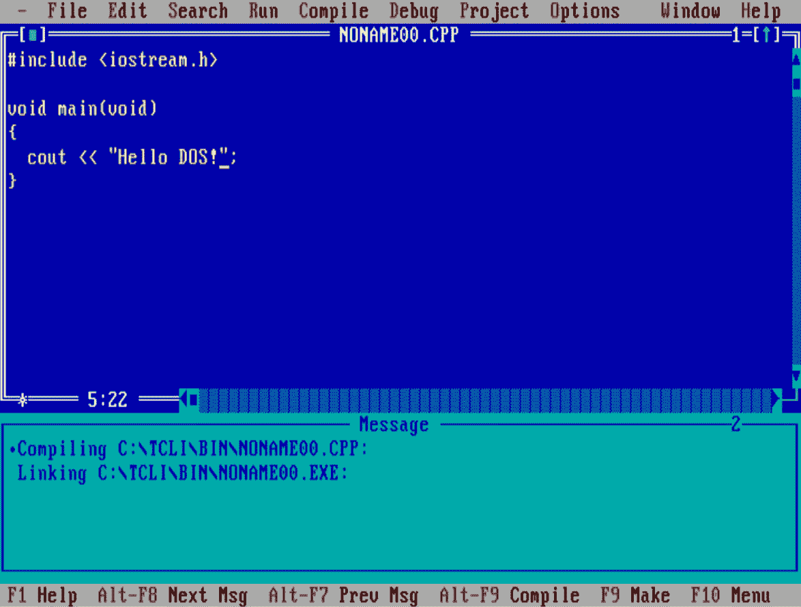

# 每个 C++程序都符合标准

*除非它们不是*

在 C++编程的世界里，符合标准的概念通常受到高度重视，C++标准的最新版本被视为编写正确和高效代码的终极指南。C++标准是由 C++委员会和国际标准化组织（**ISO**）精心制定并定期更新的，为开发者提供了全面的规则和最佳实践，以确保代码质量和互操作性。然而，软件开发的现实比这种理想状态更为复杂和微妙。

在本章中，我们将深入探讨由于各种限制，开发者无法始终遵守这些标准，并在理想标准与工作实际需求之间尖锐、微妙的边缘上谨慎平衡所面临的众多挑战。这些限制可能包括他们在开发环境中的限制，如过时的编译器、遗留系统，或要求使用非标准特性的特定项目需求。

当我们被迫使用以 C++为基础并提供一组扩展以满足特定用例的框架时，可能会出现复杂的情况。正如我们将在稍后阶段展示的，这些框架建立在现有的标准 C++之上，并引入了针对特定范围的特定功能，但这些功能与 C++标准没有任何共同之处。因此，我们可能会问自己：我们应该使用这些框架吗？正如我们将看到的，这个问题的答案并不像人们可能认为的那样简单。

在本章中，我们将涵盖以下主要主题：

+   遵守各种编译器、框架和环境中的标准

+   为什么不是每个人都能学习、使用或编写标准 C++？

+   离开标准的编译器扩展

# 技术要求

我们必须承认，阅读本章不会是一个简单的过程，但我们将尽力使其尽可能容易。我们的思绪将在平台、编译器和 C++语言的多种方言之间徘徊。然而，在某个时候，我们必须划清界限，得出结论，我们应该能够将所有这些理论信息的传递转化为生活的实际，并从中产生一些 C++代码。因此，我们在此恳请，在本书的这个阶段，您能够访问强大的互联网，以及实验 C++的必去之地：Matt Godbolt 的网站：

[`gcc.godbolt.org/`](https://gcc.godbolt.org/)

那个地方应该能为你提供保护，因为我们将在本章中讨论的所有编译器几乎都可以在那里找到。

目前不需要其他任何东西。这是因为在这个阶段，我们还没有产生足够的有价值代码，能够将任何有意义的代码放入本书的 GitHub 仓库中，而我们产生的代码也不应该被用于其他地方。

# 在遥远的加纳某处

当理查德·阿皮亚·阿科托在加纳的学校黑板上绘制了微软 Word 用户界面的几张图片后，他一夜之间成为了社交媒体现象 1 。他的学校很贫穷，没有工作的电脑，只有一块世纪之交的标准黑板，但这并没有阻止他履行教师的职责。他以非常富有创意的方式，尽其所能将改变生活的知识传授给学生，希望有一天，这些知识能对他们追求更好的生活有所帮助。其余的都是历史，但真正的问题是：这是教授微软 Word 的标准方式吗？

1 [`news.microsoft.com/apac/2018/03/17/teacher-who-used-a-chalkboard-in-computer-class-because-he-had-no-computer-stars-at-microsofts-education-exchange/`](https://news.microsoft.com/apac/2018/03/17/teacher-who-used-a-chalkboard-in-computer-class-because-he-had-no-computer-stars-at-microsofts-education-exchange/)

我们不要偏离我们的初始目标太远。我们想了解 C++程序的标准合规性。对于狂热的 C++程序员来说，标准的最新版本被视为神圣的经文，是话语，是他们应该遵守的规则的集合，任何偏离都应该受到擦除和重写非标准合规代码的惩罚。或者在一个被标记为*维护* *遗留代码* 的拘留中心度过一周。

面对残酷的现实，事情与理想主义的环境相去甚远。一些开发者没有可能使用 C++标准的最新版本。这可能是因为他们的生计与需要特定编译器的现实生活项目紧密相连，或者是因为他们编程的环境不允许使用语言的特定功能。

或者，他们可能是因为在一个过去 20 年没有更新过的平台上工作而获得报酬，因为这个提供商十年前宣布破产，没有人接手他们的业务。然而，由于一切正常并且仍在产生收入，它仍然使用 20 年前的工具来维护和保持。

这肯定不包括支持最新 C++标准的编译器。那么，这意味着在这些平台上工作的开发者所编写的 C++代码不是标准合规的吗？

在世纪之交，本章的作者发现自己在一所大学的教室里，参加一门名为*C++程序设计入门* 的课程。这是那里唯一提供的 C++课程，老师用一本书来传授知识给 30 多个学生。

路尽头的小复印店老板在有一天老师决定把书借给一个学生时非常高兴。这本书是 Kris Jamsa 的 *C/C++ 程序员圣经* 的翻译和大幅缩减版，我们称之为“有斑点的狗的书”。

书的本地版只包含了 C++ 部分，但它附带了一个非常重要的附录：一张标准的 1.44 MB 软盘，上面有 Turbo C++ Lite IDE 和相应的编译器。对于那些不熟悉这个名字的人来说，Turbo C++ Lite 是 Borland 公司流行的（并且非常用户友好）的 IDE 和编译器 Turbo C++ 的简化版。编译器本身是相同的，但是为了将整个环境放在单个 1.44 MB（兆字节）的软盘上，移除了很多功能和工具。

这是我们第一次接触到编译器、链接器和语法的复杂世界。我们中的一些人发现它如此迷人，以至于现在，20 年后，我们仍然在日常工作中使用它。所以，正如你可以想象的那样，我们的第一个 C++ 程序看起来就像下面截图中的那样。



图 2.1 – 程序员生活中的著名代码屏幕，如图 1997 年的《程序员生活》所示

哦，你脸上的恐惧！我可以清楚地想象出来，亲爱的 C++ 学徒。仅仅是看到：

+   **iostream.h**：嗯，你好，现在是 1999 年，C++98 标准去年才发布。你为什么不使用它，你这个异端？它的编号是 ISO/IEC 14882:1998，只需 200 瑞士法郎就可以买到。…哦，那是你在这里学习期间三个月兼职洗碗工的工资？

+   **void main(void)**：哦，亲爱的，这从来就没有在任何标准中出现过，无论是 C 还是 C++。你刚刚挖出了什么样的黑暗混合物？…或者这是他们称之为… Java 的新东西？

+   **cout**：从未遇到过使用指令，这怎么可能呢？

在这里，你很容易放弃试图理解这一点的尝试，如释重负地叹气，但请再忍受我一下。

与理查德·阿皮亚·阿科托在那时所面临的情况非常相似，在我们接受教育的那个阶段，我们也拥有了一个带有黑板、一位专职教师以及几本书（正如之前提到的，有几本副本）的教室。即便如此，我们还是学习了 C++。也许，从标准的角度来看，这些条件是理想的，因为 C++标准非常宽松，考虑到环境因素，它不需要你能在现代计算机中找到的任何东西——没有键盘，没有屏幕，甚至没有操作系统。确实，唯一非常严格的环境要求是**char**的大小至少为 8 位。这是为了确保**char**可以容纳基本执行字符集中的任何成员（包括标准 ASCII 字符）。而且，**sizeof(char) == 1**这一事实也由 C++标准保证，包括它的有符号和无符号版本。所有其他内容都是建立在这些基础之上的。

因此，我们可以说，在我们获得进入计算机实验室的权限之前，我们学习标准 C++的条件是理想的。没有令人烦恼的系统依赖，没有电脑崩溃，也没有硬件在代码无法编译时因沮丧而踢出。由于我们没有在黑板上运行编译器，我们的老师很快意识到在黑板上编译更复杂的 C++代码并不太可行，所以我们被分配了周五早上早些时候的时间段在计算机实验室。所有的麻烦从此开始。

解释相当简单：你们知道，我们大学当时用于教授 C++的计算机实验室由一帮 80286 IBM AT 克隆机组成。

你们读得没错。当时有 30 名学生，分配了 8 台电脑（每台都配有当时可能算是高端的 80286 处理器，尽管在十多年后显得相当过时），这些电脑是从某个援助机构那里得到的，该机构可能进行了升级，并决定将旧设备捐赠给大学以获得公司的税收优惠。四个人一台机器，每人一本书（以及几本副本），试图学习 C++。

尽管情况并不像二十年后理查德·阿皮亚·阿科托的学校那样糟糕，但条件并没有更好。那些机器只能运行纯 DOS，而且没有比 Turbo C++ Lite 更好的编译器可用，它是十年前发布的。这意味着我们有意学习编写非标准 C++代码吗？显然不是。我们编写了我们能够编写的代码。

然而，我们不要把时间倒退得太远。截至 2024 年，本书的写作日期，Stack Overflow 上有 46 个问题（[`stackoverflow.com/`](https://stackoverflow.com/)），包含令人恐惧的**void main(void)**短语。最新的一条令人惊讶地来自 2023 年。其中一些与**iostream.h**的内容有关，但主要是教育背景，我们不敢计算那些包含**cout**但没有遇到使用指令或命名空间限定符的问题，因为那将是徒劳的。这难道意味着即使在 2024 年，仍然有程序员在编写依赖于非标准 C++的代码？或者有学生在以非标准的方式学习 C++？

在 Stack Overflow 上进一步挖掘，另一个关于旧版 C++方言的有趣片段出现了：**conio.h**。这个头文件在语言官方标准化几年前就随 Turbo C（和 C++）一起发布了，但考虑到在 2024 年仍有年轻的新手对其提出问题，我们可以说，对于之前问题的答案很可能为*是*。

根据他们的环境和可能性，无论他们是否需要使用黑板学习，用粉笔绘图，或者通过共享键盘，在过程中轻轻拍打彼此的手，今天仍然有一些程序员不自觉地被强加了一个学习和编写非标准 C++的过程。

# 微软的迷你、紧绷的 C++

现在向后看已经足够了。让我们暂时换个方向，考虑一下曾经是 C++之王的编译器，但随着时间的推移，它的光芒已经消退。OpenWatcom 是一个开源的集成开发环境，以及 C 和 C++（以及 Fortran，但在这本书中该语言不是重点）的编译器套件，最初由 Watcom 国际公司开发，并于 2003 年由 Sybase 开源发布。

它支持多个操作系统，包括 DOS、Windows、OS/2，以及 Linux，并且是那些对为复古平台创建有趣、休闲项目感兴趣的程序员的默认编译器。

并非一定是为了钱，而是因为当他们面对 80x25 屏幕时，那种甜蜜的怀旧感会让他们脊背发凉。也许这就是为什么今天大多数资深程序员都使用在终端中运行的 VI 编辑器网格，这些编辑器被拼接到 6x4 的窗口上，在巨大的 WQUXGA（或更大）屏幕上。

但让我们回到 OpenWatcom 编译器。在浏览项目的发布说明 2 时，我们遇到了以下，可以说相当引人入胜的短语（在*与版本 10.0 的主要差异*部分，第 29 项）：

2 [`open-watcom.github.io/open-watcom-v2-wikidocs/c_readme.html`](https://open-watcom.github.io/open-watcom-v2-wikidocs/c_readme.html)

我们已经复制了一个必需的 Microsoft Visual C++扩展，用于解析 Windows 95 SDK 头文件。

示例：

typedef struct S {

} S, const *CSP;

^^^^^- 不允许在 ISO C 或 ISO C++ 中使用

哎呀……我刚刚读得正确吗？Visual C++ 有一个扩展，允许编译非标准代码？

是的，我们确实正确地阅读了这一点。以下这段示例代码在今天的任何主流 C++ 编译器中都无法编译，除非是 Visual C++（以及根据他们的评论，OpenWatcom 的 C++ 编译器）：

```cpp
#include <iostream>
typedef struct S {
   int a;
} S, const *CSP;
int main() {
   S s1; s1.a = 1;
   CSP ps1 = &s1;
   std::cout << ps1->a;
}
```

...由于一些作者未能解密的神秘原因，这段代码序列也被几个版本的 ICC（英特尔强大的但遗憾的是已停产的 C++ 编译器）接受。因此，我们可以再次提出以下问题：既然一个主要编译器和两个相对晦涩的编译器接受这种代码，这意味着我们应该使用它吗？它是标准的吗？

对于第二个问题的答案是明确的 *不*。然而，对于第一个问题，情况要复杂一些。这是因为在我们回答之前，我们必须再次考虑背景、需求和其他可能影响开发决策的相关因素。

我们是否尽可能坚持标准 C++？是否有可能在不使用供应商特定扩展的情况下提供所需的解决方案？我们是否绑定到编译器或操作系统，并且我们不担心将来可能需要访问外国土地？

使用微软平台提供的针对 C++ 的托管扩展，能帮我们省去很多麻烦，还是我们更愿意坚持我们熟悉和了解的古老语法（以及类型）呢？

微软以其为 C 和 C++ 语言提供平台特定扩展而闻名，以至于有一个专门的部分用于微软特定的 C++ 关键字 3。这告诉我们，非标准 C++ 有一个市场，并且有充分的理由，因为其中一些扩展非常实用，尽管这需要我们绑定到平台、编译器和工具链。

3 [`learn.microsoft.com/en-us/cpp/cpp/keywords-cpp?view=msvc-170`](https://learn.microsoft.com/en-us/cpp/cpp/keywords-cpp?view=msvc-170)

微软的一个扩展体现在 **__declspec** 关键字中。C 和 C++ 中的 **__declspec** 关键字是微软扩展 C++ 语法的一部分，它允许开发者为某些 C++ 构造指定微软特定的存储类属性。

这个关键字提供了对诸如 DLL 导出和内存对齐等行为的额外控制，这些行为在标准 ANSI 关键字（如 **static** 和 **extern**）中并未涵盖。通过使用 **__declspec**，开发者可以轻松且不遵循标准地应用这些特定于微软自己编译器的特性（看吧：接下来会有惊喜！）到他们的代码中，从而增强代码的功能和性能，如下面的代码序列所示：

```cpp
struct person {
   void set_age(int page) { m_age = page; }
   int get_age() const { return m_age; }
   __declspec (property(get = get_age, put = set_age)) int age;
   person() = default;
private:
   int m_age;
};
int main() {
   person joe;
   joe.age = 12;
   std::cout << "Hello " << joe.age;
}
```

使用微软的**__declspec(property(...))**语法，前面的代码序列创建了一个**age**属性，允许通过提供的方法间接与**m_** **age**进行交互，正确封装年龄数据，同时提供了一个简化的接口来访问和修改它。

可以利用**__declspec**扩展利用的属性列表相当长且实用，**__declspec**在编译器开发界似乎也很受欢迎。事实上，它如此受欢迎，以至于**Clang**提供了一个专门的参数来理解这个微软特定的扩展。这个标志**-fdeclspec**使得在 Clang 编译的代码中也能使用**__declspec**关键字。因此，自然而然地产生了这样的问题：这还是微软特定的扩展吗，或者我们正在见证跨平台功能的出现？

在核心 C++程序员圈子中仍然被视为禁忌的一个事实是，在现实生活中，真正需要编写真正的跨平台代码的情况是很少的。大多数程序员为特定的公司工作，开发或支持特定的产品。他们主要使用一个操作系统，一个编译器工具链，遵守雇主施加的限制，并愉快地使用编译器支持的扩展来编译他们的代码。

这并不意味着他们不想编写符合标准的 C++代码。不，恰恰相反，我相信他们能写出他们能想到的最高质量的代码。这仅仅意味着他们只是使用了特定编译器提供的可能性：他们必须与之工作的那个编译器。在他们下一家公司，有很大可能性他们会使用运行在不同操作系统上的不同编译器，从而忘记他们在前一个地方的前编译器提供的所有优势。这是因为特定编译器的语法和扩展并不局限于一个编译器。

让我们考虑以下代码示例，例如：

```cpp
char arr[6] = {'a', 'b', "cde"};
```

除了刺痛我们的眼睛，这个序列显然尽可能标准和非规范。谁会理智地尝试以这种方式初始化一个 6 个字符的数组呢？然而，Microsoft Visual C++编译器却乐于接受它。让我们从一些普通字符开始，当我们厌倦了输入所有的撇号和逗号时，我们就可以把其他所有东西都扔到一个常量字符串字面量中，因为为什么不呢？而且它在这方面相当聪明，检测到请求的数组大小，并将其与各部分的累积长度相匹配，如果存在任何不匹配，则发出错误信号。

当涉及到添加标准中找不到的功能或允许会打破语言律师舌头的代码时，微软的 C++编译器是一个非常创新的编译器。让我们以以下代码为例：

```cpp
class person {
public:
   int age;
   class {
   public:
       std::string name;
   };
};
```

这段代码序列根本不是标准的 C++。它的存在甚至让我们能够编写出如下所示的代码：

```cpp
int main() {
   person joe;
   joe.name = "Joe";
   std::cout << "Hello " << joe.name;
}
```

在使用微软自己的 C++编译器编译时，先前的示例编译和运行没有任何问题。请仔细观察匿名类，它包含一个**名称**成员，是一个具有构造函数的对象。这是一个具有构造函数、析构函数和许多其他有趣特性的对象。这是另一个（如果我可以这么说的话，非常实用的）微软对标准的偏离，因为匿名联合体是 C++中众所周知的一种野兽。然而，匿名结构体仅存在于 C 语言中（从 C11 开始），其他编译器不接受上述代码。

作为旁注，如果你不熟悉 C 语言中匿名结构体的概念，它们是简化嵌套结构声明的有用特性。当它们在其他地方不需要命名内部结构时，它们不需要命名内部结构，并且使代码更加简洁易读。尽管成员被包含在结构体中，但仍可以直接访问它们。通过在匿名结构体中封装相关字段，并在这些成员中引入逻辑块，可以减少代码中不必要的类型定义的杂乱。

# 免费编译器的领域

目前三大主要编译器中的两个是以开源方式开发和维护的。这意味着，从理论上讲，任何人都可以为其选择的编译器贡献并添加有用的新功能。然而，在实践中，这意味着只有一小部分具备必要知识和奉献精神的职业程序员，以及一个大型公司的支持，该公司从上述编译器的发展中获益，他们负责这项工作。

按照无特定顺序，截至 2024 年，GCC 和 Clang（以及我们在上一节中讨论的 MSVC）是最符合标准的编译器。然而，这种标准兼容性并不意味着这些编译器没有自己的优点，这些优点曾经被认为是开发者想要整合的绝佳想法。

以 GCC（当然，Clang 也是如此；这两个往往是一起使用的）的**计算 goto**特性为例。我们都在学校学到，**goto**是纯粹的邪恶，永远不应该使用。如果你在学校没有学到这一点，请不要从这本书中学习。因为，这同样是不正确的。相反，让我们关注一下我们可以想到的计算**goto**。如果**goto**是邪恶的，那么计算**goto**是计算出来的邪恶吗？那么以下代码序列是纯粹的邪恶，还是计算出来的邪恶？让我们看看：

```cpp
int main() {
   std::vector<void*> labels = { &&start, &&state1, &&state2, &&end };
   int state = 0;
   goto *labels[state];
   start:
       std::cout << "In start state" << std::endl;
       state = 1;
       goto *labels[state];
   state1:
       std::cout << "In state 1" << std::endl;
       state = 2;
       goto *labels[state];
   state2:
       std::cout << "In state 2" << std::endl;
       state = 3;
       goto *labels[state];
   end:
       std::cout << "In end state" << std::endl;
       return 0;
}
```

第一行没有问题。问题从那以后开始。这个非常实用的特性可以通过允许根据指针的值跳转到标签来有效地以非标准方式实现解释器或状态机。这个指针是从标签本身的地址初始化的。由于我们正在处理指针，完全可能使用可怕的指针算术并在地址上进行一些计算。

此外，如果不正确使用，这可能会是一个危险特性。与标准**goto**的情况不同，计算出的 goto 不会考虑在离开特定作用域时生命周期结束的对象。因此，不会调用析构函数。请务必注意这一点！

另一个相当有用的与标准 C++语法的偏差来自 GCC（而且，Clang 也实现了它，真是个惊喜），这使得以下代码序列可以用这两个编译器编译：

```cpp
int y = ({ int x = 10; x + 5; });
```

真是整洁，不是吗？这个特性被称为**表达式中的声明和定义**，它拥有你所能想到的所有好处：声明内部对象的良好封装，如果使用得当，则宏更为安全。遗憾的是，它并不是标准 C++。

Clang，这个新加入的成员（好吧，如果我们能称一个 15 岁的编译器为“新”，尽管与 1987 年出生的 GCC 相比，Clang 在领域中仍然是一个非常年轻但技艺高超的玩家）在特性竞争中更进一步。以下代码片段仅能在 Clang 中编译，得益于一个特殊的库和一个新的编译器命令行选项：

```cpp
#include <iostream>
int main() {
   int (^square)(int) = ^(int num) { return num * num; };
   int y = square(12);
   std::cout << y << std::endl;
}
```

这个特性在 Clang 中被称为**块**。为了正确使用它，你需要安装**BlocksRuntime** 4 库，然后指定一个特殊的**-fblocks**标志给 Clang，完成所有这些阻塞操作后，我们最终可以编译前面的代码。

4 [`github.com/mackyle/blocksruntime`](https://github.com/mackyle/blocksruntime)

这在很大程度上类似于标准 C++11 lambda 的行为，但考虑到这个特性是在 2008 年由 Clang 创建并引入的，我们或许可以称其为标准 C++ lambda 之父。如果你对此好奇，提供相同功能的标准 C++ lambda 如下：

```cpp
auto square = [](int num) ->int { return num * num; };
```

这不是黑魔法，与以下代码片段不同：

```cpp
auto generate(int n) -> std::vector<int>{
   int array[n] = {0};
   for(int i=0; i<n; i++) array[i] = i;
   return std::vector<int>{array, array + n};
}
```

所以，如果你想知道那里发生了什么，这里只是对你 C++大一记忆的小提醒：在没有任何情况下，**int array[n] = {0};**是标准 C++。**变量长度数组**是 C 语言中存在的一个特性，但由于各种安全考虑，C++标准不包括它。无论如何，前面的代码被 GCC 编译器接受，但 Clang 会对此提出抱怨：

```cpp
error: variable-sized object may not be initialized
   5 |     int array[n] = {0};
```

根据错误信息，修复方法很简单：

```cpp
auto generate(int n) -> std::vector<int>{
   int array[n];
   for(int i=0; i<n; i++) array[i] = i;
   return std::vector<int>{array, array + n};
}
```

现在，即使是 Clang（以及一些其他编译器，如 ICC）也接受它，无论代码的标准性状态如何……或者更确切地说，是缺乏标准性。

## 对属性的致敬

然而，GCC 和 Clang（以及微软的 Visual C++）可以在一个非常具体的 C++语言扩展上达成共识：我们需要一种方法来将元数据附加到某些语言构造（如类型、函数、变量等）。这些元数据随后可以被编译器和其他工具用来生成优化代码、执行检查或提供其他功能。

在现代 C++（即 C++11）引入使用双方括号语法 **[[attribute]]** 指定属性的标准方法之前，每个编译器都有自己的方式来指定这些属性，因此需要这些属性：

+   GCC 和 Clang 使用 **__attribute__((attribute-name))**

+   Microsoft Visual C++ 使用 **__declspec(attribute-name)**

然而，随着 C++11 的发布，标准化委员会意识到了这些特性的有用性，并将最适用的属性提升到语言中（例如 **[[noreturn]]**），而标准的后续改进又添加了更多属性（例如 **[[fallthrough]]**，**[[nodiscard]]** 等）。然而，许多这些属性仍然局限于引入它们的编译器。以下代码片段展示了其中的一些：

```cpp
void old_function() __attribute__((deprecated));
void fatal_error() __attribute__((noreturn));
int pure_function(int x) __attribute__((pure));
int x __attribute__((aligned(16)));
void old_function() {
   std::cout << "This function is deprecated.";
}
void fatal_error() {
   std::cerr << "This function does not return.";
   exit(1);
}
int pure_function(int x) {
   return x * x;
}
```

上述代码序列包含了一些 GCC 和 Clang 共享的属性，例如以下内容：

+   **__attribute__((deprecated))** 将**旧函数**标记为已弃用

+   **__attribute__((noreturn))** 用于指示 **fatal_error** 不会返回

+   **__attribute__((pure))** 用于指示**纯函数**除了返回值外没有副作用

+   **__attribute__((aligned(16)))** 用于将 **x** 变量对齐到 16 字节边界

这些编译器提供的属性列表非常庞大 5，我们强烈建议，如果您处于在特定平台上使用这些编译器，并且您的主要关注点不是代码的可移植性、平台独立性和标准兼容性的情况，那么您应该去查看它们。这是因为通过正确使用编译器提供的工具，您可以充分利用许多功能。

5 [`gcc.gnu.org/onlinedocs/gcc/Function-Attributes.html`](https://gcc.gnu.org/onlinedocs/gcc/Function-Attributes.html)

6 [`clang.llvm.org/docs/AttributeReference.html`](https://clang.llvm.org/docs/AttributeReference.html)

# 当头文件甚至不是 C++ 时

标准不兼容但仍然可用且有用的特性列表并不止于前面的例子。然而，如果我们只关注那些，我们仍然可以用它们填满几本书。遗憾的是，目前我们只为此主题奉献了一章，所以让我们将注意力转移到一些更为奇特的功能上。

Qt 已经成为 GUI 应用程序（但不仅限于此）的事实上的跨平台编程框架有一段时间了。在其命运多舛的历史中，自从 1994 年成立以来，Qt 框架已经发生了显著的变化，每个版本都为 C++（但不仅限于此）编程社区带来了新的功能集。然而，有一个功能基本上保持不变：信号/槽实现和 **元对象编译器**（ **MOC**）。框架的支柱，MOC 使得将组件（即，信号）的事件连接到接收器（即，槽）以进行适当处理成为可能。

然而，这个非常实用的功能是以必须支持几个非 C++ 构造为代价的，这使得将应用程序中看似无关的元素连接起来成为可能。例如，必须响应事件的对象的类声明通过几个非标准的“访问修饰符”扩展，例如 **signals:**，**private slots:** 等。此外，还有一个新的 **关键字** 叫做 **emit**，这使得发出信号成为可能。

简而言之，以下是从一个头文件中摘录的内容，使得以下代码的编译成为可能：

```cpp
#ifndef MYCONTROL_H
#define MYCONTROL_H
#include <QObject>
#include <QPushButton>
#include <QWidget>
class MyControl : public QWidget {
   Q_OBJECT
public:
   MyControl(QWidget *parent = nullptr);
private slots:
   void onButtonClicked();
signals:
   void nameChanged(const QString &name);
private:
   QPushButton *myButton;
};
#endif
```

我们是否应该采用 Qt 提供的奢侈功能，使用非常方便的信号/槽机制，尽管我们必须编写非标准的 C++ 代码？或者我们宁愿坚持传统，像在 GTK 中那样通过编写纯 C++ 代码来创建每一个小按钮和连接？

这一章节无法回答这个问题，因为最终，这取决于每个项目的具体要求。这些要求包括环境强加的、项目利益相关者期望的，以及开发团队决定前进道路的方式。然而，不要绝望：即使这看起来并不像标准的 C++，它解决了非常现实的问题。幕后隐藏着一个尖端实现，它已经经过测试、批准、改进，并在几个小型和大型项目中使用。它经受了时间的考验。

微软对 C++ 语言的自身大规模扩展采用了一种不同的方法。虽然它不是一个像 Qt 的 MOC 这样的特定工具，但 C++/CLI 通过 .NET 特定的语法扩展了 C++。C++/ **CLI**（即，**通用语言基础设施**，而非命令行界面）的 Visual Studio 编译器可以解析这种扩展语法，并生成有效的通用中间语言（这是一个由 .NET 框架使用的低级、平台无关的指令集）和本地代码。以下代码序列是这种托管 C++ 的一个示例。它并没有做任何特别的事情；它只是将字符串数组的元素连接起来并打印结果：

```cpp
#include <iostream>
#include <atlstr.h>
#include <stdio.h>
using namespace System;
int main() {
   array<String^>^ args = { "managed", "world" };
   String^ s = "Hello";
   for each (String ^ a in args) s += " " + a ;
   CString cs(s);
   wprintf(cs);
}
```

我完全同意；这根本不是标准 C++。它看起来不像标准 C++，感觉也不像标准 C++，甚至听起来也不像标准 C++。所以，它肯定不是那个。具有相同功能的符合标准的 C++代码看起来如下：

```cpp
#include <array>
#include <iostream>
#include <string>
int main() {
   std::array<std::string, 2> args = { "unmanaged", "world" };
   std::string s = "Hello";
   for(const auto& a : args) {
       s += " " + a ;
   }
   std::cout << s;
}
```

它不是比之前的一个更简洁、更短、更简洁吗？更不用说它也是符合标准的了。

观察 C++管理扩展在未来如何演变将会很有趣。

目前，它充当原生代码和管理代码之间的桥梁，目前这是一个非常狭窄的领域。然而，从长远来看，它的生存高度依赖于开发者社区是否接受它（或者不接受），它所创建的生态系统是否足够有用以维持其活力，或者是否其他技术，如 P/Invoke 或 COM Interop，将接管 C++/CLI 目前处理的特定用例。

确实，前方有有趣的时光在等待。

# C++被锁在盒子里的奇特案例

迄今为止，我们已经观察到一些情况，其中标准符合性是由开发者自行决定的。他们可以选择他们的平台，使用他们最喜欢的编译器提供的扩展，或者选择纯标准 C++。然而，在这个广阔的世界中，有一些情况下，由于环境对我们施加的限制，我们无法完全遵守标准，因为某些 C++标准中发现的特性被禁止使用。

不考虑低俗场景，当我们必须维护那些在 C++的黄金时代编写的几十年老代码（即，在标准化委员会接管并因要求符合标准而破坏了所有乐趣之前，为了防止 C++方言如**BASIC**那样无法控制的扩散），我们可能会遇到一些超出我们控制的情况，使得无法使用完整的 C++标准特性。例如，可能会有某些要求禁止使用异常。其他环境可能缺乏适当的内存分配支持，而其他环境则可能强制我们直接写入硬件地址以使某些事情发生。然而，这最后一种情况也可以以符合标准的方式发生。

例如，一些嵌入式系统积极鼓励使用它们平台特定的汇编指令。众所周知，没有平台无关的汇编语言，因为那是今天 C++可以到达的最低级别。在其下方是纯十六进制机器代码，但那些在 C++代码中必须使用那种代码的时代已经一去不复返了。

也可能存在这样的情况，我们代码的硬件要求需要确定性行为。根据定义，这排除了异常（因为谁愿意在执行过程中每纳秒都无法跟踪代码流程呢？）和内存分配（因为分配延迟、内存碎片化以及代码再次不按确定性方式行为的一系列其他问题）。因此，大量 C++标准的内容都不在我们的考虑范围内。

对于嵌入式系统中的内存分配问题，有一些解决方案，例如使用内存池、对象池、编译时内存分配以及各种其他资源，这些资源可能甚至是平台特定的。然后还有异常。在 Bjarne Stroustrup 的出色论文 7 中，他讨论了用确定性异常等替代方案替换 C++异常所涉及到的挑战、成本和风险。然而，正如论文的结论所述，目前没有明确的理由用其他机制替换当前的异常处理机制。这可能会在 C++开发者社区中造成进一步的碎片化，就像现在已经有足够的碎片化一样。相反，论文主张重视增强当前的异常处理系统，而不是通过额外的机制使语言复杂化，强调尽管异常存在不完美之处，但它们已经有效地为数十年的大量开发者服务。

7 [`www.open-std.org/jtc1/sc22/wg21/docs/papers/2019/p1947r0.pdf`](https://www.open-std.org/jtc1/sc22/wg21/docs/papers/2019/p1947r0.pdf)

# 过去和未来的 C++

我们将要探讨的最后一个关于你编写的代码标准合规性的场景，与 C++生态系统中最基本的项目有关：编译器本身。

你看，编译器也是程序，由数百万行代码组成。全球有多个贡献者正在从事这项工作，添加新功能、修复错误、提高其标准合规性、发布最新版本，并确保你的编译器能够正常工作。

这些编译器也有一个开发时间表。功能的实现并非一蹴而就，可能存在某些情况下，在某个时间点，某些编译器可能不支持标准中的某些功能，因为缺乏足够的人力来实现它。

在所有 C++知识来源处有一个非常实用的文档 8，它详细说明了各种 C++标准特性的支持情况以及哪些编译器支持特定的功能。

8 [`en.cppreference.com/w/cpp/compiler_support`](https://en.cppreference.com/w/cpp/compiler_support)

在标准转折点（或者当被迫使用尚未实现某些功能的过时编译器时），C++开发者社区已经采用了几个技巧来弥补即将到来的各种编译器版本中功能缺失的问题。

当在 C++98 中引入**mutable**关键字时，某些编译器的实现比其他编译器的实现要慢一些。对于使用这些编译器的程序员来说，在**const**成员函数中修改成员变量（该功能是在同一标准中引入的）是一项挑战。

在这种情况下，必须使用以下（相当丑陋）的技巧来应对缺失的关键字：

```cpp
class Counter {
   int viewCount = 0;
public:
   void view() const {
       const_cast<Counter*>(this)->viewCount++;
   }
   void print() const {
       std::cout << "Count: " << viewCount << std::endl;
   }
};
```

假设你的计算机支持**const_cast**，前面的代码没有问题。然而，如果**const_cast**不在支持的关键字列表中，那么你基本上回到了标准的 C 风格转换，例如**((Counter*)(this))->viewCount++;**。这应该可以解决你的所有问题。

**mutable**关键字并不是第一个在编译器中不支持导致开发者遇到麻烦的关键字。在 C++11 引入**constexpr**（以及在那之后几年，对于 Microsoft Visual C++程序员来说也是如此），编译时常量表达式必须使用各种模板技巧（或者只是宏，但众所周知，它们是邪恶的，所以让我们尽可能地避免它们）来评估。

例如，以下代码片段在**constexpr**之前（但仍然是在编译时）计算了某个数的著名阶乘：

```cpp
template <unsigned int N>
struct Factorial {
   static const unsigned long long value = N * Factorial<N - 1>::value;
};
template <>
struct Factorial<0> {
   static const unsigned long long value = 1;
};
const unsigned long long fac5 =  Factorial<5>::value;
```

当前使用支持相同函数**constexpr**的编译器的标准实现当然更短，更容易理解：

```cpp
constexpr unsigned long long factorial(unsigned int n) {
   return n <= 1 ? 1 : n * factorial(n - 1);
}
const unsigned long long fac5too =  factorial(5);
```

当然，如果我可以这么说的话，代码的可读性有了巨大的提升。

# 摘要

正如本章所展示的，编写标准 C++确保代码在不同平台和编译器之间的可移植性、兼容性和可维护性。我们了解到，通过遵循 ISO/IEC C++标准，我们可以创建行为可预测且不太容易出现错误和平台特定问题的代码。符合标准的 C++代码还受益于通用的编译器优化和未来的语言增强，同时确保长期的相关性和性能，正如我们在本章所学到的。

另一方面，使用 C++编译器特定的扩展可以提供针对特定平台和编译器的性能优化，访问尚未标准化的高级功能，以及与供应商特定工具的集成。然而，扩展可能会引入可移植性问题，对特定编译器版本的依赖，以及与标准 C++实践的偏差，这可能会影响代码在不同平台和编译器之间的维护和互操作性。我们也在本章中讨论了这一点。

因此，我们了解到采纳（adoption）应该基于项目需求仔细考虑，在增强功能的好处与兼容性和长期支持相关的潜在缺点之间取得平衡。在这一阶段，我们相信您能够做出最佳决策，这对您的项目和代码库产生最佳影响，同时让您能够交付所需的产品。即使它是在您业余时间用一台 30 年前的机器编写的个人项目。使用 30 年前的编译器编译。

我们的下一章，由 Alex 提供，将进行深入探索，试图揭示 C++是否真的是另一种面向对象的语言的基本真相，或者是否在表面之下隐藏着更多的东西...
