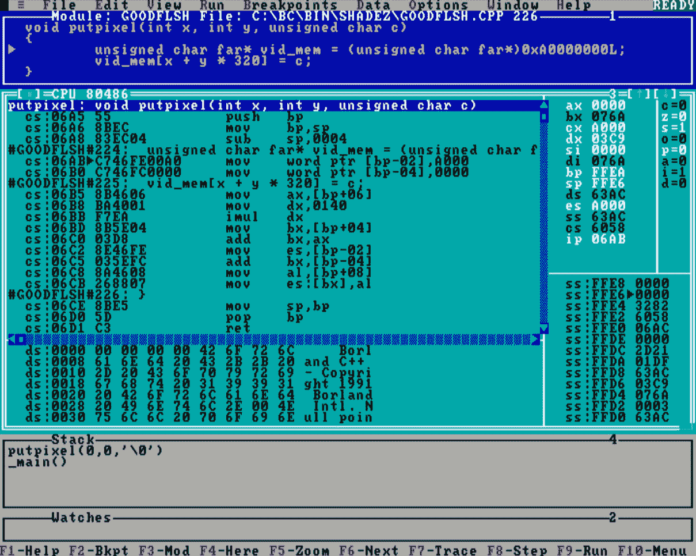

# 最快的 C++代码是内联汇编

*低于这个水平，你不应该* *达到*

在 C++开发者快速发展的世界中，效率至关重要，优化代码以榨取最后一滴性能始终是一个迷人的挑战。这次旅程经常将开发者带到计算的根源，在那里 C++遇到汇编语言，每个 CPU 周期都至关重要。

大约三十年前，在 90 年代的狂野时期，程序员经常不得不手动编写每字节的可执行代码，经常深入到汇编语言（甚至更低级别）的浑浊水域，以实现所需的性能。这些早期的优化先驱们开发了虽然现在看来基础，但为理解 C++和汇编的强大功能和局限性奠定了基础。

这次探索深入研究了优化一个看似简单的任务——在屏幕上点亮一个像素——的具体细节，通过比较三十年前手工编写的优化汇编程序与现代高级编译器（如 Clang、GCC 和 MSVC）的输出。随着我们穿越编译器的演变历程，我们将看到人类直觉与机器生成优化之间的平衡是如何变化的，这为我们提供了关于我们编写的代码与最终运行程序的机器之间不断演变的关系的新的见解。作为旁注，在本章中，我们将专注于英特尔 x86 处理器系列，深入探讨特定功能，而将 ARM 架构的覆盖留给另一本书，可能由不同的作者撰写。

在本章中，你将学习以下内容：

+   如何使用汇编代码来加速你的程序

+   如何不使用汇编代码，并信任编译器的优化器来提供最快的解决方案

# 点亮一个像素

大约 30 年前，在 90 年代末期这个狂野的时期，本文作者花费了大量时间优化代码，使其尽可能快地运行，消耗最少的资源，同时在屏幕上显示令人难以置信的旋转图形（还涉及到滚动和其他不相关的计算）。

这些应用程序被称为演示（开场白等），展示了某些令人惊叹的图形效果，背后有强大的数学基础，并拥有自家的图形引擎；在当时，没有 DirectX 来处理所有那些低级细节，所以所有这些都必须手动完成。像素颜色计算、颜色调色板设置、CRT 屏幕的垂直回扫和前后缓冲区的翻转都是用 90 年代的 C++和一些汇编语言例程编写的，用于时间敏感的部分。

这些方法之一是在屏幕上放置一个像素，在其方法最简单的形式中，看起来是这样的：

```cpp
void putpixel(int x, int y, unsigned char color) {
    unsigned char far* vid_mem = (unsigned char far*)0xA0000000L;
    vid_mem[(y * 320) + x] = color;
}
```

我将省略 30 年前如何工作的一些非常低级细节，例如段/偏移内存是如何工作的。相反，想象以下内容适用：

+   你正在使用 DOS（在 1994 年，在狂野的东欧部分，几乎每个拥有 PC 的人都使用 DOS – 向早期 Linux 用户的 0.1%致敬）

+   你还在使用一种特殊的图形模式，0x13（几乎所有的游戏都使用这种模式，因为它允许在屏幕上使用神秘的 320×200 分辨率绘制 256 种颜色，其起源只有 40 年前的 IBM 工程师知道）

在这种情况下，如果你在 **0xA000** 段和特定的偏移量处放置一个字节，显卡将在特定的坐标处点亮一个像素，这可以从前面的公式中获得。

现在，经过几轮代码迭代后，上述程序员观察到该程序流程并不那么优化，它可以从一些优化中受益。

请耐心等待；由经济型编译器生成的代码（就是你刚刚从磁盘上复制的那份，我们在书中 *第二章* 中提到的）在以下屏幕截图里：



图 8.1 – 30 年前大家最喜欢的 Turbo Debugger

现在，考虑到它的年代，这看起来相当疯狂，但再次强调，我们只需要一点耐心，围绕为什么它在这里的所有谜团都将揭晓。你看，我们正在讨论编译器生成的代码远非最优。

让我们花点时间考虑这段代码。经过一番思考，尤其是从熟悉汇编语言的人的角度来看，这在当今越来越少见，他们可能会清楚地意识到编译器并没有像我们预期的那样挣扎。

以下是为 **putpixel** 程序生成的汇编代码：

```cpp
putpixel   proc   near
  push bp              ; Save the base pointer on the stack
  mov bp, sp      ; Set the BP to the current stack pointer
  sub sp, 4           ; Reserve 4 bytes for local variables
  mov word ptr [bp-2], 40960       ; Store 0xA000 at [bp-2]
  mov word ptr [bp-4], 0                ; Store 0 at [bp-4]
  mov ax, word ptr [bp+6]   ; Load the y-coordinate into AX
  mov dx, 320               ; Load the screen width into DX
  imul dx      ; Multiply AX (y-coord) by DX (screen width)
  mov bx, word ptr [bp+4]   ; Load the x-coordinate into BX
  add bx, ax      ; Add y*screen width (AX) to BX (x-coord)
  mov es, word ptr [bp-2]             ; Load 0xA000 into ES
  add bx, word ptr [bp-4]       ; Final pixel address in BX
  mov al, byte ptr [bp+8]    ; Load the color value into AL
  mov byte ptr es:[bx], al               ; Light the pixel!
  mov sp, bp                    ; Restore the stack pointer
  pop bp                         ; Restore the base pointer
  ret                           ; Return from the procedure
```

对于不熟悉这种表示法的人来说，**[]** 代表括号内地址的数据，因此参数是这样传递的：

+   像素点的 **x** 坐标（从 **[bp+4]**）

+   像素点的 **y** 坐标（从 **[bp+6]**）

+   需要设置的色彩值（从 **[bp+8]**）

事实上，当前的代码包含了很多不必要的内存访问来移动数据，而这些操作本可以保留在寄存器中，而且有很多不必要的对各个内存区域的访问，这些是可以跳过的。当时编译器生成的代码易于调试，但可以编写得更整洁。今天的编译器在调试模式下编译时生成相同类型的代码，性能非常相似，但一旦切换到优化的发布模式，它们就会施展魔法。

现代 CPU 是非常复杂的生物；在保护模式下运行时，它们采用各种技术，如乱序执行、指令流水线和其他技术，使得现在对真正低级性能的分析相当困难……但旧机器要简单得多！或者，你可以在现代计算机上使用 DOS，你会有同样的感觉。

没有考虑到保护模式是在早期的 80286 处理器中引入的，DOS 根本无法处理它（现在仍然不能），所以它坚持它最擅长的事情：在实模式下运行程序。在实模式下运行时，处理器只是依次执行指令，甚至有一个指令表解释每个指令将占用多少周期 1。

1 [`zs3.me/intel.php`](https://zs3.me/intel.php)

在花费了大量时间查阅那些表格后，我们得出结论，在那个时代的处理器上，一个**imul**可能比两个移位和一个加法操作花费更长的时间（全世界有成千上万的程序员在查阅了那些表格后得出了同样的结论，但我们感觉我们一定是某种地方英雄，因为我们发现了这个特性）。

考虑到 320 是一个非常不错的数字，因为它等于 256 和 64 的和，经过几轮优化后，我们为这个例程提出了以下稍微更优化的版本：

```cpp
void putpixel(int x, int y, unsigned char c) {
  asm {
  mov ax, 0xA000      // Load 0xA000 (VGA mode 13h) into AX
  mov es, ax        // Set ES to the video segment (0xA000)
  mov dx, y                // Load the y-coordinate into DX
  mov di, x                // Load the x-coordinate into DI
  mov bx, y                // Copy the y-coordinate into BX
  shl dx, 8    // Multiply DX by 256 (left shift by 8 bits)
  shl bx, 6     // Multiply BX by 64 (left shift by 6 bits)
  add dx, bx // Add those, effectively multiplying y by 320
  add di, dx   // Add the calculated y to DI (pixel offset)
  mov al, c                 // Load the color value into AL
  stosb                                  // Light the pixel
} }
```

这不是为这个目的可以想到的最优例程，但就我们的具体要求而言，已经足够了。

直接内存访问量显著减少（即使在旧时代，这也被认为是慢的），使用**imul**进行的长时间乘以 320 的操作改为乘以 256（这是左移 8 位操作：**shl dx,8**），然后是 64（同样左移 6 位），然后求和，这样仍然比消耗电力的乘法操作少用几个周期。

因此，为“如果你真的想要快速代码，你必须以尽可能低的级别自己编写它”这一神话奠定了基础。

作为一项有趣的心智练习，让我们跳过 30 年的时间，跳过几代编译器。如果我们把 C++例程直接输入到现代编译器中（为了我们的目的，我们使用了 Clang——写作时的最新版本是 18.1——但使用 GCC 也会得到非常相似的结果，只是使用不同的寄存器集），我们得到以下输出：

```cpp
putpixel(int, int, unsigned char):
  movzx eax, byte ptr [esp + 12]
  mov ecx, dword ptr [esp + 4]
  mov edx, dword ptr [esp + 8]
  lea edx, [edx + 4*edx]
  shl edx, 6
  mov byte ptr [edx + ecx + 40960], al
```

这段代码比我们为特定目的编写的代码要短得多，我们当时认为它是最优的，针对的是 30 年前的处理器，但处理器在过去 30 年里发展了很多，新增了很多更高级的功能，包括新的命令（关于新命令的更多内容将在本章稍后介绍，所以请耐心等待），我们发现编译器的优化例程如何处理那个令人愉悦的数字 320，这一点让我们感到非常满意。

C++ 编译器在过去几十年中经历了显著的发展，从最初作为 Turbo C++ 或 Watcom C++ 的朴素起点，发展成为极其复杂且能够执行一系列以前由于硬件限制而难以想象的优化，因为，嗯...640 KB 应该对每个人来说都足够了。

现代编译器不再仅仅是人类可读代码到机器代码的简单翻译器；它们已经成为复杂的系统，能够以可以显著提高性能和内存使用率的方式分析和转换代码，同时考虑一些旨在帮助开发者发挥其源代码最佳性能的方面。

GCC、Clang 和 MSVC 都采用了高级优化技术，如内联函数、循环展开、常量折叠、死代码消除以及跨越整个模块或程序的激进优化，因为在这个阶段，它们对整个应用程序有一个全面的了解，这使得这些高级优化成为可能。

顺便提一下，这些编译器还利用现代硬件特性，如向量化和平行化，生成针对特定处理器的非常高效的机器代码。我们将在下一节中展示这些优化是如何实现的，我们将展示一个平凡的任务，并让我们的编译器对它进行处理。

但在我们达到那个阶段之前，再举一个 30 年前的用例。本章的副标题是*低于这个水平你就不应该尝试*。当然，我们的意思是说在更低级别进行编码，而不是其他事情，而现在，我们将再次自豪地与自己唱反调。这里的矛盾是：*在某些情况下，你真的应该达到比汇编语言更低的级别*。

如果你熟悉图形编程，那么我想你一定熟悉双缓冲和后缓冲的概念。后缓冲是一个离屏缓冲区（内存区域，大小与屏幕相同），所有渲染（图形绘制）首先在这里发生。当渲染完成后，后缓冲被复制到屏幕上以显示图形，然后清空后缓冲，渲染重新开始。在历史上某个时刻，加拿大程序员汤姆·达夫发明了一块绝妙的代码，旨在完成这项任务；它的名字叫达夫设备，在多个论坛上讨论过几次，我们现在不会讨论它。相反，我们将向您展示我们用来从后缓冲区复制数据到屏幕的“高度优化”的代码：

```cpp
void flip(unsigned int source, unsigned int dest) {
  asm {
     push ds   // Save the current value of the DS register
     mov ax, dest   // Load the destination address into AX
     mov es, ax       // Copy the value from AX into the ES
     mov ax, source      // Load the source address into AX
     mov ds, ax         // Copy the value in AX into the DS
     xor si, si  // Zero out the SI (source index) register
     xor di, di      // Zero out the DI (destination index)
     mov cx, 64000       // Load 64000 into the CX register
                   // (this is the number of bytes to copy)
     rep movsb         // Run  the`movsb` instruction 64000
          // times (movsb copies bytes from DS:SI to ES:DI)
     pop ds         // Restore the original value of the DS
} }
```

之前提到的技巧包括 **rep movsb** 指令，它将实际复制字节（**movsb**），重复（**rep**）64,000 次，如 CX 寄存器所示（我们都知道 64,000 = 320 x 200；这就是为什么它们是魔数）。

在这种情况下，这段代码运行得非常完美。然而，还有一点可以微调；你看，我们使用的是一个相当不错的处理器——至少是一个 80386。与它的前辈 80286（一个纯 16 位处理器）相比，80386 是一个巨大的进步，因为它是英特尔推出的第一个 32 位 x86 处理器。所以，我们可以做的是以下这些：我们不是使用**rep movsd**来复制 64,000 字节，而是利用我们高端处理器提供的机会，利用新的 32 位框架、关键字和寄存器。我们移动 16,000 个双字（我们都知道一个字节是 8 位，两个字节称为一个字，测量 16 位，两个字称为一个双字，总共 32 位），因为这正是新处理器所支持的：对 32 位值的操作。新引入的**movsd**命令正是这样做的：一次复制 4 个字节，这样与我们的旧代码相比，速度可以提高 4 倍。

我们在本书开头介绍的轶事 C++编译器是 Turbo C++ Lite。不幸的是，对于我们的编译器来说，Turbo C++无法编译 80286 以下处理器的代码，所以我们只能使用 16 位寄存器和一些非常低效的寄存器处理。

正是在这里，C++代码中任何人都能看到的最低级别的黑客行为出现了——我们只是在代码中将**rep movsd**命令的字节作为十六进制值添加进去：

```cpp
xor di,di
mov cx,16000
db 0xF3,0x66,0xA5 //rep movsd
pop ds
```

没有什么比在生产代码中看到这一点更简单和令人眼花缭乱的，对吧？现在，尽管我们的编译器无法编译 80386 的代码，因为它还停留在石器时代（几乎就像你现在正在阅读的章节的一半一样），我们仍然可以生成在您的处理器上运行最优化的代码。请千万不要这样做。

## 关于过去的说明

现在，你可能会问，为什么我们甚至在 2024 年还要提及汇编语言，当时的主要趋势已经耗尽，关于 AI 驱动开发工具的广泛应用、低代码/无代码平台的增长以及各种 JavaScript 模块 N 次迭代的持续上升，这些模块的输出与之前完全相同，只是语法不同。

无论这些是目前 IT 世界中最引人注目的事件，汇编语言仍然没有过时。它可能不会像大家最喜欢的 Rust 语言（如果一切按计划进行，亚历克斯将在下一章辩论 Rust）那样受到太多关注，但仍然有一些主要商业部门必须使用汇编语言，并且在需要精确控制、性能优化或直接硬件访问的几个硬件环境中仍然至关重要，例如以下这些：

+   **嵌入式系统**：微控制器和物联网设备通常使用汇编语言进行高效的底层编程。在这些小型设备上，电力并不充足；每个比特都很重要。

+   **操作系统**（**OS**）**开发**：引导加载程序和操作系统内核的关键部分需要汇编来进行硬件初始化和管理。要实现这一壮举，要么你为一个大公司工作，要么开始自己的项目。Linux 基本上已经涵盖了。

+   **高性能计算**（**HPC**）：汇编用于优化性能关键代码，尤其是在科学计算或定制硬件（例如，FPGA）中。为了追求这一点，你必须找到愿意付钱让你这样做的人。

+   **安全和逆向工程**：分析和利用二进制文件通常涉及理解和编写汇编。这是最有利可图的，也是进入汇编编程的最现实方式，不幸的是。

+   **固件开发**：BIOS/UEFI 和低级设备驱动程序通常用汇编编写，以实现直接硬件交互。在这里，你同样必须在大公司的工资单上，尽管也有一些开源项目（如 coreboot、libreboot，或者只需谷歌免费 BIOS 即可获得一个相当不错的列表）。

+   **遗留系统**：维护较旧的系统或与复古计算一起工作通常需要汇编。这是将乐趣和痛苦融合到一个体验中的理想机会。

+   **专用硬件**：DSP 和定制 CPU 架构可能需要汇编进行专用、高效的处理。

请不要立即放弃汇编语言。只要计算机存在，它就仍然相关，并将继续如此。对于那些对这个主题感兴趣的人来说，它有自己的位置。否则，你可以坚持使用标准的 C++。

# 所有数字的总和

亲爱的尊敬的读者。这是一个普遍公认的事实，即所有开发者在其生活的某个阶段都必须经历一次技术面试。有各种程度的审问：有些只是“请告诉我一些关于你的事”（这些是最难的），而有些则更深入，甚至可能要求你在黑板上或甚至在电脑上编写一些代码。

在面试问题中经常出现的一个程序是编写一些代码来计算一系列具有特定特性的数字的总和，例如，所有偶数的总和，所有可以被，比如说，五整除的数字的总和，或者特定区间内奇数的总和。

为了简单起见，让我们坚持简单的东西：所有奇数到 100 的总和。以下快速程序正好提供这一点：

```cpp
#include <cstdio>
int main() {
    int sum = 0;
    for (int i = 1; i <= 100; ++i) {
        if (i % 2 != 0) {  // Check if the number is odd
            sum += i;      // Add the odd number to the sum
        }
    }
    printf("The sum is: %d\n",sum);
    return 0;
}
```

不是一个过于复杂的程序：只需遍历数字；检查它们是否为奇数；如果是，将它们的值加到最终的总和中；最后，打印出总和（对感兴趣的每个人来说，从 1 到 100 的所有奇数的总和正好是 2,500）。

但我们的清晰思维被众所周知的事实（至少，对于 C++ 程序员来说）所蒙蔽，即最快的 C++ 代码是内联汇编，因此我们决定在速度的祭坛上牺牲我们程序的便携性和可理解性，并决定用汇编语言重写其主要部分。因为，嗯，那是最快的。以下是我们尝试的示例，使用 AT&T 汇编语法，只是为了展示我们可以嵌入到非标准兼容的 C++ 程序中的广泛可用的汇编方言：

```cpp
#include <cstdio>
int main() {
    int sum = 0;
    int i = 1; // Start with the first odd number
    __asm__ (
        "movl $1, %[i]\n"   // Initialize i to 1
        "movl $0, %[sum]\n" // Initialize sum to 0
        "loop_start:\n"
        "cmpl $100, %[i]\n"   // Compare i with 100
        "jg loop_end\n"       // If i > 100, exit the
        "addl %[i], %[sum]\n" // sum += i
        "addl $2, %[i]\n"     // i += 2
        "jmp loop_start\n"    // Repeat the loop
        "loop_end:\n"
        : [sum] "+r" (sum), [i] "+r" (i)
    );
    printf("The sum is: %d\n", sum);
    return 0;
}
```

这里只是简要说明汇编代码的功能，因为我希望其他代码行是自解释的。

这里是汇编代码的分解：

1.  **"movl $1, %[i]\n"** : 这条指令将 **i** 设置为 **1**。尽管 **i** 在 C++ 代码中已经被初始化为 **1**，但在汇编中我们再次明确地设置它以提高清晰度。

1.  **"movl $0, %[sum]\n"** : 这将和设置为 **0**，确保汇编代码中的和从 **0** 开始。我们必须承认，这两个初始化不是必需的，但我们希望它们是对汇编代码的温和介绍，以免吓到你。

1.  **loop_start** : 这只是一个标签，无需进一步说明。

1.  **"cmpl $100, %[i]\n"** : 比较 **i** 与 **100**。这个比较用于检查 **i** 是否已达到或超过 **100**。

1.  **"jg loop_end\n"** : 如果 **i** 大于 **100**，程序将跳转到 **loop_end**，退出循环。

1.  **"addl %[i], %[sum]\n"** : 将 **i** 的当前值加到 **sum** 上。这会将所有奇数的和累加到 **99**。

1.  **"addl $2, %[i]\n"** : 将 **i** 增加 2 以移动到下一个奇数（例如，1 → 3 → 5 等）。

1.  **"jmp loop_start\n"** : 跳回到循环的开始以重复该过程。

1.  **loop_end** : 当 **i** 超过 **100** 时，程序会跳转到这个标签，从而有效地结束循环。

看起来奇怪的 **"+r" (sum)** 和 **"+r" (i)** 部分是约束条件，告诉编译器将 **sum** 和 **i** 作为可读可写变量处理，意味着在汇编操作期间它们的值可以被读取和写入。

作为第一个缺点，代码的可读性和可理解性受到了指数级的损害。我们故意使用 AT&T 语法进行汇编，因为它更加繁琐且难以理解，我们希望你也能经历这个过程，并记住除非你确切知道自己在做什么，否则不要在你的代码中使用汇编，那时你就可以免责。

其次，这段代码不再具有可移植性，因为在 Visual C++中没有**__asm__**这样的东西；他们过去使用过**__asm**（或者更近一些，在本章的开头，Turbo C 展示了**asm**关键字的引入）。既然我们在这里，C++标准也没有包含一个通用的汇编块标识符，因为汇编语言语法是编译器和平台特定的，内联汇编是语言的扩展而不是核心部分。我已经警告过你。我真的希望前面的陈述能够完全阻止你考虑在任何情况下在你的 C++函数体中编写汇编代码，无论是否存在非标准的关键字来允许你这样做。

但现在，得益于[gcc.godbolt.org](http://gcc.godbolt.org)，我们已经要求主要的编译器在各个优化级别上处理原始的 C++程序（完全没有汇编侵入），因为我们迫切希望向您展示，确实，在这个阶段完全跳过汇编语言是您可以做出的最明智的决定。

第一个展示编译器在生成最优 C++代码方面效率如何的是微软的 Visual C++。微软自己的小巧、紧凑的 C++编译器有几个选项可以生成和优化生成的代码 2，但我们这里有一个说法：代码越短，运行越快。因此，我们明确告诉编译器生成最短的代码（**/O1**），如下所示：

2 [`learn.microsoft.com/en-us/cpp/build/reference/o-options-optimize-code?view=msvc-170`](https://learn.microsoft.com/en-us/cpp/build/reference/o-options-optimize-code?view=msvc-170)

```cpp
`string' DB 'The sum is: %d', 0aH, 00H ; `string'
_main PROC
  xor ecx, ecx  ; Clear the ECX register (set ECX to 0)
  xor edx, edx  ; Clear the EDX register (set EDX to 0)
  inc ecx       ; Increment ECX, setting it to 1
 $LL4@main:
  test cl, 1    ; Test the least significant bit of CL
                ; (ECX) to check if ECX is odd or even
  lea eax, DWORD PTR [ecx+edx] ; Load the effective
                ; address of ECX + EDX into EAX
  cmove eax, edx; If the zero flag is set
                ; (ECX was even), move EDX into EAX
  inc ecx       ; Increment ECX by 1
  mov edx, eax  ; Move the value in EAX to EDX
                ; (update EDX for the next iteration)
  cmp ecx, 100  ; Compare ECX with 100
  jle SHORT $LL4@main ; Jump to the start of the loop
                ; (loop until ECX > 100)
  push edx      ; Push the final value of EDX (the sum)
                ; after the loop onto the stack
  push OFFSET `string' ; Push the offset of the string
  call _printf  ; Call the printf function
  pop ecx       ; Clean up the stack (remove string)
  pop ecx       ; Clean up the stack (remove EDX)
  ret 0         ; Return from the _main function
 _main ENDP
```

有趣的是，MSVC 的汇编输出与我们手工编写的非常一致；它有一个循环，根据我们当前处理的是奇数还是偶数，对各种寄存器进行了一些不同的处理，但除此之外，它与我们所写的代码相似。

使用其他优化标志组合（**/Ox**、**/O2** 和 **/Ot**）为 MSVC 生成的代码并没有很大不同，只是寄存器的分配略有不同，但没有任何使我们大喊“哇！”的东西。

在切换到 GCC（14.1）以便它处理我们的简单代码后，我们注意到对于**–O1**和**–O2**优化级别，生成的代码与 MSVC 生成的代码非常相似：它有一个变量，遍历数字，并对奇偶性和和进行了一些测试。就是这样，不是黑魔法...与为**–O3**生成的代码不同。

使用这个标志，我们惊讶地看到编译器如何通过**单指令多数据**（**SIMD**）指令来提高速度，而这个编译器引入的意外特性是它计算了一个不断变化的 4 元素数组的元素总和，从值{1, 2, 3, 4}开始，并在 25 次迭代中通过 SIMD 指令将每个元素增加 4。累计的总和存储在一个 SIMD 寄存器中，循环结束后，它被减少到一个单一的整数，提供了正确的结果。

为此生成的汇编代码太长了（超过三页），我们决定不在这里发布它，因为它将毫无用处，但作为一个好奇的事实，我们提到了它。

我们检查的下一个编译器是 Clang，以处理我们的简单 C++程序。在这个阶段（意味着在 GCC 使用**–O3**选项后的长 SIMD 指令输出之后），我们并没有期待任何惊人的结果，但我们却遇到了惊喜。

即使在**–O1**选项下，Clang 也向我们展示了以下，可以说相当简短的代码：

```cpp
main:
  push rax
  lea rdi, [rip + .L.str]
  mov esi, 2500
  xor eax, eax
  call printf@PLT
  xor eax, eax
  pop rcx
  ret
.L.str:
  .asciz "The sum is: %d\n"
```

真是令人惊讶！看起来 Clang 在幕后做了所有的计算，只是简单地将结果放入编译后的二进制文件中。这已经是最优化的了。我们真的很激动，编译器已经成熟并成长得如此聪明，这让我们好奇是否其他编译器也能这样聪明。

GCC 在**–O3**选项下表现出相同的行为，但令人惊讶的是，只有当我们想要总结到 71 的奇数时才会如此。到了 72，内部出现了问题，再次生成了长长的 SIMD 汇编源代码列表。

我们无论如何都无法说服 MSVC（在任何情况下），通过数字和参数的组合走向 Clang 的道路，并预先计算打印奇数和所需的数字，所以我们得出结论，这是不可能的。也许它将在下一个版本中实现，微软 Visual C++开发者们，你们怎么看？

## 展望未来

在 C++开发者中流传着一句俗语，大意是“今天的编译器优化是我们迄今为止所能拼凑出的最好的，也是一个不太温柔的提醒，它们*本可以*变得更好”。

考虑到这本书是在 2024 年（希望它能在 2025 年出版，如果一切按计划进行，那么在 2027 年就会过时，我们将获得一个更新版本的编写任务），我们对当今世界正在发生的事情有一个相当清晰的了解。

然而，如果你在阅读这本书的时候，有人试图在另一个星球上种植土豆，而你所在建筑的墙壁上被涂鸦的猴子覆盖，那么你可能已经对编译器在过去 10 年里取得了多大的进步有所了解。实际上，甚至可能发生的情况是，微软自己的（是的，我们知道，小巧，柔软的）C++ 编译器设法成长到能够计算编译前几个数字之和的程度，而 GCC 在 72 的时候也没有发怒。即使是像我们有的这个简短程序这样的短程序也是如此。

欢迎来到未来。

# 一条指令统治一切

亲爱的读者。在我们本章的前一节中，不幸的是，我们已经用尽了从各种文化来源借来的关于技术面试、职业和生活选择，以及我们应该选择红色药丸还是蓝色药丸的唯一浮夸介绍，所以让我们将注意力集中在我们的候选人可能在技术面试中遇到的一些更技术性的问题上（在这个简短的介绍段落中，“技术”这个词出现了四次）。

这些问题中的一个，几年前被这些文字的作者提出，是要编写一个简短的代码片段来计算一个 32 位整数中 1 位的数量。让我们草拟一个快速应用程序来完成这个任务：

```cpp
int countOneBits(uint32_t n) {
    int count = 0;
    while (n) {
        count += n & 1;
        n >>= 1;
    }
    return count;
}
```

这是发生的事情。首先，我们初始化一个计数器，从 **0** 开始。下一步是遍历位。当 **n** 非零时，我们将 **n** 的最低有效位添加到计数器中（**n&1** 给出这个值）。随后，我们将 **n** 右移一位（丢弃最低有效位）。

一旦处理完所有位（当 **n** 变为 **0** 时），返回 1 位的总数。这不是一个很复杂的过程，只是直接的工作。

看起来，在数字中计算位的这种程序在计算领域必须具有非常特别的兴趣，例如用于错误检测和纠正、数据压缩、密码学、算法效率、数字信号处理、硬件设计和性能指标，所以它成功渗透到 STL（C++ STL，即标准模板库）中也就不足为奇了，它以 C++ 20 中的 **std::popcount** 的形式存在。

故事中有趣的部分在于，我们不仅在 STL 中找到了这个方便的操作，而且它被认为非常有用，以至于它甚至存在于处理器的层面上，在臭名昭著的 **POPCNT** 助记符下。臭名昭著，是因为在 2024 年，它被有效地用于阻碍在未获得官方支持的旧机器上安装 Windows 11 3。

3 [`www.theregister.com/2024/04/23/windows_11_cpu_requirements/`](https://www.theregister.com/2024/04/23/windows_11_cpu_requirements/)

但这对我们的候选人来说意味着什么，他们需要编写代码来给面试官留下深刻印象，那就是他们可以简单地用以下非常实用的代码片段替换之前复杂的代码：

```cpp
int countOneBits(uint32_t n) {
    return std::popcount(n);
}
```

在将前面的程序输入到[gcc.godbolt.org](http://gcc.godbolt.org)的编译器后，我们得到了一个奇怪的混合结果。无论优化级别如何，GCC 编译的代码总是生成以下内容的变体：

```cpp
countOneBits(unsigned int):
  sub rsp, 8
  mov edi, edi
  call __popcountdi2
  add rsp, 8
  ret
```

因此，某些级别的代码从我们的视线中消失，进入 GCC 提供的库中的某个奇怪的调用，称为**__popcountdi2** 4。为了说服 GCC 充分利用我们在其上运行代码的处理器的能力，我们需要利用一些不太为人所知的命令行选项，例如**-march**（或针对此特定目的的**-mpopcnt**）。

4 [`gcc.gnu.org/onlinedocs/gccint/Integer-library-routines.html`](https://gcc.gnu.org/onlinedocs/gccint/Integer-library-routines.html)

根据官方文档，5 此命令将选择合适的处理器指令集，以便使用特定处理器的可用扩展。由于在此阶段，我们知道**POPCNT**指令是在早期的 Core i5 和 i7 处理器中引入的，在 Nehalem 系列中，我们应该简单地指定以下内容给 GCC：**-march=nehalem**。现在，不出所料，编译器生成了以下内容：

5 [`gcc.gnu.org/onlinedocs/gcc/x86-Options.html`](https://gcc.gnu.org/onlinedocs/gcc/x86-Options.html)

```cpp
countOneBits(unsigned int):
  popcnt eax, edi
  ret
```

有趣的是，如果我们只向编译器提供**-mpopcnt**标志，那么它会生成一个额外的**xor eax, eax**（意味着它清零 EAX 寄存器），因此我们可能已经见证了通过选择 Nehalem 架构而进行的某些处理器特定的额外优化：

```cpp
countOneBits(unsigned int):
  xor eax, eax
  popcnt eax, edi
  ret
```

我们无法从 GCC 中挤出更多内容；对于此功能，没有更低级别的实现，因此我们将注意力转向我们列表中的下一个编译器。

即使没有明确要求优化代码，Clang 也会生成对某个库中某个位置的**std::popcount**函数的通用调用；然而，明确要求优化生成的代码，Clang 在各个优化级别上会产生以下结果：

```cpp
countOneBits(unsigned int):
  mov eax, edi
  shr eax
  and eax, 1431655765
  sub edi, eax
  mov eax, edi
  and eax, 858993459
  shr edi, 2
  and edi, 858993459
  add edi, eax
  mov eax, edi
  shr eax, 4
  add eax, edi
  and eax, 252645135
  imul eax, eax, 16843009
  shr eax, 24
  ret
```

虽然看起来令人惊讶，但对此代码有一个完全合理的解释，可以在斯坦福的 Sean Eron Anderson 的位操作网站上找到 6。不考虑这个额外的绕道，Clang 在处理架构和指定生成代码时要使用的 CPU 扩展子集时，与 GCC 的行为完全相同。

6 [`graphics.stanford.edu/~seander/bithacks.html#CountBitsSetParallel`](https://graphics.stanford.edu/~seander/bithacks.html#CountBitsSetParallel)

在三大编译器中最后一位，微软自己的（我们知道，小巧、柔软的）C++编译器处理情况与 Clang 非常相似。当我们要求在指定不支持**POPCNT**指令的架构时优化代码，它会生成类似于 Clang 生成的代码，使用低级位操作，而如果架构支持**POPCNT**指令，它将调整到正确的类型，并调用**POPCNT**以正确的参数（/std:c++latest / arch:SSE4.2 /O1）。

做得很好，小巧、柔软的编译器。

# 摘要

与 C++编程相关的神话是由语言随时间演变的历程、语言用户之间的差异和掌握水平，以及开发者社区中的心理需求所塑造的。早期的 C++编译器，通常生成的代码不如现代编译器优化，导致了关于语言效率低下和需要手动优化的神话，例如使用特定平台的汇编语言重写整个例程。

随着编译器和语言特性的进步，这些神话依然存在，有时甚至掩盖了现代最佳实践。这一点，加上 C++程序员中的精英主义文化和掌握感，强化了过时的观念，尽管 C++仍然被视为一种强大且多功能的语言，适用于严肃且性能关键的应用。

在即将到来的章节中，我们将举办一场编程语言的选美大赛，迅速淘汰所有除了我们最喜欢的语言之外的所有语言，整个过程将以无争议的皇后，C++的加冕而告终。诚然，我们对这种语言的钦佩如此之深，以至于人们可能会怀疑比赛从一开始就被操纵了。
