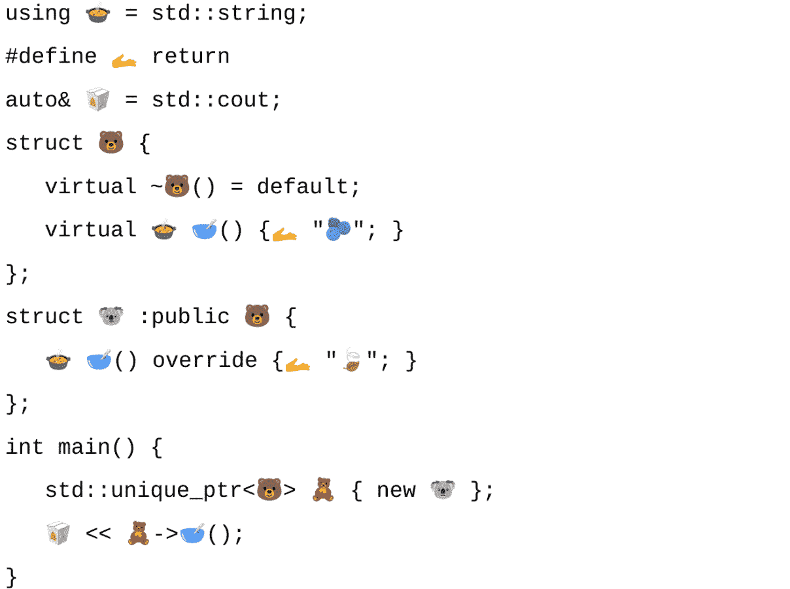

# 第九章：C++ 美丽

*根据墙上的镜子*

亲爱的读者。在本章中，我们不会专注于教授你特定的概念、技术或实用技能。相反，我们的目标是引导你体验一种不同类型的学习，这种体验让你能够从细节中抽身，沉浸于编码的美学方面。

本章旨在激发你以新的眼光看待代码，认识到当我们深思熟虑、细致入微地编写代码时，可能出现的模式、对称性，甚至诗意。

美是一种独特且个人的体验，因为它源于个人感知、情感共鸣、文化影响和个人身份的复杂相互作用。每个人都会通过自己的感官和认知过滤器来解释美，这些过滤器由他们的生活经历、记忆和文化背景塑造。情感联系、情绪和个人品味进一步影响一个人认为什么是美的，使其成为一种深刻的主观体验，反映了一个人对世界的独特视角。

有些人可能在地中海岛屿上日落时那炽热的色彩中找到美，而其他人可能欣赏斯堪的纳维亚峡湾的清新、寒冷的魅力。这完全是个人感受。

因此，虽然本章可能没有具体的课程或目标，但它提供了一个独特的机会，让你在更情感和智力层面上与编码技艺建立联系。通过这次旅程，我们希望你能从新的角度看待代码，认识到当我们深思熟虑、细致入微地编写代码时，可能出现的模式、对称性，甚至诗意。

在本章中，你将体验到：

+   这里没有新的东西要学习...

+   ...除了欣赏美...

+   ...在构思代码时，可能会使你在企业环境中无法坐在键盘前编写专业代码的技术

# 寻找美

每种编程语言都是一件独特的艺术作品，其设计、哲学和提供的可能性都各具特色；使用它们的程序员也同样多样，每个人都将自己的偏好、创造力和个性带入这门技艺。

一些开发者被 Python 的优雅简洁和结构所吸引，享受着其整洁的空白字符带来的清晰和表现力。然而，其他人却在像 Forth 这样的语言中找到快乐，他们可以精确地自由地推和弹出堆栈，拥有对这种低级操作的全权和简洁性，同时似乎享受着用简约语法构建强大系统的挑战。现在，真的还有人使用 Forth 吗？

然后还有那些拥抱 Lisp 神秘世界的勇敢冒险家，他们使用其臭名昭著的长列表的乏味和固执的括号。对这些程序员来说，语法的明显单调是通往一个丰富和表达性元编程景观的门户，在那里他们可以像处理数据一样处理代码，这种感觉几乎像是炼金术，更不用说他们可以直接访问 Emacs 了。

最后但同样重要的是，我们中的一些人，C++程序员的部落，认为一个程序的魅力可以完全通过以下一行表达出来：

```cpp
auto main()->int{return<:]<class _>(_)->_<%return 7;}(1);%>
```

我们在这个星球上还需要 C++的哪些美感呢？一行代码看起来像一系列眨眼的笑脸，最后，它将幸运数字七返回给调用者。在这段代码中并没有多少技术性，只是一行简单的 lambda 函数返回一个数字，为了迷惑你，亲爱的读者，我们使用了**main**的尾随返回类型，因为为什么不呢？

此外，为了给我们的代码片段增加更高的神秘感，我们仅仅是为了它们的纯粹美感，使用了臭名昭著的 C++二分图。不幸的是，C++17 中已经弃用了臭名昭著的三分图，所以我们无法使用它们来为我们的代码片段增添色彩。实际上，我们可以使用它们，但我们只是不敢。

所有的混乱和困惑都在一行中完成。真正的问题是，我们能否让这对你，亲爱的读者，读起来更加繁琐而美丽？当然，这个问题的答案是一个确定的“是”。我们能构建它吗？是的，我们可以！几乎...但首先，我们必须要摆脱数字，因为嘿...

## 谁喜欢数字？

...或者更具体地说，谁需要数字呢？由于数字具有抽象的本质，以及在我们日常生活中我们并不真正需要它们，这些数字不需要高级思维和掌握符号表示的能力，这使得它们几乎毫无意义。

也许这就是为什么亚马逊丛林中的一些部落甚至没有发明出所有这些（是的，我在指你们，Munduruku 部落 1）。你们有零、一、二、三、四、五的概念，然后是许多。如果这对你来说足够了，我可以接受。

1 https://www.amazon.com/Alexs-Adventures-Numberland-Alex-Bellos/dp/1408809591

让我们应用美洲原住民的古老智慧到我们的编程探索中：创造出世界上今天可以看到的最美的 C++代码片段。所以，让我们摆脱那些讨厌的数字，只保留 0 和 1（为了至高无上的比特，这样它们就不会感到被排除在外），然后让我们用以下代码片段来部落化：

```cpp
#define __(...)sizeof(int[]){0,\
                               ##__VA_ARGS__}/sizeof(int)-1
auto main()->int{return<:]<class _>(_)->_<%return
__(_(), _(), _(), _(), _(), _(), _()) ;}(__());%>
```

哦，它的纯粹之美。它让我们眼中充满喜悦的泪水，不是吗？可以说，一些挑剔的程序员可能会对可读性、可维护性、标准合规性等方面发表一些尖酸刻薄的评论……尤其是如果他们使用的是微软的（小巧，柔软的）C++编译器，它明确拒绝编译前面的代码。但我们在颤抖中欣喜若狂，因为我们让其中一个编译器崩溃了，而所有其他的主要玩家都愉快地消化了它并编译了它。

但不幸的是，代码中包含了很多重复的部分，我们并不真的喜欢。我们也不需要重复，所以我们也应该至少去掉其中的一部分，不是吗？或者全部去掉，为什么不呢？

因为这就是 C++语言的真正之美。总是能够重新定义自己，不惜一切代价提供更好的代码版本，不考虑所做出的牺牲。可读性万岁。可维护性万岁！自由代码的混乱、混乱和困惑万岁！

那么，勇敢的战士们，我们的任务已经布置，准备好武器（我的意思是键盘），让我们像以下代码片段所展示的那样，节省那些字节吧：

```cpp
#define $$ sizeof
#define $ return
#define $_ int
#define __(...)$$($_[]){0,##__VA_ARGS__}/$$($_)-1
auto main()->$_<%$<::><class _>(_)->_<%$
__(_(), _(), _(), _(), _(), _(), _()) ;%>(__());%>
```

再次看看它的纯粹之美。再次，C++的力量穿透了乌云，就像一千颗超新星，使得我们心中的所有愿望都成为可能，比如替换语言的一个关键元素，例如，将**return**关键字替换为**$**符号。这并不是因为它属于语言指定的有效字符集的一部分，但稍后我们将会讨论这个问题，以及一些熊，一点点。

但看看玻璃的明亮面。至少我们没有写出以下代码：

```cpp
#define return(...) main
#define main(...) int
main(7)(return(7))(){
    return 7;
}
```

我们必须承认，我们曾考虑过写下来并把它加到书中，但展望未来后，我们只是认为一切都有其极限。即使是经验最丰富的开发者面对无意义的（但无论如何，有趣）代码时，也会感到痛苦。

这可能是本书中展示的最邪恶的代码片段之一，因为邪恶的程度与尝试编写一个正确括号的 Lisp 程序时所感受到的痛苦程度相当。因为如果你因为括号太多而移除一个括号，或者，天哪，如果你认为再加一个括号是个好主意而添加一个括号，会发生什么？相信我，亲爱的读者，不要冒险。

所以，请假装前面的代码不在书中，即使它在书中，你也没有看到它。即使你看到了，你也不敢改变其中的括号数量。

足够的邪恶代码了；现在是我们回到之前代码的时候了，它是本书可以展示的最美的 C++代码片段的竞争者。

如果我们能够让它变得更短一些，更简洁，更富有表现力，比如移除那些丑陋的**define**，并用一些更能表达美的事物来替换它们，就像以下这样：

```cpp
#ifndef MINK
#define MINK
#include __FILE__
DD $$ sizeof
DD $ return
DD $_ int
DD _$ _()
DD __(_...)$$($_[]){0,##_}/$$($_)-1
auto main()->$_<%$<::><class _>(_)->
$_<%$ __(_$,_(),_$,_(),_$,_(),_$) ;%>(__());%>
#endif
#ifdef MINK
#define CAT(x, y) CAT_I(x, y)
#define CAT_I(x, y) x ## y
#define HH CAT(%, :)
#define DD HH define
#endif
```

哦，这真的刺痛了我的眼睛。对此表示歉意，并提前道歉，但我们无法在不让作者头疼的情况下使它变得更美。

在阅读这段内容时，我们突然意识到，尽管已经有了混淆 C 代码竞赛，我们实际上并不需要过度混淆其 C++对应版本。根据定义，C++可以足够混淆，无需我们主动尝试混淆它，但现在，在展示了前面的奇美拉之后，我们主动向你，亲爱的读者（在另一端，奇美拉也可以很美；你只需要有正确的眼光）道歉和解释。

我们得出的第一个重要观察结果是，这段代码不能单独编译。如果我们尝试编译它，GCC 会报错，如下所示：

```cpp
error: stray '%:' in program
   15 | #define HH CAT(%, :)
```

ICC 会报错，如下所示：

```cpp
error: "#" not expected here
  DD $$ sizeof
```

MSVC 不喜欢这样，正如你所见：

```cpp
error C2121: '#': invalid character: possibly the result of a macro expansion
```

Clang 也没有成功：

```cpp
error: expected unqualified-id
    4 | DD $$ sizeof
      | ^
```

所以，基本上，编译器普遍同意它们不能就一个共同的错误消息或失败原因达成一致，但至少它们中的任何一个都不能编译那块代码。有一些非常具体的错误消息，比如**#**可能是宏展开的结果（但这些行的作者希望看到一个展开为**#**的宏，因为**#define D #**不管**D**是什么都不起作用）或者关于程序中那个散乱的**%:**的另一个消息。

所有这些宏展开等等只是引导我们走向宏。如果你，亲爱的读者，不熟悉 C 或 C++宏，请去拿一本关于它们的书，比如 Bjarne Stroustrop 的*《C++编程语言》*，因为这本书（你现在正在读的这本书）只涉及神话般的宏，而那本书（即由语言的父亲和创造者编写的 C++书）教你除非你真的、真的需要，否则不要使用它们。即使那样，也要稀疏地使用。

但让我们回到我们的代码。所有正规的编译器都有提供预处理后的 C++文件结果的能力，所以让我们检查一下我们的程序。通过使用带有**–E**标志的**g++**（或者使用相同标志的 Clang；如果你使用命令行，则 MSVC 使用**/P**标志；否则，它们将可以从你在 Visual Studio 中工作的项目的构建目录中访问），我们得到以下列表：

```cpp
%: define $$ sizeof
%: define $ return
%: define $_ int
%: define _$ _()
%: define __(_...)$$($_[]){0,##_}/$$($_)-1
auto main()->$_<%$<::><class _>(_)->
$_<%$ __(_$,_(),_$,_(),_$,_(),_$) ;%>(__());%>
```

我们现在只展示必要的部分，并跳过编译器特定的行信息，这些信息也被添加到预处理输出中。所以，正如我们所见，预处理输出看起来像一个非常有效的 C++文件（尽管不太易读）...然而，令我们惊讶的是，我们可以在文件中看到几个活跃的**define**指令。它们以**%:**符号开头，经过双字符替换后，将转换为井号符号（**#**）并产生一个有效的程序。

为了进一步理解这里发生的事情，我们必须了解编译器如何处理宏。

C 编译器（当然也包括 C++）通过预处理器管理的方法过程展开宏，从对源代码进行标记化和识别替换宏开始。对于对象型宏，发生直接的文本替换，而函数型宏则涉及替换宏调用中提供的参数。函数型宏（那些有一对括号的宏）在参数预扫描过程中进行替换，其中宏参数在替换到宏体之前被完全展开。这个预扫描确保了参数内的嵌套宏调用被正确展开，并且最终宏体被重新扫描以捕获任何进一步的宏进行展开。

然而，当参数被字符串化或连接时，预扫描不适用，它也不会影响已被标记为不可重新展开的宏。这种行为要求为了正确展开，我们必须强制编译器对连接宏进行第二次遍历，如下所示：

```cpp
#define CAT(x, y) CAT_I(x, y)
#define CAT_I(x, y) x ## y
```

前面的代码片段确保了所有必要的参数都得到了正确的展开。

特殊宏如 **__LINE__** 和 **__TIME__** 被独特处理，以防止进一步的意外展开。在所有展开完成后，预处理器确保在将最终代码传递给编译器之前，没有可展开的宏被遗漏。这一全面的过程确保了宏能够高效且正确地展开，即使在涉及嵌套宏和字符串化操作的复杂场景中也是如此。

现在我们已经尝试解释了宏替换是如何在一个对初学者来说并不那么明显的情况下工作的，现在是时候回到我们的程序并最终编译它了。正如你所能记得的，预处理后的源代码仍然包含一些包含 **define** 指令的语句。

现在，带着这些知识，我们将向你，亲爱的读者，揭示一个神秘的知识点。最终，这是一本关于 C++ 神秘主义的书。这个神秘的知识点被称为**双重预处理**。在继续之前，我们先简要了解一下编译器是如何处理你的代码的。

在编译 C++ 源文件的初始阶段，编译器首先进行预处理和编译。在预处理阶段，编译器展开宏（就像我们之前所展示的那样），处理条件编译指令（**#ifdef**、**#ifndef** 等），包含头文件，并移除注释，从而生成一个包含所有外部文件和宏已完全解析的完整翻译单元。随后，在编译阶段，预处理后的代码在称为词法分析的阶段被分解成标记，然后根据语言的语法规则进行检查，以构建**解析树**或**抽象语法树**（**AST**）。

这之后是语义分析阶段，编译器会验证类型、变量和函数的正确使用，并可能进行早期优化。最后，编译器将抽象语法树（AST）转换为**中间表示**（**IR**），为后续优化和最终机器代码生成做好准备，但这超出了本书所涵盖的主题。然而，我们愿意将那些对此话题感兴趣的人引导到著名的“龙书”，也称为《编译原理、技术和工具》，由 Alfred Aho、Jeffrey Ullman、Ravi Sethi 和 Monica Lam 所著。这是每个对开发编译器感兴趣或只是对学习这些技术感兴趣的程序员必读的书。

但回到我们的双重预处理技术。通过使用这项技术，我们将之前的预处理源文件传递给编译器，使用 Linux 中称为管道技术，在 Windows 中称为黑客技术的技巧。

以下是在 Windows 上完成此操作的命令：

```cpp
cl /P test.cpp & cl /Tp test.i
```

第一部分是生成预处理文件，在 Visual C++领域，通常具有**.i**扩展名，第二部分将预处理输出放置在**test.i**中，并将其作为 C++文件编译（**/Tp**开关负责此操作）。结果是预期的**test.exe**，执行后正好符合预期。

在 Linux 下，命令序列也非常相似：

```cpp
clang++ -E test.cpp | g++ -w -x c++ -std=c++20 -
```

在管道之前的第一部分，使用**clang++**生成预处理代码，利用 Linux 管道魔法，将其发送到**g++**，因为为什么不呢 ☺。在这个简单场景中，如果我们反过来使用，也不会有任何区别，因为这两个编译器是相辅相成的，它们共享基本的命令行选项，例如**–x c++**来指定要编译的代码是某种 C++代码，或者代码遵循的 C++标准版本。第二个编译器调用最重要的参数是最后的**-**符号，它告诉编译器从 stdin 读取代码，而不是从文件中读取。

就这样。使用这种神秘的技巧，我们可以编译我们认为不可能的代码，但...请不要使用它。这段代码近乎疯狂；它之所以被展示出来，仅仅是因为这本书是关于非常规、神话般的技术，针对的是高级 C++程序员社区，所以不要让这部分内容破坏你的编程风格，或者让你远离键盘。我们不想让读者在书的中途就放弃。相反，在接下来的章节中，让我们把心思放在纯粹的虚无上。

# 零的定义

零在数字中是独一无二的。这个概念在古埃及就已经存在，而且在古巴比伦的数字系统中找到了它的痕迹，作为占位符，但那时并没有将其视为真正的数字。

古希腊人对它有所反感，因为他们虽然最初知道其重要性，但由于一些哲学限制，他们最初并没有将其作为合适的数字使用，因为不是，存在与否，而是如何使无成为可能，这是古代市场中的问题。

突破发生在公元 5 世纪左右的印度，当时数学家布拉马古普塔将零定义为数字，并为其算术使用确立了规则。这一概念通过阿尔-花拉子米等人的作品传播到伊斯兰世界，然后传到欧洲，其中斐波那契在 12 世纪对其采纳发挥了关键作用。感谢维基百科。

零有几个重要的属性：它是加法恒等元，意味着将零加到任何数字上都不会改变该数字。任何数字乘以零的结果都是零，而除以零是未定义的。零是一个偶数，在数轴上作为中性元素，既不是正数也不是负数。在指数中，零的任何正数次幂都是零，而任何非零数的零次幂等于一。

这些属性使零在数学中成为基本元素，因此我们可以一致认为零是历史上最重要的（如果不是最重要的）数字之一；它的位置紧挨着π，或*e*，或*i*，这是我们所有人都知道的，是所有邪恶的平方根，或-1。

现在我们已经提供了没有其他数字像零这样的具体证据，我们也给出以下声明：C++是一种独特的语言。在其最新的迭代版本中，截至 2024 年，在当前的 C++中，有六种不同的方式将值初始化为零，以纪念零是最重要的数字。看看以下内容：

```cpp
int z;
int main()
{
    int z1 = 0;
    int z2(0);
    int z3{0};
    int z4 = {0};
    int z5{};
    int z6();
}
```

让我们逐行分解，因为行数并不多：

+   **int z;** – 这里，一个全局变量**z**被声明为**int**类型。由于它是全局变量，编译器会自动将其初始化为**0**（如果全局**int**变量没有明确初始化，则默认为零）。这是我们值得信赖的。

+   **int z1 = 0;** – 复制初始化。**z1**变量被声明为**int**类型，并使用复制初始化设置为**0**。这涉及到在创建后将其值赋给**z1**。

+   **int z2(0);** – 直接初始化。**z2**变量被声明并使用直接初始化设置为**0**，这涉及到直接将**0**的值传递给**int**类型的构造函数。虽然它没有其他含义，但你可以理解这个概念。

+   **int z3{0};** – 花括号初始化（统一初始化）。**z3**变量被声明并使用花括号初始化设置为**0**。这有助于防止诸如窄化转换等问题，并为初始化不同类型提供一致的语法。这是一种特殊的初始化，我们将在下一章稍后回到这种语法。

+   **int z4 = {0};** – 复制列表初始化。变量 **z4** 使用复制列表初始化声明并初始化为 **0**，这是一种复制初始化和花括号初始化的组合。它与 **z3** 类似，但明确使用了赋值语法，当我们谈论像数字这样的简单事物时，实际上并没有什么区别。

+   **int z5{};** – 值初始化。变量 **z5** 使用空花括号 **{}** 初始化，这被称为值初始化。对于像 **int** 这样的基本类型，这会导致 **z5** 被初始化为 **0**。这种方法通常用于确保变量被零初始化，而无需显式分配值。

这样考虑，让变量对应于数字零的数量，难道不美吗？所以，人们可能会问：为什么 C++的局部变量不是初始化为零（或其默认值）？

这个问题的答案部分是历史的，部分是实用的。由于 C++ 基于 C 语言，而 C 语言被设计得尽可能接近金属（硅），编译器不会浪费宝贵的处理器周期来初始化一个值为其默认值，如果后来它被用来设置程序员需要的不同值。亲爱的读者，正如一位最著名的侦探所说，这是基本的。

最后但同样重要的是，没有我提供更多细节，我真的希望你已经识别出 **int z6();** 中的“最令人头疼的解析”。

“最令人头疼的解析”是一个用来描述 C++中特定问题的术语，这个问题涉及到由于语法中的歧义，编译器可能会误解对象声明的声明。它通常发生在你使用括号声明变量时，这有时可能被解释为函数声明而不是变量定义，就像在我们的具体例子中一样。

# 关于括号的旁白

现在我们在这里，我们必须提到，在这一章中提到了很多关于括号的内容。因此，我们在这里展示的是你在这本书的阅读过程中可能会遇到的最重要的一对括号。

请看以下两个函数：

```cpp
static int y;
decltype(auto) number(int x) {
    return y;
}
decltype(auto) reference(int x) {
    return (y);
}
```

这两个函数看起来几乎相同，除了围绕 **return** 值的微小括号对。但这两个括号的存在造成了最大的区别。C++14 中引入的看起来很奇怪的 **decltype(auto)** 是一个类型说明符，它结合了 **decltype** 的功能和自动类型推导，允许你声明一个变量，其类型由初始化它的表达式确定，同时保留该表达式的某些属性。与基于值类别推导类型的 **auto** 不同，**decltype(auto)** 保留了基于的表达式的值类别（例如，引用或非引用）。

更平凡的是，函数 number 返回一个 **int**，而函数 reference 返回 **int&**。

为了验证我们之前所写的正确性，以下代码片段可以提供极大的帮助：

```cpp
using namespace std;
if (is_reference<decltype(number(42))>::value) {
    cout << "Reference to ";
    cout << typeid(typename 
remove_reference<decltype(number(42))>::type).name() << endl;
} else {
    cout << "Not a reference: " << typeid(decltype(number(42))).name() << endl;
}
```

前面的代码片段检查了**number**函数提供的返回类型。正如其名匆忙暗示的那样，它将返回，嗯...一个数字。当使用 MSVC 编译并执行时，以下是代码的输出：

```cpp
Not a reference: int
```

其他编译器也有相同的行为，只是它们不会打印出变量的完整类型，因为**gcc**和**clang**对于**int**类型只返回一个**i**，这不会那么引人注目。

现在，让我们检查以下代码序列：

```cpp
if (is_reference<decltype(reference(42))>::value) {
    cout << "Reference to: ";
    cout << typeid(typename 
remove_reference<decltype(reference(42))>::type).name() << endl;
} else {
    cout << "Not a reference: " << typeid(decltype(number(42))).name() << endl;
}
```

这几乎与之前的完全相同，只是它使用**reference**方法而不是**number**。不出所料，执行的结果（再次，引用 MSVC）如下：

```cpp
Reference to: int
```

因此，使用前面的代码，我们刚刚证明了成对额外的括号与**decltype(auto)**结合可以提供一些惊人的结果。警告一下。假设我们省略了**decltype**，如下所示：

```cpp
auto reference(int x) {
    return (y);
}
```

编译器随后忽略括号，只返回一个正常的数字。C++标准在**[dcl.type.decltype]**部分指定了这种行为，作者强烈建议阅读它，以便全面了解幕后发生的事情以及合理的推理。

现在，因为我们都是 C++程序员，总是追求速度、高质量和清晰的代码，你可能会问为什么我们必须重复代码来识别我们是否有引用。难道不能像以下这样写就完全有效吗？

```cpp
template <typename T>
void printType(T&& var) {
    if (std::is_reference<T>::value) {
        if (std::is_lvalue_reference<T>::value) {
            printf("lvalue ref ");
        } else {
            printf("rvalue ref ");
        }
        printf("%s\n", (typeid(typename
                  std::remove_reference<T>::type).name()));
    } else {
        printf("%s\n", typeid(var).name());
    }
}
```

这几乎与上面的一样（上面上面就像上面一样，但指的是实际上面之前的一个上面），除了我们增加了一个额外的检查来验证引用的类型（并且用**printf**代替了**std::cout**，因为它生成更干净的汇编代码，并且将其放在函数体中）。确实，让我们假设我们将其放入这个上下文中并调用以下代码：

```cpp
printType(number(42));
printType(reference(42));
```

我们得到了正确和预期的输出：

```cpp
int
lvalue ref int
```

作为旁注，我们用其他，不那么小而柔软的编译器也得到了相同的结果。

这个函数模板使用前向引用（**T&& var**）来处理**左值引用**和**右值引用**，使其能够推断并保留传递变量的引用类型。通过使用类型特性库，我们使用**is_reference<T>::value**检查**T**是否是引用类型，并进一步使用**is_lvalue_reference<T>::value**区分**左值引用**和**右值引用**。

如果它是一个引用，我们使用**remove_reference<T>::type**打印出它是一个**左值引用**还是**右值引用**，以及没有引用的变量的类型。

如果它不是一个引用，我们就直接打印变量的类型。这种方法之所以有效，是因为 C++中的完美转发机制，允许**T**被推导为传递变量的确切类型，保留其引用性质。

请注意，必须使用转发引用**T&& var**；如果我们只使用**T var**，它对于引用类型就不会以相同的方式工作。这是因为，在这个形式中，**T**会被推导为非引用类型，所以函数内部的**var**始终是原始参数的副本，而不是引用。

作为对你这位亲爱的读者的额外礼物，这里有一些编译器（在我们的例子中是 GCC）的汇编输出摘录。你可以看到它如何生成两个不同的函数，最重要的是，这些函数内部发生了什么：

|

```cpp
void printType <int>(int&&):
```

|

```cpp
void printType <int&>(int&):
```

|

|

```cpp
push rbp
```

```cpp
mov rbp, rsp
```

```cpp
sub rsp, 16
```

```cpp
mov QWORD PTR [rbp-8], rdi
```

```cpp
mov edi, OFFSET
```

```cpp
         FLAT:typeinfo
```

```cpp
call std::type_info::name()
```

```cpp
mov rdi, rax
```

```cpp
call puts
```

```cpp
nop
```

```cpp
leave
```

```cpp
ret
```

|

```cpp
push rbp
```

```cpp
mov rbp, rsp
```

```cpp
sub rsp, 16
```

```cpp
mov QWORD PTR [rbp-8], rdi
```

```cpp
mov edi, OFFSET FLAT:.LC0
```

```cpp
mov eax, 0
```

```cpp
call printf
```

```cpp
mov edi, OFFSET
```

```cpp
         FLAT:typeinfo
```

```cpp
call std::type_info::name() mov rdi, rax
```

```cpp
call puts
```

```cpp
nop
```

```cpp
leave
```

```cpp
ret
```

```cpp
.LC0:
```

```cpp
 .string "lvalue ref "
```

|

表 9.1：比较各种 printType 实例化的汇编列表

我们可以看到两个函数的**printType**实例化，每个函数返回的类型都有两个，以及在每个实例中，各种类型特性调用都成功地在源代码级别实现，从而消除了不必要的分支。我们还可以观察到不必要的字符串的删除（现在生成的代码中找不到**"rvalue ref"**，因为编译器确定包含它的分支在最终代码中无处可寻）。

C++难道不美吗？

# C++uties

是时候让这些文字的作者承认一些事情了。他已经厌倦了试图在 C++之美竞赛中获胜的丑陋代码。无论我们如何努力说服自己，之前几节中展示的代码是美丽的，值得记住，好吧，它不是。它是丑陋的，令人厌恶的，亲爱的读者，请忘记你曾经不得不阅读这样的东西。抱歉。

从现在开始，我们庄严地承诺，我们不会再有任何恶作剧，只会用美丽的代码来对待你。没有更多的丑陋宏，没有更多的可疑替换，没有更多的神秘技巧。只有纯粹、快乐、可爱的 C++。

由于我们（作为美丽 C++代码的编写者）的自我革新，我们向您展示下一个程序，这可能是你能得到的最好看的程序之一：



请为了简洁，我们省略了**std::string**、**std::cout**和**std::unique_ptr**的包含。谁说 C++不能可爱？

但遗憾的是，前面的代码并不被广泛认为是标准的 C++（似乎编译器开发者之间对于在源代码中应考虑哪些 Unicode 标识符为有效并没有明确的共识，尽管最新的 C++标准中提到了**[tab:lex.name.allowed]**），但并非所有的希望都破灭了，因为 GCC 接受它。也许在他们开发者队伍中有一个拥抱者。

作为旁注，展示的代码并没有做太多，只是根据熊的营养需求、饮食要求和与熊国中各种饮食模式和当前烹饪趋势的关联，给熊喂食适当的食物。我们没有交付一个可爱的小程序，一个可能是最美丽 C++代码竞赛的获胜者吗？

我们鼓励我们亲爱的尊敬的读者阅读一些书籍，如果他们想让他们的程序遵循常识性指南，易于阅读、稳定、易于维护并符合最新标准。遗憾的是，这些书籍中没有一本详细说明如何编写有趣的程序，因为编写有趣的程序或为了乐趣编写程序涉及不同的思维方式，而且很少为了利润而做。

编程可以是一种艺术形式，产生令人惊讶和愉悦的代码，拥有代码可以包括彩蛋、幽默的输出，应用俏皮的用户交互或非同寻常的视觉呈现。俏皮可能简单到使用表情符号作为标识符（如我们的熊示例）或制作逻辑古怪的应用程序。有趣的编程通常拒绝正式实践的僵化，转而选择创造性的解决方案，这些解决方案可能只是为了乐趣而不太高效或过于复杂，例如制作一个加密的代码片段，仅仅因为我们觉得它很有趣。

编程中的乐趣也可以来自解决引人入胜的谜题或探索非常规的编程范式（如函数式、晦涩的语言如 Brainfuck 或 LOLCODE），或者纯粹出于好奇心来构建项目。

虽然关于“美观”或“简洁”代码的正式书籍强调正确性、安全性和可读性，但有趣的编程打开了即兴、艺术和娱乐的大门，因此我们本章的最后一项活动就是参与最后一项活动。它很短，很可爱，看起来像是从童话故事中出来的东西。因为有熊。因为谁不喜欢熊呢？

# 摘要

并非所有闪亮的东西都是金子，也并非所有看似令人兴奋且具有复杂功能的代码必然是高质量的。光鲜、复杂的代码有时会掩盖定义良好编程实践的基本品质。好的、稳定的代码通常以其简单性和可预测性为特征，而不是其风格。与更有趣的构造相比，这种类型的代码可能看起来平淡无奇或平凡，但正是这种简单性确保了其健壮性和易于理解。当你不得不这样做时，请尽量编写无聊、简单的代码，因为半年后阅读起来会容易得多，但每次你有机会时，请尽量在你的有趣侧项目中加入一两只熊。除非你也打算阅读它。

在下一章中，亚历克斯将发起一场十字军东征，倡导正确使用现代 C++库，以驳斥 C++库也陷入石器时代的神话。
