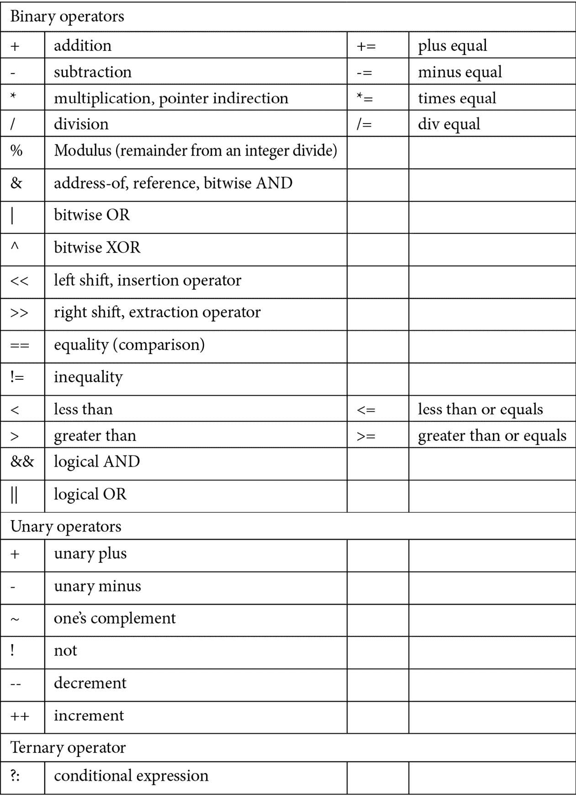

# 第一章：理解基本的 C++ 假设

本章将简要介绍 C++ 的基本语言语法、结构和功能，这些您可能通过熟悉 C++、C、Java 或类似语言的基本语法而获得。这些核心语言特性将简要回顾。如果在完成本章后，这些基本语法技能对您来说仍然不熟悉，请在继续阅读本书之前，先花时间探索更基础的语法驱动的 C++ 文本。本章的目标不是详细教授每个假设的技能，而是简要概述每个基本语言特性，以便您能够快速回忆起您编程库中应该已经掌握的技能。

在本章中，我们将涵盖以下主要主题：

+   基本语言语法

+   基本输入/输出

+   控制结构、语句和循环

+   运算符

+   函数基础

+   用户定义类型基础

+   命名空间基础

到本章结束时，您将对您假设熟练掌握的非常基本的 C++ 语言技能有一个简洁的回顾。这些技能对于成功进入下一章是必要的。因为大多数这些特性不使用 C++ 的面向对象特性，所以我会尽量避免使用面向对象的术语（尽可能），当我们进入本书的面向对象部分时，我会引入适当的面向对象术语。

# 技术要求

请确保您有可用的当前 C++ 编译器；您将想要尝试许多在线代码示例。至少，请从 [`gcc.gnu.org`](https://gcc.gnu.org) 下载 g++。

完整程序示例的在线代码可以在以下 GitHub 网址找到：[`github.com/PacktPublishing/Deciphering-Object-Oriented-Programming-with-CPP/tree/main/Chapter01`](https://github.com/PacktPublishing/Deciphering-Object-Oriented-Programming-with-CPP/tree/main/Chapter01)。每个完整程序示例都可以在 GitHub 的相应章节标题（子目录）下的文件中找到，该文件以章节编号开头，后面跟着一个连字符，然后是本章中的示例编号。例如，第一完整的程序在 *第一章*，*理解基本的 C++ 假设*，可以在上述 GitHub 目录下的 `Chapter01` 子目录中找到，文件名为 `Chp1-Ex1.cpp`。

本章的 **Code in Action** (**CiA**) 视频可以在以下网址查看：[`bit.ly/3PtOYjf`](https://bit.ly/3PtOYjf)

# 回顾基本的 C++ 语言语法

在本节中，我们将简要回顾基本的 C++ 语法。我们假设你是一个具有非面向对象编程技能的 C++ 程序员，或者你已经使用过 C、Java 或类似的有相关语法的强类型检查语言进行编程。你也可能是一位经验丰富的专业程序员，能够快速掌握另一种语言的基础。让我们开始我们的简要回顾。

## 注释风格

C++ 中有可用的两种注释风格：

+   `/*   */`风格的注释允许跨越多行代码的注释。这种风格不能与相同风格的其它注释嵌套。

+   `//`风格的注释允许对当前行的末尾进行简单注释。

使用两种注释风格一起可以允许嵌套注释，这在调试代码时可能很有用。

## 变量声明和标准数据类型

变量的长度可以是任意的，并且可以由字母、数字和下划线组成。变量是区分大小写的，并且必须以字母或下划线开头。C++中的标准数据类型包括以下内容：

+   `int`：用于存储整数

+   `float`：用于存储浮点值

+   `double`：用于存储双精度浮点值

+   `char`：用于存储单个字符

+   `bool`：用于存储布尔值`true`或`false`

这里有一些使用上述标准数据类型的简单示例：

```cpp
int x = 5;
int a = x;
float y = 9.87; 
float y2 = 10.76f;  // optional 'f' suffix on float literal
float b = y;
double yy = 123456.78;
double c = yy;
char z = 'Z';
char d = z;
bool test = true;
bool e = test;
bool f = !test;
```

回顾之前的代码片段，注意一个变量可以被赋予一个字面量值，例如`int x = 5;`，或者一个变量可以被赋予另一个变量的值或内容，例如`int a = x;`。这些示例用各种标准数据类型说明了这种能力。注意，对于`bool`类型，值可以设置为`true`或`false`，或者使用`!`（非）来设置这些值的相反。

## 变量和数组基础

数组可以声明为任何数据类型。数组名称代表与数组内容关联的连续内存的起始地址。在 C++中，数组是零基的，这意味着它们从数组`element[0]`开始索引，而不是从`element[1]`开始。最重要的是，C++中的数组不执行范围检查；如果你访问数组之外的元素，你将访问属于另一个变量的内存，并且你的代码可能会很快出现故障。

让我们回顾一些简单的数组声明（一些带有初始化），以及一个赋值操作：

```cpp
char name[10] = "Dorothy"; // size is larger than needed
float grades[20];  // array is not initialized; caution!
grades[0] = 4.0;  // assign a value to one element of array
float scores[] = {3.3, 4.3, 4.0, 3.7}; // initialized array
```

注意，第一个数组 `name` 包含 10 个 `char` 元素，这些元素被初始化为字符串字面量 `"Dorothy"` 中的七个字符，后面跟着空字符 (`'\0'`)。数组目前有两个未使用的元素在末尾。可以使用 `name[0]` 到 `name[9]` 访问数组中的元素，因为在 C++ 中数组是从零开始的。同样，上面由变量 `grades` 标识的数组有 20 个元素，其中没有任何一个被初始化。在初始化或赋值之前访问的任何数组值都可能包含任何值；这是任何未初始化变量的特性。注意，在声明数组 `grades` 之后，它的第 0 个元素被赋值为 `4.0`。最后，注意 `float` 类型的数组 `scores` 被声明并初始化了值。尽管我们可以在 `[]` 对中指定数组大小，但我们没有这样做——编译器能够根据我们初始化中的元素数量来计算大小。尽可能初始化数组（即使使用零），始终是利用最安全的风格。

字符数组通常被概念化为字符串。在 `<cstring>` 等库中存在许多标准的字符串函数。如果字符数组要被当作字符串处理，它们应该是以空字符终止的。当字符数组被初始化为一个字符串时，空字符会自动添加。然而，如果字符逐个添加到数组中通过赋值，那么添加空字符 (`'\0'`) 作为数组的最后一个元素就是程序员的职责了。

除了使用字符数组（或字符指针）实现的字符串之外，C++ 标准库中还有一个更安全的数据类型，即 `std::string`。一旦我们掌握了类的内容，我们就会了解这个类型的细节；在 *第五章* *详细探索类*；然而，现在让我们先介绍 `string`，作为一种更容易且更不容易出错的方式来创建字符字符串。你需要理解这两种表示；`char` 数组（和 `char` 指针）的实现不可避免地会出现在 C++ 库和其他现有代码中。然而，你可能会在新代码中更喜欢 `string`，因为它更简单且更安全。

让我们看看一些基本的例子：

```cpp
// size of array can be calculated by initializer
char book1[] = "C++ Programming"; 
char book2[25];  // this string is uninitialized; caution!
// use caution as to not overflow destination (book2)
strcpy(book2, "OO Programming with C++"); 
strcmp(book1, book2);
length = strlen(book2);
string book3 = "Advanced C++ Programming";  // safer usage
string book4("OOP with C++"); // alt. way to init. string
string book5(book4); // create book5 using book4 as a basis
```

在这里，第一个变量`book1`被声明并初始化为一个字符串字面量`"C++ Programming"`；数组的大小将由引号字符串值的长度加上一个空字符(`'\0'`)来计算。接下来，变量`book2`被声明为一个长度为`25`字符的数组，但没有初始化任何值。接下来，使用来自`<cstring>`的函数`strcpy()`将字符串字面量`"OO Programming with C++"`复制到变量`book2`中。注意，`strcpy()`会自动将空终止字符添加到目标字符串中。在下一行，使用来自`<cstring>`的`strcmp()`函数来对变量`book1`和`book2`的内容进行字典序比较。这个函数返回一个整数值，可以被捕获到另一个变量中或用于比较。最后，使用`strlen()`函数来计算`book2`中的字符数（不包括空字符）。

最后，请注意`book3`和`book4`都是`string`类型，展示了两种不同的初始化字符串的方法。同时请注意`book5`是使用`book4`作为基础进行初始化的。正如我们很快就会发现的，`string`类中内置了许多安全特性，以促进安全的字符串使用。尽管我们已经回顾了几个表示字符串的方法的示例（一个本地的字符数组与字符串类），但我们通常将使用`std::string`，因为它更安全。尽管如此，我们现在已经看到了各种函数，如`strcpy()`和`strlen()`，它们在原生 C++字符串上操作（我们不可避免地会在现有代码中遇到它们）。重要的是要注意，C++社区正在远离原生 C++字符串——即使用字符数组（或指针）实现的字符串。

现在我们已经成功回顾了基本的 C++语言特性，如注释风格、变量声明、标准数据类型和数组基础，让我们继续回顾 C++的另一个基本语言特性：使用`<iostream>`库的基本键盘输入和输出。

# 回顾基本 I/O

在本节中，我们将简要回顾基于键盘和监视器的简单字符输入和输出。还将回顾简单的操纵器，以解释 I/O 缓冲区的底层机制，并提供基本的增强和格式化。

## iostream 库

在 C++中，最容易的输入和输出机制之一是使用`<iostream>`库。头文件`<iostream>`包含了数据类型`cin`、`cout`、`cerr`和`clog`的定义，通过包含`std`命名空间来整合。`<iostream>`库简化了 I/O 操作，可以使用如下方式：

+   `cin`可以与提取操作符`>>`一起用于缓冲输入

+   `cout`可以与插入操作符`<<`一起用于缓冲输出

+   `cerr`（无缓冲）和`clog`（缓冲）也可以与插入操作符一起使用，但用于错误

让我们回顾一个展示简单 I/O 的示例：

[`github.com/PacktPublishing/Deciphering-Object-Oriented-Programming-with-CPP/blob/main/Chapter01/Chp1-Ex1.cpp`](https://github.com/PacktPublishing/Deciphering-Object-Oriented-Programming-with-CPP/blob/main/Chapter01/Chp1-Ex1.cpp)

```cpp
#include <iostream>
using namespace std;  // we'll limit the namespace shortly
int main()
{
    char name[20];  // caution, uninitialized array of char
    int age = 0;
    cout << "Please enter a name and an age: ";
    cin >> name >> age; // caution, may overflow name var.
    cout << "Hello " << name;
    cout << ". You are " << age << " years old." << endl;
    return 0;
}
```

首先，我们包含 `<iostream>` 库并指示我们正在使用 `std` 命名空间以使用 `cin` 和 `cout`（关于命名空间将在本章后面进行更多介绍）。接下来，我们介绍 `main()` 函数，它是我们应用程序的入口点。在这里，我们声明了两个变量，`name` 和 `age`，它们都没有初始化。接下来，我们通过将字符串 `"Please enter a name and an age: "` 放入与 `cout` 相关的缓冲区来提示用户输入。当与 `cout` 相关的缓冲区被刷新时，用户将在屏幕上看到这个提示。

然后，使用提取操作符 `<<` 将键盘输入字符串放入与 `cout` 相关的缓冲区。方便的是，一个自动刷新与 `cout` 相关的缓冲区的机制是使用 `cin` 将键盘输入读取到变量中，如下一行所示，我们将用户输入读取到变量 `name` 和 `age` 中，分别。

接下来，我们向用户打印出 `"Hello"` 的问候语，然后是输入的名字，然后是用户年龄的指示，这些是从用户输入的第二部分收集的。此行末尾的 `endl` 不仅可以向输出缓冲区中放置一个换行符 `'\n'`，而且确保输出缓冲区被刷新——关于这一点将在下一节中详细介绍。`return 0;` 声明只是将程序退出状态返回给编程外壳，在这种情况下，值为 `0`。请注意，`main()` 函数表明返回值是 `int` 类型，以确保这是可能的。

## 基本 iostream 操作符

通常，我们希望能够操作与 `cin`、`cout` 和 `cerr` 相关的缓冲区的内容。操作符允许修改这些对象的内部状态，从而影响它们相关缓冲区的格式化和操作。操作符在 `<iomanip>` 头文件中定义。常见的操作符示例包括以下内容：

+   `endl`: 在与 `cout` 相关的缓冲区中放置一个换行符 (`'\n'`) 然后刷新缓冲区

+   `flush`: 清除输出流的全部内容

+   `setprecision(int)`: 定义用于输出浮点数的精度（数字位数）

+   `setw(int)`: 设置输入和输出的宽度

+   `ws`: 从缓冲区中移除空白字符

让我们看看一个简单的示例：

[`github.com/PacktPublishing/Deciphering-Object-Oriented-Programming-with-CPP/blob/main/Chapter01/Chp1-Ex2.cpp`](https://github.com/PacktPublishing/Deciphering-Object-Oriented-Programming-with-CPP/blob/main/Chapter01/Chp1-Ex2.cpp)

```cpp
#include <iostream>
#include <iomanip>
using namespace std;   // we'll limit the namespace shortly
int main()
{
    char name[20];     // caution; uninitialized array
    float gpa = 0.0;   // grade point average
    cout << "Please enter a name and a gpa: "; 
    cin >> setw(20) >> name >> gpa;  // won't overflow name
    cout << "Hello " << name << flush;
    cout << ". GPA is: " << setprecision(3) << gpa << endl;
    return 0;
}
```

在这个例子中，首先，注意 `<iomanip>` 头文件的包含。另外，注意 `setw(20)` 的使用是为了确保我们不会溢出只有 20 个字符长的名称变量；`setw()` 会自动从提供的大小中减去一个，以确保有空间放置空字符。注意在第二行输出中使用 `flush` – 在这里不需要刷新输出缓冲区；这个转换器仅仅演示了如何应用 `flush`。在最后一行输出 `cout` 中，注意使用了 `setprecision(3)` 来打印浮点数 `gpa`。三个小数点精度包括小数点及其右边的两个位置。最后，注意我们向与 `cout` 关联的缓冲区添加了 `endl` 转换器。`endl` 转换器首先在缓冲区中插入一个换行符 (`'\n'`)，然后刷新缓冲区。为了性能，如果你不需要立即看到输出，只使用换行符会更高效。

现在我们已经回顾了使用 `<iostream>` 库的简单输入和输出，让我们通过简要回顾控制结构、语句和循环结构来继续前进。

# 回顾控制结构、语句和循环

C++ 具有多种控制结构和循环结构，允许程序流程非顺序执行。每个结构都可以与简单或复合语句结合使用。简单语句以分号结束；更复杂的复合语句则用一对花括号 `{}` 包围。在本节中，我们将回顾各种控制结构（`if`、`else if` 和 `else`）以及循环结构（`while`、`do while` 和 `for`），以总结代码中非顺序程序流程的简单方法。

## 控制结构 – if、else if 和 else

使用 `if`、`else if` 和 `else` 的条件语句可以与简单语句或语句块一起使用。注意，`if` 子句可以不跟 `else if` 或 `else` 子句。实际上，`else if` 是一个嵌套了 `if` 子句的 `else` 子句的压缩版本。实际上，开发者将嵌套使用简化为 `else if` 格式以提高可读性和节省多余的缩进。让我们看一个例子：

[`github.com/PacktPublishing/Deciphering-Object-Oriented-Programming-with-CPP/blob/main/Chapter01/Chp1-Ex3.cpp`](https://github.com/PacktPublishing/Deciphering-Object-Oriented-Programming-with-CPP/blob/main/Chapter01/Chp1-Ex3.cpp)

```cpp
#include <iostream>
using namespace std;   // we'll limit the namespace shortly
int main()
{
    int x = 0;
    cout << "Enter an integer: ";
    cin >> x;
    if (x == 0) 
        cout << "x is 0" << endl;
    else if (x < 0)
        cout << "x is negative" << endl;
    else
    {
        cout << "x is positive";
        cout << "and ten times x is: " << x * 10 << endl;
    }  
    return 0;
}
```

注意，在前面的 `else` 子句中，多个语句被组合成一个代码块，而在 `if` 和 `else if` 条件中，每个条件后只跟一个语句。作为旁注，在 C++ 中，任何非零值都被视为真。例如，测试 `if (x)` 就意味着 `x` 不等于零 – 不必写 `if (x !=0)`，除非为了可读性。

值得注意的是，在 C++中，采用一套一致的编码约定和实践是明智的（正如许多团队和组织所做的那样）。作为一个简单的例子，括号的放置可能被指定在编码标准中（例如，将`{`与关键字`else`放在同一行，或者放在`else`关键字下面的行上，并指定缩进的空格数）。另一个约定可能是，即使是一个跟随在`else`关键字之后的单条语句，也应该用括号包含在一个块中。遵循一套一致的编码约定将使你的代码更容易被他人阅读和维护。

## 循环结构——while、do while 和 for 循环

C++有几种循环结构。让我们花点时间简要回顾每种风格的示例，从`while`和`do while`循环结构开始：

[`github.com/PacktPublishing/Deciphering-Object-Oriented-Programming-with-CPP/blob/main/Chapter01/Chp1-Ex4.cpp`](https://github.com/PacktPublishing/Deciphering-Object-Oriented-Programming-with-CPP/blob/main/Chapter01/Chp1-Ex4.cpp)

```cpp
#include <iostream>
using namespace std;   // we'll limit the namespace shortly
int main()
{
    int i = 0;
    while (i < 10)
    {
        cout << i << endl;
        i++;
    }
    i = 0;
    do 
    {
        cout << i << endl;
        i++;
    } while (i < 10);
    return 0;
}
```

使用`while`循环时，循环体进入之前，条件必须评估为真。然而，使用`do while`循环时，循环体的第一次进入是有保证的——条件是在循环体再次迭代之前评估的。在先前的例子中，`while`和`do while`循环都执行了 10 次，每次为变量`i`打印值`0`到`9`。

接下来，让我们回顾一下典型的`for`循环。`for`循环在括号内有三个部分。首先，有一个语句只执行一次，通常用于初始化循环控制变量。接下来，在括号中间由分号分隔的表达式。这个表达式在每次进入循环体之前都会被评估。只有当这个表达式评估为`true`时，才会进入循环体。最后，括号内的第三部分是第二个语句。这个语句在执行循环体之后立即执行，通常用于修改循环控制变量。在第二个语句之后，中心表达式会被重新评估。以下是一个例子：

[`github.com/PacktPublishing/Deciphering-Object-Oriented-Programming-with-CPP/blob/main/Chapter01/Chp1-Ex5.cpp`](https://github.com/PacktPublishing/Deciphering-Object-Oriented-Programming-with-CPP/blob/main/Chapter01/Chp1-Ex5.cpp)

```cpp
#include <iostream>
using namespace std;   // we'll limit the namespace shortly
int main()
{
    // though we'll prefer to declare i within the loop
    // construct, let's understand scope in both scenarios
    int i; 
    for (i = 0; i < 10; i++) 
        cout << i << endl;
    for (int j = 0; j < 10; j++)   // preferred declaration
        cout << j << endl;      // of loop control variable
    return 0;
}
```

在这里，我们有两个 `for` 循环。在第一个循环之前，变量 `i` 被声明。然后，变量 `i` 在循环括号 `()` 中的语句 1 中初始化为 `0` 的值。测试循环条件，如果为 `true`，则进入并执行循环体，然后执行语句 2，在重新测试循环条件之前。这个循环对于 `i` 的值 `0` 到 `9` 执行 10 次。第二个 `for` 循环类似，唯一的区别是变量 `j` 在循环结构的语句 1 中被声明和初始化。请注意，变量 `j` 只在 `for` 循环本身的作用域内，而变量 `i` 的作用域是从其声明点开始到整个声明它的代码块。

让我们快速看看一个使用嵌套循环的示例。循环结构可以是任何类型，但在以下内容中，我们将回顾嵌套 `for` 循环：

[`github.com/PacktPublishing/Deciphering-Object-Oriented-Programming-with-CPP/blob/main/Chapter01/Chp1-Ex6.cpp`](https://github.com/PacktPublishing/Deciphering-Object-Oriented-Programming-with-CPP/blob/main/Chapter01/Chp1-Ex6.cpp)

```cpp
#include <iostream>
using namespace std;   // we'll limit the namespace shortly
int main()
{
    for (int i = 0; i < 10; i++) 
    {
        cout << i << endl;
        for (int j = 0; j < 10; j++)
            cout << j << endl;
        cout << "\n";
    }
    return 0;
}
```

在这里，外层循环将执行十次，`i` 的值为 `0` 到 `9`。对于每个 `i` 的值，内层循环将执行十次，`j` 的值为 `0` 到 `9`。记住，在使用 `for` 循环时，循环控制变量会自动在循环结构内部通过 `i++` 或 `j++` 进行递增。如果使用 `while` 循环，程序员需要在每个此类循环体的最后一行记住递增循环控制变量。

现在我们已经回顾了 C++ 中的控制结构、语句和循环结构，我们可以通过简要回顾 C++ 的运算符继续前进。

# 回顾 C++ 运算符

C++ 中存在一元、二元和三元运算符。C++ 允许运算符根据使用上下文具有不同的含义。C++ 还允许程序员在至少一个用户定义类型的上下文中重新定义所选运算符的含义。运算符列在以下简洁列表中。我们将在本节剩余部分和整个课程中看到这些运算符的示例。以下是 C++ 中二元、一元和三元运算符的概述：



图 1.1 – C++ 运算符

在上述二元运算符列表中，请注意有多少运算符在与赋值运算符 `=` 配对时具有“*快捷*”版本。例如，`a = a * b` 可以使用快捷运算符 `a *= b` 等价地编写。让我们看看一个包含各种运算符的示例，包括快捷运算符的使用：

```cpp
score += 5;
score++;
if (score == 100)
    cout << "You have a perfect score!" << endl;
else
    cout << "Your score is: " << score << endl;
// equivalent to if - else above, but using ?: operator
(score == 100)? cout << "You have a perfect score" << endl:
                cout << "Your score is: " << score << endl; 
```

在前面的代码片段中，注意到了快捷操作符 `+=` 的使用。这里，语句 `score += 5;` 等同于 `score = score + 5;`。接下来，使用一元增量操作符 `++` 将 `score` 增加 1。然后我们看到等号操作符 `==` 用于比较 `score` 与值 `100`。最后，我们看到三元操作符 `?:` 的一个示例，用于替换简单的 `if` - `else` 语句。值得注意的是，`?:` 并不是所有程序员的首选，但回顾其使用示例总是很有趣。

现在我们已经简要回顾了 C++ 中的运算符，让我们重新审视函数基础。

# 回顾函数基础

函数标识符必须以字母或下划线开头，并且还可以包含数字。函数的返回类型、参数列表和返回值是可选的。C++ 函数的基本形式如下：

```cpp
<return type> FunctionName (<argumentType argument1, …>)
{
    expression 1…N;
    <return value/expression;>
}
```

让我们回顾一个简单的函数：

[`github.com/PacktPublishing/Deciphering-Object-Oriented-Programming-with-CPP/blob/main/Chapter01/Chp1-Ex7.cpp`](https://github.com/PacktPublishing/Deciphering-Object-Oriented-Programming-with-CPP/blob/main/Chapter01/Chp1-Ex7.cpp)

```cpp
#include <iostream>
using namespace std;   // we'll limit the namespace shortly
int Minimum(int a, int b)
{
    if (a < b)
        return a;
    else
        return b;
}
int main()
{
    int x = 0, y = 0;
    cout << "Enter two integers: ";
    cin >> x >> y;
    cout << "The minimum is: " << Minimum(x, y) << endl;
    return 0;
}
```

在前面的简单示例中，首先定义了一个函数 `Minimum()`。它返回 `int` 类型，并接受两个整数参数：形式参数 `a` 和 `b`。在 `main()` 函数中，使用实际参数 `x` 和 `y` 调用了 `Minimum()` 函数。由于 `Minimum()` 返回一个整数值，因此可以在 `cout` 语句中调用它；这个值与打印操作一起传递给提取操作符 (`<<`)。实际上，字符串 `"The minimum is: "` 首先被放置在 `cout` 相关的缓冲区中，然后是调用函数 `Minimum()` 返回的值。然后通过 `endl`（在刷新之前先在缓冲区中放置一个换行符）刷新输出缓冲区。

注意，函数首先在文件中定义，然后在文件中的 `main()` 函数中稍后调用。在调用函数时，会执行强类型检查，比较参数类型及其在函数定义中的使用。然而，当函数调用在其定义之前发生时会发生什么？或者如果函数的调用与其定义在不同的文件中？

在这种情况下，编译器默认假设函数具有某种 *签名*，例如整数返回类型，并且形式参数将与函数调用中的参数类型匹配。通常，默认假设是不正确的；当编译器随后在文件中遇到函数定义（或在链接另一个文件时），将引发错误，指示函数调用和定义不匹配。

这些问题在历史上通常通过在文件顶部包含一个函数的前向声明来解决，该声明位于将要调用该函数的位置。前向声明包括函数的返回类型、函数名和类型以及参数数量。在 C++中，前向声明得到了改进，现在被称为函数原型。由于函数原型周围有许多有趣的细节，这个主题将在下一章中详细讨论。

重要提示

可以选择性地将`[[nodiscard]]`指定符添加到函数返回类型之前。此指定符用于指示函数的返回值不得被忽略——也就是说，它必须被捕获在变量中或在表达式中使用。如果函数的返回值因此被忽略，编译器将发出警告。请注意，`nodiscard`限定符可以添加到函数原型中，也可以选择性地添加到定义中（如果没有原型，则定义中必须要求）。理想情况下，`nodiscard`应出现在两个位置。

随着我们转向本书中的面向对象部分（*第五章*，*详细探索类*，以及更多），我们将了解到与函数相关的更多细节和非常有趣的功能。尽管如此，我们已经充分回忆了前进所需的基本知识。接下来，让我们继续用用户定义类型来回顾 C++语言。

# 回顾用户定义类型的基本知识

C++提供了几种机制来创建用户定义的类型。将类似特性捆绑成一个数据类型（稍后我们还将添加相关行为）将形成面向对象概念“封装”的基础，该概念将在本文的后续部分探讨。现在，让我们回顾一下将数据捆绑在一起的基本机制，这些机制包括`struct`、`class`和`typedef`（在某种程度上）。我们还将回顾枚举类型，以更有意义地表示整数列表。

## struct

C++结构在其最简单形式下可以用来将常见的数据元素收集到一个单元中。然后可以声明复合数据类型的变量。点操作符用于访问每个结构变量的特定成员。以下是一个以最简单方式使用的结构示例：

[`github.com/PacktPublishing/Deciphering-Object-Oriented-Programming-with-CPP/blob/main/Chapter01/Chp1-Ex8.cpp`](https://github.com/PacktPublishing/Deciphering-Object-Oriented-Programming-with-CPP/blob/main/Chapter01/Chp1-Ex8.cpp)

```cpp
#include <iostream>
using namespace std;   // we'll limit the namespace shortly
struct student
{
    string name;
    float semesterGrades[5];
    float gpa;
};
int main()
{
    student s1;
    s1.name = "George Katz";
    s1.semesterGrades[0] = 3.0;
    s1.semesterGrades[1] = 4.0;
    s1.gpa = 3.5;
    cout << s1.name << " has GPA: " << s1.gpa << endl;
    return 0;        
}
```

在风格上，当使用 `struct` 时，类型名称通常是小写的。在先前的例子中，我们使用 `struct` 声明用户定义类型 `student`。类型 `student` 有三个字段或数据成员：`name`、`semesterGrades` 和 `gpa`。在 `main()` 函数中，声明了一个类型为 `student` 的变量 `s1`；使用点操作符来访问变量的每个数据成员。由于在 C++ 中通常不使用 `struct` 进行面向对象编程，所以我们现在不会介绍与它们使用相关的重大面向对象术语。值得注意的是，在 C++ 中，标签 `student` 也成为类型名称（与 C 中的不同，在变量声明中需要用 `struct` 来先于类型）。

## `typedef` 和 “using” 别名声明

`typedef` 声明可以用来为数据类型提供更易记的表示。在 C++ 中，与 `struct` 一起使用时，`typedef` 的相对需求已经被消除。历史上，C 中的 `typedef` 允许将关键字 `struct` 和结构标签捆绑在一起，以创建用户定义的类型。然而，在 C++ 中，由于结构标签自动成为类型，因此 `typedef` 对于 `struct` 来说就完全不必要的了。`typedef` 仍然可以与标准类型一起使用，以增强代码的可读性，但以这种方式，`typedef` 并不是用来捆绑数据元素，例如与 `struct` 一起使用。作为一个相关的历史注释，`#define`（一个预处理器指令和宏替换）曾经被用来创建更易记的类型，但 `typedef`（和 `using`）无疑是首选。在查看旧代码时，这一点值得注意。

`using` 语句可以用作简单 `typedef` 的替代，以创建类型的别名，称为 `using` 语句也可以用来简化更复杂类型（例如，在使用标准模板库或声明函数指针时提供复杂声明的别名）。当前的趋势是更倾向于使用 `using` 别名声明而不是 `typedef`。

让我们比较一下简单的 `typedef` 与简单的 `using` 别名声明：

```cpp
typedef float dollars; 
using money = float;
```

在前面的声明中，新类型 `dollars` 可以与类型 `float` 互换使用。同样，新别名 `money` 也可以与类型 `float` 互换使用。使用 `typedef` 与结构体进行陈旧的使用并不具有生产力，所以让我们继续到 C++ 中最常用的用户定义类型 `class`。

## class

在其最简单的形式中，`class` 可以几乎像 `struct` 一样用来将相关数据捆绑成一个单一的数据类型。在 *第五章*，*详细探索类*，我们将看到 `class` 通常也用来将相关函数与新数据类型捆绑在一起。将相关数据和与该数据相关的行为组合在一起是封装的基础。现在，让我们看看 `class` 的最简单形式，就像 `struct` 一样：

[`github.com/PacktPublishing/Deciphering-Object-Oriented-Programming-with-CPP/blob/main/Chapter01/Chp1-Ex9.cpp`](https://github.com/PacktPublishing/Deciphering-Object-Oriented-Programming-with-CPP/blob/main/Chapter01/Chp1-Ex9.cpp)

```cpp
#include <iostream>
using namespace std;   // we'll limit the namespace shortly
class Student
{
public:
    string name;
    float semesterGrades[5];
    float gpa;
};
int main()
{
    Student s1;
    s1.name = "George Katz";
    s1.semesterGrades[0] = 3.0;
    s1.semesterGrades[1] = 4.0;
    s1.gpa = 3.5;
    cout << s1.name << " has GPA: " << s1.gpa << endl;
    return 0;      
}
```

注意，前面的代码与 `struct` 示例中使用的代码非常相似。主要区别在于使用了关键字 `class` 而不是 `struct`，以及在类定义开头添加了访问标签 `public:`（更多内容请参阅*第五章**，详细探索类*）。从风格上讲，数据类型名称首字母大写，如 `Student`，是类的典型特征。我们将看到类具有更多功能，是面向对象编程的构建块。我们将介绍新的术语，如 *实例*，而不是 *变量* 来使用。然而，本节仅是对假设技能的回顾，因此我们需要等待了解语言中令人兴奋的面向对象特性。剧透一下：类能够做到的所有奇妙事情也适用于结构体；然而，我们将看到在风格上结构体不会用来举例说明面向对象编程。

## 枚举和强类型枚举

传统枚举类型可以用来记忆性地表示整数列表。除非另有初始化，枚举中的整数值从零开始，并在整个列表中递增。两个枚举类型不能使用相同的枚举值名称。

强类型枚举类型在传统枚举类型的基础上进行了改进。强类型枚举默认表示整数列表，但也可以用来表示任何整型，例如 `int`、`short` `int`、`long` `int`、`char` 或 `bool`。枚举值不会被导出到周围作用域，因此枚举值可以在不同类型之间重用。强类型枚举允许对其类型的提前声明（允许在枚举声明之前将这些类型用作函数的参数）。

现在让我们看看传统枚举和强类型枚举的例子：

[`github.com/PacktPublishing/Deciphering-Object-Oriented-Programming-with-CPP/blob/main/Chapter01/Chp1-Ex10.cpp`](https://github.com/PacktPublishing/Deciphering-Object-Oriented-Programming-with-CPP/blob/main/Chapter01/Chp1-Ex10.cpp)

```cpp
#include <iostream>
using namespace std;   // we'll limit the namespace shortly
// traditional enumerated types
enum day {Sunday, Monday, Tuesday, Wednesday, Thursday,
          Friday, Saturday};
enum workDay {Mon = 1, Tues, Wed, Thurs, Fri};
// strongly-typed enumerated types can be a struct or class
enum struct WinterHoliday {Diwali, Hanukkah, ThreeKings,
  WinterSolstice, StLucia, StNicholas, Christmas, Kwanzaa};
enum class Holiday : short int {NewYear = 1, MLK, Memorial,
  Independence, Labor, Thanksgiving};
int main()
{
    day birthday = Monday;
    workDay payday = Fri;
    WinterHoliday myTradition = WinterHoliday::StNicholas;
    Holiday favorite = Holiday::NewYear;
    cout << "Birthday is " << birthday << endl;
    cout << "Payday is " << payday << endl;
    cout << "Traditional Winter holiday is " << 
             static_cast<int> (myTradition) << endl;
    cout << "Favorite holiday is " << 
             static_cast<short int> (favorite) << endl;
    return 0;      
}
```

在前一个示例中，传统的枚举类型 `day` 的值从 `0` 到 `6`，以 `Sunday` 开始。传统的枚举类型 `workDay` 的值从 `1` 到 `5`，以 `Mon` 开始。请注意，枚举类型中显式使用 `Mon = 1` 作为第一个项目已用于覆盖默认的起始值 `0`。有趣的是，我们可以在两个枚举类型之间不重复枚举器。因此，您会注意到 `Mon` 在 `workDay` 中用作枚举器，因为 `Monday` 已经在枚举类型 `day` 中使用。现在，当我们创建如 `birthday` 或 `payday` 这样的变量时，我们可以使用有意义的枚举类型来初始化或分配值，如 `Monday` 或 `Fri`。尽管枚举器在代码中可能很有意义，但请注意，当操作或打印时，它们的值将是相应的整数值。

在考虑前一个示例中的强类型枚举类型之后，`WinterHoliday` 的 `enum` 是使用 `struct` 定义的。枚举器的默认值是整数，从值 `0` 开始（就像传统枚举一样）。然而，请注意，`Holiday` 的 `enum` 指定枚举器为 `short int` 类型。此外，我们选择从值 `1` 开始枚举类型中的第一个项目，而不是 `0`。请注意，当我们打印强类型枚举器时，我们必须使用 `static_cast` 将类型转换为枚举器的类型。这是因为插入操作符知道如何处理选定的类型，但这些类型不包括强类型枚举；因此，我们将枚举类型转换为插入操作符可以理解的类型。

现在我们已经回顾了 C++ 中的简单用户定义类型，包括 `struct`、`typedef`（以及使用别名`using`）、`class` 和 `enum`，我们准备继续前进，复习我们下一个语言必需品，即 `namespace`。

# 回顾命名空间基础知识

`namespace` 实用工具被添加到 C++ 中，以在全局作用域之外为应用程序添加一个作用域级别。此功能可用于允许使用两个或多个库，而无需担心它们可能包含重复的数据类型、函数或标识符。程序员需要在应用程序的相关部分中使用关键字 `using` 激活所需的命名空间。程序员还可以创建自己的命名空间（通常用于创建可重用的库代码）并按适用情况激活每个命名空间。在前面的示例中，我们已经看到了 `std` 命名空间的简单使用，以包含 `cin` 和 `cout`，它们是 `istream` 和 `ostream` 的实例（其定义在 `<iostream>` 中）。让我们回顾一下我们如何自己创建命名空间：

[`github.com/PacktPublishing/Deciphering-Object-Oriented-Programming-with-CPP/blob/main/Chapter01/Chp1-Ex11.cpp`](https://github.com/PacktPublishing/Deciphering-Object-Oriented-Programming-with-CPP/blob/main/Chapter01/Chp1-Ex11.cpp)

```cpp
#include <iostream>
// using namespace std; // Do not open entire std namespace
using std::cout;   // Instead, activate individual elements
using std::endl;   // within the namespace as needed
namespace DataTypes
{
    int total;
    class LinkList
    {  // full class definition … 
    };
    class Stack
    {  // full class definition …
    };
};
namespace AbstractDataTypes
{
    class Stack
    {  // full class definition …
    };
    class Queue
    {  // full class description …
    };
};
// Add entries to the AbstractDataTypes namespace
namespace AbstractDataTypes   
{
    int total;
    class Tree
    {  // full class definition …
    };
};
int main()
{
    using namespace AbstractDataTypes; //activate namespace
    using DataTypes::LinkList;    // activate only LinkList 
    LinkList list1;     // LinkList is found in DataTypes
    Stack stack1;    // Stack is found in AbstractDataTypes
    total = 5;       // total from active AbstractDataTypes
    DataTypes::total = 85;// specify non-active mbr., total
    cout << "total " << total << "\n";
    cout << "DataTypes::total " << DataTypes::total;
    cout << endl;
    return 0;        
}
```

在上一段代码的第二行（该行已被注释），我们注意到使用了关键字`using`来表示我们希望使用或激活整个`std`命名空间。最好是在接下来的两行代码中，我们只激活我们将需要的标准命名空间中的元素，例如`std::cout`或`std::endl`。我们可以使用`using`来打开可能包含有用类的现有库（或这些库中的单个元素）；关键字`using`激活了可能属于给定库的命名空间。接下来在代码中，创建了一个名为`DataTypes`的用户指定命名空间，使用`namespace`关键字。在这个命名空间中存在一个变量`total`和两个类定义：`LinkList`和`Stack`。在此命名空间之后，创建了一个名为`AbstractDataTypes`的第二个命名空间，并包含两个类定义：`Stack`和`Queue`。此外，通过第二个`namespace`定义的出现，`AbstractDataTypes`命名空间被扩展，添加了一个变量`total`和一个`Tree`类的定义。

在`main()`函数中，首先，使用`using`关键字打开`AbstractDataTypes`命名空间。这激活了该命名空间中的所有名称。接下来，将`using`关键字与作用域解析运算符（`::`）结合使用，仅激活来自`DataTypes`命名空间的`LinkList`类定义。如果`AbstractDataType`命名空间中也有一个`LinkList`类，那么最初可见的`LinkList`现在将被激活`DataTypes::LinkList`所隐藏。

接下来，声明了一个类型为`LinkList`的变量，其定义来自`DataTypes`命名空间。接下来声明了一个类型为`Stack`的变量；尽管两个命名空间都有一个`Stack`类的定义，但由于只有一个`Stack`被激活，因此没有歧义。接下来，我们使用`cin`将数据读入`total`，该变量来自`AbstractDataTypes`命名空间。最后，我们使用作用域解析运算符显式地将数据读入`DataTypes::total`，否则这个变量将被隐藏。需要注意的是：如果有两个或多个命名空间包含相同的标识符，则最后打开的命名空间将占主导地位，隐藏所有之前的出现。

被认为是一种良好的实践，只激活我们希望使用的命名空间元素。从上述示例中，我们可以看到可能出现的潜在歧义。

# 摘要

在本章中，我们回顾了核心 C++语法和非面向对象语言特性，以更新你的现有技能集。这些特性包括基本语言语法、基本 I/O 操作与`<iostream>`、控制结构/语句/循环、运算符基础、函数基础、简单的用户定义类型和命名空间。最重要的是，你现在可以进入下一章，我们将通过添加一些额外的语言必要性来扩展这些想法，例如`const`限定变量、理解和使用原型（包括默认值）和函数重载。

下一章中的思想开始让我们更接近面向对象编程的目标，因为随着我们深入语言，许多这些聚合技能经常被使用，并且变得自然而然。重要的是要记住，在 C++中，无论你是否有意为之，你都可以做任何事情。这个语言拥有巨大的力量，对其众多细微差别和特性的坚实基础至关重要。在接下来的几章中，我们将通过一系列非面向对象的 C++技能打下坚实的基础，以便我们能够以高水平和成功率在 C++中现实地参与面向对象编程。

# 问题

1.  描述一个场景，其中`flush`而不是`endl`可能对清除与`cout`关联的缓冲区内容更有用。

1.  一元运算符`++`可以用作前增量或后增量运算符，例如`i++`或`++i`。你能描述一个选择前增量或后增量`++`会有不同后果的代码场景吗？

1.  使用`struct`或`class`创建一个简单的程序，定义一个用户自定义类型`Book`。为标题、作者和页数添加数据成员。创建两个`Book`类型的变量，并使用点操作符`.`为每个实例填充数据成员。使用`iostreams`来提示用户输入值，并在完成后打印每个`Book`实例。只使用本章中介绍的功能。
