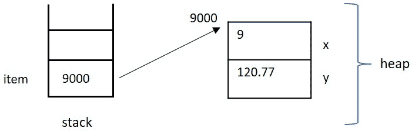
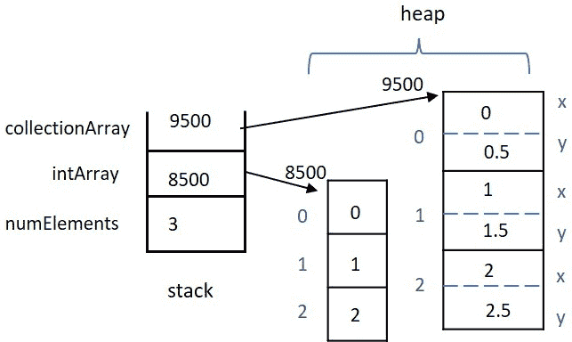
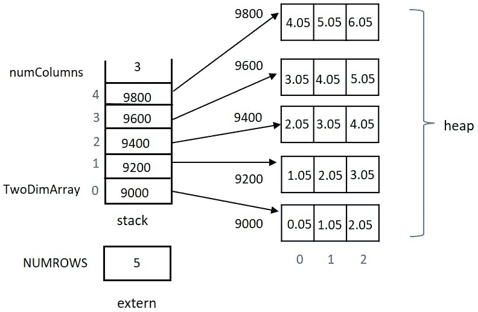
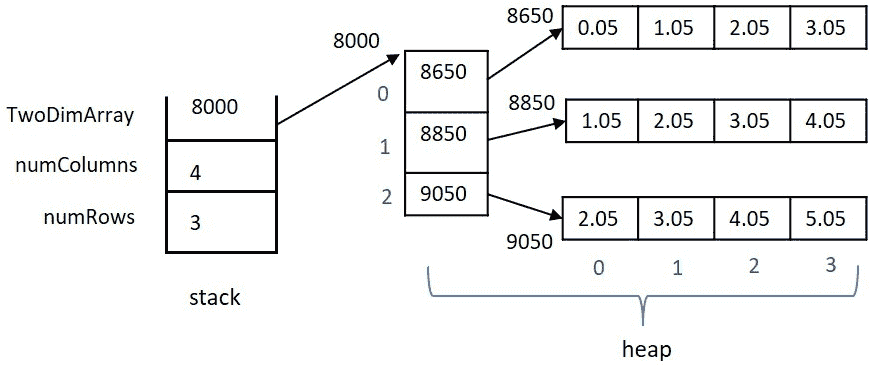

# 3

# 间接寻址 – 指针

本章将全面介绍如何在 C++中利用指针。虽然假设您对间接寻址有一些先前的经验，但我们将从基础开始。指针是语言的一个基础且普遍的特性 – 您必须彻底理解并能够轻松地利用它。许多其他语言仅通过引用来实现间接寻址；然而，在 C++中，您必须亲自动手，理解如何正确和有效地使用指针来访问和返回堆内存。您将在其他程序员的代码中看到指针被大量使用；忽视它们的使用是没有道理的。误用指针可能会在程序中产生最难以找到的错误。在 C++中，对使用指针进行间接寻址的彻底理解是创建成功且可维护代码的必要条件。

在本章中，您还将预览智能指针的概念，这可以帮助减轻与原生指针相关的难度和潜在陷阱。尽管如此，您仍需要熟练掌握所有类型的指针，以便成功使用现有的类库或与现有代码集成或维护。

本章的目标将是构建或增强您对指针间接寻址的理解，以便您能够轻松理解和修改他人的代码，以及自己编写原创、复杂、无错误的 C++代码。

在本章中，我们将涵盖以下主要主题：

+   指针基础，包括访问、内存分配和释放 – 对于标准类型和用户定义类型

+   动态分配一维、二维和 N 维数组，并管理它们的内存释放

+   指针作为函数的参数和作为函数的返回值

+   向指针变量添加`const`限定符

+   使用空指针 – 指向未指定类型的对象的指针

+   预览智能指针以减轻典型指针使用错误

到本章结束时，你将了解如何使用`new()`为简单和复杂的数据类型在堆上分配内存，以及如何使用`delete()`标记内存以将其返回到堆管理设施。你将能够动态分配任何数据类型和任何维度的数组，并理解在应用程序中不再需要内存时释放内存的基本内存管理，以避免内存泄漏。你将能够将指针作为任何级别的间接函数的参数传递——即指向数据的指针、指向数据指针的指针，依此类推。你将了解如何以及为什么将 const 限定符与指针结合——指向数据、指向指针本身或两者。你还将了解如何声明和使用无类型的泛型指针——void 指针——以及了解它们可能有用的情况。最后，你将预览智能指针的概念，以减轻潜在的指针难题和使用错误。这些技能将有助于你在本书的下一章中成功前进。

# 技术要求

完整程序示例的在线代码可以在以下 GitHub URL 中找到：[`github.com/PacktPublishing/Deciphering-Object-Oriented-Programming-with-CPP/tree/main/Chapter03`](https://github.com/PacktPublishing/Deciphering-Object-Oriented-Programming-with-CPP/tree/main/Chapter03)。每个完整程序示例都可以在 GitHub 的相应章节标题（子目录）下找到，对应章节的文件名，后面跟着一个连字符，然后是当前章节中的示例编号。例如，本章的第一个完整程序可以在上述 GitHub 目录下的`Chapter03`子目录中的`Chp3-Ex1.cpp`文件中找到。

本章的 CiA 视频可以在以下链接查看：[`bit.ly/3AtBPlV`](https://bit.ly/3AtBPlV)。

# 理解指针基础和内存分配

在本节中，我们将回顾指针基础，并介绍适用于指针的运算符，例如取地址运算符、解引用运算符以及`new()`和`delete()`运算符。我们将使用取地址运算符`&`来计算现有变量的地址，相反，我们将应用解引用运算符`*`到指针变量上以访问变量中包含的地址。我们将看到堆上内存分配的示例，以及如何在完成使用后通过将其返回到空闲列表来标记相同内存以供潜在重用。

使用指针变量可以使我们的应用程序具有更大的灵活性。在运行时，我们可以确定我们可能需要的数据类型数量（例如在动态分配的数组中），在数据结构中组织数据以方便排序（例如在链表中），或者通过传递大型数据块的地址给函数来提高速度（而不是传递整个数据块的副本）。指针有很多用途，我们将在本章和整个课程中看到许多例子。让我们从指针基础知识开始。 

## 回顾指针基础知识

首先，让我们回顾一下指针变量的含义。指针变量是可能包含地址的变量，该地址的内存可能包含相关数据。通常说，指针变量*指向*包含相关数据的地址。指针变量的值是一个地址，而不是我们想要的数据。当我们到达那个地址时，我们找到感兴趣的数据。这被称为**间接寻址**。总结一下，指针变量的内容是一个地址；如果你然后去那个地址，你就能找到数据。这是单级间接寻址。

指针变量可能指向非指针变量的现有内存，或者它可能指向在堆上动态分配的内存。后一种情况是最常见的情况。除非指针变量被正确初始化或分配了值，否则指针变量的内容是无意义的，并不代表一个可用的地址。一个很大的错误是假设指针变量已经被正确初始化，而实际上可能没有。让我们看看一些对指针有用的基本运算符。我们将从地址-of `&` 和解引用运算符 `*` 开始。

## 使用地址-of 和解引用运算符

地址-of 运算符 `&` 可以应用于变量以确定其在内存中的位置。解引用运算符 `*` 可以应用于指针变量以获取指针变量中包含的有效地址的数据值。

让我们看一个简单的例子：

```cpp
int x = 10;
int *pointerToX = nullptr; // pointer variable which may 
                           // someday point to an integer
pointerToX = &x;  // assign memory loc. of x to pointerToX
cout << "x: " << x << " and *pointerToX: " << *pointerToX;
```

注意在之前的代码段中，我们首先声明并初始化变量 `x` 为 `10`。接下来，我们声明 `int *pointerToX = nullptr;` 来表示变量 `pointerToX` 可能将来会指向一个整数，但它用 `nullptr` 初始化以确保安全。如果我们没有用 `nullptr` 初始化这个变量，它将是未初始化的，因此不会包含一个有效的内存地址。

在代码中向前移动到行`pointerToX = &x;`，我们使用取地址运算符（`&`）将`x`的内存位置赋值给`pointerToX`，它等待被填充为某个整数的有效地址。在这段代码的最后一行，我们打印出`x`和`*pointerToX`。在这里，我们使用了解引用运算符`*`与变量`pointerToX`。解引用运算符告诉我们去变量`pointerToX`中包含的地址。在那个地址，我们找到整数`10`的数据值。

这里是这个片段作为完整程序生成的输出：

```cpp
X: 10 and *pointerToX: 10
```

重要提示

为了提高效率，C++在应用程序启动时并不会整齐地将所有内存初始化为零，也不会确保与变量配对时内存是方便地空的，没有值。内存中简单地包含之前存储的内容；C++的内存不被认为是*干净的*。因为 C++中内存没有给程序员*干净*，所以新声明的指针变量的内容，除非正确初始化或赋值，否则不应被视为包含有效地址。

在前面的例子中，我们使用取地址运算符`&`来计算内存中现有整数的地址，并将我们的指针变量设置为指向那个内存。相反，让我们引入`new()`和`delete()`运算符，以便我们可以利用动态分配的堆内存与指针变量一起使用。

## 使用 new()和 delete()运算符

运算符`new()`可以用来从堆中获取动态分配的内存。指针变量可以选择指向在运行时动态分配的内存，而不是指向另一个变量的现有内存。这给了我们灵活性，关于我们想要何时分配内存，以及我们可能选择有多少这样的内存块。然后，可以使用运算符`delete()`对一个指针变量应用，以标记我们不再需要的内存，将内存返回给堆管理设施以供应用程序稍后重用。重要的是要理解，一旦我们`delete()`了一个指针变量，我们就不再应该使用该变量中包含的地址作为有效地址。

让我们看看使用基本数据类型进行简单内存分配和释放的例子：

```cpp
int *y = nullptr; // ptr y may someday point to an int
y = new int;   // y pts to uninit. memory allocated on heap
*y = 17;   // dereference y to load the newly allocated
           // memory with a value of 17
cout << "*y is: " << *y << endl;
delete y;  // relinquish the allocated memory
// alternative ptr declaration, mem alloc., initialization
int *z = new int(22); 
cout <<  "*z is: " << *z << endl;
delete z;  // relinquish heap memory
```

在上一个程序段中，我们首先使用`int *y = nullptr;`声明了指针变量`y`。在这里，`y`将来可能包含一个整数的地址，但与此同时，它被安全地初始化为`nullptr`。在下一行，我们使用`y = new int;`从堆中分配足够的内存来容纳一个整数，并将该地址存储在指针变量`y`中。接下来，使用`*y = 17;`解引用`y`并将值`17`存储在`y`指向的内存位置。在打印出`*y`的值后，我们决定我们完成了对`y`指向的内存的处理，并通过使用运算符`delete()`将其返回给堆管理设施。重要的是要注意，变量`y`仍然包含它通过调用`new()`获得的内存地址；然而，`y`不应再使用这个释放的内存。

在上一个程序段快结束时，我们交替地声明了指针变量`z`，为其分配了堆内存，并使用`int *z = new int(22);`初始化了该内存。请注意，我们同样使用`delete z;`来释放堆内存。

重要提示

记住，一旦内存被释放，就不应该再次解引用该指针变量；请理解，该地址可能已经被重新分配给程序其他地方的另一个变量。一种保护措施是在使用`delete()`释放内存后，将指针重置为`nullptr`。

现在我们已经了解了简单数据类型的指针基础知识，让我们继续前进，分配更复杂的数据类型，并了解利用和访问用户定义数据类型成员所需的表示法。

## 创建和使用用户定义类型的指针

接下来，让我们来探讨如何声明用户定义类型的指针，以及如何在堆上为其分配关联的内存。为了动态分配一个用户定义类型，首先需要声明该类型的指针。然后，该指针必须被初始化或分配一个有效的内存地址——内存可以是现有变量的内存或新分配的堆内存。一旦适当的内存地址被放置在指针变量中，就可以使用`->`运算符来访问结构体或类的成员。或者，可以使用`(*ptr).member`的表示法来访问结构体或类的成员。

让我们看看一个基本示例：

[`github.com/PacktPublishing/Deciphering-Object-Oriented-Programming-with-CPP/blob/main/Chapter03/Chp3-Ex1.cpp`](https://github.com/PacktPublishing/Deciphering-Object-Oriented-Programming-with-CPP/blob/main/Chapter03/Chp3-Ex1.cpp)

```cpp
#include <iostream>
using std::cout;
using std::endl;
struct collection
{
    int x;
    float y;
};

int main()  
{
    collection *item = nullptr;   // pointer declaration 
    item = new collection;   // memory allocation 
    item->x = 9;        // use -> to access data member x
    (*item).y = 120.77; // alt. notation to access member y
    cout << (*item).x << " " << item->y << endl;
    delete item;           // relinquish memory
    return 0;
}
```

首先，在上述程序中，我们声明了一个名为`collection`的用户定义类型，具有数据成员`x`和`y`。接下来，我们声明`item`为该类型的指针，使用`collection *item = nullptr;`初始化指针，以确保安全。然后，我们使用操作符`new()`为`item`分配堆内存。现在，我们分别使用`->`操作符或`(*).`成员访问符号为`item`的`x`和`y`成员赋值。在两种情况下，这种表示法意味着首先取消引用指针，然后选择适当的数据成员。使用`(*).`表示法非常直接——括号表明指针取消引用先发生，然后使用`.`（成员选择）操作符选择成员。`->`简写表示法表示指针取消引用后跟成员选择。在使用`cout`和插入操作符`<<`打印适当的值后，我们决定不再需要与`item`关联的内存，并发出`delete item;`来标记这段堆内存以返回到空闲列表。

让我们看看这个示例的输出：

```cpp
9 120.77
```

让我们也看看这个示例的内存布局。使用的内存地址（`9000`）是任意的——只是一个可能由`new()`生成的示例地址。



图 3.1 – Chp3-Ex1.cpp 的内存模型

现在我们已经知道了如何为用户定义类型分配和释放内存，让我们继续前进，动态分配任何数据类型的数组。

# 在运行时分配和释放数组

数组可以动态分配，以便在运行时确定其大小。动态分配的数组可以是任何类型，包括用户定义的类型。在运行时确定数组的大小可以节省空间，并给我们带来编程灵活性。而不是分配一个固定大小的数组，该数组包含所需的最大数量（可能浪费空间），您可以根据运行时确定的各种因素分配所需的大小。如果您需要更改数组的大小，您还有额外的灵活性来删除和重新分配数组。任何数量的维度的数组都可以动态分配。

在本节中，我们将探讨如何动态分配基本和用户定义数据类型的数组和单维或多维数组。让我们开始吧。

## 动态分配单维数组

单维数组可以动态分配，以便在运行时确定其大小。我们将使用指针来表示每个数组，并使用操作符`new()`分配所需的内存。一旦数组被分配，就可以使用标准数组表示法来访问每个数组元素。

让我们来看一个简单的例子。我们将将其分为两个部分，但是完整的程序示例可以通过以下链接找到：

[`github.com/PacktPublishing/Deciphering-Object-Oriented-Programming-with-CPP/blob/main/Chapter03/Chp3-Ex2.cpp`](https://github.com/PacktPublishing/Deciphering-Object-Oriented-Programming-with-CPP/blob/main/Chapter03/Chp3-Ex2.cpp)

```cpp
#include <iostream>
using std::cout;
using std::cin;
using std:::endl;
using std::flush;
struct collection
{
    int x;
    float y;
};

int main()
{
    int numElements = 0;
    int *intArray = nullptr;    // pointer declarations to
    collection *collectionArray = nullptr; // future arrays
    cout << "How many elements would you like? " << flush;
    cin >> numElements;
    intArray = new int[numElements]; // alloc. array bodies
    collectionArray = new collection[numElements];
    // continued …
```

在这个程序的第一个部分，我们首先使用 `struct` 声明一个用户定义的类型 `collection`。接下来，我们声明一个整数变量来保存我们希望提示用户输入以选择两个数组大小的元素数量。我们还使用 `int *intArray;` 声明一个指向整数的指针，并使用 `collection *collectionArray;` 声明一个指向 `collection` 的指针。这些声明表明，这些指针将来可能分别指向一个或多个整数，或者一个或多个 `collection` 类型的对象。一旦分配，这些变量将组成我们的两个数组。

在使用 `cin` 和提取运算符 `>>` 提示用户输入所需元素数量之后，我们动态分配了一个整数数组和一个相同大小的 `collection` 类型的数组。在这两种情况下，我们都使用了运算符 `new()`：`intArray = new int[numElements];` 和 `collectionArray = new collection[numElements];`。括号中的 `numElements` 表示为每种数据类型请求的内存块将足够大，以容纳相应数据类型的那么多连续元素。也就是说，`intArray` 将分配足够的内存来容纳 `numElements` 乘以整数所需的大小。请注意，对象的数据类型是已知的，因为指针声明中包含了将要指向的数据类型。`collectionArray` 将通过其相应的 `new()` 运算符调用提供适当的内存量。

让我们继续检查这个示例程序中剩余的代码：

```cpp
    // load each array with values
    for (int i = 0; i < numElements; i++)
    {
        intArray[i] = i; // load each array w values using
        collectionArray[i].x = i;  // array notation []
        collectionArray[i].y = i + .5;
        // alternatively use ptr notation to print values
        cout << *(intArray + i) << " ";
        cout << (*(collectionArray + i)).y << endl;
    }
    delete [] intArray;     // mark memory for deletion
    delete [] collectionArray;
    return 0;
}
```

接下来，当我们继续使用 `for` 循环这个例子时，请注意，我们正在使用典型的数组表示法 `[]` 来访问两个数组的每个元素，尽管这些数组是动态分配的。因为 `collectionArray` 是用户定义类型的动态分配数组，我们必须使用 `.` 表示法来访问每个数组元素中的单个数据成员。虽然使用标准数组表示法使访问动态数组变得相当简单，但您也可以使用指针表示法来访问内存。

在循环内部，请注意我们使用指针表示法逐步打印`intArray`数组的元素和`collectionArray`集合的`y`成员。在表达式`*(intArray +i)`中，标识符`intArray`代表数组的起始地址。通过向这个地址添加`i`个偏移量，你现在就到达了该数组第`i`个元素的地址。通过使用`*`解引用这个复合地址，你现在将到达正确的地址以检索相关的整数数据，然后使用`cout`和插入操作符`<<`打印出来。同样，对于`(*(collectionArray + i)).y`，我们首先将`i`加到`collectionArray`的起始地址上，然后使用`()`解引用这个地址，由于这是一个用户定义的类型，我们必须使用`.`来选择适当的数据成员`y`。

最后，在这个例子中，我们展示了如何使用`delete()`来释放我们不再需要的内存。虽然一个简单的`delete intArray;`语句就足以用于标准类型的动态分配数组，但我们选择使用`delete [] intArray;`来与用户定义类型动态分配数组删除所需的方式保持一致。也就是说，对于用户定义类型的数组，需要使用更复杂的`delete [] collectionArray;`语句来正确删除。在所有情况下，与每个动态分配数组相关的内存都将返回到空闲列表，然后可以在后续调用操作符`new()`再次分配堆内存时被重用。然而，正如我们稍后将看到的，与`delete()`一起使用的`[]`将允许在释放内存之前对用户定义类型的每个数组元素应用特殊的清理函数。此外，一致性很重要：如果你使用`new()`分配，则使用`delete()`释放内存；如果你使用`new []`分配，则使用`delete []`释放。这种一致的配对也将确保在将来程序员对上述任何操作符进行重载（即重新定义）时，程序按预期工作。

记住不要在内存被标记为删除后解引用指针变量非常重要。尽管那个地址将保留在指针变量中，直到你将指针分配新的地址（或空指针），但一旦内存被标记为删除，相关的内存可能已经被程序其他地方的后续`new()`调用重用。这是在使用 C++中的指针时你必须勤勉注意的许多方式之一。

伴随完整程序示例的输出如下：

```cpp
How many elements would you like? 3
0 0.5
1 1.5
2 2.5
```

让我们再看看这个例子的内存布局。使用的内存地址（`8500`和`9500`）是任意的——它们是堆上可能由`new()`生成的示例地址。



图 3.2 – Chp3-Ex2.cpp 的内存模型

接下来，让我们通过分配多维数组来继续我们关于动态分配数组的讨论。

## 动态分配二维数组 - 指针数组

也可以动态分配两个或更多维度的数组。对于二维数组，列维度可以动态分配，而行维度可能保持固定，或者两个维度都可以动态分配。动态分配一个或多个维度允许程序员对关于数组大小的运行时决策进行考虑。

让我们先考虑这种情况，即我们有一个固定数量的行，以及每行中不同数量的条目（这将成为列维度）。为了简单起见，我们将假设每行的条目数从行到行是相同的，但不必如此。我们可以使用指针数组来模拟一个具有固定行数和每行运行时确定的条目数（列维度）的二维数组。

让我们考虑一个示例来阐述一个列维度动态分配的二维数组：

[`github.com/PacktPublishing/Deciphering-Object-Oriented-Programming-with-CPP/blob/main/Chapter03/Chp3-Ex3.cpp`](https://github.com/PacktPublishing/Deciphering-Object-Oriented-Programming-with-CPP/blob/main/Chapter03/Chp3-Ex3.cpp)

```cpp
#include <iostream>
using std::cout;
using std::cin;
using std::endl;
using std::flush;
constexpr int NUMROWS = 5; // convention to use uppercase
                    // since value is known at compile time
int main()
{
    float *TwoDimArray[NUMROWS] = { }; // init. to nullptrs
    int numColumns = 0;
    cout << "Enter number of columns: ";
    cin >> numColumns;
    for (int i = 0; i < NUMROWS; i++)
    {
        // allocate column quantity for each row
        TwoDimArray[i] = new float [numColumns];
        // load each column entry with data
        for (int j = 0; j < numColumns; j++)
        {
            TwoDimArray[i][j] = i + j + .05;
            cout << TwoDimArray[i][j] << " ";
        }
        cout << endl;  // print newline between rows
    }
    for (int i = 0; i < NUMROWS; i++)
        delete [] TwoDimArray[i];  // del col. for each row
    return 0;
}
```

在这个例子中，请注意，我们最初使用`float *TwoDimArray[NUMROWS];`声明了一个指向浮点数的指针数组。为了安全起见，我们将每个指针初始化为`nullptr`。有时，从右到左阅读指针声明是有帮助的；也就是说，我们有一个大小为`NUMROWS`的数组，它包含指向浮点数的指针。更具体地说，我们有一个固定大小的指针数组，其中每个指针条目可以指向一个或多个连续的浮点数。每行中指向的条目数构成了列维度。

接下来，我们提示用户输入列条目的数量。在这里，我们假设每行将具有相同数量的条目（以使列维度）；然而，每行可能具有不同的总条目数。通过假设每行将具有均匀的条目数，我们可以使用`i`来为每行分配列数量，即`TwoDimArray[i] = new float [numColumns];`。

在使用`j`作为索引的嵌套循环中，我们简单地加载由外循环中指定的`i`行中每一列的值。任意赋值`TwoDimArray[i][j] = i + j + .05;`将一个有趣的价值加载到每个元素中。在以`j`为索引的嵌套循环中，我们也打印出`i`行的每一列条目。

最后，程序说明了如何释放动态分配的内存。由于内存是在一个固定数量的行循环中分配的——一次内存分配来收集构成每一行列条目的内存——释放操作将类似地进行。对于每一行，我们使用以下语句：`delete [] TwoDimArray[i];`。

示例的输出如下：

```cpp
Enter number of columns: 3
0.05 1.05 2.05
1.05 2.05 3.05
2.05 3.05 4.05
3.05 4.05 5.05
4.05 5.05 6.05
```

接下来，让我们看看这个例子的内存布局。就像之前的内存图一样，使用的内存地址是任意的——它们是`new()`可能生成的堆上的示例地址。



图 3.3 – Chp3-Ex3.cpp 的内存模型

现在我们已经看到了如何利用指针数组来模拟二维数组，让我们继续看看如何使用指针的指针来模拟二维数组，这样我们就可以在运行时选择两个维度。

## 动态分配二维数组 – 指针的指针

为数组动态分配行和列的维度可以为程序添加必要的运行时灵活性。为了实现这种终极灵活性，可以使用指向所需数据类型的指针的指针来模拟二维数组。最初，将分配表示行数的维度。接下来，对于每一行，将分配每一行的元素数量。与使用指针数组的最后一个例子一样，每一行的元素数量（列条目）不需要在行之间大小一致。然而，为了准确模拟二维数组的概念，假设列大小将在行与行之间均匀分配。

让我们通过一个例子来说明一个二维数组，其中行和列的维度都是动态分配的：

[`github.com/PacktPublishing/Deciphering-Object-Oriented-Programming-with-CPP/blob/main/Chapter03/Chp3-Ex4.cpp`](https://github.com/PacktPublishing/Deciphering-Object-Oriented-Programming-with-CPP/blob/main/Chapter03/Chp3-Ex4.cpp)

```cpp
#include <iostream>
using std::cout;
using std::cin;
using std::endl;
using std::flush;
int main()
{
    int numRows = 0, numColumns = 0;
    float **TwoDimArray = nullptr;  // pointer to a pointer
    cout << "Enter number of rows: " << flush;
    cin >> numRows;
    TwoDimArray = new float * [numRows]; // alloc. row ptrs
    cout << "Enter number of Columns: ";
    cin >> numColumns;
    for (int i = 0; i < numRows; i++)
    {
        // allocate column quantity for each row
        TwoDimArray[i] = new float [numColumns];
        // load each column entry with data
        for (int j = 0; j < numColumns; j++)
        {
            TwoDimArray[i][j] = i + j + .05;
            cout << TwoDimArray[i][j] << " ";
        }
        cout << end;  // print newline between rows
    }
    for (i = 0; i < numRows; i++)
        delete [] TwoDimArray[i];  // del col. for each row
    delete [] TwoDimArray;  // delete allocated rows
    return 0;
}
```

在这个例子中，请注意我们最初使用以下方式声明了一个指向`float`类型的指针的指针：`float **TwoDimArray;`。从右到左阅读这个声明，我们看到`TwoDimArray`是一个指向`float`指针的指针。更具体地说，我们理解`TwoDimArray`将包含一个或多个连续指针的地址，每个指针可能指向一个或多个连续的浮点数。

现在，我们提示用户输入行条目的数量。我们随后进行分配到一组浮点指针，`TwoDimArray = new float * [numRows];`。这个分配创建了一个`numRows`数量的连续`float`指针。

就像上一个例子一样，我们提示用户输入每行希望有多少列。就像之前一样，在外层循环中，我们根据索引`i`为每一行分配列条目。在内层循环中，我们再次为我们的数组条目赋值并像之前一样打印它们。

最后，程序继续进行内存释放。就像之前一样，在循环中释放了每一行的列条目。然而，我们还需要释放动态分配的行条目数量。我们通过 `delete [] TwoDimArray;` 来完成这个操作。

这个程序的输出稍微灵活一些，因为我们可以在运行时输入所需的行数和列数：

```cpp
Enter number of rows: 3
Enter number of columns: 4
0.05 1.05 2.05 3.05
1.05 2.05 3.05 4.05
2.05 3.05 4.05 5.05
```

让我们再次看看这个程序的内存模型。提醒一下，就像之前的内存图一样，使用的内存地址是任意的——它们是 `new()` 可能生成的堆上的示例地址。



图 3.4 – Chp3-Ex4.cpp 的内存模型

现在我们已经看到了如何利用指针到指针来模拟二维数组，让我们继续看看如何使用指针到指针到指针等来模拟任意维度的数组。在 C++ 中，你可以模拟任何维度的动态分配数组，只要你能够想象出来！

## 动态分配 N 维数组——指针到指针到指针

在 C++ 中，你可以模拟任何维度的动态分配数组。你需要做的只是能够想象出来，声明适当的指针级别，并执行所需的内存分配（以及最终的释放）。

让我们看看你需要遵循的模式：

[`github.com/PacktPublishing/Deciphering-Object-Oriented-Programming-with-CPP/blob/main/Chapter03/Chp3-Ex5.cpp`](https://github.com/PacktPublishing/Deciphering-Object-Oriented-Programming-with-CPP/blob/main/Chapter03/Chp3-Ex5.cpp)

```cpp
#include <iostream>
using std::cout;
using std::cin;
using std::endl;
using std::flush;
int main()
{
    int dim1 = 0, dim2 = 0, dim3 = 0;
    int ***ThreeDimArray = nullptr; // 3D dyn. alloc. array
    cout << "Enter dim 1, dim 2, dim 3: ";
    cin >> dim1 >> dim2 >> dim3;
    ThreeDimArray = new int ** [dim1]; // allocate dim 1
    for (int i = 0; i < dim1; i++)
    {
        ThreeDimArray[i] = new int * [dim2]; // alloc dim 2
        for (int j = 0; j < dim2; j++)
        {
            // allocate dim 3
            ThreeDimArray[i][j] = new int [dim3];
            for (int k = 0; k < dim3; k++)
            {
               ThreeDimArray[i][j][k] = i + j + k; 
               cout << ThreeDimArray[i][j][k] << " ";
            }
            cout << endl;  // print '\n' between dimensions
        }
        cout << end;  // print '\n' between dimensions
    }
    for (int i = 0; i < dim1; i++)
    {
        for (int j = 0; j < dim2; j++)
           delete [] ThreeDimArray[i][j]; // release dim 3
        delete [] ThreeDimArray[i];  // release dim 2
    }
    delete [] ThreeDimArray;   // release dim 1
    return 0;
}
```

在这个例子中，请注意我们使用了三个级别的间接引用来指定变量以表示三维数组 `int ***ThreeDimArray;`。随后，我们为每个级别的间接引用分配所需的内存。第一次分配是 `ThreeDimArray = new int ** [dim1];`，它分配了维度 1 的指针集。接下来，在一个遍历 `i` 的循环中，并为数组第一维的每个元素，我们分配 `ThreeDimArray[i] = new int * [dim2];` 以分配第二维数组中整数的指针。然后在嵌套循环中遍历 `j`，并为第二维的每个元素，我们分配 `ThreeDimArray[i][j] = new int [dim3];` 以分配由 `dim3` 指定的整数本身。

与前两个例子一样，我们在内循环中初始化数组元素并打印它们的值。此时，你无疑会注意到这个程序与其前辈之间的相似之处。一个分配模式正在出现。

最后，我们将以类似但相反的方式释放三个级别的内存，这与分配级别的方式相似。我们使用嵌套循环遍历`j`来释放最内层级别的内存，然后是遍历`i`的外层循环释放内存。最后，我们通过简单的调用`delete [] ThreeDimArray;`来释放初始维度的内存。

此示例的输出如下：

```cpp
Enter dim1, dim2, dim3: 2 4 3
0 1 2
1 2 3
2 3 4
3 4 5
1 2 3
2 3 4
3 4 5
4 5 6
```

现在我们已经看到了如何使用指针到指针到指针来模拟 3-D 数组，一个模式已经出现，展示了如何声明所需的级别和指针数量来模拟 N-D 数组。我们还可以看到必要的分配模式。多维数组可以变得相当大，尤其是如果你被迫使用可能需要的最大固定大小数组来模拟它们。使用指针到指针（到指针，等等）来模拟每个必要的多维数组的美丽之处在于，你可以分配一个在运行时可能确定的精确大小。为了使使用简单，可以使用`[]`数组符号作为指针符号的替代，以访问动态分配数组中的元素。C++有很多来自指针的灵活性。动态分配的数组展示了这种灵活性之一。

让我们现在继续我们的指针理解，并考虑它们在函数中的使用。

# 使用指针与函数

C++中的函数无疑会接受参数。我们在前面的章节中看到了许多示例，说明了函数原型和函数定义。现在，让我们通过将指针作为函数参数传递以及将指针作为函数的返回值来增强我们对函数的理解。

## 将指针作为函数参数传递

在函数调用中，从实际参数传递到形式参数默认是在栈上复制的。为了将变量的内容作为函数的参数修改，必须使用该参数的指针作为函数参数。

在 C++中，每次将实际参数传递给函数时，都会在栈上创建一个副本并将其传递给该函数。例如，如果将整数作为实际参数传递给函数，就会创建该整数的副本，然后将其传递到栈上，作为函数接收的形式参数。在函数的作用域内更改形式参数只会更改传递给函数的数据的副本。

如果我们要求能够修改函数的参数，那么就必须将所需数据的指针作为参数传递给函数。在 C++中，将指针作为实际参数时，会在栈上复制这个地址，并且地址的副本作为形式参数在函数中接收。然而，使用地址的副本，我们仍然可以到达那个地址（通过取消引用该指针）来访问所需的数据并对所需数据进行更改。

再次强调，在 C++中传递参数时，总会在栈上复制某个东西。如果你传递一个非指针变量，你将得到该数据的副本，并将其作为栈上的数据传递给函数。在该函数的作用域内对该数据进行更改仅是局部更改，并且在函数返回时不会持续存在。局部副本在函数结束时简单地从栈上弹出。然而，如果你传递一个指向函数的指针，尽管存储在指针变量中的地址仍然被复制到栈上并传递给函数，你仍然可以取消引用指针的副本来访问所需地址的实际数据。

你总是需要退一步来修改你想要修改的东西。如果你想更改标准数据类型，请传递该类型的指针。如果你想更改指针本身的价值（地址），你必须将指向该指针的指针作为参数传递给函数。记住，某物的副本被传递到函数的栈上。你无法在函数的作用域之外更改该副本。传递你想要更改的东西的地址——你仍然在传递该地址的副本，但使用它将带你到实际数据。

让我们花几分钟时间理解一个示例，说明将指针作为函数参数传递。在这里，我们将首先检查两个函数，这两个函数有助于以下完整程序示例：

[`github.com/PacktPublishing/Deciphering-Object-Oriented-Programming-with-CPP/blob/main/Chapter03/Chp3-Ex6.cpp`](https://github.com/PacktPublishing/Deciphering-Object-Oriented-Programming-with-CPP/blob/main/Chapter03/Chp3-Ex6.cpp)

```cpp
void TryToAddOne(int arg)
{
   arg++;
}
void AddOne(int *arg)
{
   (*arg)++;
}
```

检查前面的函数，注意`TryToAddOne()`函数接受一个`int`作为形式参数，而`AddOne()`函数接受一个`int *`作为形式参数。

在`TryToAddOne()`中，传递给函数的整数仅仅是实际参数的副本。在形式参数列表中，该参数被称为`arg`。在函数体中将`arg`的值增加一仅是`TryToAddOne()`内部的局部更改。一旦函数完成，形式参数`arg`将从栈上弹出，调用此函数的实际参数将不会被修改。

然而，请注意`AddOne()`接受一个`int *`作为形式参数。实际整数参数的地址将被复制到栈上，并作为形式参数`arg`接收。使用该地址的副本，我们使用`*`解引用指针`arg`，然后在代码行中使用`++`递增该地址处的整数值：`(*arg)++;`。当这个函数完成时，实际参数将被修改，因为我们传递的是该整数的指针副本，而不是整数的副本本身。

让我们检查这个程序的其余部分：

```cpp
#include <iostream>
using std::cout;
using std::endl;
void TryToAddOne(int); // function prototypes
void AddOne(int *);
int main()
{
   int x = 10, *y = nullptr;
   y = new int;    // allocate y's memory
   *y = 15;        // dereference y to assign a value
   cout << "x: " << x << " and *y: " << *y << endl;
   TryToAddOne(x);   // unsuccessful, call by value
   TryToAddOne(*y);  // still unsuccessful
   cout << "x: " << x << " and *y: " << *y << endl;
   AddOne(&x);   // successful, passing an address 
   AddOne(y);    // also successful
   cout << "x: " << x << " and *y: " << *y << endl;
   delete y;     // relinquish heap memory
   return 0;
}
```

注意这个程序段顶部的函数原型。它们将与之前代码段中的函数定义相匹配。现在，在`main()`函数中，我们声明并初始化`int x = 10;`并声明一个指针：`int *y;`。我们使用`new()`为`y`分配内存，然后通过解引用指针赋值`*y = 15;`。我们打印出`x`和`*y`的相应值作为基准。

接下来，我们调用`TryToAddOne(x);`然后是`TryToAddOne(*y);`。在这两种情况下，我们都是将整数作为实际参数传递给函数。变量`x`被声明为整数，而`*y`指的是`y`所指向的整数。这两个函数调用都不会导致实际参数被改变，这在我们使用`cout`和插入操作符`<<`打印各自的值时可以验证。

最后，我们调用`AddOne(&x);`然后是`AddOne(y);`。在这两种情况下，我们都是将地址的副本作为实际参数传递给函数。当然，`&x`是变量`x`的地址，所以这可行。同样，`y`本身也是一个地址——它被声明为一个指针变量。回想一下，在`AddOne()`函数内部，形式参数首先在函数体中被解引用然后递增：`(*arg)++;`。我们可以使用指针副本来访问实际数据。

这是完整程序示例的输出：

```cpp
x: 10 and *y: 15
x: 10 and *y: 15
x: 11 and *y: 16
```

接下来，让我们通过使用函数作为返回值来指针使用进行讨论。

## 使用函数返回值作为指针的返回值

函数可以通过它们的返回语句返回数据指针。当通过函数的返回语句返回指针时，请确保所指向的内存将在函数调用完成后持续存在。不要返回指向函数中局部栈上定义的局部变量的指针。也就是说，不要返回指向函数中栈上定义的局部变量的指针。然而，返回函数内部使用`new()`分配的内存的指针是可以接受的。因为分配的内存将在堆上，它将在函数调用之后存在。

让我们通过一个例子来说明这些概念：

[`github.com/PacktPublishing/Deciphering-Object-Oriented-Programming-with-CPP/blob/main/Chapter03/Chp3-Ex7.cpp`](https://github.com/PacktPublishing/Deciphering-Object-Oriented-Programming-with-CPP/blob/main/Chapter03/Chp3-Ex7.cpp)

```cpp
#include <iostream>
#include <iomanip>
using std::cin;
using std::cout;
using std::endl;
using std::flush;
using std::setw;
constexpr int MAX = 20;
[[nodiscard]] char *createName();  // function prototype
int main()    
{
   char *name = nullptr;   // pointer declaration and init.
   name = createName();    // function will allocate memory
   cout << "Name: " << name << endl;
   delete [] name;  // del alloc. memory (in a diff. scope
   return 0;   // than allocated); this can be error prone!
}
[[nodiscard]] char *createName()
{
   char *temp = new char[MAX];
   cout << "Enter name: " << flush;
   cin >> setw(MAX) >> temp; // ensure no overflow of temp
   return temp;
}
```

在这个例子中，定义了`constexpr int MAX = 20;`，然后原型化了`char *createName();`，这表明这个函数不接受任何参数，但返回一个指向一个或多个字符的指针。

在`main()`函数中，定义了一个局部变量：`char *name;`，但没有初始化。接下来，调用`createName()`并使用其返回值来给`name`赋值。请注意，`name`和函数的返回类型都是`char *`类型。

在调用`createName()`时，请注意，局部变量`char *temp = new char[MAX];`既被定义也被分配，用于在堆上使用操作符`new()`指向固定数量的内存。然后提示用户输入一个名字，该名字被存储在`temp`中。随后，局部变量`temp`从`createName()`返回。

在`createName()`中，重要的是`temp`的内存应该由堆内存组成，这样它将超出这个函数的作用域。在这里，`temp`中存储的地址的副本将被复制到函数返回值预留的栈区。幸运的是，这个地址指向堆内存。在`main()`中的`name = createName();`赋值将捕获这个地址并将其复制到存储在`name`变量中，该变量是`main()`的局部变量。由于在`createName()`中分配的内存是在堆上，所以这个内存将在函数完成后存在。

同样重要的是要注意，如果`temp`在`createName()`中被定义为`char temp[MAX];`，那么`temp`所包含的内存将存在于栈上，并且是`createName()`的局部内存。一旦`createName()`返回到`main()`，这个变量的内存就会被从栈上弹出，变得不可用——即使这个地址被捕获在`main()`中的一个指针变量中。这是 C++中另一个潜在的指针陷阱。在从函数返回指针时，始终确保指针指向的内存存在于函数的作用域之外。

这个例子的输出如下：

```cpp
Enter name: Gabrielle
Name: Gabrielle
```

现在我们已经了解了如何在函数参数中使用指针以及如何从函数返回值中获取指针，让我们继续前进，通过检查更多的指针细微差别来深入探讨。

# 使用指针的 const 限定符

`const`限定符可以用来以几种不同的方式限定指针。关键字`const`可以应用于所指向的数据，应用于指针本身，或者两者都应用。通过以这种方式使用`const`限定符，C++提供了在程序中保护值的手段，这些值可能被初始化但不再修改。让我们检查这些不同的场景。我们还将结合`const`限定指针与函数的返回值来了解这些不同场景中哪些是合理的实现。

## 使用指向常量对象的指针

可以指定指向常量对象的指针，以便指向的对象不能被直接修改。指向此对象的解引用指针不能在任何赋值中用作左值。**左值**意味着可以修改的值，并且出现在赋值的左侧。

让我们通过一个简单的例子来理解这种情况：

```cpp
// const qualified str; the data pointed to will be const
const char *constData = "constant"; 
const char *moreConstData = nullptr;  
// regular strings, defined. One is loaded using strcpy()  
char *regularString = nullptr;
char *anotherRegularString = new char[8];  // sized to fit 
                                           // this string 
strcpy(anotherRegularString, "regular");
// Trying to modify data marked as const will not work
// strcpy(constData, "Can I do this? ");  // NO! 
// Trying to circumvent by having a char * point to
// a const char * also will not work
// regularString = constData; // NO! 
// But we can treat a char * more strictly by assigning to 
// const char *. It will be const from that viewpoint only
moreConstData = anotherRegularString; // Yes - can do this!
```

在这里，我们引入了`const char *constData = "constant";`。这个指针指向初始化的数据，并且可能永远不会通过这个标识符再次修改。例如，如果我们尝试使用`strcpy`来改变这个值，其中`constData`是目标字符串，编译器将发出错误。

此外，尝试通过将`constData`存储到相同（但不是`const`）类型的指针中来规避这种情况，将会生成编译器错误，例如在代码行`regularString = constData;`中。当然，在 C++中，如果你足够努力，你可以做任何事情，所以这里的显式类型转换将有效，但这里故意没有展示。显式类型转换仍然会生成编译器警告，以便你可以质疑这真的是你想要做的事情。当我们向前推进到面向对象的概念时，我们将介绍进一步保护数据的方法，以便消除这种规避。

在上一段代码的最后一行，注意我们将普通字符串的地址存储到`const char *moreConstData`中。这是允许的——你总是可以比定义时赋予它更多的尊重（只是不能更少）。这意味着当使用标识符`moreConstData`时，这个字符串不能被修改。然而，使用其自己的标识符，定义为`char *anotherRegularString;`，这个字符串可以被改变。这似乎不一致，但事实并非如此。`const char *`变量选择指向一个`char *`——在特定情况下提高了其保护。如果`const char *`真正想要指向一个不可变对象，它会选择指向另一个`const char *`变量。

接下来，让我们看看这个主题的一个变体。

## 使用指向对象的常量指针

对象的常量指针是一个初始化为指向特定对象的指针。这个指针永远不能被分配以指向另一个对象。这个指针本身不能在赋值中用作左值。

让我们回顾一个简单的例子：

```cpp
// Define, allocate, load simple strings using strcpy()
char *regularString = new char[36]; // sized for str below
strcpy(regularString, "I am a modifiable string");
char *anotherRegularString = new char[21]; // sized for
                                           // string below
strcpy(anotherRegularString, "I am also modifiable");
// Define a const pointer to a string; must be initialized
char *const constPtrString = regularString; // Ok
// You may not modify a const pointer to point elsewhere
// constPtrString = anotherRegularString;  // No! 
// But you may change the data which you point to
strcpy(constPtrString, "I can change the value"); // Yes
```

在这个例子中，定义了两个常规的`char *`变量（`regularString`和`anotherRegularString`），并加载了字符串字面量。接下来，定义并初始化`char *const constPtrString = regularString;`，使其指向一个可修改的字符串。因为`const`修饰的是指针本身而不是指向的数据，所以指针本身必须在声明时初始化。请注意，代码行`constPtrString = anotherRegularString;`将生成编译器错误，因为`const`指针不能在赋值的左侧。然而，因为`const`修饰不适用于指向的数据，可以使用`strcpy`来修改数据的值，如`strcpy(constPtrString, "I can change the value");`所示。

接下来，让我们将`const`修饰符应用于指针及其指向的数据。

## 使用常量指针指向常量对象

指向常量对象的常量指针是一个指向特定对象且指向不可修改数据的指针。指针本身必须初始化为给定的对象，该对象（希望）已用适当的值初始化。对象和指针都不能被修改或用作赋值中的左值。

这里有一个例子：

```cpp
// Define two regular strings and load using strcpy()
char *regularString = new char[36]; // sized for str below
strcpy(regularString, "I am a modifiable string");
char *anotherRegularString = new char[21]; // sized for
                                           // string below
strcpy(anotherRegularString, "I am also modifiable");
// Define const ptr to a const object; must be initialized
const char *const constStringandPtr = regularString; // Ok 
// Trying to change the pointer or the data is illegal
constStringandPtr = anotherRegularString; // No! Can't 
                                          // modify address
strcpy(constStringandPtr, "Nope"); // No! Can't modify data
```

在这个例子中，声明了两个常规的`char *`变量，分别是`regularString`和`anotherRegularString`。每个变量都初始化为一个字符串字面量。接下来，我们引入`const char *const constStringandPtr = regularString;`，这是一个`const`修饰的指针，它指向的数据也被视为`const`。请注意，这个变量必须被初始化，因为指针本身不能在后续的赋值中作为左值。你还想确保这个指针被初始化为一个有意义的值，因为指向的数据也不能被更改（如`strcpy`语句所示，这将生成编译器错误）。在指针及其指向的数据上结合`const`是一种严格的数据保护方式。

小贴士 - 解析指针声明

为了读取复杂的指针声明，从右到左读取声明通常有帮助。例如，指针声明`const char *p1 = "hi!";`可以解释为`p1`是一个指向一个或多个常量字符的指针。声明`const char *const p2 = p1;`可以解释为`p2`是一个指向一个或多个常量字符的常量指针。

最后，让我们前进，了解使用`const`修饰指针的内涵，这些指针作为函数参数或作为函数的返回值。

## 使用指向常量对象的指针作为函数参数和作为函数的返回类型

在栈上复制用户定义类型作为参数可能会消耗时间。将指针作为函数参数传递更快，同时允许在函数的作用域内修改解引用的对象。将指向常量对象的指针作为函数参数提供了针对该参数的速度和安全性。解引用的指针在函数的作用域内可能不是一个左值。同样的原则也适用于函数的返回值。对指向的数据使用常量限定符要求函数的调用者也必须将返回值存储在指向常量对象的指针中，确保对象的长期不可变性。

让我们通过一个例子来考察这些想法：

[`github.com/PacktPublishing/Deciphering-Object-Oriented-Programming-with-CPP/blob/main/Chapter03/Chp3-Ex8.cpp`](https://github.com/PacktPublishing/Deciphering-Object-Oriented-Programming-with-CPP/blob/main/Chapter03/Chp3-Ex8.cpp)

```cpp
#include <iostream>
#include <iomanip>
#include <cstring>  // we'll generally prefer std::string, 
        // however, let's understand ptr concept shown here
using std::cout;
using std::endl;
char suffix = 'A';
const char *GenId(const char *);  // function prototype
int main()    
{
    const char *newId1, *newId2;   // pointer declarations
    newId1 = GenId("Group");  // func. will allocate memory
    newId2 = GenId("Group");  
    cout << "New ids: " << newId1 << " " << newId2 << endl;
    delete [] newId1;  // delete allocated memory  
    delete [] newId2;  // caution: deleting in different 
                       // scope than allocation can 
                       // lead to potential errors
    return 0;
}
const char *GenId(const char *base)
{
    char *temp = new char[strlen(base) + 2]; 
    strcpy(temp, base);  // use base to initialize string
    temp[strlen(base)] = suffix++; // Append suffix to base
    temp[strlen(base) + 1] = '\0'; // Add null character
    return temp; // temp will be upcast to a const char *
                 // to be treated more restrictively than 
                 // it was defined
}  
```

在这个例子中，我们从一个全局变量开始，用于存储初始后缀，`char *suffix = 'A';`，以及函数的原型：`const char *GenId(const char *base);`。在`main()`函数中，我们声明了`const char* newId1, *newId2;`，但没有初始化，它们最终将保存由`GenId()`生成的 ID。

接下来，我们两次调用`GenId()`函数，将字符串字面量`"Group"`作为实际参数传递给这个函数。这个参数作为形式参数接收：`const char *base`。这个函数的返回值将被用来分别赋值给`newId1`和`newId2`。

更仔细地看，我们看到调用`GenId("Group")`时，将字符串字面量`"Group"`作为实际参数传递，它在函数定义的形式参数列表中被接收为`const char *base`。这意味着在使用标识符`base`时，这个字符串可能不会被修改。

接下来，在`GenId()`函数内部，我们在栈上声明了局部指针变量`temp`，并为`temp`分配了足够的堆内存，以便它指向一个字符串，以容纳由`base`指向的字符串加上一个额外的字符用于添加后缀，再加上一个用于终止新字符串的空字符。请注意，`strlen()`函数计算字符串中的字符数，不包括空字符。现在，通过使用`strcpy()`，将`base`复制到`temp`中。然后，使用赋值`temp[strlen(base)] = suffix++;`，将存储在`suffix`中的字母添加到由`temp`指向的字符串中（并且`suffix`递增到下一次调用此函数时的下一个字母）。请记住，在 C++中向给定字符串的末尾添加字符时，数组是从零开始的。例如，如果`"Group"`在`temp`数组的 0 到 4 位置包含五个字符，那么下一个字符（来自`suffix`）将添加到`temp`的位置 5（覆盖当前的空字符）。在下一条代码行中，将空字符重新添加到由`temp`指向的新字符串的末尾，因为所有字符串都需要以空字符终止。请注意，虽然`strcpy()`会自动以空字符终止字符串，但一旦你求助于单字符替换，例如通过将后缀添加到字符串中，那么你需要自己重新添加空字符到新的整体字符串中。

最后，在这个函数中，返回`temp`。请注意，尽管`temp`被声明为`char *`类型，但它被返回为`const char *`类型。这意味着在返回到`main()`函数体时，字符串将以更严格的方式处理，而不是在函数体中处理。本质上，它已经被提升为`const char *`类型。这意味着，由于这个函数的返回值是`const char *`类型，因此只能捕获该函数返回值的`const char *`类型的指针。这是必要的，以便字符串不能以比函数`GenId()`的创建者所期望的更宽松的方式处理。如果`newId1`和`newId2`被声明为`char *`类型而不是`const char *`类型，它们将不允许作为 l-values 来捕获`GenId()`函数的返回值。

在`main()`函数的末尾，我们删除了与`newId1`和`newId2`相关的内存。请注意，这些指针变量的内存是在程序的不同作用域内分配和释放的。程序员必须始终勤奋地跟踪 C++中的内存分配和释放。忘记释放内存可能导致应用程序中的内存泄漏。

下面是伴随我们示例的输出：

```cpp
New ids: GroupA GroupB
```

现在我们已经了解了如何以及为什么需要对指针进行`const`限定，让我们通过考虑空指针来探讨我们可能如何以及为什么选择一个泛型指针类型。

# 使用未指定类型的对象指针

有时，程序员会问为什么他们不能简单地有一个泛型指针。也就是说，为什么我们必须始终声明指针最终指向的数据类型，例如 `int *ptr;`？C++ 当然允许我们创建没有关联类型的指针，但 C++ 那时要求程序员跟踪那些通常由他们自己完成的事情。尽管如此，我们将在本节中看到空指针为什么有用，以及程序员在使用更通用的空指针时必须承担什么。

重要的是要注意，空指针需要谨慎处理，它们的误用可能非常危险。我们将在本书的较后部分看到一种更安全的泛化类型（包括指针）的替代方案（包括指针），即在第十三章*模板工作*中。不过，有一些谨慎封装的技术使用 `void *` 的底层实现以提高效率，并配以模板的安全包装。我们将看到模板为每个需要的类型展开，有时可能导致 *模板膨胀*。在这些情况下，模板与底层 `void *` 实现的安全配对为我们提供了安全和效率。

要理解空指针，我们首先考虑为什么类型通常与指针变量相关联。通常，用指针声明类型会给 C++ 提供关于如何进行指针算术或索引到该指针类型的动态分配数组的信息。也就是说，如果我们分配了 `int *ptr = new int [10];`，我们就有了 10 个连续的整数。使用数组的表示法 `ptr[3] = 5;` 或指针算术 `*(ptr + 3) = 5;` 来访问这个动态分配集合中的一个元素，依赖于数据类型 `int` 的大小，以便 C++ 内部理解每个元素的大小以及如何从一个元素移动到下一个元素。数据类型还告诉 C++，一旦到达适当的内存地址，如何解释内存。例如，`int` 和 `float` 在给定的机器上可能具有相同的存储大小，然而，`int` 的二进制补码内存布局与 `float` 的尾数、指数布局是相当不同的。C++ 如何解释给定内存的知识至关重要，而指针的数据类型正是这样做的。

然而，仍然需要有一个更通用的指针。例如，你可能希望一个指针在一种情况下指向一个整数，在另一种情况下指向一组用户定义的类型。使用 `void *` 允许发生这种情况。但是类型怎么办？当你取消引用空指针时会发生什么？如果 C++ 不知道从一个集合中的一个元素移动到另一个元素需要多少字节，它如何索引空指针的动态分配数组？它如何解释地址上的字节？类型是什么？

答案是，你必须始终亲自记住你指向的内容。没有与指针关联的类型，编译器无法为你做这件事。当需要解引用 void 指针时，你将负责正确地记住涉及到的最终类型，并对该指针执行适当的类型转换。

让我们来看看涉及到的机制和后勤。

## 创建 void 指针

可以使用 `void *` 来指定指向未指定类型的对象的指针。void 指针可以指向任何类型的对象。为了解引用由 `void *` 指向的实际内存，必须使用显式转换。在 C++ 中，也必须使用显式转换将 `void *` 指向的内存分配给已知类型的指针变量。确保在赋值之前解引用的数据类型相同是程序员的职责。如果程序员出错，将会有一个难以追踪的指针错误出现在代码的其他地方。

这里有一个例子：

[`github.com/PacktPublishing/Deciphering-Object-Oriented-Programming-with-CPP/blob/main/Chapter03/Chp3-Ex9.cpp`](https://github.com/PacktPublishing/Deciphering-Object-Oriented-Programming-with-CPP/blob/main/Chapter03/Chp3-Ex9.cpp)

```cpp
#include <iostream>
using std::cout;
using std::endl;
int main()
{
    void *unspecified = nullptr; // may point to any 
                                 // data type
    int *x = nullptr;
    unspecified = new int; // void ptr now points to an int
    // void * must be cast to int * before dereferencing
    *(static_cast<int *>(unspecified)) = 89;
    // let x point to the memory that unspecified points to
    x = static_cast<int *>(unspecified);
    cout << *x << " " << *(static_cast<int *>(unspecified)) 
         << endl;
    delete static_cast<int *>(unspecified);
    return 0;
}
```

在这个例子中，声明 `void *unspecified;` 创建了一个指针，将来可能指向任何数据类型的内存。声明 `int *x;` 声明了一个指针，将来可能指向一个或多个连续的整数。

赋值 `*(static_cast<int *>(unspecified)) = 89;` 首先使用显式类型转换将 `unspecified` 转换为 `(int *)`，然后解引用 `int *` 将值 `89` 放入内存。重要的是要注意，在解引用 `unspecified` 之前必须进行此类型转换——否则，C++ 不理解如何解释 `unspecified` 指向的内存。还要注意，如果你不小心将 `unspecified` 转换为错误类型，编译器会允许你继续，因为类型转换被视为对编译器的一个 *“只管做”* 命令。作为程序员，记住你的 `void *` 指向的数据类型是你的责任。

最后，我们希望 `x` 指向 `unspecified` 指向的位置。变量 `x` 是一个整数，需要指向一个或多个整数。变量 `unspecified` 确实指向一个整数，但由于未指定类型的数据类型是 `void *`，我们必须使用显式类型转换来使以下赋值工作：`x = static_cast<int *>(unspecified) ;`。此外，从程序的角度来看，我们希望我们是正确的，并且记得 `unspecified` 真正指向一个 `int`；如果 `int *` 任何时候被解引用，知道正确的内存布局是很重要的。否则，我们只是强制在类型不同的指针之间进行赋值，在我们的程序中留下了一个潜伏的错误。

这里是伴随我们程序的输出：

```cpp
89 89
```

在 C++中，void 指针有许多创造性的用法。一些技术使用`void *`进行通用指针操作，并将这种内部处理与顶层薄层相结合，以将数据转换为已知的数据类型。这些薄层可以通过 C++的模板功能进一步泛化。使用模板，程序员只需维护一个显式类型转换的版本，但实际上为你的需求提供了许多版本——每个实际具体数据类型需要一个。这些想法包括高级技术，但在接下来的章节中，我们将看到其中的一些，从*第十三章*，*使用模板*开始。

# 展望智能指针的安全性

我们已经看到了许多指针的使用，它们为我们的程序增加了灵活性和效率。然而，我们也看到了指针所提供的强大功能可能带来的潜在灾难！解引用未初始化的指针可能会带我们到不存在的内存位置，这不可避免地会导致我们的程序崩溃。意外地解引用我们已标记为删除的内存同样具有破坏性——内存地址可能已经被程序其他地方的堆管理设施重新使用。当我们完成对动态分配内存的使用时，忘记删除它将导致内存泄漏。更具有挑战性的是，在一个作用域中分配内存，并期望在另一个作用域中记住删除该内存。或者，考虑当两个或更多指针指向同一块堆内存时会发生什么。哪个指针负责删除内存？这个问题在本书的多个地方都会出现，我们将看到各种解决方案。这些问题只是我们在使用指针时可能遇到的潜在地雷中的一小部分。

你可能会问，是否还有其他方法可以享有动态分配内存的好处，同时又能有一个安全网来管理其使用。幸运的是，答案是肯定的。这个概念是`unique_ptr`、`shared_ptr`和`weak_ptr`。智能指针的前提是它是一个类，用于安全地封装原始指针的使用，当外部智能指针超出作用域时，最小化处理堆内存的正确释放。

然而，为了最好地理解智能指针，我们需要了解第五章《详细探索类》，第十二章《友元和运算符重载》，以及第十三章《与模板一起工作》。在理解了这些核心的 C++ 特性之后，智能指针将是我们拥抱指针安全性的一个有意义的选项，用于我们创建的新代码。你还需要了解如何使用 C++ 中的原生指针吗？是的。在 C++ 中，你不可避免地会使用许多大量使用原生指针的类库，因此你需要了解它们的用法。此外，你可能正在集成或维护大量依赖原生指针的现有 C++ 代码。你还可以在网上查看许多 C++ 论坛或教程，那里也会不可避免地出现原生指针。

核心在于，作为 C++ 程序员，我们需要了解如何使用原生 C++ 指针，同时也要了解它们的风险、潜在的误用和陷阱。一旦我们掌握了类、运算符重载和模板，我们就可以将智能指针添加到我们的工具箱中，并明智地选择在我们的全新代码中使用它们。然而，通过理解原生 C++ 指针，我们将为任何 C++ 场景做好准备。

在这个前提下，我们将继续提高对原生 C++ 指针的熟练程度，直到我们为将这些有用的智能指针类添加到我们的工具箱中打下坚实的基础。然后，我们将详细查看每种智能指针类型。

# 摘要

在本章中，我们学习了围绕 C++ 中指针的许多方面。我们看到了如何使用 `new()` 从堆中分配内存，以及如何使用 `delete()` 将内存归还给堆管理设施。我们看到了使用标准类型和用户定义类型的示例。我们还理解了为什么我们可能想要动态分配数组，并看到了如何为一维、二维和 N 维进行动态分配。我们还看到了如何使用 `delete[]` 释放相应的内存。我们通过向函数添加指针作为参数和从函数返回值来回顾了函数。我们还学习了如何使用 `const` 来指定指针及其指向的数据（或两者）以及为什么你可能想要这样做。我们看到了通过引入空指针来泛化指针的一种方法。最后，我们展望了智能指针的概念。

本章中使用的所有指针技能都将自由地应用于即将到来的章节中。C++期望程序员能够熟练地使用指针。指针使语言具有极大的自由度和效率，可以充分利用大量的数据结构，并采用创造性的编程解决方案。然而，指针可以通过内存泄漏、返回不再存在的内存的指针、取消引用已删除的指针等方式，以巨大的方式向程序中引入错误。不要担心；我们将继续使用许多指针示例，以便你能够熟练地操作指针。此外，我们将在以后的编程中添加特定类型的智能指针，以便我们在从头开始构建代码时能够使用指针安全性。

最重要的是，你现在已经准备好向前迈进到*第四章*，*间接寻址 – 引用*，我们将探讨使用引用的间接寻址。一旦你理解了两种间接寻址类型 – 指针和引用 – 并且可以轻松地操作它们，我们将在本书中承担核心的面向对象概念，从*第五章*，*详细探索类*开始。

# 问题

1.  修改并增强你的 C++程序，从*第二章*，*添加语言需求*，*问题 2*，如下：

    1.  创建一个函数`ReadData()`，它接受一个指向`Student`的指针作为参数，以便在函数内部从键盘输入`firstName`、`lastName`、`gpa`和`currentCourseEnrolled`，并将这些作为输入参数的数据存储。

    1.  将`firstName`、`lastName`和`currentCourseEnrolled`在`Student`类中修改为`char *`（或`string`），而不是使用固定大小的数组（如它们可能在*第二章*，*添加语言需求*中建模的那样）。你可以使用一个固定大小的`temp`变量来最初捕获这些值的用户输入，然后为这些数据成员中的每一个分配适当的、相应的尺寸。请注意，使用`string`将是简单且最安全的方法。

    1.  如果需要，重写你在*第二章*，*添加语言需求*中的解决方案中的`Print()`函数，使其接受`Student`作为`Printd()`的参数。

    1.  载荷`Print()`函数，添加一个接受`const Student *`作为参数的版本。哪一个更高效？为什么？

    1.  在`main()`中创建一个指向`Student`的指针数组，以容纳五个学生。为每个`Student`分配内存，为每个`Student`调用`ReadData()`，然后使用你之前的功能之一`Print()`每个`Student`。完成后，记得删除为每个`Student`分配的内存。

    1.  同样在 `main()` 中，创建一个与指向 `Student` 的指针数组大小相同的 `void` 指针数组。将 `void` 指针数组中的每个元素设置为指向从 `Student` 指针数组中对应的 `Student`。为 `void *` 数组中的每个元素调用接受 `const Student *` 作为参数的 `Print()` 版本。提示：在执行某些赋值和函数调用之前，你需要将 `void *` 元素转换为 `Student *` 类型。

1.  编写以下包含 `const` 修饰符的指针声明：

    1.  编写一个指向常量对象的指针的声明。假设对象是 `Student` 类型。提示：从右到左阅读你的声明以验证其正确性。

    1.  编写一个指向非常量对象的常量指针的声明。再次，假设对象是 `Student` 类型。

    1.  编写一个指向常量对象的常量指针的声明。对象再次是 `Student` 类型。

1.  为什么在先前的程序中将类型为 `const Student *` 的参数传递给 `Print()` 有意义，而传递类型为 `Student * const` 的参数则没有意义？

1.  你能想到需要动态分配三维数组的编程场景吗？更多维度的动态分配数组又如何？
