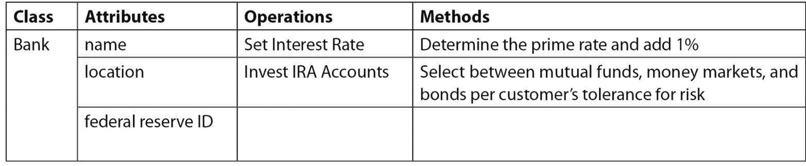
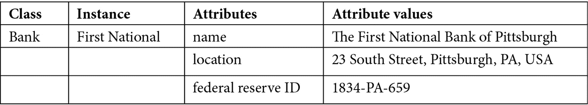

# 5

# 详细探索类

本章将开始我们的 C++面向对象编程（OOP）之旅。我们将首先介绍面向对象（OO）概念，然后进一步理解这些概念如何在 C++中实现。很多时候，实现 OOP 理念将通过直接语言支持，如本章中的特性。有时，我们还将利用各种编程技术来实现面向对象的概念。这些技术将在后续章节中介绍。在所有情况下，理解面向对象的概念以及这些概念如何与精心设计的理念相关联，然后清楚地理解如何用健壮的代码实现这些设计，这一点非常重要。

本章将详细阐述 C++类的高级使用。除了基础知识之外，还将详细说明细微特性和细微差别。本章的目标是让你理解面向对象的概念，并开始从面向对象编程的角度思考。拥抱核心面向对象理念，如封装和信息隐藏，将使你编写的代码更容易维护，并使你更容易修改他人的代码。

在本章中，我们将涵盖以下主要主题：

+   定义面向对象术语和概念 - 对象、类、实例、封装和信息隐藏

+   应用类和成员函数的基本知识

+   检查成员函数内部结构；`this`指针

+   使用访问标签和访问区域

+   理解构造函数 - 默认构造函数、重载构造函数、拷贝构造函数、转换构造函数和类内初始化器

+   理解析构函数及其正确使用

+   将限定符应用于数据成员和成员函数 - `inline`、`const`和`static`

到本章结束时，你将理解适用于类的核心面向对象术语，以及关键 OO 理念如封装和信息隐藏如何导致软件更容易维护。

你还将欣赏 C++如何提供内置语言特性来支持面向对象编程。你将精通成员函数的使用，并通过`this`指针理解其底层实现。你将了解如何正确使用访问标签和访问区域来促进封装和信息隐藏。

你将了解构造函数如何用于初始化对象，以及从基本到典型（重载）再到拷贝构造函数，甚至转换构造函数的多种构造函数类型。同样，你将了解如何在对象存在结束时之前正确使用析构函数。

你还将了解如何将限定符，如`const`、`static`和`inline`应用于成员函数以支持面向对象概念或效率。同样，你将了解如何将限定符，如`const`和`static`应用于数据成员以进一步支持 OO 理念。

C++可以用作面向对象编程语言，但这不是自动的。要做到这一点，你必须理解 OO 概念、意识形态和语言特性，这将使你能够支持这一努力。让我们通过理解面向对象 C++程序中的核心和基本构建块开始我们的追求，即 C++类。

# 技术要求

完整程序示例的在线代码可以在以下 GitHub URL 中找到：[`github.com/PacktPublishing/Deciphering-Object-Oriented-Programming-with-CPP/tree/main/Chapter05`](https://github.com/PacktPublishing/Deciphering-Object-Oriented-Programming-with-CPP/tree/main/Chapter05)。每个完整程序示例都可以在 GitHub 中找到，位于适当的章节标题（子目录）下的文件中，该文件以章节编号开头，后面跟着一个连字符，然后是本章中的示例编号。例如，本章的第一个完整程序可以在上述 GitHub 目录下的`Chapter05`子目录中找到，文件名为`Chp5-Ex1.cpp`。

本章的 CiA 视频可以在以下链接查看：[`bit.ly/3KaiQ39`](https://bit.ly/3KaiQ39)。

# 介绍面向对象术语和概念

在本节中，我们将介绍核心的面向对象概念以及伴随这些关键思想的适用术语。尽管在本章中会出现新术语，但我们将从本节开始旅程所必需的基本术语开始。

让我们从基本的面向对象术语开始。

## 理解面向对象术语

我们将首先介绍基本的面向对象术语，然后随着我们引入新的概念，我们将扩展术语以包括 C++特定的术语。

术语“对象”、“类”和“实例”都是重要且相关的术语，我们可以从这些定义开始。一个**对象**体现了一组有意义的特性和行为。对象可以被操作，可以接收行为的动作或后果。对象可能经历变换，并且可以随时间重复改变。对象可以与其他对象交互。

术语“对象”有时用来描述类似项目的分组蓝图。术语**类**可以与这种对象的使用方式互换。术语“对象”也可能（更常见的是）用来描述这种分组中的特定项目。术语**实例**可以与这种对象的意义互换。使用的上下文通常会使清楚哪种“对象”的含义正在应用。为了避免潜在的混淆，建议优先使用术语“类”和“实例”。

让我们考虑一些示例，使用上述术语：


对象也有组件。类的特性被称为**属性**。类的行为被称为**操作**。行为或操作的特定实现被称为其**方法**。换句话说，方法就是操作的实施方式，或者定义功能的代码主体，而操作是函数的原型或使用协议。

让我们考虑一些使用上述术语的高级示例：



类的每个实例可能都有其属性的不同值。例如：



现在我们已经掌握了基本的 OO 术语，让我们继续探讨与本章相关的其他重要面向对象概念。

## 理解面向对象概念

与本章相关的关键面向对象概念是**封装**和**信息隐藏**。将这些相互关联的理念纳入你的设计中，将为编写易于修改和维护的程序奠定基础。

将有意义的特性（属性）和行为（操作）分组在一起，这些行为操作这些属性，并捆绑成一个单一单元，这被称为**封装**。在 C++中，我们通常将这些项目组合成一个类。每个类实例的接口是通过模拟与每个类相关的行为的操作来实现的。这些操作还可以通过改变其属性的值来修改对象的内部状态。在类中将属性隐藏起来，并提供操作这些细节的接口，使我们探索支持性的概念**信息隐藏**。

**信息隐藏**指的是将执行操作的具体细节抽象成一个类方法的过程。也就是说，用户只需要了解要利用的操作及其整体目的；实现细节隐藏在方法（函数的主体）中。以这种方式，改变底层实现（方法）不会改变操作的接口。信息隐藏还可以指隐藏类的属性的底层实现。当我们介绍访问区域时，我们将进一步探讨这一点。信息隐藏是实现类适当封装的一种手段。一个适当封装的类将能够实现适当的类抽象，从而支持面向对象的设计。

面向对象系统天生更容易维护，因为类允许快速进行升级和修改，而不会因为封装和信息隐藏而对整个系统产生影响。

# 理解类和成员函数的基本知识

C++的**类**是 C++中的基本构建块，允许程序员指定用户定义的类型，封装相关的数据和行为。C++类的定义将包含属性、操作，有时还有方法。C++类支持封装。

创建一个类类型的变量被称为**实例化**。在 C++中，类中的属性被称为**数据成员**。类中的操作被称为 C++中的**成员函数**，并用于建模行为。在面向对象术语中，一个操作意味着一个函数的签名，或其原型（声明），而方法意味着其底层实现或函数体（定义）。在某些面向对象的语言中，术语*方法*被更宽松地使用，根据使用上下文来表示操作或其方法。在 C++中，术语*数据成员*和*成员函数*最常被使用。

成员函数的原型必须放在类定义中。通常，成员函数的定义放在类定义之外。然后使用作用域解析运算符`::`将给定的成员函数定义与它是其成员的类关联起来。点`.`或箭头`->`表示法用于访问所有类成员，包括成员函数，具体取决于我们是通过实例还是通过实例的指针来访问成员。

C++结构也可以用来封装数据和它们相关的行为。C++的`struct`可以做 C++的`class`能做的任何事情；事实上，在 C++中，`class`是用`struct`实现的。尽管结构和类可能表现相同（除了默认可见性之外），但类更常用于建模对象、对象类型之间的关系以及实现面向对象系统。

让我们来看一个简单的例子，其中我们实例化一个`class`和一个`struct`，每个都有成员函数，以便进行比较。我们将把这个例子分成几个部分。完整的程序示例可以在 GitHub 仓库中找到：

[`github.com/PacktPublishing/Deciphering-Object-Oriented-Programming-with-CPP/blob/main/Chapter05/Chp5-Ex1.cpp`](https://github.com/PacktPublishing/Deciphering-Object-Oriented-Programming-with-CPP/blob/main/Chapter05/Chp5-Ex1.cpp)

```cpp
#include <iostream>
using std::cout;    // preferred to: using namespace std;
using std::endl;
using std::string;
struct student
{ 
    string name;
    float gpa;
    void Initialize(string, float);  // fn. prototype
    void Print();
};
class University
{
public:
    string name;
    int numStudents;
    void Initialize(string, int);   // fn. prototype
    void Print();
};
```

在前面的例子中，我们首先使用`struct`定义了一个`student`类型，使用`class`定义了一个`University`类型。请注意，按照惯例，使用结构创建的用户定义类型不使用大写字母，而使用类创建的用户定义类型以大写字母开头。此外，请注意，`class`定义在其定义的开始处需要标签`public:`。我们将在本章后面探讨这个标签的使用；然而，目前，`public`标签存在是为了使这个`class`具有与`struct`相同的成员默认可见性。

在`class`和`struct`定义中，注意`Initialize()`和`Print()`函数的原型。我们将在下一个程序段中使用作用域解析运算符`::`将这些原型与成员函数定义联系起来。

让我们检查各种成员函数的定义：

```cpp
void student::Initialize(string n, float avg)
{ 
    name = n;    // simple assignment
    gpa = avg;   // we'll see preferred init. shortly
}
void student::Print()
{ 
    cout << name << " GPA: " << gpa << endl;
}
void University::Initialize(string n, int num)
{ 
    name = n;           // simple assignment; we will see
    numStudents = num;  // preferred initialization shortly
} 
void University::Print()
{ 
    cout << name << " Enrollment: " << numStudents << endl;
}
```

现在，让我们回顾每个用户定义类型的各种成员函数定义。`void student::Initialize(string, float)`、`void student::Print()`、`void University::Initialize(string, int)` 和 `void University::Print()` 的定义在前面片段中依次出现。注意解析域运算符 `::` 如何使我们能够将相关的函数定义与它是成员的 `class` 或 `struct` 关联起来。

此外，请注意，在每一个 `Initialize()` 成员函数中，输入参数被用作值来加载特定类或结构类型特定实例的相关数据成员。例如，在 `void University::Initialize(string n, int num)` 函数定义中，输入参数 `num` 被用来初始化特定 `University` 实例的 `numStudents`。

注意

解析域运算符 `::` 将成员函数定义与它们所属的类（或结构）关联起来。

让我们通过考虑这个例子中的 `main()` 来看看成员函数是如何被调用的：

```cpp
int main()
{ 
    student s1;  // instantiate a student (struct instance)
    s1.Initialize("Gabby Doone", 4.0);
    s1.Print();
    University u1;  // instantiate a University (class)
    u1.Initialize("GWU", 25600);
    u1.Print();
    University *u2;         // pointer declaration
    u2 = new University();  // instantiation with new()
    u2->Initialize("UMD", 40500);  
    u2->Print();  // or alternatively: (*u2).Print();
    delete u2;  
    return 0;
}
```

在这里，在 `main()` 中，我们简单地定义了一个 `student` 类型的变量 `s1` 和一个 `University` 类型的变量 `u1`。在面向对象术语中，更倾向于说 `s1` 是 `student` 的一个实例，而 `u1` 是 `University` 的一个实例。实例化发生在为对象分配内存时。因此，使用以下方式声明指针变量 `u2`：`University *u2;` 并不会实例化一个 `University`；它仅仅声明了一个指向可能未来实例的指针。相反，在下一行，`u2 = new University();`，我们通过分配内存来实例化一个 `University`。

对于每个实例，我们通过调用它们各自的 `Initialize()` 成员函数来初始化它们的数据成员，例如 `s1.Initialize("Gabby Doone", 4.0);` 或 `u1.Initialize("UMD", 4500);`。然后我们通过每个相应的实例调用 `Print()`，例如 `u2->Print();`。回想一下，`u2->Print();` 也可以写成 `(*u2).Print();`，这更容易让我们记住这里的实例是 `*u2`，而 `u2` 是对该实例的指针。

注意，当我们通过 `s1` 调用 `Initialize()` 时，我们调用 `student::Initialize()`，因为 `s1` 是 `student` 类型，并且我们在该函数体内初始化 `s1` 的数据成员。同样，当我们通过 `u1` 或 `*u2` 调用 `Print()` 时，我们调用 `University::Print()`，因为 `u1` 和 `*u2` 是 `University` 类型，并且随后我们打印出特定大学的成员数据。

由于实例 `u1` 是在堆上动态分配的，我们负责在 `main()` 函数的末尾使用 `delete()` 释放其内存。

伴随此程序的输出如下：

```cpp
Gabby Doone GPA: 4.4
GWU Enrollment: 25600
UMD Enrollment: 40500
```

现在我们正在创建带有其相关成员函数定义的类定义，了解开发者通常如何在文件中组织代码是很重要的。通常，一个类会被分成一个头文件（`.h`），其中包含类定义，和一个源代码文件（`.cpp`），该文件包含头文件，然后跟随成员函数的定义。例如，名为 `University` 的类将有一个 `University.h` 头文件和一个 `University.cpp` 源代码文件。

现在，让我们通过检查 "this" 指针来进一步了解成员函数的工作细节。

# 检查成员函数内部；"this" 指针

到目前为止，我们已经注意到成员函数是通过对象调用的。我们注意到，在成员函数的作用域内，可能被使用的是调用该函数的特定对象的数据成员（以及其他成员函数）（除了任何输入参数）。唉，这是如何以及为什么这样工作的呢？

结果表明，大多数情况下，成员函数是通过对象调用的。每当以这种方式调用成员函数时，该成员函数都会接收到一个指向调用该函数的实例的指针。然后，调用该函数的对象的指针作为隐式第一个参数传递给函数。这个指针的名称是 **this**。

虽然在各个成员函数的定义中可能会明确地引用 "this" 指针，但通常并不这样做。即使没有明确使用，函数作用域内使用的数据成员属于 `this`，即指向调用该函数的对象的指针。

让我们看看一个完整的程序示例。尽管示例被分成了几个部分，但完整的程序可以在以下 GitHub 位置找到：

[`github.com/PacktPublishing/Deciphering-Object-Oriented-Programming-with-CPP/blob/main/Chapter05/Chp5-Ex2.cpp`](https://github.com/PacktPublishing/Deciphering-Object-Oriented-Programming-with-CPP/blob/main/Chapter05/Chp5-Ex2.cpp)

```cpp
#include <iostream>
#include <cstring> // though we'll prefer std::string, one
                   // pointer data member will illustrate 
                   // important concepts
using std::cout;   // preferred to: using namespace std;
using std::endl;
using std::string;
class Student
{
// for now, let's put everything public access region
public:  
    string firstName;  // data members
    string lastName;
    char middleInitial;
    float gpa;
    char *currentCourse;  // ptr to illustrate key concepts 
    // member function prototypes
    void Initialize(string, string, char, float,
                    const char *);
    void Print();
};
```

在程序的第一个部分，我们定义了一个名为 `Student` 的类，它包含多种数据成员和两个成员函数原型。目前，我们将所有内容放置在 `public` 访问区域。

现在，让我们检查 `void Student::Initialize()` 和 `void Student::Print()` 这两个成员函数的定义。我们还将检查这些函数在 C++ 中的内部结构：

```cpp
// Member function definition
void Student::Initialize(string fn, string ln, char mi,
                         float gpa, const char *course)
{
    firstName = fn;
    lastName = ln;  
    this->middleInitial = mi;  // optional use of 'this'
    this->gpa = gpa;  // required, explicit use of 'this'
    // remember to allocate memory for ptr data members
    currentCourse = new char [strlen(course) + 1];
    strcpy(currentCourse, course);
}
// It is as if Student::Initialize() is written as:
// void Student_Initialize_str_str_char_float_constchar*
//     (Student *const this, string fn, string ln,
//      char mi, float avg, const char *course) 
// {
//    this->firstName = fn;
//    this->lastName = ln;
//    this->middleInitial = mi;
//    this->gpa = avg;
//    this->currentCourse = new char [strlen(course) + 1];
//    strcpy(this->currentCourse, course);
// }
// Member function definition
void Student::Print()
{
   cout << firstName << " ";
   cout << middleInitial << ". ";
   cout << lastName << " has a gpa of: ";
   cout << gpa << " and is enrolled in: ";
   cout << currentCourse << endl;
}
// It is as if Student::Print() is written as:
// void Student_Print(Student *const this)
// {
//    cout << this->firstName << " ";
//    cout << this->middleInitial << ". ";
//    cout << this->lastName << " has a gpa of: ";
//    cout << this->gpa << " and is enrolled in: ";
//    cout << this->currentCourse << endl;
// }
```

首先，我们看到`void Student::Initialize()`成员函数的定义，它接受各种参数。请注意，在这个函数体中，我们首先将输入参数`fn`赋值给数据成员`firstName`。我们以类似的方式，使用各种输入参数，初始化将要调用此函数的特定对象的各种数据成员。同时请注意，我们为指针数据成员`currentCourse`分配足够的内存，以容纳输入参数`course`所需的字符数（加上一个终止空字符）。然后，我们使用`strcpy()`函数将输入参数`course`中的字符串复制到数据成员`currentCourse`。

此外，请注意在`void Student::Initialize()`中，赋值`this->middleInitial = mi;`。在这里，我们有一个可选的显式使用`this`指针。在这种情况下，用`this`来限定`middleInitial`不是必需的或习惯性的，但我们可以选择这样做。然而，在赋值`this->gpa = gpa;`中，使用`this`是必需的。为什么？请注意，输入参数被命名为`gpa`，数据成员也是`gpa`。简单地赋值`gpa = gpa;`会将最局部版本的`gpa`（输入参数）设置为自身，并且不会影响数据成员。在这里，通过在赋值表达式的左侧使用`this`来区分`gpa`，表示将`this`指向的数据成员`gpa`设置为输入参数`gpa`的值。另一个解决方案是使用与输入参数不同的数据成员名称，例如将形式参数列表中的`gpa`重命名为`avg`（我们将在代码的后续版本中这样做）。

现在，请注意`void Student::Initialize()`的注释版本，它位于已使用的`void Student::Initialize()`版本下方。在这里，我们可以看到大多数成员函数是如何在内部表示的。首先，请注意，函数的名称被*名称混淆*以包含其参数的数据类型。这是函数在内部表示的方式，并且因此允许函数重载（即具有看似相同名称的两个函数；在内部，每个都有唯一的名称）。接下来，请注意，在输入参数中，还有一个额外的第一个输入参数。这个额外（隐藏）输入参数的名称是`this`，它被定义为`Student *const this`。

现在，在内部函数视图的`void Student::Initialize()`函数体中，请注意，每个数据成员的名称前都跟着`this`。实际上，我们是在访问由`this`指向的对象的数据成员。`this`在哪里定义的？回想一下，`this`是这个函数的隐式第一个输入参数，并且是一个指向调用此函数的对象的常量指针。

类似地，我们可以回顾`void Student::Print()`的成员函数定义。在这个函数中，每个数据成员都使用`cout`和插入运算符`<<`整洁地打印出来。然而，请注意在这个函数定义下面的注释掉的内部版本`void Student::Print()`。同样，`this`实际上是类型为`Student *const`的隐式输入参数。此外，每个数据成员的使用都通过`this`指针进行访问，例如`this->gpa`。再次明显地看到，在成员函数的作用域内访问了特定实例的成员；这些成员是通过`this`指针隐式访问的。

最后，请注意，在成员函数的体内可以使用`this`。我们几乎总是可以在成员函数体内访问的数据成员或成员函数之前使用显式的`this`。在本章的后面，我们将看到一种相反的情况（使用静态方法）。此外，在本书的后面，我们将看到需要显式使用`this`来实现更高级的 OO 概念的情况。

尽管如此，让我们通过检查`main()`来完成这个程序示例：

```cpp
int main()
{
    Student s1;   // instance
    Student *s2 = new Student; // ptr to an instance
    s1.Initialize("Mary", "Jacobs", 'I', 3.9, "C++");
    s2->Initialize("Sam", "Nelson", 'B', 3.2, "C++");
    s1.Print();
    s2->Print(); // or use (*s2).Print();
    delete [] s1.currentCourse;     // delete dynamically 
    delete [] s2->currentCourse; // allocated data members
    delete s2;    // delete dynamically allocated instance
    return 0;
}
```

在这个程序的最后一部分，我们在`main()`中两次实例化`Student`。`Student` `s1`是一个实例，而`s2`是一个指向`Student`的指针。接下来，我们使用`.`或`->`运算符通过每个相关实例调用各种成员函数。

注意，当`s1`调用`Initialize()`时，`this`指针（在成员函数的作用域内）将指向`s1`。这就像将`&s1`作为第一个参数传递给这个函数一样。同样，当`*s2`调用`Initialize()`时，`this`指针将指向`s2`；这就像将`s2`（它已经是一个指针）作为隐式第一个参数传递给这个函数一样。

在每个实例调用`Print()`以显示每个`Student`的数据成员之后，请注意我们释放了不同级别的动态分配的内存。我们首先释放每个实例的动态分配的数据成员，使用`delete()`释放每个这样的成员。然后，因为`s2`是指向我们动态分配的实例的指针，我们必须记住也要释放包含实例本身的堆内存。我们再次使用`delete s2;`来这样做。

这里是完整程序示例的输出：

```cpp
Mary I. Jacobs has a gpa of: 3.9 and is enrolled in: C++
Sam B. Nelson has a gpa of: 3.2 and is enrolled in: C++
```

现在，让我们通过检查访问标签和访问区域来加深我们对类和信息隐藏的理解。

# 使用访问标签和访问区域

标签可以引入到类（或结构）定义中，以控制类（或结构）成员的访问或可见性。通过控制我们应用程序中从各个范围直接访问成员，我们可以支持封装和信息隐藏。也就是说，我们可以坚持让我们的类用户使用我们选择的函数，使用我们选择的协议来操作类内部的数据和其他成员函数，这些是我们程序员认为合理和可接受的。此外，我们可以通过仅向用户宣传给定类的所需公共接口来隐藏类的实现细节。

数据成员或成员函数，统称为**成员**，可以单独标记，或分组到访问区域中。可能指定的三个标签或**访问区域**如下：

+   **私有**：在此访问区域内的数据成员和成员函数仅可在类的范围内访问。类的范围包括该类的成员函数。

+   `私有`直到我们介绍继承。当介绍继承时，`保护`将提供一个机制，允许在派生类范围内进行访问。

+   **公共**：在此访问区域内的数据成员和成员函数可以从程序的任何范围访问。

提醒

数据成员和成员函数通常通过实例进行访问。你可能会问，“我的实例在什么范围内？”，以及“我能否从这个特定范围访问特定的成员？”

程序员可能需要的成员可以分组在给定的标签或`私有`下。如果在结构定义中省略了访问标签，则默认成员访问为`公共`。当显式引入访问标签时，而不是依赖于默认可见性，`类`和`结构`是相同的。尽管如此，在面向对象编程中，我们倾向于使用类来定义用户定义的类型。

有趣的是要注意，当数据成员在具有相同访问标签的访问区域中分组时，它们在内存中的布局顺序是保证的。然而，如果存在包含给定类中数据成员的多个访问区域，编译器可以自由地重新排序这些相应的分组以实现高效的内存布局。

让我们通过一个例子来检查访问区域。尽管这个例子将被分成几个部分，但完整的例子将展示出来，也可以在 GitHub 仓库中找到：

[`github.com/PacktPublishing/Deciphering-Object-Oriented-Programming-with-CPP/blob/main/Chapter05/Chp5-Ex3.cpp`](https://github.com/PacktPublishing/Deciphering-Object-Oriented-Programming-with-CPP/blob/main/Chapter05/Chp5-Ex3.cpp)

```cpp
#include <iostream>
#include <cstring>    // though we'll prefer std::string, 
// one ptr data member will illustrate important concepts
using std::cout;      // preferred to: using namespace std;
using std::endl;
using std::string;
class Student
{
// private members are accessible only within the scope of
// the class (that is, within member functions or friends) 
private: 
    string firstName;     // data members
    string lastName;
    char middleInitial;
    float gpa;
    char *currentCourse;  // ptr to illustrate key concepts
public:   // public members are accessible from any scope
    // member function prototypes
    void Initialize();  
    void Initialize(string, string, char, float,  
                    const char *);
    void CleanUp();
    void Print();
};
```

在这个例子中，我们首先定义了`Student`类。注意，我们在类定义的顶部附近添加了一个`private`访问区域，并将所有数据成员放置在这个区域中。这种放置方式将确保这些数据成员只能在类的范围内直接访问和修改，这意味着通过这个类的成员函数（以及我们稍后将要看到的友元函数）。通过限制数据成员的访问仅限于它们自己类的成员函数，确保了这些数据成员的安全处理；只有通过类设计者自己引入的预期和安全函数才能允许访问。

接下来，注意在成员函数原型之前在类定义中添加了标签`public`。这意味着这些函数将在我们程序的任何范围内可访问。当然，我们通常需要通过实例来访问这些函数。但是，实例可以在`main()`函数的作用域内，或者任何其他函数的作用域内（甚至在其他类的成员函数的作用域内），当实例访问这些公共成员函数时。这被称为类的`public`接口。

访问区域支持封装和信息隐藏

一个好的经验法则是将数据成员放置在`private`访问区域，然后指定一个安全、适当的`public`接口，通过`public`成员函数来访问它们。这样做，数据成员的唯一访问方式就是通过类设计者有意设计的、经过良好测试的成员函数。采用这种策略，类的底层实现也可以更改，而不会导致对公共接口的任何调用发生变化。这种做法支持封装和信息隐藏。

让我们继续，看看我们程序中的各种成员函数定义：

```cpp
void Student::Initialize()
{   // even though string data members are initialized with
    // empty strings, we are showing how to clear these 
    // strings, should Initialize() be called more than 1x
    firstName.clear();   
    lastName.clear(); 
    middleInitial = '\0';      // null character
    gpa = 0.0;
    currentCourse = nullptr; 
}
// Overloaded member function definition
void Student::Initialize(string fn, string ln, char mi,
                         float avg, const char *course) 
{
    firstName = fn;
    lastName = ln;
    middleInitial = mi; 
    gpa = avg;   
    // dynamically allocate memory for pointer data member
    currentCourse = new char [strlen(course) + 1];
    strcpy(currentCourse, course);
}
// Member function definition
void Student::CleanUp()
{   // deallocate previously allocated memory
    delete [] currentCourse;  
}                          
// Member function definition
void Student::Print()
{
    cout << firstName << " " << middleInitial << ". ";
    cout << lastName << " has gpa: " << gpa;
    cout << " and enrolled in: " << currentCourse << endl;
}
```

在这里，我们已经定义了在类定义中原型化的各种成员函数。注意使用作用域解析运算符`::`将类名与成员函数名关联起来。内部，这两个标识符被*名称混淆*在一起，以提供唯一的内部函数名。注意，`void Student::Initialize()`函数被重载了；一个版本只是将所有数据成员初始化为某种形式的空或零，而重载版本使用输入参数来初始化各种数据成员。

现在，让我们继续，检查以下代码段中的`main()`函数：

```cpp
int main()
{
    Student s1;
    // Initialize() is public; accessible from any scope
    s1.Initialize("Ming", "Li", 'I', 3.9, "C++", "178GW"); 
    s1.Print(); // public Print() accessible from main() 
    // Error! private firstName is not accessible in main()
    // cout << s1.firstName << endl;  
    // CleanUp() is public, accessible from any scope
    s1.CleanUp(); 
    return 0;
}
```

在上述`main()`函数中，我们首先使用声明`Student s1;`实例化一个`Student`对象。接下来，`s1`调用与提供的参数签名匹配的`Initialize()`函数。由于这个成员函数在`public`访问区域，它可以在我们程序的任何作用域中访问，包括`main()`。同样，`s1`调用了`Print()`，这也是`public`的。这些函数是`Student`类的公共接口的一部分，代表了操作任何给定`Student`实例的核心功能。

接下来，在注释掉的代码行中，注意` s1`尝试直接使用` s1.firstName`来访问`firstName`。因为`firstName`是`private`的，这个数据成员只能在它自己类的范围内访问，这意味着它的成员函数（以及后来的朋友）可以访问。`main()`函数不是`Student`类的成员函数，因此` s1`不能在`main()`的作用域内访问`firstName`，也就是说，在它自己类的作用域之外。

最后，我们调用了`s1.CleanUp();`，这也同样有效，因为`CleanUp()`是`public`的，因此可以从任何作用域（包括`main()`）访问。

这个完整示例的输出如下：

```cpp
Ming I. Li has gpa: 3.9 and enrolled in: C++
```

现在我们已经了解了访问区域是如何工作的，让我们继续前进，通过考察一个称为构造函数的概念，以及 C++中可用的各种类型的构造函数。

# 理解构造函数

你有没有注意到，在本章的程序示例中，每个`class`或`struct`都有一个`Initialize()`成员函数是多么方便？当然，初始化给定实例的所有数据成员是可取的。更重要的是，确保任何实例的数据成员都有真实值至关重要，因为我们知道 C++不会提供*干净*或*零初始化*的内存。访问未初始化的数据成员，并像使用真实值一样使用它的值，是粗心大意的程序员可能遇到的潜在陷阱。

每次实例化类时单独初始化每个数据成员可能是一项繁琐的工作。如果我们简单地忽略设置值怎么办？如果这些值是`private`的，因此不能直接访问怎么办？我们已经看到，`Initialize()`函数是有益的，因为它一旦编写，就提供了一种为给定实例设置所有数据成员的方法。唯一的缺点是程序员现在必须记住在应用程序的每个实例上调用`Initialize()`。那么，如果有一种方法可以确保每次实例化类时都调用`Initialize()`函数怎么办？如果我们能够重载多种版本来初始化实例，并且可以根据当时可用的数据调用适当的版本怎么办？这个前提是 C++中构造函数的基础。该语言提供了一系列重载的初始化函数，一旦实例的内存变得可用，它们将自动被调用。

让我们通过检查 C++ 构造函数来查看这个初始化成员函数家族。

## 应用构造函数基础和重载构造函数

定义一个 `class`（或 `struct`）以提供初始化对象的多种方式。构造函数的返回类型不能指定。

如果您的 `class` 或 `struct` 不包含构造函数，将在 `public` 访问区域为您创建一个，不带参数。这被称为默认构造函数。在幕后，每次实例化对象时，编译器都会插入一个构造函数调用。当实例化没有构造函数的类时，默认构造函数会作为函数调用立即跟在实例化之后插入。这个系统提供的成员函数将有一个空体（方法），它将被链接到您的程序中，以便在实例化时，任何编译器添加的、隐式的对此函数的调用都可以发生，而不会出现链接器错误。根据设计需要，程序员经常可以编写自己的默认（无参数）构造函数；即，用于无参数默认实例化的构造函数。

大多数程序员除了自己的无参数默认构造函数外，至少还提供一个构造函数。回想一下，构造函数可以重载。重要的是要注意，如果您自己提供了任何构造函数，您将不会收到系统提供的无参数默认构造函数，并且随后使用该接口进行实例化将导致编译器错误。

提醒

构造函数与类的名称相同。您不能指定它们的返回类型。它们可以重载。如果您在类中没有提供任何构造函数（即实例化的方法），编译器只会创建一个公共的默认（无参数）构造函数。

让我们通过一个简单的例子来了解构造函数的基础：

[`github.com/PacktPublishing/Deciphering-Object-Oriented-Programming-with-CPP/blob/main/Chapter05/Chp5-Ex4.cpp`](https://github.com/PacktPublishing/Deciphering-Object-Oriented-Programming-with-CPP/blob/main/Chapter05/Chp5-Ex4.cpp)

```cpp
#include <iostream>
using std::cout;   // preferred to: using namespace std;
using std::endl;
using std::string;
class University
{
private:
    string name;
    int numStudents;
public: 
    // constructor prototypes
    University(); // default constructor
    University(const string &, int);
    void Print();
    void CleanUp();
};
University::University()
{   // Because a string is a class type, all strings are 
    // constructed with an empty value by default. 
    // For that reason, we do not need to explicitly 
    // initialize strings if an empty string is desired. 
    // We'll see a preferred manner of initialization 
    // for all data members shortly in this chapter.    
    // Hence, name is constructed by default (empty string)
    numStudents = 0;
}
University::University(const string &n, int num)
{   // any pointer data members should be allocated here
    name = n; // assignment between strings is deep assign.
    numStudents = num;
}
void University::Print()
{
    cout << "University: " << name;
    cout << " Enrollment: " << numStudents << endl;
}
void University::CleanUp()
{   // deallocate any previously allocated memory
}
int main()
{
    University u1; // Implicit call to default constructor
    // alternate constructor instantiation and invocation
    University u2("University of Delaware", 23800);
    University u3{"Temple University", 20500}; // note {}  
    u1.Print();
    u2.Print();
    u3.Print();
    u1.CleanUp();
    u2.CleanUp();
    u3.CleanUp();
    return 0;
}
```

在前面的程序段中，我们首先定义了 `class University`；数据成员是 `private` 的，三个成员函数是 `public` 的。注意，前两个成员函数是构造函数的原型。它们都与类的名称相同；都没有指定它们的返回类型。这两个构造函数是重载的，因为每个都有不同的签名。

接下来，注意定义了三个成员函数。注意在每个定义中，每个成员函数名称之前都使用了作用域解析运算符 `::`。每个构造函数提供了一种初始化实例的不同方法。`void University::Print()` 成员函数仅为我们提供的示例提供了一种简单的输出方式。

现在，在 `main()` 中，让我们创建三个 `University` 实例。第一行代码 `University u1;` 实例化一个 `University` 对象，然后隐式调用默认构造函数来初始化数据成员。在下一行代码 `University u2("University of Delaware", 23800);` 中，我们实例化第二个 `University`。一旦在 `main()` 中为该实例分配了内存，与提供的参数签名匹配的构造函数（即 `University::University(const string &, int)`）将隐式调用以初始化该实例。

最后，我们使用 `University u3{"Temple University", 20500};` 实例化第三个 `University` 对象，这也使用了备用构造函数。注意在实例化和构造 `u3` 时 `{}` 与 `()` 的使用。两种风格都可以使用。后一种风格是为了创建一致性；两种构造方式都不会带来性能优势。

我们可以看到，根据我们如何实例化对象，我们可以指定我们希望为我们调用哪个构造函数来执行初始化。

本例的输出如下：

```cpp
University: Enrollment: 0
University: University of Delaware Enrollment: 23800
University: Temple Enrollment: 20000
```

参数比较

你注意到备用 `University` 构造函数的签名是 `University(const string &, int);` 吗？这意味着第一个参数是一个 `const string &` 而不是 `string`，就像之前示例中我们 `Initialize()` 成员函数所使用的？两者都是可接受的。一个 `string` 参数会将形式参数的副本传递到成员函数的栈上。如果形式参数是一个引号中的字符串字面量（例如 `"University of Delaware"`），则会首先创建一个 `string` 实例来容纳这个字符序列。相比之下，如果构造函数的参数是一个 `const string &`，则将传递形式参数的引用到该函数，并且引用的对象将被视为 `const`。在构造函数体中，我们使用赋值操作将输入参数的值复制到数据成员。不用担心，`string` 类的赋值操作员会执行从源到目标字符串的深度复制。这意味着我们不必担心数据成员与初始化数据（即字符串）共享内存（也就是说，没有自己的副本）。因此，将 `string` 或 `const string &` 作为构造函数的参数都是可接受的。

现在，让我们用类内初始化器来补充我们对构造函数的使用。

## 构造函数和类内初始化器

除了在构造函数中初始化数据成员外，一个类还可以选择性地包含**类内初始化器**。也就是说，可以在类定义中指定默认值，作为初始化数据成员的手段，在没有为这些数据成员提供特定的构造函数初始化（或赋值）的情况下。

让我们考虑我们之前示例的一个修订版：

```cpp
class University
{
private:
    string name {"None"}; // in-class initializer to be
    int numStudents {0};  // used when values not set in
                          // constructor
    // Above line same as: int numStudents = 0;
public:                   
    University(); // default constructor
    // assume remainder of class def is as previously shown
};
University::University()
{   // Because there are no initializations (or
    // assignments) of data members name, numStudents 
    // in this constructor, the in-class initializer
    // values will persist.
    // This constructor, with its signature, is still 
    // required for the instantiation below, in main()
}
// assume remaining member functions exist here
int main()
{
    University u1;  // in-class initializers are used
}
```

在之前的代码片段中，请注意，我们的`University`类定义包含两个数据成员`name`和`numStudents`的类内初始化器。当`University`构造函数没有设置这些值时，这些值将用于初始化`University`实例的数据成员。更具体地说，如果`University`构造函数使用初始化来设置这些值，则类内初始化器将被忽略（我们将在本章稍后看到正式的构造函数初始化与成员初始化列表）。

此外，如果一个构造函数在构造函数体内部通过赋值来设置这些数据成员（正如我们在之前的构造函数示例中所见），这些赋值将覆盖任何原本为我们进行的类内初始化。然而，如果我们没有在构造函数中设置数据成员（如当前代码片段所示），则将使用类内初始化器。

类内初始化器可以用作简化默认构造函数或减轻构造函数原型中指定的默认值（这种风格变得越来越不受欢迎）。

正如我们在本例中所见，类内初始化器可能导致默认构造函数在方法体本身中不再有工作（即初始化）要做。然而，我们可以看到在某些情况下，如果我们想使用默认接口进行实例化，则默认构造函数是必要的。在这些情况下，可以将`=default`添加到默认构造函数的原型中，以指示系统提供的默认构造函数（具有空体）应该为我们链接，从而减轻我们提供空默认构造函数的需要（如我们之前的示例所示）。

通过这次改进，我们的类定义将变为以下内容：

```cpp
class University
{
private:
    string name {"None"}; // in-class init. to be used when
    int numStudents {0};  // values not set in constructor
public: 
    // request the default constructor be linked in     
    University() = default; 
    University(const string &, int);
    void Print();
    void CleanUp();
};
```

在之前的类定义中，我们现在请求系统提供的默认构造函数（具有空体），在这种情况下我们本来不会自动获得（因为我们已经提供了一个具有不同签名的构造函数）。我们已经节省了指定一个空体的默认构造函数，正如我们的原始示例所示。

接下来，让我们通过检查拷贝构造函数来增加我们对构造函数的知识。

## 创建拷贝构造函数

**拷贝构造函数**是一种特殊构造函数，当可能需要创建对象的副本时会被调用。拷贝构造函数可能在另一个对象的构造过程中被调用。它们也可能在对象通过值传递给函数作为输入参数或从函数返回值时被调用。

通常，复制一个对象并稍作修改比从头开始构造一个具有其各自属性的新对象要容易。这在程序员需要应用程序生命周期中经过多次更改的对象的副本时尤其正确。可能无法回忆起对特定对象应用的各种转换的顺序，以创建一个副本。相反，拥有复制对象的方法是可取的，可能是至关重要的。

复制构造函数的签名是 `ClassName::ClassName(const ClassName &);`。注意，一个对象被明确地作为参数传递，并且该参数将是一个指向常量对象的引用。复制构造函数，就像大多数成员函数一样，将接收一个隐式参数到函数中，即 `this` 指针。复制构造函数定义的目的是为了复制显式参数以初始化 `this` 指向的对象。

如果类（或 `struct`）的设计者没有实现复制构造函数，将为你提供一个（在 `public` 访问区域），它执行浅拷贝。如果你在类中有指针类型的成员变量，这很可能不是你想要的。相反，最好的做法是自己编写一个复制构造函数，并编写它以执行深拷贝（根据需要分配内存）。

如果程序员希望在构造过程中禁止复制，可以在复制构造函数的原型中使用 `=delete`，如下所示：

```cpp
    // disallow copying during construction
    Student(const Student &) = delete;   // prototype
```

或者，如果程序员希望禁止对象复制，可以在 `private` 访问区域中声明一个复制构造函数。在这种情况下，编译器将链接默认的复制构造函数（执行浅拷贝），但它将被视为私有。因此，在类的作用域之外使用复制构造函数的实例将被禁止。自从 `=delete` 出现以来，这种技术使用得较少，但它可能存在于现有代码中，因此了解它是有用的。

让我们检查一个复制构造函数，从类定义开始。尽管程序以几个片段的形式呈现，但完整的程序示例可以在 GitHub 仓库中找到：

[`github.com/PacktPublishing/Deciphering-Object-Oriented-Programming-with-CPP/blob/main/Chapter05/Chp5-Ex5.cpp`](https://github.com/PacktPublishing/Deciphering-Object-Oriented-Programming-with-CPP/blob/main/Chapter05/Chp5-Ex5.cpp)

```cpp
#include <iostream>  
#include <cstring>    // though we'll prefer std::string, 
// one ptr data member will illustrate important concepts
using std::cout;      // preferred to: using namespace std;
using std::endl;
using std::string;
class Student
{
private: 
    // data members
    string firstName;
    string lastName;
    char middleInitial;
    float gpa;
    char *currentCourse;  // ptr to illustrate key concepts
public:
    // member function prototypes
    Student();  // default constructor
    Student(const string &, const string &, char, float, 
            const char *); 
    Student(const Student &);  // copy constructor proto.
    void CleanUp();
    void Print();
    void SetFirstName(const string &);
};
```

在这个程序段中，我们首先定义 `class Student`。注意通常的 `private` 数据成员和 `public` 成员函数原型，包括默认构造函数和一个重载构造函数。还要注意复制构造函数的原型 `Student(const Student &);`。

接下来，让我们看看我们程序接下来的部分中成员函数的定义：

```cpp
// default constructor
Student::Student()
{
    // Because firstName and lastName are member objects of
    // type string, they are default constructed and hence
    // 'empty' by default. They HAVE been initialized.
    middleInitial = '\0';   // with a relevant value
    gpa = 0.0;
    currentCourse = 0;
}
// Alternate constructor member function definition
Student::Student(const string &fn, const string &ln, 
                 char mi, float avg, const char *course)
{
    firstName = fn;  // not to worry, assignment for string
    lastName = ln;   // is a deep copy into destination str
    middleInitial = mi;
    gpa = avg;
    // dynamically allocate memory for pointer data member
    currentCourse = new char [strlen(course) + 1];
    strcpy(currentCourse, course);
}
// Copy constructor definition – implement a deep copy
Student::Student(const Student &s)
{   // assignment between strings will do a deep 'copy'
    firstName = s.firstName;
    lastName = s.lastName;
    middleInitial = s.middleInitial;
    gpa = s.gpa;
    // for ptr data members, ensure a deep copy 
    // allocate memory for destination
    currentCourse = new char [strlen(s.currentCourse) + 1];
    // then copy contents from source to destination
    strcpy(currentCourse, s.currentCourse); 
}
// Member function definition
void Student::CleanUp()
{   // deallocate any previously allocated memory
    delete [] currentCourse;   
}

// Member function definitions
void Student::Print()
{
    cout << firstName << " " << middleInitial << ". ";
    cout << lastName << " has a gpa of: " << gpa;
    cout << " and is enrolled in: " << currentCourse;
    cout << endl;
}
void Student::SetFirstName(const string &fn)
{
    firstName = fn;
}
```

在上述代码片段中，我们定义了各种成员函数。最值得注意的是，让我们考虑复制构造函数的定义，它是一个具有签名 `Student::Student(const Student &s)` 的成员函数。

注意到输入参数 `s` 是一个指向 `Student` 的 `const` 引用。这意味着我们将要复制的源对象可能不会被修改。我们将要复制的目标对象将是 `this` 指针指向的对象。

当我们仔细导航复制构造函数时，注意我们依次为属于 `this` 指向的对象的任何指针数据成员分配必要的空间。分配的空间与 `s` 所引用的数据成员所需的大小相同。然后我们仔细地从源数据成员复制到目标数据成员。我们细致地确保在目标对象中精确地复制源对象。

注意到我们在目标对象中进行了*深拷贝*。也就是说，我们不是简单地复制 `s.currentCourse` 中的指针到 `this->currentCourse`，例如，我们而是为 `this->currentCourse` 分配空间，然后复制源数据。浅拷贝的结果将是每个对象的指针数据成员共享相同的解引用内存（即每个指针指向的内存）。这很可能不是你想要的拷贝方式。此外，回想一下，系统提供的复制构造函数的默认行为将是从源对象到目标对象的浅拷贝。也值得注意，在复制构造函数中，两个字符串如 `firstName = s.firstName;` 之间的赋值将执行从源到目标字符串的深拷贝，因为这是字符串类定义的赋值运算符的行为。

现在，让我们看看我们的 `main()` 函数，看看复制构造函数可以以哪些方式被调用：

```cpp
int main()
{ 
    // instantiate two Students
    Student s1("Zachary", "Moon", 'R', 3.7, "C++");
    Student s2("Gabrielle", "Doone", 'A', 3.7, "C++");
    // These inits implicitly invoke copy constructor
    Student s3(s1);  
    Student s4 = s2;
    s3.SetFirstName("Zack");// alter each object slightly
    s4.SetFirstName("Gabby"); 
    // This sequence does not invoke copy constructor 
    // This is instead an assignment.
    // Student s5("Giselle", "LeBrun", 'A', 3.1, "C++);
    // Student s6;
    // s6 = s5;   // this is assignment, not initialization
    s1.Print();   // print each instance
    s3.Print();
    s2.Print();
    s4.Print();
    s1.CleanUp(); // Since some data members are pointers,
    s2.CleanUp(); // let's call a function to delete() them
    s3.CleanUp();
    s4.CleanUp();
    return 0;
}
```

在 `main()` 中，我们声明了两个 `Student` 实例，`s1` 和 `s2`，并且每个都是使用与 `Student::Student(const string &, const string &, char, float, const char *);` 签名匹配的构造函数进行初始化。注意，在实例化中使用的签名是我们选择应该隐式调用哪个构造函数的方式。

接下来，我们实例化 `s3` 并将其构造函数的参数传递为对象 `s1`，即 `Student s3(s1);`。在这里，`s1` 是 `Student` 类型，因此这种实例化将匹配接受 `Student` 引用的构造函数，即复制构造函数。一旦进入复制构造函数，我们就知道我们将对 `s1` 进行深拷贝以初始化新实例化的对象 `s3`，该对象将由复制构造函数方法作用域内的 `this` 指针指向。

此外，我们使用以下代码行实例化`s4`：`Student s4 = s2;`。在这里，因为这一行代码是一个初始化（即`s4`在同一语句中既被声明又被赋予了一个值），所以也会调用复制构造函数。复制的源对象将是`s2`，目标对象将是`s4`。请注意，我们随后稍微修改了每个副本（`s3`和`s4`）的`firstName`数据成员。

接下来，在代码的注释部分，我们实例化了两个`Student`类型的对象，`s5`和`s6`。然后我们尝试使用`s5 = s6;`将一个赋值给另一个。尽管这看起来与`s4`和`s2`之间的初始化相似，但它并不是。`s5 = s6;`这一行是一个赋值操作。每个对象都之前已经存在。因此，这段代码没有调用复制构造函数。尽管如此，这段代码是合法的，并且具有与赋值运算符类似的含义。我们将在*第十二章*“朋友和运算符重载”中稍后讨论这些细节。

我们随后打印出对象`s1`、`s2`、`s3`和`s4`。然后，我们对这四个对象中的每一个调用`Cleanup()`。为什么？每个对象都包含指针数据成员，因此在这些外部栈对象超出作用域之前，删除每个实例（即选定的指针数据成员）中包含的堆内存是合适的。

下面是伴随完整程序示例的输出：

```cpp
Zachary R. Moon has a gpa of: 3.7 and is enrolled in: C++
Zack R. Moon has a gpa of: 3.7 and is enrolled in: C++
Gabrielle A. Doone has a gpa of: 3.7 and is enrolled in: C++
Gabby A. Doone has a gpa of: 3.7 and is enrolled in: C++
```

此示例的输出显示了每个原始`Student`实例及其副本的配对。请注意，每个副本都略微修改了原始副本（`firstName`不同）。

相关主题

有趣的是，赋值运算符与复制构造函数有很多相似之处，因为它可以允许数据从源复制到目标实例。然而，复制构造函数在初始化新对象时隐式调用，而赋值运算符将在两个现有对象之间执行赋值时调用。尽管如此，每种方法看起来都非常相似！我们将在*第十二章*“朋友和运算符重载”中检查重载赋值运算符以自定义其行为以执行深度赋值（类似于深度复制）。

现在我们已经对复制构造函数有了深入的理解，让我们来看最后一种构造函数，即转换构造函数。

## 创建转换构造函数

类型转换可以从一个用户定义类型转换到另一个用户定义类型，或者从标准类型转换到用户定义类型。转换构造函数是一种语言机制，允许这种转换发生。

**转换构造函数**是一种接受一个标准或用户定义类型的显式参数的构造函数，并应用合理的转换或变换来初始化正在实例化的对象。

让我们通过一个示例来展示这个想法。虽然这个示例将被分成几个部分，并且也会进行缩写，但完整的程序可以在 GitHub 仓库中找到：

[`github.com/PacktPublishing/Deciphering-Object-Oriented-Programming-with-CPP/blob/main/Chapter05/Chp5-Ex6.cpp`](https://github.com/PacktPublishing/Deciphering-Object-Oriented-Programming-with-CPP/blob/main/Chapter05/Chp5-Ex6.cpp)

```cpp
#include <iostream>   
#include <cstring>   // though we'll prefer std::string, 
// one ptr data member will illustrate important concepts
using std::cout;     // preferred to: using namespace std;
using std::endl;
using std::string;
class Student;      // forward declaration of Student class
class Employee
{
private:
    string firstName;
    string lastName;
    float salary;
public:
    Employee();
    Employee(const string &, const string &, float);
    Employee(Student &);  // conversion constructor
    void Print();
};
class Student
{
private: // data members
    string firstName;
    string lastName;
    char middleInitial;
    float gpa;
    char *currentCourse;  // ptr to illustrate key concepts
public:               
    // constructor prototypes
    Student();  // default constructor
    Student(const string &, const string &, char, float, 
            const char *);
    Student(const Student &);  // copy constructor
    void Print();
    void CleanUp();
    float GetGpa(); // access function for private data mbr
    const string &GetFirstName();
    const string &GetLastName();
};
```

在之前的程序段中，我们首先包含了一个对`class Student;`的前向声明——这个声明允许我们在定义之前引用`Student`类型。然后我们定义了`class Employee`。注意，这个类包含几个`private`数据成员和三个构造函数原型——一个默认构造函数、一个替代构造函数和一个转换构造函数。作为旁注，请注意，没有程序员指定复制构造函数。这意味着编译器将提供一个默认（浅拷贝）复制构造函数。在这种情况下，由于没有指针数据成员，浅拷贝是可以接受的。

然而，让我们继续通过检查`Employee`转换构造函数原型。注意，在这个原型中，这个构造函数接受一个单一参数。参数是一个`Student &`，这就是为什么我们需要对`Student`进行前向声明。最好，我们可能使用`const Student &`作为参数类型，但我们需要理解 const 成员函数（在本章的后面部分）才能做到这一点。将要发生的类型转换是将`Student`转换成一个新的`Employee`。这将是我们提供有意义的转换以在转换构造函数的定义中实现这一点的任务，我们将在稍后看到。

接下来，我们定义我们的`Student`类，它与我们在之前的示例中看到的大致相同。

现在，让我们继续这个示例，看看`Employee`和`Student`的成员函数定义，以及我们的`main()`函数，在下面的代码段中。为了节省空间，将省略选定的成员函数定义，然而，在线代码将展示整个程序。

继续前进，我们的`Employee`和`Student`的成员函数如下：

```cpp
Employee::Employee()  // default constructor
{
    // Remember, firstName, lastName are member objects of
    // type string; they are default constructed and hence
    // 'empty' by default. They HAVE been initialized.
    salary = 0.0;
}
// alternate constructor
Employee::Employee(const string &fn, const string &ln, 
                   float money)
{
    firstName = fn;
    lastName = ln;
    salary = money;
}
// conversion constructor param. is a Student not Employee
// Eventually, we can properly const qualify parameter, but
// we'll need to learn about const member functions first…
Employee::Employee(Student &s)
{
    firstName = s.GetFirstName();
    lastName = s.GetLastName();
    if (s.GetGpa() >= 4.0)
        salary = 75000;
    else if (s.GetGpa() >= 3.0)
        salary = 60000;
    else
        salary = 50000; 
}
void Employee::Print()
{
    cout << firstName << " " << lastName << " " << salary;
    cout << endl;
}
// Definitions for Student's default, alternate, copy
// constructors, Print()and CleanUp() have been omitted 
// for space, but are same as the prior Student example.
float Student::GetGpa()
{
    return gpa;
}
const string &Student::GetFirstName()
{
    return firstName;
}
const string &Student::GetLastName()
{
    return lastName;
}
```

在之前的代码段中，我们注意到为`Employee`定义了几个构造函数。我们有一个默认构造函数、一个替代构造函数和一个转换构造函数。

检查`Employee`转换构造函数的定义，注意源对象的正式参数是`s`，其类型为`Student`。目标对象将是正在构造的`Employee`，它将由`this`指针指向。在这个函数的主体中，我们仔细地将`firstName`和`lastName`从`Student &s`复制到新实例化的`Employee`。注意，我们使用访问函数`const string &Student::GetFirstName()`和`const string &Student::GetLastName()`来完成此操作（通过一个`Student`实例），因为这些数据成员是`private`的。

让我们继续讨论转换构造函数。我们的任务是提供一个有意义的类型之间的转换。在这个过程中，我们尝试根据源`Student`对象的`gpa`来为`Employee`设置一个初始工资。因为`gpa`是私有的，所以使用访问函数`Student::GetGpa()`来检索这个值（通过源`Student`）。请注意，由于`Employee`没有动态分配的数据成员，我们不需要在这个函数体中分配内存来辅助深度复制。

为了节省空间，省略了`Student`类的默认、替代和复制构造函数的成员函数定义，以及`void Student::Print()`和`void Student::CleanUp()`成员函数的定义。然而，它们与之前完整程序示例中说明的`Student`类中的定义相同。

注意，已经添加了对`Student`中`private`数据成员的访问函数，例如`float Student::GetGpa()`，以提供对这些数据成员的安全访问。请注意，从`float Student::GetGpa()`返回的值是`gpa`数据成员的副本。原始的`gpa`不会因为使用这个函数而受到威胁。同样的情况适用于成员函数`const string &Student::GetFirstName()`和`const string &Student::GetLastName()`，它们各自返回一个`const string &`，确保返回的数据不会被破坏。

让我们通过检查我们的`main()`函数来完成我们的程序：

```cpp
int main()
{
    Student s1("Giselle", "LeBrun", 'A', 3.5, "C++");
    Employee e1(s1);  // conversion constructor
    e1.Print();
    s1.CleanUp();  // CleanUp() will delete() s1's 
    return 0;      // dynamically allocated data members
}
```

在我们的`main()`函数中，我们实例化了一个`Student`对象，即`s1`，它隐式地使用匹配的构造函数进行初始化。然后我们使用转换构造函数在调用`Employee e1(s1);`中实例化了一个`Employee`对象`e1`。乍一看，我们可能认为我们正在使用`Employee`的复制构造函数。但仔细观察后，我们发现实际参数`s1`的类型是`Student`，而不是`Employee`。因此，我们正在使用`Student s1`作为基础来初始化`Employee e1`。请注意，在这个转换过程中，`Student`对象`s1`在没有任何方式受到损害或改变。因此，最好在形式参数列表中将源对象定义为`const Student &`；一旦我们理解了 const 成员函数，这在转换构造函数体中将是必需的，我们就可以这样做。

为了结束这个程序，我们使用`Employee::Print()`打印出`Employee`，这样我们就可以可视化我们对`Student`到`Employee`的转换所应用的转换。

下面是伴随我们示例的输出：

```cpp
Giselle LeBrun 60000
```

在我们继续前进之前，有一个关于转换构造函数的细微细节需要我们特别注意。

重要提示

任何只接受单个参数的构造函数都被认为是转换构造函数，它可以潜在地用来将参数类型转换为它所属的类的对象类型。例如，如果你在`Student`类中有一个只接受`float`的构造函数，这个构造函数不仅可以用于前面示例中所示的方式，还可以用于期望`Student`类型参数的地方（如函数调用），当提供的参数类型是`float`时。这可能不是你想要的，这就是为什么这个有趣的功能被特别指出。如果你不希望发生隐式转换，你可以在构造函数原型开始处使用`explicit`关键字来禁用此行为。

现在我们已经了解了 C++中的基本、替代、拷贝和转换构造函数，让我们继续前进，探索构造函数的互补成员函数，即 C++的析构函数。

# 理解析构函数

回想一下类构造函数是如何方便地为我们提供一个初始化新创建对象的方法？我们不需要为给定类型的每个实例记住调用一个`Initialize()`方法，构造函数允许自动初始化。在构造过程中使用的签名有助于指定应该使用一系列构造函数中的哪一个。

那么对象清理呢？许多类包含动态分配的数据成员，这些数据成员通常在构造函数中分配。当程序员完成一个实例后，这些数据成员所占用的内存不应该被释放吗？当然应该。我们已经在几个示例程序中编写了一个`CleanUp()`成员函数。并且我们已经记得调用`CleanUp()`。方便的是，类似于构造函数，C++有一个自动构建的功能作为清理函数。这个函数被称为析构函数。

让我们看看析构函数，以了解其正确使用方法。

## 应用析构函数的基本知识和正确使用

**析构函数**是一个成员函数，其目的是释放对象在其存在期间可能获取的资源。当一个类或结构实例发生以下任一情况时，析构函数会自动调用：

+   超出作用域（这适用于非指针变量）

+   显式地使用`delete`（用于指向对象的指针）

析构函数应该（通常）清理构造函数可能分配的任何内存。析构函数的名称是一个`~`字符后跟类名。析构函数将没有参数；因此，它不能被重载。最后，析构函数的返回类型不能指定。类和结构都可以有析构函数。

除了释放构造函数可能分配的内存外，析构函数还可以用于执行实例的生命周期结束任务，例如将值记录到数据库中。更复杂的任务可能包括通知由类数据成员指向的对象（其内存不会被释放），当前对象将结束。如果链接的对象包含指向终止对象的指针，这可能很重要。我们将在本书后面的章节中看到这个例子，在*第十章*，*实现关联、聚合和组合*。

如果你没有提供析构函数，编译器将创建并链接一个空的`public`析构函数。这是必要的，因为析构函数的调用会在局部实例从栈中弹出之前自动修补，以及在使用`delete()`之前，动态分配的实例释放内存之前。对于编译器来说，始终修补这个调用比不断检查你的类是否有析构函数要容易得多。当有资源需要清理或需要释放的动态分配的内存时，请务必自己提供一个类析构函数。如果析构函数将是空的，考虑在其原型中使用`=default`来承认其自动包含（并且放弃自己提供定义）；然而，这种做法增加了不必要的代码，因此变得越来越不受欢迎。

存在一些潜在的陷阱。例如，如果你忘记删除一个动态分配的实例，析构函数调用将不会为你修补。C++是一种给你灵活性和强大功能去做（或不做）任何事情的语言。如果你不使用给定的标识符（可能两个指针指向相同的内存）删除内存，请记住稍后通过其他标识符删除它。

值得注意的是最后一项。尽管你可以显式调用析构函数，但你很少需要这样做。在上述情况下，编译器会代表你隐式地修补析构函数调用。只有在非常少数的高级编程情况下，你才需要自己显式调用析构函数。

让我们看看一个简单的例子，说明类析构函数，它将被分为三个部分。其完整示例可以在以下 GitHub 仓库中看到：

[`github.com/PacktPublishing/Deciphering-Object-Oriented-Programming-with-CPP/blob/main/Chapter05/Chp5-Ex7.cpp`](https://github.com/PacktPublishing/Deciphering-Object-Oriented-Programming-with-CPP/blob/main/Chapter05/Chp5-Ex7.cpp)

```cpp
#include <iostream>  
#include <cstring>    // though we'll prefer std::string, 
// one ptr data member will illustrate important concepts
using std::cout;      // preferred to: using namespace std;
using std::endl;
using std::string;
class University
{
private:
    char *name;   // ptr data member shows destructor 
                  // purpose
    int numStudents;
public: 
    // constructor prototypes
    University(); // default constructor
    University(const char *, int); // alternate constructor
    University(const University &);  // copy constructor
    ~University();  // destructor prototype
    void Print();
};
```

在之前的代码段中，我们首先定义了`class University`。注意填充数据成员的`private`访问区域和包含默认构造函数、替代构造函数、复制构造函数、析构函数和`Print()`方法原型的`public`接口。

接下来，让我们看看各种成员函数的定义：

```cpp
University::University()  // default constructor
{
    name = nullptr;
    numStudents = 0;
}
University::University(const char *n, int num) 
{   // allocate memory for pointer data member
    name = new char [strlen(n) + 1];
    strcpy(name, n);
    numStudents = num;
}
University::University(const University &u) // copy const
{
    name = new char [strlen(u.name) + 1];  // deep copy
    strcpy(name, u.name);
    numStudents = u.numStudents;
}
University::~University()  // destructor definition
{  
    delete [] name;  // deallocate previously allocated mem
    cout << "Destructor called " << this << endl;
}
void University::Print()
{
    cout << "University: " << name;
    cout << " Enrollment: " << numStudents << endl;
}
```

在上述代码片段中，我们看到我们现在习惯看到的各种重载构造函数，以及`void University::Print()`。新增的是析构函数的定义。

注意到析构函数`University::~University()`不接受任何参数；它可能不能被重载。析构函数简单地释放可能在任何构造函数中分配的内存。注意我们简单地`delete [] name;`，这将无论`name`指向一个有效地址还是包含一个空指针（是的，将`delete`应用于空指针是允许的）。此外，我们在析构函数中打印`this`指针，只是为了好玩，这样我们就可以看到即将消失的实例的地址。

接下来，让我们看看`main()`函数，看看析构函数可能在何时被调用：

```cpp
int main()
{
    University u1("Temple University", 39500);
    University *u2 = new University("Boston U", 32500);
    u1.Print();
    u2->Print();
    delete u2; // destructor will be called before delete()
               // and destructor for u1 will be called 
    return 0;  // before program completes 
}
```

在这里，我们创建了两个`University`实例；`u1`是一个实例，而`u2`指向一个实例。我们知道`u2`是在其内存可用时通过`new()`实例化的，一旦内存可用，就会调用相应的构造函数。接下来，我们调用`University::Print()`为两个实例生成输出。

最后，在`main()`函数的末尾，我们删除`u2`以将内存返回给堆管理设施。在内存释放之前，在调用`delete()`时，C++将插入对`u2`指向的对象的析构函数的调用。这就像在`delete u2;`之前插入了一个秘密的函数调用`u2->~University();`（注意，这是自动完成的，不需要你自己这样做）。对析构函数的隐式调用将删除类内部可能分配的任何数据成员的内存。`u2`的内存释放现在已完成。

那么`u1`实例呢？它的析构函数会被调用吗？是的；`u1`是一个栈实例。在`main()`中将它的内存从栈上弹出之前，编译器将插入对其析构函数的调用，就像代表你添加了`u1.~University();`这样的调用（再次强调，不需要你自己这样做）。对于`u1`实例，析构函数也会释放可能分配给数据成员的任何内存。同样，`u1`的内存释放现在已完成。

注意到在每次析构函数调用中，我们都打印了一条消息来展示析构函数被调用的时刻，并且也打印出了`this`的内存地址，以便你可以可视化每个特定的实例在析构时的状态。

下面是与我们的完整程序示例一起的输出：

```cpp
University: Temple University Enrollment: 39500
University: Boston U Enrollment: 32500
Destructor called 0x10d1958
Destructor called 0x60fe74
```

通过这个例子，我们现在已经检查了析构函数，这是与一系列类构造函数相对应的。让我们继续探讨与类相关的一系列有用的主题：数据成员和成员函数的各种关键字限定符。

# 对数据成员和成员函数应用限定符

在本节中，我们将研究可以添加到数据成员和成员函数中的修饰符。各种修饰符——`inline`、`const`和`static`——可以支持程序效率，有助于保持私有数据成员的安全，支持封装和信息隐藏，并且还可以用来实现各种面向对象的概念。

让我们开始探讨各种成员资格类型。

## 添加内联函数以提升潜在效率

想象一下，在你的程序中有一组短成员函数，它们被各种实例反复调用。作为一个面向对象的程序员，你欣赏使用`public`成员函数来提供对`private`数据的安全和受控访问。然而，对于非常短的函数，你担心效率问题。也就是说，反复调用小函数的开销。当然，直接粘贴函数的两三行代码会更有效率。然而，你却犹豫不决，因为这可能意味着提供对其他隐藏类信息的`public`访问，例如数据成员，而你对此犹豫不决。内联函数可以解决这个困境，让你既能拥有成员函数访问和操作私有数据的安全性，又能执行多行代码而不受函数调用开销的影响。

**内联**函数是指其调用被替换为函数本身的函数体。内联函数可以帮助消除调用非常小的函数所关联的开销。

为什么调用函数会有开销？当调用函数时，输入参数（包括`this`）会被推入栈中，为函数的返回值预留空间（尽管有时使用寄存器），移动到代码的另一部分需要将信息存储在寄存器中以跳转到该部分，等等。用内联函数替换非常小的函数体可以提高程序效率。

可以使用以下任一机制指定内联函数：

+   在类定义内放置函数定义

+   在（典型的）函数定义中，将关键字`inline`放置在返回类型之前，该定义位于类定义之外

将函数指定为上述两种方式之一中的`inline`，仅仅是向编译器提出一个请求，让其考虑用函数体替换其函数调用。这种替换并不保证。编译器在什么情况下可能不会实际内联一个给定的函数？如果一个函数是递归的，它就不能被指定为`inline`。同样，如果一个函数很长，编译器也不会内联该函数。此外，如果函数调用是动态绑定的（即在运行时确定具体实现，如虚函数），它也不能被指定为`inline`。

应该在包含相应类定义的头文件中声明`inline`函数定义。这样，如果需要，任何对函数的修订都可以正确地重新展开。

让我们通过使用`内联`函数的例子来看看。程序将被分成两个部分，其中一些已知的函数被移除。然而，完整的程序可以在 GitHub 仓库中查看：

[`github.com/PacktPublishing/Deciphering-Object-Oriented-Programming-with-CPP/blob/main/Chapter05/Chp5-Ex8.cpp`](https://github.com/PacktPublishing/Deciphering-Object-Oriented-Programming-with-CPP/blob/main/Chapter05/Chp5-Ex8.cpp)

```cpp
#include <iostream>  
#include <cstring>   // though we'll prefer std::string, 
                     // one ptr data member will illustrate
                     // important concepts
using std::cout;     // preferred to: using namespace std;
using std::endl;
using std::string;
class Student
{
private: 
    // data members
    string firstName;
    string lastName;
    char middleInitial;
    float gpa;
    char *currentCourse;  // ptr to illustrate key concepts
public:
    // member function prototypes
    Student();  // default constructor
    Student(const student &, const student &, char, float, 
            const char *); 
    Student(const Student &);  // copy constructor
    ~Student();  // destructor
    void Print();
    // inline function definitions
    const string &GetFirstName() { return firstName; }  
    const string &GetLastName() { return lastName; }    
    char GetMiddleInitial() { return middleInitial; }
    float GetGpa() { return gpa; }
    const char *GetCurrentCourse() 
        { return currentCourse; }
    // prototype only, see inline function definition below
    void SetCurrentCourse(const char *);
};
inline void Student::SetCurrentCourse(const char *c)
{   // notice the detailed work to reset ptr data member;
    // it's more involved than if currentCourse was a str
    delete [] currentCourse;  
    currentCourse = new char [strlen(c) + 1];
    strcpy(currentCourse, c); 
}
```

在上一个程序片段中，让我们从类定义开始。注意，在类定义本身中添加了几个访问函数定义，例如`GetFirstName()`、`GetLastName()`等。仔细观察；这些函数实际上是在类定义内部定义的。例如，`float GetGpa() { return gpa; }`不仅是一个原型，而且是完整的函数定义。由于这些函数是在类定义内部放置的，因此这些函数被认为是`内联`的。

这些小函数提供了对私有数据成员的安全访问。例如，注意`const char *GetCurrentCourse()`。这个函数返回一个指向`currentCourse`的指针，它在类中以`char *`的形式存储。但是，因为这个函数的返回值是`const char *`，这意味着调用这个函数的人必须将返回值视为`const char *`，这意味着将其视为不可修改的。如果这个函数的返回值被存储在一个变量中，那么这个变量也必须定义为`const char *`。通过将这个指针向上转换为具有返回值的不可修改版本，我们添加了这样一个规定：没有人可以接触到`private`数据成员（这是一个指针）并更改其值。

现在，注意在类定义的末尾，我们有一个`void SetCurrentCourse(const char *);`的原型。然后，在这个类定义之外，我们将看到这个成员函数的定义。注意这个函数定义的`void`返回类型之前的`inline`关键字。必须在这里显式使用这个关键字，因为函数是在类定义之外定义的。记住，对于任何一种`inline`方法的样式，`inline`指定仅是向编译器发出替换函数体为函数调用的请求。就像任何函数一样，如果你提供了一个原型（没有`=default`），务必提供函数定义（否则链接器肯定会抱怨）。

让我们通过检查我们程序的其余部分来继续这个例子：

```cpp
// Definitions for default, alternate, copy constructor,
// and Print() have been omitted for space,
// but are same as last example for class Student
// the destructor is shown because we have not yet seen
// an example destructor for the Student class
Student::~Student()
{   // deallocate previously allocated memory
    delete [] currentCourse;
}
int main()
{
    Student s1("Jo", "Muritz", 'Z', 4.0, "C++"); 
    cout << s1.GetFirstName() << " " << s1.GetLastName();
    cout << " Enrolled in: " << s1.GetCurrentCourse();
    cout << endl;
    s1.SetCurrentCourse("Advanced C++ Programming"); 
    cout << s1.GetFirstName() << " " << s1.GetLastName();
    cout << " New course: " << s1.GetCurrentCourse(); 
    cout << endl;
    return 0;
}
```

注意，在我们的程序示例的其余部分，省略了几个成员函数的定义。这些函数体的代码与之前完整展示`Student`类的示例相同，也可以在线查看。

让我们专注于我们的`main()`函数。在这里，我们实例化了一个`Student`对象，命名为`s1`。然后，我们通过`s1`调用几个`inline`函数调用，例如`s1.GetFirstName();`。因为`Student::GetFirstName()`是内联的，所以它就像我们直接访问数据成员`firstName`一样，因为这个函数体的代码仅仅是`return firstName;`语句。我们使用函数访问`private`数据成员（意味着没有人可以在类的范围之外修改这个数据成员），但内联函数代码的展开速度可以消除函数调用的开销。

在`main()`函数中，我们以这种方式调用其他几个`inline`函数，包括`s1.SetCurrentCourse();`。现在，我们有了封装访问的安全性和使用小型`inline`函数直接访问数据成员的速度。

这里是伴随我们完整程序示例的输出：

```cpp
Jo Muritz Enrolled in: C++
Jo Muritz New course: Advanced C++ Programming
```

现在我们继续前进，研究我们可以添加到类成员中的另一个限定符，即`const`限定符。

## 添加`const`数据成员和成员初始化列表

我们已经在本书的早期部分看到了如何对变量进行常量限定以及这样做的影响。为了简要回顾，添加`const`限定符到变量的影响是，变量在声明时必须初始化，并且其值可能永远不再被修改。我们之前还看到了如何对指针添加`const`限定，这样我们就可以限定被指向的数据、指针本身，或者两者。现在，让我们看看在类中添加`const`限定符到数据成员意味着什么，以及必须使用特定的语言机制来初始化这些数据成员。

应该永远不会修改的数据成员应该被标记为`const`。一个`const`变量，*永不修改*意味着该数据成员不能使用其自己的标识符进行修改。那么，我们的任务就是确保我们不会用非`const`标记的对象初始化指向`const`对象的指针数据成员（以免我们提供了一个改变私有数据的后门）。

请记住，在 C++中，程序员总是可以从指针变量中移除 const 属性。虽然他们不应该这样做。不过，我们将采取安全措施，通过使用访问区域和适当的访问函数返回值，确保我们不会轻易提供对`private`数据成员的可修改访问。

**成员初始化列表**必须在构造函数中使用来初始化任何常量数据成员或引用数据成员。成员初始化列表提供了一种初始化可能永远不会作为赋值中的左值的成员的机制。成员初始化列表也可以用来初始化非`const`数据成员。出于性能考虑，成员初始化列表通常是初始化任何数据成员（常量或非常量）的首选方式。成员初始化列表还提供了一种指定任何自身为类类型的数据成员的首选构造方式（即，成员对象）。

成员初始化列表可以出现在任何构造函数中，为了表示这个列表，只需在形式参数列表之后放置一个冒号`:`，然后是一个以逗号分隔的数据成员列表，每个数据成员后面跟着括号中的初始值。例如，这里我们使用成员初始化列表来设置两个数据成员，`gpa`和`middleInitial`：

```cpp
Student::Student(): gpa(0.0), middleInitial('\0')
{   
    // Remember, firstName, lastName are member objects of
    // type string; they are default constructed and hence
    // 'empty' by default. They HAVE been initialized. 
    currentCourse = nullptr; // don't worry – we'll change
}                        // currentCourse to a string next!
```

尽管我们在之前的构造函数中已经使用成员初始化列表初始化了两个数据成员，但我们本可以用它来设置所有数据成员！我们很快就会看到这个命题（以及首选用法）。

成员初始化列表中的数据成员将按照它们在类定义中（即，声明）出现的顺序进行初始化（除了静态数据成员，我们很快就会看到）。接下来，执行构造函数的主体。将数据成员按与类定义中相同的顺序排列在成员初始化列表中是一个很好的约定。但请记住，实际初始化的顺序与类定义中指定的数据成员的顺序相匹配，而不管成员初始化列表的顺序如何。

有趣的是，引用必须使用成员初始化列表，因为引用被实现为常量指针。也就是说，指针本身指向一个特定的其他对象，不能指向其他地方。该对象的价值可能会改变，但引用始终引用初始化时特定的对象。

使用`const`修饰符与指针一起使用可能会难以确定哪些场景需要使用这个列表进行初始化，哪些则不需要。例如，指向常量对象的指针不需要使用成员初始化列表进行初始化。该指针可以指向任何对象，但一旦指向，它就不能改变解引用的值。然而，常量指针必须使用成员初始化列表进行初始化，因为指针本身被固定在特定的地址上。

让我们通过一个完整的程序示例来看看`const`数据成员以及如何使用成员初始化列表来初始化其值。我们还将看到如何使用此列表来初始化非`const`数据成员。尽管这个例子被分割并且没有全部展示，但完整的程序可以在 GitHub 仓库中找到：

[`github.com/PacktPublishing/Deciphering-Object-Oriented-Programming-with-CPP/blob/main/Chapter05/Chp5-Ex9.cpp`](https://github.com/PacktPublishing/Deciphering-Object-Oriented-Programming-with-CPP/blob/main/Chapter05/Chp5-Ex9.cpp)

```cpp
#include <iostream>  
using std::cout;    // preferred to: using namespace std;
using std::endl;
using std::string;
class Student
{
private: 
    // data members
    string firstName;
    string lastName;
    char middleInitial;
    float gpa;
    string currentCourse; // let's finally change to string
    const int studentId;  // added, constant data member
public:
    // member function prototypes
    Student();  // default constructor
    Student(const string &, const string &, char, float, 
            const string &, int); 
    Student(const Student &);  // copy constructor
    ~Student();  // destructor
    void Print();
    const string &GetFirstName() { return firstName; }  
    const string &GetLastName() { return lastName; }    
    char GetMiddleInitial() { return middleInitial; }
    float GetGpa() { return gpa; }
    const string &GetCurrentCourse() 
        { return currentCourse; }
    void SetCurrentCourse(const string &);  // proto. only
}; 
```

在上述`Student`类中，请注意我们已向类定义中添加了一个数据成员，`const int studentId;`。这个数据成员将需要在每个构造函数中使用成员初始化列表来初始化这个常量数据成员。

让我们看看成员初始化列表与构造函数的使用将如何工作：

```cpp
// Definitions for the destructor, Print(), and 
// SetCurrentCourse() have been omitted to save space.
// They are similar to what we have seen previously.
// Constructor w/ member init. list to set data mbrs
Student::Student(): firstName(), lastName(),
middleInitial('\0'), gpa(0.0), 
                    currentCourse(), studentId(0) 
{
    // You may still set data members here, but using above
    // initialization is more efficient than assignment
    // Note: firstName, lastName are shown in member init.
    // list selecting default constructor for init.
    // However, as this is the default action for member 
    // objects (string), we don't need to explicitly incl.
    // these members in the member initialization list
    // (nor will we include them in future examples).
}
Student::Student(const string &fn, const string &ln, 
         char mi, float avg, const string &course, int id): 
         firstName(fn), lastName(ln), middleInitial(mi),
         gpa(avg), currentCourse(course), studentId (id) 
{
   // For string data members, the above init. calls    
   // the string constructor that matches the arg in ().
   // This is preferred to default constructing a string
   // and then resetting it via assignment in the
   // constructor body.
}
Student::Student(const Student &s): firstName(s.firstName),
      lastName(s.lastName), middleInitial(s.middleInitial),
gpa(s.gpa), currentCourse(s.currentCourse), 
      studentId(s.studentId)
{
   // remember to do a deep copy for any ptr data members
}
int main()
{ 
    Student s1("Renee", "Alexander", 'Z', 3.7, 
               "C++", 1290);
    cout << s1.GetFirstName() << " " << s1.GetLastName();
    cout << " has gpa of: " << s1.GetGpa() << endl;
    return 0;
}
```

在前面的代码片段中，我们看到有三个`Student`构造函数。注意三个构造函数正式参数列表后面的各种成员初始化列表。

特别值得注意的是成员初始化列表在用于类型为`string`（或我们稍后将看到的任何类类型）的数据成员时的用法。在这种情况下，字符串数据成员使用指定的构造函数通过成员初始化列表进行构造；也就是说，其签名与`()`中的参数相匹配的那个构造函数。这比默认构造每个字符串（这是之前幕后发生的事情）然后通过构造函数方法体内的赋值来重置其值要高效得多。

在这种情况下，`Student`默认构造函数的成员初始化列表中的默认`string`构造函数选择——即`:firstName(), lastName(), currentCourse()`——被用来强调这些数据成员是成员对象（类型为`string`）并且将被构造。在这种情况下，它们将各自进行默认构造，这将给它们的内容提供一个空字符串。然而，除非使用成员初始化列表进行其他指示，否则成员对象总是会被默认构造。因此，成员初始化列表中的`:firstName()`、`lastName()`和`currentCourse()`指定是可选的，并且将不会包含在未来的示例中。

每个构造函数都将使用成员初始化列表来设置`const`类型的数据成员的值，例如`studentId`。此外，成员初始化列表也可以用作简单（且更高效）的初始化任何其他数据成员的方法。我们可以通过查看默认构造函数或备用构造函数中的成员初始化列表来看到使用成员初始化列表简单设置非`const`数据成员的示例，例如，`Student::Student() : studentId(0), gpa(0.0)`。在这个例子中，`gpa`不是`const`，因此它在成员初始化列表中的使用是可选的。

下面是伴随我们完整程序示例的输出：

```cpp
Renee Alexander has gpa of: 3.7
```

重要提示

尽管构造函数的成员初始化列表是唯一可以用来初始化`const`数据成员（或引用或成员对象）的机制，但它也常常是执行任何数据成员简单初始化的首选机制，出于性能考虑。在许多情况下（例如成员对象——例如，一个字符串），这可以节省数据成员首先以默认状态初始化（构造自身）然后再在构造函数体中重新赋值的步骤。

有趣的是，程序员可以选择在成员初始化列表中使用`()`或`{}`来初始化数据成员。注意以下代码中使用了`{}`：

```cpp
Student::Student(const string &fn, const string &ln, 
         char mi, float avg, const string &course, int id): 
         firstName{fn}, lastName{ln}, middleInitial{mi},
         gpa{avg}, currentCourse{course}, studentId{id} 
{
}
```

这里使用的`{}`最初是为了在 C++中实例化（因此在使用成员初始化列表中完全构造数据成员时）而添加的，旨在提供一个统一的初始化语法。`{}`还可能控制数据类型的缩窄。然而，当与模板（我们将在*第十三章*，*与模板一起工作*）一起使用`std::initializer_list`时，`{}`可能会引起语义混淆。由于这些复杂性干扰了语言统一性的目标，下一个 C++标准可能会回归到更喜欢使用`()`，我们也将这样做。有趣的是，从性能的角度来看，`()`和`{}`都没有优势。

接下来，让我们通过添加`const`限定符到成员函数来继续前进。

## 使用 const 成员函数

我们现在已经非常详尽地看到了`const`限定符在数据中的应用。它也可以与成员函数结合使用。C++提供了一种语言机制来确保选定的函数不能修改数据；这种机制是应用于成员函数的`const`限定符。

**const 成员函数**是一种成员函数，它指定（并强制）该函数只能对调用该函数的对象执行只读操作。

常量成员函数意味着`this`的任何部分都不能被修改。然而，由于 C++允许类型转换，可以将`this`转换为它的非`const`对应类型，然后更改数据成员。但是，如果类设计者真正希望能够修改数据成员，他们就不会将成员函数标记为`const`。

在你的程序中声明的常量实例只能调用`const`成员函数。否则，这些对象可能会被直接修改。

要将成员函数标记为`const`，应在函数原型和函数定义中的参数列表后面指定`const`关键字。

让我们看看一个例子。它将被分为两个部分，其中一些部分被省略；然而，完整的示例可以在 GitHub 仓库中查看：

[`github.com/PacktPublishing/Deciphering-Object-Oriented-Programming-with-CPP/blob/master/Chapter05/Chp5-Ex10.cpp`](https://github.com/PacktPublishing/Deciphering-Object-Oriented-Programming-with-CPP/blob/master/Chapter05/Chp5-Ex10.cpp)

```cpp
#include <iostream>  
using std::cout;   // preferred to: using namespace std;
using std::endl;
using std::string;
class Student
{
private: 
    // data members
    string firstName;
    string lastName;
    char middleInitial;
    float gpa;
    string currentCourse;
    const int studentId;   // constant data member
public:
    // member function prototypes
    Student();  // default constructor
    Student(const string &, const string &, char, float, 
            const string &, int); 
    Student(const Student &);  // copy constructor
    ~Student();  // destructor
    void Print() const;
    const string &GetFirstName() const 
        { return firstName; }  
    const string &GetLastName() const 
        { return lastName; }    
    char GetMiddleInitial() const { return middleInitial; }
    float GetGpa() const { return gpa; }
    const string &GetCurrentCourse() const
        { return currentCourse; }
    int GetStudentId() const { return studentId; }
    void SetCurrentCourse(const string &);  // proto. only
};
```

在前面的程序片段中，我们看到一个`Student`类的定义，这个定义对我们来说越来越熟悉。然而，请注意，我们已经将`const`限定符添加到大多数访问成员函数上，即那些只提供数据只读访问的方法。

例如，让我们考虑`float GetGpa() const { return gpa; }`。参数列表后面的`const`关键字表示这是一个常量成员函数。请注意，这个函数没有修改由`this`指向的任何数据成员。它不能这样做，因为它被标记为`const`成员函数。

现在，让我们继续这个示例的剩余部分：

```cpp
// Definitions for the constructors, destructor, and 
// SetCurrentCourse() have been omitted to save space.
// Student::Print() has been revised, so it is shown below:
void Student::Print() const
{
    cout << firstName << " " << middleInitial << ". ";
    cout << lastName << " with id: " << studentId;
    cout << " and gpa: " << gpa << " is enrolled in: ";
    cout << currentCourse << endl;
}
int main()
{
    Student s1("Zack", "Moon", 'R', 3.75, "C++", 1378); 
    cout << s1.GetFirstName() << " " << s1.GetLastName();
    cout << " Enrolled in " << s1.GetCurrentCourse();
    cout << endl;
    s1.SetCurrentCourse("Advanced C++ Programming");  
    cout << s1.GetFirstName() << " " << s1.GetLastName();
    cout << " New course: " << s1.GetCurrentCourse();
    cout << endl;
    const Student s2("Gabby", "Doone", 'A', 4.0, 
                     "C++", 2239);
    s2.Print();
    // Not allowed, s2 is const
    // s2.SetCurrentCourse("Advanced C++ Programming");  
    return 0;
}
```

在程序的其余部分，请注意，我们再次选择不包含我们已熟悉的成员函数的定义，例如构造函数、析构函数和`void Student::SetCurrentCourse()`。

相反，让我们关注具有以下签名的成员函数：`void Student::Print() const`。在这里，参数列表后面的`const`关键字表示在这个函数的作用域内，由`this`指向的任何数据成员都不能被更改。实际上并没有。同样，在`void Student::Print()`中调用的任何成员函数也必须是`const`成员函数。否则，它们可能会修改`this`。

接下来，我们来检查我们的`main()`函数。我们实例化一个`Student`，即`s1`。这个`Student`调用几个成员函数，包括一些`const`成员函数。然后使用`Student::SetCurrentCourse()`更改`s1`的当前课程，并打印出这个课程的新值。

接下来，我们实例化另一个`Student`，即`s2`，它被标记为`const`。请注意，一旦这个学生被实例化，可以应用于`s2`的唯一成员函数是那些被标记为`const`的。否则，实例可能会被修改。然后我们使用`Student::Print();`打印`s2`的数据，这是一个`const`成员函数。

你注意到被注释掉的代码行：`s2.SetCurrentCourse("Advanced C++ Programming");`吗？这一行是非法的，并且无法编译，因为`SetCurrentCourse()`不是一个常量成员函数，因此不适宜通过常量实例（如`s2`）来调用。

让我们来看看完整程序示例的输出：

```cpp
Zack Moon Enrolled in C++
Zack Moon New course: Advanced C++ Programming
Gabby A. Doone with id: 2239 and gpa: 3.9 is enrolled in: C++
```

现在我们已经完全探讨了`const`成员函数，让我们继续本章的最后部分，深入探讨`static`数据成员和`static`成员函数。

## 利用静态数据成员和静态成员函数

现在我们已经使用 C++类来定义和实例化对象了，让我们通过探索类属性的概念来丰富我们对面向对象概念的了解。一个旨在被特定类的所有实例共享的数据成员被称为**类属性**。

通常，给定类的每个实例都有其数据成员的不同值。然而，有时，让给定类的所有实例共享一个包含单个值的数据成员可能是有用的。在 C++中，可以使用**静态数据成员**来模拟类属性的概念。

静态数据成员本身被实现为外部（全局）变量，其作用域通过*名称修饰*与相关的类绑定。因此，每个静态数据成员的作用域都可以限制在相关的类中。

使用关键字`static`在类定义中指定静态数据成员。为了完成对`static`数据成员的建模，必须在类定义之外，在`static`数据成员指定之后，添加一个外部变量定义。此类成员的存储是通过包含其底层实现的那个外部变量获得的。

类或结构中的`static`数据成员。一个`static`成员函数不接收`this`指针，因此它只能操作`static`数据成员和其他外部（全局）变量。

要表示一个`static`成员函数，必须在成员函数原型中函数返回类型之前指定关键字`static`。关键字`static`不得出现在成员函数定义中。如果函数定义中出现了关键字`static`，则该函数在 C 语言编程中也将是`static`的；也就是说，该函数的作用域将限制在定义它的文件中。

让我们看看`static`数据成员和成员函数使用的一个示例。下面的示例将被分成几个部分，但是它将完整地展示，没有任何函数被省略或缩写，因为它是本章的最后一个示例。它也可以在 GitHub 仓库中找到：

[`github.com/PacktPublishing/Deciphering-Object-Oriented-Programming-with-CPP/blob/main/Chapter05/Chp5-Ex11.cpp`](https://github.com/PacktPublishing/Deciphering-Object-Oriented-Programming-with-CPP/blob/main/Chapter05/Chp5-Ex11.cpp)

```cpp
#include <iostream>  
#include <cstring>   // though we'll prefer std::string, 
// one pointer data member will illustrate one last concept
using std::cout;     // preferred to: using namespace std;
using std::endl;
using std::string;
class Student
{
private: 
    // data members
    string firstName;
    string lastName;
    char middleInitial;
    float gpa;
    string currentCourse;
    const char *studentId;  // pointer to constant string
    static int numStudents; // static data member
public:
    // member function prototypes
    Student();  // default constructor
    Student(const string &, const string &, char, float, 
            const string &, const char *); 
    Student(const Student &);  // copy constructor
    ~Student();  // destructor
    void Print() const;
    const string &GetFirstName() const 
        { return firstName; }  
    const string &GetLastName() const { return lastName; } 
    char GetMiddleInitial() const { return middleInitial; }
    float GetGpa() const { return gpa; }
    const string &GetCurrentCourse() const 
        { return currentCourse; }
    const char *GetStudentId() const { return studentId; }
    void SetCurrentCourse(const string &);
    static int GetNumberStudents(); // static mbr function 
};
// definition for static data member 
// (which is implemented as an external variable)
int Student::numStudents = 0;  // notice initial value of 0
                    // which is default for integral values
// Definition for static member function
inline int Student::GetNumberStudents()
{
    return numStudents;
}
inline void Student::SetCurrentCourse(const char *c) 
{
    // far easier implementation to reset using a string
    currentCourse = c;
}
```

在包含我们完整示例的第一个代码段中，我们有 `Student` 类的定义。在 `private` 访问区域，我们添加了一个数据成员，`static int numStudents;`，来模拟面向对象的概念，即类属性，这是一个将被此类所有实例共享的数据成员。

接下来，注意在这个类定义的末尾，我们添加了一个 `static` 成员函数，`static int GetNumberStudents();`，以提供对 `private` 数据成员 `numStudents` 的封装访问。注意，仅在原型中添加了 `static` 关键字。如果我们查看类定义之外的成员函数定义 `int Student::GetNumberStudents()`，我们会注意到在函数本身的定义中没有使用 `static` 关键字。这个成员函数的主体只是简单地返回共享的 `numStudents`，即静态数据成员。

还要注意，在类定义下方是外部变量定义，用于支持静态数据成员的实现：`int Student::numStudents = 0;`。注意，在这个声明中使用 `::`（作用域解析运算符）将类名与标识符 `numStudents` 相关联。尽管这个数据成员作为外部变量实现，并且因为数据成员被标记为 `private`，它只能由 `Student` 类内的成员函数访问。将 `static` 数据成员作为外部变量实现有助于我们了解这个共享数据的内存来源；它不是任何类实例的一部分，而是作为全局命名空间中的独立实体存储。还要注意，声明 `int Student::numStudents = 0;` 将这个共享变量初始化为零。

作为有趣的补充，注意在这个 `Student` 类的新版本中，数据成员 `studentId` 已经从 `const int` 改为 `const char *studentId;`。记住，这意味着 `studentId` 是一个指向常量字符串的指针，而不是一个常量指针。因为指针本身的内存不是 `const`，所以这个数据成员不需要使用成员初始化列表进行初始化，但它需要一些特殊处理。

让我们继续前进，回顾这个类包含的其他成员函数：

```cpp
// Default constructor (note member init. list usage)
// Note: firstName, lastName, currentCourse as member 
// objects (type string), will be default constructed 
// to empty strings
Student::Student(): middleInitial('\0'), gpa(0.0), 
                    studentId(nullptr)
{
    numStudents++;       // increment static counter
}
// Alternate constructor member function definition
Student::Student(const char *fn, const char *ln, char mi, 
          float avg, const char *course, const char *id): 
          firstName(fn), lastName(ln), middleInitial(mi),
          gpa(avg), currentCourse(course)
{   
    // Because studentId is a const char *, we can't change
    // value pointed to directly! We enlist temp for help.
    char *temp = new char [strlen(id) + 1];
    strcpy (temp, id);  // studentId can't be an l-value,  
    studentId = temp;   // but temp can!
    numStudents++;      // increment static counter
}
// copy constructor
Student::Student(const Student &s): firstName(s.firstName),
       lastName(s.lastName),middleInitial(s.middleInitial),
       gpa(s.gpa), currentCourse(s.currentCourse)
{
    delete studentId;  // release prev. allocated studentId
    // Because studentId is a const char *, we can't change
    // value pointed to directly! Temp helps w deep copy.
    char *temp = new char [strlen(s.studentId) + 1];
    strcpy (temp, s.studentId); // studentId can't be an 
    studentId = temp;           // l-value, but temp can!
    numStudents++;    // increment static counter
}

Student::~Student()    // destructor definition
{   
    delete [] studentId;
    numStudents--;   // decrement static counter
}
void Student::Print() const
{
   cout << firstName << " " << middleInitial << ". ";
   cout << lastName << " with id: " << studentId;
   cout << " and gpa: " << gpa << " and is enrolled in: ";
   cout << currentCourse << endl;
}
```

在之前的成员函数程序段中，大多数成员函数看起来与我们习惯看到的样子相似，但也有一些细微的差别。

一个与我们的`static`数据成员相关的差异是，`numStudents`在每个构造函数中被增加，在析构函数中被减少。由于这个`static`数据成员被`class Student`的所有实例共享，每次创建一个新的`Student`实例时，计数器将增加，当一个`Student`实例不再存在并且其析构函数被隐式调用时，计数器将减少以反映这样一个实例的移除。这样，`numStudents`将准确地反映在我们的应用程序中存在多少个`Student`实例。

这段代码还有其他一些有趣的细节需要注意，与`static`数据成员和成员函数无关。例如，在我们的类定义中，我们将`studentId`从`const int`更改为`const char *`。这意味着所指向的数据是常量，而不是指针本身，因此我们不需要使用成员初始化列表来初始化这个数据成员。

尽管如此，在默认构造函数中，我们选择使用成员初始化列表将`studentId`初始化为一个空指针，`nullptr`。回想一下，我们可以为任何数据成员使用成员初始化列表，但我们必须使用它们来初始化`const`数据成员。也就是说，如果`const`部分等于使用实例分配的内存。由于实例内部为数据成员`studentId`分配的内存是一个指针，而这个数据成员的指针部分不是`const`（只是所指向的数据），因此我们不需要为这个数据成员使用成员初始化列表。我们只是选择这样做。

然而，因为`studentId`是一个`const char *`，这意味着标识符`studentId`不能作为左值，或者不能在赋值表达式的左侧。在替代构造函数和复制构造函数中，我们希望初始化`studentId`并需要能够将`studentId`用作左值。但我们不能。我们通过声明一个辅助变量`char *temp;`并分配它以包含我们需要的内存量来规避这个困境。然后，我们将所需数据加载到`temp`中，最后，我们将`studentId`指向`temp`以为`studentId`建立一个值。当我们离开每个构造函数时，局部指针`temp`将从栈上弹出；然而，现在内存被`studentId`捕获并被视为`const`。

最后，在析构函数中，我们使用`delete [] studentId;`删除与`const char *studentid`关联的内存。值得注意的是，在较旧的编译器中，我们反而需要将`studentId`强制类型转换为非常量`char *`；即`delete const_cast<char *>(studentId);`，因为操作符`delete()`之前并不期望一个常量限定指针。

现在我们已经完成了对成员函数中新细节的审查，让我们继续检查这个程序示例的最后部分：

```cpp
int main()
{
   Student s1("Nick", "Cole", 'S', 3.65, "C++", "112HAV"); 
   Student s2("Alex", "Tost", 'A', 3.78, "C++", "674HOP"); 
   cout << s1.GetFirstName() << " " << s1.GetLastName();
   cout << " Enrolled in " << s1.GetCurrentCourse();
   cout << endl;
   cout << s2.GetFirstName() << " " << s2.GetLastName();
   cout << " Enrolled in " << s2.GetCurrentCourse();
   cout << endl;

   // call a static member function in the preferred manner
   cout << "There are " << Student::GetNumberStudents(); 
   cout << " students" << endl;
   // Though not preferable, we could also use:
   // cout << "There are " << s1.GetNumberStudents(); 
   // cout << " students" << endl;
   return 0;
}
```

在我们程序的 `main()` 函数中，我们首先创建了两个 `Students` 实例，`s1` 和 `s2`。随着每个实例通过构造函数进行初始化，共享数据成员 `numStudents` 的值增加，以反映我们应用程序中的学生数量。注意，外部变量 `Student::numStudents`，它为这个共享数据成员保留内存，在程序开始时通过我们代码中的以下语句初始化为 `0`：`int Student::numStudents = 0;`。

在打印出每个 `Student` 的详细信息之后，我们然后使用 `static` 访问函数 `Student::GetNumStudents()` 打印出 `static` 数据成员 `numStudents`。调用此函数的首选方法是 `Student::GetNumStudents();`。因为 `numStudents` 是 `private` 的，只有 `Student` 类的方法可以访问这个数据成员。我们现在已经通过 `static` 成员函数提供了对 `static` 数据成员的安全、封装的访问。

有趣的是要记住，`static` 成员函数不会接收到 `this` 指针，因此，它们可能操作的唯一数据将是类中的 `static` 数据（或其他外部变量）。同样，它们可能调用的唯一其他函数将是同一类中的其他 `static` 成员函数或外部非成员函数。

同样有趣的是，我们似乎可以通过任何实例调用 `Student::GetNumStudents()`，例如 `s1.GetNumStudents();`，正如我们在注释掉的代码部分所看到的。尽管看起来我们是通过实例调用成员函数，但函数不会接收到 `this` 指针。相反，编译器重新解释了调用，看起来是通过实例，并将其替换为对内部、*名称混淆*函数的调用。从编程的角度来看，使用第一种调用方法调用 `static` 成员函数更清晰，而不是看似通过一个永远不会传递给函数本身的实例。

最后，这是我们的完整程序示例的输出：

```cpp
Nick Cole Enrolled in C++
Alex Tost Enrolled in C++
There are 2 students
```

现在我们已经回顾了本章的最终示例，是时候回顾我们所学的一切了。

# 摘要

在本章中，我们开始了面向对象编程的旅程。我们学习了大量的面向对象的概念和术语，并看到了 C++ 如何直接提供语言支持来实现这些概念。我们看到了 C++ 类如何支持封装和信息隐藏，以及实现支持这些理念的设计如何导致代码更容易修改和维护。

我们详细介绍了类的基本知识，包括成员函数。我们通过检查成员函数的内部，包括理解 `this` 指针是什么以及它是如何工作的——包括隐式接收 `this` 指针的成员函数的底层实现——来深入了解了成员函数。

我们已经探讨了访问标签和访问区域。通过将我们的数据成员分组在`private`访问区域，并提供一系列`public`成员函数来操作这些数据成员，我们发现我们可以提供一种安全、受控和经过良好测试的方法来从每个类的限制中操作数据。我们看到，对类的更改可以限制在成员函数本身。类的用户不需要知道数据成员的底层表示——这些细节是隐藏的，可以根据需要更改而不会在应用程序的其他地方引起连锁反应。

我们通过检查默认构造函数、典型（重载）构造函数、复制构造函数甚至转换构造函数，深入研究了构造函数的许多方面。我们已经介绍了析构函数，并理解了它的正确用法。

我们通过使用各种限定符对数据成员和成员函数进行操作，为我们的类增加了额外的风味，例如使用`inline`以提高效率，使用`const`来保护数据并确保函数也会这样做，使用`static`数据成员来模拟面向对象的类属性概念，以及使用`static`方法来提供对这些`static`数据成员的安全接口。

通过沉浸在面向对象编程中，我们已经获得了一套关于 C++中类的全面技能。凭借一套全面的技能和经验，以及对我们各自使用的类和面向对象编程的欣赏，我们现在可以继续前进到*第六章*，*使用单一继承实现层次结构*，学习如何扩展相关类的层次结构。让我们继续前进！

# 问题

1.  创建一个 C++程序来封装一个`Student`。你可以使用你之前的练习的部分内容。尽量自己完成，而不是依赖任何在线代码。你需要这个类作为前进的基础，以学习未来的示例；现在是尝试每个功能的好时机。包括以下步骤：

    1.  创建或修改你之前的`Student`类，以完全封装一个学生。确保包括几个可以动态分配的数据成员。提供几个重载构造函数，以提供初始化你的类的方法。确保包括一个复制构造函数。此外，包括一个析构函数来释放任何动态分配的数据成员。

    1.  向你的类添加一系列访问函数，以提供对类内数据成员的安全访问。决定你将为哪些数据成员提供`GetDataMember()`接口，以及是否任何这些数据成员应该具有使用`SetDataMember()`接口在构造后重置的能力。根据适当的情况，将这些方法的`const`和`inline`限定符应用于这些方法。

    1.  确保使用适当的访问区域 - 对于数据成员使用`private`，对于一些辅助成员函数可能也需要使用`private`以分解更大的任务。根据需要添加`public`成员函数，超出之前的访问函数。

    1.  在你的类中包含至少一个`const`数据成员，并使用成员初始化列表来设置此成员。添加至少一个`static`数据成员和一个`static`成员函数。

    1.  使用每个构造函数签名实例化一个`Student`，包括拷贝构造函数。使用`new()`动态分配几个实例。确保在完成这些实例后删除它们（以便调用它们的析构函数）。
