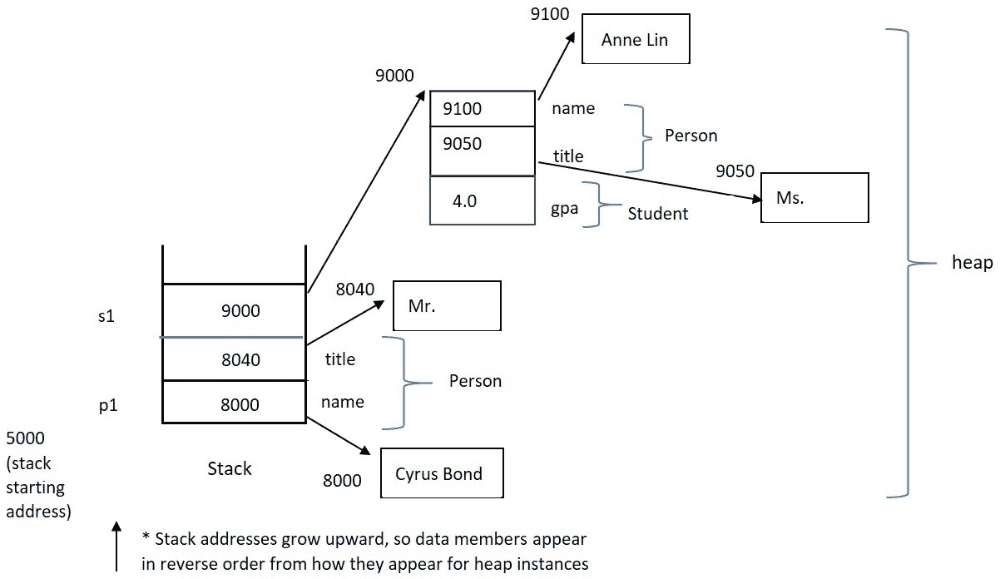

# 使用单继承实现层次结构

本章将扩展我们在 C++中追求面向对象编程的旅程。我们将从介绍额外的 OO 概念开始，例如**泛化**和**特化**，然后理解这些概念是如何通过*直接语言支持*在 C++中实现的。我们将开始构建相关类的层次结构，并理解每个类如何成为我们应用程序中更容易维护、可能可重用的构建块。我们将理解本章中提出的新 OO 概念将如何支持精心设计的计划，并且我们将清楚地理解如何使用健壮的 C++代码实现这些设计。

在本章中，我们将涵盖以下主要主题：

+   泛化和特化的面向对象概念，以及*Is-A*关系

+   单继承基础 – 定义派生类，访问继承成员，理解继承访问标签和区域，以及`final`类指定

+   单继承层次结构中的构造和析构序列；使用成员初始化列表选择基类构造函数

+   修改基类列表中的访问标签 – `public`与`private`和`protected`基类 – 以改变继承的 OO 目的为*实现继承*

到本章结束时，你将理解面向对象的概念，如泛化和特化，并了解如何将继承用于 C++，作为一种实现这些理想的机制。你将了解诸如基类和派生类等术语，以及构建层次结构时的 OO 动机，例如支持“是...的”关系或支持实现继承。

具体来说，你将理解如何使用单继承来扩展继承层次结构，以及如何访问继承的数据成员和成员函数。你还将理解基于它们定义的访问区域，你可以直接访问哪些继承成员。

你将理解在派生类类型的实例化和销毁时，构造函数和析构函数调用的顺序。你将知道如何利用成员初始化列表来选择派生类对象在其自身构造过程中可能需要利用的潜在继承构造函数组中的哪一个。

你还将理解如何通过改变基类列表中的访问标签来改变你正在构建的继承层次结构的 OO 含义。通过比较公共、私有和受保护的基类，你将理解不同类型的层次结构，例如那些用于支持“是...的”关系与那些用于支持实现继承的层次结构。

通过理解 C++中单继承的直接语言支持，你将能够实现泛化和特殊化的面向对象概念。你层次结构中的每个类都将是一个更容易维护的组件，并可以作为创建新的、更专业组件的潜在构建块。让我们通过详细说明单继承来进一步理解 C++作为面向对象语言。

# 技术要求

完整程序示例的在线代码可以在以下 GitHub URL 找到：[`github.com/PacktPublishing/Deciphering-Object-Oriented-Programming-with-CPP/tree/main/Chapter06`](https://github.com/PacktPublishing/Deciphering-Object-Oriented-Programming-with-CPP/tree/main/Chapter06)。每个完整程序示例都可以在 GitHub 上找到，位于相应章节标题（子目录）下的文件中，该文件以章节编号开头，后面跟着一个连字符，然后是本章中的示例编号。例如，本章的第一个完整程序可以在上述 GitHub 目录下的`Chapter06`子目录中找到，文件名为`Chp6-Ex1.cpp`。

本章的 CiA 视频可以在以下链接查看：[`bit.ly/3R7uNci`](https://bit.ly/3R7uNci)。

# 扩展面向对象概念和术语

在本节中，我们将介绍必要的面向对象概念，以及伴随这些关键思想的适用术语。

从*第五章*，*详细探索类*，你现在已经理解了封装和信息隐藏的关键面向对象思想，以及 C++如何通过类支持这些理念。现在，我们将探讨如何通过使用一个非常通用的类作为构建块，然后通过创建一个更具体的类来扩展该类，从而构建一个相关类的层次结构。通过以这种方式重复构建相关类的层次结构，面向对象系统提供了潜在的复用构建块。层次结构中的每个类都是封装的，因此对特定类的维护和升级可以更容易地进行，而不会影响整个系统。通过使用更具体和更详细的类逐步细化每个类，以构建相关类的层次结构，每个组件的特定维护集中在维护和变更的焦点区域。

让我们从扩展我们的基本面向对象术语开始。

## 解密泛化和特殊化

本章扩展的主要面向对象概念是*泛化*和*特殊化*。将这些原则纳入你的设计中，将为编写更易于修改和维护的代码，以及为可能在相关应用程序中复用的代码提供基础。

**泛化**描述了从一组类中抽象出共同性，并为该组创建一个更通用的类，以便容纳共同的属性和行为。这个更通用的类可以被称为**基类**（或**父类**）。泛化还可以用来将单个类的更通用属性和行为收集到一个基类中，期望这个新的、通用的类可以后来作为构建块或基础，用于创建更多、更具体的（派生）类。

**特殊化**描述了从现有的通用基类派生出一个新类的过程，目的是为了添加特定的、可区分的属性和行为，以便充分表示新类。这个特殊化的类也可以被称为**派生类**（或**子类**）。通过特殊化，类层次结构可以逐步细化各自的属性和行为。

虽然重用很难实现，但泛化和特殊化等面向对象的概念使得重用更容易获得。重用可以在性质相似的应用程序中、在同一项目领域中、在现有项目的延续中，或者在相关领域中实现，在这些领域中至少最通用的类和相关组件可以被重用。

构建层次结构是 C++语言的一个基本特性。让我们通过探索单继承来将这个想法付诸实践。

# 理解单继承基础

**继承**是 C++语言机制，它允许实现泛化和特殊化的概念。**单继承**是指一个给定的类恰好有一个直接基类。C++支持单继承和多继承；然而，在本章中，我们将专注于单继承，并在后面的章节中介绍多继承。

在 C++中，可以使用类和结构来构建继承层次结构。然而，类通常比结构更常用于支持继承和面向对象。

为了通用化和特殊化而构建的继承层次结构支持一个`Person`类和一个派生类`Student`，我们可以说*一个学生是一个人*。也就是说，`Student`是`Person`的一个特殊化，它在其基类`Person`提供的数据成员和成员函数之上添加了额外的数据成员和成员函数。通过泛化和特殊化指定 Is-A 关系是使用继承创建基类和派生类最典型的原因。在本章的后面，我们将探讨利用继承的另一个原因。

让我们从查看 C++语言机制开始，以指定基类和派生类并定义继承层次结构。

## 定义基类和派生类以及访问继承成员

在单继承中，派生类指定其直接祖先或基类是谁。基类不指定它有任何派生类。

派生类只需在其类名后添加一个`:`，然后跟上一个关键字`public`（目前是这样），最后是具体的基类名称。每当你在基类列表中看到`public`关键字时，这意味着我们正在使用继承来指定一个“是”关系。

这里有一个简单的例子来说明基本的语法：

+   `Student`是`Person`的派生类：

    ```cpp
    class Person  // base class
    {
    private:
        string name;
        string title;
    public:
        // constructors, destructor, 
        // public access functions, public interface etc.
        const string &GetTitle() const { return title; }
    };
    class Student: public Person  // derived class
    {
    private:
        float gpa;
    public:
        // constructors, destructor specific to Student,
        // public access functions, public interface, etc.
        float GetGpa() const { return gpa; }
    }; 
    ```

这里，基类是`Person`，派生类是`Student`。派生类只需定义额外的数据成员和成员函数，以增强基类中指定的那些。

派生类的实例通常可以访问由派生类或派生类的任何祖先指定的`public`成员。继承成员的访问方式与派生类指定的方式相同。回想一下，点符号（`.`）用于访问对象的成员，箭头符号（`->`）用于访问指向对象的指针的成员。

当然，为了使这个例子完整，我们需要添加适用的构造函数，我们目前假设它们存在。自然地，与构造函数相关的细微差别，我们将在本章的后续内容中讨论。

+   使用上述类，我们可以看到对继承成员的简单访问如下：

    ```cpp
    int main()
    {   
        // Let's assume the applicable constructors exist
        Person p1("Cyrus Bond", "Mr.");
        Student *s1 = new Student("Anne Lin", "Ms.", 4.0);
        cout << p1.GetTitle() << " " << s1->GetTitle();
        cout << s1->GetGpa() << endl;
        delete s1; // remember to relinquish alloc. memory
        return 0;
    }
    ```

在之前的代码片段中，由`s1`指向的`Student`派生类实例可以访问基类和派生类成员，例如`Person::GetTitle()`和`Student::GetGpa()`。`Person`基类实例`p1`只能访问其自身的成员，例如`Person::GetTitle()`。

查看前一个示例的记忆模型，我们有以下内容：



图 6.1 – 当前示例的内存模型

注意，在前面的内存模型中，`Student`实例由一个`Person`子对象组成。也就是说，在指示`*s1`开始的内存地址处，我们首先看到其`Person`数据成员的内存布局。然后，我们看到其额外的`Student`数据成员的内存布局。当然，`p1`，它是一个`Person`，只包含`Person`数据成员。

对基类和派生类成员的访问将受每个类指定的访问区域所约束。让我们看看继承的访问区域是如何工作的。

## 检查继承的访问区域

访问区域，包括继承的访问区域，定义了成员（包括继承成员）可以直接访问的范围。

派生类继承了其基类中指定的所有成员。然而，对这些成员的直接访问受基类中指定的访问区域所约束。

从 *基类* 继承的成员（数据和函数）可以通过基类施加的访问区域访问 *派生类*。继承的访问区域以及它们与派生类访问的关系如下：

+   在基类中定义的 **private** 成员在基类的作用域之外不可访问。类的作用域包括该类的成员函数。

+   在基类中定义的 **protected** 成员可以在基类的范围内以及派生类或其派生类的范围内访问。这意味着这些类的成员函数。

+   在基类中定义的 **public** 成员可以从任何作用域访问，包括派生类的作用域。

在前面的简单示例中，我们注意到一个 `Person` 实例和一个 `Student` 实例都从 `main()` 的作用域中调用了 `public` 成员函数 `Person::GetTitle()`。同样，我们也注意到 `Student` 实例从 `main()` 中调用了其 `public` 成员 `Student::GetGpa()`。通常，在给定类的范围之外，可访问的成员只有那些在公共接口中的成员，例如在这个例子中。

我们将在本章中很快看到一个更大的、完整的程序示例，展示 `protected` 访问区域。但首先，让我们发现一个可能有助于确定我们的继承层次结构形状和可扩展性的附加指定符。

## 指定类为最终

在 C++ 中，我们可以指示一个类在我们的继承层次结构中不能进一步扩展。这被称为在基类列表中使用 `final` 来指定一个类为 **final**（不可扩展）类或 **叶节点**。

这里有一个简单的示例来说明基本语法：

+   给定我们之前的基类 `Person`，`Student` 是 `Person` 的 *派生类*。此外，`GradStudent` 是 `Student` 的 *最终派生类*：

    ```cpp
    class GradStudent final: public Person // derived class
    {
       // class definition
    };
    ```

在这里，`GradStudent` 被指定为一个最终、不可扩展的类。因此，`GradStudent` 可能不会出现在新派生类的基础类列表中。

接下来，让我们回顾继承的构造函数和析构函数，以便我们即将到来的完整程序示例可以提供更大的整体效用。

# 理解继承的构造函数和析构函数

通过单继承，我们可以构建一个相关类的层次结构。我们已经看到，当我们实例化一个派生类对象时，其基类数据成员的内存随后是额外派生类数据成员所需的内存。每个这些子对象都需要被构造。幸运的是，每个类都将定义一套用于此目的的构造函数。然后我们需要了解语言如何被利用，以便在实例化和构造派生类对象时指定适当的基类构造函数。

同样地，当一个派生类类型的对象不再需要并被销毁时，需要注意的是，将隐式调用每个组成派生类实例的子对象的析构函数。

让我们看看单继承层次结构中的构造函数和析构函数的调用顺序，以及当在派生类实例中找到一个基类子对象时，如果存在多个构造函数可供选择，我们如何做出选择。

## 隐式构造函数和析构函数调用

构造函数和析构函数是两种派生类没有显式继承的成员函数。这意味着不能使用基类构造函数的签名来实例化派生类对象。然而，我们将看到，当实例化派生类对象时，将分别使用每个类的相应构造函数来单独初始化整体对象中的基类和派生类部分。

当实例化派生类类型的对象时，不仅会调用其构造函数，还会调用其所有先前基类的构造函数。最一般的基类构造函数首先执行，然后是层次结构中的所有构造函数，直到我们到达与当前实例类型相同的派生类构造函数。

同样地，当一个派生类实例超出作用域（或显式地释放了指向实例的指针）时，所有相关的析构函数都将被调用，但调用顺序与构造顺序相反。首先执行派生类析构函数，然后以向上递归的方式调用并执行每个先前基类的析构函数，直到达到最一般的基类。

你现在可能会问，在实例化派生类时，我如何从一组潜在的基类构造函数中选择我的基类子对象？让我们更详细地看看成员初始化列表，以发现解决方案。

## 使用成员初始化列表选择基类构造函数

成员初始化列表可以用来指定在实例化派生类对象时应该调用哪个基类构造函数。每个派生类构造函数可以指定使用不同的基类构造函数来初始化派生类对象中给定的基类部分。

如果派生类构造函数的成员初始化列表没有指定应该使用哪个基类构造函数，将调用默认的基类构造函数。

成员初始化列表是在派生类构造函数中的参数列表之后使用 `:` 指定的。为了指定应该使用哪个基类构造函数，可以指示基类构造函数的名称，后面跟着括号，包括要传递给该基类构造函数的任何值。根据基类名称之后基类列表中参数的签名，将选择合适的基类构造函数来初始化派生类对象中的基类部分。

这里有一个简单的例子来说明基类构造函数选择的基本语法：

+   让我们从基本的类定义开始（注意，省略了许多成员函数和一些常用的数据成员）：

    ```cpp
    class Person
    {
    private:
        string name;
        string title;
    public:
        Person() = default;  // various constructors
        Person(const string &, const string &); 
        Person(const Person &);
        // Assume the public interface, access fns. exist
    };
    class Student: public Person
    {
    private:
        float gpa = 0.0;  // use in-class initializer
    public:
        Student() = default;
        Student(const string &, const string &, float);
        // Assume the public interface, access fns. exist
    };
    ```

+   之前类定义的构造函数如下（注意两个派生类构造函数使用了成员初始化列表）：

    ```cpp
    // Base class constructors
    // Note: default constructor is included by = default
    // specification in Person constructor prototype
    Person::Person(const string &n, const string &t): 
                   name(n), title(t)
    {    
    }
    Person::Person(const Person &p): 
                   name(p.name), title(p.title)
    {   
    }
    // Derived class constructors
    // Note: default constructor is included by = default
    // specification in Student constructor prototype and
    // gpa is set with value of in-class initializer (0.0)

    Student::Student(const char *n, const char *t, 
                     float g): Person(n, t), gpa(g)
    {                    
    }                 

    Student::Student(const Student &s): Person(s),
                                        gpa(s.gpa)
    {                                  
    }
    ```

在之前的代码片段中，请注意，系统提供的默认派生类构造函数 `Student::Student()` 已经被选中，并在构造函数原型中添加了 `=default`。在这个类定义中有另一个构造函数，如果我们想支持这个简单的类实例化接口，这个指定（或者通过我们自己编写默认构造函数）是必要的。记住，我们只有在类定义中没有其他构造函数（即实例化方法）时，才会得到系统提供的默认构造函数。

接下来，请注意在替代派生类构造函数 `Student::Student(const string &, const string &, float)` 中，用于基类构造函数指定的成员初始化列表的使用。在这里，选择与 `Person::Person(const string &, const string &)` 签名匹配的 `Person` 构造函数来初始化当前的 `Person` 子对象。此外，请注意，从 `Student` 构造函数中传递的参数 `n` 和 `t` 被传递到上述 `Person` 构造函数中，以帮助完成 `Person` 子对象的初始化。如果我们没有在成员初始化列表中指定应该使用哪个 `Person` 基类构造函数，将使用默认的 `Person` 构造函数来初始化 `Student` 的 `Person` 基类子对象。此外，这个构造函数还使用了成员初始化列表来初始化在 `Student` 类定义中引入的数据成员（例如 `gpa`）。

现在，注意在派生类的复制构造函数`Student::Student(const Student &)`中，使用了成员初始化列表来选择`Person`的复制构造函数，将`s`作为参数传递给`Person`的复制构造函数。在这里，由`s`引用的对象是一个`Student`，然而，`Student`内存的上部包含`Person`的数据成员。因此，隐式地将`Student`提升为`Person`是可接受的，以便`Person`的复制构造函数初始化`Person`子对象。此外，在`Student`复制构造函数的成员初始化列表中，`Student`类定义中添加的额外数据成员被初始化，即通过初始化`gpa(s.gpa)`。这些额外的数据成员也可以在这个构造函数的主体中设置。

现在我们已经了解了如何利用成员初始化列表来指定基类构造函数，让我们继续一个完整的程序示例。

## 将所有部件组合在一起

到目前为止，在本章中，我们已经看到了许多贡献于一个完整的程序示例的片段。看到我们的代码在行动中，以及所有其各种组件，是很重要的。我们需要看到继承的基本机制，如何使用成员初始化列表来指定应该隐式调用的哪个基类构造函数，以及`protected`访问区域的重要性。

让我们看看一个更复杂、完整的程序示例，以充分说明单继承。这个示例将被分成几个部分；完整的程序可以在以下 GitHub 位置找到：

[`github.com/PacktPublishing/Deciphering-Object-Oriented-Programming-with-CPP/blob/main/Chapter06/Chp6-Ex1.cpp`](https://github.com/PacktPublishing/Deciphering-Object-Oriented-Programming-with-CPP/blob/main/Chapter06/Chp6-Ex1.cpp)

```cpp
#include <iostream>
#include <iomanip>
using std::cout;  // preferred to: using namespace std;
using std::endl;
using std::setprecision;
using std::string;
using std::to_string;
class Person
{
private: 
   // data members   
   string firstName; // str mbrs are default constructed,
   string lastName;  // so don't need in-class initializers
   char middleInitial = '\0';  // in-class initialization
   string title;  // Mr., Ms., Mrs., Miss, Dr., etc.
protected: // make avail. to derived classes in their scope
   void ModifyTitle(const string &); 
public:
   Person() = default;   // default constructor
   Person(const string &, const string &, char, 
          const string &);  
   // We get default copy constructor and destructor even
   // without the below protypes; hence, commented out
   // Person(const Person &) = default;  // def. copy ctor
   // ~Person() = default;  // use default destructor
   // inline function definitions
   const string &GetFirstName() const { return firstName; }  
   const string &GetLastName() const { return lastName; }    
   const string &GetTitle() const { return title; } 
   char GetMiddleInitial() const { return middleInitial; }
};
```

在前面的类定义中，我们现在有一个完整的`Person`类定义，比我们在这个部分以前使用的简单语法示例包含更多的细节。注意，我们引入了一个`protected`访问区域，并将成员函数`void ModifyTitle(const string &);`放置在这个访问区域中。

继续前进，让我们检查`Person`的非线成员函数定义：

```cpp
// Default constructor included with = default in prototype
// With in-class initialization, it is often not necessary
// to write the default constructor yourself.
// alternate constructor
Person::Person(const string &fn, const string &ln, char mi,
               const string &t): firstName(fn),
               lastName(ln), middleInitial(mi), title(t)
{
   // dynamically allocate memory for any ptr data members
}
// We are using default copy constructor; let's see what
// it would look like if we prototyped/defined it ourselves
// (so we may better understand an upcoming discussion with
// the upcoming derived class copy constructor). Also,
// this is what the system-supplied version may look like.
// Person::Person(const Person &p): firstName(p.firstName),
//    lastName(p.lastName), middleInitial(p.middleInitial),
//    title(p.title)
// {
        // deep copy any pointer data members here
// }
// Using default destructor – no need to write it ourselves
void Person::ModifyTitle(const string &newTitle)
{
   title = newTitle;
}
```

对于上述`Person`成员函数的实现是预期的。现在，让我们添加派生类`Student`的类定义，以及其内联函数定义：

```cpp
class Student: public Person
{
private: 
   // data members
   float gpa = 0.0;   // in-class initialization
   string currentCourse;  
   const string studentId;  // studentId is not modifiable
   static int numStudents; // static data mbr. init. occurs
public:                  // outside of the class definition
   // member function prototypes
   Student();   // we will provide default constructor
   Student(const string &, const string &, char, 
           const string &, float, const string &, 
           const string &); 
   Student(const Student &);  // copy constructor
   ~Student();  // we will provide destructor
   void Print() const;
   void EarnPhD();  // public interface to inherited 
                    // protected member
   // inline function definitions
   float GetGpa() const { return gpa; }
   const string &GetCurrentCourse() const 
       { return currentCourse; }
   const string &GetStudentId() const { return studentId; }
   // prototype only, see inline function definition below
   void SetCurrentCourse(const string &);
   static int GetNumberStudents(); // static mbr function
};
// definition for static data mbr. (implemented as extern)
int Student::numStudents = 0;  // notice initial value of 0
inline void Student::SetCurrentCourse(const string &c)
{
   currentCourse = c;
}
// Definition for static member function (it's also inline)
inline int Student::GetNumberStudents()
{
    return numStudents;
}
```

在`Student`的前面定义中，`class Student`使用`public`继承（即公共基类）从`Person`派生，这支持一个 Is-A 关系。注意在派生类定义中冒号后面的基类列表之后的`public`访问标签（即`class Student: public Person`）。注意，我们的`Student`类添加了比从`Person`自动继承的更多的数据成员和成员函数。

接下来，添加非内联的`Student`成员函数，我们继续扩展我们的代码：

```cpp
// Default constructor uses in-class init. for gpa, while
// currentCourse (string mbr object) is default constructed
Student::Student(): studentId(to_string(numStudents + 100) 
                              + "Id")
{
   // Since studentId is const, we need to initialize it 
   // during construction using member init list (above)
   // Also, remember to dynamically allocate memory for any 
   // pointer data mbrs. here (not needed in this example)
   numStudents++;   // increment static counter
}
// alternate constructor
Student::Student(const string &fn, const string &ln, 
                 char mi, const string &t, float avg, 
                 const string &course, const string &id):
            Person(fn, ln, mi, t),
            gpa(avg), currentCourse(course), studentId(id)
{
   // Remember to dynamically allocate memory for any 
   // pointer data members (none in this example) 
   numStudents++;   // increment static counter
}
// copy constructor 
Student::Student(const Student &s): Person(s), gpa(s.gpa),
                 currentCourse(s.currentCourse),
                 studentId(s.studentId)
{
   // deep copy any ptr data mbrs (none in this example)
   numStudents++;   // increment static counter
}

// destructor definition
Student::~Student()
{
   // Remember to release memory for any dynamically 
   // allocated data members (none in this example)
   numStudents--;  // decrement static counter
}
void Student::Print() const
{
   // Private members of Person are not directly accessible
   // within the scope of Student, so we use access fns. 
   cout << GetTitle() << " " << GetFirstName() << " ";
   cout << GetMiddleInitial() << ". " << GetLastName();
   cout << " with id: " << studentId << " gpa: ";
   cout << setprecision(2) << gpa;
   cout << " course: " << currentCourse << endl;
}
void Student::EarnPhD()
{
   // Protected members defined by the base class are
   // accessible within the scope of the derived class.
   // EarnPhd() provides a public interface to this
   // functionality for derived class instances. 
   ModifyTitle("Dr.");  
}
```

在上述代码段中，我们定义了`Student`的非内联成员函数。请注意，默认构造函数仅使用成员初始化列表来初始化一个数据成员，就像我们在上一章中所做的那样。由于在默认`Student`构造函数的成员初始化列表中没有指定`Person`构造函数，因此当使用默认构造函数实例化`Student`时，将使用默认的`Person`构造函数来初始化`Person`子对象。

接下来，`Student`类的替代构造函数使用成员初始化列表来指定应该使用`Person`的替代构造函数来构建给定`Student`实例中包含的`Person`子对象。请注意，所选构造函数将与签名`Person::Person(const string &, const string &, char, const string &)`匹配，并且从`Student`构造函数中选择的输入参数（即`fn`、`ln`、`mi`和`t`）将作为参数传递给`Person`的替代构造函数。然后，`Student`构造函数的成员初始化列表被用来初始化`Student`类引入的任何附加数据成员。

在`Student`类的复制构造函数中，成员初始化列表被用来指定应该调用`Person`的复制构造函数来初始化正在构建的`Student`实例的`Person`子对象。当调用`Person`的复制构造函数时，`Student &`将隐式地向上转换为`Person &`。回想一下，`Student`对象的上半部分是`Is-A` `Person`，所以这是可以的。接下来，在复制构造函数的剩余成员初始化列表中，我们初始化`Student`类定义的任何剩余数据成员。任何需要深度复制的数据成员（例如指针）可以在复制构造函数的主体中处理。

继续前进，我们看到一条注释，指出了`Student`析构函数。隐式地，作为此方法（无论析构函数是系统提供的还是用户编写的）的最后一行代码，编译器为我们修补了一个对`Person`析构函数的调用。这就是析构函数序列自动化的方式。因此，对象最专业的一部分，即`Student`部分，将首先被析构，然后是隐式调用`Person`析构函数来析构基类子对象。

接下来，在`Student`类的`Print()`方法中，请注意我们希望打印出从`Person`类继承的各种数据成员。唉，这些数据成员是`private`的。我们可能无法在`Person`类的作用域之外访问它们。然而，`Person`类为我们留下了一个公共接口，例如`Person::GetTitle()`和`Person::GetFirstName()`，这样我们就可以从应用程序的任何作用域中访问这些数据成员，包括从`Student::Print()`中访问。

最后，我们来到了 `Student::EarnPhD()` 方法。注意，这个方法所做的只是调用受保护的成员函数 `Person::ModifyTitle("Dr.");`。回想一下，由基类定义的 `protected` 成员在派生类的范围内是可访问的。`Student::EarnPhD()` 是派生类的一个成员函数。`EarnPhD()` 提供了一个公共接口来修改 `Person` 的头衔，可能是在检查学生是否满足毕业要求之后。因为 `Person::ModifyTitle()` 不是 `public`，所以 `Person` 或 `Student` 的实例必须通过受控的 `public` 接口来更改它们各自的头衔。这些接口可能包括 `Student::EarnPhD()` 或 `Person::GetMarried()` 等方法，等等。

尽管如此，让我们通过检查 `main()` 函数来完成我们的完整程序示例：

```cpp
int main()
{
    Student s1("Jo", "Li", 'U', "Ms.", 3.8, 
               "C++", "178PSU"); 
    // Public members of Person and Student are accessible
    // outside the scope of their respective classes....
    s1.Print();
    s1.SetCurrentCourse("Doctoral Thesis");
    s1.EarnPhD();
    s1.Print();
    cout << "Total number of students: " << 
             Student::GetNumberStudents() << endl;
    return 0;
}
```

在这个程序的最后一个部分 `main()` 中，我们简单地实例化了一个 `Student`，即 `s1`。`Student` 使用 `Student::Print()` 来打印其当前数据。然后 `Student` 将她的当前课程设置为 `"Doctoral Thesis"`，然后调用 `Student::EarnPhD();`。请注意，`Student` 或 `Person` 的任何 `public` 成员都可以在它们的作用域之外由 `s1` 使用，例如在 `main()` 中。为了完成这个示例，`s1` 使用 `Student::Print()` 重新打印她的详细信息。

下面是完整程序示例的输出：

```cpp
Ms. Jo U. Li with id: 178PSU gpa: 3.9 course: C++
Dr. Jo U. Li with id: 178PSU gpa: 3.9 course: Doctoral Thesis
Total number of students: 1
```

现在我们已经掌握了单继承的基本机制，并使用单继承来建模 Is-A 关系，让我们继续前进，看看如何通过探索 `protected` 和 `private` 基类来使用继承来建模不同的概念。

# 实现继承 – 改变继承的目的

到目前为止，我们展示了使用公共基类，也称为 *公共继承*。公共基类用于建模 Is-A 关系，并提供了构建继承层次结构的主要动机。这种用法支持泛化和特殊化的概念。

有时，继承可能被用作一种工具，通过另一个类来实现一个类，也就是说，一个类使用另一个类作为其底层实现。这被称为 **实现继承**，它不支持泛化和特殊化的理念。然而，实现继承可以提供一种快速且易于重用的方式来实现一个基于另一个类的类。它是快速且相对无错误的。许多类库在不知道其类用户的情况下使用这个工具。区分实现继承和传统的层次结构构建对于指定 Is-A 关系是有动机的。

C++支持实现继承，使用私有和受保护的基类，这是 C++独有的。其他面向对象编程语言选择只接受继承用于建模*Is-A*关系，这在 C++中通过公共基类得到支持。面向对象纯主义者会努力只使用继承来支持泛化和特殊化（*Is-A*）。然而，使用 C++，我们将了解实现继承的适当用途，以便我们能够明智地使用这种语言特性。

让我们继续前进，了解我们可能如何以及为什么利用这种类型的继承。

## 通过使用受保护的或私有的基类修改基类列表中的访问标记

再次强调，通常的继承类型是`public`继承。对于给定的派生类，基类列表中使用`public`标记。然而，在基类列表中，`protected`和`private`关键字也是可选项。

也就是说，除了在类或结构定义内标记访问区域外，访问标记还可以在派生类定义的基类列表中使用，以指定基类中定义的成员如何被派生类继承。

继承成员只能比在基类中指定的更严格。当派生类指定继承成员应以更严格的方式处理时，该派生类的任何后代也将受到这些规定的约束。

让我们快速看一下*基类列表*的例子：

+   回想一下，通常在基类列表中会指定一个`public`访问标记。

+   在这个例子中，使用`public`访问标记来指定`Person`是`Student`的`public`基类。也就是说，`Student`是`Person`的*一种*：

    ```cpp
    class Student: public Person
    {
        // usual class definition
    };
    ```

在*基类列表*中指定的访问标记将按以下方式修改继承的访问区域：

+   **公共的**：基类中的公共成员可以从任何范围访问；基类中的受保护成员可以从基类和派生类的范围访问。我们熟悉使用公共基类。

+   **受保护的**：基类中的公共和受保护成员的行为就像它们被派生类定义为受保护的（即，可以从基类和派生类的范围以及派生类后代的范围内访问）。

+   **私有的**：基类中的公共和受保护成员的行为就像它们被派生类定义为私有的，允许这些成员在派生类的范围内访问，但不能在任何派生类后代的范围内访问。

注意

在所有情况下，在类定义中将成员标记为私有的，只能在其定义的范围内访问。修改基类列表中的访问标记只能使继承成员更严格，而不能更宽松。

如果没有在基类中指定访问标签，当用户定义的类型是`class`时，将假定其为`private`，而当用户定义的类型是`struct`时，默认为`public`。一个很好的经验法则是，在派生类（或结构）定义的基类列表中始终包含访问标签。

## 创建基类以说明实现继承

要理解实现继承，让我们回顾一个可以作为其他类实现基础的基类。我们将检查一对典型的类来实现封装的`LinkList`。尽管这个例子将被分成几个部分，但完整的示例将展示出来，也可以在 GitHub 上找到：

[`github.com/PacktPublishing/Deciphering-Object-Oriented-Programming-with-CPP/blob/main/Chapter06/Chp6-Ex2.cpp`](https://github.com/PacktPublishing/Deciphering-Object-Oriented-Programming-with-CPP/blob/main/Chapter06/Chp6-Ex2.cpp)

```cpp
#include <iostream>
using std::cout;    // preferred to: using namespace std;
using std::endl;
using Item = int;  
class LinkListElement  // a 'node' or element of a LinkList
{
private:
    void *data = nullptr;   // in-class initialization
    LinkListElement *next = nullptr;
public:
    LinkListElement() = default;
    LinkListElement(Item *i) : data(i), next(nullptr) { }
    ~LinkListElement()
       { delete static_cast<Item *>(data); 
         next = nullptr; }
    void *GetData() const { return data; }
    LinkListElement *GetNext() const { return next; }
    void SetNext(LinkListElement *e) { next = e; }
};
class LinkList   // an encapsulated LinkList
{
private:
    LinkListElement *head = nullptr;  // in-class init.
    LinkListElement *tail = nullptr;
    LinkListElement *current = nullptr;
public:
    LinkList() = default; // required to keep default
                          // interface
    LinkList(LinkListElement *);
   ~LinkList();
    void InsertAtFront(Item *);
    LinkListElement *RemoveAtFront();
    void DeleteAtFront();
    int IsEmpty() const { return head == nullptr; } 
    void Print() const;  
};
```

我们从代码的前一部分开始，定义了`LinkListElement`和`LinkList`两个类的定义。`LinkList`类将包含指向`LinkList`中的`head`、`tail`和`current`元素的指针。这些指针的类型都是`LinkListElement`。它包括各种典型的`LinkList`处理方法，如`InsertAtFront()`、`RemoveAtFront()`、`DeleteAtFront()`、`IsEmpty()`和`Print()`。让我们快速浏览一下这些方法的实现，代码的下一部分将展示：

```cpp
// default constructor – not necessary to write it 
// ourselves with in-class initialization above 
LinkList::LinkList(LinkListElement *element)
{
    head = tail = current = element;
}
void LinkList::InsertAtFront(Item *theItem)
{
    LinkListElement *newHead = new
                               LinkListElement(theItem);
    newHead->SetNext(head);  // newHead->next = head;
    head = newHead;
}
LinkListElement *LinkList::RemoveAtFront()
{
    LinkListElement *remove = head;
    head = head->GetNext();  // head = head->next;
    current = head;    // reset current for usage elsewhere
    return remove;
}

void LinkList::DeleteAtFront()
{
    LinkListElement *deallocate;
    deallocate = RemoveAtFront();
    delete deallocate;  // destructor will both delete data 
}                       // and will set next to nullptr

void LinkList::Print() const
{
    if (!head)
       cout << "<EMPTY>";
    LinkListElement *traverse = head;
    while (traverse)
    {
        Item output = *(static_cast<Item *>
                        (traverse->GetData()));
        cout << output << " ";
        traverse = traverse->GetNext();
    }
    cout << endl;
}
LinkList::~LinkList()
{
    while (!IsEmpty())
        DeleteAtFront();
}
```

在之前提到的成员函数定义中，我们注意到`LinkList`可以构造为空或包含一个元素（注意有两个可用的构造函数）。`LinkList::InsertAtFront()`为了效率，将项目添加到列表的前面。`LinkList::RemoveAtFront()`移除一个项目并将其返回给用户，而`LinkList::DeleteAtFront()`移除并删除前面的项目。`LinkList::Print()`函数允许我们在必要时查看`LinkList`。

接下来，让我们看看一个典型的`main()`函数，以说明如何实例化和操作`LinkList`：

```cpp
int main()
{
    // Create a few items, to be data for LinkListElements
    Item *item1 = new Item;
    *item1 = 100;
    Item *item2 = new Item(200);
    // create an element for the Linked List
    LinkListElement *element1 = new LinkListElement(item1);
    // create a linked list and initialize with one element
    LinkList list1(element1);
    // Add some new items to the list and print
    list1.InsertAtFront(item2);   
    list1.InsertAtFront(new Item(50)); // add nameless item
    cout << "List 1: ";
    list1.Print();         // print out contents of list
    // delete elements from list, one by one
    while (!(list1.IsEmpty()))
    {
        list1.DeleteAtFront();
        cout << "List 1 after removing an item: ";
        list1.Print();
    }
    // create a second linked list, add some items, print
    LinkList list2;
    list2.InsertAtFront(new Item (3000));
    list2.InsertAtFront(new Item (600));
    list2.InsertAtFront(new Item (475));
    cout << "List 2: ";
    list2.Print();
    // delete elements from list, one by one
    while (!(list2.IsEmpty()))
    {
        list2.DeleteAtFront();
        cout << "List 2 after removing an item: ";
        list2.Print();
    }
    return 0;
}
```

在`main()`中，我们创建了一些类型为`Item`的项目，这些项目将后来成为`LinkListElement`的数据。然后我们实例化一个`LinkListElement`，即`element1`，并将其添加到一个新构建的`LinkList`中，使用`LinkList list1(element1);`。然后我们使用`LinkList::InsertAtFront()`向列表中添加几个项目，并调用`LinkList::Print()`来打印出`list1`作为基线。接下来，我们逐个从`list1`中删除元素，打印过程中使用`LinkList::DeleteAtFront()`和`LinkList::Print()`，分别进行。

现在，我们实例化第二个`LinkList`，即`list2`，它一开始是空的。我们逐渐使用`LinkList::InsertAtFront()`插入几个项目，然后打印列表，然后逐个使用`LinkList::DeleteAtFront()`删除每个元素，并在每个步骤中打印修改后的列表。

这个示例的目的不是详尽无遗地审查这段代码的内部工作原理。你无疑已经熟悉了`LinkedList`的概念。更重要的是，这个示例的目的是建立这一系列类，`LinkListElement`和`LinkList`，作为构建块集合，在这个集合中可以构建多个*抽象数据类型*。

然而，前面示例的输出如下：

```cpp
List 1: 50 200 100
List 1 after removing an item: 200 100
List 1 after removing an item: 100
List 1 after removing an item: <EMPTY>
List 2: 475 600 3000
List 2 after removing an item: 600 3000
List 2 after removing an item: 3000
List 2 after removing an item: <EMPTY>
```

接下来，让我们看看如何将`LinkedList`用作私有基类。

## 使用私有基类通过一个类实现另一个类

我们刚刚创建了一个`LinkList`类来支持封装的链表数据结构的基本处理。现在，让我们想象一下，我们想要实现`Push()`、`Pop()`、`IsEmpty()`，也许还有`Print()`。

你可能会问堆栈是如何实现的。答案是，实现方式并不重要，只要它支持所建模的 ADT（抽象数据类型）预期的接口即可。也许堆栈是通过数组实现的，也许它是通过文件实现的。也许它是通过`LinkedList`实现的。每种实现都有其优缺点。实际上，ADT 的底层实现可能会改变，但 ADT 的用户不应受到这种变化的影响。这就是*实现继承*的基础。派生类是在基类的基础上实现的，但派生出新类的基础类的底层细节实际上是被隐藏的。这些细节不能直接被派生类的实例（在这种情况下，ADT 的实例）使用。尽管如此，基类默默地为派生类提供了实现。

我们将使用这种方法，通过使用`LinkedList`作为其底层实现来实现`Stack`。为此，我们将使用`class Stack`通过一个`private`基类扩展`LinkedList`。`Stack`将为用户定义一个公共接口，以建立这个 ADT 的接口，例如`Push()`、`Pop()`、`IsEmpty()`和`Print()`。这些成员函数的实现将利用选定的`LinkedList`成员函数，但`Stack`的用户将看不到这一点，`Stack`的实例也不能直接使用任何`LinkedList`成员。

这里，我们并不是说`Stack` *是* `LinkedList`，而是说，目前`Stack`是通过`LinkedList`实现的——而且这种底层实现可能会改变！

实现`Stack`的代码很简单。假设我们正在使用前面示例中的`LinkList`和`LinkListElement`类。让我们在这里添加`Stack`类。完整的程序示例可以在我们的 GitHub 上找到：

[`github.com/PacktPublishing/Deciphering-Object-Oriented-Programming-with-CPP/blob/main/Chapter06/Chp6-Ex3.cpp`](https://github.com/PacktPublishing/Deciphering-Object-Oriented-Programming-with-CPP/blob/main/Chapter06/Chp6-Ex3.cpp)

```cpp
class Stack: private LinkList
{
private:
    // no new data members are necessary
public:  
    // Constructor / destructor prototypes shown below are
    // not needed; we get both without these prototypes! 
    // Commented to remind what's automatically provided
    // Stack() = default; // will call :LinkList() def ctor
    // ~Stack() = default; 
    // the public interface for Stack 
    void Push(Item *i) { InsertAtFront(i); }
    Item *Pop(); 
    // It is necessary to redefine these operations because
    // LinkList is a private base class of Stack
    int IsEmpty() const { return LinkList::IsEmpty(); }  
    void Print() { LinkList::Print(); }
};
Item *Stack::Pop()
{
    LinkListElement *top;
    top = RemoveAtFront();
    // copy top's data
    Item *item = new Item(*(static_cast<Item *>
                            (top->GetData())));
    delete top;
    return item;
}
int main()
{
    Stack stack1;    // create a Stack
    // Add some items to the stack, using public interface 
    stack1.Push(new Item (3000)); 
    stack1.Push(new Item (600));
    stack1.Push(new Item (475));
    cout << "Stack 1: ";
    stack1.Print();
    // Pop elements from stack, one by one
    while (!(stack1.IsEmpty()))
    {
        stack1.Pop();
        cout << "Stack 1 after popping an item: ";
        stack1.Print();
    }
    return 0;
} 
```

注意上述代码对于我们的`Stack`类是多么紧凑！我们首先指定`Stack`有一个`private`基类`LinkList`。回想一下，`private`基类意味着从`LinkList`继承的`protected`和`public`成员就像是由`Stack`定义的`private`一样（并且只可以在`Stack`的作用域内访问，即`Stack`的成员函数）。这意味着`Stack`的实例可能无法使用`LinkList`的*原有*公共接口。这也意味着`Stack`作为`LinkList`的底层实现实际上是隐藏的。当然，`LinkList`实例不会受到影响，并且可以像往常一样使用它们的`public`接口。

我们注意到`=default`已经被添加到`Stack`构造函数和析构函数的原型中。这两个方法都没有工作要做，因为我们没有向这个类添加任何数据成员；因此，默认的系统提供的版本是可以接受的。注意，如果我们省略了构造函数和析构函数的原型，我们将链接系统提供的两个版本。

我们很容易地将`Stack::Push()`定义为简单地调用`LinkList::InsertAtFront()`，就像`Stack::Pop()`所做的只是调用`LinkList::RemoveAtFront()`一样。尽管`Stack`很想简单地使用从`LinkList`继承的实现，但由于`LinkList`是一个`private`基类，这些函数不是`Stack`的公共接口的一部分。因此，`Stack`添加了一个简单的`IsEmpty()`方法，该方法仅调用`LinkList::IsEmpty();`。注意使用作用域解析运算符来指定`LinkList::IsEmpty()`方法；如果没有基类限定符，我们将会添加一个递归函数调用！这个调用基类方法是允许的，因为`Stack`成员函数可以调用`LinkList`的*一次公开*方法（它们现在在`Stack`内部被视为`private`）。同样，`Stack::Print()`仅仅调用`LinkList::Print()`。

在`main()`函数的作用域内，我们实例化了一个`Stack`，即`stack1`。使用`Stack`的公共接口，我们可以轻松地通过`Stack::Push()`、`Stack::Pop()`、`Stack::IsEmpty()`和`Stack::Print()`来操作`stack1`。

这个示例的输出如下：

```cpp
Stack 1: 475 600 3000
Stack 1 after popping an item: 600 3000
Stack 1 after popping an item: 3000
Stack 1 after popping an item: <EMPTY>
```

重要的是要注意，`Stack`实例的指针不能向上转换为存储为指向`LinkList`的指针。不允许跨越`private`基类边界的向上转换。这将允许`Stack`揭示其底层实现；C++不允许这种情况发生。在这里，我们看到`Stack`仅仅是基于`LinkList`实现的；我们并不是说`Stack` *是* `LinkedList`。这是实现继承的最佳概念；这个例子有利的说明了实现继承。

接下来，让我们继续前进，看看我们如何使用一个`protected`基类，以及它是如何通过实现继承与一个`private`基类不同的。

## 使用受保护的基类通过另一个类来实现一个类

我们刚刚使用`private`基类在`LinkList`的基础上实现了一个`Stack`。现在，让我们实现一个`Queue`和一个`PriorityQueue`。我们将使用`LinkList`作为`protected`基类来实现`Queue`，并使用`Queue`作为`public`基类来实现`PriorityQueue`。

再次强调，`Queue`和`PriorityQueue`都是抽象数据类型。`Queue`是如何实现的（相对）并不重要。底层的实现可能会改变。实现继承允许我们使用`LinkedList`来实现我们的`Queue`，而不向`Queue`类的用户透露底层的实现。

现在，我们的类`Queue`将使用`LinkedList`作为`protected`基类。`Queue`将为用户定义一个公共接口，以建立这个 ADT 的预期接口，例如`Enqueue()`、`Dequeue()`、`IsEmpty()`和`Print()`。这些成员函数的实现将利用选定的`LinkedList`成员函数，但`Queue`的用户将看不到这一点，`Queue`实例也不能直接使用任何`LinkList`成员。

此外，我们的类`PriorityQueue`将通过`public`继承来扩展`Queue`。没错，我们又回到了“是-一个”的关系。我们说`PriorityQueue`“是-一个”`Queue`，而`Queue`是通过`LinkedList`实现的。

我们将仅仅在我们的`PriorityQueue`类中添加一个优先级入队方法；这个类将很高兴地继承自`Queue`的`public`接口（但显然不是从`LinkList`继承，幸运的是，`LinkList`在其父级的级别上被隐藏在一个`protected`基类之后）。

实现`Queue`和`PriorityQueue`的代码同样简单直接。为了继续进行，`LinkList`基类需要增强以实现更完整的功能。`LinkListElement`类可以保持不变。我们将仅通过其类定义展示修订后的`LinkList`类的基本内容。`Queue`和`PriorityQueue`的完整代码将在单独的部分展示。完整的程序示例可以在我们的 GitHub 上找到：

[`github.com/PacktPublishing/Deciphering-Object-Oriented-Programming-with-CPP/blob/main/Chapter06/Chp6-Ex4.cpp`](https://github.com/PacktPublishing/Deciphering-Object-Oriented-Programming-with-CPP/blob/main/Chapter06/Chp6-Ex4.cpp)

```cpp
// class LinkListElement is as shown previously
// The enhanced class definition of LinkList is:
class LinkList
{
private:
    LinkListElement *head = nullptr;
    LinkListElement *tail = nullptr;
    LinkListElement *current = nullptr;
public:
    LinkList() = default;
    LinkList(LinkListElement *);
    ~LinkList();
    void InsertAtFront(Item *);  
    LinkListElement *RemoveAtFront();
    void DeleteAtFront();
    // Notice additional member functions added
    void InsertBeforeItem(Item *, Item *); 
    LinkListElement *RemoveSpecificItem(Item *);
    void DeleteSpecificItem(Item *);
    void InsertAtEnd(Item *);
    LinkListElement *RemoveAtEnd();
    void DeleteAtEnd();
    int IsEmpty() const { return head == nullptr; } 
    void Print() const;  
};
// Assume we have the implementation for the methods here…
```

注意到`LinkList`已经被扩展，具有更完整的功能集，例如能够在`LinkList`的各个位置添加、删除和删除元素。为了保持我们检查的代码简短，我们不会展示这些方法的实现。

现在，让我们在下一段代码中添加`Queue`和`PriorityQueue`的类定义：

```cpp
class Queue: protected LinkList
{
private:
    // no new data members are necessary
public: 
    // Constructor prototype shown below is not needed; 
    // we get default w/o prototype (since no other ctor)
    // Commented to remind what's automatically provided
    // Queue() = default;  // calls :LinkList() def. ctor
    // Destructor prototype is needed (per virtual keyword)
    virtual ~Queue() = default; // we'll see virtual Chp. 7
    // public interface of Queue
    void Enqueue(Item *i) { InsertAtEnd(i); }
    Item *Dequeue(); 
    // redefine these methods, LinkList is prot. base class
    int IsEmpty() const { return LinkList::IsEmpty(); }
    void Print() { LinkList::Print(); }
};
Item *Queue::Dequeue()
{
    LinkListElement *front;
    front = RemoveAtFront();
    // make copy of front's data
    Item *item = new Item(*(static_cast<Item *>
                            (front->GetData())));
    delete front; 
    return item;
}
class PriorityQueue: public Queue
{
private:
    // no new data members are necessary
public:
    // Constructor prototype shown below is not needed; 
    // we get default w/o protoype (since no other ctor)
    // Commented to remind what's automatically provided
    // PriorityQueue() = default; // calls :Queue() 
                                  // default constructor
    // destructor proto. is not needed for overriden dtor
    // ~PriorityQueue() override = default; // see Chp 7
    void PriorityEnqueue(Item *i1, Item *i2) 
    {  InsertBeforeItem(i1, i2); } // accessible in this 
};                                 // scope
```

在之前的代码段中，我们定义了`Queue`和`PriorityQue`类。请注意，`Queue`有一个`protected`基类`LinkList`。使用`protected`基类，从`LinkList`继承的`protected`和`public`成员表现得好像是由`Queue`作为`protected`定义的，这意味着这些继承成员不仅可以在`Queue`的作用域内访问，还可以在任何潜在的`Queue`后代中访问。和以前一样，这些限制仅适用于`Queue`类、其后代及其实例；`LinkList`类及其实例不受影响。

在`Queue`类中，不需要新的数据成员。内部实现由`LinkList`处理。使用`protected`基类，我们表示`Queue`是通过`LinkList`实现的。尽管如此，我们必须提供`Queue`的`public`接口，我们通过添加方法如`Queue::Enqueue()`、`Queue::Dequeue()`、`Queue::IsEmpty()`和`Queue::Print()`来实现。请注意，在这些方法的实现中，它们仅仅调用`LinkList`方法来执行必要的操作。`Queue`的使用者必须使用`Queue`的公共接口；`LinkList`的*曾经公开*接口对`Queue`实例是隐藏的。

接下来，我们定义`PriorityQueue`，另一个 ADT。请注意，`PriorityQueue`将`Queue`定义为`public`基类。我们回到了继承来支持 Is-A 关系。`PriorityQueue`*是*一个`Queue`，可以做到`Queue`能做的所有事情，只是更多一点。因此，`PriorityQueue`像往常一样从`Queue`继承，包括`Queue`的公共接口。`PriorityQueue`只需要添加一个额外的优先级入队方法，即`PriorityQueue::PriorityEnqueue()`。

由于`Queue`有一个`protected`基类`LinkList`，`LinkList`的`public`接口对`Queue`及其后代，包括`PriorityQueue`，被认为是`protected`的，这样`LinkList`的*曾经公开*方法对`Queue`和`PriorityQueue`都是`protected`的。请注意，`PriorityQueue::PriorityEnqueue()`使用了`LinkList::InsertBeforeItem()`。如果`LinkList`是`Queue`的`private`基类而不是`protected`基类，这将是不可能的。

在类定义和实现到位后，让我们继续我们的`main()`函数：

```cpp
int main()
{
    Queue q1;   // Queue instance
    q1.Enqueue(new Item(50));
    q1.Enqueue(new Item(67));
    q1.Enqueue(new Item(80));
    q1.Print();
    while (!(q1.IsEmpty()))
    {
        q1.Dequeue();
        q1.Print();
    }
    PriorityQueue q2;   // PriorityQueue instance
    Item *item = new Item(167); // save a handle to item
    q2.Enqueue(new Item(67));   // first item added
    q2.Enqueue(item);           // second item
    q2.Enqueue(new Item(180));  // third item
    // add new item before an existing item
    q2.PriorityEnqueue(new Item(100), item); // 4th item
    q2.Print();
    while (!(q2.IsEmpty()))
    {
       q2.Dequeue();
       q2.Print();
    }
    return 0;
}
```

现在，在`main()`中，我们实例化一个`Queue`，即`q1`，它使用`Queue`的公共接口。请注意，`q1`可能不会使用`LinkList`的*曾经公开*接口。`Queue`只能表现得像一个`Queue`，而不能像一个`LinkList`。`Queue`的 ADT 得到了保留。

最后，我们实例化一个`PriorityQueue`，即`q2`，它利用了`Queue`和`PriorityQueue`的公共接口，例如`Queue::Enqueue()`和`PriorityQueue::PriorityEnqueue()`。因为一个`Queue`*是*一个`PriorityQueue`（`Queue`是`public`基类），继承的典型机制就位，允许`PriorityQueue`利用其祖先的公共接口。

本例的输出如下：

```cpp
50 67 80
67 80
80
<EMPTY>
67 100 167 180
100 167 180
167 180
180
<EMPTY>
```

最后，我们看到了使用实现继承的两个示例；这并不是 C++中常用的特性。然而，你现在应该理解，如果你在库代码、你正在维护的应用代码中，或者在罕见的机会中，这种技术可能对你要遇到的编程任务有用，那么你会遇到`protected`或`private`基类。

`=default`的可选用途

我们已经看到了在构造函数和析构函数原型中使用`=default`来减轻用户提供此类方法定义的需求。然而，让我们回顾一下当构造函数（或析构函数）自动为我们提供时的一些指南。在这种情况下，使用构造函数或析构函数原型中的`=default`将具有更多文档性质，而不是要求；如果没有`=default`原型，我们将得到相同的系统提供的方法。

如果默认构造函数是一个类中唯一的构造函数，则不需要使用`=default`原型；回想一下，如果一个类没有构造函数，你将得到一个系统提供的默认构造函数（以提供实例化类的接口）。然而，如果类中有其他构造函数（不包括复制构造函数），并且你想要保持默认对象创建（构造）接口，则使用默认构造函数原型中的`=default`是至关重要的。对于复制构造函数，如果你使用的是系统提供的默认版本，你将得到这个方法，无论你是否使用`=default`原型或完全省略原型。同样，对于析构函数，如果系统提供的版本足够好，你将得到这个版本，无论你是否使用`=default`原型或完全省略原型；后者风格越来越普遍。

我们现在已经涵盖了 C++中单继承的基本特性。在进入下一章之前，让我们快速回顾一下我们已经覆盖的内容。

# 摘要

在本章中，我们继续我们的面向对象编程之旅。我们添加了额外的 OO 概念和术语，并看到了 C++如何直接支持这些概念。我们已经看到了 C++中的继承如何支持泛化和特殊化。我们已经看到了如何逐步构建相关类的层次结构。

我们已经看到了如何使用单继承来扩展继承层次结构，以及如何访问继承的数据成员和成员函数。我们已经回顾了访问区域，以了解哪些继承成员可以直接访问，这取决于成员在基类中定义的访问区域。我们知道，有一个`public`基类等同于定义了一个 Is-A 关系，这支持了泛化和特殊化的理念，这是继承最常用的原因。

我们已经详细说明了在实例化和销毁派生类类型实例时构造函数和析构函数调用的顺序。我们看到了成员初始化列表，以选择派生类对象可能选择利用作为其自身构造（其基类子对象）的一部分的继承构造函数。

我们已经看到，在基类列表中更改访问标签如何改变所使用的继承类型的面向对象意义。通过比较 `public` 与 `private` 和 `protected` 基类，我们现在理解了不同类型的层次结构，例如那些用于支持 Is-A 关系与那些用于支持实现继承的层次结构。

我们已经看到，在我们的层次结构中的基类可以作为更专用组件的潜在构建块，从而实现潜在的复用。任何现有代码的潜在复用都可以节省开发时间，并减少对其他重复代码的维护。

通过扩展我们的面向对象（OOP）知识，我们已经获得了一组与 C++ 中的继承和层次结构构建相关的初步技能。在掌握了单继承的基本机制后，我们现在可以继续学习更多有关继承的有趣面向对象概念和细节。继续阅读*第七章*，*通过多态利用动态绑定*，我们将接下来学习如何将方法动态绑定到相关类层次结构中的相应操作。

# 问题

1.  使用你的 *第五章*，*详细探索类* 的解决方案，创建一个 C++ 程序来构建继承层次结构，将 `Person` 作为基类从 `Student` 的派生类中泛化。

    1.  决定你的 `Student` 类中哪些数据成员和成员函数更通用，并且更适合放在 `Person` 类中。使用这些成员构建你的 `Person` 类，包括适当的构造函数（默认、替代和复制）、析构函数、访问成员函数和合适的公共接口。务必将数据成员放在私有访问区域。

    1.  使用 `public` 基类，从 `Person` 派生 `Student`。从 `Student` 中删除现在在 `Person` 中表示的成员。相应地调整构造函数和析构函数。根据需要使用成员初始化列表指定基类构造函数。

    1.  实例化多次 `Student` 和 `Person`，并利用每个的适当 `public` 接口。务必动态分配几个实例。

    1.  在每个构造函数和析构函数的第一行使用 `cout` 添加一条消息，以便您可以查看每个实例的构造和销毁顺序。

1.  （可选）使用在线代码作为基础，完成包括 `LinkList`、`Queue` 和 `PriorityQueue` 在内的类层次结构。完成 `LinkList` 类中的剩余操作，并在 `Queue` 和 `PriorityQueue` 的公共接口中适当地调用它们。

    1.  确保为每个类添加复制构造函数（或者在私有访问区域中对其进行原型化，或者如果你确实不希望允许复制，在原型中使用 `=delete` 来抑制复制）。

    1.  使用任一构造函数实例化 `LinkList`，然后演示你的每个操作是如何工作的。确保在添加或删除元素后调用 `Print()`。

    1.  实例化 `Queue` 和 `PriorityQueue`，并演示它们 `public` 接口中的每个操作都能正确工作。请记住，对于 `PriorityQueue` 的实例，也要演示 `Queue` 的 `public` 接口中继承的操作。
