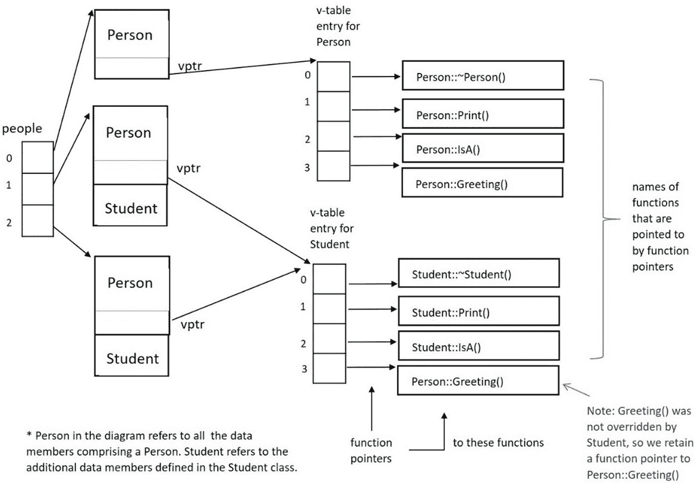

# 7

# 通过多态利用动态绑定

本章将进一步扩展我们对 C++面向对象编程的知识。我们将首先介绍一个强大的面向对象概念，即**多态**，然后理解这一想法是如何通过*直接语言支持*在 C++中实现的。我们将使用相关类的层次结构实现多态，并理解我们如何将特定派生类方法与更通用的基类操作进行运行时绑定。我们将理解本章中提出的面向对象的多态概念将如何支持 C++中的灵活和健壮的设计以及易于扩展的代码。

在本章中，我们将涵盖以下主要主题：

+   理解面向对象的多态概念及其在面向对象编程中的重要性

+   定义虚函数，理解虚函数如何覆盖基类方法（或使用`final`指定符来停止覆盖过程），泛化派生类对象，虚析构函数的需求，以及理解函数隐藏

+   理解方法到操作的动态（运行时）绑定

+   详细理解**虚函数表**（v-table）

在本章结束时，你将理解面向对象的多态概念，以及如何通过虚函数在 C++中实现这一想法。你将了解虚函数如何使 C++中的方法与操作在运行时绑定。你将看到如何在基类中指定一个操作，并在派生类中以首选实现覆盖它。你将理解何时以及为什么利用虚析构函数很重要。

你将看到派生类的实例通常是如何使用基类指针存储的，以及为什么这很重要。我们将发现，无论实例是如何存储的（作为其自身类型或基类类型），通过动态绑定，总是应用正确的虚函数版本。具体来说，你将看到在检查 C++中的虚函数指针和虚函数表时，运行时绑定是如何工作的。

通过理解 C++中多态的直接语言支持，即使用虚函数，你将朝着创建一个具有方法到操作动态绑定的可扩展类层次结构迈进。让我们通过详细阐述这些理念来加深我们对 C++作为面向对象编程语言的理解。

# 技术要求

完整程序示例的在线代码可以在以下 GitHub URL 中找到：[`github.com/PacktPublishing/Deciphering-Object-Oriented-Programming-with-CPP/tree/main/Chapter07`](https://github.com/PacktPublishing/Deciphering-Object-Oriented-Programming-with-CPP/tree/main/Chapter07)。每个完整程序示例都可以在 GitHub 的相应章节标题（子目录）下的文件中找到，该文件以章节编号开头，后面跟着一个连字符，然后是本章中的示例编号。例如，本章的第一个完整程序可以在上述 GitHub 目录下的`Chapter07`子目录中的`Chp7-Ex1.cpp`文件中找到。

本章的 CiA 视频可在以下网址查看：[`bit.ly/3QQUGxg`](https://bit.ly/3QQUGxg)。

# 理解面向对象的多态概念

在本节中，我们将介绍一个重要的面向对象概念，即多态性。

从*第五章*《详细探索类》和*第六章*《使用单一继承实现层次结构》中，你现在已经理解了关键面向对象思想：封装、信息隐藏、泛化和特殊化。你知道如何封装一个类，如何使用单一继承构建继承层次结构，以及构建层次结构的各种原因（例如支持“是”关系或较少使用的支持实现继承的原因）。让我们通过探索**多态性**来扩展我们的基本面向对象术语。

当基类指定一个操作，使得派生类可以在其类中以更合适的方法重新定义该操作时，该操作被称为**多态性**。让我们回顾一下**操作**和**方法**的定义，以及它们的含义，以了解这些概念如何为多态性奠定基础：

+   在 C++中，一个**操作**映射到成员函数的完整签名（名称加上类型和参数数量——没有返回类型）。

+   此外，在 C++中，一个**方法**映射到操作的定义或主体（即成员函数的实现或主体）。

+   回想一下，在面向对象术语中，一个**操作**实现了类的行为。基类操作的实现可能通过几个不同的派生类**方法**来完成。

`Student` *是* `Person`。然而，多态操作将允许在`Student`对象上揭示`Student`的行为，即使它们具有`Person`的*形式*。

随着我们进入本章，我们将看到派生类对象采取其公共基类的形式，即采取*多种形式*（**多态性**）。我们将看到如何在基类中指定多态操作，并在派生类中以首选实现覆盖它。

让我们首先看看 C++语言特性，它允许我们实现多态性，即虚函数。

# 使用虚函数实现多态

多态允许将方法动态绑定到操作。将方法动态或运行时绑定到操作很重要，因为派生类实例可能由基类对象（即基类类型的指针）指向。在这些情况下，指针类型不提供有关应应用于引用实例的正确方法的信息。我们需要另一种方式——在运行时完成——来确定适用于每个实例的方法。

通常情况下，派生类类型的实例指针会被泛化为基类类型的指针。当对指针执行操作时，应该应用适用于对象真正身份的正确方法，而不是适用于泛化指针类型的*看似*合适的方法。

让我们从定义虚函数所需的相关关键字和后勤开始，这样我们就可以实现多态。

## 定义虚函数和重写基类方法

**虚函数** 在 C++ 中直接支持多态。一个 **虚函数** 的定义如下：

+   一个成员函数允许在层次结构中连续重写给定操作的方法，以提供更合适的定义

+   一个成员函数允许动态绑定，而不是通常的静态绑定，用于方法

使用关键字 **virtual** 指定虚函数，以下是一些细微差别：

+   关键字 `virtual` 应该位于其原型中的函数返回类型之前。

+   在派生类中具有与任何祖先类中虚函数相同名称和签名的函数重新定义了这些基类中的虚函数。在这里，派生类原型中的关键字 `virtual` 是可选的。

+   可选且推荐，可以在派生类原型中作为扩展签名的一部分添加关键字 `override`。这种推荐做法将允许编译器在预期重写的函数签名与在基类中指定的签名不匹配时标记错误。`override` 关键字可以消除意外的函数隐藏。

+   在派生类中具有相同名称但不同签名的函数不会在它们的基类中重新定义虚函数；相反，它们隐藏了在它们的基类中找到的方法。

+   此外，如果所讨论的虚函数不打算在派生类中进一步重写，则可以将关键字 `final` 添加为虚函数原型的扩展签名的一部分。

如果继承的方法是合适的，派生类不需要重新定义其基类中指定的虚函数。然而，如果派生类使用新方法重新定义一个操作，则重写的函数必须使用相同的签名（由基类指定）。此外，派生类应仅重新定义虚函数。

这里有一个简单的例子来说明基本语法：

+   `Print()`是在基类`Person`中定义的虚函数。它将在`Student`类中被一个更合适的实现所覆盖：

    ```cpp
    class Person  // base class
    {
    private:
        string name;
        string title;
    public:
        // constructors/destructor (will soon be virtual), 
        // public access functions, public interface etc.
        virtual void Print() const
        {
            cout << title << " " << name << endl;
        }
    }; 
    ```

在这里，基类`Person`引入了一个虚函数`Print()`。通过将此函数标记为`virtual`，`Person`类正邀请任何未来的后代，如果他们有此动机，可以重新定义此函数以使用更合适的实现或方法。

+   在基类`Person`中定义的虚函数，实际上在`Student`类中被一个更合适的实现所覆盖：

    ```cpp
    class Student: public Person  // derived class
    {
    private:
        float gpa = 0.0;  // in-class initialization
    public:
        // constructors, destructor specific to Student,
        // public access functions, public interface, etc.
        void Print() const override 
        {
            Person::Print(); // call base class fn to help
            cout << " is a student. GPA: " << gpa << endl;
        }
    }; 
    ```

注意这里，派生类`Student`引入了一个新的`Print()`实现，这将覆盖（即替换）`Person`中的定义。请注意，如果`Person::Print()`的实现对`Student`来说是可接受的，即使它在基类中被标记为`virtual`，`Student`也没有义务覆盖这个函数。公共继承的机制将简单地允许派生类继承这个方法。

但因为此函数在`Person`中是`virtual`的，`Student`可以选择使用更合适的方法重新定义此操作。在这里，它确实这样做了。在`Student::Print()`实现中，`Student`首先调用`Person::Print()`以利用上述基类函数，然后打印额外的信息。`Student::Print()`选择调用基类函数以获得帮助；如果可以在其自己的类作用域内完全实现所需的功能，则不需要这样做。

注意，当`Student::Print()`被定义为覆盖`Person::Print()`时，使用了与基类中指定的相同签名。这一点很重要。如果使用了新的签名，我们可能会遇到潜在的功能隐藏场景，我们将在本章的*考虑功能隐藏*子节中很快讨论这个问题。

注意，尽管`Person`和`Student`中的虚函数是内联编写的，但编译器几乎永远不会将虚函数展开为内联代码，因为必须确定运行时的具体方法。存在少数编译器去虚化的情况，涉及 final 方法或知道实例的动态类型；这些罕见的情况将允许虚函数内联。

记住，多态函数旨在具有覆盖或替换给定函数的基类版本的能力。函数覆盖与函数重载不同。

重要区分

**函数覆盖**是通过在相关类的层次结构中引入具有相同签名的相同函数名来定义的（通过虚函数），而派生类版本旨在替换基类版本。相比之下，**函数重载**是在程序的同作用域内存在两个或更多具有相同名称但具有不同签名的函数时定义的（例如，在同一个类中）。

此外，在基类定义中最初未指定为虚函数的操作不是多态的，因此不应在任何派生类中覆盖。这意味着如果基类在定义操作时没有使用关键字 `virtual`，则基类不希望派生类用更合适的派生类方法重新定义此操作。相反，基类坚持它提供的实现适合其所有后代。如果派生类尝试重新定义一个非虚基类操作，应用程序中将会引入一个微妙的错误。错误在于，使用派生类指针存储的派生类实例将使用派生类方法，而使用基类指针存储的派生类实例将使用基类定义。实例应该始终使用它们自己的行为，而不管它们是如何存储的——这是多态的目的。永远不要重新定义非虚函数。

重要提示

在 C++ 中，未指定为虚函数的基类操作不是多态的，因此不应由派生类覆盖。

让我们继续前进，了解我们可能想要通过基类类型收集派生类对象的情况，以及我们可能需要将析构函数指定为虚函数的情况。

## 对派生类对象的泛化

当我们查看继承层次结构时，通常是一个使用公共基类的层次结构；也就是说，这是一个使用公共继承来表达“是”关系的层次结构。以这种方式使用继承时，我们可能会被激励将相关实例的组收集在一起。例如，`Student` 特殊化的层次结构可能包括 `GraduateStudent`、`UnderGraduateStudent` 和 `NonDegreeStudent`。假设这些派生类都有 `Student` 的公共基类，那么可以说一个 `GraduateStudent` 是 `Student` 的一个实例，依此类推。

我们可能在应用程序中找到一个理由将这些“某种程度上相似”的实例组合成一个共同的集合。例如，想象我们正在实现一个大学的计费系统。大学可能希望我们将所有学生，无论他们的派生类类型如何，都收集到一个集合中，以便统一处理，以便计算他们的学期账单。

`Student` 类可能有一个多态操作 `CalculateSemesterBill()`，该操作在 `Student` 类中以默认方法实现为一个虚函数。然而，选定的派生类，如 `GraduateStudent`，可能有自己的首选实现，他们希望通过在自己的类中用更合适的方法覆盖该操作来提供。例如，一个 `GraduateStudent` 可能有一个与 `NonDegreeStudent` 不同的方法来计算他们的总账单。因此，每个派生类都可能覆盖它们各自类中的 `CalculateSemesterBill()` 的默认实现。

尽管如此，在我们的出纳应用程序中，我们可以创建一组类型为 `Student` 的指针，尽管每个指针不可避免地会指向派生类类型的实例，例如 `GraduateStudent`、`UnderGraduateStudent` 和 `NonDegreeStudent`。当派生类类型的实例以这种方式泛化后，将函数（通常是虚拟函数）应用于集合中定义的基类级别对应指针类型是合适的。虚拟函数允许这些泛化实例调用多态操作，以产生它们各自的派生类方法或这些函数的实现。这正是我们想要的。但是，还有更多的细节需要理解。

将派生类实例泛化的这个基本前提将使我们理解为什么我们可能需要在许多类定义中包含虚拟析构函数。让我们看看。

## 利用虚拟析构函数

现在，我们可以设想将派生类实例分组到一个类似于由它们的共同基类类型存储的集合中的情况可能是有用的。实际上，通过基类类型收集同类型派生类实例并使用虚拟函数允许它们独特的表现是非常强大的。

但是，让我们考虑当存储在基类指针中的派生类实例的内存消失时会发生什么。我们知道它的析构函数被调用，但调用的是哪一个？实际上，我们知道会调用一系列析构函数，从问题中对象类型的析构函数开始。但如果实例已经被通过基类指针存储而泛化，我们如何知道实际的派生类对象类型？一个 **虚拟析构函数** 解决了这个问题。

通过将析构函数标记为 `virtual`，我们允许它成为类及其任何后代在销毁序列中的起始点。关于使用哪个析构函数作为销毁的入口点的选择将被推迟到运行时，使用动态绑定，基于对象的实际类型，而不是引用它的指针类型可能是什么。我们将很快通过检查 C++ 的底层虚拟函数表来了解这个过程是如何自动化的。

与所有其他虚拟函数不同，虚拟析构函数实际上指定了执行一系列函数的起始点。回想一下，作为析构函数中的最后一行代码，编译器会自动插入一个调用，调用直接基类的析构函数，依此类推，直到我们达到层次结构中的初始基类。销毁链的存在是为了提供一个论坛，以释放给定实例的所有子对象中的动态分配的数据成员。将这种行为与其他虚拟函数进行对比，那些虚拟函数仅仅允许执行函数的正确版本（除非程序员在派生方法实现期间选择调用基类版本的同一函数作为辅助函数）。

你可能会问为什么在适当级别开始销毁序列很重要。也就是说，从与对象实际类型匹配的级别开始（而不是可能指向对象的通用指针类型）。回想一下，每个类都可能有自己的动态分配的数据成员。析构函数将释放这些数据成员。从正确的级别开始使用析构函数将确保你不会通过省略适当的析构函数及其相应的内存释放操作，在你的应用程序中引入任何内存泄漏。

虚析构函数是否总是必要的？这是一个好问题！当使用公共基类层次结构时，即使用公共继承时，虚析构函数总是必要的。回想一下，公共基类支持“是...的”关系，这很容易导致允许派生类实例使用其基类类型的指针进行存储。例如，`GraduateStudent` 是 `Student` 的“是...的”，因此我们可以在需要更多通用处理及其兄弟类型的时候，将 `GraduateStudent` 存储为 `Student`。我们总是可以通过这种方式在公共继承边界上向上转换。然而，当我们使用实现继承（即私有或保护基类）时，不允许向上转换。因此，对于使用私有或保护继承的层次结构，虚析构函数不是必要的，因为向上转换是简单地被禁止的；因此，在私有和保护基类层次结构中的类，哪个析构函数应该是入口点将不会产生歧义。作为第二个例子，我们在*第六章*，“使用单一继承实现层次结构”中，没有包含我们的 `LinkedList` 类的虚析构函数；因此，`LinkedList` 应仅作为保护或私有基类进行扩展。然而，我们在 `Queue` 和 `PriorityQueue` 类中包含了虚析构函数，因为 `PriorityQueue` 将 `Queue` 作为公共基类使用。`PriorityQueue` 可以向上转换为 `Queue`（但不能转换为 `LinkedList`），这需要在层次结构中的 `Queue` 及其子级别引入虚析构函数。

在重写虚析构函数时，推荐使用可选的`virtual`和`override`关键字吗？这也是很好的问题。我们知道重写的析构函数只是销毁序列的起点。我们还知道，与其他虚函数不同，派生类析构函数将具有与基类析构函数不同的唯一名称。尽管派生类析构函数自动重写已声明为`virtual`的基类析构函数，但在派生类析构函数原型中使用可选的关键字`override`是为了文档化。然而，在派生类析构函数中使用可选的关键字`virtual`通常不再使用。其理由是`override`关键字旨在提供一个安全网，以捕获原始定义和重写函数之间的拼写错误。对于析构函数，函数名称并不相同，因此这个安全网不是错误检查的优势，而更多的是为了文档化。

让我们继续将所有必要的部件组合起来，这样我们就可以看到所有类型的虚函数，包括析构函数，在实际中的表现。

## 将所有部件组合在一起

到目前为止，在本章中，我们已经理解了虚函数的细微差别，包括虚析构函数。重要的是要看到我们的代码在实际操作中展现其所有各种组件和细节。我们需要在一个统一的程序中看到指定虚函数的基本语法，包括我们如何通过基类类型收集派生类实例，以及看到虚析构函数如何发挥作用。

让我们看看一个更复杂、完整的程序示例，以充分说明 C++中使用虚函数实现的多态性。这个示例将被分成多个部分；完整的程序可以在以下 GitHub 位置找到：

[`github.com/PacktPublishing/Deciphering-Object-Oriented-Programming-with-CPP/blob/main/Chapter07/Chp7-Ex1.cpp`](https://github.com/PacktPublishing/Deciphering-Object-Oriented-Programming-with-CPP/blob/main/Chapter07/Chp7-Ex1.cpp)

```cpp
#include <iostream>
#include <iomanip>
using std::cout;    //preferred to: using namespace std;
using std::endl;
using std::setprecision;
using std::string;
using std::to_string;
constexpr int MAX = 5;
class Person
{
private: 
    string firstName;
    string lastName;
    char middleInitial = '\0';  // in-class initialization
    string title;  // Mr., Ms., Mrs., Miss, Dr., etc.
protected:
    void ModifyTitle(const string &); 
public:
    Person() = default;   // default constructor
    Person(const string &, const string &, char, 
           const string &); 
    // copy constructor =default prototype not needed; we
    // get the default version w/o the =default prototype
    // Person(const Person &) = default;  // copy const.
    virtual ~Person();  // virtual destructor
    const string &GetFirstName() const 
        { return firstName; } 
    const string &GetLastName() const { return lastName; }
    const string &GetTitle() const { return title; } 
    char GetMiddleInitial() const { return middleInitial; }
    virtual void Print() const;
    virtual void IsA() const;  
    virtual void Greeting(const string &) const;
};
```

在上述类定义中，我们在熟悉的`Person`类中增加了四个虚函数，即析构函数（`~Person()`）、`Print()`、`IsA()`和`Greeting(const string &)`。请注意，我们只是简单地将关键字`virtual`放在每个成员函数的返回类型（如果有）之前。类定义的其余部分与我们之前深入探讨的内容相同。

现在，让我们来检查`Person`类的非内联成员函数定义：

```cpp
// With in-class initialization, writing the default
// constructor is no longer necessary. 
// Also, remember that strings are member objects and will 
// be default constructed as empty.
// alternate constructor
Person::Person(const string &fn, const string &ln, char mi,
               const string &t): firstName(fn),
               lastName(ln), middleInitial(mi), title(t)
{
    // dynamically allocate memory for any ptr data members 
}
// We are choosing to utilize the default copy constructor. 
// If we wanted to prototype/define it, here's the method:
// Person::Person(const Person &p):
//          firstName(p.firstName), lastName(p.lastName),
//          middleInitial(p.middleInitial), title(p.title)
// { 
    // deep copy any pointer data members here
// }
Person::~Person()
{
    // release memory for any dynamically alloc. data mbrs.
    cout << "Person destructor <" << firstName << " " 
         << lastName << ">" << endl;
}
void Person::ModifyTitle(const string &newTitle)
{   // assignment between strings ensures a deep assignment
    title = newTitle;     
}
void Person::Print() const
{
    cout << title << " " << firstName << " ";
    cout << middleInitial << ". " << lastName << endl;
}
void Person::IsA() const
{
    cout << "Person" << endl;
}
void Person::Greeting(const string &msg) const
{
    cout << msg << endl;
}
```

在之前的代码段中，我们已经指定了`Person`类的所有非内联成员函数。请注意，四个虚函数——析构函数、`Print()`、`IsA()`和`Greeting()`——在方法（即成员函数定义）本身中不包括`virtual`关键字。

接下来，让我们检查`Student`类的定义及其内联函数：

```cpp
class Student: public Person
{
private: 
    float gpa = 0.0;   // in-class initialization
    string currentCourse;
    const string studentId; 
    static int numStudents;  // static data member
public:
    Student();  // default constructor
    Student(const string &, const string &, char, 
            const string &, float, const string &, 
            const string &); 
    Student(const Student &);  // copy constructor
    ~Student() override;  // virtual destructor
    void EarnPhD();  
    // inline function definitions
    float GetGpa() const { return gpa; }
    const string &GetCurrentCourse() const
        { return currentCourse; }
    const string &GetStudentId() const 
        { return studentId; }
    void SetCurrentCourse(const string &); // proto. only

    // In the derived class, keyword virtual is optional, 
    // and not currently recommended. Use override instead.
    void Print() const final override;
    void IsA() const override;
    // note: we choose not to redefine 
    // Person::Greeting(const string &) const
    static int GetNumberStudents(); // static mbr. function
};
// definition for static data member 
int Student::numStudents = 0;  // notice initial value of 0
inline void Student::SetCurrentCourse(const string &c)
{
    currentCourse = c;
}
// Definition for static member function (it's also inline)
inline int Student::GetNumberStudents()
{
    return numStudents;
}
```

在之前为 `Student` 定义的类中，我们又看到了我们习惯看到的所有各种组件来构成这个类。此外，请注意，我们已经使用 `override` 关键字重写和重新定义了三个虚拟函数——析构函数、`Print()` 和 `IsA()`——这些首选定义基本上替换或覆盖了在基类中为这些操作指定的默认方法。

然而，请注意，我们选择不重新定义 `void Person::Greeting(const string &)`，这是在 `Person` 类中作为虚函数引入的。如果我们认为从基类继承的这个方法对 `Student` 类的实例来说是可接受的，简单地继承这个方法就足够了。此外，请注意 `Print()` 函数上额外的 `final` 标记。这个关键字表示 `Print()` 不能在 `Student` 的派生类中被重写；在 `Student` 层级上重写的方法将是最终的实现。

回想一下，当与析构函数配对时，`override` 的含义是独特的，因为它并不意味着派生类的析构函数替换基类的析构函数。相反，它意味着当由派生类实例（无论它们如何存储）启动时，派生类（虚拟）析构函数是 *销毁链* 序列的正确起点。虚拟派生类析构函数仅仅是完整销毁序列的入口点。

还要记住，`Student` 的派生类不必须重写 `Person` 中定义的虚函数。如果 `Student` 类认为基类的方法是可接受的，它将自动继承。虚函数仅仅允许派生类在需要时用更合适的方法重新定义一个操作。

接下来，让我们检查非内联的 `Student` 类成员函数：

```cpp
Student::Student(): studentId(to_string(numStudents + 100) 
                                        + "Id")
{
   // studentId is const; we need to set at construction. 
   // We're using member init list with a unique id based
   // on numStudents + 100), concatenated with string "Id".
   // Remember, string member currentCourse will be default
   // const. with an empty string (it's a member object)
   numStudents++;     // set static data member
}
// Alternate constructor member function definition
Student::Student(const string &fn, const string &ln, 
                 char mi, const string &t, float avg, 
                 const string &course, const string &id):
                 Person(fn, ln, mi, t), gpa(avg),
                 currentCourse(course), studentId(id)
{
   // dynamically alloc memory for any pointer data members
   numStudents++;
}
// Copy constructor definition
Student::Student(const Student &s) : Person(s),
                gpa(s.gpa), currentCourse(s.currentCourse),
                studentId(s.studentId)
{
   // deep copy any pointer data mbrs of derived class here
   numStudents++;
}

// destructor definition
Student::~Student()
{
    // release memory for any dynamically alloc. data mbrs
    cout << "Student destructor <" << GetFirstName() << " "
         << GetLastName() << ">" << endl;
}
void Student::EarnPhD()
{
    ModifyTitle("Dr.");  
}
void Student::Print() const
{   // need to use access functions as these data members 
    // are defined in Person as private
    cout << GetTitle() << " " << GetFirstName() << " ";
    cout << GetMiddleInitial() << ". " << GetLastName();
    cout << " with id: " << studentId << " GPA: ";
    cout << setprecision(3) <<  " " << gpa;
    cout << " Course: " << currentCourse << endl;
}
void Student::IsA() const
{
    cout << "Student" << endl;
}
```

在之前列出的代码部分中，我们列出了 `Student` 的非内联成员函数定义。再次注意，关键字 `override` 不会出现在任何虚拟成员函数的定义本身中，只出现在它们各自的原型中。

最后，让我们检查 `main()` 函数：

```cpp
int main()
{
    Person *people[MAX] = { }; // initialize with nullptrs
    people[0] = new Person("Juliet", "Martinez", 'M',
                           "Ms.");
    people[1] = new Student("Hana", "Sato", 'U', "Dr.",
                            3.8, "C++", "178PSU"); 
    people[2] = new Student("Sara", "Kato", 'B', "Dr.",
                            3.9, "C++", "272PSU"); 
    people[3] = new Person("Giselle", "LeBrun", 'R',
                           "Miss");
    people[4] = new Person("Linus", "Van Pelt", 'S',
                           "Mr.");
    // We will soon see a safer and more modern way to loop
    // using a range for loop (starting in Chp. 8). 
    // Meanwhile, let's notice mechanics for accessing 
    // each element.
    for (int i = 0; i < MAX; i++)   
    {
       people[i]->IsA();
       cout << "  ";
       people[i]->Print();
    } 
    for (int i = 0; i < MAX; i++)
       delete people[i];   // engage virtual dest. sequence
    return 0;
}
```

在这里，在 `main()` 函数中，我们声明了一个指向 `Person` 的指针数组。这样做，使我们能够将 `Person` 和 `Student` 实例都收集在这个集合中。当然，我们可以应用于存储在这种通用方式中的实例的唯一操作是那些在基类 `Person` 中找到的操作。

接下来，我们分配几个`Person`和几个`Student`实例，通过指针集合的元素存储每个实例。当以这种方式存储`Student`时，会执行向上转换到基类类型（但实例不会被任何方式改变）。回想一下，当我们查看派生类实例的内存布局时，在*第六章*中，*使用单一继承实现层次结构*，我们注意到`Student`实例首先包含`Person`的内存布局，然后是`Student`数据成员所需额外的内存。这种向上转换仅仅指向这个集合内存的起始点。

现在，我们通过循环应用在`Person`类中找到的操作，将这些泛化集合中的所有实例都应用上。这些操作恰好是多态的。也就是说，虚函数允许通过运行时绑定调用特定方法的实现，以匹配实际的对象类型（无论对象是否存储在泛化指针中）。

最后，我们再次通过循环删除`Person`和`Student`的动态分配的实例，再次使用泛化的`Person`指针。因为我们知道`delete()`会插入对析构函数的调用，所以我们明智地使析构函数`virtual`，以便动态绑定选择每个对象的适当起始析构函数（在析构链中）。

当我们查看上述程序的输出时，我们可以看到每个对象的特定方法都适当地调用了每个虚函数，包括析构序列。派生类对象既调用了派生类，也调用了基类析构函数并执行了它们。以下是完整程序示例的输出：

```cpp
Person
  Ms. Juliet M. Martinez
Student
  Dr. Hana U. Sato with id: 178PSU GPA:  3.8 Course: C++
Student
  Dr. Sara B. Kato with id: 272PSU GPA:  3.9 Course: C++
Person
  Miss Giselle R. LeBrun
Person
  Mr. Linus S. Van Pelt
Person destructor <Juliet Martinez>
Student destructor <Hana Sato>
Person destructor <Hana Sato>
Student destructor <Sara Kato>
Person destructor <Sara Kato>
Person destructor <Giselle LeBrun>
Person destructor <Linus Van Pelt>
```

现在我们已经掌握了利用多态概念和虚函数机制的能力，让我们看看与虚函数相关的一个不太常见的情况，即函数隐藏。

## 考虑函数隐藏

**函数隐藏**不是 C++中常用的特性。实际上，它经常是意外使用的！让我们回顾一下关于继承成员函数的一个关键点，以便开始。当一个操作由基类指定时，它旨在为所有派生类方法提供使用协议和重定义（在虚函数的情况下）。

有时，派生类会改变一个旨在重定义基类指定的操作（让我们考虑虚函数）的方法的签名。在这种情况下，与祖先类中指定的操作不同的新函数将不会被考虑为对继承操作的虚拟重定义。实际上，它将*隐藏*具有在祖先类中指定相同名称的虚函数的继承方法。

当程序编译时，每个函数的签名都会与类定义进行比较，以确保正确使用。通常情况下，当在看似与实例类型匹配的类中找不到成员函数时，会向上遍历层次结构，直到找到匹配项或遍历完整个层次结构。让我们更仔细地看看编译器考虑的内容：

+   当找到一个与正在寻找的函数具有相同名称的函数时，会检查签名以确定它是否与函数调用完全匹配，或者是否可以应用类型转换。当找到函数但无法应用类型转换时，正常的遍历序列结束。

+   通常，隐藏虚拟函数的函数会停止向上搜索序列，从而隐藏了否则可能被调用的虚拟函数。记住，在编译时，我们只是在检查语法（而不是决定调用虚拟函数的哪个版本）。但如果找不到匹配项，则会标记错误。

+   函数隐藏实际上被认为是有所帮助的，并且是语言设计者意图的。如果类设计者提供了一个具有特定签名和接口的特定函数，那么应该使用该函数来处理该类型的实例。在层次结构中隐藏或未预料到的函数不应在此特定场景中使用。

考虑以下对我们之前完整程序示例的修改，首先说明函数隐藏，然后提供一个更灵活的解决方案来管理函数隐藏：

+   记住，`Person` 类引入了不带参数的 `virtual void Print()`。想象一下，`Student` 类不是使用相同的签名覆盖 `Print()`，而是将其更改为 `virtual void Print(const char *)`：

    ```cpp
    class Person  // base class
    {
        // data members
    public:  // member functions, etc. 
        virtual void Print() const;  
    };
    class Student: public Person
    {
        // data members
    public:  // member functions, etc.
        // Newly introduced virtual fn. -- 
        // Not a redefinition of Person::Print()
        virtual void Print(const string &) const;
    };
    ```

注意，`Print()` 的签名已从基类更改为派生类。派生类函数并没有重新定义其基类的 `virtual void Print();`。这是一个实际上会隐藏 `Person::Print()` 存在的新函数。这正是预期的结果，因为你可能不记得基类提供了这样的操作，如果在你的应用中意图调用 `Print(const string &)` 但实际上调用的是 `Print()`，向上跟踪可能会在你的应用中产生令人惊讶的结果。通过添加这个新函数，派生类设计者指定了这个接口是 `Student` 实例的适当 `Print()`。

然而，在 C++中没有什么事情是直截了当的。对于将`Student`向上转换为`Person`的情况，将调用无参数的`Person::Print()`。`Student::Print(const string &)`不是虚拟重定义，因为它没有相同的签名。因此，对于泛化的`Student`实例，将调用`Person::Print()`。而对于存储在`Student`变量中的`Student`实例，将调用`Student::Print(const string &)`。不幸的是，这与实例存储在其自身类型与泛化类型中的行为不一致。尽管函数隐藏旨在以这种方式工作，但它可能不可避免地不是你希望发生的事情。程序员，小心！

让我们看看可能随之而来的繁琐代码：

+   可能需要显式回溯或使用作用域解析运算符来揭示其他隐藏的功能：

    ```cpp
    constexpr int MAX = 2;
    int main()
    { 
        Person *people[MAX] = { }; // init. with nullptrs
        people[0] = new Person("Jim", "Black", 'M',
                               "Mr.");
        people[1] = new Student("Kim", "Lin", 'Q', "Dr.",
                                3.55, "C++", "334UD"); 
        people[1]->Print(); // ok, Person::Print() defined
        // people[1]->Print("Go Team!"); // error!
        // explicit downcast to derived type assumes you
        // correctly recall what the object is
        (dynamic_cast<Student *> (people[1]))->
                                 Print("I have to study");
        // Student stored in its own type
        Student s1("Jafari", "Kanumba", 'B', "Dr.", 3.9,
                   "C++", "845BU"); 
        // s1.Print(); // error, base class version hidden
        s1.Print("I got an A!"); // works for type Student
        s1.Person::Print(); // works using scope 
                          // resolution to base class type
        return 0;
    }
    ```

在上述示例中，我们有一个泛型集合的两个`Person`指针。一个条目指向一个`Person`，另一个条目指向一个`Student`。一旦`Student`被泛化，唯一适用的操作是那些在`Person`基类中找到的操作。因此，调用`people[1]->Print();`是有效的，而调用`people[1]->Print("Go Team!");`则不工作。后者的`Print(const char *)`调用在泛化基类级别是错误的，尽管对象确实是一个`Student`。

如果，从一个泛型指针中，我们希望调用在层次结构中的`Student`级别的特定函数，那么我们需要将实例回溯到其自身类型（`Student`）。我们通过以下调用添加回溯：`(dynamic_cast<Student *>(people[1]))->Print("I have to study");`。在这里，我们正在承担风险——如果`people[1]`实际上是一个`Person`而不是`Student`，这将生成运行时错误。然而，通过在调用`Print()`之前首先检查动态转换到`Student *`的结果，我们可以确保我们进行了适当的转换。

接下来，我们实例化`Student s1;`。如果我们尝试调用`s1.Print()`，我们会得到编译器错误——`Student::Print(const string &)`隐藏了基类中`Person::Print()`的存在。记住，`s1`存储在其自身类型`Student`中，并且由于找到了`Student::Print(const string &)`，向上遍历以揭示`Person::Print()`的过程被终止。

然而，我们的`s1.Print("I got an A!");`调用是成功的，因为`Print(const string &)`在`Student`类级别被找到。最后，请注意，调用`s1.Person::Print();`是有效的，但需要了解其他隐藏的功能。通过使用作用域解析运算符（`::`），我们可以找到基类版本的`Print()`。尽管`Print()`在基类中是虚拟的（意味着动态绑定），但使用作用域解析运算符会将此调用回退为静态绑定函数调用。

让我们提出，我们想要向派生类添加一个新接口，该接口将隐藏基类函数。了解函数隐藏后，我们理想上应该怎么做？我们可以简单地使用基类中的虚拟函数，在派生类中用新的方法覆盖它，然后我们可以重载该函数以添加额外的接口。是的，我们现在既覆盖又重载。也就是说，我们覆盖了基类函数，并在派生类中重载了被覆盖的函数。

让我们看看我们现在会有什么：

+   这里是更灵活的接口，在保持现有接口（否则会被隐藏）的同时添加新成员函数：

    ```cpp
    class Person  // base class
    {
        // data members
    public:  // member functions, etc.
        virtual void Print() const;
    };
    class Student: public Person
    {
        // data members
    public:  // member functions, etc.
        // Override the base class method so that this
        // interface is not hidden by overloaded fn. below
        void Print() const override; 
        // add the additional interface 
        // (which is overloaded)
        // Note: this additional Print() is virtual
        // from this point forward in the hierarchy
        virtual void Print(const string &) const; 
    };
    int main()
    {
        Student s1("Zack", "Doone", 'A', "Dr.", 3.9,
                   "C++", "769UMD"); 
        s1.Print();  // this version is no longer hidden.
        s1.Print("I got an A!"); // also works
        s1.Person::Print(); // this is no longer necessary
    }
    ```

在前面的代码片段中，`Student` 类既用 `Student::Print()` 覆盖了 `Person::Print()`，又用 `Student::Print(const string &)` 重载了 `Student::Print()` 以包含额外的所需接口。现在，对于存储在 `Student` 变量中的 `Student` 对象，两个接口都是可用的——基类接口不再被隐藏。当然，由 `Person` 指针引用的 `Student` 对象只有 `Person::Print()` 接口，这是预期的。

总体来说，函数隐藏并不常见，但一旦发生，通常是一个不受欢迎的惊喜。现在你了解了可能发生的情况以及原因，这有助于你成为一个更好的程序员。

现在我们已经看到了围绕虚拟函数的所有用途，让我们看看内部机制，了解为什么虚拟函数能够支持将特定方法绑定到操作。为了彻底理解运行时绑定，我们需要查看 v-table。让我们继续前进！

# 理解动态绑定

现在我们已经看到了如何通过虚拟函数实现多态，以允许将操作动态绑定到特定的实现或方法，让我们了解为什么虚拟函数允许运行时绑定。

非虚拟函数在编译时进行静态绑定。也就是说，所涉及函数的地址是在编译时确定的，基于当前对象假设的类型。例如，如果创建了一个类型为 `Student` 的对象，函数调用会从 `Student` 类开始验证其原型，如果找不到，则会遍历层次结构向上到每个基类，如 `Person`，以查找匹配的原型。找到后，正确的函数调用会被修补。这就是静态绑定的工作方式。

然而，虚函数是 C++中一种在运行时使用动态绑定的函数类型。在编译时，任何虚函数调用都仅被替换为一个查找机制，以延迟绑定到运行时。当然，每个编译器供应商在自动实现虚函数方面可能会有所不同。然而，有一个广泛使用的实现涉及虚函数指针、虚函数表以及包含虚函数的每个对象类型的虚函数表条目。

让我们继续前进，研究 C++中动态绑定通常是如何实现的。

## 理解方法到操作的运行时绑定

我们知道虚函数允许将操作（在基类中指定）动态绑定到特定的实现或方法（通常在派生类中指定）。这是如何工作的？

当基类指定一个或多个新虚函数（不仅仅是祖先虚函数的重定义）时，会在该类型给定实例的内存下方创建一个**虚函数指针**（**vptr**）。这发生在创建实例内存时（在栈上、堆上或静态/外部区域）。当构造特定实例时，不仅会调用适当的构造函数来初始化实例，而且这个 vptr 将被初始化，指向该类类型的**虚函数指针表**（**v-table**）条目。

给定类类型的虚函数表条目将包含一组函数指针。这些函数指针通常组织成一个函数指针数组。**函数指针**是指向实际函数的指针。通过解引用这个指针，你实际上会调用该指针指向的函数。虽然有机会向函数传递参数，但是为了使通过函数指针的调用通用，参数必须对指针可能指向的该函数的任何版本都是统一的。函数指针的前提为我们提供了指向特定函数不同版本的能力。也就是说，我们可以指向给定操作的不同的方法。这是 C++中自动化虚函数动态绑定的基础。

让我们考虑特定对象类型的特定虚函数表条目。我们知道这个表条目将包含一组函数指针，例如一个函数指针数组。这些函数指针的排列顺序将与给定类新引入的虚函数的顺序一致。在层次结构中较高级别新引入的覆盖现有虚函数的函数将简单地用要调用的函数的优选版本替换表条目，但不会在函数指针数组中分配额外的条目。

因此，当程序开始运行时，首先在全局内存中（作为一个隐藏的外部变量），将设置一个 v-table。这个表将包含包含虚拟函数的每个对象类型的条目。给定对象类型的条目将包含一组函数指针（例如函数指针数组），它组织和初始化该类动态绑定的函数。函数指针的具体顺序将对应于虚拟函数被引入的顺序（可能由其祖先类引入），并且特定的函数指针将被初始化为针对特定类类型的函数的优选版本。也就是说，函数指针可能指向在它们自己的类级别指定的重写方法。

然后，当给定类型的对象被实例化时，该对象内的 vptr（对于每个新引入的子对象级别的新虚拟函数 – 不是重新定义的虚拟函数 – 将有一个）将被设置为指向该实例的相应 v-table 条目。

通过代码和内存图查看这个细节将非常有用。让我们揭开盖子，看看代码是如何运行的！

## 详细解释 v-table

为了详细说明内存模型并查看在运行时将设置的底层 C++ 机制，让我们考虑本节中的详细完整程序示例，其中基类为 `Person`，派生类为 `Student`。作为提醒，我们将展示程序的关键元素：

+   `Person` 和 `Student` 类的简略定义（为了节省空间，我们将省略数据成员和大多数成员函数的定义）：

    ```cpp
    class Person
    {
    private:   // data members will be as before
    protected: // assume all member funcs. are as before,
    public:  // but we will show only virtual funcs. here
        virtual ~Person();       // 4 virt fns introduced 
        virtual void Print() const;  // in Person class
        virtual void IsA() const;  
        virtual void Greeting(const string &) const;
    };
    class Student: public Person
    {
    private:  // data members will be as before
    public:   // assume all member funcs. are as before, 
        // but we will show only virtual functions here
        ~Student() override;  // 3 virt fns are overridden
        void Print() const override;
        void IsA() const override;
    };
    ```

`Person` 和 `Student` 类的定义符合预期。假设数据成员和成员函数与完整程序示例中所示相同。为了简洁，我们只包括了在每个级别引入或重新定义的虚拟函数。

+   以简略形式回顾 `main()` 函数的关键元素（简化为三个实例）：

    ```cpp
    constexpr int MAX = 3;
    int main()
    {
        Person *people[MAX] = { }; // init. with nullptrs
        people[0] = new Person("Joy", "Lin", 'M', "Ms.");
        people[1] = new Student("Renee", "Alexander", 'Z',
                        "Dr.", 3.95, "C++", "21-MIT"); 
        people[2] = new Student("Gabby", "Doone", 'A', 
                        "Ms.", 3.95, "C++", "18-GWU"); 
        // In Chp. 8, we'll upgrade to a range for loop
        for (int i = 0; i < MAX; i++)
        {                 // at compile time, modified to:
            people[i]->IsA();  // *(people[i]->vptr[2])()
            people[i]->Print();
            people[i]->Greeting("Hello");
            delete people[i];
        }
        return 0;
    }
    ```

注意在我们的 `main()` 函数中，我们实例化了一个 `Person` 实例和两个 `Student` 实例。所有这些都被存储在一个基类类型 `Person` 的泛型指针数组中。然后我们遍历这个集合，对每个实例调用虚拟函数，即 `IsA()`、`Print()`、`Greeting()` 以及析构函数（当我们删除每个实例时，析构函数会被隐式调用）。

考虑前一个示例的内存模型，我们有以下图示：



图 7.1 – 当前示例的内存模型

在上述内存图中（该图紧接在先前的程序之后），请注意我们有一个指向泛化`Person`实例的指针数组。第一个实例实际上是一个`Person`，而第二个两个实例是`Student`类型。但是，由于`Student`是`Person`的子类，因此将`Student`向上转换为`Person`是可接受的。内存布局的顶部实际上是每个`Student`实例的`Person`。对于实际上是`Student`类型的实例，`Student`的附加数据成员将跟随`Person`子对象所需的全部内存。

注意到`vptr`条目紧接在每个`Person`对象（或子对象）的三个实例的数据成员之后。`vptr`的位置是每个对象顶部相同的偏移量。这是因为所讨论的虚拟函数都是在层次结构中的`Person`级别引入的。有些可能在`Student`类中被重写，以提供更适合`Student`的定义，但每个函数的引入级别是在`Person`级别，因此位于`Person`对象（或子对象）下的`vptr`将反映指向在`Person`级别引入的操作列表的指针。

作为旁注，假设`Student`引入了全新的虚拟函数（而不仅仅是现有虚拟函数的重定义），就像我们在先前的函数隐藏场景中看到的那样。那么，在`Student`子对象下面将会有一个第二`vptr`条目，其中添加了那些额外的（新虚拟）操作。

当每个对象被实例化时，首先将调用每个实例的适当构造函数（沿层次结构向上）。此外，编译器将为每个实例的`vptr`设置一个指针赋值，使其指向与对象类型对应的`v-table`条目。也就是说，当实例化`Person`时，其`vptr`将指向`Person`的`v-table`条目。当实例化`Student`时，其`vptr`将指向`Student`的`v-table`条目。

假设`Person`或`Student`类型的`v-table`条目包含指向该类型适当虚拟函数的函数指针数组。每个类型的`v-table`条目实际上还包含更多信息，例如该类型实例的大小等。为了简化，我们只需查看`v-table`条目的那部分，它为每个类类型自动执行动态绑定。

注意到`Person`的`v-table`条目是一个包含四个函数指针的数组。每个函数指针将指向为`Person`提供的最合适的析构函数、`Print()`、`IsA()`和`Greeting()`版本。这些函数指针出现的顺序与这些虚拟函数由该类引入的顺序相对应。也就是说，`vptr[0]`将指向`Person`的析构函数，`vptr[1]`将指向`Person::Print()`，依此类推。

现在，让我们看看 `Student` 的 v-table 条目。虚函数（作为函数指针）放入数组中的顺序与 `Person` 类中的顺序相同。这是因为基类引入了这些函数，并且在这个指针数组中的顺序是由这个级别设置的。但是请注意，实际指向的函数已经被 `Student` 实例重写，主要是派生类 `Student` 重新定义的方法。也就是说，`Student` 析构函数被指定（作为销毁的起点），然后是 `Student::Print()`，接着是 `Student::IsA()`，然后是 `Person::Greeting()`。注意 `vptr[3]` 指向 `Person::Greeting()`。这是因为 `Student` 在其类定义中没有重新定义这个函数；`Student` 发现继承的 `Person` 定义是可以接受的。

将这个内存图与我们的 `main()` 函数中的代码配对，注意在我们实例化一个 `Person` 和两个 `Student` 实例，并将每个实例存储在泛化的 `Person` 指针数组中之后，我们遍历一个包含多个操作的循环。我们统一调用 `people[i]->Print();`，然后 `people[i]->IsA();`，接着 `people[i]->Greeting("Hello");`，然后 `delete people[i];`（这会插入一个析构函数调用）。

因为每个函数都是虚的，所以决定调用哪个函数的决定被推迟到运行时查找。这是通过访问每个实例的隐藏 `vptr` 成员，根据当前操作索引适当的 `v-table` 条目，然后解引用在该条目中找到的函数指针来调用适当的方法来完成的。编译器知道，例如，`vptr[0]` 将是析构函数，`vptr[1]` 将是基类定义中引入的下一个虚拟函数，依此类推，因此可以通过多态操作的名称轻松确定应该激活的 v-table 中的元素位置。

想象一下，在 `main()` 函数中对 `people[i]->Print();` 的调用被替换成了 `*(people[i]->vptr[1])();`，这是调用当前函数时解引用函数指针的语法。注意，我们首先是通过 `people[i]->vptr[1]` 来访问哪个函数，然后使用 `*` 来解引用函数指针。注意语句末尾的括号 `()`，这是传递任何参数给函数的地方。因为解引用函数指针的代码需要统一，所以任何此类函数的参数也必须是统一的。这就是为什么在派生类中重写的任何虚函数都必须使用基类中指定的相同签名。当你深入了解时，这一切都变得有意义。

我们现在已经彻底研究了面向对象的泛型概念以及它是如何通过 C++ 中的虚函数实现的。在继续到下一章之前，让我们简要回顾一下本章我们涵盖了哪些内容。

# 概述

在本章中，我们通过理解 C++中的虚拟函数如何为面向对象的泛化思想提供直接的语言支持，进一步深入了面向对象编程的旅程。我们看到了虚拟函数如何提供动态绑定，将特定方法与继承层次结构中的操作相关联。

我们已经看到，使用虚拟函数，一个基类指定的操作可以被派生类覆盖，提供更合适的实现。我们还看到，可以通过运行时绑定选择每个对象的正确方法，无论该对象是存储在其自身类型中还是在泛化类型中。

我们已经看到，对象通常是通过基类指针进行泛化的，以及这种方式如何允许对相关派生类类型的统一处理。我们了解到，无论一个实例是如何存储的（作为其自身类型或作为基类类型使用指针），正确的虚拟函数版本总是会通过动态绑定来应用。我们还看到，在可能常规进行向上转型的公共继承层次结构中，拥有一个虚拟析构函数是至关重要的。

我们还通过检查典型的编译器实现，了解了动态绑定是如何通过将 vptr 嵌入实例中工作的，以及这些指针如何引用与每个对象类型相关的 v-table 条目（包含成员函数指针集）。

我们已经看到，虚拟函数使我们能够利用动态绑定操作到最合适的方法，使我们能够使用 C++作为面向对象的语言来实现具有多态性的健壮设计，这促进了代码的易于扩展。

通过利用虚拟函数扩展我们的面向对象知识，我们现在可以向前迈进，包括与继承和泛化相关的更多面向对象概念和细节。继续阅读*第八章*，“掌握抽象类”，我们将接下来学习如何利用面向对象的抽象类理想，以及围绕这一下一个面向对象概念的所有相关的面向对象考虑。让我们继续！

# 问题

1.  使用你的*第六章*，“使用单一继承实现层次结构”的解决方案，增强你的继承层次结构，以进一步将`Student`与`GraduateStudent`和`NonDegreeStudent`进行特殊化。

    1.  向你的`GraduateStudent`类添加必要的成员变量。可以考虑的成员变量包括*论文题目*或*研究生导师*。包括适当的构造函数（默认、替代和复制）、析构函数、访问成员函数和合适的公共接口。确保将你的成员变量放置在私有访问区域。对`NonDegreeStudent`也做同样的处理。

    1.  根据需要向`Person`、`Student`、`GraduateStudent`和`NonDegreeStudent`添加多态操作。在`Person`级别引入虚拟函数`IsA()`和`Print()`。根据需要，在派生类中重写`IsA()`和`Print()`。可能的情况是在`Student`和`GraduateStudent`中重写`IsA()`，但选择只在`Student`类中重写`Print()`。务必在每个类中包含虚拟析构函数。

    1.  多次实例化`Student`、`GraduateStudent`、`NonDegreeStudent`和`Person`，并利用每个的适当`public`接口。务必动态分配多个实例。

    1.  创建一个指向`Person`的指针数组，并为`Person`、`Student`、`GraduateStudent`和`NonDegreeStudent`分配实例，使它们成为该数组的成员。一旦泛化，只需调用在`Person`级别（以及`Person`的其他公共方法）中找到的多态操作。务必删除任何动态分配的实例。

    1.  创建一个指向`Student`的指针数组，并只为该数组分配`GraduateStudent`和`NonDegreeStudent`的实例。现在，调用在`Student`级别找到的操作以应用于这些泛化实例。此外，利用在`Person`级别找到的操作——它们是继承的，并且对于泛化的`Student`实例也额外可用。务必删除您数组中指向的任何动态分配的实例。
