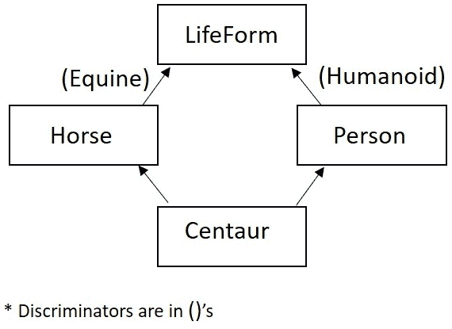
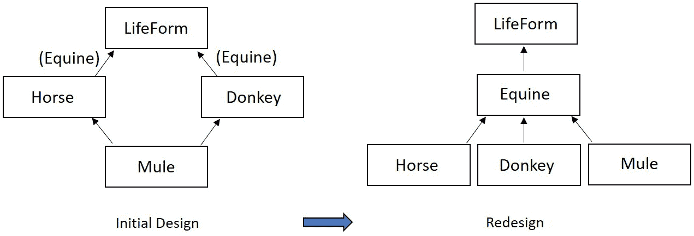

# 探索多重继承

本章将继续扩展我们对 C++面向对象编程的知识。我们将从检查一个有争议的面向对象概念——**多重继承**（**MI**）开始，理解为什么它是有争议的，以及它如何合理地支持面向对象设计，以及何时替代设计可能更为合适。

在 C++中，可以通过直接的语言支持来实现多重继承。在这样做的时候，我们将面临几个面向对象设计的问题。我们将被要求批判性地评估继承层次结构，问自己我们是否正在使用可能的最优设计来表示一组潜在的对象关系。多重继承可以是一个强大的面向对象工具；明智地使用它是至关重要的。我们将学习何时使用多重继承来合理地扩展我们的层次结构。

在本章中，我们将涵盖以下主要主题：

+   理解多重继承的机制

+   检查多重继承的合理用途

+   创建菱形层次结构并探讨其使用中产生的问题

+   使用虚拟基类来解决菱形层次结构的重复问题

+   将判别器应用于评估菱形层次结构和设计中的 MI 的价值，以及考虑设计替代方案

到本章结束时，你将理解面向对象的多个继承概念，以及如何在 C++中实现这一想法。你将不仅理解 MI 的简单机制，还将理解其使用的理由（混入、Is-A 或具有争议的 Has-A）。

你将看到为什么多重继承在面向对象编程中是有争议的。拥有多个基类可能导致形状奇特的层次结构，如菱形；这类层次结构可能带来潜在的实现问题。我们将看到 C++如何通过语言特性（虚拟基类）来解决这些难题，但解决方案并不总是理想的。

一旦我们理解了由多重继承引起的复杂性，我们将使用面向对象设计的度量标准，例如判别器，来评估使用多重继承的设计是否是表示一组对象关系的最佳解决方案。我们将探讨替代设计，这样你将更好地理解多重继承是什么，以及在何时使用它最为合适。让我们通过前进使用多重继承来扩展我们对 C++作为“你可以做任何事情”的面向对象语言的了解。

# 技术要求

完整程序示例的在线代码可以在以下 GitHub URL 中找到：[`github.com/PacktPublishing/Deciphering-Object-Oriented-Programming-with-CPP/tree/main/Chapter09`](https://github.com/PacktPublishing/Deciphering-Object-Oriented-Programming-with-CPP/tree/main/Chapter09)。每个完整程序示例都可以在 GitHub 的相应章节标题（子目录）下找到，对应于章节编号，后面跟着一个连字符，然后是当前章节中的示例编号。例如，本章的第一个完整程序可以在上述 GitHub 目录下的`Chapter09`子目录中找到一个名为`Chp9-Ex1.cpp`的文件。

本章的 CiA 视频可以在以下链接查看：[`bit.ly/3Cbqt7y`](https://bit.ly/3Cbqt7y)。

# 理解多重继承机制

在 C++中，一个类可以有一个以上的直接基类。这被称为**多重继承**，在面向对象设计和面向对象编程中都是一个非常有争议的话题。让我们从简单的机制开始；然后我们将在本章的进展过程中讨论 MI 的设计问题和编程逻辑。

在多重继承中，派生类通过其类定义中的基类列表指定了其每个直接祖先或基类是谁。

与单继承类似，当派生类类型的对象被实例化和销毁时，构造函数和析构函数会一直向上遍历层次结构。回顾和扩展 MI 的构造和析构的细微差别，我们会想起以下逻辑：

+   构造函数的调用序列从派生类开始，但立即将控制权传递给基类构造函数，依此类推向上传递。一旦调用序列将控制权传递到层次结构的顶部，执行序列开始。在同一级别的所有最高级基类构造函数首先执行，依此类推向下遍历层次结构，直到我们到达派生类构造函数，其主体在构造链中最后执行。

+   派生类的析构函数首先被调用并执行，然后是所有直接基类的析构函数，依此类推，随着我们向上遍历继承层次结构。

派生类构造函数中的成员初始化列表可以用来指定每个直接基类应该调用哪个构造函数。如果没有指定，将使用该基类的默认构造函数。

让我们来看一个典型的多重继承示例，以实现从面向对象设计角度的一个典型的 MI 应用，以及理解 C++中的基本 MI 语法。这个例子将被分成多个部分；完整的程序可以在以下 GitHub 位置找到：

[`github.com/PacktPublishing/Deciphering-Object-Oriented-Programming-with-CPP/blob/main/Chapter09/Chp9-Ex1.cpp`](https://github.com/PacktPublishing/Deciphering-Object-Oriented-Programming-with-CPP/blob/main/Chapter09/Chp9-Ex1.cpp)

```cpp
#include <iostream>
using std::cout;    // preferred to: using namespace std;
using std::endl;
using std::string;
using std::to_string;
class Person
{
private: 
    string firstName;
    string lastName;
    char middleInitial = '\0';  // in-class initialization
    string title;  // Mr., Ms., Mrs., Miss, Dr., etc.
protected:
    void ModifyTitle(const string &);  
public:
    Person() = default;   // default constructor
    Person(const string &, const string &, char, 
           const string &);
    Person(const Person &) = delete;  // prohibit copies
    virtual ~Person();  // destructor prototype
    const string &GetFirstName() const 
        { return firstName; }  
    const string &GetLastName() const 
        { return lastName; }    
    const string &GetTitle() const { return title; } 
    char GetMiddleInitial() const { return middleInitial; }
};
```

在之前的代码段中，我们有一个预期的 `Person` 类定义，其中包含我们习惯于定义的类元素。

接下来，让我们看看这个类的伴随成员函数：

```cpp
// With in-class initialization, writing the default
// constructor is no longer necessary.
// Also, remember strings are member objects and will 
// be default constructed as empty.
Person::Person(const string &fn, const string &ln, char mi, 
               const string &t): firstName(fn),
               lastName(ln), middleInitial(mi), title(t)
{
}
// Simple destructor so we can trace the destruction chain
Person::~Person()  
{
    cout << "Person destructor <" << firstName << " " << 
            lastName << ">" << endl;
}
void Person::ModifyTitle(const string &newTitle)
{
    title = newTitle;
}
```

在之前的代码段中，`Person` 类的成员函数定义正如预期的那样。然而，查看 `Person` 类的定义是有用的，因为这个类将作为构建块，其部分内容将在接下来的代码段中直接访问。

现在，让我们定义一个新的类，`BillableEntity`：

```cpp
class BillableEntity
{
private:
    float invoiceAmt = 0.0;   // in-class initialization
public:
    BillableEntity() = default;
    BillableEntity(float amt) invoiceAmt(amt) { } 
    // prohibit copies with prototype below
    BillableEntity(const BillableEntity &) = delete; 
    virtual ~BillableEntity();
    void Pay(float amt) { invoiceAmt -= amt; }
    float GetBalance() const { return invoiceAmt; }
    void Balance() const;
};
// Simple destructor so we can trace destruction chain
BillableEntity::~BillableEntity()
{
    cout << "BillableEntity destructor" << endl;
}
void BillableEntity::Balance() const
{
    if (invoiceAmt)
       cout << "Owed amount: $ " << invoiceAmt << endl;
    else
       cout << "Credit: $ " << 0.0 - invoiceAmt << endl;
}
```

在之前的 `BillableEntity` 类中，我们定义了一个包含简单功能以封装计费结构的类。也就是说，我们有一个发票金额和 `Pay()` 和 `GetBalance()` 等方法。注意，复制构造函数在其原型中指示 `= delete`；这将会禁止复制，考虑到这个类的性质，这似乎是合适的。

接下来，让我们将上述两个基类 `Person` 和 `BillableEntity` 结合起来，作为 `Student` 类的基类：

```cpp
class Student: public Person, public BillableEntity
{
private: 
    float gpa = 0.0;   // in-class initialization
    string currentCourse;
    const string studentId;
    static int numStudents;
public:
    Student();  // default constructor
    Student(const string &, const string &, char, 
            const string &, float, const string &, 
            const string &, float); 
    Student(const Student &) = delete;  // prohibit copies
    ~Student() override; 
    void Print() const;
    void EarnPhD();  
    float GetGpa() const { return gpa; }
    const string &GetCurrentCourse() const
        { return currentCourse; }
    const string &GetStudentId() const 
        { return studentId; }
    void SetCurrentCourse(const string &);
    static int GetNumberStudents();
};
// definition for static data member
int Student::numStudents = 0;  // notice initial value of 0
inline void Student::SetCurrentCourse(const string &c)
{
   currentCourse = c;
}
inline int Student::GetNumberStudents()
{
    return numStudents;
}
```

在 `Student` 的先前类定义中，在 `Student` 的基类列表中指定了两个公共基类，`Person` 和 `BillableEntity`。这两个基类在 `Student` 的基类列表中仅以逗号分隔。我们还在类定义中包含了内联函数定义，因为这些通常与头文件一起打包。

让我们进一步看看通过检查其成员函数，`Student` 类剩余部分需要做出哪些调整：

```cpp
// Due to non-specification in the member init list, this 
// constructor calls the default base class constructors
Student::Student() : studentId(to_string(numStudents + 100) 
                                         + "Id")
{
   // Note: since studentId is const, we need to set it at 
   // construction using member init list. Remember, string
   // members are default constructed w an empty string. 
   numStudents++;
}
// The member initialization list specifies which versions
// of each base class constructor should be utilized.
Student::Student(const string &fn, const string &ln, 
        char mi, const string &t, float avg, 
        const string &course, const string &id, float amt): 
        Person(fn, ln, mi, t), BillableEntity(amt),
        gpa(avg), currentCourse(course), studentId(id)
{
   numStudents++;
}
// Simple destructor so we can trace destruction sequence
Student::~Student()
{
   numStudents--;
   cout << "Student destructor <" << GetFirstName() << " "
        << GetLastName() << ">" << endl;
}
void Student::Print() const
{
    cout << GetTitle() << " " << GetFirstName() << " ";
    cout << GetMiddleInitial() << ". " << GetLastName();
    cout << " with id: " << studentId << " has a gpa of: ";
    cout << " " << gpa << " and course: " << currentCourse;
    cout << " with balance: $" << GetBalance() << endl;
}
void Student::EarnPhD() 
{  
    ModifyTitle("Dr."); 
}
```

让我们考虑之前的代码段。在 `Student` 的默认构造函数中，由于成员初始化列表中缺少基类构造函数的指定，将调用 `Person` 和 `BillableEntity` 基类的默认构造函数。

然而，请注意，在 `Student` 的替代构造函数中，我们只是在成员初始化列表中用逗号分隔我们的两个基类构造函数选择——即 `Person(const string &, const string &, char, const string &)` 和 `BillableEntity(float)`——然后使用此列表将各种参数从 `Student` 构造函数传递到基类构造函数。

最后，让我们看看我们的 `main()` 函数：

```cpp
int main()
{
    float tuition1 = 1000.00, tuition2 = 2000.00;
    Student s1("Gabby", "Doone", 'A', "Ms.", 3.9, "C++",
               "178GWU", tuition1); 
    Student s2("Zack", "Moon", 'R', "Dr.", 3.9, "C++",
               "272MIT", tuition2); 
    // public mbrs. of Person, BillableEntity, Student are
    // accessible from any scope, including main()
    s1.Print();
    s2.Print();
    cout << s1.GetFirstName() << " paid $500.00" << endl;
    s1.Pay(500.00);
    cout << s2.GetFirstName() << " paid $750.00" << endl;
    s2.Pay(750.00);
    cout << s1.GetFirstName() << ": ";
    s1.Balance();
    cout << s2.GetFirstName() << ": ";
    s2.Balance();
    return 0;
}
```

在之前的代码中的 `main()` 函数中，我们创建了几个 `Student` 实例。注意，`Student` 实例可以利用 `Student`、`Person` 或 `BillableEntity` 的公共接口中的任何方法。

让我们看看上述程序的输出：

```cpp
Ms. Gabby A. Doone with id: 178GWU has a gpa of:  3.9 and course: C++ with balance: $1000
Dr. Zack R. Moon with id: 272MIT has a gpa of:  3.9 and course: C++ with balance: $2000
Gabby paid $500.00
Zack paid $750.00
Gabby: Owed amount: $ 500
Zack: Owed amount: $ 1250
Student destructor <Zack Moon>
BillableEntity destructor
Person destructor <Zack Moon>
Student destructor <Gabby Doone>
BillableEntity destructor
Person destructor <Gabby Doone>
```

注意上述输出中的销毁顺序。我们可以看到每个 `Student` 实例调用了 `Student` 析构函数，以及每个基类（`BillableEntity` 和 `Person`）的析构函数。

我们已经看到了使用典型实现的面向对象（OO）设计进行 MI 的语言机制。现在，让我们通过查看在 OO 设计中采用多重继承的典型原因来继续前进，其中一些原因比其他原因更广泛地被接受。

# 检查多重继承的合理用途

多重继承是一个在创建 OO 设计时出现的有争议的概念。许多 OO 设计避免使用 MI；其他设计则严格地接受它。一些面向对象编程语言，如 Java，不提供直接的语言支持来明确支持多重继承。相反，它们提供接口，例如我们在 C++中通过创建使用抽象类（仅包含纯虚拟函数）的接口类来模拟（见*第八章*，*掌握抽象类*）。

当然，在 C++中，从两个接口类继承仍然是多重继承的一种用法。尽管 C++语言本身不包含接口类，但可以通过更限制性的 MI 使用来模拟这个概念。例如，我们可以通过编程简化抽象类，只包含纯虚拟函数（没有数据成员，也没有带定义的成员函数），以模仿接口类的面向对象设计理念。

典型的 MI 难题是为什么 MI 在面向对象编程（OOP）中存在争议的基础。本章将详细阐述经典的 MI 难题，并通过仅限制 MI 用于接口类或通过重新设计来避免这些问题。这就是为什么一些面向对象编程语言只支持接口类，而不是允许无限制的 MI。在 C++中，你可以仔细考虑每个 OO 设计，并选择何时利用 MI，何时利用限制性 MI（接口类），或何时采用消除 MI 的重新设计。

C++是一种*“你可以做任何事情”*的编程语言。因此，C++允许无限制地使用多重继承。作为一个面向对象程序员，我们将更仔细地研究接受 MI 的典型原因。随着我们进一步进入本章，我们将评估使用 MI 时出现的问题，并了解 C++如何通过额外的语言特性来解决这些问题。这些 MI 问题将使我们能够应用度量标准，以更合理地了解何时应该使用 MI，何时重新设计可能更合适。

让我们通过考虑 Is-A 和 mix-in 关系来开始我们对 MI 合理使用的追求，然后转向检查 MI 在实现 Has-A 关系方面的有争议的使用。

## 支持 Is-A 和 mix-in 关系

正如我们通过单继承所学习的，Is-A 关系最常用来描述两个继承类之间的关系。例如，一个`Student`是`Person`的子类。在 MI 中，这种理想继续存在；Is-A 关系是指定继承的主要动机。在纯面向对象设计和编程中，继承应该仅用于支持 Is-A 关系。

尽管如此，正如我们在查看接口类（在 C++中使用具有仅包含纯虚函数的限制的抽象类来建模的概念）时所学到的那样，当我们从接口继承时，混入关系通常适用。回想一下，混入关系是我们使用继承来混入另一个类的功能，仅仅因为这种功能对派生类来说是有用或有意义的。基类不必是抽象类或接口类，但采用理想的面向对象设计，它应该是这样的。

混入基类代表了一个其中不适用“是”关系的类。混入在多重继承中更为常见，至少作为支持（许多）基类之一的必要性的原因。由于 C++直接支持多重继承，MI 可以用来支持实现混入（而像 Java 这样的语言可能只能使用接口类）。在实践中，MI 通常用于从一个类继承以支持“是”关系，并从另一个类继承以支持混入关系。在我们最后的例子中，我们看到一个`Student`是`Person`，并且`Student`选择混入`BillableEntity`的能力。

C++中 MI 的合理用途包括支持“是”和混入关系；然而，如果没有接下来考虑 MI 的非常规用途——实现“拥有”关系，我们的讨论就不会完整。

## 支持“拥有”关系

不太常见且更具争议性的是，MI 可以用来实现“拥有”关系，即建模包含或整体与部分的关系。我们将在*第十章*，“实现关联、聚合和组合”中看到，对于“拥有”关系有一个更广泛接受的实现；然而，如果没有接下来考虑 MI 的非常规用途——实现“拥有”关系，我们的讨论就不会完整。

例如，一个`Student`是`Person`的实例，并且一个`Student`拥有一个`Id`；第二个基类（`Id`）的使用是为了包含。`Id`将作为基类，`Student`将从`Id`派生出来，以利用`Id`提供的一切。`Id`的公共接口可以直接用于`Student`。实际上，任何从`Id`继承的类在利用其`Id`部分时都会继承一个统一接口。这种简单性是继承有时被用来建模包含的一个驱动因素。

然而，使用继承来实现 Has-A 关系可能会导致不必要的 MI（多继承）使用，这可能会使继承层次结构复杂化。使用继承来模拟 Has-A 关系之所以非常具有争议，并且坦率地说在纯面向对象设计中不受欢迎，主要是因为这种不必要的 MI 使用。尽管如此，我们还是要提到这一点，因为你会看到一些 C++应用程序使用 MI 来实现 Has-A。

让我们继续探索使用 MI 的其他具有争议的设计，即菱形层次结构。

# 创建菱形层次结构

当使用多继承时，有时会诱使人们使用兄弟（或堂兄弟）类作为新派生类的基类。当这种情况发生时，层次结构就不再是树形，而是一个包含*菱形*的图。

在这种情况下，每当派生类类型的对象被实例化时，派生类实例中都将存在两个公共基类的副本。这种类型的复制显然会浪费空间。此外，调用重复子对象的重复构造函数和析构函数，以及维护子对象的两个并行副本（很可能是不必要的），也会浪费额外的时间。尝试从该公共基类访问成员时，也会产生歧义。

让我们通过一个示例详细说明这个问题，从`LifeForm`、`Horse`和`Person`的简化和（故意）不完整的类定义开始。尽管只显示了完整程序示例的部分，但整个程序可以在我们的 GitHub 上找到，如下所示：

[`github.com/PacktPublishing/Deciphering-Object-Oriented-Programming-with-CPP/blob/main/Chapter09/Chp9-Ex2.cpp`](https://github.com/PacktPublishing/Deciphering-Object-Oriented-Programming-with-CPP/blob/main/Chapter09/Chp9-Ex2.cpp)

```cpp
class Lifeform
{   // abbreviated class definition – see full code online
private:
    int lifeExpectancy = 0;  // in-class initialization
public:
    LifeForm(int life): lifeExpectancy(life) { }
    [[nodiscard]] int GetLifeExpectancy() const 
        { return lifeExpectancy; }
    // additional constructors, destructor, etc.
    virtual void Print() const = 0; // pure virtual funcs.
    virtual string IsA() const = 0;
    virtual string Speak() const = 0;
};
class Horse: public LifeForm
{   // abbreviated class definition
private:
    string name;
    static constexpr int HORSE_LIFE = 35; // life exp Horse
public:
    Horse(): LifeForm(HORSE_LIFE) { }
    // additional constructors, destructor, etc …
    void Print() const override { cout << name << endl; }
    string IsA() const override { return "Horse"; }
    string Speak() const override { return "Neigh!"; }
};
class Person: public LifeForm
{   // abbreviated class definition
private: 
    string firstName;
    string lastName;
    static constexpr int PERSON_LIFE = 80; // life expect.
                                           // of Person
    // additional data members (imagine them here)
public:
    Person(): LifeForm(PERSON_LIFE) { }
    // additional constructors, destructor, etc.
    const string &GetFirstName() const 
        { return firstName; }
    // additional access methods, etc. 
    void Print() const override
        { cout << firstName << " " << lastName << endl; }
    string IsA() const override { return "Person"; }
    string Speak() const override { return "Hello!"; }
};
```

之前的代码片段显示了`LifeForm`、`Person`和`Horse`的骨架类定义。每个类都显示了一个默认构造函数，它仅作为示例，展示如何为每个类设置`lifeExpectancy`。在`Person`和`Horse`的默认构造函数中，使用成员初始化列表将`35`（`HORSE_LIFE`）或`80`（`PERSON_LIFE`）的值传递给`LifeForm`构造函数，以设置此值。

虽然之前的类定义被简略了（也就是说，故意不完整）以节省空间，但让我们假设每个类都有适当的额外构造函数定义、适当的析构函数和其他必要的成员函数。

我们注意到`LifeForm`是一个抽象类，因为它提供了纯虚函数：`Print()`、`IsA()`和`Speak()`。`Horse`和`Person`都是具体类，并且因为它们用虚函数覆盖了这些纯虚函数，所以将是可实例化的。这些虚函数仅内联显示，目的是为了使代码在查看时更紧凑（编译器几乎永远不会内联虚函数，因为它们的函数方法几乎总是在运行时确定）。

接下来，让我们看看一个将引入图中或菱形形状的新派生类：

```cpp
class Centaur: public Person, public Horse
{   // abbreviated class definition
public:
    // constructors, destructor, etc …
    void Print() const override
       { cout << GetFirstName() << endl; }
    string IsA() const override { return "Centaur"; }
    string Speak() const override
       { return "Neigh! and Hello!"; }
};
```

在前面的片段中，我们使用多重继承定义了一个新的类 `Centaur`。乍一看，我们确实意味着要断言 `Centaur` 和 `Person` 之间，以及 `Centaur` 和 `Horse` 之间的 Is-A 关系。然而，我们很快就会挑战我们的断言，以测试它是否更多的是一种组合而不是真正的 Is-A 关系。

我们将假设所有必要的构造函数、析构函数和成员函数都存在，以便使 `Centaur` 成为一个定义良好的类。

现在，让我们继续前进，看看我们可能使用的潜在 `main()` 函数：

```cpp
int main()
{
    Centaur beast("Wild", "Man");
    cout << beast.Speak() << " I'm a " << beast.IsA();
    cout << endl;
    // Ambiguous method call – which LifeForm sub-object?
    // cout << beast.GetLifeExpectancy();  
    cout << "It is unclear how many years I will live: ";
    cout << beast.Person::GetLifeExpectancy() << " or ";
    cout << beast.Horse::GetLifeExpectancy() << endl; 
    return 0;
}
```

在这里，在 `main()` 中，我们实例化了一个 `Centaur` 并将其命名为 `beast`。我们很容易在 `beast` 上调用两个多态操作，即 `Speak()` 和 `IsA()`。然后我们尝试调用从 `LifeForm` 继承的公共 `GetLifeExpectancy()`，它在 `LifeForm` 中定义。其实现包含在 `Lifeform` 中，这样 `Person`、`Horse` 或 `Centaur` 就不需要提供定义（也不应该提供定义——它不是一个虚拟函数，意味着要被重定义）。

不幸的是，通过 `Centaur` 实例调用 `GetLifeExpectancy()` 是有歧义的。这是因为 `beast` 实例中有两个 `LifeForm` 子对象。记住，`Centaur` 是从 `Horse` 继承的，而 `Horse` 是从 `LifeForm` 继承的，为所有上述基类数据成员（`Horse` 和 `LifeForm`）提供了内存布局。而 `Centaur` 也从 `Person` 继承，而 `Person` 是从 `Lifeform` 继承的，这为 `Centaur` 中的 `Person` 和 `LifeForm` 提供了内存布局。`LifeForm` 部分是重复的。

有两个 `int lifeExpectancy;` 继承数据成员的副本。在 `Centaur` 实例中有两个 `LifeForm` 子对象。因此，当我们尝试通过 `Centaur` 实例调用 `GetLifeExpectancy()` 时，方法调用是有歧义的。我们试图初始化哪个 `lifeExpectancy`？当调用 `GetLifeExpectancy()` 时，哪个 `LifeForm` 子对象将作为 `this` 指针？这很简单，所以编译器不会为我们选择。

为了消除对 `GetLifeExpectancy()` 函数调用的歧义，我们必须使用作用域解析运算符。我们在 `::` 运算符之前加上我们想要从中获取 `LifeForm` 子对象的中间基类。请注意，例如，我们调用 `beast.Horse::GetLifeExpectancy()` 来选择来自 `Horse` 子对象路径的 `lifeExpectancy`，这将包括 `LifeForm`。这是尴尬的，因为 `Horse` 和 `Person` 都不包括这个有歧义的成员；`lifeExpectancy` 在 `LifeForm` 中。

让我们考虑上述程序的结果：

```cpp
Neigh! and Hello! I'm a Centaur.
It is unclear how many years I will live: 80 or 35.
```

我们可以看到，设计包含菱形形状的层次结构有缺点。这些难题包括需要以尴尬方式解决的编程歧义，重复子对象的内存重复，以及构建和销毁这些重复子对象的时间。

幸运的是，C++有一个语言特性可以减轻这些困难，特别是对于具有菱形层次结构的情况。毕竟，C++是一种允许我们做任何事的强大语言。知道何时以及是否应该利用这些特性是另一个问题。让我们首先看看 C++语言如何通过查看虚拟基类来处理菱形层次结构和它们固有的问题。

# 利用虚拟基类消除重复

我们刚刚看到了在 OO 设计中包含菱形时迅速出现的 MI 实现问题——重复子对象在内存中的重复、访问该子对象的歧义（甚至通过继承的成员函数），以及构造和析构的重复。出于这些原因，纯 OO 设计不会在层次结构中包含图（即，没有菱形）。然而，我们知道 C++是一种强大的语言，任何事都是可能的。因此，C++将为我们提供解决这些问题的解决方案。

`virtual`被放置在基类列表中，位于可能*后来*用作相同派生类基类的兄弟或堂兄弟类的访问标签和基类名称之间。请注意，知道两个兄弟类可能后来被组合为新的派生类的共同基类可能很困难。重要的是要注意，没有指定虚拟基类的兄弟类将要求其自己的（否则）共享基类副本。

应该谨慎地在实现中使用虚拟基类，因为它们对具有此类作为祖先类的实例施加限制和开销。需要注意的限制包括以下内容：

+   具有虚拟基类的实例可能比其非虚拟对应实例使用更多的内存（该实例包含一个指向可能共享的基类组件的指针）。

+   当虚拟基类在祖先层次结构中时，从基类类型的对象到派生类类型的转换是被禁止的。

+   最派生类的成员初始化列表必须用来指定应该使用共享对象类型的哪个构造函数进行初始化。如果忽略此指定，将使用默认构造函数来初始化此子对象。

让我们看看一个使用虚拟基类的完整程序示例。像往常一样，完整的程序可以在我们的 GitHub 上找到，如下所示：

[`github.com/PacktPublishing/Deciphering-Object-Oriented-Programming-with-CPP/blob/main/Chapter09/Chp9-Ex3.cpp`](https://github.com/PacktPublishing/Deciphering-Object-Oriented-Programming-with-CPP/blob/main/Chapter09/Chp9-Ex3.cpp)

```cpp
#include <iostream>
using std::cout;    // preferred to: using namespace std;
using std::endl;
using std::string;
using std::to_string;
class LifeForm
{
private:
    int lifeExpectancy = 0;  // in-class initialization
public:
    LifeForm() = default; 
    LifeForm(int life): lifeExpectancy(life) { }
    // We're accepting default copy constructor, but if we
    // wanted to write it, it would look like:
    // LifeForm(const LifeForm &form): 
    //         lifeExpectancy(form.lifeExpectancy) { }
    // prototype necessary to specify virtual dest. below
    virtual ~LifeForm() = default;
    [[nodiscard]] int GetLifeExpectancy() const 
        { return lifeExpectancy; }
    virtual void Print() const = 0; 
    virtual string IsA() const = 0;   
    virtual string Speak() const = 0;
};
```

在之前的代码段中，我们看到`LifeForm`类的完整类定义。请注意，具有主体的成员函数在类定义中被内联。当然，编译器实际上不会对构造函数或虚析构函数进行内联替换；了解这一点，将方法写成内联形式方便进行类定义的审查。

接下来，让我们看看`Horse`类的定义：

```cpp
class Horse: public virtual LifeForm
{
private:
    string name;
    static constexpr int HORSE_LIFE = 35; // Horse life exp
public:
    Horse() : LifeForm(HORSE_LIFE) { }
    Horse(const string &n);
    // Remember, it isn't necessary to proto def. copy ctor
    // Horse(const Horse &) = default; 
    // Because base class destructor is virtual, ~Horse()
    // is automatically virtual (overridden) even w/o proto
    // ~Horse() override = default;
    const string &GetName() const { return name; }
    void Print() const override 
        { cout << name << endl; }
    string IsA() const override { return "Horse"; }
    string Speak() const override { return "Neigh!"; }
};
Horse::Horse(const string &n) : LifeForm(HORSE_LIFE),
                                name(n)
{
}
// We are using the default copy constructor, but if we
// wanted to write it, this is what it would look like:
// Horse::Horse(const Horse &h): LifeForm (h), name(h.name)
// {
// }
```

在之前的代码段中，我们有`Horse`类的完整类定义。请注意，尽管某些方法为了紧凑性而写成内联形式，但编译器永远不会实际内联构造函数或析构函数。同样，虚函数也不能内联，因为它的整个目的是在运行时确定适当的方法（除了涉及去虚化的罕见场景）。

在这里，`LifeForm`是`Horse`的虚基类。这意味着如果`Horse`有一个兄弟（或堂兄弟）也使用虚基类从`LifeForm`继承，并且这些兄弟作为派生类的基类，那么这些兄弟将*共享*他们的`LifeForm`副本。虚基类将减少存储空间，减少额外的构造函数和析构函数调用，并消除歧义。

注意`Horse`构造函数在其成员初始化列表中指定了`LifeForm(HORSE_LIFE)`构造函数指定。如果`LifeForm`实际上是一个共享的虚基类，则此基类初始化将被忽略，尽管这些构造函数指定对于`Horse`的实例或对于在菱形继承结构不适用的情况下`Horse`的派生类的实例是有效的。在`Horse`与兄弟类结合以真正作为虚基类的情况下，`LifeForm(HORSE_LIFE)`指定将被忽略，取而代之的是，将调用默认的`LifeForm`构造函数，或者在层次结构的较低（且不寻常）级别选择另一个构造函数。

接下来，让我们通过查看更多的类定义来更深入地了解这个程序，从`Person`类开始：

```cpp
class Person: public virtual LifeForm
{
private: 
    string firstName;
    string lastName;
    char middleInitial = '\0';  // in-class initialization
    string title;  // Mr., Ms., Mrs., Miss, Dr., etc.
    static constexpr int PERSON_LIFE = 80; // Life expect.
protected:
    void ModifyTitle(const string &);  
public:
    Person();   // default constructor
    Person(const string &, const string &, char, 
           const string &); 
    // Default copy constructor prototype is not necessary 
    // Person(const Person &) = default;  // copy ctor.
    // Because base class destructor is virtual, ~Person()
    // is automatically virtual (overridden) even w/o proto
    // ~Person() override = default;  // destructor
    const string &GetFirstName() const 
        { return firstName; }  
    const string &GetLastName() const 
        { return lastName; }    
    const string &GetTitle() const { return title; } 
    char GetMiddleInitial() const { return middleInitial; }
    void Print() const override;
    string IsA() const override;   
    string Speak() const override;
};
```

在之前的代码段中，我们看到`Person`有一个公共虚基类`LifeForm`。如果`Person`和`Person`的兄弟类通过多重继承结合成一个新的派生类的基类，那些表明了`LifeForm`虚基类的兄弟类将同意共享一个`LifeForm`的子对象。

继续前进，让我们回顾`Person`的成员函数：

```cpp
Person::Person(): LifeForm(PERSON_LIFE)
{  // Note that the base class init list specification of
   // LifeForm(PERSON_LIFE) is ignored if LifeForm is a 
   // shared, virtual base class.
}  // This is the same in all Person constructors.
Person::Person(const string &fn, const string &ln, char mi,
               const string &t): LifeForm(PERSON_LIFE),
               firstName(fn), lastName(ln),
               middleInitial(mi), title(t)
{
}
// We're using the default copy constructor, but if we 
// wrote/prototyped it, here's what the method would be:
// Person::Person(const Person &p): LifeForm(p),
//           firstName(p.firstName), lastName(p.lastName),
//           middleInitial(p.middleInitial), title(p.title)
// {
// }
void Person::ModifyTitle(const string &newTitle)
{
    title = newTitle;
}
void Person::Print() const
{
    cout << title << " " << firstName << " ";
    cout << middleInitial << ". " << lastName << endl;
}
string Person::IsA() const
{  
    return "Person"; 
}
string Person::Speak() const
{   
    return "Hello!"; 
}
```

在之前提到的`Person`方法中，我们看到很少的细节会让我们感到惊讶；这些方法基本上符合预期。然而，作为提醒，请注意，如果`Person`在一个菱形继承结构中被组合，其中`LifeForm`子对象变为共享而不是复制，那么`Person`构造函数成员初始化列表中的`LifeForm(PERSON_LIFE)`指定将被忽略。

接下来，让我们看看多重继承如何发挥作用，通过`Centaur`类的定义来了解：

```cpp
class Centaur: public Person, public Horse
{
private:
    // no additional data members required, but the below
    // static constexpr eliminates a magic number of 1000
    static constexpr int CENTAUR_LIFE = 1000; //life expect
public:
    Centaur(): LifeForm(CENTAUR_LIFE) { }
    Centaur(const string &, const string &, char = ' ', 
            const string & = "Mythological Creature"); 
    // We don't want default copy constructor due to the
    // needed virtual base class in the mbr init list below
    Centaur(const Centaur &c): 
           Person(c), Horse(c), LifeForm(CENTAUR_LIFE) { }
    // Because base class' destructors are virt, ~Centaur()
    // is automatically virtual (overridden) w/o prototype
    // ~Centaur() override = default;
    void Print() const override;
    string IsA() const override;
    string Speak() const override;
};
// Constructors for Centaur need to specify how the shared
// base class LifeForm will be initialized
Centaur::Centaur(const string &fn, const string &ln, 
                 char mi, const string &title):
                 Person(fn, ln, mi, title), Horse(fn),
                 LifeForm(CENTAUR_LIFE)
{
   // All initialization has been taken care of in 
}  // member initialization list
void Centaur::Print() const
{
    cout << "My name is " << GetFirstName();
    cout << ".  I am a " << GetTitle() << endl;
}
string Centaur::IsA() const 
{ 
    return "Centaur"; 
}
string Centaur::Speak() const
{
    return "Neigh! Hello! I'm a master of two languages.";
} 
```

在上述`Centaur`类定义中，我们可以看到`Centaur`有公共基类`Horse`和`Person`。我们暗示`Centaur`是`Horse`和`Person`的实例。

然而，请注意，在`Centaur`类定义的基类列表中没有使用`virtual`关键字。但是，`Centaur`是在层次结构中引入菱形形状的级别。这意味着我们必须在设计阶段提前规划，知道在`Horse`和`Person`类定义的基类列表中使用`virtual`关键字。这是一个为什么适当的设计会议至关重要，而不仅仅是跳入实现的例子。

此外，非常不寻常的是，注意在`Centaur`的替代构造函数中，基类列表`Person(fn, ln, mi, title), Horse(fn), LifeForm(CENTAUR_LIFE)`。在这里，我们不仅指定了`Person`和`Horse`的直接基类的首选构造函数，而且还指定了它们共同的基类`LifeForm`的首选构造函数。这是非常不寻常的。如果没有将`LifeForm`作为`Horse`和`Person`的虚基类，`Centaur`将无法指定如何构造共享的`LifeForm`部分（即通过为除其直接基类之外的其他选择构造函数）。你也会注意到，为了同样的目的，在默认构造函数以及复制构造函数的成员初始化列表中，对基类构造函数的指定。虚基类的使用使得`Person`和`Horse`类在其他应用中更难以重用，原因在本小节开头已概述。

让我们看看我们的`main()`函数包含什么：

```cpp
int main()
{
   Centaur beast("Wild", "Man");
   cout << beast.Speak() << endl;
   cout << " I'm a " << beast.IsA() << ". ";
   beast.Print();
   cout << "I will live: ";
   cout << beast.GetLifeExpectancy();// no longer ambiguous
   cout << " years" << endl; 
   return 0;
}
```

与我们非虚基类示例中的`main()`函数类似，我们可以看到`Centaur`同样被实例化，并且虚拟函数如`Speak()`、`IsA()`和`Print()`可以轻松调用。然而，现在当我们通过`beast`实例调用`GetLifeExpectancy()`时，调用不再模糊。只有一个`LifeForm`的子对象，其`lifeExpectancy`（一个整数）已被初始化为`1000`（`CENTAUR_LIFE`）。

下面是完整程序示例的输出：

```cpp
Neigh! Hello! I'm a master of two languages.
I am a Centaur. My name is Wild. I am a Mythological Creature.
I will live: 1000 years.
```

虚基类解决了困难的 MI 难题。但我们也已经看到，实现这一目标所需的代码在未来的扩展和重用方面不太灵活。因此，只有在设计真正支持菱形层次结构时，才应谨慎和少量地使用虚基类。考虑到这一点，让我们考虑一个面向对象的判别器概念，并考虑何时其他设计可能更合适。

# 考虑判别器和替代设计

**判别器**是一个面向对象的概念，有助于概述为什么一个给定的类是从其基类派生出来的。**判别器**倾向于描述给定基类存在的特殊化分组类型。

例如，在上面的菱形层次结构的程序示例中，我们有以下判别器（括号中显示），概述了我们从给定的基类中特化新类的原因：



图 9.1 – 使用判别器展示的多重继承菱形设计

无论何时，诱惑导致创建菱形层次结构时，检查判别器可以帮助我们决定设计是否合理，或者是否可能有一个更好的替代设计。以下是一些值得考虑的良好设计指标：

+   如果正在合并的兄弟类之间的判别器相同，那么最好重新设计菱形层次结构。

+   当兄弟类没有唯一的判别器时，它们将引入的属性和行为将包括由具有*类似判别器*而产生的重复。考虑将判别器作为一个类来存放这些共同点。

+   如果兄弟类的判别器是唯一的，那么菱形层次结构可能是合理的。在这种情况下，虚拟基类将非常有用，并且应该添加到层次结构的适当位置。

在前面的例子中，详细说明`Horse`如何特化`LifeForm`的判别器是`Equine`。也就是说，我们通过马的特征和行为（蹄子、奔跑、嘶鸣等）来特化`LifeForm`。如果我们从`LifeForm`派生出像`Donkey`或`Zebra`这样的类，这些类的判别器也将是`Equine`。考虑到上述相同的例子，`Person`类在特化`LifeForm`时将有一个`Humanoid`判别器。如果我们从`LifeForm`派生出像`Martian`或`Romulan`这样的类，这些类也将有`Humanoid`作为判别器。

将`Horse`和`Person`作为`Centaur`的基类结合起来，是合并具有不同判别器（`Equine`和`Humanoid`）的两个基类。因此，每个基类都考虑了完全不同类型的特点和行为。尽管可能存在其他设计，但这种设计是可以接受的（除了面向对象设计的纯粹主义者），并且可以使用 C++中的虚拟基类来消除其他情况下复制的`LifeForm`部分。将具有共同基类且每个类都使用不同的判别器特化基类的两个类结合起来，是 C++中 MI 和虚拟基类合理性的一个例子。

然而，将`Horse`和`Donkey`（两者都从`LifeForm`派生）这样的两个类在派生类`Mule`中结合起来，也会创建一个菱形层次结构。检查`Horse`和`Donkey`的判别器可以发现，两者都有`Equine`的判别器。在这种情况下，使用菱形设计将这些两个类结合起来并不是最佳的设计选择。另一个设计选择是可能的，也是首选的。在这种情况下，一个首选的解决方案是将判别器`Equine`作为其自己的类，然后从`Equine`派生`Horse`、`Donkey`和`Mule`。这将避免 MI 和菱形层次结构。让我们看看两种设计选项：



图 9.2 – 无 MI 重新设计的菱形多重继承

提醒

在菱形层次结构中，如果**结合**类的判别器相同，则可以进行更好的设计（通过将判别器作为其自己的类）。然而，如果判别器不同，考虑保留菱形 MI 层次结构，然后使用虚拟基类来避免重复公共基类子对象。

我们现在已经彻底研究了判别器的 OO 概念，并看到了判别器如何被用来帮助评估设计的合理性。在许多情况下，使用菱形层次结构的设计可以被重新设计，不仅消除菱形形状，而且完全消除多重继承。在我们继续下一章之前，让我们简要回顾一下本章中涵盖的 MI 问题和 OO 概念。

# 摘要

在本章中，我们继续我们的探索，以理解面向对象编程，我们探索了一个有争议的 OOP 主题，即多重继承。首先，在本章中，我们理解了多重继承的简单机制。同样重要的是，我们回顾了构建继承层次结构的原因以及使用 MI（即指定 Is-A、mix-in 和 Has-A 关系）的可能原因。我们被提醒，使用继承来指定 Is-A 关系支持纯 OO 设计。我们还看到了使用 MI 实现 mix-in 关系的实用性。我们还审视了 MI 的争议性使用，以快速实现 Has-A 关系；我们将在*第十章*中看到，*实现关联、聚合和组合*，一个首选的 Has-A 实现方法。

我们已经看到，在我们的面向对象设计工具包中拥有多重继承如何导致菱形层次结构。我们也看到了菱形层次结构不可避免的问题，例如内存中的重复、构造/析构中的重复以及访问复制的子对象时的歧义。我们还看到，C++提供了一种语言支持的机制来纠正这些问题，即使用虚基类。我们知道虚基类解决了繁琐的问题，但它们本身并不是完美的解决方案。

为了批评菱形层次结构，我们研究了面向对象中的一个判别器概念，以帮助我们权衡在菱形中使用多重继承的面向对象设计的有效性。这也使我们理解到，替代设计可以适用于一组对象；有时，重新设计是一种更优雅的方法，其中解决方案将产生更简单、长期的使用。

C++是一种*“你可以做任何事情”*的面向对象编程语言，多重继承是一个有争议的面向对象概念。了解何时某些多重继承设计可能是合理的，以及理解语言特性以帮助解决这些多重继承问题，将使你成为一个更好的程序员。了解何时需要重新设计也是至关重要的。

我们现在准备继续到*第十章*，*实现关联、聚合和组合*，通过学习如何使用编程技术表示关联、聚合和组合来进一步提高我们的面向对象技能。这些即将到来的概念将*不会*有直接的语言支持，但这些概念在我们的面向对象技能库中是至关重要的。让我们继续前进！

# 问题

1.  在本章中输入（或使用在线代码）使用虚基类的菱形层次结构示例。按原样运行它。提示：你可能想在显式析构函数中添加`cout`语句以跟踪销毁顺序：

    1.  对于`Centaur`实例，存在多少个`LifeForm`子对象？

    1.  `LifeForm`构造函数（和析构函数）被调用了多少次？提示：你可能想在每个构造函数和析构函数中使用`cout`放置跟踪语句。

    1.  如果省略了`Centaur`构造函数中`LifeForm`的构造函数选择，将调用哪个`LifeForm`构造函数？

1.  现在，从`Person`和`Horse`（即`LifeForm`将不再是`Person`和`Horse`的虚基类。`LifeForm`将只是`Person`和`Horse`的典型基类）的基类列表中移除关键字`virtual`。同时，从`Centaur`构造函数的成员初始化列表中移除`LifeForm`构造函数的选择。现在，实例化`Centaur`：

    1.  对于`Centaur`实例，存在多少个`LifeForm`子对象？

    1.  现在，`LifeForm`构造函数（和析构函数）被调用了多少次？提示：你可能想在构造函数和析构函数中添加跟踪语句。
