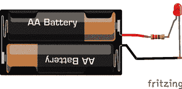
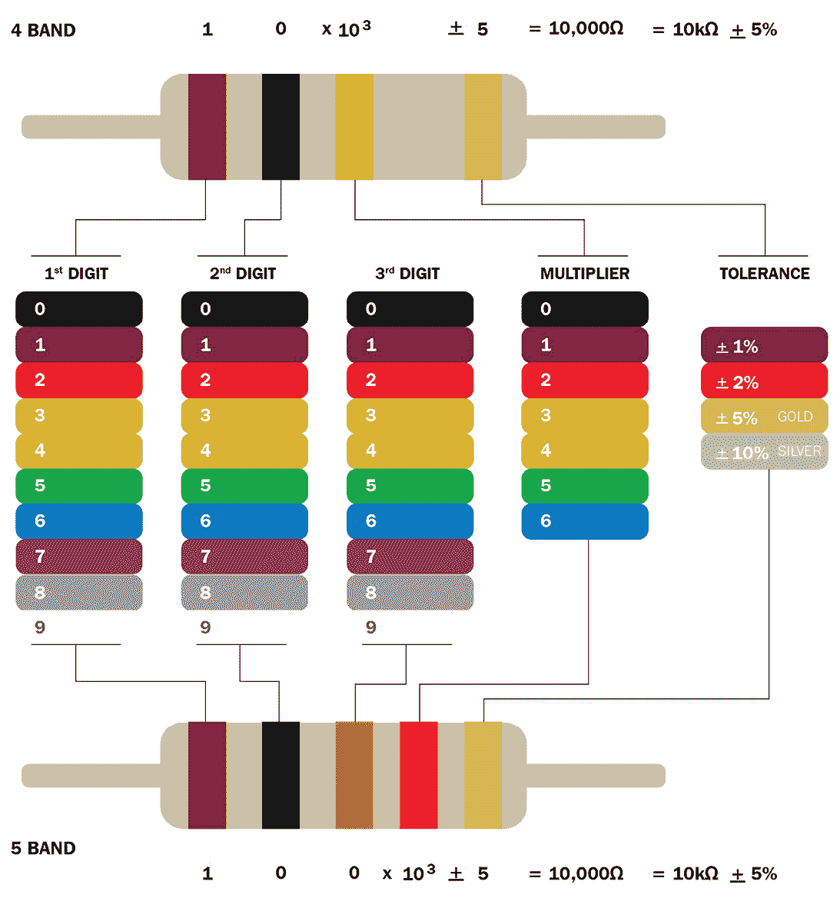
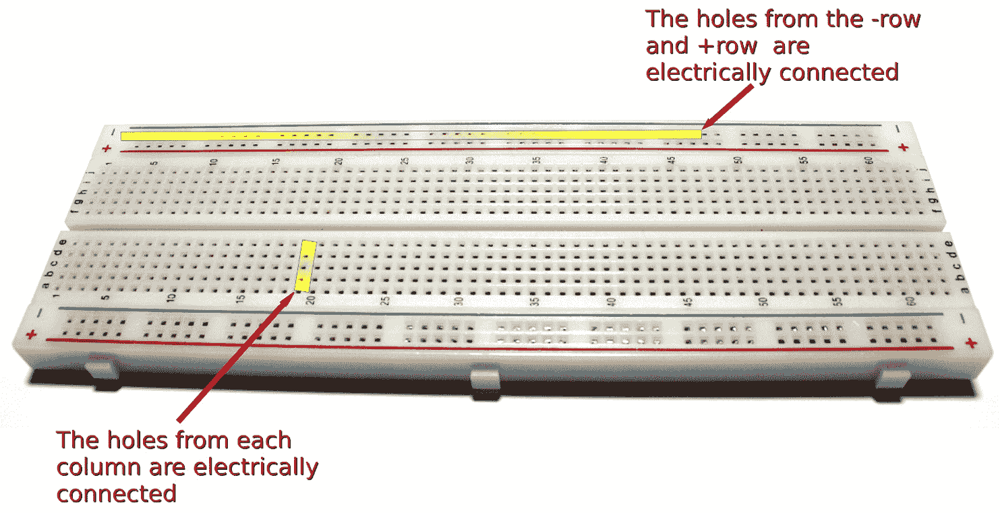
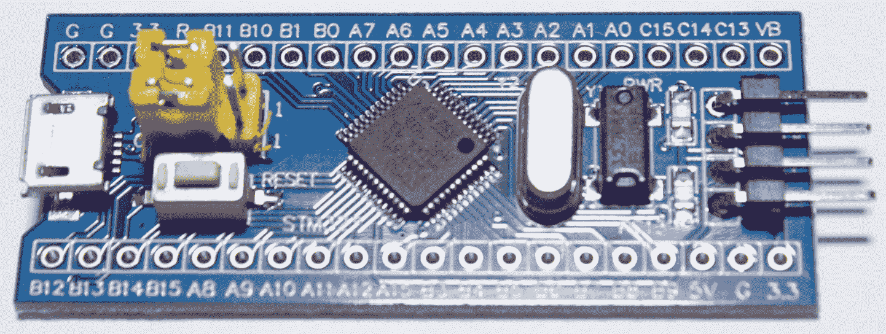
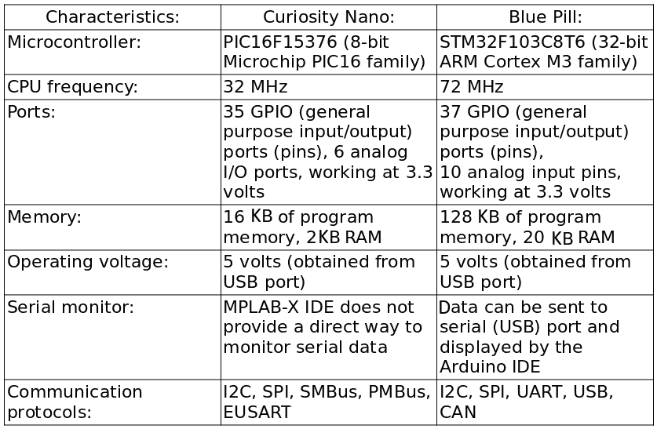
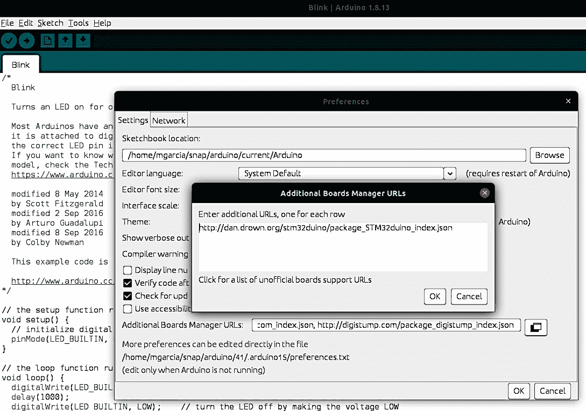

# *第一章*：微控制器和微控制器板简介

在本章中，您将学习如何设置编程微控制器的基本软件工具，以及如何将基本电子元件作为编程初学者示例的起点。我们将从**微控制器**及其定义、它们在我们日常生活中的重要性和应用的一般介绍开始。然后，我们将对第 chapters 中执行的其他微控制器项目所需的数字和模拟电子进行简化解释。在这里，我们还将解释本书项目中可能使用的设备。最后，我们将简要描述本书将使用的**蓝色药丸**和**好奇纳米**微控制器板。

具体来说，我们将涵盖以下主要主题：

+   微控制器简介

+   执行本书项目所需的模拟和数字电子概述

+   蓝色药丸和好奇纳米微控制器板的描述

我们还将介绍如何安装编程蓝色药丸和好奇纳米所需的软件驱动程序和**集成开发环境**（**IDEs**）。完成本章介绍后，您将能够应用您关于集成开发环境（一种软件工具）安装的知识，来编写用于使 LED 闪烁的强制性的*Hello World*程序。这将使用 C 语言在蓝色药丸和好奇纳米上运行。如果您目前对 C 编程了解不多，请不要担心；我们为您准备了内容；*第二章*，*微控制器板的软件设置和 C 编程*，包括一个温和但简洁的 C 编程教程。

# 技术要求

本书描述的两个微控制器板（蓝色药丸和好奇纳米）可以使用不同的 IDE 进行编程。IDE 是一种包含代码编辑器、编译环境、调试选项等在内的编程和调试软件工具。许多 IDE 也用于通过 USB 端口连接上传编译后的程序到微控制器板。

这些是您需要在计算机上安装的 IDE：

+   **Arduino IDE**：这是一个最初为编程 Arduino 微控制器板而创建的免费 IDE，但如果您为其安装了一个库，您也可以用它来编程蓝色药丸微控制器板。

+   **MPLAB® X IDE**：由 Curiosity Nano 制造商 Microchip 开发。这是一个用于编程 Curiosity Nano 的免费 IDE。

我们将在本章中解释如何安装和使用这些 IDE。

本章中使用的代码可以在本书的 GitHub 仓库中找到：

[`github.com/PacktPublishing/DIY-Microcontroller-Projects-for-Hobbyists/tree/master/Chapter01`](https://github.com/PacktPublishing/DIY-Microcontroller-Projects-for-Hobbyists/tree/master/Chapter01)

本章的“代码在行动”视频可以在以下链接找到：[`bit.ly/3zSOg8O`](https://bit.ly/3zSOg8O)

对于硬件，你需要以下材料：

+   一款普通的 LED 灯——任何颜色都可以。

+   220 欧姆电阻；0.25 瓦。

+   无焊接面包板，用于连接 LED 和电阻，以及一些公对公跳线，以在组件和微控制器板之间建立电气连接。

+   用于连接你的微控制器板到计算机的 micro USB 线。

+   当然是 Blue Pill 和 Curiosity Nano 板！Blue Pill 板有几个供应商和制造商，它使用 STM32F103C8T6 微控制器。对于 Curiosity Nano，我们使用名为*PIC16F15376 Curiosity Nano PIC® MCU 8-Bit 嵌入式评估板*的版本，产品编号 DM164148，由 Microchip 制造。

+   需要一个编程适配器，例如**ST-Link/V2**。这个电子接口将允许你将编译后的代码上传到 Blue Pill，从你的计算机到 Blue Pill 微控制器板建立通信。ST-Link/V2 需要四根公对公杜邦线。

本书中使用的一些传感器可以以实用模块的形式在传感器套件中找到，例如 Kumantech 37 合 1 传感器套件：

[`www.kumantech.com/kuman-new-version-37-sensor-module-robot-project-starter-kit-for-arduino-r3-mega2560-mega328-nano-uno-raspberry-pi-rpi-3-2-model-b-b-k5_p0017.html`](http://www.kumantech.com/kuman-new-version-37-sensor-module-robot-project-starter-kit-for-arduino-r3-mega2560-mega328-nano-uno-raspberry-pi-rpi-3-2-model-b-b-k5_p0017.html).

此套件可以与多种类型的微控制器板一起使用，包括 Blue Pill 和 Curiosity Nano。有时，购买这样的传感器套件进行实验其传感器模块是很方便的。其他一些套件包括电阻和代码示例等组件。

# 微控制器简介

在本节中，我们将重点介绍什么是微控制器以及它的主要部分。了解微控制器的能力以及它们作为许多**嵌入式系统**的基本组成部分是如何使用的非常重要，这样它们就可以用于实际项目。嵌入式系统是一种计算机子系统，通常作为更大计算机系统的一部分运行，例如，包含微控制器的无线路由器。让我们从微控制器的定义开始。

微控制器（也称为微控制器单元，或 MCU）是一个非常小的、封装在**集成电路**（**IC**）中的计算机系统。它封装了执行任务所需的所有计算组件，执行数值计算，从传感器读取数据，在内存中保存数据和程序，并将数据发送到执行器，以及其他动作。大多数微控制器执行**模拟-数字**转换（ADC），从传感器获取模拟数据并将其转换为数字值。关于 ADC 的更多内容将在*第四章*中解释，*使用光敏电阻测量光照量*。数字值由二进制值（1 或 0）定义。下一节将更详细地解释这些值。

微控制器内部有一个像**心跳**一样的时钟信号，它协调微控制器中任务和其他动作的执行。这个时钟信号没有微处理器（用于台式电脑和笔记本电脑）那么快，但对于执行基本操作，如读取传感器或控制电机来说已经足够了。它们的内部内存有限，但足以存储运行特定任务的程序。一般来说，微控制器不使用外部数据存储设备，如硬盘。它们运行所需的一切都封装在其集成电路（IC）中。

集成电路（IC）是一个密集封装在小型扁平塑料件中的电子电路。它包含许多微小的电子组件和电连接引脚。集成电路以不同的封装方式制造。**双列直插封装**（**DIL**）容纳两排电连接引脚。**四列扁平封装**（**QFP**）每侧有 8-70 个引脚，适用于表面贴装焊接。微控制器以及其他电子部件都封装在集成电路中。

一些微控制器的引脚使用 DIL 封装组织成两排。其他集成电路，如 STM32 微控制器，有四排引脚，这被称为 QFP。

微控制器也被称为**芯片上的计算机**。它们通常功耗低，当然，体积也小。其中一些甚至比指甲盖还小！微控制器通常用于执行特定任务和执行特定应用，例如一次控制咖啡机的内部功能。微控制器适用于需要专用和有限计算机功能的情况。

## 微控制器板

**微控制器板**是一个包含微控制器和其他支持组件（如分压器/移位器、USB 接口、连接引脚、电阻、电容器和外部时钟）的电子电路。

微控制器板的目的在于便于将外部设备、传感器和执行器连接到微控制器上，从而加速项目原型设计。例如，Blue Pill 微控制器板在其中心包含其微控制器，并且它还有一些支持其功能的其他组件。

类似于 Blue Pill 的微控制器板具有**输入/输出 (I/O) 端口**，或引脚，传感器、电机和其他电子组件和设备都连接到这些端口上。这些板将通过端口读取或向它们发送数据。这些板还具有有用的引脚，如地线和电压引脚，因此传感器和其他组件可以连接到它们以工作。一些 I/O 引脚读取来自传感器的模拟电压或将模拟电压发送到执行器（例如，电机），而其他则是用于读取和发送数字电压的数字引脚，通常是 0 和 5 伏特，或 0 和 3.3 伏特。所有计算机（包括微控制器）都使用包含 0 和 1 的数字二进制数进行内部工作。二进制值 0 由 0 伏特表示，二进制值 1 由 3.3 或 5 伏特表示。例如，发送到数字端口的数字值（1）可以打开连接到它的 LED。

下一节定义了什么是电子学，以及什么是模拟电子学和数字电子学。这些定义对于理解某些电子组件和电子电路的工作原理非常重要，这些内容将在本书的章节中使用。

# 本书中项目所需的模拟和数字电子学的概述

**电子学**是技术和物理学的一个分支，涉及电子在导体、半导体、气体或真空中移动的发射和行为。电子学还涉及电子电路和设备的设计。*图 1.1* 展示了一个基本电子电路的图，该电路由电源（电池）、电阻和光源（发光二极管，或 LED）组成：



图 1.1 – 电子电路的示例

电子从电池的负极（黑色）通过电路流向 LED，从而点亮它。如果你现在还不理解这个电路及其组件，请不要担心。我们将在接下来的段落中回顾这些内容，并在其他章节中使用它们。模拟电子学是提供和处理连续变量电压信号的电子电路，例如，从 0 伏特变化到 3.3 伏特的模拟电压。相反，数字电子学提供和处理代表二进制值的离散电压信号。例如，0 伏特代表二进制中的`0`，而 3.3 伏特代表二进制中的`1`，之间不使用其他电压。这就是计算机和微控制器在最低级别内部工作的方式。微控制器将模拟值转换为数字值，以便处理传入的信号，然后以数字方式处理它们。这被称为**模数转换**（**ADC**）。我们需要了解其他章节中将要涵盖的四个关键电子术语，这些是用于测量电子流动的标准单位：

+   **电流**：电流是电路中电子流动的速度。电子从电源的负极（如电池）通过导电材料流向正极。这被称为**直流**（**DC**）。负极被称为地（GND，或 G），有时也称为地球。电流以安培或*amps*（安培）为单位测量，用字母*I*或*i*表示。

+   **电压**：这是电子电路中电源正负极之间电势能差的电测量。它以伏特（V）为单位测量。它被认为是电路电源的*压力*推动带电电子（电流）通过电/电子电路。

+   **功率**：功率是测量电路或设备将能量从一种形式转换为另一种形式的速率的量度。功率以瓦特（W）为单位测量。例如，60 瓦的灯泡比 40 瓦的灯泡更亮，因为 60 瓦的灯泡以更高的速率将电能转换为光能。

+   **电阻**：电导体的电阻是测量电子通过导体传递电流难易程度的量度。它以欧姆为单位测量，用希腊字母欧米茄（Ω）表示。欧姆定律描述了许多电导材料的导电性。它规定，导体两点之间的电流与两点之间的电压成正比，其中其电阻是恒定的。这个定律可以用数学公式 I=V/R 来描述，这对于计算电子电路中的电流、电压或电阻非常有用。

在本节中，我们介绍了电子电路中使用的标准测量单位的基本知识，您将在本书的所有章节中应用这些知识。下一节将介绍在开始实验电子电路和微控制器板之前您也需要了解的重要电子元件。

## 基本电子元件

以下是在许多微控制器板项目和本书中描述的大多数项目中常用的电子元件。它们使我们能够控制电子电路中的电流。我们将回顾四个主要电子元件：**电阻**、**二极管**、**电容器**和**晶体管**。

### 电阻

**电阻**通常用于减少电子电路中的电子流动。电阻对于允许某些组件（如 LED）在电路中正常工作而不烧毁是有用的。电阻中的电阻水平可以是**固定**的或**可变**的。一些电阻的阻值可以从一到数千欧姆（千欧或 kΩ）到数百万欧姆（兆欧或 MΩ）。电阻还通过其功率额定值来衡量，以瓦特为单位。这指的是它们在不过热并损坏的情况下可以承受的电流量。

*图 1.2*展示了如何读取电阻的值：



图 1.2 – 一个显示如何计算电阻值的图表。图片来源：“电阻色码”，由 Adim Kassn 提供，许可协议为 CC-BY-SA-3.0

重要提示

如*图 1.2*所示，色带颜色为：

0: 黑色

1: 棕色

2: 红色

3: 橙色

4: 黄色

5: 绿色

6: 蓝色

7: 紫色

8: 银色

9: 白色

1%公差的色带是棕色，2%是红色，5%是金色，10%是银色。您可以通过此链接访问彩色图表：[`commons.wikimedia.org/wiki/File:Resistor_color_code.png`](https://commons.wikimedia.org/wiki/File:Resistor_color_code.png)。

常见电阻有四条色带（有些有五条色带，但这在一般电子电路中很少使用）来确定它们的欧姆值：

1.  第一条色带表示其欧姆值的第一位数字。

1.  第二条色带显示第二位数字。

1.  第三条色带表示第三位数字（通常是零的数量）。

1.  第四条色带确定电阻公差，这是电阻精度的度量。例如，如果色带是银色，这意味着电阻将根据其标称值有 10%的公差变化。

在微控制器板项目中使用的许多电阻都是 1/4 瓦电阻，这对于简单应用来说足够了。

## 二极管

**二极管**是一种电子元件，只允许电流单向流动。电路中的电流通过二极管的**阳极（+**）流入，并通过其**阴极（-**）流出。二极管通常用于保护电子电路的某些部分免受反向电流的影响。它们还帮助将**交流电（AC**）转换为直流电，以及其他应用。当我们将电机连接到微控制器板上时，二极管也用于保护微控制器板，以避免电压*反冲*。这发生在当电机供电电流突然中断或减少时，电机两端会出现突然的电压峰值。然而，二极管会导致电压下降约 0.7V。二极管被制造出来可以处理一定量的安培（电流）和电压。例如，1N4004 二极管被评定为可以处理 1 安培（A）和 400 伏特（V），这比我们在本书的项目中使用的要高得多。二极管周围的带子表示阴极，通常连接到电源的地线端子。另一个引脚是阳极，通常连接到电源的正极（+）。一种常见的二极管类型是**发光二极管（LED**），当有电子通过时它会发光。它们有不同的尺寸、颜色和形状。与普通二极管一样，LED 也是极化的，因此电流以一个方向进入和离开 LED。如果过多的电流通过 LED，这将损坏它。你需要串联连接一个电阻来降低其电流，从而保护它。对于许多微控制器板应用，至少 220 欧姆的电阻就足够了。

### 电容

这是一种电子元件，可以暂时存储（储存）电荷。一旦电流停止通过电容，电荷将留在其中，并且一旦电容连接到电路，就可以立即放电。电容可以存储的电荷量以法拉（f）为单位来衡量。由于法拉是一个非常大的数值，许多电容的容量都小于一法拉。电容可以承受一定的最大电压。在微控制器应用中，10V、16V、25V 和 50V 的电容很常见。它们有两种类型：**单片**（它们没有极性）和**电解**（它们有极性）。

电解电容器比单片电容器大，它们的极性通过一个带子在一侧标记阴极引脚，另一个带子标记阳极引脚来表示。记住，阴极引脚连接到电源的接地端，而阳极连接到电源的正电压端。电解电容器的典型值从 1 微法拉到 47,000 微法拉不等。电容器可用于微控制器板项目，用于过滤（清理）数字或模拟信号（去除电气噪声），它们可以将交流电压转换为直流电压等。使用极化（电解）电容器时要非常小心！它们可以储存大量的能量。你永远不应该触摸其引脚（引线），短路，或反向连接。确保在项目中连接电解电容器时，将其正极（+）引脚连接到电路电源的正极（电源是一种为电子电路或电气设备提供稳定电源的电子/电气组件）和将电容器的负极引脚连接到电路电源的负极。尊重其极性。如果你将它们反向（极性错误）连接，它们将会损坏并可能爆炸。单片（陶瓷）电容器没有极性。它们的引脚（引线）在电路中的连接方式无关紧要。电容器的典型容量范围从 0.5 皮法拉到 1 微法拉。

### 晶体管

晶体管可以作为一个非常快速的数字开关。晶体管对于开关高电流电路或设备（如电机和风扇）非常有用。它还可以用作电流放大器，形成逻辑门（**与**、**或**、**非**等）；这种电流也称为负载。流行的且价格低廉的例子有 **BC548** 和 **2N2222** 晶体管。晶体管被设计成可以承受一定量的电流和电压（例如，BC548 晶体管的最大电流为 100 mA 和 30 V）。

*图 1.3* 展示了本节中解释的基本电子组件：


图 1.3 – 电子组件（从左到右显示）：一个电阻器，一个二极管，一个 LED，一个单片电容器和一个晶体管

下一节描述了一个名为无焊面包板（solderless breadboard）的工具，它对于连接电子组件和微控制器板非常有用。

## 无焊面包板

你可以在微控制器板项目中使用的另一个非常有用的部件是无焊面包板，如图 *图 1.4* 所示。它用于电子电路的快速原型设计。它的塑料基座有排成行的电连接插座，有多种尺寸、形状和颜色：



图 1.4 – 面板列和行的连接

请记住，如果你在一行垂直的孔中插入两根电线，那么它们将电连接。标有**–**和**+**符号的水平行在水平方向上是电连接的，如*图 1.4*所示。

本节描述了重要且常用的电子组件，如电阻和 LED，这些组件常用于涉及微控制器板的电子项目中。下一节将描述本书中使用的蓝色药丸和好奇心纳米微控制器板。

# 蓝色药丸和好奇心纳米微控制器板的描述

本节解释了以下照片中展示的蓝色药丸和好奇心纳米微控制器板。它们的上下行孔将连接到引脚头，其中大部分是端口。*图 1.5* 展示了蓝色药丸微控制器板，中间显示了 STM32 微控制器芯片：



图 1.5 – 蓝色药丸微控制器板

*图 1.6* 是好奇心纳米微控制器板的特写。注意其中心显示的 PIC16F15376 微控制器芯片：


图 1.6 – 好奇心纳米微控制器板

板中央的黑色**菱形**组件是微控制器。前几张照片中的两个板还没有引脚头。原因是，在某些项目中，需要将电线和电子组件直接焊接到一个无头板上，尽管在这本书中你不需要这样做。然而，一些好奇心纳米板允许引脚插入并牢固地固定，无需焊接。此外，你可以购买已经焊接好引脚的蓝色药丸。或者，你也可以将引脚头焊接在蓝色药丸和好奇心纳米板的两端。以下是如何焊接电子组件的教程：[`www.makerspaces.com/how-to-solder/`](https://www.makerspaces.com/how-to-solder/).

*图 1.7* 展示了蓝色药丸微控制器板倒置，其引脚头已经焊接好，并有一个独立的引脚行：


图 1.7 – 一个已经将引脚焊接好的蓝色药丸

一旦板上有引脚头，你就可以将它们插入无焊面包板中，并开始使用它们进行原型设计，无需将电线或组件直接焊接在板上，这就是我们将在本书的项目中使用它们的方式。

我们选择这些微控制器板作为本书的示例，因为它们价格低廉、功能多样（你可以将不同类型的传感器、LED 灯、电机等连接到它们），并且编程和使用相对简单。微控制器板极大地简化了短时间内构建原型的工作。你还可以将它们应用于与 COVID-19 相关的项目，我们将在本书的多个地方对此进行回顾。

此外，了解使用不同系列和制造商的微控制器板总是有益的，因为每个板都有不同的功能和优势。Blue Pill 使用 STM32 微控制器系列的微控制器，而 Curiosity Nano 与 PIC 系列的微控制器配合工作。

Blue Pill 有 37 个通用 I/O 引脚，包括端口 PA0 – PA15、PB0 – PB15 和 PC13 – PC15。例如，I/O 端口 PC13 在 Blue Pill 上标记为 *C13*。

Curiosity Nano 有 35 个 GPIO 端口，包括 RA0、R1、RA2、RA3、RA4、RA5、RB0、RB3、RB4、RC7、RD0、RD1、RD2、RD3、RC2、RC3、RB2、RB1、RC4、RC5、RC6 和 RD4 等。我们将在 *第二章* *微控制器板的软件设置和 C 语言编程* 中回顾这些端口的编程。*表 1.1* 展示了本书中使用的两个微控制器板的技术规格：



表 1.1 – Blue Pill 和 Curiosity Nano 的技术规格

Blue Pill 和 Curiosity Nano 的运行速度比大多数 Arduino 微控制器都要高得多。例如，Arduino Uno 微控制器板的运行速度为 16 MHz。

## 安装 IDE

接下来，我们将解释安装和使用 Curiosity Nano 和 Blue Pill 微控制器板 IDE 的必要步骤。

### 为 Curiosity Nano 板安装 MPLAB X IDE

下一步将展示如何下载和安装用于编程 Curiosity Nano 的 MPLAB X 工具。本节还将解释 MPLAB X IDE 的主要部分：

1.  您首先需要登录到免费的 myMicrochip 服务（Microchip 是 Curiosity Nano 的制造商）。填写此网页上的注册表单：[`www.microchip.com/wwwregister/RegisterStep1.aspx`](https://www.microchip.com/wwwregister/RegisterStep1.aspx)。

1.  注册后，从以下链接下载 MPLAB X IDE：[`www.microchip.com/mplab/mplab-x-ide`](https://www.microchip.com/mplab/mplab-x-ide)。

1.  前往 **下载** 选项卡，根据您使用的操作系统下载 IDE。

1.  下载安装程序后，按照以下说明安装 MPLAB X IDE：[`microchipdeveloper.com/mplabx:installation`](https://microchipdeveloper.com/mplabx:installation)。

1.  您还需要下载并安装免费的 XC8 C 编译器来编程 Curiosity Nano。打开此链接：[`www.microchip.com/mplab/compilers`](https://www.microchip.com/mplab/compilers)。

1.  然后，转到**编译器下载**选项卡，根据您的操作系统下载安装文件。

1.  从那里下载 XC8 编译器的最新版本。这个版本适合编程本书中使用的 Curiosity Nano 所带的 PIC16F15376 微控制器。请按照以下链接中的说明安装 XC8 编译器：[`microchipdeveloper.com/xc8:installation`](https://microchipdeveloper.com/xc8:installation)。

下载 XC8 编译器可能需要一些时间，所以请耐心等待。下一节将描述 MPLAB X IDE 中常用的组件。

#### 理解 MPLAB X IDE 的主要组件

本节描述了您将用于编辑程序、编译程序等 IDE 的主要部分。

*图 1.8*是 MPLAB X IDE 的截图：


图 1.8 – MPLAB X IDE 的主要部分

在*图 1.8*中描述的主要部分包括文本编辑器（代码区域），它将在本书的其他章节中使用。IDE 中最重要的按钮之一是**运行**按钮，它编译、运行并将二进制（编译）文件上传到 Curiosity Nano 板。

下面是启动新编码项目的步骤：

1.  点击**文件/新建项目**以创建一个新的项目。

1.  点击**代码**选项卡，并在代码区域开始编写您的代码。

1.  点击**运行**图标以编译并将您的代码上传到微控制器板。控制台将显示有关进程的消息，并确定一切是否按计划进行。

与其他微控制器板（如 Blue Pill）不同，您需要在 Curiosity Nano 微控制器板使用之前配置输入和输出端口。您可以使用一个名为**MPLAB X 代码配置器**（**MCC**）的特殊插件来完成此操作。您应该为 MPLAB X IDE 安装 MCC 插件。MCC 是一个免费的图形编程环境，它有助于配置微控制器端口，以及其他应用。它将生成必要的 C 编程头文件库，用于从微控制器端口读取数据和向微控制器端口写入数据。

此网页解释了如何在 MPLAB X IDE 中安装 MCC：[`www.microchip.com/mplab/mplab-code-configurator`](https://www.microchip.com/mplab/mplab-code-configurator)。

安装它的最简单方法是点击 MPLAB X IDE 主菜单上的**工具/插件**，然后从那里下载并安装。

我们已经创建了一个 MPLAB X 项目模板，其中我们为 Curiosity Nano 配置了输入和输出端口，并处理了其上的数字和模拟数据。我们已使用 MCC 插件设置 I/O 端口，因此您可能不再需要为本书中解释的项目和其他项目使用 MCC 插件。这是一个方便的模板，因为它包含了处理 Curiosity Nano 一些端口的输入和输出 C 编程函数所需的所有必要库。我们将在*第二章*中回顾这些库和 C 编程函数，*微控制器板软件设置和 C 编程*。该模板项目名为`16F15376_Curiosity_Nano_IOPorts.zip`，存储在我们的 GitHub 主页上。

只需下载 zip 文件，解压它，然后在 MPLAB X 中打开项目。

### 安装 Arduino IDE 和 Blue Pill 库

您可以使用 Arduino IDE 来编程 Blue Pill 微控制器板。按照以下步骤安装 Arduino IDE：

1.  从此网站下载 Arduino IDE 的 Windows、macOS 或 Linux 版本：[`www.arduino.cc/en/main/software`](https://www.arduino.cc/en/main/software)。不要忘记下载适合您操作系统的正确 IDE 安装程序。

1.  运行您刚刚下载的安装程序，并按照屏幕上的说明操作。

1.  识别 Arduino IDE 的主要选项。

*图 1.9*显示了 Arduino IDE 及其主要部分和区域。控制台是一个有用的组件，其中 IDE 显示错误或警告消息。状态栏显示程序编译和上传状态：


图 1.9 – Arduino IDE 的主要部分

*图 1.9*显示了 Arduino IDE 的主要部分，包括其代码编辑器、状态栏、菜单栏和控制台。最常用的功能之一是**上传**按钮，它编译您的程序并将其编译后的代码上传到 Blue Pill。以下步骤显示了如何将程序上传到 Blue Pill 以及如何在 IDE 中安装必要的库：

1.  通过点击 Arduino 菜单栏中的**文件/示例/01.基础/Blink**来打开一个示例程序。这将帮助您熟悉 Arduino IDE。一个名为*Blink*的程序将打开。点击**验证**按钮来编译它并为微控制器板生成二进制文件。**上传**按钮将验证、编译、生成二进制文件，然后将文件上传到微控制器板。

1.  在将程序上传到 Blue Pill 之前，您需要在 Arduino IDE 上安装一个库来编程 Blue Pill。要安装 Blue Pill 库，从 IDE 的**菜单栏**点击**File/Preferences**。然后，将出现一个新窗口。点击**Additional Boards Manager URLs**右侧的小窗口图标，并添加以下链接以安装库：[`dan.drown.org/stm32duino/package_STM32duino_index.json`](http://dan.drown.org/stm32duino/package_STM32duino_index.json)，如图*图 1.10*所示：

    ```

    图 1.10 – 写入链接库的 IDE 的偏好设置选项

1.  在*图 1.10*所示的上端窗口中点击**OK**（**Additional Boards Manager URLs**），然后在**Preferences**窗口中点击**OK**按钮。

1.  现在，在**菜单栏**上，转到**Tools/Board/Boards Manager**。这将打开**Boards Manager**对话框。

1.  确保您选择`STM32F1xx`，并仅安装窗口上出现的包。

1.  关闭该窗口，点击**Tools/Board/STM32F1 Boards**，然后选择**Generic STM32F103C series**选项，如图所示的以下截图。确保其变体为**64k Flash**，上传方法为**STLINK**，其 CPU 速度为**72MHz, Optimize: Smallest**。*图 1.11*显示了 IDE 中的 Blue Pill 配置：


图 1.11 – 包含 Blue Pill 所需选项的工具菜单

IDE 应该已经准备好开始为 Blue Pill 编写代码了。在那之前，我们需要安装一个名为**ST-Link/V2**的接口，以便将我们的代码上传到 Blue Pill。与其他微控制器板不同，我们不能通过 micro-USB 线直接将编译后的程序上传到 Blue Pill。一种简单的方法是使用 ST-Link/V2 接口，这是一个**单线接口模块**（**SWIM**），仅使用四根线。

ST-Link/V2 是一个 USB 接口，用于编程和调试 STM32 微控制器应用程序，主要用于将程序上传到 Blue Pill 微控制器板。

在连接 ST-Link/V2 之前，您需要在您的计算机上安装其驱动程序。以下解释了如何在 Windows 上安装 ST-Link/V2 驱动程序。从以下链接下载驱动程序：[`www.st.com/en/development-tools/stsw-link009.html`](https://www.st.com/en/development-tools/stsw-link009.html)。

下载并解压 zip 文件，根据您是否使用 32 位或 64 位计算机运行`dpinst_amd64.exe`或`dpinst_x86.exe`。大多数最新的都是 64 位。按照显示的说明安装其驱动程序。

这里是安装 ST-Link/V2 到 macOS 的说明：[`www.st.com/en/development-tools/stsw-link007.html#overview`](https://www.st.com/en/development-tools/stsw-link007.html#overview)。

这里是安装 ST-Link/V2 到 Linux 的说明：[`freeelectron.ro/installing-st-link-v2-to-flash-stm32-targets-on-linux/`](https://freeelectron.ro/installing-st-link-v2-to-flash-stm32-targets-on-linux/)。

重要提示

如果你在 Linux 上运行 Arduino IDE，请以 root 用户身份运行 IDE 以获取 USB 访问权限。

或者，你可以尝试这个开源工具集，用于在 Windows、macOS 或 Linux 上安装 ST-Link/V2：[`github.com/stlink-org/stlink`](https://github.com/stlink-org/stlink)。

Arduino IDE 提供了一个串行监视器，可以通过点击 IDE 主菜单中的 **工具/串行监视器** 来访问。它将通过使用特殊的编码函数显示从 Blue Pill 发送到 USB 串行端口的 数据。*第五章*，*湿度与温度测量*，解释了如何使用串行监视器。它可以用于在计算机屏幕上显示从传感器获得的数据、变量的值以及其他类似操作。

下一节将描述如何使用 MPLAB 和 Arduino IDE 运行一个简单的程序，该程序将使 LED 每秒闪烁一次。这将是一个实用的例子，帮助你熟悉编程 Blue Pill 和 Curiosity Nano 板。

# 你的第一个项目——闪烁的 LED

这个小型项目演示了如何将 LED 连接到微控制器板，以及如何编程其 I/O 端口，以便你可以不断循环地打开 LED，等待 1 秒（1,000 毫秒），关闭 LED，再等待另一秒，然后再次打开 LED。

该项目还演示了如何将编译后的程序上传到微控制器板。这是一个重要的入门项目，因为你以后可以重用此代码来向端口发送信号并控制更复杂的应用，例如风扇。这就像是微控制器板的 *Hello World* 项目！我们将使用各自的 IDE 在 Blue Pill 和 Curiosity Nano 微控制器板上运行此项目。

## 使用 Blue Pill 板运行闪烁的 LED 示例

这个小型项目演示了如何使 LED 亮 1 秒，然后熄灭 1 秒，重复进行。当然，它还演示了如何从 Blue Pill 中声明和使用 I/O 端口作为输出。

小贴士

在开始之前，当你操作 Blue Pill 和 Curiosity Nano 板时要小心。它们可能会被你身体上的静电损坏，所以在操作它们之前应该触摸一个大金属区域，如桌架。你也可以佩戴防静电腕带。通过这样做，你可以释放你的静电。一般来说，避免用裸手触摸排针。

我们现在将探讨如何将电子元件连接到无焊面包板和 Blue Pill：

1.  您需要将 Blue Pill 板插入面包板。请小心操作，因为引脚可能会弯曲。

1.  将 LED 连接到面包板。现在，按照以下图示将 220 欧姆电阻的一个引脚连接到 LED 最长的引脚（腿），将电阻的另一个引脚连接到 Blue Pill 上标记为*C13*的引脚。

1.  使用一根电线将 LED 最短的引脚连接到 Blue Pill 上标记为*G*或*GND*的接地引脚。记住，面包板每列的孔是内部相连的。

1.  现在，按照以下方式将 ST-Link/V2 模块引脚连接到 Blue Pill 引脚。ST-Link/V2 引脚在其一侧标记。Blue Pill 的引脚在其底部标记。

1.  将 Blue Pill 的 CLK 引脚连接到 ST-Link/V2 的 SWCLK 引脚。

1.  将 Blue Pill 的 DIO 引脚连接到 ST-Link/V2 的 SWDIO 引脚。

1.  将 Blue Pill 的 GND 引脚连接到 ST-Lin/V2 的 GND 引脚

1.  将 Blue Pill 的 3V3 引脚连接到 ST-Link/V2 的 3.3 V 引脚。

ST-Link/V2 和 Blue Pill 之间的连接关系如图*1.12*所示：


图 1.12 – Blue Pill、LED 和 ST-Link/V2 的连接

*图 1.12*显示了我们所做的连接。请注意，这里在 Blue Pill 和 ST-Link/V2 之间连接了四根杜邦线。*图 1.13*显示了 Blue Pill 和 ST-Link/V2 之间连接的图片：


图 1.13 – 包含 ST-Link/V2 的 Blue Pill 连接

一旦将 Blue Pill 连接到 ST-Link/V2，我们将继续以下步骤：

1.  将 ST-Link/V2 插入您的计算机。同时，从 Blue Pill 上断开 micro-USB 线缆（图片中的白色线缆）。在将程序上传到 Blue Pill 时不需要这个。

1.  从书中 GitHub 仓库的“第一章”文件夹中下载名为`Blink_Blue_Pill.ino`的程序。

1.  从 GitHub 下载`.ino`文件，并使用 Arduino IDE 打开它，这将创建一个新的文件夹来存储程序。这是 Arduino IDE 的正常做法。如果您目前还不理解代码，请不要担心。我们将在下一章解释其 C 代码编程。

1.  点击 IDE 上的上传图标以编译并将程序上传到 Blue Pill。如果一切顺利，您将看到 Blue Pill 的板上 LED 和您连接的 LED 每秒闪烁一次。板上 LED 内部连接到 PC13 引脚。尝试通过更改`delay(1000)`函数中的 1,000 毫秒值来改变闪烁速率。

1.  一旦你将程序上传到 Blue Pill，就不再需要将 ST-Link/V2 连接到它，所以如果你想的话可以断开连接。现在你可以将 Blue Pill 的 micro USB 线缆连接到你的电脑或一个 USB 电池组。你的编译后的程序将被保存在 Blue Pill 的内存中，每次你给它供电时都会运行。

现在你已经完成了！你已经用 Blue Pill 完成了你的第一个电子电路。如果你的 LED 在闪烁，做得好！

此项目也可以使用 Arduino 微控制器板，如 Arduino Uno 完成。只需在 Arduino 代码中更改端口号，并使用 Arduino IDE 编译和上传程序。在代码中将端口号 `13` 替换为 `PC13`，并将电阻连接到 Arduino Uno 板的数字端口 13。

## 在 Curiosity Nano 板上运行闪烁 LED 示例

现在，让我们尝试在 Curiosity Nano 板上运行 LED 闪烁示例。我们不需要将接口编程器（如 ST-Link/V2）连接到 Curiosity Nano 上来上传你的程序，因为这个板已经具备了完成此操作所需的硬件和软件组件。以下是连接 Curiosity Nano 和 LED 的步骤：

1.  将 Curiosity Nano 板插入无焊点面包板。请小心操作，因为其腿可能会弯曲。此外，在处理 Curiosity Nano 之前，别忘了触摸一个大的金属物体以释放你身体上的静电。

    将 LED 连接到面包板。现在，将 220 欧姆电阻的一个引脚连接到 LED 的最长引脚，如图 *1.14* 所示。将电阻的另一个引脚连接到 Curiosity Nano 上标有 *RE0* *引脚* 的引脚。RE0 引脚内部连接到 Curiosity Nano 上的黄色 LED：

    

    图 1.14 – 显示 Curiosity Nano 和 LED 连接的示意图

1.  使用线缆将 LED 的最短腿连接到 Curiosity Nano 上标有 *GND* 的地线引脚，如图 *1.14* 所示。Curiosity Nano 上的任何 GND 引脚都可以。记住，每个面包板列的孔是内部连接的。

    带有 Curiosity Nano 的电子电路如图 *1.15* 所示。在此图中，你可以更详细地可视化 LED 和电阻如何连接到板上：

    

    图 1.15 – Curiosity Nano 和其 LED 连接图

1.  使用 micro-USB 线缆将 Curiosity Nano 连接到你的电脑。

1.  现在，让我们下载并运行包含使 LED 在 Curiosity Nano 上闪烁的 C 程序的演示项目。

1.  从书中 GitHub 仓库中位于“第一章”文件夹的 `16F15376_Curiosity_Nano_LED_Blink_Delay.zip` 文件下载。

1.  解压文件，并在 MPLAB X IDE 中打开项目。选择带有`main.c`标签的选项卡。这就是你需要运行的 C 程序。现在，点击 MPLAB X 上的运行图标（绿色的三角形）。

在这一点上，IDE 将编译并将程序上传到板子上。几秒钟后，板上的黄色 LED 和面包板上的 LED 应该每秒闪烁一次。如果这是发生的，那么做得好！

一旦你将 LED 连接到 Curiosity Nano 并看到 LED 每秒闪烁一次，尝试在 IDE 中稍微修改一下代码，使 LED 闪烁更快或更慢。你可以通过更改`__delay_ms(1000);`函数中的毫秒值来实现这一点，并且别忘了该函数的值是以毫秒为单位的（一秒钟有 1,000 毫秒）。

# 摘要

在本章中，我们定义了什么是微控制器，以及它的功能和限制。我们还探讨了集成电路是什么（考虑到微控制器是集成电路的一种类型）以及它们的引脚如何在封装中排列。此外，我们还分析了微控制器板上的端口。了解这一点很重要，因为在未来的某个时候，你将需要识别这些引脚的顺序，以便将传感器或其他设备连接到它们。*表 1.1*显示了 Curiosity Nano 和 Blue pill 的硬件描述和操作电压，均为 5 伏。

然后，我们简要介绍了电子学以及在本章和其他章节中使用的主要电子元件。我们探讨了如何安装两个用于编程本书中使用的两个微控制器板的集成开发环境工具。这两个板有上传编译程序到它们的不同方式。比较两种不同的微控制器板的工作方式，分析它们的性能，并决定你在未来的项目中可以使用哪一个，这是很重要的。

最后，我们在两个微控制器板上展示了初始程序，演示了如何打开和关闭 LED，这可以作为更复杂和详细项目的基准。

下一章包含了一个简洁的 C 语言编程教程，这对于编程剩余章节的练习非常有用。

# 进一步阅读

+   Ball, S. (2002). *嵌入式微处理器系统：现实世界设计.* 马萨诸塞州伯灵顿：Newnes/Elsevier Science.

+   Gay, W. (2018). *STM32 入门：使用 FreeRTOS、libopencm3 和 GCC 进行开发*. 圣凯瑟琳斯：Apress.

+   Horowitz, P., Hill, W. (2015). *电子艺术.* [第 3 版] 剑桥大学出版社：纽约，纽约。

+   Microchip (2019). *PIC16F15376 Curiosity Nano 硬件用户指南*. Microchip Technology, Inc. 可从：[`ww1.microchip.com/downloads/en/DeviceDoc/50002900B.pdf`](http://ww1.microchip.com/downloads/en/DeviceDoc/50002900B.pdf).

+   Mims, F.M. (2000). *入门电子学*. 伊利诺伊州林肯伍德：Master Publishing, Inc.
