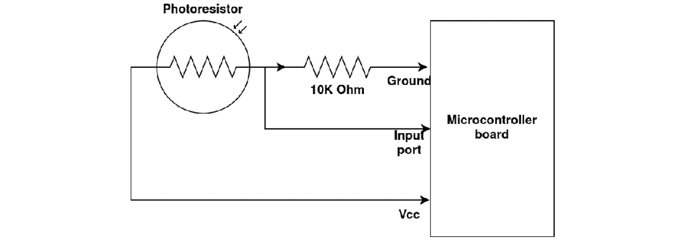
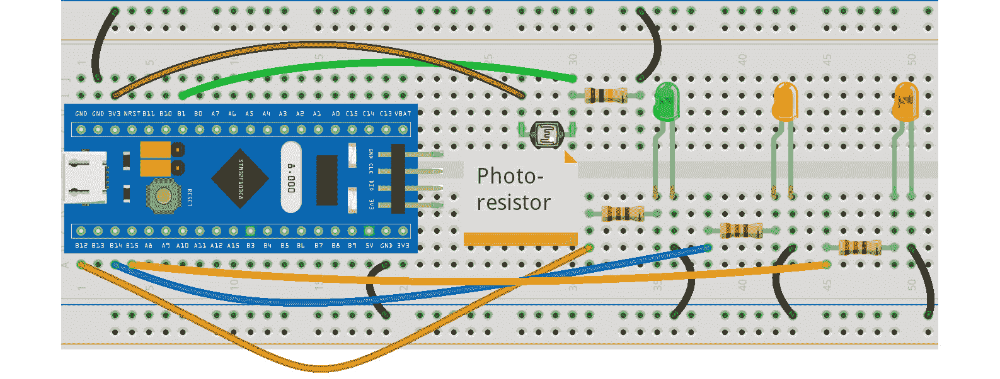
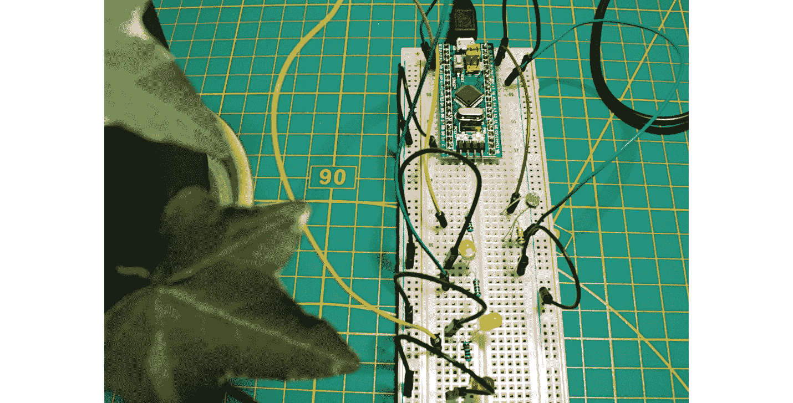
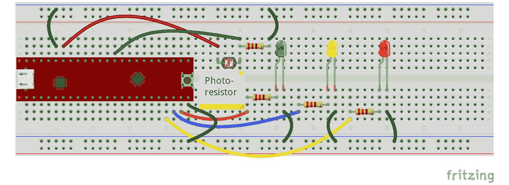
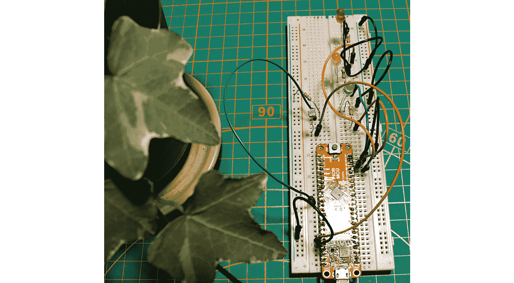
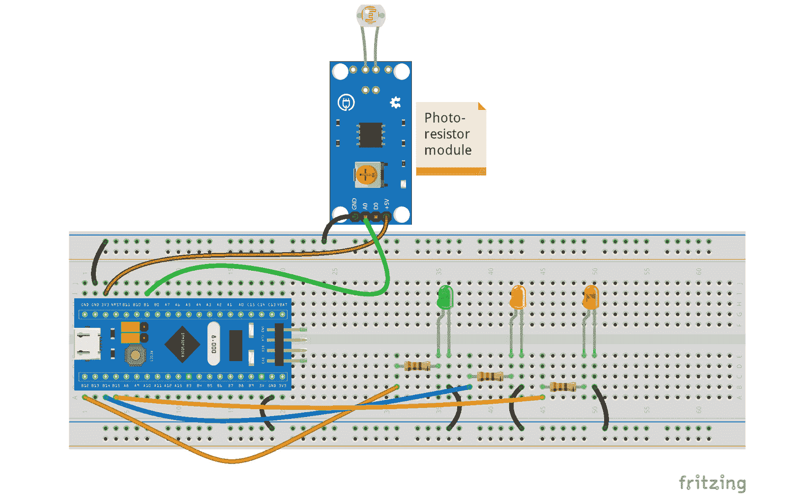
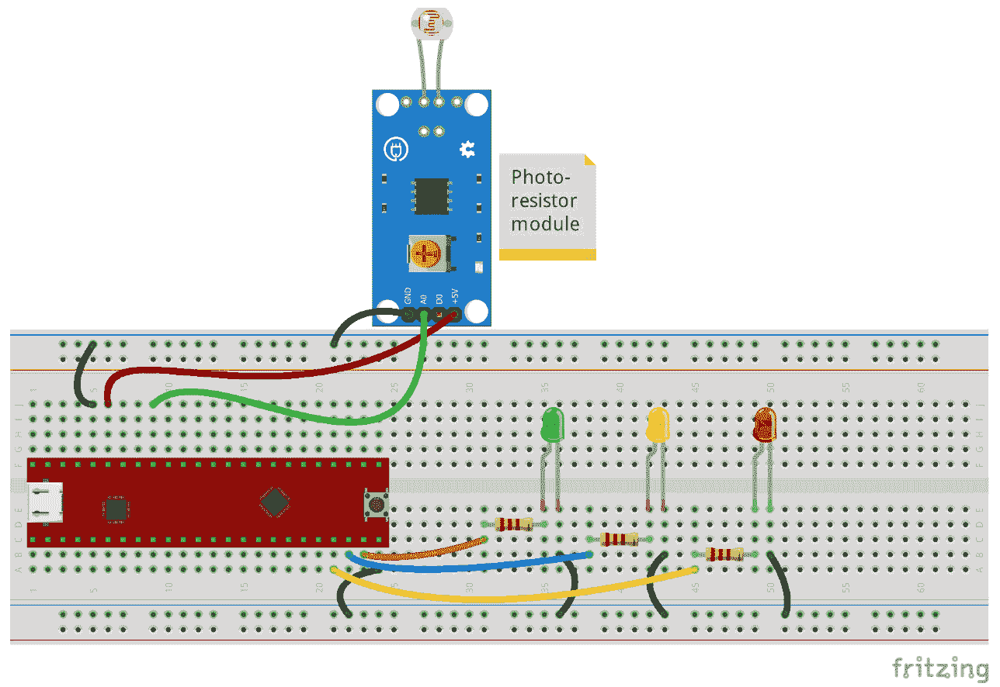
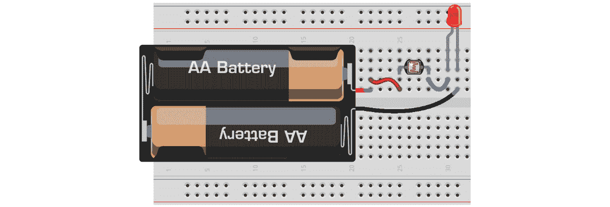

# *第四章*：使用光敏电阻测量光量

本章重点介绍如何将**光敏电阻**（一种测量环境光量的电子元件）连接到蓝牙板和 Curiosity Nano 微控制器板的输入端口。在本章的练习中，我们将使用光敏电阻来分析植物是否接收到了足够的光。

在本章中，我们将涵盖以下主要内容：

+   理解传感器

+   介绍光敏电阻

+   将光敏电阻连接到微控制器板端口

+   编写光敏电阻值并设置端口

+   测试光敏电阻

到本章结束时，你将学会如何将模拟传感器连接到微控制器板，以及如何分析从光敏电阻获得的分析数据。本章中获得的知识和经验将在其他需要使用传感器的章节中非常有用。

# 技术要求

本章中你将使用的软件工具是 Arduino IDE 和 MPLAB-X，分别用于编辑和上传程序到蓝牙板和 Curiosity Nano 板。

本章中使用的代码可以在本书的 GitHub 仓库中找到：[`github.com/PacktPublishing/DIY-Microcontroller-Projects-for-Hobbyists/tree/master/Chapter04`](https://github.com/PacktPublishing/DIY-Microcontroller-Projects-for-Hobbyists/tree/master/Chapter04)

[`github.com/PacktPublishing/DIY-Microcontroller-Projects-for-Hobbyists/tree/master/Chapter04`](https://github.com/PacktPublishing/DIY-Microcontroller-Projects-for-Hobbyists/tree/master/Chapter04)

本章的“代码在行动”视频可以在以下链接找到：[`bit.ly/3gNY4bt`](https://bit.ly/3gNY4bt)

在本章中，我们还将使用以下硬件设备：

+   一个无焊面包板。

+   蓝牙板和 Curiosity Nano 微控制器板。

+   用于将微控制器板连接到计算机的微型 USB 线。

+   用于将编译后的代码上传到蓝牙板的 ST-Link/V2 电子接口。请注意，ST-Link/V2 需要四根公对公的杜邦线。

+   一个绿色、黄色和红色的 LED。

+   三个 220 欧姆电阻，额定功率为四分之一瓦。这些电阻用于 3 个 LED。

+   一个 220 欧姆电阻，额定功率为四分之一瓦，用于连接到 Curiosity Nano 的光敏电阻。

+   一个 10 K 欧姆电阻，额定功率为四分之一瓦。

+   **光敏电阻传感器模块**。

+   三根公对母的杜邦线，用于将传感器模块连接到无焊面包板。

+   一打公对公的杜邦线，用于将电阻和按钮连接到面包板和微控制器板。

下一节将简要介绍光敏电阻、它们的电气特性和在电子项目中的应用。

# 理解传感器

在本节中，我们解释传感器是什么以及传感器模块的重要性。在您在实际微控制器板应用中使用它们之前，例如使用光敏电阻（这是一种有用的传感器类型），首先了解传感器及其用途是很重要的。有关传感器的信息对于后续章节至关重要。

## 定义传感器

**传感器**是一种电子组件、设备或模块，它测量来自环境或特定情况（例如，测量鱼缸中水温的传感器）的物理输入。传感器对于检测物理变量的变化很有用，例如湿度、温度、光、振动和运动等。这些物理变化通过传感器改变其电/电子特性来体现，例如传感器中电阻和导电性的变化。

存在着不同类型的传感器，具有不同的应用。例如，运动传感器可以在它们穿过传感器的视野时检测到人或宠物的移动。如果这个传感器检测到运动，它会向计算机或微控制器板发送信号，然后该板应该对此做出一些操作，例如打开自动门、触发警报、打开灯泡等。其他类型的传感器包括红外线、超声波、温度、压力和触摸传感器。

## 传感器模块是什么？

传感器可以是称为**传感器模块**的小型电子电路的一部分。它除了包含传感器外，还包含其他电子组件，如电阻器、晶体管、LED 和集成电路等。传感器模块中这些额外组件的目的是支持和简化来自传感器的信号读取、分析和传输。一些传感器模块将模拟信号转换为数字数据。模拟数据是电压变化，即从环境中的物理变量到模拟。例如，从温度传感器获得的 0.5 伏特可能相当于 25 摄氏度。来自传感器模块的数字数据可以包含逻辑电平 *高* 或逻辑电平 *低* 值。

注意

表示数字逻辑电平的电压取决于您使用的微控制器板。Blue Pill 和 Curiosity Nano 微控制器板的 I/O 端口都使用 3.3 伏，相当于逻辑电平高。逻辑电平低相当于 0 伏。

从传感器发出的模拟信号通过电线或无线通信介质（例如，蓝牙）电子方式发送到微控制器板，该板将对其进行处理，然后对其进行一些操作，如图 *图 4.1* 所示：


图 4.1 – 连接到微控制器板端口的温度传感器

来自传感器的数据（如图 *图 4.1* 中的图所示）由微控制器板的输入端口读取。这些数据可以调整并显示为人类可读的格式（例如，在显示屏上以摄氏度或华氏度显示温度）。来自传感器模块的模拟和/或数字信号也是如此。其数据通过有线或无线介质发送到微控制器板的端口或端口。

注意

通过编码，微控制器板的端口可以设置为输入或输出端口。请参阅 *第二章*，*微控制器板的软件设置和 C 语言编程*，了解如何编程它们。

下一节将重点介绍光敏电阻，这是一种常用的传感器类型，描述其功能、表示方法和应用。

# 介绍光敏电阻

本节向您介绍光敏电阻，它在许多应用中非常有用，例如，用于测量光量。在本章中，我们将定义光敏电阻是什么，它们的分类，以及它们如何连接到电子电路。

**光敏电阻**是一种由光敏材料制成的电子元件，根据其检测到的可见光量改变其电阻。光敏电阻有多种类型。其中一些检测 **紫外线**（**UV**）光，而另一些检测红外光。后者用于电视，其红外光传感器从遥控器接收数据。*图 4.2* 显示了本章示例中使用的常见光敏电阻。本章中使用的光敏电阻检测人类可见的光。它不检测红外光或紫外线。


图 4.2 – 典型的光敏电阻

从 *图 4.2* 中，您可以看到光敏电阻有两个引脚（也称为腿）。它们连接到与普通电阻类似的电子电路，因此光敏电阻没有极性。它们作为普通电阻工作，其电阻根据通过其透明盖板接收到的光量而变化。以下是光敏电阻的一些技术规格：

+   尺寸：直径 5mm（宽度）

+   电阻范围：200 K 欧姆（暗态）到通常 5 K 到 10 K 欧姆，在接收到全亮度时几乎为 0 欧姆。

+   电源：最高 100V，平均电流小于 1 毫安，具体取决于电源电压。

*图 4.3* 显示了一个包含光敏电阻的电气图以及如何将其连接到微控制器板。



图 4.3 – 含光敏电阻的电气图

如*图 4.3*所示，光敏电阻的电气符号用一个圆和一些指向圆的箭头表示，这表明光线正在照射光敏电阻的表面。光敏电阻连接到微控制器板的**地**（Ground）引脚，另一个引脚连接到电压引脚（**Vcc**）和微控制器板的**输入端口**。这是连接光敏电阻的一种方式。**10K 欧姆**电阻作为下拉电阻使用。这是因为当光敏电阻没有接收到任何光线时，连接到光敏电阻的输入端口将接收零伏特。请记住，我们不应该让输入引脚没有连接到任何东西，否则其状态将是浮动的（输入随机电压）。

注意

光敏电阻应该连接到微控制器板的一个模拟输入端口，因为该端口将接收来自光敏电阻的变化电压，因为光敏电阻呈现的电阻将根据光敏电阻接收到的光照量而变化。

下一节将解释如何连接和使用光敏电阻，以测量环境中的光照量，无论是在 Blue Pill 板还是在 Curiosity Nano 板上。

# 将光敏电阻连接到微控制器板端口

本节展示了如何将光敏电阻连接到 Blue Pill 和 Curiosity Nano 板，以*读取*环境中的光照量（例如，客厅）。

在本节中，我们还将解释如何使用三个 LED 灯来指示房间是否得到良好的照明：通过点亮绿色 LED 灯表示房间照明良好，通过点亮黄色 LED 灯表示光线较暗，或者通过点亮红色 LED 灯表示房间昏暗。带有光敏电阻传感器的电子电路可以放置在植物附近，该电路可以用来判断植物是否需要更多的光照。下一节将展示如何使用 Blue Pill 板构建电路。

## 将光敏电阻连接到 Blue Pill 板

将光敏电阻传感器连接到 Blue Pill 微控制器板的连接很简单。只要使用下拉电阻，就可以直接连接到输入模拟端口。*图 4.4*中所示的电路描述了如何进行连接，它基于*图 4.3*中的电气图。



图 4.4 – 连接到 Blue Pill 板的 LED 灯和光敏电阻

如*图 4.4*所示，三个 LED 灯将显示光敏电阻检测到的光照量。以下是连接组件到 Blue Pill 板的步骤：

1.  将 Curiosity Nano 的 GND 引脚连接到无焊面包板的上下轨，如*图 4.4*所示。

1.  将光敏电阻的一个引脚连接到微控制器板标有**3V3**的接地引脚。

1.  将光敏电阻的另一端连接到 Blue Pill 上标记为**B1**的引脚。**B1**将被用作模拟输入端口。

1.  将一个**10K 欧姆**电阻连接到地以及连接到 Blue Pill 输入端口**B1**的光敏电阻的腿。

1.  现在，将电阻连接到 Blue Pill 的输出端口**B12**、**B14**和**B15**。

1.  作为最后一步，将绿色、黄色和红色 LED 的正极连接到三个电阻，然后将 LED 的负极连接到地。

Blue Pill 的 3V3 引脚提供 3.3 伏，这对于施加电压（供电）到光敏电阻是足够的。

重要提示

不要将**5 伏**（**5V**）应用到 Blue Pill 的输入端口，因为这样可能会损坏 Blue Pill。这就是为什么你需要将 3V3 电压引脚连接到光敏电阻，这样它将提供高达 3.3 伏的模拟电压输出，而 Blue Pill 将使用这电压来测量光量。记住，来自光敏电阻的电压将根据其电阻而变化。

我们将一个**10K 欧姆**下拉电阻连接到 Blue Pill 的输入端口**B1**，如图*图 4.4*所示，强制端口在没有来自光敏电阻的电压时具有 0 伏输入。记住，输入端口应该接收一些电压，甚至 0 伏，以避免随机电压。

注意

根据你想要检测的光照水平范围，你可能想要尝试将*图 4.4*中连接到 Blue Pill 的下拉 10K 欧姆电阻的值改为不同的值。

*图 4.5*显示了所有组件如何连接到微控制器板。此电路基于*图 4.4*中显示的 Fritzing 图。



图 4.5 – 将光敏电阻和 LED 连接到 Blue Pill

如*图 4.5*所示，光敏电阻连接到 Blue Pill 的端口 B1。绿色 LED 亮起，意味着植物接收到的光量应该是正常的。记住，你需要将 ST-Link/V2 电子接口连接到 Blue Pill，以便从 Arduino IDE 上传程序，如*第一章*，*微控制器和微控制器板简介*中所述。

在本节中，你学习了如何将易于使用的光敏电阻连接到 Blue Pill 板，以及如何通过 LED 显示其值。

下一节描述了如何编写*图 4.4*和*图 4.5*中所示的光敏电阻示例的代码。

# 编写光敏电阻值和设置端口

本节展示了如何编写 Blue Pill 应用程序以从光敏电阻读取数据。

以下代码应在*图 4.4*和*图 4.5*所示的微控制器板电路中运行：

```cpp
int photoresistorPin = PB1;
int photoresistorReading;
void setup(void) {
    pinMode(PB12, OUTPUT); 
    pinMode(PB14, OUTPUT); 
    pinMode(PB15, OUTPUT); 
}
void loop(void) {
    photoresistorReading = analogRead(photoresistorPin); 
    digitalWrite(PB12, LOW);
    digitalWrite(PB14, LOW);
    digitalWrite(PB15, LOW);
    if (photoresistorReading < 600) { 
        digitalWrite(PB15, HIGH);
    } else if (photoresistorReading < 1000) {  
        digitalWrite(PB14, HIGH);
    } else {
        digitalWrite(PB12, HIGH);  
  }
  delay(500);
}
```

如您从代码中看到的，其中最重要的功能之一是：`analogRead(photoresistorPin);`。内部，该函数将执行一个`pinMode()`函数来声明 PB12、PB14 和 PB15 端口为输出。

代码可以从本书的 GitHub 仓库下载。其文件名为`photoresistor_bluepill.ino`。仓库中的代码包含有用的注释，解释了其中使用的函数和变量。

注意

您可以在 Arduino Uno 等 Arduino 微控制器板上运行相同的 Blue Pill 代码。只需将 Blue Pill 的输入端口 PB1 更改为 Arduino 的模拟端口 0（在 Arduino Uno 上标记为 A0），并将 Blue Pill 的输出端口 PB12、PB14 和 PB15 更改为 Arduino 的数字端口 8、9 和 10。您可能还需要更改代码中的决策值（阈值）。

以下部分描述了如何根据 Blue Pill 板的示例将 LED 和光敏电阻连接到 Curiosity Nano 微控制器板。

## 将光敏电阻连接到 Curiosity Nano 板

按照上一节中的 Blue Pill 示例，我们可以通过使用 Curiosity Nano 微控制器板打开 LED 灯来显示环境中的光照量，如图*图 4.6*所示。



图 4.6 – 连接到 Blue Pill 板的 LED 和光敏电阻

如*图 4.6*所示，三个 LED 将被用来显示光敏电阻检测到的光照量。以下是连接组件到 Curiosity Nano 板的步骤：

1.  将 Curiosity Nano 的 GND 引脚连接到无焊面包板的上下轨，如图*图 4.6*所示。

1.  将光敏电阻的一个引脚连接到 Curiosity Nano 上标记为 VTG 的引脚。此引脚提供 3.3 伏。

1.  将光敏电阻的另一端连接到 Curiosity Nano 上标记为 RA0 的引脚。RA0 将被用作模拟输入端口。

1.  将一个 220 欧姆电阻连接到地以及连接到 RA0 端口的 photoresistor 的腿。这将是一个下拉电阻。

1.  现在，将 220 欧姆电阻分别连接到 RD1、RD2 和 RD3 端口以及 3 个 LED 的正极。

1.  作为最后一步，将 LED 的负极连接到地。

我们将一个 220 欧姆的下拉电阻连接到 Curiosity Nano 的输入端口，如图*图 4.6*所示，当光敏电阻没有电压输入时，强制端口具有 0 伏输入。记住，输入端口应该接收一些电压，甚至 0 伏，以避免随机电压。

注意

根据您希望检测的光照水平范围，您可能想尝试在*图 4.6*中显示的不同下拉 220 欧姆电阻的值。

*图 4.6* 中的光敏电阻将根据其从环境中接收到的光照量改变其电阻，因此通过它的电压将改变。这些电压差异将被微控制器板的输入端口读取。然后，运行在微控制器板上的我们的代码将比较模拟电压值，并通过分别开启黄色、绿色或红色 LED 来确定光照是极低、正常还是过亮。

下一段代码展示了如何通过模拟端口 RA0 读取光敏电阻值：

```cpp
#include <xc.h>
#include <stdio.h>
#include "mcc_generated_files/mcc.h"
static uint16_t reading_photoresistor=0;
void main(void)
{
    SYSTEM_Initialize(); 
    ADC_Initialize();
    while (1)
    {
        IO_RD1_SetLow();
        IO_RD2_SetLow();
        IO_RD3_SetLow();
        reading_photoresistor =            ADC_GetConversion(channel_ANA0); 
        if (reading_photoresistor>=0 &&                 reading_photoresistor <=128)
        {
            IO_RD1_SetHigh();
        } else if (reading_photoresistor>= 129 &&                    reading_photoresistor<=512)
        {
            IO_RD2_SetHigh();
        } else
        {
            IO_RD3_SetHigh();
        }
        __delay_ms(200); 
    } 
}
```

请记住，上传到本书 GitHub 在线仓库的代码中包含许多注释，解释了几乎所有的指令。在前面代码中，最重要的函数之一是 `ADC_GetConversion(channel_ANA0);`，它读取光敏电阻的电压变化并执行这些值的模拟到数字转换。`channel_ana0` 是分配给端口 RA0 的标签。

代码可以从本书的 GitHub 仓库下载。其文件名为 `Chapter4_Curiosity_Nano_code_project.zip`。仓库中的代码包含有用的注释，解释了其中使用的函数和变量。

*图 4.7* 展示了光敏电阻和 LED 如何连接到 Curiosity Nano 的端口。*图 4.7* 中所示的电路基于 *图 4.6* 中的 Fritzing 图。



图 4.7 – 将光敏电阻和 LED 连接到 Curiosity Nano

如您在 *图 4.7* 中所见，光敏电阻连接到 Curiosity Nano 的端口 RA0。图中的绿色 LED 正在开启，这意味着植物接收到的光照量应该是正常的。

下一节将展示如何使用光敏电阻传感器模块获取关于环境光照量的模拟数据。

## 将光敏电阻传感器模块连接到微控制器板

本节解释了如何使用光敏电阻传感器模块来测量环境中的光照量。此模块可以从许多在线来源单独购买或作为传感器套件的一部分购买。光敏电阻传感器模块包含微小的电子组件，便于连接到微控制器板及其光敏电阻的使用。例如，本节中使用的模块包含额外的组件，如电阻和可变电阻，该可变电阻调整传感器模块发送的数字 *高* 值的阈值水平，如果它接收一定量的光。当然，这个数字值必须发送到微控制器板的数字输入端口。

下一节将展示如何将光敏电阻传感器模块连接到 Blue Pill。

### 将光敏电阻传感器模块连接到 Blue Pill 板

本节解释了如何仅使用三根线将光敏电阻模块连接到微控制器板。*图 4.8*中所示的光敏电阻传感器模块有四个连接器：**GND**（代表**地**），**A0**（代表**模拟输出**），**D0**（代表**数字输出**），和+5V。如果您的传感器模块来自不同的品牌，这些连接器的顺序可能会改变，但它们的作用是相同的。



图 4.8 – 连接到 Blue Pill 板的光敏电阻传感器模块

这里是如何将传感器模块连接到 Blue Pill 的步骤：

1.  将传感器模块的 GND 引脚（在某些传感器模块上，它标有-符号）连接到微控制器板的 GND 接地连接器。

1.  将传感器模块的+5V（在某些模块上，它标有+符号）引脚连接到微控制器板的 3V3 电压引脚。尽管 3V3 引脚提供 3.3 伏，但对于向传感器模块供电（馈电）来说已经足够了。

    重要提示

    不要将**5 伏**（**5V**）应用到 Blue Pill 的输入端口，因为这可能会损坏 Blue Pill。这就是为什么你会将 3V3 电压引脚连接到传感器模块的+5V 引脚，这样模块将提供高达 3.3 伏的模拟电压输出，而 Blue Pill 将使用这部分电压来测量光量。

1.  将模块的 A0 引脚连接到 Blue Pill 的 B1 引脚（它是一个输入端口）。

1.  现在，将电阻连接到 Blue Pill 的 B12、B14 和 B15 端口。它们是输出端口。

1.  作为最后一步，将绿色、黄色和红色 LED 的正极连接到这些电阻上，然后将 LED 的负极连接到地。

如*图 4.8*所示，我们没有将下拉电阻连接到 Blue Pill 的输入端口，因为传感器模块已经包含下拉电阻。这允许我们在电路中节省一些空间，并节省连接额外组件的时间。

以下部分描述了如何使用传感器模块与 Curiosity Nano 配合。

### 将光敏电阻传感器模块连接到 Curiosity Nano 板

在本节中，我们将分析传感器模块的模拟引脚是如何连接到 Curiosity Nano 的，如图*图 4.9*所示。请记住，这个电路不需要下拉电阻。我们使用的是之前章节中描述的用于连接单个光敏电阻的相同输入端口。*图 4.9*显示了一个包含连接到 Curiosity Nano 板的传感器模块的 Fritzing 图。



图 4.9 – 连接到 Curiosity Nano 的 RA5 输入端口的光敏电阻模块

根据*图 4.9*中的 Fritzing 图，连接光敏电阻传感器模块到 Curiosity Nano 的步骤如下：

1.  将模块的 GND 引脚（在某些模块上，它标有-符号）连接到微控制器板的 GND 接地器，标记为 GND。

1.  将模块的+5V 引脚（在某些模块上，它标有+符号）连接到微控制器板的 VTG 引脚。尽管 VTG 引脚提供 3.3 伏，但它可能足以向传感器模块供电。

    重要提示

    不要将 5V 应用到 Curiosity Nano 的输入端口，因为这可能会损坏微控制器板。这就是为什么你会将 Curiosity Nano 的 VTG 电压引脚连接到传感器模块的+5V 引脚，这样传感器模块将提供高达 3.3 伏的输出，Curiosity Nano 将使用该电压来测量光量。

1.  将传感器模块的 A0 引脚连接到 Curiosity Nano 的 RA5 引脚（这是一个输入端口）。

1.  现在，将保护 3 个 LED 灯的电阻连接到 RD1、RD2 和 RD3 端口。它们是输出端口。

1.  作为最后一步，将绿色、黄色和红色 LED 灯的正极连接到这些电阻，然后将 LED 灯的负极连接到地。

如*图 4.9*所示，与 Blue Pill 的示例类似，我们不会将下拉电阻连接到 Curiosity Nano 的输入端口，因为传感器模块已经包含下拉电阻。

你可以使用与*图 4.6*和*图 4.7*中使用的光敏电阻相同的代码，从*图 4.9*中所示的光敏电阻传感器模块获取模拟值。如果需要，你可能需要调整代码中的值。你可以通过在多种环境中进行实验（例如，在客厅或卧室中使用传感器）来观察微控制器板从传感器获得的模拟值的变化，并相应地调整代码。

下一个部分将描述如何测试光敏电阻，如果它有问题，例如 LED 灯不亮，作为故障排除的方法。

在本节中，你学习了如何将光敏电阻模块和 LED 灯连接到 Curiosity Nano 的端口。本节很重要，因为它展示了光敏电阻模块的实用性和易用性，这有助于微控制器板项目中的连接。

# 测试光敏电阻

本节重点介绍如何测试光敏电阻，以查看它是否正常工作。首先，记住本章中使用的光敏电阻没有极性，因此你可以安全地将它的任何引脚（腿）连接到微控制器板的输入端口。

你还需要确保连接到光敏电阻的拉低电阻具有正确的值。例如，*图 4.4*中的 Blue Pill 示例中使用的拉低电阻是 10K 欧姆，而*图 4.6*中的 Curiosity Nano 示例中我们使用了 220 欧姆的电阻。我们通过实验找到了这些电阻值。你可以尝试将不同的电阻连接到光敏电阻，看看通过光敏电阻的电压是否变化很大。理想情况下，该电压应在 0 到 3.3 伏特之间变化，或接近这些值，因为在本章的电路示例中，我们将光敏电阻的一个引脚连接到了 3.3 伏特。

为了检查光敏电阻是否正常工作，你可以使用万用表。按照以下步骤使用万用表测试光敏电阻：

1.  将万用表的红表笔（测试线）连接到光敏电阻的一个引脚。

1.  将万用表的黑表笔连接到光敏电阻的另一端。

1.  打开万用表并设置为测量电阻（欧姆）。

1.  用手覆盖光敏电阻并揭开它。由于光敏电阻接收到的光线发生变化，其电阻应该在万用表中发生变化。

如果你没有万用表，你可以使用电压源（如电池）和 LED（任何颜色都可以）来测试光敏电阻。*图 4.10*显示了如何将光敏电阻连接到 LED：



图 4.10 – 测试光敏电阻

如*图 4.10*所示，当光敏电阻接收到的光线量不同时，LED 的光线应该发生变化（例如，从暗到亮），所以试着用手覆盖它并看看会发生什么。如果 LED 的光线没有变化，那么很可能是光敏电阻损坏了，因此你需要更换它。以下是连接组件的步骤：

1.  将正极（`+`）电池端连接到光敏电阻的一个引脚。

1.  将光敏电阻的另一引脚连接到 LED 的正极引脚。

1.  将 LED 的负极引脚连接到负极（`-`）电池端。

在连接 LED 的引脚时要小心。如果反向连接，LED 将不会点亮。

# 摘要

在本章中，我们学习了传感器及其在电子项目中的应用。这很重要，因为我们将在本书的其他章节继续应用传感器。我们还定义了光敏电阻，以及它们的分类。我们还学习了如何将光敏电阻传感器模块连接到 Blue Pill 和 Curiosity Nano 板的输入端口，以及如何分析和使用光敏电阻的模拟数据。

在本章中，你学习了重要信息。我们定义了什么是传感器和光传感器。你现在可以使用微控制器板从它们中读取数据。本章还描述了如何将光传感器模块连接到微控制器板。

*第五章*, *湿度和温度测量*，将解释什么是湿度和温度传感器，以及我们如何使用 Blue Pill 和 Curiosity Nano 微控制器板获取和使用其模拟数据。这可以应用于多种场合，例如测量温室的温度和湿度。

# 进一步阅读

+   Horowitz, P., Hill, W. (2015), *电子艺术* [第 3 版]，剑桥大学出版社：纽约，纽约。

+   Microchip (2019), *PIC16F15376 Curiosity Nano 硬件用户指南*, Microchip Technology, Inc. 可从：[`ww1.microchip.com/downloads/en/DeviceDoc/50002900B.pdf`](http://ww1.microchip.com/downloads/en/DeviceDoc/50002900B.pdf)

+   Mims, F.M. (2000), *电子入门*, 林肯伍德，伊利诺伊州：Master Publishing, Inc.
