# 第五章：*第五章*: 湿度和温度测量

本章描述了如何在环境中实际测量湿度和温度，以及如何将专用传感器连接到微控制器板。你将了解到如何使用常用的传感器 DHT11 和 LM35。在本章中，你将获得有关从温度和湿度传感器以及传感器模块获取数据以及如何将其显示给用户的有价值信息。

在本章中，我们将涵盖以下主要内容：

+   介绍 DHT11 湿度温度传感器模块

+   将 DHT11 和 LM35 传感器连接到微控制器板

+   编码从传感器模块获取数据

+   在串口监视器上显示湿度和温度数据结果

到本章结束时，你将学会如何正确地将 DHT11 湿度温度传感器和 LM35 温度传感器连接到 Curiosity Nano 和 Blue Pill 微控制器板。你还将学会如何分析和显示从这些传感器获得的数据。

# 技术要求

本章中你将使用的软件工具是*MPLAB X*和*Arduino* IDE，分别用于编辑和上传你的程序到 Curiosity Nano 和 Blue Pill 微控制器板。

本章将使用的代码可以在本书的 GitHub 仓库中找到：[`github.com/PacktPublishing/DIY-Microcontroller-Projects-for-Hobbyists/tree/master/Chapter05`](https://github.com/PacktPublishing/DIY-Microcontroller-Projects-for-Hobbyists/tree/master/Chapter05)

本章的“代码在行动”视频可以在以下链接找到：[`bit.ly/2UiRHVP`](https://bit.ly/2UiRHVP)

在本章中，我们将使用以下硬件：

+   一个无焊面包板。

+   Blue Pill 和 Curiosity Nano 微控制器板。

+   一根 Micro USB 线，用于将你的微控制器板连接到电脑。

+   上传编译后的代码到 Blue Pill 所需的 ST-LINK/V2 电子接口。请注意，ST-LINK/V2 需要四根女性到女性的杜邦线。

+   绿色和黄色 LED。

+   两个 220 欧姆、额定为四分之一瓦特的电阻。这些电阻是为 LED 准备的。

+   一个 4.7 千欧姆、额定为四分之一瓦特的电阻。它是为 DHT11 传感器准备的。

+   一个 2.2 千欧姆、额定为四分之一瓦特的电阻。它是为**液晶显示器**（**LCD**）准备的。

+   一个 DHT11 湿度温度传感器模块。

+   一个 LM35 温度传感器。

+   三根男性到女性的杜邦线，用于将传感器模块连接到无焊面包板。

+   一打男性到男性的杜邦线。

+   一个 1602 16x2 液晶显示器。

下一节简要介绍了 DHT11 传感器模块，其电气特性以及该模块在电子项目中的应用。

# 介绍 DHT11 湿度温度传感器模块

在本节中，我们将回顾 DHT11 传感器模块。本节还描述了传感器引脚是什么，以及如何将它们连接到微控制器板。DHT11 是一个易于使用、实用且低成本的传感器模块，可以测量 0 到 50 摄氏度范围内的温度，误差率为 +-2%。它还可以测量 20% 到 90% 范围内的环境**相对湿度**（**RH**），精度为 +-5%。这些值可能因传感器模块的制造商而略有不同。下一节将描述 RH 是什么，这是一个由 DHT11 传感器读取的环境值。

## 什么是相对湿度？

**相对湿度**是基于水蒸气和环境温度的组合。它是在一定温度下空气中存在的水蒸气量的比例，以百分比表示。一般来说，水蒸气的量在冷空气中比热或温暖空气中的相对湿度（RH）要高。一个相关的参数是**露点**，这是空气从某个地方或环境中冷却到必须达到的温度，以便它能够被水蒸气饱和。

测量相对湿度很重要，因为它与人们在环境中的不适程度有关，以及其他应用。RH 测量可以有一些有用的应用，例如在温室中，有些植物需要一定程度的 RH 才能生长。

## DHT11 引脚及其值

以下是一个 DHT11 传感器模块的 Fritzing 图。请注意，DHT11 模块可能有一个第四个引脚，具体取决于其制造商。第四个引脚没有连接到任何东西（有时标记为 **not connected** 或 **NC**）：

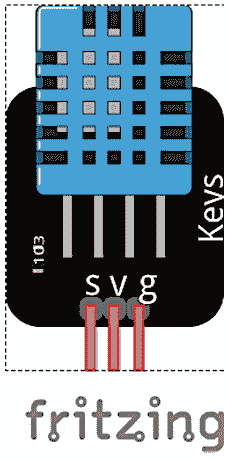

图 5.1 – DHT11 传感器模块

如我们所见，DHT11 的 **v** 引脚（它也可以标记为 **VCC** 或 **+**，具体取决于制造商）可以连接到 3 到 5.5 伏的**直流**（**DC**）电源。在本章中，我们将 DHT11 连接到 3.3 伏的电压，这可以由 Curiosity Nano 和 Blue Pill 板提供。引脚 **s** 是提供传感器生成的温度和湿度数据的信号。它也可以标记为 **OUT** 或 **DATA**，具体取决于 DHT11 制造商。引脚 **g**（有时标记为 **G**、**GND** 或 **-**）将连接到微控制器板的地线。大多数 DHT11 模块的测量温度和湿度时的运行电流为 0.3mA，待机时为 60 微安，使其成为一个功耗非常低的传感器。

以下图片显示了由两家不同制造商制造的两种 DHT11 传感器模块：

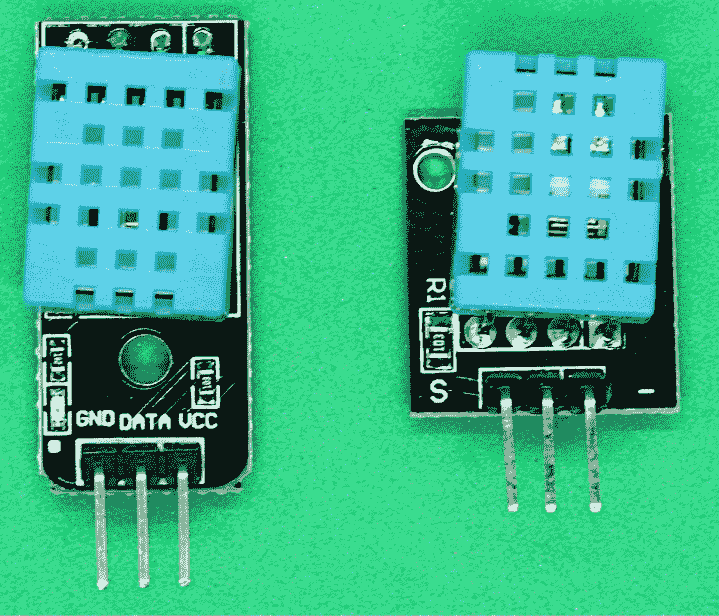

图 5.2 – DHT11 传感器模块

请注意，DHT11 模块之间略有差异。例如，两个 DHT11 模块的引脚顺序不同。左侧的模块按照顺序有地线（标记为 GND）、信号（标记为 data）和电压（标记为 VCC）引脚，而右侧的模块按照顺序有信号（data）、电压和地线引脚。此外，引脚的标签也不同。然而，两个 DHT11 模块的工作方式相同，可以用于本章中显示的电路。传感器本身被封装在带有网格的蓝色塑料盒中。DHT11 模块有额外的电子元件，便于连接到传感器。

在本节中，您将了解 DHT11 传感器模块、其引脚以及不同制造商制造的 DHT11 传感器之间的相似之处和不同之处。您还回顾了相对湿度是什么，这是 DHT11 可以读取的重要环境值。

下一节将向您展示如何将 DHT11 模块连接到 Blue Pill 的数字端口，以便您可以读取其值。

# 将 DHT11 传感器模块连接到微控制器板

本节处理本章中所有硬件组件。我们将首先将 DHT11 连接到 Blue Pill 板。将 DHT11 连接到微控制器板很容易，因为它只需要三根线。

## 将 DHT11 连接到 Blue Pill 板

在本节中，我们将连接 DHT11 到 Blue Pill，如图所示：

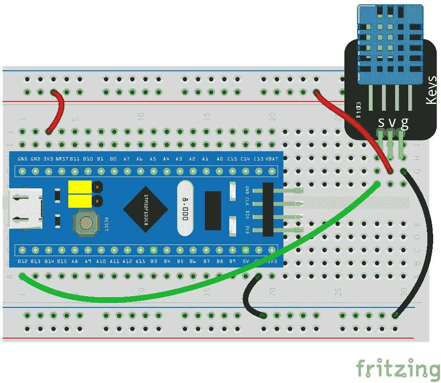

图 5.3 – DHT11 连接到 Blue Pill 微控制器板

如我们所见，DHT11 的连接很简单。在一些 DHT11 模块中，其制造商建议将一个 5K 欧姆的上拉电阻连接到**S**（信号）引脚。然而，由于 5K 欧姆电阻在商业上不可用，一个 4.7K 欧姆的电阻已经足够接近推荐值。在我们项目中使用的 DHT11 模块中，其电子电路已经有一个类似的电阻，所以我们不需要连接一个 4.7K 欧姆的电阻。

注意

根据制造商的不同，许多 DHT11 模块已经包括一个上拉电阻，因此 4.7k 欧姆的上拉电阻不是必需的。值得检查一下。只需将 DHT11 连接到微控制器板。如果它给出不规则的温度测量值，或者根本无法进行测量，您可能需要将上拉电阻连接到它。

按照以下步骤将 DHT11 连接到 Blue Pill：

1.  将 Blue Pill 的**GND**（也标记为**G**）引脚连接到无焊面包板轨道。

1.  将标记为（提供 3.3 伏特）的 Blue Pill 的**3.3**引脚连接到上面包板轨道。请注意，在某些 Blue Pill 板上，此引脚标记为**3V3**。

1.  将 DHT11 的**s**引脚连接到 Blue Pill 的**B12**引脚。

1.  将 DHT11 的**v**引脚连接到连接到**3V3**引脚的上面包板轨道。

1.  将 HDT11 的**g**引脚连接到地线引脚（下面包板轨道）。

1.  将 USB 线缆连接到 Blue Pill，然后连接到您的计算机。

以下图像显示了所有连接应该如何连接：

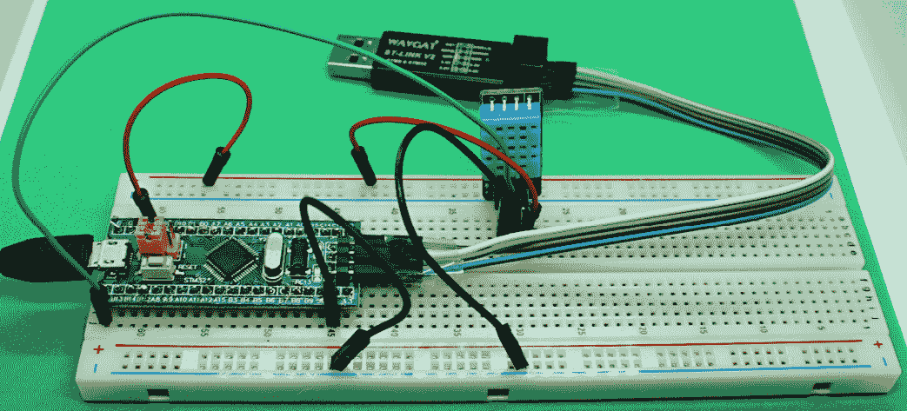

图 5.4 – DHT11 连接到 Blue Pill

在这里，我们可以看到我们只需要几根杜邦线就可以将 DHT11 连接到 Blue Pill 板。您需要将 ST-LINK/V2 接口连接到您的计算机以上传其代码，如在第 *1 章* 中所述，*微控制器和微控制器板简介*。在上传程序到 Blue Pill 之前，请务必先断开 USB 线缆（如前一张图像所示左侧）。请注意，前一张图像中显示的引脚顺序是 **GND**、**DATA** 和 **VCC**，这与 *图 5.3* 中显示的 DHT11 的引脚顺序不同。再次强调，这是因为一些 DHT11 制造商改变了 DHT11 的引脚顺序。

注意

所有 Blue Pill 的 **地**（**GND**）引脚都是相同的；它们是内部连接的。这块微控制器板有多个 GND 引脚，这样我们就可以将电子组件连接到板上。

温度和湿度值将从 IDE 的计算机串口监视器中显示。这将在 *为 Blue Pill 板编程 DHT11 传感器* 部分进行解释。

以下图像显示了一个带有 DHT11 和 4.7k-ohm 上拉电阻的 Fritzing 图表连接到信号（**S**）引脚。在此示例中使用的 DHT11 模块没有内置上拉电阻，因此我们需要连接一个：

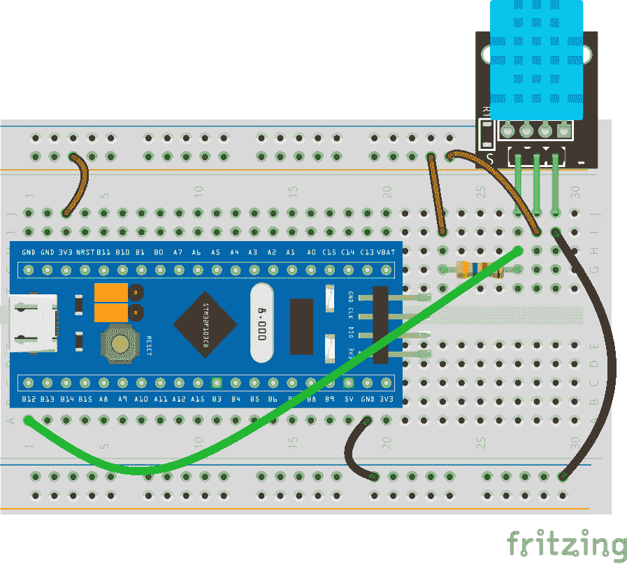

图 5.5 – 带有上拉电阻的 DHT11

上一张图像显示了 4.7 k-ohm 电阻作为上拉电阻的工作情况。下一节将描述如何连接 LCD 来显示从 DHT11 获得的温度和湿度数据。

## 将 LCD 连接到 Blue Pill

本节展示了显示从 DHT11 传感器获得的温度和湿度数据的一种有趣且实用的方法，将其显示在低成本 1602 LCD 上。以下是一个显示所有连接的 Fritzing 图表：

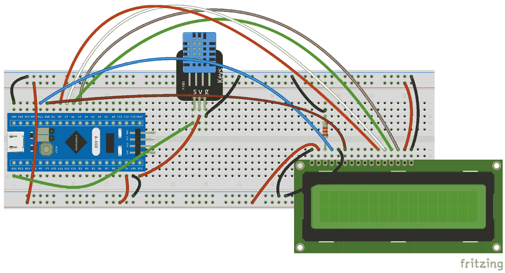

图 5.6 – 连接到 Blue Pill 板的 1602 LCD

前图展示了 1602 LCD，它可以显示两行（16x2）的 16 个字母和特殊字符（例如%，$等）。每个字符由一个 5x8 点阵形成。LCD 有 16 个引脚，从左到右标记为**VSS**、**VDD**、**V0**、**RS**、**RW**、**E**、**D0**、**D1**、**D2**、**D3**、**D4**、**D5**、**D6**、**D7**、**A**和**K**。这是一种流行的 LCD，也可以与 Arduino 微控制器板一起使用。连接到**V0** LCD 引脚的 2.2k 欧姆电阻调整 LCD 的对比度。**VSS**和**VDD**引脚连接到电源。**D0**到**D7**引脚用于向 LCD 发送数据以形成字符，但在这里，我们只使用 4 位（引脚**D4**到**D7**）来显示 LCD 上的字母和数字。1602 LCD 连接到**5 伏**（**+5V**）电源，该电源由 Blue Pill 的 5V 引脚提供。

请记住，前图中显示的上部和下部面包板电压轨连接到 Blue Pill 的 5V 引脚，为 LCD 提供 5 伏电压。DHT11 连接到 Blue Pill 的 3.3V 引脚，因为该传感器使用 3.3 伏电压。其结果数据将通过 3.3 伏的数字电压级发送到 Blue Pill 的输入数据引脚**B12**。

按照以下步骤连接 DHT11 和 LCD 到 Blue Pill，同时参考前图：

1.  将 Blue Pill 的**GND**（也标记为**G**）引脚连接到无焊面包板轨。

1.  将 Blue Pill 的**5V**引脚（提供 5 伏电压）连接到面包板轨。

1.  将 DHT11 的**s**引脚连接到 Blue Pill 的**B12**引脚。

1.  将 DHT11 的**v**引脚连接到 Blue Pill 的**3V3**引脚。

1.  将 HDT11 的**g**引脚连接到地线引脚（上部面包板轨）。

1.  将 USB 线连接到 Blue Pill，然后连接到您的电脑或 USB 移动电源。

1.  将 LCD 的 16 个引脚插入无焊面包板。

1.  将 LCD 的**VSS**引脚连接到地线引脚（下部面包板轨）。

1.  将 LCD 的**VDD**引脚连接到 5 伏（下部面包板轨）。

1.  将 2.2K 欧姆电阻连接到 LCD 的**V0**引脚和地线引脚（上部面包板轨）。

1.  将 LCD 的**RS**引脚连接到 Blue Pill 的**B11**引脚。

1.  将 LCD 的**RW**引脚连接到地线引脚（下部面包板轨）。

1.  将 LCD 的**E**引脚连接到 Blue Pill 的**B10**引脚。

1.  将 LCD 的**D4**引脚连接到 Blue Pill 的**B0**引脚。

1.  将 LCD 的**D5**引脚连接到 Blue Pill 的**A7**引脚。

1.  将 LCD 的**D6**引脚连接到 Blue Pill 的**A6**引脚。

1.  将 LCD 的**D7**引脚连接到 Blue Pill 的**A5**引脚。

1.  将 LCD 的**A**引脚连接到 5 伏（上部面包板轨）。

1.  将 LCD 的**K**引脚连接到地线引脚（上部面包板轨）。

1.  LCD 的**D0**、**D1**、**D2**和**D3**引脚未连接。

以下图像展示了所有部件的连接方式：

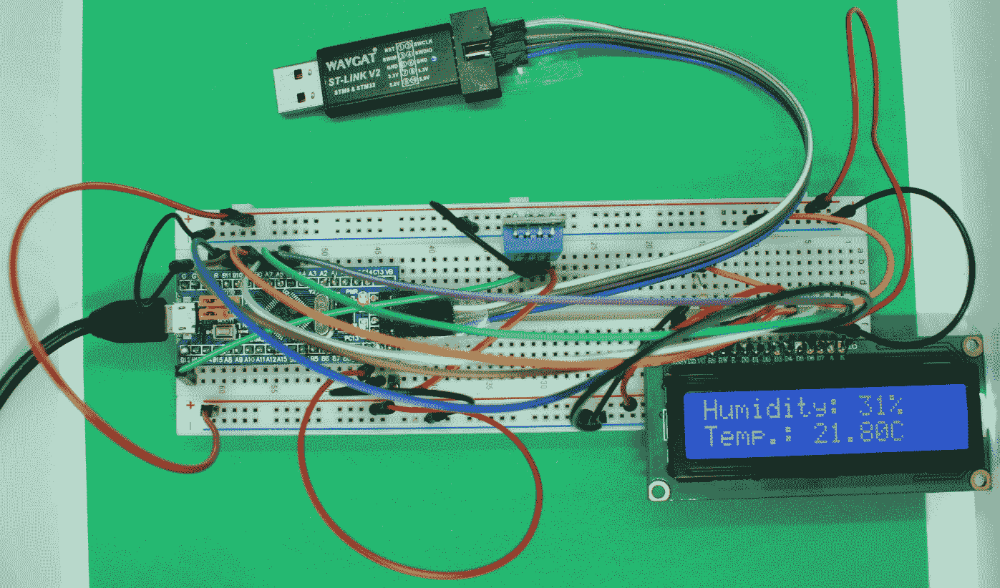

图 5.7 – 连接到 Blue Pill 微控制器板的 1602 LCD

在这里，您可以看到 LCD 正在工作，因为 Blue Pill 连接到 USB 移动电源（前图未显示）。LCD 显示当地温度（摄氏度），湿度以百分比显示。编程 LCD 和 DHT11 的代码将在本章后面展示。

下一节将向您展示如何将 LM35 温度传感器连接到 Curiosity Nano 板，演示如何从该传感器读取温度值并将它们发送到 Curiosity Nano 的模拟输入端口。

## 将 LM35 温度传感器连接到 Curiosity Nano 板

在本节中，我们将描述如何在 Curiosity Nano 上测量由 LM35 传感器获取的温度值。为了演示目的，当温度在 23 到 26 摄氏度的舒适温度范围内时，将分析温度。LM35 是一个低成本且易于连接的传感器，可测量从-55 到 150 摄氏度的广泛温度范围。以下是 LM35 传感器引脚排布图：

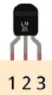

图 5.8 – 显示引脚 1、2 和 3 的 LM35 传感器

如您所见，LM35 有三个引脚：引脚 1（**Vs**）、引脚 2（**Vout**）和引脚 3（**GND**）。引脚 1 是来自电源的电压。Curiosity Nano 的**VBUS**引脚提供 5 伏，因此 LM35 的引脚 1 可以连接到它。引脚 2 是输出电压（**Vout**），以**毫伏**（**mV**）的形式提供测量温度值，使用线性比例因子。这个比例因子每增加 1 摄氏度增加+10 mV（+10 mV/C）。引脚 3 连接到微控制器板的接地（**GND**）。

LM35 传感器信号引脚（引脚 2）提供 mV 的温度值，将被 Curiosity Nano 转换为数字值。为此，我们需要将 LM35 的引脚 2 连接到 Curiosity Nano 的一个输入模拟端口。温度值计算为*温度=(5.0/1023)*millivolts_from_LM35*，其中 5.0 是连接到 LM35 引脚 1 的 5 伏，1023 是 Curiosity Nano 的 10 位 ADC，这意味着它的 ADC 可以检测（2¹⁰）个离散的模拟级别。该公式将 LM35 的输出（以 mV 计）转换为等效的摄氏度值。以下图像显示了 LM35 传感器：

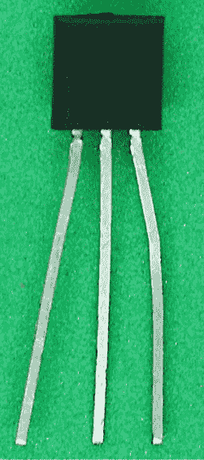

图 5.9 – LM35 温度传感器

前面的图像展示了 LM35 温度传感器及其三个引脚。由于它和普通晶体管一样都采用 TO-92 半导体封装类型，因此它们的大小相同。然而，LM35 不是一个晶体管——它是一个温度传感器。

我们必须将其两个 LED 连接到其输出端口以显示温度和湿度范围，如图所示：

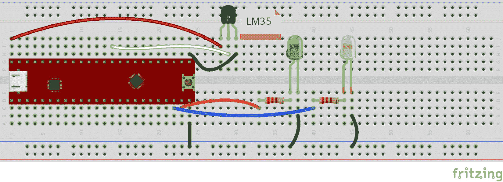

图 5.10 – 将 LM35 传感器和 LED 连接到 Curiosity Nano 板

如你所见，我们必须连接一个绿色 LED 来显示由 LM35 传感器读取的环境温度在 23 到 26 摄氏度的舒适温度范围内；如果温度超出这个范围，黄色 LED 将被点亮。本章中使用的舒适温度区间的温度值由加拿大标准协会确定，与其他国家机构定义的值相似。舒适温度区间的值可以在以下位置找到：[`www.ccohs.ca/oshanswers/phys_agents/thermal_comfort.html`](https://www.ccohs.ca/oshanswers/phys_agents/thermal_comfort.html)。

按照以下步骤将 LM35 和 LED 连接到 Curiosity Nano 板：

1.  将 Curiosity Nano 的**GND**引脚连接到无焊面包板轨道的下轨。

1.  将 LM35 的**Vout**（信号）引脚（2）连接到 Curiosity Nano 的**RA0**引脚。它将被用作模拟输入端口。

1.  将 LM35 的**Vs**引脚（1）连接到 Curiosity Nano 的**VBUS**引脚。此引脚提供 5 伏特。

1.  将 LM35 的**g**引脚（3）连接到 Curiosity Nano 的**GND**引脚，从其上方的引脚行。

1.  现在，将两个 220 欧姆电阻连接到 Curiosity Nano 的**RD2**和**RD3**端口，以及两个 LED 的阳极。

1.  将 LED 的阴极连接到地线引脚。

1.  最后，将 USB 线缆连接到 Curiosity Nano，然后连接到你的电脑或 USB 移动电源。

以下图像显示了所有连接应该如何连接：

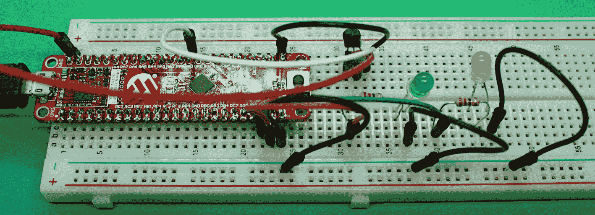

图 5.11 – LM35 传感器连接到 Curiosity Nano 板

前面的图像显示了 LM35 连接到 Curiosity Nano 的 RA0 上方的引脚行。

注意

Curiosity Nano 的所有 GND 引脚都是相同的；它们是内部连接的。这个微控制器板有多个 GND 引脚，这样我们就可以将电子组件连接到板上。

在本节中，你了解了 LM35 温度传感器、其引脚以及如何将其连接到微控制器板。你还学习了如何使用 LED 显示温度信息。下一节将展示如何编写程序从 DHT11 传感器读取湿度和温度值。

# 从传感器模块获取数据的编码

本节描述了如何为 Blue Pill 和 Curiosity Nano 板编写程序，以便它们可以读取 DHT11 的值。你还将学习如何使用 Blue Pill 编程 LM35 温度传感器。让我们先为 Blue Pill 板编程 DHT11 传感器。

## 为 Blue Pill 板编程 DHT11 传感器

在本节中，你将回顾使用特殊库从 DHT11 传感器获取数据的代码。该代码还将展示如何在串行端口上显示温度和湿度数据，从而在 Arduino IDE 的串行监视器上显示。以下代码从连接到 Blue Pill 数字输入端口`B12`的 DHT11 传感器模块中读取温度和湿度：

```cpp
#include <DHT.h> 
#define DHT11_data_pin PB12 
DHT dht(DHT11_data_pin, DHT11); 
void setup() {
    Serial.begin(9600); 
    while (!Serial);
    Serial.println("Opening serial comm.");

    dht.begin();
}
void loop() {
    float humidity = dht.readHumidity(); 
    float temperature=dht.readTemperature(); 
    Serial.println("Humidity: "+String(humidity)); 
    Serial.println("Temperature: "+String(temperature)); 
    delay(1000); 
}
```

在前述代码中，你可以看到第一行包含一个名为`DHT.h`的库。这是一个非常实用的库，用于从 DHT11 读取值。此代码可在本书的 GitHub 仓库中找到，其中包含解释其主要部分的注释。要在 Arduino IDE 上安装`DHT.h`库，请按照以下步骤操作：

1.  从 IDE 的主菜单中选择**工具** | **管理库**。

1.  在库管理器的搜索框中输入`DHT11`。

1.  将列出几个库。选择并安装由 Adafruit 制作的 DHT 传感器库的最高版本。

1.  等待库安装完成。然后，关闭库管理器。现在，DHT11 库应该可以在你的代码中使用了。

请注意，`dht.readTemperature()`函数返回摄氏度的温度值，而`dht.readHumidity()`函数返回相对湿度的百分比值。

以下截图显示了 Arduino IDE 的**库管理器**显示名为**DHT 传感器库**的库，由 Adafruit 提供：

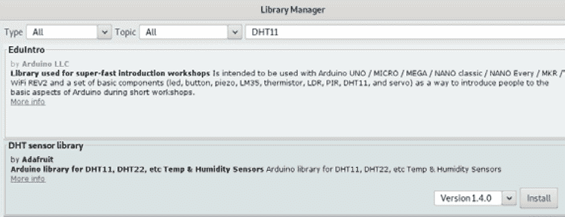

图 5.12 – Arduino IDE 的库管理器

在这里，你可以看到在搜索框中输入`DHT11`，你可以找到 Adafruit 的 DHT 传感器库。点击**安装**按钮。

小贴士

你也可以将 DHT11 传感器连接到 Arduino Uno 微控制器板上。只需连接前述代码中显示的 DHT11 的`DHT11_data_pin`。此外，将 DHT11 的 GND 和 VCC 引脚分别连接到 Arduino Uno 的 GND 和 3V3 引脚。

下一个部分将展示如何在 1602 LCD 上显示湿度和温度数据。

## 编程传感器模块和 1602 LCD

以下代码描述了如何从 DHT11 传感器获取温度和湿度数据，以及如何在 1602 LCD 上显示这些数据：

```cpp
#include <DHT.h>
#include <math.h>
#include <LiquidCrystal.h>
const int rs = PB11, en = PB10, d4 = PB0, d5 = PA7,    d6 = PA6, d7 = PA5;
LiquidCrystal lcd(rs, en, d4, d5, d6, d7); 
#define DHT11_data_pin PB12
DHT dht(DHT11_data_pin, DHT11); 
void setup() {
    dht.begin(); 
    lcd.begin(16, 2); 
}
void loop() {
    float humidity = dht.readHumidity(); 
    float temperature=dht.readTemperature();
    lcd.setCursor(0, 0);
    lcd.print("Humidity: "+String(round(humidity))+"%   ");
    lcd.setCursor(0,1);
    lcd.print("Temp.: "+String(temperature)+"C   "); 
    delay(1000); 
}
```

请记住，上传到本书 GitHub 仓库的代码包含许多注释，解释了前述代码的主要部分。`LiquidCrystal.h`是用于控制 1602 LCD 的库。`math.h`库包含`round()`函数，用于四舍五入湿度值。这两个库都属于 Arduino IDE 的原始安装文件，因此我们不需要单独下载或安装它们。`DHT.h`是一个用于读取 DHT11 值的库；其安装在本章中已解释过。

下一个部分将描述如何将 LM35 温度传感器编程到 Curiosity Nano 微控制器板上。

## 在 Curiosity Nano 板上编程 LM35 传感器

以下代码从连接到 Curiosity Nano 的模拟输入端口 `RA0` 的 LM35 传感器读取温度：

```cpp
#include "mcc_generated_files/mcc.h"
static uint16_t LM35read=0;
float temp=0.0;
void main(void)
{
    // initialize the device
    SYSTEM_Initialize();
    ADC_Initialize();
    while (1)
    {
        IO_RD2_SetLow();
        IO_RD3_SetLow();
        LM35read=ADC_GetConversion(channel_ANA0);
        temp=(5.0/1023)*LM35read;
        if (temp>=23.0 && temp<=26.0)
        {
            IO_RD3_SetHigh();
        } else {
          IO_RD2_SetHigh();
        }
        __delay_ms(500);
    }
}
```

如您所见，Curiosity Nano 使用 `ADC_GetConversion()` 函数将读取自 LM35 传感器的值进行模拟到数字转换。我们还使用了根据从 LM35 读取的 mV 计算摄氏度的公式；即 `temp=(5.0/1023)*LM35read;`。

通过这样，您已经学会了如何通过编码 Blue Pill 和 Curiosity Nano 来获取 DHT11 传感器模块和 LM35 传感器的数据。下一节将向您展示如何在 Arduino IDE 的串行监视器上显示 DHT11 数据。

# 在串行端口监视器上显示湿度和温度数据结果

本节描述了如何使用 Blue Pill 和 Curiosity Nano 在串行端口监视器上显示 DHT11 数据，并讨论了如何处理从 DHT11 传感器模块获得的数据。

打开并运行 Arduino IDE 上的 Blue Pill 代码。您可以通过点击 Arduino IDE 主菜单中的 **工具** | **串行监视器** 来读取从 DHT11 获得的数据。以下截图显示了这一过程：

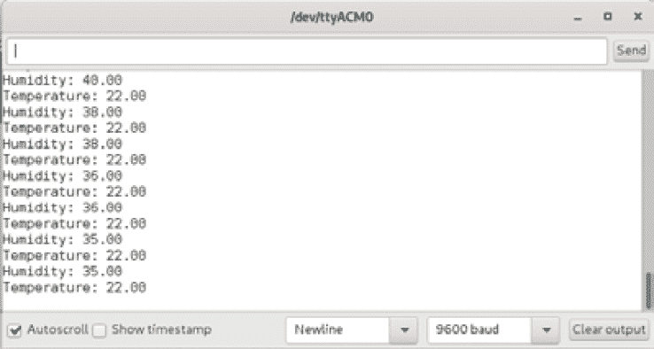

图 5.13 – Arduino IDE 的串行监视器截图

在这里，您可以看到从 DHT11 获得的湿度和温度值以小数点显示，从而显示了更精确的温度。请记住，存储这些值的变量是用 `float` 类型声明的。

小贴士

如果您无法打开 IDE 的串行监视器，并且 IDE 显示一条消息告诉您找不到 USB 端口，那么可能是您连接到 Blue Pill 和电脑的 USB 线缆有故障。此外，一些 USB 线缆只能用于充电设备，这些线缆您不应与 Blue Pill 一起使用。

请注意，前面截图中的温度是以摄氏度显示的，而相对湿度以百分比显示。

## 绘制数据

Arduino IDE 的串行端口监视器有一个有趣的选项，可以将从 DHT11 读取并发送到串行端口的值以图形方式绘制。这些值以实时方式绘制。

点击 Arduino IDE 主菜单中的 **工具** | **串行绘图器**，查看数据是如何以图形方式显示的，如下所示：

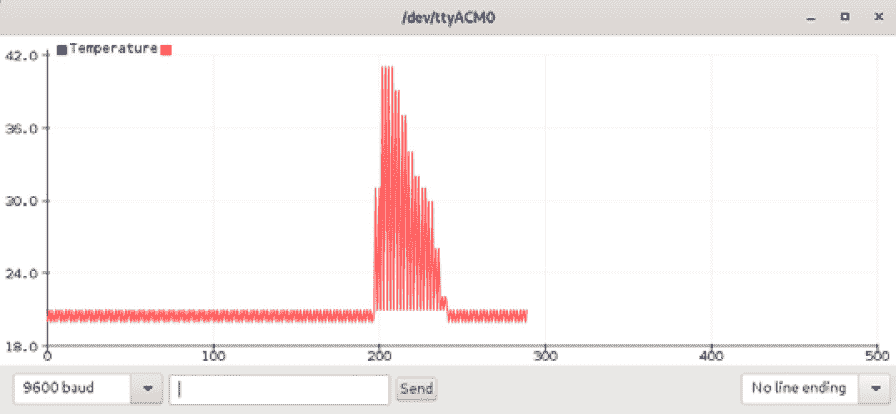

图 5.14 – HDT11 串行绘图器截图

在这里，您可以查看 DHT11 数据是如何以图形方式绘制的。*y* 轴表示湿度量，而 *x* 轴表示时间（秒）。图表显示了一个峰值，因为当时环境湿度发生了变化。要测试 DHT11 传感器湿度测量的变化，只需对着传感器吹气。

在本节中，你学习了如何打开 Arduino IDE 的串行监视器以及如何将 DHT11 传感器模块的数据显示在上面，包括如何以图形方式绘制这些数据。

# 摘要

在本章中，我们学习了 DHT11 湿度和温度传感器以及 LM35 温度传感器的基础知识，包括它们的操作范围以及这些传感器如何将这些数据发送到微控制器板。这些是实用且低成本的传感器，Blue Pill 和 Curiosity Nano 可以轻松处理。本章展示了两种显示湿度和温度结果的方法。Blue Pill 直接在计算机监视器和 LCD 上显示湿度和温度值，而 Curiosity Nano 则使用 LED 显示温度和湿度范围。本章很有益，因为你学习了如何使用微控制器板从传感器获取环境数据以及如何有效地显示它，使用微控制器板的输入和输出端口。本章还强调了使用 LCD 显示温度和湿度数据的使用。

*第六章*，*使用明亮的 LED 的 Morse Code SOS 视觉警报*，将回顾如何创建一个实用的视觉警报。

# 进一步阅读

+   Horowitz, P., Hill, W. (2015). *《电子艺术》* [第 3 版]。剑桥大学出版社：纽约，纽约。

+   LM35 (2017). LM35 精密摄氏度温度传感器数据表。德州仪器。可从：[`www.ti.com/lit/ds/symlink/lm35.pdf`](https://www.ti.com/lit/ds/symlink/lm35.pdf)

+   Microchip (2019). *PIC16F15376 Curiosity Nano 硬件用户指南*。Microchip 技术公司。可从：[`ww1.microchip.com/downloads/en/DeviceDoc/50002900B.pdf`](http://ww1.microchip.com/downloads/en/DeviceDoc/50002900B.pdf)

+   Mouser (2020). *DHT11 湿度和温度传感器数据表*。Mouser 公司。可从：[`www.mouser.com/datasheet/2/758/DHT11-Technical-Data-Sheet-Translated-Version-1143054.pdf`](https://www.mouser.com/datasheet/2/758/DHT11-Technical-Data-Sheet-Translated-Version-1143054.pdf)
