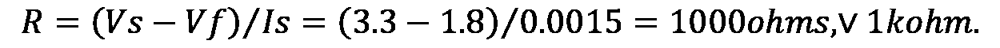
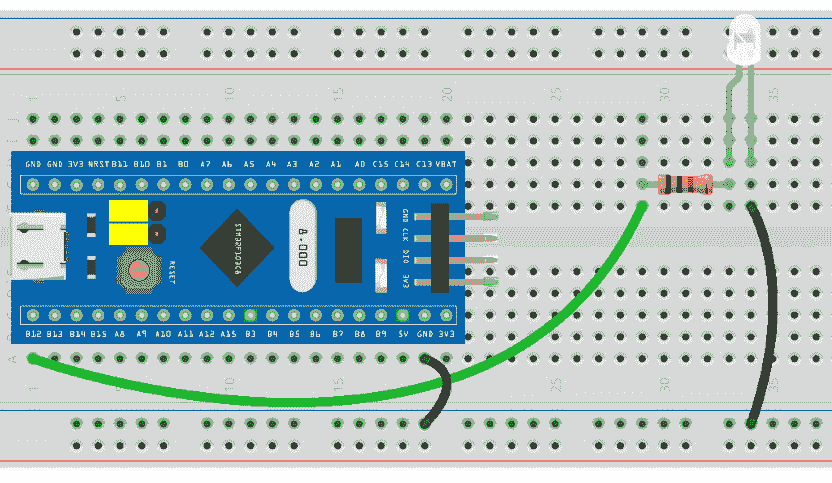
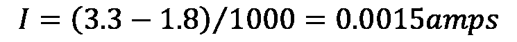
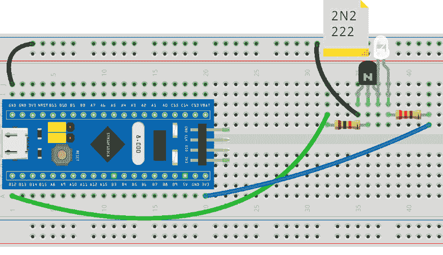
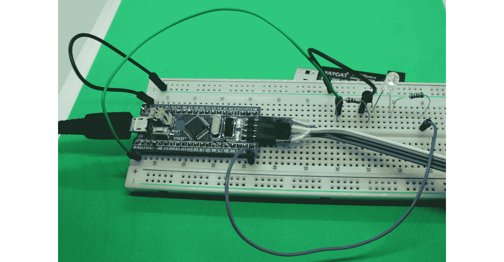
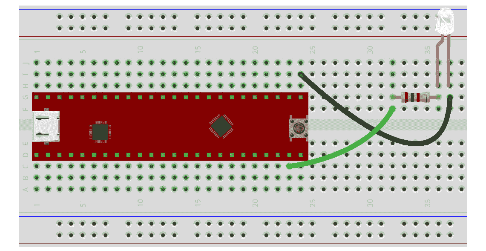
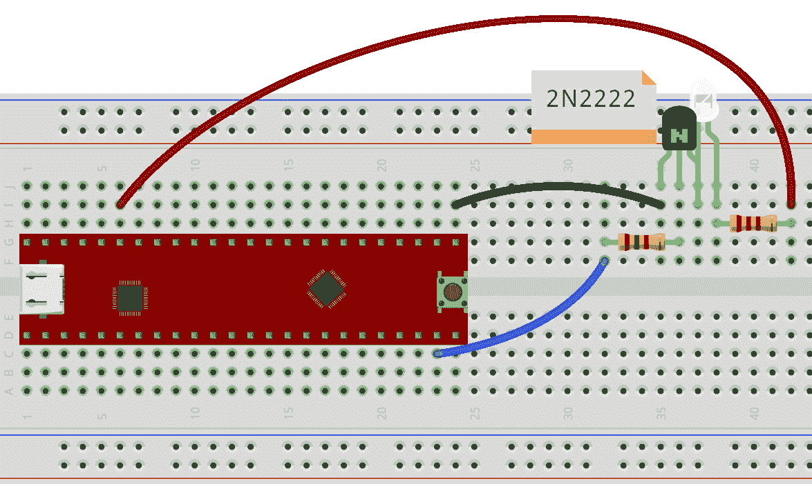
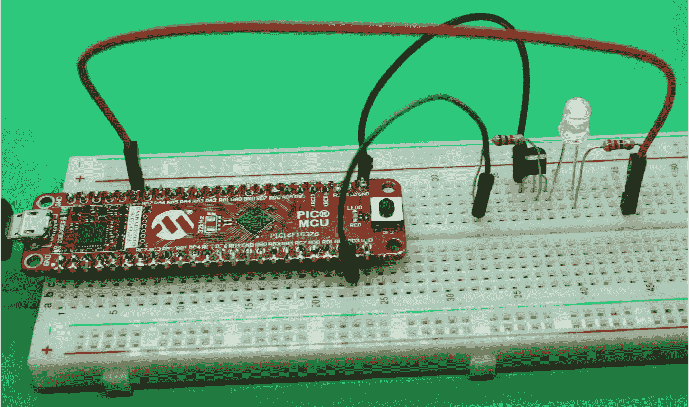
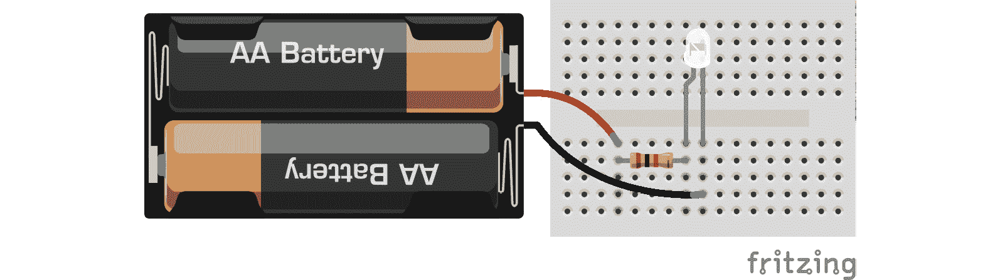

# *第六章*：使用亮 LED 的摩尔斯电码 SOS 视觉警报

本章描述了如何构建一个非常显眼的视觉警报器，该警报器通过连接到微控制器板的**超级亮 LED**来显示 SOS 信息（当有人或一群人处于危险或困境时使用）。在本章中，你将学习如何使用微控制器板控制超级亮 LED。我们之所以在本章中使用超级亮 LED，是为了增加 SOS 信息的可见性。本章将有益于未来的电子项目，因为你将学习如何使用晶体管作为开关来控制 LED。本章中制作的应用程序可以在徒步旅行、海上和类似场景中使用的困难人群中使用。

本章我们将涵盖以下主要内容：

+   理解摩尔斯电码和 SOS 信息

+   介绍超级亮 LED 及其所需电阻的计算

+   将电阻和超级亮 LED 连接到微控制器板

+   编写 SOS 摩尔斯电码信号

+   测试视觉警报

到本章结束时，你将能够正确地将超级亮 LED 连接到 Curiosity Nano 和 Blue Pill 微控制器板，并使用微控制器板生成摩尔斯电码信息。

# 技术要求

本章中你将使用的软件工具是 MPLAB-X 和 Arduino IDE，分别用于编辑和上传你的程序到 Curiosity Nano 和 Blue Pill 微控制器板。

本章中使用的代码可以在本书的 GitHub 仓库中找到：

[`github.com/PacktPublishing/DIY-Microcontroller-Projects-for-Hobbyists/tree/master/Chapter06`](https://github.com/PacktPublishing/DIY-Microcontroller-Projects-for-Hobbyists/tree/master/Chapter06)

本章的“代码在行动”视频可以在以下链接找到：[`bit.ly/3iXDlEP`](https://bit.ly/3iXDlEP)

本章中，我们将使用以下硬件设备：

+   一个无焊面包板。

+   Blue Pill 和 Curiosity Nano 微控制器板。

+   用于将微控制器板连接到计算机的微型 USB 线。

+   需要上传编译后的代码到 Blue Pill 的 ST-Link/V2 电子接口。请注意，ST-Link/V2 需要四根公对公的杜邦线。

+   一个 5 毫米的槽孔 625 纳米橙色-红色，超级亮 LED，制造商编号 BL-BJU334V-1，由美国光电子公司制造，或者类似的产品。

+   两个 1 千欧姆、四分之一瓦特的电阻。这些电阻用于 LED 和晶体管。

+   一个 220 欧姆、四分之一瓦特的电阻。这是为 LED 准备的。

+   一个**2N2222**晶体管，TO-92 封装。

+   一打男性到男性的杜邦线。

以下部分描述了摩尔斯电码是什么以及为什么在这个项目中使用它。

# 理解摩尔斯电码和 SOS 信息

**摩尔斯电码**是一种电信技术，通过应用不同持续时间的信号序列来编码、接收和发送 **字母数字** 和 **特殊字符**。摩尔斯电码是以电报发明家塞缪尔·摩尔斯的名字命名的。这种代码很重要，因为它在长距离的无线电和有线通信中普遍使用，特别是用于发送和接收电报。如今，摩尔斯电码在业余 (*ham*) 无线电通信中仍然被使用，因为当电磁大气条件不利时，人们可以可靠地解码它。更重要的是，摩尔斯电码可以通过发送 SOS 信息以光、音频或电磁信号的形式在紧急情况下使用。摩尔斯电码有时在航空中作为无线电导航辅助工具使用。

摩尔斯电码中的每个字符都是由 `-` 符号和 `.` 符号组成的。一个点是一个信号单元，一个破折号是三个信号单元。每个字母、数字和特殊字符都是通过点与/或破折号的组合进行编码的。字母之间的空格是一个信号单元（一个点），单词之间的空格是七个信号单元。此代码通常在信息载体上传输，例如，可见光和电磁无线电波。以下是一个使用国际摩尔斯电码编码的字母和数字列表：

+   A (`.-`)

+   B (`-...`)

+   C (`-.-.`)

+   D (`-..`)

+   E (`.`)

+   F (`..-.`)

+   G (`- -.`)

+   H (`....`)

+   I (`..`)

+   J (`.---`)

+   K (`-.-`)

+   L (`.-..`)

+   M (`- -`)

+   N (`-.`)

+   O (`- - -`)

+   P (`.- -.`)

+   Q (`- -.-`)

+   R (`.-.`)

+   S (`. . .`)

+   T (`-`)

+   U (`..-`)

+   V (`...-`)

+   W (`.- -`)

+   X (`-..-`)

+   Y (`-.--`)

+   Z (`- -..`)

+   1 (`.- - - -`)

+   2 (`..- - -`)

+   3 (`...- -`)

+   4 (`. . . . -`)

+   5 (`. . . . .`)

+   6 (`-. . . .`)

+   7 (`- - . . .`)

+   8 (`- - - . .`)

+   9 (`- - - -.`)

+   0 (`- - - - -`)

特殊字符，如 `$` 和 `#` 以及来自非英语语言的字符，也已被摩尔斯电码编码，但展示这些内容超出了本章的范围。例如，这是我们将单词 PARIS 用摩尔斯电码编码的方式：.- -.   .-   .-.   ..   ...

这是另一个例子。单词“HELP”可以编码为 ….   .   .-..   .--.

另一个更长的例子是单词 ALIVE：.- .-.. .. ...- .

常用的 distress 消息，用摩尔斯电码编码，由字母 SOS 组成。它由三个点、三个破折号和三个点组成（`. . .  ---  . . .`）。这个信息已被国际条约应用和认可，最初用于海上紧急情况。其起源不确定，但流行用法将 SOS 与诸如 *Save Our Ship* 或 *Save Our Souls* 这样的短语联系起来。尽管如此，SOS 容易记忆，在紧急情况下使用，并且比用摩尔斯电码编码其他单词，如 *HELP*，要短。

在本章中，我们将使用 SOS 信息制作一个视觉警报，通过使用 Blue Pill 和 Curiosity Nano 板通过开启和关闭一个超级明亮的 LED 来显示信息中的点和破折号。

下一节简要介绍了超亮 LED，以及为了我们的摩尔斯电码目的，可以连接到它们的是什么类型的电阻。

# 介绍超亮 LED 及其所需电阻的计算

**超亮 LED**是一种**发光二极管**（**LED**），以高亮度发光，比常规 LED 亮度更高。LED 亮度（光强度）以**毫坎德拉**（**mcd**）计算。请注意，1,000 mcd 等于 1 坎德拉。坎德拉通常用来衡量光源产生的光量，在这种情况下，是一个 LED，但坎德拉也可以用来衡量其他光源，如灯泡。我们在这章中使用的超亮 LED 额定为 6,000 mcd，发出一种漂亮且强大的橙色光芒，当连接到适当的限流电阻时相当明亮。相比之下，典型的 LED 额定值在约 50 到 200 mcd 之间。

超亮 LED 通过使用透明玻璃涂层和反射材料来增加光扩散的特殊设计。然而，一些超亮 LED 的**观看角度**（LED 光观察的角度看起来更亮）减少了约 35 度，例如我们在这章中使用的那种，而其他常规和超亮 LED 的观看角度为 120%。这个观看角度取决于它们的成本、效率和用途。

与常规 LED 一样，超亮 LED 需要一定的电压来供电，通常在 2 到 3 伏之间。这就是为什么我们需要将限流电阻连接到 LED 以降低其电压。我们可以使用公式 R=(Vs-Vf)/If 来计算以下情况下 LED 的限流电阻：

+   **Vs** = 供电电压。Blue Pill 和 Curiosity Nano 输出端口提供 3.3 伏。

+   **Vf** = 正向电压，即通过电阻器下降的电压。

+   **If** 是正向 **电流**（**amps**）。

+   **R** 是我们想要计算的电阻值。

连接到 LED 时常用的电阻值是 1 k 欧姆。当施加 3.3 伏的电源电压，电流为 1.5 毫安（或 0.0015 安）时，该电阻器的下降电压为 1.8 伏。让我们应用前面的公式来确认这个电阻值：



连接到超亮 LED 的电阻器将决定其吸取的电流数量。当使用 3.3 伏或 5 伏作为许多微控制器板提供的电源电压时，常用的电阻值用于连接 LED 是 220、330 和 1 k 欧姆。在大多数 LED 应用中（除非你将 LED 连接到 Blue Pill 微控制器板，如下一节所示），电阻值不是关键因素，因此我们可以使用其他具有相似值的电阻。首先，你可以确定超亮 LED 是否工作。前往本章末尾的*测试视觉警报*部分。

重要注意事项

当超级明亮的 LED 开启（发光）时，不要直接盯着它看，因为这可能会伤害你的眼睛。你可以暂时从侧面看它。

*图 6.1*展示了本章中使用的超级明亮的 LED：


图 6.1 – BL-BJU334V-1 超级明亮的 LED

*图 6.1*描绘了一个 BL-BJU334V-1 5 mm 通孔 LED，在 625 nm 波长下发出明亮的橙色光。其左侧引脚是阳极（正极），右侧引脚是阴极（负极），这是较短的。还有其他类型的超级明亮的 LED，亮度更高，尺寸更大。我们决定特别使用这个 LED，因为它成本低，适合插入无焊面包板，并连接到微控制器板。下一节将处理超级明亮的 LED 连接到 Blue Pill 和 Curiosity Nano 板。

# 将电阻和超级明亮的 LED 连接到微控制器板

本节展示了如何使用连接到微控制器板的超级明亮的 LED 来显示摩尔斯电码信息。我们首先解释如何将超级明亮的 LED 连接到 Blue Pill 的一个输入端口，以及如何使用晶体管作为开关来控制超级明亮的 LED。然后，我们描述如何将超级明亮的 LED 连接到 Curiosity Nano 板。

*图 6.2*显示了一个包含超级明亮的 LED 的 Fritzing 图：



图 6.2 – 一个超级明亮的 LED 连接到 Blue Pill 的 I/O 端口

如*图 6.2*所示，超级明亮的 LED 的阳极连接到一个 1 k 欧姆限流电阻。该电阻连接到输出端口 B12，每次发送摩尔斯电码字符的点或划时，都会向其提供 3.3 V 电压。以下是将*图 6.2*中显示的所有组件连接的步骤：

1.  将 1 k 欧姆电阻连接到 Blue Pill 的 B12 端口。

1.  将电阻连接到超级明亮的 LED 的阳极引脚（其最长的腿，如*图 6.1*中所示，为左侧）。

1.  将超级明亮的 LED 的阴极引脚（其最短的腿）连接到较低的无焊面包板的行接地。

1.  将 Blue Pill 的 GND 引脚连接到无焊面包板的下轨。

在执行这些步骤时，请确保连接正确的 LED 极性。

重要提示

不要将超级明亮的 LED 直接连接到电源，因为这会损坏它。你应该在其阳极（长 LED 腿）上连接一个限流电阻。

每个 Blue Pill I/O 端口可以处理高达 6 mA（毫安）的电流。请注意，在某些情况下和配置中，一个超级明亮的 LED 可能会消耗超过 6 mA 的电流。这就是为什么我们将其阳极连接到一个 1 k 欧姆电阻上，以限制到达 LED 的电流（及其电压）。如果连接到 Blue Pill 端口的任何设备消耗超过 6 mA 的电流，你将会损坏 Blue Pill 板。

在我们将所有东西连接到 Blue Pill 微控制器板端口之前，我们需要知道 I/O **B12** 端口消耗了多少安培，以查看它是否低于端口可以处理的最大安培数。LED 从 *图 6.2* 消耗的安培（电流）使用以下公式计算：


以下是对符号的描述：

+   Vs = 3.3 V，这是在生成摩尔斯电码的点划线时由输出端口提供的供电电压。

+   Vf = 1.8 V，这是通过 1 k 欧姆电阻的导通电压（我们用万用表测量了它）。

+   R 是电阻值（1 k 欧姆）。

因此，，或 1.5 毫安，远低于每个 Blue Pill 端口可以处理的 6 mA 最大值，所以如果我们将其连接到产生 3.3 V 的端口，我们可以安全地使用 1 k 欧姆电阻为我们的超级明亮 LED 提供电源。

重要的是要注意，电阻值和从端口到达电阻的电压将决定 LED 的亮度。我们可以使用具有较低值的电阻来使 LED 发光更亮。例如，我们可以使用 220 欧姆电阻。其降压电压为 1.9 V（我们用万用表测量了它）。让我们使用 Vs = 3.3 V 来计算其电流（安培）：I=(Vs-Vf)/R=(3.3-1.9)/220=6 mA，这是 Blue Pill 端口可以处理的极限电流。如果我们使用 220 欧姆（或更低值）的电阻将其连接到超级明亮 LED，我们应该使用一个作为开关工作的晶体管来保护 Blue Pill 端口，避免直接从它那里吸取电流。*图 6.3* 展示了一个带有 2N2222 晶体管的 Fritzing 图，当它收到基极（晶体管引脚编号 2）的电压时，它会关闭 *开关*，即内部连接其集电极和发射极，从而将 LED 的阴极连接到地：



图 6.3 – 由 2N2222 晶体管开关的超级明亮 LED

如*图 6.3*所示，LED 连接到一个 220 欧姆电阻，该电阻连接到 Blue Pill 的 3.3 V 引脚。这个电阻从 Blue Pill 的 3.3 V 引脚吸取电流，该引脚可以处理高达 300 mA 的电流，而不是从处理高达 6 mA 的 B12 端口。因此，晶体管控制着流向电路另一部分的电流，切换 LED 的地线。每当晶体管在其基极接收到一定电压时，它就会饱和，并在其集电极和发射极引脚之间创建开/关的开关效果。我们需要在其基极连接一个电阻来降低其电压，从而正确地饱和它。在本章中，当施加 3.3 V 电压时，用于饱和晶体管的典型值是 1 k 欧姆。*图 6.3*中使用的低成本且流行的晶体管零件号为 2N2222（在 TO-92 封装中）。这个晶体管可以处理高达 600 mA 的电流，足以驱动我们的超亮 LED。以下是将*图 6.3*中显示的所有组件连接起来的步骤：

1.  将 Blue Pill 的 GND 引脚连接到面包板的上面一行。

1.  将 1 k 欧姆电阻连接到 Blue Pill 的 B12 端口。

1.  将 1 k 欧姆电阻连接到 2N2222 晶体管的基极（引脚编号**2**）。

1.  将 2N2222 晶体管的发射极（引脚编号**1**）连接到地（面包板的上面一行）。

1.  将 LED 的负极引脚（其最短的一端）连接到 2N2222 的集电极（引脚编号**3**）。

1.  将 220 欧姆电阻连接到 LED 的正极引脚（其最长的一端）。

1.  将 220 欧姆电阻连接到 Blue Pill 的 3V3（3.3）引脚。

*图 6.4*显示了 2N2222 的引脚图：


图 6.4 – 2N2222 晶体管引脚编号

*图 6.4*显示了 2N2222 晶体管在 TO-92 封装中的样子，显示了其三个引脚。引脚 1 是其发射极，引脚 2 是其基极，引脚 3 是其集电极。晶体管上的 N 表示 2N2222 是 NPN 型晶体管，其内部配置由负-正-负层组成。那个大的 N 字母实际上并没有在商业晶体管上显示；它只出现在*图 6.4*中显示的 Fritzing 图上。相反，商业晶体管在其上显示它们的零件号。

*图 6.5*显示了晶体管的电子符号：


图 6.5 – 晶体管的电子图（NPN 型）

如*图 6.5*所示，符号显示了 2N2222 的引脚编号。这种引脚顺序在其他类型的晶体管中会改变。

*图 6.6*显示了所有连接方式：



图 6.6 – 将超亮 LED 连接到 2N2222 晶体管

*图 6.6* 展示了 2N2222 晶体管连接到 BluePill 的接地和 3.3（3.3 V）引脚。晶体管连接在超亮 LED 的左侧。下一节将介绍如何使用电阻和晶体管将超亮 LED 连接到 Curiosity Nano 板。

## 将超亮 LED 连接到 Curiosity Nano

本节解释了如何从 Curiosity Nano 板控制超亮 LED 来显示 SOS 摩尔斯电码信息。

*图 6.7* 是一个 Fritzing 图表，展示了如何将超亮 LED 连接到 Curiosity Nano：



图 6.7 – 超亮 LED 连接到 Curiosity Nano 的 I/O 端口

如 *图 6.7* 所示，我们使用 1 k 欧姆电阻连接超亮 LED，这与之前章节中解释的 Blue Pill 微控制器板的类似电路。以下是连接 *图 6.7* 中所示组件的步骤：

1.  将 Curiosity Nano 的 RD3 引脚连接到 1 k 欧姆电阻。

1.  将电阻连接到超亮 LED 的阳极引脚（其最长的一端）。

1.  将超亮 LED 的阴极引脚（其最短的一端）连接到 Curiosity Nano 的 GND 引脚。

请注意，在理论上，Curiosity Nano 的每个 Nano I/O 端口可以处理高达 12.8 毫安（500 毫安/39 个端口），Curiosity Nano 的电压调节器（VBUS）可以处理高达 500 毫安。根据制造商的说法，这可能会因环境温度而略有变化。我们可以通过连接一个低值电阻来使 LED 发光更亮，或者我们可以将多个 LED 连接到一个端口上，但这将消耗更多电流，可能会损坏微控制器板。由于每个端口不能支持太多电流，我们需要连接一个晶体管来切换 LED 的接地。*图 6.8* 展示了所有组件的连接方式：



图 6.8 – 通过晶体管开关，连接到 Curiosity Nano 板的超亮 LED

如 *图 6.8* 所示，连接到 LED 阳极引脚的电阻连接到 Curiosity Nano 的 VTG 端口，该端口提供 3.3 V。以下是连接所有组件的步骤：

1.  将 Curiosity Nano、2N2222 晶体管和超亮 LED 插入无焊面包板。

1.  将晶体管的引脚 1 连接到 Curiosity Nano 的接地（GND）引脚。

1.  将 1 k 欧姆电阻连接到 Curiosity Nano 的 RD3 端口。

1.  将 1 k 欧姆电阻连接到晶体管的引脚 2。

1.  将超亮 LED 的阴极（其最短的引脚）连接到晶体管的引脚 3。

1.  将 220 欧姆电阻连接到超亮 LED 的阳极（其最长的引脚）。

1.  将 220 欧姆电阻连接到 Curiosity Nano 的 VTG 引脚。

*图 6.9* 展示了所有组件的连接方式：



图 6.9 – Curiosity Nano 上连接的晶体管和 LED

如*图 6.9*所示，2N2222 晶体管正在切换超亮 LED 的地线。

下一个部分描述了如何在 Blue Pill 和 Curiosity Nano 板上编程 SOS 信号。

# 编码 SOS 莫尔斯代码信号

本节描述了用于在 Blue Pill 板上开关 LED 以显示 SOS 莫尔斯信号的代码，该代码运行在 Blue Pill 板上。以下代码显示了用于定义 SOS 莫尔斯代码消息并将其发送到板输出端口的主体函数。下一个代码段定义了必要的点、划线和空间值，以及端口标签：

```cpp
int led=PB12;
int dot_duration=150; 
int dash_duration=dot_duration*3; 
int shortspace_duration=dot_duration; 
int space_duration=dot_duration*7;
```

下一个函数设置了输出端口（`B12`）以控制 LED 的开关：

```cpp
void setup() {
       pinMode (led,OUTPUT);
} 
```

这些函数定义了 SOS 消息中使用的字母 S 和 O：

```cpp
void S() {
          dot();
          dot();
          dot();
          shortspace();
}

void O() {
          dash();
          dash();
          dash();
          shortspace();
}
```

以下函数定义了字母之间和每个发送到输出端口的 SOS 消息之间的时间空间：

```cpp
void shortspace() {
          delay(shortspace_duration);
} 
void space() {
          delay (space_duration);
} 
void dot() {
          digitalWrite(led,HIGH); 
          delay (dot_duration); 
          digitalWrite(led,LOW); 
          delay(dot_duration); 
}

void dash() {
          digitalWrite(led,HIGH); 
          delay(dash_duration); 
          digitalWrite(led,LOW); 
          delay(dash_duration); 
}
```

以下为`main`函数，它定义了 SOS 消息及其前导时间空间：

```cpp
void loop() {
          S(); O(); S();  
          space();  
}
```

上述代码显示，Blue Pill 的`B12`端口被用作输出，用于开关超亮 LED。在此示例代码中，每个点持续时间为 150 毫秒（存储在`dot_duration`变量中），每个划线持续时间为每个点持续时间的三倍。每个字母之间有一个短的时间间隔，由`shortspace()`函数生成。此外，每个 SOS 单词之间也有一个时间间隔，由`space()`函数生成。SOS 电报中的字母 S 和 O 分别由`S()`和`O()`函数编码。

请记住，上传到 GitHub 仓库的代码中有许多注释，解释了前面代码中的大多数指令。

注意

您可以在 Arduino 微控制器板上运行前面的代码。只需将输出端口编号`PB12`更改为任何 Arduino 数字端口。例如，Arduino Uno 微控制器板有数字端口`2`到`13`。

以下部分展示了如何在 Curiosity Nano 板上编写 SOS 消息示例代码。

## Curiosity Nano 的 SOS 消息代码

Curiosity Nano 微控制器板的 SOS 消息代码与在 Blue Pill 板上运行的代码类似。下一个代码段定义了必要的点、划线和空间值：

```cpp
#include "mcc_generated_files/mcc.h"
const int dot_duration=150; 
const int dash_duration=dot_duration*3; 
const int shortspace_duration=150; 
const int space_duration=dot_duration*7;         
```

以下函数定义了字母之间和每个发送到输出端口的 SOS 消息之间的时间空间：

```cpp
void shortspace() {
          __delay_ms(shortspace_duration);
} 
void space() {
         __delay_ms(space_duration);
} 
void dot() { 
          IO_RD3_SetHigh(); 
          __delay_ms(dot_duration); 
          IO_RD3_SetLow(); 
          __delay_ms(dot_duration); 
}        
void dash() { 
          IO_RD3_SetHigh();  
          __delay_ms(dash_duration); 
          IO_RD3_SetLow();
          __delay_ms(dash_duration); 
}
```

这些函数定义了 SOS 消息中使用的字母 S 和 O：

```cpp
void S() { 
          dot();
          dot();
          dot();
          shortspace();
}
void O() { 
          dash();
          dash();
          dash();
          shortspace();
}
```

以下为`main`函数，它定义了 SOS 消息及其前导时间空间：

```cpp
void main(void)
{
    SYSTEM_Initialize();
    IO_RD3_SetLow(); 
    while (1) 
    {
      S(); O(); S(); 
      space();
    }
}
```

如前述代码所示，`RD3`被用作驱动 2N2222 晶体管并因此开关 LED 的输出端口。

请记住，上传到 GitHub 仓库的代码中包含许多注释，解释了其主要部分。

下一个部分将描述如何测试超亮 LED 以查看其是否正常工作，以及如何测试 LED 显示的 SOS 信息的速度。

# 测试视觉警报

在本节中，我们将重点介绍如何测试超亮 LED，以及如何测试 LED 显示的 SOS 信息的速度。

你可以通过*图 6.10*来测试超亮 LED 是否与电源正常工作：



图 6.10 – 将超亮 LED 连接到电池组

以下是根据*图 6.10*连接所有部件的步骤：

1.  将超亮 LED 的阳极（其最长的腿）连接到一个 1 k 欧姆的电阻上。

1.  将电阻连接到电池组的正极。电池组应提供大约 3 V 的电压（由两节 AA 电池提供），这对于测试我们的超亮 LED 来说已经足够了。

1.  将电池组的负极连接到超亮 LED 的阴极（其最短的腿）。

按照前面的步骤连接好所有部件后，LED 应该会发光。如果不会发光，请检查 LED 的正负极，以及电池是否有足够的电量。同时检查连接。如果 LED 不发光，则说明它无法工作，需要丢弃。

如果你将本章中使用的普通 LED 与我们使用的超亮 LED 的亮度进行比较，你会注意到普通 LED 发光更均匀，且更**全向**，而超亮 LED 的视角为 35 度，这意味着它从顶部发出的光会比从侧面发出的光更亮。试试看！从侧面非常短暂地观察两个 LED。记住，你不应该垂直（顶部视角）盯着超亮 LED 看，因为它可能会伤到你的眼睛。

你还可以测试 SOS 信息的速度。在前面代码中，将`dot_duration`变量原本声明的值对 Blue Pill 和 Curiosity Nano 都进行更改。较小的值会使 SOS 信息在超亮 LED 上发光更快。

# 摘要

在本章中，我们学习了什么是超亮 LED 以及如何将其连接到微控制器板上。我们还回顾了如何使用超亮 LED 作为强大的视觉警报，因为它比传统 LED 发光更亮。我们还总结了摩尔斯电码是什么，它在全球的使用情况，以及如何通过开启和关闭连接到 Blue Pill 和 Curiosity Nano 微控制器板上的超亮 LED 来显示 SOS 摩尔斯电码信息，这在视觉警报中用作求救信号。连接超亮 LED 并不简单，因为我们需要知道它将消耗多少电流，因为微控制器板的输出端口只能处理非常有限量的电流，大约是几毫安。本章对希望在其他电子项目中控制 LED 的读者有益。它还指出，仔细计算超亮 LED 所消耗的安培数，并使用正确的电阻或晶体管将其连接起来，以避免损坏微控制器板的重要性。

下一章将重点介绍如何使用连接到微控制器板的小型麦克风检测连续的两次拍手声以激活微控制器板上的一个过程。

# 进一步阅读

+   Choudhuri, K. B. R. (2017). *Learn Arduino Prototyping in 10 days*. Birmingham, UK: Packt Publishing Ltd.

+   Gay, W. (2018). *Beginning STM32: Developing with FreeRTOS, libopencm3, and GCC*. New York, NY: Apress.

+   Horowitz, P., Hill, W. (2015). *The Art of Electronics*. [3rd ed.] Cambridge University Press: New York, NY.

+   Microchip (2019). *PIC16F15376 Curiosity Nano 硬件用户指南*. Microchip Technology, Inc. 可从：[`ww1.microchip.com/downloads/en/DeviceDoc/50002900B.pdf`](http://ww1.microchip.com/downloads/en/DeviceDoc/50002900B.pdf).

+   2N2222 (2013). P2N2222A 晶体管数据表。Semiconductor Component Industries, LLC. 可从：

    [`www.onsemi.com/pub/Collateral/P2N2222A-D.PDF`](https://www.onsemi.com/pub/Collateral/P2N2222A-D.PDF).

+   LED (n.d.) BL-BJ33V4V-1 超亮 LED 数据表。Bright LED Electronics Corp. 可从：http://www.maxim4u.com/download.php?id=1304920&pdfid=446ED6935162B290D3BC0AF8E0E068B8&file=0168\bl-bj33v4v-1_4138472.pdf.
