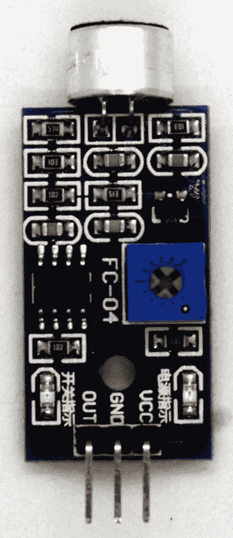
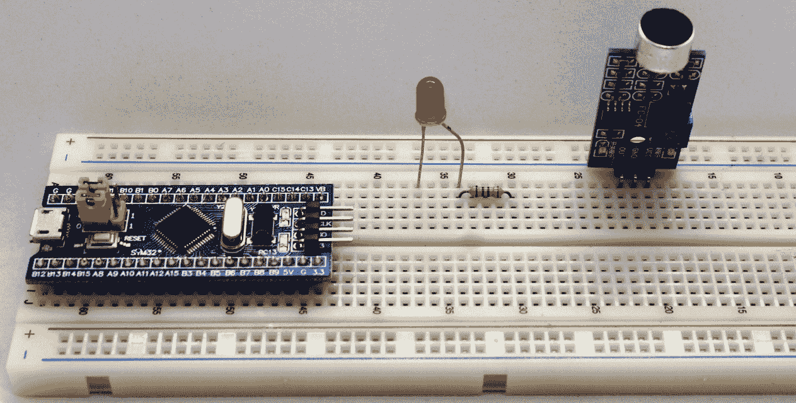
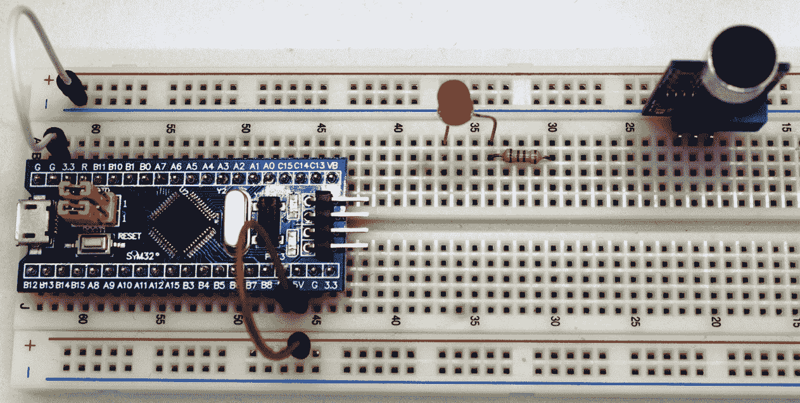
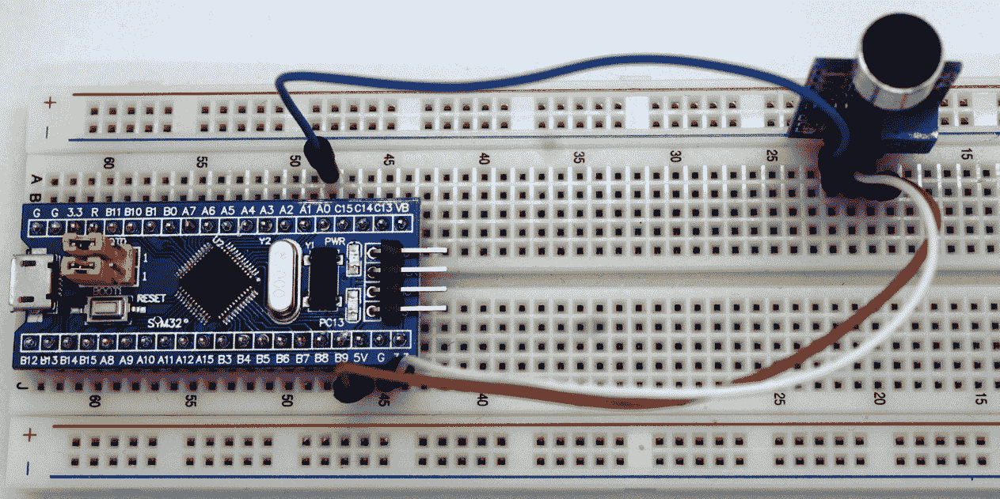
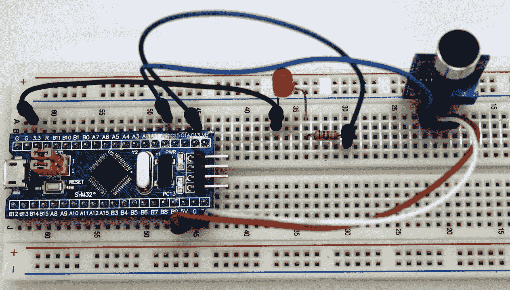
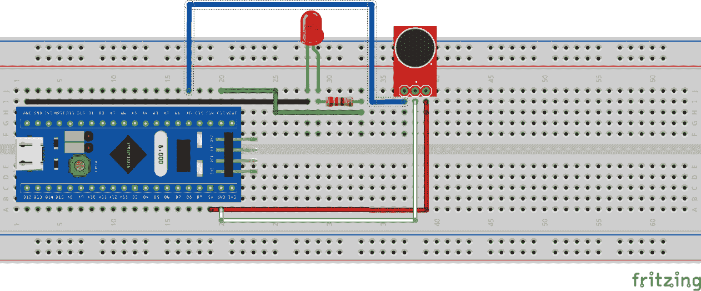
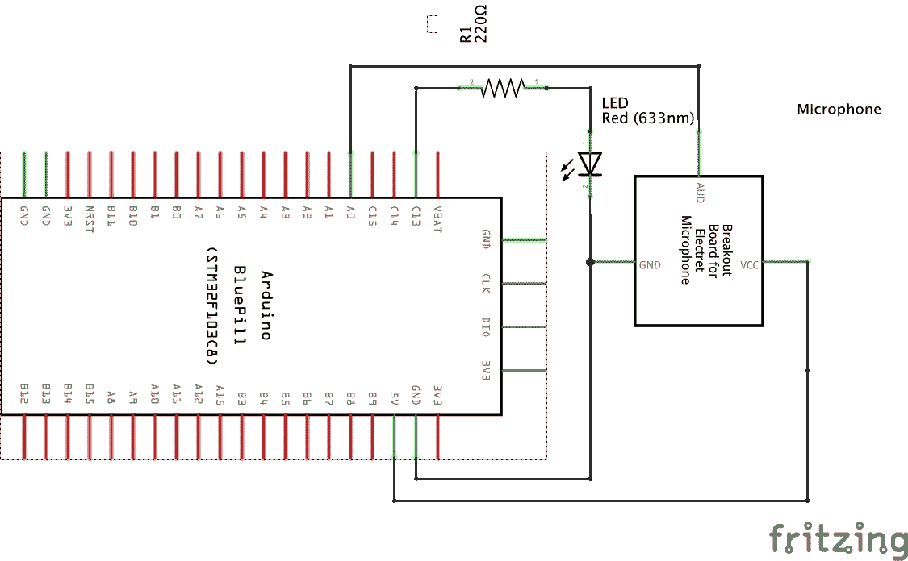
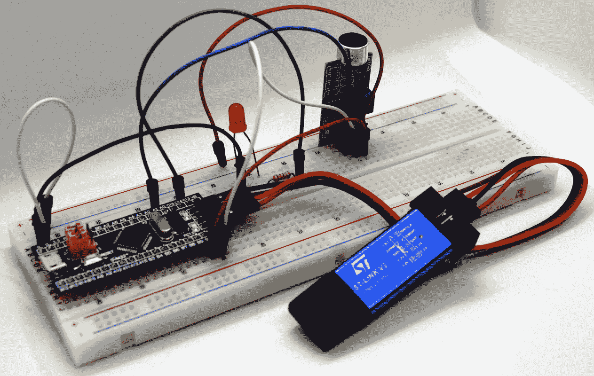

# 第七章：*第七章*：创建拍手开关

当涉及到家庭自动化时，最希望的功能之一通常是远程开关电子设备的能力（Colon，2020）。为了解决这个问题，在本章——涵盖本书的第五个项目——我们将学习如何构建一个无线电子遥控器，当检测到简单的麦克风（**拍手开关**）的两个连续拍手声音时，它会打开 LED。检测到的下一个两个连续拍手声音将关闭 LED。拥有一个拍手开关遥控器的重要性在于，电子设备可以从房间的任何地方打开或关闭。这种特性使得它对老年人或肢体残疾人特别感兴趣。

本章将涵盖以下主要主题：

+   将麦克风连接到微控制器板端口

+   编写拍手开关草图

+   编写具有两个拍手声音的拍手开关代码

+   编写具有拍手间隔计时器的拍手开关代码

+   提高项目性能

完成本章后，你将能够将所学知识应用于需要从模拟源读取数据、将数据转换为数字数据的项目，从而能够使用它来自动化流程。

# 技术要求

开发拍手开关所需硬件组件如下：

+   一个面包板

+   一个驻极体麦克风 FC-04 模块

+   七根公对公跳线

+   一个 LED

+   一个 220 欧姆电阻

+   一个 5 伏电源

这些组件非常常见，而且很容易获得。在软件方面，你需要 Arduino IDE 和本章的 GitHub 仓库：[`github.com/PacktPublishing/DIY-Microcontroller-Projects-for-Hobbyists/tree/master/Chapter07`](https://github.com/PacktPublishing/DIY-Microcontroller-Projects-for-Hobbyists/tree/master/Chapter07)

本章的“代码在行动”视频可以在这里找到：[`bit.ly/3h2xjQu`](https://bit.ly/3h2xjQu)

为了提供电源，你可以使用适合面包板轨道的电源适配器（*图 7.1*），这些电源适配器或面包板电源在网店中很常见，可以跳线提供 3.3 或 5 伏，并包含一个开关按钮：


图 7.1 – 电源

此外，你可以使用 9 伏电池。使用这些电池是最常见的选项之一，因为 9 伏电压适合为带有微控制器如 Blue Pill STM32 的项目供电。

# 将麦克风连接到微控制器板端口

在本节中，我们将学习如何使用**STM32 Blue Pill**和麦克风 FC-04 模块构建拍手开关所需的硬件组件。

然而，在我们开始连接组件之前，我们必须了解麦克风的基本知识。

## 理解驻极体麦克风模块

拍手开关使用麦克风来感知环境，同时等待触发动作的事件。在本节中，我们将了解如何将此功能应用于项目中。

我们将使用一个通用的麦克风模块，它是一个带有驻极体电容麦克风的扩展板（如图*图 7.2*所示）：



图 7.2 – 驻极体麦克风板

电容式麦克风由一个放置在板上的振膜膜片组成，两者都是导体。电容器本质上是由导体和它们之间的绝缘体形成的。因此，当这两个导体之间的距离较小时，可以获得更高的电容。

重要提示

电容是电子组件收集和存储电能的能力或容量。

麦克风接收声音，使振膜振动。振动改变导体之间的距离，并改变其电容以产生电压电荷，这反过来又需要大量的电压来维持，使得传统的麦克风在降低微控制器板（如 Blue Pill 或 Curiosity Nano）的功耗方面无效。为了解决大量功耗的问题，开发了驻极体麦克风。驻极体麦克风使用在制造过程中充电的独特极化材料，因此不需要外部电压（Fox, 2020）。在了解麦克风基础知识后，我们现在将进入将麦克风连接到微控制器板的步骤。

## 连接组件

现在我们将连接电子组件到面包板，进行布线，最后将所有东西连接到 STM32 Blue Pill：

1.  在连接组件时，将驻极体麦克风、电阻、LED 和 STM32 Blue Pill 放置在面包板上，留有足够的空间添加布线层，如图*图 7.3*所示。本项目的硬件连接非常简单：

    图 7.3 – 面包板上的组件

1.  接下来，为了使用外部电源启动拍手开关，将 5 伏引脚连接到面包板上的红色轨道，并将地线引脚连接到蓝色轨道，如图所示（*图 7.4*）:

    图 7.4 – 连接到电源

1.  将传感器的地（**GND**）引脚连接到面包板的蓝色轨道（蓝色线条旁边的孔）或 SMT32 Blue Pill 的**GND**端子。接下来，你需要将电压（**VCC**）引脚连接到面包板的红色轨道（红色线条旁边的孔），或 Blue Pill 的**5V**总线，如图所示。传感器产生模拟输出，因此必须连接到 Blue Pill 卡的模拟输入，并将声音传感器的输出引脚连接到 Blue Pill 的**A0**引脚，如图*图 7.5*所示：

    图 7.5 – 麦克风连接

    这样，就可以实现从传感器来的模拟信号的采集，微控制器将其转换为数字信号。

1.  要配置 LED，将 LED 的阴极连接到 Blue Pill 的**GND**引脚，将阳极连接到 Blue Pill 的**13**号引脚。电阻必须位于这两个引脚之间，因为这是一个数字输出引脚（见*图 7.6*）：



图 7.6 – LED 设置

最后，你需要使用电池或连接到计算机 USB 端口的 ST-LINK 等电源为板子供电。ST-LINK 还将用于将脚本上传到微控制器板。*图 7.7*总结了所有硬件连接：



图 7.7 – 麦克风传感器连接电路

上一图显示了 STM32 Blue Pill 和电子组件之间的所有连接。此图总结了我们刚刚完成的连接步骤。

*图 7.8*展示了本项目的电路图：



图 7.8 – 麦克风传感器连接的电路图

电路图显示了整个项目的电气图。*图 7.9*展示了我们在**自己动手做**（**DIY**）的拍手开关中所有部件的连接方式：



图 7.9 – 拍手开关设备

*图 7.9*显示了所有完成的硬件连接将如何看起来。

现在，让我们进入下一节，该节将详细说明 C 代码的必要部分，以完成拍手开关的功能。

# 编写你的拍手开关草图

在本节中，我们将开发程序以从麦克风识别拍手声。这个声音将使 LED 开关。让我们开始吧：

1.  作为第一步，我们需要定义 Blue Pill 卡片引脚的哪些引脚将被用于输入和输出。然后，我们需要为麦克风分配声音阈值水平以检测声音；这个值在`0`-`1023`范围内。我们使用`300`这个值，所以麦克风捕捉到的声音足够大，可以识别拍手声而不是任何背景噪音（我们将在*改进项目性能*部分展示如何选择合适的阈值）。

    如以下代码片段所示，模拟读取引脚将是`0`（标记为`PC13`），使用`const`关键字来分配其值。另一种方法是使用预处理宏`#define`，如下面的代码片段所示：

    ```cpp
    #define MicAnalogPin 0
    #define LedDigitalPin PC13
    #define ClapThreshold 300
    ```

    两者之间的区别在于，使用`#define`时，编译器会在编译前替换所有出现的位置，以避免在微控制器中使用内存，并且始终具有全局作用域。相比之下，`const`是一个存储在微控制器内存中的常量值变量，具有有限的作用域。

    基于最佳编程实践，推荐使用常量变量来确保类型安全，因为`#define`指令会替换宏值而不考虑作用域，这可能导致数据类型问题。相比之下，`const`将始终是其声明中定义的相同数据类型。

1.  接下来，在`setup()`部分，我们需要启动串行数据传输并分配传输速度（以`9600` bps 作为标准值）：

    ```cpp
    void setup() {
      Serial.begin(9600);
    }
    ```

1.  我们还需要配置微控制器将使用哪些引脚作为输入和输出。这些值之前已在常量中定义。在以下代码中，赋值是针对微控制器卡的：

    ```cpp
    void setup() {
      Serial.begin(9600);
      pinMode(LedDigitalPin, OUTPUT);
      pinMode(MicAnalogPin, INPUT);
    }
    ```

1.  现在是草图中的`loop()`部分。它包含两个主要部分：*读取模拟输入引脚*和*检测拍手声以点亮 LED*。

1.  `analogRead()`函数读取先前定义的输入引脚的值：

    ```cpp
    void loop() {
      int SoundValue = analogRead(MicAnalogPin);
      Serial.print("Sound value: ");
      Serial.println(SoundValue);
    }
    ```

1.  现在我们有了麦克风中的`SoundValue`变量中的读数值；下一步将是将其值与定义的阈值进行比较。如果麦克风输入的声音高于阈值，LED 灯将亮起，并且将发生 1 秒的暂停，在这段时间内你可以观察到 LED 灯是亮着的。如果检测到的声音不超过阈值值，LED 灯将被指令保持关闭。在两种情况下，串行控制台将显示正在运行的脚本的状态：

    ```cpp
    void loop() {
      int SoundValue = analogRead(MicAnalogPin);
      Serial.print("Sound value: ");
      Serial.println(SoundValue);
      if (SoundValue > ClapThreshold) {
        Serial.println("A clap was detected");
        digitalWrite(LedDigitalPin, HIGH);
        delay(1000);
      } else {
        Serial.println("No clap detected");
        digitalWrite(LedDigitalPin, LOW);
      }
    }
    ```

现在我们有了第一个草图检测拍手声并点亮 LED 的完整代码。接下来，我们可以看到完整的草图，该草图位于 GitHub 仓库的`Chapter7/clap_switch`文件夹中。

现在草图已经完成，你可以将其上传到 Blue Pill 板。为了测试我们的项目是否工作，只需拍手看看 LED 灯是如何亮起的。别忘了面包板必须供电，无论是通过电池还是连接到电脑。

到目前为止，我们已经学习了如何使用微控制器从麦克风读取模拟值（声音）。在主循环期间，设备持续监听麦克风以检测是否有任何声音（我们将假设检测到的声音是拍手声）比定义的阈值更大；如果是这样，LED 灯就会亮起。如果不是，微控制器将保持 LED 灯关闭。

接下来，我们将修改草图，让我们的拍手开关在 LED 灯开启之前等待两次拍手。为了更好的组织，我们将创建代码的副本以与原始草图进行比较，或者在我们遇到新代码问题时需要回滚到上一个版本。

# 编写带有两个拍手声的拍手开关

在本节中，我们将修改我们的程序以从麦克风识别两个拍手声。这将使我们能够在激活遥控器之前更加精确：

1.  一旦我们定义了常量，我们定义两个变量：整数类型，用于计数拍手的次数，布尔类型，用于知道 LED 的状态（开启或关闭）。为了更好的阅读，我们已突出显示草图中原变量声明的更改：

    ```cpp
    const int MicAnalogPin = 0; 
    const int LedDigitalPin = PC13; 
    const int ClapThreshold = 300; 
    0, and the LED status to false (off), which means that true will be on.
    ```

1.  我们将保持`setup()`部分不变，继续到`loop()`部分，那里有最重要的逻辑更改。我们将修改位于验证麦克风记录的声音是否比定义的阈值更大的条件语句中的指令：

    ```cpp
    void loop() {
      int SoundValue = analogRead(MicAnalogPin);  
      if (SoundValue > ClapThreshold) {
    else sentence. Also, the instruction to turn on the LED has been removed. If a clap is detected, the clap counter will be incremented by 1 and will wait for a half-second pause before the Blue Pill re-senses the microphone.
    ```

1.  我们需要知道拍手的总次数是否为`2`，因此我们必须在我们的草图中编写另一个条件，询问`ClapNumber`变量是否已经记录了两次拍手；如果是这样，它必须开启 LED：

    ```cpp
    void loop() {
      int SoundValue = analogRead(MicAnalogPin);
      if (SoundValue > ClapThreshold) {
        ClapNumber++;
        delay(500);
      }
      if (ClapNumber == 2) {
        digitalWrite(LedDigitalPin, HIGH);
      }
    }
    ```

    现在我们已经准备好在我们的设备上测试新的草图，编译它，并加载它。我们可以通过两次连续的拍手来测试代码，两次拍手之间有一个短暂的停顿（记住我们编程的延迟）。

1.  如你所见，LED 灯亮了，但它没有熄灭。为了再次熄灭 LED，我们将编程功能，当用户再拍两次手时熄灭 LED。为此，我们需要另一个我们定义的变量：`LedState`。在其中，我们将存储 LED 是开启还是关闭的状态：

    ```cpp
    void loop() {
      int SoundValue = analogRead(MicAnalogPin);
      if (SoundValue > ClapThreshold) {
        ClapNumber++;
        delay(500);
      }
      if (ClapNumber == 2) {
        if (LedState) {
          digitalWrite(LedDigitalPin, HIGH);
        } else {
          digitalWrite(LedDigitalPin, LOW);
        }
        ClapNumber = 0;
    LedState = !LedState;
      }
    }
    ```

当微控制器检测到连续两次掌声时，它将首先使用下一个条件语句`if (LedState)`检查存储 LED 状态的变量的状态。由于它是一个布尔类型变量，可以直接将其分析到`if`语句中，无需额外的运算符。如果变量具有`TRUE`值，它将触发`if`块，如果它是`FALSE`，则执行`else`块。因此，前面的代码在变量为`TRUE`时打开 LED，在变量为`FALSE`时关闭它。最后，在检测到两次掌声的同一条件下，`ClapNumber`变量被重置为`0`次掌声以重新启动计数器并等待两次新的掌声。`LedState`变量的值是通过使用否定运算符来改变的，反转布尔变量的值；如果状态是`ON`，命令将把它变成`OFF`，反之亦然。

通过这个先前的步骤，我们检测两次连续掌声并打开 LED 的项目就完成了。完整的草图如下所示，也位于 GitHub 仓库的`Chapter7/double_clap_switch`文件夹中。有了检测两次连续掌声的完整草图，我们就可以测试其新的功能。一开始，LED 将是关闭的。当你两次掌声，它们之间有短暂的停顿时，它会亮起；再次连续拍两次手，它会关闭。

最后，我们将向我们的草图添加一个计时器，以指示我们的掌声开关在打开 LED 之前只等待 30 秒。与这个部分相同，我们将创建代码的副本并使用新的代码进行工作。

# 编写带有掌声之间计时器的掌声开关代码

现在，我们将添加一个计时器来限制第一次和第二次掌声之间的等待时间框架：

1.  定义两个新的变量，都是`unsigned long`类型，用于存储每次掌声的时间。对之前草图的更改如下所示：

    ```cpp
    const int MicAnalogPin = 0; 
    const int LedDigitalPin = PC13; 
    const int ClapThreshold = 300; 
    int ClapNumber = 0; 
    bool LedState = false;
    unsigned long FirstClapEvent = 0;
    unsigned long SecondClapEvent = 0;
    ```

    这两个突出显示的变量将存储检测到掌声时的毫秒数：一个用于第一次，另一个用于第二次。

1.  `setup()`部分保持不变，我们将继续到`loop()`部分来介绍计时器的更改。我们将在条件语句内添加一个条件来检测掌声：

    ```cpp
    void loop() {
      int SoundValue = analogRead(MicAnalogPin);  
      if (SoundValue > ClapThreshold) {
        ClapNumber++
        delay(500);
    FirstClapEvent variable value to the millis() function. This function returns the milliseconds since the STM32 Blue Pill executed the sketch. Otherwise, the variable value remains the same.
    ```

1.  在我们识别出两次掌声后，我们将`millis()`赋值给`SecondClapEvent`变量。现在，我们需要在我们的脚本中编写另一个条件来询问两次掌声之间的时间是否少于 30 秒：

    ```cpp
    void loop() {
      int SoundValue = analogRead(MicAnalogPin);
      if (SoundValue > ClapThreshold) {
        ClapNumber++;
        delay(500);
        FirstClapEvent = (ClapNumber == 1) ? millis() :        FirstClapEvent;
      }
      if (ClapNumber == 2) {
        SecondClapEvent = millis();
        if (SecondClapEvent - FirstClapEvent < 30000) {
          if (LedState) { 
            digitalWrite(LedDigitalPin, HIGH);  
          } else {
            digitalWrite(LedDigitalPin, LOW); 
          }
          ClapNumber = 0;   
          LedState = !LedState; 
          FirstClapEvent = 0; 
          SecondClapEvent = 0;
        }
      }
    }
    ```

现在，我们可以通过两次连续的掌声来测试代码，它们之间有 30 秒的时间框架。完整的草图如下所示，也位于 GitHub 仓库的`Chapter7/double_clap_switch_timer`文件夹中：

现在我们已经完成了具有所有功能的草图，只需加载并执行草图以测试和验证其功能。

在下一节中，我们将学习如何测试系统并提供一个有用的技巧来提高处理模拟数据的工作效率。

# 提高项目性能

我之前提到过，我们将讨论阈值值。一般来说，具有模拟读取的项目将阈值值设置为 `200`，但如您所记得，我们正在使用 `300` 的值以确保我们读取的是拍手声，而不是背景噪音。

如果您想更精确地知道您拍手声的值，那么您可以使用 IDE 提供的示例脚本。要访问此草图，我们必须转到 **文件** 菜单，然后转到 **示例**，并选择 **基础**。在该部分中，我们将找到 **AnalogReadSerial** 草图，如图 *7.10* 所示：


图 7.10 – 模拟串行读取示例

选择该菜单选项将打开 `AnalogReadSerial.ino` 草图：

```cpp
void setup() {
  Serial.begin(9600);
}
void loop() {
  int sensorValue = analogRead(0);
  Serial.println(sensorValue);
  delay(1);
}
```

之前的代码引入了一个我们在此项目中尚未使用的指令，即 `Serial.println()`。此代码在名为串行端口的控制台中显示数据，以便人们可以理解，并且它包括一个换行符。

通过加载和执行脚本，我们可以打开 Arduino IDE 的串行监视器，以查看麦克风生成的值（在 `0`-`1023` 范围内）。您只需尝试一些测试拍手声，以找出您拍手声的值，并将其用作更个性化的阈值。

之前的代码块检测麦克风以检测两个拍手声并打开或关闭一个 LED。系统在每次拍手声之间等待 30 秒的时间框架，然后打开或关闭 LED。

恭喜，您现在已经构建了一个无线电子遥控器！

# 摘要

那么，我们在本项目中学到了什么？首先，我们学习了如何将麦克风模块、LED 和电阻连接到由 STM32 微控制器控制的 STM32 Blue Pill 微控制器板。然后，我们编写了一段代码来读取模拟值并在我们的微控制器中分析它。随后，我们发送了一个数字信号，根据我们 STM32 中的嵌入式规则打开或关闭 LED。最后，我们物理测试了该设备，以了解其真实世界的操作。

此项目使我们能够开始创建一个遥控器来自动化家用电器，并根据我们的需求使用它们。例如，您可以添加一个继电器模块并将其连接到灯具，这样您就可以在您所在的地方舒适地打开和关闭灯具，而无需触及灯具开关。

在下一章中，我们将学习如何使用串行监视器功能来分析我们的草图在运行时生成的输出。我们将通过使用 STM32 微控制器构建一个气体传感器项目来实现这一点。

# 进一步阅读

+   Colon, A. (2020). *2020 年最佳智能家居设备*. PCMAG: [`www.pcmag.com/news/the-best-smart-home-devices-for-2020`](https://www.pcmag.com/news/the-best-smart-home-devices-for-2020)

)

+   Fox, A. (2020). *《电容器麦克风完全指南》*. 我的新麦克风：[`mynewmicrophone.com/the-complete-guide-to-electret-condenser-microphones/`](https://mynewmicrophone.com/the-complete-guide-to-electret-condenser-microphones/)

)
