# 第八章：*第八章*：气体传感器

良好的室内空气质量对于保证健康的环境至关重要（Marques 和 Pitarma，2017）。MQ-2 气体传感器可以是一种测量室内空气质量参数或作为早期火灾探测系统的极好方式。在本章中，你将学习如何构建一个用于检测环境中气体的实用系统（我们将其称为**气体传感器**）并将 MQ-2 气体传感器连接到**蓝色药丸微控制器卡**。

本章将涵盖以下主要内容：

+   介绍 MQ-2 气体传感器

+   将气体传感器连接到 STM32 微控制器板

+   编写程序读取传感器板上的气体浓度

+   测试系统

在本章结束时，你将了解 MQ-2 气体传感器的操作，并能够正确将其连接到 STM32 微控制器卡并查看从传感器获得的数据。你将能够在需要使用传感器检测易燃气体或酒精或测量空气质量的项目中应用你所学的知识。

# 技术要求

开发气体传感器所需的硬件组件如下：

+   一个无焊面包板

+   一块蓝色药丸板

+   ST-Link/V2

+   一个 MQ-2 分线模块

+   七根公对公跳线

+   一个 8x8 LED 矩阵

+   一块 7219 分线板

+   一个 5V 电源

这些组件很常见，很容易就能买到。在软件方面，你需要 Arduino IDE 和本章的 GitHub 仓库：[`github.com/PacktPublishing/DIY-Microcontroller-Projects-for-Hobbyists/tree/master/Chapter08`](https://github.com/PacktPublishing/DIY-Microcontroller-Projects-for-Hobbyists/tree/master/Chapter08)

本章的“代码在行动”视频可以在此找到：[`bit.ly/2UpGDGs`](https://bit.ly/2UpGDGs)

让我们先描述一下 MQ-2 气体传感器的特性。

# 介绍 MQ-2 气体传感器

在本节中，我们将了解构建我们的气体传感器的主要硬件组件的详细信息：**MQ-2 传感器**。该传感器推荐用于检测 LPG、丙烷、酒精和烟雾，主要浓度在 300 到 10,000 **百万分之一**（**ppm**）之间。因此，我们可以称它为检测烟雾和易燃气体的传感器。

浓度指的是空气中的气体量，以 ppm（百万分之一）为单位。也就是说，如果你有 2,000 ppm 的 LPG，这意味着在一百万个气体分子中，只有 2,000 ppm 是 LPG，其余 998,000 ppm 是其他气体。

MQ-2 气体传感器是一种电化学传感器，当暴露于某些气体时，其电阻会发生变化。它包括一个小加热器，用于提高电路的内部温度，这为检测物质提供了必要的条件。通过引脚上的 5V 连接，传感器保持足够的热量以正确工作。

重要提示

传感器可能会非常热，因此在操作过程中不应触摸。

MQ 系列气体传感器是模拟的，这使得它们很容易与任何微控制器卡（如 STM32 Blue Pill）实现。在扩展模块中找到 MQ-2 传感器非常常见，这有助于连接和使用，因为它只需要供电并开始读取其数据。这些扩展模块有一个 **数字输出**（**DO**），我们可以将其解释为传感器检测到的任何气体的存在（*低电平*）或不存在（*高电平*）。*图 8.1* 显示了带有扩展板的 MQ-2 气体传感器：

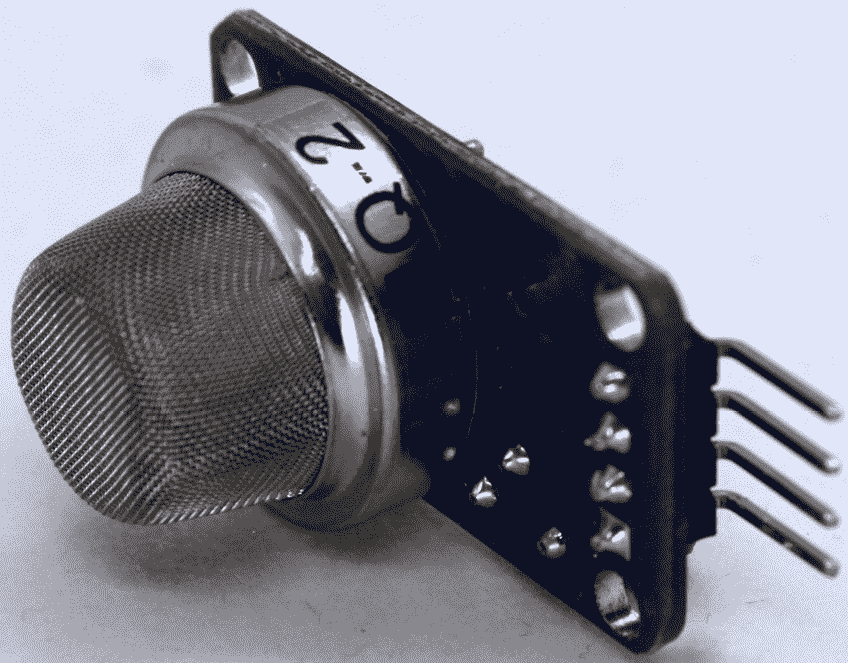

图 8.1 – 带有扩展板的 MQ-2 气体传感器

在下一节中，我们将学习如何通过数字和模拟方式将 MQ-2 传感器连接到我们的无焊面包板，以获取其读数数据。

# 将气体传感器连接到 STM32 微控制器板

在本节中，我们将构建一个使用 STM32 Blue Pill 微控制器板和气体传感器模块的气体传感器设备，该设备使用 *技术要求* 部分中列出的硬件组件。气体传感器扩展板通过四个引脚连接到 STM32 Blue Pill：

+   **模拟输出**（**AO**）：此引脚生成模拟信号，必须连接到微控制器的模拟输入。

+   **DO**：此引脚生成数字信号，必须连接到微控制器的数字输入。

+   **VCC**：为传感器供电的引脚（5 V）。

+   **GND**：接地连接。

对于这个项目，您将学习如何将 MQ-2 模块与 STM32 板进行接口连接，以数字和模拟方式获取数据。让我们从数字选项开始。

## 数字读取接口

现在我们将电子元件连接到面包板上，进行布线，并将所有东西连接到 STM32 Blue Pill 上：

1.  在连接元件时，将传感器模块和 STM32 Blue Pill 放在足够空间添加布线层的无焊面包板上，如图 *图 8.2* 所示。本项目的硬件连接非常简单：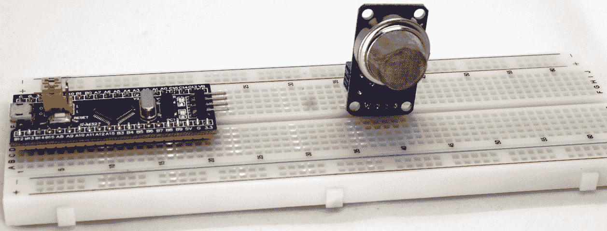

    图 8.2 – 面包板上的元件

1.  接下来，使用外部电源为 Blue Pill 提供电力。将 **5 V 引脚**连接到面包板上的红色轨道，并将一个 **G 引脚**连接到蓝色轨道，如图 *图 8.3* 所示：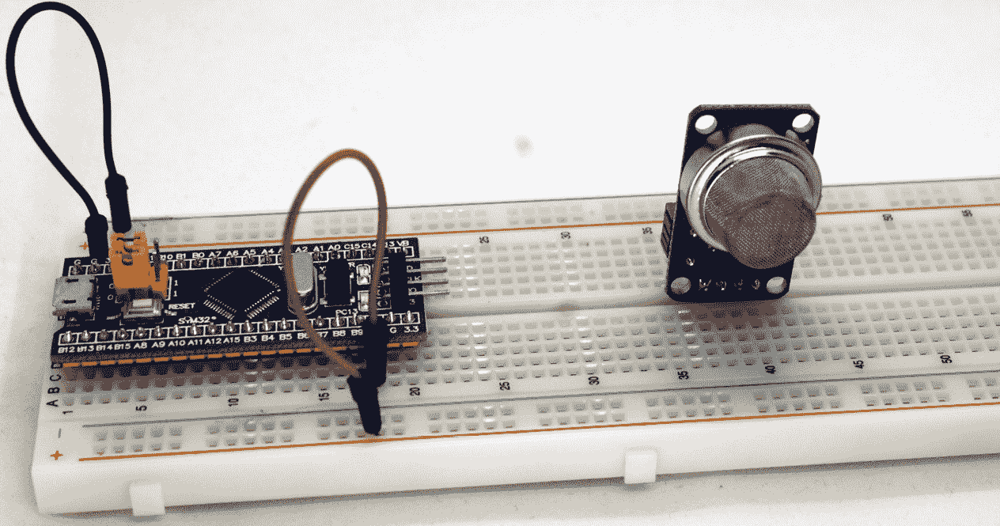

    图 8.3 – 与电源的连接

1.  将 MQ-2 传感器的 **GND 引脚**连接到 STM32 Blue Pill 的 GND 端口。接下来，您需要将 **VCC 引脚**连接到 Blue Pill 的 5 V 总线，如图所示。在本节中，我们将读取 DO，因此它必须连接到 Blue Pill 卡上的一个数字输入。将 MQ-2 传感器的 DO 连接到 Blue Pill 的 B12 引脚，如图 *图 8.4* 所示：

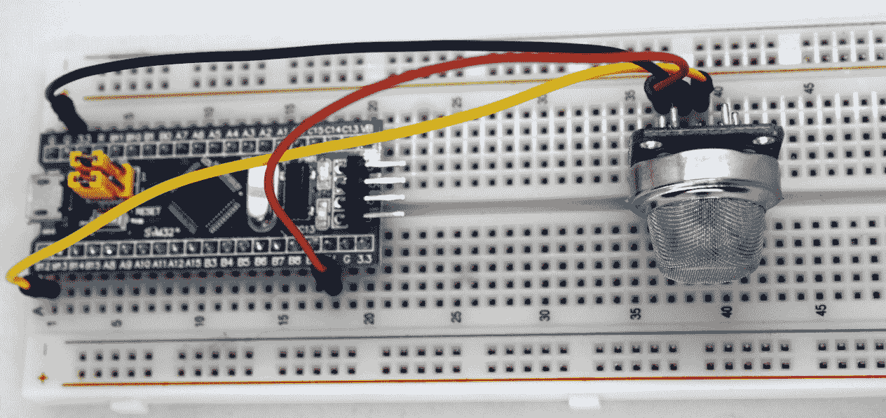

图 8.4 – 用于数字读取的 MQ-2 传感器连接

最后，你需要使用电池等电源来为电路板供电。*图 8.5*总结了所有硬件连接：

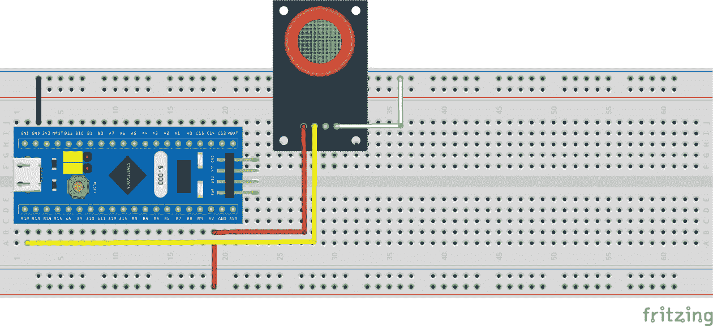

图 8.5 – 用于数字读取的 MQ-2 传感器连接电路

前面的图示显示了 STM32 Blue Pill 和电子部件之间的所有连接。*图 8.6*展示了本项目的原理图：

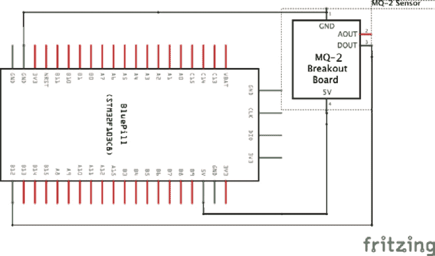

图 8.6 – 用于数字读取的 MQ-2 传感器连接图

*图 8.7*展示了我们的 DIY 气体传感器设备中所有部件的连接方式：

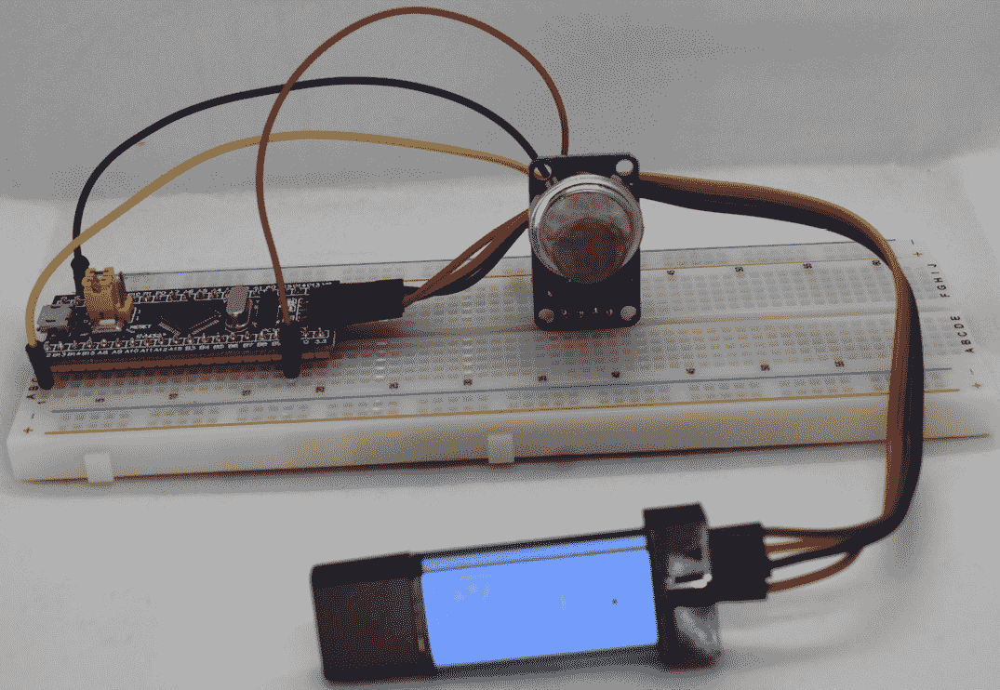

图 8.7 – 数字读取的气体传感器设备

在本小节中，我们学习了如何连接电子设备以创建具有数字读取功能的气体传感器设备。接下来，我们将看到如何将其连接为模拟读取。

## 模拟读取接口

只需要一步就可以将我们的硬件设备从读取传感器的数字数据改为模拟读取：

1.  将跳线从 DO 引脚断开，并将其连接到 MQ-2 传感器的 AO 引脚。此外，不要连接到 B12 引脚，而是连接到 Blue Pill 的 AO 引脚，如图*图 8.8*所示：

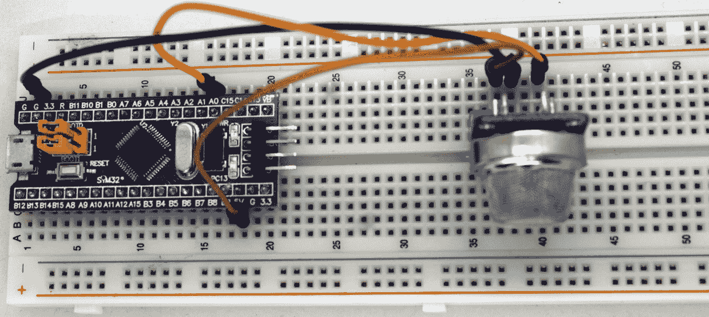

图 8.8 – 用于模拟读取的 MQ-2 传感器连接

*图 8.9*总结了所有硬件连接：

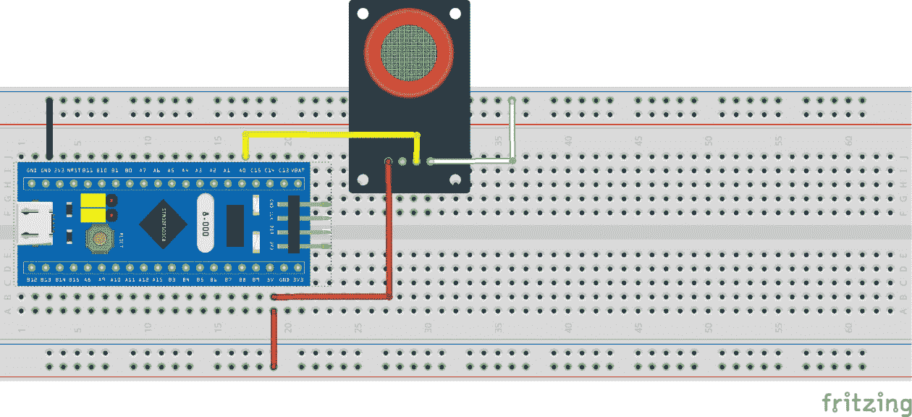

图 8.9 – 用于模拟读取的 MQ-2 传感器连接电路

*图 8.10*展示了模拟读取设备的原理图：

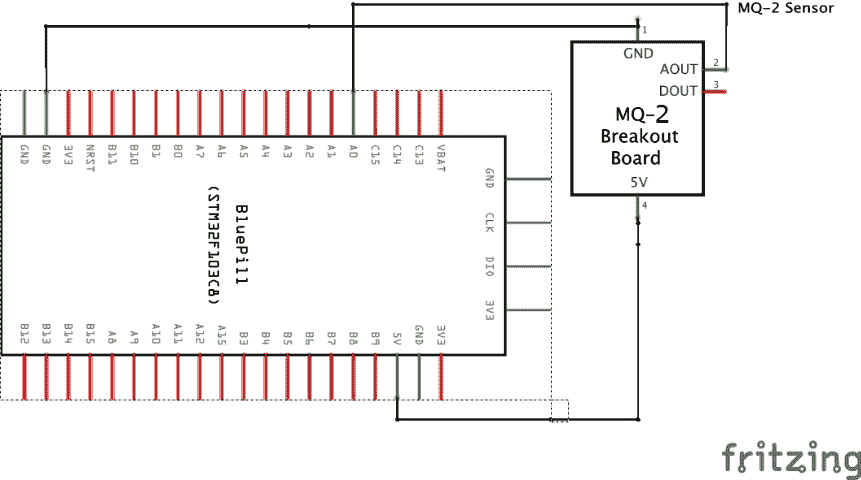

图 8.10 – 用于模拟读取的 MQ-2 传感器连接图

让我们回顾一下。在本节中，我们学习了如何连接硬件组件以创建我们的气体传感器设备。你学习了如何将 MQ-2 传感器连接到 STM32 Blue Pill 微控制器板，以两种方式获取其数据：数字形式和模拟形式。

在下一节中，我们将创建 C 代码，从 STM32 Blue Pill 微控制器获取 MQ-2 传感器数据。

# 编写读取传感器板上气体浓度的程序

在本节中，我们将学习如何编写程序从我们的气体传感器读取数据，并在环境中检测到气体时在串行监视器上显示它。

如前所述，我们首先学习如何以数字和模拟形式读取数据。

## 数字读取的编码

让我们开始编写代码：

1.  定义 STM32 Blue Pill 微控制器哪个引脚将用作从传感器读取数据的输入。以下是展示如何做到这一点的代码：

    ```cpp
    const int sensorPin = PB12;
    boolean sensorValue = true;
    ```

    选定的引脚是`PB12`（在 Blue Pill 板上标记为 B12）。声明并初始化了一个布尔变量为`true`。这个变量将用于存储传感器数据。

1.  接下来，在`setup()`部分，我们需要启动串行数据传输并分配传输速度（以`9600` bps 作为标准值）：

    ```cpp
    void setup() {
      Serial.begin(9600);
    }
    ```

1.  向微控制器指示分配给`PB12`的引脚类型：

    ```cpp
    void setup() {
      Serial.begin(9600);
      pinMode(sensorPin, INPUT);
    }
    ```

1.  现在是`loop()`部分，其余的代码。前几行读取输入引脚的数据传感器，并在串行控制台中显示其值：

    ```cpp
    void loop() {
      sensorValue = digitalRead(sensorPin);
      Serial.print("Sensor value: ");
      Serial.println(sensorValue);
      if (sensorValue) {
        Serial.println("No gas present");
        delay(1000);
      } else  {
        Serial.println("Gas presence detected");
        delay(1000);
      }
    }
    ```

    从传感器读取的值可以是`TRUE`或`FALSE`；记住，我们正在读取一个数字值。如果值为`TRUE`，则环境中没有气体存在；否则，检测到气体。这种行为发生是因为 MQ-2 传感器的输出是取反的；在此状态下，模块的 LED 也必须点亮，因为它是内部带有 5 V 电阻的。当没有气体存在时，LED 熄灭，输出是逻辑 1（5 V）。

    数字读取的代码现在已完成。您可以在 GitHub 仓库的`Chapter8/gas_digital`文件夹中找到完整的草图。

现在我们有了读取 MQ-2 传感器 DO 的完整代码。您可以将其上传到 STM32 微控制器。现在您可以在**串行监控器**中看到如图*图 8.11*所示的传感器读数。最正常的情况是读数指示没有气体存在：

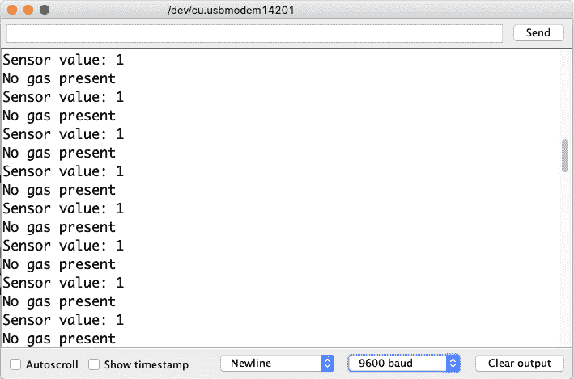

图 8.11 – 无气体存在的传感器 DO 的串行监控读取

现在，**非常注意防火安全**，将点燃的火柴拿到传感器旁，并在靠近传感器时吹灭以产生烟雾。当烟雾浸入传感器时，串行监控器会立即改变（如图*图 8.12*所示）：

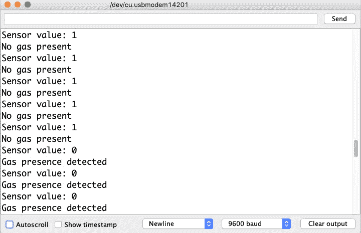

图 8.12 – 有气体存在的传感器 DO 的串行监控读取

如我们所见，它就像读取任何数字输入一样。传感器的灵敏度是通过断出模块中包含的可变电阻来配置的。向右转动使其更加敏感，并且需要更少的气体存在来激活输出。同样，如果我们向左转动，则需要更多的气体存在来激活输出。

到目前为止，我们已经学会了如何以数字形式读取气体传感器。在接下来的小节中，我们将从 AO 获取其读数。

## 编码模拟读取

当使用 AO 时，可以获得不同水平的气体存在。该模块有一个加热室，气体进入其中。这种气体将继续被检测，直到室空。传感器的电压输出将与室内的气体浓度成正比。

简而言之，气体浓度越高，电压输出越高，气体浓度越低，电压输出越低。

让我们从代码开始：

1.  复制 `Chapter8/gas_digital` 项目并重命名为 `Chapter8/gas_analog`。请记住重命名文件夹和 INO 文件。

1.  将传感器引脚改为 `0`（在 Blue Pill 上标记为 A0），移除布尔变量，并为传感器读取分配一个阈值级别。我们将使用 `800` 的值，以确保传感器在其室内有气体：

    ```cpp
    const int sensorPin = 0;
    const int gasThreshold = 800;
    ```

1.  保持 `setup()` 不做修改：

    ```cpp
    void setup() {
      Serial.begin(9600);
      pinMode(sensorPin, INPUT);
    }
    ```

1.  `loop()` 中的代码将使用相同的逻辑，但有一些变化：

    ```cpp
    void loop() {
      int sensorValue = analogRead(sensorPin);
      Serial.print("Sensor value: ");
      Serial.println(sensorValue);
      if (sensorValue > gasThreshold) {
        Serial.println("Gas presence detected");
      } else {
        Serial.println("No gas present");
      }
      delay(1000);
    }
    ```

1.  要读取传感器值，我们使用 `analogRead()` 函数。读取的值存储在 `sensorValue` 变量中；下一步将是将其值与阈值进行比较。如果传感器值高于阈值，这意味着检测到了气体。

现在我们已经完成了草图，请将其上传到 Blue Pill 板上。为了测试我们的项目是否工作，就像数字读取版本一样，只需将点燃的火柴拿到传感器旁，当靠近传感器时吹灭以产生烟雾。请务必非常小心地注意防火安全。*图 8.13* 展示了当开始检测到烟雾时的串行监视器：

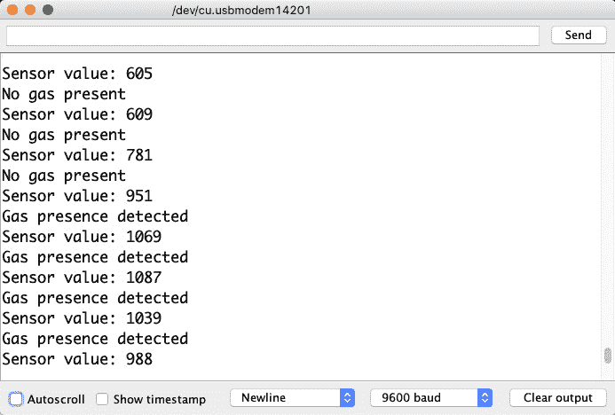

图 8.13 – 有气体存在的传感器 AO 串行监视器读取

这一部分帮助我们学习如何用 C 语言编写代码来读取 MQ-2 传感器的数据，以了解环境中是否有气体或烟雾浓度。此外，还掌握了读取模拟和数字形式的传感器值的技术。在下一节中，我们将创建一种简单的方法，直接在硬件设备上知道是否有气体或烟雾浓度，而无需在计算机上的串行监视器中查看。

# 系统测试

在本章的最后部分，我们将连接一个 **8x8 LED 矩阵**，如果传感器检测到环境中存在气体，则显示警报。

LED 矩阵是一组按行和列分组排列的 LED。通过打开这些 LED，可以创建图形或文本，这些在广告牌和交通标志中得到了广泛应用。

有一种用于小型项目的电子组件，称为 8x8 LED 矩阵。它由 64 个 LED 组成，排列成八行八列（见 *图 8.14*）：

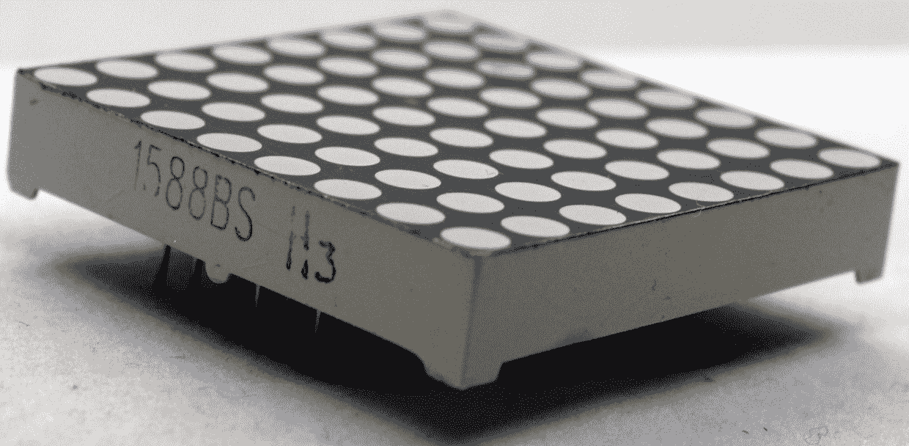

图 8.14 – 8x8 LED 矩阵

如前图所示，8x8 LED 矩阵有控制行和列的引脚，因此不可能独立控制每个 LED。

这种限制意味着必须使用 16 个数字信号并持续刷新图像或文本。因此，已经创建了集成的 MAX7219 和 MAX7221 电路来简化这项任务；这些电路几乎相同且可使用相同的代码互换。

除了这些集成电路之外，还创建了集成 8x8 LED 矩阵和 MAX7219 电路的开关模块，此外还提供了输出连接器，可以将多个模块级联。*图 8.15* 展示了 8x8 LED 矩阵开关模块：

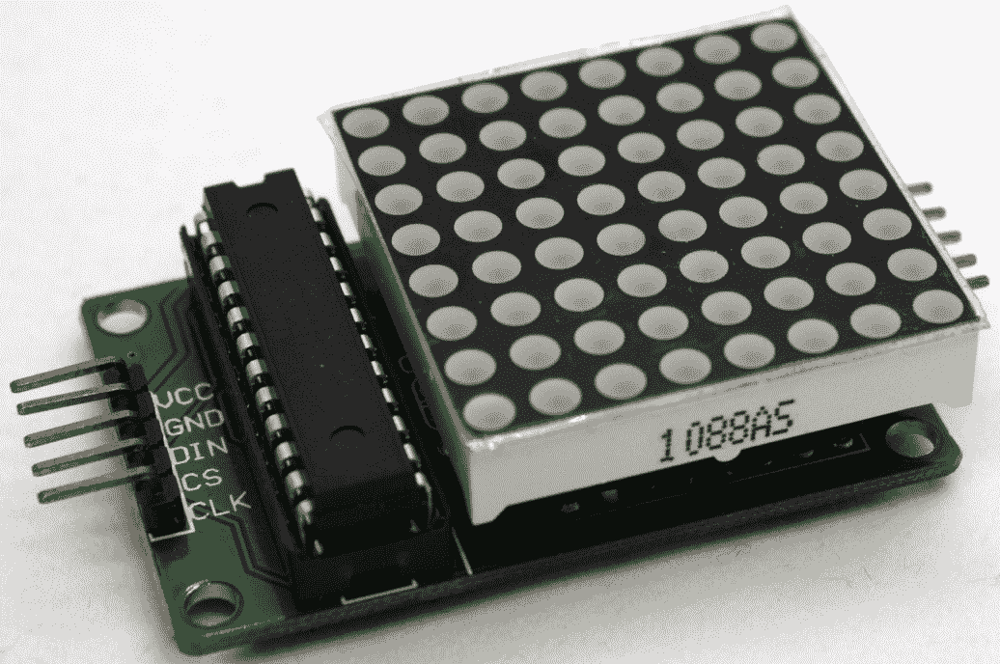

图 8.15 – LED 矩阵 8x8 开关模块

模块的输入引脚如下：

+   **VCC**: 模块电源

+   **GND**: 地线连接

+   **DIN**: 串行数据输入

+   **CS**: 芯片选择输入

+   **CLK**: 串行时钟输入

输出引脚几乎相同，只是 **DIN** 被替换为 **DOUT**，这将允许与其他模块级联，但我们在本章中不会学习这个功能。

*图 8.16* 展示了如何将 MAX7219 8x8 LED 矩阵模块连接到我们的 STM32 Blue Pill 板上：

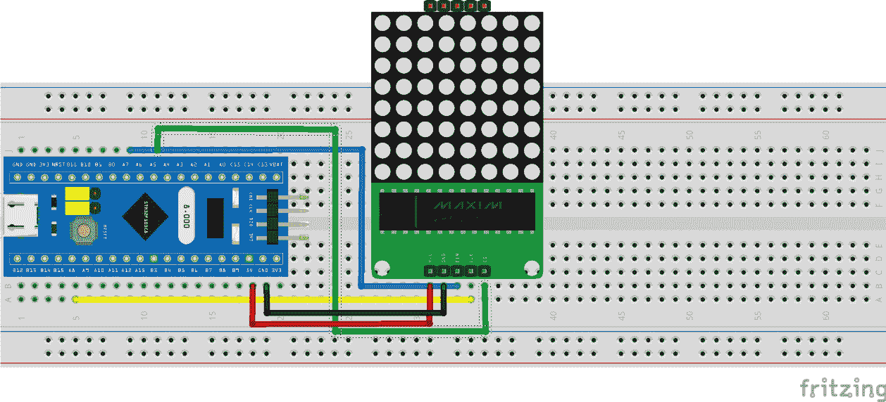

图 8.16 – LED 矩阵 8x8 开关模块与 STM32 Blue Pill 的接口

现在是时候创建代码来在我们的 LED 矩阵上显示警报了。我们将更新 `Chapter8/gas_digital` 草图。让我们开始编码！

1.  为了使过程更容易，我们将使用名为 `LedControlMS` 的库，该库简化了 8x8 LED 矩阵模块的使用。要开始安装，请从我们的 GitHub 下载库：`Chapter8/library`。

1.  安装时，请转到**草图**菜单 | **包含库** | **添加 .ZIP 库…**（见 *图 8.17*）并选择下载的文件，然后它就准备好使用了：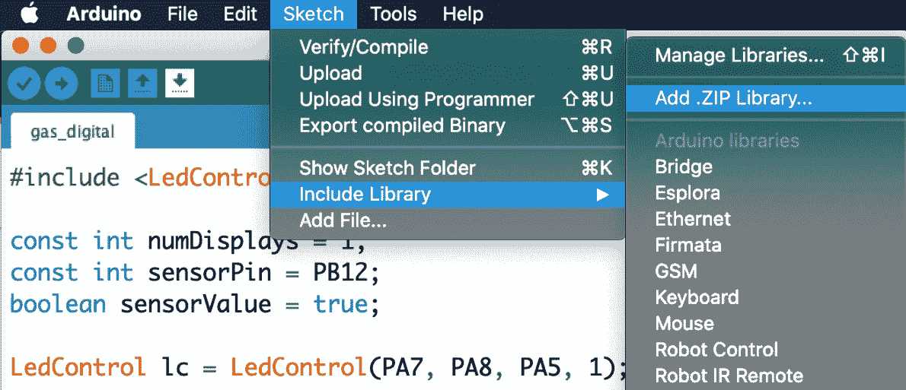

    图 8.17 – 添加 LedControlMS 库

1.  在我们的脚本中，我们将添加库：

    ```cpp
    #include "LedControlMS.h";
    ```

1.  我们必须指出我们正在使用的显示模块数量；在我们的情况下，是一个。我们将初始化库，指出模块将连接到 STM32 Blue Pill 板上的引脚，以及带有模块数量的变量：

    ```cpp
    const int numDisplays = 1;
    const int sensorPin = PB12;
    boolean sensorValue = true;
    LedControl lc = LedControl(7, 8, 5, numDisplays);
    ```

1.  默认情况下，矩阵处于省电模式，因此需要唤醒它。如果有多个模块，则需要一个循环，但在这个例子中只有一个，所以我们直接操作：

    ```cpp
    void setup() {
      Serial.begin(9600);
      pinMode(sensorPin, INPUT);
      0 in the code refers to the first array of a possible set of interconnected arrays.
    ```

1.  最后，我们写入我们想要显示的字符。我们将使用 `writeString()` 函数在 `else` 语句中指示 LED 矩阵中有气体；我们将显示字母 `A` 来表示警报：

    ```cpp
    void loop() {
      sensorValue = digitalRead(sensorPin);
      Serial.print("Sensor value: ");
      Serial.println(sensorValue);
      if (sensorValue) {
        Serial.println("No gas present");
        delay(1000);
      } else  {
        Serial.println("Gas presence detected");
        lc.writeString(0, "A");
        delay(1000);
      }
    }
    ```

    我们准备将我们的脚本上传到微控制器并测试系统是否正常工作。与上一节类似，为了测试它，将点燃的火柴拿到传感器旁，当接近传感器时吹灭以产生烟雾。再次提醒，不要忘记非常注意消防安全。*图 8.18*显示了完整的气体感应装置，包括传感器和连接到 STM32 微控制器的 LED 矩阵模块：

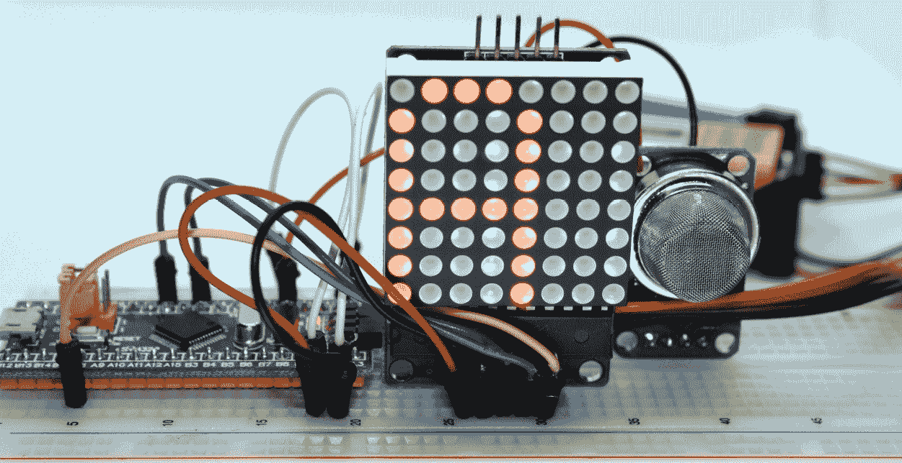

图 8.18 – 气体感应装置

到目前为止，在本节中，我们学习了如何处理 8x8 LED 矩阵并使用它来在我们的气体感应装置上设置视觉警报。

在本章中，我们学习了如何读取代码程序以数字和模拟方式读取气体传感器。这使我们能够加强我们对不同形式输出中传感器数据采集的知识。这些知识将使我们能够创建更复杂的嵌入式系统，例如使用环境中的传感器自动化家庭。

# 摘要

在本章中，我们学到了很多！首先，我们学习了如何将 MQ-2 气体传感器连接到 STM32 Blue Pill 微控制器板，无论是通过数字方式还是通过 AO 读取。然后，我们编写了两段代码来读取数字和模拟传感器值。最后，我们测试了设备以了解其操作，在串行控制台中显示传感器数据。

这个项目让我们掌握了读取不同类型传感器数据并根据自己的需求使用这些知识的技能。例如，你可以在房间里显示一些传感器来实时监控环境。

在下一章中，我们将进入所谓的物联网的迷人世界。通过我们将获得的知识，我们将创建连接到互联网并远程访问我们信息的项目。

# 进一步阅读

Marques G. & Pitarma R. (2017). *使用物联网监测室内居住环境中的健康因素.* 见：Rocha Á., Correia A., Adeli H., Reis L., & Costanzo S. (eds) Recent Advances in Information Systems and Technologies. WorldCIST 2017\. Advances in Intelligent Systems and Computing, vol. 570\. Springer, Cham. [`doi.org/10.1007/978-3-319-56538-5_79`](https://doi.org/10.1007/978-3-319-56538-5_79)
