# *第十章*：物联网花盆湿度传感器

随着物联网（**IoT**）的出现，我们沉浸在新的工业革命中——所谓的**工业 4.0**。从这些技术中受益最多的行业之一是农业（Chalimov，2020）。农业物联网应用范围从自主收割到识别害虫和疾病或测量湿度的传感器。我们可以利用这些进步在家中——例如，监测我们的观赏植物以获得更有效的护理。

在本章中，你将应用在*第九章*“物联网温度记录系统”中学到的信息，关于如何连接和编程互联网连接，但这次我们将介绍一个**NodeMCU 微控制器**来简化 ESP8266 编程。你将学习如何创建一个数字设备来监测花盆，从土壤湿度传感器读取数据并确定是否需要浇水，然后发送警报通知它太干了。

本章将涵盖以下主要内容：

+   将土壤湿度传感器连接到 Blue Pill 板

+   从土壤湿度传感器模块读取数据

+   编写程序将感应数据发送到互联网

+   在互联网上显示传感器数据结果

通过完成本章，你将发现如何通过连接到 STM32 Blue Pill 板的传感器读取土壤的湿度量。你还将学习如何通过 NodeMCU 开发板将此信息发送到互联网，并通过响应式网页可视化传感器值。

# 技术要求

开发花盆湿度系统所需的硬件组件如下所示：

+   一个无焊面包板。

+   一个 Blue Pill 微控制器板。

+   一个 NodeMCU 微控制器。

+   一个 ST-Link/V2 电子接口，用于将编译后的代码上传到 Blue Pill 板。请注意，ST-Link/V2 接口需要四根公对公跳线。

+   一个土壤湿度传感器。

+   一个 ESP8266 Wi-Fi 模块。

+   公对公跳线。

+   电源。

这些组件可以从你喜欢的供应商那里轻松获得。此外，你还需要本章的 Arduino**集成开发环境**（**IDE**）和 GitHub 仓库，可以在[`github.com/PacktPublishing/DIY-Microcontroller-Projects-for-Hobbyists/tree/master/Chapter10`](https://github.com/PacktPublishing/DIY-Microcontroller-Projects-for-Hobbyists/tree/master/Chapter10)找到。

本章的“代码在行动”视频可以在这里找到：[`bit.ly/3d9CmNM`](https://bit.ly/3d9CmNM)

下一节将介绍土壤湿度传感器及其如何与 STM32 Blue Pill 微控制器板一起使用。

# 将土壤湿度传感器连接到 Blue Pill 板

我们将从这个部分开始学习如何使用传感器测量花盆中的土壤湿度，你将后来学习如何将其连接到**STM32 Blue Pill**板以构建花盆湿度监控系统。

## 介绍土壤湿度传感器

**土壤湿度传感器**由两个测量土壤中水分量的焊盘组成。通过允许电流通过土壤流动来获取感应值，根据电阻，这显示了花盆中的湿度水平。

你可以找到一个通用的扩展模块，它非常容易使用。以下照片展示了这一点：

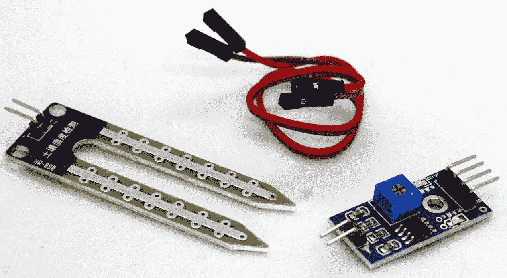

图 10.1 – 土壤湿度传感器扩展板

这些焊盘通过包含的公对公跳线连接到扩展板。扩展板通过四个引脚连接到 STM32 Blue Pill 板，如下所述：

+   **模拟输出**（**AO**）：此引脚生成模拟信号，必须连接到微控制器的模拟输入。

+   **数字输出**（**DO**）：此引脚生成数字信号，必须连接到微控制器的数字输入。

+   **VCC**：为传感器供电的引脚（3.3 **伏特**（**V**）-5 V）。

+   **地**（**GND**）：地连接。

为了简化我们项目的开发，我们将使用 DO 引脚来构建我们的系统，因为它只根据湿度生成二进制数据。

## 连接组件

我们将使用无焊点面包板连接传感器和 STM32 Blue Pill 微控制器，最后用线连接组件。按照以下步骤操作：

1.  将土壤湿度传感器和 STM32 Blue Pill 板放置在无焊点面包板上，留出足够的空间以添加布线层。

1.  将传感器的地（GND）引脚连接到 SMT32 Blue Pill 板的地（GND）端子。

1.  接下来，你需要将电压（VCC）引脚连接到 STM32 Blue Pill 板的 3V3 总线上。传感器的 DO 必须连接到 STM32 Blue Pill 板上的数字输入，因此将传感器的 DO 引脚连接到 Blue Pill 的 B12 引脚，如下照片所示：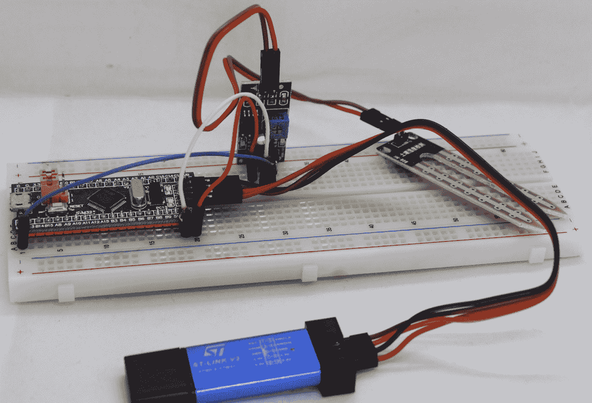

    图 10.2 – 土壤湿度传感器连接到 Blue Pill

1.  最后，你需要一个电源来为板供电。使用 ST-LINK 将脚本上传到 STM32 Blue Pill 微控制器板。以下截图总结了所有硬件连接：

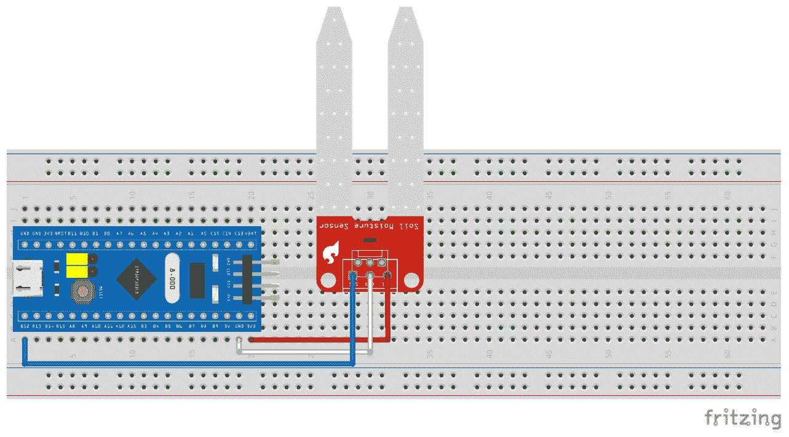

图 10.3 – 土壤湿度传感器连接电路

以下截图展示了本项目的原理图：

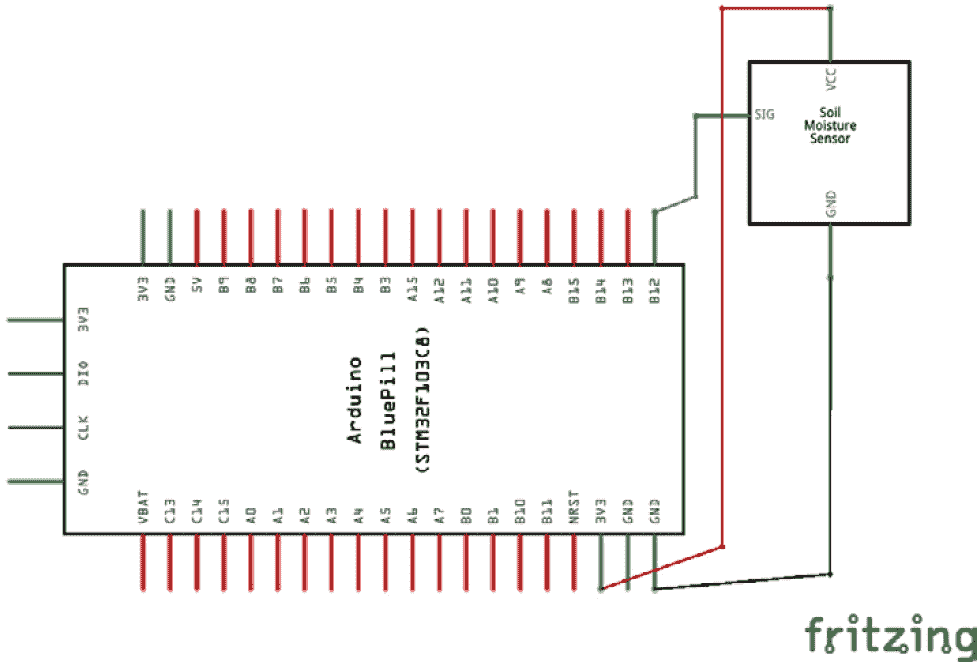

图 10.4 – 土壤湿度传感器连接原理图

*图 10.4*显示了该项目的这部分电路图。传感器的地线引脚连接到 Blue Pill 的 GND 引脚，而 VCC 引脚连接到 Blue Pill 的 3V3 总线。最后，传感器的 DO 插头插入到 STM32 微控制器的 B12 引脚。以下照片显示了植物花盆湿度系统：

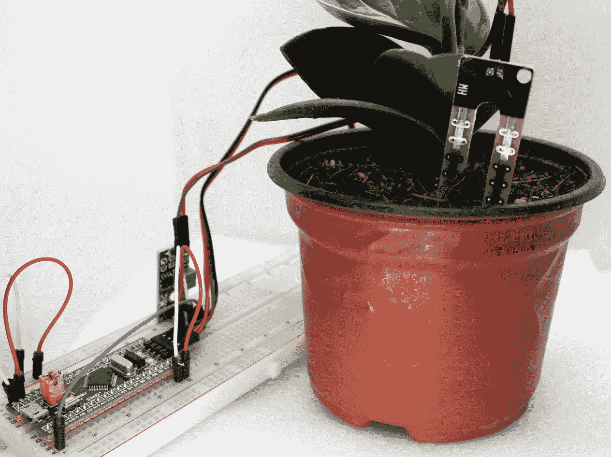

图 10.5 – 植物花盆湿度系统

在上一张照片中，我们可以看到湿度监控系统部署的过程。正如我们所见，我们构建了一个紧凑的电子电路来监测植物花盆中土壤的湿度。

在本节中，我们了解了湿度传感器的概念及其组件。此外，我们学习了如何通过面包板将传感器连接到微控制器，并最终学习了如何将整个系统连接到植物花盆上。

现在是进入下一部分的时候了，这部分将向您展示如何编写 C 代码来完成物联网湿度监控系统的基础功能。

# 从土壤湿度传感器模块读取数据

您现在将学习如何编写一个程序，该程序读取湿度传感器的信息，并在串行监视器上显示植物花盆是否需要浇水或已经足够湿润。

让我们开始开发从 STM32 Blue Pill 收集传感器数据的程序，如下所示：

1.  让我们开始编写代码。这次，我们不需要任何额外的库。定义 STM32 Blue Pill 卡上哪些引脚将被用作读取传感器数据的输入。同时，声明一个变量来保存从传感器读取的数据，如下所示：

    ```cpp
    const int PB12 pin (labeled B12 on the Blue Pill). Also, we initialize the sensorValue variable to a value of 0.
    ```

1.  接下来，在`setup()`部分，我们需要启动串行数据传输并分配传输速度（像往常一样，我们将使用 9,600 **比特/秒**（**bps**）作为标准值）。以下是执行此操作的代码：

    ```cpp
    void setup() {
      Serial.begin(9600);
    }
    ```

1.  通过运行以下代码向微控制器指示分配给`PB12`的引脚类型：

    ```cpp
    void setup() {
      Serial.begin(9600);
      pinMode(sensorPin, INPUT);
    }
    ```

1.  剩余的代码在`loop()`部分。前几行读取输入引脚的数据传感器，并在串行控制台中显示其值。代码如下所示：

    ```cpp
    void loop() {
      sensorValue = digitalRead(sensorPin);
      Serial.print("Sensor value: ");
      Serial.println(sensorValue);
      if (sensorValue == 1) {
        Serial.println("Soil is too dry");
        delay(1000);
      } else  {
        Serial.println("Soil is moist enough");
        delay(1000);
      }
    }
    ```

    从传感器读取的值可能是`1`或`0`；记住，我们正在读取一个数字值。如果值是`1`，那么植物花盆需要浇水；否则，它已经足够湿润。

    代码现在已完成。您可以在 GitHub 仓库的`Chapter10/moisture`文件夹中找到完整的草图。

1.  现在草图已完成，您可以将其上传到 Blue Pill 板，并将传感器垫插入植物花盆中。现在，您可以在**串行监视器**中看到土壤太干燥，如下面的截图所示：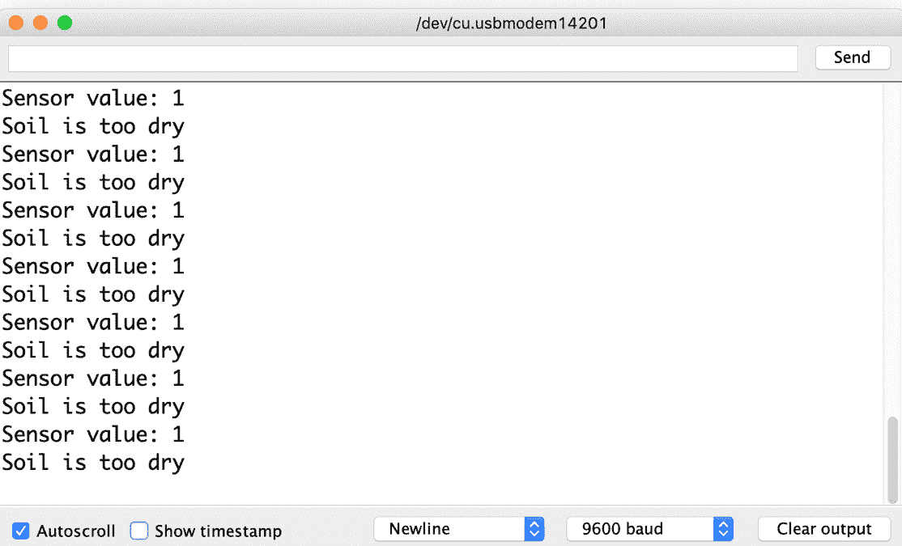

    图 10.6 – 干土壤的串行监视器读取

1.  现在，向花盆中加水，注意不要让任何电子组件受潮。一旦土壤变湿，串行监视器的信息就会立即改变，如下面的截图所示：

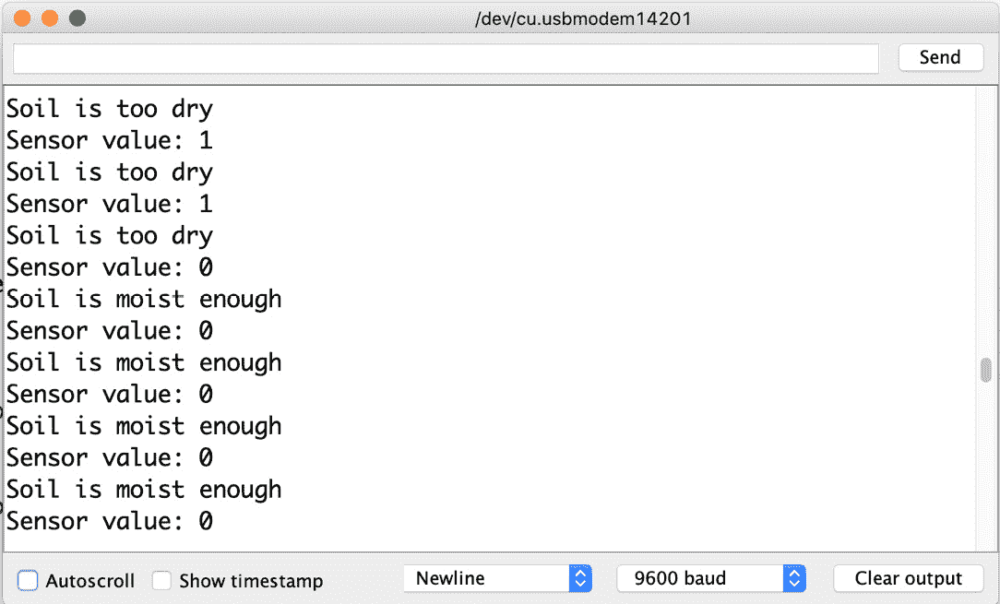

图 10.7 – 浇水后串行监视器的读数

重要提示

在最近的 macOS 版本中，Arduino IDE 中可能不会显示 **通用串行总线** (**USB**) 端口，因此可能无法看到串行监视器。为了解决这个问题，需要从 [`www.silabs.com/developers/usb-to-uart-bridge-vcp-drivers`](https://www.silabs.com/developers/usb-to-uart-bridge-vcp-drivers) 安装 USB-UART 驱动程序（其中 **UART** 代表 **通用异步收发传输器**）。

让我们回顾一下到目前为止我们已经学到的内容。我们学习了用于测量土壤湿度的传感器。我们在 *将土壤湿度传感器连接到 Blue Pill 板* 部分学习了如何将其连接到我们的 STM32 Blue Pill 微控制器。在本节中，我们编写了获取其数据并在串行监视器上显示的代码。

你在本章中已经掌握的技能将允许你创建其他需要从传感器中读取数据的数字电子系统，使你能够在需要测量土壤湿度的额外项目中使用这个传感器。

接下来，我们将学习 NodeMCU 微控制器，它将借助其集成的 ESP8266 模块方便地连接到互联网。

# 编写程序将感应数据发送到互联网

如果你记得，在 *第九章* 的 *物联网温度记录系统* 中，我们发现使用了 ESP-01 模块，因为它通过 ESP8266 集成了 Wi-Fi 通信。该模块通过 STM32 Blue Pill 微控制器（其中 **AT** 代表 **Attention**）使用 **AT 命令**进行编程。如本章开头所述，我们将使用 **NodeMCU 开发板**，如下面的照片所示：

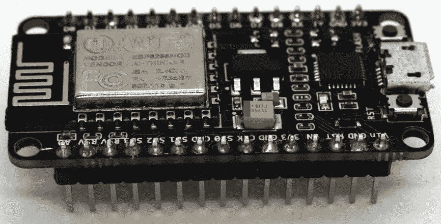

图 10.8 – NodeMCU 开发板

该板也基于 ESP8266 微控制器。然而，与 SP-01 模块不同，它可以直接通过其微型 USB 端口使用不同的开发 IDE 和各种编程语言（如 Lua 和 C）进行编程。它还包括 **通用输入/输出** (**GPIO**) 引脚，可以根据开发者的需求进行编程。这些特性使得 NodeMCU 微控制器成为当今最受欢迎的物联网平台之一。

NodeMCU 与固件和开发板兼容，联合提供最流行的开源物联网平台。开发板基于 ESP-12 模块，与 ESP-01 模块一样，为我们提供了 Wi-Fi 连接功能，并增加了开发板的功能，具有以下特点：

+   微型 USB 端口和串行-USB 转换器

+   通过微型 USB 进行简单编程

+   通过 USB 端子（引脚）供电，便于连接

+   集成复位按钮和**发光二极管**（**LED**）

使用其引脚，我们可以轻松地将它放置在无焊面包板上，连接我们将在项目中需要的电子元件。NodeMCU 通过**传输控制协议/互联网协议**（**TCP/IP**）堆栈启用 Wi-Fi 通信。

重要提示

要编程 NodeMCU，必须已经执行了在*第九章*“通过互联网显示传感器数据结果”部分中指示的添加此类板子的步骤，即*IoT 温度记录系统*。

让我们创建一个程序将 NodeMCU 连接到互联网。按照以下步骤操作：

1.  首先，包含 ESP8266 的 Wi-Fi 库。您需要两个字符串类型的变量用于 Wi-Fi 网络的 `0`: 潮湿

1.  `1`: 干燥

1.  `2`: 未读取。这里硬编码，不是来自传感器

    代码如下所示：

    ```cpp
    #include <ESP8266WiFi.h>
    const char* ssid = "Your_SSID";
    const char* password = "Your_Password";
    const int fromStm32Pin = 4;
    int sensorValue = 2;
    ```

1.  我们将创建一个网络服务器来接收传感器数据。服务器将监听端口 `80`。以下是实现此功能的代码：

    ```cpp
    WiFiServer server(80);
    ```

1.  在 `setup()` 部分中，我们需要启动串行数据传输并分配传输速度（这次我们将使用 115,200 bps）。代码如下所示：

    ```cpp
    void setup() {
      Serial.begin(115200);
    }
    ```

1.  向 NodeMCU 板指示读取 STM32 的引脚类型，如下所示：

    ```cpp
    void setup() {
      Serial.begin(115200);
      pinMode(fromStm32Pin, INPUT);
    }
    ```

1.  `setup()` 部分的其余部分将配置 Wi-Fi 网络，在成功连接后，将 IP 地址发送到串行监视器。代码如下所示：

    ```cpp
    void setup() {
      Serial.begin(115200);
      pinMode(fromStm32Pin, INPUT);
      Serial.print("Connecting to WiFi network: ");
      Serial.println(ssid);
      WiFi.begin(ssid, password);
      while (WiFi.status() != WL_CONNECTED) {
        delay(500);
        Serial.print(".");
      }
      Serial.println("");
      Serial.println("WiFi connected.");
      Serial.println("IP address: ");
      Serial.println(WiFi.localIP());
      server.begin();}
    ```

    `loop()` 部分被构建为三个功能。首先，启动网络服务器。然后，从 STM32 读取传感器数据。最后，显示一个响应式 Web 应用程序来可视化传感器监控。

    对于完整的草图，请参阅 GitHub 仓库中的 `Chapter10/webserver` 文件夹。

1.  网络服务器将监听来自客户端的连接请求。客户端连接后，我们通过 `if` 条件捕获它，如下面的代码片段所示：

    ```cpp
    void loop() {
      WiFiClient client = server.available();
      if (client) {
        // Code to serve the responsive webapp.
      }
    }
    ```

1.  客户端连接后，代码将验证是否接收到了带有读取传感器数据命令的 `GET` 请求，如下面的代码片段所示：

    ```cpp
    void loop() {
      WiFiClient client = server.available();
      if (client) {
        if (header.indexOf("GET /4/read") >= 0) {
          Serial.println("Reading the sensor");
          sensorValue = digitalRead(fromStm32Pin);
        }
      }
    }
    ```

1.  如果客户端收到的请求要求读取传感器值，NodeMCU 将从 STM32 Blue Pill 读取传感器的读数。

    为了在 NodeMCU 和 STM32 之间建立这座桥梁，需要添加以下截图所示的额外连接：

    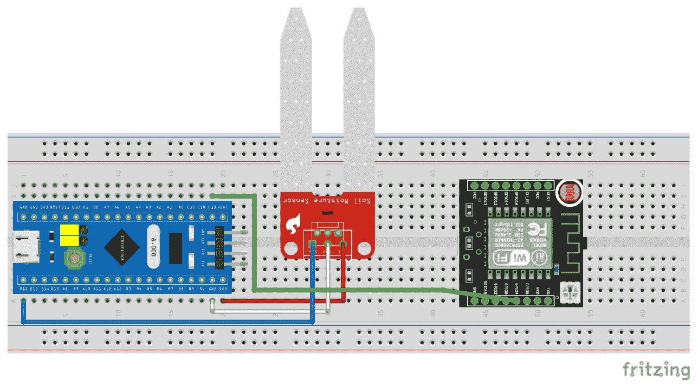

    图 10.9 – 微控制器的互联电路

    下面是微控制器互联的示意图：

    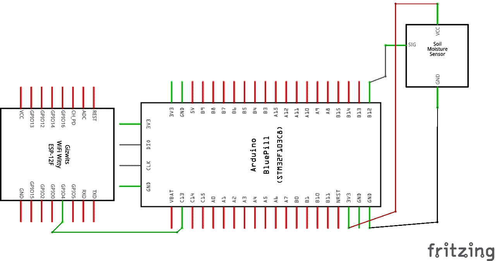

    图 10.10 – 微控制器互联的原理图

    从 NodeMCU 的 GPIO 4（D2）连接一根公对公跳线到 STM32 的 GPIO PC13 引脚。

    以下照片显示了实际系统中所有组件的连接方式：

    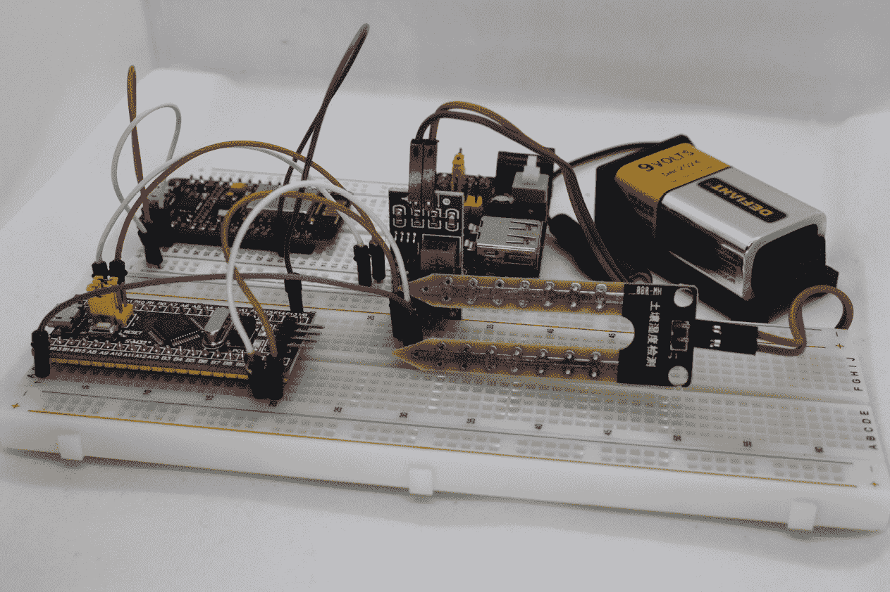

    图 10.11 – STM32 和 NodeMCU 连接

1.  现在，为了完成 NodeMCU 和 STM32 之间的连接，需要在`Chapter10/moisture`草图中添加几行新代码。

    添加一个新的常量来存储用于将数据发送到 NodeMCU 的输出引脚，如下所示：

    ```cpp
    const int sensorPin = PB12;
    int sensorValue = 0;
    PC13 pin (labeled C13 on the Blue Pill). 
    ```

1.  在`setup()`部分，指示`PC13`的引脚类型，如下所示：

    ```cpp
    void setup() {
      Serial.begin(9600);
      pinMode(sensorPin, INPUT);
      pinMode(toInternetPin, OUTPUT);
    }
    ```

1.  修改`loop()`部分的`if`条件，如下所示：

    ```cpp
    void loop() {
      if (sensorValue == 1) {
        1 (HIGH) or 0 (LOW) according to the humidity sensor. Now, we can upload Chapter10/moisture to the STM32 and close the sketch and continue working in Chapter10/webserver.
    ```

1.  完成我们的 Web 服务器的最后一步是在客户端请求后提供响应式 Web 应用。这样，任何连接到同一 Wi-Fi 网络和 Web 浏览器的设备都将能够远程访问传感器读数。

    但首先，我们将学习一些具有`viewport`值的`<meta>`标签的`name`属性的概念。这个标签将负责根据我们浏览的设备调整我们的应用布局，因此我们可以从桌面 PC 到移动设备进行操作。

    为了给它一个期望的视觉风格，我们可以有两种方式：在`<head>`标签内导入`<style></style>`标签，如下面的代码片段所示：

    ```cpp
    <link rel="stylesheet" href="styleFile.css">
    <style>Some styles</style>
    ```

    对于我们的 Web 应用，我们需要一个按钮。如果我们对提供 CSS 视觉风格不太了解，我们可以使用互联网上免费提供的工具，例如[`www.bestcssbuttongenerator.com/`](https://www.bestcssbuttongenerator.com/)，它将视觉生成我们按钮的 CSS 样式。

    要在我们的草图中包含 HTML 代码，我们将使用以下句子：

    ```cpp
    client.println("<html tags>");
    ```

    在我们的 Web 应用上可视化传感器值的代码打印了一个段落，指示用户土壤是否干燥，以及一个图形指示器以更好地理解我们的花盆状态，如下面的代码片段所示：

    ```cpp
    if (sensorValue == 1) {
      client.println("<p>Soil is too dry</p>");
      client.println("<p></p>");
    } else if (sensorValue == 0)  {
      client.println("<p>Soil is moist enough</p>");
      client.println("<p></p>");
    } else {
      client.println("<p>Press the button to read the     sensor</p>");
    }
    client.println("<p><a href=\"/4/read\">  <button class=\"sensorButton\"><i class=\"fas fa-    satellite-dish\"></i> Read sensor</button>      </a></p>");
    ```

    为了允许用户收集传感器读数，我们包含了一个按钮，每次需要知道他们的植物状态时都需要按下。记住——这个项目部分的完整代码可在`Chapter10/webserver` GitHub 文件夹中找到。

    重要提示

    如果你需要使用免费图片和图标，你可以在以下互联网存储库中找到它们：

    [`pixabay.com/`](https://pixabay.com/)

    [`fontawesome.com/icons`](https://fontawesome.com/icons)

现在草图已经完成，所以将其上传到 NodeMCU 板，并在上传完成后重置它。现在，你可以在**串行监视器**中看到连接我们的客户端的 IP 地址，如下面的截图所示：

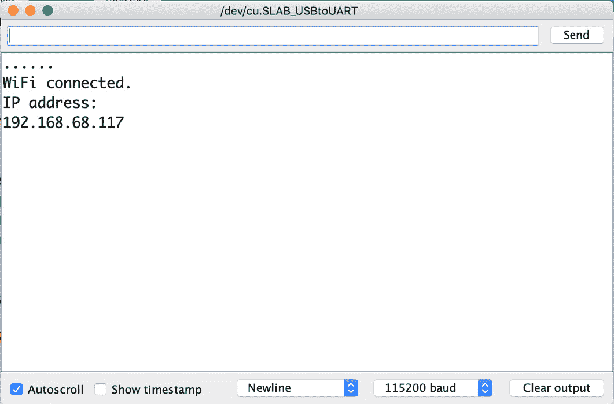

图 10.12 – 串行监视器上的 IP 地址

现在是时候进入下一节了，该节将向您展示如何在网上可视化数据。

# 在互联网上显示传感器数据结果

将物体连接到互联网将允许您从任何连接到该网络的地点访问它们的数据。

这就是为什么我们给我们的项目赋予了成为 Web 服务器的功能，从而能够从任何 Web 浏览器访问花盆的状态。

对于这个项目，访问只能从我们的 Wi-Fi 网络进行。为了测试其操作，我们将从任何移动或桌面 Web 浏览器访问开发的 Web 应用。按照以下步骤操作：

1.  打开 Web 浏览器，访问我们的服务器 IP 地址（见*图 10.12*）。您应该看到我们的着陆页，用于监控我们的花盆，如下面的截图所示：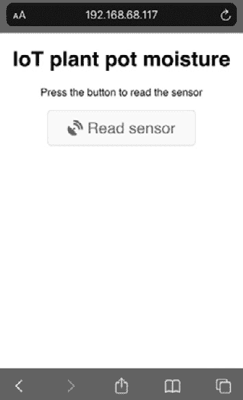

    图 10.13 – Web 应用着陆页

1.  在着陆页面上，每次您想要测量花盆的湿度时，都可以简单地按下按钮。如果土壤干燥，我们会看到一个代表性的图像和说明为**土壤过于干燥**的图例，如下面的截图所示：

    图 10.14 – 干土壤的 Web 应用屏幕

1.  否则，如果土壤湿度适中，我们会看到一个说明为**土壤湿度足够**的图例以及一个代表性的图像，如下面的截图所示：

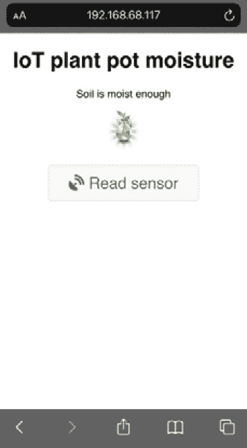

图 10.15 – 湿土壤的 Web 应用屏幕

只要您连接到您的本地 Wi-Fi 网络，您就可以从家中任何地方使用这个物联网设备和应用来监控您的花盆。

我们已经到达了本章的结尾。做得好！让我们看看在这个项目中我们学到了什么。

# 摘要

在项目开始时，您看到了如何将土壤湿度传感器连接到您的 STM32 板。然后，我们创建了一个简单的草图来收集传感器读数，并测试它以确保其正常工作。

我们还学习了如何将 NodeMCU 卡连接到互联网并从 STM32 读取传感器数据。最后，在项目的最后一部分，我们构建了一个 Web 应用，可以从任何 Web 浏览器（无论是移动还是桌面）控制物联网设备。

物联网领域正在快速发展，因此在这个技术领域拥有正确技能的人才可以轻松进入这个令人兴奋的领域的职位。考虑到这一点，完成本章后，我们现在为创建物联网设备和应用有了更坚实的基础。

在下一章中，我们将学习如何将我们的电子设备连接到互联网，并使它们在我们的本地 Wi-Fi 网络之外可用。

# 进一步阅读

Chalimov, A, *农业中的物联网：智能农业的 8 个技术应用案例（以及需要考虑的挑战）*. Eastern Peak, 2020: [`easternpeak.com/blog/iot-in-agriculture-technology-use-cases-for-smart-farming-and-challenges-to-consider/`](https://easternpeak.com/blog/iot-in-agriculture-technology-use-cases-for-smart-farming-and-challenges-to-consider/)
