# *第十二章*：COVID-19 数字体温测量（体温计）

本章描述了一个有趣的项目，你将开发一个非接触式体温计来测量人体温度。这种数字体温计可能对支持 COVID-19 患者的诊断有所帮助。本章中解释的电子项目涉及使用一个非常强大的**红外**（**IR**）温度传感器来检测体温。此外，你将学习和练习如何使用**集成电路间**（**I2C**）数据传输协议将红外温度传感器连接到微控制器板。

重要提示

本章中描述的体温测量项目不应作为确定一个人是否患有 COVID-19 的最终和准确方法。它仅用于演示和学习目的。

在本章中，我们将涵盖以下主要主题：

+   编程 I2C 接口

+   将红外温度传感器连接到微控制器板

+   在 LCD 上显示温度

+   测试体温计

到本章结束时，你将学会如何从红外温度传感器获取有用的数据，以及如何有效地在连接到微控制器板的 LCD 上显示体温数据。你还将了解 I2C 数据传输协议是如何从红外传感器获取数据，以及如何正确测试红外温度传感器。

# 技术要求

本章中你将使用的软件工具是**Arduino IDE**，用于编辑和上传你的程序到 Blue Pill 微控制器板。本章中使用的代码可以在本书的 GitHub 仓库中找到：

[`github.com/PacktPublishing/DIY-Microcontroller-Projects-for-Hobbyists/tree/master/Chapter12`](https://github.com/PacktPublishing/DIY-Microcontroller-Projects-for-Hobbyists/tree/master/Chapter12)

本章的“代码在行动”视频可在此处找到：[`bit.ly/2SMUkPw`](https://bit.ly/2SMUkPw)

在本章中，我们将使用以下硬件设备：

+   一个无焊面包板。

+   一个 Blue Pill 微控制器板。

+   一条 micro-USB 电缆，用于将微控制器板连接到计算机和移动电源。

+   一个 Arduino Uno 微控制器板。

+   一个 USB 2.0 A 到 B 电缆，用于 Arduino Uno 板。

+   两个 USB 移动电源。

+   一个 ST-Link/V2 电子接口，用于将编译后的代码上传到 Blue Pill。请注意，ST-Link/V2 需要四条公对公的杜邦线。

+   一个 MLX90614ESF-DCA-000 温度传感器（它适用于 3.3 伏特）。

+   一个 0.1 微法拉电容器。它通常有一个 104 的标签。

+   一个 1602 16x2 I2C LCD。

+   一打公对公和一打公对母的杜邦线。

下一个部分将描述如何编写 I2C 协议以及将在 Blue Pill 和 Arduino Uno 微控制器板上运行的代码。Arduino Uno 用于从红外传感器获取数据。

# 编程 I2C 接口

在本节中，我们将回顾如何从 MLX90614 温度传感器获取有用的数据，并使用 **I2C** 协议（也称为 **IIC**）进行传输。这是一个实用的串行数据通信协议，适用于将传感器、LCD 和其他设备连接到支持 I2C 的微控制器板。下一节将定义 I2C 是什么。

## I2C 协议

I2C 是一种同步串行通信协议，允许通过一个共同的 **总线**（总线作为主要的数字道路）在短距离内连接传感器、微控制器、显示器、**模数转换器**（**ADCs**）等设备。I2C 总线由几条所有设备共享并用于传输和交换数据的线路（电线）组成。I2C 协议实用且有益，因为它仅使用两条电线进行数据通信。I2C 的另一个好处是，从理论上讲，它可以支持多达 1,008 个设备连接到同一个 I2C 总线！也值得提到的是，可以连接多个微控制器到同一个总线，尽管它们必须轮流从 I2C 总线访问数据。*图 12.1* 展示了 I2C 总线配置的概述：

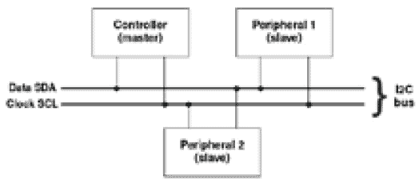

图 12.1 – I2C 总线概述

如 *图 12.1* 所示，总线允许连接两种主要类型的设备：一个 **控制器**（也称为 **主设备**）和一个 **外围设备**（也称为 **从设备**）。控制器通常是微控制器板，但它也可以是个人计算机或其他类型的设备，它将从外围设备（s）接收、发送、处理和使用数据。外围设备可以是提供数据给控制器的传感器，或者是一个显示设备（如 LCD），其中控制器发送的数据将被显示。还可以连接其他类型的设备到 I2C 总线。

注意

并非所有液晶显示器（LCDs）都可以直接连接到 I2C 总线。为了做到这一点，LCD 必须连接一个 I2C 适配器，通常称为 **I2C 背包** 或 **I2C 模块**。这是一个处理 I2C 通信的小型电子电路，通常附着在一些 LCD 的背面。

I2C 总线包含两条数据线（电线），称为 **SDA** 和 **SCL**。SCL 线传输总线上传送数据所需的时钟信号，而 SDA 线是数据信号，负责在控制器（s）和外围设备（s）之间传输所有数据。

连接到 I2C 总线的设备还有两根额外的线。其中一根是地线（有时标记为`GND`或`Vss`）。这根线应该连接到电子电路的公共地，其中微控制器板连接到，并且一根电压线（标记为`Vdd`）。这根线连接到 5 伏，但有时也可以用 3.3 伏。I2C 协议相当健壮，允许最高达到 5 Mbit/s 的比特率。通常，微控制器板为连接到 I2C 总线的设备提供 5 伏或 3.3 伏。

许多微控制器板支持 I2C 协议。幸运的是，Blue Pill 包含用于此目的的 I2C 引脚。实际上，Blue Pill 有三组引脚，可以直接连接三个 I2C 设备。在本章中，我们将使用 Blue Pill 的 B6（SCL）和 B7（SDA）引脚进行 I2C 通信。

注意

Arduino 微控制器板也支持 I2C 协议。例如，Arduino Uno 板的 A4 和 A5 引脚分别提供 SDA 和 SCL 线的连接。

值得注意的是，I2C 协议由`Wire.h`库处理，该库默认位于 Arduino IDE 配置中。您不需要安装此库。

在下一节中，我们将回顾如何使用 Arduino Uno 微控制器板编写 I2C 协议以获取红外传感器的温度数据。

## I2C 编码

在本节中，我们回顾了通过 Arduino Uno 微控制器板作为外围设备（从设备）读取 MLX90614 红外传感器温度数据的代码。该板将通过 I2C 总线将温度数据发送到 Blue Pill，而 Blue Pill（作为控制器）将在 LCD 上显示它。这个 LCD 也连接到 I2C 总线。关于 Blue Pill 和 Arduino Uno 连接的完整描述可以在*将红外温度传感器连接到微控制器板*部分找到。

下一节将解释在 Arduino Uno 板上运行的必要代码。

## 编写 Arduino Uno 软件（外围设备）

为了在 Arduino Uno 上编写读取 MLX90614 红外传感器数据的程序，我们将使用一个库，该库将包含在我们的 Arduino IDE 程序中，称为`Adafruit_MLX90614.h`。您可以从 Arduino IDE 安装此库：

1.  转到**工具** | **管理库**。

1.  将**类型**设置为**所有**，将**主题**设置为**所有**。

1.  在搜索框中，输入`Adafruit MLX90614`。

安装`Adafruit MLX90614`库的最新版本（不要安装 Mini 版本）。`Wire.h`库控制 I2C 协议，该库已安装在 Arduino IDE 的文件中。

以下是在 Arduino Uno 上运行的代码（其文件名为`peripheral.ino`；您可以在 GitHub 页面上找到它）。`0X8`是分配给 Arduino Uno 板作为 I2C 协议的从设备（外围设备）的十六进制地址。我们任意分配了 0x8；它可以是任何十六进制地址，但请确保主设备和从设备使用相同的地址：

```cpp
#include <Wire.h> 
#include <Adafruit_MLX90614.h> 
Adafruit_MLX90614 mlx = Adafruit_MLX90614(); 
#define SLAVEADDRESS 0x8  
float AmbientobjC=0.0; 
```

此函数将 Arduino Uno 设置为从设备，分配给它 0x8 地址。Blue Pill 将使用此地址识别 Arduino Uno。此函数还设置了处理来自控制器（主设备）的请求的中断，即 Blue Pill。Blue Pill 将从传感器获取温度数据：

```cpp
void setup() {  
  Wire.begin(SLAVEADDRESS);
  Wire.onRequest(requestEvent); 
}
```

此函数将连续从传感器读取温度。`delay`函数使传感器有机会获取新的温度读数：

```cpp
void loop() {
  AmbientobjC=mlx.readObjectTempC();
  delay(100);
}
```

此函数每次控制器（主设备）从外围设备（从设备）请求数据时都会运行：

```cpp
void requestEvent() { 
  union floatToBytes {
    char buffer[4];
    float objtempReading;
  } converter;
  converter.objtempReading = AmbientobjC+3;
  Wire.write(converter.buffer, 4); 
}
```

从之前的代码片段中，我们可以看到`write()`函数用于将温度数据发送到控制器（Blue Pill）。

我们将`3`的值添加到`AmbientobjC`变量中，以补偿环境温度。重要的是要明确，温度读数不是绝对的，并且会因多种因素略有变化，包括环境温度、是否有人在外面。因此，您可能需要多次测试温度读数，并相应地调整`AmbientobjC`变量，也许可以将传感器读数与医疗体温计读数进行比较。

注意

上传到 GitHub 平台的代码包含大量注释，解释了大多数代码行。

下一个部分解释了运行 Blue Pill 作为控制器所需的代码。

## 编写 Blue Pill 软件（控制器）

以下代码（其文件名为`controller.ino`；您可以在 GitHub 页面上找到它）将在 Blue Pill 微控制器板上运行（控制器）。此代码将用于获取由 Arduino Uno 板发送的温度数据，并将其显示在连接到 I2C 总线的 LCD 上：

```cpp
#include <LiquidCrystal_I2C.h> 
LiquidCrystal_I2C lcd(0x27, 16, 2);
#include <Wire.h> 
#define SLAVEADDRESS 0x8  
```

之前的代码片段展示了用于通过 I2C 协议控制 LCD 的`LiquidCrystal_I2C.h`库。其下一行将 LCD 地址设置为`0x27`，用于 16 字符和 2 行（16x2）LCD。该库可以从[`github.com/fdebrabander/Arduino-LiquidCrystal-I2C-library`](https://github.com/fdebrabander/Arduino-LiquidCrystal-I2C-library)下载。下载`LiquidCrystal_I2C.h`文件并将其复制到 Arduino 库文件夹中，通常为`Arduino/libraries`。

下一代码片段开始使用外围（从设备）地址启动 I2C 连接，初始化串行监视器和 LCD：

```cpp
void setup() {
  Wire.begin(SLAVEADDRESS); 
  Serial.begin(9600); 
  lcd.begin();  
  lcd.backlight(); 
}
```

此`loop()`函数连续读取由外围设备（Arduino Uno）发送的温度数据：

```cpp
void loop() {
   Wire.requestFrom(8, 4);
   uint8_t index = 0;
   union floatToBytes {
       char buffer[4];
       float objtempReading; 
   } converter;
   while (Wire.available()){ 
      converter.buffer[index] = Wire.read(); 
      index++;
   }
   Serial.println(converter.objtempReading); 
   lcd.setCursor(0, 0);  
   lcd.print("Body Temp.:"); 
   lcd.print(converter.objtempReading);
   delay(500);
}
```

之前的代码片段展示了如何从 Arduino Uno 读取字节数据。请记住，我们无法直接通过 I2C 总线传输浮点值。运行在 Arduino Uno 上的代码将每个浮点温度数据读数转换为四个字符的字节。运行在 Blue Pill 上的代码将这四个字节转换回浮点数。

提交给 GitHub 页面的代码包含许多注释，解释了代码行。

以下部分解释了如何将红外传感器连接到 Blue Pill 微控制器板。

# 将红外温度传感器连接到微控制器板

本节解释了 MLX90614 温度传感器的主要技术特性，并展示了如何使用*I2C 协议*将其连接到 Blue Pill 微控制器板。

首先，让我们解释 MLX90614 传感器的主要特性。

## MLX90614 红外传感器

MLX90614 传感器由 Melexis 公司制造，是一款功能强大且紧凑的红外传感器。该传感器使用红外线来测量人体或任何物体产生的热量。作为一种非接触式体温计，它减少了在检查体温时传播疾病的机会，并且不需要清洁。

MLX0-614 在技术上是一个包含在**集成电路**（**IC**）中的传感器，因为它具有额外的电子组件和较小的电路，包括 ADC、电压调节器和**数字信号处理器**（**DSP**）。

以下是一些传感器的技术特性：

+   体温范围为-40 至+125 摄氏度。

+   环境温度范围为-70 至 382.2 摄氏度。

+   医疗（高）精度校准。

+   测量分辨率接近 0.02 摄氏度。

+   该传感器有 3 伏和 5 伏两种版本。

+   一种方便的睡眠模式，可降低功耗。

MLX90614 系列传感器的数据表可以从以下链接下载：

[`www.melexis.com/-/media/files/documents/datasheets/mlx90614-datasheet-melexis.pdf`](https://www.melexis.com/-/media/files/documents/datasheets/mlx90614-datasheet-melexis.pdf)

MLX90614 红外传感器生成两种类型的温度测量：环境温度和物体温度读数。**环境温度**是传感器红外敏感部分（内部组件）上记录的温度，接近室温。**物体温度**测量物体发出的红外光量，可用于测量体温。在本章中，我们将仅使用物体温度测量。

*图 12.2*显示了 MLX90614 传感器：

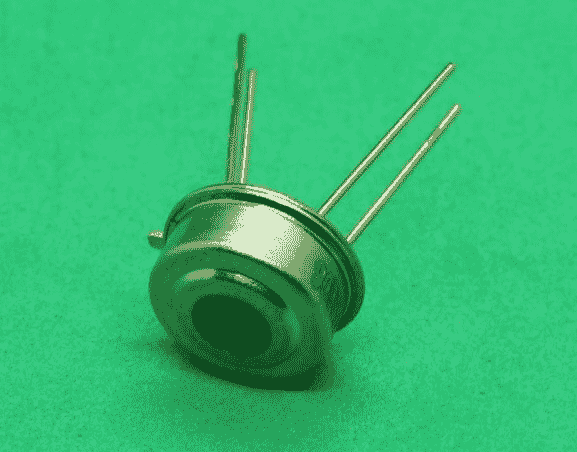

图 12.2 – 显示其四个引脚的 MLX90614 传感器

在*图 12.2*中，请注意传感器上有一个圆形透明窗口，红外光线通过该窗口，击中内部敏感部分。这个部分将红外光转换为电脉冲。

*图 12.3*显示了 MLX90614 传感器图引脚图的**顶部**视图：

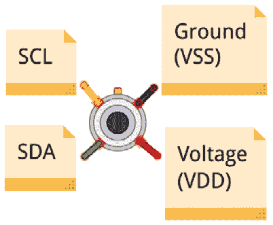

图 12.3 – MLX90614 红外传感器引脚图

在*图 12.3*中，你会注意到传感器顶部有一个小缺口。这个缺口有助于你识别哪个引脚是哪个。

MLX90614 的 SCL 和 SDA 引脚分别连接到微控制器板的 SCL 和 SDA，地线引脚连接到微控制器板的地线，电压引脚连接到 3.3 伏或 5 伏。

MLX90614 传感器以不同的类型或版本制造。其中最重要的区别之一是其供电电压。验证其零件号非常重要：

+   **MLX90614ESF-Axx**，**MLX90614KSF-Axx**：它们的供电电压为 5.5 伏。

+   **MLX90614ESF-Bxx**，**MLX90614ESF-Dxx**：它们的供电电压为 3.6 伏。

例如，我们本章使用的红外传感器是 MLX90614ESF-DCA-000，根据制造商的数据表，它需要 3.6 伏才能工作。因此，你可以使用许多微控制器板提供的 3.3 伏电压来使用这种类型的传感器。

重要提示

总是检查红外传感器的零件号以确定其所需的供电电压。如果你施加高于其所需供电电压的电压，可能会损坏传感器。

另一个你应该考虑的技术方面是传感器的视野范围。这是指传感器与被测物体之间的距离关系。这将决定传感器观察到的感应区域。每当物体从传感器表面移动 1 厘米，感应区域就会增加 2 厘米。理想情况下，传感器与被测物体（例如，人体皮肤）之间的距离应该在 2 到 5 厘米之间。

下一个部分将解释 GY-906 模块，其中包含一个红外传感器。

## GY-906 传感器模块

本节描述了 GY-906 传感器模块的主要特性和引脚配置。MLX90614 传感器（见*图 12.4*）也以模块形式出售，称为**GY-906**：

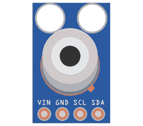

图 12.4 – GY-906 模块

如*图 12.4*所示，GY-906 模块有四个专用引脚用于 I2C 通信。VIN 引脚连接到电压，具体为 3.3 伏或 5 伏，这取决于它所包含的 MLX90641 传感器的类型。请参考*MLX90614 红外传感器*部分以帮助识别模块中嵌入式传感器的所需电压。你还需要查阅模块的数据表。例如，一个 GY-906 模块可能内置了 MLX90614ESF-DCA-000 红外传感器，需要 3.3 伏才能工作。因此，GY-906 模块可能内置了任何 MLX90614 传感器类型。模块的 GND 引脚连接到微控制器板的地线。SCL 引脚用于传输时钟信号，SDA 引脚用于传输数据信号。

除了 MLX90614 传感器外，GY-906 模块还包含其他电子元件，例如上拉电阻。

使用 MLX90614 传感器或 GY-906 模块的决定取决于多个因素，包括成本、应用类型和尺寸。请注意，GY-906 模块比 MLX90614 传感器略大。在本章中，我们将使用 MLX90614 传感器而不是模块，因为单独的传感器是一个经济实惠的选择，并且可以展示如何直接将传感器连接到 I2C 总线。然而，GY-906 模块和 MLX90614 传感器具有相同的功能。

下一节将展示如何将 MLX90614 传感器连接到微控制器板。

## 红外传感器与 Arduino Uno 的连接

在本节中，我们描述了如何将 MLX90614 传感器连接到 Arduino Uno 微控制器板上的 I2C 引脚，该板将作为外围设备（从设备）。Blue Pill 板将是控制器（主设备），通过 I2C 总线接收 Arduino Uno 发送的温度数据，如图*12.5*所示：

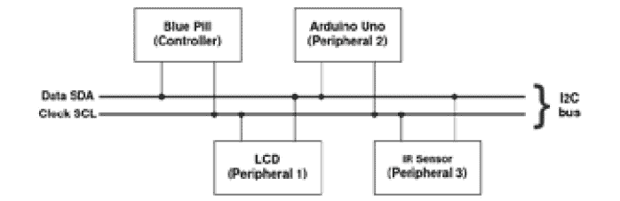

图 12.5 – 控制器和外围设备

如*图 12.5*所示，Blue Pill 和 Arduino Uno 板都连接到 I2C 总线。

我们将 MLX90614 连接到 Arduino Uno 板，作为外围设备（从设备），以下是一些原因：

+   为了利用 I2C 数据传输协议，该协议只需要两条数据线。

+   为了练习使用控制器（主设备）和外围设备（从设备）实现 I2C 协议。

+   为了使用与 Arduino 系列等其他微控制器板（例如）完全兼容的 MLX90614 软件库，但不与 Blue Pill 板兼容。这就是为什么我们使用相应的库将红外传感器连接到 Arduino Uno 板。这样，我们可以使用 Arduino Uno 作为外围设备（从设备），它与红外传感器 100%兼容。

+   为了让 Blue Pill（控制器）从直接处理传感器数据中解放出来，以便 Blue Pill 可以用于执行其他处理密集型任务。此外，Blue Pill 可以专门用于获取传感器数据并在 LCD 上显示。

首先，我们将解释如何将 MLX90614 红外传感器连接到 Arduino Uno 微控制器板。连接图示在*图 12.6*中：

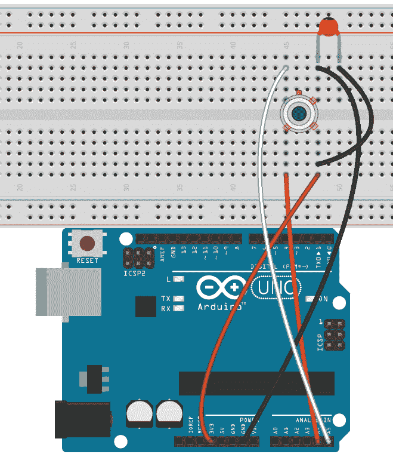

图 12.6 – Arduino Uno 和红外传感器的连接

如*图 12.6*所示，传感器连接到模拟端口 A4 和 A5，这些也是 Arduino Uno 的 I2C 引脚。传感器数据手册建议使用 0.1 微法拉电容器来平滑掉传感器中可能存在的任何高频或超高频电气噪声，这些噪声可能会影响温度读数。以下是连接所有设备的步骤：

1.  如果您使用的是 MLX90614ESF-DCA-000 或 MLX90614ESF-BAA-000 传感器，请将其电压（VDD）引脚连接到 Arduino Uno 的 3.3 伏特引脚。如果您使用的是 MLX90614ESF-AAA-000 或 MLX90614KSF-ACC-000 传感器，请将其连接到 Arduino Uno 的 5 伏特引脚。

1.  将传感器的地线（VSS）引脚连接到 Arduino Uno 的地线（GND）引脚。

1.  将传感器的 SDA 引脚连接到 Arduino Uno 的 A4 模拟端口。

1.  将传感器的 SCL 引脚连接到 Arduino Uno 的 A5 模拟端口。

1.  将 0.1 微法拉电容的一端连接到传感器的电压引脚，另一端连接到传感器的地线引脚。

连接好电线和组件后，将代码上传到名为`peripheral.ino`的 Arduino Uno 板，该代码在*编程 I2C 接口*部分中解释。它应该在 Arduino IDE 的串行监视器上显示温度数据。按照以下步骤打开 Arduino Uno 的串行监视器：

1.  从 IDE 的主菜单中打开**工具**。

1.  选择**串行监视器**选项。

1.  从串行监视器中，确保选择**9600**波特率。

1.  不要忘记从**工具** | **板**中选择**Arduino Uno**。

1.  选择 Arduino Uno 连接的正确 USB 端口，从 Arduino IDE 中点击**工具** | **端口**。

下一节描述了如何使用 I2C 总线将 Blue Pill 连接到 Arduino Uno，以及如何从 Arduino Uno 传输温度数据到 Blue Pill。

## 将 Blue Pill 连接到 Arduino Uno

本节展示了如何通过 I2C 总线连接 Arduino Uno 和 Blue Pill。Arduino Uno 将发送红外温度数据到 Blue Pill。请记住，Blue Pill 作为控制器（主设备）工作，而 Arduino Uno 是外围设备（从设备）。*图 12.7*显示了两个微控制器板的 Fritzing 图。

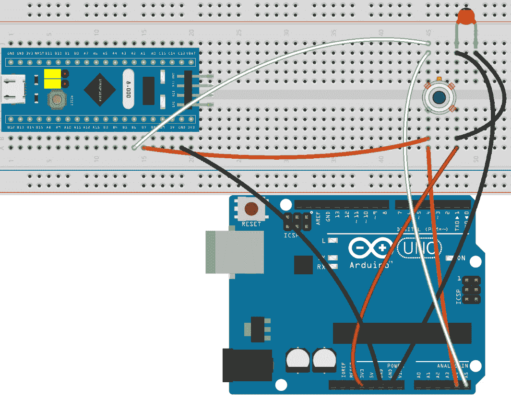

图 12.7 – Blue Pill 和 Arduino Uno 的 I2C 连接

如*图 12.7*所示，以下是连接 Blue Pill 到 I2C 总线的步骤：

1.  将 Arduino Uno 的地线（GND）连接到 Blue Pill 的地线（G 或`GND`）。

1.  将 Blue Pill 的 B7 引脚连接到 MLX90614 的 SDA 引脚。

1.  将 Blue Pill 的 B6 引脚连接到 MLX90614 的 SCL 引脚。

如*图 12.7*中所示的所有连接，Blue Pill、红外传感器和 Arduino Uno 板都通过 SDA 和 SCL 引脚连接。这是我们应用中的 I2C 总线。

重要提示

确保将 Blue Pill 的地线（`G`或`GND`）连接到 Arduino Uno 的地线（`GND`）。这将允许两个微控制器板之间通过 I2C 总线正确传输数据。

以下部分描述了如何使用 I2C 总线在 LCD 上显示红外温度测量值。

# 在 LCD 上显示温度

本节描述了如何通过 I2C 总线在 LCD 上显示红外温度测量值。温度数据由 Arduino Uno 发送到 Blue Pill，如前所述。*图 12.8* 展示了一个包含微控制器板、LCD 和红外温度传感器的 Fritzing 图：

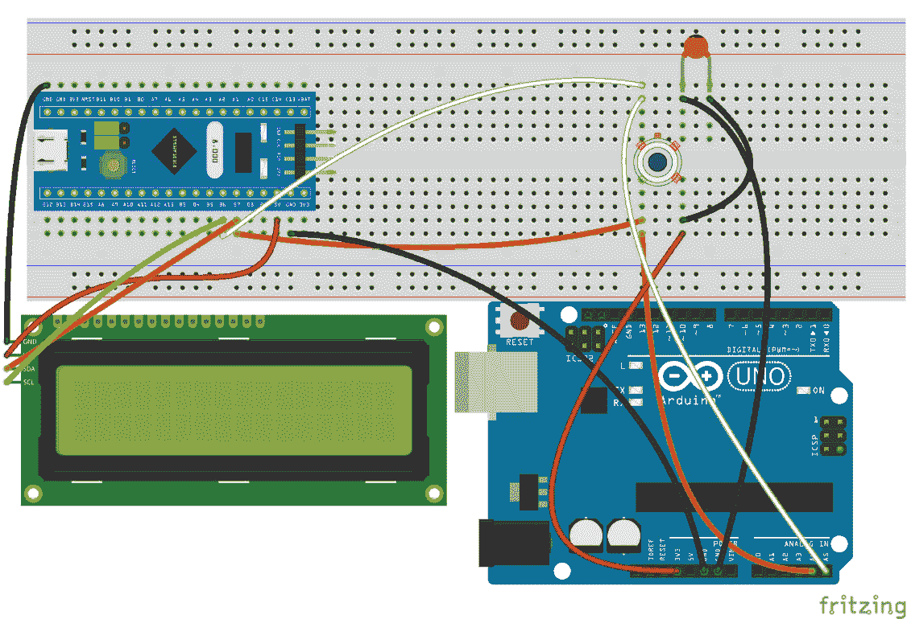

图 12.8 – LCD 连接到 I2C 总线

如 *图 12.8* 所示，LCD 的连接很简单。它只需要四根线，因为本章使用的 LCD 是 I2C 兼容的，后面有一个 I2C 接口。以下是连接 LCD 到 Blue Pill 的步骤：

1.  将 LCD 的接地（`GND`）引脚连接到 Blue Pill 的接地（`G`或`GND`）引脚。

1.  将 LCD 的电压（`VCC`）引脚连接到 Blue Pill 的 5 伏（5V）引脚。

1.  将 LCD 的 SDA 引脚连接到 Blue Pill 的 B7 引脚。

1.  将 LCD 的 SCL 引脚连接到 Blue Pill 的 B6 引脚。

*图 12.9* 描述了 LCD 的背面，显示了其 I2C 接口背板连接到它：

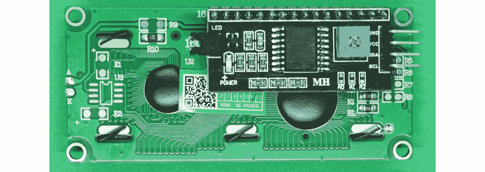

图 12.9 – LCD 的背面

从 *图 12.9* 中，你可以看到 LCD 的 I2C 接口有一个小可变电阻，位于大 IC 的右侧。你可以旋转它来调整 LCD 的对比度。

LCD 的每行可以显示多达 16 个字符。这足以以两位精度和两位小数显示红外传感器的温度。

重要提示

确保将 LCD 的电压（`VCC`）连接到 Blue Pill 的`5V`。如果你将其连接到 3.3 伏引脚，它可能无法正常工作。

*图 12.10* 展示了所有连接方式：

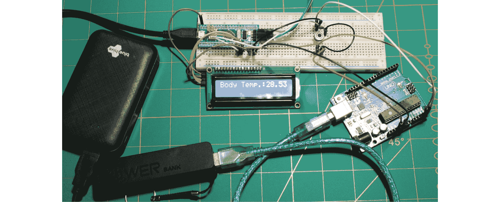

图 12.10 – 微控制器板、传感器和 LCD

*图 12.10* 显示 LCD 显示的温度为 28.53 摄氏度，因为当拍照时，红外传感器无意中测量了 LED 灯的温度！然而，这个电路的目的是用于测量体温。下一节将展示如何通过检查人体不同部位的温度来测试传感器。我们使用了两个连接到 Blue Pill 和 Arduino Uno 的移动电源来尝试。如果你已经完成了温度传感器和微控制器板的连接，并且如果你的 LCD 正在显示温度值，恭喜你！你学会了如何使用非接触式红外温度传感器。

# 测试温度计

在本节中，我们将测试红外传感器作为温度计的工作情况，通过测量人体温度。似乎不同的身体部位会得到略微不同的温度测量值。你应该通过测量不同部位的温度，如人的额头和耳垂，进行多次测试。记住，传感器和皮肤之间的距离应在 2 至 5 厘米之间，尽管你应该尝试不同的距离并观察结果。

在测试温度计之前，确保皮肤干燥、清洁且无遮挡。此外，确认此人没有暴露在高温环境中，例如在炎热的阳光下，因为这会改变你的测量结果。如果你使用温度计测量皮肤温度，确保此人不在直射阳光下，否则你会得到错误的读数。

医学研究显示，人体平均皮肤表面温度在 36.3 至 36.6 摄氏度之间。这被认为是正常的。然而，高于 37 摄氏度的温度提示可能是发烧。

在考虑了这些提示之后，让我们看看我们的温度计是如何工作的。*图 12.11*显示了一个正在测试红外传感器的个人：

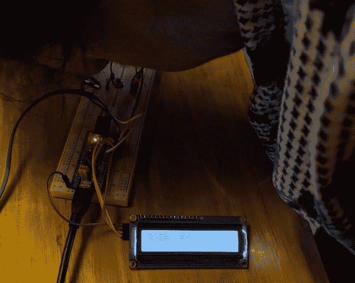

图 12.11 – 测量温度

如*图 12.11*所示，测量的温度为 36.55 摄氏度，这是成年人的正常范围。测试者需要将她的额头靠近红外传感器以获得可靠的测量值。可以通过在传感器上方放置一个镜子管来增加额头和传感器之间的距离，以引导红外光通过它。

现在我们已经测试了本章，并意识到温度计工作得非常完美，让我们在*摘要*中回顾一下我们学到了什么。

# 摘要

在本章中，你学习了使用 I2C 串行数据传输协议将红外温度传感器连接到微控制器板的基本知识。正如你所见，I2C 总线是我们本章构建的红外温度计的一个重要部分。这种红外温度计可以有效地检查人体温度，就像普通温度计一样。由于温度测量是非接触式的，这可以防止人体接触传感器，从而避免传播如 SARS-CoV-2 等病毒。

这种非接触式温度计可以帮助检查一个人是否发烧，从而确定（与其他测量结果一起）此人是否感染了 COVID-19。然而，本章中解释的红外温度测量不应作为确定一个人是否患有 COVID-19 的最终数据。

下一章解释了另一个与 COVID-19 相关的项目，即使用超声波传感器测量两人之间推荐的 2 米距离。

# 进一步阅读

+   体温 (2020)。体温：什么是（以及什么不是）正常的？可从 [`health.clevelandclinic.org/body-temperature-what-is-and-isnt-normal/`](https://health.clevelandclinic.org/body-temperature-what-is-and-isnt-normal/) 获取

+   Gay, W. (2018) I2C, *《STM32 入门》*，Apress，加利福尼亚州伯克利

+   I2C (2021)，*I2C 教程*。可从 [`learn.sparkfun.com/tutorials/i2c/all`](https://learn.sparkfun.com/tutorials/i2c/all) 获取

+   Mankar, J., Darode, C., Trivedi, K., Kanoje, M. 和 Shahare, P. (2014), *I2C 协议综述*，国际研究前沿技术杂志，2(1)
