# *第十四章*：COVID-19 20 秒洗手计时器

本章描述了一个有用的项目，您将通过在超声波传感器前挥手来制作一个非接触式计时器。这个计时器将计算卫生部门推荐的至少 20 秒的洗手时间，以防止由 SARS-CoV-2 病毒引起的 COVID-19 症状。该项目涉及一个价格低廉的超声波传感器，该传感器通过测量用户与电路之间的距离来检测用户是否在挥手，从而触发计数。此应用必须封装在一个防水容器中，以避免用户洗手时电路进水并损坏。我们在本章末尾解释了如何做到这一点。

在本章中，我们将涵盖以下主要主题：

+   编程计数器（计时器）

+   在 LCD 上显示计时器

+   将超声波传感器连接到微控制器板

+   将所有部件组装在一起——想想为这个项目设计一个保护壳！

+   测试计时器

到本章结束时，您将学会如何正确地将超声波传感器和 LCD 连接到微控制器板上。此外，您还将学习如何从传感器读取输入值以激活 20 秒倒计时。您还将学习如何编写在微控制器板上运行的效率高且有效的计时器代码。

# 技术要求

本章中您将使用的软件工具是 Arduino IDE，用于编辑并将程序上传到 Blue Pill 微控制器板。

本章中使用的代码可以在本书的 GitHub 仓库中找到：

[`github.com/PacktPublishing/DIY-Microcontroller-Projects-for-Hobbyists/tree/master/Chapter14`](https://github.com/PacktPublishing/DIY-Microcontroller-Projects-for-Hobbyists/tree/master/Chapter14)

本章的“代码在行动”视频可以在这里找到：[`bit.ly/3gQZdPf`](https://bit.ly/3gQZdPf)

在本章中，我们将使用以下硬件设备：

+   一个无焊面包板。

+   一个 Blue Pill 微控制器板。

+   一根微 USB 线，用于将微控制器板连接到计算机和移动电源。

+   一个 USB 移动电源。

+   一个 ST-INK/V2 电子接口，用于将编译后的代码上传到 Blue Pill。请注意，ST-LINK/V2 需要四根公对公的杜邦线。

+   一个 HC-SR04 超声波传感器。

+   一个 1602 16x2 LCD。

+   一个 2.2k 欧姆、1/4 瓦的电阻。这是用于 LCD 的。

+   一打公对公和一打公对母的杜邦线。

下一个部分将解释如何编写在 Blue Pill 微控制器板上运行的 20 秒计时器代码。

# 编程计数器（计时器）

本节展示了如何编写 20 秒计时器的代码。编写这样的计时器程序并不简单，因为用户可能会在计数器开启时通过超声波传感器多次挥手来激活计时器。如果 20 秒的计数正在进行，程序不应考虑这些多次激活；否则，计数器将多次重新启动，计数将不准确。我们还需要考虑在不使用时关闭 LCD 以节省能源。

我们应该按照以下步骤编写我们的 20 秒计时器应用程序：

1.  从超声波传感器读取值。

1.  检查用户是否在距离传感器 15 厘米内挥手。如果发生这种情况，执行以下操作：

    a) 打开 LCD 背光。

    b) 显示**打湿双手**的消息，并在 LCD 上显示 20 秒的计数。

    c) 当计数器完成时，在 LCD 上显示此消息：**洗手**。

    d) 等待 4 秒后关闭 LCD 以节省能源。

    e) 返回到**步骤 1**。

以下是在 Blue Pill 上运行的 Arduino IDE 代码，按照前面的步骤编程。以下代码片段显示了变量和常量的定义。HC-SR04 的回声数字值从端口`A9`（标记为`PA9`）获取并存储在`echo`变量中。同样，触发值通过端口`A8`（`PA8`）发送到超声波传感器，并存储在`trigger`变量中。请注意，`dist_read`变量存储了物体（例如，挥手的手）与超声波传感器之间的距离，单位为厘米：

```cpp
#include "elapsedMillis.h" 
elapsedMillis timeElapsed;
#include <LiquidCrystal.h> 
const int rs = PB11, en = PB10, d4 = PB0, d5 = PA7, d6 =    PA6, d7 = PA5;
LiquidCrystal lcd(rs, en, d4, d5, d6, d7); 
#define backLight PB12    
#define trigger PA8 
#define echo PA9   
const int max_dist=200; 
float duration,dist_read=0.0;  
```

如您从前面的代码中可以看到，它使用了一个名为`elapsedMillis.h`的库来计算计数过程中经过的毫秒数。这个库也可以从[`www.arduino.cc/reference/en/libraries/elapsedmillis/`](https://www.arduino.cc/reference/en/libraries/elapsedmillis/)获取。您可以在上传到书籍 GitHub 仓库的代码文件夹中找到这个库。它很有用，因为通过使用这个库，我们避免了在 20 秒计数中使用`delay()`函数。如果我们使用`delay()`函数，Blue Pill 的计数和从端口读取传感器值可能会出错。请注意，库被写在了双引号中，因为在 C++中这意味着库与源代码在同一文件夹中，这是一个不属于原始 Arduino IDE 安装的库。代码还使用了`LiquidCrystal.h`库，用于控制 1602 LCD。这个库已经包含在标准的 Arduino IDE 安装中，因此不需要单独安装。

此代码片段设置了 LCD 和 Blue Pill 端口：

```cpp
void setup() {
  lcd.begin(16, 2); 
  pinMode(trigger, OUTPUT);
  pinMode(echo,INPUT);
  pinMode(backLight, OUTPUT);
}
```

以下代码段显示了代码的主循环，它读取超声波传感器的值并计算用户挥手的手与传感器之间的距离：

```cpp
void loop() {
  digitalWrite(trigger, LOW); 
  delayMicroseconds(2); 
  digitalWrite(trigger, HIGH); 
  delayMicroseconds(10); 
  digitalWrite(trigger, LOW); 
  duration = pulseIn(echo, HIGH);
  dist_read = (duration*.0343)/2;
```

以下代码段来自主循环函数，用于计算用户与传感器之间的距离是否等于或小于 15 厘米，然后激活 20 秒计数器并在 LCD 上显示：

```cpp
  if ((dist_read<=15) & (dist_read>0)) 
  {
    lcd.display();
    digitalWrite(backLight, HIGH); 
    timeElapsed=0;
    lcd.setCursor(0, 0);
    lcd.print("lather hands :) ");
    lcd.setCursor(0, 1);
    lcd.print("  ");
    while (timeElapsed < 21000)
    { 
        lcd.setCursor(0, 1);
        lcd.print(timeElapsed / 1000);
     }
     lcd.setCursor(0, 0);
     lcd.print("rinse hands :)  ");   
     delay(4000);
  }
   lcd.noDisplay();
   digitalWrite(backLight, LOW);
}
```

小贴士

您也可以在 Arduino 微控制器板上运行前面的代码。您只需更改用于 LCD 和传感器连接的端口编号。例如，如果您使用 Arduino Uno 板，将此行更改为`const int rs=12,en=11,d4=5,d5=4,d6=3,d7=2;`，分别使用 Arduino 板数字端口`12`、`11`、`5`、`4`、`3`和`2`。您还需要将这些行更改为以下内容：

`#define backLight 6`

`#define trigger 7`

`#define echo 8`

因此，您将使用 Arduino 数字端口 6、7 和 8 来连接超声波传感器。

请记住，上传到 GitHub 仓库的代码包含许多注释，解释了其最重要的部分。

下一个部分将解释如何将 1602 LCD 连接到 Blue Pill，以显示 20 秒计数：

# 在 LCD 上显示计时器

在本节中，我们解释如何连接和使用 1602 LCD 来显示计时器。*图 14.1*显示了类似于在*第五章*中解释的 Fritzing 图，*湿度和温度测量*：

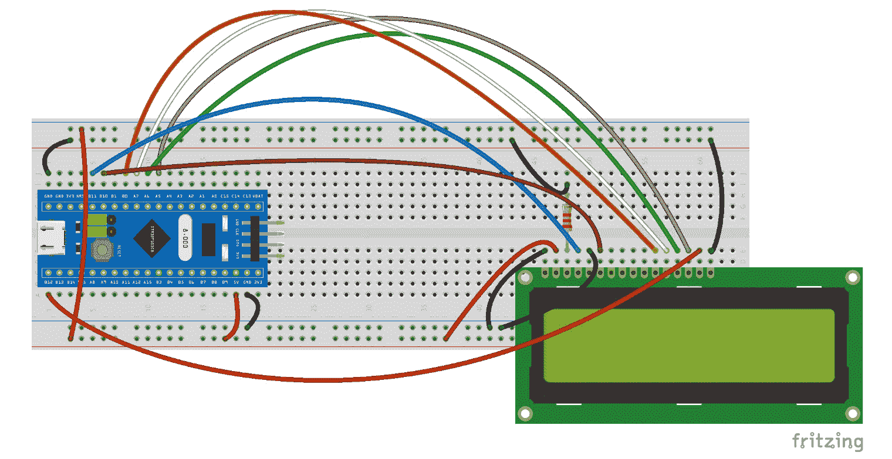

图 14.1 – 连接到 Blue Pill 微控制器板的 LCD

以下是将 LCD 连接到 Blue Pill 的步骤，按照*图 14.1*中的图解进行：

1.  将 Blue Pill 的**GND**（也标记为**G**）引脚连接到无焊面包板轨道。

1.  将 Blue Pill 的**5V**引脚（提供 5 伏）连接到面包板轨道。

1.  将 USB 线连接到 Blue Pill，然后连接到您的电脑或 USB 移动电源。

1.  将 LCD 的 16 个引脚插入无焊面包板。

1.  将 LCD 的**VSS**引脚连接到地（下方的面包板轨道）。

1.  将 LCD 的**VDD**引脚连接到 5 伏（下方的面包板轨道）。

1.  将 2.2k 欧姆电阻连接到 LCD 的**V0**引脚和地（下方的面包板轨道）。

1.  将 LCD 的**RS**引脚连接到 Blue Pill 的**B11**引脚。

1.  将 LCD 的**RW**引脚连接到地（下方的面包板轨道）。

1.  将 LCD 的**E**引脚连接到 Blue Pill 的**B10**引脚。

1.  将 LCD 的**D4**引脚连接到 Blue Pill 的**B0**引脚。

1.  将 LCD 的**D5**引脚连接到 Blue Pill 的**A7**引脚。

1.  将 LCD 的**D6**引脚连接到 Blue Pill 的**A6**引脚。

1.  将 LCD 的**D7**引脚连接到 Blue Pill 的**A5**引脚。

1.  将 LCD 的**A**引脚连接到 Blue Pill 的端口**B12**。

1.  将 LCD 的**K**引脚连接到地（下方的面包板轨道）。

1.  LCD 的**D0**、**D1**、**D2**和**D3**引脚未连接。

完成前面的步骤后，您已经完成了将 LCD 连接到 Blue Pill 板的工作。LCD 将用于显示 20 秒计数。做得好！

*图 14.2*显示了所有连接方式：

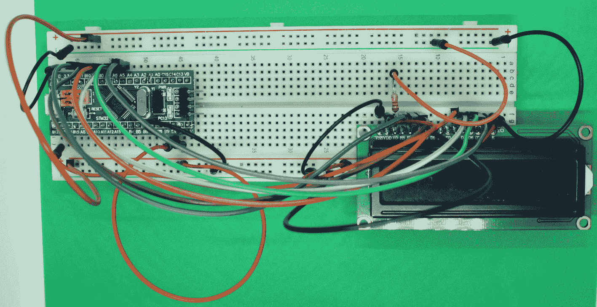

图 14.2 – 连接到 LCD 的 Blue Pill 微控制器板

如您从*图 14.2*中可以看到，1602A 液晶显示屏很容易连接到 Blue Pill。连接到 LCD 的引脚**V0**的 2.2k 欧姆电阻设置了 LCD 的对比度。

小贴士

您可以使用 50k 欧姆可变电阻器（也称为**电位器**）代替连接到 LCD 引脚**V0**的 2.2k 欧姆电阻，以调整显示对比度。只需将电位器的中间引脚连接到**V0**，一个引脚连接到地，另一个引脚连接到**5V**。

请注意，LCD 引脚**A**（引脚编号 15）连接到 Blue Pill 的**B12**端口，通过编码通过打开或关闭背光来控制 LCD。

小贴士

在 Blue Pill 和其余电子组件（LCD、超声波传感器等）之间在无焊面包板上留出足够的空间，以便于将 ST-Link/V2 接口连接到 Blue Pill。

下一个部分将解释如何使用超声波传感器来判断用户是否在向传感器挥手以触发 20 秒定时器。

# 将超声波传感器连接到微控制器板

本节解释超声波传感器的工作原理，并描述如何将 HC-SR04 传感器连接到 Blue Pill 微控制器板，描述如何使用其四引脚功能。超声波传感器将用于检查用户是否向其挥手以启动 20 秒计数。

## 什么是超声波传感器？

超声波是频率高于大多数人类能听到的频率（即高于 20,000 Hz）的声波。超声波或超声波可以有不同的应用，包括被称为**回声定位**的技术，这种技术被诸如蝙蝠等动物使用，通过反射声波来确定猎物距离。同样的原理也应用于超声波传感器。

**超声波传感器**是一种专用电子组件，通常包含多个电子部件，如电阻器、晶体管、二极管、晶振时钟、特殊麦克风和扬声器。许多超声波传感器在技术上属于模块，因为它们集成了多个电子部件，这种集成作为模块有助于与其他设备（如微控制器板）的连接。超声波传感器通过使用超声波测量物体（例如，挥动的手）与传感器之间的距离。传感器通过扬声器发射超声波，并通过麦克风接收撞击物体的反射超声波。传感器测量声波发射和接收之间的时间。

## 超声波传感器是如何工作的？

超声波传感器（如**HC-SR04**）通过发射和接收超声波（类似于声纳）来确定物体距离。声纳是一种回声定位设备，用于水下检测物体，发射声脉冲（通常使用超声波频率），测量这些脉冲的反射时间，并计算物体与声纳设备之间的距离。本章中使用的超声波传感器不是为了水下使用，我们稍后会看到。

一些超声波传感器（如本章中使用的 HC-SR04）使用频率为 40 kHz 的声波，这远高于人类耳朵平均能感知的声音频率范围，即 20 Hz 到 20 kHz。

这就是 HC-SR04 超声波传感器的工作原理：

1.  微控制器板向传感器的`Trig`引脚发送数字信号，通过传感器的扬声器触发（启动）超声波发射。

1.  当高频声波击中物体时，它会反射回传感器，并被传感器的麦克风捕捉到。

1.  传感器通过其`Echo`引脚向微控制器板发送数字信号。

1.  微控制器板从`Echo`引脚接收该数字信号，编码声波发射和接收之间的持续时间。

传感器与物体之间的距离计算如下：

D=(T*C) / 2

符号表示以下内容：

+   **D**：距离

+   **T**：超声波发射和接收之间的时间（持续时间）

+   **C**：空气中的声速（干燥空气中的声速为 343 m/s）

距离被除以 2，因为我们只需要声波的返回距离。

*图 14.3*展示了超声波传感器的 Fritzing 图：

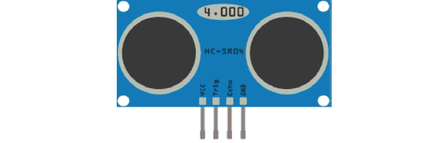

图 14.3 – HC-SR04 超声波传感器引脚图

从*图 14.3*中，你可以看到传感器的引脚图。**VCC**引脚连接到 5 伏电源。**Trig**和**Echo**引脚连接到微控制器板的数字端口。**GND**引脚连接到地。

这里是 HC-SR04 传感器的技术特性：

+   **工作电压**：直流 5 伏

+   **工作频率**：40 kHz

+   **工作电流**：15 mA

+   **最大工作范围**：4 米

+   **最小工作范围**：2 厘米

+   **分辨率**：0.3 厘米

+   **测量角度**：30 度（传感器的视野）

*图 14.4*展示了本章中使用的 HC-SR04 超声波传感器：

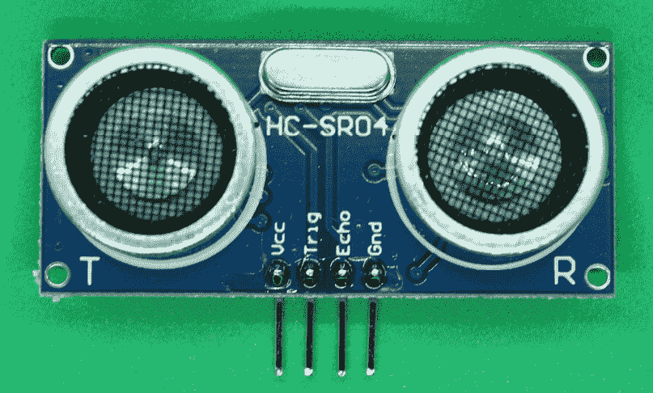

图 14.4 – HC-SR04 超声波传感器

从*图 14.4*中，你可以看到该传感器有两个类似扬声器的组件。其中一个是实际上发出超声波信号的小扬声器，另一个是捕捉这些信号在物体上反射后的麦克风。*图 14.5*展示了 HC-SR04 超声波传感器的背面：

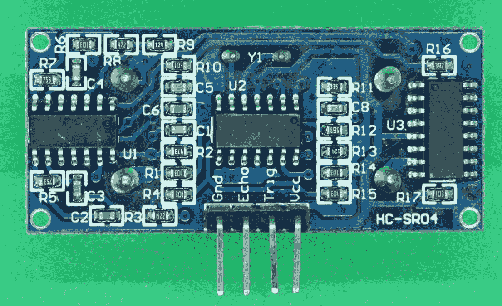

图 14.5 – HC-SR04 传感器的背面

如*图 14.5*所示，传感器的背面包含支持超声波信号生成和接收的电子组件，如电阻器、晶体管和集成电路。

还有其他类型的超声波传感器，例如 Maxbotix MaxSonar 超声波传感器。其 Fritzing 图示在*图 14.6*中显示：

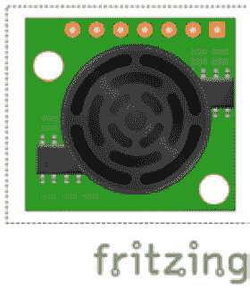

图 14.6 – Maxbotix MaxSonar 超声波传感器

*图 14.6*中所示的传感器可以用于微控制器板。Maxbotix MaxSonar 是一个准确且长距离的超声波传感器（它可以测量高达 6.45 米的距离），但它很昂贵，需要连接七根线到它的七个引脚。HC-SR04 传感器足以满足我们 20 秒计时器的应用。它成本低，易于连接，只需四根线。

当超声波传感器检测到用户向其挥手时，计时器开始，因此传感器将触发计时器。

*图 14.7*展示了如何将 HC-SR04 超声波传感器连接到 Blue Pill：

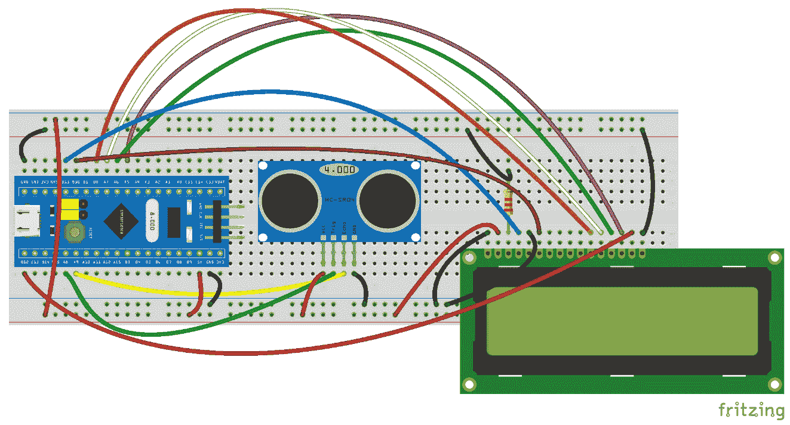

图 14.7 – 超声波传感器连接到 Blue Pill 微控制器板

从*图 14.7*中，你可以看到面包板的一个低轨连接到 Blue Pill 的**5V**引脚。另一个轨连接到 Blue Pill 的地。以下是将 HC-SR04 传感器连接到 Blue Pill 的步骤，除了遵循*图 14.1*中的步骤外，还需要按照*图 14.7*中的图示进行以下步骤：

1.  将传感器的**VCC**引脚连接到面包板的低轨，该低轨连接到**5V**。

1.  将传感器的**Trig**引脚连接到 Blue Pill 的**A8**引脚。

1.  将传感器的**Echo**引脚连接到 Blue Pill 的**A9**引脚。

1.  将传感器的**GND**引脚连接到面包板的低轨，该低轨连接到地。

*图 14.8*展示了所有连接方式：

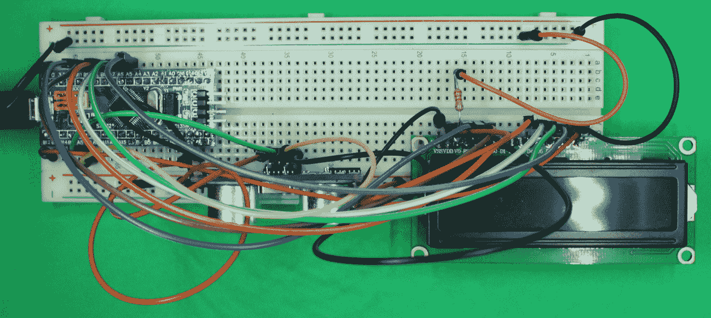

图 14.8 – Blue Pill 连接到 LCD 和超声波传感器

请注意从*图 14.8*中，所有从超声波传感器来的连接都是在它的背面完成的。这是为了避免任何电缆阻碍传感器前部的发送和接收超声波信号。另外，注意 1602 LCD 的电源（引脚**VDD**）连接到 Blue Pill 的**5V**引脚。如果你用 3.3 伏供电 LCD，它可能无法工作。

小贴士

确保没有电线阻碍 HC-SR04 超声波传感器的视野；否则，它们将产生不规律或错误的测量和结果，以及 20 秒计数。

还请注意，从 *图 14.8* 可以看出，面包板的上方轨道连接到 Blue Pill 的 **G** 引脚（在某些 Blue Pill 上标记为 **GND**），它用于连接液晶显示屏的地线和用于预置液晶显示屏对比度的 2.2k 欧姆电阻。

下一个部分将解释如何将整个项目封装起来，以保护其免受灰尘、水等侵害，并便于在洗手的地方使用。

# 将所有东西组合在一起——想想为项目做一个保护壳吧！

本部分展示了如何将带有超声波传感器的电子电路放置在保护壳内。本部分还提供了一些如何在塑料或玻璃容器中放置所有部件的建议，因为如果您在浴室或靠近洗手池的地方使用 20 秒计数器，您将需要保护电路免受水溅和肥皂斑点的损害，这些斑点可能会损坏本 20 秒计数器项目中使用的电子组件。出于安全考虑，我们不推荐您将 Blue Pill 板连接到墙壁 USB 适配器。最好将 Blue Pill 连接到 USB 移动电源。

如果您无法将整个 20 秒倒计时电路（包括其无焊面包板）放入塑料或玻璃容器中，请尝试将 Blue Pill 连接到一个更小的无焊面包板，例如半面包板。从面包板上拆下超声波传感器和液晶显示屏，并用强力胶带将它们定位并固定在容器内部。关于这个较小电路的 Fritzing 图表显示在 *图 14.9* 中：

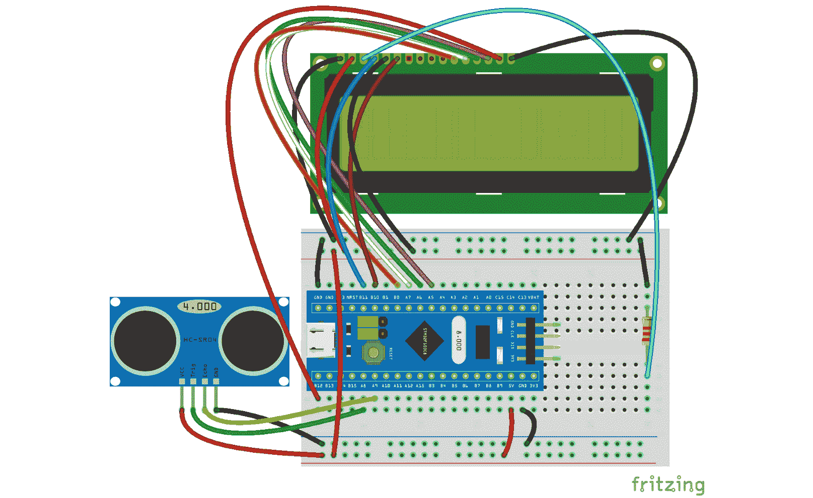

图 14.9 – 在小型无焊面包板上连接所有部件

如您从 *图 14.9* 所见，通过使用半面包板，您可以使所有连接更加紧凑，这样您就可以使用一个小的容器，如空速溶咖啡罐或任何带盖的塑料容器。您可以将超声波传感器安装在盖子上，并将其余部分放在容器或罐子内部。您需要使用公对母杜邦线将液晶显示屏和超声波传感器连接到半面包板。

*图 14.10* 展示了一个带有定制外壳的原型设计，这为您提供了如何封装所有组件并保护电子设备免受水溅的思路：

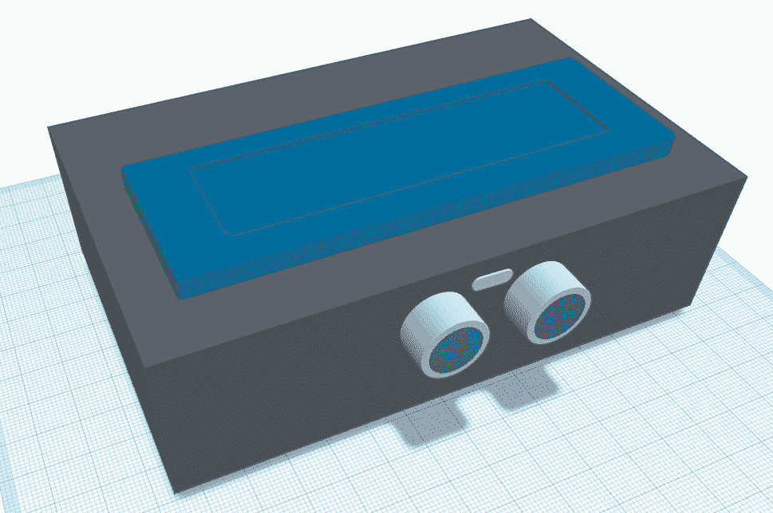

图 14.10 – 包含整个项目的 3D 原型设计

如您从 *图 14.10* 所见，该外壳可能是一个放置 1602A 液晶显示屏的塑料盒。HC-SR04 传感器放置在盒子的前面。盒子的内部可以包含小型面包板、电线、Blue Pill、电阻、移动电源和 USB 线。不要将整个项目放置在洗手池附近，以防万一。

# 测试计时器

本部分展示了如何测试 20 秒计时器。

一旦将带有传感器的电子电路、Blue Pill 和 LCD 放入保护壳中，尝试在浴室中使用它。如果可能，小心地将它放置在洗手池附近，以便在洗手时激活它并看到计数。看看你是否能将其固定在墙上或表面上，这样它就不会移动，也不会有人在挥手时意外将其碰倒。安全第一！

你应该将 Blue Pill 连接到一个带有 USB 接口的便携式充电宝。这是为了避免将 Blue Pill 连接到墙壁 USB 适配器，使其在如浴室等环境中使用更安全，如图 14.11 所示：

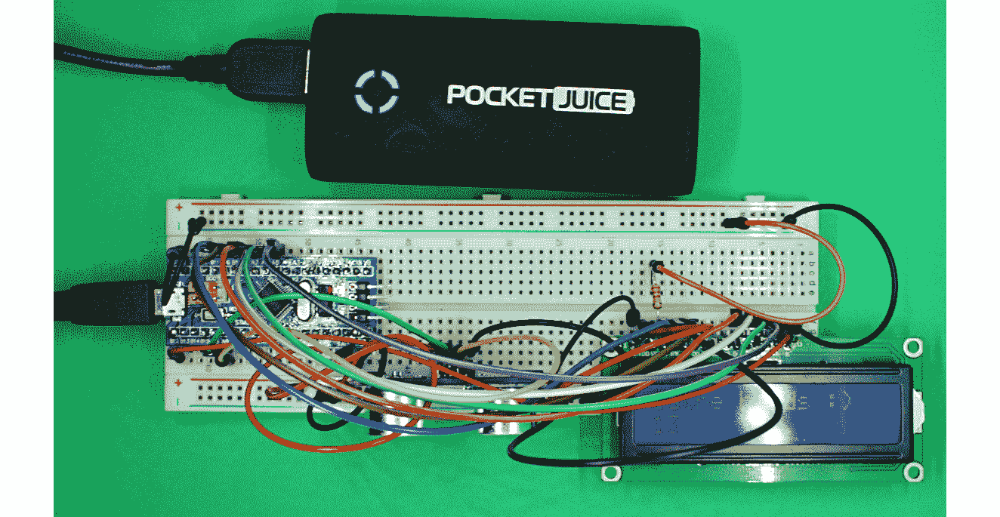

图 14.11 – 连接到 Blue Pill 微控制器板的充电宝

你可以用一个小型充电宝测试所有这些，如图 14.11 所示。

通过多次在传感器前挥手来尝试激活计时器。你会发现有时电路会计数到 21。这是因为大多数微控制器板（包括 Blue Pill）计算时间并不非常准确。尝试在代码中添加一个变量和决策，以显示计数到 20。提示：当计数达到 20 时停止显示计数。当你洗手试图*破坏*导致 COVID-19 的病毒时，计数到 21 并不关键。计数时间越长越好。

如果你觉得用户需要在不同的距离挥手来检测传感器，你可以调整检测的距离。尝试更改此行代码中的值：

`if ((dist_read<=15) & (dist_read>0))`

`15`这个值意味着如果你在距离传感器 15 厘米或更近的地方挥手，LCD 会激活并显示计数。尝试将这个值改为更大的数字，比如 20 厘米。

如果你认为 LCD 上显示的文本和数字需要更高的对比度，尝试将 2.2k 欧姆电阻更换为更小的电阻，例如 1k 欧姆。这可能发生在你的浴室或你打算使用计数器的场所过于明亮的情况下。

这是一个有趣的测试：尝试用不同年龄段的人进行 20 秒计数器的测试，看看超声波传感器是否能检测到不同大小的手。例如，看看传感器是否能检测到小孩和成人的挥手动作。

# 摘要

在本章中，我们学习了编写易于阅读的 20 秒计数器的基础知识。许多卫生机构推荐使用这个计数来正确洗手，以试图消灭一些病毒，例如导致 COVID-19 的病毒。本章还解释了 HC-SR04 超声波传感器是如何激活计数器的。在完成本章的项目后，你获得的一项主要技能是学会了如何将实用的 LCD 连接到微控制器板上，以及如何在 LCD 上显示计数。你可以在其他需要从微控制器板上显示数字或文本数据的项目中使用 LCD。

在本章中，我们介绍了一种从传感器获取数据、在微控制器板上处理数据以及对其进行操作（如显示在 LCD 上）的实用方法。从传感器获取数据并处理是微控制器的主要应用之一，利用其简单性将传感器连接到其输入/输出端口。

# 进一步阅读

+   Choudhuri, K. B. R. (2017)，*10 天内学习 Arduino 原型设计*，英国伯明翰：Packt 出版社有限公司

+   Gay, W. (2018)，*STM32 入门：使用 FreeRTOS、libopencm3 和 GCC 进行开发*，纽约，纽约：Apress 出版社

+   HC-SR04（2013），*HC-SR04 用户手册 V1.0*，Cytron 技术公司，可在[`docs.google.com/document/d/1Y-yZnNhMYy7rwhAgyL_pfa39RsB-x2qR4vP8saG73rE/edit?usp=sharing`](https://docs.google.com/document/d/1Y-yZnNhMYy7rwhAgyL_pfa39RsB-x2qR4vP8saG73rE/edit?usp=sharing)获取

+   Horowitz, P. 和 Hill, W. (2015)，*电子艺术*，[第 3 版]，剑桥大学出版社：纽约，纽约

+   LCD1602（2009），*LCM 模块数据表 TC1602A-01T*，Tinsharp 工业有限公司，可在[`cdn-shop.adafruit.com/datasheets/TC1602A-01T.pdf`](https://cdn-shop.adafruit.com/datasheets/TC1602A-01T.pdf)获取

+   Microchip (2019)，*PIC16F15376 Curiosity Nano 硬件用户指南*，Microchip 技术公司，可在[`ww1.microchip.com/downloads/en/DeviceDoc/50002900B.pdf`](http://ww1.microchip.com/downloads/en/DeviceDoc/50002900B.pdf)获取
