# 第一章：虚幻引擎简介

欢迎使用*虚幻引擎游戏开发项目第二版*。如果你是第一次使用**虚幻引擎 5**（**UE5**），这本书将帮助你开始使用市场上最受欢迎的游戏引擎之一。你将发现如何提升你的游戏开发技能，以及如何通过创建视频游戏来表达自己。如果你已经尝试过使用 UE5，这本书将帮助你进一步发展你的知识和技能，以便你能够更轻松、更有效地构建游戏。

游戏引擎是一种软件应用程序，它允许你从头开始制作视频游戏。它们的特性集差异很大，但通常允许你导入多媒体文件，如 3D 模型、图像、音频和视频，并通过编程方式操作这些文件，其中你可以使用 C++、Python 和 Lua 等编程语言。

UE5 使用两种主要的编程语言，C++和蓝图，后者是一种可视化脚本语言，允许你完成 C++所能完成的大部分工作。尽管我们将在本书中教授一些蓝图知识，但我们主要会关注 C++，因此我们期望你对这种语言有基本的了解，包括诸如**变量**、**函数**、**类**、**继承**和**多态**等主题。我们会在这本书中适当提醒你这些主题。

使用虚幻引擎 4（UE4）制作的流行视频游戏的例子，这是 UE5 主要基于的前一个版本，包括*堡垒之夜*、*最终幻想 VII 重制版*、*边境之地 3*、*星球大战：绝地武士落魄者*、* gears 5*和*海贼王*等。所有这些游戏都具有非常高的视觉保真度，广为人知，并且（或曾经）拥有数百万玩家。

以下链接列出了使用虚幻引擎 5 制作的一些优秀游戏：[`youtu.be/kT4iWCxu5hA`](https://youtu.be/kT4iWCxu5hA)。这个展示将向您展示 UE5 允许你制作的各类游戏，无论是视觉效果还是游戏玩法风格。

如果你有一天想制作像视频中展示的游戏，或者以任何方式为它们做出贡献，那么你已经迈出了第一步。

本章将介绍虚幻引擎编辑器。你将了解编辑器的界面；如何在关卡中添加、删除和操作对象；如何使用虚幻引擎的蓝图可视化脚本语言；以及如何结合网格使用材质。

到本章结束时，你将能够导航虚幻引擎编辑器，创建演员，在关卡内操作它们，并创建材质。让我们通过学习如何在这个第一个练习中创建一个新的 UE5 项目来开始本章。

注意

在你继续本章之前，请确保你已经安装了*前言*中提到的所有必要软件。

# 技术要求

本章的代码文件可以在以下位置找到：[`github.com/PacktPublishing/Elevating-Game-Experiences-with-Unreal-Engine-5-Second-Edition`](https://github.com/PacktPublishing/Elevating-Game-Experiences-with-Unreal-Engine-5-Second-Edition)

# 练习 1.01 – 创建 Unreal Engine 5 项目

在这个第一个练习中，我们将学习如何创建一个新的 UE5 项目。UE5 有预定义的项目模板，允许你为项目实现基本设置。在这个练习中，我们将使用**第三人称**模板项目。

按照以下步骤完成这个练习：

1.  安装 Unreal Engine 5.0 版本后，通过点击版本图标旁边的**启动**按钮来启动编辑器。

1.  完成这些操作后，你会看到引擎的**项目**窗口，它将显示你可以打开和工作的现有项目。它还将提供创建新项目的选项。因为我们还没有项目，所以**最近的项目**部分将是空的。要创建新项目，选择一个**项目类别**选项，在我们的情况下将是**游戏**。然后点击**下一步**。

1.  之后，你会看到**项目模板**窗口。这个窗口将显示 Unreal Engine 中所有可用的项目模板。在创建新项目时，你将有一个选项，可以选择一些资产和代码直接使用，然后你可以根据喜好进行修改。有几种项目模板适用于不同类型的游戏，但在这个情况下，我们将选择**第三人称**项目模板。

1.  选择该模板并点击**下一步**按钮，这将带你到**项目设置**窗口。

在这个窗口中，你可以选择一些与你的项目相关的选项：

+   **蓝图或 C++**：在这里，你可以选择是否想要能够添加 C++类。默认选项是**蓝图**，但在这个情况下，我们将想要选择**C++**选项。

+   **质量**：在这里，你可以选择你的项目是否需要高质量的图形或高性能。将此选项设置为**最高质量**。

+   **光线追踪**：在这里，你可以选择是否启用或禁用光线追踪。光线追踪是一种新颖的图形渲染技术，它允许你通过模拟光线（使用光线）在数字环境中的路径来渲染对象。尽管这项技术在性能方面相当昂贵，但它也提供了更加逼真的图形，尤其是在照明方面。将其设置为**禁用**。

+   **目标平台**：在这里，你可以选择你希望此项目运行的主要平台。将此选项设置为**桌面/控制台**。

+   **起始内容**：在这里，你可以选择是否希望此项目附带一组额外的基本资产。将此选项设置为**包含起始内容**。

+   **位置和名称**：在窗口底部，你可以选择你的项目将在你的计算机上存储的位置及其名称。

1.  确保所有选项都已设置为预期值后，点击**创建项目**按钮。这将根据您设置的参数创建您的项目。这可能需要几分钟才能准备就绪。这样，您就创建了您的第一个 UE5 项目！

现在，让我们学习 UE5 的一些基础知识。

# 了解虚幻引擎

在本节中，您将了解虚幻引擎编辑器，这是熟悉 UE5 的基本主题。

一旦您的项目生成，您应该会看到虚幻引擎编辑器自动打开。这个屏幕可能是您在使用虚幻引擎时看到最多的屏幕，因此您必须习惯它。

让我们分解一下编辑器窗口中可以看到的内容：

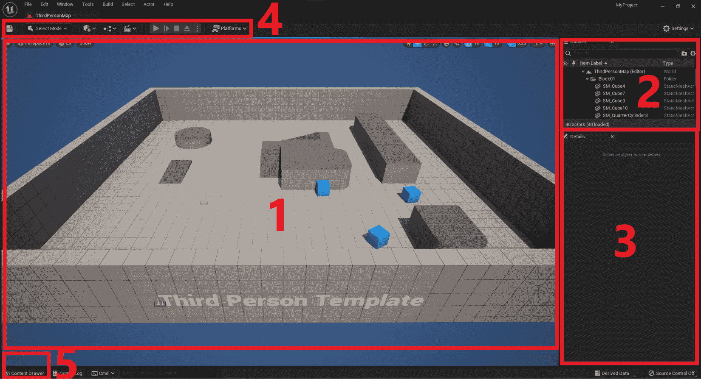

图 1.1 – 虚幻引擎编辑器分为主要窗口

让我们更详细地看看这些窗口：

1.  **视口**：在屏幕的正中心，您可以看到**视口**窗口。这将显示当前级别的内容，并允许您在级别中导航以及添加、移动、删除和编辑其中的对象。它还包含有关视觉过滤器、对象过滤器（您可以看到哪些对象）以及级别上的光照的几个不同参数。

1.  **大纲**：在屏幕的右上角，您将看到**大纲**窗口。这允许您快速列出和管理级别上的对象。**视口**和**大纲**窗口协同工作，允许您管理级别，其中前者将向您显示其外观，而后者将帮助您管理和组织它。**大纲**窗口允许您通过向您显示级别中的**对象**来按目录组织级别中的对象。

1.  **详细信息**：在屏幕的右侧，在**大纲**下方，您将能够看到**详细信息**面板，它允许您编辑您在级别中选定的对象的属性。由于前一个屏幕截图中没有选择任何对象，因此它是空的。然而，如果您通过**左键单击**选择级别中的任何对象，其属性应该会显示在这个窗口中，如下面的屏幕截图所示：

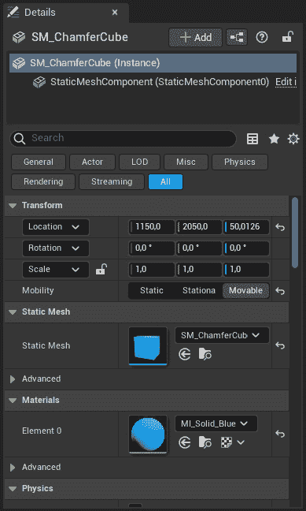

图 1.2 – 详细信息选项卡

1.  **工具栏**：在屏幕的顶部，您将看到**工具栏**区域，您将能够保存当前级别，向级别添加对象，并播放级别，等等。

注意

我们将只使用这些工具栏中的某些按钮，即**保存当前**、**设置**、**添加**和**播放**按钮。

1.  **内容抽屉**：你将非常频繁地使用的一个窗口是**内容抽屉**窗口。这个窗口让你能够快速访问**上下文浏览器**窗口。你也可以通过按下*Ctrl* + *Space*来打开它。**内容浏览器**窗口将允许你浏览和操作位于项目文件夹内的所有文件和资源。正如本章开头所述，虚幻引擎允许你导入多种类型的多媒体文件，而**内容浏览器**就是让你能够在各自的子编辑器中浏览和编辑它们的窗口。每次你创建一个虚幻引擎项目时，它都会始终生成一个**内容**文件夹。这个文件夹将是**内容浏览器**窗口的**根目录**，这意味着你只能浏览该文件夹内的文件。你可以在**内容浏览器**窗口的顶部看到你当前正在浏览的目录，在我们的例子中是**内容** | **ThirdPersonCPP**。

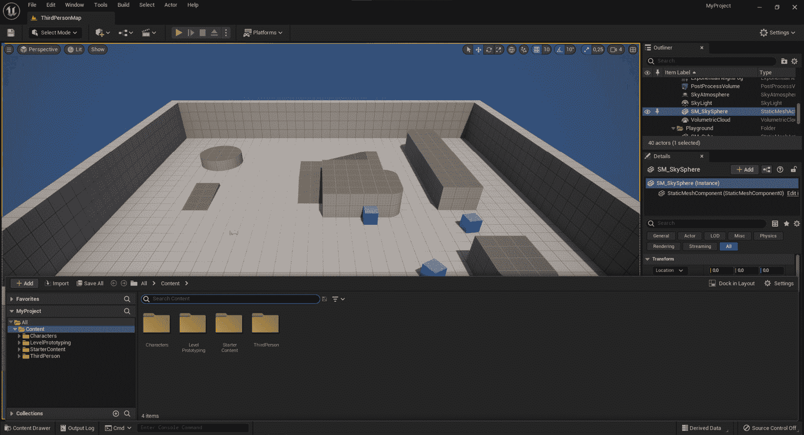

图 1.3 – 在虚幻引擎界面中显示的内容浏览器窗口

如果你点击位于**内容浏览器**窗口最左侧的**过滤器**按钮左侧的图标，你将能够看到**内容**文件夹的目录层次结构。这种目录视图允许你在项目的**内容**文件夹中选中、展开和折叠单个目录：

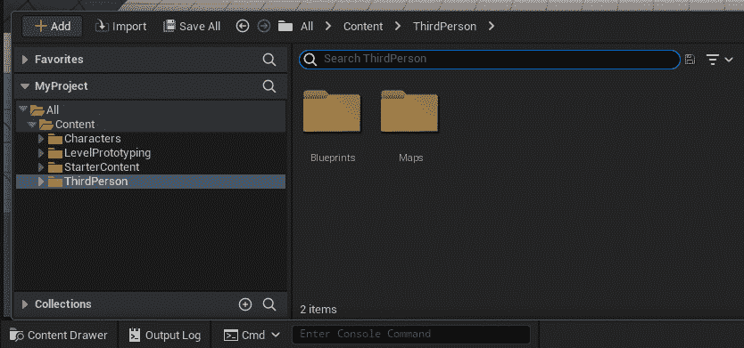

图 1.4 – 内容浏览器窗口的目录视图

注意

**内容抽屉**和**内容浏览器**这两个术语可以互换使用。

现在我们已经了解了虚幻引擎编辑器的主要窗口，让我们看看如何管理这些窗口（隐藏和显示它们的标签）。

# 探索编辑器窗口

正如我们所看到的，虚幻引擎编辑器由许多窗口组成，所有这些窗口都是可调整大小、可移动的，并且它们上面都有一个相应的标签。你可以*点击并拖动*一个窗口的标签来将其移动到其他位置。你可以通过*右键单击*标签并选择**隐藏标签**选项来隐藏标签标签：

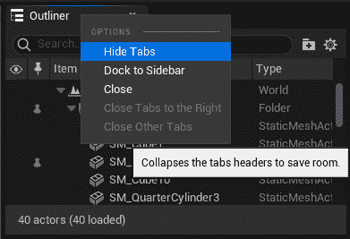

图 1.5 – 如何隐藏标签

如果标签标签已被隐藏，你可以通过点击该窗口左上角的*蓝色三角形*来使它们重新出现，如下面的截图所示：

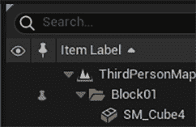

图 1.6 – 显示窗口标签的蓝色三角形

你还可以将窗口停靠到侧边栏以隐藏它们，同时使它们易于访问：

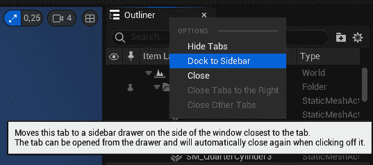

图 1.7 – 将窗口停靠到侧边栏

之后，要显示或隐藏它们，你只需点击它们：

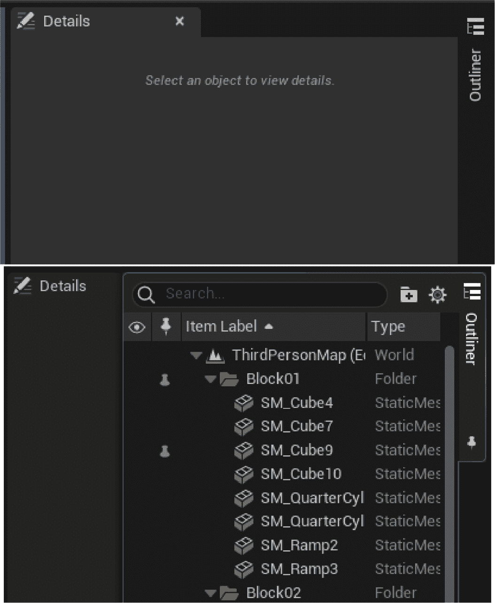

图 1.8 – 显示停靠在侧边栏的窗口

当涉及到停靠在底部工具栏的窗口，例如**内容抽屉**窗口时，你可以通过点击右上角的**Dock in Layout**来将它们从底部工具栏取消停靠到编辑器中：

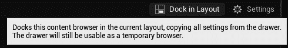

图 1.9 – 在编辑器底部的工具栏中取消停靠窗口

请记住，你可以通过点击编辑器左上角的**窗口**按钮来浏览和打开编辑器中所有可用的窗口，包括刚才提到的那些。

另一个你应该知道的重要事情是如何在编辑器内播放你的层级（也称为**PIE**）。在**工具栏**窗口的右侧边缘，你会看到一个绿色的**播放**按钮。如果你点击它，你将开始在编辑器内播放当前打开的层级：

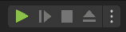

图 1.10 – 绿色的播放按钮，以及其他游戏播放按钮

一旦你按下**播放**，你将能够通过使用*W*、*A*、*S*和*D*键来移动玩家角色，使用*空格键*来跳跃，以及移动鼠标来旋转相机来控制层级中的玩家角色：

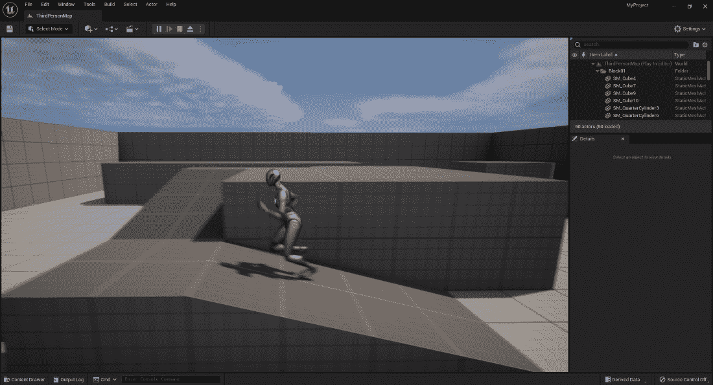

图 1.11 – 在编辑器内播放的层级

然后，你可以按下*Shift* + *Esc*键来停止播放层级。

现在我们已经习惯了编辑器的一些窗口，让我们更深入地看看**视口**窗口的导航。

# 视口导航

在上一节中，我们提到**视口**窗口允许你可视化你的层级，以及操作其中的对象。因为这个窗口对你来说非常重要，并且具有很多功能，所以我们将在本节中更深入地了解它。

在我们开始学习**视口**窗口之前，让我们快速了解一下**层级**。在 UE5 中，层级代表一组**对象**，以及它们的**位置和属性**。**视口**窗口将始终显示当前选中层级的**内容**，在这个例子中，它已经与**第三人称**模板项目一起创建和生成。在这个层级中，你可以看到四个墙面对象，一个地面对象，一组楼梯，以及一些其他高处的对象，还有玩家角色，它由 UE5 的模特表示。你可以创建多个层级并通过在**内容浏览器**窗口中打开它们来在它们之间切换。

要操作和导航当前选定的水平面，你必须使用**视口**窗口。如果你在窗口内按下并按住**左鼠标按钮**，你可以通过移动鼠标**左**和**右**来水平旋转相机，并通过移动鼠标**前**和**后**来前后移动相机。你也可以通过按住**右鼠标按钮**达到类似的效果，但当你移动鼠标**前**和**后**时，相机将垂直旋转，这允许你水平和垂直旋转相机。

此外，你可以通过点击并按住**视口**窗口的**右鼠标按钮**（**左鼠标按钮**也可以，但使用它进行移动并不那么有用，因为旋转相机时没有那么多自由度）并使用**W**和**S**键向前和向后移动，**A**和**D**键向左右移动，**E**和**Q**键向上和向下移动来在水平面上移动。

如果你查看**视口**窗口的右上角，你会看到一个带有数字的小相机图标，这将允许你更改**视口**窗口中相机移动的速度。

在**视口**窗口中，你还可以更改其可视化设置。你可以通过点击当前显示为**光照**的按钮来更改**视口**窗口中的可视化类型，这将显示所有可用于不同光照和其他类型可视化过滤器的选项。

如果你点击**透视**按钮，你将可以选择在透视视图和正交视图之间切换，后者可能有助于你更快地构建水平面。

现在我们已经学会了如何导航视口，让我们学习如何操作对象，也称为 Actor，在你的水平面上。

# 操作 Actor

在 Unreal Engine 中，所有可以放置在水平面上的对象都被称为 Actor。在电影中，演员是一个扮演角色的演员，但在 UE5 中，你水平面上看到的每个对象，包括墙壁、地板、武器和角色，都是一个 Actor。

每个 Actor 都必须有一个称为**变换**属性的东西，它是一组三件事：

+   `Vector`属性表示该 Actor 在水平、垂直和**Z**轴上的位置。一个向量简单地说是一个包含三个浮点数的元组——每个轴上的点位置各一个。

+   `Rotator`属性表示该 Actor 沿**X**、**Y**和**Z**轴的旋转。旋转器也是一个包含三个浮点数的元组——每个轴上的旋转角度各一个。

+   `Vector`属性表示该 Actor 在水平、垂直和**Z**轴上的缩放（即大小）。这也是一个包含三个浮点数的集合——每个轴上的缩放值各一个。

演员可以在级别中移动、旋转和缩放，这将相应地修改其**变换**属性。要这样做，通过在它上*左键单击*来选择您级别中的任何对象。您应该会看到**移动**工具出现：

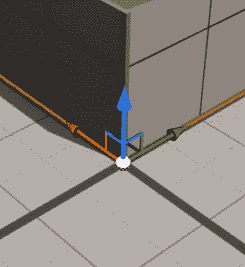

图 1.12 – 允许您在级别中移动演员的移动工具

**移动**工具是一个三轴操纵杆，允许您在任何轴上同时移动对象。**移动**工具的红色箭头（在前一个屏幕截图中指向左侧）代表*X*轴，绿色箭头（在前一个屏幕截图中指向右侧）代表*Y*轴，蓝色箭头（在前一个屏幕截图中向上）代表*Z*轴。如果您*单击并按住*这些箭头中的任何一个，然后将其拖动到级别中，您将在级别中沿着该轴移动您的演员。如果您单击连接两个箭头的手柄，您将同时沿着这两个轴移动演员，如果您单击所有箭头交点的白色球体，您将可以自由地在所有三个轴上移动演员：

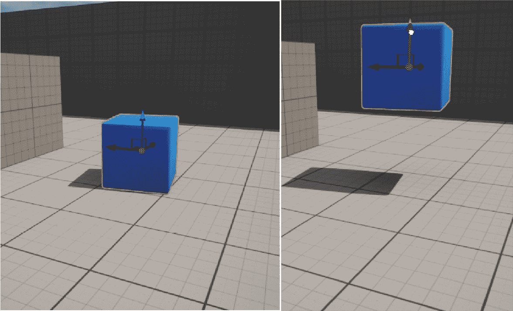

图 1.13 – 使用移动工具在 Z 轴上移动演员

**移动**工具允许您在级别中移动演员，但如果您想旋转或缩放演员，您将需要分别使用**旋转**和**缩放**工具。您可以通过分别按*W*、*E*和*R*键在**移动**、**旋转**和**缩放**工具之间切换。按*E*键切换到**旋转**工具：

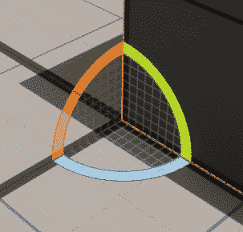

图 1.14 – 旋转工具，允许您旋转一个演员

如预期的那样，**旋转**工具允许您在级别中旋转一个演员。您可以*单击并按住*任何弧线来围绕相关的轴旋转演员。红色弧线（前一个屏幕截图的左上角）将围绕*X*轴旋转演员，绿色弧线（前一个屏幕截图的右上角）将围绕*Y*轴旋转演员，而蓝色弧线（前一个屏幕截图的左下角）将围绕*Z*轴旋转演员：

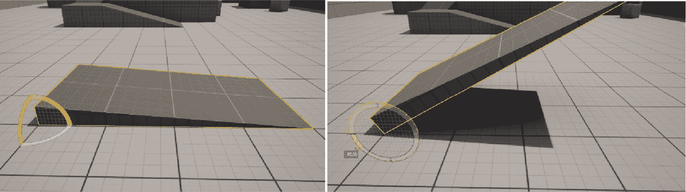

图 1.15 – 绕 Y 轴旋转 30 度前后的立方体

请记住，一个对象绕*X*轴的旋转通常被指定为**翻滚**，其绕*Y*轴的旋转通常被指定为**俯仰**，其绕*Z*轴的旋转通常被指定为**偏航**。

最后，我们有**缩放**工具。按*R*键切换到它：

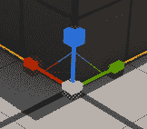

图 1.16 – 缩放工具

**缩放**工具允许你在**X**、**Y**和**Z**轴上增加和减少演员的缩放（大小），其中红色手柄（在先前的屏幕截图中的左侧）将沿**X**轴缩放演员，绿色手柄（在先前的屏幕截图中的右侧）将沿**Y**轴缩放演员，蓝色手柄（在先前的屏幕截图中的顶部）将沿**Z**轴缩放演员：

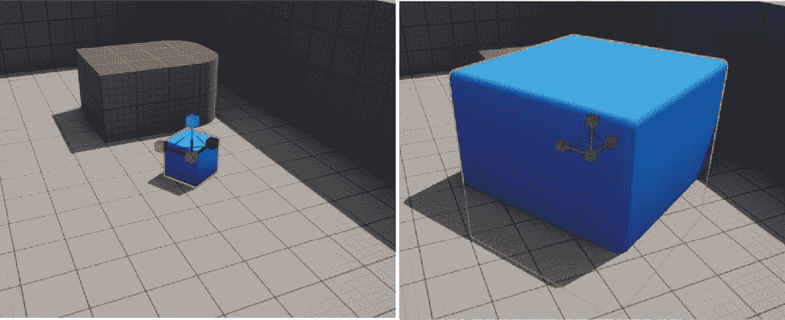

图 1.17 – 在所有三个轴向上缩放之前和之后的立方体演员

你还可以通过点击**视口**窗口顶部的以下图标在**移动**、**旋转**和**缩放**工具之间切换：

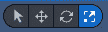

图 1.18 – 移动、旋转和缩放工具图标

此外，你还可以通过**移动**、**旋转**和**缩放**工具图标右侧的网格吸附选项更改你移动、旋转和缩放对象的增量。通过点击高亮显示的蓝色按钮，你可以完全禁用吸附，通过按下显示当前吸附增量的按钮，你可以更改这些增量：

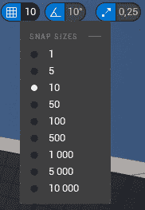

图 1.19 – 移动、旋转和缩放的网格吸附图标

现在你已经知道了如何操作你层级中已有的演员，让我们学习如何添加和移除演员到我们的层级。

## 练习 1.02 – 添加和移除演员

在这个练习中，我们将添加和移除演员从我们的层级。

当涉及到将演员添加到你的层级时，有两种主要方式可以实现：通过从**内容浏览器**窗口拖动资产或通过从**模式**窗口的**放置模式**拖动默认资产。

按照以下步骤完成此练习：

1.  前往 `ThirdPersonCharacter` 演员处。如果你使用**左鼠标按钮**将此资产拖动到你的层级，你将能够将此演员的一个实例添加到其中。它将放置在你释放**左鼠标按钮**的地方：

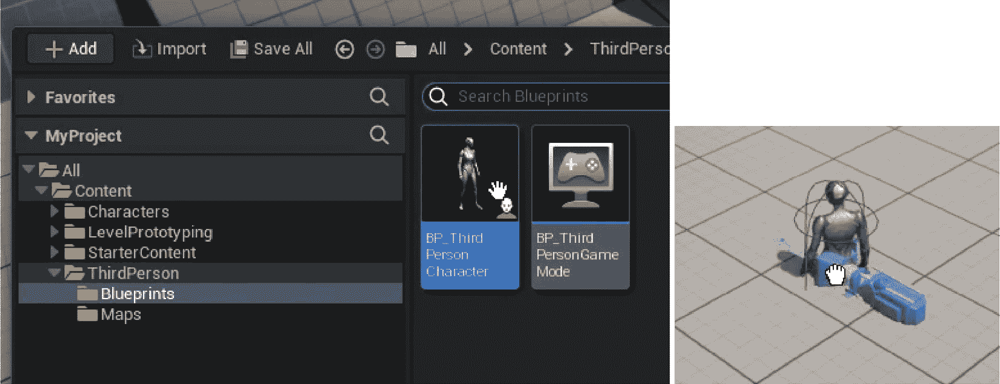

图 1.20 – 将 ThirdPersonCharacter 演员的实例拖动到我们的层级

1.  类似地，通过使用**工具栏**窗口中的**添加**按钮（带有绿色 *+* 的立方体）将一个**演员**拖动到你的层级：

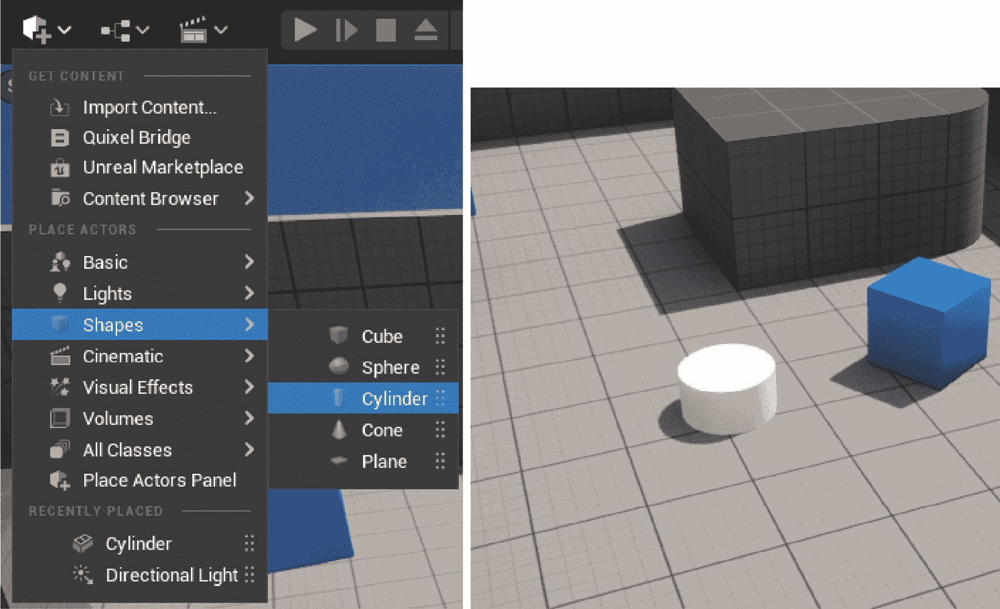

图 1.21 – 将圆柱形演员拖动到我们的层级

1.  要删除一个演员，只需选择该演员并按**删除**键。你还可以**右键单击**一个演员，查看有关该演员的许多其他选项。

注意

尽管我们不会在本书中涵盖这个主题，但开发者可以用 BSP 刷子来填充他们的关卡，以简单盒子和几何体进行原型设计，这是其中一种方法。当你构建关卡时，这些刷子可以快速塑造成所需的形状。要了解更多关于 BSP 刷子的信息，请访问[`docs.unrealengine.com/en-US/Engine/Actors/Brushes`](https://docs.unrealengine.com/en-US/Engine/Actors/Brushes)。

有了这些，我们就完成了这个练习，并学习了如何将 Actors 添加到我们的关卡中或从关卡中移除。

现在我们已经知道了如何导航**视口**窗口，让我们来了解一下蓝图 Actors。

# 理解蓝图 Actors

在 UE5 中，"蓝图"这个词可以指代两件事：UE5 的可视化脚本语言或一种特定的资产类型，也称为蓝图类或蓝图资产。

如我们之前提到的，一个 Actor 是一个可以放置在关卡中的对象。这个对象可以是 C++类的实例或蓝图类的实例，这两个都必须继承自 Actor 类（无论是直接还是间接）。那么，C++类和蓝图类之间有什么区别呢？有几个：

+   如果你向你的 C++类添加编程逻辑，你将能够访问比创建蓝图类时更多的先进引擎功能。

+   在蓝图类中，你可以轻松地查看和编辑该类的可视化组件，例如 3D 网格或触发盒碰撞，以及修改在 C++类中定义并暴露给编辑器的属性，这使得管理这些属性变得容易得多。

+   在蓝图类中，你可以轻松地引用项目中其他资产，而在 C++中，你也可以这样做，但不如前者简单和灵活。

+   在蓝图可视化脚本上运行的编程逻辑在性能方面比 C++类的慢。

+   在源版本平台上，同时让多个人在没有冲突的情况下工作于一个 C++类是非常简单的，而蓝图类，作为二进制文件而不是文本文件，如果两个人编辑同一个蓝图类，则会在源版本平台上发生冲突。

注意

如果你不知道源版本平台是什么，这就是几个开发者如何可以在同一个项目中工作，并且通过其他开发者的工作来更新项目。在这些平台上，不同的人通常可以同时编辑同一个文件，只要他们编辑的是该文件的不同部分，并且仍然可以接收到其他程序员所做的更新，而不会影响你在同一文件上的工作。最受欢迎的源版本平台之一是 GitHub。

请记住，蓝图类可以继承自 C++类或另一个蓝图类。

最后，在我们创建第一个蓝图类之前，还有另一件重要的事情你应该知道，你可以在 C++ 类中编写编程逻辑，然后创建一个继承自该类的蓝图类，同时也可以访问其属性和方法，如果你在 C++ 类中指定了这些。你可以让蓝图类编辑在 C++ 类中定义的属性，以及使用蓝图脚本语言调用和覆盖函数。我们将在本书中做一些这些事情。

现在你对蓝图类有了更多了解，让我们创建自己的蓝图。

## 练习 1.03 – 创建蓝图演员

在这个简短的练习中，我们将学习如何创建一个新的蓝图演员。

按照以下步骤完成这个练习：

1.  进入 **Content Browser** 窗口内的 **ThirdPersonCPP** | **Blueprints** 目录，并在其中 *右键单击*。应该会弹出以下窗口：

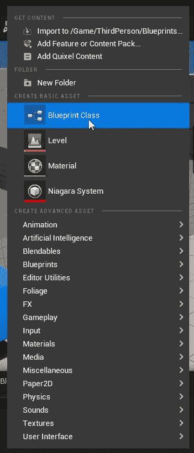

图 1.22 – 内容浏览器窗口内的选项窗口

此选项菜单包含在 UE5 中可以创建的资产类型（蓝图只是资产类型之一，还有其他类型的资产，如 **Level**、**Material** 和 **Sound**）。

1.  点击 **Blueprint Class** 图标以创建一个新的蓝图类。当你这样做时，你将可以选择从 C++ 或蓝图类继承：

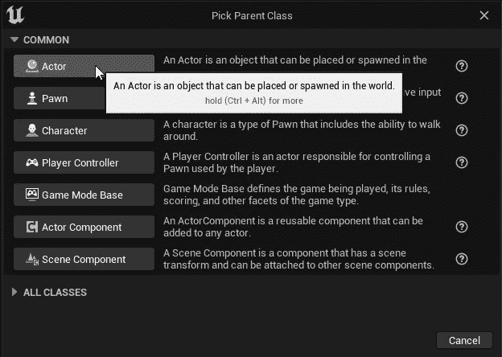

图 1.23 – 创建新蓝图类时弹出的选择父类窗口

1.  从这个窗口中选择第一个类 – 即，`Actor` 类。之后，新蓝图类的文本将自动选中，以便你可以轻松地给它命名。将这个蓝图类命名为 `TestActor` 并按 *Enter* 键接受这个名称。

在遵循这些步骤之后，你将创建你的蓝图类并完成这个练习。一旦你创建了此资产，用 *左鼠标键* 双击它以打开蓝图编辑器。我们将在下一节中了解更多关于这个内容。

# 探索蓝图编辑器

蓝图编辑器是 Unreal Engine 编辑器中专门用于蓝图类的子编辑器。在这里，你可以编辑你的蓝图类及其父类的属性和逻辑，以及它们的视觉外观。

当你打开一个演员蓝图类时，你应该看到蓝图编辑器。这个窗口将允许你在 UE5 中编辑你的蓝图类。让我们了解你现在看到的窗口：

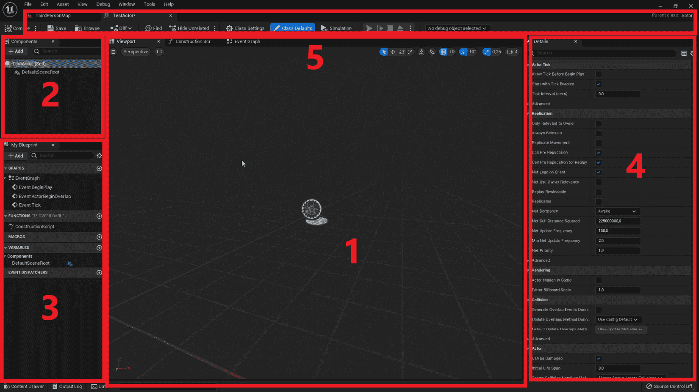

图 1.24 – 蓝图编辑器窗口分为五个部分

让我们更详细地看看这些窗口：

1.  **视口**：在编辑器的正中央，您有**视口**窗口。这个窗口类似于我们之前已经了解过的**级别视口**窗口，它将允许您可视化您的演员并编辑其组件。每个演员都可以有多个演员组件，其中一些具有视觉表示，例如网格组件和碰撞组件。我们将在本书的后面更深入地讨论演员组件。

从技术上讲，这个中心窗口包含三个选项卡，其中只有一个选项卡是**视口**窗口，但我们在处理这个编辑器的界面之后，将讨论其他重要的选项卡**事件图**。第三个选项卡是**构造脚本**窗口，本书将不会涉及。

1.  **组件**：在编辑器的左上角，您有**组件**窗口。如前所述，演员可以有多个演员组件，这个窗口将允许您在蓝图类中添加和删除这些演员组件，以及访问它从 C++类继承的演员组件。

1.  **我的蓝图**：在编辑器的左下角，您可以看到**我的蓝图**窗口。这个窗口将允许您浏览、添加和删除在这个蓝图类及其继承的 C++类中定义的变量和函数。请记住，蓝图有一种特殊类型的函数，称为**事件**，用于表示游戏中发生的事件。您应该在这个窗口中看到三个事件：**BeginPlay**、**ActorBeginOverlap**和**Tick**。我们很快就会讨论这些。

1.  **详细信息**：在编辑器的右侧，您有**详细信息**窗口。类似于编辑器的**详细信息**窗口，这个窗口将显示当前所选演员组件、函数、变量、事件或任何其他蓝图类的单个元素的属性。如果您当前没有选择任何元素，这个窗口将是空的。

1.  **工具栏**：在编辑器的顶部中央，您有**工具栏**窗口。这个窗口将允许您编译您在这个蓝图类中编写的代码，保存它，在**内容浏览器**窗口中定位它，以及访问这个类的设置等。

您可以通过查看蓝图编辑器的右上角来查看蓝图类的父类。如果您点击父类的名称，您将被带到通过虚幻引擎编辑器对应的蓝图类，或者通过 Visual Studio 对应的 C++类。

此外，您可以通过点击蓝图编辑器左上角的**文件**选项卡并选择**重新父化蓝图**选项来更改蓝图类的父类，这将允许您指定这个蓝图类的新父类。

现在我们已经了解了蓝图编辑器的基础知识，让我们来看看它的**事件图**。

# 探索事件图窗口

**事件图** 窗口是你在其中编写所有蓝图可视化脚本代码、创建你的变量和函数，以及访问在此类父类中声明的其他变量和函数的地方。

如果你选择 **事件图** 选项卡，你应该能在 **视口** 选项卡的右侧看到它，你将看到 **事件图** 窗口而不是 **视口** 窗口。点击 **事件图** 选项卡时，你会看到以下窗口：

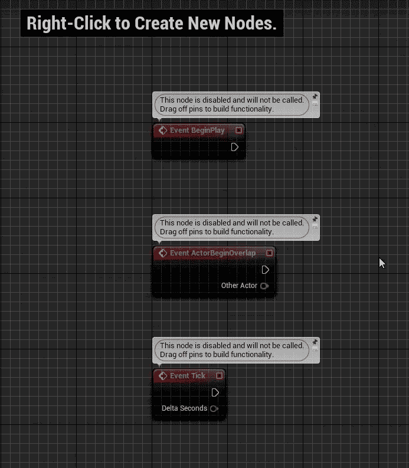

图 1.25 – 显示三个禁用事件的“事件图”窗口

你可以通过按住 **右鼠标按钮** 并在图中拖动来导航 **事件图** 窗口，你可以通过滚动 **鼠标滚轮** 来放大和缩小，你可以通过点击 **左鼠标按钮** 或点击并按住来选择节点区域。

你也可以在 **事件图** 窗口中 **右键单击** 来访问蓝图（Blueprint）的 **动作** 菜单，这允许你访问在 **事件图** 窗口中可以执行的操作，包括获取和设置变量、调用函数或事件，以及其他许多操作。

在蓝图（Blueprint）中脚本的工作方式是通过使用引脚连接节点。有几种类型的节点，例如变量、函数和事件。你可以通过引脚连接这些节点，其中有两种类型的引脚：

+   **执行引脚**：这些将决定节点执行的顺序。如果你想先执行节点 1，然后是节点 2，你可以将节点 1 的输出执行引脚链接到节点 2 的输入执行引脚，如下面的截图所示：

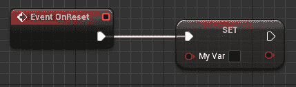

图 1.26 – 蓝图执行引脚

+   **变量引脚**：这些作为参数（也称为输入引脚），位于节点的左侧，并返回值（也称为输出引脚），位于节点的右侧，代表某种类型的值（整数、浮点数、布尔值等）：

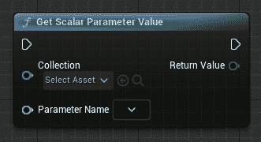

图 1.27 – 获取标量参数值节点

通过完成一个练习来更好地理解这一点。

## 练习 1.04 – 创建蓝图变量

在这个练习中，我们将通过创建一个 **布尔型** 的新变量来学习如何创建蓝图变量。

在蓝图（Blueprint）中，变量与你在 C++ 中使用的变量工作方式类似。你可以创建它们，获取它们的值，并设置它们。

按照以下步骤完成这个练习：

1.  要创建一个新的蓝图变量，前往 **My Blueprint** 窗口，并在 **变量** 类别中点击 **+** 按钮：

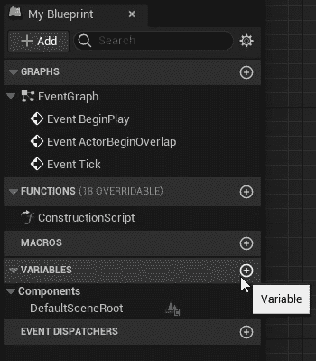

图 1.28 – 变量类别中的 + 按钮

1.  之后，你将自动被允许命名你的新变量。将这个新变量命名为 `MyVar`：

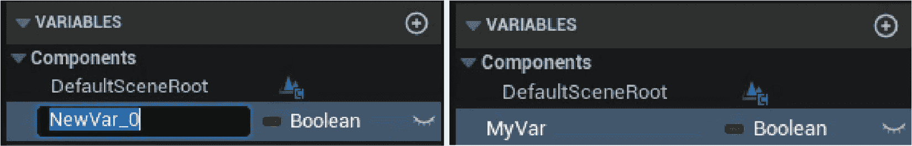

图 1.29 – 命名新变量 MyVar

1.  通过点击**工具栏**窗口左侧的**编译**按钮来编译您的蓝图：

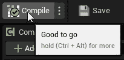

图 1.30 – 编译按钮

1.  现在，如果您查看**详细**窗口，您应该会看到以下内容：

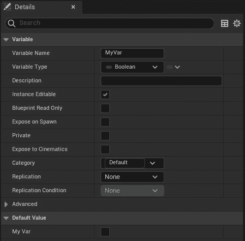

图 1.31 – 详细窗口中的 MyVar 变量设置

1.  在这里，您将能够编辑与该变量相关的所有设置，其中最重要的设置包括设置末尾的**变量名称**、**变量类型**和**默认值**。您可以通过点击右侧的灰色框来更改布尔变量的值：

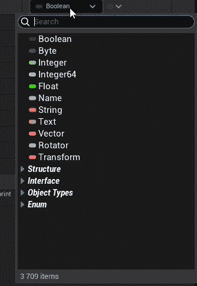

图 1.32 – 变量类型下拉菜单中可用的变量类型

1.  您还可以将**My Blueprint**选项卡中的变量获取器或设置器拖动到**事件图**窗口中：

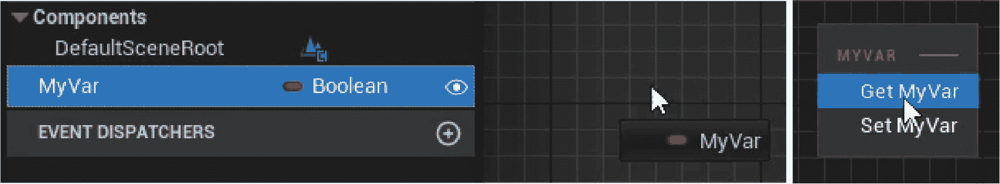

图 1.33 – 将 MyVar 变量拖动到事件图窗口中

获取器是包含变量当前值的节点，而设置器是允许您更改变量值的节点。

1.  要允许变量在蓝图类每个实例中可编辑，您可以点击**My Blueprint**窗口中该变量的右侧的眼睛图标：

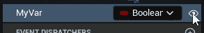

图 1.34 – 点击眼睛图标以显示变量并允许实例编辑

1.  然后，您可以将此类的一个实例拖动到您的级别，选择该实例，并在编辑器的**详细**窗口中看到更改该变量值的选项：

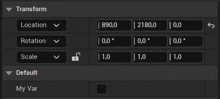

图 1.35 – 可以通过该对象的详细面板编辑的公开 MyVar 变量

有了这些，您就知道了如何创建蓝图变量。现在，让我们学习如何创建蓝图函数。

## 练习 1.05 – 创建蓝图函数

在这个练习中，我们将创建我们的第一个蓝图函数。在蓝图里，函数和事件相对相似，唯一的区别是事件通常只有一个输出引脚，通常是因为它从蓝图类外部被调用：

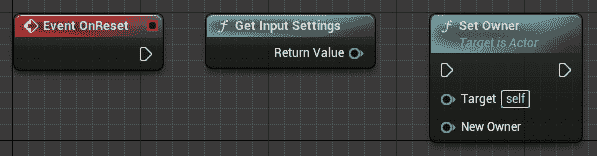

图 1.36 – 事件（左）、纯函数调用（中间）和普通函数调用（右）

按照以下步骤完成此练习：

1.  在**My Blueprint**窗口的**函数**类别中点击**+**按钮：

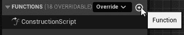

图 1.37 – 悬停在+函数按钮上，这将创建一个新函数

1.  将新函数命名为`MyFunc`。

通过点击**工具栏**窗口中的**编译**按钮来编译你的蓝图。

1.  现在，如果你查看**详细信息**窗口，你应该会看到以下内容：

图 1.38 – MyFunc 函数的详细信息面板

在这里，你可以编辑与此函数相关的所有设置，其中最重要的设置是**输入**和**输出**。这将允许你指定此函数必须接收的变量以及它将返回的变量。

最后，你可以通过每次调用时在`false`内部**点击**它来编辑此函数的功能：

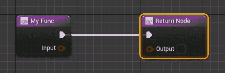

图 1.39 – MyFunc 函数

1.  要保存我们对这个蓝图类所做的修改，请点击工具栏上**编译**按钮旁边的**保存**按钮。或者，你可以选择在每次成功编译时自动保存蓝图，通过选择该选项来实现。

现在，你已经知道如何创建蓝图函数。接下来，我们将查看本章剩余练习和活动中将使用的**乘法**蓝图节点。

# 理解乘法节点

蓝图包含许多与变量或函数无关的节点。其中一个例子是算术节点（即，加法、减法、乘法等）。如果你在蓝图**动作**菜单中搜索“**乘法**”，你会找到**乘法**节点：

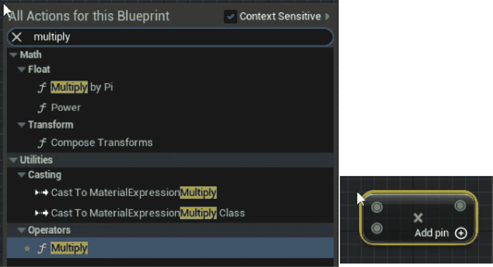

图 1.40 – 乘法节点

此节点允许你输入两个或更多参数，这些参数可以是多种类型（例如，整数、浮点数、向量等；你可以通过点击“**添加引脚**”文本右侧的**+**图标来添加更多；），并且输出所有这些参数相乘的结果。我们将在本章的活动中使用此节点。

# 探索 BeginPlay 和 Tick 事件

现在，让我们看看 UE5 中最重要的事件中的两个：**BeginPlay**和**Tick**。

如前所述，事件通常会在蓝图类外部被调用。在**BeginPlay**事件的例子中，此事件在将此蓝图类的实例放置在级别中并且级别开始播放时被调用，或者当在游戏进行时动态生成此蓝图类的实例时被调用。你可以将**BeginPlay**事件视为将在蓝图实例上首先被调用的第一个事件，你可以用它来进行初始化。

在 UE5 中，另一个需要了解的重要事件是 **Tick** 事件。正如你可能知道的，游戏以一定的帧率运行，最常见的帧率是每秒 30 **帧**（**FPS**）或 60 FPS。这意味着游戏每秒将渲染游戏更新的图像 30 或 60 次。每当游戏这样做时，**Tick** 事件都会被调用，这意味着如果游戏以 30 FPS 运行，**Tick** 事件每秒将被调用 30 次。

前往你的蓝图类的事件图窗口，通过选择所有三个灰色事件并点击 *Delete* 键来删除它们，这将导致事件图窗口变为空。之后，在事件图窗口内 *右键单击*，输入 **BeginPlay**，然后通过按 *Enter* 键或在蓝图 **操作** 菜单中选择该选项来选择 **Event BeginPlay** 节点。这应该会导致该事件被添加到事件图窗口中：

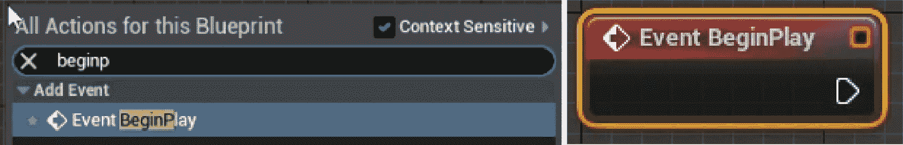

图 1.41 – 通过蓝图操作菜单将 BeginPlay 事件添加到事件图窗口

在事件图窗口内 *右键单击*，输入 **Tick**，然后选择 **Event Tick** 节点。这应该会导致该事件被添加到事件图窗口中：

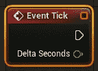

图 1.42 – Tick 事件

与 **BeginPlay** 事件不同，**Tick** 事件将以一个参数 **DeltaTime** 被调用。这个参数是一个浮点数，表示自上一帧渲染以来经过的时间。如果你的游戏以 30 FPS 运行，这意味着渲染每一帧之间的间隔（即时间差）平均将是 1/30 秒，大约是 0.033 秒（33.33 毫秒）。如果帧 1 被渲染，然后帧 2 在 0.2 秒后渲染，那么帧 2 的时间差将是 0.2 秒。如果帧 3 在帧 2 后 0.1 秒被渲染，那么帧 3 的时间差将是 0.1 秒，以此类推。

但为什么**DeltaTime**参数如此重要？让我们看看以下场景：你有一个蓝图类，每次使用**Tick**事件渲染帧时，都会在其*Z*-轴上增加 1 个单位。然而，你面临一个问题：玩家可能会以不同的帧率运行你的游戏，例如 30 FPS 和 60 FPS。以 60 FPS 运行游戏的玩家将导致**Tick**事件被调用两次，而以 30 FPS 运行游戏的玩家，蓝图类将因为这一点而移动得更快。这就是 delta time 发挥作用的地方：因为以 60 FPS 运行的游戏的**Tick**事件将以较低的 delta time 值被调用（渲染帧之间的间隔要小得多），你可以使用这个值来改变*Z*-轴上的位置。尽管在以 60 FPS 运行的游戏中**Tick**事件被调用得更多，但其 delta time 值是后者的一半，所以一切都会平衡。这将导致以不同帧率玩游戏的两个玩家得到相同的结果。

注意

在本书中，为了演示目的，**Tick**事件被使用了几次。然而，由于其性能影响，使用时应谨慎。如果你将**Tick**事件用于不需要每帧都执行的操作，可能存在更好的或更高效的方法来完成它。

注意

如果你想要一个使用 delta time 移动的蓝图，你可以通过将 delta time 乘以你想要它每秒移动的单位数（例如，如果你想要蓝图在*Z*-轴上每秒移动 3 个单位，你可以告诉它在每一帧移动`3 * DeltaTime`个单位）来加快或减慢它的移动速度。

现在，让我们完成一个练习，我们将在这个练习中与蓝图节点和引脚一起工作。

## 练习 1.06 – 在 Z 轴上偏移 TestActor 类

在这个练习中，你将使用`BeginPlay`事件在游戏开始播放时在*Z*-轴上偏移（移动）`TestActor`类。

按照以下步骤完成此练习：

1.  打开`TestActor`蓝图类。

1.  使用图中的`Event BeginPlay`节点，如果它还没有在那里的话。

1.  添加`AddActorWorldOffset`函数，并将`BeginPlay`事件的输出执行引脚连接到该函数的输入执行引脚。此函数负责在预期的轴（*X*、*Y*和*Z*）上移动 Actor，并接收以下参数：

    +   `目标`: 这个函数应该被调用的 Actor，这将是被调用此函数的 Actor。默认行为是在调用此函数的 Actor 上调用此函数，这正是我们想要的，并且使用`self`属性展示了这一点。

    +   `DeltaLocation`: 我们想要在每个三个轴（*X*、*Y*和*Z*）上偏移此 Actor 的量。

    +   我们不会深入探讨其他两个参数，`Sweep` 和 `Teleport`，因此您可以保持它们不变。它们都是布尔类型，应设置为 `false`：

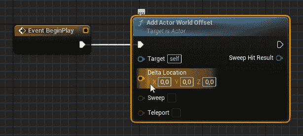

图 1.43 – BeginPlay 事件调用 AddActorWorldOffset 函数

1.  将 `Delta Location` 输入引脚分割，这将导致此 `Vector` 属性被分割成三个浮点属性。您可以通过在它们上 *右键单击* 并选择 **分割结构引脚** 来对此进行操作，任何由一个或多个子类型组成的变量类型都可以这样做（您无法对浮点类型这样做，因为它不包含任何变量子类型）：

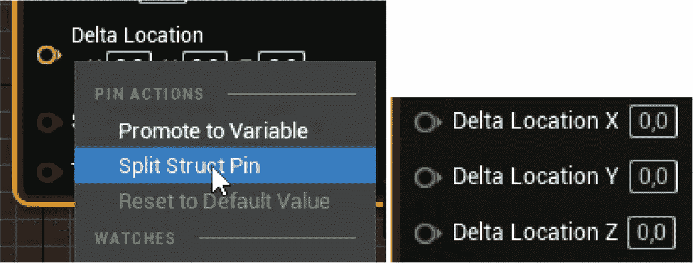

图 1.44 – Delta 位置参数从矢量分割成三个浮点数

1.  使用 *左鼠标按钮* 设置 `100` 单位的 *Z* 属性，输入该数字，然后按 *Enter* 键。这将使游戏开始时我们的 `100` 单位。

1.  使用 **组件** 窗口为您的 **TestActor** 添加一个立方体形状，以便我们可以看到我们的 Actor。您可以通过单击 **+ 添加** 按钮，输入 **Cube**，然后在 **基本形状** 部分下选择第一个选项来完成此操作：

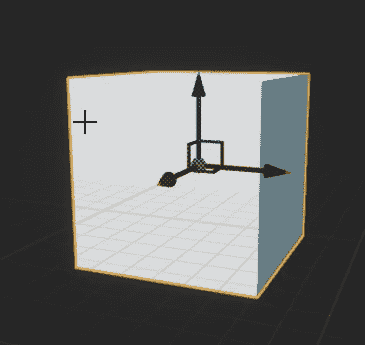

图 1.45 – 添加立方体形状

1.  通过单击 **编译** 按钮编译并保存您的蓝图类。

1.  返回级别的 **视口** 窗口，并将您的 **TestActor** 蓝图类的一个实例放置在级别中，如果您还没有这样做的话：

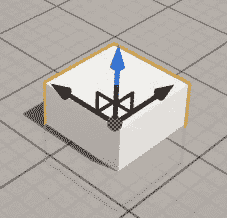

图 1.46 – 将 TestActor 实例添加到级别中

1.  当您播放级别时，您应该会注意到我们添加到级别中的 **TestActor** 类位于更高的位置：

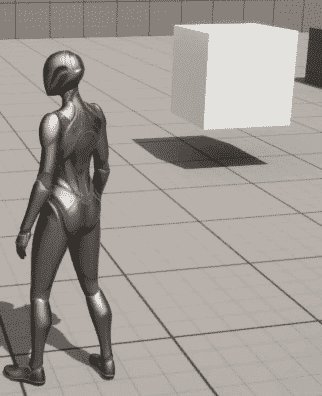

图 1.47 – 游戏开始时 TestActor 在 Z 轴上增加其位置

1.  在进行这些修改后，通过按 *Ctrl* + *S* 或在 **工具栏** 窗口中单击 **保存当前** 按钮来保存您对我们级别的更改。

在这个练习中，您学习了如何使用蓝图脚本逻辑创建您的第一个 Actor 蓝图类。

注意

`TestActor` 蓝图资产、`Map` 资产以及此练习的最终结果都可以在这里找到：[`github.com/PacktPublishing/Elevating-Game-Experiences-with-Unreal-Engine-5-Second-Edition`](https://github.com/PacktPublishing/Elevating-Game-Experiences-with-Unreal-Engine-5-Second-Edition)。

现在，让我们更深入地了解 `ThirdPersonCharacter` 蓝图类。

# 第三人称角色蓝图类

让我们来看看`ThirdPersonCharacter`蓝图类，这是代表玩家控制的角色的蓝图，并查看它包含的演员组件。

前往**内容浏览器（Content Browser**）窗口中的**ThirdPersonCPP** | **Blueprints**目录，并打开**ThirdPersonCharacter**资产：

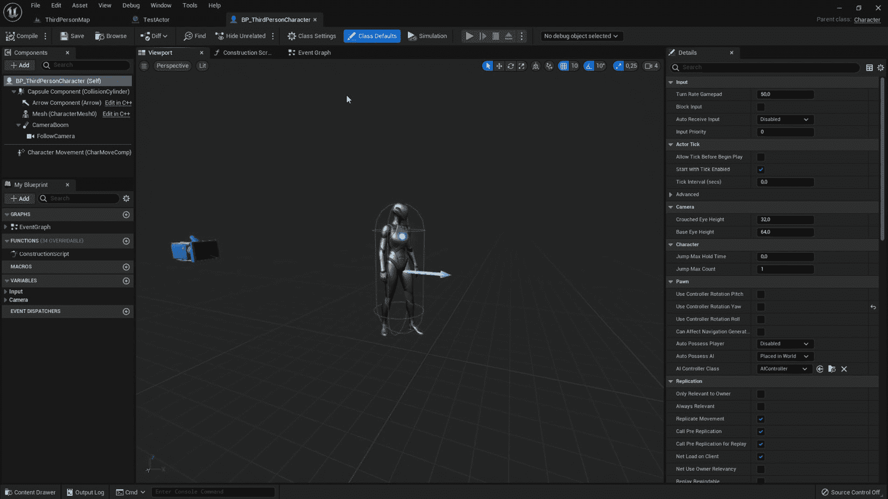

图 1.48 – ThirdPersonCharacter 蓝图类

在我们之前在蓝图编辑器中介绍**组件（Components**）窗口时，我们提到了**演员组件（Actor Components**）。

演员（Actor）组件是必须存在于演员（Actor）内部并允许您将演员的逻辑分散到几个不同的演员组件中的实体。在这个蓝图（Blueprint）中，我们可以看到有四个以视觉形式表示的演员组件：

+   一个骨骼网格组件，它显示 UE5 的模特

+   一个相机组件，它显示玩家将能够从哪里看到游戏

+   一个箭头组件，它允许我们看到角色面向的方向（这主要用于开发目的，而不是在游戏进行时）

+   一个胶囊组件，它指定了这个角色的碰撞范围

如果您查看**组件（Components**）窗口，您会看到比我们在**视口（Viewport**）窗口中看到的更多演员组件。这是因为一些演员组件没有视觉表示，完全由 C++或蓝图代码组成。我们将在下一章和*第七章**，使用 UE5 工具*中更深入地探讨演员组件。

如果您查看这个蓝图类的事件图（**Event Graph**）窗口，您会发现它基本上是空的，类似于我们之前看到的**测试演员（TestActor**）蓝图类，尽管它与它关联了一些逻辑。这是因为这些逻辑是在 C++类中定义的，而不是在这个蓝图类中。我们将在下一章中探讨如何做到这一点。

为了解释这个蓝图类的骨骼网格组件（Skeletal Mesh Component），我们首先应该谈谈网格和材质。

# 探索网格和材质的使用

为了让计算机以视觉形式表示一个 3D 对象，它需要两样东西：一个 3D 网格和一个材质。3D 网格允许我们指定物体的形状和大小，而材质允许我们指定其颜色和视觉色调等。我们将在接下来的几节中深入了解这两者，并看看 UE5 如何允许我们与之交互。

## 网格

3D 网格允许您指定物体的尺寸和形状，就像这个代表猴子头部的网格：

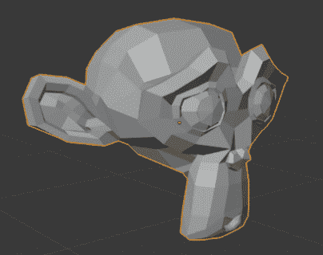

图 1.49 – 一只猴子的 3D 网格

网格由多个顶点、边和面组成。顶点仅仅是具有 *X*、*Y* 和 *Z* 位置的 3D 坐标；边是两个顶点之间的连接（即，一条线）；面是三个或更多边的连接。前面的截图显示了网格的各个顶点、边和面，其中每个面的颜色在白色和黑色之间，这取决于从面上反射的光量。如今，视频游戏可以以这种方式渲染具有数千个顶点的网格，以至于你无法分辨出单独的顶点，因为它们如此靠近且数量众多。

## 材料

材料另一方面允许你指定网格如何被表示。它们允许你指定网格的颜色，在其表面绘制纹理，甚至操纵其顶点。

在撰写本书时，创建网格在 UE5 中没有得到适当的支持，应该在其他软件中完成，例如 Blender 或 Autodesk Maya，因此我们在这里不会详细介绍这一点。然而，我们将学习如何为现有网格创建材料。

在 UE5 中，你可以通过网格组件添加网格，这些组件继承自 Actor Component 类。有几种类型的网格组件，但最重要的两种是静态网格组件，用于没有动画的网格（例如，立方体、静态关卡几何体），和骨骼网格组件，用于具有动画的网格（例如，播放运动动画的角色网格）。如我们之前所见，**ThirdPersonCharacter** 蓝图类包含一个骨骼网格组件，因为它用于表示播放运动动画的角色网格。在下一章中，我们将学习如何将网格等资产导入我们的 UE5 项目。

现在，让我们学习如何在 UE5 中操作材料。

# 在 UE5 中操作材料

在本节中，我们将学习材料在 UE5 中的工作方式。如前所述，材料是用于指定某个对象的视觉方面，包括其颜色以及它对光的反应。要了解更多关于它们的信息，请按照以下步骤操作：

1.  返回你的**级别视口**窗口，并选择以下截图所示的**立方体**对象：

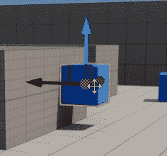

图 1.50 – 立方体对象，位于地板上写着第三人称的文字旁边

1.  查看**详细信息**窗口，在那里你可以看到与该对象的**静态网格组件**关联的网格和材料：

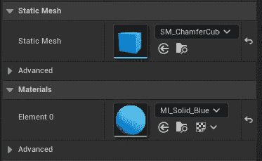

图 1.51 – 立方体对象的静态网格组件的静态网格和材料属性（元素 0）

注意

请记住，网格可以具有多个材料，但至少必须有一个。

1.  点击 **材料** 属性旁边的 **放大镜** 图标，可以跳转到 **内容浏览器** 窗口中该材质的位置。此图标与编辑器内任何资产的引用都兼容，因此你可以用相同的方式处理作为立方体对象 **静态网格** 的引用的资产：

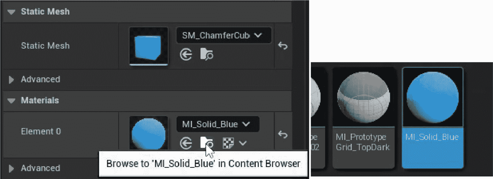

图 1.52 – **放大镜** 图标（左），它带你到内容浏览器中该资产的位置（右）

1.  **双击** 使用 **左鼠标按钮** 的资产以打开其属性。因为这种材质是另一个材质的子项，我们必须选择其父材质。在这个材质的 **详细信息面板** 中，你会找到 **父** 属性。点击 **放大镜** 图标以在 **上下文浏览器** 窗口中选择它：

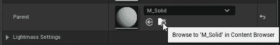

图 1.53 – 父属性

1.  选择该资产后，使用 **左鼠标按钮** 双击它以在 **材质** 编辑器中打开它。让我们分解一下 **材质** 编辑器中现有的窗口：

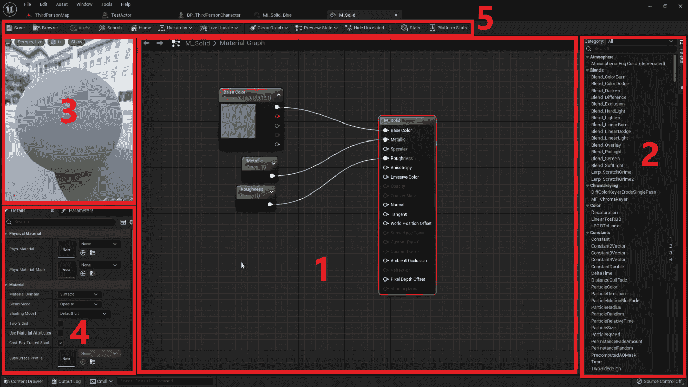

图 1.54 – 材质编辑器窗口分为五个部分

让我们更详细地看看这些窗口：

1.  **图**：在编辑器的最前方和中心位置，你有 **图** 窗口。类似于蓝图编辑器的 **事件图** 窗口，材质编辑器的图也是基于节点的，你也会找到通过引脚连接的节点，尽管在这里，你不会找到执行引脚，只有输入和输出引脚。

1.  **调色板**：在屏幕的右侧边缘，你会看到 **调色板** 窗口，在这里你可以搜索所有可以添加到 **图** 窗口的节点。你也可以通过在 **图** 窗口中 **右键单击** 并输入你想要添加的节点的方式，以相同的方式在蓝图编辑器的 **事件图** 窗口中这样做。

1.  **视口**：在屏幕的左上角，你会看到 **视口** 窗口。在这里，你可以预览材质的结果以及它将如何出现在一些基本形状上，如球体、立方体和平面。

1.  **详细信息**：在屏幕的左下角，你会看到 **详细信息** 窗口，类似于蓝图编辑器，你会在其中看到此 **材质** 资产或当前在 **图** 窗口中选定的节点的详细信息。

1.  **工具栏**：在屏幕的顶部边缘，你会看到 **工具栏** 窗口，在这里你可以应用和保存你对材质所做的更改，以及执行与 **图** 窗口相关的多个操作。

在 UE5 中的每一个材质编辑器中，你都会找到一个名为该 **材质** 资产的节点，通过将此节点的引脚连接到其他节点，你可以指定与它相关的几个参数。

在这种情况下，你可以看到有一个名为 `0.7` 的节点被连接到 `0.7`。你可以创建单个数字、2 向量（例如，`(1,` `0.5)`）、3 向量（例如，`(1,` `0.5,` `4)`）和 4 向量（例如，`(1,0.5,` `4,` `0)`）的常量节点。要创建这些节点，你可以分别按住 *1*、*2*、*3* 或 *4* 数字键，并用 *左鼠标按钮* 点击 **图形** 窗口。

材料有多个输入参数，所以让我们来看看其中一些最重要的参数：

+   `基础颜色`：此参数仅仅是材料本身的颜色。通常，常量或纹理样本用于连接到此引脚，以便使物体具有某种颜色或映射到某种纹理。

+   `金属度`：此参数将决定你的物体看起来有多像金属表面。你可以通过连接一个从 0（非金属）到 1（非常金属）的单个数字常量节点来实现这一点。

+   `镜面反射`：此参数将决定你的物体反射多少光。你可以通过连接一个从 0（不反射任何光）到 1（反射所有光）的单个数字常量节点来实现这一点。如果你的物体已经非常金属，你将看到几乎没有区别。

+   `粗糙度`：此参数将决定你的物体反射的光会被散射多少（光散射越多，物体反射周围物体的清晰度越低）。你可以通过连接一个从 0（物体本质上变成镜子）到 1（此物体的反射模糊且不清晰）的单个数字常量节点来实现这一点。

注意

要了解更多关于前面显示的 `material` 输入的信息，请访问 [`docs.unrealengine.com/en-US/Engine/Rendering/Materials/MaterialInputs`](https://docs.unrealengine.com/en-US/Engine/Rendering/Materials/MaterialInputs)。

UE5 还允许你将图像（`.jpeg`、`.png`）作为 `Texture` 资产导入，然后可以使用 `Texture Sample` 节点在材料中引用：

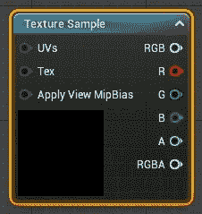

图 1.55 – 文本样本节点，允许你指定一个纹理并使用它或其颜色通道作为引脚

注意

我们将在下一章学习如何将文件导入 UE5。

要创建一个新的 **材料** 资产，在 **内容浏览器** 窗口中你想要创建新资产的目录内 *右键单击*，这将允许你选择要创建哪种资产，然后选择 **材料**。

通过这样，你就知道了如何在 UE5 中创建和操作材料。

现在，让我们进入本章的活动，这是本书的第一个活动。

# 活动一.01 – 在 Z 轴上无限期地推动 TestActor

在此活动中，你将使用 `TestActor` 在 *Z* 轴上无限期地移动它，而不是在游戏开始时只做一次。

按照以下步骤完成此活动：

1.  打开`TestActor`蓝图类。

1.  将**事件 Tick**节点添加到蓝图的**事件图**窗口中。

1.  添加**AddActorWorldOffset**函数，分割其**DeltaLocation**引脚，并将**Tick**事件的输出执行引脚连接到这个函数的输入执行引脚，类似于我们在*练习 1.01 – 创建 Unreal Engine 5 项目*中所做的。

1.  将一个`Float Multiplication`节点添加到**事件图**窗口中。

1.  将**Tick**事件的**Delta Seconds**输出引脚连接到**Float Multiplication**节点的第一个输入引脚。

1.  创建一个`float`类型的新的变量，命名为`VerticalSpeed`，并将其默认值设置为`25`。

1.  在`Float Multiplication`节点中添加一个 getter 到`VerticalSpeed`变量。之后，将`Float Multiplication`节点的输出引脚连接到**AddActorWorldOffset**函数的**Delta Location Z**引脚。

1.  删除与它连接的**BeginPlay**事件和**AddActorWorldOffset**函数，这两个都是在*练习 1.01 – 创建 Unreal Engine 5 项目*中创建的。

1.  在关卡中删除我们现有的 actor 实例，并拖入一个新的实例。

1.  播放关卡。你会注意到我们的`TestActor`随着时间的推移从地面升起并进入空中：

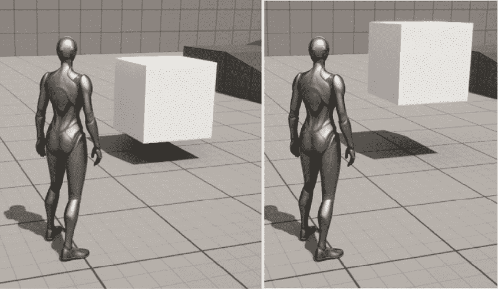

图 1.56 – TestActor 垂直推进

完成这些步骤后，我们结束了这个活动——本书中的第一个活动。我们已将添加和删除节点到和从蓝图编辑器的**事件图**窗口中，以及使用**Tick**事件及其**DeltaSeconds**属性来创建游戏逻辑，以保持不同帧率的一致性。

备注

这个活动的解决方案可以在 GitHub 上找到：[`github.com/PacktPublishing/Elevating-Game-Experiences-with-Unreal-Engine-5-Second-Edition/tree/main/Activity%20solutions`](https://github.com/PacktPublishing/Elevating-Game-Experiences-with-Unreal-Engine-5-Second-Edition/tree/main/Activity%20solutions)。

`TestActor`蓝图资产可以在以下位置找到：[`github.com/PacktPublishing/Elevating-Game-Experiences-with-Unreal-Engine-5-Second-Edition`](https://github.com/PacktPublishing/Elevating-Game-Experiences-with-Unreal-Engine-5-Second-Edition)。

# 摘要

通过完成本章，你已经在游戏开发之旅中迈出了第一步，通过学习 UE5。你现在知道如何导航 Unreal Engine 编辑器，操作关卡内的 Actors，创建 Actors，使用蓝图脚本语言，以及 3D 对象在 UE5 中的表示。

希望你能意识到前方有一个广阔的世界等待你去探索，而且在这个游戏开发工具的帮助下，你能创造的事物没有极限。

在下一章中，您将从零开始重新创建本章中自动生成的项目模板。您将学习如何创建 C++ 类，然后创建可以操作其父类中声明的属性的蓝图类。您还将学习如何将角色网格和动画导入到 Unreal Engine 5 中，以及熟悉其他与动画相关的资产，例如 *动画蓝图*。
