# 2

# 使用 Unreal Engine

在上一章中，我们学习了 Epic Games Launcher 的基础知识以及 Unreal 编辑器的基本功能。我们学习了如何处理对象以及蓝图的基本概念，还探索了第一人称模板。在本章中，我们将在此基础上，通过探索第三人称模板和处理输入和动画来进一步探索这些基础知识。

游戏开发可以使用多种语言，例如 C、C++、Java、C#，甚至 Python。虽然每种语言都有其优缺点，但在这本书中，我们将使用 C++，因为它是 Unreal Engine 中使用的首选编程语言。

在本章中，我们将向您介绍如何创建 C++ 项目并在 UE5 中进行基本调试。能够调试代码非常重要，因为它有助于开发者处理错误。提供的工具非常实用，对于任何 Unreal Engine 开发者来说都是必不可少的。

接下来，我们将深入了解 Unreal Engine 中创建游戏和体验的核心类。您将探索游戏模式和相关的类概念，然后通过练习来获得实际操作的理解。

本章的最后部分全部关于动画。几乎每款游戏都有动画，有的非常基础，有的则非常高级，包括对游戏体验至关重要的吸引人的细节。Unreal Engine 提供了多种工具，您可以使用这些工具创建和处理动画，包括提供复杂图的动画蓝图和状态机。

本章将重点介绍 Unreal Engine 中许多基本概念和功能。您将了解如何创建 C++ 项目，如何进行一些基本的调试，以及如何处理特定于角色的动画。

本章将涵盖以下主题：

+   创建并设置一个空的 C++ 项目

+   Unreal Engine 中内容文件夹的结构

+   使用 Visual Studio 解决方案

+   导入所需的资源

+   Unreal 游戏模式类

+   理解关卡和关卡蓝图

+   动画

到本章结束时，您将能够创建 C++ 模板项目并在 Visual Studio 中进行代码调试，理解文件夹结构和涉及的最佳实践，并能够根据其状态设置角色动画。

# 技术要求

本章的技术要求如下：

+   UE5 已安装

+   Visual Studio 2019 已安装

+   本章的完整代码可以从本书的 GitHub 仓库下载，网址为 [`github.com/PacktPublishing/Elevating-Game-Experiences-with-Unreal-Engine-5-Second-Edition`](https://github.com/PacktPublishing/Elevating-Game-Experiences-with-Unreal-Engine-5-Second-Edition)。

# 创建并设置一个空的 C++ 项目

在每个项目的开始，你可能希望从 Epic 提供的任何模板（其中包含可执行的基本代码）开始，并在其基础上构建。大多数/一些时候，你可能需要设置一个空白或空项目，你可以根据需求对其进行塑形。我们将在接下来的练习中学习如何做到这一点。

## 练习 2.01 – 创建一个空的 C++ 项目

在这个练习中，你将学习如何从 Epic 提供的模板中创建一个空的 C++ 项目。这将成为你未来许多 C++ 项目的基石。

按照以下步骤完成这个练习：

1.  从 Epic Games Launcher 启动 UE5。

1.  点击 `BLANK PROJECT` 部分，然后点击 `Blank`。

1.  在右侧面板的 **项目默认值** 部分下，选择 **C++**。

注意

确保项目文件夹和项目名称分别使用适当的目录和名称指定。

1.  当一切设置完毕后，点击 `E` 驱动器内的 `UnrealProjects`。项目名称设置为 `MyBlankProj`（建议使用这些名称和项目目录，但如果你愿意，也可以使用自己的名称）。请注意，你可以使用自己的名称，但最好将 Unreal 目录放置在驱动器根目录附近（以避免在创建或导入项目工作目录中的资源时遇到问题，例如 256 个字符路径限制；对于小型项目，这可能没问题，但对于更大规模的项目，其中文件夹层次结构可能变得过于复杂，这一步很重要）。

注意

项目名称中不能包含任何空格。最好将 Unreal 目录放置在驱动器根目录附近（以避免在创建或导入项目工作目录中的资源时遇到问题，例如 256 个字符路径限制；对于小型项目，这可能没问题，但对于更大规模的项目，其中文件夹层次结构可能变得过于复杂，这一步很重要）。

1.  生成代码并创建项目文件后，项目将打开，包括其 Visual Studio 解决方案文件（`.sln`）。

确保 Visual Studio 解决方案配置设置为 **开发编辑器**，并且解决方案平台设置为 **Win64** 以进行桌面开发：

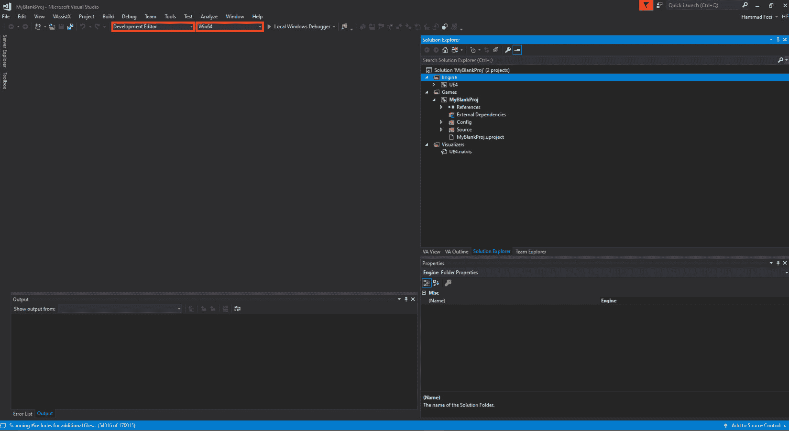

图 2.1 – Visual Studio 部署设置

通过完成这个练习，你将了解如何在 UE5 上创建一个空的 C++ 项目，以及相关的注意事项。

在下一节中，我们将讨论文件夹结构，以及 Unreal 开发者使用的最基本和最常用的文件夹结构格式。

# Unreal Engine 中内容文件夹的结构

在你的项目目录中（在我们的例子中，`E:/UnrealProjects/MyBlankProj`），你会看到一个 `Content` 文件夹。这是你的项目用于不同类型资源和项目相关数据的主体文件夹（包括蓝图）。C++ 代码放入你项目中的 `Source` 文件夹。请注意，最佳实践是直接通过 Unreal 编辑器创建新的 C++ 代码文件，因为这简化了过程并减少了错误。

您可以使用许多不同的策略来组织`Content`文件夹内的数据。最基本且易于理解的是使用文件夹名称来表示文件夹内的内容类型。因此，`Content`文件夹的目录结构可能类似于[`github.com/PacktPublishing/Game-Development-Projects-with-Unreal-Engine/blob/master/Chapter02/Images/06New.png`](https://github.com/PacktPublishing/Game-Development-Projects-with-Unreal-Engine/blob/master/Chapter02/Images/06New.png)中的示例。在这个例子中，您可以看到每个文件都被分类放置在代表其类型的文件夹名称下，下一级进一步将其分组到有意义的文件夹中。

注意

所有蓝图都应该在其名称前缀`BP`（以区分 Unreal Engine 使用的默认蓝图）来区分。其余的前缀是可选的（然而，最佳实践是使用前面显示的前缀来格式化它们）。

在下一节中，我们将查看 Visual Studio 解决方案。

# 使用 Visual Studio 解决方案

Unreal Engine 中的每个 C++项目都有一个 Visual Studio 解决方案。这反过来又驱动了所有代码，并允许开发者在运行状态下设置执行逻辑和调试代码。

**解决方案分析**

在项目目录内生成的 Visual Studio 解决方案（.`sln`）文件包含整个项目和任何添加到其中的相关代码。

让我们看看 Visual Studio 中的文件。双击`.sln`文件以在 Visual Studio 中打开它。

在`Engine`和`Games`中。

**Engine 项目**

在基本层面上，Unreal Engine 本身是一个 Visual Studio 项目，并有一个解决方案文件。这个文件包含了在 Unreal Engine 中协同工作的所有代码和第三方集成。此项目中的所有代码被称为**源代码**。

Engine 项目包括用于此项目的 Unreal Engine 的外部依赖项、配置、插件、着色器和源代码。您可以在任何时候浏览`UE5` | `Source`文件夹以查看任何引擎代码。

注意

由于 Unreal Engine 是开源的，Epic 允许开发者查看和编辑源代码以满足他们的需求和需求。但是，您不能在通过 Epic Games Launcher 安装的 Unreal Engine 版本中编辑源代码。要能够对源代码进行修改和构建，您需要下载 Unreal Engine 的源代码版本，这可以通过 GitHub 找到。您可以使用以下指南下载 Unreal Engine 的源代码版本：[`docs.unrealengine.com/en-US/GettingStarted/DownloadingUnrealEngine/index.xhtml`](https://docs.unrealengine.com/en-US/GettingStarted/DownloadingUnrealEngine/index.xhtml)。

下载后，您还可以参考以下指南来编译/构建新下载的引擎：[`docs.unrealengine.com/en-US/Programming/Development/BuildingUnrealEngine/index.xhtml`](https://docs.unrealengine.com/en-US/Programming/Development/BuildingUnrealEngine/index.xhtml)。

**游戏项目**

在`Games`目录下是名为您项目的解决方案文件夹。展开后，您将找到一组文件夹。您需要了解以下内容：

+   **配置文件夹**：此文件夹包含为项目及其构建（这些可以可选地具有特定平台（如 Windows、Android、iOS、Xbox 或 PlayStation）的设置）设置的所有配置。

+   **插件文件夹**：这是一个可选文件夹，当您添加任何第三方插件（从 Epic Marketplace 下载或通过互联网获得）时创建。此文件夹将包含与此项目关联的所有插件的源代码。

+   `Build Target`文件以及项目的所有源代码。以下是源文件夹中默认文件的描述：

    +   `.Target.cs`扩展名，以及一个以`Build.cs`结尾的构建文件。

    +   **ProjectName 代码文件 (.cpp 和.h)**：默认情况下，这些文件为每个项目创建，包含用于运行默认游戏模块代码的代码。

    +   **ProjectNameGameModeBase 代码文件 (.cpp 和.h)**：默认情况下，创建了一个空的**Project Game Mode Base**。在大多数情况下不使用。

    +   **ProjectName.uproject 文件**：此文件包含用于提供项目基本信息和与其关联的插件列表的描述符。

## 在 Visual Studio 中调试代码

Visual Studio 通过代码中的断点提供强大的调试功能。这允许用户在特定代码行暂停游戏，以便开发者可以查看变量的当前值，并以受控的方式逐步通过代码和游戏（他们可以逐行、逐函数地继续，等等）。

当您在游戏项目中有很多变量和代码文件时，这很有用，您想以逐步的方式查看变量的更新和使用情况以调试代码，找出问题并解决它们。调试是任何开发者工作的基本过程，只有经过许多连续的调试、分析和优化周期，项目才能足够完善以供部署。

现在您已经了解了 Visual Studio 解决方案的基本概念，我们将继续并介绍关于它的实际练习。

## 练习 2.02 – 调试第三人称模板代码

在这个练习中，您将使用此模板项目中的`Character`类的`BaseTurnRate`创建一个项目。我们将学习值如何在代码中逐行更新。

按照以下步骤完成此练习：

1.  从 Epic Games Launcher 启动 Unreal Engine。

1.  点击**游戏**部分，然后点击**下一步**。

1.  选择**第三人称**，然后点击**下一步**。

1.  选择`ThirdPersonDebug`，然后点击**创建项目**按钮。

1.  现在，关闭 Unreal 编辑器，转到 Visual Studio 解决方案，并打开`ThirdPersonDebugCharacter.cpp`文件：

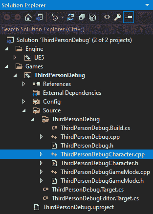

图 2.2 – 第三人称调试角色.cpp 文件的位置

1.  在第`18`行的左侧栏上左键单击。应该会在其上出现一个红色圆点图标（*你可以通过再次单击来切换它*）：

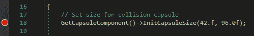

图 2.3 – 碰撞胶囊初始化代码

1.  在这里，我们正在获取角色的`capsule`组件（在*第三章*，*角色类组件和蓝图设置*）中进一步解释），默认情况下是根组件。然后，我们调用它的`InitCapsuleSize`方法，该方法接受两个参数：分别是`InRadius`浮点数和`InHalfHeight`浮点数。

1.  确保 VS 中的解决方案配置设置设置为**开发编辑器**，然后点击**本地 Windows 调试器**按钮：

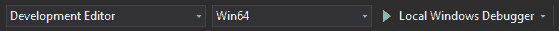

图 2.4 – Visual Studio 构建设置

1.  等待直到你能在左下角看到以下窗口：

注意

如果窗口没有弹出，你可以通过打开`locals`手动打开窗口。

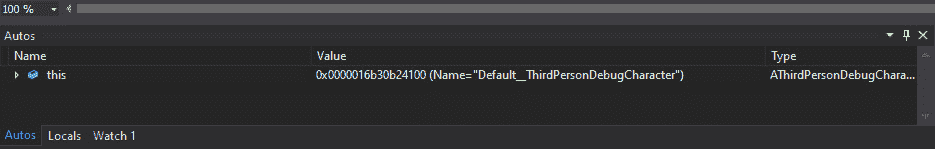

图 2.5 – Visual Studio 变量监视窗口

`this`表示对象本身。对象包含它存储的变量和方法，通过展开它，我们能够看到当前代码执行行上整个对象及其变量的状态。

1.  展开`this`，然后是`ACharacter`，然后是`CapsuleComponent`。在这里，你可以看到`CapsuleHalfHeight = 88.0`和`CapsuleRadius = 34.0`变量的值。在最初红色圆点所在的第`18`行旁边，你会看到一个箭头。这意味着代码在`17`行的末尾，并且还没有执行`18`行。

1.  点击**进入下一步**按钮进入下一行代码（快捷键：*F11*）。**进入下一步**会进入函数内部的代码（如果有的话）（如果当前行有函数，则**进入下一步**将模拟**进入下一步**的功能）：

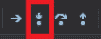

图 2.6 – 调试进入

1.  注意到箭头已经移动到第`21`行，并且变量已经被更新。`CapsuleHalfHeight = 96.0`和`CapsuleRadius = 42.0`被红色突出显示。此外，注意`BaseTurnRate`变量已经被初始化为`0.0`：

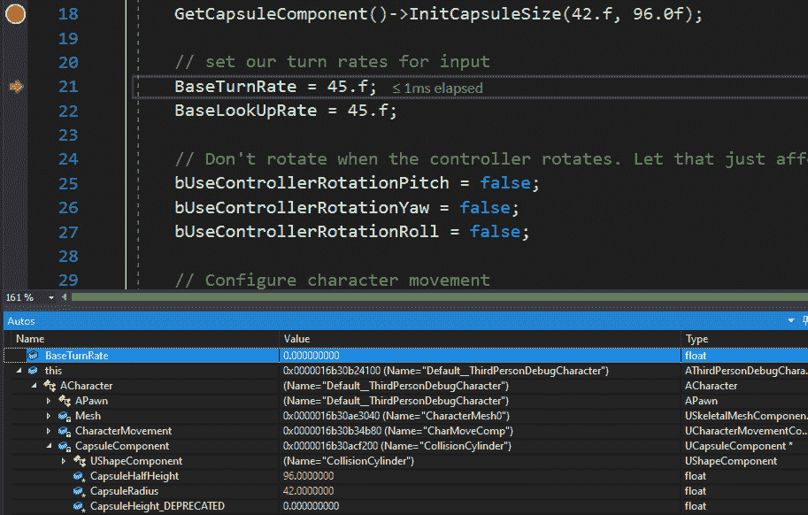

图 2.7 – BaseTurnRate 初始值

1.  再次按(*F11*)进入，跳转到行`22`。现在，`BaseTurnRate`变量的值为`45.0`，而`BaseLookUpRate`已被初始化为`0.0`，如下截图所示：

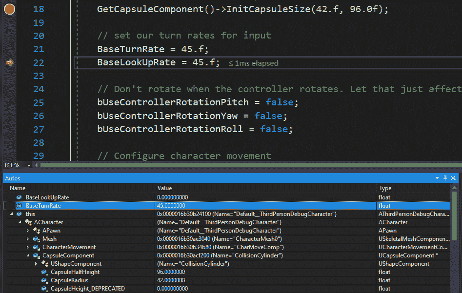

图 2.8 – BaseTurnRate 更新值

1.  再次按(*F11*)进入，跳转到行`27`。现在，`BaseLookUpRate`变量的值为`45.0`。

同样，鼓励你进入并调试代码的其他部分，不仅为了熟悉调试器，而且为了理解代码背后的工作原理。

通过完成这个练习，你已经学会了如何在 Visual Studio 中设置调试点，以及在某个点停止调试，然后逐行查看对象及其变量的值。这对于任何开发者来说都是一个重要的方面，许多人经常使用这个工具来消除代码中的讨厌的 bug，尤其是在代码流程很多且变量数量相当大时。

在任何时候，你可以通过使用顶部菜单栏上的按钮停止调试、重新启动调试或继续执行剩余的代码，如下所示：

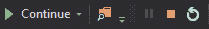

图 2.9 – Visual Studio 中的调试工具

现在，我们将查看如何将资源导入到 Unreal 项目中。

# 导入所需的资源

Unreal Engine 允许用户导入多种文件类型，以便用户自定义他们的项目。开发者可以调整和尝试几种导入选项，以匹配他们所需的设置。

游戏开发者经常导入的一些常见文件类型包括 FBX 用于场景、网格、动画（从 Maya 和其他类似软件导出）、电影文件、图像（主要用于用户界面）、纹理、声音、CSV 文件中的数据以及字体。这些文件可以从 Epic Marketplace 或其他途径（如互联网）获得，并在项目中使用。

可以通过将资源拖放到`Content`文件夹中，或者通过在**内容浏览器**区域点击**导入**按钮来导入资源。

现在我们来做一个练习，学习如何导入 FBX 文件，并看看这是如何完成的。

## 练习 2.03 – 导入 FBX 角色文件

这个练习将专注于从 FBX 文件中导入 3D 模型。FBX 文件广泛用于导出和导入 3D 模型，包括其材质、动画和纹理。

按照以下步骤完成此练习：

1.  从 GitHub 上的`Chapter02` | `Exercise2.03` | `ExerciseFiles`目录下载`SK_Mannequin.FBX`、`ThirdPersonIdle.FBX`、`ThirdPersonRun.FBX`和`ThirdPersonWalk.FBX`文件。

注意

`ExerciseFiles` 目录可以在 GitHub 上找到，网址为 [`github.com/PacktPublishing/Game-Development-Projects-with-Unreal-Engine/tree/master/Chapter02/Exercise2.03/ExerciseFiles`](https://github.com/PacktPublishing/Game-Development-Projects-with-Unreal-Engine/tree/master/Chapter02/Exercise2.03/ExerciseFiles)。

1.  打开我们在 *练习 2.01 – 创建一个空的 C++ 项目* 中创建的空白项目。

1.  在项目的 **内容浏览器** 区域中，点击 **导入**：

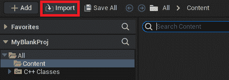

图 2.10 – 内容浏览器区域的导入按钮

1.  浏览到我们在 *步骤 1* 中下载的文件目录，选择 `SK_Mannequin.FBX`，然后点击 **打开** 按钮。

1.  确保将 **导入动画** 按钮取消选中，然后点击 **导入全部** 按钮。你可能会收到一个警告，指出 **没有平滑组**。现在你可以忽略这个警告。这样，你就成功从 FBX 文件中导入了一个骨骼网格。现在，我们需要导入它的动画。

1.  点击 `ThirdPersonIdle.fbx`、`ThirdPersonRun.fbx` 和 `ThirdPersonWalk.fbx`。然后，点击 **打开** 按钮。

1.  确保骨骼设置为你在 *步骤 5* 中导入的那个，然后点击 **导入全部**：

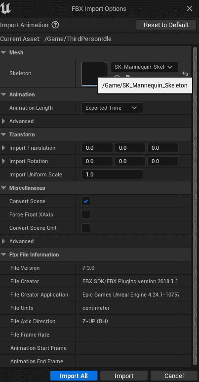

图 2.11 – FBX 导入选项

1.  现在，你将在 **内容浏览器** 区域看到三个动画（`ThirdPersonIdle`、`ThirdPersonRun` 和 `ThirdPersonWalk`）。

1.  如果你双击 `ThirdPersonIdle`，你会注意到左臂垂下来。这意味着存在重定向问题。当动画与骨骼分开导入时，虚幻引擎内部将所有动画骨骼映射到骨骼上。然而，有时这会导致故障。让我们解决这个问题：

图 2.12 – 第三人称空闲 UE4 人偶动画故障

1.  打开 `SK_Mannequin` 骨骼网格，如果之前没有打开，请打开 **骨骼树** 标签页：

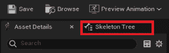

图 2.13 – SK_Mannequin 骨骼树标签页

1.  在 **选项** 下，启用 **显示重定向选项** 设置：

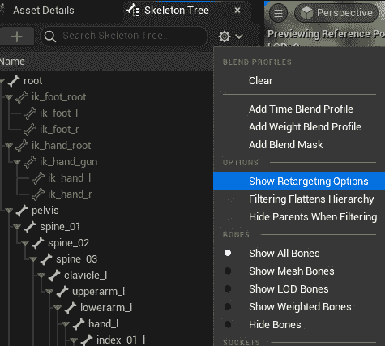

图 2.14 – 显示重定向选项

1.  现在，在骨骼树中，将 `spine_01`、`thigh_l` 和 `thigh_r` 骨折调整到适当大小以增强可见性。

1.  现在，选择 `spine_01`、`thigh_l` 和 `thigh_r` 骨折。右键单击它们，在菜单中点击 **递归设置平移重定向骨骼** 按钮。这将解决我们之前遇到的骨骼平移问题。

1.  重新打开 `ThirdPersonIdle` 动画以验证悬垂手臂已被修复：

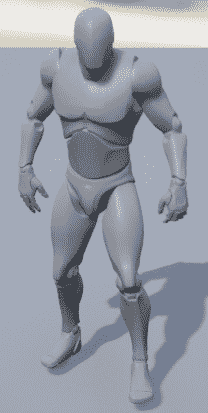

图 2.15 – 修复后的 ThirdPersonIdle 动画

注意

您可以通过以下链接访问 GitHub 上的完整练习代码文件，位于`Chapter02` | `Exercise2.03` | `Ex2.03-Completed.rar`目录：[`packt.live/2U8AScR`](https://packt.live/2U8AScR)。

解压`.rar`文件后，双击`.uproject`文件。您将看到一个提示要求“现在要重建吗？”。点击提示中的“是”，以便它构建必要的中间文件，之后应该会自动在 Unreal 编辑器中打开项目。

通过完成这个练习，你已经理解了如何导入资源，更具体地说，是将 FBX 骨骼网格和动画数据导入到你的项目中。这对于许多游戏开发者的工作流程至关重要，因为资源是整个游戏的基石。

在下一节中，我们将探讨创建游戏所需的 Unreal 核心类，它们对于创建游戏或体验的重要性，以及如何在项目中使用它们。

# Unreal 游戏模式类

考虑一种情况，你想能够暂停你的游戏。所有必要的逻辑和实现，以便能够暂停游戏，都将放置在一个单独的类中。这个类将负责处理玩家进入游戏时的游戏流程。游戏流程可以是游戏中的任何动作或一系列动作。例如，游戏暂停、播放和重新开始被认为是简单的游戏流程动作。同样，在多人游戏的情况下，我们需要将所有与网络相关的游戏逻辑放在一起。这正是游戏模式类存在的目的。

游戏模式是一个驱动游戏逻辑并强制对玩家施加游戏相关规则的类。它本质上包含有关正在进行的当前游戏的信息，包括游戏变量和事件，这些将在本章后面提到。游戏模式可以包含所有游戏对象的管理器，它是一个单例类，并且可以被游戏中存在的任何对象或抽象类访问。

与所有其他类一样，游戏模式类可以在蓝图或 C++中扩展。这可以做到包括可能需要包含的额外功能和逻辑，以使玩家了解游戏内部发生的情况。

让我们回顾一些在游戏模式类内部的示例游戏逻辑：

+   限制允许进入游戏玩家的数量

+   控制新连接玩家的出生点和玩家控制器逻辑

+   跟踪游戏得分

+   跟踪游戏胜利/失败条件

+   实现游戏结束/重新开始游戏场景

在下一节中，我们将查看游戏模式提供的默认类。

## 游戏模式默认类

除了自身之外，游戏模式使用几个类来实现游戏逻辑。它允许您指定以下默认类：

+   **游戏会话类**：处理管理员级别的游戏流程，如登录批准。

+   **游戏状态类**：处理游戏状态，以便客户端可以看到游戏内部发生的情况。

+   **玩家控制器类**：用于控制角色的主要类。它可以被视为一个大脑，决定要做什么。

+   **玩家状态类**：存储游戏内玩家的当前状态。

+   **用户界面类**：处理显示给玩家的用户界面。

+   **默认角色类**：玩家控制的主要演员。这实际上是玩家角色。

+   `DefaultPawn`类，`SpectatorPawn`类指定负责观看游戏的角色。

+   **回放观众玩家控制器**：负责在游戏回放期间操纵回放的玩家控制器。

+   **服务器统计信息复制器类**：负责复制服务器统计信息网络数据。

您可以使用默认类直接使用，或者指定自己的类以进行自定义实现和行为。这些类将与游戏模式协同工作，并会自动运行，无需放置在世界中。

## 游戏事件

在多人游戏方面，当许多玩家进入游戏时，处理逻辑以允许他们进入游戏并保持他们的状态，以及查看其他玩家的状态和处理他们的交互变得至关重要。

游戏模式为您提供了几个可以覆盖的事件，用于处理此类多人游戏逻辑。以下事件对于网络功能和能力特别有用（它们主要用于）：

+   `登录后执行`：此事件在玩家成功登录游戏后调用。从这一点开始，可以在`Player Controller`类上安全地调用复制逻辑（用于多人游戏中的网络）。

+   `处理新玩家启动`：此事件在`登录后执行`事件之后调用，可以用来定义新进入的玩家会发生什么。默认情况下，它为新连接的玩家创建一个角色。

+   `在变换处生成默认角色`：此事件触发游戏中的实际角色生成。新连接的玩家可以在特定的变换处或预设的玩家起始位置（可以通过将**模型**窗口中的`Player Start`拖放到世界中添加）生成。

+   `登出时执行`：当玩家离开游戏或被销毁时调用此事件。

+   `重启玩家`：此事件用于重生玩家。类似于`SpawnDefaultPawnAtTransform`，玩家可以在特定的变换处或预指定的位置重生（使用玩家起始位置）。

## 网络通信

游戏模式类不会复制到任何客户端或加入的玩家。其作用域仅限于在服务器上生成的地方。本质上，客户端-服务器模型规定客户端仅作为在服务器上玩的游戏的输入进行操作。因此，游戏逻辑不应存在于客户端；它应仅存在于服务器上。

## GameModeBase 与游戏模式

从 4.14 版本开始，Epic 引入了`AGameModeBase`类，该类作为所有游戏模式类的父类。它本质上是一个`AGameMode`类的简化版本。

然而，游戏模式类包含一些额外的功能，这些功能更适合多人射击游戏，因为它实现了`Match State`概念。默认情况下，游戏模式基类包含在新模板项目的基础上。

游戏模式还包含一个状态机，用于处理和跟踪玩家的状态。

现在你对游戏模式和相关的类有了些了解，在下一节中，你将学习关于级别和级别蓝图，以及它们如何与游戏模式类相关联。

# 理解级别和级别蓝图

在游戏中，级别是游戏的部分或部分。由于许多游戏相当大，它们被分解成不同的级别。一个级别的兴趣被加载到游戏中供玩家游玩。当玩家完成该级别后，另一个级别可能会被加载进来（同时当前级别将被加载出去），以便玩家可以继续游戏。为了完成游戏，玩家通常需要完成一组特定的任务才能进入下一级别，最终完成游戏。

游戏模式可以直接应用于级别。当级别加载时，它将使用分配的游戏模式类来处理该特定级别的所有逻辑和游戏玩法，并覆盖该级别的项目游戏模式。这可以通过在打开级别后使用**世界设置**选项卡来实现。

级别蓝图是一个在级别内运行的蓝图，但不能在级别范围外访问。可以通过`Get Game Mode`节点在任何蓝图（包括级别蓝图）中访问游戏模式。这可以稍后转换为你的游戏模式类，以获取对其的引用。

注意

一个级别只能分配一个游戏模式类。然而，一个游戏模式类可以被分配给多个级别，以模仿类似的功能和逻辑。

## Unreal Pawn 类

在 Unreal 中，`Pawn`类是可以被控制（无论是玩家还是 AI）的最基本的演员类。它还以图形方式表示游戏中的玩家/机器人。这个类内部的代码应该与游戏实体有关的一切，包括交互、移动和技能逻辑。在游戏中，玩家在任何时候只能控制一个`Pawn`。此外，玩家可以在游戏过程中*解除控制*一个`Pawn`并*控制*另一个`Pawn`。

### 默认 Pawn 类

Unreal Engine 为开发者提供了一个`DefaultPawn`类（它继承自基本`Pawn`类）。在`Pawn`类之上，这个类包含额外的代码，允许它在世界中移动，就像在游戏编辑器版本中一样。

### 观众 Pawn 类

一些游戏提供观看游戏的功能。比如说，你正在等待一个朋友完成他们的游戏然后加入你，所以你先去观看他们的游戏。这允许你通过一个可以移动以获得玩家或游戏视图的相机来观察玩家正在玩的游戏。一些游戏还提供可以回溯时间的观看模式，以显示游戏过去发生的特定动作或游戏中的任何一点。

如其名所示，这是一种特殊的兵类型，它提供了观看游戏的示例功能。它包含所有必需的基本工具（例如，观众兵移动组件），以便执行此操作。

## Unreal 玩家控制器类

玩家控制器类可以被视为玩家。它本质上是一个兵的 *灵魂*。玩家控制器从用户那里获取输入并将其传递给兵和其他类，以便玩家与游戏进行交互。然而，在处理这个类时，你必须注意以下几点：

+   与兵不同，在关卡中只能有一个玩家控制器代表玩家。（这就像当你乘坐电梯时一样。当你在一个电梯内时，你只能控制那个电梯，但你可以离开它并进入另一个电梯来控制那个电梯。）

+   玩家控制器在整个游戏过程中持续存在，但兵可能不会（例如，在战斗游戏中，玩家角色可能会死亡并重生，但玩家控制器会保持不变）。

+   由于兵是临时的，而玩家控制器是永久的，开发者需要记住哪些代码应该添加到哪个类中。

让我们通过下一个练习更好地理解这一点。

## 练习 2.04 – 设置游戏模式、玩家控制器和兵类

此练习将使用我们在 *练习 2.01 – 创建一个空的 C++ 项目* 中创建的空白项目。我们将向游戏中添加我们的游戏模式、玩家控制器和 `Pawn` 类，并测试我们的代码在蓝图中的工作情况。

按照以下步骤完成此练习：

1.  打开我们在 *练习 2.01 – 创建一个空的 C++ 项目* 中创建的项目。

1.  在 **内容浏览器** 区域内右键单击并选择 **蓝图类**。

1.  在 **所有类** 部分下，找到并选择 **游戏模式**：

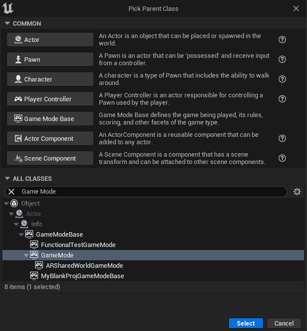

图 2.16 – 选择游戏模式类

1.  将其名称设置为 `BP_MyGameMode`。

1.  重复 *步骤 2* 到 *4* 并从 `BP_MyPawn` 下选择 `Pawn` 类。

1.  重复 *步骤 2* 到 *4* 并在 `BP_MyPC` 下选择 `Player Controller` 类：

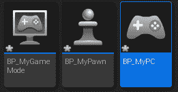

图 2.17 – 游戏模式、兵和玩家控制器名称

1.  打开 `BP_MyGameMode` 并打开 **事件图** 选项卡：

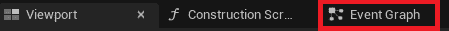

图 2.18 – 蓝图中的事件图选项卡

1.  在`Event BeginPlay`节点中的白色针上左键单击并拖动，然后释放**左鼠标按钮**以打开`print`并选择列表中突出显示的`print`节点：

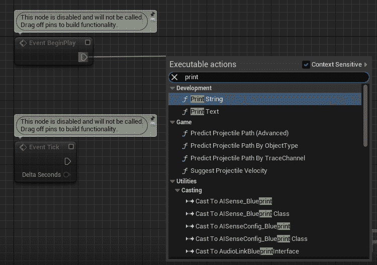

图 2.19 – 打印字符串节点（蓝图）

1.  在放置在`In String`参数下的结果`Print String`节点中，键入`My Game Mode has started!`。

1.  现在，请在上面的菜单栏中按下**编译**和**保存**按钮。

1.  对于`BP_MyPawn`和`BP_MyPC`类，重复*步骤 7*到*10*，将`In String`参数分别设置为`My Pawn has started!`和`My PC has started!`。

1.  最后，通过在编辑器的右侧单击设置并单击**世界设置**来打开**世界设置**选项卡：

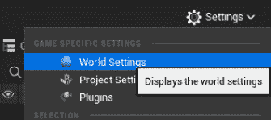

图 2.20 – 世界设置

1.  在**游戏模式**部分，使用下拉菜单将**游戏模式覆盖**、**默认角色类**和**玩家控制器类**选项设置为相应的类：

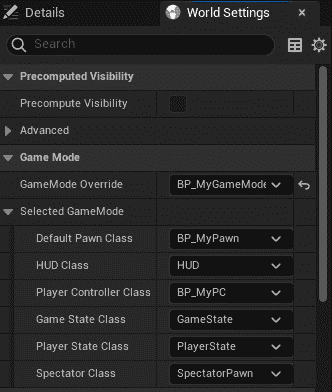

图 2.21 – 世界设置和游戏模式设置

1.  点击**播放**来播放你的游戏，并查看顶部的三个打印语句。这意味着当前的**游戏模式覆盖**、**默认角色类**和**玩家控制器类**选项已设置为指定的类，并且正在运行它们的代码：

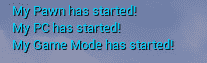

图 2.22 – 输出打印

注意

你可以在 GitHub 上的`Chapter02` | `Exercise2.04` | `Ex2.04-Completed.rar`目录中找到完成的练习代码文件，网址为[`packt.live/3k7nS1K`](https://packt.live/3k7nS1K)。

解压`.rar`文件后，双击`.uproject`文件。你将看到一个提示要求`Would you like to rebuild now?`。在该提示中点击**是**，以便它构建必要的中间文件，之后它应该会自动在 Unreal 编辑器中打开项目。

现在你已经了解了基本类及其在 Unreal 中的工作方式，在下一节中，我们将探讨动画，涉及哪些过程以及如何完成它们。之后，我们将进行一个练习。

# 使用动画

动画对于为游戏增添生命和丰富性至关重要。出色的动画是区分普通游戏与优秀和卓越游戏的主要因素之一。视觉保真度是保持玩家对游戏兴奋和沉浸感的原因，因此动画是所有在 Unreal Engine 中创建的游戏和体验的核心部分。

注意

本章旨在介绍动画基础知识。更深入的方法将在*第十一章**，使用 1D 混合空间、按键绑定和状态机*中进行。

## 动画蓝图

动画蓝图是一种特定的蓝图，允许您控制骨骼网格的动画。它为用户提供了一个专门用于动画相关任务的图形。在这里，您可以定义计算骨骼姿态的逻辑。

注意

骨骼网格是一种基于骨骼的网格，其中包含骨骼，所有骨骼共同作用以赋予网格形状，而静态网格（正如其名所示）是一种不可动画化的网格。骨骼网格通常用于角色和逼真的物体（例如，玩家英雄），而静态网格用于基本或无生命的物体（例如，墙壁）。

动画蓝图提供两种类型的图：`EventGraph`和`AnimGraph`。

## 事件图

动画蓝图中的事件图提供了与动画相关的设置事件，正如我们在*第一章*，*Unreal Engine 简介*中学到的，可用于变量操作和逻辑。事件图主要用于动画蓝图内更新混合空间值，这反过来又驱动了`AnimGraph`中的动画。这里使用最常见的事件如下：

+   `Event Blueprint Initialize Animation`：用于初始化动画。

+   `Event Blueprint Update Animation`：此事件每帧执行一次，允许开发者执行计算并按要求更新其值：

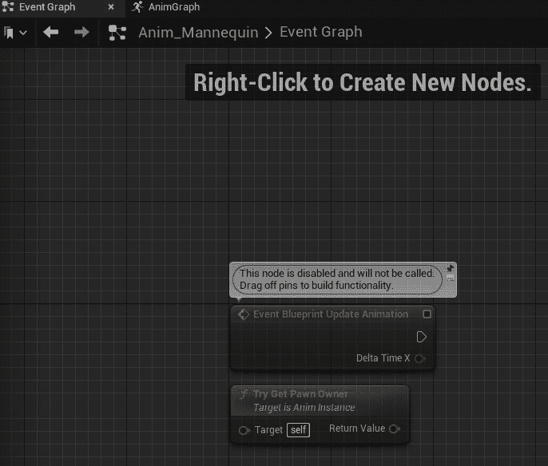

图 2.23 – 动画事件图

在前面的屏幕截图中，您可以看到默认的事件图。这里包含了`Event Blueprint Update Animation`和`Try Get Pawn Owner`节点。您创建了新的节点并将它们附加到图中以完成*练习 2.04 – 设置游戏模式、玩家控制器和角色类*中的某些有意义任务。

## 动画图

动画图专门用于播放动画并在每帧基础上输出骨骼的最终姿态。它为开发者提供了执行不同逻辑的特殊节点。例如，`Blend`节点接受多个输入，并用于决定当前正在执行的输入。这个决定通常依赖于某些外部输入（例如，alpha 值）。

动画图通过评估节点，按照节点上使用的执行引脚之间的执行流程来工作。

在下面的屏幕截图中，您可以看到图中的一个单独的`Output Pose`节点。这是动画的最终姿态输出，将在游戏中的相关骨骼网格上可见。我们将在*练习 2.05 – 创建木偶动画*中使用它：

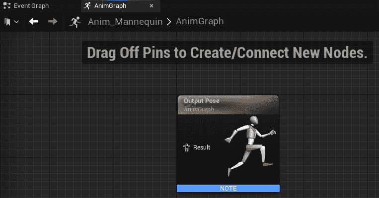

图 2.24 – 动画 AnimGraph

## 状态机

你已经学习了如何设置动画节点和逻辑，但还缺少一个基本组件。谁决定特定的动画或逻辑何时应该播放或执行？这就是状态机发挥作用的地方。例如，玩家可能需要从蹲姿切换到站立姿势，因此动画需要更新。代码将调用动画蓝图，访问状态机，并让它知道动画的状态需要改变，从而实现平滑的动画转换。

状态机由状态和规则组成，可以将其视为描述动画的状态。状态机在特定时间总处于一个状态。当满足某些条件（由规则定义）时，从一个状态到另一个状态的转换就会执行。

## 转换规则

每个转换规则都包含一个名为 `Result` 的布尔节点。如果布尔值为真，则可以发生转换，反之亦然：

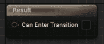

图 2.25 – 转换规则

## 混合空间

当你提供了一组动画时，你可以创建一个状态机并运行这些动画。然而，当你需要从一个动画转换到另一个动画时，会出现问题。如果你简单地切换动画，由于新动画的起始姿势可能与旧动画的结束姿势不同，它将出现故障。

混合空间是特殊资产，用于根据它们的 alpha 值在不同的动画之间进行插值。这反过来消除了故障问题，并在两个动画之间进行插值，导致动画快速而平滑地变化。

混合空间可以创建在一维，称为混合空间 1D，或二维，称为混合空间。它们分别基于一个或两个输入（参数）混合任意数量的动画。

练习 2.05 – 创建一个人体模型动画

现在您已经了解了与动画相关的多数概念，我们将通过向默认人体模型添加一些动画逻辑来亲自动手。我们将创建一个混合空间 1D、一个状态机和动画逻辑。

我们的目标是创建一个角色跑步动画，从而深入了解动画的工作原理，以及它们如何在 3D 世界中绑定到实际角色上。

按照以下步骤完成此练习：

1.  下载并解压 `Chapter02` | `Exercise2.05` | `ExerciseFiles` 目录的所有内容，该目录可以在 GitHub 上找到。您可以将这些内容解压到您在计算机上使用的任何目录中。

注意

`ExerciseFiles` 目录可以在以下链接的 GitHub 上找到：[`github.com/PacktPublishing/Game-Development-Projects-with-Unreal-Engine/tree/master/Chapter02/Exercise2.05/ExerciseFiles`](https://github.com/PacktPublishing/Game-Development-Projects-with-Unreal-Engine/tree/master/Chapter02/Exercise2.05/ExerciseFiles)。

1.  双击 `CharAnim.uproject` 文件以启动项目。

1.  按 **播放**。使用键盘的 *W*、*A*、*S* 和 *D* 键进行移动，使用空格键跳跃。注意，目前，模特上没有动画。

1.  在 `Content` 文件夹中，浏览到 `Content` | `Mannequin` | `Animations`。

1.  右键单击 `Content` 文件夹，然后从 `Animation` 部分选择 `Blend Space 1D`。

1.  选择 `UE4_Mannequin_Skeleton`。

1.  将新创建的文件重命名为 `BS_IdleRun`。

1.  双击 `BS_IdleRun` 以打开它。

1.  在 `Speed` 和 `375.0` 下方：

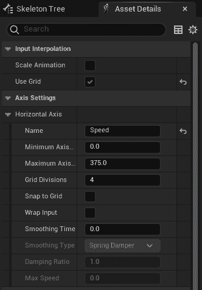

图 2.26 – Blend Space 1D – 轴设置

1.  转到 `5.0`。

1.  分别将 `ThirdPersonIdle`、`ThirdPersonWalk` 和 `ThirdPersonRun` 动画拖放到图中：

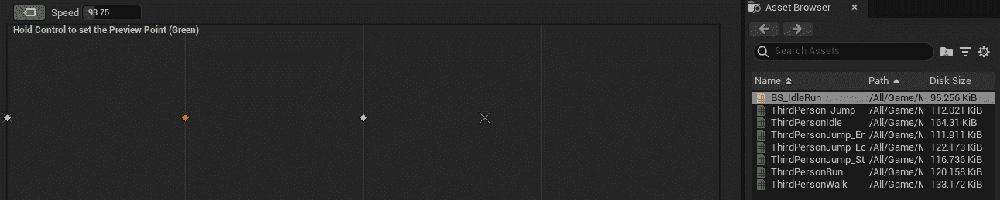

图 2.27 – Blend Space 预览器

1.  在 **资产详情** 选项卡下，在 **Blend 样本** 中设置以下变量值：

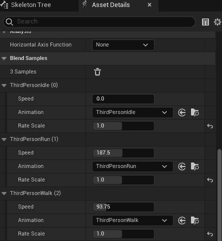

图 2.28 – Blend 样本

1.  点击 **保存** 并关闭此 **资产**。

1.  右键单击 `Content` 文件夹，然后从 `Animation Blueprint`。

1.  在 `UE4_Mannequin_Skeleton` 中然后点击 **确定** 按钮：

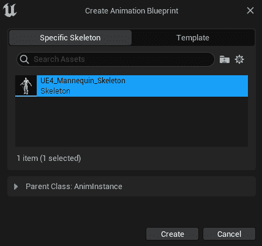

图 2.29 – 创建动画蓝图资产

1.  将文件命名为 `Anim_Mannequin` 并按 *Enter*。

1.  双击新创建的 `Anim_Mannequin` 文件。

1.  接下来，转到 **Event Graph** 选项卡。

1.  通过点击左下角的变量部分中的 **+** 图标创建一个名为 `IsInAir?` 的布尔变量。务必分配正确的类型：

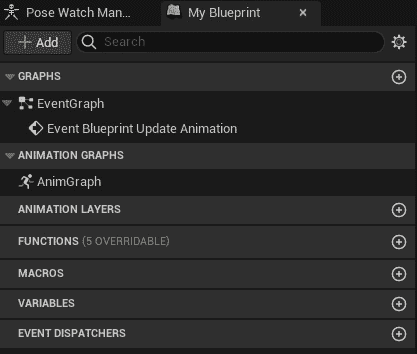

图 2.30 – 添加变量

1.  创建一个名为 `Speed` 的浮点变量。

1.  将 `Try Get Pawn Owner` 返回值节点拖出，并输入 `Is Valid`。选择下面的一个：

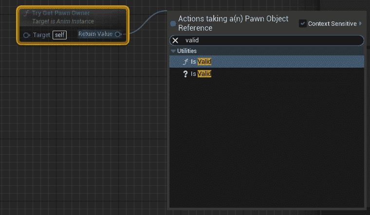

图 2.31 – 事件图 Is Valid 节点

1.  将 `Event Blueprint Update Animation` 节点的 `Exec` 插针连接到 `Is Valid` 节点：

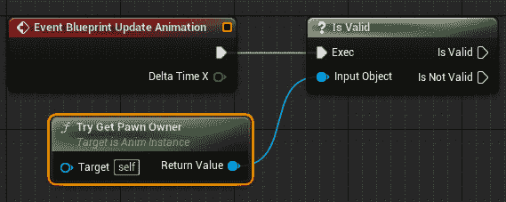

图 2.32 – 连接节点

1.  从 `Try Get Pawn Owner` 节点，使用 `Get Movement Component` 节点。

1.  从步骤 22 中获得的节点获取 `Is Falling` 节点，并将布尔返回值连接到 `Is in Air?` 布尔设置的节点。将 `SET` 节点的执行插针连接到 `Is Valid` 执行插针：

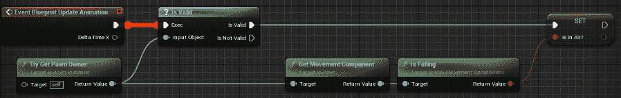

图 2.33 – 在空中布尔设置

1.  从 `Try Get Pawn Owner` 节点，使用 `Get Velocity` 节点，获取其 `VectorLength`，并将输出连接到 `Speed` 的 `A Variable Set` 节点：

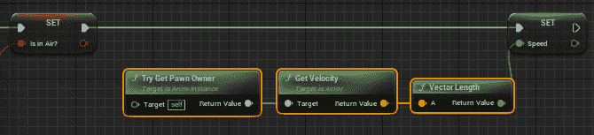

图 2.34 – 速度布尔设置

1.  接下来，转到 **Anim Graph** 选项卡。

1.  右键单击 `state machine` 内的任何位置，然后点击 **添加新状态机**：

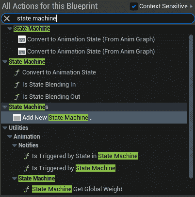

图 2.35 – 添加新状态机的选项

1.  确保节点被选中，然后按 *F2* 键将其重命名为 `MannequinStateMachine`。

1.  将 `MannequinStateMachine` 的输出引脚连接到 `Output Pose` 节点的输入引脚，并点击顶部栏上的 **编译** 按钮：

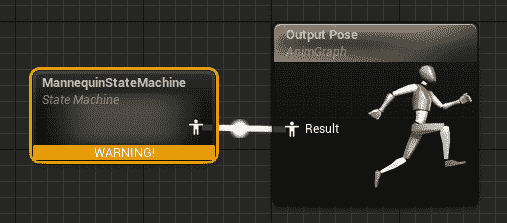

图 2.36 – 在输出姿态节点中配置状态机结果

1.  双击 `MannequinstateMachine` 节点进入状态机。您将看到一个 `Entry` 节点。将要连接到它的状态将成为模型的默认状态。在这个练习中，这将是我们 `Idle Animation`。

1.  在状态机内部空白区域右键单击，从菜单中选择 `Idle/Run`。

1.  从 `Entry` 文字旁边的图标拖动，指向 `Idle/Run` 节点内部，然后释放以连接它：

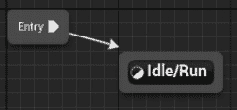

图 2.37 – 将附加状态连接到入口

1.  双击 `Idle/Run` 状态以打开它。

1.  从 `BS_IdleRun` 动画到图中。从左侧的 **变量** 部分获取 `Speed` 变量并将其连接，如图所示：

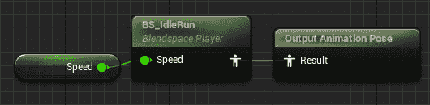

图 2.38 – 空闲/运行状态设置

1.  通过点击顶部横幅中的其面包屑回到 `MannequinStateMachine`：

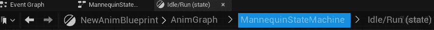

图 2.39 – 状态机导航面包屑

1.  从 `ThirdPersonJump_Start` 动画到图中。将其重命名为 `Jump_Start`。

1.  对 `ThirdPersonJump_Loop` 和 `ThirdPerson_Jump` 重复 *步骤 35* 并分别重命名为 `Jump_Loop` 和 `Jump_End`：

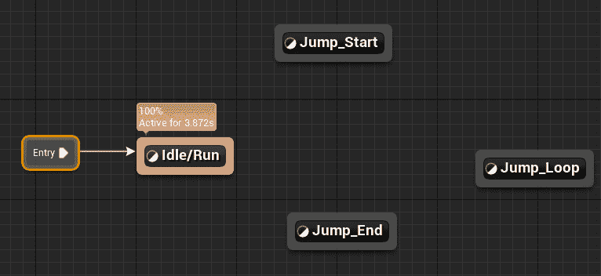

图 2.40 – 状态设置

1.  打开 `Jump_Start` 状态。点击 `Play ThirdPersonJump_Start` 节点。在 `设置` 部分取消勾选 `Loop Animation`。

1.  打开 `Jump_Loop` 状态并点击 `Play ThirdPersonJump_Loop` 节点。将 `Play Rate` 设置为 `0.75`。

1.  打开 `Jump_End` 状态并点击 `Play ThirdPerson_Jump` 节点。取消勾选布尔值 `Loop Animation`。

1.  由于我们可以从 `Idle/Run` 切换到 `Jump_Start`，从 `Idle/Run` 状态拖动并将其放到 `Jump_Start` 状态。同样，`Jump_Start` 引导到 `Jump_Loop`，然后到 `Jump_End`，最后回到 `Idle/Run`。

拖放箭头以设置状态机，如下所示：

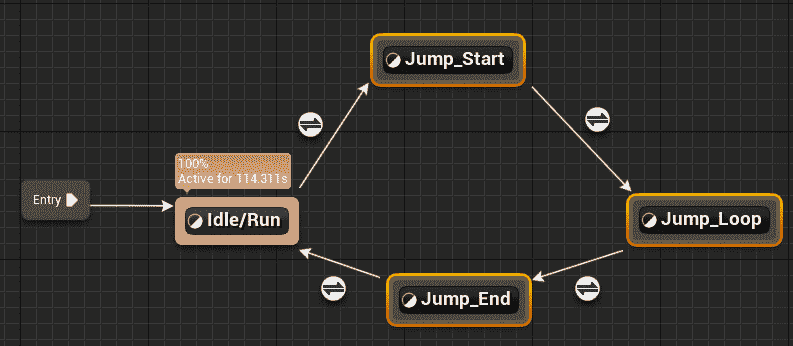

图 2.41 – 状态连接

1.  双击 `Idle/Run` 到 `Jump_Start` 转换规则图标，并将 `Is in Air?` 变量的输出连接到结果：

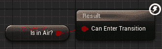

图 2.42 – 空闲/运行到 Jump_Start 转换规则设置

1.  打开从 `Jump_Start` 到 `Jump_Loop` 的转换规则。获取 `ThirdPersonJump_Start` 的 `Time Remaining (ratio)` 节点并检查它是否小于 `0.1`。将得到的布尔值连接到结果：

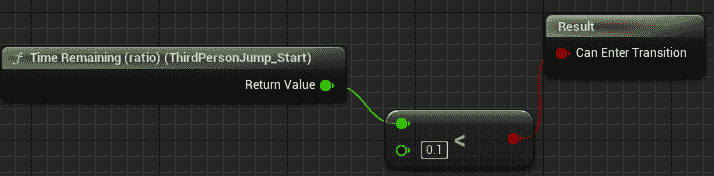

图 2.43 – 从 Jump_Start 到 Jump_End 转换规则设置

1.  打开从 `Jump_Loop` 到 `Jump_End` 的转换规则。将 `Is in Air?` 变量的逆输出连接到结果：

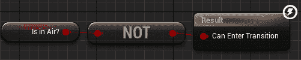

图 2.44 – 从 Jump_Loop 到 Jump_End 转换规则设置

1.  打开从 `Jump_End` 到 `Idle/Run` 的转换规则。获取 `ThirdPerson_Jump` 的 `Time Remaining (ratio)` 节点并检查它是否小于 `0.1`。将得到的布尔值连接到结果：

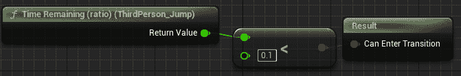

图 2.45 – 从 Jump_End 到 Idle/Run 转换规则设置

1.  关闭动画蓝图。

1.  在 `Content` 文件夹中，浏览到 `Content` | `ThirdPersonBP` | `Blueprints` 并打开 `ThirdPersonCharacter` 蓝图。

1.  在 **组件** 选项卡中选择 `Mesh`：

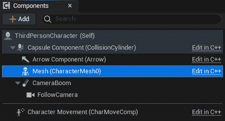

图 2.46 – 网格组件

1.  在你创建的 `Animation Blueprint` 类中：

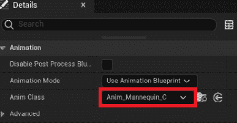

图 2.47 – 在骨骼网格组件中指定动画蓝图

1.  关闭蓝图。

1.  再次玩游戏并注意动画。

你应该已经实现了以下输出。如图所示，我们的角色正在跑步，并且正在显示跑步动画：

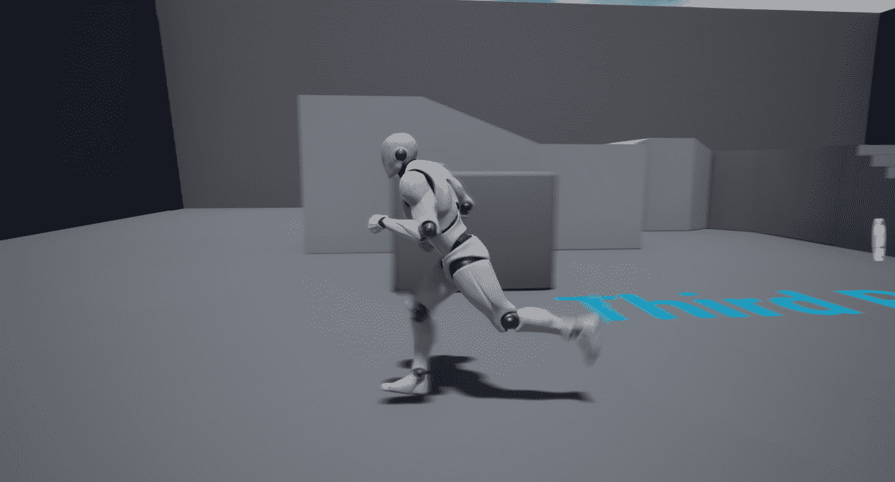

图 2.48 – 角色跑步动画

注意

你可以在 GitHub 上的 `Chapter02` | `Exercise2.05` | `Ex2.05-Completed.rar` 目录中找到完整的练习代码文件，链接为 [`packt.live/3kdIlSL`](https://packt.live/3kdIlSL)。

解压 `.rar` 文件后，双击 `.uproject` 文件。你将看到一个提示要求 `Would you like to rebuild now?`。点击该提示中的 `Yes`，以便它构建必要的中间文件，之后它应该会自动在 Unreal 编辑器中打开项目。

通过完成这个练习，你了解了如何创建状态机、1D 混合空间、动画蓝图，以及如何将它们与角色的骨骼网格结合在一起。你还处理了播放速率、过渡速度和过渡状态，帮助你理解动画世界的复杂联系。

我们从这个部分开始，通过了解状态机如何表示和在不同动画状态之间转换来启动本节。接下来，我们学习了如何使用一维混合空间在这些转换之间进行混合。所有这些都被动画蓝图用来决定角色的当前动画。现在，让我们在一个活动中结合所有这些概念。

## 活动二.01 – 将动画链接到角色

假设，作为一个虚幻游戏开发者，你被提供了一个角色骨骼网格及其动画，并且你被分配了一个将它们集成到项目中的任务。为了做到这一点，在这个活动中，你将创建一个新角色的动画蓝图、状态机和一维混合空间。通过完成这个活动，你应该能够使用虚幻引擎中的动画并将它们链接到骨骼网格。

这个活动的项目文件夹包含一个 `Ganfault`。

注意

这个角色及其动画是从 [mixamo.com](http://mixamo.com) 下载的。这些已经被放置在本书的 GitHub 仓库的 `内容` | `Ganfault` 文件夹中：[`packt.live/35eCGrk`](https://packt.live/35eCGrk)。

*Mixamo.com* 是一个销售带有动画的 3D 角色的网站，它类似于 3D 模型的资产市场。它还包含了一个免费模型库，以及付费模型。

按照以下步骤完成这个活动：

1.  为行走/跑步动画创建一个一维混合空间并设置动画蓝图。

1.  接下来，转到 `内容` | `ThirdPersonBP` | `蓝图` 并打开 `ThirdPersonCharacter` 蓝图。

1.  点击左侧的骨骼网格组件，并在 `SkeletalMesh` 引用中的 `Ganfault` 内部。

1.  同样，更新 `Ganfault`。

注意

对于状态机，只需实现空闲/跑和跳跃状态。

一旦你完成了这个活动，行走/跑步和跳跃动画应该能够正常工作，如下面的输出所示：

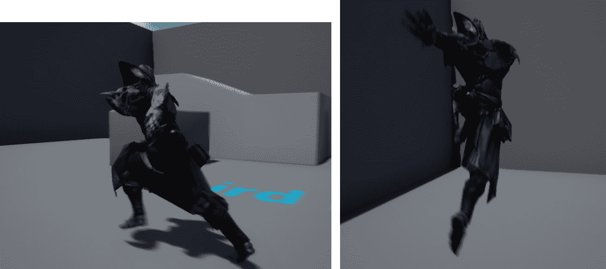

图 2.49 – 活动二.01 预期输出（左：跑；右：跳）

注意

这个活动的解决方案可以在 GitHub 上找到：[`github.com/PacktPublishing/Elevating-Game-Experiences-with-Unreal-Engine-5-Second-Edition/tree/main/Activity%20solutions`](https://github.com/PacktPublishing/Elevating-Game-Experiences-with-Unreal-Engine-5-Second-Edition/tree/main/Activity%20solutions).

通过完成这个活动，你现在知道如何导航虚幻引擎的项目、调试代码以及处理动画。你还理解了状态机，它表示动画状态之间的转换以及在该转换中使用的 1D 混合空间。你现在可以根据游戏事件和输入向 3D 模型添加动画。

# 摘要

在本章中，我们学习了如何创建一个空项目。然后，我们了解了文件夹结构以及如何在项目目录中组织文件。之后，我们探讨了基于模板的项目。我们学习了如何在代码中设置断点，以便在游戏运行时观察变量值和调试整个对象，这有助于我们找到并消除代码中的错误。

之后，我们看到了 Game Mode、Player Pawn 和 Player Controller 是如何相关的类，它们在 Unreal Engine 中用于设置游戏流程（代码的执行顺序），以及它们如何在项目中设置。

最后，我们探讨了动画基础知识，并使用状态机、一维混合空间和动画蓝图来使我们的角色根据键盘输入在游戏中进行动画（行走/跑步和跳跃）。

在本章中，我们更加熟悉了 Unreal Engine 中用于游戏开发的重要强大工具。Unreal 的 Game Mode 及其默认类是制作任何类型的游戏或体验在 Unreal Engine 中必需的。此外，动画为你的角色带来生命，并有助于为你的游戏增加沉浸感。所有游戏工作室都有动画、角色和游戏逻辑，因为这些是驱动任何游戏的核心组件。这些技能将在你的游戏开发之旅中多次帮助你。

在下一章中，我们将讨论 Unreal Engine 中的`Character`类，其组件以及如何扩展该类以进行额外设置。你将进行各种练习，然后是一个活动。
