# 角色类组件和蓝图设置

在上一章中，我们学习了如何创建空项目、导入文件、使用哪种文件夹结构以及如何处理动画。在本章中，我们将探讨一些其他关键工具和功能，这些工具和功能是您在使用虚幻引擎时将与之合作的内容。

游戏开发者经常需要使用某些工具，这些工具在构建游戏功能时可以节省他们时间和精力。虚幻引擎强大的对象继承功能为开发者提供了他们需要的优势，使他们更加高效。开发者还可以在 C++ 和蓝图之间自由切换，并在游戏开发中充分利用它们。

开发者获得的其他增值好处之一是能够扩展代码以供项目后期使用。假设您的客户有新的需求，这些需求建立在旧需求的基础上（这在大多数游戏工作室中很常见）。现在，为了扩展功能，开发者只需继承一个类，并添加更多功能以快速获得结果。这非常强大，并且在许多情况下都很有用。

本章将重点介绍 C++ 中的 `Character` 类。您将学习如何扩展 C++ 中的 `Character` 类，然后通过继承在蓝图进一步扩展这个新创建的 `Character` 类。您还将处理玩家输入和一些移动逻辑。我们将讨论虚幻引擎的 `Character` 类，创建 C++ 代码，然后在蓝图中进行扩展，最后使用它来创建游戏中的角色。

在本章中，我们将涵盖以下主题：

+   虚幻 `Character` 类

+   使用蓝图扩展 C++ 类

到本章结束时，您将了解 UE5 中类继承的工作原理以及如何利用它来获得优势。您还将能够处理轴映射和动作输入映射，这些在驱动玩家相关输入逻辑中至关重要。

# 技术要求

本章的技术要求如下：

+   虚幻引擎 5 已安装

+   Visual Studio 2019 已安装

本章的完整代码可以从 GitHub 下载，网址为 [`github.com/PacktPublishing/Elevating-Game-Experiences-with-Unreal-Engine-5-Second-Edition`](https://github.com/PacktPublishing/Elevating-Game-Experiences-with-Unreal-Engine-5-Second-Edition)。

# 虚幻角色类

在我们讨论虚幻引擎的 `Character` 类之前，让我们简要地谈谈继承的概念。如果您习惯于使用 C++ 或其他类似的语言，您应该已经熟悉这个概念。继承是一个类从另一个类继承特性和行为的过程。一个 C++ 类可以被扩展以创建一个新的类——一个派生类——它保留了基类的属性，并允许修改这些属性或添加新特性。`Character` 类就是一个例子。

`Character`类是一种特殊的 pawn 类型，是 Unreal `Pawn`类的后代。在`Pawn`类的基础上扩展，`Character`类默认具有一些运动能力，以及一些为角色添加运动的输入。按照标准，`Character`类为用户提供在创建的世界中使角色行走、奔跑、跳跃、飞行和游泳的能力。

由于`Character`类是`Pawn`类的扩展，它包含所有 pawn 的代码/逻辑，开发者可以扩展此类以添加更多功能。当扩展`Character`类时，其现有组件作为继承组件（在这种情况下，是胶囊、箭头和网格组件）被带到扩展类中。

注意

继承的组件不能被删除。它们的设置可以更改，但添加到基类的组件将始终存在于扩展类中。在这种情况下，基类是`Pawn`类，而扩展（或子）类是`Character`类。

`Character`类提供了以下继承组件：

+   **胶囊组件**：这是作为其他组件在层次结构中附加到的“原点”的根组件。此组件也可以用于碰撞，并以胶囊的形式逻辑上概述许多角色形式（尤其是人类角色）。

+   游戏开始时`hide`，但可以进行调整以使其可见。如果需要，此组件对于调试和调整游戏逻辑可能很有用。

+   `Character`类。在这里可以设置角色将采取的骨骼网格形式，以及所有相关变量，包括动画、碰撞等。

大多数开发者通常更喜欢用 C++编写游戏和角色逻辑，并将该类扩展到蓝图，以便他们可以执行其他简单任务，例如将资产连接到类。例如，开发者可能创建一个从`Character`类继承的 C++类，在该类中编写所有运动和跳跃逻辑，然后使用蓝图扩展此类，其中开发者更新组件以使用所需的资产（如骨骼网格和动画蓝图），并且可选地在蓝图中添加额外的功能。

### 扩展`Character`类

当`Character`类被 C++或蓝图继承时，它会被扩展。这个扩展的`Character`类将是`Character`类的子类（它将被称为其父类）。扩展类是面向对象编程的强大功能之一，类可以被扩展到很深的层次和层级。

### 练习 3.01 – 创建和设置第三人称`Character` C++类

在这个练习中，你将创建一个基于`Character`类的 C++类。你还将初始化将设置在扩展此`Character`类的类的默认值中的变量。

按照以下步骤完成此练习：

1.  启动 Unreal Engine，选择 **游戏** 类别，然后点击 **下一步** 按钮。

1.  选择 **空白** 并点击 **下一步** 按钮。

1.  选择 `MyThirdPerson`，选择一个合适的项目目录，然后点击 **创建项目** 按钮。

1.  在 **内容浏览器** 区域右键单击，然后点击 **新建 C++类** 按钮。

1.  在打开的对话框中，选择 `Character` 作为类类型，然后点击 **下一步** 按钮。

1.  命名为 `MyThirdPersonChar` 并点击 **创建类** 按钮。

1.  执行此操作后，Visual Studio 将打开 `MyThirdPersonChar.cpp` 和 `MyThirdPersonChar.h` 选项卡。

注意

在某些系统上，您可能需要以管理员权限运行 Unreal Engine 编辑器，以自动打开包含新创建的 C++ 文件的 Visual Studio 解决方案。

1.  打开 `MyThirdPersonChar.h` 选项卡，并在 `GENERATED_BODY()` 文本之下添加以下代码：

    ```cpp
    // Spring arm component which will act as a 
    // placeholder for 
    // the player camera. This component is recommended to // be used as it automatically controls how the 
    //camera handles situations
    // where it becomes obstructed by geometry inside the 
    // level, etc
    UPROPERTY(VisibleAnywhere, BlueprintReadOnly, Category = 
      MyTPS_Cam, meta = (AllowPrivateAccess = "true"))
    class USpringArmComponent* CameraBoom;
    // Follow camera
    UPROPERTY(VisibleAnywhere, BlueprintReadOnly, Category = 
      MyTPS_Cam, meta = (AllowPrivateAccess = "true"))
    class UCameraComponent* FollowCamera;
    ```

在前面的代码中，我们声明了两个组件：`Camera` 组件本身和 `Camera boom`，它作为距离玩家一定距离的相机占位符。这些组件将在构造函数中的 *第 11 步* 初始化。

1.  在 `MyThirdPersonChar.h` 文件中，在 `#include “CoreMinimal.h”` 之下添加以下 `#include` 语句：

    ```cpp
    #include "GameFramework/SpringArmComponent.h"
    #include "Camera/CameraComponent.h"
    ```

1.  现在，转到 `MyThirdPersonChar.cpp` 选项卡，并在 `#include MyThirdPersonChar.h` 代码之后添加以下 `#include` 语句：

    ```cpp
    #include "Components/CapsuleComponent.h"
    #include "GameFramework/CharacterMovementComponent.h"
    ```

前面的代码将相关类添加到类中，这意味着我们现在可以访问其方法和定义。

1.  在 `AMyThirdPersonChar::AMyThirdPersonChar()` 函数中，添加以下行：

    ```cpp
    // Set size for collision capsule
    GetCapsuleComponent()->InitCapsuleSize(42.f, 96.0f);
    // Don't rotate when the controller rotates. Let that // just 
      affect the camera.
    bUseControllerRotationPitch = false;
    bUseControllerRotationYaw = false;
    bUseControllerRotationRoll = false;
    // Configure character movement
    GetCharacterMovement()->bOrientRotationToMovement = true;
    // Create a camera boom (pulls in towards the 
      player if there is a collision)
    CameraBoom = 
      CreateDefaultSubobject<USpringArmComponent>(
      TEXT("CameraBoom"));
    CameraBoom->SetupAttachment(RootComponent);
    CameraBoom->TargetArmLength = 300.0f;
    CameraBoom->bUsePawnControlRotation = true; 
    // Create a camera that will follow the character
    FollowCamera = 
      CreateDefaultSubobject<UcameraComponent>(
      TEXT("FollowCamera"));
    FollowCamera->SetupAttachment(CameraBoom, 
      USpringArmComponent::SocketName);
    FollowCamera->bUsePawnControlRotation = false;
    ```

前面代码片段的最后一行将设置相机，使其旋转与 pawns 的旋转绑定。这意味着相机应该根据与该 pawn 关联的玩家控制器的旋转进行旋转。

1.  返回 Unreal Engine 项目并点击顶部栏上的 **编译** 图标按钮：

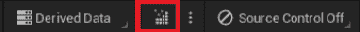

图 3.1 – Unreal Editor 顶部栏上的编译按钮

应该在右下角出现一个“Live coding succeeded”消息。

注意

您可以在 GitHub 上的 `Chapter03` | `Exercise3.01` 目录中找到完成的练习代码文件，网址为 [`github.com/PacktPublishing/Game-Development-Projects-with-Unreal-Engine/tree/master/Chapter03/Exercise3.01`](https://github.com/PacktPublishing/Game-Development-Projects-with-Unreal-Engine/tree/master/Chapter03/Exercise3.01)。

解压 `.rar` 文件后，双击 `.uproject` 文件。您将看到一个提示，询问“您现在要重建吗？”点击 **是** 以便它构建必要的中间文件，之后它应该自动在 Unreal Editor 中打开项目。

通过完成这个练习，你已经学会了如何扩展`Character`类。你还学会了如何初始化`Character`类的默认组件以及如何在 Unreal 编辑器内编译更新后的代码。接下来，你将学习如何扩展在蓝图中所创建的 C++类，以及为什么这在许多情况下是可行的。

# 使用蓝图扩展 C++类

如前所述，大多数开发者将 C++代码逻辑扩展到蓝图，以便将其与将要使用的资产链接起来。这样做是为了实现与在代码中查找和设置资产相比的简单资产分配。此外，它允许开发者使用诸如时间轴、事件和可用的宏等强大的蓝图功能，与他们的 C++代码结合使用，以实现使用 C++和蓝图开发的最佳效益。

到目前为止，我们已经创建了一个 C++ `Character`类。在其中，我们设置了组件和运动能力。现在，我们想要指定我们将在类中使用的资产，以及添加输入和运动能力。为此，使用蓝图扩展并设置选项会更简单。这就是我们将在下一个练习中要做的。

### 练习 3.02 – 使用蓝图扩展 C++

在这个练习中，你将学习如何使用蓝图扩展你创建的 C++类，以在现有的 C++代码之上添加蓝图代码。你还将添加输入键绑定，这将负责移动角色。

按照以下步骤完成这个练习：

1.  下载并解压 GitHub 上可找到的`Chapter03/Exercise3.02/ExerciseFiles`目录的内容。

注意

`ExerciseFiles`目录可以在 GitHub 上找到，链接为[`github.com/PacktPublishing/Game-Development-Projects-with-Unreal-Engine/tree/master/Chapter03/Exercise3.02/ExerciseFiles`](https://github.com/PacktPublishing/Game-Development-Projects-with-Unreal-Engine/tree/master/Chapter03/Exercise3.02/ExerciseFiles)。

1.  浏览到我们在“3.01 – 创建和设置第三人称 Character C++类”练习中创建的**MyThirdPerson**项目内的`Content`文件夹。

1.  将我们在*步骤 1*中创建的`MixamoAnimPack`文件夹复制并粘贴到我们在*步骤 2*中打开的`Content`文件夹目录中，如图所示：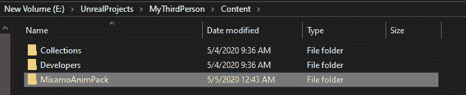

图 3.2 – MixamoAnimPack 放置在项目目录中

注意

`MixamoAnimPack`资产是通过以下链接从 Epic 市场获得的：[`www.unrealengine.com/marketplace/en-US/product/mixamo-animation-pack`](https://www.unrealengine.com/marketplace/en-US/product/mixamo-animation-pack)。

1.  打开项目。在“蓝图类”内部右键点击。

1.  在`GameMode`中，右键点击与名称匹配的类，然后点击**选择**按钮。查看以下截图：

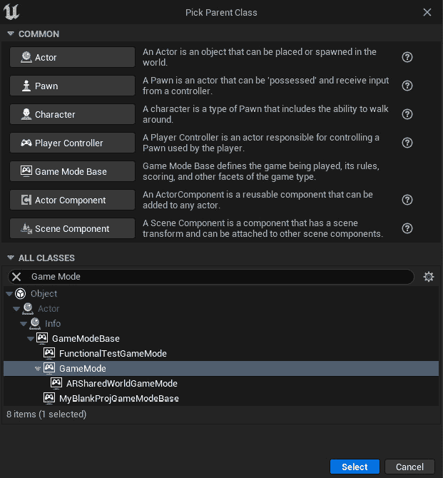

图 3.3 – 创建 GameMode 类

1.  将我们在*步骤 6*中创建的蓝图命名为`BP_GameMode`。

1.  现在，重复*步骤 5*。

1.  在`MyThirdPersonChar`中，选择类，然后右键点击**选择**按钮。

1.  将我们在*步骤 9*中创建的蓝图命名为`BP_MyTPC`。

1.  在**世界设置**选项卡中，点击**GameMode Override**旁边的**None**选项，并选择**BP_GameMode**：

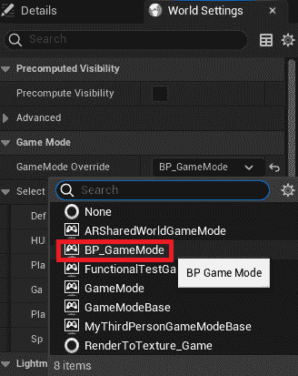

图 3.4 – 在世界设置中指定游戏模式

1.  设置`BP_MyTPC`：

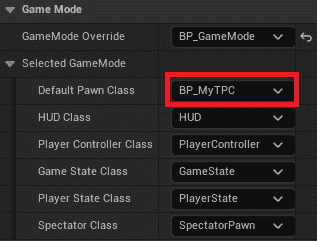

图 3.5 – 在游戏模式中指定默认 Pawn 类

1.  打开**BP_MyTPC**，并在左侧**组件**选项卡的层次结构中点击**Mesh (Inherited)**组件。

1.  在**详细信息**选项卡中，找到**网格**部分，并将**骨骼网格**设置为**Maximo_Adam**。

注意

在*第十一章**，使用 1D 混合空间、按键绑定和状态机*中将对网格和动画进行深入探讨。

1.  在选中时，这是由 UE5 创建的蓝图实例。在正常的项目/构建中，蓝图通常以这种方式添加后缀，以区分蓝图类和该类的实例：

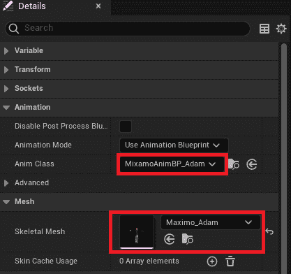

图 3.6 – 设置动画类和骨骼网格

1.  从最顶部的菜单中，转到**编辑**下拉菜单并点击**项目设置**。

1.  点击**输入**部分，它位于**引擎**部分：

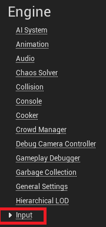

图 3.7 – 项目设置的输入部分

1.  在**绑定**部分，点击**Axis Mappings**旁边的**+**图标并展开该部分。

注意

`jump`、`dash`或`run`，而**轴映射**是浮点值，根据用户的按键返回一个浮点值。这在游戏手柄控制器或 VR 控制器的情况下更为相关，其中模拟拇指杆发挥作用。在这种情况下，它将返回拇指杆状态的浮点值，这对于管理玩家移动或相关功能非常重要。

1.  重命名`MoveForward`。

1.  在`W`。

1.  点击**+**图标，它在**MoveForward**图标旁边，以添加另一个字段。

1.  将新字段设置为`S`。将其比例设置为`-1.0`（因为我们想通过`S`键向后移动）。

1.  通过重复*步骤 18*创建另一个轴映射，将其命名为`MoveRight`，并添加两个字段 – `A`的比例为`-1.0`，`D`的比例为`1.0`：

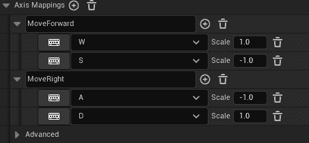

图 3.8 – 移动轴映射

1.  打开**BP_MyTPC**并点击**事件图**选项卡：


图 3.9 – 事件图选项卡

1.  在图中任何地方右键单击，输入`MoveForward`，并选择第一个节点选项：

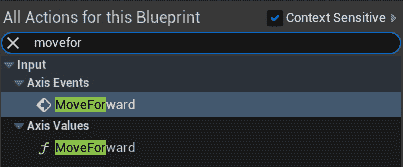

图 3.10 – 前进轴事件

1.  在图中右键单击，搜索“**Get Control Rotation**”，并选择第一个节点选项。

备注

由于与玩家关联的摄像头可以选择不显示骰子的偏航、翻滚或俯仰，`Get Control Rotation`提供了骰子的完整瞄准旋转。这在许多计算中很有用。

1.  在“**Get Control Rotation**”节点的“**返回值**”上左键单击并拖动，搜索“**Break Rotator**”，然后选择它。

1.  在图中右键单击，搜索“**Make Rotator**”，并选择第一个节点选项。

1.  将“**Make Rotator**”的“Z（偏航）”节点连接到“**Make Rotator**”的“Z（偏航）”节点。

备注

**创建旋转器**创建一个具有俯仰、翻滚和偏航值的旋转器，而断开旋转器将旋转器分解为其组件（翻滚、俯仰和偏航）。

1.  在“**Make Rotator**”节点的“**返回值**”上左键单击并拖动，搜索“**Get Forward Vector**”，然后选择它。

1.  在“**获取前向向量**”节点的“**返回值**”上左键单击并拖动，搜索“**添加运动输入**”，然后选择它。

1.  将“**InputAxis MoveForward**”节点的**轴值**节点连接到“**添加运动输入**”节点中的**缩放值**节点。

1.  最后，将“**InputAxis MoveForward**”节点的白色**执行**引脚连接到**添加运动输入**节点。

1.  在图中右键单击，搜索“**InputAxis MoveRight**”，并选择第一个节点选项。

1.  在“**Make Rotator**”节点的“**返回值**”上左键单击并拖动，搜索“**Get Right Vector**”，然后选择它。

1.  在“**获取右向量**”节点的“**返回值**”上左键单击并拖动，搜索“**添加运动输入**”，然后选择它。

1.  将“**InputAxis MoveRight**”节点的**轴值**引脚连接到我们在上一步中创建的**添加运动输入**节点中的**缩放值**引脚。

1.  最后，将“**InputAxis MoveRight**”节点的白色**执行**引脚连接到我们在*步骤 36*中添加的**添加运动输入**节点：

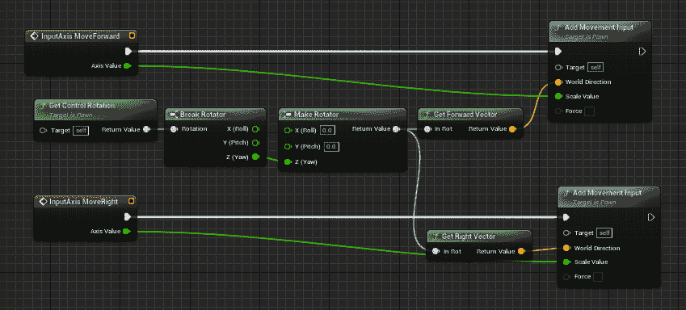

图 3.11 – 运动逻辑

1.  现在，转到“**网格**”组件，选择视图中顶部的对象平移节点。然后，拖动网格上的箭头以调整它，使脚与胶囊组件的底部对齐，并将网格旋转以指向箭头：


图 3.12 – 翻译旋转和缩放选择器部分

一旦角色在胶囊内对齐，它将如下所示：

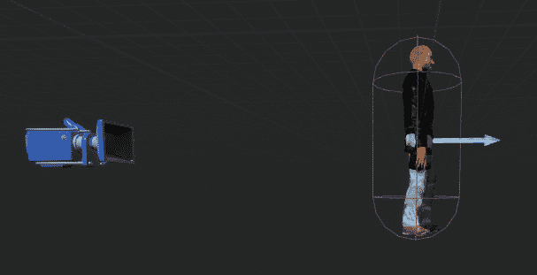

图 3.13 – 胶囊组件内的网格调整

1.  在**工具栏**菜单中，按**编译**按钮，然后**保存**。

1.  返回地图标签页并按下**播放**按钮以查看游戏中的角色。使用 *W*、*A*、*S* 和 *D* 键进行移动。

注意

你可以在 GitHub 上的 `Chapter03` | `Exercise3.02` 目录中找到完成的练习代码文件，网址为 [`packt.live/3keGxIU`](https://packt.live/3keGxIU)。

解压 `.rar` 文件后，双击 `.uproject` 文件。你将看到一个提示要求“现在要重建吗？”。点击提示中的“是”，以便它构建必要的中间文件，之后它应该会自动在 Unreal 编辑器中打开项目。

通过完成这个练习，你将了解如何使用蓝图扩展 C++ 代码，以及为什么这在许多情况下对开发者来说是有利的。你还学习了如何添加输入映射以及它们是如何用来驱动与玩家相关的输入逻辑的。

在本章的活动中，你将结合从本章之前练习中获得的技术，扩展你在 *活动 2.01 – 将动画链接到角色* 中完成的 *第二章*（[B18531_02.xhtml#_idTextAnchor043]）*使用 Unreal Engine 工作时* 的项目。这将使你能够基于自己的蓝图并看到它是如何映射到现实世界场景的。

### 活动三.01 – 在动画项目中使用蓝图扩展 C++ 字符类

现在你已经创建了一个 C++ 类并使用蓝图扩展了它，现在是时候将这两个概念在一个现实世界场景中结合起来。在这个活动中，你将使 *活动 2.01 – 将动画链接到角色* 中的角色跳跃，该活动可以在 *第二章*（[B18531_02.xhtml#_idTextAnchor043]）*使用 Unreal Engine 工作时* 中找到。然而，你需要从头开始在 C++ 中创建 `Character` 类，然后稍后使用蓝图扩展以达到最终目标。

按照以下步骤完成此活动：

1.  从 *活动 2.01–将动画链接到角色* 打开项目。

1.  在 C++ 中创建一个 `Character` 类，该类将初始化角色变量，包括与玩家关联的摄像头。

1.  在项目设置中将 `Jump` 输入映射到空格键。

1.  使用蓝图扩展创建的 C++ 类以添加相关资源和跳跃功能。

**预期输出**

当你按下空格键时，角色应该能够跳跃。该关卡应使用扩展 C++ `Character` 类的蓝图：

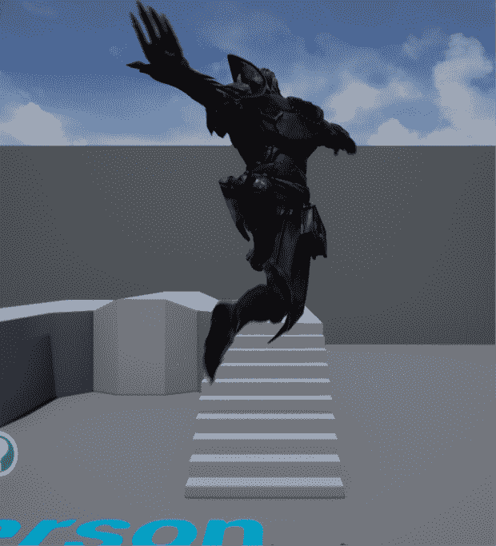

图 3.14 – Ganfault 跳跃活动预期输出

注意

本活动的解决方案可以在 GitHub 上找到：[`github.com/PacktPublishing/Elevating-Game-Experiences-with-Unreal-Engine-5-Second-Edition/tree/main/Activity%20solutions`](https://github.com/PacktPublishing/Elevating-Game-Experiences-with-Unreal-Engine-5-Second-Edition/tree/main/Activity%20solutions)。

通过完成这个活动，你已经理解了在蓝图（Blueprints）中扩展 C++ 代码以实现功能和逻辑的场景。这种 C++ 和蓝图的组合是游戏开发者拥有创建在虚幻引擎（Unreal Engine）中精湛且独特游戏的最强大工具。

# 摘要

在本章中，你学习了如何创建一个 C++ `Character` 类，向其中添加初始化代码，然后使用蓝图（Blueprints）来扩展它以设置资产并添加额外的代码。

结果遵循 C++ 代码以及蓝图代码，可以在任何有意义的场景中使用。

你还学习了如何设置映射到 *W*、*A*、*S* 和 *D* 键的轴映射（Axis Mappings），以移动玩家（这是许多游戏中的默认移动映射）。你还学习了如何在游戏中使角色跳跃。

在下一章中，你将更深入地探索输入映射（Input Mappings）以及如何在虚幻编辑器（Unreal Editor）中使用移动预览器（Mobile Previewer）。这将帮助你创建具有稳固输入映射到游戏和玩家逻辑的游戏。它还将允许你在虚幻编辑器中快速测试你的游戏在移动设备上的外观和感觉。
