# 开始使用玩家输入

在上一章中，我们创建了一个从 `Character` 类继承的 C++ 类，并添加了所有必要的 `Actor` 组件，以便能够从角色的视角看到游戏，以及能够看到角色本身。然后我们创建了一个从该 C++ 类继承的 `Blueprint` 类，以便可视化地设置所有必要的组件。

在本章中，我们将更深入地探讨这些主题，并涵盖它们的 C++ 使用方法。我们将学习 UE5 中玩家输入的工作原理，引擎如何处理输入事件（*按键和释放*），以及我们如何使用它们来控制游戏中的逻辑。

在本章中，我们将涵盖以下主题：

+   理解输入动作和上下文

+   处理玩家输入

+   围绕角色旋转相机

到本章结束时，您将了解 **输入动作** 和 **输入上下文**，如何创建和修改它们，如何监听这些映射中的每一个，以及当它们被按下和释放时如何执行游戏中的动作。

注意

在本章中，我们将使用之前章节中创建的 `Character` 蓝图的一个替代版本，称为 `BP_MyTPC`。本章的版本将使用默认的 UE5 人形网格，而不是 Mixamo 的网格。

让我们从了解 UE5 如何抽象化玩家按下的键，以便您更容易地通知这些事件开始本章。

# 技术要求

本章的项目可以在本书代码包的 Chapter04 文件夹中找到，可以在此处下载：[`github.com/PacktPublishing/Elevating-Game-Experiences-with-Unreal-Engine-5-Second-Edition`](https://github.com/PacktPublishing/Elevating-Game-Experiences-with-Unreal-Engine-5-Second-Edition)。

# 理解输入动作和上下文

玩家输入是区分视频游戏与其他娱乐媒体形式的关键——它们是交互式的。为了使视频游戏具有交互性，它必须考虑玩家的输入。许多游戏通过允许玩家控制一个虚拟角色来实现这一点，该角色根据玩家按下的键和按钮在虚拟世界中采取行动，这正是本章将要做的。

注意

重要的是要注意，UE5 有两个输入系统——自 UE4 开始使用的旧输入系统，以及仅在 UE5 的最新版本中引入的新增强输入系统，最初作为一个实验性系统，现在作为一个完整的插件存在于 UE5 中。本书我们将使用新的增强输入系统。如果您想了解更多关于 UE5 的旧输入系统信息，可以通过访问此链接来了解：[`docs.unrealengine.com/4.27/en-US/InteractiveExperiences/Input/`](https://docs.unrealengine.com/4.27/en-US/InteractiveExperiences/Input/)

现今大多数游戏开发工具都允许你将按键操作抽象为**动作**，这样你可以将一个名称（例如，*跳跃*）与多个不同的玩家输入（按按钮、滑动摇杆等）关联起来。在 UE5 中，你可以通过使用**输入动作**结合**输入上下文**（也称为**输入映射上下文**）来指定这一点。

**输入上下文**包含与它们关联的**输入动作**，以及哪些键将执行它们，而**输入动作**包含关于它们如何执行的说明。这两个资产的组合允许你在**输入动作**被触发时执行某些操作，同时也容易更改**输入动作**的触发方式和由哪些键触发。

为了更好地理解**输入上下文**和**输入动作**是如何协同工作的，让我们考虑一个游戏，比如 *GTA*，在这个游戏中，你有不同的游戏上下文，在这些上下文中，你使用不同的键控制不同的人/对象。

例如，当你控制你的玩家角色在城市中奔跑时，你使用移动键来移动角色，并使用不同的键来使角色跳跃。然而，当你进入一辆车时，控制方式将改变。移动键现在将控制汽车，而之前用于跳跃的同一个键现在将用于例如制动。

在这个例子中，你有两个不同的输入上下文（控制角色和控制车辆），每个上下文都有自己的输入动作集合。其中一些输入动作由同一个键触发，但这没关系，因为它们在不同的输入上下文中执行（例如，使用同一个键使你的角色跳跃并停止车辆）。

在我们开始查看一些增强输入相关的资产之前，因为这是一个插件，我们必须启用它。要启用它，请按照以下步骤操作：

1.  前往**编辑** | **插件** | **内置** | **输入**，并为**增强输入**插件勾选**启用**框。完成此操作后，你将提示重启编辑器。

1.  当出现这种情况时，点击**立即重启**按钮。在编辑器重启后，并且现在**增强输入**插件已被启用，你需要告诉引擎使用其类来处理玩家的输入。

1.  要这样做，请转到`EnhancedPlayerInput`和`EnhancedInputComponent`。现在，**增强输入**插件已被启用，并且其类正在被使用，我们可以继续本章的内容。

为了更好地了解输入上下文和输入动作，让我们来检查它们。请按照以下步骤操作：

1.  右键单击`IA_Movement`，然后打开它。你应该会看到输入动作窗口，它具有以下属性：

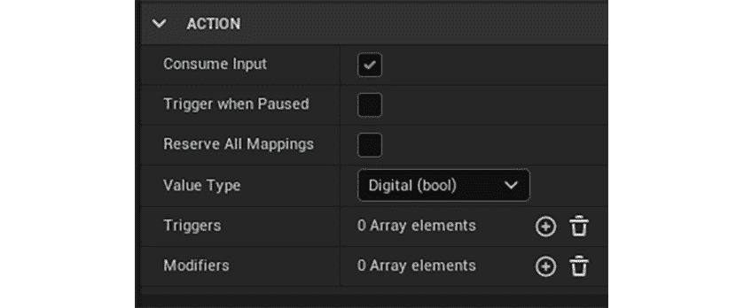

图 4.1 – 动作窗口

现在，让我们详细看看它的选项：

+   `true`，另一个具有较低优先级的输入动作，如果它通过相同的键触发，则不会触发。

+   **暂停时触发**: 这指定了当游戏暂停时，这个输入动作是否可以被触发。

+   **保留所有映射**: 这指定了如果通过相同的键触发，是否会有更高优先级的输入动作被触发。

+   **值类型**: 这指定了此输入动作的值类型。其值可以是以下内容：

    +   **数字 (bool)**: 用于具有二进制状态的输入动作——例如，跳跃输入动作，其中玩家要么按下它，要么不按下，就会使用这个值。

    +   **一维轴 (float)**: 用于具有一维标量状态的输入动作——例如，在赛车游戏中加速，你可以使用游戏手柄的触发器来控制油门。

    +   **二维轴 (Vector2D)**: 用于具有二维标量状态的输入动作——例如，用于移动角色的动作，这些动作是通过两个轴（前进轴和侧向轴）完成的，使用这个值会是一个不错的选择。

+   **三维轴 (向量)**: 用于具有三维标量状态的输入动作。这个值不像其他值那样经常被使用，但你可能会找到它的用途。

+   **触发器**: 这指定了将执行此输入动作的关键事件。这些值的组合可以是以下内容：

    +   **和弦动作**: 当指定的不同输入动作也被触发时，会触发输入动作。

    +   **按下**: 当按键每帧超过激活阈值时，会触发输入动作。

注意

激活阈值是按键输入被认为将执行动作的值。二进制键（如键盘上的键）的输入值为`0`（未按下）或`1`（按下），而标量键，如游戏手柄上的触发器，其输入值从`0`到`1`连续变化，或者像拇指摇杆的单独轴，其值从`-1`到`1`连续变化。

+   **保持**: 当按键超过指定时间的激活阈值时，会触发输入动作。你可以选择性地指定它是触发一次还是每帧触发一次。

+   **保持和释放**: 当按键超过指定时间的激活阈值并停止超过该激活阈值时，会触发输入动作。

+   **按下**: 当按键超过激活阈值时，会触发输入动作，并且直到它被释放，不会再次触发。

+   **脉冲**: 只要按键超过激活阈值，就会在指定的时间间隔内触发输入动作。你可以指定是否第一个脉冲会触发输入动作，以及是否有调用次数的限制。

+   **释放**: 当按键停止超过激活阈值时，会触发输入动作。

+   **轻触**：当键开始并停止超过激活阈值时，只要在指定的时间内完成，就会触发输入动作。

+   **修饰符**：这指定了如何修改此输入动作的输入：

+   如果它低于下限阈值，则为 `0`；如果它高于上限阈值，则为 `1`。

+   **FOV 缩放**：键的输入将与 FOV（如果 FOV 增加，键的输入也将增加，反之亦然）一起缩放。

+   **修饰符集合**：键的输入将根据指定的修饰符列表进行修改。

+   **取反**：键的输入将被反转。

+   **响应曲线 - 指数**：将对键的输入应用指数曲线。

+   **响应曲线 - 用户定义**：将应用一个用户定义的曲线到键的输入。

+   **标量**：键的输入将根据指定的标量在每个轴上进行缩放。

+   **平滑**：键的输入将在多个帧之间进行平滑处理。

+   **交换输入轴值**：键的轴顺序将被交换。

+   **转换为世界空间**：键的轴将被转换为世界空间。

1.  执行此操作后，右键单击 `IC_Character` 并打开它。

你应该会看到输入动作窗口弹出。注意，它有一个空的 **映射** 属性。

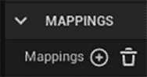

图 4.2 – MAPPINGS 属性

1.  现在我们添加一个新的映射。按 **+** 按钮旁边的 **映射** 属性。你会注意到会出现一个新的属性，你可以在这里指定此映射将关联的输入动作。

此操作可以通过几个不同的键触发，每个键都可以有自己的触发器和修饰符，它们的工作方式与输入动作资产中的相应属性相同。

注意

当涉及到修改 **触发器** 和 **修饰符** 属性时，通常的做法是在输入上下文资产中更改修饰符，在输入动作资产中更改触发器。

注意

我们将不会在这本书中使用这些属性，但对于每个输入映射上下文，你可以指定它是否可以被玩家修改，通过勾选 **是否可映射** 属性并指定 **玩家可映射选项**。

当我们在 *第一章* 中生成 `Third Person` 模板项目时，*介绍 Unreal Engine*

，它已经配置了一些输入，包括 *W*、*A*、*S* 和 *D* 键，以及用于移动的 `左摇杆`，*空格键* 和用于跳跃的 `游戏手柄底部面按钮`。

为了说明，让我们考虑一个 Xbox One 控制器，它可以分解为以下内容：

+   **左模拟摇杆**，通常用于控制游戏中的移动

+   **十字键**，可以控制移动，也有多种其他用途

+   **右模拟摇杆**，通常用于控制相机和视角

+   **面按键**（**X**、**Y**、**A**和**B**），根据游戏的不同可能有各种用途，但通常允许玩家在游戏世界中执行动作

+   **摇杆和触发器**（**LB**、**RB**、**LT**和**RT**），可用于瞄准和射击或加速和制动等动作

现在我们已经学会了如何设置`输入动作`，让我们在下一个练习中添加一些：

## 练习 4.01 – 创建移动和跳跃输入动作

在这个练习中，我们将添加*移动*和*跳跃*输入动作的映射。

要实现这一点，请按照以下步骤操作：

1.  打开**IA_Movement**输入动作。

1.  将其值类型设置为**Axis2D**。我们将将其设置为**Axis2D**类型的输入动作，因为角色的移动是在两个轴上进行的 – 前进轴（对于此输入动作的*Y*轴）和侧向或右侧轴（对于此输入动作的*X*轴）：

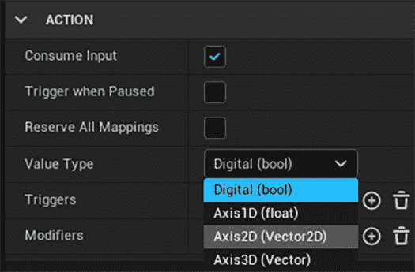

图 4.3 – 值类型选项

1.  添加一个类型为**Down**的新触发器，其激活阈值为**0,1**。这将确保当其任一键的激活阈值为至少**0,1**时调用此输入动作：

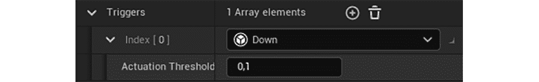

图 4.4 – Down 触发器

1.  打开**IC_Character**输入上下文。

1.  点击**Mappings**属性右侧的**+**图标以创建一个新的映射：

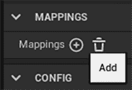

图 4.5 – 添加新的动作映射

1.  当你这样做之后，你应该会看到一个新空映射，其属性为空或设置为**None**：

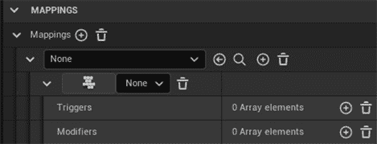

图 4.6 – 新动作映射的默认设置

1.  将此映射的输入动作（设置为**None**的第一个属性）设置为**IA_Movement**：

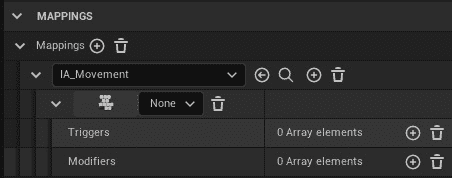

图 4.7 – 新的 IA_Movement 映射

1.  将此映射的第一个键设置为**游戏手柄左摇杆 Y 轴**。

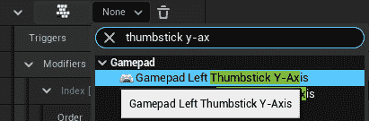

图 4.8 – 游戏手柄左摇杆 Y 轴键

注意

如果您要设置的键来自您已连接的输入设备之一（例如，鼠标、键盘或游戏手柄），您可以单击键下拉列表左侧的按钮，然后按下您要设置的键，而不是在列表中搜索它。例如，如果您想将映射设置为使用键盘上的*F*键，您可以单击该按钮，然后按下*F*键，然后该键将为该映射设置。

因为我们想用这个键控制输入动作的*Y*轴而不是其*X*轴，所以我们需要添加具有**YXZ**值的**Swizzle 输入轴值**修改器。

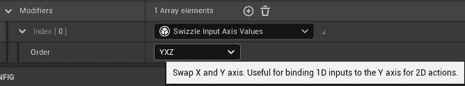

图 4.9 – Swizzle 输入轴修改器

1.  点击此映射设置的输入动作右侧的 **+** 按钮，以添加新键并执行该输入动作：

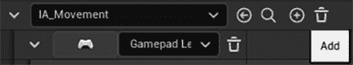

图 4.10 – IA_Movement 右侧的+按钮

1.  将新键设置为 **游戏手柄左摇杆 X 轴**。因为这将已经控制移动输入动作的 *X* 轴，所以我们不需要添加任何修饰符。

1.  向输入动作中添加另一个键，这次是 *W* 键。因为这个键将用于向前移动，因此使用 *Y* 轴，它需要我们之前添加的相同修饰符 - 带有 **YXZ** 值的 **Swizzle 输入轴** 修饰符。

1.  向输入动作中添加另一个键，这次是 *S* 键。因为这个键将用于向后移动，因此使用 *Y* 轴，它需要我们之前添加的相同修饰符 - 当按下此键时（即，当其输入为 `1`）在 *Y* 轴上的 `-1`：

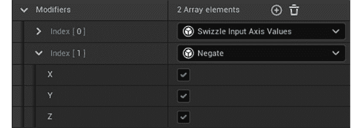

图 4.11 - Swizzle 输入轴值和取反修饰符

1.  向输入动作中添加另一个键，这次是 *D* 键。因为这个键将用于向右移动，因此使用 *X* 轴的正端，它不需要任何修饰符。

1.  向输入动作中添加另一个键，这次是 *A* 键。因为这个键将用于向左移动，因此使用 *X* 轴的负端，它需要与 *S* 键相同的 `Negate` 修饰符。

1.  创建一个新的输入动作资产，命名为 `IA_Jump`，然后打开它。

1.  添加一个 **向下** 触发器，并保持其激活阈值为 **0,5**：

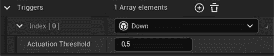

图 4.12 – 向下触发

1.  返回到 **IC_Character** 输入上下文资产，并将一个新的输入动作添加到 **映射** 属性中 - 这次是刚刚创建的 **IA_Jump** 输入动作：


图 4.13 – IA_Jump 映射

1.  向此映射中添加两个键 - **空格键** 和 **游戏手柄面按键底部**。如果你使用的是 Xbox 控制器，这将对应于 *A* 按钮，如果你使用的是 PlayStation 控制器，这将对应于 *X* 按钮：

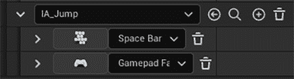

图 4.14 – IA_Jump 映射键

完成这些步骤后，我们就完成了本章的第一个练习，你学习了如何在 UE5 中指定输入动作映射，这允许你抽象出哪些键负责哪些游戏动作。

现在，让我们看看 UE5 如何处理玩家输入并在游戏中对其进行处理。

# 处理玩家输入

让我们考虑一种情况，玩家按下**跳跃**输入动作，该动作与*空格键*相关联，以使玩家角色跳跃。在玩家按下*空格键*的那一刻和游戏使玩家角色跳跃的那一刻之间，需要发生很多事情来连接这两个事件。

让我们看看从一件事到另一件事的所有必要步骤：

1.  `硬件输入`：玩家按下*空格键*。UE5 将监听这个按键事件。

1.  `PlayerInput`类：在按键按下或释放后，这个类将把那个键转换成输入动作。如果有相应的输入动作，它将通知所有监听该动作的类，它刚刚被按下、释放或更新。在这种情况下，它将知道*空格键*与*跳跃*输入动作相关联。

1.  `Player Controller`类：这是第一个接收这些按键事件类，因为它用于在游戏中表示玩家。

1.  `Pawn`类：这个类（以及从它继承的`Character`类）也可以监听这些按键事件，只要它们被玩家控制器拥有。如果是这样，它将在那个类之后接收这些事件。在本章中，我们将使用我们的`Character` C++类来监听动作和轴事件。

现在我们知道了 UE5 如何处理玩家输入，让我们看看我们如何在下一节中用 C++监听输入动作。

## 练习 4.02 – 监听移动和跳跃输入动作

在这个练习中，我们将通过将它们绑定到角色类中的特定函数来使用 C++将我们在上一节中创建的输入动作注册到我们的角色类中。

`SetupPlayerInputComponent`函数的主要方式。`MyThirdPersonChar`类应该已经有了这个函数的声明和实现。让我们让我们的角色类通过以下步骤来监听这些事件：

1.  在 Visual Studio 中打开`MyThirdPersonChar`类头文件，确保有一个名为`SetupPlayerInputComponent`的`protected`函数的声明，该函数不返回任何内容，并接收一个`class UInputComponent* PlayerInputComponent`属性作为参数。这个函数应该被标记为`virtual`和`override`：

    ```cpp
    virtual void SetupPlayerInputComponent(class UInputComponent*
    PlayerInputComponent) override;
    ```

1.  为一个名为`IC_Character`的`public` `class UInputMappingContext*`属性添加一个声明。这个属性必须是一个`UPROPERTY`，并具有`EditAnywhere`和`Category = Input`标签。这将是我们为角色输入添加的输入上下文：

    ```cpp
    UPROPERTY(EditAnywhere, Category = Input)
    class UInputMappingContext* IC_Character;
    ```

1.  之后，我们需要添加输入动作来监听角色的输入。添加三个`public` `class UInputAction*`属性，所有这些都必须是`UPROPERTY`，并具有`EditAnywhere`和`Category = Input`标签。这两个属性将被命名为以下：

    +   `IA_Move`

        ```cpp
        IA_JumpUPROPERTY(EditAnywhere, Category = Input)
        class UInputAction* IA_Move;
        UPROPERTY(EditAnywhere, Category = Input)
        class UInputAction* IA_Jump
        ```

1.  打开这个类的`source`文件，确保这个函数有实现：

    ```cpp
    void AMyThirdPersonChar::SetupPlayerInputComponent(class 
    UInputComponent* PlayerInputComponent)
    {
    }
    ```

1.  因为在 UE5 中，你可以使用遗留的输入组件或增强型输入组件，我们需要考虑这一点。在前面函数的实现中，首先将 `PlayerInputComponent` 参数转换为 `UEnhancedInputComponent` 类，并将其保存到一个新的 `EnhancedPlayerInputComponent` 属性中，该属性的类型为 `UEnhancedInputComponent*`：

    ```cpp
    UEnhancedInputComponent* EnhancedPlayerInputComponent =
    Cast<UEnhancedInputComponent>(PlayerInputComponent);
    ```

因为我们将使用 `UEnhancedInputComponent`，所以我们需要包含它：

```cpp
#include "EnhancedInputComponent.h"
```

1.  如果它不是 `nullptr`，将 `Controller` 属性转换为 `APlayerController` 并将其保存在一个局部 `PlayerController` 属性中：

    ```cpp
    if (EnhancedPlayerInputComponent != nullptr)
    {
     APlayerController* PlayerController =
     Cast<APlayerController>(GetController());
    }
    ```

如果新创建的 `PlayerController` 属性不是 `nullptr`，那么我们需要获取 `UEnhancedLocalPlayerSubsystem`，以便我们可以告诉它添加 `IC_Character` 输入上下文并激活其输入操作。

1.  要做到这一点，创建一个新的 `UEnhancedLocalPlayerSubsystem*` 属性，命名为 `EnhancedSubsystem`，并将其设置为返回 `ULocalPlayer::GetSubsystem` 函数的值。此函数接收一个模板参数，表示我们想要获取的子系统，即 `UEnhancedLocalPlayerSubsystem`，以及一个类型为 `ULocalPlayer*` 的普通参数。此最后一个参数的类型是表示在当前游戏实例中控制 pawn 的玩家的表示，我们将通过调用 `PlayerController->GetLocalPlayer()` 来传递它：

    ```cpp
    UEnhancedInputLocalPlayerSubsystem* EnhancedSubsystem =
    ULocalPlayer::GetSubsystem<UEnhancedInputLocalPlayerSubsystem>(PlayerController->GetLocalPlayer());
    ```

因为我们将使用 `UEnhancedLocalPlayerSubsystem`，所以我们需要包含它：

```cpp
#include "EnhancedInputSubsystems.h"
```

1.  如果 `EnhancedSubsystem` 属性不是 `nullptr`，则调用其 `AddMappingContext` 函数，该函数接收以下参数：

    +   `UInputMappingContext* Mapping Context`：我们想要激活的输入上下文——在这种情况下，是 `IC_Character` 属性

    +   `int32 Priority`：我们想要此输入上下文具有的优先级，我们将将其传递为 `1`

        ```cpp
        EnhancedSubsystem->AddMappingContext(IC_Character, 1);
        ```

1.  因为我们将使用 `UInputMappingContext`，所以我们需要包含它：

    ```cpp
    #include "InputMappingContext.h"
    ```

1.  现在我们已经添加了激活输入上下文的逻辑，让我们添加监听输入操作的逻辑。在检查 `PlayerController` 是否为 `nullptr` 之后，但在检查 `EnhancedPlayerInputComponent` 是否为 `nullptr` 的括号内，添加以下步骤的代码：

    ```cpp
    if (EnhancedPlayerInputComponent != nullptr)
    {
     APlayerController* PlayerController = 
     Cast<APlayerController>(GetController());
     if (PlayerController != nullptr)
     {
      ...
     }
     // Continue here
    }
    ```

为了监听 `IA_Movement` 输入操作，我们将调用 `EnhancedPlayer InputComponent` 的 `BindAction` 函数，该函数接收以下参数：

+   `UInputAction* Action`：要监听的输入操作，我们将将其传递为 `IA_Movement` 属性。

+   `ETriggerEvent TriggerEvent`：将导致函数被调用的输入事件。因为此输入操作在它被使用的每一帧都会被触发，并且使用 `Down` 触发器触发，所以我们将将其作为 `Triggered` 事件传递。

+   `UserClass* Object`：`callback` 函数将被调用的对象——在我们的案例中，是 `this` 指针。

+   `HANDLER_SIG::TUObjectMethodDelegate <UserClass> ::FMethodPtr Func`：这个属性有点冗长，但本质上是一个指向当此事件发生时将被调用的函数的指针，我们可以通过输入 `&`，然后是类的名称，接着是 `::`，最后是函数的名称来指定它。在我们的例子中，我们希望这是 `Move` 函数，我们将在下一步创建它，所以我们将指定为 `& AMyThirdPersonChar::Move`：

    ```cpp
    EnhancedPlayerInputComponent->BindAction(IA_Move,
    ETriggerEvent::Triggered, this, &AMyThirdPersonChar
    ::Move);
    ```

因为我们将使用 `UInputAction`，我们需要包含它：

```cpp
#include "InputAction.h"
```

1.  现在让我们绑定将使玩家角色开始跳跃的功能。为了做到这一点，复制我们为 `IA_Move` 输入动作添加的 `BindAction` 函数调用，但进行以下更改：

    +   我们将传递 `IA_Jump` 输入动作而不是 `IA_Move` 输入动作。

    +   我们将传递 `&AMyThirdPersonChar::Move` 函数而不是 `&ACharacter::Jump`。这是将使角色跳跃的函数。

    +   我们将传递 `ETriggerEvent::Started` 而不是 `ETriggerEvent::Trigger`。这样我们就可以在键开始和停止被按下时得到通知：

        ```cpp
        EnhancedPlayerInputComponent->BindAction(IA_Jump,
        ETriggerEvent::Started, this, &ACharacter::Jump);
        ```

1.  为了绑定将使玩家角色停止跳跃的函数，现在让我们复制我们刚刚做的最后一个 `BindAction` 函数调用，但对其做出以下更改：

    +   我们将传递 `ETriggerEvent::Completed` 而不是 `ETriggerEvent::Started`，这样当此输入动作停止触发时，函数就会被调用。

    +   我们将传递 `&ACharacter::Jump` 函数而不是 `&ACharacter::StopJumping`。这是将使角色停止跳跃的函数：

        ```cpp
        EnhancedPlayerInputComponent->BindAction(IA_Jump,
        ETriggerEvent::Completed, this, &ACharacter::StopJumping);
        ```

注意

所有用于监听输入动作的功能必须接收无参数或类型为 `FInputActionValue&` 的参数。你可以使用它来检查其值类型并获取正确的类型。例如，如果触发此功能的输入动作具有 `Digital` 值类型，其值将为 `bool` 类型，但如果它具有 `Axis2D` 值类型，其值将为 `FVector2D` 类型。后者是我们将在 `Move` 函数中使用的类型，因为那是其对应值类型。

监听输入动作的另一种选择是使用 `Delegates`，这超出了本书的范围。

1.  现在，让我们创建我们在之前步骤中引用的 `Move` 函数。转到类的头文件，并添加一个名为 `Move` 的 `protected` 函数的声明，它不返回任何内容，并接收一个 `const FInputActionValue& Value` 参数：

    ```cpp
    void Move(const FInputActionValue& Value);
    ```

1.  因为我们使用 `FInputActionValue`，我们必须包含它：

    ```cpp
    #include "InputActionValue.h"
    ```

1.  在类的源文件中添加此函数的实现，我们将首先通过调用其 `Get` 函数来获取 `Value` 参数的输入作为 `FVector2D`。我们将通过传递 `FVector2D` 类型作为模板参数来完成此操作。我们还将将其返回值保存在一个名为 `InputValue` 的局部变量中：

    ```cpp
    void AMyThirdPersonChar::Move(const FInputActionValue&
    Value)
    {
     FVector2D InputValue = Value.Get<FVector2D>();
    }
    ```

1.  接下来，检查`Controller`属性是否有效（不是`nullptr`）以及`InputValue`属性的`X`或`Y`值是否不同于`0`：

    ```cpp
    if (Controller != nullptr && (InputValue.X != 0.0f ||
    InputValue.Y != 0.0f))
    ```

如果所有这些条件都为`true`，我们接下来将获取相机在*z*轴上的旋转（偏航），以便我们可以相对于相机面向的方向移动角色。为了实现这一点，我们可以创建一个新的`FRotator`属性，命名为`YawRotation`，其俯仰（沿*y*轴旋转）和翻滚（沿*x*轴旋转）的值为`0`，而其偏航的值则为相机当前的偏航值。为了获取相机的偏航值，我们可以调用玩家控制器的`GetControlRotation`函数，然后访问其`Yaw`属性：

```cpp
const FRotator YawRotation(0, Controller->
  GetControlRotation().Yaw, 0);
```

注意

`FRotator`属性的构造函数接收`Pitch`值，然后是`Yaw`值，最后是`Roll`值。

+   之后，我们将检查`InputValue`的`X`属性是否不同于`0`：

    ```cpp
    if (InputValue.X != 0.0f)
    {
    }
    ```

+   如果是，获取`YawRotation`的右向量并将其存储在`Fvector RightDirection`属性中。你可以通过调用`KismetMathLibrary`对象的`GetRightVector`函数来获取旋转器的右向量。旋转器或向量的右向量是其垂直于自身并指向右侧的向量。这将得到一个指向相机当前面向方向右侧的向量：

    ```cpp
    const Fvector RightDirection = 
      UkismetMathLibrary::GetRightVector(YawRotation);
    ```

+   我们现在可以调用`AddMovementInput`函数，这将使我们的角色向指定的方向移动，传递参数为`RightDirection`和`InputValue`的`X`属性：

    ```cpp
    AddMovementInput(RightDirection, InputValue.X);
    ```

+   因为我们将同时使用`KismetMathLibrary`和`Controller`对象，所以我们需要在源文件顶部包含它们：

    ```cpp
    #include "Kismet/KismetMathLibrary.h"
    #include "GameFramework/Controller.h"
    ```

1.  在检查`InputValue`的`X`属性是否不同于`0`之后，检查其`Y`属性是否不同于`0`：

    ```cpp
    if (InputValue.X != 0.0f)
    {
     ...
    }
    if (InputValue.Y != 0.0f)
    {
    }
    ```

1.  如果是，调用`YawRotation`属性的`Vector`函数，并将返回值存储在`FVector ForwardDirection`属性中。此函数将`FRotator`转换为`FVector`，相当于获取旋转器的`ForwardVector`。这将得到一个指向相机当前面向方向前方的向量：

    ```cpp
    const FVector ForwardDirection = YawRotation.Vector();
    ```

我们现在可以调用`AddMovementInput`函数，传递参数为`ForwardDirection`和`InputValue`的`Y`属性：

```cpp
AddMovementInput(ForwardDirection, InputValue.Y);
```

1.  在我们编译代码之前，将`EnhancedInput`插件添加到项目`Build.cs`文件中，以便通知 UE5 我们将在项目中使用此插件。如果我们不这样做，项目的一些部分将无法编译。

1.  打开项目源文件夹`Source/<ProjectName>`中的`.Build.cs`文件，这是一个 C#文件而不是 C++文件，位于项目源文件夹内。

1.  打开文件，你会找到 `PublicDependencyModuleNames` 属性调用的 `AddRange` 函数。这个函数告诉引擎该项目打算使用哪些模块。作为参数，发送了一个包含所有预期模块名称的字符串数组。鉴于我们打算使用 UMG，我们需要在 `InputCore` 模块之后添加 `EnhancedInput` 模块：

    ```cpp
    PublicDependencyModuleNames.AddRange(new string[] { "Core",
    "CoreUObject", "Engine", "InputCore", "EnhancedInput",
    "HeadMountedDisplay" });
    ```

1.  现在你已经通知引擎我们将使用 `EnhancedInput` 模块，编译你的代码，打开编辑器，并打开你的 `BP_MyTPS` 蓝图资产。删除 `InputAction 跳跃` 事件以及连接到它的节点。对 **InputAxis 移动向前** 和 **InputAxis 移动向右** 事件也做同样操作。我们将在 C++ 中复制这个逻辑，并需要移除其蓝图功能，以避免处理输入时出现冲突。

1.  接下来，将 **IC 角色** 属性设置为 **IC_Character** 输入上下文，将 **IA 移动** 属性设置为 **IA_Movement** 输入动作，将 **IA 跳跃** 属性设置为 **IA_Jump** 输入动作：

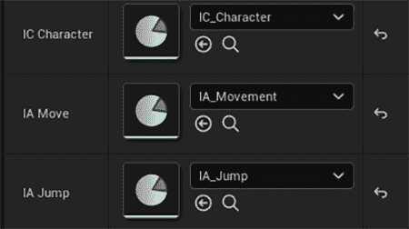

图 4.15 – IC 角色、IA 移动和 IA 跳跃属性

1.  现在，开始游戏关卡。你应该能够使用键盘的 *W*、*A*、*S* 和 *D* 键或控制器的 *左摇杆* 来移动角色，以及使用 *空格键* 或 *游戏手柄正面按钮下* 来跳跃：

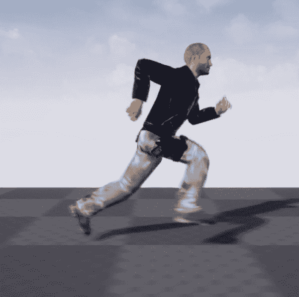

图 4.16 – 玩家角色移动

在完成所有这些步骤后，你将完成这个练习。你现在知道如何使用 C++ 在 UE5 中创建和监听自己的 **输入动作** 事件。做这件事是游戏开发最重要的方面之一，所以你刚刚完成了游戏开发旅程中的一个重要步骤。

现在我们已经设置了所有必要的逻辑，使我们的角色能够移动和跳跃，让我们添加负责围绕角色旋转摄像机的逻辑。

# 围绕角色旋转摄像机

摄像机是游戏中的一个极其重要的部分，因为它决定了玩家在整个游戏过程中将看到什么以及如何看到。当涉及到第三人称游戏，这正是本项目所涉及的内容时，摄像机不仅允许玩家看到他们周围的世界，还能看到他们所控制的角色。无论角色是否受到伤害、坠落或其他情况，玩家始终需要知道他们所控制角色的状态，并且能够使摄像机面向他们选择的任何方向。

像每款现代第三人称游戏一样，我们总是会让摄像机围绕我们的玩家角色旋转。为了使我们的摄像机围绕我们的角色旋转，在 *第二章* *使用 Unreal Engine* 中设置 **Camera** 和 **Spring Arm** 组件之后，让我们继续添加一个新的 **Look** 输入动作。按照以下步骤操作：

1.  通过复制 `IA_Look` 来完成此操作。因为这个新输入动作的设置与 **IA_Move** 输入动作类似，所以我们将保留这个复制的资产不变。

1.  然后，打开 **IA_Character** 输入上下文，并为 **IA_Look** 输入动作添加一个新的映射。

1.  将以下键添加到这个新映射中 – **鼠标 X**、**鼠标 Y**、**游戏手柄右摇杆 X 轴**和**游戏手柄右摇杆 Y 轴**。因为 *Y* 键将控制输入动作的 *Y* 轴，所以我们必须为它们添加 **Swizzle Input Axis Values** 修改器（**鼠标 Y** 和 **游戏手柄右摇杆 Y 轴** 键）。另外，因为 **鼠标 Y** 键会在你向上移动鼠标时使摄像机向下移动，所以我们也必须为它添加一个 **Negate** 修改器：

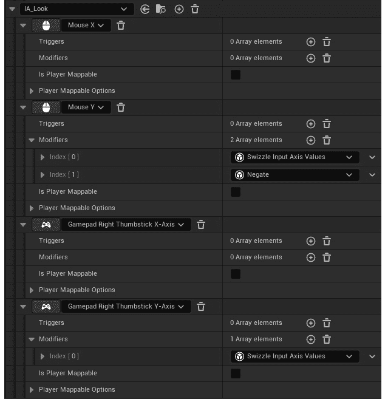

图 4.17 – IA_Look 输入动作的映射

现在，让我们添加负责根据玩家输入旋转摄像机的 C++ 逻辑：

1.  前往 `MyThirdPersonChar` 类的头文件，并添加一个 `public` 的 `class UInputAction* IA_Look` 属性，该属性必须是 `UPROPERTY`，并具有 `EditAnywhere` 和 `Category = Input` 标签：

    ```cpp
    UPROPERTY(EditAnywhere, Category = Input)
    class UInputAction* IA_Look;
    ```

1.  接下来，添加一个名为 `Look` 的 `protected` 函数的声明，该函数不返回任何内容，并接收一个 `const FInputActionValue& Value` 参数：

    ```cpp
    void Look(const FInputActionValue& Value);
    ```

1.  接下来，转到 `SetupPlayerInputComponent` 函数的实现，在类的源文件中，并复制负责监听 `IA_Move` 输入动作的行。在这条复制的行中，将第一个参数更改为 `IA_Look`，并将最后一个参数更改为 `&AMyThirdPersonChar::Look`：

    ```cpp
    EnhancedPlayerInputComponent->BindAction(IA_Look,
    ETriggerEvent::Triggered, this, &AMyThirdPersonChar::Look);
    ```

1.  然后，添加 `Look` 函数的实现，我们将首先将 `Value` 参数的输入作为 `FVector2D` 获取。我们将通过调用其 `Get` 函数来实现，将 `FVector2D` 类型作为 `template` 参数传递。我们还将将其 `return` 值保存在一个名为 `InputValue` 的局部变量中：

    ```cpp
    void AMyThirdPersonChar::Look(const FInputActionValue& Value)
    {
     FVector2D InputValue = Value.Get<FVector2D>();
    }
    ```

1.  如果 `InputValue` 的 `X` 属性与 `0` 不同，我们将调用 `AddControllerYawInput` 函数，并将此属性作为参数传递。之后，检查 `InputValue` 的 `Y` 属性是否与 `0` 不同，然后我们将调用 `AddControllerPitchInput` 函数，并将此属性作为参数传递：

    ```cpp
    if (InputValue.X != 0.0f)
    {
      AddControllerYawInput(InputValue.X);
    }
    if (InputValue.Y != 0.0f)
    {
      AddControllerPitchInput(InputValue.Y);
    }
    ```

注意

`AddControllerYawInput` 和 `AddControllerPitchInput` 函数分别负责在 *z*（转向左右）和 *y*（向上和向下看）轴周围添加旋转输入。

1.  完成此操作后，编译你的代码，打开编辑器，并打开你的 **BP_MyTPS** 蓝图资产。将其 **IA_Look** 属性设置为 **IA_Look** 输入动作：

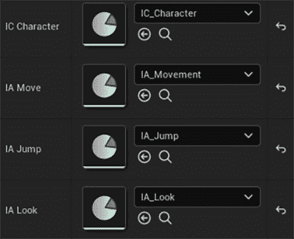

图 4.18 – 摄像机围绕玩家旋转

当你玩这个关卡时，你现在应该能够通过旋转鼠标或倾斜控制器的 *right thumbstick* 来移动摄像机：

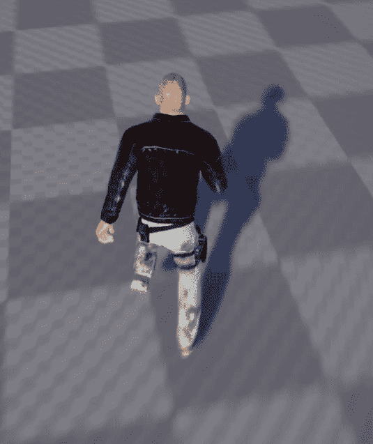

图 4.19 – 摄像机围绕玩家旋转

这样，我们就完成了围绕玩家角色旋转摄像机的逻辑。现在我们已经学会了如何将输入添加到我们的游戏中，并将它们与游戏中的动作关联起来，例如跳跃和移动玩家角色，让我们通过在下一个活动中从头到尾添加一个新的 `Walk` 动作来巩固我们在本章中学到的知识。

# 活动 4.01 – 为我们的角色添加行走逻辑

在当前游戏中，当我们使用移动键时，我们的角色默认会跑动，但我们需要降低角色的速度并使其行走。

因此，在这个活动中，我们将添加逻辑，使得我们在按住键盘上的 *Shift* 键或 **Gamepad Face Button Right** 键（Xbox 控制器的 *B* 键和 PlayStation 控制器的 *O* 键）移动角色时，角色能够行走。

要做到这一点，请按照以下步骤操作：

1.  复制 `IA_Walk`。由于这个新的输入动作的设置与 **IA_Jump** 输入动作类似，我们将保留这个复制的资产不变。

1.  然后，打开 **IA_Character** 输入上下文，并为 **IA_Walk** 输入动作添加一个新的映射。将以下键添加到这个新映射中 – **Left Shift** 和 **Gamepad Face Button Right**。

1.  打开 `MyThirdPersonChar` 类的头文件，并添加一个 `UInputAction* IA_Walk` 属性，该属性必须是 `UPROPERTY`，并具有 `EditAnywhere` 和 `Category = Input` 标签。

1.  然后，添加两个名为 `BeginWalking` 和 `StopWalking` 的 `protected` 函数的声明，这两个函数都不返回任何内容，也不接收任何参数。

1.  在类的源文件中为这两个函数添加实现。在 `BeginWalking` 函数的实现中，通过修改 `CharacterMovementComponent` 属性的 `MaxWalkSpeed` 属性，将角色的速度更改为其值的 40%。要访问 `CharacterMovementComponent` 属性，请使用 `GetCharacterMovement` 函数。

`StopWalking` 函数的实现将是 `BeginWalking` 函数实现的逆操作，这将使角色的行走速度提高 250%。

1.  通过进入 `SetupPlayerInputComponent` 函数的实现并添加两个对 `BindAction` 函数的调用，来监听 `Walk` 动作，第一个调用将 `IA_Walk` 属性、`ETriggerEvent::Started` 事件、`this` 指针和本类的 `BeginWalking` 函数作为参数传递，而第二个调用将 `IA_Walk` 属性、`ETriggerEvent::Completed` 事件、`this` 指针和本类的 `StopWalking` 函数作为参数传递。

1.  编译你的代码，打开编辑器，打开你的 `BP_MyTPS` 蓝图资产，并将 **IA_Walk** 属性设置为 **IA_Walk** 输入动作。

在遵循这些步骤之后，你应该能够通过按键盘的 *左 Shift* 键或控制器的 **面键右** 键来使你的角色行走，这会降低其速度并略微改变其动画：

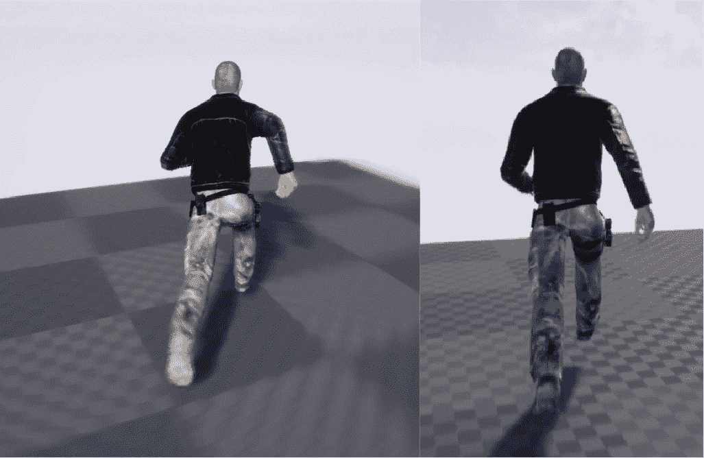

图 4.20 – 正在跑动（左）和行走（右）的角色

这就结束了我们的活动。现在，只要玩家保持按下 **行走** 输入动作，我们的角色应该能够缓慢行走。

注意

该活动的解决方案可以在 GitHub 上找到：[`github.com/PacktPublishing/Elevating-Game-Experiences-with-Unreal-Engine-5-Second-Edition/tree/main/Activity%20solutions`](https://github.com/PacktPublishing/Elevating-Game-Experiences-with-Unreal-Engine-5-Second-Edition/tree/main/Activity%20solutions).

# 摘要

在本章中，你学习了如何创建和修改 **输入动作**，以及将它们的映射添加到 **输入上下文** 中，这在你确定哪些键触发特定动作或轴时提供了灵活性，如何监听它们，以及如何在它们被按下和释放时执行游戏逻辑。

现在你已经知道如何处理玩家的输入，你可以允许玩家与你的游戏互动，并提供视频游戏所特有的代理权。

在下一章中，我们将从头开始制作自己的游戏。它将被命名为 **躲避球**，玩家将控制一个角色试图逃离向其投掷躲避球敌人的攻击。在那个章节中，我们将有机会开始学习许多重要主题，重点放在碰撞上。
