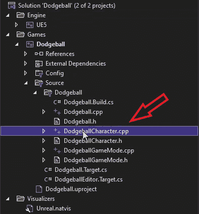

# 使用线迹查询

在前面的章节中，我们学习了如何重现由虚幻引擎团队提供的第三人称模板项目，以便理解 UE5 工作流程和框架的一些基本概念。

在本章中，你将从头开始创建另一个游戏。在这个游戏中，玩家将从俯视角度控制一个角色（类似于金属 Gear Solid 1、2 和 3 等游戏）。俯视视角意味着玩家控制的角色看起来就像是从上方俯瞰的，通常相机旋转是固定的（相机不旋转）。在我们的游戏中，玩家角色必须从点 A 移动到点 B，而不被敌人投掷的躲避球击中，这些敌人散布在关卡中。这个游戏中的关卡将具有迷宫般的性质，玩家将有多个路径可供选择，所有路径上都有敌人试图向他们投掷躲避球。

在本章中，我们将涵盖以下主题：

+   碰撞简介

+   理解和可视化线迹（单线和多线）

+   扫描跟踪

+   跟踪通道

+   跟踪响应

在第一部分，我们首先了解在视频游戏世界中碰撞是什么。

# 技术要求

本章的项目可以在本书代码包的 Chapter05 文件夹中找到，该代码包可以在此处下载：[`github.com/PacktPublishing/Elevating-Game-Experiences-with-Unreal-Engine-5-Second-Edition`](https://github.com/PacktPublishing/Elevating-Game-Experiences-with-Unreal-Engine-5-Second-Edition)。

# 碰撞简介

碰撞基本上是指两个物体相互接触的点（例如，两个物体相撞，一个物体击中角色，角色撞到墙上，等等）。大多数游戏开发工具都有自己的功能集，允许在游戏中存在碰撞和物理。这个功能集被称为物理引擎，它负责所有与碰撞相关的事情。它负责执行线迹，检查两个物体是否重叠，阻止彼此的移动，或者从墙上弹回，以及更多。当我们要求游戏执行或通知我们这些碰撞事件时，游戏实际上是在要求物理引擎执行它，然后向我们展示这些碰撞事件的结果。

在你将要构建的**躲避球**游戏中，需要考虑碰撞的例子包括检查敌人是否能看到玩家（这将通过本章介绍的使用线迹来实现），模拟一个将表现得像躲避球的对象的物理行为，检查是否有任何东西阻挡了玩家角色的移动，以及更多。

碰撞是大多数游戏最重要的方面之一，因此理解它是开始游戏开发的关键。

在我们开始构建基于碰撞的功能之前，我们首先需要设置我们的新**Dodgeball**项目，以便支持我们将要实现的游戏机制。这个过程从以下章节中描述的步骤开始。

# 设置您的项目

让我们首先创建我们的 Unreal Engine 项目：

1.  启动 UE5。选择**游戏**项目类别，然后点击**下一步**。

1.  选择**第三人称模板**，然后点击**下一步**。

1.  确保第一个选项设置为**C++**而不是**蓝图**。

1.  根据您的偏好选择项目位置，并将项目命名为`Dodgeball`，然后点击**创建项目**。

当项目生成完成后，您应该在屏幕上看到以下内容：


图 5.1 – Dodgeball 项目已加载

1.  在代码生成并项目打开后，启用增强输入插件，就像我们在*第四章**“理解输入动作和上下文”部分的步骤 1-3 中做的那样，*开始使用玩家输入*。

1.  之后，关闭 UE5 编辑器并打开如图所示的生成的第三人称`Character`类`DodgeballCharacter`的文件，在 Visual Studio 中，如下所示：



图 5.2 – Visual Studio 中生成的文件

如前所述，您的项目将具有俯视视角。鉴于我们从第三人称模板开始此项目，我们将在将其转换为俯视游戏之前更改一些事情。这主要涉及在现有的`Character`类中更改一些代码行。

## 练习 5.01：将 DodgeballCharacter 转换为俯视视角

在这个练习中，您将对生成的`DodgeballCharacter`类进行必要的更改。记住，它目前具有第三人称视角，角色的旋转由玩家的输入（即鼠标或右模拟摇杆）决定。

在这个练习中，您将将其更改为俯视视角，这不受玩家输入的影响，并且摄像机始终从上方跟随角色。

以下步骤将帮助您完成此练习：

1.  前往`DodgeballCharacter`类的构造函数并更新`CameraBoom`属性，如以下步骤所述。

1.  将`CameraBoom`的属性`TargetArmLength`更改为`900.0f`，以便在摄像机和玩家之间添加一些距离，如下所示：

    ```cpp
    // The camera follows at this distance behind the 
    // character
    CameraBoom->TargetArmLength = 900.0f;
    ```

1.  接下来，添加一行代码，使用`SetRelativeRotation`函数将相对俯仰设置为`-70`°，以便摄像机向下看玩家。`FRotator`构造函数的参数分别是俯仰、偏航和翻滚，如下所示：

    ```cpp
    //The camera looks down at the player
    CameraBoom->SetRelativeRotation(FRotator(-70.f, 0.f, 0.f));
    ```

1.  将`bUsePawnControlRotation`更改为`false`，这样相机的旋转就不会被玩家的移动输入改变，如下所示：

    ```cpp
    // Don't rotate the arm based on the controller
    CameraBoom->bUsePawnControlRotation = false;
    ```

1.  添加一行代码，将`bInheritPitch`、`bInheritYaw`和`bInheritRoll`设置为`false`，这样相机的旋转就不会被角色的方向改变，如下所示：

    ```cpp
    // Ignore pawn's pitch, yaw and roll
    CameraBoom->bInheritPitch = false;
    CameraBoom->bInheritYaw = false;
    CameraBoom->bInheritRoll = false;
    ```

在我们进行了这些修改之后，我们将移除角色跳跃的能力（我们不希望玩家那么容易从躲避球中逃脱）以及从玩家的旋转输入中旋转相机。

1.  在`DodgeballCharacter`的源文件中转到`SetupPlayerInputComponent`函数，并移除以下代码行以移除跳跃能力：

    ```cpp
    // REMOVE THESE LINES
    PlayerInputComponent->BindAction("Jump", IE_Pressed, this, 
      &ACharacter::Jump);
    PlayerInputComponent->BindAction("Jump", IE_Released, this, 
      Acharacter::StopJumping);
    ```

1.  接下来，按照以下顺序添加以下行，以移除玩家的旋转输入：

    ```cpp
    // REMOVE THESE LINES
    PlayerInputComponent->BindAxis("Turn", this, 
      &APawn::AddControllerYawInput);
    PlayerInputComponent->BindAxis("TurnRate", this, 
      &ADodgeballCharacter::TurnAtRate);
    PlayerInputComponent->BindAxis("LookUp", this, 
      &APawn::AddControllerPitchInput);
    PlayerInputComponent->BindAxis("LookUpRate", this, 
      &ADodgeballCharacter::LookUpAtRate);
    ```

此步骤是可选的，但为了保持代码整洁，你应该移除`TurnAtRate`和`LookUpAtRate`函数的声明和实现。

1.  之后，我们必须将此项目调整为使用增强输入系统而不是旧输入系统。转到此类的头文件，并为角色的输入上下文以及移动输入动作添加属性，就像我们在*练习 4.02*的第 2 和第 3 步中所做的那样。添加对`Move`函数的声明，就像我们在*练习 4.02*的第 14 步中所做的那样。

1.  添加添加角色的输入上下文以及绑定移动输入动作的逻辑，就像我们在*练习 4.02*的第 4-10 步中所做的那样。

1.  将实现添加到`Move`函数中，就像我们在*练习 4.02*的第 14-18 步中所做的那样。

1.  添加增强输入依赖项，就像我们在*练习 4.02*的第 19 和第 20 步中所做的那样。

1.  最后，在你做了这些更改之后，从 Visual Studio 运行你的项目。

1.  当编辑器加载完成后，转到`EnhancedPlayerInput`和`EnhancedInputComponent`。

1.  创建`IA_Move`输入动作资产，并按照我们在*练习 4.01*的第 1-3 步中所做的那样进行设置。

1.  然后，创建`IC_Character`输入上下文资产，并为`IA_Move`输入动作添加映射，就像我们在*练习 4.01*的第 4-14 步中所做的那样。

1.  为了完成增强输入的设置，你需要做的最后一件事是打开`IC_Character`和`IA_Move`属性，就像我们在*练习 4.01*的第 22 步中所做的那样。

1.  之后，播放关卡。相机的视角应该看起来像以下这样，并且不应基于玩家的输入或角色的旋转进行旋转：


图 5.3 – 锁定相机旋转到俯视视角

这就完成了本章的第一个练习和你的新项目**躲避球**的第一个步骤。

接下来，你将创建`EnemyCharacter`类。这个角色将在玩家在视图中时向玩家投掷躲避球。但这里出现的问题是：敌人将如何知道它是否可以看到玩家角色？

这将通过**线迹**（也称为**射线**或**光线追踪**）的力量来实现，你将在下一节中看到。

# 理解线迹

任何游戏开发工具最重要的特性之一是它执行线迹的能力。这些通过工具使用的物理引擎提供。

线迹是一种询问游戏是否在游戏世界中两点之间有任何障碍的方法。游戏将在你指定的两点之间发射一条射线，并返回被击中的对象（如果有），击中的位置，击中的角度以及更多信息。

在**图 5.4**中，你可以看到一个线迹的表示，我们假设由于对象的跟踪通道属性，对象**1**被忽略，而对象**2**被检测到（以下段落将进一步解释）：


图 5.4 – 从点 A 到点 B 执行的线迹

**图 5.4**的解释如下：

+   虚线代表击中对象之前的线迹。

+   箭头代表线迹的方向。

+   点线代表击中对象之后的线迹。

+   条纹圆圈代表线迹的击中点。

+   大方块代表两个位于线迹路径上的对象（对象**1**和**2**）。

我们注意到只有对象**2**被线迹击中，而对象**1**没有被击中，尽管它也在线迹的路径上。这是由于对对象**1**的跟踪通道属性所做的假设，这些假设将在本章后面讨论。

线迹被用于许多游戏特性，例如以下内容：

+   检查武器发射时是否击中对象

+   当角色看向它时突出显示玩家可以与之交互的项目

+   当角色绕角落移动时自动旋转摄像机

线迹的一个常见且重要的特性是**跟踪通道**。当你执行线迹时，你可能只想检查特定类型的对象，这就是跟踪通道的作用。它们允许你在执行线迹时指定过滤器，以便它不会被不需要的对象阻挡。查看以下示例：

+   你可能只想执行线迹来检查可见的对象。这些对象会阻挡`可见性`跟踪通道。例如，不可见的墙壁，在游戏中用作阻止玩家移动的不可见几何形状，将不可见，因此不会阻挡`可见性`跟踪通道。

+   你可能只想执行线迹来检查可以与之交互的对象。这些对象会阻挡`交互`跟踪通道。

+   你可能只想执行线迹来检查可以在游戏世界中移动的 NPC。这些对象会阻挡`NPC`跟踪通道。

你可以指定不同的对象如何对不同 Trace Channels 做出反应，以便只有某些对象会阻塞特定的 Trace Channels，而其他对象则忽略它们。在我们的例子中，我们想知道是否有任何东西站在敌人和玩家角色之间，这样我们就可以知道敌人是否可以看到玩家。我们将通过检查是否有任何东西阻挡敌人对玩家角色的视线，使用 `Tick` 事件来实现这一目的。

在下一节中，我们将使用 C++ 创建 `EnemyCharacter` 类。

# 创建 EnemyCharacter C++ 类

在我们的 `EnemyCharacter` 类中，如果它们在视野范围内，将不断看向玩家角色。这就是那个将后来向玩家投掷躲避球的类；然而，我们将把这个内容留到下一章。在这一章中，我们将专注于允许我们的敌人角色看向玩家的逻辑。

因此，让我们按照以下步骤开始：

1.  在编辑器内的 **内容浏览器** 上右键单击并选择 **新建 C++ 类**。

1.  选择 `Character` 类作为父类。

1.  将新类命名为 `EnemyCharacter`。

在你创建了类并打开其文件在 Visual Studio 中后，让我们在其 `header` 文件中添加 `LookAtActor` 函数声明。这个函数应该是 `public` 的，并且不返回任何内容，只接收 `AActor* TargetActor` 参数，这将是要面对的 Actor。看看下面的代码片段，它展示了这个函数：

```cpp
// Change the rotation of the character to face the given 
// actor
void LookAtActor(AActor* TargetActor);
```

注意

尽管我们只想让敌人看向玩家角色，但为了执行良好的软件开发实践，我们将对这个函数进行更多的抽象，并允许 `EnemyCharacter` 向任何 Actor 看去。这是因为允许一个 Actor 看向另一个 Actor 或玩家角色的逻辑将是完全相同的。

记住，在编写代码时，你不应该创建不必要的限制。如果你可以编写类似的代码并同时允许更多的可能性，你应该这样做，前提是不使你的程序逻辑过于复杂。

接下来，如果 `EnemyCharacter` 看不见 `Target` `Actor`，它就不应该看向它。为了检查敌人是否可以看到 Actor，它应该看向 `LookAtActor` 函数，该函数将调用另一个函数，即 `CanSeeActor` 函数。这就是你将在下面的练习中要做的。

## 练习 5.02：创建 CanSeeActor 函数以执行 Line Traces

在这个练习中，我们将创建 `CanSeeActor` 函数，该函数将返回敌人角色是否可以看到给定的 Actor。

以下步骤将帮助你完成这个练习：

1.  在`EnemyCharacter`类的头文件中创建一个`public`的`CanSeeActor`函数声明；它将返回`bool`类型，并接收一个`const Actor* TargetActor`参数，这是我们想要观察的 Actor。这个函数将是一个`const`函数，因为它不会改变类的任何属性，参数也将是`const`的，因为我们不需要修改它的任何属性，我们只需要访问它们，如下所示：

    ```cpp
    // Can we see the given actor
    bool CanSeeActor(const AActor* TargetActor) const;
    ```

现在，让我们进入有趣的部分，即执行线迹。

为了调用与线迹相关的函数，我们必须使用`GetWorld`函数获取敌人的当前世界。然而，我们还没有将`World`类包含在这个文件中，所以让我们在以下步骤中这样做。

注意

`GetWorld`函数对任何 Actor 都是可访问的，并将返回 Actor 所属的`World`对象。记住，世界是执行线迹所必需的。

1.  打开`EnemyCharacter`源文件，找到以下代码行：

    ```cpp
    #include "EnemyCharacter.h"
    ```

在前面的代码行之后添加以下行：

```cpp
#include "Engine/World.h"
```

1.  接下来，在`EnemyCharacter`源文件中创建`CanSeeActor`函数的实现；你将首先检查我们的`TargetActor`是否为`nullptr`。如果是，则返回`false`，因为我们没有有效的 Actor 来检查我们的视线，如下所示：

    ```cpp
    bool AEnemyCharacter::CanSeeActor(const AActor * TargetActor) 
      const
    {
      if (TargetActor == nullptr)
      {
        return false;
      }
    }
    ```

在我们添加`Line Trace`函数调用之前，我们需要设置一些必要的参数；我们将在以下步骤中实现这些参数。

1.  在前面的`if`语句之后，创建一个变量来存储与线迹结果相关的所有必要数据。虚幻引擎已经有一个内置类型用于此，称为`FHitResult`类型，如下所示：

    ```cpp
    // Store the results of the Line Trace
    FHitResult Hit;
    ```

这是我们将发送给线迹函数的变量，该函数将填充执行线迹的相关信息。

1.  为线迹的`Start`和`End`位置创建两个`FVector`变量，并将它们分别设置为敌人的当前位置和目标对象的当前位置，如下所示：

    ```cpp
    // Where the Line Trace starts and ends
    FVector Start = GetActorLocation();
    FVector End = TargetActor->GetActorLocation();
    ```

1.  接下来，设置我们希望比较的追踪通道。在我们的例子中，我们想要一个专门的`Visibility`追踪通道，用来指示一个对象是否阻挡了另一个对象的视线。幸运的是，UE5 中已经存在这样的追踪通道，如下面的代码片段所示：

    ```cpp
    // The trace channel we want to compare against
    ECollisionChannel Channel = ECollisionChannel::ECC_Visibility;
    ```

`ECollisionChannel`枚举代表所有可比较的追踪通道。我们将使用`ECC_Visibility`值，它代表`Visibility`追踪通道。

1.  现在我们已经设置了所有必要的参数，我们终于可以调用`LineTrace`函数，即`LineTraceSingleByChannel`，如下所示：

    ```cpp
    // Execute the Line Trace
    GetWorld()->LineTraceSingleByChannel(Hit, Start, End, 
      Channel);
    ```

这个函数将考虑我们发送给它的参数，执行线迹，并通过修改我们的`Hit`变量来返回其结果。

在我们继续之前，还有一些事情需要我们考虑。

如果 Line Trace 从我们的敌人角色内部开始，正如我们的情况，这意味着 Line Trace 很可能立即击中我们的敌人角色并停止在那里，因为我们的角色可能阻止了`Visibility` Trace 通道。为了解决这个问题，我们需要告诉 Line Trace 忽略它。

1.  使用内置的`FCollisionQueryParams`类型，这允许我们为我们的 Line Trace 提供更多的选项，如下所示：

    ```cpp
    FCollisionQueryParams QueryParams;
    ```

1.  现在，通过将其添加到要忽略的 Actors 列表中，更新`Line Trace`以忽略我们的敌人，如下所示：

    ```cpp
    // Ignore the actor that's executing this Line Trace
    QueryParams.AddIgnoredActor(this);
    ```

我们还应该将我们的目标添加到要忽略的 Actors 列表中，因为我们不想知道它是否阻止了`EnemySight`通道；我们只想知道敌人和玩家角色之间是否有东西阻止了该通道。

1.  如以下代码片段所示，将`Target Actor`添加到要忽略的 Actors 列表中：

    ```cpp
    // Ignore the target we're checking for
    QueryParams.AddIgnoredActor(TargetActor);
    ```

1.  接下来，通过将`FCollisionQueryParams`作为`LineTraceSingleByChannel`函数的最后一个参数添加，将其发送到 Line Trace，如下所示：

    ```cpp
    // Execute the Line Trace
    GetWorld()->LineTraceSingleByChannel(Hit, Start, End, Channel, 
      QueryParams);
    ```

1.  通过返回 Line Trace 是否击中任何东西来最终化我们的`CanSeeActor`函数。我们可以通过访问我们的`Hit`变量并检查是否有阻挡击中，使用`bBlockingHit`属性来实现。如果有阻挡击中，这意味着我们看不到我们的`TargetActor`。这可以通过以下代码片段实现：

    ```cpp
    return !Hit.bBlockingHit;
    ```

注意

虽然我们不需要从`Hit`结果中获取更多除了是否有阻挡击中的信息，但`Hit`变量可以给我们关于 Line Trace 的更多信息，如下所示：

通过访问`Hit.GetActor()`函数获取被 Line Trace 击中的 Actor 的信息（如果没有击中 Actor，则为`nullptr`）。

通过访问`Hit.GetComponent()`函数获取被 Line Trace 击中的 Actor 组件的信息（如果没有击中 Actor 组件，则为`nullptr`）。

通过访问`Hit.Location`变量获取击中位置的信息。

通过访问`Hit.Distance`变量可以找到击中的距离。

Line Trace 击中物体的角度，可以通过访问`Hit.ImpactNormal`变量找到。

最后，我们的`CanSeeActor`函数已经完成。我们现在知道如何执行 Line Trace，并且可以使用它来处理敌人的逻辑。

通过完成这个练习，我们已经完成了`CanSeeActor`函数；现在我们可以回到`LookAtActor`函数。然而，我们首先应该看看的是可视化我们的 Line Trace。

# 可视化 Line Trace

当创建使用 Line Traces 的新逻辑时，在执行时实际可视化 Line Trace 非常有用，这是 Line Trace 函数不允许你做的事情。为了做到这一点，我们必须使用一组可以在运行时动态绘制对象的辅助调试函数，例如线条、立方体、球体等。

然后，让我们添加我们的线迹的可视化。为了使用调试函数，我们必须首先在我们的最后一个`include`行下面添加以下代码行：

```cpp
#include "DrawDebugHelpers.h"
```

我们将想要调用`DrawDebugLine`函数来可视化线迹，这需要以下输入（与线迹函数接收的输入非常相似）：

+   当前的`World`，我们将通过`GetWorld`函数提供

+   线的`Start`和`End`点，它们将与`LineTraceSingleByChannel`函数相同

+   游戏中线的期望颜色，可以设置为`Red`

然后，我们可以在我们的线迹函数调用下添加`DrawDebugLine`函数调用，如下面的代码片段所示：

```cpp
// Execute the Line Trace
GetWorld()->LineTraceSingleByChannel(Hit, Start, End, Channel, 
  QueryParams);
// Show the Line Trace inside the game
DrawDebugLine(GetWorld(), Start, End, FColor::Red);
```

这将允许你在执行过程中可视化线迹，这非常有用。

注意

如果你需要，你也可以指定更多视觉线迹的属性，例如其寿命和粗细。

有许多`DrawDebug`函数可用于绘制立方体、球体、圆锥体、甜甜圈，甚至自定义网格。

现在我们既能执行又能可视化我们的线迹，让我们在`LookAtActor`函数内部使用我们上一次练习中创建的`CanSeeActor`函数。

## 练习 5.03：创建 LookAtActor 函数

在这个练习中，我们将创建我们的`LookAtActor`函数的定义，这将改变敌人的旋转，使其面对给定的演员。

以下步骤将帮助你完成练习：

1.  在`EnemyCharacter`源文件中创建`LookAtActor`函数定义。

1.  首先，检查我们的`TargetActor`是否为`nullptr`，如果是，则立即返回（因为它不是有效的），如下面的代码片段所示：

    ```cpp
    void AEnemyCharacter::LookAtActor(AActor * TargetActor)
    {
      if (TargetActor == nullptr)
      {
        return;
      }
    }
    ```

1.  接下来，我们想要检查我们是否可以看到我们的`Target Actor`，使用我们的`CanSeeActor`函数：

    ```cpp
    if (CanSeeActor(TargetActor))
    {
    }
    ```

如果这个`if`语句为`true`，这意味着我们可以看到该演员，我们将设置我们的旋转，以便我们面对该演员。幸运的是，UE5 中已经有一个函数可以做到这一点：`FindLookAtRotation`函数。此函数将接收两个水平面上的点作为输入，点 A（`Start`点）和点 B（`End`点），并返回起点对象必须具有的旋转，以便面对终点对象。按照以下步骤使用此函数。

1.  如下代码片段所示，包含`KismetMathLibrary`：

    ```cpp
    #include "Kismet/KismetMathLibrary.h"
    ```

1.  `FindLookAtRotation`函数必须接收一个`Start`和`End`点，分别对应我们的敌人位置和目标演员的位置，如下所示：

    ```cpp
    FVector Start = GetActorLocation();
    FVector End = TargetActor->GetActorLocation();
    // Calculate the necessary rotation for the Start 
    // point to face the End point
    FRotator LookAtRotation = 
      UKismetMathLibrary::FindLookAtRotation(Start, End);
    ```

1.  最后，将你的敌人角色的旋转设置为与我们的`LookAtRotation`相同，如下所示：

    ```cpp
    //Set the enemy's rotation to that rotation
    SetActorRotation(LookAtRotation);
    ```

`LookAtActor`函数就到这里。

现在，最后一步是在`Tick`事件中调用`LookAtActor`函数，并将玩家角色作为`TargetActor`发送，就像我们想要看的演员一样。

1.  为了获取玩家当前控制的角色，我们使用 `GameplayStatics` 对象。与其他 UE5 对象一样，我们必须首先按照以下方式将其包含在内：

    ```cpp
    #include "Kismet/GameplayStatics.h"
    ```

1.  接下来，前往您的 `Tick` 函数体并从 `GameplayStatics` 调用 `GetPlayerCharacter` 函数，如下所示：

    ```cpp
    // Fetch the character currently being controlled by 
    // the player
    ACharacter* PlayerCharacter = 
      UGameplayStatics::GetPlayerCharacter(this, 0);
    ```

此函数接收以下输入：

+   一个 `World` 上下文对象，这实际上是一个属于我们当前世界的对象，用于让函数知道要访问哪个 `World` 对象。这个 `World` 上下文对象可以是简单的 `this` 指针。

+   一个玩家索引，鉴于我们的游戏应该是一个单人游戏，我们可以安全地假设它是 `0`（第一个玩家）。

1.  接下来，调用 `LookAtActor` 函数，发送我们刚刚获取的玩家角色，如下所示：

    ```cpp
    // Look at the player character every frame
    LookAtActor(PlayerCharacter);
    ```

1.  本练习的最后一个步骤是在 Visual Studio 中编译您的更改。

现在您已经完成了这个练习，您的 `EnemyCharacter` 类已经拥有了面对玩家角色的所有必要逻辑，如果它在视线范围内，我们可以开始创建 `EnemyCharacter` 蓝图类。

# 创建 EnemyCharacter 蓝图类

现在我们已经完成了 `EnemyCharacter` C++ 类的逻辑，我们必须创建从它派生的蓝图类，如下所示：

1.  在编辑器中打开我们的项目。

1.  前往 `Content Browser` 中的 `ThirdPersonCPP` 文件夹内的 `Blueprints` 文件夹。

1.  右键单击并选择创建新的蓝图类选项。

1.  展开并选择 `EnemyCharacter` C++ 类作为父类。

1.  将蓝图类命名为 `BP_EnemyCharacter`。

1.  打开蓝图类，选择 `SKM_Quinn_Simple` 及其 `ABP_Quinn`。

1.  将 `-90º`（在 *z 轴上*）及其在 *z 轴上的位置更改为 `-83` 单位。

1.  在您设置了蓝图类之后，其网格设置应该与我们自己的 **DodgeballCharacter** 蓝图类非常相似。

1.  将 `BP_EnemyCharacter` 类的一个实例拖动到您的关卡中，位置靠近一个可以阻挡其视线的对象，例如以下位置（选定的角色是 `EnemyCharacter`）：


图 5.5 – 将 BP_EnemyCharacter 类拖动到关卡中

现在我们可以最终玩游戏并验证我们的敌人是否在视线范围内时始终看向我们的玩家角色，如下所示：


图 5.6 – 敌人角色使用线迹清晰地看到玩家

1.  我们还可以看到，当敌人不在视线范围内时，它会停止看到玩家，如图 *5.7* 所示：


图 5.7 – 敌人失去对玩家的视线

这样，我们就完成了 `EnemyCharacter` 的逻辑。在下一节中，我们将探讨扫描线迹。

# 扫描线迹

在我们继续我们的项目之前，了解 Line Trace 的一个变体——Sweep Trace，是很重要的。尽管我们不会在我们的项目中使用这些，但了解它们以及如何使用它们是很重要的。

虽然 Line Trace 基本上是在两点之间“发射一条射线”，但 Sweep Trace 将在两点之间模拟“投掷一个物体”。被“投掷”的物体是模拟的（它实际上并不存在于游戏中）并且可以有多种形状。在 Sweep Trace 中，`Hit` 位置将是虚拟物体（我们将称之为 **shape**）从起点投掷到终点时第一次击中另一个物体的点。Sweep Trace 的形状可以是矩形、球体或胶囊。

以下是从点 A 到点 B 的 Sweep Trace 的表示，我们假设由于对象 `1` 的 Trace Channel 属性，它被忽略，使用的是矩形形状：


图 5.8 – Sweep Trace 的表示

在 *图 5.8* 中，我们注意到以下内容：

+   执行从点 A 到点 B 的 Sweep Trace，使用的是矩形形状。

+   虚线框代表碰撞前的 Sweep Trace。

+   点线框代表碰撞后的 Sweep Trace。

+   斜纹圆圈代表 Sweep Trace 与对象 **2** 的碰撞点，即 Sweep Trace 矩形形状的表面与对象 **2** 的表面碰撞的点。

+   大的正方形代表两条在 Line Sweep Trace 路径上的对象（对象 **1** 和 **2**）。

+   对象 **1** 由于基于其 Trace Channel 属性的假设，在 Sweep Trace 中被忽略。

在某些情况下，Sweep Trace 比常规 Line Trace 更有用。让我们以我们的敌人角色为例，它可以投掷躲避球。如果我们想为玩家添加一种方法，让他们能够持续可视化敌人即将投掷的下一个躲避球落点，那么使用 Sweep Trace 可能会更好。我们会用躲避球（一个球体）的形状对玩家进行 Sweep Trace，检查碰撞点，并在该碰撞点上显示一个球体，这样玩家就能看到。如果 Sweep Trace 在某处击中墙壁或角落，玩家就会知道如果敌人此时投掷躲避球，它将首先击中那里。你可以用简单的 Line Trace 达到相同的目的，但为了达到相同的质量，设置必须相当复杂，这就是为什么在这种情况下 Sweep Trace 是更好的解决方案。

让我们现在快速看一下我们如何在代码中执行 Sweep Trace。

## 练习 5.04：执行 Sweep Trace

在这个练习中，我们将通过代码实现 Sweep Trace。尽管我们不会在我们的项目中使用它，但通过执行这个练习，你将熟悉这种操作。

前面的章节中创建的`CanSeeActor`函数的末尾，执行以下步骤：

1.  负责扫描跟踪的函数是`SweepSingleByChannel`，它可在 UE5 中使用，并需要以下参数作为输入：

一个用于存储扫描结果的`FHitResult`类型（我们已经有了一个这样的变量，因此不需要创建另一个此类变量），如下所示：

```cpp
// Store the results of the Line Trace
FHitResult Hit;
```

扫描的`Start`和`End`点（我们已经有这两个，因此不需要创建另一个此类变量），如下所示：

```cpp
// Where the Sweep Trace starts and ends
FVector Start = GetActorLocation();
FVector End = TargetActor->GetActorLocation();
```

1.  使用形状的预期旋转，该旋转以`FQuat`类型（表示四元数）的形式存在。在这种情况下，它被设置为所有轴上的旋转`0`，如下通过访问`FQuat`的`Identity`属性：

    ```cpp
    // Rotation of the shape used in the Sweep Trace
    FQuat Rotation = FQuat::Identity; 
    ```

1.  现在，使用预期的跟踪通道进行比较（我们已经有了一个这样的变量，因此不需要创建另一个此类变量），如下所示：

    ```cpp
    // The trace channel we want to compare against
    ECollisionChannel Channel = ECollisionChannel::ECC_Visibility;
    ```

1.  最后，通过调用`FcollisionShape`的`MakeBox`函数并为其提供我们想要的盒子形状的半径（在所有三个轴上）来使用盒子形状进行扫描跟踪。这在上面的代码片段中显示：

    ```cpp
    // Shape of the object used in the Sweep Trace
    FCollisionShape Shape = FCollisionShape::MakeBox(FVector(20.f, 
      20.f, 20.f));
    ```

1.  接下来，按照以下方式调用`SweepSingleByChannel`函数：

    ```cpp
    GetWorld()->SweepSingleByChannel(Hit,
                                     Start,
                                     End,
                                     Rotation,
                                     Channel,
                                     Shape);
    ```

完成这些步骤后，我们完成了关于扫描跟踪的练习。鉴于我们不会在我们的项目中使用扫描跟踪，你应该注释掉`SweepSingleByChannel`函数，这样我们的`Hit`变量就不会被修改，从而不会丢失我们的线跟踪的结果。

现在我们已经完成了关于扫描跟踪的部分，让我们回到我们的**躲避球**项目，学习如何更改对象对跟踪通道的响应。

## 更改可见性跟踪响应

在我们当前的设置中，每个可见的对象都会阻挡`Visibility`跟踪通道；但是，如果我们想改变一个对象是否完全阻挡该通道，我们应该如何操作？为了做到这一点，我们必须改变一个组件对该通道的响应。看看以下示例：

1.  我们选择我们在我们的关卡中用来阻挡敌人视线的立方体，如*图 5.9*所示：


图 5.9 – 角色的默认生成

1.  然后，你进入此对象的**碰撞**部分（在**编辑器**界面中的默认位置）的**详细信息面板**，如下所示：


图 5.10 – Unreal Engine 中详细信息面板的碰撞选项卡

1.  在这里，你可以找到几个与碰撞相关的选项。我们现在需要关注的是**碰撞预设**选项。它的当前值是**默认**；然而，我们希望根据自己的偏好进行更改，因此我们将点击下拉框并将其值更改为**自定义**。

1.  完成此操作后，你会注意到一组新的选项如下弹出：


图 5.11 – 碰撞预设设置为自定义

这组选项允许你指定这个物体如何响应线迹和物体碰撞，以及它是什么类型的碰撞物体。

你应该注意的选项是**可见性**。你会注意到它被设置为**阻挡**，但你也可以将其设置为**重叠**和**忽略**。

目前，立方体阻挡了**可见性**通道，这就是为什么我们的敌人看不到角色，当它躲在立方体后面时。然而，如果我们把物体的响应改为**重叠**或**忽略**，物体将不再阻挡检查**可见性**的线迹（这是你刚刚在 C++中编写的线迹的情况）。

1.  让我们将立方体对**可见性**通道的响应改为**忽略**，然后玩游戏。你会发现，即使敌人躲在立方体后面，它仍然朝向玩家角色：


图 5.12 – 敌人角色通过一个物体看向玩家

这是因为立方体不再阻挡**可见性**通道，因此当敌人尝试到达玩家角色时，执行中的线迹不再击中任何东西。

现在我们已经看到我们可以如何改变一个对象对特定线迹通道的响应，让我们将立方体对**可见性**通道的响应改回**阻挡**。

然而，有一件事值得提及。如果我们把立方体对**可见性**通道的响应设置为**重叠**而不是**忽略**，结果将会相同。但为什么是这样，这两个响应的目的又是什么？为了解释这一点，我们将查看多线迹。

## 多线迹

当你在*练习 5.02*中使用`CanSeeActor`函数，即*创建执行线迹的 CanSeeActor 函数*时，你可能对自己使用的线迹函数`LineTraceSingleByChannel`的名字感到好奇，特别是关于为什么它使用了单词*Single*。这样做的原因是你也可以执行`LineTraceMultiByChannel`。

但这两条线迹有何不同？

当单线迹击中一个物体后，它将停止检查被它阻挡的物体，并告诉我们它击中的是那个物体，而多线迹可以检查被同一线迹击中的任何物体。

单线迹将执行以下操作：

+   忽略响应设置为`忽略`或`重叠`的物体在由线迹使用的线迹通道上的响应

+   当它找到一个响应设置为`阻挡`的物体时停止

然而，与将响应设置为`Overlap`的对象不同，多行轨迹会将它们添加为在行轨迹中找到的对象，并且只有当它找到阻挡所需轨迹通道的对象时才会停止（或者当它达到终点时）。在下一图中，您将看到一个多行轨迹执行的示例：


图 5.13 – 从点 A 到点 B 执行的多行轨迹

在*图 5.13*中，我们注意到以下内容：

+   虚线代表行轨迹撞击阻挡它的对象之前的轨迹。

+   点划线代表行轨迹撞击阻挡它的对象后的轨迹。

+   斜线圆圈代表行轨迹的撞击点，在这种情况下，只有最后一个撞击点是阻挡击中。

`LineTraceSingleByChannel`函数与`LineTraceMultiByChannel`函数在输入方面的唯一区别是，后者必须接收一个`TArray<FHitResult>`输入，而不是单个`FHitResult`。所有其他输入都是相同的。

多行轨迹在模拟具有强穿透力的子弹行为时非常有用，这些子弹可以在完全停止之前穿过几个对象。请记住，您也可以通过调用`SweepMultiByChannel`函数来进行多扫描轨迹。

注意

关于`LineTraceSingleByChannel`函数，您可能还想知道的另一件事是`ByChannel`部分。这种区别与使用轨迹通道有关，而不是替代方案，即对象类型。您可以通过调用`LineTraceSingleByObjectType`函数（也来自`World`对象）来进行使用对象类型而不是轨迹通道的行轨迹。对象类型与我们将在下一章中讨论的主题相关，所以我们现在不会详细介绍此函数。

## 摄像机轨迹通道

当更改我们的立方体对`Visibility`轨迹通道的响应时，您可能已经注意到了另一个现成的轨迹通道：**摄像机**。

此通道用于指定一个对象是否阻挡了摄像机弹簧臂与其关联角色的视线。为了观察这一效果，我们可以将一个对象拖动到我们的关卡中，并放置在摄像机和我们的玩家角色之间。

看看下面的例子：

1.  我们复制了`floor`对象。

注意

您可以通过按住*Alt*键并拖动*移动工具*的任意方向箭头来轻松复制关卡中的对象。


图 5.14 – 选择地板对象

1.  接下来，我们按照以下图示更改其**变换**值：


图 5.15 – 更新变换值

1.  现在你玩游戏时，你会注意到当角色穿过我们的复制`floor`对象时，你不会失去对玩家角色的视线；但是弹簧臂将导致摄像机向下移动，直到你可以看到角色，如下所示：


图 5.16 – 摄像机角度的变化

1.  为了看到当对象没有阻挡`Camera`跟踪通道时弹簧臂的行为如何不同，将我们的复制地板对`Camera`通道的响应更改为`忽略`并再次播放关卡。会发生的事情是，当我们的角色穿过复制地板时，我们将失去对角色的视线。

在完成这些步骤之后，你可以看到`Camera`通道被用来指定一个对象是否会在与该对象相交时使弹簧臂将摄像机移动到玩家更近的位置。

现在我们已经知道了如何使用现有的跟踪通道，如果我们想创建自己的跟踪通道怎么办？

## 练习 5.05：创建自定义的 EnemySight 跟踪通道

如我们之前讨论的，UE5 自带两个现成的跟踪通道：`Visibility`和`Camera`。第一个是一个通用通道，我们可以用它来指定哪些对象会阻挡一个对象的视线，而第二个允许我们指定一个对象是否阻挡了摄像机弹簧臂和与之关联的角色之间的视线。

但我们如何创建自己的跟踪通道呢？这正是我们将在这个练习中探讨的。我们将创建一个新的`EnemySight`跟踪通道，并使用它来检查敌人是否可以看到玩家角色，而不是使用内置的`Visibility`通道，如下所示：

1.  通过按编辑器左上角的**编辑**按钮打开**项目设置**，然后转到**碰撞**部分。在那里你会找到**跟踪通道**部分。目前它是空的，因为我们还没有创建任何自己的跟踪通道。

1.  选择`EnemySight`并将其默认响应设置为`Block`，因为我们希望大多数对象都这样做。

1.  在你创建了新的跟踪通道之后，我们必须回到我们的`EnemyCharacter` C++类，并更改我们在线跟踪中比较的跟踪，如下所示：

    ```cpp
    // The trace channel we want to compare against
    ECollisionChannel Channel = ECollisionChannel::ECC_Visibility;
    ```

由于我们不再使用`Visibility`通道，我们必须引用我们新的通道。但我们应该怎么做呢？

在你的项目目录中，你会找到名为`Config`的文件夹。这个文件夹包含与你的项目相关的多个`ini`文件，例如`DefaultGame.ini`、`DefaultEditor.ini`、`DefaultEngine.ini`等等。每个文件都包含一些属性，这些属性将在项目加载时被初始化。属性通过名称-值对（`property=value`）设置，你可以根据需要更改它们的值。

1.  当我们创建我们的`EnemySight`通道时，项目的`DefaultEngine.ini`文件被更新以包含我们的新跟踪通道。在该文件中的某个地方，你会找到以下行：

    ```cpp
    +DefaultChannelResponses=(Channel=ECC_GameTraceChannel1,
      DefaultResponse=ECR_Block,bTraceType=True,
      bStaticObject=False,
      Name="EnemySight")
    ```

注意

以下代码行可以在以下链接中找到并高亮显示：[`packt.live/3eFpz5r`](https://packt.live/3eFpz5r)。

前一行提到存在一个名为 `EnemySight` 的自定义跟踪通道，其默认响应为 `Block`，并且最重要的是，在 C++ 中可以通过我们之前提到的碰撞 `enum` 值 `ECC_GameTraceChannel1`，即 `ECollisionChannel` 来访问。这是我们将在以下代码中引用的通道：

```cpp
// The trace channel we want to compare against
ECollisionChannel Channel = 
  ECollisionChannel::ECC_GameTraceChannel1;
```

1.  确认在所有更改之后，敌人的行为保持不变。这意味着只要在敌人的视野范围内，敌人必须继续面向玩家角色。

通过完成这个练习，我们现在知道如何为任何所需目的创建自己的跟踪通道。

回到我们的敌人角色，我们仍然有方法可以改进其逻辑。目前，当我们获取敌人的位置作为线迹的起始点时，该点位于敌人的臀部附近，因为那是角色的原点。然而，通常人们的眼睛并不在那里，让一个类人角色从臀部而不是头部看向是不合逻辑的。

因此，让我们改变这一点，让我们的敌人角色从眼睛而不是臀部开始检查它是否看到玩家角色。

## 活动 5.01：创建 SightSource 属性

在此活动中，我们将改进敌人的逻辑，以确定它是否应该看向玩家。目前，用于确定这一点的线迹是从我们 `BP_EnemyCharacter` 蓝图中的角色臀部（`0,0,0`）发出的，我们希望这能更有意义，因此我们将使其从敌人的眼睛附近开始。

以下步骤将帮助您完成活动：

1.  在我们的 `EnemyCharacter` C++ 类中声明一个新的 `SceneComponent`，命名为 `SightSource`。请确保将其声明为 `UPROPERTY`，并带有 `VisibleAnywhere`、`BlueprintReadOnly`、`Category = LookAt` 和 `meta = (AllowPrivateAccess = “true”)` 标签。

1.  在 `EnemyCharacter` 构造函数中通过使用 `CreateDefaultSubobject` 函数创建此组件，并将其附加到 `RootComponent`。

1.  将 `CanSeeActor` 函数中线迹的起始位置更改为 `SightSource` 组件的位置，而不是角色的位置。

1.  打开 `BP_EnemyCharacter` 蓝图类，并将 `SightSource` 组件的位置更改为敌人的头部位置，`10, 0, 80`，正如在 *创建 EnemyCharacter 蓝图类* 部分中对 `BP_EnemyCharacter` 的 `SkeletalMeshComponent` 属性所做的那样。

**提示**：这可以通过如图 5.17 所示的 **编辑器面板** 中的 **变换** 选项卡来实现。


图 5.17 – 更新 SightSource 组件的值

以下为预期输出：


图 5.18 – 显示从臀部到眼睛的更新后的线迹的预期输出

注意

这个活动的解决方案可以在 GitHub 上找到：[`github.com/PacktPublishing/Elevating-Game-Experiences-with-Unreal-Engine-5-Second-Edition/tree/main/Activity%20solutions`](https://github.com/PacktPublishing/Elevating-Game-Experiences-with-Unreal-Engine-5-Second-Edition/tree/main/Activity%20solutions)。

通过完成这个活动，我们已经更新了我们的 `SightSource` 属性，用于我们的 `EnemyCharacter`。

# 摘要

通过完成这一章节，你已经在你的工具箱中增加了一个新工具：线迹。你现在知道如何执行单线和多线迹，如何改变对象对特定迹通道的响应，以及如何创建你自己的迹通道。

在接下来的章节中，你将很快意识到这些是游戏开发中的基本技能，你将在未来的项目中很好地利用它们。

现在我们已经知道了如何使用线迹，我们就可以进入下一步，也就是物体碰撞。在接下来的章节中，你将学习如何设置物体之间的碰撞，以及如何使用碰撞事件来创建你自己的游戏逻辑。你将创建躲避球演员，它将受到实时物理模拟的影响，墙壁演员将阻止角色和躲避球的活动，以及负责在玩家与之接触时结束游戏的演员。
