# 6

# 设置碰撞对象

在前一章中，我们介绍了一些碰撞的基本概念，即线迹和扫描迹。我们学习了如何执行不同类型的线迹，如何创建自定义迹通道，以及如何改变对象对特定通道的响应。你在前一章中学到的许多内容将在本章中使用，我们将学习物体碰撞。

在本章中，我们将继续构建我们的自上而下的躲避球游戏，通过添加围绕物体碰撞的游戏机制来扩展游戏。我们将创建躲避球演员，它将作为在地板和墙上弹跳的躲避球；墙壁演员，它将阻挡所有物体；幽灵墙壁演员，它将只阻挡玩家，不阻挡敌人的视线或躲避球；以及胜利框演员，当玩家进入胜利框时，游戏结束，代表关卡结束。

本章我们将涵盖以下主题：

+   理解 UE5 中的物体碰撞

+   理解碰撞组件

+   理解碰撞事件

+   理解碰撞通道

+   创建物理材质

+   介绍计时器

+   理解如何生成演员

在我们开始创建我们的`Dodgeball`类之前，我们将回顾物体碰撞的基本概念。

# 技术要求

本章的项目可以在本书代码包的 Chapter06 文件夹中找到，可以在此处下载：[`github.com/PacktPublishing/Elevating-Game-Experiences-with-Unreal-Engine-5-Second-Edition`](https://github.com/PacktPublishing/Elevating-Game-Experiences-with-Unreal-Engine-5-Second-Edition)。

# 理解 UE5 中的物体碰撞

每个游戏开发工具都必须有一个物理引擎，它可以模拟多个物体之间的碰撞，如前一章所述。碰撞是当今大多数游戏的核心，无论是 2D 还是 3D。在许多游戏中，它是玩家对环境的主要作用方式，无论是跑步、跳跃还是射击，环境会相应地让玩家落地、被击中等。没有模拟碰撞，根本不可能制作出许多游戏，这并不过分。

因此，让我们了解 UE5 中物体碰撞的工作原理以及我们如何使用它，从碰撞组件开始。

# 理解碰撞组件

在 UE5 中，有两种类型的组件可以影响并受到碰撞的影响；它们如下：

+   网格

+   形状对象

**网格**可以像立方体一样简单，也可以像具有数万个顶点的高分辨率角色一样复杂。网格的碰撞可以通过将自定义文件与网格一起导入 UE5（本书范围之外）来指定，或者可以由 UE5 自动计算并由您自定义。

通常，保持碰撞网格尽可能简单（例如，几个三角形）是一个好的做法，这样物理引擎就可以在运行时有效地计算碰撞。可以具有碰撞的网格类型如下：

+   **静态网格**: 被定义为静态且不改变的网格。

+   **骨骼网格**: 可以有骨骼并改变其姿势的网格，这使得它们可以被动画化。例如，角色网格就是骨骼网格。

+   **过程网格**: 可以根据某些参数自动生成的网格。

**形状对象**，在线框模式下表示的简单网格，通过引起和接收碰撞事件来作为碰撞对象使用。

注意

线框模式是游戏开发中常用的一种可视化模式，通常用于调试目的，它允许你看到没有面或纹理的网格 – 你只能通过它们的边缘看到，这些边缘通过顶点连接。当你给我们添加一个 **Shape** 组件到演员时，你将看到线框模式是什么样子。

请注意，`Shape` 对象本质上是无形的网格，并且它们的三种类型如下：

+   箱体碰撞（C++ 中的箱体组件）

+   球形碰撞（C++ 中的球形组件）

+   圆柱碰撞体（C++ 中的圆柱组件）

注意

所有提供几何形状和碰撞的组件都继承自一个类，即 `Primitive` 组件。这个组件是所有包含任何类型几何形状的组件的基础，这对于网格组件和形状组件来说都是适用的。

那么，这些组件如何碰撞，它们碰撞时会发生什么？我们将在下一节中探讨这个问题。

# 理解碰撞事件

假设有两个对象正在相互碰撞。可能会发生以下两种情况：

+   它们相互重叠，就像另一个对象不存在一样，在这种情况下会调用 `Overlap` 事件。

+   它们相互碰撞并阻止对方继续前进，在这种情况下会调用 `Block` 事件。

在上一章中，我们学习了如何改变对象对特定 `Trace` 通道的响应。在这个过程中，我们了解到对象的响应可以是 `Block`、`Overlap` 或 `Ignore`。

现在，让我们看看在碰撞过程中这些响应各自会发生什么：

+   `Block`:

    +   两个对象都会调用它们的 `OnHit` 事件。这个事件在两个对象在碰撞时阻塞对方的路径时被调用。如果其中一个对象正在模拟物理，那么该对象必须将其 `SimulationGeneratesHitEvents` 属性设置为 `true`。

    +   两个对象都会在物理上阻止对方继续前进。

下图显示了两个对象相互抛掷并相互弹开的示例：

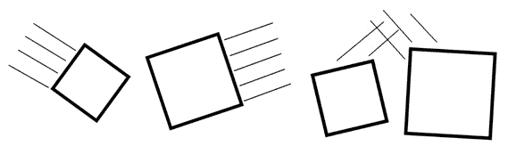

图 6.1 – 对象 A 和对象 B 相互阻塞

+   将 `GenerateOverlapEvents` 属性设置为 `true`，它们将调用其 `OnBeginOverlap` 和 `OnEndOverlap` 事件。这些重叠事件在对象开始和停止重叠另一个对象时分别调用。如果其中至少一个没有将此属性设置为 `true`，则它们都不会调用这些事件。

+   对象表现得好像另一个对象不存在，并将重叠在一起。

例如，假设玩家的角色走进一个标记关卡结束的触发框，这个触发框只对玩家的角色做出反应。

下图显示了两个对象重叠的示例：

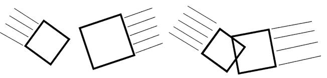

图 6.2 – 对象 A 和对象 B 重叠在一起

+   **重叠**响应，对象将表现得好像另一个对象不存在，并将重叠在一起。

两个对象忽略彼此的一个例子是，当除了玩家的角色之外的对象进入标记关卡结束的触发框时，这个触发框只对玩家的角色做出反应。

注意

您可以查看两个对象重叠的先前图表，以了解**忽略**。

下表将帮助您了解两个对象必须采取的必要响应，以触发之前描述的情况：

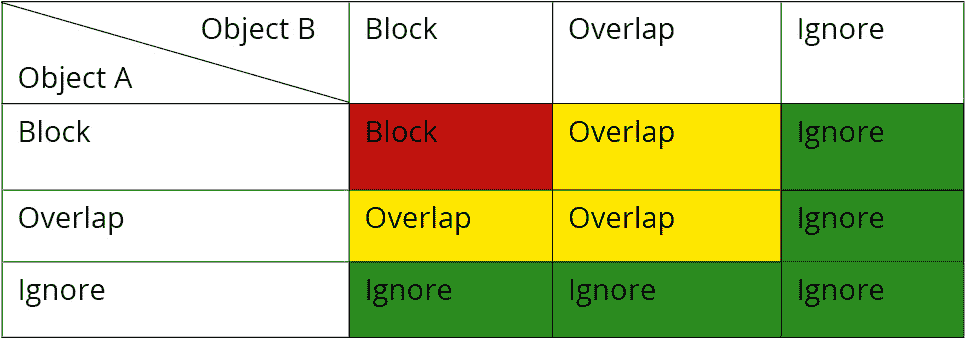

图 6.3 – 基于“阻止”、“重叠”和“忽略”的对象的响应结果

根据下表，假设你有两个对象——对象 A 和对象 B：

+   如果对象 A 将其对对象 B 的响应设置为**阻止**，而对象 B 将其对对象 A 的响应设置为**阻止**，它们将**阻止**彼此。

+   如果对象 A 将其对对象 B 的响应设置为**阻止**，而对象 B 将其对对象 A 的响应设置为**重叠**，它们将**重叠**在一起。

+   如果对象 A 将其对对象 B 的响应设置为**忽略**，而对象 B 将其对对象 A 的响应设置为**重叠**，它们将**忽略**彼此。

注意

您可以在[`docs.unrealengine.com/en-US/Engine/Physics/Collision/Overview`](https://docs.unrealengine.com/en-US/Engine/Physics/Collision/Overview)找到 UE5 的碰撞交互的完整参考。

物体之间的碰撞有两个方面：

+   **物理**：所有与物理模拟相关的碰撞，例如球体受到重力影响并在地板和墙壁上弹跳。

游戏中碰撞的物理模拟响应可以是以下两种情况之一：

+   两个对象继续它们的轨迹，就好像另一个对象不存在一样（没有物理碰撞）。

+   两个对象发生碰撞并改变它们的轨迹，通常至少有一个对象会继续其运动——也就是说，它们正在阻挡彼此的路径。

+   `OnHit` 事件

+   `OnBeginOverlap` 事件

+   `OnEndOverlap` 事件

+   游戏中碰撞的物理反应，可以是以下两种情况之一：

    +   两个对象继续移动，就像另一个对象不存在一样（没有物理碰撞）

    +   两个对象发生碰撞并阻挡了彼此的路径

物理方面的物理反应可能听起来与查询方面的物理反应相似；然而，尽管它们都是物理反应，但它们会导致对象以不同的方式表现。

物理方面的物理反应（物理模拟）仅适用于对象模拟物理时（例如，受到重力影响、从墙壁和地面上弹起等）。例如，当这样的对象撞到墙壁时，它会弹回并继续向另一个方向移动。

另一方面，查询方面的物理反应适用于所有不模拟物理的对象。当对象由代码控制时（例如，使用`SetActorLocation`函数或使用**角色移动**组件），对象可以不模拟物理而移动。在这种情况下，根据你用来移动对象的方法及其属性，当对象撞到墙壁时，它将简单地停止移动而不是弹回。这是因为你只是告诉对象向某个方向移动，而某个东西阻挡了它的路径，因此物理引擎不允许该对象继续移动。

现在我们已经了解了碰撞事件，让我们继续到下一节，我们将探讨碰撞通道。

# 理解碰撞通道

在上一章中，我们探讨了现有的追踪通道（*可见性*和*相机*）以及如何创建自定义通道。现在你已经了解了追踪通道，是时候讨论对象通道了，也称为对象类型。

虽然追踪通道仅用于线迹追踪，但对象通道用于对象碰撞。你可以为每个`对象`通道指定一个“目的”，就像追踪通道一样，例如**Pawn**、**静态对象**、**物理对象**、**投射物**等。然后，你可以指定每个对象类型如何通过阻挡、重叠或忽略该类型对象来响应所有其他对象类型。

现在我们已经了解了碰撞的工作原理，让我们回到上一章中我们选择的立方体的碰撞设置，在那里我们改变了其对可见性通道的反应。

按照以下步骤了解碰撞通道的更多信息：

1.  在以下屏幕截图中可以看到立方体：

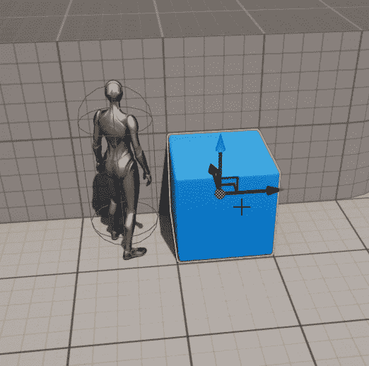

图 6.4 – 立方体阻挡了敌人的 SightSource

1.  在编辑器中打开级别后，选择立方体并转到其**详情**面板的**碰撞**部分：

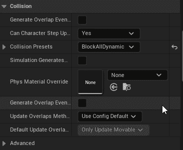

图 6.5 – 级别编辑器中的变化

在这里，我们可以看到一些对我们来说很重要的选项：

+   当对象模拟物理时将调用的 `OnHit` 事件（我们将在本章后面讨论这一点）。

+   将调用的 `OnBeginOverlap` 和 `OnEndOverlap` 事件。

+   **允许角色踏上**，允许角色轻松踏上此对象。

+   **碰撞预设**，允许我们指定此对象对每个碰撞通道的响应。

1.  让我们将 `默认` 更改为 `自定义` 并查看出现的新选项：

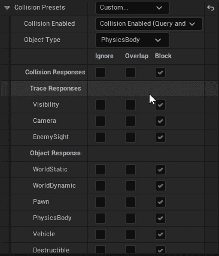

图 6.6 – 碰撞预设的变化

这些选项中的第一个是 **碰撞启用** 属性。它允许您指定您希望此对象考虑哪些碰撞方面：**查询**、**物理**、**两者**或 **无**。再次强调，物理碰撞与物理模拟相关（此对象是否会被其他模拟物理的对象考虑），而查询碰撞与碰撞事件以及对象是否会阻止彼此的运动相关：

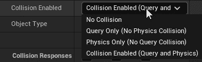

图 6.7 – 查询和物理的碰撞启用

第二个选项是 **对象类型** 属性。这与跟踪通道的概念非常相似，但专门用于对象碰撞，最重要的是，它决定了此碰撞对象的类型。UE5 伴随的对象类型值如下：

+   `WorldStatic`：不移动的对象（结构、建筑等）

+   `WorldDynamic`：可能移动的对象（其运动由代码触发，玩家可以捡起并移动的对象等）

+   `Pawn`：用于可以控制和在关卡中移动的 Pawns

+   `PhysicsBody`：用于模拟物理的对象

+   `Vehicle`：用于车辆对象

+   `Destructible`：用于可破坏网格

如前所述，您还可以创建自定义对象类型（将在本章后面提到），类似于您如何创建跟踪通道（*这在上一章中已介绍过*）。

我们最后一个选项与 `Cube` 对象的默认碰撞选项相关，所有响应都设置为 `Block`，这意味着此对象将阻止所有线迹和所有阻止 `WorldStatic` 对象的对象，前提是这是此对象的类型。

由于存在许多不同的碰撞属性组合，UE5 允许您将碰撞属性值分组为碰撞预设。

让我们回到 **碰撞预设** 属性，它目前设置为 **自定义**，并 *点击它*，这样我们就可以看到所有可能的选项。以下是一些现有的 **碰撞预设**：

+   `NoCollision`

+   `WorldStatic`

+   响应：无关

+   示例：纯视觉且距离较远的对象，例如玩家永远无法触及的对象

+   `Query`和`Physics`*   `WorldStatic`*   响应：`阻挡`所有通道*   示例：靠近玩家角色的对象，如地板和墙壁，它们将始终是静止的*   `Query`仅*   `WorldStatic`*   响应：`重叠`所有通道*   示例：放置在关卡中的触发框，它们将始终是静止的*   `Block All`预设，但对于在游戏过程中可能改变其变换的动态对象（`对象类型`：`WorldDynamic`）*   `Overlap All`预设，但对于在游戏过程中可能改变其变换的动态对象（`对象类型`：`WorldDynamic`）*   `Query`和`Physics`*   `Pawn`*   响应：`阻挡`所有通道，`忽略`可见性通道*   示例：玩家角色和非玩家角色*   `Query`和`Physics`*   `PhysicsBody`*   响应：`阻挡`所有通道*   示例：受物理影响的对象，如从地板和墙壁弹跳的球

就像其他碰撞属性一样，你也可以创建自己的碰撞预设。

注意

你可以在这里找到 UE5 的碰撞响应的完整参考：[`docs.unrealengine.com/en-US/Engine/Physics/Collision/Reference`](https://docs.unrealengine.com/en-US/Engine/Physics/Collision/Reference)。

现在我们已经了解了碰撞的基本概念，让我们继续创建`躲避球`类。接下来的练习将指导你完成这一任务。

## 练习 6.01 – 创建躲避球类

在这个练习中，我们将创建我们的`躲避球`类，它将被敌人投掷，并在地板和墙壁上弹跳，就像真正的躲避球一样。

在我们开始创建`躲避球`的 C++类及其逻辑之前，我们应该为它设置所有必要的碰撞设置。

以下步骤将帮助你完成这个练习：

1.  打开**项目设置**，进入**引擎**部分下的**碰撞**子部分。目前，没有对象通道，因此你需要创建一个新的通道。

1.  按下`躲避球`，并将其**默认响应**设置为**阻挡**。

1.  完成此操作后，展开**预设**部分。在这里，你可以找到 UE5 中所有可用的默认预设。如果你选择其中一个并按**编辑**选项，你可以更改该**预设碰撞**设置。

1.  创建你自己的`躲避球`

1.  `Collision Enabled (Query and Physics)`（我们希望它同时被考虑用于物理模拟和碰撞事件）

1.  `Dodgeball`

1.  `EnemySight`（我们不希望躲避球阻挡摄像头或敌人的视线）

1.  一旦你选择了正确的选项，请按**接受**。

现在已经设置了`躲避球`类的碰撞设置，让我们创建`躲避球`的 C++类。

1.  在**内容浏览器**区域中，*右键点击*并选择**新建 C++类**。

1.  选择**Actor**作为父类。

1.  选择`躲避球`，因此我们不能给这个新类取一个太接近的名字）。

1.  在 Visual Studio 中打开 `DodgeballProjectile` 类文件。我们首先想要做的是添加躲避球的碰撞组件，所以我们将向我们的类头文件添加一个 `SphereComponent`（*演员组件属性通常是私有的*）：

    ```cpp
    UPROPERTY(VisibleAnywhere, BlueprintReadOnly, Category = 
      Dodgeball, meta = (AllowPrivateAccess = "true"))
    class USphereComponent* SphereComponent;
    ```

1.  接下来，在我们的源文件顶部包含 `SphereComponent` 类：

    ```cpp
    #include "Components/SphereComponent.h"
    ```

注意

请记住，所有头文件包含必须位于 `.generated.h` 包含之前。

现在，前往 `DodgeballProjectile` 类的构造函数，在其源文件中，执行以下步骤：

1.  创建 `SphereComponent` 对象：

    ```cpp
    SphereComponent = CreateDefaultSubobject<USphereComponent>(TEXT("Sphere 
      Collision"));
    ```

1.  将其 `radius` 设置为 `35` 单位：

    ```cpp
    SphereComponent->SetSphereRadius(35.f);
    ```

1.  设置我们创建的 `Dodgeball` 预设：

    ```cpp
    SphereComponent->SetCollisionProfileName(FName("Dodgeball"));
    ```

1.  我们希望 `Dodgeball` 模拟物理，因此通知组件这一点，如下面的代码片段所示：

    ```cpp
    SphereComponent->SetSimulatePhysics(true);
    ```

1.  我们希望 `Dodgeball` 在模拟物理时调用 `OnHit` 事件，因此调用 `SetNotifyRigidBodyCollision` 函数将其设置为 `true`（这与我们在对象的 `Collision` 部分看到的 `SimulationGeneratesHitEvents` 属性相同）：

    ```cpp
    //Simulation generates Hit events
    SphereComponent->SetNotifyRigidBodyCollision(true);
    ```

我们还希望监听 `SphereComponent` 的 `OnHit` 事件。

1.  在 `DodgeballProjectile` 类的头文件中创建一个当 `OnHit` 事件被触发时将被调用的函数声明。这个函数应该被命名为 `OnHit`。它应该是 `public` 的，不返回任何内容（`void`），包含 `UFUNCTION` 宏，并接收一些参数，顺序如下：

    1.  `UPrimitiveComponent* HitComp`: 被击中的组件，属于此演员。原始组件是一个具有 `Transform` 属性和一些几何形状（例如 `Mesh` 或 `Shape` 组件）的演员组件。

    1.  `AActor* OtherActor`: 参与碰撞的其他演员。

    1.  `UPrimitiveComponent* OtherComp`: 被击中的组件，属于其他演员。

    1.  `FVector NormalImpulse`: 击中后物体将移动的方向以及移动的力度（通过检查向量的尺寸）。此参数对于模拟物理的物体将不为零。

    1.  `FHitResult& Hit`: 由本对象与其他对象碰撞产生的击中数据。正如我们在上一章中看到的，它包含诸如击中位置是否为法线、击中哪个组件和演员等属性。大部分相关信息已经通过其他参数提供给我们，但如果需要更详细的信息，可以访问此参数：

    ```cpp
    UFUNCTION()
    void OnHit(UPrimitiveComponent* HitComp, AActor* OtherActor, 
      UPrimitiveComponent* OtherComp, FVector 
      NormalImpulse, const 
      FHitResult& Hit);
    ```

将 `OnHit` 函数的实现添加到类的源文件中，并在该函数中，至少目前，当它击中玩家时销毁躲避球。

1.  将 `OtherActor` 参数转换为我们的 `DodgeballCharacter` 类，并检查其值是否不是 `nullptr`。如果不是，这意味着我们击中的其他演员是一个 `DodgeballCharacter`，我们将销毁这个 `DodgeballProjectile` 演员：

    ```cpp
    void ADodgeballProjectile::OnHit(UPrimitiveComponent * 
      HitComp, AActor * OtherActor, UPrimitiveComponent * 
      OtherComp, FVector NormalImpulse, const FHitResult & 
      Hit)
    {
      if (Cast<ADodgeballCharacter>(OtherActor) != 
      nullptr)
      {
        Destroy();
      }
    }
    ```

由于我们正在引用 `DodgebalCharacter` 类，我们需要在类源文件顶部包含它：

```cpp
#include "DodgeballCharacter.h"
```

注意

在下一章中，我们将更改这个函数，以便在销毁自身之前让躲避球对玩家造成伤害。我们将在讨论 `Actor` 组件时这样做。

1.  返回到 `DodgeballProjectile` 类的构造函数，并在末尾添加以下行以监听 `SphereComponent` 的 `OnHit` 事件：

    ```cpp
    // Listen to the OnComponentHit event by binding it to 
    // our function
    SphereComponent->OnComponentHit.AddDynamic(this, 
      &ADodgeballProjectile::OnHit);
    ```

这将绑定我们创建的 `OnHit` 函数到这个 `SphereComponent` 的 `OnHit` 事件（因为这是一个角色组件，这个事件被称为 `OnComponentHit`），这意味着我们的函数将与该事件一起调用。

1.  最后，将 `SphereComponent` 设置为该角色的 `RootComponent`，如下代码片段所示：

    ```cpp
    // Set this Sphere Component as the root component,
    // otherwise collision won't behave properly
    RootComponent = SphereComponent;
    ```

注意

对于一个移动的角色，在碰撞时表现正确，无论是模拟物理还是不模拟物理，通常需要角色的主要碰撞组件是其 `RootComponent`。

例如，`Character` 类的 `RootComponent` 组件是一个胶囊碰撞组件，因为该角色将会移动，而这个组件是角色与环境碰撞的主要方式。

现在我们已经添加了 `DodgeballProjectile` C++ 类的逻辑，让我们继续创建我们的蓝图类。

1.  编译你的更改并打开编辑器。

1.  在 **内容** | **ThirdPersonCPP** | **蓝图** 的 **内容浏览器** 区域中，右键单击，创建一个新的蓝图类。

1.  展开 `DodgeballProjectile` 类。然后，将其设置为父类。

1.  将新的蓝图类命名为 `BP_DodgeballProjectile`。

1.  打开这个新的蓝图类。

1.  注意 `HiddenInGame` 属性的线框表示：

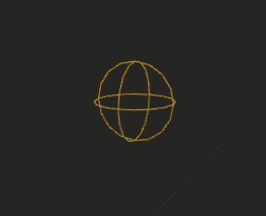

图 6.8 – SphereCollision 组件的视觉线框表示

1.  现在，将一个新的 **Sphere** 网格作为现有 **Sphere Collision** 组件的子组件添加：

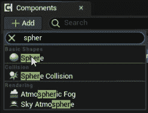

图 6.9 – 添加 Sphere 网格

1.  将其缩放更改为 `0.65`，如下截图所示：

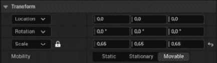

图 6.10 – 更新缩放

1.  设置其 `NoCollision`：

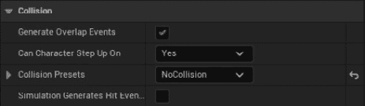

图 6.11 – 更新碰撞预设为无碰撞

1.  最后，打开我们的关卡，并在玩家附近放置 `BP_DodgeballProjectile` 类的一个实例（这个放置在 600 单位的高度）：

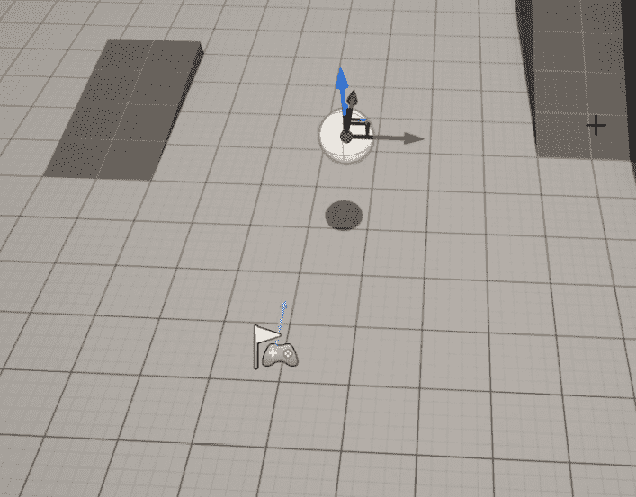

图 6.12 – 地面上的躲避球弹跳

在完成这些操作后，播放关卡。你会注意到躲避球会受到重力影响，并在地面弹跳几次后停止。

通过完成这个练习，你已经创建了一个像物理对象一样的对象。

你现在知道如何创建碰撞对象类型，使用 `OnHit` 事件，以及更改对象的碰撞属性。

注意

在上一章中，我们简要提到了 `LineTraceSingleByObjectType`。现在我们知道了对象碰撞的工作原理，我们可以简要地提到它的用途：当执行检查 Trace Channel 的 Line Trace 时，您应该使用 `LineTraceSingleByChannel` 函数；当执行检查对象通道（对象类型）的 Line Trace 时，您应该使用 `LineTraceSingleByObjectType` 函数。应该明确的是，这个函数与 `LineTraceSingleByChannel` 函数不同，它不会检查阻止特定对象类型的对象，而是检查特定对象类型的对象。这两个函数都有相同的参数，并且 Trace Channels 和 Object Channels 都可以通过 `ECollisionChannel` 枚举获得。

但如果你想让球多次从地板上弹起呢？如果你想让它弹跳得更高呢？嗯，这就是物理材质发挥作用的地方。

# 创建物理材质

在 UE5 中，您可以使用物理材质自定义在模拟物理时对象的行为。要进入这种新类型的资产，让我们创建自己的：

1.  在 `Content` 文件夹内创建一个名为 `Physics` 的新文件夹。

1.  在该文件夹内，右键单击 **Content Browser** 区域，然后在 **Create Advanced Asset** 部分下，转到 **Physics** 子部分并选择 **Physical Material**。

1.  将这个新的物理材质命名为 **PM_Dodgeball**。

1.  打开资产并查看可用的选项：

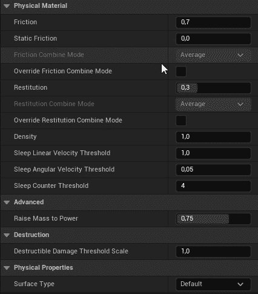

图 6.13 – 资产选项

我们应该注意的主要选项如下：

+   `0` 到 `1` 并指定摩擦将影响此对象多少（`0` 表示此对象将像在冰上一样滑动，而 `1` 表示此对象将像一块口香糖一样粘附）。

+   `0` 到 `1` 并指定在与其他对象碰撞后保留多少速度（`0` 表示此对象永远不会从地面上弹起，而 `1` 表示此对象会长时间弹跳）。

+   **密度**：此属性指定了该对象有多密集（即，相对于其网格有多重）。两个对象可以大小相同，但如果一个对象的密度是另一个的两倍，这意味着它将重两倍。

要让我们的 `DodgeballProjectile` 对象的行为更接近实际的躲避球，它将不得不承受相当大的摩擦（默认值是 `0.7`，已经足够高）并且非常弹跳。让我们将这个物理材质的 `Restitution` 属性增加到 `0.95`。

完成此操作后，打开 **BP_DodgeballProjectile** 蓝图类，并在其 **Collision** 部分的 **Sphere Collision** 组件中更改物理材质，将其更改为我们刚刚创建的 **PM_Dodgeball**：

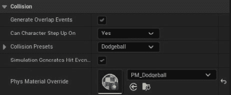

图 6.14 – 更新 BP_DodgeballProjectile 蓝图类

备注

确保您添加到关卡中的 `Dodgeball` 角色的实例也具有这种物理材质。

如果你再次播放我们在 *练习 6.01 – 创建 Dodgeball 类* 中创建的水平，你会注意到我们的 `BP_DodgeballProjectile` 现在会在地面弹跳几次后停下来，表现得更像一个真正的躲避球。

完成所有这些后，我们只缺少一个东西来让我们的 `Dodgeball` 角色表现得像真正的躲避球。目前，我们无法抛掷它。因此，让我们通过创建一个弹道运动组件来解决这一问题，这就是我们将在下一个练习中要做的。

在前面的章节中，当我们复制了第三人称模板项目时，我们了解到 UE5 中的 `Character` 类有一个 `CharacterMovementComponent`。这个角色组件允许角色以各种方式在关卡中移动，并且有许多属性允许你根据你的喜好进行自定义。然而，还有一个经常使用的运动组件：`ProjectileMovementComponent`。

`ProjectileMovementComponent` 角色组件用于将弹道行为赋予一个角色。它允许你设置初始速度、重力力和一些物理模拟参数，例如 `Bounciness` 和 `Friction`。然而，鉴于我们的 `Dodgeball Projectile` 已经在模拟物理，我们将使用的唯一属性是 `InitialSpeed`。

## 练习 6.02 – 向 DodgeballProjectile 添加弹道运动组件

在这个练习中，我们将向我们的 `DodgeballProjectile` 添加一个 `ProjectileMovementComponent`，使其具有初始水平速度。我们这样做是为了让它可以被敌人抛掷，而不仅仅是垂直下落。

以下步骤将帮助你完成这个练习：

1.  向 `DodgeballProjectile` 类的头文件中添加 `ProjectileMovementComponent` 属性：

    ```cpp
    UPROPERTY(VisibleAnywhere, BlueprintReadOnly, Category = 
      Dodgeball, meta = (AllowPrivateAccess = "true"))
    class UProjectileMovementComponent* ProjectileMovement;
    ```

1.  在类的源文件顶部包含 `ProjectileMovementComponent` 类：

    ```cpp
    #include "GameFramework/ProjectileMovementComponent.h"
    ```

1.  在类的构造函数末尾创建 `ProjectileMovementComponent` 对象：

    ```cpp
    ProjectileMovement = CreateDefaultSubobject<UProjectileMovementComponent>(TEXT("Pro
      jectile Movement"));
    ```

1.  然后，将其 `InitialSpeed` 设置为 `1500` 单位：

    ```cpp
    ProjectileMovement->InitialSpeed = 1500.f;
    ```

完成这些后，编译你的项目并打开编辑器。为了演示躲避球的初始速度，将其在 *Z*- 轴上的位置降低，并将其放置在玩家后面（这个放置在 200 单位的高度）：

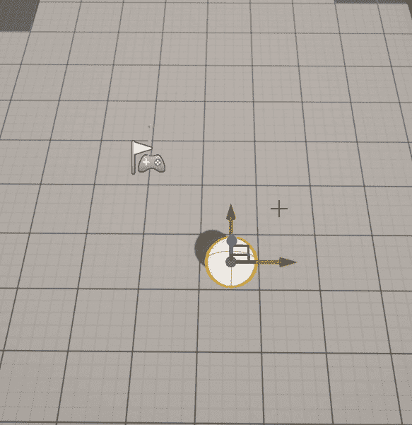

图 6.15 – 躲避球沿 X 轴移动

当你播放水平时，你会注意到躲避球开始向其 *X*- 轴（红色箭头）移动

有了这些，我们可以得出结论。我们的 `DodgeballProjectile` 现在表现得像真正的躲避球。它会下落、弹跳并被抛掷。

我们项目的下一步是向我们的 `EnemyCharacter` 添加逻辑，使其向玩家投掷这些躲避球。然而，在我们解决这个问题之前，我们必须解决计时器概念。

# 计时器介绍

由于视频游戏具有强事件驱动性的特点，每个游戏开发工具都必须有一种方式让你在某个事件发生之前造成延迟或等待时间。例如，当你玩一个在线死亡匹配游戏时，你的角色可以死亡并重生，通常，重生事件不会在你角色死亡的那一刻立即发生，而是在几秒后。有许多场景你希望某些事情发生，但只有在一定时间后。这将是我们的 `EnemyCharacter` 的情况，它将每隔几秒投掷一个躲避球。这种延迟或等待时间可以通过计时器实现。

**计时器**允许你在一定时间后调用一个函数。你可以选择以间隔循环该函数调用，也可以在循环开始前设置一个延迟。如果你想停止计时器，也可以这样做。

我们将使用计时器，以便我们的敌人每隔 `X` 段时间就投掷一个躲避球，只要它能看到玩家角色，就会无限期地继续这样做，当敌人不能再看到其目标时，停止那个计时器。

在我们开始向 `EnemyCharacter` 类添加逻辑，使其向玩家投掷躲避球之前，我们应该看看另一个话题，那就是如何生成演员。

# 理解如何生成演员

在 *第一章*，*Unreal Engine 简介* 中，你学习了如何通过编辑器将你创建的演员放置在关卡中，但如果你想在游戏进行时将那个演员放置在关卡中怎么办？这正是我们现在将要探讨的。

UE5，就像大多数其他游戏开发工具一样，允许你在游戏运行时放置一个演员。这个过程称为 `SpawnActor` 函数，可以从 `World` 对象（如前所述，我们可以使用 `GetWorld` 函数访问它）获取。然而，`SpawnActor` 函数有几个参数需要传递，如下所示：

+   `UClass*` 属性，它让函数知道将要生成的对象的类。这个属性可以是 C++ 类，通过 `NameOfC++Class::StaticClass()` 函数获取，或者蓝图类，通过 `TSubclassOf` 属性获取。通常，直接从 C++ 类生成演员不是一个好的做法，而是应该创建一个蓝图类，并生成该类的实例。

+   `TSubclassOf` 属性是你在 C++ 中引用蓝图类的一种方式。它用于在 C++ 代码中引用一个类，这可能是一个蓝图类。你必须使用模板参数声明一个 `TSubclassOf` 属性，这个模板参数是类必须继承的 C++ 类。我们将在下一个练习中看看如何在实际中使用这个属性。

+   要么是一个 `FTransform` 属性，要么是 `FVector` 和 `FRotator` 属性，这将指示我们想要生成的对象的定位、旋转和缩放。

+   一个可选的`FActorSpawnParameters`属性，允许你指定更多特定于生成过程的属性，例如谁导致了演员的生成（即`Instigator`），如果它生成的位置被其他对象占用，如何处理对象生成，这可能会导致重叠或阻塞事件等等。

`SpawnActor`函数将返回一个实例给从这个函数中生成的演员。鉴于它也是一个模板函数，你可以以这种方式调用它，直接使用模板参数接收你生成的演员类型的引用：

```cpp
GetWorld()->SpawnActor<NameOfC++Class>(ClassReference, 
  SpawnLocation, SpawnRotation);
```

在这种情况下，正在调用`SpawnActor`函数，我们正在生成`NameOfC++Class`类的实例。在这里，我们通过`ClassReference`属性提供了对类的引用，并通过`SpawnLocation`和`SpawnRotation`属性分别提供了要生成的演员的位置和旋转。

你将在*练习 6.03 – 向 EnemyCharacter 类添加投掷弹道逻辑*中学习如何应用这些属性。

在我们继续进行练习之前，我想简要地提一下`SpawnActor`函数的一个变体，这个变体可能也会很有用：`SpawnActorDeferred`函数。虽然`SpawnActor`函数会创建你指定的对象实例并将其放置到世界中，但这个新的`SpawnActorDeferred`函数将创建你想要的对象实例，并且只有在你调用演员的`FinishSpawning`函数时，它才会将对象放置到世界中。

例如，假设我们想在生成躲避球时改变它的`InitialSpeed`。如果我们使用`SpawnActor`函数，躲避球可能会在我们设置其`InitialSpeed`属性之前开始移动。然而，通过使用`SpawnActorDeferred`函数，我们可以创建躲避球的实例，然后将其`InitialSpeed`设置为所需的任何值，然后通过调用新创建的躲避球的`FinishSpawning`函数将其放置到世界中，该函数的实例由`SpawnActorDeferred`函数返回给我们。

现在我们已经知道了如何在世界中生成演员，并且也了解了计时器的概念，我们可以将负责投掷躲避球的逻辑添加到`EnemyCharacter`类中，这就是我们将在下一个练习中做的事情。

## 练习 6.03 – 向 EnemyCharacter 类添加投掷弹道逻辑

在这个练习中，我们将添加负责投掷`EnemyCharacter`类的逻辑。

打开类的文件以开始。我们将首先修改我们的`LookAtActor`函数，以便我们可以保存告诉我们是否可以看到玩家的值，并使用它来管理我们的计时器。

按照以下步骤完成这个练习：

1.  在`EnemyCharacter`类的头文件中，将`LookAtActor`函数的返回类型从`void`改为`bool`：

    ```cpp
    // Change the rotation of the character to face the 
    // given actor
    // Returns whether the given actor can be seen
    bool LookAtActor(AActor* TargetActor);
    ```

1.  在函数的实现中，在类的源文件内部做同样的事情，同时在调用 `CanSeeActor` 函数的 `if` 语句的末尾返回 `true`。同时，在检查 `TargetActor` 是否为 `nullptr` 的第一个 `if` 语句中返回 `false`，以及在函数的末尾：

    ```cpp
    bool AEnemyCharacter::LookAtActor(AActor * TargetActor)
    {
      if (TargetActor == nullptr) return false;
      if (CanSeeActor(TargetActor))
      {
        FVector Start = GetActorLocation();
        FVector End = TargetActor->GetActorLocation();
        // Calculate the necessary rotation for the Start 
        // point to face the End point
        FRotator LookAtRotation = 
        UKismetMathLibrary::FindLookAtRotation(
        Start, End);
        //Set the enemy's rotation to that rotation
        SetActorRotation(LookAtRotation);
        return true;
      }
      return false;
    }
    ```

1.  接下来，添加两个 `bool` 属性，`bCanSeePlayer` 和 `bPreviousCanSeePlayer`，在类的头文件中将它们设置为 `protected`，分别表示从敌人角色的视角是否可以看到玩家，以及玩家是否可以在上一帧中被看到：

    ```cpp
    //Whether the enemy can see the player this frame
    bool bCanSeePlayer = false;
    //Whether the enemy could see the player last frame
    bool bPreviousCanSeePlayer = false;
    ```

1.  然后，转到你的类的 `Tick` 函数实现，并将 `bCanSeePlayer` 的值设置为 `LookAtActor` 函数的返回值。这将替换之前的 `LookAtActor` 函数调用：

    ```cpp
    // Look at the player character every frame
    bCanSeePlayer = LookAtActor(PlayerCharacter);
    ```

1.  然后，将 `bPreviousCanSeePlayer` 的值设置为 `bCanSeePlayer` 的值：

    ```cpp
    bPreviousCanSeePlayer = bCanSeePlayer;
    ```

1.  在前两行之间，添加一个 `if` 语句来检查 `bCanSeePlayer` 和 `bPreviousCanSeePlayer` 的值是否不同。这意味着我们可能在上一帧中看不到玩家，而现在可以看到，或者我们可能在上一帧中可以看到玩家，而现在看不到：

    ```cpp
    bCanSeePlayer = LookAtActor(PlayerCharacter);
    if (bCanSeePlayer != bPreviousCanSeePlayer)
    {
    }
    bPreviousCanSeePlayer = bCanSeePlayer;
    ```

1.  在这个 `if` 语句内部，如果我们能看到玩家，我们想要启动一个计时器；如果我们不能再看到玩家，我们想要停止那个计时器：

    ```cpp
    if (bCanSeePlayer != bPreviousCanSeePlayer)
    {
      if (bCanSeePlayer)
      {
        //Start throwing dodgeballs
      }
      else
      {
        //Stop throwing dodgeballs
      }
    }
    ```

1.  要启动一个计时器，我们需要在我们的类头文件中添加以下属性，所有这些都可以是 `protected`：

    +   一个 `FTimerHandle` 属性，它负责识别我们想要启动哪个计时器。它作为特定计时器的标识符：

        ```cpp
        FTimerHandle ThrowTimerHandle;
        ```

    +   一个 `float` 属性，它代表投掷躲避球之间的等待时间（间隔），以便我们可以循环计时器。我们给它一个默认值 `2` 秒：

        ```cpp
        float ThrowingInterval = 2.f;
        ```

    +   另一个 `float` 属性，它代表计时器开始循环之前的初始延迟。让我们给它一个默认值 `0.5` 秒：

        ```cpp
        float ThrowingDelay = 0.5f;
        ```

    +   一个在计时器结束时每次都要调用的函数，我们将创建并调用 `ThrowDodgeball`。这个函数不返回任何内容，也不接收任何参数：

        ```cpp
        void ThrowDodgeball();
        ```

在我们可以调用适当的函数来启动计时器之前，我们需要在我们的源文件中添加一个 `#include`，指向负责该功能的对象 `FTimerManager`。

每个 `World` 都有一个计时器管理器，它可以启动和停止计时器，并访问与它们相关的相关函数，例如它们是否仍然活跃，它们将运行多长时间，等等：

```cpp
#include "TimerManager.h"
```

1.  现在，通过使用 `GetWorldTimerManager` 函数访问当前的 `World` 计时器管理器：

    ```cpp
    GetWorldTimerManager()
    ```

1.  接下来，如果可以看到玩家角色，调用计时器管理器的 `SetTimer` 函数来启动负责投掷躲避球的计时器。`SetTimer` 函数接收以下参数：

    +   代表所需计时器的 `FTimerHandle`：`ThrowTimerHandle`。

    +   被调用的函数所属的对象：`this`。

    +   需要调用的函数，必须通过在其名称前加上`&ClassName::`前缀来指定，结果为`&AEnemyCharacter::ThrowDodgeball`。

    +   计时器的速率或间隔：`ThrowingInterval`。

    +   这个计时器是否会循环：`true`。

    +   这个计时器开始循环前的延迟：`ThrowingDelay`。

以下代码片段包含了这些参数：

```cpp
if (bCanSeePlayer)
{
  //Start throwing dodgeballs
  GetWorldTimerManager().SetTimer(ThrowTimerHandle,
  this,
  &AEnemyCharacter::ThrowDodgeball,ThrowingInterval,
  true,
  ThrowingDelay);
}
```

1.  如果我们无法再看到玩家并且想要停止计时器，我们可以使用`ClearTimer`函数来实现。这个函数只需要接收一个`FTimerHandle`属性作为参数：

    ```cpp
    else
    {
      //Stop throwing dodgeballs
      GetWorldTimerManager().ClearTimer(ThrowTimerHandle);
    }
    ```

剩下的唯一事情就是实现`ThrowDodgeball`函数。这个函数将负责生成一个新的`DodgeballProjectile`演员。为了做到这一点，我们需要一个指向我们想要生成的类的引用，这个类必须继承自`DodgeballProjectile`。因此，接下来我们需要做的是使用`TSubclassOf`对象创建适当的属性。

1.  在`EnemyCharacter`头文件中创建`TSubclassOf`属性，可以是`public`：

    ```cpp
    //The class used to spawn a dodgeball object
    UPROPERTY(EditDefaultsOnly, BlueprintReadOnly, Category = 
      Dodgeball)
    TSubclassOf<class ADodgeballProjectile> DodgeballClass;
    ```

1.  因为我们将使用`DodgeballProjectile`类，所以我们也需要将其包含在`EnemyCharacter`源文件中：

    ```cpp
    #include "DodgeballProjectile.h"
    ```

1.  然后，在源文件中`ThrowDodgeball`函数的实现中，首先检查这个属性是否为`nullptr`。如果是，我们立即`return`：

    ```cpp
    void AEnemyCharacter::ThrowDodgeball()
    {
      if (DodgeballClass == nullptr)
      {
        return;
      }
    }
    ```

1.  接下来，我们将从这个类中生成一个新的演员。它的位置将在敌人前方`40`单位处，并且它的旋转将与敌人相同。为了在敌人角色前方生成躲避球，我们需要访问敌人的`ForwardVector`属性，它是一个单位`FVector` (*意味着其长度为 1*)，指示演员面对的方向，并将其乘以我们要生成躲避球的距离，即`40`单位：

    ```cpp
    FVector ForwardVector = GetActorForwardVector();
    float SpawnDistance = 40.f;
    FVector SpawnLocation = GetActorLocation() + (ForwardVector * 
      SpawnDistance);
    //Spawn new dodgeball
    GetWorld()->SpawnActor<ADodgeballProjectile>(DodgeballClass, 
      SpawnLocation, GetActorRotation());
    ```

这就完成了我们需要对`EnemyCharacter`类进行的修改。在我们完成设置这个逻辑的蓝图之前，让我们快速修改一下我们的`DodgeballProjectile`类。

1.  在 Visual Studio 中打开`DodgeballProjectile`类的源文件。

1.  在其`LifeSpan`设置为`5`秒内。这个属性属于所有演员，决定了它们在游戏中被销毁之前将保持多久。通过在`BeginPlay`事件中将我们的躲避球的`LifeSpan`设置为`5`秒，我们告诉 UE5 在生成该对象 5 秒后销毁它 (*或者如果它已经被放置在关卡中，游戏开始后 5 秒*)。我们将这样做，以便在一段时间后地板上不会充满躲避球，这会使游戏对玩家来说无意中变得困难：

    ```cpp
    void ADodgeballProjectile::BeginPlay()
    {
      Super::BeginPlay();

      SetLifeSpan(5.f);
    }
    ```

现在我们已经完成了与`EnemyCharacter`类躲避球投掷逻辑相关的 C++逻辑，让我们编译我们的更改，打开编辑器，然后打开我们的`BP_EnemyCharacter`蓝图。在那里，转到`Dodgeball` `Class`属性的值到`BP_DodgeballProjectile`：

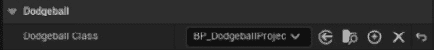

图 6.16 – 更新躲避球类

在你完成这些后，如果你在我们的关卡中放置了`BP_DodgeballProjectile`类的现有实例，你可以将其删除。

现在，我们可以玩我们的关卡了。你会注意到敌人几乎会立即开始向玩家投掷躲避球，并且只要玩家角色在视野中，就会继续这样做：

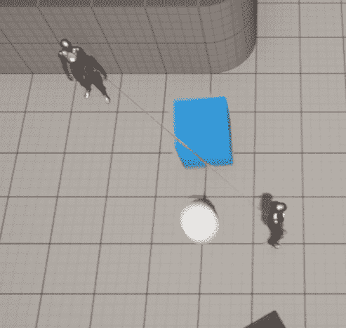

图 6.17 – 如果玩家在视线中，敌人角色投掷躲避球

有了这个，我们就完成了对`EnemyCharacter`的躲避球投掷逻辑。你现在知道如何使用计时器，这对于任何游戏程序员来说都是一项基本工具。

现在，让我们跳到下一节，我们将创建处理碰撞方式不同的墙壁。

# 创建墙壁类

我们项目的下一步是创建`Wall`类。我们将有两种类型的墙壁：

+   一个普通墙壁，它将阻挡敌人的视线、玩家角色和躲避球。

+   一个幽灵墙壁，它只会阻挡玩家角色，而忽略敌人的视线和躲避球。你可能会在特定类型的益智游戏中找到这种碰撞设置。

在下一项练习中，我们将创建这两个墙壁类。

## 练习 6.04 – 创建墙壁类

在这个练习中，我们将创建代表正常`Wall`和幽灵`Wall`的`Wall`类，它只会阻挡玩家角色的移动，但不会阻挡敌人的视线或他们投掷的躲避球。

让我们从正常的`Wall`类开始。这个 C++类将是空的，因为它唯一需要的是网格来反射投射物并阻挡敌人的视线，这些将通过其蓝图类添加。

以下步骤将帮助你完成这项练习：

1.  打开编辑器。

1.  在**内容浏览器**区域的左上角，按绿色**添加新**按钮。

1.  选择顶部第一个选项；即**添加功能或内容包**。

1.  一个新的窗口将出现。选择**内容包**选项卡，选择**入门内容**包，然后按**添加到项目**按钮。这将向项目中添加一些基本资产，我们将在这章和接下来的几章中使用这些资产。

1.  创建一个新的 C++类，命名为`Wall`，将其作为`Actor`类的父类。

1.  接下来，在 Visual Studio 中打开该类的文件，并添加一个`SceneComponent`作为我们墙壁的`RootComponent`：

    +   `Header`文件将如下所示：

        ```cpp
        private:
        UPROPERTY(VisibleAnywhere, BlueprintReadOnly, Category = Wall, 
          meta = (AllowPrivateAccess = "true"))
        class USceneComponent* RootScene;
        ```

    +   `Source`文件将如下所示：

        ```cpp
        AWall::AWall()
        {
          // Set this actor to call Tick() every frame.  You 
          // can turn this off to improve performance if you 
          // don't need it.
          PrimaryActorTick.bCanEverTick = true;
          RootScene = CreateDefaultSubobject<USceneComponent>(
          TEXT("Root"));
          RootComponent = RootScene;
        }
        ```

1.  编译你的代码并打开编辑器。

接下来，进入`Wall`类，命名为`BP_Wall`，并打开该资产：.

1.  添加一个`Wall_400x400`。

1.  设置其`M_Metal_Steel`。

1.  设置`-200`单位（*使网格相对于我们的演员原点居中*）：

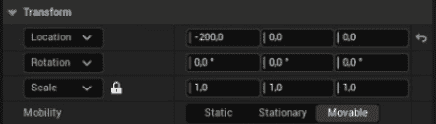

图 6.18 – 更新静态网格组件的位置

这就是你的蓝图类的视口应该看起来像的：

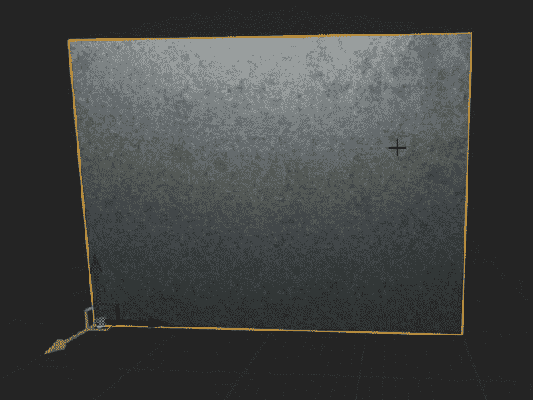

图 6.19 – Blueprint 类的视口墙

注意

通常情况下，当不需要碰撞组件时，将`SceneComponent`作为对象的`RootComponent`是一个好的实践，这样可以使其子组件具有更大的灵活性。

一个演员的`RootComponent`不能修改其位置或旋转，这就是为什么在我们的情况下，如果我们创建了一个`Wall` C++类并将其设置为根组件，而不是使用场景组件，我们将很难偏移它。

现在我们已经设置了常规的`Wall`类，让我们创建我们的`GhostWall`类。因为这些类没有设置任何逻辑，所以我们只是将`GhostWall`类作为`BP_Wall`蓝图类的子类创建，而不是我们的 C++类：

1.  *右键单击* **BP_Wall** 资产并选择**创建子蓝图类**。

1.  将新的蓝图命名为`BP_GhostWall`。

1.  打开它。

1.  将`CollisionPreset`更改为`Custom`。

1.  将其响应更改为`EnemySight`和`Dodgeball`通道的`Overlap`。

1.  将`Material`属性更改为`M_Metal_Copper`。

`BP_GhostWall`视口现在应该看起来像这样：

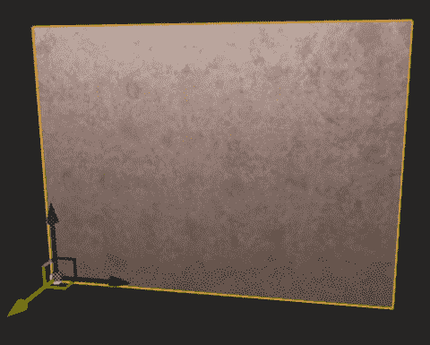

图 6.20 – 创建 GhostWall 类

现在你已经创建了这两个`Wall`演员，将它们分别放置在场景中以测试它们。将它们的变换设置为以下变换值：

+   `位置`：(710, -1710, 0)

+   `位置`：(720, 1720, 0)；`旋转`：(0, 0, 90)；

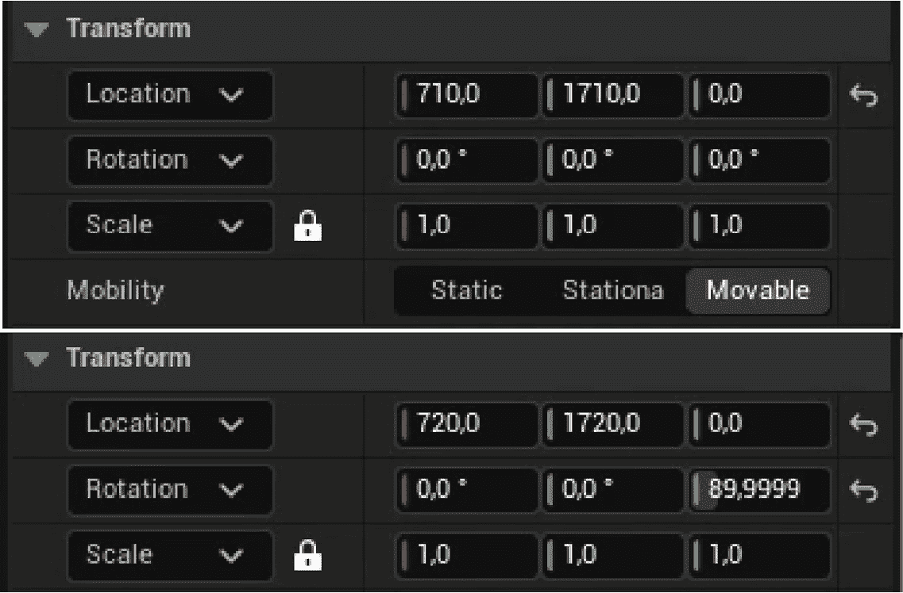

图 6.21 – 更新 GhostWall 类的位置和旋转

结果应该看起来像这样：

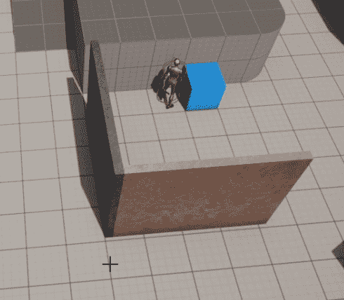

图 6.22 – GhostWall 和 Wall 类的结果

你会注意到，当你将你的角色隐藏在正常的`Wall`（右侧的那个）后面时，敌人不会向玩家投掷躲避球；然而，当你尝试将你的角色隐藏在`GhostWall`（左侧的那个）后面时，即使敌人无法穿过它，敌人仍会向角色投掷躲避球，它们会穿过墙壁，就像墙壁不存在一样！

这样，我们的练习就结束了。我们已经创建了`Wall`演员，它们将正常行为或忽略敌人的视线和躲避球！

# 创建 VictoryBox 演员

我们项目的下一步将是创建`VictoryBox`演员。这个演员将在玩家角色进入它时结束游戏，前提是玩家已经通过了关卡。为此，我们将使用`Overlap`事件。以下练习将帮助我们理解`VictoryBox`。

## 练习 6.05 – 创建 VictoryBox 类

在这个练习中，我们将创建`VictoryBox`类，当玩家角色进入时，它将结束游戏。

以下步骤将帮助您完成此练习：

1.  创建一个新的从 actor 继承的 C++类，并将其命名为`VictoryBox`。

1.  在 Visual Studio 中打开该类的文件。

1.  创建一个新的`SceneComponent`属性，它将用作`RootComponent`，就像我们在我们的`Wall` C++类中所做的那样：

    +   `Header`文件：

        ```cpp
        private:
        UPROPERTY(VisibleAnywhere, BlueprintReadOnly, Category = 
          VictoryBox, meta = (AllowPrivateAccess = "true"))
        class USceneComponent* RootScene;
        ```

    +   `Source`文件：

        ```cpp
        AVictoryBox::AVictoryBox()
        {
          // Set this actor to call Tick() every frame.  You 
          // can turn this off to improve performance if you 
          // don't need it.
          PrimaryActorTick.bCanEverTick = true;
          RootScene = 
          CreateDefaultSubobject<USceneComponent>(TEXT("Root"));
          RootComponent = RootScene;
        }
        ```

1.  在头文件中声明一个`BoxComponent`，它将检查与玩家角色的重叠事件，它也应该被标记为`private`：

    ```cpp
    UPROPERTY(VisibleAnywhere, BlueprintReadOnly, Category = 
      VictoryBox, meta = (AllowPrivateAccess = "true"))
    class UBoxComponent* CollisionBox;
    ```

1.  将`BoxComponent`文件包含在类的源文件中：

    ```cpp
    #include "Components/BoxComponent.h"
    ```

1.  在创建`RootScene`组件后，创建`BoxComponent`，它也应该被标记为`private`：

    ```cpp
    RootScene = CreateDefaultSubobject<USceneComponent>(TEXT("Root"));
    RootComponent = RootScene;
    CollisionBox = 
      CreateDefaultSubobject<UBoxComponent>(
      TEXT("Collision Box"));
    ```

1.  使用`SetupAttachment`函数将其附加到`RootComponent`：

    ```cpp
    CollisionBox->SetupAttachment(RootComponent);
    ```

1.  将其`BoxExtent`属性设置为所有轴上的`60`个单位。这将使`BoxComponent`的大小加倍——即`(120 x 120 x 120)`：

    ```cpp
    CollisionBox->SetBoxExtent(FVector(60.0f, 60.0f, 60.0f));
    ```

1.  使用`SetRelativeLocation`函数将相对位置沿*Z*轴偏移`120`个单位：

    ```cpp
    CollisionBox->SetRelativeLocation(FVector(0.0f, 0.0f, 
      120.0f));
    ```

1.  现在，你需要一个函数来监听 BoxComponent 的`OnBeginOverlap`事件。每当一个对象进入`BoxComponent`时，都会调用此事件。此函数必须以`UFUNCTION`宏开头，必须是`public`的，不返回任何内容，并具有以下参数：

    ```cpp
    UFUNCTION()
    void OnBeginOverlap(UPrimitiveComponent* OverlappedComp, 
      AActor* OtherActor, UPrimitiveComponent* OtherComp, 
      int32 
      OtherBodyIndex, bool bFromSweep, const FHitResult& 
      SweepResult);
    ```

这些参数如下：

+   `UPrimitiveComponent* OverlappedComp`：被重叠的组件，属于此 actor。

+   `AActor* OtherActor`：参与重叠的另一个 actor。

+   `UPrimitiveComponent* OtherComp`：被重叠的组件，属于另一个 actor。

+   `int32 OtherBodyIndex`：被击中的原始项的索引（通常对 Instanced Static Mesh 组件很有用）。

+   `bool bFromSweep`：重叠是否来自 Sweep Trace。

+   `FHitResult& SweepResult`：由本对象与其他对象碰撞产生的 Sweep Trace 的结果数据。

注意

虽然我们在这个项目中不会使用`OnEndOverlap`事件，但你迟早会需要使用它，所以这里提供了该事件的所需函数签名，它看起来与我们刚刚学到的非常相似：

`UFUNCTION()`

`void OnEndOverlap(UPrimitiveComponent* OverlappedComp, AActor* OtherActor, UPrimitiveComponent* OtherComp, int32 OtherBodyIndex);`

1.  接下来，我们需要将此函数绑定到 BoxComponent 的`OnComponentBeginOverlap`事件：

    ```cpp
    CollisionBox->OnComponentBeginOverlap.AddDynamic(this, 
      &AVictoryBox::OnBeginOverlap);
    ```

1.  在我们的`OnBeginOverlap`函数实现中，我们将检查重叠的 actor 是否是`DodgeballCharacter`。因为我们将引用这个类，所以我们也需要包含它：

    ```cpp
    #include "DodgeballCharacter.h" 
    void AVictoryBox::OnBeginOverlap(UPrimitiveComponent * 
      OverlappedComp, AActor * OtherActor, 
      UPrimitiveComponent * 
      OtherComp, int32 OtherBodyIndex, bool bFromSweep, 
      const 
      FHitResult & SweepResult)
    {
      if (Cast<ADodgeballCharacter>(OtherActor))
      {
      }
    }
    ```

如果重叠的 actor 是`DodgeballCharacter`，我们希望退出游戏。

1.  我们将使用`KismetSystemLibrary`来完成这个任务。`KismetSystemLibrary`类包含了一些在项目中一般使用的有用函数：

    ```cpp
    #include "Kismet/KismetSystemLibrary.h"
    ```

1.  为了退出游戏，我们将调用`KismetSystemLibrary`的`QuitGame`函数。此函数接收以下内容：

    ```cpp
    UKismetSystemLibrary::QuitGame(GetWorld(),
      nullptr,
      EQuitPreference::Quit,
      true);
    ```

上一代码片段中的重要参数如下：

+   一个`World`对象，我们可以通过`GetWorld`函数访问它。

+   一个 `PlayerController` 对象，我们将将其设置为 `nullptr`。我们这样做是因为这个函数将自动以这种方式找到它。

+   一个 `EQuitPreference` 对象，这意味着我们希望如何结束游戏，通过退出或只是将其作为后台进程。我们希望退出游戏，而不是将其作为后台进程。

+   一个 `bool`，表示我们是否希望在退出游戏时忽略平台的限制，我们将将其设置为 `true`。

接下来，我们将创建我们的蓝图类。

1.  编译你的更改，打开编辑器，转到 `VictoryBox`，并将其命名为 `BP_VictoryBox`。打开该资产并做出以下修改：

    +   添加一个新的 `Floor_400x400`

    +   设置其 `M_Metal_Gold`

    +   将其缩放设置为所有三个轴上的 `0.75` 单位

    +   将其位置设置为 `(-150, -150, 20)`，分别在 *X*、*Y* 和 *Z* 轴上。

一旦你做了这些更改，你的蓝图中的 **Viewport** 选项卡应该看起来像这样：


图 6.23 – 放置在蓝图视图中 `VictoryBox`

将这个蓝图放入你的关卡中以测试其功能：


图 6.24 – 在关卡中测试的 `VictoryBox` 蓝图

如果你玩这个关卡并踏上金色平台（并且与碰撞框重叠），你会注意到游戏会突然结束，正如预期的那样。

有了这些，我们就完成了 `VictoryBox` 类！你现在知道如何在项目中使用重叠事件。你可以使用这些事件创建许多游戏机制，所以恭喜你完成了这个练习。

我们现在非常接近本章的结尾，我们将完成一个新的活动，但首先，我们需要对我们的 `DodgeballProjectile` 类做一些修改，即为其 `ProjectileMovementComponent` 添加一个获取函数。我们将在下一个练习中这样做。

一个获取函数是一个只返回特定属性而不做其他事情的函数。这些函数通常被标记为内联，这意味着当代码编译时，对该函数的调用将简单地被其内容替换。它们通常也被标记为 `const`，因为它们不会修改类的任何属性。

## 练习 6.06 – 向 `DodgeballProjectile` 添加 `ProjectileMovementComponent` 获取函数

在这个练习中，我们将向 `DodgeballProjectile` 类的 `ProjectileMovement` 属性添加一个获取函数，以便其他类可以访问它并修改其属性。我们将在本章的活动中也这样做。

要做到这一点，你需要遵循以下步骤：

1.  在 Visual Studio 中打开 `DodgeballProjectile` 类的头文件。

1.  添加一个名为 `GetProjectileMovementComponent` 的新 `public` 函数。此函数将是一个内联函数，在 UE5 的 C++ 版本中，它被 `FORCEINLINE` 宏所替代。该函数还应返回一个 `UProjectileMovementComponent*` 并是一个 `const` 函数：

    ```cpp
    FORCEINLINE class UProjectileMovementComponent* 
      GetProjectileMovementComponent() const
    {
      return ProjectileMovement;
    }
    ```

注意

当为特定函数使用 `FORCEINLINE` 宏时，你不能将该函数的声明添加到头文件中，并将其实现添加到源文件中。两者都必须像之前展示的那样在头文件中同时完成。

有了这个，我们就完成了这个快速练习。在这里，我们向我们的 `DodgeballProjectile` 类添加了一个简单的 `getter` 函数，我们将在本章的活动中使用它，我们将用 `SpawnActorDeferred` 函数替换 `EnemyCharacter` 类中的 `SpawnActor` 函数。这将允许我们在生成其实例之前安全地编辑 `DodgeballProjectile` 类的属性。

## 活动 6.01 – 在 EnemyCharacter 中用 SpawnActorDeferred 替换 SpawnActor 函数

在这个活动中，你将更改 `EnemyCharacter` 的 `ThrowDodgeball` 函数，使用 `SpawnActorDeferred` 函数而不是 `SpawnActor` 函数，这样我们就可以在生成它之前更改 `DodgeballProjectile` 的 `InitialSpeed` 属性。

以下步骤将帮助你完成此活动：

1.  在 Visual Studio 中打开 `EnemyCharacter` 类的源文件。

1.  前往 `ThrowDodgeball` 函数的实现。

1.  因为 `SpawnActorDeferred` 函数不能仅仅接收一个生成位置和旋转属性，而必须接收一个 `FTransform` 属性，所以我们调用该函数之前需要创建一个这样的属性。让我们称它为 `SpawnTransform` 并将生成旋转和位置，按顺序，作为其构造函数的输入，这将分别是这个敌人的旋转和 `SpawnLocation` 属性。

1.  然后，更新 `SpawnActor` 函数调用在 `SpawnActorDeferred` 函数调用中。而不是将其第二个和第三个参数作为其生成位置和旋转，用我们刚刚创建的 `SpawnTransform` 属性替换，作为第二个参数。

1.  确保将此函数调用的返回值保存在一个名为 `Projectile` 的 `ADodgeballProjectile*` 属性中。

完成这些操作后，你将成功创建一个新的 `DodgeballProjectile` 对象。然而，我们仍然需要更改它的 `InitialSpeed` 属性并生成它。

1.  一旦你调用了 `SpawnActorDeferred` 函数，调用 `Projectile` 属性的 `GetProjectileMovementComponent` 函数，它返回其 `ProjectileMovementComponent`，并将它的 `InitialSpeed` 属性更改为 `2200` 单位。

1.  因为我们将访问属于 `EnemyCharacter` 类中的 `ProjectileMovementComponent` 的属性，我们需要包含该组件，就像我们在 *练习 6.02 – 将 ProjectileMovementComponent 添加到 DodgeballProjectile* 中所做的那样。

1.  一旦你改变了`InitialSpeed`属性的值，剩下的唯一事情就是调用`Projectile`属性的`FinishSpawning`函数，该函数将接收我们创建的`SpawnTransform`属性作为参数。

1.  完成这些后，编译你的更改并打开编辑器。

**预期输出**：

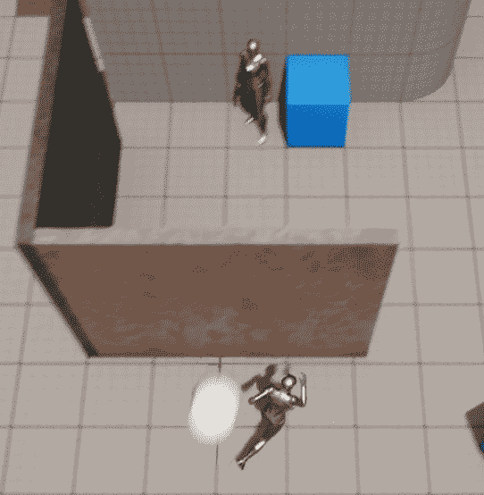

图 6.25 – 向玩家投掷的躲避球

注意

这个活动的解决方案可以在[`github.com/PacktPublishing/Elevating-Game-Experiences-with-Unreal-Engine-5-Second-Edition/tree/main/Activity%20solutions`](https://github.com/PacktPublishing/Elevating-Game-Experiences-with-Unreal-Engine-5-Second-Edition/tree/main/Activity%20solutions)找到。

通过完成这个活动，你已经巩固了`SpawnActorDeferred`函数的使用，并知道如何在未来的项目中使用它。

# 摘要

在本章中，你学习了如何使用物理模拟影响对象，创建对象类型和碰撞预设，使用`OnHit`、`OnBeginOverlap`和`OnEndOverlap`事件，更新对象的物理材质，以及使用计时器。

现在你已经了解了这些基本的碰撞主题，你将能够想出在创建项目时使用它们的新颖和创造性的方法。

在下一章中，我们将探讨演员组件、接口和蓝图函数库，这些对于保持项目复杂度可管理且高度模块化非常有用，从而让你能够轻松地将一个项目的部分添加到另一个项目中。
