# 使用 UMG 创建用户界面

在上一章中，我们学习了通用实用工具，这些工具允许你通过使用蓝图功能库、演员组件和接口来正确地结构和组织项目中的代码和资产。

在本章中，我们将深入探讨游戏**用户界面**（**UIs**）的主题，这些界面几乎存在于每款视频游戏中。游戏用户界面是向玩家展示信息的主要方式之一，例如他们剩下多少生命，他们的武器中有多少子弹，他们携带的武器是什么，等等。它还允许玩家通过选择是否继续游戏、创建新游戏、选择他们想要玩哪个关卡等方式与游戏互动。这主要以图像和文本的形式呈现给玩家。

在本章中，我们将涵盖以下主题：

+   游戏用户界面

+   UMG 基础

+   介绍锚点

+   理解进度条

# 技术要求

本章的项目可以在本书代码包的 Chapter08 文件夹中找到，该代码包可以在此处下载：[`github.com/PacktPublishing/Elevating-Game-Experiences-with-Unreal-Engine-5-Second-Edition`](https://github.com/PacktPublishing/Elevating-Game-Experiences-with-Unreal-Engine-5-Second-Edition)。

# 游戏用户界面

通常，用户界面是添加在游戏渲染之上，这意味着它们位于游戏中所见到的其他所有内容之前，并作为层（你可以在它们之上添加，就像在 Photoshop 中一样）。然而，这里有一个例外：*情境用户界面*。这种类型的用户界面不是叠加在游戏屏幕上，而是存在于游戏本身之中。一个很好的例子可以在游戏 *Dead Space* 中找到，在那里你以第三人称视角控制一个角色，可以通过查看他们背部连接的装置来查看他们的健康点数，这个装置位于游戏世界中。

通常有两种不同类型的游戏用户界面：**菜单**和**头戴式显示器（HUD）**。

菜单是允许玩家通过按按钮或输入设备上的键与之交互的用户界面面板。

这可以通过许多不同的菜单形式来完成，包括以下内容：

+   主菜单，玩家可以选择是否继续游戏、创建新游戏、退出游戏等

+   关卡选择菜单，玩家可以选择要玩哪个关卡

+   许多其他选项

头戴式显示器（HUD）是在游戏过程中存在的用户界面面板。它们向玩家提供他们应该始终知道的信息，例如他们剩下多少生命，他们可以使用哪些特殊能力，等等。

在本章中，我们将介绍游戏用户界面以及如何为我们自己的游戏制作菜单和头戴式显示器（HUD）。

备注

我们不会在这里介绍情境用户界面，因为它超出了本书的范围。

那么，我们如何在 UE5 中创建游戏 UI 呢？主要方式是使用 **Unreal Motion Graphics** （**UMG**），这是一个允许您制作游戏 UI（在 UE5 术语中也称为小部件）的工具，具有菜单和 HUD 功能，并将它们添加到屏幕上。

让我们在下一节中深入探讨这个主题。

# UMG 基础

在 UE5 中，创建游戏 UI 的主要方式是使用 `Graph` 选项卡。

小部件是 UE5 允许您表示游戏 UI 的方式。小部件可以是基本的 UI 元素，如 `Image` 元素，但它们也可以组合起来创建更复杂和完整的小部件，如菜单和 HUD，这正是我们在本章中将要做的。

在接下来的练习中，让我们使用 UMG 工具在 UE5 中创建我们的第一个小部件。

## 练习 8.01 – 创建 Widget Blueprint

在这个练习中，我们将创建我们的第一个 Widget Blueprint。此外，我们还将了解 UMG 的基本元素以及我们如何使用它们来创建游戏 UI。

以下步骤将帮助您完成此练习：

1.  为了创建我们的第一个小部件，打开编辑器，转到 **Content Browser** 部分的 **ThirdPersonCPP -> Blueprints** 文件夹，然后 *右键单击*。

1.  转到最后一部分，**用户界面**，并选择 **Widget Blueprint**。

1.  然后，从可用的父类列表中选择 **UserWidget**：

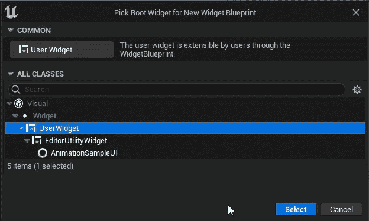

图 8.1 – 选择 UserWidget 父类

选择此选项将创建一个新的 `Widget Blueprint` 资产，这是 UE5 中小部件资产的名称。

1.  将此小部件命名为 `TestWidget` 并打开它。您将看到编辑 Widget Blueprint 的界面，在这里您将创建自己的小部件和 UI。以下是此窗口中所有标签的概述：

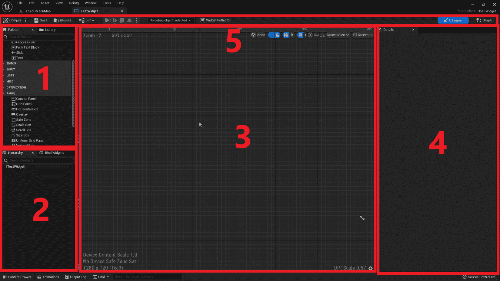

图 8.2 – 将 Widget Blueprint 编辑器分解为六个窗口

前一个截图中的标签详情如下：

+   `按钮` 元素、`文本框` 元素、`图像` 元素、`滑块` 元素、`复选框` 元素等。

+   **层次结构** – 此选项卡显示您当前小部件中所有 UI 元素。如您所见，目前我们的层次结构中只有一个 **Canvas Panel** 元素。

+   **设计师** – 此选项卡显示您的 widget 根据层次结构中存在的元素的外观，以及它们的布局方式。因为目前我们 widget 中唯一没有视觉表示的元素，所以此选项卡目前为空。

+   **详细信息** – 此选项卡显示您当前所选 UI 元素的属性。如果您选择现有的 **Canvas Panel** 元素，前一个截图中的所有选项都应出现。

+   因为这个资产是一个`Widget Blueprint`资产，这两个按钮允许你在**设计器**视图和**图形**视图之间切换，后者看起来就像一个正常蓝图类的窗口。

1.  现在，让我们看看我们`Canvas Panel`元素中可用的 UI 元素。

1.  通常，**Canvas Panel**元素被添加到 Widget Blueprints 的根目录，因为它们允许你在**设计器**选项卡中将 UI 元素拖动到任何你想要的位置。这样，你可以按你的意愿布局这些元素：屏幕中心、左上角、屏幕底部中心等。现在，让我们将另一个非常重要的 UI 元素拖动到我们的组件中：一个**按钮**元素。为了将**Canvas Panel**元素添加到你的组件中，请转到**调色板**窗口中的**面板**类别，并将**Canvas Panel**元素拖动到**层次结构**窗口中你的组件根目录（即第一个文本**[TestWidget]**）或**设计器**窗口中：

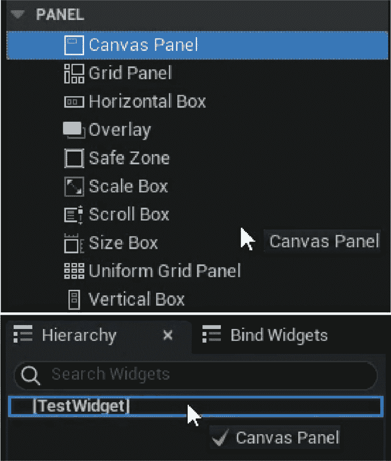

图 8.3 – 将 Canvas Panel 元素拖动到层次结构窗口

1.  在**调色板**选项卡中，找到**按钮**元素并将其拖动到**设计器**窗口中（在拖动时按住鼠标左键）：

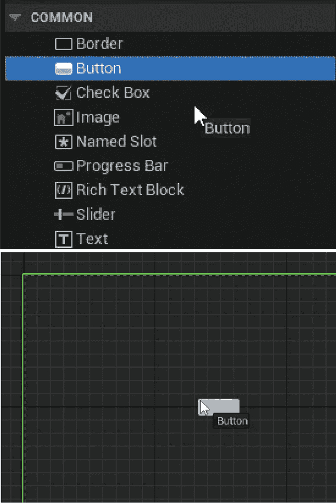

图 8.4 – 将按钮元素从调色板窗口拖动到设计器窗口

完成此操作后，你可以通过拖动围绕按钮的白色点来调整按钮的大小到你想要的大小（请注意，你只能对位于**Canvas Panel**元素内部的元素执行此操作）：

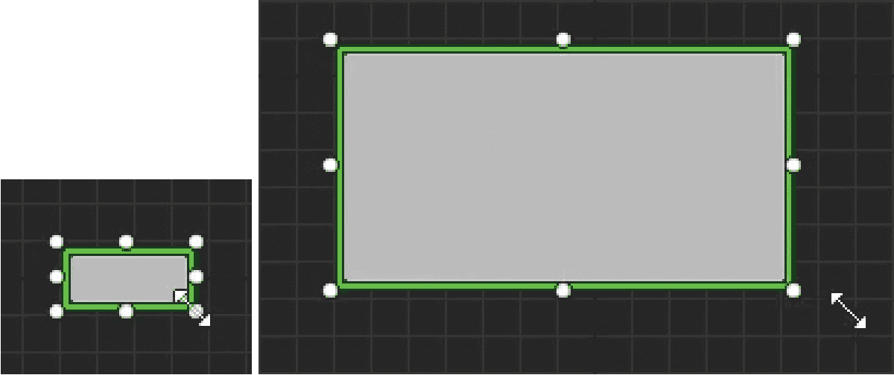

图 8.5 – 使用围绕 UI 元素的白色点调整大小后的结果

你还可以通过将元素拖动到**层次结构**选项卡而不是**设计器**选项卡来在组件内部拖动元素。

1.  现在将一个`Text`元素拖动到我们的**Button**元素内部，但这次，使用**层次结构**选项卡：


图 8.6 – 将文本元素从调色板窗口拖动到层次结构窗口

`Text`元素可以包含你指定的文本，具有特定的尺寸和字体，你可以在`详细信息`面板中修改这些设置。在您使用`层次结构`选项卡将`Text`元素拖动到`Button`元素内部后，`设计器`选项卡应该看起来是这样的：


图 8.7 – 在添加文本元素作为其子元素后，设计器选项卡中的按钮元素

让我们更改前面`文本`块的一些属性。

1.  在`层次结构`选项卡或**设计师**选项卡中选择它，并查看**详细信息**面板：


图 8.8 – 显示我们添加的文本元素的属性的详细信息面板

在这里，您将找到几个可以编辑的属性。现在，我们只想关注其中两个：文本内容和其颜色和透明度。

1.  将**文本****元素**的**内容**选项卡从**文本块**更新为**按钮 1**：

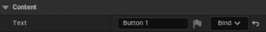

图 8.9 – 将文本元素的文本属性更改为按钮 1

接下来，让我们将`颜色和透明度`属性设置从`白色`更改为`黑色`。

1.  在 UE5 中点击`颜色`属性。它允许您以多种方式输入颜色，包括颜色轮、**饱和度**和**值**条、**RGB**和**HSV**值滑块等。

1.  现在，通过将**值**条（从上到下从白色到黑色的条）拖动到底部，然后按**确定**来将颜色从白色更改为黑色：

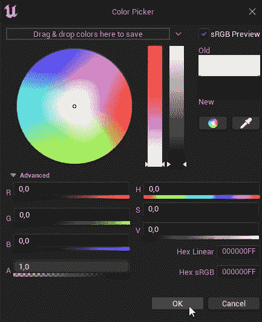

图 8.10 – 在颜色选择器窗口中选择黑色

1.  经过这些更改后，按钮应该看起来是这样的：

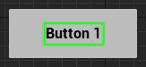

图 8.11 – 改变文本元素的文本属性及其颜色后的按钮元素

有了这些，我们就完成了本章的第一个练习。您现在已经了解了一些 UMG 的基本知识，例如如何将`按钮`和`文本`元素添加到您的组件中。

在我们进行下一个练习之前，首先，让我们来了解一下锚点。

# 介绍锚点

如您所知，视频游戏可以在许多不同尺寸和分辨率的屏幕上玩。因此，确保您创建的菜单可以有效地适应所有这些不同的分辨率非常重要。这就是**锚点**的主要目的。

锚点允许您通过指定屏幕所占比例来指定 UI 元素的大小如何适应屏幕分辨率的改变。使用锚点，您可以始终使 UI 元素位于屏幕的左上角，或者始终占据屏幕的一半，无论屏幕的大小和分辨率如何。

当屏幕大小或分辨率改变时，您的小部件将相对于其锚点进行缩放和移动。只有`Canvas Panel`元素的直接子元素才能有锚点，您可以通过`设计师`选项卡中的`锚点`可视化（当选择该元素时）：

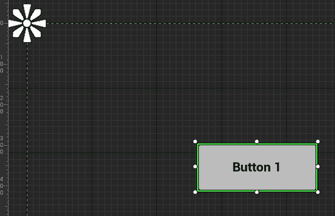

图 8.12 – 如设计师窗口中所示，轮廓左上角的锚定奖牌

默认情况下，锚点折叠到左上角，这意味着当分辨率变化时，你将无法对按钮的缩放进行太多控制。让我们在下一个练习中改变这一点。

## 练习 8.02 – 编辑 UMG 锚点

在这个练习中，我们将更改小部件中的锚点，以便按钮的大小和形状能够适应广泛的屏幕分辨率和尺寸。

以下步骤将帮助您完成此练习：

1.  选择上一个练习中创建的按钮。然后，转到 `Anchor` 预设，这将根据显示的轴心对齐 UI 元素。

我们希望按钮位于屏幕中心。

1.  点击屏幕中心的轴心：

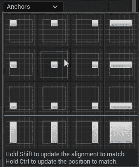

图 8.13 – 按钮的锚点属性，中心锚点预设用框突出显示

你会看到我们的锚定奖牌现在已经改变了位置：

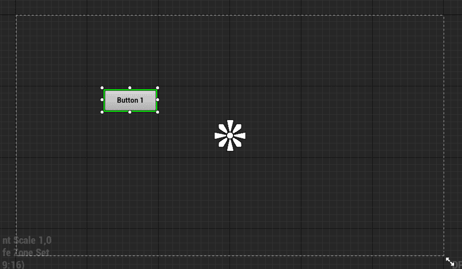

图 8.14 – 我们将按钮的锚点属性更改为中心后，锚定奖牌

现在，锚定奖牌位于屏幕中心，我们仍然无法对按钮在不同分辨率下的缩放进行太多控制，但至少我们知道它将相对于屏幕中心进行缩放。

为了使按钮居中在屏幕上，我们必须将按钮的位置也移动到屏幕中心。

1.  重复先前的步骤选择中心锚点，但这次，在您选择它之前，请按住 *Ctrl* 键以将按钮的位置固定到该锚点。点击后，释放 *Ctrl* 键。你应该会看到类似于以下截图的结果：

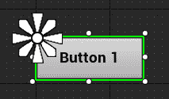

图 8.15 – 按钮元素被移动到其选定的中心锚点附近

如前面的截图所示，我们的按钮已经改变了位置，但还没有正确居中在屏幕上。这是因为其对齐方式。

`Alignment` 属性是 `Vector2D` 类型（一个包含两个 `float` 属性的元组：`X` 和 `Y`），它决定了 UI 元素相对于其总大小的中心。默认情况下，它设置为 `(0,0)`，这意味着元素的中心是其左上角，这解释了前面的截图中的结果。它可以一直延伸到 `(1,1)`，即右下角。在这种情况下，由于我们希望对齐以居中按钮，我们希望它为 `(0.5, 0.5)`。

1.  为了在选取“锚点”时更新 UI 元素的对齐方式，您必须按住 *Shift* 键并重复上一步。或者，为了同时更新按钮的位置和对齐方式，在按住 *Ctrl* 和 *Shift* 键的同时选择中心“锚点”即可完成任务。接下来的截图将是结果：

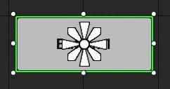

图 8.16 – 按钮元素相对于其选定的中心锚点居中

在这一点上，当更改屏幕分辨率时，我们知道这个按钮将始终保持在屏幕中心。然而，为了保持按钮相对于分辨率的大小，我们还需要进行一些修改。

1.  将锚章的右下 *花瓣* 拖动到按钮的右下角：

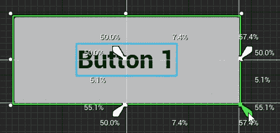

图 8.17 – 拖动锚章的右下角以更新按钮元素的锚点

1.  将锚章的左上 *花瓣* 拖动到按钮的左上角：

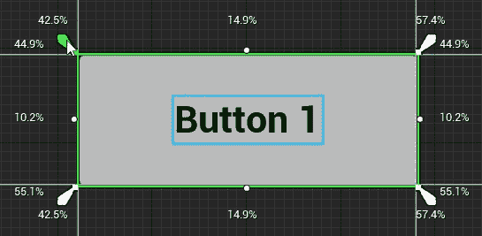

图 8.18 – 拖动锚章的左上角以更新按钮元素的锚点

注意

当更改“锚点”时，您在按钮周围看到的百分比是元素在屏幕上占用的空间，以百分比表示。例如，查看前面的截图，我们可以看到按钮在 *X* 坐标上占用了小部件空间的 `11.9%`，在 *Y* 坐标上占用了小部件空间的 `8.4%`。

您可以通过在移动锚章 *花瓣* 时按住 *Ctrl* 键来设置 UI 元素的大小为其锚点的大小。

现在，我们的按钮将最终适应不同的屏幕尺寸和分辨率，因为这些对其锚点的更改。

此外，您可以使用“详细信息”面板手动编辑我们刚刚使用锚章和移动按钮所编辑的所有属性：

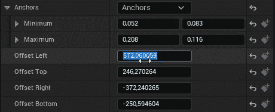

图 8.19 – 使用锚章更改的属性，如图所示在详细信息窗口中

最后，我们需要了解如何在“设计器”选项卡中用不同的分辨率可视化我们的小部件。

1.  在“设计器”选项卡内，拖动轮廓框右下角的双向箭头：

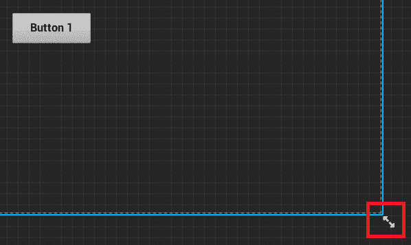

图 8.20 – 设计器选项卡内轮廓框右下角的双向箭头

通过拖动双箭头，你可以将画布调整到你想要的任何屏幕分辨率。在下面的屏幕截图中，你会看到各种设备最常用的分辨率，并且可以在每个分辨率中预览你的 widget：

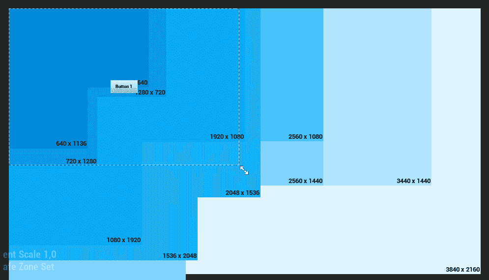

图 8.21 – 我们可以在设计器窗口中预览的分辨率

注意

你可以在[`docs.unrealengine.com/en-US/Engine/UMG/UserGuide/Anchors`](https://docs.unrealengine.com/en-US/Engine/UMG/UserGuide/Anchors)找到 UMG 锚点的完整参考。

这样，我们的练习就结束了。你已经了解了锚点以及如何使你的 widget 适应不同的屏幕尺寸和分辨率。

现在我们已经了解了一些 UMG 的基本知识，让我们看看我们如何为这个 Widget 蓝图创建一个 widget C++类。这就是我们将在下一个练习中要做的。

## 练习 8.03 – 创建 RestartWidget C++类

在这个练习中，我们将学习如何创建一个 widget C++类，这个类将是我们创建的 Widget 蓝图所继承的。当玩家在我们的**躲避球**游戏中死亡时，它将被添加到屏幕上，以便玩家可以选择重新开始关卡。这个 widget 将有一个按钮，当玩家点击它时，将重新开始关卡。

这个练习的第一步是将与 UMG 相关的模块添加到我们的项目中。虚幻引擎包含几个不同的模块，在每一个项目中，你必须指定你打算使用哪些模块。当生成源代码文件时，我们的项目附带了一些通用模块，但我们需要添加更多。

以下步骤将帮助您完成这个练习：

1.  打开位于项目`Source`文件夹中的`Dodgeball.build.cs`文件，这是一个 C#文件，而不是 C++文件。

1.  打开文件，你会找到从`PublicDependency ModuleNames`属性调用的`AddRange`函数。这个函数告诉引擎该项目打算使用哪些模块。作为一个参数，发送一个字符串数组，包含项目所有打算使用的模块的名称。鉴于我们打算使用 UMG，我们需要添加与 UMG 相关的模块：`UMG`、`Slate`和`SlateCore`：

    ```cpp
    PublicDependencyModuleNames.AddRange(new string[] { "Core", 
      "CoreUObject", "Engine", "InputCore", 
      "EnhancedInput", "HeadMountedDisplay", "UMG", 
      "Slate", "SlateCore" });
    ```

现在我们已经通知引擎我们将使用 UMG 模块，让我们创建我们的 widget C++类：

1.  打开虚幻编辑器界面。

1.  右键单击**内容浏览器**部分，并选择**新建 C++类**。

1.  将**显示所有类**复选框设置为**true**。

1.  搜索`UserWidget`类，并将其作为新类的父类选择。

1.  将新的 C++类命名为`RestartWidget`。

在 Visual Studio 中打开文件后，按照以下步骤开始修改我们的 widget C++类。

1.  我们将首先添加到这个类的一个`public` `class UButton*`属性，称为`RestartButton`，它代表玩家将按下的按钮以重新启动级别。你希望它通过使用带有`BindWidget`元标签的`UPROPERTY`宏绑定到继承自这个类的蓝图类中的一个按钮，这将强制 Widget 蓝图具有一个名为`RestartButton`的`Button`元素，我们可以通过这个属性在 C++中访问它，然后自由编辑其属性，如大小和位置，在蓝图中进行编辑：

    ```cpp
    UPROPERTY(meta = (BindWidget))
    class UButton* RestartButton;
    ```

注意

使用`BindWidget`元标签，如果继承自这个 C++类的 Widget 蓝图没有具有相同类型和名称的元素，将会导致编译错误。如果你不希望发生这种情况，你必须将`UPROPERTY`标记为可选的`BindWidget`，如下所示：

`UPROPERTY(meta = (BindWidget, OptionalWidget = true))`

这样做将使得绑定此属性是可选的，并且在编译 Widget 蓝图时不会导致编译错误。

接下来，我们将添加一个函数，当玩家点击`RestartButton`属性时将被调用，这将重新启动级别。我们将使用`GameplayStatics`对象的`OpenLevel`函数，然后发送当前级别的名称。

1.  在小部件类的头文件中，添加一个名为`OnRestartClicked`的`protected`函数的声明，该函数不返回任何内容，也不接收任何参数。这个函数必须标记为`UFUNCTION`：

    ```cpp
    protected:
    UFUNCTION()
    void OnRestartClicked();
    ```

1.  在类的源文件中，添加对`GameplayStatics`对象的`include`：

    ```cpp
    #include "Kismet/GameplayStatics.h"
    ```

1.  然后，为我们的`OnRestartClicked`函数添加一个实现：

    ```cpp
    void URestartWidget::OnRestartClicked()
    {
    }
    ```

1.  在这个实现内部，调用`GameplayStatics`对象的`OpenLevel`函数。这个函数接收一个世界上下文对象作为参数，这将是指针`this`，以及级别的名称，我们将使用`GameplayStatics`对象的`GetCurrentLevelName`函数来获取。此外，这个最后的函数也必须接收一个世界上下文对象，这也会是指针`this`：

    ```cpp
    UGameplayStatics::OpenLevel(this, 
      FName(*UGameplayStatics::GetCurrentLevelName(
      this)));
    ```

注意

调用`GameplayStatics`对象`GetCurrentLevelName`函数之前必须加上`*`，因为它返回一个`FString`类型，UE5 的字符串类型，并且必须解引用才能传递给`FName`构造函数。

下一步将是将此函数绑定，以便在玩家按下`RestartButton`属性时调用：

1.  为了做到这一点，我们不得不覆盖属于`UserWidget`类的一个函数，名为`NativeOnInitialized`。这个函数只调用一次，类似于演员的`BeginPlay`函数，这使得它适合进行我们的设置。在我们的小部件类头文件中添加一个`public` `NativeOnInitialized`函数的声明，并使用`virtual`和`override`关键字：

    ```cpp
    virtual void NativeOnInitialized() override;
    ```

1.  接下来，在类的源文件中，添加此函数的实现。在其内部，调用其`Super`函数并添加一个`if`语句，检查我们的`RestartButton`属性是否与`nullptr`不同：

    ```cpp
    void URestartWidget::NativeOnInitialized()
    {
      Super::NativeOnInitialized();
      if (RestartButton != nullptr)
      {
      }
    }
    ```

1.  如果`if`语句为真，我们将想要将我们的`OnRestartClicked`函数绑定到按钮的`OnClicked`事件。我们可以通过访问按钮的`OnClicked`属性并调用其`AddDynamic`函数来实现这一点。这会将我们想要调用该函数的对象、`this`指针以及要调用的函数的指针（即`OnRestartClicked`函数）作为参数发送：

    ```cpp
    if (RestartButton != nullptr)
    {
      RestartButton->OnClicked.AddDynamic(this, 
      &URestartWidget::OnRestartClicked);
    }
    ```

1.  因为我们要访问与`Button`类相关的函数，所以我们还需要包含它：

    ```cpp
    #include "Components/Button.h"
    ```

注意

当玩家按下并释放鼠标按钮时，将调用按钮的`OnClicked`事件。还有其他与按钮相关的事件，包括`OnPressed`事件（当玩家按下按钮时），`OnReleased`事件（当玩家释放按钮时），以及`OnHover`和`OnUnhover`事件（当玩家分别开始和停止将鼠标悬停在按钮上时）。

`AddDynamic`函数必须接收一个参数，该参数是一个带有`UFUNCTION`宏标记的函数的指针。如果不是这样，调用该函数时将出现错误。这就是为什么我们用`UFUNCTION`宏标记了`OnRestartClicked`函数。

完成这些步骤后，编译你的更改并打开编辑器。

1.  打开你之前创建的`TestWidget` Widget 蓝图。我们想要将此 Widget 蓝图与刚刚创建的`RestartWidget`类关联起来，因此我们需要将其重置父类。

1.  从 Widget 蓝图的新父类`RestartWidget`的 C++类：

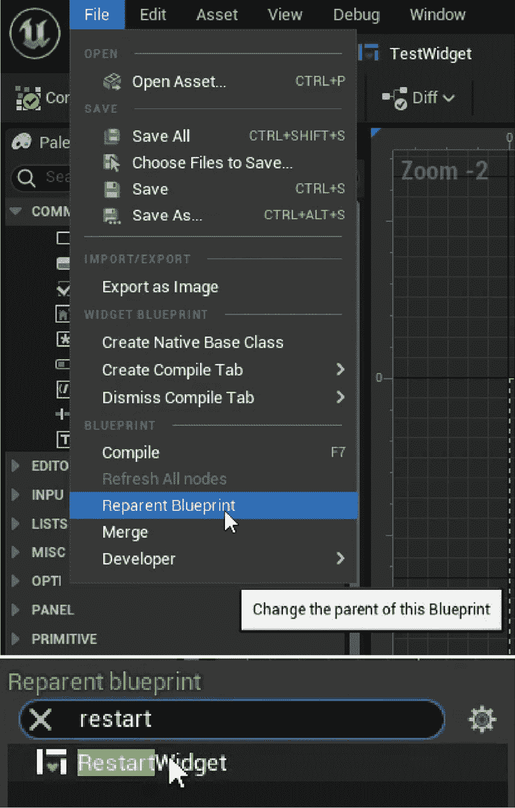

图 8.22 – 将 TestWidget 的类重置为 RestartWidget

你会注意到，Widget 蓝图现在有一个与我们在 C++类中创建的`BindWidget`元标签相关的编译错误：

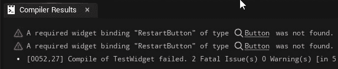

图 8.23 – 将父类设置为 RestartWidget 类后的编译错误

这是因为 C++类找不到名为`RestartButton`的`Button`属性。

为了修复这个问题，我们需要将 Widget 蓝图中的`Button`元素重命名为`RestartButton`：

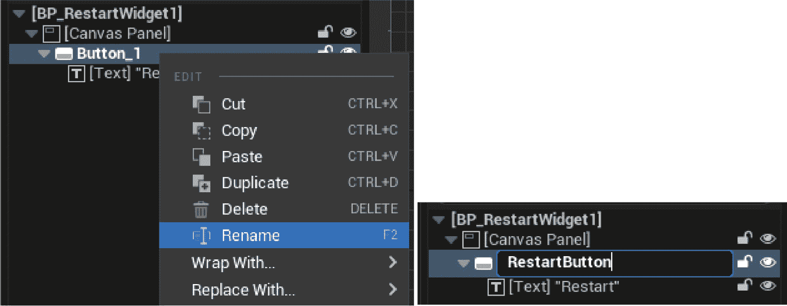

图 8.24 – 将 Button 元素重命名为 RestartButton

完成此操作后，关闭 Widget 蓝图，并将其名称从`TestWidget`更改为`BP_RestartWidget`，就像你在上一步中做的那样。

这就完成了我们的 widget 类的创建。现在，你理解了如何将 widget C++类连接到 Widget 蓝图，这是处理 UE5 游戏 UI 的重要一步。

接下来我们需要做的是创建我们的`Player Controller` C++类，它将负责实例化我们的`RestartWidget`类并将其添加到屏幕上。我们将在以下练习中完成这项工作。

## 练习 8.04 – 创建将 RestartWidget 类添加到屏幕的逻辑

在这个练习中，我们将创建负责将我们新创建的`RestartWidget`类添加到屏幕上的逻辑。当玩家死亡时，它将出现在屏幕上，以便他们有重新开始关卡的选择。

为了做到这一点，我们需要创建一个新的`Player Controller` C++类，您可以通过以下步骤来完成：

1.  打开 Unreal 编辑器界面。

1.  在`Content Browser`部分*右键单击*并选择`New C++ Class`。

1.  在搜索中查找`Player Controller`类，并将其作为新类的父类选择。

1.  将新的 C++类命名为`DodgeballPlayerController`。

1.  在 Visual Studio 中打开该类的文件。

当我们的玩家耗尽生命值时，`DodgeballCharacter`类将访问这个`Player Controller`类并调用一个函数，该函数将`RestartWidget`类添加到屏幕上。按照以下步骤进行操作以实现这一点。

为了知道要添加到屏幕上的小部件的类（这将是一个 Widget Blueprint 资产，而不是 Widget C++类），我们需要使用`TSubclassOf`类型。

1.  在类的头文件中，添加一个名为`BP_RestartWidget`的`public` `TSubclassOf<class URestartWidget>`属性。确保将其制作成一个带有`EditDefaultsOnly`标记的`UPROPERTY`函数，这样我们就可以在蓝图类中编辑它：

    ```cpp
    public:
    UPROPERTY(EditDefaultsOnly)
    TSubclassOf<class URestartWidget> BP_RestartWidget;
    ```

为了实例化这个小部件并将其添加到屏幕上，我们需要保存对其的引用。

1.  添加一个新的`private`变量，类型为`class URestartWidget*`，并将其命名为`RestartWidget`。确保将其制作成一个不带标记的`UPROPERTY`函数：

    ```cpp
    private:
    UPROPERTY()
    class URestartWidget* RestartWidget;
    ```

注意

虽然这个属性不应该在蓝图类中可编辑，但我们必须将这个引用做成一个`UPROPERTY`函数；否则，垃圾收集器将销毁这个变量的内容。

下一步我们需要的是一个负责将我们的小部件添加到屏幕上的函数。

1.  添加一个名为`ShowRestartWidget`的`public`函数声明，该函数不返回任何内容，也不接收任何参数：

    ```cpp
    void ShowRestartWidget();
    ```

1.  现在，转到我们的类源文件。首先，向`RestartWidget`类添加一个`include`：

    ```cpp
    #include "RestartWidget.h"
    ```

1.  然后，添加我们的`ShowRestartWidget`函数的实现，我们将首先检查我们的`BP_RestartWidget`变量是否不是一个`nullptr`变量：

    ```cpp
    void ADodgeballPlayerController::ShowRestartWidget()
    {
      if (BP_RestartWidget != nullptr)
      {
      }
    }
    ```

1.  如果该变量有效（不同于`nullptr`），我们想使用**Player Controller**的`SetPause`函数暂停游戏。这将确保游戏停止，直到玩家决定做某事（在我们的情况下，将按下重新开始关卡按钮）：

    ```cpp
    SetPause(true);
    ```

接下来，我们要更改输入模式。在 UE5 中，有三个输入模式：`Game Only`、`Game and UI` 和 `UI Only`。如果你的输入模式包括 `Game`，这意味着玩家角色和玩家控制器将通过输入动作接收输入。如果你的 `Input` 模式包括 `UI`，这意味着屏幕上的小部件将接收来自玩家的输入。当我们在这个屏幕上显示这个小部件时，我们不想让玩家角色接收任何输入。

1.  因此，更新到 `UI Only` `Input` 模式。你可以通过调用 `Player Controller` 的 `SetInputMode` 函数并将 `FInputModeUIOnly` 类型作为参数传递来实现这一点：

    ```cpp
    SetInputMode(FInputModeUIOnly());
    ```

在此之后，我们想要显示鼠标光标，以便玩家可以看到他们正在悬停的按钮。

1.  我们将通过将 `Player Controller` 的 `bShowMouseCursor` 属性设置为 `true` 来实现这一点：

    ```cpp
    bShowMouseCursor = true;
    ```

1.  现在，我们可以使用 `Player Controller` 的 `CreateWidget` 函数实际实例化我们的小部件，将 C++ 小部件类作为模板参数传递，在我们的例子中是 `RestartWidget`。然后，作为正常参数，我们将传递拥有者玩家，即拥有这个小部件并使用 `this` 指针发送的 `Player Controller` 类，以及小部件类，这将是我们的 `BP_RestartWidget` 属性：

    ```cpp
    RestartWidget = CreateWidget<URestartWidget>(this, 
      BP_RestartWidget);
    ```

1.  在实例化小部件后，我们将使用小部件的 `AddToViewport` 函数将其添加到屏幕上：

    ```cpp
    RestartWidget->AddToViewport();
    ```

1.  这就完成了我们的 `ShowRestartWidget` 函数。然而，我们还需要创建一个函数来从屏幕上移除 `RestartWidget` 类。在类的头文件中，添加一个与 `ShowRestartWidget` 函数类似的函数声明，但这次命名为 `HideRestartWidget`：

    ```cpp
    void HideRestartWidget();
    ```

1.  在类的源文件中，添加 `HideRestartWidget` 函数的实现：

    ```cpp
    void ADodgeballPlayerController::HideRestartWidget()
    {
    }
    ```

1.  在这个函数中，我们应该做的第一件事是通过调用其 `RemoveFromParent` 函数从小部件上移除它，并使用 `Destruct` 函数销毁它：

    ```cpp
    RestartWidget->RemoveFromParent();
    RestartWidget->Destruct();
    ```

1.  然后，我们想要使用之前函数中使用的 `SetPause` 函数来暂停游戏：

    ```cpp
    SetPause(false);
    ```

1.  最后，让我们将输入模式设置为 `Game Only`，并以与之前函数相同的方式隐藏鼠标光标（这次，我们传递的是 `FInputModeGameOnly` 类型）：

    ```cpp
    SetInputMode(FInputModeGameOnly());
    bShowMouseCursor = false;
    ```

这样，我们就完成了 `Player Controller` C++ 类的逻辑。接下来，我们应该调用将小部件添加到屏幕上的函数。

1.  前往 `DodgeballCharacter` 类的源文件，并将 `include` 关键字添加到我们新创建的 `DodgeballPlayerController` 类中：

    ```cpp
    #include "DodgeballPlayerController.h"
    ```

1.  在 `DodgeballCharacter` 类的 `OnDeath_Implementation` 函数实现中，将调用 `QuitGame` 函数替换为以下内容：

    +   使用 `GetController` 函数获取角色的玩家控制器。您需要将结果保存到名为 `PlayerController` 的 `DodgeballPlayerController*` 类型的变量中，因为该函数将返回 `Controller` 类型的变量，所以您还需要将其转换为我们的 `PlayerController` 类：

        ```cpp
        ADodgeballPlayerController* PlayerController = Cast<ADodgeballPlayerController>(GetController());
        ```

    +   检查 `PlayerController` 变量是否有效。如果是，调用其 `ShowRestartWidget` 函数：

        ```cpp
        if (PlayerController != nullptr)
        {
          PlayerController->ShowRestartWidget();
        }
        ```

在这些修改之后，我们最后要做的就是调用一个函数，该函数将隐藏我们的小部件。打开 `RestartWidget` 类的源文件并实现以下修改。

1.  向 `DodgeballPlayerController` 类添加一个 `include`，其中包含我们将要调用的函数：

    ```cpp
    #include "DodgeballPlayerController.h"
    ```

1.  在 `OnRestartClicked` 函数实现中，在调用 `OpenLevel` 函数之前，我们必须使用 `GetOwningPlayer` 函数获取小部件的 `OwningPlayer`，它属于 `PlayerController` 类型，并将其转换为 `DodgeballPlayerController` 类：

    ```cpp
    ADodgeballPlayerController* PlayerController = 
      Cast<ADodgeballPlayerController>(GetOwningPlayer());
    ```

1.  然后，如果 `PlayerController` 变量有效，我们调用其 `HideRestartWidget` 函数：

    ```cpp
    if (PlayerController != nullptr)
    {
      PlayerController->HideRestartWidget();
    }
    ```

在完成所有这些步骤后，关闭编辑器，编译您的更改，然后再次打开编辑器。

您现在已经完成了这个练习。我们已经添加了所有必要的逻辑，将我们的 `RestartWidget` 类添加到屏幕上。我们接下来要做的就是创建我们新创建的 `DodgeballPlayerController` 类的蓝图类，我们将在下一个练习中完成这个任务。

## 练习 8.05 – 设置 DodgeballPlayerController 蓝图类

在这个练习中，我们将创建 `DodgeballPlayerController` 的蓝图类，以指定我们想要添加到屏幕上的小部件。然后，我们将告诉 UE5 在游戏开始时使用这个蓝图类。

为了做到这一点，请按照以下步骤操作：

1.  在 **内容浏览器** 部分的 **ThirdPersonCPP -> Blueprints** 目录中，右键单击它，创建一个新的蓝图类。

1.  搜索 **DodgeballPlayerController** 类并将其作为父类选择。

1.  将这个蓝图类重命名为 `BP_DodgeballPlayerController`。之后，打开这个蓝图资产。

1.  转到其 `Class Defaults` 选项卡，并将类的 `BP_RestartWidget` 属性设置为创建的 `BP_RestartWidget` Widget 蓝图。

现在，我们最后要做的就是确保这个 `Player Controller` 蓝图类在游戏中被使用。

为了做到这一点，我们还需要遵循几个额外的步骤。

1.  在 `ThirdPersonCPP` -> `Blueprints` 目录中的 `DodgeballGameMode` 类中，选择它作为父类。然后，将这个 `Blueprint` 类重命名为 `BP_DodgeballGameMode`。

这个类负责告诉游戏每个游戏元素使用哪些类，例如使用哪个 `Player Controller` 类，以及其他一些内容。

1.  打开资产，转到其 `PlayerControllerClass` 属性到我们刚刚创建的 `BP_DodgeballPlayerController` 类：

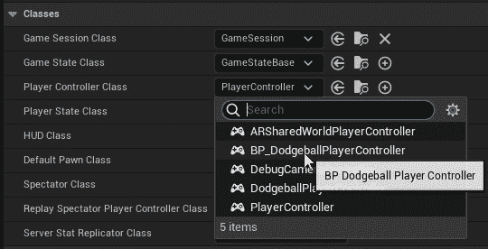

图 8.25 – 将 PlayerControllerClass 属性设置为 BP_DodgeballPlayerController

1.  关闭资产并选择编辑器工具栏顶部的**Blueprints**下拉选项，该工具栏位于**Level Viewport**窗口的顶部。从那里，选择**World Override**类别中的第二个**Game Mode**选项（当前应设置为**DodgeballGameMode**），**-> 选择 GameModeBase 类 -> BP_DodgeballGameMode**。这将告诉编辑器在当前关卡中使用这个新的**Game Mode**选项。

注意

此外，你还可以在**Project Settings**类别中设置**Game Mode**选项，这将告诉编辑器在所有关卡中使用该**Game Mode**选项。然而，如果一个关卡通过在**World Override**类别中设置**Game Mode**选项来覆盖此选项，则该选项将被忽略。

现在，玩一下游戏，让你的角色被躲避球击中`三次`。第三次击中后，你应该看到游戏暂停并显示`BP_RestartWidget`：

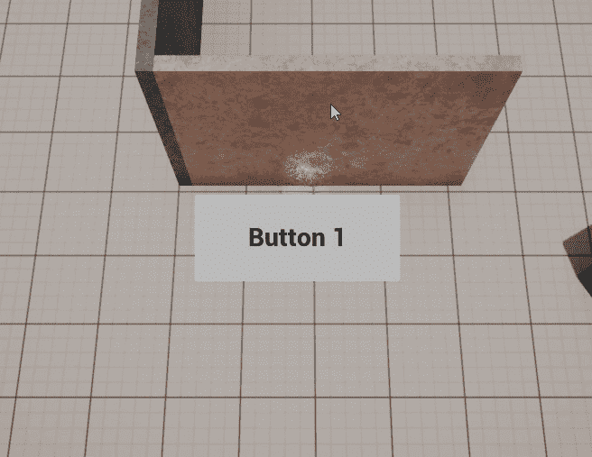

图 8.26 – 玩家耗尽健康点数后，我们的 BP_RestartWidget 属性被添加到屏幕上

当你用鼠标点击`按钮 1`时，你应该看到关卡重置到其初始状态：

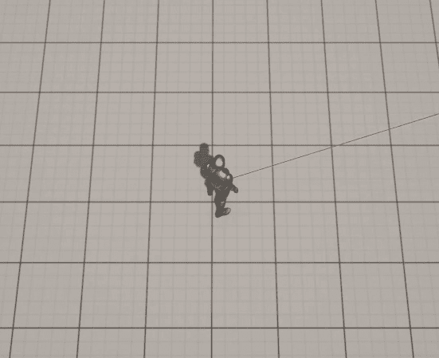

图 8.27 – 玩家按下前一个屏幕截图中的按钮后关卡重新开始

这样，我们的练习就结束了。现在你知道了如何创建小部件并在游戏中显示它们。这是你成为熟练游戏开发者旅程中的另一个关键步骤。

在我们进入下一节练习之前，让我们先看看进度条。

# 理解进度条

视频游戏可以通过**进度条**来表示角色统计数据，如健康、耐力等，这是我们用来向玩家传达角色健康值的方法。本质上，进度条是一个形状，通常是矩形，可以通过填充和清空来显示玩家特定统计数据的变化。如果你想向玩家显示角色的健康值只有最大值的一半，你可以通过显示进度条为半满来实现。在本节中，这正是我们将要做的。这个进度条将是我们的**躲避球**游戏 HUD 中的唯一元素。

为了在`User Interface`类中的`Widget Blueprint`类别内创建`ThirdPersonCPP` -> `Blueprints`目录。然后，选择`BP_HUDWidget`。之后，打开新的 Widget Blueprint。

将`Canvas Panel`元素添加到该小部件的根目录，就像我们在*练习 8.01 – 改进 RestartWidget 类*中的第 6 步所做的那样。

在 UE5 中，进度条只是另一个 UI 元素，例如`Button`元素和`Text`元素，这意味着我们可以从**调色板**选项卡将它们拖动到我们的**设计器**选项卡。看看以下示例：

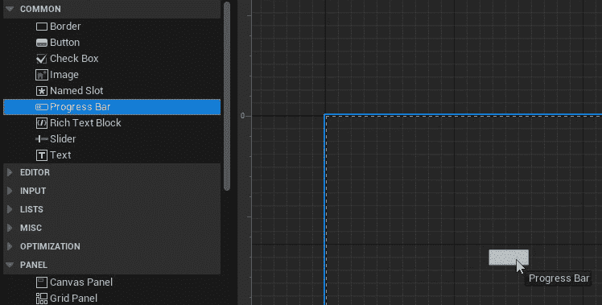

图 8.28 – 将进度条元素拖动到设计器窗口中

最初，这个进度条可能看起来像按钮；然而，它包含两个对进度条很重要的特定属性：

+   `0`到`1`。

+   **条形填充类型** – 这允许你指定你希望此进度条如何填充（从左到右、从上到下等）：

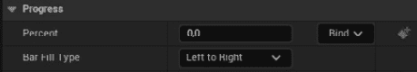

图 8.29 – 进度条的百分比和条形填充类型属性

如果你设置为`0.5`，进度条将相应地更新以填充其长度的一半：

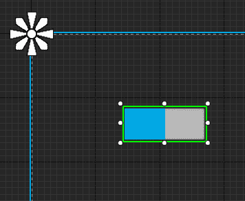

图 8.30 – 进度条填充到右侧的一半

在继续之前，设置`1`。

现在，让我们将进度条的颜色从蓝色（其默认颜色）更改为红色。为了做到这一点，转到`RGB(1,0,0)`):


图 8.31 – 进度条的颜色被更改为红色

完成此操作后，你的进度条现在应使用红色作为其填充颜色。

为了完成我们的进度条设置，让我们更新其位置、大小和锚点。按照以下步骤操作以实现这一点：

1.  在`X`轴上，和`Y`轴上的`0.083`

1.  `0.208`在`X`轴上，`0.116`在`Y`轴上

1.  设置`0`。

你的进度条现在应该看起来像这样：

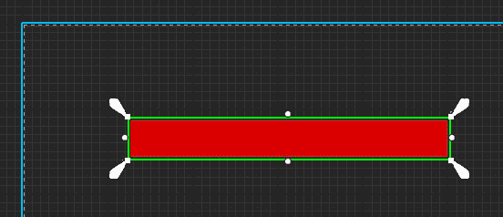

图 8.32 – 完成本节所有修改后的进度条

有了这些，我们可以得出进度条的主题。我们的下一步是添加所有必要的逻辑，以便将此进度条用作生命值条，通过更新其**百分比**属性与玩家角色的生命值一起更新。在下一个练习中，我们将做正是这样的事情。

## 练习 8.06 – 创建生命值条的 C++逻辑

在这个练习中，我们将添加所有必要的 C++逻辑来更新 HUD 中的进度条，随着玩家角色的生命值变化。

为了做到这一点，请按照以下步骤操作：

1.  打开编辑器并创建一个新的 C++类，该类从`UserWidget`继承，类似于我们在*练习 8.03 – 创建 RestartWidget C++类*中所做的那样。然而，这次，将其命名为`HUDWidget`。这将是我们用于 HUD 小部件的 C++类。

1.  在 `HUDWidget` 类的头文件中，添加一个新的 `public` 属性，类型为 `class UProgressBar*`，名为 `HealthBar`。这个类型用于在 C++ 中表示进度条，就像我们在上一节中创建的那样。确保将这个属性声明为带有 `BindWidget` 标签的 `UPROPERTY` 函数：

    ```cpp
    UPROPERTY(meta = (BindWidget))
    class UProgressBar* HealthBar;
    ```

1.  添加一个名为 `UpdateHealthPercent` 的 `public` 函数声明，该函数不返回任何内容，并接收一个 `float HealthPercent` 属性作为参数。这个函数将被调用来更新我们进度条上的 **Percent** 属性：

    ```cpp
    void UpdateHealthPercent(float HealthPercent);
    ```

1.  在 `HUDWidget` 类的源文件中，添加 `UpdateHealthPercent` 函数的实现，该函数将调用 `HealthBar` 属性的 `SetPercent` 函数，并将 `HealthPercent` 属性作为参数传递：

    ```cpp
    void UHUDWidget::UpdateHealthPercent(float HealthPercent)
    {
      HealthBar->SetPercent(HealthPercent);
    }
    ```

1.  因为我们将使用 `ProgressBar` C++ 类，所以需要在类的源文件顶部添加一个 `include`：

    ```cpp
    #include "Components/ProgressBar.h"
    ```

下一步是在我们的 `Player Controller` 类中添加所有必要的逻辑，该类负责将 `HUDWidget` 类添加到屏幕上。按照以下步骤实现：

1.  在 `DodgeballPlayerController` 类的头文件中，添加一个 `public` 属性，类型为 `TSubclassOf<class UHUDWidget>`，名为 `BP_HUDWidget`。确保将其标记为带有 `EditDefaultsOnly` 标签的 `UPROPERTY` 函数。

这个属性将允许我们在 `DodgeballPlayerController` 蓝图类中指定我们想要用作 HUD 的小部件：

```cpp
UPROPERTY(EditDefaultsOnly)
TSubclassOf<class UHUDWidget> BP_HUDWidget;
```

1.  添加另一个属性，这次是 `private` 的，类型为 `class UHUDWidget*`，名为 `HUDWidget`。将其标记为 `UPROPERTY` 函数，但不带任何标签：

    ```cpp
    UPROPERTY()
    class UHUDWidget* HUDWidget;
    ```

1.  为 `BeginPlay` 函数添加一个 `protected` 声明，并将其标记为 `virtual` 和 `override`：

    ```cpp
    virtual void BeginPlay() override;
    ```

1.  为一个新的 `public` 函数添加声明，名为 `UpdateHealthPercent`，该函数不返回任何内容，并接收 `float HealthPercent` 作为参数。

这个函数将由我们的玩家角色类调用，以更新我们 HUD 中的健康条：

```cpp
void UpdateHealthPercent(float HealthPercent);
```

1.  现在转到 `DodgeballPlayerController` 类的源文件。首先添加对 `HUDWidget` 类的 `include`：

    ```cpp
    #include "HUDWidget.h"
    ```

1.  然后，添加 `BeginPlay` 函数的实现，我们首先调用 `Super` 对象的 `BeginPlay` 函数：

    ```cpp
    void ADodgeballPlayerController::BeginPlay()
    {
      Super::BeginPlay();
    }
    ```

1.  在那个函数调用之后，检查 `BP_HUDWidget` 属性是否有效。如果是，使用 `UHUDWidget` 模板参数调用 `CreateWidget` 函数，并传递 `Owning Player`、`this` 和 `BP_HUDWidget` 小部件类作为参数。确保将 `HUDWidget` 属性设置为这个函数调用的返回值：

    ```cpp
    if (BP_HUDWidget != nullptr)
    {
      HUDWidget = CreateWidget<UHUDWidget>(this, 
      BP_HUDWidget);
    }
    ```

1.  在设置 `HUDWidget` 属性后，调用其 `AddToViewport` 函数：

    ```cpp
    HUDWidget->AddToViewport();
    ```

1.  最后，添加 `UpdateHealthPercent` 函数的实现，我们将检查 `HUDWidget` 属性是否有效。如果是，调用带有 `UHUDWidget` 模板参数的 `CreateWidget` 函数，并传递 `Owning Player`、`this` 和 `BP_HUDWidget` 小部件类作为参数。确保将 `HUDWidget` 属性设置为这个函数调用的返回值：

    ```cpp
    void ADodgeballPlayerController::UpdateHealthPercent(float 
      HealthPercent)
    {
      if (HUDWidget != nullptr)
      {
        HUDWidget->UpdateHealthPercent(HealthPercent);
      }
    }
    ```

现在我们已经添加了负责将 HUD 添加到屏幕并允许其更新的逻辑，我们需要对其他类进行一些修改。按照以下步骤进行操作。

目前，我们在上一章中创建的`Health`接口，只包含`OnDeath`事件，该事件在对象健康点耗尽时被调用。为了在玩家每次受到伤害时更新我们的生命条，我们需要允许我们的`HealthInterface`类在发生这种情况时通知对象。

1.  打开`HealthInterface`类的头文件，并添加一个类似于我们在*练习 7.04 – 创建 HealthInterface 类*中为`OnDeath`事件所做的声明的声明，但这次是为`OnTakeDamage`事件。此事件将在对象受到伤害时被调用：

    ```cpp
    UFUNCTION(BlueprintNativeEvent, Category = Health)
    void OnTakeDamage();
    virtual void OnTakeDamage_Implementation() = 0;
    ```

1.  现在我们已经将此事件添加到我们的`Interface`类中，让我们添加调用该事件的逻辑：打开`HealthComponent`类的源文件，在其`LoseHealth`函数的实现中，在从`Health`属性中减去`Amount`属性之后，检查`Owner`是否实现了`Health`接口，如果是，则调用其`OnTakeDamage`事件。像我们在该函数中稍后已经做的那样，以相同的方式进行此操作，但这次，只需将事件名称更改为`OnTakeDamage`：

    ```cpp
    if (GetOwner()->Implements<UHealthInterface>())
    {
      IHealthInterface::Execute_OnTakeDamage(GetOwner());
    }
    ```

因为我们的生命条将需要玩家角色的健康点数作为百分比，我们需要执行以下步骤。

1.  在我们的`HealthComponent`类中添加一个`public`函数，它返回的就是这个：在`HealthComponent`类的头文件中，添加一个声明为`FORCEINLINE`的函数的声明，该函数返回一个`float`属性。这个函数应该被称为`GetHealthPercent`，并且是一个`const`函数。其实现将简单地返回`Health`属性除以`100`，我们假设这是游戏中对象可以拥有的最大健康点数：

    ```cpp
    FORCEINLINE float GetHealthPercent() const { return Health / 
      100.f; }
    ```

1.  现在转到`DodgeballCharacter`类的头文件，并添加一个名为`OnTakeDamage_Implementation`的`public` `virtual`函数的声明，该函数不返回任何内容，也不接收任何参数。将其标记为`virtual`和`override`：

    ```cpp
    virtual void OnTakeDamage_Implementation() override;
    ```

1.  在`DodgeballCharacter`类的源文件中，为刚刚声明的`OnTakeDamage_Implementation`函数添加一个实现。将`OnDeath_Implementation`函数的内容复制到这个新函数的实现中，但进行以下更改：不是调用`PlayerController`的`ShowRestartWidget`函数，而是调用其`UpdateHealthPercent`函数，并将`HealthComponent`属性`GetHealthPercent`函数的返回值作为参数传递：

    ```cpp
    void ADodgeballCharacter::OnTakeDamage_Implementation()
    {
      ADodgeballPlayerController* PlayerController = 
      Cast<ADodgeballPlayerController>(GetController());
      if (PlayerController != nullptr)
      {
        PlayerController->
        UpdateHealthPercent(HealthComponent
        ->GetHealthPercent());
      }
    }
    ```

这就完成了这个练习的代码设置。完成这些更改后，编译你的代码，打开编辑器，并执行以下步骤。

1.  打开`BP_HUDWidget` Widget Blueprint，并将其重新父类设置为`HUDWidget`类，就像你在*练习 8.03 – 创建 RestartWidget C++类*中所做的那样。

1.  这将导致编译错误，你可以通过将我们的进度条元素重命名为 `HealthBar` 来修复它。

1.  关闭此 Widget Blueprint，打开 `BP_DodgeballPlayerController` 蓝图类，并将其 `BP_HUDWidget` 属性设置为 `BP_HUDWidget` Widget Blueprint：

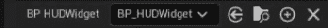

图 8.33 – 设置 BP_HUDWidget 属性为 BP_HUDWidget

在完成这些更改后，玩这个关卡。你应该注意到屏幕左上角的 **Health Bar** 进度条：

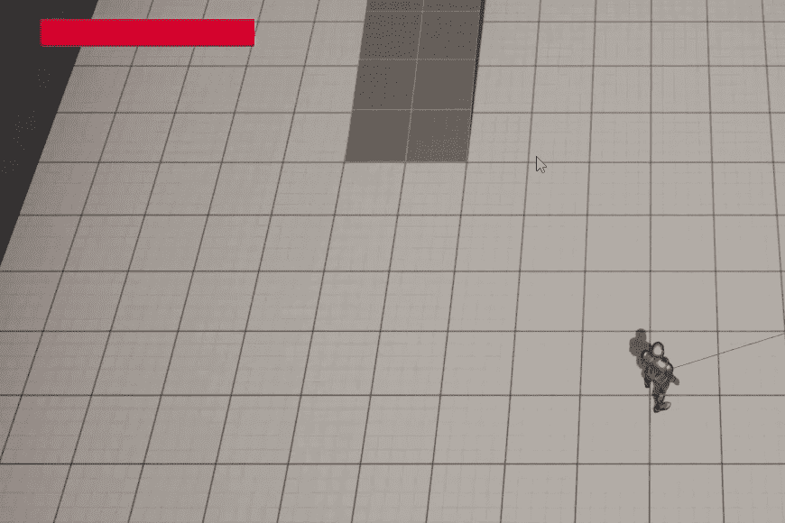

图 8.34 – 进度条显示在屏幕的左上角

当玩家角色被躲避球击中时，你应该注意到 `Health Bar` 进度条正在被清空：

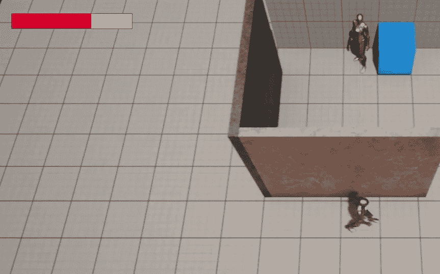

图 8.35 – 当玩家角色失去生命值时，进度条正在被清空

有了这些，我们就完成了这个练习。你已经学会了添加 HUD 到屏幕并在游戏过程中更新它的所有必要步骤。

## 活动 8.01 – 改进 RestartWidget 类

在这个活动中，我们将添加一个 `RestartWidget` 类，它读取 **Game Over**，以便玩家知道他们刚刚输掉了游戏；添加一个 **退出** 按钮，允许玩家退出游戏；并且更新现有按钮的文本为 **重启**，以便玩家知道当他们点击该按钮时会发生什么。

以下步骤将帮助您完成此活动：

1.  打开 `BP_RestartWidget` Widget Blueprint。

1.  将一个新的 `Text` 元素拖放到现有的 `Canvas Panel` 元素中。

1.  修改 `Text` 元素的属性：

    +   在 `X` 轴上展开 `0.291` 和在 `Y` 轴上展开 `0.115`。然后，将其 `X` 轴上的 `0.708` 和 `Y` 轴上的 `0.255` 设置。

    +   设置 `0`。

    +   设置 `GAME OVER`。

    +   设置 `RGBA(1.0, 0.082, 0.082, 1.0)`。

    +   展开 `100`。

    +   将 **对齐方式** 属性设置为 **居中对齐文本**。

1.  选择 `RestartButton` 属性内的另一个 `Text` 元素，并将其 `Restart` 更改。

1.  复制 `RestartButton` 属性，并将复制品的名称更改为 `ExitButton`。

1.  将 `ExitButton` 属性内的 `Text` 元素更改为 `Exit`。

1.  展开 `ExitButton` 属性，并将其 `X` 轴上的 `0.425` 和 `Y` 轴上的 `0.615` 设置。然后，将其 `X` 轴上的 `0.574` 和 `Y` 轴上的 `0.725` 设置。

1.  设置 `ExitButton` 属性为 `0`。

在完成这些更改后，我们需要添加处理 `ExitButton` 属性点击的逻辑，这将退出游戏：

1.  保存对 `BP_RestartWidget` Widget 蓝图的更改，并在 Visual Studio 中打开 `RestartWidget` 类的头文件。在这个文件中，添加一个名为 `OnExitClicked` 的 `protected` 函数声明，该函数不返回任何内容，也不接收任何参数。确保将其标记为 `UFUNCTION`。

1.  复制现有的 `RestartButton` 属性，但将其命名为 `ExitButton`。

1.  在 `RestartWidget` 类的源文件中，为 `OnExitClicked` 函数添加一个实现。将 `VictoryBox` 类源文件中的 `OnBeginOverlap` 函数的内容复制到 `OnExitClicked` 函数中，但移除对 `DodgeballCharacter` 类的转换。

1.  在 `NativeOnInitialized` 函数实现中，将我们创建的 `OnExitClicked` 函数绑定到 `ExitButton` 属性的 `OnClicked` 事件，就像我们在 *练习 8.03 – 创建 RestartWidget C++ 类* 中对 `RestartButton` 属性所做的那样。

这样，我们就完成了这个活动的代码设置。编译你的更改，并打开编辑器。然后，打开 `BP_RestartWidget` 属性并编译它，以确保没有由于 `BindWidget` 标签导致的编译错误。

完成这些后，再次播放关卡，让玩家角色被三个躲避球击中，并注意 `Restart` 控件会显示我们的新修改：

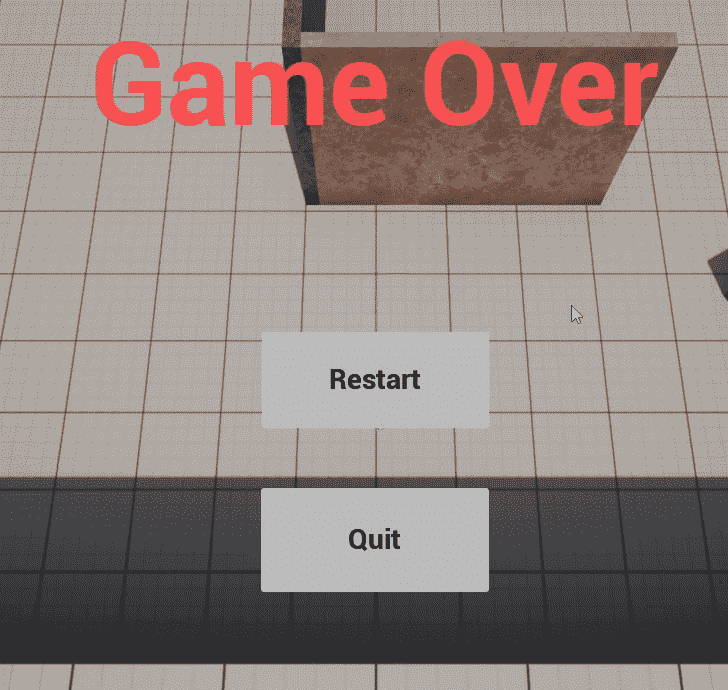

图 8.36 – 玩家健康值耗尽后显示的更新后的 BP_RestartWidget 属性

如果你按下“重启”按钮，你应该能够重新播放关卡，如果你按下“退出”按钮，游戏应该结束。

这样，我们就完成了这个活动。你已经巩固了使用 **Widget 蓝图** 和更改其元素属性的基础知识。现在你可以开始制作自己的菜单了。

注意

该活动的解决方案可以在 GitHub 上找到：[`github.com/PacktPublishing/Elevating-Game-Experiences-with-Unreal-Engine-5-Second-Edition/tree/main/Activity%20solutions`](https://github.com/PacktPublishing/Elevating-Game-Experiences-with-Unreal-Engine-5-Second-Edition/tree/main/Activity%20solutions)。

# 摘要

本章结束后，你现在已经学会了如何在 UE5 中制作游戏 UI，理解了菜单和 HUD 等内容。你看到了如何操作 Widget 蓝图的 UI 元素，包括按钮元素、文本元素和进度条元素；有效地使用锚点，这对于你的游戏 UI 优雅地适应多个屏幕至关重要；在 C++ 中监听鼠标事件，如 `OnClick` 事件，并使用它来创建自己的游戏逻辑；以及如何将你创建的控件添加到屏幕上，无论是在特定事件中添加还是在任何时候都显示。

在下一章中，我们将通过添加音视频元素，如声音和粒子效果，以及制作新关卡，来完善我们的**躲避球**游戏。
