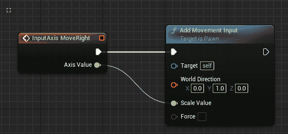

# 10

# 创建 SuperSideScroller 游戏

到目前为止，我们已经学习了关于 Unreal Engine、C++编程和一般游戏开发技术的很多知识。在前几章中，我们介绍了碰撞、追踪、如何使用 C++与 UE5 以及蓝图可视化脚本系统。除此之外，我们还获得了关于骨骼、动画和动画蓝图的关键知识，所有这些我们将在即将到来的项目中利用。

在本章中，我们将为新 SuperSideScroller 游戏设置项目。您将了解横版游戏的不同方面，包括升级、可收集物品和敌人 AI，这些我们将在项目中使用。您还将了解游戏开发中的角色动画流程，并学习如何操纵我们游戏角色的移动。

对于我们最新的项目，SuperSideScroller，我们将使用我们在前几章中用于开发游戏特性和系统的许多相同的概念和工具。碰撞、输入和 HUD 等概念将是我们项目的重点；然而，我们还将深入研究涉及动画的新概念，以重现流行横版游戏的机制。最终项目将是我们在本书中迄今为止所学内容的综合。

在本章中，我们将涵盖以下主要主题：

+   项目分解

+   玩家角色

+   探索我们的横版游戏功能

+   理解 Unreal Engine 5 中的动画

到本章结束时，我们将对我们的`SuperSideScroller`游戏想要实现的目标有一个更好的了解，并且我们将拥有开始开发的项目基础。

# 技术要求

对于本章，您需要安装 Unreal Engine 5。

本章不包含任何 C++代码，所有练习都在 UE5 编辑器中完成。让我们从对`SuperSideScroller`项目的简要概述开始本章。

本章的项目可以在本书代码包的 Chapter10 文件夹中找到，可以在此处下载：[`github.com/PacktPublishing/Elevating-Game-Experiences-with-Unreal-Engine-5-Second-Edition`](https://github.com/PacktPublishing/Elevating-Game-Experiences-with-Unreal-Engine-5-Second-Edition)。

# 项目分解

让我们以 1985 年在**任天堂娱乐系统**（**NES**）上发布的经典游戏《超级马里奥兄弟》为例。对于那些不熟悉这个系列的人来说，大致的想法是这样的：玩家控制马里奥，必须穿越蘑菇王国的众多危险障碍和生物，希望从邪恶的库巴王，鲍斯手中救出公主佩奇。

注意

为了更好地理解游戏的工作原理，请查看这个游戏玩法视频：[`www.youtube.com/watch?v=rLl9XBg7wSs`](https://www.youtube.com/watch?v=rLl9XBg7wSs)。

以下是该类型游戏中游戏的核心功能和机制：

+   `SuperSideScroller` 游戏将是 3D 的，而不是纯 2D，我们角色的移动将与马里奥相同，仅支持垂直和水平移动：

图 10.1 – 2D 和 3D 坐标向量的比较

+   `SuperSideScroller` 游戏也将如此。正如之前提到的，有许多不同的游戏，如 *Celeste*、*Hollow Knight* 和 *Super Meat Boy*，它们都使用了跳跃功能——所有这些都是在 2D 中。

+   **角色能力提升**：没有角色能力提升，许多横版滚动游戏会失去其混乱感和可玩性。例如，在游戏 *Ori and the Blind Forest* 中，开发者引入了不同的角色能力，这些能力改变了游戏的玩法。像三重跳或空中冲刺这样的能力为玩家提供了多种导航关卡的可能性，并允许关卡设计师根据玩家的移动能力创建有趣的布局。

+   **敌人 AI**：引入具有各种能力和行为的敌人，为玩家增加一层挑战，除了仅通过使用可用的移动机制来导航关卡之外。

注意

游戏中的 AI 如何与玩家互动有哪些方式？例如，在 *The Elder Scrolls V: Skyrim* 中，各个城镇和村庄中都有 AI 角色，它们可以与玩家进行对话，解释世界构建元素，如历史，向玩家出售物品，甚至向玩家发布任务。

+   `SuperSideScroller` 游戏将允许玩家收集金币。

现在我们已经评估了我们想要支持的游戏机制，我们可以根据我们的 `SuperSideScroller` 游戏以及我们需要实现这些功能来分解每个机制的功能。

# 玩家角色

任何游戏的内核都是玩家角色；也就是说，玩家将与之交互并玩游戏的角色实体。对于我们的 `SuperSideScroller` 项目，我们将创建一个简单的角色，具有自定义网格、动画和背后的逻辑，以使其具有横版滚动游戏的适当感觉。

几乎我们想要为我们的角色提供的所有功能，在使用 UE5 中的`Side Scroller`游戏项目模板时都会默认提供。

注意

在撰写本文时，我们正在使用 Unreal Engine 版本 5.0.0；使用该引擎的其他版本可能会导致编辑器、工具以及您稍后逻辑工作的一些差异，所以请记住这一点。

在下一个练习中，我们将创建我们的游戏项目并设置我们的玩家角色，同时探索我们如何操纵角色的参数来改进其移动。

# 将第三人称模板转换为侧滚动游戏

回到 Unreal Engine 4，该引擎附带了一个 `侧滚动` 模板，可以用作 `SuperSideScroller` 项目的基模板；然而，在 UE5 中，没有这样的模板。因此，我们将使用 UE5 提供的 `第三人称` 模板项目，并更新一些参数，使其看起来和感觉像是一款侧滚动游戏。

让我们首先创建我们的项目。

## 练习 10.01 – 创建侧滚动项目和使用角色移动组件

在这个练习中，你将设置 UE5 使用 `第三人称` 模板。这个练习将帮助你开始我们的游戏。

按照以下步骤完成练习：

1.  首先，打开 Epic Games Launcher，导航到左侧选项底部的 **Unreal Engine** 选项卡，并选择顶部的 **库** 选项。

1.  接下来，你将看到一个窗口提示你打开现有项目或创建一个特定类别的新的项目。在这些选项中有一个 **游戏** 类别；为我们的项目选择此选项。在项目类别选择后，你将被提示选择项目的模板。

1.  接下来，点击 **第三人称** 选项；因为 **侧滚动** 模板不再存在，**第三人称** 模板是我们目前最接近的选项。

最后，在 Unreal Engine 为我们创建项目之前，我们需要设置默认的项目设置。

1.  选择基于 `C++` 而不是 `Blueprints` 的项目，包含 `Starter Content`，并使用 `Desktop/Console` 作为我们的平台。其余的项目设置可以保留默认设置。选择所需的位置，将项目命名为 `SuperSideScroller`，并将项目保存在您选择的适当目录中。

1.  应用这些设置后，选择 **创建项目**。当引擎编译完成后，Unreal Editor 和 Visual Studio 都将打开，我们可以继续进行这个练习的下一步：

图 10.2 – Unreal Engine 编辑器现在应该已经打开

现在我们已经创建了项目，我们需要执行一系列步骤来将 `第三人称` 模板更改为 `侧滚动`，首先是从更新输入 **轴映射** 开始。按照以下步骤操作：

1.  我们可以通过 **项目设置** 中的 **轴映射** 来访问，通过在编辑器的左上角选择 **编辑** 下拉菜单，然后选择 **项目设置** 选项。

1.  在 **项目设置** 中，我们可以在 **引擎** 类别下找到 **输入** 选项。选择 **输入** 选项以找到 **绑定** 部分，其中包含项目的 **动作** 和 **轴映射**：

图 10.3 – 默认轴和动作映射

1.  由于侧滚动游戏的角色控制行为，对于`SuperSideScroller`项目，我们只需简单地删除`MoveForward`、`TurnRate`、`Turn`、`LookUpRate`和`LookUp`。你可以通过左键单击它旁边的垃圾箱图标来删除映射。

由于侧滚动游戏的角色控制行为，这些映射对于我们的项目是不必要的。现在映射已经更新，我们可以更新**第三人称角色**蓝图中的参数。按照以下步骤操作：

1.  找到`Content/ThirdPersonCPP/Blueprints`目录。然后，打开资产。

1.  使用`-90.0f`。最终的旋转应该是`(Pitch=0.0,Yaw=-90.0,Roll=0.0)`。这将确保角色网格将面向我们的横版滚动游戏将移动的轴：

图 10.4 – 网格组件的更新旋转值

1.  接下来，我们需要更新`180.0f`内的参数，最终的旋转为`(Pitch=0.0,Yaw=180.0,Roll=0.0)`：

图 10.5 0 – 相机吊杆组件的更新旋转值

1.  现在，我们需要更新`500.0f`并将`Z`值设置为`75.0f`。这将给我们一个良好的**跟随相机**组件相对于角色网格的相对定位：

图 10.6 – 更新的目标臂长和目标偏移参数

1.  我们需要最后更新的参数是`False`。

下一个参数集可以在**角色移动组件**中，我们将在本章后面详细讨论。现在，你需要知道的是，这个组件控制角色移动的所有方面，并允许我们以我们期望的游戏感觉进行自定义。按照以下步骤操作：

1.  选择`2.0f`。这将增加我们角色的重力：

图 10.7 – 更新的重力缩放参数

1.  接下来，我们需要减小`3.0f`的值。**地面摩擦力**的值越高，角色转弯和移动就越困难：

图 10.8 – 更新的地面摩擦力参数

让我们调整控制跳跃速度和玩家在空中时空中控制的参数。我们可以在`1000.0f`和`0.8f`下找到这两个参数。更新这些值将给我们的角色一个有趣的跳跃高度和在空中的移动：

图 10.9 – 更新的跳跃 Z 速度和空中控制参数

接下来的一组参数需要设置，以便我们在*第十三章**，创建和添加敌人人工智能*时，在处理**导航网格**时有所帮助。在**角色移动组件**的**导航移动**部分，我们需要更新**导航代理半径**和**导航代理高度**以适应我们玩家角色上的**胶囊组件**的边界。按照以下步骤操作：

1.  设置 `42.0f` 和 `192.0f`：

图 10.10 – 更新后的导航代理半径和导航代理高度参数值

1.  最后，我们需要调整 `1.0f`；最终值将是 `(X=1.0f,Y=0.0,Z=0.0)`：

图 10.11 – 更新后的约束到平面和平面约束法线参数值

最后一步是在 `ThirdPersonCharacter` 的 `Event Graph` 区域添加一些简单的蓝图逻辑，以便我们的角色可以从左向右移动。按照以下步骤操作：

1.  在**事件图**区域，在图的空白处右键单击以打开上下文相关菜单，我们将在此查找**InputAxis MoveRight**事件。选择**InputAxis MoveRight**事件并将其添加到图中：

图 10.12 – 这是我们在本练习开始时保留的轴映射

1.  **InputAxis MoveRight** 事件的输出参数是一个名为**Axis Value**的浮点值。它返回一个介于 0 和 1 之间的浮点值，表示该方向输入的强度。我们需要将此值输入到名为**Add Movement Input**的函数中。在另一个空白处右键单击并找到此函数以将其添加到图中：

图 10.13 – 添加移动输入函数

1.  将 **InputAxis MoveRight** 事件的 **Axis Value** 输出参数连接到 **Add Movement Input** 函数的 **Scale Value** 输入参数，然后连接白色执行引脚，如图下截图所示。这允许我们在指定方向添加角色移动，以及强度：

图 10.14 – 我们角色的最终蓝图逻辑

1.  最后，我们需要确保传入正确的 `1.0f` 并将其他轴保留在其默认值 `0.0f`。

现在你已经完成了练习，你亲自体验了如何控制角色的移动，以及如何通过微调**角色移动组件**来极大地改变角色的感觉！尝试更改如**最大行走速度**等值，并在游戏中观察这些更改如何影响角色。

## 活动 10.01 – 让我们的角色跳得更高

在这个活动中，我们将操作一个新参数（`jump`），它存在于默认的`Side Scroller`角色蓝图中的`CharacterMovement`组件中，以观察这些属性如何影响我们的角色移动。

我们将应用之前练习中学到的知识，并将其应用于如何创建我们的角色升级和角色的一般移动感觉。

按照以下步骤完成此活动：

1.  前往`SideScrollerCharacter`蓝图，找到`CharacterMovement`组件。

1.  将此参数从默认值`1000.0f`更改为`2000.0f`。

1.  编译并保存`SideScrollerCharacter`蓝图，然后在编辑器中播放。观察我们的角色使用键盘上的**空格键**可以跳多高。

1.  停止在编辑器中播放，返回到`SideScrollerCharacter`蓝图，并将`2000.0f`更新为`200.0f`。

1.  再次编译并保存蓝图，然后在编辑器中播放，观察角色跳跃。

**预期输出**:

图 10.15 – 跳跃角色的预期输出

注意

此活动的解决方案可以在 GitHub 上找到：[`github.com/PacktPublishing/Elevating-Game-Experiences-with-Unreal-Engine-5-Second-Edition/tree/main/Activity%20solutions`](https://github.com/PacktPublishing/Elevating-Game-Experiences-with-Unreal-Engine-5-Second-Edition/tree/main/Activity%20solutions)。

现在我们已经完成了这个活动，我们对如何通过更改`CharacterMovement`组件参数来影响我们的玩家角色有了更好的理解。我们可以在需要给角色提供基本移动行为，如`1000.0f`时使用这些知识。

我们在项目后期开发玩家角色升级时也会考虑这些参数。

现在我们已经建立了我们的游戏项目和玩家角色，让我们探索`SuperSideScroller`游戏的其他功能。

# 探索我们的横版游戏功能

现在，我们将花些时间来具体说明我们将要设计的游戏。其中许多功能将在后面的章节中实现，但现在是一个很好的时间来概述项目的愿景。在接下来的部分中，我们将讨论我们希望如何处理游戏的不同方面，例如玩家将面对的敌人、玩家可用的升级、玩家要收集的物品，以及**用户界面**（**UI**）的工作方式。让我们从讨论敌人角色开始。

## 敌人角色

在玩`SuperSideScroller`项目时，你应该注意到的第一件事是默认情况下没有敌人 AI。让我们讨论我们将想要支持的敌人类型以及它们将如何工作。

敌人将有一个基本的来回移动模式，并且不支持任何攻击；只有通过与玩家角色碰撞，它们才能造成任何伤害。然而，我们需要为敌人 AI 设置两个移动之间的位置，以及决定 AI 是否应该改变位置。它们应该不断在位置之间移动，还是应该在选择新位置之前有一个暂停？在*第十三章*，*创建和添加敌人人工智能*中，我们将使用 UE5 中可用的工具来开发这种 AI 逻辑。

## 增强效果

`SuperSideScroller`游戏项目将支持一种类型的增强效果，以药水的形式出现，玩家可以从环境中拾取。这种增强效果的药水将增加玩家的移动速度以及玩家可以跳到的最大高度。这些效果将在短时间内持续，然后被移除。

考虑到你已经在*练习 10.01 – 创建侧滚动项目并使用角色移动组件*和*活动 10.01 – 使我们的角色跳得更高*中实现了内容，对于`CharacterMovement`组件，你可以开发一个增强效果，该效果会改变重力对角色的影响，这将提供有趣的新方法来导航关卡和对抗敌人。

## 收藏品

视频游戏中的收藏品有不同的用途。在某些情况下，收藏品被用作货币的形式来购买升级、物品和其他商品。在其他情况下，收藏品用于提高你的分数或在你收集足够数量的收藏品时给予奖励。对于`SuperSideScroller`游戏项目，硬币将只有一个目的：给玩家一个收集尽可能多的硬币而不被敌人摧毁的目标。

让我们分解一下我们收藏品的主要方面：

+   收藏品需要与我们的玩家互动；这意味着我们需要使用碰撞检测，以便玩家能够收集它，并且我们可以向我们的用户界面添加信息。

+   收藏品需要一个视觉静态网格表示，以便玩家可以在关卡中识别它。

我们`SuperSideScroller`项目的最后一个元素是砖块。砖块将为`SuperSideScroller`游戏服务以下目的：

+   砖块被用作关卡设计的元素。砖块可以被用来进入其他地方无法到达的区域；敌人可以被放置在砖块的不同升高部分，以提供游戏玩法上的变化。

+   砖块可以包含收藏币。这为玩家提供了一个尝试并查看哪些砖块包含收藏品以及哪些不包含的动机。

## 抬头显示（HUD）

HUD UI 可以根据游戏类型和支持的机制显示对玩家重要和相关的信息。对于`SuperSideScroller`项目，将有一个 HUD 元素，它将显示玩家收集了多少枚硬币。每次玩家收集一枚硬币时，此 UI 都会更新，并且当玩家被销毁时，它将重置回`0`。

现在我们已经概述了我们将作为本项目一部分努力实现的一些具体内容，让我们更多地了解 UE5 项目模板提供的默认骨骼网格。

## 练习 10.02 – 探索角色编辑器并操作默认人体模型骨骼权重

现在我们对`SuperSideScroller`项目的不同方面有了更好的理解，让我们进一步深入了解**侧滚动**模板项目中提供的默认人体模型骨骼网格。

我们的目标是更多地了解默认骨骼网格以及角色编辑器中提供的工具，以便我们更好地理解在 UE5 中骨骼、骨骼权重和骨骼是如何工作的。

按照以下步骤完成练习：

1.  打开 Unreal 编辑器并导航到**内容抽屉**。

1.  导航到`/Characters/Mannequins/Meshes/`文件夹并打开`SK_Mannequin`资产：

图 10.16 – SK_Mannequin 资产在此处突出显示并可见

打开**骨骼**资产后，**角色编辑器**区域将出现：

图 10.17 – 角色编辑器

让我们简要地分解一下角色编辑器的骨骼编辑器：

+   在左侧（*标记为 1*），我们可以看到骨骼中存在的骨骼层次结构。这是在角色的绑定过程中制作的骨骼。正如其名称所暗示的，`root`骨骼是骨骼层次结构的根。这意味着对这个骨骼的变换更改将影响层次结构中的所有骨骼。从这里，我们可以选择一个骨骼或骨骼的一部分，并看到它们在角色网格上的位置。

+   接下来，我们看到的是**骨骼网格**预览窗口（*标记为 2*）。它展示了我们的角色网格，并且有几个额外的选项可以切换开启或关闭，这将给我们骨骼和权重绘制预览。

+   在右侧（*标记为 3*），我们有基本的变换选项，在这里我们可以修改单个骨骼或骨骼组。如果**细节**面板不可用，请导航到角色编辑器顶部的**窗口**选项卡；您将在那里的选项列表中找到它。还有其他一些设置，我们将在下一个练习中利用它们。现在我们已经更了解了它是什么以及我们在看什么，让我们看看实际骨骼在我们人体模型上的样子。

1.  如*图 10.10*所示，导航到**角色**：

图 10.18 – 角色选项菜单

此菜单允许您在网格本身上方显示人体模特的骨骼。

1.  从下拉菜单中选择**骨骼**选项。然后，确保选择了**全部层次结构**选项。选择此选项后，您将看到在人体模特网格上方的轮廓骨骼渲染：

图 10.19 – 骨骼叠加在人体模特的骨骼网格上

1.  现在，隐藏网格，仅预览骨骼层次结构，为此我们可以禁用**网格**属性：

    +   导航到**角色**，然后从下拉菜单中选择**网格**选项。

    +   取消**网格**选项的选择。结果应该如下所示：

图 10.20 – 默认角色的骨骼层次结构

对于这个练习，让我们切换**网格**的可见性，以便我们可以看到网格和骨骼层次结构。

最后，我们将查看默认角色的权重缩放。

1.  要预览此内容，请导航到**角色**，然后从下拉菜单中选择**网格**选项。然后，在**网格叠加绘制**部分选择底部的**选择骨骼权重**选项：

图 10.21 – 选择骨骼权重选项

1.  现在，如果我们从我们的层次结构中选择一个骨骼或一组骨骼，我们可以看到每个骨骼如何影响我们的网格的某个区域：

图 10.22 – 这是 spine_03 骨骼的权重缩放

您会注意到，当我们预览特定骨骼的权重缩放时，骨骼网格的不同部分会显示一系列颜色。这是以视觉方式而不是以数值方式显示的权重缩放。红色、橙色和黄色等颜色表示骨骼的权重较大，这意味着这些颜色下网格的高亮区域将受到更多影响。在蓝色、绿色和青色区域，它们仍然会受到一定影响，但影响程度较小。最后，没有叠加高亮的区域将完全不受所选骨骼操作的影响。请记住骨骼的层次结构——即使左臂没有叠加颜色，当您旋转、缩放和移动`spine_03`骨骼时，它仍然会受到影響，因为手臂是`spine_03`骨骼的子项。请参考以下截图以查看手臂如何连接到脊柱：

图 10.23 – 肩胛骨 _l 和肩胛骨 _r 骨是 spine_03 骨的子节点

让我们通过操作人体模型的骨骼网格上的一个骨骼来继续，看看这些更改如何影响其动画。按照以下步骤操作：

1.  在骨骼层次结构中的 `thigh_l` 骨：

图 10.24 – 这里选择了 thigh_l 骨

在选择 `thigh_l` 骨时，我们可以清楚地看到重量缩放将如何影响网格的其他部分。此外，由于骨骼的结构，对这块骨头的任何修改都不会影响网格的上半身：

图 10.25 – 在骨骼骨层次结构中，thigh_l 骨是骨盆骨的子节点

1.  利用我们之前章节的知识，更改 `thigh_l` 骨。以下截图显示了你可以使用的值示例：

图 10.26 – thigh_l 值已更新

在对骨骼变换做出这些更改后，您将看到人体模型的左腿已经完全改变，看起来很滑稽：

图 10.27 – 人体模型的左腿已经完全改变

1.  接下来，在 **细节** 面板中，转到 **预览场景设置** 选项卡。在左键单击此选项卡时，您将看到新选项，显示一些默认参数和一个 **动画** 部分。如果 **预览场景设置** 不可用，请导航到 **窗口** 选项卡，位于 **Persona 编辑器** 区域的顶部；您将在那里的选项列表中找到它。

1.  使用 **动画** 部分预览动画以及它们如何受到对骨骼所做的更改的影响。对于 **预览控制器** 参数，将其更改为 **使用特定动画** 选项。通过这样做，将出现一个名为 **动画** 的新选项。**动画** 参数允许我们选择与角色骨骼关联的动画以进行预览。

1.  接下来，左键单击下拉菜单并选择 `MF_Walk_Fwd` 动画。

1.  最后，你会看到人体模型正在播放行走动画，但它们的左腿完全放置不当且比例失调：

图 10.28 – 更新后的人体模型动画预览

在继续之前，请确保将 `thigh_l` 骨返回到其原始的 **局部位置**、**局部旋转** 和 **缩放**；否则，向前移动的动画将看起来不正确。

现在你已经完成了我们第二个练习的最后部分，你亲身体验了骨骼骨头如何影响角色和动画。

现在，让我们继续我们的第二个活动。在这里，我们将操纵人体模型角色上的不同骨骼，并观察应用不同动画的结果。

## 活动十.02 – 骨骼骨骼操纵和动画

对于这个活动，我们将把我们在操纵默认人体模型骨骼方面获得的知识付诸实践，并影响动画在骨架上的播放。

按照以下步骤完成此活动：

1.  选择将影响整个骨架的骨骼。

1.  改变这个骨骼的缩放，使角色变为原来的一半大小。使用这些值来改变`(X=0.500000, Y=0.500000, Z=0.500000)`。

1.  从**预览场景设置**选项卡将跑步动画应用到这个骨骼网格上，并观察半大小角色的动画。

这里是预期的输出：

图 10.29 – 角色尺寸减半并执行跑步动画

注意

本活动的解决方案可以在 GitHub 上找到：[`github.com/PacktPublishing/Elevating-Game-Experiences-with-Unreal-Engine-5-Second-Edition/tree/main/Activity%20solutions`](https://github.com/PacktPublishing/Elevating-Game-Experiences-with-Unreal-Engine-5-Second-Edition/tree/main/Activity%20solutions)。

完成这个活动后，你现在对骨骼和骨骼网格的骨骼操纵如何影响动画的应用有了实际的知识。你也亲眼看到了重量缩放对骨架骨骼的影响。

现在我们对 UE5 中的骨骼网格、骨架和动画有一些经验，让我们对这些元素及其工作方式进行更深入的讨论。

# 理解虚幻引擎 5 中的动画

让我们分析动画在虚幻引擎内部运行的主要方面。关于本节主题的更深入信息可以在 Epic Games 提供的文档中找到：[`docs.unrealengine.com/en-US/Engine/Animation`](https://docs.unrealengine.com/en-US/Engine/Animation)。

## 骨架

骨架是虚幻引擎对外部 3D 软件中制作的角色绑定的一种表示；我们在*活动 10.02 – 骨骼骨骼操纵和动画*中看到了这一点。关于骨架，我们还没有讨论的更多内容，但主要收获是，一旦骨架进入引擎，我们就可以查看骨架层次结构，操纵每个骨骼，并添加称为轴点的对象。轴点允许我们把我们角色的骨骼上的对象附加上去。我们可以使用这些轴点来附加对象，如网格，并操纵轴点的变换，而不会破坏骨骼的变换。在第一人称射击游戏中，通常，会制作一个武器轴点并将其附加到适当的手上。

## 骨骼网格

骨骼网格是一种特定类型的网格，它结合了 3D 角色模型和构成其骨骼的骨骼层次结构。静态网格和骨骼网格之间的主要区别在于，骨骼网格是用于需要动画的对象的，而静态网格由于缺乏骨骼，无法使用动画。我们将在下一章更深入地探讨我们的主要角色骨骼网格，但我们将在本章的*活动 10.03 – 导入更多自定义动画以预览角色跑步*中导入我们的主要角色骨骼网格。

## 动画序列

最后，一个动画序列是一个可以在特定骨骼网格上播放的单独动画；它应用到的网格是由在将动画导入引擎时选择的骨骼决定的。我们将在*活动 10.03 – 导入更多自定义动画以预览角色跑步*中一起查看导入角色骨骼网格和单个动画资产。

我们的动画序列中包含一个时间轴，允许我们逐帧预览动画，并提供额外的暂停、循环、倒退等控制功能。

在下一个练习中，您将导入一个自定义角色和一个动画。自定义角色将包括骨骼网格和骨骼，动画将以动画序列的形式导入。

## 练习 10.03 – 导入和设置角色和动画

在我们的最终练习中，我们将导入我们的自定义角色和单个动画，我们将使用这个动画作为`SuperSideScroller`游戏主要角色的动画，同时创建必要的角色蓝图和动画蓝图。

注意

本章包含一个文件夹，标签为`Assets`，我们将将这些文件导入到引擎中。这些资产来自 Mixamo：[`www.mixamo.com/`](https://www.mixamo.com/)。您可以免费创建账户并查看那里提供的免费 3D 角色和动画内容。

本书 GitHub 仓库中提供了`Assets`内容：[`github.com/PacktPublishing/Elevating-Game-Experiences-with-Unreal-Engine-5-Second-Edition`](https://github.com/PacktPublishing/Elevating-Game-Experiences-with-Unreal-Engine-5-Second-Edition)。

按照以下步骤完成此练习：

1.  打开 Unreal 编辑器。

1.  在`MainCharacter`文件夹内。在这个文件夹中，创建两个新的文件夹，分别命名为`Animation`和`Mesh`。**内容浏览器**区域现在应该如下所示：

图 10.30 – 在内容浏览器区域 MainCharacter 目录中添加的文件夹

1.  接下来，让我们导入我们的角色网格。在`Mesh`文件夹内，右键单击并选择与本章配套的`Assets`文件夹，然后在`Character Mesh`文件夹内找到`MainCharacter.fbx`资产 – 例如，`\Assets\Character Mesh\MainCharacter.fbx` – 并打开该文件。

1.  当选择此资产时，`骨骼网格`和`导入网格`在其各自的复选框中设置为`勾选`，并将每个其他选项设置为默认设置。

1.  最后，我们可以选择`物理资产`，它将自动为我们创建并分配给`骨骼网格`；以及一个`骨骼资产`。

注意

忽略在导入`FBX`文件时可能出现的任何警告；它们不重要，并且不会影响我们项目的后续进展。

现在我们已经有了角色，让我们导入一个动画。按照以下步骤操作：

1.  在`MainCharacter`文件夹目录下的`Animation`文件夹内，右键单击并选择**导入**。

1.  导航到您保存此章节随附的`Assets`文件夹的目录，并在`Animations/Idle`文件夹中找到`Idle.fbx`资产——例如，`\Assets\Animations\Idle\Idle.fbx`——并打开该文件。

当选择此资产时，将出现一个几乎与导入我们的角色骨骼网格时相同的窗口。由于此资产仅是动画而不是骨骼网格/骨骼，我们之前没有相同的选项，但有一个至关重要的参数需要正确设置：`骨骼`。

在我们的**FBX**导入选项的**网格**类别下的`骨骼`参数告诉动画应用到哪个骨骼上。如果没有设置此参数，我们无法导入我们的动画，并且将动画应用到错误的骨骼上可能会产生灾难性的后果或导致动画根本无法导入。幸运的是，我们的项目很简单，我们已经导入了角色的骨骼网格和骨骼。

1.  选择`MainCharacter_Skeleton`并在底部选择**导入所有**；将所有其他参数设置为默认值：

图 10.31 – 导入 Idle.fbx 动画时的设置

理解骨骼网格和动画的导入过程至关重要，在下一个活动中，你将导入剩余的动画。让我们继续这个练习，为`SuperSideScroller`游戏的主要角色创建角色蓝图和动画蓝图。

现在，尽管**侧滚动**模板项目确实包括我们的角色和其他资产，如动画蓝图，但为了组织良好和作为游戏开发者的良好实践，我们仍希望创建这些资产的自己的版本。

1.  在`MainCharacter`目录下创建一个新的文件夹，然后在`Blueprints`目录中创建一个新的蓝图，基于`All Classes`下的`SideScrollerCharacter`类。将这个新蓝图命名为`BP_SuperSideScroller_MainCharacter`：

图 10.32 – 用作角色蓝图父类的 SideScrollerCharacter 类

1.  在我们的`Blueprints`目录中，在**内容浏览器**区域的空白区域右键点击，将鼠标悬停在**动画**选项上，并选择**动画蓝图**：

图 10.33 – 动画类别下的动画蓝图选项

1.  选择此选项后，将弹出一个新窗口。这个新窗口要求我们为我们的动画蓝图应用一个父类和一个骨架。在我们的例子中，使用`MainCharacter_Skeleton`，选择`AnimBP_SuperSideScroller_MainCharacter`：

图 10.34 – 创建我们的动画蓝图时所需的设置

1.  当我们打开我们的角色蓝图，`BP_SuperSideScroller_MainCharacter`，并选择**网格**组件时，我们会发现一些可以更改的参数：

图 10.35 – 使用人体骨骼网格的 SuperSideScroller 角色蓝图

1.  在`MainCharacter`骨骼网格下，将其分配给此参数：

图 10.36 – 我们网格组件所需的设置

在我们的角色蓝图内，并且选择了**网格**组件的情况下，我们可以在**网格**类别上方找到**动画**类别。幸运的是，默认情况下，**动画模式**参数已经设置为**使用动画蓝图**，这正是我们需要设置的。

1.  现在，将`Anim`类参数分配给我们的新动画蓝图，`AnimBP_SuperSideScroller_MainCharacter`。最后，返回到我们的默认`SideScrollerExampleMap`关卡，并用我们的新角色蓝图替换默认角色。

1.  接下来，确保我们在**内容浏览器**区域选择了`BP_SuperSideScroller_MainCharacter`，在我们的地图中右键点击默认角色，并选择用我们的新角色替换它：

在关卡中有了我们的新角色后，我们可以在编辑器中玩耍并在关卡中移动。结果应该看起来像以下截图所示；我们的角色处于默认的 T 姿势并在关卡环境中移动：

图 10.37 – 你现在可以看到自定义角色在关卡中跑动

在完成最后的练习后，你对如何导入自定义骨骼网格和动画有了全面的理解。此外，你还学习了如何从头创建角色蓝图和动画蓝图，以及如何使用这些资产为`SuperSideScroller`角色创建基础。

让我们继续本章的最后一个活动，在那里你将面临导入剩余动画的挑战，并在角色编辑器中预览跑步动画。

## 活动十.03 – 导入更多自定义动画以预览角色跑步

这个活动旨在导入剩余的动画，例如玩家角色的跑步动画，并在角色骨骼上预览跑步动画以确保其正确性。

到活动结束时，所有玩家角色的动画都将导入到项目中，你将准备好在下一章中使用这些动画使玩家角色栩栩如生。

按照以下步骤完成此活动：

1.  作为提醒，我们需要导入的所有动画资源都存在于`\Assets\Animations`目录中，无论你在哪里保存了原始的.`zip`文件夹。导入`MainCharacter/Animation`文件夹中的所有剩余动画。导入剩余的动画资源的方式将与*练习 10.03 – 导入和设置角色和动画*中的方式相同，当时你导入了`Idle`动画。

1.  导航到`MainCharacter`骨骼，并应用你在上一步导入的`Running`动画。

1.  最后，应用了`Running`动画后，在**角色编辑器**区域预览角色动画。

这是预期的输出：

图 10.38 – 带有额外自定义导入资源的角色预期输出

注意

该活动的解决方案可以在 GitHub 上找到：[`github.com/PacktPublishing/Elevating-Game-Experiences-with-Unreal-Engine-5-Second-Edition/tree/main/Activity%20solutions`](https://github.com/PacktPublishing/Elevating-Game-Experiences-with-Unreal-Engine-5-Second-Edition/tree/main/Activity%20solutions)。

完成这个最终活动后，你现在已经亲身体验了将自定义骨骼和动画资源导入 UE5 的过程。无论你导入的是哪种类型的资源，这种导入过程在游戏行业中都很常见，你必须对此感到舒适。

# 摘要

将玩家角色骨骼、骨骼网格和动画导入到引擎后，我们可以进入下一章，在那里我们将准备角色移动和更新动画蓝图，以便角色在关卡内移动时可以动画化。

通过本章的练习和活动，你了解了骨骼和骨骼是如何用于动画化和操作角色的。通过在 UE5 中导入和应用动画的亲身体验，你现在对动画流程有了深入的理解，从角色概念到为你的项目导入的最终资源。

我们还采取了必要的步骤来概述我们想要在`SuperSideScroller`游戏中实现的目标；也就是说，确定我们希望敌人如何运作，开发哪些升级道具，收集品将如何工作，以及玩家 HUD 将呈现何种外观。最后，我们探讨了角色移动组件的工作原理以及如何操纵其参数以建立我们为游戏所期望的角色移动方式。

此外，你还了解了我们将在下一章中使用的工具，例如用于角色移动动画混合的混合空间。在创建好`SuperSideScroller`项目模板并准备好玩家角色后，在下一章中，我们将使用动画蓝图来为角色进行动画制作。
