# 第十一章：与 1D 混合空间、按键绑定和状态机一起工作

在上一章中，我们高屋建瓴地探讨了动画和为我们的`SuperSideScroller`项目开发游戏设计。您只得到了项目开发方面的初步步骤。然后，您准备了玩家角色的动画蓝图和角色蓝图，并导入了所有必需的骨骼和动画资产。

在本章中，我们将设置玩家角色的行走和跳跃动画，使移动具有运动感。为了实现这一点，您将介绍**混合空间**、**动画蓝图**和**动画状态机**，这是控制角色动画背后的三个支柱。

到目前为止，角色可以在关卡中移动，但被固定在 T-Pose，并且根本不会进行动画。这可以通过为玩家角色创建一个新的混合空间来修复，这将在本章的第一个练习中完成。一旦混合空间完成，您将使用它来实现角色在移动时的动画蓝图。

在本章中，我们将涵盖以下主要内容：

+   创建混合空间

+   主要角色动画蓝图

+   速度向量是什么？

+   增强输入系统

+   使用动画状态机

到本章结束时，玩家角色将能够行走、冲刺和跳跃，从而为游戏中的角色移动提供更好的游戏体验。通过创建和学习 1D 混合空间和动画蓝图资产，您将为玩家移动的处理方式增加一层复杂性，同时也为后续动画，如投掷物动画，打下基础。

# 技术要求

对于本章，您需要以下内容：

+   已安装 Unreal Engine 5

+   已安装 Visual Studio 2019

本章的项目可以在本书代码包的`Chapter11`文件夹中找到，该代码包可以在此处下载：[`github.com/PacktPublishing/Elevating-Game-Experiences-with-Unreal-Engine-5-Second-Edition`](https://github.com/PacktPublishing/Elevating-Game-Experiences-with-Unreal-Engine-5-Second-Edition)。

我们将从这个章节开始，先学习混合空间，然后再创建您需要为玩家角色动画的混合空间资产。

# 创建混合空间

混合空间允许您根据一个或多个条件在多个动画之间进行混合。混合空间用于不同类型的视频游戏，但更常见的是在玩家可以查看整个角色的游戏中使用。当玩家只能看到角色的手臂时，通常不会使用混合空间，例如在 UE5 提供的**第一人称**项目模板中，如下所示：

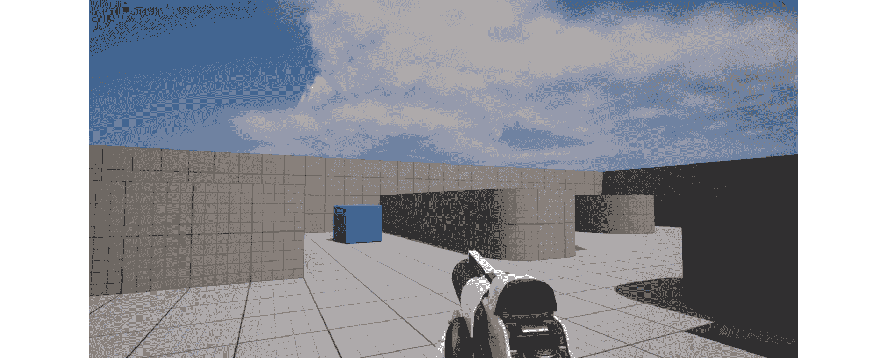

图 11.1 – UE5 中 First-Person 项目模板中默认角色的第一人称视角

在需要使用 Blend Spaces 来平滑过渡基于移动的动画的第三人称游戏中更为常见。一个很好的例子是 UE5 中提供的 **Third-Person** 模板项目，如此处所示：

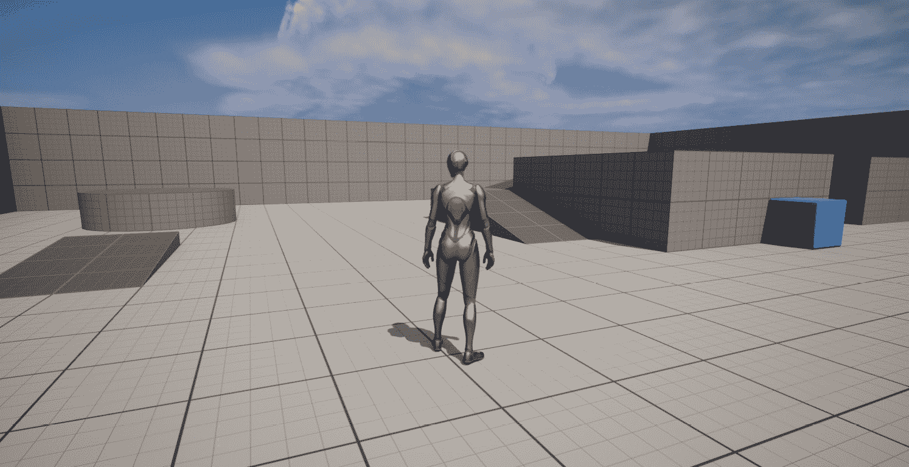

图 11.2 – UE5 中 First-Person 项目模板中默认角色的第三人称视角

让我们看看 Unreal Engine 提供的 Blend Space 资产，当通过打开 `/Characters/Mannequins/Animations/Quinn/BS_MF_Unarmed_WalkRun` 创建 `Third Person` 模板项目模板时。这是一个为 `Side Scroller` 人偶骨骼网格创建的 Blend Space 1D 资产，以便玩家角色可以根据角色的速度在 `Idle`、`Walking` 和 `Running` 动画之间平滑过渡。

如果您检查 `水平轴` 参数，其中我们为此轴设置了设置，它本质上是一个变量，我们可以在我们的动画蓝图中进行引用。请参考以下截图以查看 **Persona** 中的 **AXIS SETTINGS** 类别：


图 11.3 – Blend Space 1D 的轴设置

在预览窗口下方，我们还将看到一个从左到右沿线的点的小图；其中一点将被突出显示为 `绿色`，而其他点将是 `白色`。我们可以按住 *Shift* 并将这个 `绿色` 点沿水平轴拖动以预览基于其值的混合动画。在速度 `0` 时，我们的角色处于 `Idle` 状态。当我们沿着轴移动预览时，动画将开始混合到 `Walking`，然后是 `Running`。以下截图显示了单轴图：

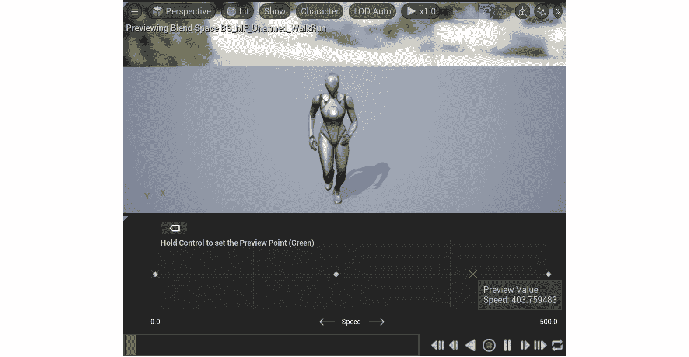

图 11.4 – 1D Blend Space 的关键帧时间线

在下一节中，我们将探讨 Blend Space 1D 与普通 Blend Space 的比较，以及根据您的动画需求何时使用它们。

## Blend Space 1D 与普通 Blend Space 的比较

在继续使用 Blend Space 1D 之前，让我们花一点时间来查看 UE5 中 Blend Space 1D 与普通 Blend Space 之间的主要区别：

+   在 Unreal Engine 中，Blend Space 由两个变量控制，这些变量由 Blend Space 图的 X 和 *Y* 轴表示。

+   另一方面，Blend Space 1D 只支持一个轴。

尝试想象这是一个 2D 图。由于你知道每个轴都有一个方向，你可以可视化为什么以及何时需要使用这个 Blend Space 而不是只支持单个轴的 Blend Space 1D。

例如，如果您想使玩家角色在左右横移的同时支持前后移动。如果将这种移动映射到图上，它将看起来如下：

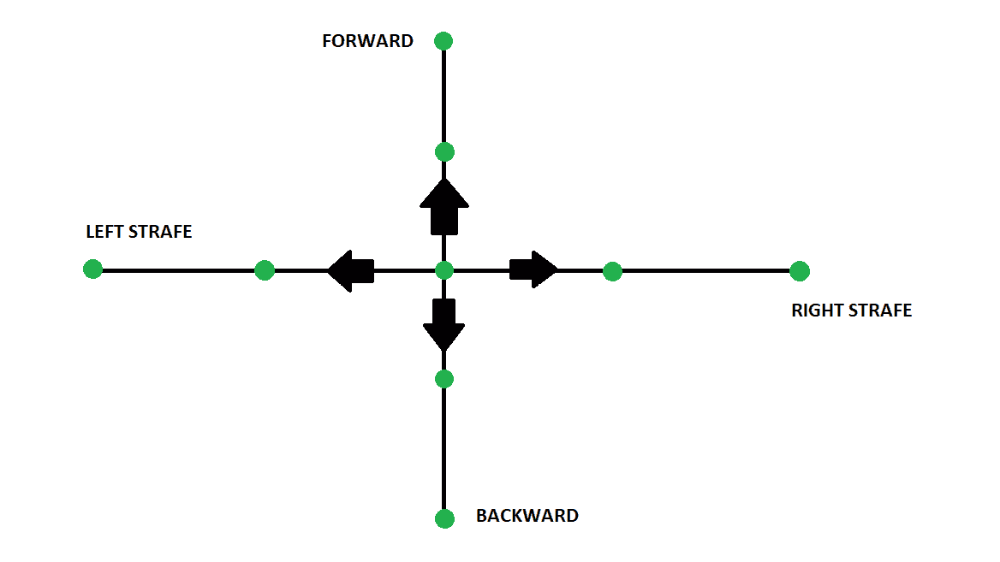

图 11.5 – 混合空间移动在简单图上的样子

现在，想象玩家角色的移动，考虑到游戏是 `侧滚动`。角色将不支持左右横移或前后移动。玩家角色只需要在一个方向上动画化，因为 `侧滚动` 角色默认会旋转到移动的方向。只需要支持一个方向，这就是为什么您使用的是 Blend Space 1D 而不是普通混合空间的原因。

我们需要为主角设置这种类型的混合空间资产，并使用混合空间进行基于移动的动画混合。在下一个练习中，我们将使用我们的自定义动画资产创建混合空间资产。

## 练习 11.01 – 创建 CharacterMovement 混合空间 1D

要使玩家角色在移动时进行动画，您需要创建一个混合空间。

在这个练习中，您将创建 `CharacterMovement` 组件，以便分配与混合空间相对应的适当行走速度值。

按照以下步骤完成这个练习：

1.  在 **内容抽屉** 窗口中导航到 `/MainCharacter/Animation` 文件夹，其中包含您在上一章中导入的所有新动画。

1.  现在，在 **内容抽屉** 窗口的主区域中 *右键单击*，然后从下拉菜单中悬停在 **动画** 选项上。从其附加下拉菜单中选择 **混合空间 1D**。

1.  确保选择 `MainCharacter_Skeleton` 而不是 `UE4_Mannequin_Skeleton` 作为混合空间的骨骼。

注意

如果您应用了错误的骨骼，混合空间将无法为玩家角色工作，当您选择所需的骨骼资产，如混合空间或动画蓝图时，自定义骨骼网格也将无法工作。在这里，您正在告诉这个资产它兼容哪种骨骼。通过这样做，在混合空间的情况下，您可以使用为该骨骼制作的动画，从而确保一切与一切兼容。

1.  将这个混合空间资产命名为 `SideScroller_IdleRun_1D`。

1.  接下来，打开 `SideScroller_IdleRun_` 混合空间 1D 资产。您可以在预览窗口下方看到单轴图：

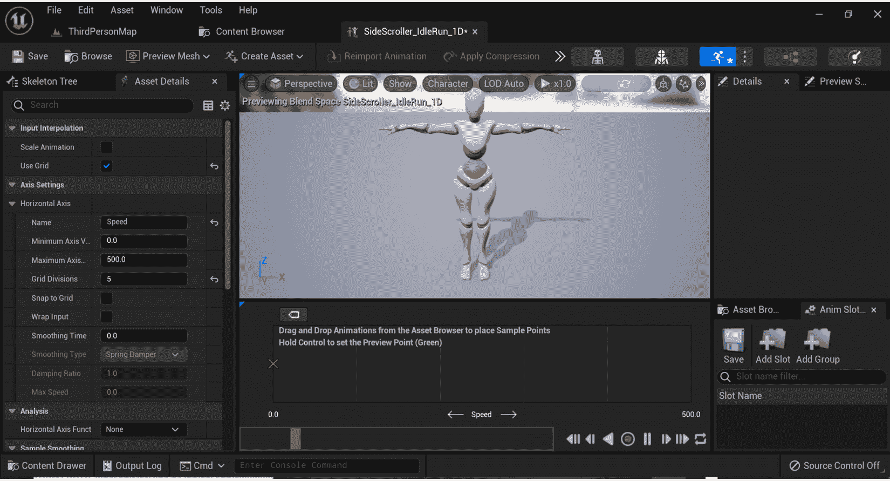

图 11.6 – 用于在 UE5 中创建混合空间的编辑工具

在编辑器的左侧，您有玩家角色的 `Animation Blueprint` 属性。以下截图显示了为 `水平轴` 设置的默认值：

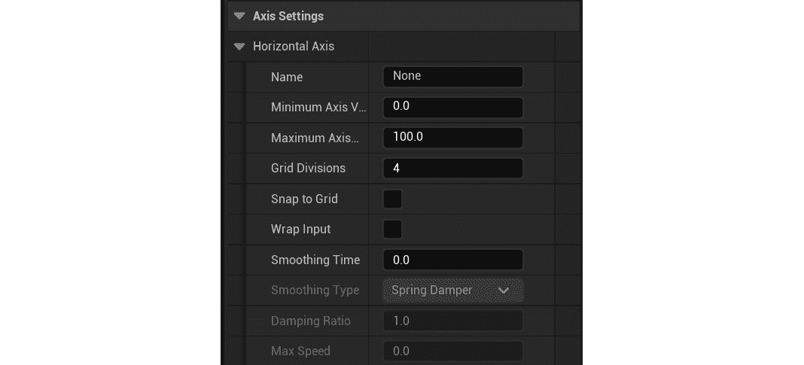

图 11.7 – 影响混合空间轴的轴设置

1.  现在，更改 `Speed` 的名称：

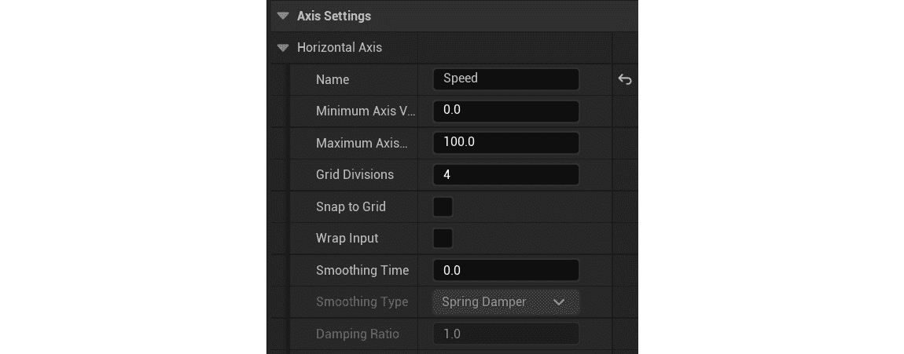

图 11.8 – 现在水平轴被命名为速度

1.  下一步是设置默认的 `0.0f`，因为当玩家角色完全不动时，它们将处于 `空闲` 状态。

但关于 **最大轴值** 呢？这一点稍微有点复杂，因为您需要记住以下几点：

+   您将支持一个允许玩家在按下 *左 Shift* 键盘按钮时移动更快的冲刺行为。当释放时，玩家将返回到默认的行走速度。

+   行走速度必须与角色的 `CharacterMovementComponent` 的 `Max Walk Speed` 参数相匹配。

+   在设置 `SuperSideScroller` 游戏之前。

1.  为了做到这一点，导航到 `/Game/MainCharacter/Blueprints/` 并打开 `BP_SuperSideScroller_MainCharacter` 蓝图。

1.  选择 `Character Movement` 组件，并在 `Max Walk Speed` 参数中设置其值为 `300.0f`。

在设置 `Max Walk Speed` 参数后，返回到 `SideScroller_IdleRun_` 1D 混合空间并设置 `Maximum Axis Value` 参数。如果行走速度是 `300.0f`，最大值应该是多少？考虑到您将支持玩家的冲刺，这个最大值需要超过行走速度。

1.  更新 `Maximum Axis Value` 参数，使其值为 `500.0f`。

1.  最后，将 `Number of Grid Divisions` 参数设置为 `5`。这样做的原因是，当使用部分时，每个网格点之间 `100` 单位的间距使得工作更加容易，因为 `Maximum Axis Value` 是 `500.0f`。这在应用沿网格的移动动画时进行网格点吸附时很有用。

1.  将剩余的属性设置为默认值：

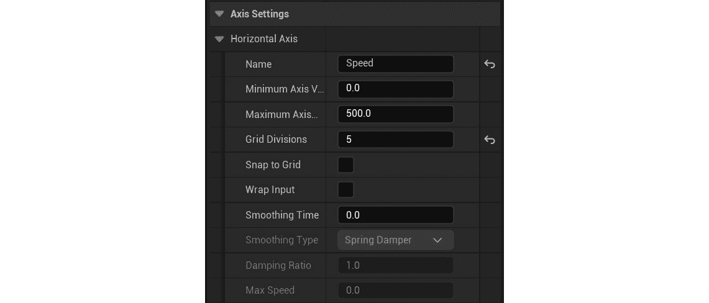

图 11.9 – 混合空间的最终轴设置

使用这些设置，您正在告诉混合空间使用介于 `0.0f` 和 `500.0f` 之间的传入浮点值，在您将在下一步放置的动画和活动之间进行混合。通过将网格分为 `5` 个部分，您可以轻松地在轴图上添加所需的动画，并确保它们在正确的浮点值处。

让我们继续创建混合空间，通过将我们的第一个动画添加到轴图：`空闲` 动画。

1.  在创建混合空间时，网格右侧是 `MainCharacter_Skeleton` 资产。

1.  接下来，左键单击并拖动 `空闲` 动画到我们的网格位置 `0.0`：

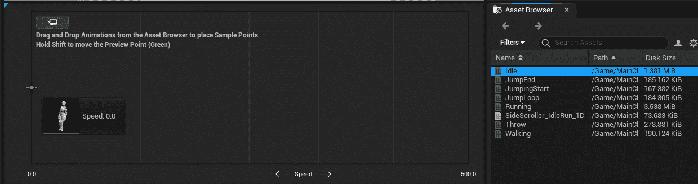

图 11.10 – 将空闲动画拖动到我们的网格位置 0.0

注意当你将这个动画拖动到网格上时，它会自动对齐到网格点。一旦动画被添加到 Blend Space 中，玩家角色将从默认的 T-Pose 变换，并开始播放“空闲”动画：

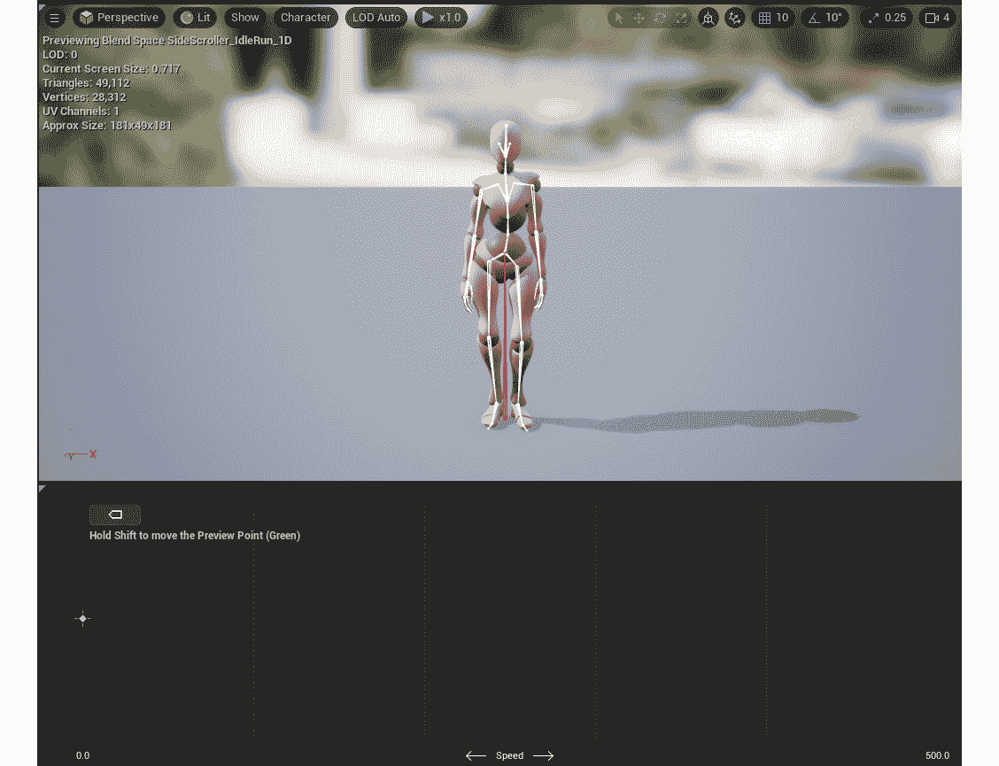

图 11.11 – 将空闲动画添加到 1D Blend Space 后，玩家角色开始动画

通过完成这个练习，你现在已经了解了如何创建一维 Blend Space，更重要的是，你知道一维 Blend Space 和普通 Blend Space 之间的区别。此外，你还知道在玩家角色运动组件和 Blend Space 之间对齐值的重要性，以及为什么你需要确保行走速度与 Blend Space 中的值相关联。

现在，让我们继续本章的第一个活动，在这个活动中，你将应用剩余的“行走”和“跑步”动画到 Blend Space 中，就像你添加“空闲”动画一样。

## 活动 11.01 – 将行走和跑步动画添加到 Blend Space

目前为止，一维运动 Blend Space 的组合进行得相当顺利，但你缺少了“行走”和“跑步”动画。在这个活动中，你将通过将这些动画添加到 Blend Space 中合适的水平轴值（对主要角色来说是有意义的）来完成 Blend Space。

使用你在 *练习 11.01 – 创建 CharacterMovement Blend Space 1D* 中获得的知识，按照以下步骤完成角色运动 Blend Space：

1.  从 *练习 11.01 – 创建 CharacterMovement Blend Space 1D* 继续进行，返回到 **资产浏览器** 窗口。

1.  现在，将“行走”动画添加到水平网格位置 `300.0f`。

1.  最后，将“跑步”动画添加到水平网格位置 `500.0f`。

注意

记住，你可以按住 *shift* 并沿着网格轴拖动绿色的预览网格点，以查看动画如何根据轴值混合，因此请注意角色动画预览窗口，以确保它看起来正确。

预期的输出如下：

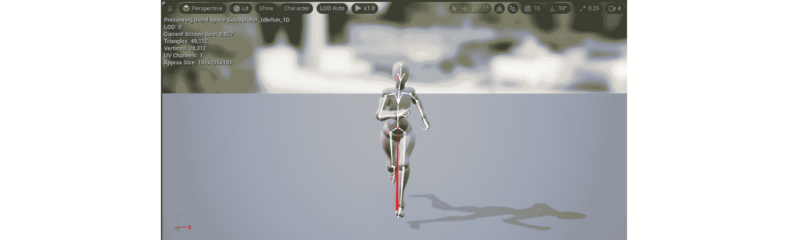

图 11.12 – Blend Space 中的跑步动画

到目前为止，你应该已经拥有了一个功能性的 Blend Space，它可以根据代表玩家角色速度的水平轴值，将角色从“空闲”状态切换到“行走”状态再到“跑步”状态。

注意

这个活动的解决方案可以在 GitHub 上找到：[`github.com/PacktPublishing/Elevating-Game-Experiences-with-Unreal-Engine-5-Second-Edition/tree/main/Activity%20solutions`](https://github.com/PacktPublishing/Elevating-Game-Experiences-with-Unreal-Engine-5-Second-Edition/tree/main/Activity%20solutions)。

# 主要角色动画蓝图

在将动画添加到混合空间后，你应该能够四处走动并看到这些动画在工作，对吧？嗯，不对。如果你选择**在编辑器中播放**，你会注意到主要角色仍然在 T 姿势中移动。原因是你没有告诉动画蓝图使用我们的混合空间资产，你将在本章的后面做到这一点。

## 动画蓝图

在跳入使用上一章创建的动画蓝图之前，让我们简要讨论一下这种蓝图是什么类型，以及它的主要功能是什么。动画蓝图是一种蓝图，允许你控制骨骼和骨骼网格的动画 – 在这种情况下，是你在上一章中导入的玩家角色骨骼和网格。

一个动画蓝图被分为两个主要图：

+   事件图

+   动画图

事件图的工作方式与正常蓝图一样，你可以在其中使用事件、函数和变量来编写游戏逻辑。另一方面，动画图是动画蓝图特有的，这是你使用逻辑来确定在任意给定帧中骨骼和骨骼网格的最终姿势的地方。正是在这里，你可以使用诸如状态机、动画槽、混合空间和其他与动画相关的节点，然后输出最终的角色动画。

让我们看看一个例子。

在`MainCharacter/Blueprints`目录中打开`AnimBP_SuperSideScroller_MainCharacter`动画蓝图。

默认情况下，**AnimGraph**应该打开，在那里你会看到角色预览、**资产浏览器**窗口和主要图。正是在这个**AnimGraph**中，你将实现你刚刚创建的混合空间，以便在玩家角色在关卡中移动时正确地动画化。

让我们开始下一个练习，我们将做这个练习并了解更多关于动画蓝图的知识。

## 练习 11.02 – 将混合空间添加到角色动画蓝图

对于这个练习，你将向动画蓝图添加混合空间，并准备必要的变量来帮助根据玩家角色的移动速度控制这个混合空间。让我们首先将混合空间添加到**AnimGraph**。

按照以下步骤完成此练习：

1.  将混合空间添加到`SideScroller_IdleRun_`混合空间 1D 资产到**AnimGraph**。

注意，这个混合空间节点的变量输入被标记为`Speed`，就像混合空间内部的水平轴一样。请参考*图 11.14*以查看**资产浏览器**窗口中的混合空间：

注意

如果你将**水平轴**重命名为不同的名称，新的名称将显示为混合空间的输入参数。

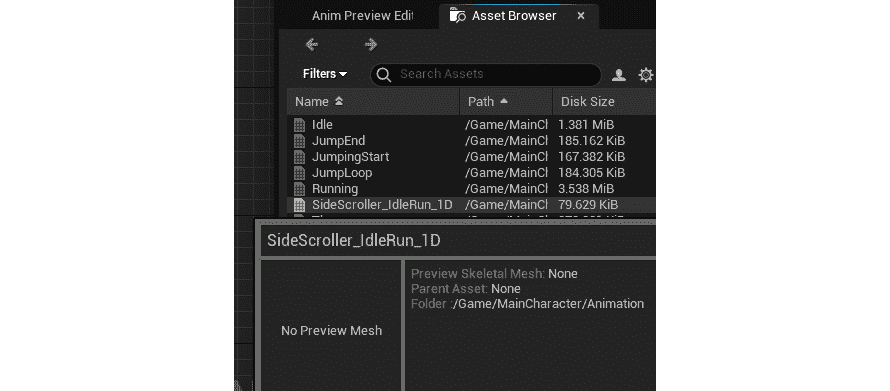

图 11.13 – 资产浏览器让您访问与 MainCharacter_Skeleton 相关的所有动画资产

1.  接下来，将 Blend Space 节点的 `Output Pose` 资产连接到 `Output Pose` 节点的 `Result` 引脚。现在，预览中的动画姿态将显示角色的 `Idle` 动画姿态：

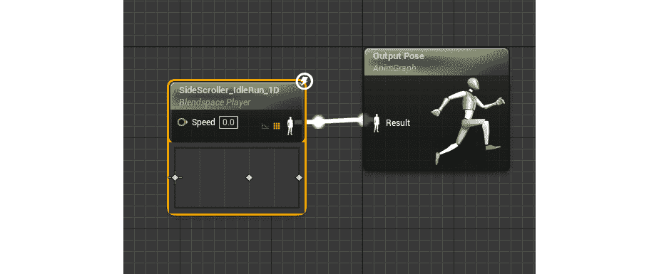

图 11.14 – 您现在可以有限地控制 Blend Space，并可以手动输入 Speed 参数的值

1.  如果您使用 `Idle` 动画而不是保持 T-Pose 姿势：

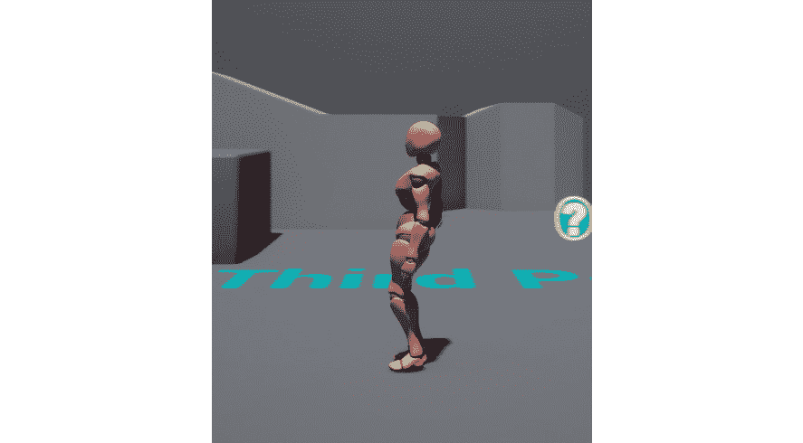

图 11.15 – 玩家角色现在在游戏中播放 Idle 动画

现在，我们可以使用我们的 `Speed` 输入变量来控制我们的 Blend Space。在使用 Blend Space 的能力到位后，您需要一种方法来存储角色的移动速度并将该值传递给 Blend Space 的 `Speed` 输入参数。让我们学习如何做到这一点。

1.  导航到我们的动画蓝图的事件图属性。默认情况下，将会有 `Event Blueprint Update Animation` 事件和一个纯 `Try Get Pawn Owner` 函数。以下截图显示了 `Event Graph` 的默认设置。事件在动画更新的每一帧都会更新，并在尝试获取更多信息之前返回 `SuperSideScroller` 玩家角色蓝图类：

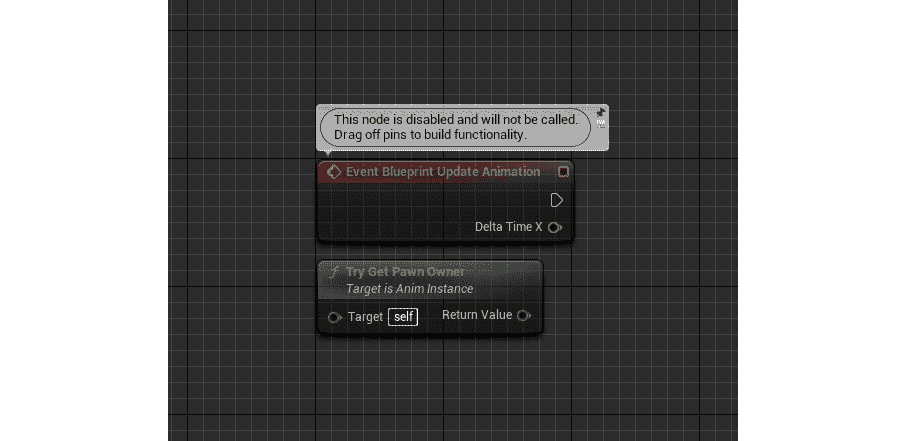

图 11.16 – 动画蓝图默认包含此事件和函数对，以便在事件图中使用

注意

在 UE5 中，`Pure` 函数和 `Impure` 函数的主要区别在于 `Pure` 函数意味着它所包含的逻辑不会修改它所使用的类中的变量或成员。在 `Try Get Pawn Owner` 的情况下，它只是返回动画蓝图的所有者 `Pawn` 的引用。"Impure" 函数没有这种暗示，可以自由修改它想要的任何变量或成员。

1.  从 `Try Get Pawn Owner` 函数获取 `Return Value` 属性，并在出现的 `Context Sensitive` 菜单中搜索 `SuperSideScrollerCharacter` 的 Cast：

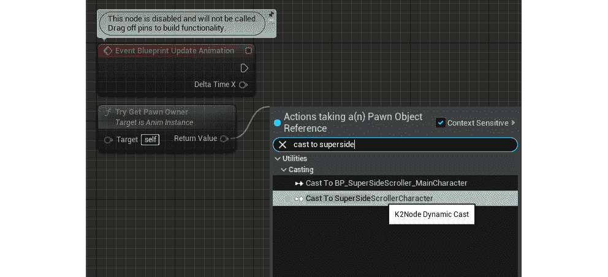

图 11.17 – 强制转换确保我们使用的是正确的类

1.  将 `Event Blueprint Update Animation` 的执行输出引脚连接到 Cast 的执行输入引脚：

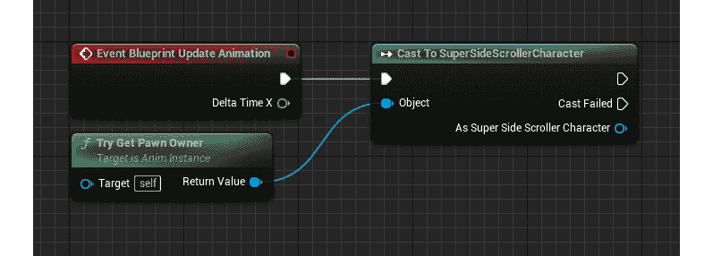

图 11.18 – 使用 Try Get Pawn Owner 函数将返回的 Pawn 对象转换为 SuperSideScrollerCharacter 类

你创建的角色蓝图 `Blueprint` 继承自 `SuperSideScrollerCharacter` 类。由于这个动画蓝图的所有者 pawn 是你的 `BP_SuperSideScroller_MainCharacter` 角色蓝图，并且这个蓝图继承自 `SuperSideScrollerCharacter` 类，因此 cast 函数将成功执行。

1.  接下来，将 cast 返回的值存储在其自己的变量中；这样，我们就可以在需要时在动画蓝图中再次使用它。参考 *图 11.20* 并确保将这个新变量命名为 `MainCharacter`：

注意

在上下文相关的下拉菜单中，有“提升为变量”选项，允许你将任何有效的值类型存储在其自己的变量中。

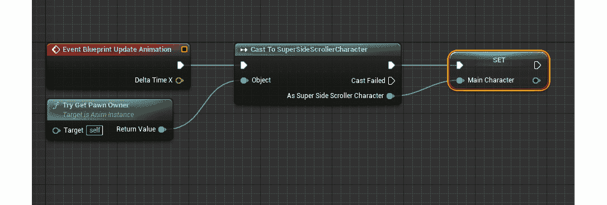

图 11.19 – 只要铸造成功，你将想要跟踪拥有该角色的信息

1.  现在，为了跟踪角色的速度，使用 `MainCharacter` 变量中的 `Get Velocity` 函数。`Actor` 类的每个对象都可以访问此函数，并返回对象移动的方向和大小向量：

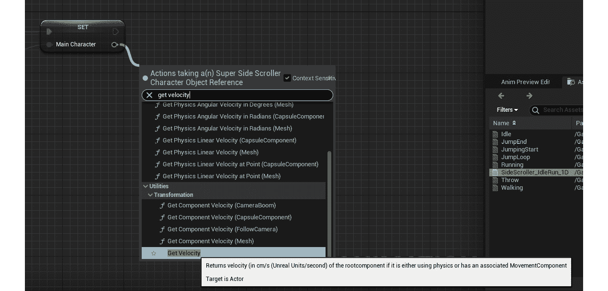

图 11.20 – GetVelocity 函数可以在 Utilities/Transformation 下找到

1.  从 `Get Velocity`，你可以使用 `VectorLength` 函数来获取实际的速度：

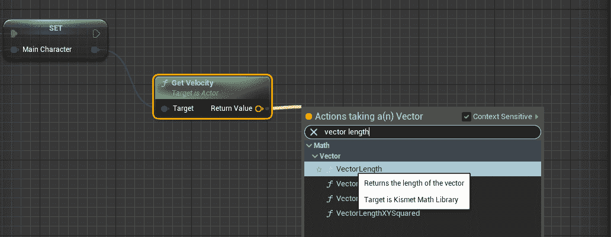

图 11.21 – VectorLength 函数返回向量的模

1.  `VectorLength` 函数的 `Return Value` 可以提升为其自己的变量 `Speed`：

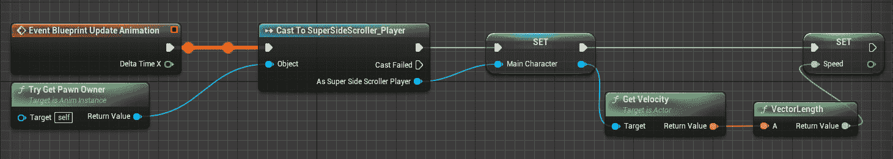

图 11.22 – 每个演员都有 Get Velocity 函数

在这个练习中，你通过使用 `GetVelocity` 函数获得了玩家角色的速度。从 `GetVelocity` 函数返回的向量给出了向量的长度，以确定实际的速度。通过将此值存储在 `Speed` 变量中，你现在可以在动画蓝图的 **AnimGraph** 属性中引用此值来更新你的 Blend Space，你将在下一个练习中这样做。但首先，让我们简要讨论一下速度向量以及我们如何使用向量数学来确定玩家角色的速度。

# 速度向量是什么？

在进行下一步之前，让我们解释一下当你获取角色的速度并将该向量的长度提升到 `Speed` 变量时你在做什么。

速度是什么？速度是一个具有给定 **大小** 和 **方向** 的向量。换一种方式思考，向量可以像 *箭头* 一样绘制。

箭头的长度代表 `GetVelocity` 函数和返回速度向量的 `VectorLength` 函数；你正在获取你角色的 `Speed` 变量的值。这就是为什么你将那个值存储在变量中，并使用它来控制混合空间，如图所示。在这里，你可以看到一个向量的例子。一个有正（右）方向，大小为 `100`，而另一个有负（左）方向，大小为 `35`：


图 11.23 – 两个不同的向量

在以下练习中，你将使用从上一个练习中玩家角色的速度参数的 `VectorLength` 函数创建的 `Speed` 变量来驱动 1D 混合空间如何动画化角色。

## 练习 11.03 – 将角色的速度变量传递到混合空间

现在你已经更好地理解了向量以及如何从上一个练习中存储玩家角色的 `Speed` 变量，让我们将速度应用到本章 earlier 创建的 1D 混合空间中。

按照以下步骤完成此练习：

1.  导航到 `AnimBP_SuperSideScroller_MainCharacter` 动画蓝图。

1.  使用 `Speed` 变量在实时中更新混合空间，将变量连接到 `Blendspace Player` 函数的输入：

图 11.24 – 使用速度变量在每一帧更新混合空间

1.  接下来，编译动画蓝图。

这样，你可以根据玩家的速度更新混合空间。当你使用 PIE 时，当你移动时，你会看到角色的 `Idle` 状态和 `Walking` 状态：

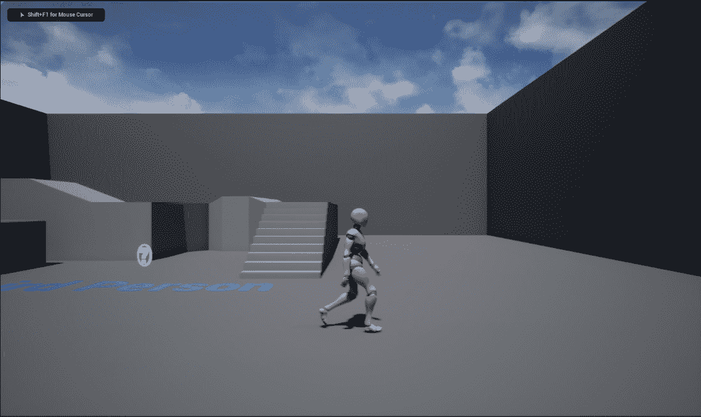

图 11.25 – 玩家角色最终能够在关卡中四处走动

最后，主要角色正在使用基于移动速度的移动动画。在下一个活动中，你将更新角色移动组件，以便你可以从混合空间中预览角色的 `Running` 动画。

## 活动 11.02 – 在游戏中预览跑步动画

通过更新动画蓝图并获取玩家角色的速度，你可以在游戏中预览 `Idle` 和 `Walking` 动画。

在此活动中，你将更新玩家角色蓝图的 `CharacterMovement` 组件，以便你可以在游戏中预览 `Running` 动画。

按照以下步骤完成此活动：

1.  导航到并打开 `BP_SuperSideScroller_MainCharacter` 玩家角色蓝图。

1.  访问 `CharacterMovement` 组件。

1.  将 `Max Walk Speed` 参数修改为 `500.0` 的值，以便您的角色可以移动得足够快，以便从 `Idle` 动画平滑过渡到 `Walking`，最后到 `Running`。

通过这样做，玩家角色可以达到一个速度，允许您在游戏中预览 `Running` 动画。

预期的输出如下：

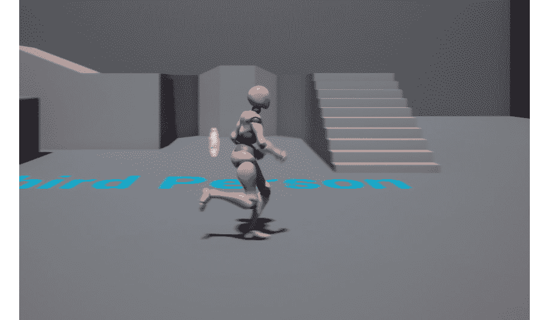

图 11.26 – 玩家角色正在奔跑

注意

该活动的解决方案可以在 GitHub 上找到：[`github.com/PacktPublishing/Elevating-Game-Experiences-with-Unreal-Engine-5-Second-Edition/tree/main/Activity%20solutions`](https://github.com/PacktPublishing/Elevating-Game-Experiences-with-Unreal-Engine-5-Second-Edition/tree/main/Activity%20solutions)。

现在您已经处理了玩家角色从 `Idle` 到 `Walking`，最后到 `Running` 的移动混合，让我们添加允许玩家角色通过冲刺更快移动的功能。

# 增强型输入系统

每个游戏都需要玩家的输入，无论是键盘上的 *W*、*A*、*S* 和 *D* 键来移动玩家角色，还是控制器上的摇杆；这就是使电子游戏成为一种交互式体验的原因。我们将使用增强型输入系统为玩家角色的冲刺动作添加输入绑定。有关如何启用和设置增强型输入系统插件的复习，请参阅 *第四章*，*玩家输入入门*；从现在开始，本章的练习假设您已经启用了插件。

UE5 允许我们将键盘、鼠标、游戏手柄和其他类型的控制映射到标记的动作或轴，然后您可以在蓝图或 C++ 中引用这些动作或轴，以便允许角色或游戏玩法功能发生。重要的是要指出，每个独特的动作或轴映射可以有一个或多个键绑定，并且相同的键绑定可以用于多个映射。输入绑定被保存到一个名为 `DefaultInput.ini` 的初始化文件中，并位于您项目目录的 `Config` 文件夹中。

注意

旧版输入绑定可以直接通过 `DefaultInput.ini` 文件或在编辑器本身的 **项目设置** 中进行编辑。后者在编辑时更容易访问且更不容易出错。

在下一个练习中，我们将为玩家的 `Sprint` 功能添加一个新的输入绑定。

## 练习 11.04 – 添加冲刺输入

当玩家角色在关卡中移动时，您现在将实现一个独特的角色类，该类从基类 `SuperSideScrollerCharacter` C++ 类派生。这样做的原因是，您可以轻松区分玩家角色和敌人的类别，而不是完全依赖于唯一的蓝图类。

在创建独特的 C++ 角色类时，你将实现 *冲刺* 行为，允许玩家角色按需 *行走* 和 *冲刺*。

让我们先通过添加 `Sprint` 的 `Input Action` 来实现 `Sprinting` 机制：

1.  导航到 `Content` 目录，添加一个名为 `Input` 的新文件夹。

1.  在 `Sprint` 目录中。它就是在这个目录中我们将创建 `Input Action` 和 `Input Mapping Context` 资产。

1.  在 `Sprint` 文件夹中，右键单击并找到 **输入动作** 选项，在菜单的 **输入** 类别下，如图所示：

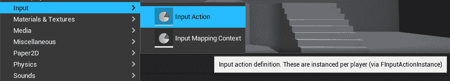

图 11.27 – 输入动作类

1.  将此命名为 `IA_Sprint` 并打开资产。

1.  在 **触发器** 部分中，通过左键单击 **+** 图标添加一个新的 **触发器**。在 **Index[0]** 参数下选择 **向下** 类型：

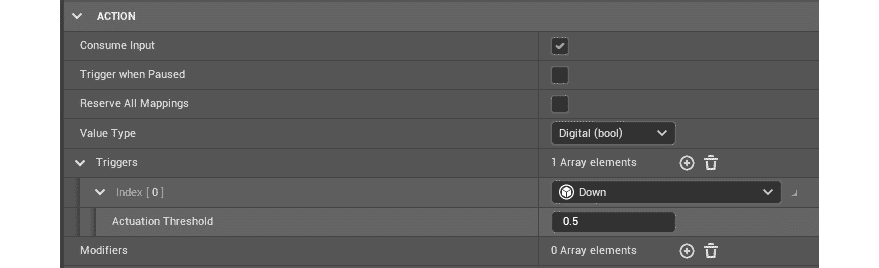

图 11.28 – 使用向下触发类型的 IA_Sprint 输入动作类

现在我们有了我们的 **输入动作**，接下来让我们创建 **输入映射上下文** 资产并将其动作添加到其中。

1.  在 **输入** 目录中，右键单击并找到 **输入映射上下文** 选项，在菜单的 **输入** 类别下，如图所示：

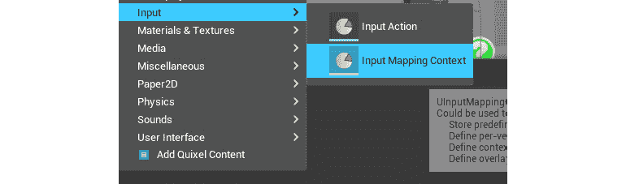

图 11.29 – 输入映射上下文类

1.  将此命名为 `IC_SideScrollerCharacter` 并打开资产。

1.  在 `IA_Sprint` 中。

1.  接下来，我们希望将 *左 Shift* 作为用于冲刺的绑定。

1.  在 **触发器** 部分中，通过左键单击 **+** 图标添加一个新的 **触发器**。在 **Index[0]** 参数下选择 **向下**。最终的 **输入映射上下文** 应该看起来像这样：

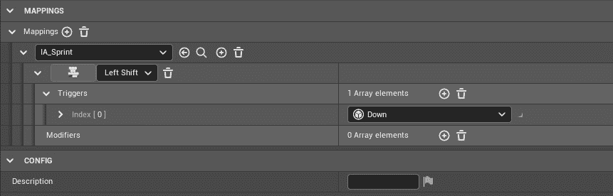

图 11.30 – 使用 IA_Sprint 输入动作映射的 IC_SideScrollerCharacter

在 `Sprint` 输入绑定就绪后，你需要基于 `SuperSideScrollerCharacter` 类创建一个新的 C++ 类用于玩家角色。

1.  确保更新 `SuperSideScroller.Build.cs` 文件，使其包含 Enhanced Input 插件；否则，你的代码将无法编译。在 `public SuperSideScroller(ReadOnlyTargetRues Target) : base(Target)` 函数内部添加以下行：

`PrivateDependencyModuleNames.AddRange(new string[] {“EnhancedInput”});`

1.  然后，回到编辑器内部，导航到 **工具**，从下拉列表中选择 **新建 C++ 类** 选项。

1.  新的玩家角色类将继承自 `SuperSideScrollerCharacter` 父类，因为这个基类包含了玩家角色所需的大部分功能。在选择了父类后，点击 `SuperSideScrollerCharacter` 类：

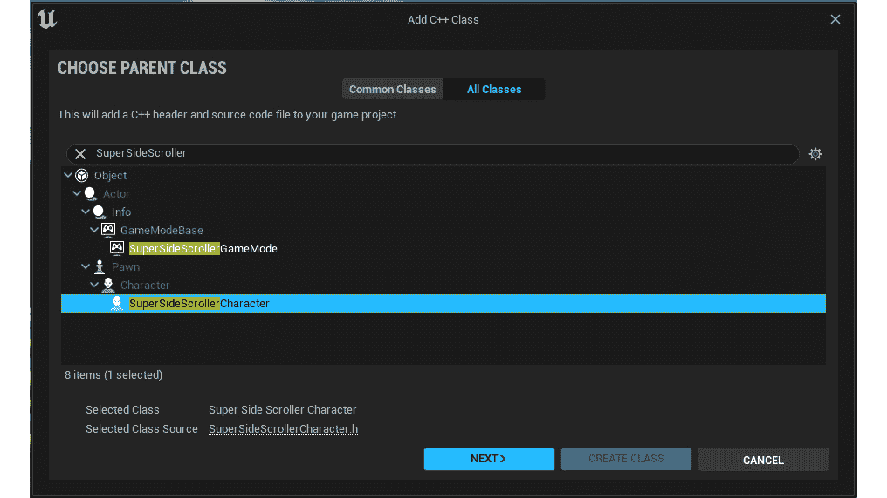

图 11.31 – 选择 SuperSideScrollerCharacter 父类

1.  将这个新类命名为 `SuperSideScroller_Player`。除非您需要调整这个新类的文件目录，否则请保留虚幻引擎提供的默认路径。在命名新类并选择保存类的目录后，点击“创建类”。

在选择“创建类”后，虚幻引擎将为您生成源文件和头文件，并且 Visual Studio 将自动打开这些文件。您会注意到头文件和源文件几乎都是空的。这是正常的，因为您是从 `SuperSideScrollerCharacter` 类继承的，您想要的很多逻辑都在这个类中完成。

1.  在 `SuperSideScroller_Player` 中，您只需添加您需要的功能，覆盖继承的内容。您可以在 `SuperSideScroller_Player.h` 内部查看继承发生的行：

    ```cpp
    class SUPERSIDESCROLLER_API ASuperSideScroller_Player : public ASuperSideScrollerCharacter
    ```

这个类声明表明新的 `ASuperSideScroller_Player` 类继承自 `ASuperSideScrollerCharacter` 类。

通过完成这个练习，您添加了一个 `Sprint` 力学机制，然后可以在 C++ 中引用并允许玩家进行冲刺。现在您也已经创建了玩家角色的 C++ 类，您可以更新代码以包含 `Sprint` 功能，但首先，您需要更新 `Blueprint` 角色和动画蓝图以引用这个新类。我们将在下一个练习中这样做。

当您将蓝图重新父化到一个新类时会发生什么？每个蓝图都继承自父类。在大多数情况下，这是 `Actor`，但就您的角色蓝图而言，其父类是 `SuperSideScrollerCharacter`。从父类继承允许蓝图继承该类的功能变量，以便在蓝图级别重用逻辑。

例如，当从 `SuperSideScrollerCharacter` 类继承时，蓝图会继承如 `CharacterMovement` 组件和 `Mesh` 骨骼网格组件等组件，这些组件可以在蓝图中进行修改。

## 练习 11.05 – 重新父化角色蓝图

现在您已经为玩家角色创建了一个新的角色类，您需要更新 `BP_SuperSideScroller_MainCharacter` 蓝图，使其使用 `SuperSideScroller_Player` 类作为其父类。如果不这样做，您添加到新类中的任何逻辑都不会影响在蓝图中所创建的角色。

按照以下步骤将蓝图重新父化到新角色类：

1.  导航到 `/Game/MainCharacter/Blueprints/` 并打开 `BP_SuperSideScroller_MainCharacter` 蓝图。

1.  在工具栏上选择“文件”选项，然后从下拉菜单中选择“重新父化蓝图”选项。

1.  当选择 `SuperSideScroller_Player` 并通过左键点击从下拉菜单中选择该选项。

一旦为蓝图选择了新的父类，Unreal Engine 将重新加载蓝图并重新编译，这两者都将自动发生。

注意

在将蓝图重新分配到新的父类时要小心，因为这可能导致编译错误或设置被清除或重置为类默认值。Unreal Engine 将在编译蓝图并将其重新分配到新类后显示任何可能发生的警告或错误。这些警告和错误通常发生在蓝图逻辑引用了在新父类中不再存在的变量或其他类成员的情况下。即使没有编译错误，最好在继续工作之前确认您添加到蓝图中的任何逻辑或设置在重新分配后仍然存在。

现在您的角色蓝图已正确重新分配到新的 `SuperSideScroller_Player` 类，您需要更新 `AnimBP_SuperSideScroller_MainCharacter` 动画蓝图，以确保在使用 `Try Get Pawn Owner` 函数时正在调用正确的类。

1.  接下来，导航到 `/MainCharacter/Blueprints/` 目录并打开 `AnimBP_SuperSideScroller_MainCharacter` 动画蓝图。

1.  打开 `Try Get Pawn Owner` 函数的 `Return Value` 属性，搜索 `Cast to SuperSideScroller_Player`：

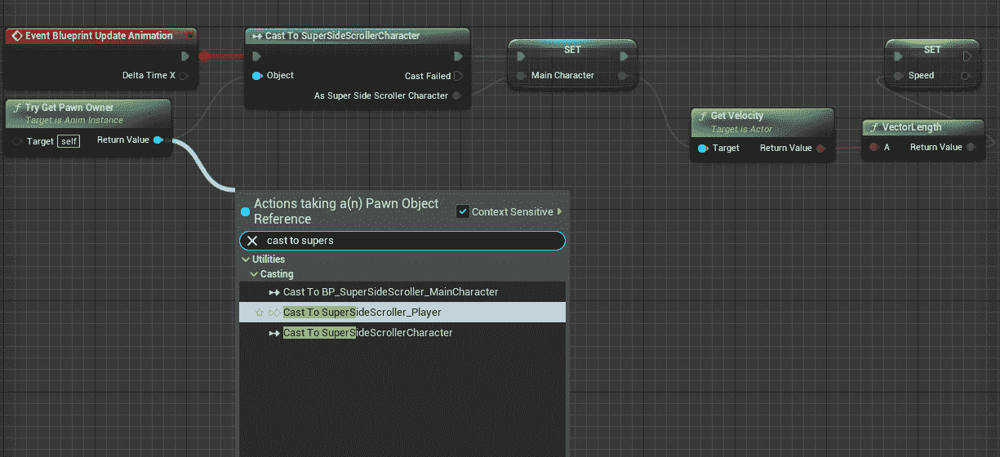

图 11.32 – 调用新的 SuperSideScroller_Player 类

1.  现在，您可以将输出连接为 `SuperSideScroller_Player` 调用到 `MainCharacter` 变量。这是因为 `MainCharacter` 变量是 `SuperSideScrollerCharacter` 类型，而新的 `SuperSideScroller_Player` 类从该类继承而来：

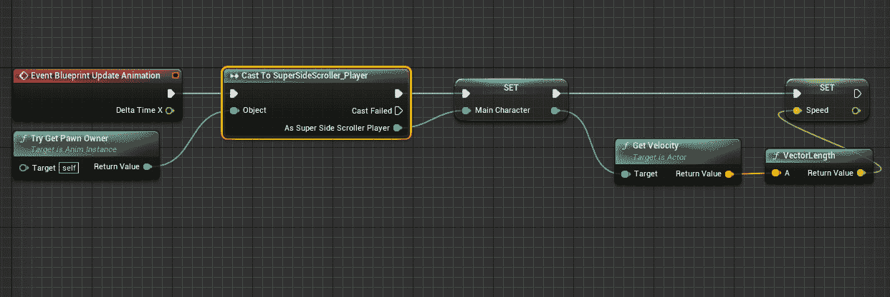

图 11.33 – 由于继承，您仍然可以使用 MainCharacter 变量，因为 SuperSideScroller_Player 基于 SuperSideScrollerCharacter

现在由于 `BP_SuperSideScroller_MainCharacter` 角色蓝图和 `AnimBP_SuperSideScroller_MainCharacter` 动画蓝图都引用了您的新 `SuperSideScroller_Player` 类，您可以安全地进入 C++ 编写角色的冲刺功能。

## 练习 11.06 – 编写角色的冲刺功能

在蓝图正确实现了新的 `SuperSideScroller_Player` 类引用后，是时候开始编写允许玩家角色冲刺的功能了。

按照以下步骤将 `Sprinting` 力学添加到角色中：

1.  首先要处理的是 `SuperSideScroller_Player` 类的构造函数。导航回 Visual Studio 并打开 `SuperSideScroller_Player.h` 头文件。

1.  你将在本练习的后面使用`constructor`函数来设置变量的初始化值。现在，它将是一个空构造函数。确保在`public`访问修饰符标题下进行声明，如下面的代码所示：

    ```cpp
    //Constructor
    ASuperSideScroller_Player();
    ```

1.  构造函数声明后，在`SuperSideScroller_Player.cpp`源文件中创建构造函数定义：

    ```cpp
    ASuperSideScroller_Player::ASuperSideScroller_Player()
    {
    }
    ```

在构造函数就绪后，是时候创建`SetupPlayerInputComponent`函数了，这样你就可以使用你之前创建的键绑定在`SuperSideScroller_Player`类中调用函数。

`SetupPlayerInputComponent`函数是角色类默认内置的函数，因此你需要将其声明为带有`override`指定符的`virtual`函数。这告诉虚幻引擎你正在使用此函数并打算在这个新类中重新定义其功能。确保在`Protected`访问修饰符标题下进行声明。

1.  `SetupPlayerInputComponent`函数需要一个`UInputComponent`类的对象传递给函数，如下所示：

    ```cpp
    protected:
    //Override base character class function to setup our 
    //player 
      input component
    virtual void SetupPlayerInputComponent(class UInputComponent* 
      PlayerInputComponent) override;
    ```

`UInputComponent* PlayerInputComponent`变量是从我们的`ASuperSideScroller_Player()`类继承的`UCharacter`基类，因此它必须作为`SetupPlayerInputComponent()`函数的输入参数使用。使用任何其他名称将导致编译错误。

1.  现在，在源文件中创建`SetupPlayerInputComponent`函数的定义。在函数体中，我们将使用`Super`关键字来调用它：

    ```cpp
    //Not always necessary, but good practice to call the 
    //function inthe base class with Super.
    Super::SetupPlayerInputComponent(PlayerInputComponent);
    ```

`Super`关键字使我们能够调用`SetupPlayerInputComponent`父方法。在`SetupPlayerInputComponent`函数准备好后，你需要包含以下头文件，以继续此练习而不会出现任何编译错误：

+   `#include “Components/InputComponent.h”`

+   `#include “GameFramework/CharacterMovementComponent.h”`

你需要包含输入组件的头文件来绑定你将要创建的冲刺函数的键映射。`Character Movement`组件的头文件对于冲刺函数是必要的，因为你将根据玩家是否在冲刺来更新`Max Walk Speed`参数。以下代码包含需要包含的所有头文件，用于玩家角色：

```cpp
#include "SuperSideScroller_Player.h"
#include "Components/InputComponent"
#include "GameFramework/CharacterMovementComponent.h"
```

在`SuperSideScroller_Player`类的源文件中包含必要的头文件后，你可以创建冲刺函数来使玩家角色移动得更快。让我们首先声明所需的变量和函数。

1.  在`SuperSideScroller_Player`类的头文件中的`Private`访问修饰符下，声明一个新的布尔变量`bIsSprinting`。这个变量将用作安全措施，以便在更改移动速度之前知道玩家角色是否正在冲刺：

    ```cpp
    private:
    //Bool to control if we are sprinting. Failsafe.
    bool bIsSprinting;
    ```

1.  接下来，声明两个新的函数，`Sprint();`和`StopSprinting();`。这两个函数将不接受任何参数，也不会返回任何内容。在`受保护`访问修饰符下声明这些函数：

    ```cpp
    //Sprinting
    void Sprint();
    //StopSprinting
    void StopSprinting();
    ```

当玩家按下/保持与绑定映射的`Sprint`键时，将调用`Sprint();`函数；当玩家释放与绑定映射的键时，将调用`StopSprinting()`函数。

1.  从`Sprint();`函数的定义开始。在`SuperSideScroller_Player`类的源文件中，为这个函数创建定义，如下所示：

    ```cpp
    void ASuperSideScroller_Player::Sprint()
    {
    }
    ```

1.  在函数内部，你将想要检查`bIsSprinting`变量的值。如果玩家**没有**冲刺，意味着`bIsSprinting`是`False`，那么你可以创建函数的其余部分。

1.  在`If`语句中，将`bIsSprinting`变量设置为`True`。然后，访问`GetCharacterMovement()`函数并修改`MaxWalkSpeed`参数。将`MaxWalkSpeed`设置为`500.0f`。记住，移动混合空间的最大轴值参数是`500.0f`。这意味着玩家角色将达到使用`Running`动画所需的速度：

    ```cpp
    void ASuperSideScroller_Player::Sprint()
    {
        if (!bIsSprinting)
          {
            bIsSprinting = true;
            GetCharacterMovement()->MaxWalkSpeed = 500.0f;
          }
    }
    ```

`StopSprinting()`函数将几乎与刚刚编写的`Sprint()`函数相同，但它的工作方式相反。首先，你想要检查玩家是否在冲刺，意味着`bIsSprinting`是`True`。如果是这样，你可以创建函数的其余部分。

1.  在`If`语句中，将`bIsSprinting`设置为`False`。然后，访问`GetCharacterMovement()`函数来修改`MaxWalkSpeed`。将`MaxWalkSpeed`恢复到`300.0f`，这是玩家角色行走时的默认速度。这意味着玩家角色将只能达到`Walking`动画所需的速度：

    ```cpp
    void ASuperSideScroller_Player::StopSprinting()
    {
       if (bIsSprinting)
        {
         bIsSprinting = false;
          GetCharacterMovement()->MaxWalkSpeed = 300.0f;
        }
    }
    ```

现在你已经有了所需的冲刺函数，是时候将这些函数绑定到你之前创建的动作映射上了。为此，你需要创建变量来保存对之前在本章中创建的输入映射上下文和输入动作的引用。

1.  在`SuperSideScroller_Player`头文件中，在**受保护**类别下，添加以下代码行以创建输入映射上下文和输入动作的属性：

    ```cpp
    UPROPERTY(EditAnywhere, Category = "Input")
    class UInputMappingContext* IC_Character;
    UPROPERTY(EditAnywhere, Category = "Input")
    class UInputAction* IA_Sprint;
    ```

我们必须记住在我们尝试测试冲刺功能之前，在我们的角色蓝图内分配这些属性。

1.  接下来，在`SuperSideScroller_Player`源文件内部，在`SetupPlayerInputComponent()`函数中，我们需要通过编写以下代码来获取增强输入组件的引用：

    ```cpp
    UEnhancedInputComponent* EnhancedPlayerInput = Cast<UEnhancedInputComponent>(PlayerInputComponent);
    ```

现在我们正在引用`UEnhancedInputComponent`，我们需要记住将这个类也包含在内：

```cpp
#include "EnhancedInputComponent.h"
```

由于我们想要支持旧版输入和增强输入系统，让我们在我们的代码中添加一个特定的`if`语句来检查`EnhancedPlayerInput`变量是否有效：

```cpp
if(EnhancedPlayerInput)
{}
```

如果 `EnhancedPlayerInput` 变量有效，我们想要获取我们的玩家控制器的引用，以便我们可以访问 `EnhancedInputLocalPlayerSubsystem` 类，这将允许我们分配我们的输入映射上下文：

```cpp
if(EnhancedPlayerInput)
{
   APlayerController* PlayerController = 
   Cast<APlayerController>(GetController());
UEnhancedInputLocalPlayerSubsystem* EnhancedSubsystem = ULocalPlayer::GetSubsystem<UEnhancedInputLocal PlayerSubsystem> (PlayerController->GetLocalPlayer());
}
```

1.  现在我们正在引用 `UEnhancedInputLocalPlayerSubsystem` 类，我们需要添加以下 `include` 头文件：

    ```cpp
    #include "EnhancedInputSubsystems.h"
    ```

1.  最后，我们将添加另一个 `if` 语句来检查 `EnhancedSubsystem` 变量是否有效，然后调用 `AddMappingContext` 函数将我们的 `IC_Character` 输入映射上下文添加到我们的玩家控制器中：

    ```cpp
    if(EnhancedSubsystem)
    {
       EnhancedSubsystem->AddMappingContext(IC_Character, 
       1);
    }
    ```

现在我们已经将输入映射上下文应用到玩家角色的 `EnhancedSubsystem` 上，我们可以将 `Sprint()` 和 `StopSprinting()` 函数绑定到我们之前创建的输入动作。

1.  在 `if(EnhancedPlayerInput)` 语句的末尾，我们将添加一个 `BindAction` 来绑定 `ETriggerEvent::Triggered` 到 `Sprint()` 函数：

    ```cpp
    //Bind pressed action Sprint to your Sprint function
    EnhancedPlayerInput->BindAction(IA_Sprint, ETriggerEvent::Triggered, this, &ASuperSideScroller_Player::Sprint);
    ```

1.  最后，我们可以将我们的 `BindAction` 添加到绑定 `ETriggerEvent::Completed` 到 `StopSprinting()` 函数：

    ```cpp
    //Bind released action Sprint to your StopSprinting 
    //function
    EnhancedPlayerInput->BindAction(IA_Sprint, ETriggerEvent::Completed, this, &ASuperSideScroller_Player::StopSprinting);
    ```

注意

关于 `ETriggerEvent` 枚举类型以及增强输入系统的更多详细信息，请重新查看 *第四章*，*玩家输入入门*，或参考 Epic Games 的以下文档：[`docs.unrealengine.com/5.0/en-US/GameplayFeatures/EnhancedInput/`](https://docs.unrealengine.com/5.0/en-US/GameplayFeatures/EnhancedInput/%0D)

将 `Action Mappings` 绑定到冲刺函数后，你需要做的最后一件事是将 `bIsSprinting` 变量的默认初始化值和 `Character Movement` 组件的 `MaxWalkSpeed` 参数的默认初始化值设置好。

1.  在你的 `SuperSideScroller_Player` 类的源文件中的 `constructor` 函数内，添加 `bIsSprinting = false` 行。这个变量被构造为 false，因为玩家角色默认不应该冲刺。

1.  最后，通过添加 `GetCharacterMovement()->MaxWalkSpeed = 300.0f` 将角色移动组件的 `MaxWalkSpeed` 参数设置为 `300.0f`。请查看以下代码：

    ```cpp
    ASuperSideScroller_Player::ASuperSideScroller_Player()
    {
      //Set sprinting to false by default.
       bIsSprinting = false;
      //Set our max Walk Speed to 300.0f
       GetCharacterMovement()->MaxWalkSpeed = 300.0f;
    }
    ```

在构造函数中添加的变量初始化完成后，`SuperSideScroller_Player` 类目前就完成了。返回 Unreal Engine 并在工具栏上左键单击 **编译** 按钮。这将重新编译代码并执行编辑器的热重载。

在重新编译和热重载编辑器后，我们需要记住在我们的玩家角色内部分配输入映射上下文和输入动作。

1.  导航到 `MainCharacter/Blueprints` 目录并打开 `BP_SuperSideScroller_MainCharacter` 蓝图。

1.  在 `IC_Character` 和 `IA_Sprint` 中，将我们之前创建的输入上下文映射和输入动作资产分配给这些参数：

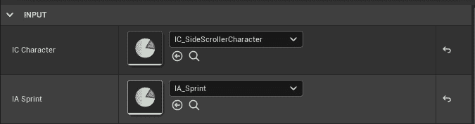

图 11.34 – IC_Character 和 IA_Sprint 参数

编译 `BP_SuperSideScroller_MainCharacter` 蓝图后，你可以使用 `Running` 动画：

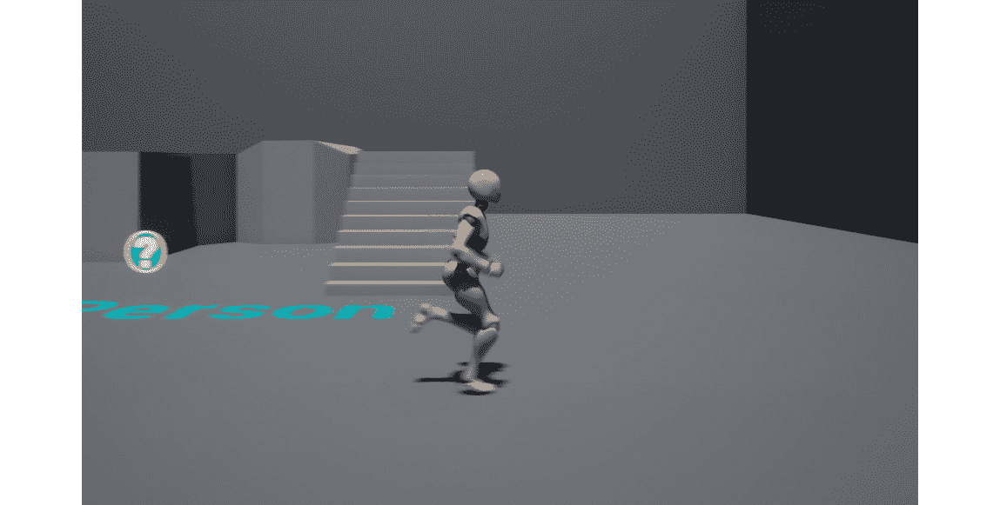

图 11.35 – 玩家角色现在可以冲刺

当玩家角色能够冲刺时，让我们继续进行下一个活动，在这个活动中，你将以非常相似的方式实现基本的 `Throw` 功能。

## 活动 11.03 – 实现投掷输入

本游戏包含的一个功能是玩家能够向敌人投掷投射物。你不会在本章中创建投射物或实现动画，但你将设置键绑定和 C++ 实现，以便在下一章中使用。

在这个活动中，你需要设置 `Throw` 投射物功能的高级输入映射，并在 C++ 中实现当玩家按下映射到 `Throw` 的键时的调试日志。

按照以下步骤完成此活动：

1.  在 `Throw` 文件夹内创建一个新的文件夹，并创建一个新的 `IA_Throw`。

1.  在 `IA_Throw` 中使用 `Trigger` 类型的 `Pressed`。

1.  添加新的 `IA_Throw` `IC_SideScrollerCharacter`，并将其绑定到 `Left Mouse Button` 和 `Gamepad Right Trigger`。

1.  在 Visual Studio 中，添加一个新的 `UInputAction` 变量，命名为 `IA_Throw`，并将适当的 `UPROPERTY()` 宏添加到该变量。

1.  在 `SuperSideScroller_Player` 的头文件中添加一个新的函数。将此函数命名为 `ThrowProjectile()`。这将是一个无参数的 void 函数。

1.  在 `SuperSideScroller_Player` 类的源文件中创建定义。在这个函数的定义中，使用 `UE_LOG` 打印一条消息，让你知道该函数正在成功调用。

1.  使用 `EnhancedPlayerInput` 变量添加一个新的 `BindAction` 函数调用，用于绑定新的 `Throw` `ThrowProjectile()` 函数。

注意

你可以在这里了解更多关于 `UE_LOG` 的信息：[`nerivec.github.io/old-ue4-wiki/pages/logs-printing-messages-to-yourself-during-runtime.xhtml`](https://nerivec.github.io/old-ue4-wiki/pages/logs-printing-messages-to-yourself-during-runtime.xhtml).

1.  编译代码并返回到编辑器。接下来，将 `IA_Throw` 添加到 `BP_SuperSideScroller_MainCharacter` 参数 `IA_Throw`。

预期结果是，当你使用 *左鼠标按钮* 或 *游戏手柄右扳机* 时，`Output Log` 中将出现一条日志，告诉你 `ThrowProjectile` 函数正在成功调用。你将使用此函数在后续章节中生成你的投射物。

预期输出如下：

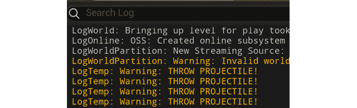

图 11.36 – 预期输出日志

注意

本活动的解决方案可以在 GitHub 上找到：[`github.com/PacktPublishing/Elevating-Game-Experiences-with-Unreal-Engine-5-Second-Edition/tree/main/Activity%20solutions`](https://github.com/PacktPublishing/Elevating-Game-Experiences-with-Unreal-Engine-5-Second-Edition/tree/main/Activity%20solutions).

完成这项活动后，你现在已经有了在 *第十三章* *创建和添加敌人人工智能* 中创建玩家投射物的功能。你还掌握了添加新键映射到你的游戏以及实现利用这些映射的 C++ 功能来启用游戏玩法功能的知识和经验。现在，你将继续更新玩家角色的移动，以便在玩家跳跃时正确播放跳跃动画。但首先，让我们花点时间来了解动画状态机。

# 使用动画状态机

状态机是一种将动画或动画集分类到状态中的方法。一个状态可以被视为玩家角色在特定时间所处的条件。玩家当前是在行走吗？玩家是在跳跃吗？在许多第三人称游戏，如 *The Last of Us* 中，这涉及到将移动、跳跃、蹲下和攀爬动画分别归入它们自己的状态。每个状态在游戏进行时满足某些条件时都是可访问的。条件可以包括玩家是否在跳跃、玩家角色的速度以及玩家是否处于蹲下状态。状态机的任务是使用称为 `ThirdPerson_AnimBP` 的动画蓝图中的逻辑决策在各个状态之间进行转换：

注意

关于状态机的概述可以在这里找到：[`docs.unrealengine.com/en-US/Engine/Animation/StateMachines/Overview/index.xhtml`](https://docs.unrealengine.com/en-US/Engine/Animation/StateMachines/Overview/index.xhtml)。

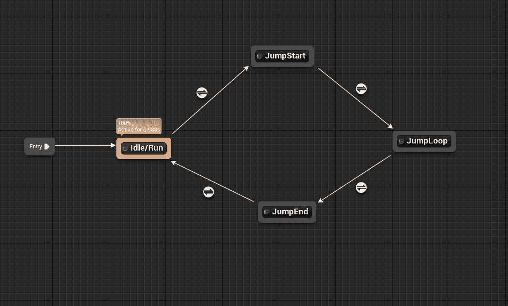

图 11.37 – ThirdPerson_AnimBP 的状态机

对于玩家角色的状态机，这个状态机将处理默认玩家移动和跳跃的状态。目前，你通过使用由角色速度控制的混合空间来简单地动画化玩家角色。在下一个练习中，你将创建一个新的状态机，并将移动混合空间逻辑移动到该状态机中的自己的状态。让我们开始创建新的状态机。

## 练习 11.07 – 玩家角色移动和跳跃状态机

在这个练习中，你将实现一个新的动画状态机，并将现有的移动混合空间集成到状态机中。此外，你将设置玩家开始跳跃和跳跃过程中在空中的状态。

让我们先添加这个新的状态机：

1.  导航到 `/MainCharacter/Blueprints/` 目录并打开 `AnimBP_SuperSideScroller_MainCharacter` 动画蓝图。

1.  在上下文相关搜索中的 `state machine` 内部查找 `添加新状态机` 选项。将这个新的状态机命名为 `Movement`。

1.  现在，我们不再将 `SideScroller_IdleRun` Blend Space 的输出姿态连接起来，而是可以将新状态机 `Movement` 的输出姿态连接到动画的输出姿态：

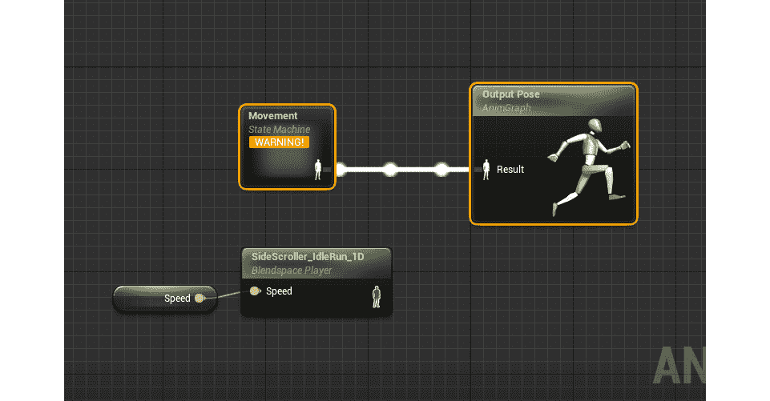

图 11.38 – 新的 Movement 状态机取代了旧的 Blend Space

将空状态机连接到动画蓝图的 `Output Pose` 属性将导致以下截图所示的警告。这仅仅意味着在该状态机内部没有发生任何事情，并且结果将无效于 `Output Pose`。不要担心；您将在下一步修复这个问题：

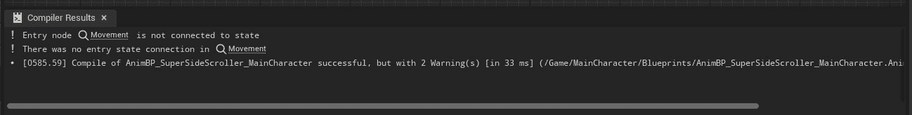

图 11.39 – 空状态机会导致编译警告

双击左键点击 `Movement` 状态机以打开状态机本身。

您将首先添加一个新的状态来处理角色之前所做的事情；即 `Idle`、`Walking` 或 `Running`。

1.  从 `Entry` 点开始，左键点击并拖动以打开上下文相关搜索。您会注意到只有两个选项 – `Add Conduit` 和 `Add State`。目前，您将添加一个新的状态并将此状态命名为 `Movement`。以下截图显示了如何创建 `Movement` 状态：

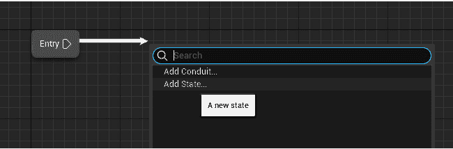

图 11.40 – 在状态机内部，您需要添加一个新的状态

1.  在选择 `Add` `State` 后，您可以重命名状态为 `Movement`，并且它应该自动连接到状态机的 `Entry` 节点。

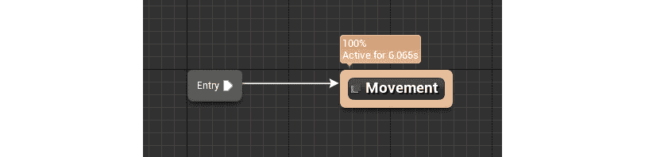

图 11.41 – 新的 Movement 状态

1.  将您之前连接 `Speed` 变量到 `SideScroller_IdleRun` Blend Space 的逻辑复制并粘贴到之前步骤中创建的新的 `Movement` 状态中。将其连接到本状态 `Output Animation Pose` 节点的 `Result` 插针：

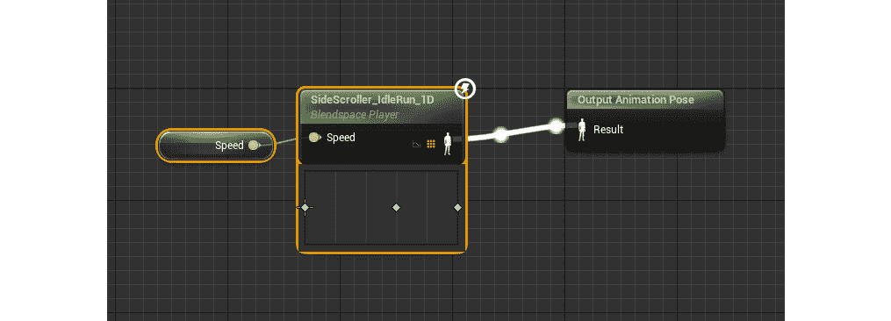

图 11.42 – 将 Blend Space 的输出姿态连接到本状态的输出姿态

现在，如果您重新编译动画蓝图，您会注意到之前看到的警告现在已经消失了。这是因为您添加了一个新的状态，该状态输出动画到 `Output Animation Pose` 而不是有一个空的状态机。

通过完成这个练习，你已经构建了你自己的第一个状态机。虽然它非常简单，你现在正在告诉角色默认进入并使用`Movement`状态。现在，如果你使用`PIE`，你会看到玩家角色像你之前在创建状态机之前那样四处移动。这意味着你的状态机正在运行，你可以继续到下一步，这将包括添加跳跃所需的初始状态。让我们先创建`JumpStart`状态。

## 过渡规则

导管是一种告诉每个状态它可以在什么条件下从一个状态过渡到另一个状态的方式。在这种情况下，创建了一个过渡规则，作为`Movement`和`JumpStart`状态之间的连接。这再次由状态之间的连接方向箭头表示。工具提示中提到了过渡规则这个术语，这意味着你需要定义这些状态之间的过渡将如何发生，使用布尔值来完成：

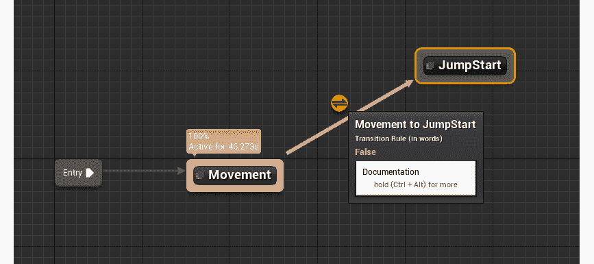

图 11.43 – 从 Movement 到 JumpStart 开始需要过渡规则

简单过渡规则和导管之间的主要区别是，过渡规则只能连接两个状态，而导管可以作为在单一状态和许多其他状态之间过渡的手段。有关更多信息，请参阅以下文档：[`docs.unrealengine.com/5.0/en-US/state-machines-in-unreal-engine/#conduits`](https://docs.unrealengine.com/5.0/en-US/state-machines-in-unreal-engine/#conduits)。

在下一个练习中，你将添加这个新的`JumpStart`状态，并添加必要的过渡规则，以便角色可以从`Movement`状态过渡到`JumpStart`状态。

## 练习 11.08 – 向状态机添加状态和过渡规则

在从玩家角色的默认移动 Blend Space 过渡到跳跃动画开始时，你需要知道玩家何时决定跳跃。这可以通过使用玩家角色“角色移动”组件中的一个有用函数`IsFalling`来实现。你将想要跟踪玩家是否正在下落，以便在跳跃的进入和退出之间进行过渡。最好的方法是将`IsFalling`函数的结果存储在其自己的变量中，就像你跟踪玩家速度时做的那样。

按照以下步骤完成这个练习：

1.  在状态机的概述中，左键单击并从`Movement`状态的边缘拖动以打开上下文相关菜单。

1.  选择`JumpStart`。当你这样做时，Unreal Engine 会自动连接这些状态，并为你实现一个空的过渡规则：

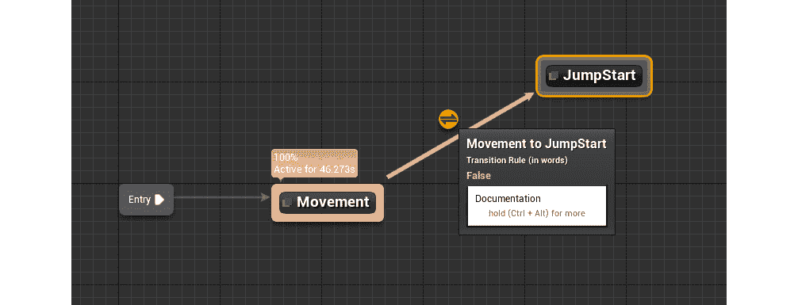

图 11.44 – 当连接两个状态时，Unreal 自动为你创建的转换规则

1.  返回到玩家角色的`Speed`值：

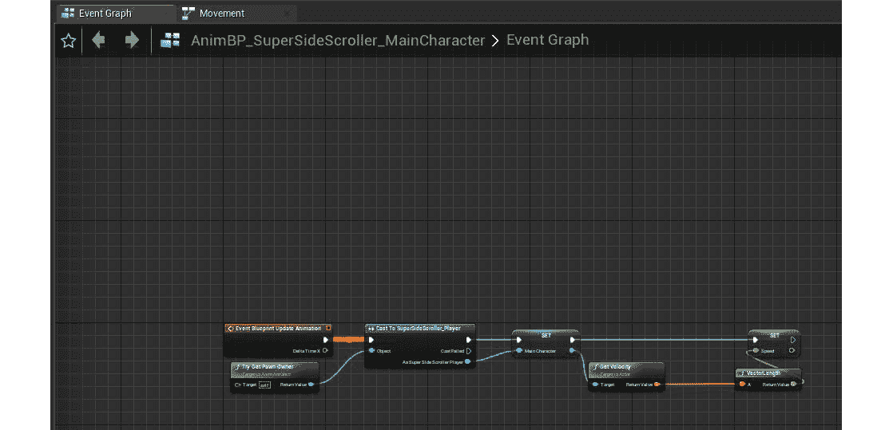

图 11.45 – 我们现在将主角色的向量长度存储为速度

1.  为`MainCharacter`创建一个 getter 变量，并访问`Character Movement`组件。从`Character Movement`组件中，左键单击并拖动以访问上下文相关菜单。搜索`IsFalling`：

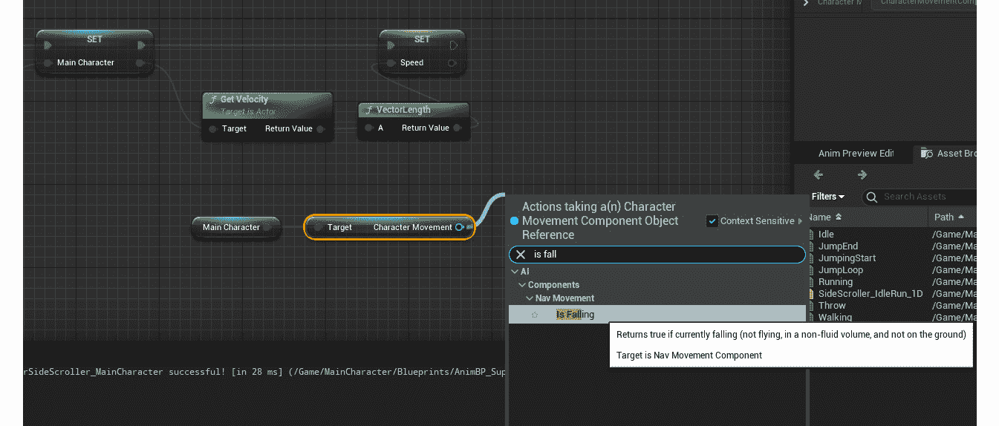

图 11.46 – 如何找到 IsFalling 函数

1.  通过`IsFalling`函数的帮助，角色运动组件可以告诉你玩家角色当前是否在空中：

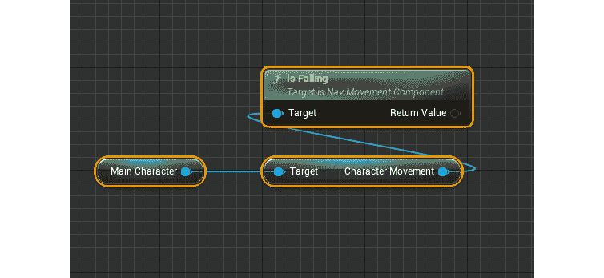

图 11.47 – 显示玩家角色状态的 Character Movement 组件

1.  从`IsFalling`函数的`Return Value`布尔值，左键单击并拖动以搜索`bIsInAir`。在提升为变量时，`Return Value`输出引脚应自动连接到新提升变量的输入引脚。如果不自动连接，请记住将它们连接起来：

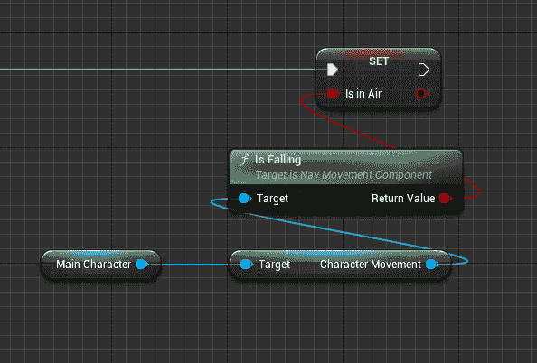

图 11.48 – 包含 IsFalling 函数值的新的变量 bIsInAir

现在你存储了玩家的状态以及他们是否在空中，这是在`Movement`和`JumpStart`状态之间作为转换规则的完美候选。

1.  在`Movement State`机器中，双击左键点击`Transition Rule`以进入其图。你将找到一个只有一个输出节点，即`Result`，带有`Can Enter Transition`参数。在这里你所需要做的就是使用`bIsInAir`变量并将其连接到那个输出。现在，`Transition Rule`表示如果玩家在空中，则`Movement`状态和`JumpStart`状态之间的转换可以发生：

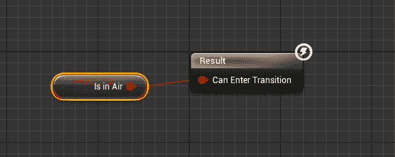

图 11.49 – 当玩家在空中时，将过渡到跳跃动画的开始

在`Movement`和`JumpStart`状态之间设置了你的`Transition Rule`之后，你所需要做的就是告诉`JumpStart`状态使用哪个动画。

1.  从状态机图中，双击左键点击`JumpStart`状态以进入其图。从`JumpingStart`动画到图：

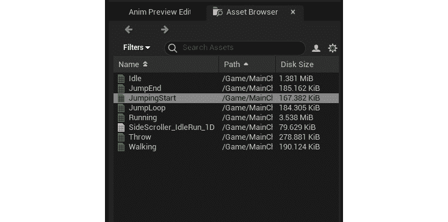

图 11.50 – 确保在资源浏览器中已选择 JumpingStart 动画

1.  将`Play JumpingStart`节点的输出连接到`Output Animation Pose`节点的`Result`引脚：

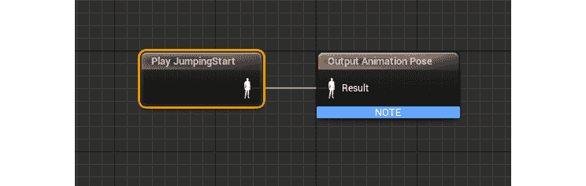

图 11.51 – 将 JumpingStart 动画连接到 JumpStart 状态的 Output Animation Pose

在您可以继续下一个状态之前，需要在`JumpingStart`动画节点上更改一些设置。

1.  在`Play JumpingStart`动画节点上左键单击并更新`Loop Animation = False`

1.  `Play Rate = 2.0`

以下截图显示了`Play JumpingStart`动画节点的最终设置：

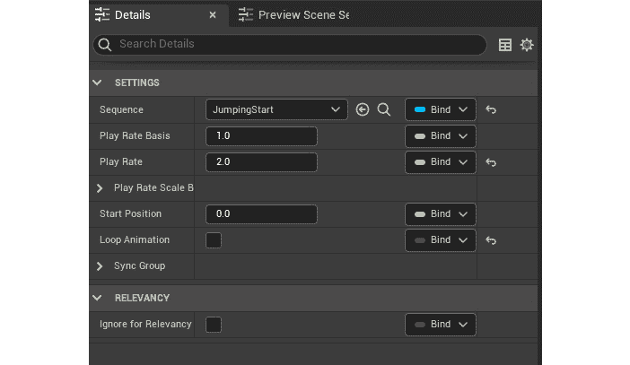

图 11.52 – 提高播放速率将使整体跳跃动画更加平滑

在这里，您将`Loop Animation`参数设置为`False`，因为没有理由让这个动画循环；在任何情况下它都只应该播放一次。唯一能让这个动画循环的方式是玩家角色以某种方式卡在这个状态，但这种情况永远不会发生，因为您将创建下一个状态。将`Play Rate`设置为`2.0`的原因是，动画本身`JumpingStart`对于您正在制作的游戏来说太长了。这个动画让角色大幅度弯曲膝盖，向上跳跃超过一秒。对于`JumpStart`状态，您希望角色更快地播放这个动画，使其更加流畅，并提供更平滑的过渡到下一个状态；即`JumpLoop`。为了给动画中可用的`Play Rate`参数提供额外的上下文，存在`Play Rate`和`Play Rate Basis`两个参数。`Play Rate Basis`参数允许您更改`Play Rate`参数的表达方式；因此，默认情况下，这个值设置为 1.0。如果您想改变这个值到 10.0，这意味着`Play Rate`输入将被除以 10。所以，根据`Play Rate Basis`的不同，`Play Rate`中使用的值可以导致不同的结果；为了简化，我们将保持`Play Rate Basis`的默认值 1.0。

一旦玩家角色开始`JumpStart`动画，在动画过程中有一个时刻玩家处于空中，应该过渡到新状态。这个新状态将循环，直到玩家不再在空中，可以过渡到跳跃结束的最终状态。接下来，我们将创建一个新的状态，将从`JumpStart`状态过渡。

1.  从状态机图中，*左键点击*并从`JumpStart`状态拖动，选择“添加状态”选项。将这个新状态命名为`JumpLoop`。同样，虚幻引擎将自动为你提供这些状态之间的“过渡规则”，你将在下一个练习中添加。最后，重新编译动画蓝图，并忽略在**编译结果**下可能出现的任何警告：

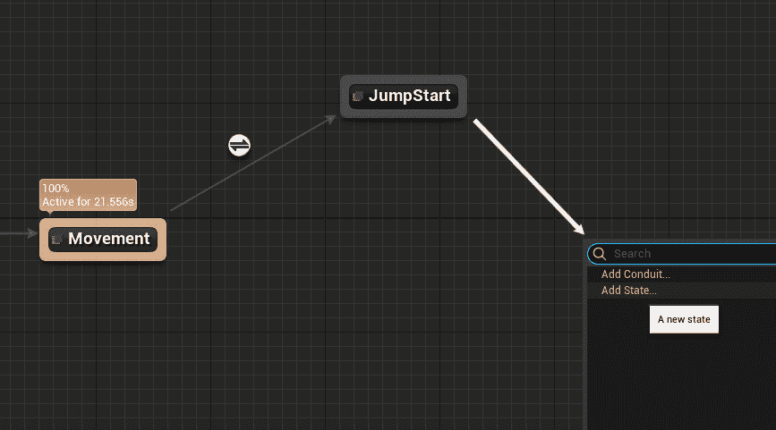

图 11.53 – 处理角色空中动画的新状态

通过完成这个练习，你已经为`JumpStart`和`JumpLoop`添加并连接了状态。这些状态中的每一个都通过“过渡规则”连接。你现在应该更好地理解了状态机中的状态是如何通过每个过渡规则中建立的规则从一个状态过渡到另一个状态的。

在下一个练习中，你将学习如何通过“剩余时间比例”函数从`JumpStart`状态过渡到`JumpLoop`状态。

## 练习 11.09 – 剩余时间比例函数

为了使`JumpStart`状态能够平滑地过渡到`JumpLoop`状态，你需要花点时间思考这个过渡应该如何进行。根据`JumpStart`和`JumpLoop`动画的工作方式，最好在`JumpStart`动画上经过指定的时间后过渡到`JumpLoop`动画。这样，在`JumpStart`动画播放了 X 秒之后，`JumpLoop`状态可以平滑播放。

按照以下步骤进行操作：

1.  双击`JumpStart`和`JumpLoop`之间的“过渡规则”属性以打开其图。这个“过渡规则”将检查`JumpingStart`动画中剩余多少时间。这样做是因为`JumpingStart`动画中剩余一定比例的时间，你可以安全地假设玩家正在空中，并准备过渡到`JumpingLoop`动画状态。

1.  要完成这个操作，请确保在“过渡规则”的“事件图”中选择了`JumpingStart`动画，并找到“剩余时间比例”函数。

让我们花一点时间来谈谈“剩余时间比例”函数以及它的作用。此函数返回一个介于`0.0f`和`1.0f`之间的浮点数，告诉你指定动画中剩余多少时间。`0.0f`和`1.0f`的值可以直接转换为百分比值，这样更容易考虑。在`JumpingStart`动画的情况下，你想要知道动画剩余时间是否少于 60%，以便成功过渡到`JumpingLoop`状态。这就是你现在要做的。

1.  从`Time Remaining Ratio`函数的`Return Value`浮点输出参数中，在上下文相关搜索菜单中搜索`Less Than comparative operative`节点。由于您正在使用返回值在`0.0f`和`1.0f`之间来找出动画是否剩余少于 60%，您需要将这个返回值与`0.6f`的值进行比较。最终结果如下：

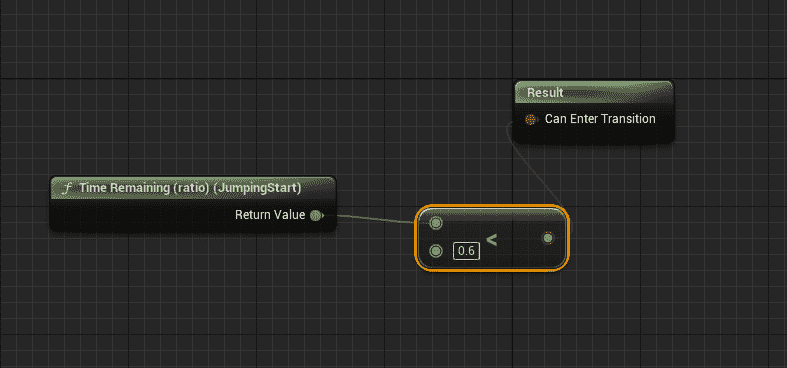

图 11.54 – 跳跃开始和跳跃循环状态之间的新过渡规则

在这里设置了`Transition Rule`后，您只需要将`JumpLoop`动画添加到`JumpLoop`状态。

1.  在`Movement`状态机中，双击`JumpLoop`状态进入其图。在`Output Animation Pose`的`Result`输入中选择`JumpLoop`动画资产，如下截图所示。`Play JumpLoop`节点的默认设置将保持不变：

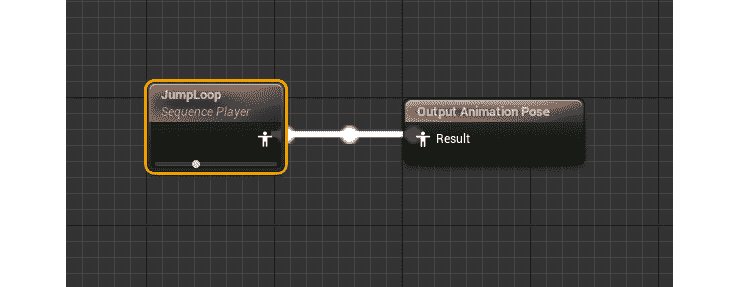

图 11.55 – 连接到新状态输出动画姿态的 JumpLoop 动画

在`JumpLoop`状态中设置了`JumpLoop`动画后，您可以编译动画蓝图和 PIE。您会注意到移动和冲刺动画仍然存在，但当你尝试跳跃时会发生什么？玩家角色开始进入`JumpStart`状态，并在空中播放`JumpLoop`动画。这很好——状态机正在工作，但当玩家角色到达地面并且不再在空中时会发生什么？玩家角色不会返回到`Movement`状态，这是有道理的，因为您还没有添加`JumpEnd`状态，也没有添加`JumpLoop`和`JumpEnd`之间的过渡，以及从`JumpEnd`返回到`Movement`状态的过渡。您将在下一个活动中完成这些。以下截图显示了玩家角色卡在`JumpLoop`状态的一个示例：

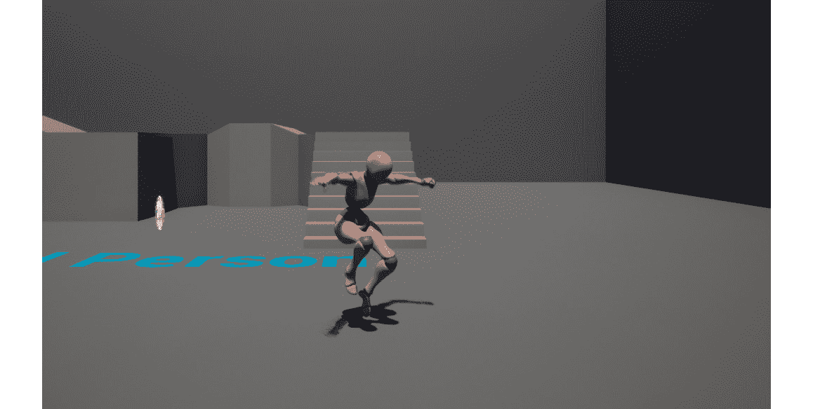

图 11.56 – 玩家角色现在可以播放跳跃开始和跳跃循环动画

通过完成这个练习，您成功使用`Time Remaining Ratio`函数从`JumpStart`状态过渡到`JumpLoop`状态。这个函数允许您知道动画播放的进度，并且有了这个信息，您让状态机过渡到`JumpLoop`状态。现在玩家可以成功从默认的`Movement`状态过渡到`JumpStart`状态，然后到`JumpLoop`状态。然而，这引发了一个有趣的问题：玩家现在卡在`JumpLoop`状态，因为状态机不包含返回到`Movement`状态的过渡。我们将在下一个活动中解决这个问题。

## 活动 11.04 – 完成移动和跳跃状态机

当状态机完成了一半时，是时候添加跳跃结束时的状态，以及允许你从 `JumpLoop` 状态转换到这个新状态，然后从这个新状态转换回 `Movement` 状态的转换规则。

按照以下步骤完成 `Movement` 状态机：

1.  为 `Jump End` 添加一个新状态，该状态从 `JumpLoop` 转换而来。将此状态命名为 `JumpEnd`。

1.  将 `JumpEnd` 动画添加到新的 `JumpEnd` 状态。

1.  根据动画 `JumpEnd` 和我们想要在 `JumpLoop`、`JumpEnd` 和 `Movement` 状态之间快速转换的速度，考虑修改动画参数，就像你为 `JumpStart` 动画所做的那样。`loop animation` 参数需要设置为 `False`，而 `Play Rate` 参数需要设置为 `3.0`。

1.  根据变量 `bIsInAir`，从 `JumpLoop` 状态添加一个 `Transition Rule` 到 `JumpEnd` 状态。

1.  根据动画 `JumpEnd` 的 `Time Remaining Ratio` 函数，从 `JumpEnd` 状态添加一个 `Transition Rule` 到 `Movement` 状态。（参考 `JumpStart` 到 `JumpLoop` 的转换规则）。

在完成这个活动后，你将拥有一个完全功能性的移动状态机，允许玩家角色空闲、行走和冲刺，以及正确地开始跳跃、在空中和落地时的动画。

预期输出如下：

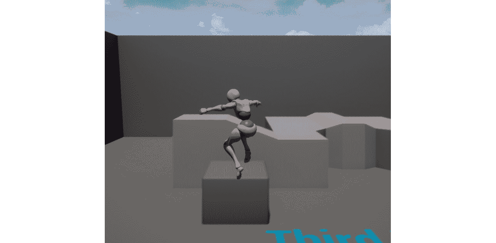

图 11.57 – 玩家角色现在可以空闲、行走、冲刺和跳跃

注意

本活动的解决方案可以在 GitHub 上找到：[`github.com/PacktPublishing/Elevating-Game-Experiences-with-Unreal-Engine-5-Second-Edition/tree/main/Activity%20solutions`](https://github.com/PacktPublishing/Elevating-Game-Experiences-with-Unreal-Engine-5-Second-Edition/tree/main/Activity%20solutions)。

通过完成这个活动，你已完成了玩家角色的 `Movement` 状态机。通过添加剩余的 `JumpEnd` 状态和转换规则，从 `JumpLoop` 状态转换到 `JumpEnd` 状态，以及从 `JumpEnd` 状态转换回 `Movement` 状态，你已成功创建了你的第一个动画状态机。现在，你可以在地图上四处跑动并跳上高台，同时正确地动画化和在移动和跳跃状态之间转换。

# 摘要

在创建玩家移动 Blend Space 并使用状态机将动画从移动转换到跳跃的玩家角色动画蓝图之后，你就可以进入下一章了，在那里你将准备所需的动画槽和动画蒙太奇，然后更新动画蓝图以进行投掷动画，该动画将仅使用角色的上半身。

通过本章的练习和活动，你学习了如何创建一个一维混合空间，它允许你使用玩家角色的速度来控制基于移动的动画（如闲置、行走和奔跑）的平滑混合。

此外，你学习了如何将新的快捷键集成到项目设置中，并将这些键绑定到 C++ 中，以启用如冲刺和投掷等角色游戏机制。

最后，你学习了如何在玩家的角色动画蓝图内实现自己的动画状态机，以便在移动动画、跳跃的各种状态之间以及再次回到移动状态之间进行转换。在所有这些逻辑就绪之后，在下一章中，我们将创建允许玩家角色播放投掷动画的资源和逻辑，并为敌人设置基类。
