# 12

# 动画混合和蒙太奇

在上一章中，您能够通过在混合空间中实现移动动画并使用该混合空间在动画蓝图中根据玩家的速度驱动动画，使玩家角色栩栩如生。然后，您能够根据玩家输入在 C++中实现功能，使角色能够冲刺。最后，您利用内置的动画蓝图驱动角色的移动状态和跳跃状态，以允许在行走和跳跃之间实现流畅的过渡。

当玩家角色的动画蓝图和状态机运行正常时，是时候通过实现角色的`投掷`动画来介绍动画蒙太奇和动画槽位了。在本章中，您将了解更多关于动画混合的知识，通过创建动画蒙太奇来了解 Unreal Engine 如何处理多个动画的混合，并使用一个新的动画槽位来处理玩家投掷动画。从那里，您将通过实现新的功能，如`保存缓存的姿态`和`按骨骼分层混合`，在玩家的动画蓝图中使用动画槽位，以便玩家能够正确混合上一章中处理的移动动画和本章将实现的新投掷动画。

在本章中，您将学习以下主题：

+   如何使用动画槽位为玩家角色创建分层动画混合

+   为角色的`投掷`动画创建动画蒙太奇

+   在动画蓝图内使用`按骨骼节点分层混合`来混合角色的上半身`投掷`动画和下半身动作动画

到本章结束时，您将能够使用`动画蒙太奇`工具，利用您在*第十章*中导入的`投掷`动画序列创建一个独特的投掷动画。通过这个蒙太奇，您将创建并使用动画槽位，以便在玩家角色的动画蓝图中混合动画。您还将了解如何使用混合节点有效地混合角色的移动和投掷动画。

在最终确定玩家角色动画后，您将创建所需的类和资产用于敌人 AI，并了解更多关于材质和材质实例的知识，这将给这个敌人一个独特的视觉颜色，以便在游戏中区分。最后，敌人将准备好进入*第十三章*，*创建和添加敌人人工智能*，在那里您将开始创建 AI 行为逻辑。

# 技术要求

对于本章，您需要安装 Unreal Engine 5

让我们从了解动画蒙太奇和动画槽位是什么以及它们如何用于角色动画开始。

本章的项目可以在本书代码包的 Chapter12 文件夹中找到，该代码包可以在此处下载：[`github.com/PacktPublishing/Elevating-Game-Experiences-with-Unreal-Engine-5-Second-Edition`](https://github.com/PacktPublishing/Elevating-Game-Experiences-with-Unreal-Engine-5-Second-Edition)。

# 动画混合、动画槽和动画蒙太奇

动画混合是将多个动画在骨骼网格上尽可能无缝地过渡的过程。你已经熟悉了动画混合的技术，因为你为玩家角色在*第十一章*，*使用一维混合空间、按键绑定和状态机*中创建了一个`Blend` `Spaces`资产。在这个混合空间中，角色可以在`Idle`、`Walking`和`Running`动画之间平滑过渡。现在，你将通过探索和实现新的加法技术来扩展这一知识，将这些动画与投掷动画结合起来。通过使用动画槽（Anim Slot），你将投掷动画发送到一组上半身骨骼及其子骨骼，以便在同时应用移动和投掷动画时不会对其他动画产生负面影响。但在开始之前，让我们更多地讨论一下动画蒙太奇。

动画蒙太奇是非常强大的资产，允许你将多个动画组合起来，并将这些组合动画分割成所谓的**部分**。然后，这些部分可以单独播放，按照特定的顺序播放，甚至循环播放。

动画蒙太奇也很有用，因为你可以通过蓝图或 C++从蒙太奇中控制动画；这意味着你可以根据正在播放的动画部分或蒙太奇中是否调用了任何 Notifies 来调用逻辑、更新变量、复制数据等。在 C++中，有一个`UAnimInstance`对象，你可以用它来调用如`UAnimInstance::Montage_Play`之类的函数，这允许你从 C++访问和播放蒙太奇。

注意

这种方法将在*第十四章*，*生成玩家投射物*中使用，届时你将开始为游戏添加细节。有关 Unreal Engine 5 在 C++中如何处理动画和 Notifies 的更多信息，请参阅[`docs.unrealengine.com/en-US/API/Runtime/Engine/Animation/AnimNotifies/UAnimNotifyState/index.xhtml`](https://docs.unrealengine.com/en-US/API/Runtime/Engine/Animation/AnimNotifies/UAnimNotifyState/index.xhtml)。你将在本章的第一个练习中了解更多关于 Notifies 的信息，并在*第十四章*，*生成玩家投射物*中编写你自己的通知状态。

下图显示了动画蒙太奇的 Persona 编辑器。然而，在*练习 12.01*，*设置动画蒙太奇*中，这将进一步分解：

图 12.1 – 当编辑动画蒙太奇时打开的 Persona 编辑器

就像在动画序列中一样，动画蒙太奇允许在动画某个部分的时间线上触发通知，然后可以触发声音、粒子效果和事件。事件通知将允许我们从蓝图或 C++中调用逻辑。Epic Games 在其文档中提供了一个示例，即一个武器装填动画蒙太奇，它被分为`reload start`、`reload loop`和`reload complete`的动画。通过将这些动画拆分并应用声音和事件的通知，开发者可以完全控制`reload loop`动画的播放时长，基于内部变量，并控制动画过程中播放的任何附加声音或效果。

最后，动画蒙太奇支持**动画槽**。动画槽允许你分类一个动画或一组动画，以后可以在动画蓝图中引用，以允许基于槽的独特混合行为。这意味着你可以定义一个动画槽，以后可以在动画蓝图中使用，以允许使用此槽的动画以任何你想要的方式在基本移动动画之上混合；在我们的案例中，仅影响玩家角色的上半身，而不影响下半身。

让我们从创建玩家角色在第一个练习中的`Throw`动画蒙太奇开始。

## 练习 12.01 – 设置动画蒙太奇

对于玩家角色，你需要做的第一件事是为这个动画设置一个动画槽，以便将其单独分类为上半身动画。你将使用这个动画槽与动画蓝图中的混合函数一起使用，以便玩家角色在投掷投射物的同时，还能正确地动画化移动和跳跃时的下半身。

在这个练习结束时，玩家角色将只能用上半身播放`Throw`动画，而下半身仍将使用你在上一章中定义的移动动画。

首先，我们需要为角色创建动画蒙太奇，将动画槽设置在那里：

1.  首先，导航到`/MainCharacter/Animation`目录，这是所有动画资产所在的位置。

1.  现在，在内容抽屉中右键单击，并将鼠标悬停在可用的下拉菜单中的**动画**选项上。

1.  然后，左键单击以从出现的附加下拉菜单中选择**动画蒙太奇**选项。

1.  就像创建其他基于动画的资产一样，例如`Blend Spaces`或`Animation Blueprints`，Unreal Engine 将要求你为这个动画蒙太奇分配一个`Skeleton`对象。在这种情况下，选择`MainCharacter_Skeleton`。

1.  将新的动画蒙太奇命名为`AM_Throw`。现在，双击左键打开蒙太奇。

当您打开`动画蒙太奇`资产时，您会看到一个类似于打开动画序列时的编辑器布局。有一个**预览**窗口显示默认的 T 形的的主要角色骨骼，但一旦您向这个蒙太奇添加动画，骨骼将更新以反映这些变化。

通过完成这个练习，您已经成功创建了一个`投掷`动画和动画槽，这是您将`投掷`动画与现有的角色移动动画混合所需的。

# 动画蒙太奇

看看下面的图：

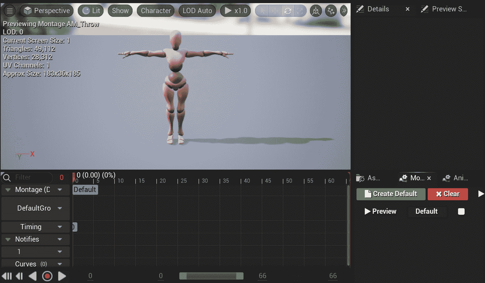

图 12.2 – 预览窗口与蒙太奇和部分区域并排

在**预览**窗口下方，您可以看到主要的时间线蒙太奇，以及其他部分。让我们从上到下评估这些部分：

+   **蒙太奇**：**蒙太奇**部分是一系列可以包含一个或多个动画的动画集合。您还可以在时间线上的任何位置右键单击以创建一个部分。

+   **蒙太奇部分**：部分允许您将蒙太奇的不同部分划分到各自的独立部分中，这使得您可以设置单个动画序列的播放顺序以及是否应该循环播放。

对于`投掷`蒙太奇，您不需要使用此功能，因为您在这个蒙太奇中只会使用一个动画：

+   **时间控制**：**时间控制**部分为您提供了蒙太奇的预览以及蒙太奇各变化方面的顺序。**通知**、**蒙太奇**部分和其他元素的播放顺序将在这里以视觉方式显示，以便您快速预览蒙太奇的工作方式。

+   `播放声音`或`播放粒子效果`，允许您在动画的特定时间播放声音或粒子。您将在本项目的后续部分使用这些通知来实现投掷投射物：

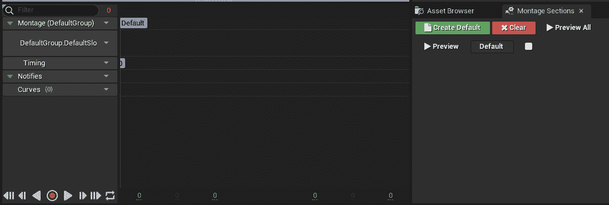

图 12.3 – 时间和通知区域

现在您已经熟悉了动画蒙太奇的界面，您可以通过以下练习将`投掷`动画添加到蒙太奇中。

## 练习 12.02 – 向蒙太奇添加投掷动画

现在您已经更好地理解了动画蒙太奇是什么以及这些资产是如何工作的，是时候将`投掷`动画添加到您在*练习 12.01*，*设置动画蒙太奇*中创建的蒙太奇中了。尽管您只会向这个蒙太奇添加一个动画，但重要的是要强调，您可以将多个独特的动画添加到蒙太奇中，然后播放它们。现在，让我们首先添加您在*第十章*，*创建 SuperSideScroller 游戏*中导入到项目中的`投掷`动画：

1.  在`投掷`动画资产中。然后，左键单击并拖动它到**蒙太奇**部分的时序线上：

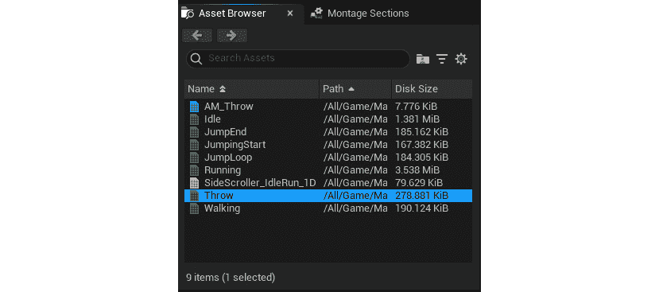

图 12.4 – 带有基于动画资产的资产浏览器窗口

一旦动画被添加到动画蒙太奇中，**预览**窗口中的角色骨骼将更新以反映这一变化并开始播放动画：

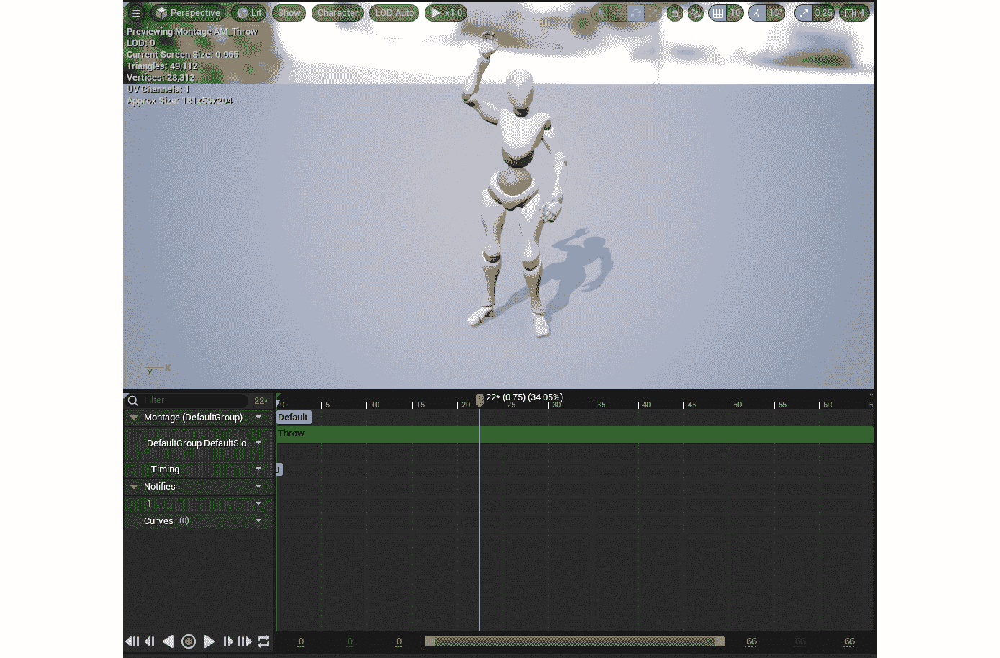

图 12.5 – 玩家角色开始动画

现在，`投掷`动画已经被添加到动画蒙太奇中，你可以继续创建动画槽。

**动画槽管理器**标签应停靠在右侧的**资产浏览器**标签旁边。如果你看不到**动画槽管理器**标签，可以通过导航到**动画蒙太奇**编辑器窗口顶部的工具栏中的**窗口**标签来访问它。在那里，左键单击以选择**动画槽管理器**选项，窗口将出现。

通过完成这个练习，你已经将`投掷`动画添加到了你的新动画蒙太奇中，并且能够通过**角色**预览编辑器中动画的外观。

现在，你可以在添加你自己的独特动画槽到本章后面用于动画混合之前，学习更多关于动画槽和动画槽管理器的知识。

# 动画槽管理器

`Face`来向他人表明此组中的槽位会影响角色的面部。默认情况下，虚幻引擎为你提供了一个名为`DefaultGroup`的组和一个名为`DefaultSlot`的动画槽，它在该组中。

在接下来的练习中，我们将为玩家角色的上半身创建一个新的动画槽。

## 练习 12.03 – 添加新的动画槽

现在你对动画槽和`上半身`有了更好的理解。一旦创建了新的槽位，它就可以在动画蓝图中被使用和引用来处理动画混合，你将在后面的练习中这样做。

让我们按照以下步骤创建动画槽：

1.  在**动画槽管理器**中，左键单击**添加槽位**选项。

1.  当添加新的槽位时，虚幻引擎会要求你为此动画槽命名。将此槽命名为`Upper Body`。动画槽命名很重要，就像命名任何其他资产和参数一样，因为你将在动画蓝图稍后引用此槽位。

创建了动画槽后，你现在可以更新用于`投掷`蒙太奇的槽位。

1.  在`DefaultGroup.DefaultSlot`中。左键单击，并从下拉菜单中选择`DefaultGroup.Upper Body`：

图 12.6 – 新的动画槽将出现在下拉列表中

注意

在更改动画槽后，你可能注意到玩家角色停止了动画并回到了 T 姿态。别担心——如果发生这种情况，只需关闭动画蒙太奇并重新打开它。一旦重新打开，角色将再次播放`投掷`动画。

当你的动画槽在`投掷`蒙太奇中创建并放置好后，现在是你更新动画蓝图的时候了，以便玩家角色能够意识到这个槽并根据它正确地动画化。

通过完成这个练习，你已使用动画蒙太奇中的动画槽管理器创建了你的第一个动画槽。有了这个槽，现在它可以在玩家角色动画蓝图中使用和引用，以处理混合`投掷`动画和你在上一章中实现的移动动画所需的动画混合。在你这样做之前，你需要更多地了解动画蓝图中的`保存缓存姿态`节点。

# 保存缓存姿态

在处理复杂动画和角色时，有时需要你在多个地方引用由状态机输出的姿态。如果你还没有注意到，你的`移动`状态机的输出姿态不能连接到多个其他节点。这就是`保存缓存姿态`节点派上用场的地方；它允许你缓存（或存储）一个姿态，然后可以同时引用多个地方。你需要使用这个来设置新的上半身动画槽。

在下一个练习中，你将实现`保存缓存姿态`节点以缓存`移动`状态机。

## 练习 12.04 – 保存移动状态机的缓存姿态

为了有效地混合使用你之前练习中创建的`Upper Body`动画槽的`投掷`动画，你需要能够在动画蓝图中引用`移动`状态机。为此，你需要在动画蓝图中执行以下操作以实现`保存缓存姿态`节点：

1.  在`AnimBP_SuperSideScroller_MainCharacter`的动画图中，右键单击并搜索`新建保存缓存姿态`。将此命名为`移动缓存`：

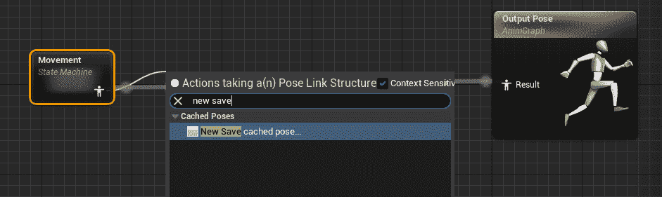

图 12.7 – 每帧将评估一次姿态，然后进行缓存

1.  现在，你不需要直接将`移动`状态机连接到输出姿态，而是将其连接到缓存节点：

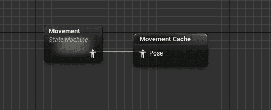

图 12.8 – 移动状态机正在被缓存

1.  当`移动`状态机的姿态被缓存后，你现在只需引用它。这可以通过搜索`使用缓存姿态`节点来完成。

注意

所有缓存的姿态都会显示在上下文相关菜单中。只需确保你选择你根据*步骤 1*给出的名称的缓存姿态。

1.  在缓存的姿态节点可用的情况下，将其连接到动画图的`输出姿态`：

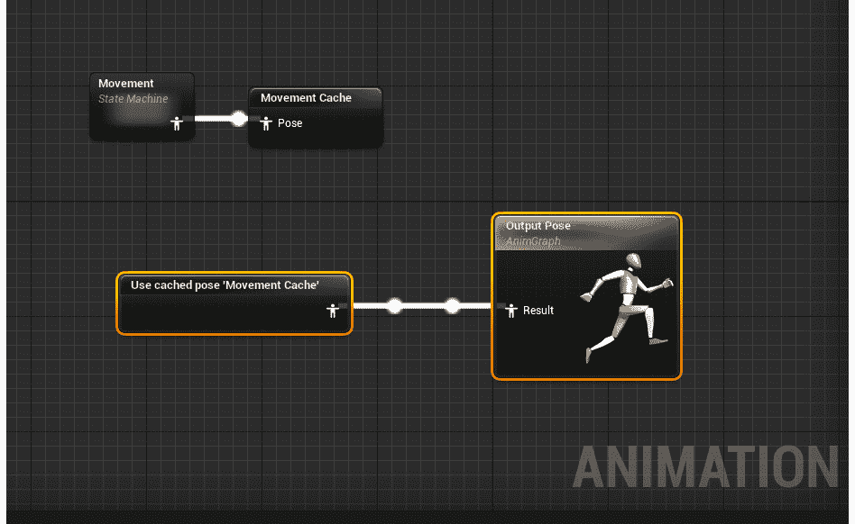

图 12.9 – 缓存的姿态现在直接输入到输出姿态

现在，在完成*步骤 4*之后，你会发现主角将按照你的预期正确动画并移动。这证明了`移动`状态机的缓存正在工作。以下图显示了玩家角色在动画蓝图**预览**窗口中的`空闲`动画：

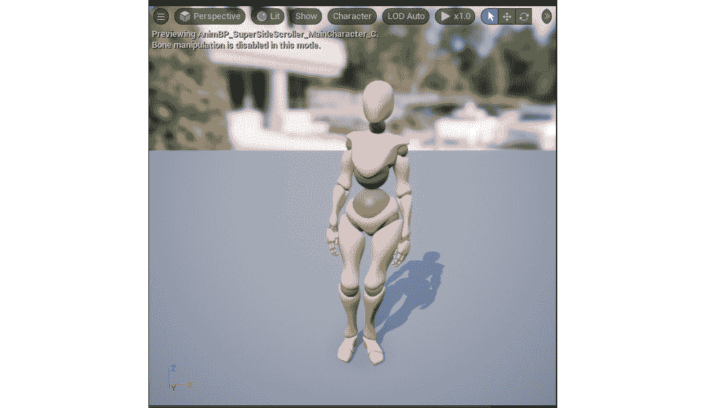

图 12.10 – 主角按照预期进行动画

现在你已经让`移动`状态机的缓存工作正常，你将使用这个缓存通过你创建的动画槽基于骨骼混合动画：

通过完成这个练习，你现在可以在动画蓝图中的任何位置引用缓存的`移动`状态机姿态。有了这种可访问性，你现在可以使用缓存的姿态通过一个名为`Layered blend per bone`的函数开始缓存的移动姿态和`上半身`动画槽之间的混合。

# 层级混合每骨

你将在这里用于混合动画的节点被称为`Layered blend per bone`。这个节点遮罩掉角色骨骼上的一组骨骼，使动画忽略这些骨骼。

在我们玩家角色的`投掷`动画情况下，你需要将下半身遮罩掉，这样只有上半身会进行动画。目标是能够同时执行`投掷`和移动动画，并且让这些动画能够混合在一起；否则，当你执行投掷时，移动动画将会完全中断。

在接下来的练习中，你将使用`Layered blend per bone`遮罩掉玩家角色的下半身，这样`投掷`动画只会影响角色的上半身。

## 练习 12.05 – 使用上半身动画槽混合动画

`Layered blend per bone`函数允许我们将`投掷`动画与你在上一章中实现的移动动画混合，并让你控制`投掷`动画对玩家角色骨骼的影响程度。

在这个练习中，你将使用`Layered blend per bone`函数在播放`投掷`动画时完全遮罩掉角色的下半身，这样它就不会影响角色的下半身移动动画。

让我们从添加`Layered blend per bone`节点并讨论其输入参数及其设置开始：

1.  在动画蓝图内部，右键点击并搜索`Layered blend per bone`节点及其参数：

    +   第一个参数`基础姿态`是角色的基础姿态；在这种情况下，`运动`状态机的缓存姿态将是基础姿态。

    +   第二个参数是`混合姿态 0`节点，您希望将其叠加到`基础姿态`之上；请注意选择`混合姿态`和`混合权重`参数。目前，您将只使用一个`混合姿态`节点。

    +   最后一个参数是`混合权重`，它表示`混合姿态`对`基础姿态`的影响程度，范围从`0.0`到`1.0`，作为一个 alpha 值：

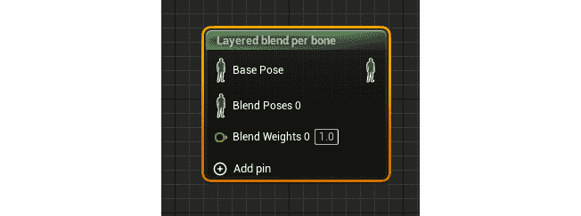

图 12.11 – 每个骨骼节点的分层混合节点

在将任何内容连接到该节点之前，您需要为其属性添加一个层级。

1.  左键单击选择节点并导航到此设置中的`0`。左键单击`分支过滤器`旁边的**+**以创建一个新过滤器。

这里又有两个参数，即以下内容：

+   `骨骼名称`：指定混合将发生的位置，并确定被遮罩的骨骼的子节点层次结构。对于本项目的主体角色骨骼，将`骨骼名称`设置为`Spine`。*图 12.12*显示了`Spine`骨骼及其子节点与主要角色的下半身无关联。这可以在`骨骼`资产`MainCharacter_Skeleton`中看到：

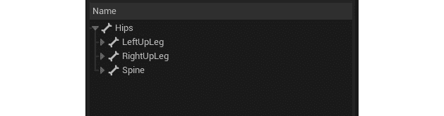

图 12.12 – 脊椎骨及其子节点与主要角色的上半身相关联

+   `混合深度`：骨骼及其子节点受动画影响的深度。值为`0`将不会影响所选骨骼的根节点子节点。

+   `网格空间旋转混合`：确定是否在网格空间或局部空间中混合骨骼旋转。网格空间旋转指的是骨骼网格的边界框作为其基础旋转，而局部空间旋转指的是所讨论骨骼名称的局部旋转。在这种情况下，我们希望旋转混合在网格空间中发生，因此我们将此参数设置为`true`。

混合会传播到骨骼的所有子节点，以停止特定骨骼的混合，将它们添加到数组中，并使它们的混合深度值为`0`。最终结果如下：

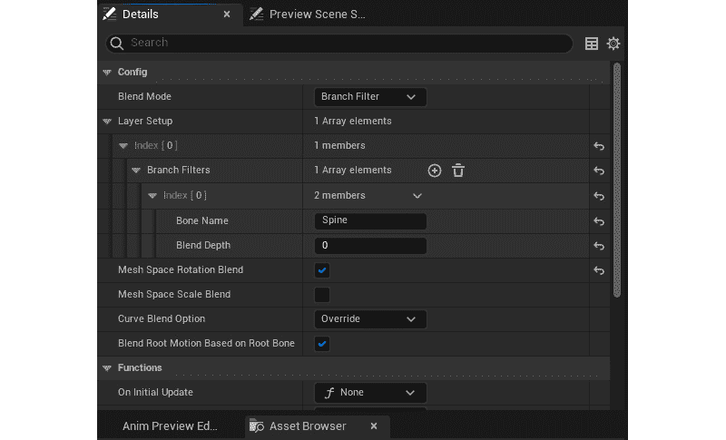

图 12.13 – 您可以使用一个混合节点设置多个层级

1.  在`分层混合每个骨骼`节点上设置好设置后，您可以将`运动缓存`缓存的姿态连接到分层混合的`基础姿态`节点。确保将`分层混合每个骨骼`节点的输出连接到动画蓝图中的`输出姿态`：

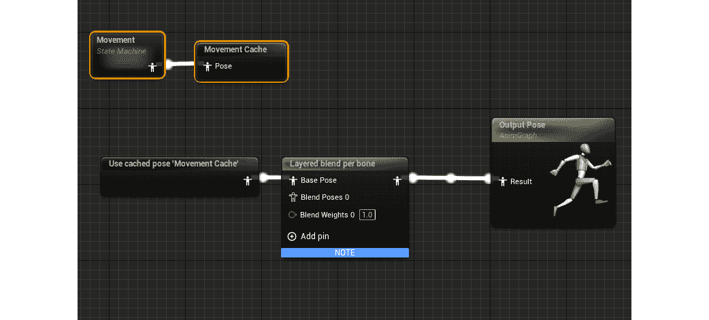

图 12.14 – 将运动状态机的缓存姿态添加到分层混合每个骨骼节点

现在，是时候使用你之前创建的动画槽来通过`Layered blend per bone`节点过滤仅使用此槽的动画了。

1.  在动画图中右键单击并搜索`DefaultSlot`。左键单击选择`Slot`节点，并导航到`Slot Name`属性。左键单击此下拉菜单以查找并选择`DefaultGroup.Upper Body`槽。

当更改`Slot Name`属性时，`Slot`节点将更新以表示这个新名称。`Slot`节点需要一个源姿态，这又将是一个对`Movement`状态机的引用。这意味着你需要为`Movement Cache`姿态创建另一个`Use Cached Pose`节点。

1.  将缓存的姿态连接到`Slot`节点的源：

图 12.15 – 通过动画槽过滤缓存的移动姿态

1.  现在剩下的工作就是将`Upper Body`槽节点连接到`Blend Poses 0`输入。然后，将`Layered blend per bone`的最终姿态连接到`Output Pose`动画蓝图的结果：

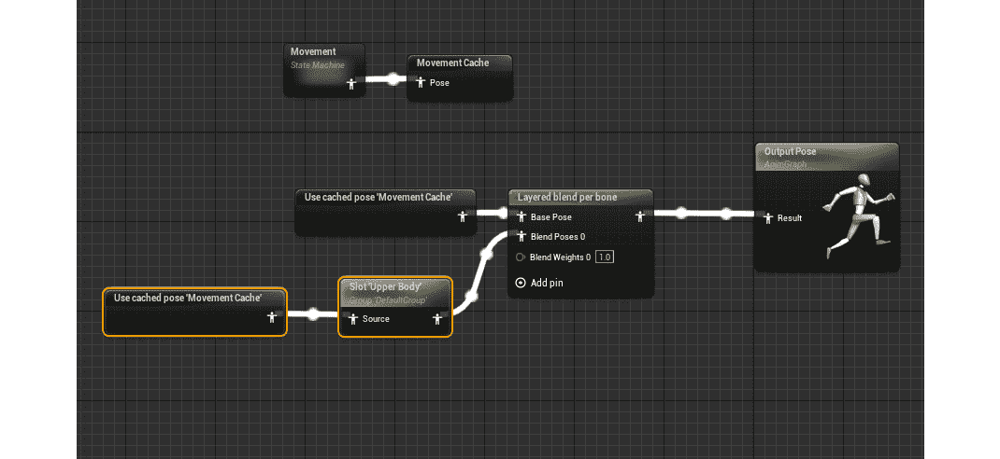

图 12.16 – 主角动画蓝图最终设置

在主角色的动画蓝图中设置了动画槽和`Layered blend per bone`节点后，你终于完成了主角的动画部分。

在更新了动画蓝图后，我们现在可以继续进行下一个练习，在那里我们最终可以预览`Throw`动画的实际效果。

## 练习 12.06 – 预览投掷动画

在上一个练习中，你做了很多工作，通过使用`Save Cached Pose`和`Layered blend per bone`节点，实现了玩家角色`Movement`动画和`Throw`动画之间的动画混合。执行以下步骤以在游戏中预览`Throw`动画，并看到你的劳动成果：

1.  导航到`/MainCharacter/Blueprints/`目录并打开角色的`BP_SuperSideScroller_MainCharacter`蓝图。

1.  如果你还记得，在上一个章节中，你为投掷创建了`Enhanced Input Action`，名为`IA_Throw`。

1.  在角色的蓝图`Event Graph`中，右键单击并搜索**上下文相关**下拉搜索中的`EnhancedInputAction IA_Throw`。用左键单击选择它，在图中创建事件节点。

在此事件设置完成后，你需要一个函数，允许你在玩家使用左鼠标按钮投掷时播放动画剪辑。

1.  在`Event Graph`中右键单击并搜索`Play Montage`。确保不要与类似的功能`Play Anim Montage`混淆。

`Play Montage`函数需要两个重要的输入：

+   `要播放的蒙太奇`

+   `在骨骼网格组件`

让我们先处理`Skeletal Mesh`组件。

1.  玩家角色有一个 `Skeletal Mesh` 组件，可以在 `Mesh` 中找到。左键单击并拖动以创建对这个变量的 `Get` 引用，并将其连接到该函数的 `In Skeletal Mesh Component` 输入：

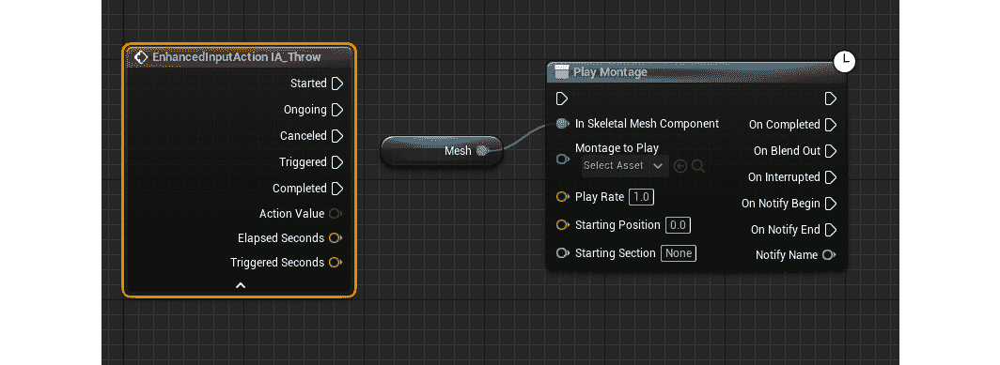

图 12.17 – 玩家角色网格连接到 In Skeletal Mesh Component 输入

现在最后要做的就是告诉这个函数要播放哪个蒙太奇。幸运的是，在这个项目中只有一个蒙太奇：`AM_Throw`。

1.  在 `Montage to Play` 输入下的下拉菜单中左键单击，然后左键单击以选择 `AM_Throw`。

1.  最后，将 `EnhancedInputAction IA_Throw` 事件的 `Triggered` 执行输出连接到 `Play Montage` 函数的执行输入引脚：

图 12.18 – 现在当按下 `ThrowProjectile` 输入时播放 AM_Throw 蒙太奇

1.  现在，当你点击左鼠标按钮时，玩家角色将播放投掷动画蒙太奇。

注意现在你可以边走边跑同时投掷，每个动画都融合在一起，不会相互干扰：

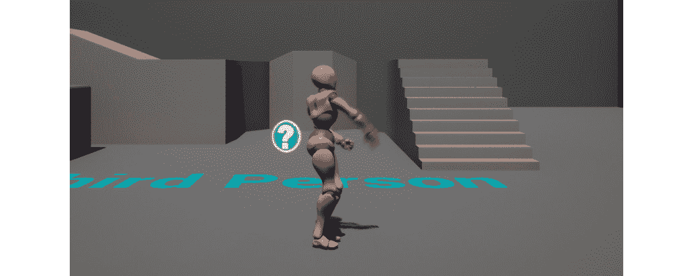

图 12.19 – 玩家角色现在可以移动并投掷

不要担心在使用左鼠标按钮动作重复播放 `Throw` 蒙太奇时可能看到的任何错误；这些问题将在你实现项目后续章节中将要投掷的投射物时得到解决。现在，你只需要知道，在 Anim Slot 和动画蓝图上所做的工能够实现动画融合的预期结果。

让我们继续 **SuperSideScroller** 项目，现在创建 C++ 类、蓝图和必要的材料，为下一章中敌人使用做准备。

# SuperSideScroller 游戏的敌人

当玩家角色在移动和执行 `Throw` 动画时动画正确，现在是时候讨论 **SuperSideScroller** 游戏将采用的敌人类型了。

这个敌人将有一个基本的来回移动模式，并且不支持任何攻击；只有通过碰撞玩家角色，它才能造成伤害。

在下一个练习中，您将设置第一个敌人类型的基类，并配置敌人的蓝图和动画蓝图，为 *第十三章* *创建和添加敌人人工智能* 准备，在那里您将实现这个敌人的 AI。为了提高效率和节省时间，您将使用 Unreal Engine 5 在 **SideScroller** 模板中提供的敌人资产。这意味着您将使用默认的骨架、骨骼网格、动画和动画蓝图。让我们开始创建第一个敌人类。

## 练习 12.07 – 创建敌人基 C++ 类

本练习的目标是从头开始创建一个新的敌人类，并在您开发 AI 时，使敌人准备好在 *第十三章* *创建和添加敌人人工智能* 中使用。首先，按照以下步骤在 C++ 中创建一个新的敌人类：

1.  在编辑器中，导航到 `SuperSideScrollreCharacter` 父类。

1.  给这个类起一个名字并选择一个目录。将此类命名为 `EnemyBase` 并不要更改目录路径。准备好后，左键单击 **Create Class** 按钮让 Unreal Engine 为您创建新类。

接下来，在内容抽屉中为敌人资产创建文件夹结构。

1.  返回 Unreal Engine 5 编辑器，导航到内容抽屉，并创建一个名为 `Enemy` 的新文件夹：

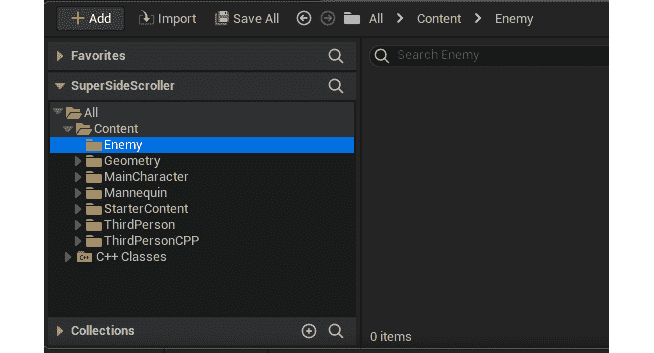

图 12.20 – 新的 Enemy 文件夹

1.  在 `Enemy` 文件夹中，创建另一个名为 `Blueprints` 的文件夹，您将在其中创建和保存敌人的蓝图资产。右键单击并选择 `EnemyBase`，如图所示：

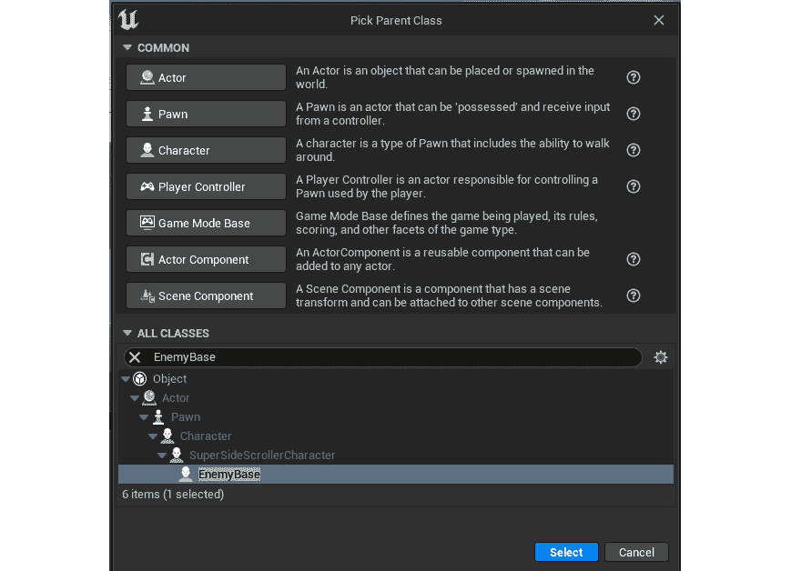

图 12.21 – 现在，新的 EnemyBase 类可供您创建蓝图

1.  将此命名为 `BP_Enemy`。

现在您已经使用 `EnemyBase` 类作为父类创建了第一个敌人的蓝图，是时候处理动画蓝图了。您将使用 Unreal Engine 在 `/Enemy/Blueprints` 目录中提供的默认动画蓝图。

## 练习 12.08 – 创建并应用敌人动画蓝图

在上一个练习中，您使用 `EnemyBase` 类作为父类创建了一个敌人的蓝图。在这个练习中，您将使用动画蓝图。

以下步骤将帮助您完成这个练习：

1.  导航到 `/Mannequin/Animations` 目录，找到 `ThirdPerson_AnimBP` 资产。

1.  现在，复制 `ThirdPerson_AnimBP` 资产。复制资产有两种方法：

    1.  在内容抽屉中选择所需的资产，并按 *Ctrl* + *W*。

    1.  在内容抽屉中右键单击所需的资产，从下拉菜单中选择 `Duplicate`。

1.  现在，左键单击并拖动这个副本资产到 `/Enemy/Blueprints` 目录，并在释放左键鼠标按钮时选择移动选项。

1.  将这个副本资产命名为 `AnimBP_Enemy`。最好创建一个资产副本，这样你可以在以后修改它，而不会影响原始资产的功能。

在创建了敌人蓝图和动画蓝图之后，现在是时候更新敌人蓝图以使用默认的 `骨骼网格` 模特和新的动画蓝图副本了。

1.  导航到 `/Enemy/Blueprints` 并打开 `BP_Enemy`。

1.  接下来，导航到 `Mesh` 组件并选择它以访问其 **详细信息** 面板。首先，将 **SK_Mannequin** 分配给 **骨骼网格** 参数，如图所示：

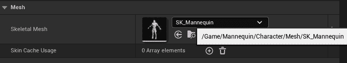

图 12.22 – 您将为新敌人使用默认的 SK_Mannequin 骨骼网格

1.  现在，您需要将 `AnimBP_Enemy` 动画蓝图应用到 `Mesh` 组件上。导航到 `Mesh` 组件的 `Animation` 类别的 `AnimBP_Enemy`：

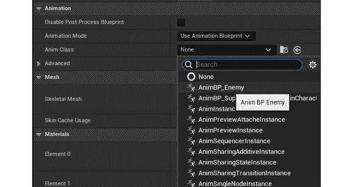

图 12.23 – 将新的 AnimBP_Enemy 分配为 Anim 类

1.  最后，您会发现当在 `X` = `0.000000`, `Y` = `0.000000`, `Z` = `-90.000000` 预览角色时，角色网格的位置和旋转不正确。

1.  `0.000000`, Pitch= `0`, Yaw= `-90.000000`)

1.  `X` = `1.000000`, `Y` = `1.000000`, `Z` = `1.000000`)

`变换` 设置将如下所示：

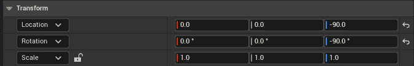

图 12.24 – 敌人角色的最终变换设置

以下图显示了到目前为止的 **网格** 组件设置。请确保您的设置与 *图 12.25* 中显示的相匹配：

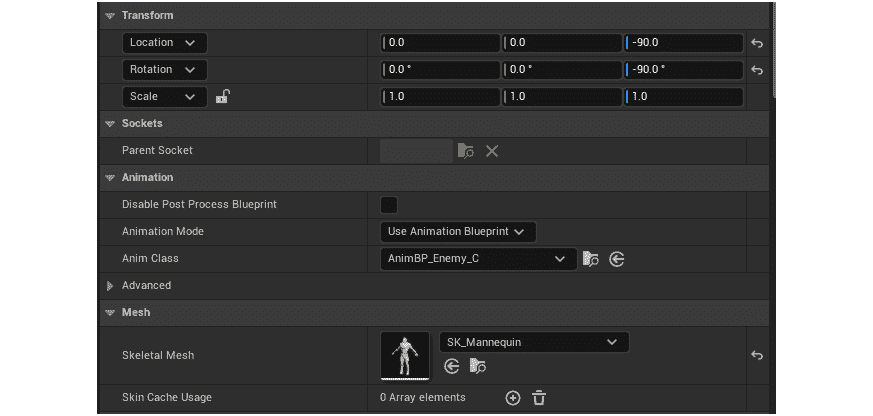

图 12.25 – 敌人角色网格组件的设置

在这里要做的最后一件事是创建一个模特主要材质的材质实例，这样这个敌人就可以有一个独特的颜色，帮助它与其他敌人类型区分开来。

让我们从首先了解更多关于材质和材质实例开始。

# 材质和材质实例

在进行下一个练习之前，我们需要先简要讨论一下材质实例是什么，这样你才能使用这些资产并将它们应用到新的敌人角色上。尽管这本书更侧重于使用 Unreal Engine 5 进行游戏开发的技术方面，但了解材质实例是什么以及它们在视频游戏中的应用仍然非常重要。材质实例是材质的扩展，你无法访问或控制材质实例派生的基本材质，但你确实可以控制材质创建者向你暴露的参数。许多参数可以暴露给你，以便在材质实例内部进行操作。

注意

有关材质和材质实例的更多信息，请参阅以下 Epic Games 文档页面：[`docs.unrealengine.com/en-US/Engine/Rendering/Materials/index.xhtml`](https://docs.unrealengine.com/en-US/Engine/Rendering/Materials/index.xhtml) 和 [`docs.unrealengine.com/4.27/en-US/API/Runtime/Engine/Materials/UMaterialInstanceDynamic/`](https://docs.unrealengine.com/4.27/en-US/API/Runtime/Engine/Materials/UMaterialInstanceDynamic/)。

Unreal Engine 提供了一个名为 `M_UE4Man_ChestLogo` 的材质实例示例，该实例位于 `/Mannequin/Character/Materials/` 目录下的 Side Scroller 模板项目中。以下图示显示了基于父材质 `M_Male_Body` 给出的材质实例的参数集。最重要的参数是名为 `BodyColor` 的 `Vector` 参数。你将在下一个练习中创建的材质实例中使用此参数，为敌人赋予独特的颜色：

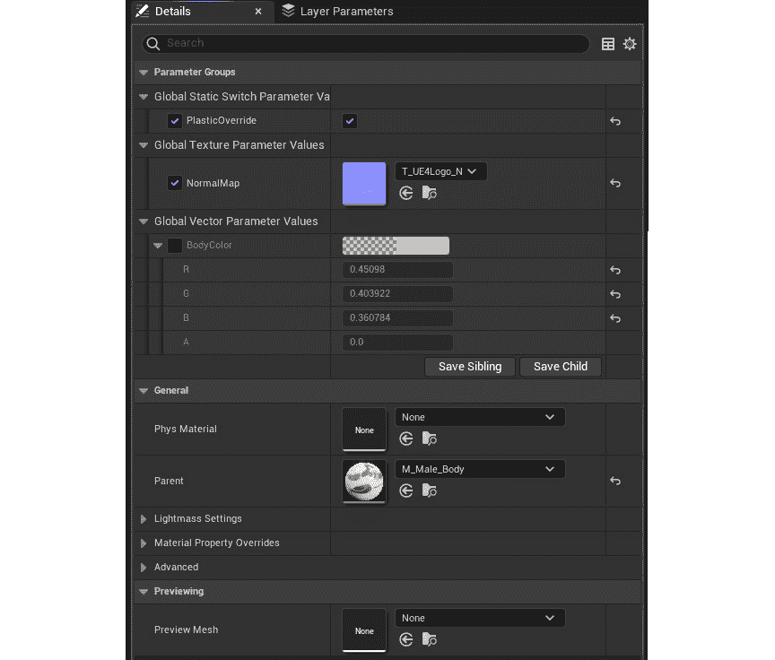

图 12.26 – M_UE4Man_ChestLogo 材质实例资产的参数列表

在接下来的练习中，你将利用对材质实例的了解，为之前创建的敌人角色创建一个独特的材质实例。

## 练习 12.09 – 创建和应用敌人材质实例

现在你已经对材质实例有了基本的了解，是时候从 `M_MannequinUE4_Body` 资产创建自己的材质实例了。使用这个材质实例，你将调整 `BodyColor` 参数，为敌人角色赋予独特的视觉表现。

以下步骤将帮助你完成这个练习：

1.  导航到 `Characters/Mannequin_UE4/Materials` 目录以找到默认人体模型使用的材质 `M_MannequinUE4_Body`。

1.  可以通过在 `Material` 资产 `M_MannequinUE4_Body` 上右键单击，然后左键单击 `MI_Enemy01` 来创建材质实例。

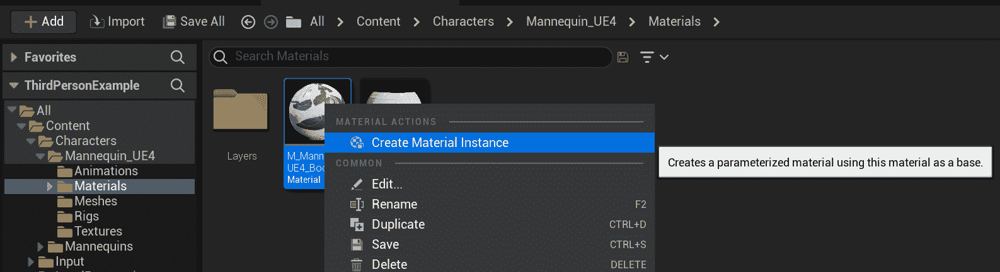

图 12.27 – 任何材质都可以用来创建材质实例

在`Enemy`文件夹中创建一个名为`Materials`的新文件夹。左键单击并拖动材质实例到`/Enemy/Materials`目录以将资产移动到这个新文件夹：

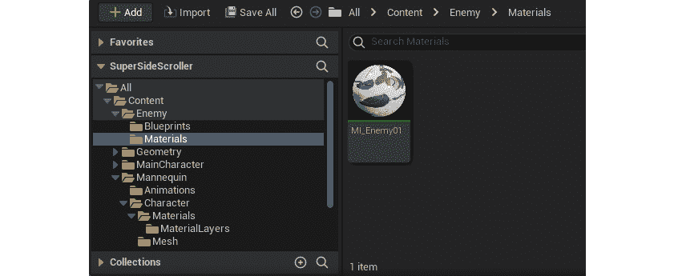

图 12.28 – 重命名材质实例 MI_Enemy

1.  双击材质实例，并在左侧找到**细节**面板。在那里，你会找到一个名为**BodyColor**的**向量参数**属性。确保复选框被勾选以启用此参数，然后将其值更改为红色。现在，材质实例应该呈现红色，如图所示：

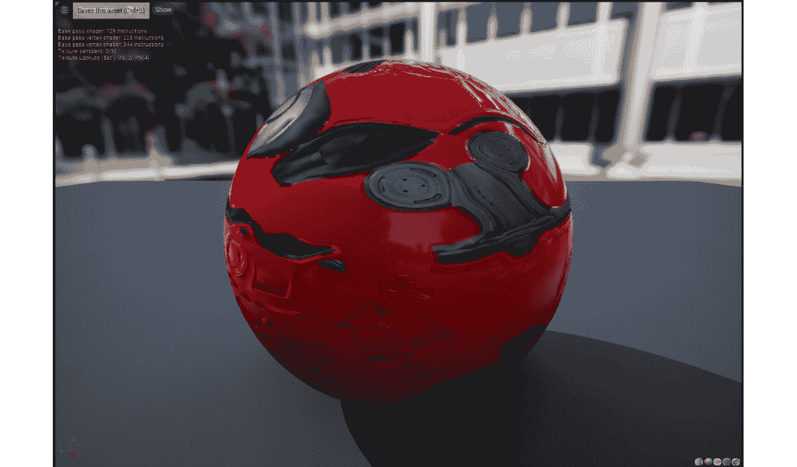

图 12.29 – 现在，敌人材质是红色

1.  保存`BP_Enemy01`蓝图。选择`MI_Enemy`：

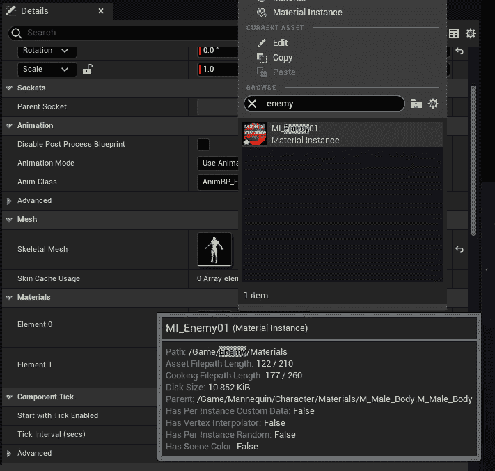

图 12.30 – 将 MI_Enemy 材质实例分配给敌人角色网格

1.  现在，第一个敌人类型在视觉上已经准备就绪，并为下一章的开发其 AI 准备了适当的蓝图和动画蓝图资产：

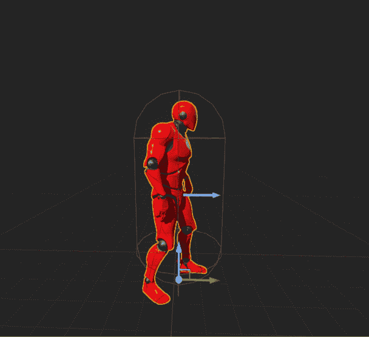

图 12.31 – 最终的敌人角色设置

通过完成这个练习，你现在已经创建了一个材质实例并将其应用于敌人角色，使其具有独特的视觉表现。

让我们通过一个简短的活动来结束本章，这个活动将帮助你更好地理解使用`Layered blend per bone`节点（在之前的练习中使用过）进行动画混合。

## 活动 12.01 – 更新混合权重

在*练习 12.06*的末尾，*预览投掷动画*，你能够混合移动动画和`投掷`动画，使它们可以同时播放而不相互负面影响。结果是玩家角色在行走或奔跑时正确地动画化，同时在上半身执行`投掷`动画。

在这个活动中，你将实验`Layered blend per bone`节点的混合偏差值和参数，以更好地理解动画混合的工作原理。

以下步骤将帮助你完成活动：

1.  更新`Layered blend per bone`节点的`Blend Weights`输入参数，以确保`投掷`动画附加姿态与基本移动姿态之间没有混合。在此处尝试使用`0.0f`和`0.5f`等值来比较动画的差异。

注意

完成后，请确保将此值恢复到`1.0f`，以免影响你在之前练习中设置的混合。

1.  更新`层叠混合每骨`节点的设置以改变受混合影响的骨骼，使整个角色的身体都受到混合的影响。从`MainCharacter_Skeleton`资产骨骼层次结构中的根骨骼开始是一个好主意。

1.  保持上一步的设置不变，向分支过滤器中添加一个新的数组元素，在这个新的数组元素中，添加骨骼名称和一个`-1.0f`的混合深度值，这允许只有角色的左腿在混合`投掷`动画时继续正确地动画化运动。

注意

在此活动之后，请确保将`层叠混合每骨`节点的设置恢复到第一次练习结束时的值，以确保不会在角色的动画中丢失任何进度。

活动第一部分的预期输出如下所示：

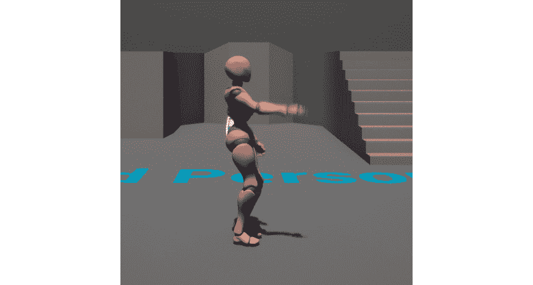

图 12.32 – 显示整个角色身体受影响的输出

活动最后一部分的预期输出如下所示：

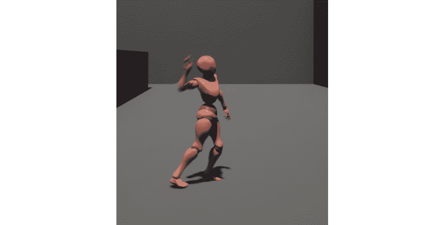

图 12.33 – 在混合投掷动画时，左腿继续正确地动画化运动

注意

此活动的解决方案可以在 GitHub 上找到：[`github.com/PacktPublishing/Elevating-Game-Experiences-with-Unreal-Engine-5-Second-Edition/tree/main/Activity%20solutions`](https://github.com/PacktPublishing/Elevating-Game-Experiences-with-Unreal-Engine-5-Second-Edition/tree/main/Activity%20solutions)。

在结束此活动之前，请将`层叠混合每骨`的设置恢复到*练习 12.05*，*使用上半身动画槽混合动画*结束时的值。如果您不将这些值恢复到原始设置，那么在下一章的后续练习和活动中，动画结果将不会相同。您可以选择手动设置原始值或参考以下链接中的文件：[`github.com/PacktPublishing/Elevating-Game-Experiences-with-Unreal-Engine-5-Second-Edition/tree/main/Chapter12/Exercise12.05`](https://github.com/PacktPublishing/Elevating-Game-Experiences-with-Unreal-Engine-5-Second-Edition/tree/main/Chapter12/Exercise12.05)。

通过完成这个活动，你现在对动画混合的工作原理以及如何通过`层叠混合每骨`节点影响基础姿态的加姿态有了更深入的理解。

注意

在这个项目中，你还没有使用许多动画混合技术，强烈建议你研究这些技术，从[`docs.unrealengine.com/en-US/Engine/Animation/AnimationBlending/index.xhtml`](https://docs.unrealengine.com/en-US/Engine/Animation/AnimationBlending/index.xhtml)的文档开始。

# 摘要

在使用 C++类、蓝图和材质设置好敌人之后，你就可以进入下一章了，在那里你将通过利用 Unreal Engine 5 中的行为树等系统来创建这个敌人的 AI。

通过本章的练习和活动，你学习了如何创建一个动画蒙太奇，允许播放动画。你还学习了如何在蒙太奇中设置一个 Anim 槽，以便为玩家角色的上半身分类。

接下来，你学习了如何通过使用`Use Cached Pose`节点来缓存状态机的输出姿态，这样这个姿态就可以在多个实例中引用，以便在更复杂的动画蓝图中使用。然后，通过了解`Layered blend per bone`功能，你能够使用 Anim 槽将基本动作姿态与`Throw`动画的叠加层混合。

最后，你通过创建 C++类、蓝图和其他资产来构建敌人的基础，以便为下一章做好准备。敌人准备就绪后，让我们继续创建敌人的 AI，以便它能与玩家互动。
