# 第十四章：生成玩家投射物

在上一章中，你通过创建一个行为树，使敌人能够从你创建的 `BP_AIPoints` 角色中随机选择点，从而在敌人角色的 AI 方面取得了很大的进步。这使得 `SuperSideScroller` 游戏更加生动，因为你现在可以在游戏世界中拥有多个移动的敌人。此外，你还了解了 **Unreal Engine 5** (**UE5**) 中可用的不同工具，这些工具可以组合起来创建不同复杂程度的 AI。这些工具包括导航网格、行为树和黑板。

现在你已经让敌人开始在关卡中移动，你需要允许玩家使用你在上一章末尾开始创建的玩家投射物击败这些敌人。本章的目标是使用我们将在 `Throw` 动画蒙太奇中实现的自定义 `UAnimNotify` 类来生成 `Player Projectile`。此外，我们还将为投射物添加润色元素，例如粒子系统和声音提示。

本章将涵盖以下主题：

+   如何使用 `UAnimNotify` 类在 `Throw` 动画蒙太奇期间生成玩家投射物。

+   为主要角色骨架创建一个新的 `Socket`，投射物将从该 `Socket` 生成。

+   学习如何使用粒子系统和声音提示为游戏添加视觉和音频润色。

到本章结束时，你将能够在蓝图和 C++ 中播放动画蒙太奇，并了解如何使用 C++ 和 `UWorld` 类将对象生成到游戏世界中。这些游戏元素将添加音频和视觉组件，作为额外的润色层，你的 `SuperSideScroller` 玩家角色将能够投掷能够摧毁敌人的投射物。

技术要求

对于本章，你需要以下技术要求：

+   Unreal Engine 5 已安装

+   Visual Studio 2019 已安装

+   Unreal Engine 4.27 已安装

本章的项目可以在本书代码包的 `Chapter14` 文件夹中找到，可以在此处下载：

[`github.com/PacktPublishing/Elevating-Game-Experiences-with-Unreal-Engine-5-Second-Edition`](https://github.com/PacktPublishing/Elevating-Game-Experiences-with-Unreal-Engine-5-Second-Edition)

让我们从这个章节开始，先了解 `UAnimNotify` 类，这样你就可以在 `Throw` 动画蒙太奇期间生成玩家投射物。

# Anim Notifies 和 Anim Notify States

当涉及到创建精致且复杂的动画时，动画师和程序员需要在动画中添加自定义事件，以便实现额外的效果、层和功能。UE5 的解决方案是使用 **Anim Notifies** 和 **Anim Notify States**。

**Anim Notify**和**Anim Notify State**之间的主要区别在于**Anim Notify State**拥有三个独特的事件，而**Anim Notify**没有。这些事件是**Notify Begin**、**Notify End**和**Notify Tick**，所有这些都可以在蓝图或 C++中使用。当涉及到这些事件时，UE5 确保以下行为：

+   **Notify State**总是从**Notify Begin Event**开始

+   **Notify State**总是以**Notify End Event**结束

+   **Notify Tick Event**总是在**Notify Begin**和**Notify End**事件之间发生

`Notify()`，允许程序员向通知本身添加功能。它采用“发射后不管”的心态，意味着你不需要担心`Notify()`事件开始、结束或中间发生的事情。这正是`SuperSideScroller`游戏简单性的原因。

在进行下一个练习之前，你将在 C++中创建一个自定义的**Anim Notify**，让我们简要讨论一些 UE5 默认提供的现有 Anim Notifies 的例子。默认**Anim Notify**状态的完整列表可以在以下屏幕截图中查看：

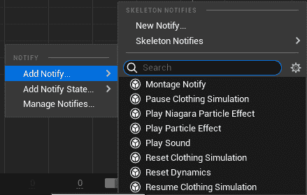

图 14.1 – UE5 提供的默认 Anim Notifies 的完整列表

在本章的后续内容中，你将使用两个**Anim Notify**：**Play Particle Effect**和**Play Sound**。让我们更详细地讨论这两个，以便你在使用它们时熟悉它们：

+   **Play Particle Effect**：正如其名所示，**Play Particle Effect**通知允许你在动画的某个帧上生成并播放粒子系统。如图所示，你可以更改正在使用的**视觉效果**（**VFX**），例如更新粒子的**位置偏移**、**旋转偏移**和**缩放**设置。如果你选择的话，你甚至可以将粒子附加到指定的**Socket Name**：

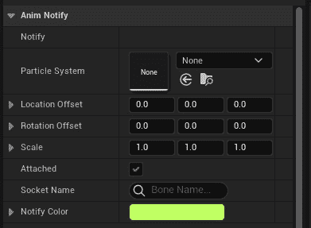

图 14.2 – 播放粒子效果通知的详细信息面板

注意

视觉效果，或简称 VFX，是任何游戏的关键元素。在 UE5 中，使用编辑器内的**Niagara**工具创建 VFX。Niagara 自 Unreal Engine 4 版本 4.20 以来一直存在，作为一个免费插件，用于提高 VFX 制作的质量和流程。之前的 VFX 工具**Cascade**将在 UE5 的后续版本中弃用。你可以在这里了解更多关于 Niagara 的信息：[`docs.unrealengine.com/en-US/Engine/Niagara/Overview/index.xhtml`](https://docs.unrealengine.com/en-US/Engine/Niagara/Overview/index.xhtml)。

在游戏中常用的一个例子是使用这种类型的通知在玩家行走或跑步时在其脚下生成泥土或其他效果。能够指定这些效果在动画的哪个帧生成是非常强大的，并允许您为角色创建令人信服的效果。

+   **播放声音**：**播放声音** 通知允许您在动画的某个帧播放 **Soundcue** 或 **Soundwave**。如图所示，您可以选择更改正在使用的声音，更新其 **音量乘数** 和 **音调乘数** 值，甚至可以通过将其附加到指定的 **附加名称** 来使声音跟随声音的所有者：

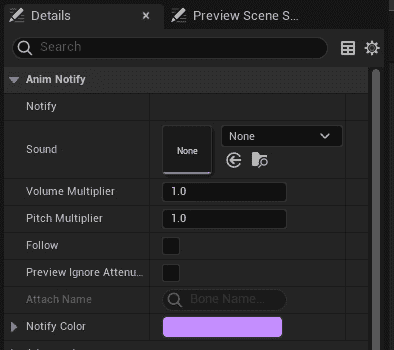

图 14.3 – 播放声音通知的详细信息面板

与示例中给出的 **播放粒子效果** 通知类似，**播放声音** 通知也可以常用以在角色移动时播放脚步声。通过精确控制动画时间线上何时播放声音，可以创建逼真的音效。

虽然您可能不会使用 **Anim Notify State**，但了解默认情况下可用的选项仍然很重要，如下面的截图所示：

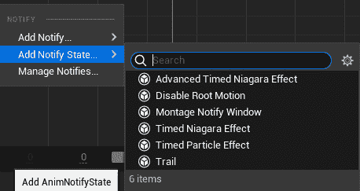

图 14.4 – UE5 提供的默认 Anim Notify States 完整列表

注意

在动画序列中不可用的两个 Notify 状态是 **蒙太奇通知窗口** 和 **禁用根运动** 状态，如前述截图所示。有关通知的更多信息，请参阅以下文档：[docs.unrealengine.com/en-US/Engine/Animation/Sequences/Notifies/index.xhtml](http://docs.unrealengine.com/en-US/Engine/Animation/Sequences/Notifies/index.xhtml)。

现在您对 **Anim Notify** 和 **Anim Notify State** 更加熟悉了，让我们继续进行第一个练习，您将在其中创建一个自定义的 **Anim Notify**，并将其用于生成玩家投射物。

## 练习 14.01 – 创建 UAnimNotify 类

玩家角色在 `SuperSideScroller` 游戏中的主要攻击能力是可以向敌人投掷的投射物。在前一章中，您设置了投射物的框架和基本功能，但现在，玩家还没有使用它的方法。为了使生成或投掷投射物的视觉效果更加逼真，您需要创建一个自定义的 **Anim Notify**，然后将其添加到 **投掷** 动画蒙太奇中。这个 **Anim Notify** 将让玩家知道是时候生成投射物了。

按照以下步骤创建新的 `UAnimNotify` 类：

1.  在 UE5 中，导航到 **工具** 选项，然后 *左键单击* **新建 C++ 类** 选项。

1.  从**动画通知**中*左键点击***动画通知**选项。然后，*左键点击***下一步**选项来命名新的类。

1.  将这个新类命名为`Anim_ProjectileNotify`。一旦命名完成，*左键点击*`Anim_ProjectileNotify.h`，以及可用的源文件`Anim_ProjectileNotify.cpp`。

1.  `UAnimNotify`基类有一个需要在你的类中实现的功能：

    ```cpp
    virtual void Notify(USkeletalMeshComponent* MeshComp, UAnimSequenceBase* Animation, const FAnimNotifyEventReference& EventReference); 
    ```

当通知在它被使用的时间轴上被击中时，这个函数会自动被调用。通过覆盖这个函数，你将能够向通知中添加逻辑。这个函数还让你能够访问拥有通知的`Skeletal Mesh`组件以及当前正在播放的动画序列。

1.  接下来，让我们将这个函数的覆盖声明添加到头文件中。在`Anim_ProjectileNotify.h`头文件中，在`GENERATED_BODY()`下面添加以下代码：

    ```cpp
    public:   virtual void Notify(USkeletalMeshComponent* MeshComp, UAnimSequenceBase* Animation, const FAnimNotifyEventReference& EventReference) override;
    ```

现在你已经将函数添加到头文件中，是时候在`Anim_ProjectileNotify`源文件中定义这个函数了。

1.  在`Anim_ProjectileNotify.cpp`源文件中，定义函数并添加一个`UE_LOG()`调用，打印文本`"Throw Notify"`，如下面的代码所示：

    ```cpp
     void UAnim_ProjectileNotify::Notify(USkeletalMeshComponent* MeshComp, UAnimSequenceBase* Animation, const FAnimNotifyEventReference& EventReference)
    {
       Super::Notify(MeshComp, Animation, EventReference);
       UE_LOG(LogTemp, Warning, TEXT("Throw Notify"));
    }
    ```

目前，你将只使用这个`UE_LOG()`调试工具来确认当你将这个通知添加到下一个练习中的**投掷**动画蒙太奇时，这个函数被正确调用。

在这个练习中，你通过添加以下函数创建了实现你自己的`Anim Notify`类所需的基础：

```cpp
 Notify(USkeletalMeshComponent* MeshComp, UAnimSequenceBase* Animation, const FAnimNotifyEventReference& EventReference)
```

在这个函数中，你使用`UE_LOG()`在输出日志中打印自定义文本`"Throw Notify"`，以便你知道这个通知正在正确工作。

在本章的后面部分，你将更新这个函数，使其调用能够生成玩家投射物的逻辑，但首先，让我们将新的通知添加到**投掷**动画蒙太奇中。

## 练习 14.02 – 向投掷动画蒙太奇添加新的通知

现在你有了`Anim_ProjectileNotify`通知，是时候将它添加到**投掷**动画蒙太奇中，以便你可以使用它。

在这个练习中，你将在动画中你期望投射物生成的确切帧将`Anim_ProjectileNotify`添加到**投掷**动画蒙太奇的时间轴上。

按照以下步骤操作：

1.  在 UE5 中，导航到`/MainCharacter/Animation/`目录。在这个目录中，*双击*`AM_Throw`资产以打开**动画蒙太奇**编辑器。

在**动画蒙太奇编辑器**的底部，你可以找到动画的时间轴。默认情况下，你会看到当动画播放时，红色的条形会沿着时间轴移动。

1.  *左键点击*这个红色条形，并将其手动移动到第 22 帧，尽可能接近，如图下面的屏幕截图所示：

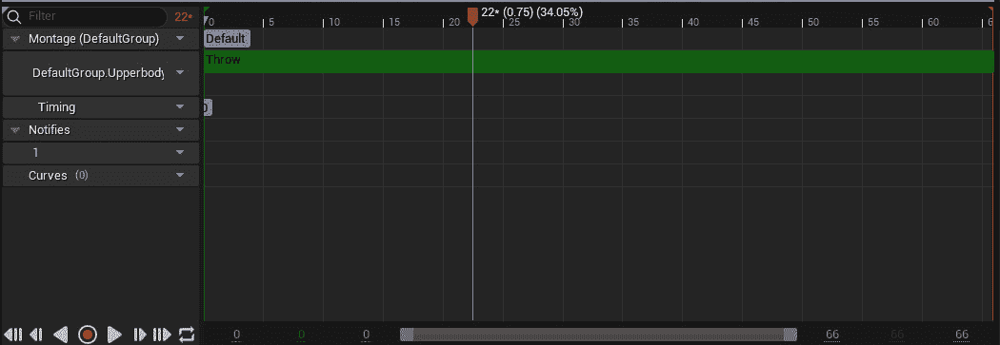

图 14.5 – 红色条允许你手动在时间轴上定位通知

**投掷**动画的第 22 帧是投掷动作中你期望投射物生成并被玩家抛出的确切时刻。以下截图显示了**投掷**动画的帧，如图所示在**Persona**编辑器内部：

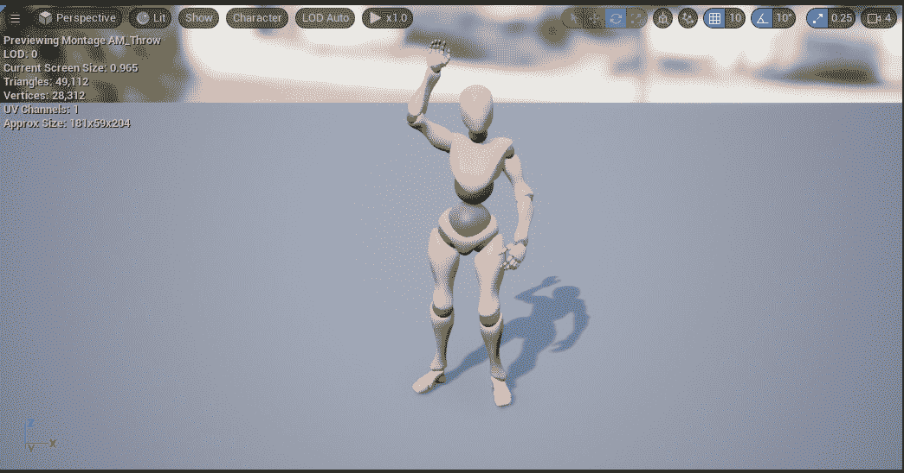

图 14.6 – 玩家投射物应该生成的确切时刻

1.  现在你已经知道了通知应该在时间轴上的位置，你可以在**Notifies**时间轴内的细红线处**右键单击**。

将会出现一个弹出窗口，你可以添加**通知**或**通知状态**。在某些情况下，**Notifies**时间轴可能被折叠且难以找到；只需左键单击单词**Notifies**来在折叠和展开之间切换。

1.  选择**添加通知**，从提供的选项中找到并选择**Anim Projectile Notify**。

1.  在**Notifies**时间轴上添加**Anim Projectile Notify**后，你会看到以下内容：

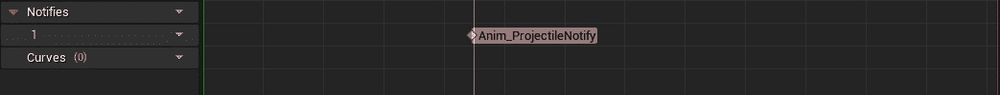

图 14.7 – Anim_ProjectileNotify 成功添加到投掷动画蒙太奇

1.  在**投掷**动画蒙太奇时间轴上放置了`Anim_ProjectileNotify`通知后，保存蒙太奇。

1.  如果**输出日志**窗口不可见，请通过导航到**窗口**选项并悬停在它上面找到**输出日志**选项来重新启用窗口。然后，**左键单击**以启用它。

1.  现在，使用`PIE`，一旦进入游戏，使用**左鼠标按钮**开始播放**投掷**蒙太奇。

在动画中添加通知的点上，你现在将在输出日志中看到`投掷通知`调试日志文本出现。

如你从*第十二章*中回忆起的，*动画混合和蒙太奇*，你将`Play Montage`函数添加到玩家角色蓝图——即`BP_SuperSideScroller_MainCharacter`。为了在 UE5 的上下文中学习 C++，你将在接下来的练习中将此逻辑从蓝图移动到 C++。这样做是为了我们不要过度依赖蓝图脚本来实现玩家角色的基本行为。

完成这个练习后，你已经成功将自定义的`Anim Notify`类，`Anim_ProjectileNotify`，添加到`EnhancedInputAction`事件中，当使用**左鼠标按钮**时调用`ThrowProjectile`。在从蓝图中的**投掷**动画蒙太奇切换到 C++播放之前，让我们再讨论一下播放动画蒙太奇。

# 播放动画蒙太奇

如您在*第十二章*中学习的，*动画混合和蒙太奇*，这些资源对于允许动画师将单个动画序列组合成一个完整的蒙太奇非常有用。通过将蒙太奇分割成独特的部分，并为粒子效果和声音添加通知，动画师和动画程序员可以制作出处理动画所有不同方面的复杂蒙太奇集。

但一旦动画蒙太奇准备就绪，我们如何在角色上播放它？您已经熟悉第一种方法，即通过蓝图（Blueprints）。

## 在蓝图（Blueprints）中播放动画蒙太奇

在蓝图（Blueprints）中，可以使用**Play Montage**功能，如下面的截图所示：

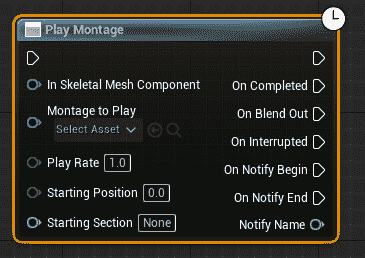

图 14.8 – 蓝图中的播放蒙太奇功能

您已经使用`Play Montage`函数播放了`AM_Throw`动画蒙太奇。此函数需要蒙太奇必须播放的**骨骼网格**组件，并且需要动画蒙太奇进行播放。

剩余的参数是可选的，具体取决于您的蒙太奇如何工作。让我们快速看一下这些参数：

+   **播放速率**: **Play Rate**参数允许您增加或减少动画蒙太奇的播放速度。为了加快播放，您会增加此值；否则，您会减少它。

+   使用`1.0f`位置而不是`0.0f`。

+   **起始部分**: **Starting Section**参数允许您告诉动画蒙太奇从特定部分开始。根据您的蒙太奇设置，您可以为蒙太奇的各个部分创建多个部分。例如，霰弹枪装弹动画蒙太奇将包括一个用于装弹初始动作的部分，一个用于实际子弹装弹的循环部分，以及一个用于重新装备武器以便再次开火的部分。

当涉及到**Play Montage**函数的输出时，您有几个不同的选项：

+   **完成时**: 当动画蒙太奇播放完成并完全混合退出时，会调用**On Completed**输出。

+   **关于混合退出**: 当动画蒙太奇开始混合退出时，会调用**On Blend Out**输出。这可以在**混合退出触发时间**期间发生，或者如果蒙太奇提前结束。

+   **中断时**: 当蒙太奇由于被另一个尝试在相同骨架上播放的蒙太奇中断而开始混合退出时，会调用**On Interrupted**输出。

+   **通知开始**和**通知结束**: 如果您在动画蒙太奇的**Notifies**类别下使用**Montage Notify**选项，则**On Notify Begin**和**On Notify End**输出都会被调用。返回的**Montage Notify**名称通过**Notify Name**参数给出。

现在我们对**播放蒙太奇**函数的蓝图实现有了更好的理解，让我们看看如何在 C++中播放动画。

## 在 C++中播放动画蒙太奇

在 C++方面，你只需要了解一件事，那就是`UAnimInstance::Montage_Play()`函数。这个函数需要动画蒙太奇来播放，播放速率，一个`EMontagePlayReturnType`类型的值，一个用于确定播放蒙太奇起始位置的`float`值，以及一个用于确定播放此蒙太奇是否停止或中断所有蒙太奇的布尔值。

虽然你不会更改`EMontagePlayReturnType`的默认参数，该参数为`EMontagePlayReturnType::MontageLength`，但了解这个枚举器存在的两个值仍然很重要：

+   `Montage Length`：`Montage Length`值返回蒙太奇本身的长度，以秒为单位。

+   `Duration`：`Duration`值返回蒙太奇的播放时长，等于蒙太奇长度除以播放速率。

注意

关于`UAnimMontage`类的更多详细信息，请参阅以下文档：[`docs.unrealengine.com/en-US/API/Runtime/Engine/Animation/UAnimMontage/index.xhtml`](https://docs.unrealengine.com/en-US/API/Runtime/Engine/Animation/UAnimMontage/index.xhtml)。

你将在下一项练习中了解更多关于在 C++中播放动画蒙太奇的实施方法。

## 练习 14.03 – 在 C++中播放投掷动画

既然你对如何在 UE5 中播放动画蒙太奇（Animation Montages）有了更好的理解，无论是通过蓝图还是 C++，现在是时候将播放**投掷**动画蒙太奇（Throw Animation Montage）的逻辑从蓝图迁移到 C++了。这种变化背后的原因是，蓝图逻辑被放置为一个占位符方法，以便你可以预览**投掷**蒙太奇。这本书更侧重于 C++游戏开发指南，因此学习如何在代码中实现这种逻辑是很重要的。

首先，我们从蓝图（Blueprints）中移除逻辑，然后继续在玩家角色类（player character class）内部用 C++重新创建逻辑。

按照以下步骤完成这个练习：

1.  导航到玩家角色蓝图`BP_SuperSideScroller_MainCharacter`，它位于`/MainCharacter/Blueprints/`目录中。*双击*此资产以打开它。

1.  在这个蓝图内部，你会找到**增强输入动作 IA_Throw**事件和**播放蒙太奇**函数，这些是你创建来预览**投掷**动画蒙太奇的，如下截图所示。删除这个逻辑，然后重新编译并保存玩家角色蓝图：


图 14.9 – 你不再需要在玩家角色蓝图内使用这个占位符逻辑

1.  现在，使用 `PIE` 并尝试使用玩家角色通过使用 *左鼠标按钮* 来投掷。您将观察到玩家角色不再播放 **投掷** 动画蒙太奇。让我们通过在 C++ 中添加所需的逻辑来修复这个问题。

1.  在 Visual Studio 中打开玩家角色的头文件——即 `SuperSideScroller_Player.h`。

1.  您需要做的第一件事是为玩家角色创建一个新的变量，该变量将用于 `Private` 访问修饰符：

    ```cpp
    UPROPERTY(EditAnywhere)
    class UAnimMontage* ThrowMontage;
    ```

现在，您有一个将代表 `SuperSideScroller_Player.cpp` 文件的变量。

1.  在调用 `UAnimInstance::Montage_Play()` 之前，您需要将以下 `include` 目录添加到源文件顶部现有的列表中，以便访问此函数：

    ```cpp
    #include "Animation/AnimInstance.h"
    ```

正如我们从 *第九章* 中所知，*添加音视频元素*，玩家角色已经有一个名为 `ThrowProjectile` 的函数，每当 *左鼠标按钮* 被按下时都会调用。作为提醒，这是在 C++ 中绑定的地方：

```cpp

//Bind the pressed action Throw to your ThrowProjectile function
EnhancedPlayerInput->BindAction(IA_Throw, ETriggerEvent::Triggered, this, &ASuperSideScroller_Player::ThrowProjectile);
```

1.  更新 `ThrowProjectile` 以播放您在此练习中之前设置的 `ThrowMontage`。将以下代码添加到 `ThrowProjectile()` 函数中。然后，我们可以讨论这里发生的事情：

    ```cpp
    void ASuperSideScroller_Player::ThrowProjectile()
    {
      if (ThrowMontage)
      {
        const bool bIsMontagePlaying = GetMesh()
        ->GetAnimInstance()->
          Montage_IsPlaying(ThrowMontage);
        if (!bIsMontagePlaying)
        {
          GetMesh()->GetAnimInstance()
          ->Montage_Play(ThrowMontage, 
            1.0f);
        }
        }    }
    ```

第一行是检查 `ThrowMontage` 是否有效；如果没有分配有效的动画蒙太奇，就没有继续逻辑的必要。在后续函数调用中使用 `NULL` 对象也可能很危险，因为它可能导致崩溃。接下来，我们声明一个新的布尔变量，称为 `bIsMontagePlaying`，它确定 `ThrowMontage` 是否已经在玩家角色的骨骼网格上播放。进行此检查是因为 **投掷** 动画蒙太奇不应该在已经播放时播放；如果玩家反复按下 *左鼠标按钮*，这将导致动画中断。

只要满足前面的条件，就可以安全地继续并播放动画蒙太奇。

1.  在 `If` 语句内部，您正在告诉玩家的骨骼网格播放 `ThrowMontage`，播放速率为 `1.0f`。此值用于确保动画蒙太奇以预期速度回放。大于 `1.0f` 的值将使蒙太奇回放速度加快，而小于 `1.0f` 的值将使蒙太奇回放速度减慢。您之前了解的其他参数，例如起始位置或 `EMontagePlayReturnType` 参数，可以保留其默认值。回到 UE5 编辑器中，像过去一样重新编译代码。

1.  代码成功重新编译后，导航回玩家角色蓝图，`BP_SuperSideScroller_MainCharacter`，它位于 `/MainCharacter/Blueprints/` 目录下。*双击* 此资产以打开它。

1.  在您添加的 `Throw Montage` 参数中。

1.  *左键点击*`投掷蒙太奇`参数的下拉菜单以找到`AM_Throw`蒙太奇。*再次左键点击*`AM_Throw`蒙太奇以选择此参数。请参考以下截图以了解变量应该如何设置：

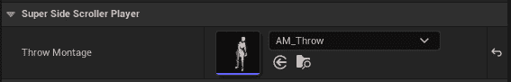

图 14.10 – 投掷蒙太奇已分配给 AM_Throw 蒙太奇

1.  重新编译并保存玩家角色蓝图。然后，使用`PIE`生成玩家角色，并使用*左鼠标按钮*播放`投掷蒙太奇`。以下截图显示了这一过程：

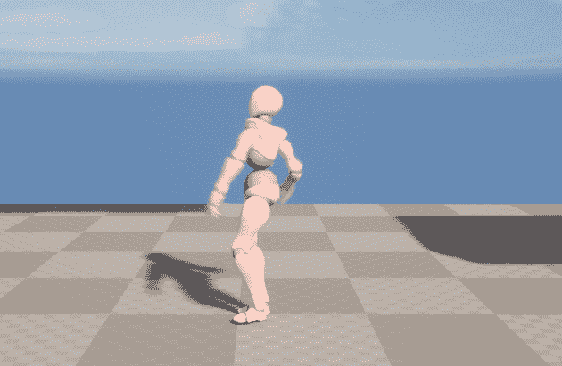

图 14.11 – 玩家角色现在能够再次执行投掷动画

通过完成这个练习，你已经学会了如何向玩家角色添加`Animation Montage`参数，以及如何在 C++中播放蒙太奇。此外，还包括播放`Throw`输入并导致动画中断或完全无法播放。

注意

尝试将`Animation Montage`的播放速率从`1.0f`调整为`2.0f`并重新编译代码。观察增加动画播放速率如何影响玩家对动画的外观和感觉。

在继续生成玩家投射物之前，让我们在玩家角色的**骨骼**中设置`Socket`位置，以便在**投掷**动画期间从**玩家的手**生成投射物。

## 练习 14.04 – 创建投射物生成 Socket

为了生成玩家投射物，你需要确定投射物将生成的**变换**属性，主要关注**位置**和**旋转**，而不是**缩放**。

在这个练习中，你将在玩家角色的**骨骼**上创建一个新的**Socket**，然后你可以在代码中引用它以获取生成投射物的变换。

让我们开始吧：

1.  在 UE5 内部，导航到`/MainCharacter/Mesh/`目录。

1.  在此目录下找到`MainCharacter_Skeleton.uasset`。*双击*打开此**骨骼**。

为了确定投射物应该生成的最佳位置，我们需要将**投掷**动画蒙太奇作为骨骼的预览动画添加。

1.  在`Preview Controller`参数中选择**使用特定动画**选项。

1.  接下来，*左键点击*下拉菜单以找到并选择列表中可用的**AM_Throw**动画蒙太奇。

现在，玩家角色的**骨骼**将开始预览**投掷**动画蒙太奇，如下面的截图所示：

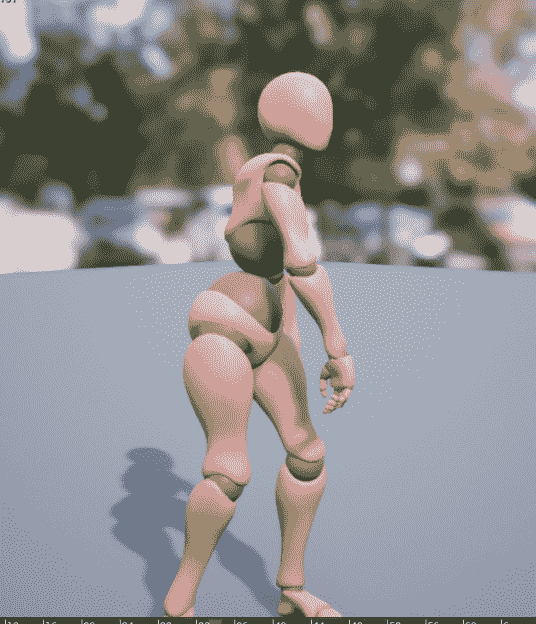

图 14.12 – 玩家角色预览投掷动画蒙太奇

如你所回忆的，从 *练习 14.02 – 向抛掷蒙太奇添加通知* 中，你在抛掷动画的第 22 帧添加了 `Anim_ProjectileNotify`。

1.  使用 **骨骼** 编辑器底部的时间轴，将红色条移动到尽可能接近第 22 帧。请参考以下截图：

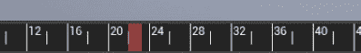

图 14.13 – 你之前添加 Anim_ProjectileNotify 的相同第 22 帧

在抛掷动画的第 22 帧时，玩家角色应该看起来如下：

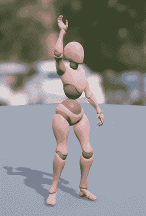

图 14.14 – 角色手部处于释放投射物的位置

如前述截图所示，在抛掷动画蒙太奇的第 22 帧时，角色的手处于释放投射物的位置。

如你所见，玩家角色将从他们的*右手*抛出投射物，因此新的 `Socket` 应该连接到它。让我们看一下玩家角色的骨骼层次结构，如下面的截图所示：

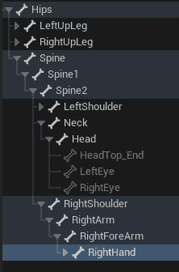

图 14.15 – 玩家角色骨骼层次结构中的右手骨

1.  从骨骼层次结构中找到 **右手** 骨。这可以在 **右肩** 骨层次结构结构下找到。

1.  *右键点击* **右手** 骨，并从出现的选项列表中选择 *添加 Socket*。将此 Socket 命名为 **ProjectileSocket**。

此外，当添加一个新的 `Socket` 时，整个 **右手** 的层次结构将展开，新的 socket 将出现在底部。

1.  在以下位置有 `Socket`：

    ```cpp
    Location = (X=30.145807,Y=36.805481,Z=-10.23186)
    ```

最终结果应该如下所示：

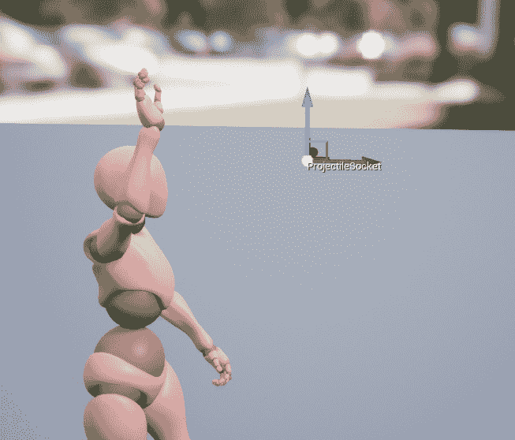

图 14.16 – 在世界空间中抛掷动画的第 22 帧时 ProjectileSocket 的最终位置

如果你的 Gizmo 看起来有点不同，那是因为前述截图显示的是 Socket 位置在世界空间中，而不是局部空间中。

1.  现在，`MainCharacter_Skeleton` 资产。

通过完成这个练习，你现在知道了玩家投射物将从中生成的位置。由于你使用了 `Anim_ProjectileNotify` 将会触发。

现在，让我们在 C++ 中生成玩家投射物。

## 练习 14.05 – 准备 SpawnProjectile() 函数

现在你已经设置了**ProjectileSocket**，并且有一个位置可以用来生成玩家投射物，让我们添加生成玩家投射物所需的代码。

到这个练习结束时，你将有一个准备好的函数来生成投射物，并且它将可以从 `Anim_ProjectileNotify` 类中调用。

按照以下步骤进行：

1.  从 Visual Studio 中，导航到 `SuperSideScroller_Player.h` 头文件。

1.  您需要一个 `PlayerProjectile` 类的类引用变量。您可以使用 `TsubclassOf` 变量模板类类型来完成此操作。将以下代码添加到头文件中，在 `Private` 访问修饰符下：

    ```cpp
    UPROPERTY(EditAnywhere)
    TSubclassOf<class APlayerProjectile> PlayerProjectile;
    ```

现在变量已经准备好了，是时候声明您将用于生成项目的函数了。

1.  在 `void ThrowProjectile()` 函数和 `Public` 访问修饰符的声明下添加以下函数声明：

    ```cpp
    void SpawnProjectile();
    ```

1.  在准备 `SpawnProjectile()` 函数的定义之前，将以下 `include` 目录添加到 `SuperSideScroller_Player.cpp` 源文件中的包含列表中：

    ```cpp
    #include "PlayerProjectile.h"
    #include "Engine/World.h"
    #include "Components/SphereComponent.h"
    ```

您需要包含 `PlayerProjectile.h`，因为需要引用项目类中的碰撞组件。接下来，您必须使用 `Engine/World.h` 包含来使用 `SpawnActor()` 函数和访问 `FActorSpawnParameters` 结构体。最后，您需要使用 `Components/SphereComponent.h` 包含来更新玩家项目的碰撞组件，以便它将忽略玩家。

1.  接下来，在 `SuperSideScroller_Player.cpp` 源文件的底部创建 `SpawnProjectile()` 函数的定义，如下所示：

    ```cpp
    void ASuperSideScroller_Player::SpawnProjectile()
    {
    }
    ```

此函数需要做的第一件事是检查 `PlayerProjectile` 类变量是否有效。如果此对象无效，就没有必要继续尝试生成它。

1.  更新 `SpawnProjectile()` 函数，使其看起来如下：

    ```cpp
    void ASuperSideScroller_Player::SpawnProjectile()
    {
      if(PlayerProjectile)
        {
        }
    }
    ```

现在，如果 `PlayerProjectile` 对象有效，您将想要获取玩家当前存在的 `UWorld` 对象，并在继续之前确保该世界有效。

1.  更新 `SpawnProjectile()` 函数，如下所示：

    ```cpp
    void ASuperSideScroller_Player::SpawnProjectile()
    {
      if(PlayerProjectile)
        {
          UWorld* World = GetWorld();
          if (World)
            {
            }
        }
    }
    ```

在这一点上，您已经进行了安全检查，以确保 `PlayerProjectile` 和 `UWorld` 都有效，因此现在可以安全地尝试生成项目。您必须做的第一件事是声明一个新的 `FActorSpawnParameters` 类型的变量，并将玩家作为所有者分配给它。

1.  在最近的 `if` 语句中添加以下代码，以便 `SpawnProjectile()` 函数看起来如下：

    ```cpp
    void ASuperSideScroller_Player::SpawnProjectile()
    {
      if(PlayerProjectile)
        {
          UWorld* World = GetWorld();
          if (World)
            {
              FActorSpawnParameters SpawnParams;
              SpawnParams.Owner = this;
            }
        }
    }
    ```

如您之前所学的，从 `UWorld` 对象调用 `SpawnActor()` 函数需要 `FActorSpawnParameters` 结构体作为生成对象初始化的一部分。在玩家项目的例子中，您可以使用 `this` 关键字作为项目所有者玩家角色类的引用。

1.  接下来，您需要处理 `SpawnActor()` 函数的 `Location` 和 `Rotation` 参数。在最新的行（即 `SpawnParams.Owner = this`）下添加以下行：

    ```cpp
    const FVector SpawnLocation = this->GetMesh()-
      >GetSocketLocation(FName("ProjectileSocket"));
    const FRotator Rotation = GetActorForwardVector().Rotation();
    ```

在第一行，你声明了一个新的`FVector`变量，名为`SpawnLocation`。这个向量使用了你在上一个练习中创建的`ProjectileSocket`插座的`Socket`位置。从`GetMesh()`函数返回的`Skeletal Mesh`组件包含一个名为`GetSocketLocation()`的函数，该函数将返回具有传入的`FName`属性的插座位置——在这种情况下，`ProjectileSocket`。

在第二行，你声明了一个新的`FRotator`变量，名为`Rotation`。这个值被设置为玩家的前方向量，并转换为`Rotator`容器。这将确保旋转——换句话说，玩家投射物生成的方向——将在玩家前方，并且它将远离玩家。

现在，所有生成投射物所需的参数都已准备就绪。

1.  在上一步的代码下面添加以下行：

    ```cpp
    APlayerProjectile* Projectile = World-
      >SpawnActor<APlayerProjectile>(PlayerProjectile, 
      SpawnLocation, 
      Rotation, SpawnParams);
    ```

`World->SpawnActor()`函数将返回你试图创建的类的对象——在这种情况下，`APlayerProjectile`。这就是为什么你在实际生成之前添加了`APlayerProjectile* Projectile`。然后，你传递`SpawnLocation`、`Rotation`和`SpawnParams`参数以确保投射物将在你想要的位置和方式生成。

1.  返回编辑器重新编译新添加的代码。在代码编译成功后，这个练习就完成了。

通过完成这个练习，你现在有一个函数可以生成玩家投射物类，该类被分配在玩家角色内部。通过添加对投射物和世界的有效性检查，你可以确保如果生成了一个对象，它是在一个有效世界中有效的对象。

你为`UWorld SpawnActor()`函数设置了适当的`location`、`rotation`和`FActorSpawnParameters`参数，以确保玩家投射物根据上一个练习中的插座位置在正确的位置生成，具有适当的移动方向，以便它远离玩家，并以玩家角色为其所有者。

现在，是时候更新`Anim_ProjectileNotify`源文件，以便它生成投射物。

## 练习 14.06 – 更新 Anim_ProjectileNotify 类

允许玩家投射物生成的函数已经准备好了，但你还没有在任何地方调用这个函数。回到*练习 14.01 – 创建 UAnim Notify 类*，你创建了`Anim_ProjectileNotify`类，而在*练习 14.02 – 将通知添加到 Throw 蒙太奇*中，你将这个通知添加到了**Throw**动画蒙太奇。

现在，是时候更新`UanimNotify`类，以便它调用`SpawnProjectile()`函数。

按照以下步骤操作：

1.  在 Visual Studio 中打开`Anim_ProjectileNotify.cpp`源文件。

在源文件中，你有以下代码：

```cpp
 #include "Anim_ProjectileNotify.h"
void UAnim_ProjectileNotify::Notify(USkeletalMeshComponent* MeshComp, UAnimSequenceBase* Animation, const FAnimNotifyEventReference& EventReference)
{
   Super::Notify(MeshComp, Animation, EventReference);
   UE_LOG(LogTemp, Warning, TEXT("Throw Notify"));
}
```

1.  从`Notify()`函数中删除`UE_LOG()`行。

1.  接下来，在`Anim_ProjectileNotify.h`下面添加以下`include`行：

    ```cpp
    #include "Components/SkeletalMeshComponent.h"
    #include "SuperSideScroller/SuperSideScroller_Player.h"
    ```

您需要包含`SuperSideScroller_Player.h`头文件，因为它是调用您在上一练习中创建的`SpawnProjectile()`函数所必需的。我们还包含了`SkeletalMeshComponent.h`，因为我们将在`Notify()`函数中引用此组件，所以最好在这里也包含它。

`Notify()`函数传递一个指向拥有者`Skeletal Mesh`的引用，标记为`MeshComp`。您可以使用这个骨骼网格通过`GetOwner()`函数获取对玩家角色的引用，并将返回的演员强制转换为您的`SuperSideScroller_Player`类。我们将在下一步这样做。

1.  在`Notify()`函数内部，添加以下代码行：

    ```cpp
    ASuperSideScroller_Player* Player = 
      Cast<ASuperSideScroller_Player>(
      MeshComp->GetOwner());
    ```

1.  现在您已经获得了对玩家的引用，在调用`SpawnProjectile()`函数之前，您需要在`Player`变量上添加一个有效性检查。在上一步骤的代码行之后添加以下代码行：

    ```cpp
    if (Player)
    {
      Player->SpawnProjectile();
    }
    ```

1.  现在，`SpawnProjectile()`函数是从`Notify()`函数中调用的，返回到编辑器以重新编译和热重载您所做的代码更改。

在您可以使用`PIE`四处跑动并投掷玩家投射物之前，您需要将上一练习中的`Player Projectile`变量分配。

1.  在`/MainCharacter/Blueprints`目录中找到`BP_SuperSideScroller_MainCharacter`蓝图。*双击*以打开蓝图。

1.  在`Throw Montage`参数中，您将找到`Player Projectile`参数。*左单击*此参数的下拉选项，找到`BP_PlayerProjectile`。*左单击*此选项将其分配给`Player Projectile`变量。

1.  重新编译并保存`BP_SuperSideScroller_MainCharacter`蓝图。

1.  现在，使用`PIE`并使用*左鼠标按钮*。玩家角色将播放**投掷**动画，玩家投射物将被生成。

注意，投射物是从您创建的`ProjectileSocket`函数中生成的，并且它从玩家处移动开去。以下截图显示了这一过程：

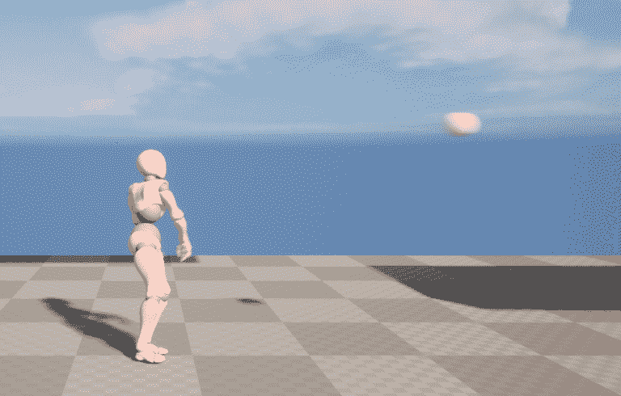

图 14.17 – 玩家现在可以投掷玩家投射物

经过这个练习的完成，玩家现在可以投掷玩家投射物。在当前状态下，玩家投射物对敌人无效，只是在空中飞行。要使玩家能够投掷投射物，需要在`Anim_ProjectileNotify`类和玩家角色之间进行很多部分的移动。

在接下来的章节和练习中，您将更新玩家投射物，使其能够销毁敌人并播放额外的效果，如粒子效果和声音。

# 销毁演员

到目前为止，在本章中，我们已经在游戏世界中大量关注了生成或创建演员；玩家角色使用`UWorld`类来生成投射物。UE5 及其基础`Actor`类自带一个默认函数，您可以使用它来销毁或从游戏世界中移除演员：

```cpp
bool AActor::Destroy( bool bNetForce, bool bShouldModifyLevel )
```

你可以在 Visual Studio 中通过在 `/Source/Runtime/Engine/Actor.cpp` 目录下找到 `Actor.cpp` 源文件来找到这个函数的完整实现。这个函数存在于所有从 `Actor` 类扩展的类中，在 UE5 的情况下，它存在于所有可以生成或放置在游戏世界中的类中。更具体地说，`EnemyBase` 和 `PlayerProjectile` 类都是 `Actor` 类的 *子类*，因此它们可以被销毁。

进一步查看 `AActor::Destroy()` 函数，你会找到以下行：

```cpp
World->DestroyActor( this, bNetForce, bShouldModifyLevel );
```

我们不会深入探讨 `UWorld` 类是如何销毁演员的，但重要的是强调 `UWorld` 类负责在世界上创建和销毁演员。你可以自由地深入研究源引擎代码，以找到更多关于 `UWorld` 类如何处理销毁和生成演员的信息。

既然你已经了解了 UE5 如何处理销毁和从游戏世界中移除演员的更多背景信息，我们将自己实现敌对角色的这一功能。

## 练习 14.07 – 创建 DestroyEnemy() 函数

对于 `Super SideScroller` 游戏的主要游戏玩法是玩家在关卡中移动并使用投射物来摧毁敌人。在项目当前阶段，你已经处理了玩家移动和生成玩家投射物的功能。然而，投射物目前还不能摧毁敌人。

为了实现这个功能，我们首先将在 `EnemyBase` 类中添加一些逻辑，以便它知道如何处理自己的销毁，并在与玩家投射物碰撞后将其从游戏中移除。

按照以下步骤实现：

1.  首先，导航到 Visual Studio 并打开 `EnemyBase.h` 头文件。

1.  在头文件中，在 `Public` 访问修饰符下创建一个名为 `DestroyEnemy()` 的新函数声明，如下所示：

    ```cpp
    public:
      void DestroyEnemy();
    ```

确保这个函数定义写在 `GENERATED_BODY()` 之下，在类定义内部。

1.  将这些更改保存到头文件中，并打开 `EnemyBase.cpp` 源文件以添加此函数的实现。

1.  在 `#include` 行下面，添加以下函数定义：

    ```cpp
    void AEnemyBase::DestroyEnemy()
    {
    }
    ```

目前，这个功能将非常简单。你所需要做的就是从基类 `Actor` 调用继承的 `Destroy()` 函数。

1.  更新 `DestroyEnemy()` 函数，使其看起来像这样：

    ```cpp
    void AEnemyBase::DestroyEnemy()
    {
      Destroy();
    }
    ```

1.  完成这个函数后，保存源文件并返回到编辑器，以便你可以重新编译和热重载代码。

通过完成这个练习，敌对角色现在有一个可以轻松处理演员销毁的函数，无论何时选择都可以调用。`DestroyEnemy()` 函数是公开可访问的，这样其他类就可以调用它，这在稍后处理玩家投射物的销毁时将非常有用。

你创建一个独特的函数来销毁敌人演员的原因是，你将在本章后面使用这个函数，当敌人被玩家弹射物销毁时，为它添加 VFX 和 SFX。

在完善敌人的销毁元素之前，让我们在玩家弹射物类内部实现一个类似的功能，以便它也可以被销毁。

## 练习 14.08 – 销毁弹射物

现在敌人角色可以通过你在上一个练习中实现的新的 `DestroyEnemy()` 函数来处理销毁，是时候为玩家弹射物做同样的事情了。

到这个练习结束时，玩家弹射物将有一个独特的函数来处理它被销毁并从游戏世界中移除。

让我们开始吧：

1.  在 Visual Studio 中，打开玩家弹射物的头文件——即 `PlayerProjectile.h`。

1.  在 `Public` 访问修饰符下，添加以下函数声明：

    ```cpp
    void ExplodeProjectile();
    ```

1.  接下来，打开玩家弹射物的源文件——即 `PlayerProjectile.cpp`。

1.  在 void `APlayerProjectile::OnHit` 函数下方，添加 `ExplodeProjectile()` 函数的定义。

    ```cpp
    void APlayerProjectile::ExplodeProjectile()
    {
    }
    ```

目前，这个函数将和上一个练习中的 `DestroyEnemy()` 函数工作方式相同。

1.  将继承的 `Destroy()` 函数添加到新的 `ExplodeProjectile()` 函数中，如下所示：

    ```cpp
    void APlayerProjectile::ExplodeProjectile()
    {
      Destroy();
    }
    ```

1.  完成这个函数后，保存源文件并返回到编辑器，以便你可以重新编译和热重载代码。

完成这个练习后，玩家弹射物现在有一个可以轻松处理演员销毁的功能，无论何时选择。你需要创建一个独特的函数来处理玩家弹射物演员的销毁，原因和你创建 `DestroyEnemy()` 函数的原因相同——你将在本章后面使用这个函数，当玩家弹射物与另一个演员碰撞时，为它添加 VFX 和 SFX。

现在你已经在玩家弹射物和敌人角色内部实现了 `Destroy()` 函数，是时候将这两个元素放在一起了。

在下一个活动中，你将使玩家弹射物能够在它们碰撞时销毁敌人角色。

## 活动 14.01 – 允许弹射物销毁敌人

现在玩家弹射物和敌人角色都可以处理被销毁的情况，是时候更进一步，允许玩家弹射物在它们碰撞时销毁敌人角色。

按照以下步骤实现这一点：

1.  在 `PlayerProjectile.cpp` 源文件顶部添加 `#include` 语句以包含 `EnemyBase.h` 头文件。

1.  在 `APlayerProjectile::OnHit()` 的 void 函数内，创建一个新的 `AEnemyBase*` 类型的变量，并将其命名为 `Enemy`。

1.  将 `APlayerProjectile::OnHit()` 函数的 `OtherActor` 参数转换为 `AEnemyBase*` 类，并将 `Enemy` 变量设置为这个转换的结果。

1.  使用 `if()` 语句检查 `Enemy` 变量的有效性。

1.  如果 `Enemy` 变量有效，则从该 `Enemy` 调用 `DestroyEnemy()` 函数。

1.  在 `if()` 块之后，调用 `ExplodeProjectile()` 函数。

1.  保存源文件的更改并返回到 UE5 编辑器。

1.  使用 `PIE`，然后用玩家投射物攻击敌人以观察结果。

预期输出如下：

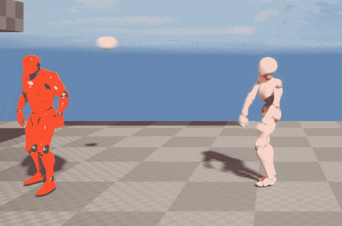

图 14.18 – 玩家投掷投射物

当投射物击中敌人时，敌人角色将被摧毁，如下所示：

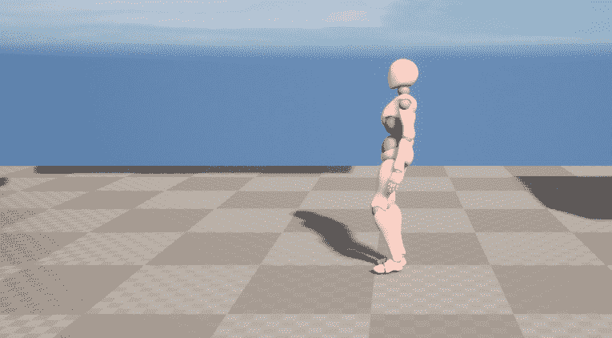

图 14.19 – 投射物和敌人已被摧毁

在完成这个活动后，玩家投射物和敌人角色在它们相互碰撞时可以被摧毁。此外，每当另一个角色触发其 `APlayerProjectile::OnHit()` 函数时，玩家投射物也将被摧毁。

有了这个，`Super SideScroller` 游戏的一个主要元素已经完成：玩家投射物生成，以及当它们与投射物碰撞时敌人被摧毁。你可以观察到摧毁这些角色非常简单，对玩家来说并不很有趣。

正因如此，在本章接下来的练习中，你将学习更多关于**视觉效果**和**音频效果**，或者分别称为**VFX**和**SFX**。你还将为敌人角色和玩家投射物实现这些元素。

现在既然敌人角色和玩家投射物都可以被摧毁，让我们简要讨论一下 VFX 和 SFX 是什么，以及它们将如何影响项目。

注意

本活动的解决方案可以在 GitHub 上找到：[`github.com/PacktPublishing/Elevating-Game-Experiences-with-Unreal-Engine-5-Second-Edition/tree/main/Activity%20solutions`](https://github.com/PacktPublishing/Elevating-Game-Experiences-with-Unreal-Engine-5-Second-Edition/tree/main/Activity%20solutions)。

# 理解和实现视觉和音频效果

VFX，如粒子系统，以及声音效果，如声音提示，在视频游戏中扮演着重要的角色。它们在系统、游戏机制甚至基本动作上增加了一层润色，使这些元素更加有趣或更令人愉悦。

让我们先从理解 VFX 开始，然后是 SFX。

## VFX

在 UE5 的上下文中，VFX 由所谓的**粒子系统**组成。粒子系统由发射器组成，而发射器由模块组成。在这些模块中，你可以使用材料、网格和数学模块来控制发射器的外观和行为。结果可以是火焰火炬、下雪、雨、灰尘等等。

注意

你可以在这里了解更多信息：[`docs.unrealengine.com/en-US/Resources/Showcases/Effects/index.xhtml`](https://docs.unrealengine.com/en-US/Resources/Showcases/Effects/index.xhtml)。

## 音频效果（SFX）

在 UE5 的背景下，SFX 是由声音波和声音提示的组合构成的：

+   声音波是`.wav`音频格式文件，可以导入到 UE5 中。

+   声音提示将声音波音频文件与其他节点（如**振荡器**、**调制器**和**连接器**）结合，为您游戏创建独特且复杂的音效。

注意

您可以在此处了解更多信息：[`docs.unrealengine.com/en-US/Engine/Audio/SoundCues/NodeReference/index.xhtml`](https://docs.unrealengine.com/en-US/Engine/Audio/SoundCues/NodeReference/index.xhtml).

在 UE5 的背景下，VFX 是通过一个名为**Cascade**的工具创建的，艺术家们可以结合使用**材质**、**静态网格**和**数学**来为游戏世界创建有趣且令人信服的效果。本书不会深入探讨这个工具的工作原理，但您可以在以下链接中找到有关 Cascade 的信息：[`docs.unrealengine.com/4.27/en-US/RenderingAndGraphics/ParticleSystems/`](https://docs.unrealengine.com/4.27/en-US/RenderingAndGraphics/ParticleSystems/).

在引擎的较新版本中，从 4.20 更新开始，有一个名为**Niagara**的插件可以被启用以创建 VFX。与 Cascade 不同，Niagara 使用类似于 Blueprints 的系统，您可以通过视觉脚本来编写效果的行为，而不是使用预设的模块。您可以在以下链接中找到有关 Niagara 的更多信息：[`docs.unrealengine.com/en-US/Engine/Niagara/Overview/index.xhtml`](https://docs.unrealengine.com/en-US/Engine/Niagara/Overview/index.xhtml). 此外，Cascade 将在 UE5 的新版本中弃用，而 Niagara 将被使用。为了本书的目的，我们仍将使用 Cascade 粒子效果。

在*第九章*，*添加* *音频-视觉元素*，您学习了更多关于音频以及如何在 UE5 中处理音频的知识。您现在需要知道的是，UE5 使用`.wav`文件格式将音频导入到引擎中。从那里，您可以直接使用`.wav`文件，在编辑器中称为声音波，或者将这些资产转换为声音提示，这允许您在声音波上添加音频效果。

最后，有一个重要的类需要了解，您将在接下来的练习中引用，这个类被称为`UGameplayStatics`。这是一个 UE5 中的静态类，可以从 C++和 Blueprints 中使用，并提供各种与游戏相关的实用功能。您将在接下来的练习中使用的两个函数如下：

```cpp
UGameplayStatics::SpawnEmitterAtLocation
UGameplayStatics:SpawnSoundAtLocation
```

这两个函数以非常相似的方式工作；它们都需要一个`World`上下文对象来在其中生成效果，要生成的粒子系统或音频，以及生成效果的位置。您将使用这些函数来生成下一练习中敌人的摧毁效果。

## 练习 14.09 – 在敌人被摧毁时添加效果

在这个练习中，你将向项目添加本章和练习中包含的新内容。这包括 VFX 和 SFX，以及它们的所有必需资产。然后，你将更新 `EnemyBase` 类，使其能够使用音频和粒子系统参数，在敌人被玩家投射物摧毁时添加所需的磨光层。

在完成这个练习之后，你将拥有一个敌人，当它与玩家的投射物碰撞时，在视觉和听觉上都会被摧毁。

让我们开始吧：

1.  首先，我们需要从 **Action RPG** 项目迁移特定的资产，该项目可以在 **Unreal Engine Launcher** 的 **Learn** 选项卡中找到。

1.  从 **Epic Games Launcher**，导航到 **Samples** 选项卡，在 **UE Legacy Samples** 类别中，你可以找到 **Action RPG**：

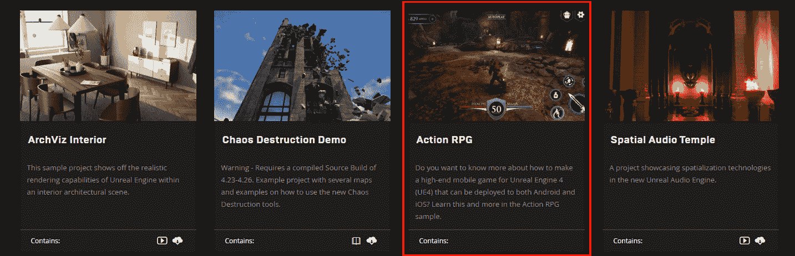

图 14.20 – Action RPG 示例项目

注意

你将在本章的后续练习中从 **Action RPG** 项目中获取额外的资产，因此你应该保持此项目打开，以避免重复打开项目。本练习的资产可以从 [`github.com/PacktPublishing/Elevating-Game-Experiences-with-Unreal-Engine-5-Second-Edition/tree/main/Chapter14/Exercise14.09`](https://github.com/PacktPublishing/Elevating-Game-Experiences-with-Unreal-Engine-5-Second-Edition/tree/main/Chapter14/Exercise14.09) 下载。

1.  左键点击 **Action RPG** 游戏项目，然后左键点击 **创建项目** 选项。

1.  从这里，选择引擎版本 4.27 并选择将项目下载到哪个目录。然后，*左键点击* **创建** 按钮以开始安装项目。

1.  一旦 **Action RPG** 项目下载完成，导航到 **Epic Games Launcher** 的 **Library** 选项卡，在 **My Projects** 部分找到 **ActionRPG**。

1.  *双击* **ActionRPG** 项目以在 UE5 编辑器中打开它。

1.  在编辑器中，在 **Content Browser** 界面中找到 **A_Guardian_Death_Cue** 音频资产。*右键点击* 此资产，选择 **Asset Actions** 然后选择 **迁移**。

1.  在选择 **迁移** 之后，你将看到所有在 **A_Guardian_Death_Cue** 中引用的资产。这包括所有音频类和声音波形文件。从 **Asset Report** 对话窗口中选择 **OK**。

1.  接下来，你需要导航到你的 `Super SideScroller` 项目的 `Content` 文件夹，并 *左键点击* **选择文件夹**。

1.  一旦迁移过程完成，你将在编辑器中看到一个通知，表明迁移已成功完成。

1.  对于 `P_Goblin_Death` VFX 资产，执行相同的迁移步骤。你将添加到项目中的两个主要资产如下：

    ```cpp
    A_Guardian_Death_Cue
    P_Goblin_Death
    ```

`P_Goblin_Death` 粒子系统资产引用了包含在 `Effects` 目录中的其他资产，如材质和纹理，而 `A_Guardian_Death_Cue` 引用了包含在 `Assets` 目录中的其他声音波形资产。

1.  将这些文件夹迁移到你的 `Content` 目录后，打开你的 `SuperSideScroller` 项目的 UE5 编辑器，以找到项目 **内容抽屉** 中包含的新文件夹。

你将用于敌人角色摧毁的粒子称为 `P_Goblin_Death`，可以在 `/Effects/FX_Particle/` 目录中找到。你将用于敌人角色摧毁的声音称为 `A_Guardian_Death_Cue`，可以在 `/Assets/Sounds/Creatures/Guardian/` 目录中找到。现在，所需的资产已经导入到编辑器中，让我们继续编写代码。

1.  打开 Visual Studio 并导航到敌人基类的头文件 – 即 `EnemyBase.h`。

1.  添加以下 `UPROPERTY()` 变量。这代表敌人被摧毁时的粒子系统。确保在 `Public` 访问修饰符下声明：

    ```cpp
    UPROPERTY(EditAnywhere, BlueprintReadOnly)
    class UParticleSystem* DeathEffect;
    ```

1.  添加以下 `UPROPERTY()` 变量。这代表敌人被摧毁时的声音。确保在 `Public` 访问修饰符下声明：

    ```cpp
    UPROPERTY(EditAnywhere, BlueprintReadOnly)
    class USoundBase* DeathSound;
    ```

定义了这两个属性后，让我们继续添加当敌人被摧毁时生成和使用这些效果的逻辑。

1.  在敌人基类源文件 `EnemyBase.cpp` 中，添加以下包含 `UGameplayStatics` 和 `UWorld` 类的代码：

    ```cpp
    #include "Kismet/GameplayStatics.h"
    #include "Engine/World.h"
    ```

你将使用 `UGameplayStatics` 和 `UWorld` 类在敌人被摧毁时将声音和粒子系统生成到世界中。

1.  在 `AEnemyBase::DestroyEnemy()` 函数中，你有一行代码：

    ```cpp
    Destroy();
    ```

1.  在 `Destroy()` 函数调用之前添加以下行代码：

    ```cpp
    UWorld* World = GetWorld();
    ```

在尝试生成粒子系统或声音之前，必须定义 `UWorld` 对象，因为需要一个 `World` 上下文对象。

1.  接下来，使用一个 `if()` 语句来检查你刚刚定义的 `World` 对象的有效性：

    ```cpp
    if(World)
    {
    }
    ```

1.  在 `if()` 块中，添加以下代码来检查 `DeathEffect` 属性的有效性，然后使用 `UGameplayStatics::SpawnEmitterAtLocation` 函数生成此效果：

    ```cpp
    if(DeathEffect)
    {
        UGameplayStatics::SpawnEmitterAtLocation(World, 
          DeathEffect, GetActorTransform());
    }
    ```

强调这一点的重要性无可置疑，你应该在尝试生成或操作对象之前确保对象是有效的。这样做可以避免引擎崩溃。

1.  在 `if(DeathEffect)` 块之后，对 `DeathSound` 属性进行相同的有效性检查，然后使用 `UGameplayStatics::SpawnSoundAtLocation` 函数生成声音：

    ```cpp
    if(DeathSound)
    {
        UGameplayStatics::SpawnSoundAtLocation(World, 
          DeathSound, GetActorLocation());
    }
    ```

在调用 `Destroy()` 函数之前，你需要检查 `DeathEffect` 和 `DeathSound` 属性是否有效，如果是，则使用适当的 `UGameplayStatics` 函数生成这些效果。这确保了无论哪个属性是否有效，敌人角色都将被摧毁。

1.  现在，`AEnemyBase::DestroyEnemy()` 函数已经更新为生成这些效果，返回 UE5 编辑器以编译和热重载这些代码更改。

1.  在 `/Enemy/Blueprints/` 目录下。*双击* `BP_Enemy` 资产以打开它。

1.  在 `Death Effect` 和 `Death Sound` 属性中。*左键点击* `Death Effect` 属性的下拉列表，找到 `P_Goblin_Death` 粒子系统。

1.  接下来，在 `Death Effect` 参数下，*左键点击* `Death Sound` 属性的下拉列表，找到 **A_Guardian_Death_Cue** 声音提示。

1.  现在这些参数已经更新并分配了正确的效果，请编译并保存敌人蓝图。

1.  使用 `PIE` 生成玩家角色并向敌人投掷玩家投射物。如果您的关卡中没有敌人，请添加一个。当玩家投射物与敌人碰撞时，您添加的 VFX 和 SFX 将会播放，如下面的截图所示：

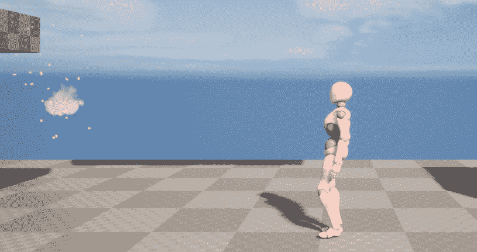

图 14.21 – 现在，敌人爆炸并伴随着荣耀的火焰被摧毁

完成这个练习后，当敌人被玩家投射物摧毁时，敌人角色现在会播放粒子系统和声音提示。这为游戏增添了一层漂亮的润色，并使摧毁敌人更加令人满意。

在下一个练习中，您将为玩家投射物添加新的粒子系统和音频组件，使其在空中飞行时看起来和听起来更加有趣。

## 练习 14.10 – 向玩家投射物添加效果

在当前状态下，玩家投射物按预期的方式工作；它在空中飞行，与游戏世界中的对象碰撞，然后被摧毁。然而，从视觉上看，玩家投射物只是一个带有普通白色纹理的球体。

在这个练习中，您将通过添加粒子系统和音频组件来为玩家投射物添加一层润色，使其在空中飞行时更加有趣。

按照以下步骤操作：

1.  与之前的练习类似，我们需要将 **Action RPG** 项目的资产迁移到我们的 **SuperSideScroller** 项目中。请参考 *练习 14.09 – 当敌人被摧毁时添加效果*，了解如何从 **Action RPG** 项目安装和迁移资产。

您将添加到项目中的两个主要资产如下：

```cpp
P_Env_Fire_Grate_01
A_Ambient_Fire01_Cue
```

`P_Env_Fire_Grate_01` 粒子系统资产引用了包含在 `Effects` 目录中的其他资产，例如材料和纹理，而 `A_Ambient_Fire01_Cue` 引用了包含在 `Assets` 目录中的其他声音波和声音衰减资产。

您将用于玩家投射物的粒子被称为 `P_Env_Fire_Grate_01`，可以在 `/Effects/FX_Particle/` 目录中找到。这是与之前练习中的 `P_Goblin_Death` VFX 相同的目录。您将用于玩家投射物的声音被称为 `A_Ambient_Fire01_Cue`，可以在 `/Assets/Sounds/Ambient/` 目录中找到。

1.  在**内容浏览器**界面中，*右键单击*这些资产，选择**资产操作**然后**迁移**。

1.  在确认迁移之前，请确保选择**SuperSideScroller**项目的**内容**文件夹目录。

现在所需的资产已迁移到我们的项目中，让我们继续创建玩家弹射类。

1.  打开 Visual Studio 并导航到玩家弹射类的大纲文件——即`PlayerProjectile.h`。

1.  在`Private`访问修饰符下，在`UStaticMeshComponent* MeshComp`类组件声明下方添加以下代码，以声明一个新的音频组件用于玩家弹射：

    ```cpp
    UPROPERTY(VisibleDefaultsOnly, Category = Sound)
    class UAudioComponent* ProjectileMovementSound;
    ```

1.  接下来，在音频组件声明下方添加以下代码，以声明一个新的粒子系统组件：

    ```cpp
    UPROPERTY(VisibleDefaultsOnly, Category = Projectile)
    class UParticleSystemComponent* ProjectileEffect;
    ```

与在敌人角色类中定义的属性不同，这些效果将是玩家弹射的组件。这是因为这些效果应该附加到弹射的碰撞组件上，以便在投掷时随着弹射物穿越关卡而移动。

1.  在头文件中声明了这两个组件后，打开玩家弹射的源文件，并将以下包含项添加到文件顶部的`include`行列表中：

    ```cpp
    #include "Components/AudioComponent.h"
    #include "Engine/Classes/Particles/ParticleSystemComponent.h"
    ```

使用`CreateDefaultSubobject`函数创建这些子对象时，需要同时引用音频组件和粒子系统类，以及将这些组件附加到**RootComponent**。

1.  添加以下行以创建`ProjectileMovementSound`组件的默认子对象，并将此组件附加到**RootComponent**：

    ```cpp
    ProjectileMovementSound = CreateDefaultSubobject<UAudioComponent>
      (TEXT("ProjectileMovementSound"));
      ProjectileMovementSound
      ->AttachToComponent(RootComponent, 
      FAttachmentTransformRules::KeepWorldTransform);
    ```

1.  接下来，添加以下行以创建`ProjectileEffect`组件的默认子对象，并将此组件附加到**RootComponent**：

    ```cpp
    ProjectileEffect = CreateDefaultSubobject<UParticle SystemComponent>(TEXT("Projectile
      Effect"));
    ProjectileEffect->AttachToComponent(RootComponent, 
      FAttachmentTransformRules::KeepWorldTransform);
    ```

1.  现在您已创建、初始化并将这两个组件附加到**RootComponent**，请返回 UE5 编辑器以重新编译和热重载这些代码更改。

1.  从`内容抽屉`界面导航到`/MainCharacter/Projectile/`目录。找到`BP_PlayerProjectile`资产，并*双击*它以打开蓝图。

在**组件**选项卡中，您将找到使用前面代码添加的两个新组件。注意，这些组件已附加到**CollisionComp**组件，也称为**RootComponent**。

1.  *左键单击*选择`P_Env_Fire_Grate_01` VFX 资产到该参数，如图所示：

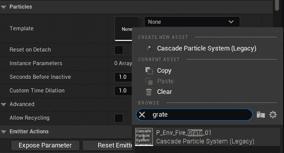

图 14.22 – 将 VFX 分配给粒子系统组件

1.  在分配音频组件之前，让我们调整`ProjectileEffect` VFX 资产。更新 VFX 的**变换**属性的**旋转**和**缩放**值，使其与以下截图所示相匹配：

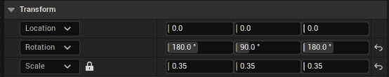

图 14.23 – 粒子系统组件更新的变换，以便更好地与投射物匹配

1.  导航到蓝图中的 `视口` 选项卡以查看对 `ProjectileEffect` 的这些更改应如下所示：

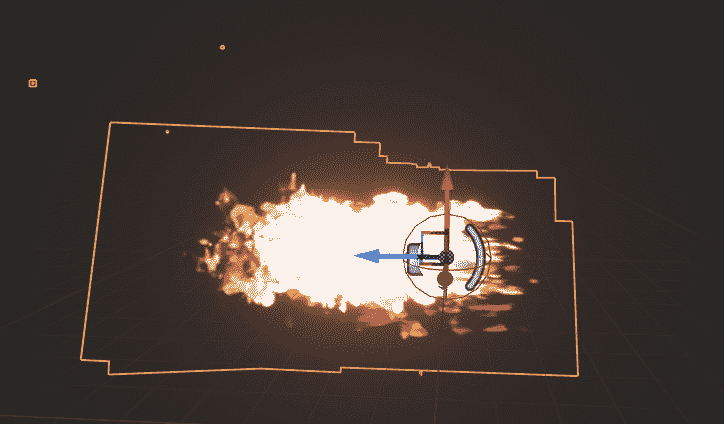

图 14.24 – 现在，火焰 VFX 已经适当地缩放和旋转

1.  现在 VFX 已经设置好，*左键单击* `ProjectileMovementSound` 组件并将其分配给 `A_Ambient_Fire01_Cue`。

1.  保存并重新编译 `BP_PlayerProjectile` 蓝图。使用 `PIE` 并观察当你投掷投射物时，它现在显示 VFX 资产并播放指定的声音：

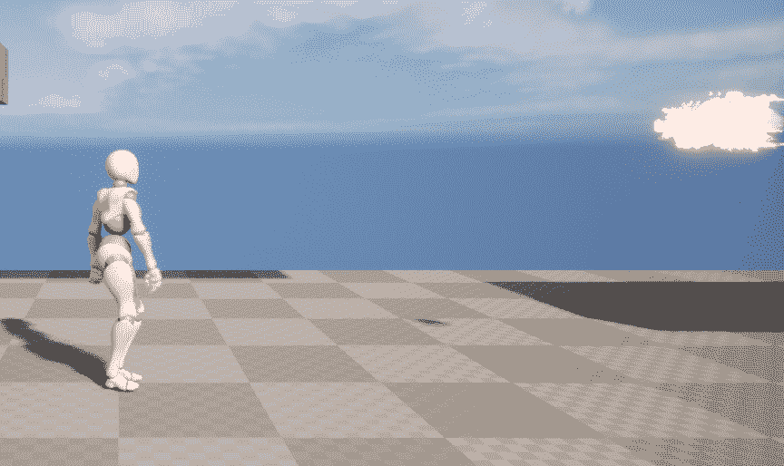

图 14.25 – 玩家投射物现在在空中飞行时具有 VFX 和 SFX

通过完成这个练习，玩家投射物现在在空中飞行时具有 VFX 和 SFX，这些元素使投射物栩栩如生，并使其使用起来更加有趣。

由于 VFX 和 SFX 已经被创建为投射物的组件，因此当投射物被销毁时，它们也会被销毁。

在下一个练习中，你将为 **Throw** 动画蒙太奇添加粒子通知和声音通知，以便在玩家投掷玩家投射物时产生更大的影响。

## 练习 14.11 – 添加 VFX 和 SFX 通知

到目前为止，你一直通过 C++ 实现游戏的高级元素，这是一种有效的实现方式。为了增加多样性，并扩展你对 UE5 工具集的了解，本练习将指导你如何使用动画蒙太奇中的通知来添加粒子系统和音频。让我们开始吧！

与之前的练习类似，我们需要将 `Action RPG` 项目的资产迁移到我们的 **SuperSideScroller** 项目中。请参考 *练习 14.09 – 在敌人被销毁时添加效果*，了解如何从 **Action RPG** 项目安装和迁移资产。

按照以下步骤操作：

1.  打开 **ActionRPG** 项目并导航到 **内容浏览器** 界面。

你将添加到项目中两个主要资源如下：

```cpp
P_Skill_001
A_Ability_FireballCast_Cue
```

`P_Skill_001` 粒子系统资产引用了包含在 `Effects` 目录中的其他资产，如 *材质* 和 *纹理*，而 `A_Ability_FireballCast_Cue` 引用了包含在 `Assets` 目录中的其他 *声音波形* 资产。

当投掷投射物时，你将使用的玩家粒子称为 `P_Skill_001`，可以在 `/Effects/FX_Particle/` 目录中找到。这是之前练习中 `P_Goblin_Death` 和 `P_Env_Fire_Grate_01` VFX 资产所使用的同一目录。你将用于敌人角色破坏的声音称为 `A_Ambient_Fire01_Cue`，可以在 `/Assets/Sounds/Ambient/` 目录中找到。

1.  在 **Action RPG** 项目的 **Content Browser** 界面中，*右键点击* 这些资产，然后选择 **Asset Actions** 和 **Migrate**。

1.  在确认迁移之前，请确保为你的 **SuperSideScroller** 项目选择 `Content` 文件夹的目录。

现在所需的资产已迁移到你的项目中，让我们继续将所需的通知添加到 `AM_Throw` 资产中。在继续此练习之前，请确保返回到你的 **SuperSideScroller** 项目。

1.  从 `/MainCharacter/Animation/` 目录。找到 `AM_Throw` 资产，*双击* 它以打开它。

1.  在本章前面 `Anim_ProjectileNotify` 中预览窗口的下方。

1.  在 **Notifies** 轨道左侧，你会找到一个 **▼** 符号，它允许你使用额外的通知轨道。*左键点击* 添加新的通知轨道，如图下截图所示：

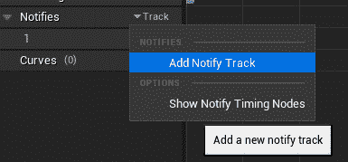

图 14.26 – 添加新的通知轨道

在添加多个通知时，向时间轴添加多个轨道以保持事物组织是有用的。

1.  在本章前面 `Anim_ProjectileNotify` 的同一帧中，*右键点击* 在上一步创建的新轨道内。从 `Play Particle Effect`。

1.  一旦创建，*左键点击* 选择新的通知，并访问其 `P_Skill_001` VFX 资产到 `Particle System` 参数。

一旦添加了此新 VFX，你会注意到 VFX 几乎放置在底部，即玩家角色的脚部，但不是你想要的位置。这个 VFX 应该直接放在地板上，或者放在角色的底部。以下截图演示了此位置：

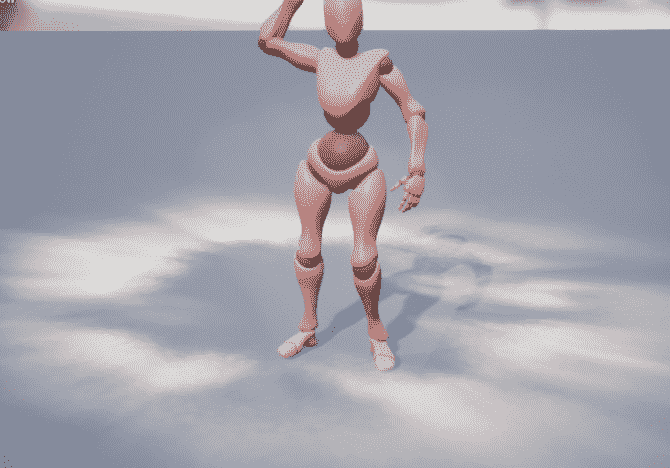

图 14.27 – 粒子通知的位置不在地面上

为了解决这个问题，你需要向玩家角色的骨骼添加一个新的 `Socket`。

1.  导航到 `/MainCharacter/Mesh/` 目录。*双击* `MainCharacter_Skeleton` 资产以打开它。

1.  从 `EffectSocket`。

1.  *左键点击* 从骨骼层次结构中此插座以查看其当前位置。默认情况下，其位置设置为与 **Hips** 骨相同的位置。以下截图显示了此位置：

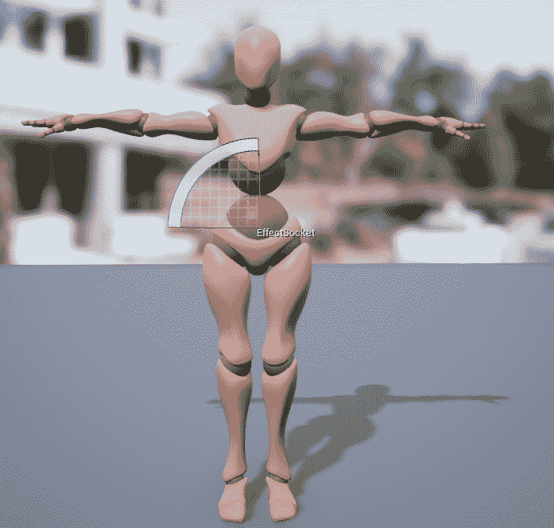

图 14.28 – 此插座的默认位置在玩家骨骼的中心。

使用 `EffectSocket` 以使其位置设置为以下：

```cpp
(X=0.000000,Y=100.000000,Z=0.000000)
```

这个位置将更接近地面和玩家角色的脚。最终位置可以在以下屏幕截图中看到：

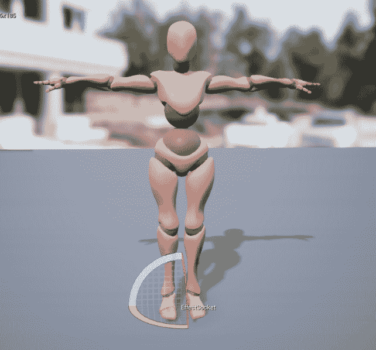

图 14.29 – 将套接字的位置移动到玩家骨骼的底部

1.  现在你有了粒子通知的位置，返回到 `AM_Throw` 动画蒙太奇。

1.  在 `套接字名称` 参数中。命名为 `EffectSocket`。

注意

如果 `EffectSocket` 通过自动完成没有出现，请关闭并重新打开动画蒙太奇。一旦重新打开，`EffectSocket` 选项应该会显示出来。

1.  最后，粒子效果的比例有点太大，所以调整投射物的比例，使其值如下：

    ```cpp
    (X=0.500000,Y=0.500000,Z=0.500000)
    ```

现在，当通过此通知播放粒子效果时，其位置和缩放将正确，如图所示：

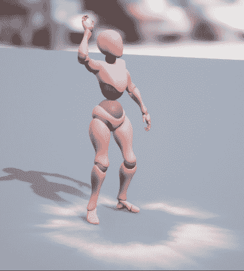

图 14.30 – 粒子现在在玩家角色骨骼的底部播放

1.  要添加 `Play Sound` 通知，向 **通知** 时间线部分添加一个新轨道；你应该总共有三个。

1.  在这个新轨道上，并且与 `Play Particle Effect` 和 `Anim_ProjectileNotify` 通知相同的帧位置，*右键单击* 并从 **添加通知** 选择中选中 **播放声音** 通知。以下屏幕截图显示了此通知的位置：

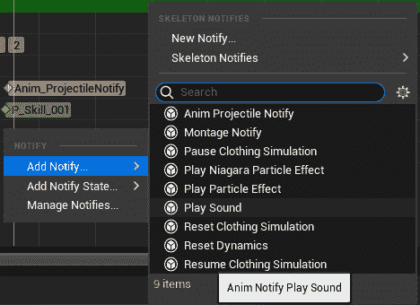

图 14.31 – 本章前面提到的播放声音通知

1.  接下来，*左键单击* 选中 **播放声音** 通知并访问其 **详细信息** 面板。

1.  从 `A_Ability_FireballCast_Cue`。

在分配了声音后，当 **投掷** 动画回放时，你会看到 VFX 播放，并且你会听到声音。**通知** 轨道应该如下所示：

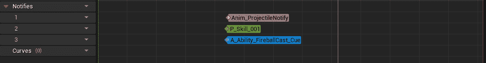

图 14.32 – 投掷动画蒙太奇时间线上的最终通知设置

1.  保存 `AM_Throw` 资产并使用 `PIE` 投掷玩家投射物。

1.  现在，当你投掷投射物时，你会看到粒子通知播放 `P_Skill_001` VFX，并且你会听到 `A_Ability_FireballCast_Cue` SFX。结果将如下所示：

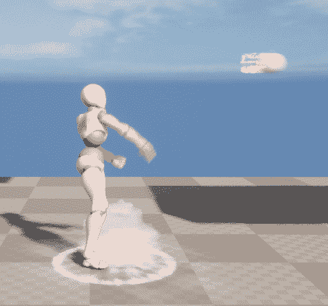

图 14.33 – 现在，当玩家投掷投射物时，播放强大的 VFX 和 SFX

在完成这个最终练习后，玩家现在在投掷玩家投射物时播放强大的 VFX 和 SFX。这给投掷动画增加了更多力量，感觉玩家角色在投掷投射物时使用了大量能量。

在最终活动中，你将使用从最后几项练习中获得的知识，在玩家投射物被摧毁时添加 VFX 和 SFX。

## 活动 14.02 – 添加投射物被摧毁时的效果

在这个最终活动中，你将使用从为玩家投射物和敌人角色添加 VFX 和 SFX 元素中获得的知识，在投射物与物体碰撞时创建爆炸效果。我们添加这个额外的爆炸效果是为了在投射物与环境物体碰撞时摧毁投射物之外增加一个精细度。如果玩家投射物击中物体后消失，没有任何音频或视觉反馈，看起来会显得尴尬和不合适。

你将为玩家投射物添加一个粒子系统和声音提示参数，并在投射物与物体碰撞时生成这些元素。

按照以下步骤实现预期输出：

1.  在`PlayerProjectile.h`头文件中，添加一个新的粒子系统变量和一个新的声音基础变量。

1.  将粒子系统变量命名为`DestroyEffect`，将声音基础变量命名为`DestroySound`。

1.  在`PlayerProjectile.cpp`源文件中，将`UGameplayStatics`的包含添加到包含列表中。

1.  更新`APlayerProjectile::ExplodeProjectile()`函数，使其现在生成`DestroyEffect`和`DestroySound`对象。返回 UE5 编辑器并重新编译新的 C++代码。在`BP_PlayerProjectile`蓝图内，将默认包含在项目中的`P_Explosion` VFX 分配给投射物的`Destroy Effect`参数。

1.  将默认包含在项目中的`Explosion_Cue` SFX 分配给投射物的`Destroy Sound`参数。

1.  保存并编译玩家投射物蓝图。

1.  使用`PIE`观察新的玩家投射物的摧毁 VFX 和 SFX。

预期输出如下：

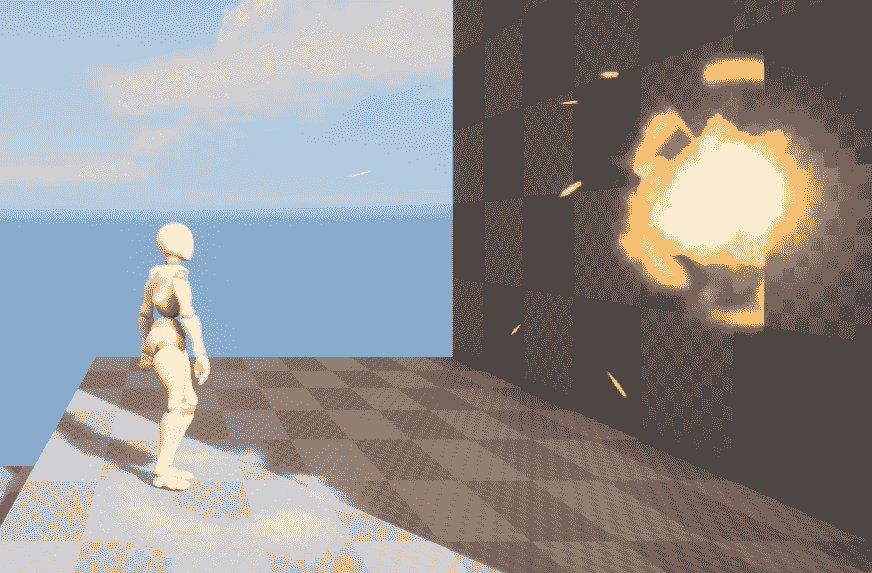

图 14.34 – 投射物 VFX 和 SFX

完成这个活动后，你现在有在游戏中添加精细元素的经验。你不仅通过 C++代码添加了这些元素，还通过 UE5 的其他工具添加了元素。在这个阶段，你已经有足够的经验在不担心如何实现这些功能的情况下，为你的游戏添加粒子系统和音频。

注意

这个活动的解决方案可以在 GitHub 上找到：[`github.com/PacktPublishing/Elevating-Game-Experiences-with-Unreal-Engine-5-Second-Edition/tree/main/Activity%20solutions`](https://github.com/PacktPublishing/Elevating-Game-Experiences-with-Unreal-Engine-5-Second-Edition/tree/main/Activity%20solutions)。

# 摘要

在本章中，你学习了在游戏开发世界中 VFX 和 SFX 的重要性。通过结合 C++代码和通知，你能够将游戏玩法功能带给玩家投射物和敌人角色碰撞，并通过添加 VFX 和 SFX 为这一功能增添了一层磨光。除此之外，你还学习了在 UE5 中对象是如何生成和销毁的。

此外，你还学习了如何通过蓝图和 C++两种方式播放动画蒙太奇。通过将播放**投掷**动画蒙太奇的逻辑从蓝图迁移到 C++，你了解了这两种方法的工作原理以及如何将这两种实现用于你的游戏。

通过使用 C++添加新的动画通知，你能够将这个通知添加到`UWorld->SpawnActor()`函数中，并为玩家骨骼添加一个新的套接字，这样你就能在**投掷**动画的精确帧以及在你想放置的确切位置生成玩家投射物。

最后，你学习了如何在**投掷**动画蒙太奇中使用**播放粒子效果**和**播放声音**通知来为玩家投射物的投掷添加 VFX 和 SFX。本章教你关于在 UE5 中使用 VFX 和 SFX 为你的游戏存在的不同方法。

现在玩家投射物可以投掷并摧毁敌人角色，是时候实现游戏的最终一套机制了。在下一章中，你将创建玩家可以收集的物品，同时也会为玩家创建一个可以短暂提升玩家移动机制的道具。
