# 探索收集品、增强效果和拾取物

在上一章中，你创建了玩家投射物并使用 `Anim Notifies` 在 `Throw` 动画期间生成玩家投射物。玩家投射物将作为玩家在整个关卡中对抗敌人的主要攻击游戏机制。由于 UE5 提供的默认 `Anim Notifies` 和你自己的自定义 `Anim_ProjectileNotify` 类的组合，玩家投射物机制看起来和感觉都非常好。

在本章中，我们将涵盖以下主题：

+   如何在 UE5 中使用 **Unreal Motion Graphics** （**UMG**） UI 设计器系统创建和集成 UI 元素。

+   使用本项目中学到的知识来创建一个有趣的增强效果，该效果将提高玩家的移动速度和跳跃高度。

+   如何使用 C++ 中的继承来从一个父基类派生出多个类，用于收集品和增强效果。你还将为收集品和增强效果添加视觉和音频元素，使它们更加完善。

+   如何使用 `URotatingMovementComponent` 以非常优化和直接的方式为演员添加旋转。

到本章结束时，你将拥有完成的 **SuperSideScroller** 游戏项目，包括金币收集品和相应的 UI 来跟踪收集到的金币数量，一个新的增强效果药水，它可以提高玩家的移动速度和跳跃高度，以及一个基类，从中可以派生出游戏中的潜在新增强效果和收集品。

# 技术要求

对于本章，你需要以下技术要求：

+   已安装 Unreal Engine 5

+   已安装 Visual Studio 2019

+   已安装 Unreal Engine 4.27

让我们从这个章节开始，更深入地了解 `URotatingMovementComponent`，我们将用它来处理我们的收集品。

本章节的项目可以在本书代码包的 Chapter15 文件夹中找到，可以在此处下载：[`github.com/PacktPublishing/Elevating-Game-Experiences-with-Unreal-Engine-5-Second-Edition`](https://github.com/PacktPublishing/Elevating-Game-Experiences-with-Unreal-Engine-5-Second-Edition)。

# 理解 URotatingMovementComponent

`URotatingMovementComponent` 是存在于 UE5 中的一少数几个运动组件之一。你已经熟悉了 `CharacterMovementComponent` 和 `ProjectileMovementComponent`，而 `RotatingMovementComponent` 正是另一个运动组件。作为复习，运动组件允许对它们所属的演员或角色执行不同类型的运动。

注意

`CharacterMovementComponent`，它允许你控制角色的运动参数，例如他们的移动速度和跳跃高度，在 *第十章*，*创建 SuperSideScroller 游戏* 中有介绍，当你创建 `ProjectileMovementComponent` 时，它允许你为演员添加基于投射物的运动功能，例如速度和重力，在 *第十四章*，*生成玩家投射物* 中有介绍，当你开发玩家投射物时。

与 `CharacterMovementComponent` 相比，`RotatingMovementComponent` 是一个非常简单的运动组件，这是因为它只涉及旋转 `RotatingMovementComponent` 所在的演员；没有更多。`RotatingMovementComponent` 根据定义的 `旋转速率`、旋转轴的平移和是否在局部空间或世界空间中使用旋转的选项，持续旋转一个组件。此外，与通过 `Event Tick` 或蓝图中的 `Timelines` 等其他旋转演员的方法相比，`RotatingMovementComponent` 的效率要高得多。

注意

更多关于运动组件的信息可以在这里找到：[`docs.unrealengine.com/en-US/Engine/Components/Movement/index.xhtml#rotatingmovementcomponent`](https://docs.unrealengine.com/en-US/Engine/Components/Movement/index.xhtml#rotatingmovementcomponent)。

我们将使用 `RotatingMovementComponent` 允许硬币收集品和药水增强效果在 *Z*- 轴上原地旋转。这种旋转将吸引玩家的注意力，并给他们一个视觉提示，表明收集品很重要。

现在你已经对 `RotatingMovementComponent` 有了一个更好的理解，让我们继续创建 `PickableActor_Base` 类，这是硬币收集品和药水增强效果将从中派生出来的类。

## 练习 15.01 – 创建 PickableActor_Base 类并添加 URotatingMovementComponent

在这个练习中，你将创建 `PickableActor_Base` 角色类，它将作为收集品硬币和药水增强效果派生的基类。你还将从这个 C++ 基类创建一个蓝图类，以预览 `URotatingMovementComponent` 的功能。按照以下步骤完成这个练习：

注意

你在 **SuperSideScroller** 游戏项目中已经多次执行了以下步骤，所以将有限地提供截图以帮助指导。只有在介绍新概念时，才会有相应的截图。

1.  在 UE5 编辑器中，点击编辑器顶部的 **工具** 选项，然后选择 **新建 C++ 类**。

1.  在 **选择父类** 窗口中，选择 **Actor** 选项，然后点击此窗口底部的 **下一步** 按钮。

1.  将此类命名为 `PickableActor_Base` 并保留默认的 `Path` 目录。然后，点击此窗口底部的 **创建类** 按钮。

1.  选择 `PickableActor_Base` 类后。

1.  默认情况下，`Actor`类在头文件中为你提供了`virtual void Tick(float DeltaTime) override;`函数声明。对于`PickableActor_Base`类，我们不需要`Tick`函数，因此请从`PickableActor_Base.h`头文件中移除此函数声明。

1.  接下来，你需要从`PickableActor_Base.cpp`文件中移除该函数；否则，你将收到编译错误。在此源文件中找到并移除以下代码：

    ```cpp
    void PickableActor_Base::Tick(float DeltaTime)
    {
      Super::Tick(DeltaTime);
    }
    ```

注意

在许多情况下，由于`Tick()`函数在每一帧都会被调用，因此使用`Tick()`函数进行移动更新可能会导致性能问题。相反，尝试使用`Gameplay Timer`函数在指定间隔执行某些更新，而不是在每一帧上。你可以在[`docs.unrealengine.com/4.27/en-US/ProgrammingAndScripting/ProgrammingWithCPP/UnrealArchitecture/Timers/`](https://docs.unrealengine.com/4.27/en-US/ProgrammingAndScripting/ProgrammingWithCPP/UnrealArchitecture/Timers/)了解更多关于`Gameplay Timers`的信息。

1.  现在，是时候添加`PickableActor_Base`类所需的组件了。让我们从`USphereComponent`开始，你将使用它来检测与玩家的重叠碰撞。在`PickableActor_Base.h`头文件中的`Protected`访问修饰符下方添加以下代码：

    ```cpp
    UPROPERTY(VisibleDefaultsOnly, Category = PickableItem)
    class USphereComponent* CollisionComp;
    ```

到现在为止，`USphereComponent`的声明应该对你来说非常熟悉了；我们之前在创建`PlayerProjectile`类时已经在前面的章节中这样做过，例如在*第十四章*，*生成玩家投射物*。

1.  接下来，在`USphereComponent`声明下方添加以下代码以创建一个新的`UStaticMeshComponent`。这将用于视觉上表示硬币收集品或药水增强效果：

    ```cpp
    UPROPERTY(VisibleDefaultsOnly, Category = PickableItem)
    class UStaticMeshComponent* MeshComp;
    ```

1.  最后，在`UStaticMeshComponent`声明下方添加以下代码以创建一个新的`URotatingMovementComponent`。这将用于给收集品硬币和药水增强效果提供简单的旋转运动：

    ```cpp
    UPROPERTY(VisibleDefaultsOnly, Category = PickableItem)
    class URotatingMovementComponent* RotationComp;
    ```

1.  现在你已经在`PickableActor_Base.h`头文件中声明了组件，请导航到`PickableActor_Base.cpp`源文件，以便为这些添加的组件添加所需的`#include`语句。在源文件顶部`#include `PickableActor_Base.h``之后添加以下行：

    ```cpp
    #include "Components/SphereComponent.h"
    #include "Components/StaticMeshComponent.h"
    #include "GameFramework/RotatingMovementComponent.h"
    ```

1.  现在你已经有了组件所需的`#include`文件，你可以在`APickableActor_Base::APickableActor_Base()`构造函数中添加初始化这些组件的必要代码：

    ```cpp
    APickableActor_Base::APickableActor_Base()
    {
    }
    ```

1.  首先，通过在`APickableActor_Base::APickableActor_Base()`中添加以下代码来初始化`USphereComponent`组件变量`CollisionComp`：

    ```cpp
    CollisionComp = CreateDefaultSubobject
      <USphereComponent>(TEXT("SphereComp"));
    ```

1.  接下来，通过在上一步骤提供的代码下方添加以下代码来使用默认球体半径`30.0f`初始化`USphereComponent`：

    ```cpp
    CollisionComp->InitSphereRadius(30.0f);
    ```

1.  由于玩家角色需要与此组件重叠，你需要添加以下代码，以便默认情况下 `USphereComponent` 具有对 `Overlap All Dynamic` 的碰撞设置：

    ```cpp
    CollisionComp->BodyInstance.SetCollisionProfileName("OverlapAllDynamic");
    ```

1.  最后，`CollisionComp USphereComponent` 应该是这个演员的根组件。添加以下代码以分配此组件：

    ```cpp
    RootComponent = CollisionComp;
    ```

1.  现在，`CollisionComp USphereComponent` 已经初始化，让我们对 `MeshComp UStaticMeshComponent` 做同样的操作。添加以下代码。之后，我们将讨论代码为我们做了什么：

    ```cpp
    MeshComp = CreateDefaultSubobject<UStaticMeshComponent>(TEXT("MeshComp"));
    MeshComp->AttachToComponent(RootComponent, 
      FAttachmentTransformRules::KeepWorldTransform);
    MeshComp->SetCollisionEnabled(ECollisionEnabled::NoCollision);
    ```

第一行使用 `CreateDefaultSubobject()` 模板函数初始化 `MeshComp UStaticMeshComponent`。接下来，你使用 `AttachTo()` 函数将 `MeshComp` 附接到为 `CollisionComp` 创建的根组件上。最后，`MeshComp UStaticMeshComponent` 默认情况下不应有任何碰撞，因此你使用 `SetCollisionEnabled()` 函数并传入 `ECollisionEnable::NoCollision` 枚举值。

1.  最后，我们可以通过添加以下代码来初始化 `URotatingMovementComponent RotationComp`：

    ```cpp
    RotationComp = 
      CreateDefaultSubobject<URotatingMovementComponent>(
      TEXT("RotationComp"));
    ```

1.  所有组件初始化完成后，编译 C++ 代码并返回到 UE5 编辑器。编译成功后，你可以开始为 `PickableActor_Base` 创建蓝图类。

1.  在 `PickableItems` 中，通过 *右键单击* `Content` 文件夹并选择 **新建文件夹** 选项。

1.  在 `PickableItems` 文件夹中，*右键单击* 并选择 `PickableActor_Base` 类，然后 *左键单击* **选择** 以创建一个新的蓝图。

1.  将此蓝图命名为 `BP_PickableActor_Base` 并 *双击* 蓝图以打开它。

1.  在 **Details** 面板的 `Shape_Cone` 静态网格的 `Static Mesh` 参数中。请参考以下截图：

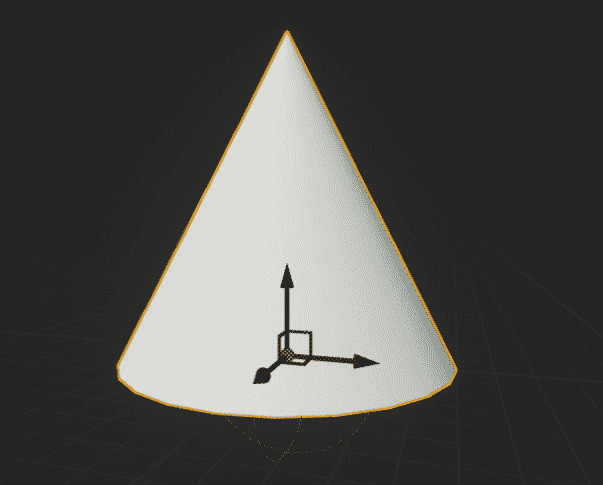

图 15.1 – 分配给 MeshComp StaticMeshComponent 的 Shape_Cone 网格

1.  接下来，选择 **RotationComp URotatingMovementComponent** 并在 **Details** 面板的 **Rotating Component** 类别中找到 **Rotation Rate** 参数。

1.  将 **Rotation Rate** 设置为以下值：

    ```cpp
    (X=100.000000,Y=100.000000,Z=100.000000)
    ```

这些值决定了演员每秒沿每个轴旋转的速度。这意味着锥形演员将沿每个轴以每秒 100 度的速度旋转。

1.  编译 `PickableActor_Base` 蓝图并将此演员添加到你的关卡中。

1.  现在，如果你使用 `PIE` 并查看关卡中的 `PickableActor_Base` 演员角色，你会看到它在旋转。请参考以下截图：


图 15.2 – BP_PickableActor_Base 在原地旋转

注意

你可以在此处找到此练习的资源和代码：[`github.com/PacktPublishing/Game-Development-Projects-with-Unreal-Engine/tree/master/Chapter15/Exercise15.01`](https://github.com/PacktPublishing/Game-Development-Projects-with-Unreal-Engine/tree/master/Chapter15/Exercise15.01)。

通过完成这个练习，你已经创建了 `PickableActor_Base` 类所需的基本组件，并学习了如何实现和使用 `URotatingMovementComponent`。在 `PickableActor_Base` 类准备就绪，并在蓝图角色上实现了 `URotatingMovementComponent` 之后，我们可以通过添加重叠检测功能、销毁可收集角色以及在角色被玩家拾取时生成音频效果来完成该类。在接下来的活动中，你将添加 `PickableActor_Base` 类所需的剩余功能。

## 活动 15.01 – 在 `PickableActor_Base` 中进行玩家重叠检测和生成效果

现在，`PickableActor_Base` 类已经包含了所有必需的组件，并且其构造函数初始化了这些组件，是时候添加其功能的剩余部分了。这些将在本章后面的部分由金币收集物和药水增益效果继承。这些附加功能包括玩家重叠检测、销毁可收集角色，并在玩家成功拾取时生成音频效果以向玩家提供反馈。执行以下步骤以添加允许在收集物与玩家重叠时播放 `USoundBase` 类对象的功能：

1.  在 `PickableActor_Base` 类中创建一个新的函数，该函数接受一个引用作为输入参数。将此函数命名为 `PlayerPickedUp`。

1.  创建一个新的 `UFUNCTION`，命名为 `BeginOverlap()`。在继续之前，确保包含此函数所需的所有输入参数。参考*第六章*，*设置碰撞对象*，其中你在 `VictoryBox` 类内部使用了此函数。

1.  为 `USoundBase` 类添加一个新的 `UPROPERTY()`，命名为 `PickupSound`。

1.  在 `PickableActor_Base.cpp` 源文件中，创建 `BeginOverlap()` 和 `PlayerPickedUp()` 函数的定义。

1.  现在，在源文件顶部添加 `SuperSideScroller_Player` 类和 `GameplayStatics` 类所需的 `#include` 文件。

1.  在 `BeginOverlap()` 函数中，使用函数的 `OtherActor` 输入参数创建玩家的引用。

1.  接下来，如果玩家引用有效，调用 `PlayerPickedUp()` 函数，传入玩家变量。

1.  在 `PlayerPickedUp()` 函数中，为 `GetWorld()` 函数返回的 `UWorld*` 对象创建一个变量。

1.  使用 `UGameplayStatics` 库在 `PickableActor_Base` 角色的位置生成 `PickUpSound`。

1.  然后，调用 `Destroy()` 函数，以便销毁角色并将其从世界中移除。

1.  最后，在 `APickableActor_Base::APickableActor_Base()` 构造函数中，将 `CollisionComp` 的 `OnComponentBeginOverlap` 事件绑定到 `BeginOverlap()` 函数。

1.  从该项目中下载并安装`Unreal Match 3`项目，使用你在*第十四章*，“生成玩家投射物”中获得的技能，将`Match_Combo`声音波形资产从该项目安装到你的**SuperSideScroller**项目中。

1.  将此声音应用到`BP_PickableActor_Base`蓝图的`PickupSound`参数。

1.  编译蓝图，如果您的关卡中不存在，现在添加`BP_PickableActor_Base`演员到您的关卡中。

1.  在`PIE`中，让您的角色与`BP_PickableActor_Base`演员重叠。

预期输出：

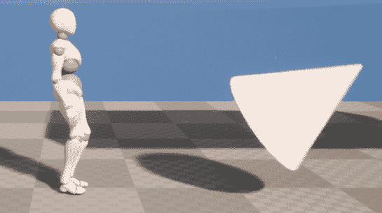

图 15.3 – BP_PickableActor_Base 对象可以被玩家拾取

注意

该活动的解决方案可以在[`github.com/PacktPublishing/Elevating-Game-Experiences-with-Unreal-Engine-5-Second-Edition/tree/main/Activity%20solutions`](https://github.com/PacktPublishing/Elevating-Game-Experiences-with-Unreal-Engine-5-Second-Edition/tree/main/Activity%20solutions)找到。

完成此活动后，你已经证明了你在如何将`OnBeginOverlap()`功能添加到你的演员类中以及如何使用此功能为你的演员执行逻辑方面的知识。在`PickableActor_Base`的情况下，我们添加了逻辑，将生成自定义声音并销毁演员。

现在既然`PickableActor_Base`类已经设置并准备好了，是时候开发继承自它的可收集硬币和增强药水类了。硬币可收集类将继承自你刚刚创建的`PickableActor_Base`类。它将覆盖关键功能，例如`PlayerPickedUp()`函数，以便我们可以在玩家拾取可收集物品时实现独特的逻辑。除了覆盖从继承的父类`PickableActor_Base`中继承的功能外，硬币可收集类还将拥有其自己独特的一组属性，例如其当前硬币价值和独特的拾取声音。我们将在下一个练习中一起创建硬币可收集类。

练习 15.02 – 创建 PickableActor_Collectable 类

在这个练习中，你将创建`PickableActor_Collectable`类，该类将继承自你在*练习 15.01 – 创建 PickableActor_Base 类并添加 URotatingMovement*中创建的`PickableActor_Base`类，并在*活动 15.01 – 在 PickableActor_Base 中检测玩家重叠和生成效果*中完成。这个类将用作玩家在关卡内可以收集的主要可收集硬币。按照以下步骤完成这个练习：

1.  在 UE5 编辑器中，点击编辑器顶部的**工具**选项，然后选择**新建 C++类**。

1.  在**选择父类**窗口中，选择**PickableActor_Base**选项，然后点击此窗口底部的**下一步**按钮。

1.  将此类命名为`PickableActor_Collectable`，并保持默认的`Path`目录不变。然后，点击此窗口底部的**创建类**按钮。

1.  在选择`PickableActor_Collectable`类之后。

1.  默认情况下，`PickableActor_Collectable.h`头文件在其类声明中没有声明任何函数或变量。您需要在新的`Protected Access Modifier`下添加对`BeginPlay()`函数的重写。添加以下代码：

    ```cpp
    protected:
      virtual void BeginPlay() override;
    ```

我们重写`BeginPlay()`函数的原因是`URotatingMovementComponent`需要演员初始化并使用`BeginPlay()`来正确旋转演员。因此，我们需要在源文件中创建此函数的重写声明并创建一个基本的定义。首先，然而，我们需要重写`PickableActor_Base`父类中的另一个重要函数。

1.  在`Protected Access Modifier`下添加以下代码以重写`PickableActor_Base`父类中的`PlayerPickedUp()`函数：

    ```cpp
    virtual void PlayerPickedUp(class ASuperSideScroller_Player* Player)override; 

    ```

通过这种方式，我们表示我们将使用并重写`PlayerPickedUp()`函数的功能。

1.  最后，创建一个新的整数`UPROPERTY()`，它将保存硬币可收集项的值；在这种情况下，它将具有值`1`。添加以下代码来完成此操作：

    ```cpp
    public:
      UPROPERTY(EditAnywhere, Category = Collectable)
      int32 CollectableValue = 1;
    ```

在这里，我们创建了一个整数变量，该变量在蓝图中将可访问，并具有默认值`1`。如果您选择，使用`EditAnywhere UPROPERTY()`关键字，您可以更改硬币可收集项的价值。

1.  现在，我们可以继续到`PickableActor_Collectable.cpp`源文件，并创建重写的`PlayerPickedUp()`函数的定义。将以下代码添加到源文件中：

    ```cpp
    void APickableActor_Collectable::PlayerPickedUp(class 
      ASuperSideScroller_Player* Player)
    {
    }
    ```

1.  现在，我们需要通过使用`Super`关键字调用`PlayerPickedUp()`父函数。将以下代码添加到`PlayerPickedUp()`函数中：

    ```cpp
    Super::PlayerPickedUp(Player);
    ```

使用`Super::PlayerPickedUp(Player)`调用的父函数将确保您在`PickableActor_Base`类中创建的功能被调用。如您所回忆的，父类中的`PlayerPickedUp()`函数会调用生成`PickupSound`声音对象并销毁演员。

1.  接下来，在源文件中创建`BeginPlay()`函数的定义，添加以下代码：

    ```cpp
    void APickableActor_Collectable::BeginPlay()
    {
    }
    ```

1.  最后，在 C++中，再次使用`Super`关键字调用`BeginPlay()`父函数。将以下代码添加到`PickableActor_Collectable`类中的`BeginPlay()`函数内：

    ```cpp
    Super::BeginPlay();
    ```

1.  编译 C++代码并返回到编辑器。

注意

您可以在以下链接找到本练习的资源和代码：[`packt.live/35fRN3E`](https://packt.live/35fRN3E)。

现在您已成功编译了`PickableActor_Collectable`类，您已经创建了硬币可收集项所需的框架。在接下来的活动中，您将从这个类创建一个蓝图并最终完成硬币可收集项的创建。

## 活动十五.02 – 最终化 PickableActor_Collectable 演员

现在，`PickableActor_Collectable`类已经拥有了所有必要的继承功能以及它需要的独特属性，是时候从这个类创建蓝图，并添加一个`Static Mesh`，更新其`URotatingMovementComponent`，并将声音应用到`PickUpSound`属性上了。执行以下步骤以最终化`PickableActor_Collectable`演员：

1.  从**Epic Games Launcher**，在**示例**标签页下，在**引擎功能示例**类别中找到**内容示例**项目。

1.  从**内容示例**项目创建并安装一个新的项目。

1.  将`SM_Pickup_Coin`资产及其所有引用的资产从**内容示例**项目迁移到你的**SuperSideScroller**项目中。

1.  在`Content/PickableItems`目录下的`Collectable`中创建一个新的文件夹。

1.  在这个新的`Collectable`文件夹中，从你在*练习十五.02 – 创建 PickableActor_Collectable 类*中创建的`PickableActor_Collectable`类创建一个新的蓝图。将这个新的蓝图命名为`BP_Collectable`。

1.  在此蓝图（Blueprint）中，将`MeshComp`组件的`Static Mesh`参数设置为之前在此活动中导入的`SM_Pickup_Coin`网格。

1.  接下来，将`Match_Combo`声音资产添加到可收集物品的`PickupSound`参数中。

1.  最后，更新`RotationComp`组件，使演员沿*Z*轴以每秒 90 度的速度旋转。

1.  编译蓝图，将`BP_Collectable`放置到你的关卡中，并使用`PIE`（Playground Immediate Editor）。

1.  将玩家角色与`BP_Collectable`演员重叠，并观察结果。

预期输出：


图十五.4 – 硬币收集物品旋转，并且可以被玩家重叠

注意

本活动的解决方案可以在[`github.com/PacktPublishing/Elevating-Game-Experiences-with-Unreal-Engine-5-Second-Edition/tree/main/Activity%20solutions`](https://github.com/PacktPublishing/Elevating-Game-Experiences-with-Unreal-Engine-5-Second-Edition/tree/main/Activity%20solutions)找到。

完成此活动后，你已经证明你知道如何将资产迁移到你的 UE5 项目中，以及如何使用和更新`URotatingMovementComponent`以满足硬币收集物品的需求。现在硬币收集物品演员已经完成，是时候向玩家添加功能，以便玩家可以跟踪他们收集了多少硬币。

首先，我们将创建使用`UE_LOG`计数的逻辑。稍后，我们将使用**Unreal Motion Graphics**（**UMG**）UI 设计器系统在游戏的 UI 上实现硬币计数器。

# 使用 UE_LOG 记录变量

在 *第十一章* *使用 1D 混合空间、按键绑定和状态机* 中，我们使用了并学习了 `UE_LOG` 函数来记录玩家何时应该投掷投射物。然后，我们在 *第十三章* *创建和添加敌人人工智能* 中使用 `UE_LOG` 函数来记录玩家投射物击中物体时的情况。"UE_LOG" 是一个强大的日志工具，我们可以用它将 C++ 函数中的重要信息输出到 `FStrings` 中，以在 **输出日志** 窗口中显示一般文本，以知道我们的函数正在被调用。现在，是时候学习如何记录变量来调试玩家收集了多少硬币了。

注意

C++ 中还有另一个在 UE5 中可用的有用调试函数，称为 `AddOnScreenDebugMessage`。你可以在这里了解更多关于这个函数的信息：[`docs.unrealengine.com/en-US/API/Runtime/Engine/Engine/UEngine/AddOnScreenDebugMessage/1/index.xhtml`](https://docs.unrealengine.com/en-US/API/Runtime/Engine/Engine/UEngine/AddOnScreenDebugMessage/1/index.xhtml)。

当创建 `TEXT()` 宏使用的 `FString` 语法时，我们可以添加格式说明符来记录不同类型的变量。我们只讨论如何添加整型变量的格式说明符。

注意

你可以通过阅读以下文档了解如何指定其他变量类型：[`www.ue4community.wiki/Logging#Logging_an_FString`](https://www.ue4community.wiki/Logging#Logging_an_FString)。

这就是 `UE_LOG()` 在传递 `FString “Example Text”` 时的样子：

```cpp
UE_LOG(LogTemp, Warning, TEXT("Example Text"));
```

在这里，你有 `Log Category`、`Log Verbose Level` 和实际要显示在日志中的 `FString`、“Example Text”。要记录一个整型变量，你需要在 `TEXT()` 宏内的 `FString` 中添加 `%d`，然后在外部 `TEXT()` 宏之外添加整型变量名，两者之间用逗号隔开。以下是一个示例：

```cpp
UE_LOG(LogTemp, Warning, TEXT("My integer variable %d), MyInteger);
```

格式说明符由 `%` 符号标识，每种变量类型都有一个与之对应的字母。对于整型，字母 `d` 被用来表示数字。你将在下一个练习中使用这种方法来记录玩家拥有的硬币收集数量。

## 练习 15.03 – 跟踪玩家收集的硬币数量

在这个练习中，你将创建必要的属性和函数，以便跟踪玩家在整个关卡中收集了多少硬币。你将使用这种跟踪来在本书的后面部分使用 UMG 显示玩家。按照以下步骤完成这个练习：

1.  在 Visual Studio 中，找到并打开 `SuperSideScroller_Player.h` 头文件。

1.  在 `Private Access Modifier` 下，创建一个新的 `int` 变量，命名为 `NumberofCollectables`，如下所示：

    ```cpp
    int32 NumberofCollectables;
    ```

这将是一个私有属性，用于跟踪玩家当前收集到的金币数量。你将创建一个公共函数来返回这个整数值。我们这样做是为了安全起见，确保没有其他类可以修改这个值。

1.  接下来，在现有的`public`访问修饰符下，创建一个新的`UFUNCTION()`，使用`BlueprintPure`关键字，名为`GetCurrentNumberOfCollectables()`。这个函数将返回一个`int`。以下代码将其添加为一个内联函数：

    ```cpp
    UFUNCTION(BlueprintPure)
    int32 GetCurrentNumberofCollectables() { return NumberofCollectables; };
    ```

在这里，我们使用`UFUNCTION()`和`BlueprintPure`关键字来将此函数暴露给 Blueprints，以便我们可以在 UMG 中稍后使用它。

1.  声明一个新的`void`函数，在`public`访问修饰符下，名为`IncrementNumberofCollectables()`，它接受一个名为`Value`的单个整数参数：

    ```cpp
    void IncrementNumberofCollectables(int32  Value);
    ```

这是您将用来跟踪玩家收集到的金币数量的主要函数。我们还将添加一些安全措施，以确保这个值永远不会是负数。

1.  在声明了`IncrementNumberofCollectables()`函数之后，让我们在`SuperSideScroller_Player.cpp`源文件中创建这个函数的定义。

1.  编写以下代码以创建`IncrementNumberofCollectables`函数的定义：

    ```cpp
    void ASuperSideScroller_Player::IncrementNumberofCollectables(int32 Value)
    {
    }
    ```

1.  这里要处理的主要情况是传入此函数的整数值小于或等于`0`。在这种情况下，我们不想去增加`NumberofCollectables`变量。将以下代码添加到`IncrementNumberofCollectables()`函数中：

    ```cpp
    if(Value == 0)
    {
      return;
    }
    ```

这个`if()`语句表示，如果输入参数`value`小于或等于`0`，函数将结束。由于`IncrementNumberofCollectables()`函数返回`void`，因此在这种情况下使用`return`关键字是完全可行的。

我们添加这个检查，确保传入`IncrementNumberofCollectables()`函数的`value`参数既不是 0 也不是负数，因为这对于建立良好的编码实践很重要；这保证了处理了所有可能的结果。在实际的开发环境中，可能会有设计师或其他程序员尝试使用`IncrementNumberofCollectables()`函数，并尝试传入一个负值，或者等于 0 的值。如果函数没有考虑到这些可能性，那么在开发过程中可能会出现潜在的错误。

1.  既然我们已经处理了`value`小于或等于`0`的边缘情况，让我们继续使用`else()`语句来增加`NumberofCollectables`。在上一步骤的`if()`语句下添加以下代码：

    ```cpp
    else
    {
      NumberofCollectables += Value;
    }
    ```

1.  接下来，让我们使用`UE_LOG`和我们所学的关于记录变量的知识来记录`NumberofCollectables`。在`else()`语句之后添加以下代码以正确记录`NumberofCollectables`：

    ```cpp
    UE_LOG(LogTemp, Warning, TEXT("Number of Coins: %d"), NumberofCollectables);
    ```

通过这个 `UE_LOG()`，我们创建了一个更健壮的日志来跟踪硬币的数量。这为 UI 的工作方式奠定了基础。这是因为我们将在本章后面使用 UMG 将相同的信息记录到玩家那里。

添加了 `UE_LOG()` 之后，我们只需要在 `PickableActor_Collectable` 类中调用 `IncrementNumberofCollectables()` 函数。

1.  在 `PickableActor_Collectable.cpp` 源文件中添加以下头文件：

    ```cpp
    #include "SuperSideScroller_Player.h"
    ```

1.  接下来，在 `PlayerPickedUp()` 函数中，在 `Super::PlayerPickedUp(Player)` 行之前添加以下函数调用：

    ```cpp
    Player->IncrementNumberofCollectables(CollectableValue);
    ```

1.  现在我们已经将 `PickableActor_Collectable` 类调用我们的玩家的 `IncrementNumberofCollectables` 函数，重新编译 C++ 代码并返回到 UE5 编辑器。

1.  在 UE5 编辑器中，通过点击 **窗口**，然后选择 **输出日志** 来打开 **输出日志** 窗口。

1.  现在，添加多个 `PIE`。

1.  当你重叠在每个可收集的硬币上时，观察 **输出日志** 窗口，你会发现每次你收集一个硬币，**输出日志** 窗口都会显示你已经收集了多少硬币。

注意

你可以在这里找到这个练习的资源和代码：[`github.com/PacktPublishing/Game-Development-Projects-with-Unreal-Engine/tree/master/Chapter15/Exercise15.03`](https://github.com/PacktPublishing/Game-Development-Projects-with-Unreal-Engine/tree/master/Chapter15/Exercise15.03)。

通过完成这个练习，你现在已经完成了开发 UI 元素以跟踪玩家收集的硬币数量的工作的一半。下一半将涉及在 UMG 中使用本活动开发的功能，在屏幕上向玩家展示这些信息。为此，我们需要更多地了解 UE5 中的 UMG。

# 介绍 Unreal Motion Graphics UI

UMG UI 设计器是 UE5 创建 UI 菜单、游戏中的健康条等游戏内 HUD 元素和其他您希望向玩家展示的用户界面的主要工具。

在 **SuperSideScroller** 游戏中，我们将在 *练习 15.04 – 创建硬币计数器 UI HUD 元素* 中仅使用 **文本小部件** 来构建我们的 **硬币收集 UI**。我们将在下一节中了解更多关于 **文本小部件** 的信息。

# 理解文本小部件

**文本小部件** 是存在的小部件中比较简单的一种。这是因为它只允许你向用户显示文本信息并自定义此文本的视觉效果。几乎每款游戏都会以某种方式使用文本来向玩家显示信息。例如，**守望先锋** 使用基于文本的用户界面向玩家显示关键的比赛数据。如果没有使用文本，将很难——甚至可能不可能——向玩家传达关键统计数据，例如总伤害、游戏总时间等等。

默认情况下是`文本块`。您可以通过将文本添加到小部件的`文本`参数来自定义此文本。或者，您可以使用`功能绑定`来显示更健壮的文本，该文本可以引用内部或外部变量。`功能绑定`应在需要显示可能发生变化的信息时使用；这可能代表玩家的分数、玩家拥有的金钱，或者在我们的情况下，玩家收集到的硬币数量：

您将使用在*练习 15.03 – 跟踪玩家硬币数量*中创建的`GetCurrentNumberofCollectables()`函数的`功能绑定`功能。

现在我们已经在`画布`面板中有了`文本小部件`，是时候将这个小部件放置在我们需要的位置了。为此，我们将利用锚点。

## 锚点

锚点用于定义小部件期望的位置，在`锚点`处将确保小部件在不同平台设备（如手机、平板电脑和电脑）的屏幕尺寸变化时保持此位置。如果没有锚点，小部件的位置在不同屏幕分辨率之间可能会变得不一致，这是不希望看到的。

注意

有关锚点的更多信息，请参阅以下文档：[`docs.unrealengine.com/en-US/Engine/UMG/UserGuide/Anchors/index.xhtml`](https://docs.unrealengine.com/en-US/Engine/UMG/UserGuide/Anchors/index.xhtml)。

对于我们的`锚点`将位于屏幕的左上角。您还将从这个`锚点`添加一个位置偏移量，以便文本对玩家来说更易于可见和阅读。在继续创建我们的`文本``格式化`之前，您将使用它来显示玩家收集到的当前硬币数量。

## 文本格式化

与我们 C++中可用的`UE_LOG()`宏类似，蓝图提供了一个类似的解决方案来显示文本并对其进行格式化，以便添加自定义变量。`格式化文本`函数接受一个标记为`格式`的单个文本输入，并返回`结果`文本。这可以用来显示信息：


图 15.5 – 格式化文本函数

与`UE_LOG()`使用`%`符号不同，`格式化文本`函数使用`{}`符号来表示可以传递到字符串中的参数。在`{}`符号之间，您需要添加一个参数名称；这可以是您想要的任何内容，但它应该代表参数的内容。请参考以下截图中的示例：


图 15.6 – 格式化文本函数中的示例整数

`格式化文本`函数仅支持`字节`、`整数`、`浮点`、`文本`或`EText Gender`变量类型，因此如果您尝试将任何其他类型的变量作为参数传递给该函数，您必须将其转换为支持的类型之一。

注意

`格式文本`功能也用于**文本本地化**，您可以为您的游戏支持多种语言。有关如何在 C++和蓝图中进行此操作的更多信息，请参阅以下文档：[`docs.unrealengine.com/en-US/Gameplay/Localization/Formatting/index.xhtml`](https://docs.unrealengine.com/en-US/Gameplay/Localization/Formatting/index.xhtml)。

您将使用`Format Text`功能与`Coin Counter UI`小部件一起使用，以显示玩家收集到的硬币数量。您还将使用`Anchor`点将**文本小部件**定位在屏幕的左上角。

## 练习 15.04 – 创建 Coin Counter UI HUD 元素

在这个练习中，您将创建 UMG UI 资产，该资产将显示并更新玩家收集到的硬币数量。您将使用在*练习 15.02 – 创建 PickableActor_Collectable 类*中创建的`GetCurrentNumberofCollectables()`内联函数，通过简单的**文本小部件**在屏幕上显示此值。按照以下步骤完成此操作：

1.  让我们从在`UI`内部创建一个新文件夹开始。通过在编辑器中浏览器目录顶部的`Content`文件夹上**右键单击**，然后选择**新建文件夹**来完成此操作。

1.  在新的`/Content/UI`目录内，**右键单击**，然后在此列表底部**用户界面**选项上悬停，**左键单击****小部件蓝图**选项，而不是选择**蓝图类**。

1.  将此新`BP_UI_CoinCollection`重命名，然后**双击左键**资产以打开 UMG 编辑器。

1.  默认情况下，**小部件**面板是空的，您将在左侧找到一个空层次结构，如下面的截图所示：


图 15.7 – 小部件面板的空层次结构

1.  在**层次结构**标签上方是**调色板**标签，其中列出了您可以在 UI 中使用的所有可用小部件。我们将只关注**文本小部件**，它位于**常用**类别下。不要将此选项与**富文本块**小部件混淆。

注意

有关 UMG 中所有可用小部件的更详细参考，请阅读以下来自 Epic Games 的文档：[`docs.unrealengine.com/en-US/Engine/UMG/UserGuide/WidgetTypeReference/index.xhtml`](https://docs.unrealengine.com/en-US/Engine/UMG/UserGuide/WidgetTypeReference/index.xhtml)。

1.  如果没有自动创建，请添加一个**画布面板**小部件作为**层次结构**区域的基座。

1.  通过以下方式将**文本****小部件**添加到**UI**面板：要么**左键单击**并从**调色板**标签拖动**文本小部件**到**画布**面板根部的**层次结构**标签下，要么**左键单击**并直接将**文本小部件**拖动到 UMG 编辑器中间的**画布**面板中。

在更改此小部件的文本之前，我们需要更新其锚点、位置和字体大小，以便它符合我们向玩家显示必要信息的需要。

1.  选择**文本小部件**后，您将在其**详细信息**面板下看到许多选项来自定义它。在这里要做的第一件事是将**文本小部件**锚定到**画布**面板的左上角。*左键点击* **锚点**下拉菜单并选择左上角锚定选项，如图下所示：

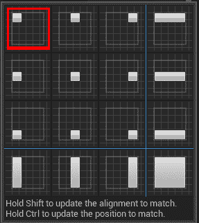

图 15.8 – 默认情况下，有选项将小部件锚定在屏幕上的不同位置

锚定允许小部件在**画布**面板内保持其期望的位置，无论屏幕大小如何变化。

现在，**文本小部件**已锚定到左上角，我们需要设置其相对于此锚点的相对位置，以便有偏移量以更好地定位和阅读文本。

1.  在`位置 X`和`位置 Y`中，将这两个参数都设置为`100.0f`。

1.  接下来，启用**大小到内容**参数，以便**文本小部件**将根据显示的文本大小自动调整大小，如图下所示：


图 15.9 – 大小到内容参数将确保文本小部件不会被截断

1.  最后，我们必须更新用于`48`的字体大小。

1.  最终的**文本小部件**将看起来像这样：

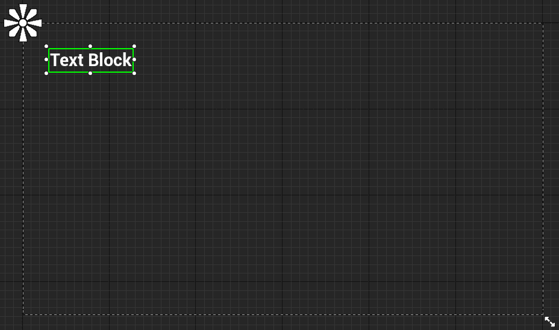

图 15.10 – 文本小部件现在锚定在画布面板的左上角

现在我们已经将**文本****小部件**定位和调整到所需的大小，让我们添加一个新的绑定到文本，以便它将自动更新并匹配玩家拥有的可收集物品数量。

1.  选择**文本**小部件后，在**详细信息**面板的**内容**类别下找到**文本**参数。在那里，您将找到**绑定**选项。

1.  *左键点击* `函数绑定`将自动创建并命名为`GetText_0`。请参考以下截图：


图 15.11 – 文本的新绑定功能

1.  将此函数重命名为`获取可收集物品数量`。

1.  在继续此函数之前，创建一个新的对象引用变量`Player`，其类型为`SuperSideScroller_Player`。将此变量设置为**公共**并启用其**实例可编辑**和**在生成时暴露**参数，如图下所示：


图 15.12 – 启用实例可编辑和生成时暴露参数的`Player`变量

通过将`Player`变量设置为**公共**并在生成时暴露，你将能够在创建小部件并将其添加到屏幕时分配此变量。我们将在*练习 15.05 – 将硬币计数器 UI 添加到玩家屏幕*中这样做。

现在我们有了对`SuperSideScroller_Player`的引用变量，让我们继续`获取可收集物品数量`绑定函数。

1.  将`Player`变量添加到`获取可收集物品数量`函数中。

1.  从这个变量中，*左键单击*并拖动，从上下文相关下拉菜单中，找到并选择`获取当前可收集物品数量`函数。请参考以下截图：

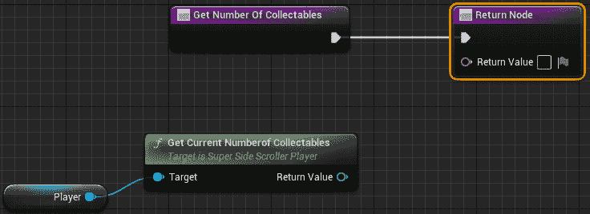

图 15.13 – 你在练习 15.03 中创建的获取当前可收集物品数量的函数

1.  接下来，*左键单击*并拖动`获取可收集物品数量`的`返回值`文本参数到`返回节点`。从上下文相关下拉菜单中，搜索并选择**格式文本**选项，如图所示：

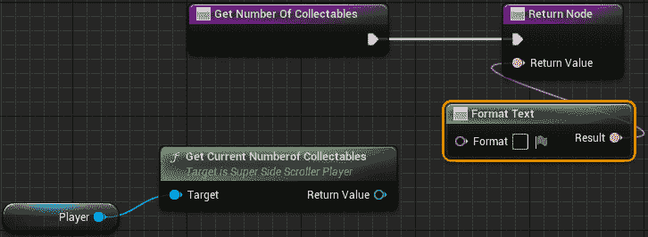

图 15.14 – 现在，我们可以创建自定义和格式化的文本

1.  在`格式文本`函数中，添加以下文本：

    ```cpp
    Coins: {coins}
    ```

请参考以下截图：

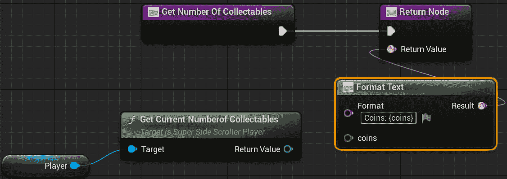

图 15.15 – 现在，格式化文本有一个新的输入参数

记住，使用`{}`符号表示一个文本参数，允许你将变量传递到文本中。

1.  最后，将`GetCurrentNumberofCollectables()`函数的`返回值`int 连接到`格式文本`函数的通配符`coins`输入引脚，如图所示：

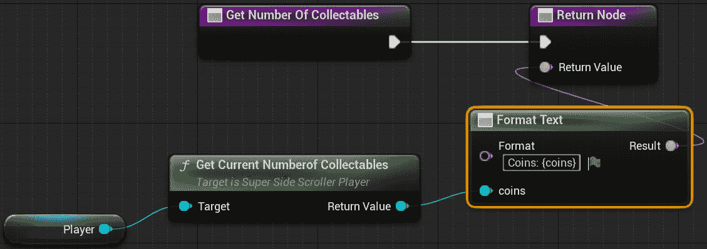

图 15.16 – 文本小部件将根据获取当前可收集物品数量的函数自动更新

1.  编译并保存`BP_UI_CoinCollection`小部件蓝图。

注意

你可以在此处找到此练习的资源和代码：[`packt.live/3eQJjTU`](https://packt.live/3eQJjTU)。

完成这个练习后，你已经创建了显示玩家收集到的当前金币数量的 `UI UMG` 小部件。通过使用 `GetCurrentNumberofCollectables()` C++ 函数和 **Text 小部件**的绑定功能，UI 将始终根据收集到的金币数量更新其值。在下一个练习中，我们将把这个 UI 添加到玩家的屏幕上，但首先，我们将简要了解如何向玩家屏幕添加和移除 UMG。

# 添加和创建 UMG 用户小部件

现在我们已经在 UMG 中创建了 **Coin Collection UI**，是时候学习如何分别将 UI 添加到和从玩家屏幕中移除了。通过将 **Coin Collection UI** 添加到玩家屏幕，UI 对玩家可见，并且可以在玩家收集金币时更新。

在 Blueprints 中，有一个名为 `Create Widget` 的函数，如下面的截图所示。如果没有分配类，它将被标记为 `Construct None`，但不要因此感到困惑：


图 15.17 – 默认情况下未应用类的 Create Widget 函数

此函数需要创建 `User` 小部件的类，并需要一个 `Player Controller`，该控制器将被引用为该 UI 的拥有玩家。然后，该函数返回生成的用户小部件作为其 `返回值`，然后你可以使用 `Add to Viewport` 函数将其添加到玩家的视图中。`Create Widget` 函数仅实例化小部件对象；它不会将此小部件添加到玩家的屏幕上。使此小部件在玩家屏幕上可见的是 `Add to Viewport` 函数：

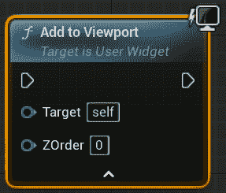

图 15.18 – 带有 ZOrder 的 Add to Viewport 函数

视口是覆盖你游戏世界视图的游戏屏幕，当多个 UI 元素需要相互重叠时，它使用所谓的 `ZOrder` 来确定重叠的深度。默认情况下，`Add to Viewport` 函数会将 `User` 小部件添加到屏幕上并使其填充整个屏幕——除非调用 `Set Desired Size In Viewport` 函数来手动设置它应该填充的大小：


图 15.19 – Size 参数确定传入 User 小部件的期望大小

在 C++ 中，你还有一个名为 `CreateWidget()` 的函数：

```cpp
template<typename WidgetT, typename OwnerT>
WidgetT * CreateWidget
(
  OwnerT * OwningObject,
  TSubclassOf < UUserWidget > UserWidgetClass,
  FName WidgetName
)
```

`CreateWidget()` 函数通过 `UserWidget` 类提供，该类位于 `/Engine/Source/Runtime/UMG/Public/Blueprint/UserWidget.h`。

有关示例，请参阅 *第八章*，*使用 UMG 创建用户界面*，其中你使用了 `CreateWidget()` 函数来创建 `BP_HUDWidget`：

```cpp
HUDWidget = CreateWidget<UHUDWidget>(this, BP_HUDWidget);
```

请参考*第八章*，*使用 UMG 创建用户界面*和*练习 8.06 – 创建健康条 C++逻辑*，以获取有关 C++中`CreateWidget()`函数的更多信息。

此函数几乎与其 Blueprint 对应函数相同，因为它接受`Owning Object`参数，类似于 Blueprint 函数的`Owning Player`参数，并且需要创建`User Widget`类。C++的`CreateWidget()`函数也接受一个`FName`参数来表示小部件的名称。

现在我们已经了解了用于向玩家屏幕添加 UI 的方法，让我们来测试一下这些知识。在接下来的练习中，你将实现`Create Widget`和`Add to Viewport` Blueprint 函数，以便我们可以将我们在*练习 15.04 – 创建硬币计数器 UI HUD 元素*中创建的**硬币收集 UI**添加到玩家屏幕。

## 练习 15.05 – 将硬币计数器 UI 添加到玩家屏幕

在这个练习中，你将创建一个新的`Player Controller`类，以便你可以使用玩家控制器将`BP_UI_CoinCollection`小部件 Blueprint 添加到玩家的屏幕上。从那里，你还将创建一个新的`Game Mode`类并将此游戏模式应用于**SuperSideScroller**项目。执行以下步骤以完成此练习：

1.  在 UE5 编辑器中，导航到**工具**然后**新建 C++类**。

1.  在**选择父类**对话框窗口中，找到并选择**Player Controller**选项。

1.  将新的`Player Controller`类命名为`SuperSideScroller_Controller`，然后点击`SuperSideScroller_Controller`类，但暂时我们仍将停留在 UE5 编辑器中。

1.  在`MainCharacter`文件夹目录中，创建一个名为`PlayerController`的新文件夹。

1.  在`PlayerController`文件夹中，*右键点击*并使用新的`SuperSideScroller_Controller`类创建一个新的`Blueprint Class`。请参考以下截图：

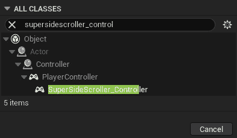

图 15.20 – 查找新的 SuperSideScroller_Controller 类以创建新的 Blueprint

1.  将这个新的 Blueprint 命名为`BP_SuperSideScroller_PC`，然后*双击左键*打开它。

要将`BP_UI_CoinCollection`小部件添加到屏幕，我们需要使用`Add to Viewport`函数和`Create Widget`函数。我们希望在玩家控制器已经`Possessed`玩家角色后，将 UI 添加到玩家的屏幕上。

1.  在 Blueprint 图中*右键点击*，从上下文相关菜单中找到**Event On Possess**选项，并*左键点击*将其添加到图中。请参考以下截图：


图 15.21 – Event On Possess

**事件 On Possess**事件节点返回**被控制者**。我们将使用这个**被控制者**将我们的 BP_UI_CoinCollection UI 小部件传递进去，但首先，我们需要**转换为 SuperSideScroller_Player**类。

1.  **左键单击**并拖动输出中的“事件 On Possess”节点。然后，搜索并找到“转换为 SuperSideScroller_Player”节点。请参考以下截图：


图 15.22 – 我们需要将类型转换为 SuperSideScroller_Player

1.  现在，**右键单击**并搜索“创建小部件”函数以将其添加到蓝图图中。

1.  从下拉类参数中找到并分配您在*练习 15.04 – 创建硬币计数器 UI HUD 元素*中创建的`BP_UI_CoinCollection`资产。请参考以下截图：


图 15.23 – 创建小部件函数

在将“类”参数更新为`BP_UI_CoinCollection`类后，您将注意到“创建小部件”函数将更新以显示您创建的`Player`变量，设置为`在生成时暴露`。

1.  在蓝图图中**右键单击**以从上下文相关下拉菜单中搜索并找到`Self`引用变量。将`Self`对象变量连接到“创建小部件”函数的“拥有玩家”参数，如图以下截图所示：

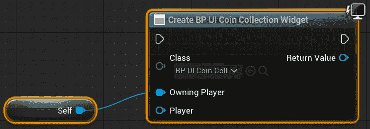

图 15.24 – 拥有玩家输入参数是玩家控制器类型

拥有玩家参数指的是将显示并拥有此 UI 对象的玩家控制器类型。由于我们将此 UI 添加到**SuperSideScroller_Controller**蓝图，我们可以直接使用**Self**引用变量将其传递到函数中。

1.  接下来，将`Cast`节点返回的`SuperSideScroller_Player`变量传递到“创建小部件”函数的“玩家”输入节点。然后，将`Cast`节点和“创建小部件”函数的执行引脚连接起来，如图以下截图所示：


图 15.25 – 创建 BP_UI_CoinCollection 小部件

注意

您可以在以下链接中找到前述截图的完整分辨率，以便更好地查看：[`github.com/PacktPublishing/Game-Development-Projects-with-Unreal-Engine/blob/master/Chapter15/Images/New_25.png`](https://github.com/PacktPublishing/Game-Development-Projects-with-Unreal-Engine/blob/master/Chapter15/Images/New_25.png)。

1.  在从“返回值”参数拖动“创建小部件”函数后，搜索并找到“添加到视口”函数，以便您可以在图中放置它。

1.  将`Create Widget`函数的输出`Return Value`参数连接到`Add to Viewport`函数的`Target`输入参数；不要更改`ZOrder`参数。

1.  最后，连接`Create Widget`和`Add to Viewport`函数的执行引脚，如图所示：


图 15.26 – 创建 BP_UI_CoinCollection 小部件后，我们可以将其添加到玩家视图中

注意

您可以在以下链接中找到前面截图的全分辨率版本，以便更好地查看：[`packt.live/2UwufBd`](https://packt.live/2UwufBd)。

现在玩家控制器已将`BP_UI_CoinCollection`小部件添加到玩家的视图中，我们需要创建一个`GameMode`蓝图，并将`BP_SuperSideScroller_MainCharacter`和`BP_SuperSideScroller_PC`类应用到这个游戏模式中。

1.  在`Content`文件夹中，选择`GameMode`。

1.  接下来，在`All Classes`下*右键单击*并选择`SuperSideScrollerGameMode`。

1.  将这个新的`GameMode`蓝图命名为`BP_SuperSideScroller_GameMode`。*双击左键*此资产以打开它。

`GameMode`蓝图包含一个类列表，您可以使用您独特的类来自定义。现在，我们只关心`Player Controller Class`和`Default Pawn Class`。

1.  点击在本练习中之前创建的`BP_SuperSideScroller_PC`蓝图。

1.  然后，点击`BP_SuperSideScroller_MainCharacter`蓝图。

现在我们有一个自定义的`GameMode`，它使用了我们自定义的`Player Controller`和`Player Character`类，让我们将这个游戏模式添加到`PIE`中，并在构建项目的过程中应用。

1.  从 UE5 编辑器中，导航到屏幕顶部的**Edit**选项。点击此选项，然后从下拉菜单中找到并选择**Project Settings**选项。

1.  在**Project Settings**窗口的左侧，您将获得一个分为几个部分的类别列表。在**Project**部分下，点击**Maps & Modes**类别。

1.  在**Maps & Modes**部分，您有一系列与您的项目默认地图和游戏模式相关的参数。在此部分的顶部，您有**Default GameMode**选项。点击此下拉菜单以找到并选择在本练习中之前创建的**SuperSideScroller_GameMode**蓝图。

注意

对`DefaultEngine.ini`文件所做的更改，该文件位于您的项目`Config`文件夹中。`Default GameMode`可以通过更新**GameMode Override**参数来按级别覆盖，该参数可在您级别的**World Settings**窗口中找到。

1.  关闭`PIE`并开始收集金币。观察每次收集金币时，**BP_UI_CoinCollection**小部件都会显示并更新，如图所示：

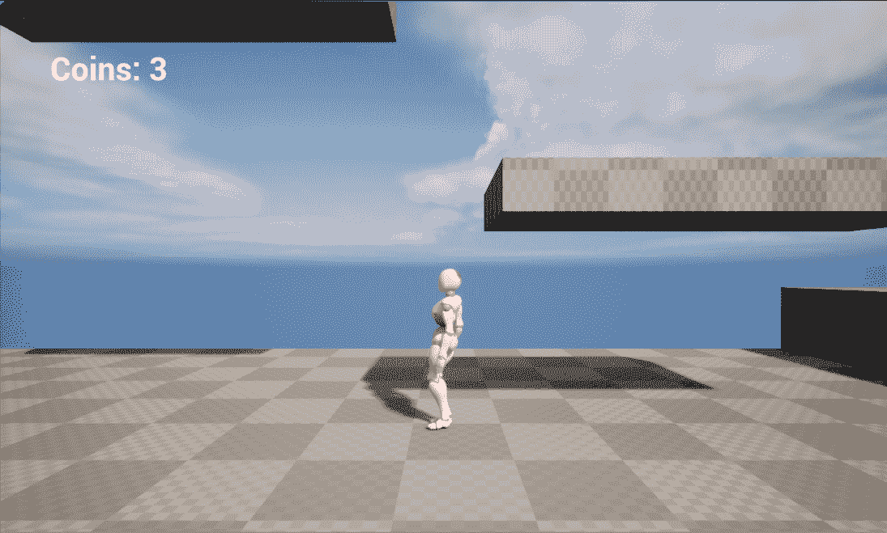

图 15.27 – 现在，你收集到的每一枚金币都会出现在玩家 UI 上

注意

你可以在这里找到这个练习的资源和代码：[`github.com/PacktPublishing/Game-Development-Projects-with-Unreal-Engine/tree/master/Chapter15/Exercise15.05`](https://github.com/PacktPublishing/Game-Development-Projects-with-Unreal-Engine/tree/master/Chapter15/Exercise15.05)。

通过完成这个练习，你已经创建了显示玩家收集到的当前金币数量的 `UI UMG` 小部件。通过使用 `GetCurrentNumberofCollectables()` C++ 函数和 **Text 小部件**的绑定功能，UI 将始终根据收集到的金币数量更新其值。

到目前为止，我们一直专注于可收集的硬币，允许玩家收集这些硬币并将收集到的总金币数添加到玩家的 UI 上。现在，我们将专注于药水增强效果，并在短时间内为玩家提供移动速度和跳跃高度的增加。要实现这个功能，我们首先需要研究计时器。

# 使用计时器

UE5 中的计时器允许你在延迟后或每 *X* 秒数后执行操作。在 **SuperSideScroller** 药水增强效果的情况下，计时器将在 8 秒后恢复玩家的移动和跳跃到默认状态。

注意

在蓝图（Blueprints）中，你可以使用 `Delay` 节点以及计时器句柄来实现相同的结果。然而，在 C++ 中，计时器是实现延迟和重复逻辑的最佳手段。

计时器由 `Timer Manager` 或 `FTimerManager` 管理，它存在于 `UWorld` 对象中。你将主要使用 `FTimerManager` 类中的两个函数，称为 `SetTimer()` 和 `ClearTimer()`：

```cpp
void SetTimer
(
    FTimerHandle & InOutHandle,
    TFunction < void )> && Callback,
    float InRate,
    bool InbLoop,
    float InFirstDelay
)
void ClearTimer(FTimerHandle& InHandle)
```

你可能已经注意到，在这两个函数中，都有一个必需的 `FTimerHandle`。这个句柄用于控制你设置的计时器。使用这个句柄，你可以暂停、恢复、清除，甚至扩展计时器。

`SetTimer()` 函数还有其他参数，可以帮助你在最初设置计时器时进行自定义。计时器完成后，回调函数将被调用，如果 `InbLoop` 参数为 `True`，则回调函数将无限期地继续调用，直到计时器被停止。`InRate` 参数是计时器本身的持续时间，而 `InFirstDelay` 是在计时器开始其 `InRate` 持续时间的计时之前应用的一个初始延迟。

`FTimerManager` 类的头文件可以在以下位置找到：`/Engine/Source/Runtime/Engine/Public/TimerManager.h`。

注意

你可以通过阅读以下文档了解更多关于计时器和 `FTimerHandle` 的信息：[`docs.unrealengine.com/4.27/en-US/ProgrammingAndScripting/ProgrammingWithCPP/UnrealArchitecture/Timers/`](https://docs.unrealengine.com/4.27/en-US/ProgrammingAndScripting/ProgrammingWithCPP/UnrealArchitecture/Timers/)。

在以下练习中，你将在`SuperSideScroller_Player`类中创建自己的`FTimerHandle`，并使用它来控制药水增强效果在玩家身上持续的时间。

## 练习 15.06 – 为玩家添加药水增强行为

在这个练习中，你将创建药水增强背后的逻辑以及它将如何影响玩家的角色。你将利用计时器和计时器句柄来确保增强效果只持续很短的时间。按照以下步骤完成此任务：

1.  在 Visual Studio 中，导航到并打开`SuperSideScroller_Player.h`头文件。

1.  在我们的`Private Access Modifier`下添加一个名为`PowerupHandle`的新变量，其类型为`FTimerHandle`：

    ```cpp
    FTimerHandle PowerupHandle;
    ```

此计时器句柄将负责跟踪自启动以来经过的时间。这将使我们能够控制药水增强效果持续的时间。

1.  接下来，在我们的`Private Access Modifier`下添加一个名为`bHasPowerupActive`的布尔变量：

    ```cpp
    bool bHasPowerupActive;
    ```

我们将使用这个布尔变量来更新`Sprint()`和`StopSprinting()`函数，以确保根据增强效果是否激活，适当地更新玩家的冲刺移动速度。

1.  接下来，在我们的`Public Access Modifier`下声明一个新的 void 函数，名为`IncreaseMovementPowerup()`：

    ```cpp
    void IncreaseMovementPowerup();
    ```

这是将从药水增强类中调用的函数，用于为玩家启用增强效果。

1.  最后，你需要创建一个处理增强效果结束的函数。在`Protected Access Modifier`下创建一个名为`EndPowerup()`的函数：

    ```cpp
    void EndPowerup();
    ```

在声明了所有必要的变量和函数后，是时候开始定义这些新函数并处理对玩家的影响的增强效果了。

1.  导航到`SuperSideScroller_Player.cpp`源文件。

1.  首先，将`#include “TimerManager.h”`头文件添加到源文件顶部；我们将需要这个类来使用计时器。

1.  通过将以下代码添加到源文件中定义`IncreaseMovementPowerup()`函数：

    ```cpp
    void ASuperSideScroller_Player::IncreaseMovementPowerup()
    {
    }
    ```

1.  当调用此函数时，我们首先需要做的是将`bHasPowerupActive`变量设置为`true`。将以下代码添加到`IncreaseMovementPowerup()`函数中：

    ```cpp
    bHasPowerupActive = true;
    ```

1.  接下来，添加以下代码以增加玩家角色移动组件的`MaxWalkSpeed`和`JumpZVelocity`组件：

    ```cpp
    GetCharacterMovement()->MaxWalkSpeed = 500.0f;
    GetCharacterMovement()->JumpZVelocity = 1500.0f;
    ```

在这里，我们将`MaxWalkSpeed`从默认值`300.0f`更改为`500.0f`。如您所知，默认的冲刺速度也是`500.0f`。我们将在本活动的稍后部分解决此问题，以在增强效果激活时提高冲刺速度。

1.  为了利用计时器，我们需要获取对`UWorld`对象的引用。添加以下代码：

    ```cpp
    UWorld* World = GetWorld();
    if (World)
    {
    }
    ```

正如我们在本项目中多次做的那样，我们使用`GetWorld()`函数获取对`UWorld`对象的引用，并将其保存在其变量中。

1.  现在我们已经获得了`World`对象的引用并进行了有效性检查，现在可以使用`TimerManager`来设置增强计时器。在上一步中显示的`if()`语句内添加以下代码：

    ```cpp
    World->GetTimerManager().SetTimer(PowerupHandle, this, 
      &ASuperSideScroller_Player::EndPowerup, 8.0f, false);
    ```

在这里，你正在使用`TimerManager`类来设置计时器。`SetTimer()`函数接受一个`FTimerHandle`组件来使用；在这种情况下，你创建的`PowerupHandle`变量。接下来，我们需要通过使用`this`关键字传递玩家类的引用。然后，我们需要提供计时器结束后要调用的回调函数，在这种情况下是`&ASuperSideScroller_Player::EndPowerup`函数。`8.0f`代表计时器的持续时间；你可以根据需要调整这个值，但现在 8 秒是合适的。最后，`SetTimer()`函数的最后一个布尔参数决定了这个计时器是否应该循环；在这种情况下，它不应该循环。

1.  为`EndPowerup()`函数创建函数定义：

    ```cpp
    void ASuperSideScroller_Player::EndPowerup()
    {
    }
    ```

1.  当调用`EndPowerup()`函数时，首先要做的事情是将`bHasPowerupActive`变量设置为`false`。在`EndPowerup()`函数内添加以下代码：

    ```cpp
    bHasPowerupActive = false;
    ```

1.  接下来，将角色移动组件的`MaxWalkSpeed`和`JumpZVelocity`参数改回它们的默认值。添加以下代码：

    ```cpp
    GetCharacterMovement()->MaxWalkSpeed = 300.0f;
    GetCharacterMovement()->JumpZVelocity = 1000.0f;
    ```

在这里，我们将角色移动组件的`MaxWalkSpeed`和`JumpZVelocity`参数更改为它们的默认值。

1.  再次，为了利用计时器和清除处理`PowerupHandle`的计时器，我们需要获取`UWorld`对象的引用。添加以下代码：

    ```cpp
    UWorld* World = GetWorld();
    if (World)
    {
    }
    ```

1.  最后，我们可以添加代码来清除计时器句柄的`PowerupHandle`：

    ```cpp
    World->GetTimerManager().ClearTimer(PowerupHandle);
    ```

通过使用`ClearTimer()`函数并传递`PowerupHandle`，我们确保这个计时器不再有效，并且将不再影响玩家。

现在我们已经创建了处理增强效果及其相关计时器的函数，我们需要更新`Sprint()`和`StopSprinting()`函数，以便它们在增强效果激活时也考虑玩家的速度。

1.  将`Sprint()`函数更新为以下内容：

    ```cpp
    void ASuperSideScroller_Player::Sprint()
    {
      if (!bIsSprinting)
      {
        bIsSprinting = true;
        if (bHasPowerupActive)
        {
          GetCharacterMovement()->MaxWalkSpeed = 900.0f;
        }
        else
        {
          GetCharacterMovement()->MaxWalkSpeed = 500.0f;
        }
      }
    }
    ```

在这里，我们将更新`Sprint()`函数，以考虑`bHasPowerupActive`是否为`true`。如果这个变量为`true`，则在奔跑时将`MaxWalkSpeed`从`500.0f`增加到`900.0f`，如下所示：

```cpp
if (bHasPowerupActive)
{
  GetCharacterMovement()->MaxWalkSpeed = 900.0f;
}
```

如果`bHasPowerupActive`为假，则将`MaxWalkSpeed`增加到`500.0f`，就像我们默认做的那样。

1.  将`StopSprinting()`函数更新为以下内容：

    ```cpp
    void ASuperSideScroller_Player::StopSprinting()
    {
      if (bIsSprinting)
      {
        bIsSprinting = false;
        if (bHasPowerupActive)
        {
          GetCharacterMovement()->MaxWalkSpeed = 500.0f;
        }
        else
        {
          GetCharacterMovement()->MaxWalkSpeed = 300.0f;
        }
      }
    }
    ```

在这里，我们将更新`StopSprinting()`函数，以考虑`bHasPowerupActive`是否为真。如果这个变量为真，则将`MaxWalkSpeed`值设置为`500.0f`而不是`300.0f`，如下所示：

```cpp
if (bHasPowerupActive)
{
  GetCharacterMovement()->MaxWalkSpeed = 500.0f;
}
```

如果`bHasPowerupActive`为假，则将`MaxWalkSpeed`设置为`300.0f`，就像我们默认做的那样。

1.  最后，我们只需要重新编译 C++代码。

注意

您可以在此处找到这个练习的资源和代码：[`github.com/PacktPublishing/Game-Development-Projects-with-Unreal-Engine/tree/master/Chapter15/Exercise15.06`](https://github.com/PacktPublishing/Game-Development-Projects-with-Unreal-Engine/tree/master/Chapter15/Exercise15.06)。

完成这个练习后，您已经在玩家角色中创建了药水增强效果。这个增强效果提高了玩家的默认移动速度和跳跃高度。此外，增强效果还增加了冲刺速度。通过使用计时器句柄，您能够控制增强效果持续的时间。

现在，是时候创建药水增强角色，以便我们在游戏中有一个药水增强的表示。

## 活动 15.03 – 创建药水增强角色

现在，`SuperSideScroller_Player`类处理药水增强效果，是时候创建药水增强类和蓝图了。这个活动旨在创建药水增强类，从`PickableActor_Base`类继承，实现重叠功能以授予您在*练习 15.06 – 将药水增强行为添加到玩家*中实现的运动效果，并创建药水增强的蓝图角色。按照以下步骤创建药水增强类并创建药水蓝图角色：

1.  创建一个新的 C++类，从`PickableActor_Base`类继承，并将这个新类命名为`PickableActor_Powerup`。

1.  为`BeginPlay()`和`PlayerPickedUp()`函数添加覆盖函数声明。

1.  为`BeginPlay()`函数创建函数定义。在`BeginPlay()`函数中，添加对父类`BeginPlay()`函数的调用。

1.  为`PlayerPickedUp()`函数创建函数定义。在`PlayerPickedUp()`函数中，添加对父类`PlayerPickedUp()`函数的调用。

1.  接下来，添加必要的`#include`文件以引用`SuperSideScroller_Player`类，以便我们可以引用玩家类及其函数。

1.  在`PlayerPickedUp()`函数中，使用函数本身的`Player`输入参数来调用`IncreaseMovementPowerup()`函数。

1.  从**Epic Games Launcher**中，在**UE Legacy Samples**类别下的**Samples**标签中找到**Action RPG**项目。使用这个项目创建并安装一个新的项目。

1.  将`A_Character_Heal_Mana_Cue`和`SM_PotionBottle`资源，以及所有引用的资源，从**Action RPG**项目迁移到您的**SuperSideScroller**项目。

1.  在`PickableItems`目录下创建一个名为`Powerup`的新文件夹。在这个目录中基于`PickableActor_Powerup`类创建一个新的蓝图，并将这个资源命名为`BP_Powerup`。

1.  在`BP_Powerup`中，更新`MeshComp`组件，使其使用`SM_PotionBottle`静态网格。

1.  接下来，添加`A_Character_Heal_Mana_Cue`，您将其作为`Pickup Sound`参数导入。

1.  最后，更新 `RotationComp` 组件，使演员每秒围绕 `Pitch` 轴（`Y` 轴）旋转 60 度，并围绕 `Yaw` 轴（`X` 轴）旋转 180 度。

1.  将 `BP_Powerup` 添加到你的关卡中，并使用 `PIE` 观察与增强效果重叠时的结果。

预期输出：

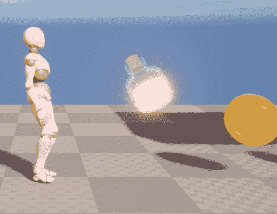

图 15.28 – 药水增强效果

注意

这个活动的解决方案可以在 [`github.com/PacktPublishing/Elevating-Game-Experiences-with-Unreal-Engine-5-Second-Edition/tree/main/Activity%20solutions`](https://github.com/PacktPublishing/Elevating-Game-Experiences-with-Unreal-Engine-5-Second-Edition/tree/main/Activity%20solutions) 找到。

通过完成这个活动，你能够测试你的知识，创建一个新的从 `PickableActor_Base` 类继承并重写 `PlayerPickedUp()` 函数的 C++ 类，以添加自定义逻辑。通过从玩家类中调用 `IncreaseMovementPowerup()` 函数，你能够在与演员重叠时为玩家添加移动增强效果。然后，通过使用自定义网格、材质和音频资源，你能够将 `PickableActor_Powerup` 类的蓝图演员激活。

现在我们已经创建了金币收集物和药水增强效果，我们需要将一个新的游戏功能实现到项目中：`Brick` 类。在像 *超级马里奥* 这样的游戏中，砖块包含玩家可以找到的隐藏金币和增强效果。这些砖块还作为到达关卡中升高平台和区域的一种方式。在我们的 `Brick` 类中，将包含玩家可以收集的隐藏金币，并作为玩家通过使用砖块作为路径来访问难以到达的位置的一种方式。因此，在下一节中，我们将创建 `Brick` 类，需要打破这个类来找到隐藏的金币。

## 练习 15.07 – 创建砖块类

现在我们已经创建了金币收集物和药水增强效果，是时候创建 `Brick` 类了，这个类将包含玩家可以收集的隐藏金币。砖块是 `Brick` 类的最终游戏元素，它将被用作 `Brick` 类及其蓝图的平台机制的一部分：

1.  在 UE5 编辑器中，导航到 **工具** 然后选择 **新建 C++ 类**。

1.  来自 `Actor` 类。

1.  将这个类命名为 `SuperSideScroller_Brick` 并点击 **创建类**。Visual Studio 和 Unreal Engine 将重新编译代码并为你打开这个类。

默认情况下，`SuperSideScroller_Brick` 类自带了 `Tick()` 函数，但我们在 `Brick` 类中不需要这个函数。在继续之前，从 `SuperSideScroller_Brick.h` 头文件中移除 `Tick()` 函数的声明，并从 `SuperSideScroller_Brick.cpp` 源文件中移除函数的定义。

1.  在`SuperSideScroller_Brick.h`文件的`Private Access Modifier`下，添加以下代码来声明一个新的`UStaticMeshComponent* UPROPERTY()`函数，以在我们的游戏世界中表示砖块：

    ```cpp
    UPROPERTY(VisibleDefaultsOnly, Category = Brick)
    class UStaticMeshComponent* BrickMesh;
    ```

1.  接下来，我们需要创建一个`UBoxComponent UPROPERTY()`来处理与玩家角色的碰撞。将以下代码添加到我们的`Private Access Modifier`下以添加此组件：

    ```cpp
    UPROPERTY(VisibleDefaultsOnly, Category = Brick)
    class UBoxComponent* BrickCollision;
    ```

1.  在我们的`Private Access Modifier`下创建一个`UFUNCTION()`声明，用于`OnHit()`函数。这将用于确定当`UBoxComponent`被玩家击中时：

    ```cpp
    UFUNCTION()
    void OnHit(UPrimitiveComponent* HitComp, AActor* OtherActor, 
      UPrimitiveComponent* OtherComp, FVector 
      NormalImpulse, 
      const FHitResult& Hit);
    ```

注意

记得你在开发`PlayerProjectile`类时使用了`OnHit()`函数，这是在*第十三章*，*创建和添加敌人人工智能*，为此项目。请查阅该章节以获取有关`OnHit()`函数的更多信息。

1.  接下来，使用`EditAnywhere`关键字在我们的`Private Access Modifier`下创建一个新的布尔变量`UPROPERTY()`，命名为`bHasCollectable`：

    ```cpp
    UPROPERTY(EditAnywhere)
    bool bHasCollectable;
    ```

这个布尔值将确定砖块是否包含玩家可以收集的硬币。

1.  现在，我们需要一个变量来保存这个砖块内可供玩家收集的硬币收集品的数量。我们将通过创建一个名为`Collectable Value`的整型变量来实现这一点。将其设置为`UPROPERTY()`，在`Private Access Modifier`下，使用`EditAnywhere`关键字，并给它一个默认值`1`，如下所示：

    ```cpp
    UPROPERTY(EditAnywhere)
    int32 CollectableValue = 1;
    ```

砖块需要包含独特的声音和粒子系统，以便在玩家摧毁砖块时有一个漂亮的光泽层。我们将接下来添加这些属性。

1.  在`SuperSideScroller_Brick.h`头文件中创建一个新的`Public Access Modifier`。

1.  接下来，创建一个新的`UPROPERTY()`，使用`EditAnywhere`和`BlueprintReadOnly`关键字，用于`USoundBase`类的变量。将此变量命名为`HitSound`，如下所示：

    ```cpp
    UPROPERTY(EditAnywhere, BlueprintReadOnly, Category = Brick)
    class USoundBase* HitSound;
    ```

1.  然后，创建一个新的`UPROPERTY()`，使用`EditAnywhere`和`BlueprintReadOnly`关键字，用于`UParticleSystem`类的变量。确保将其放在`Public Access Modifier`下，并将其命名为`Explosion`，如下所示：

    ```cpp
    UPROPERTY(EditAnywhere, BlueprintReadOnly, Category = Brick)
    class UParticleSystem* Explosion;
    ```

现在我们已经为`Brick`类添加了所有必要的属性，让我们继续到`SuperSideScroller_Brick.cpp`源文件，我们将在这里初始化组件。

1.  让我们先添加以下`#include`目录，用于`StaticMeshComponent`和`BoxComponent`。将以下代码添加到源文件的`#include`列表中：

    ```cpp
    #include "Components/StaticMeshComponent.h"
    #include "Components/BoxComponent.h"
    ```

1.  首先，通过在`ASuperSideScroller_Brick::ASuperSideScroller_Brick()`构造函数中添加以下代码来初始化`BrickMesh`组件：

    ```cpp
    BrickMesh = CreateDefaultSubobject<UStaticMeshComponent>(TEXT("BrickMesh"));
    ```

1.  接下来，`BrickMesh`组件应该有一个碰撞，以便玩家可以在平台上行走。为了确保默认情况下发生这种情况，添加以下代码将碰撞设置为`“BlockAll”`：

    ```cpp
    BrickMesh->SetCollisionProfileName("BlockAll");
    ```

1.  最后，`BrickMesh`组件将作为`Brick`角色的根组件。添加以下代码来完成此操作：

    ```cpp
    RootComponent = BrickMesh;
    ```

1.  现在，将以下代码添加到构造函数中以初始化我们的`BrickCollision UBoxComponent`：

    ```cpp
    BrickCollision = CreateDefaultSubobject<UBoxComponent>
      (TEXT("BrickCollision"));
    ```

1.  就像`BrickMesh`组件一样，`BrickCollision`组件也需要将其碰撞设置为`“BlockAll”`以接收我们将在本练习中稍后添加的`OnHit()`回调事件。添加以下代码：

    ```cpp
    BrickCollision->SetCollisionProfileName("BlockAll");
    ```

1.  接下来，需要将`BrickCollision`组件附加到`BrickMesh`组件上。我们可以通过添加以下代码来完成此操作：

    ```cpp
    BrickCollision->AttachToComponent(RootComponent, 
      FAttachmentTransformRules::KeepWorldTransform);
    ```

1.  在我们完成`BrickCollision`组件的初始化之前，我们需要添加`OnHit()`函数的定义。将以下定义添加到源文件中：

    ```cpp
    void ASuperSideScroller_Brick::OnHit(UPrimitiveComponent* HitComp, AActor* 
      OtherActor, UPrimitiveComponent* OtherComp, FVector 
      NormalImpulse, const 
      FHitResult& Hit)
    {
    }
    ```

1.  现在我们已经定义了`OnHit()`函数，我们可以将`OnComponentHit`回调分配给`BrickCollision`组件。将以下代码添加到构造函数中：

    ```cpp
    BrickCollision->OnComponentHit.AddDynamic(this, 
      &ASuperSideScroller_Brick::OnHit);
    ```

1.  编译`SuperSideScroller_Brick`类的 C++代码，并返回到 UE5 编辑器。

1.  在`Content`文件夹中，选择`Brick`。

1.  在`Brick`文件夹内*右键单击*并选择`Blueprint Class`。在`SuperSideScroller_Brick`类中的`All Classes`搜索栏中。

1.  将这个新的蓝图命名为`BP_Brick`，然后*双击左键*资产以打开它。

1.  从`Static Mesh`参数选择`BrickMesh`组件到`Shape_Cube`网格。

1.  在仍然选择`BrickMesh`组件的情况下，将`Element 0`材质参数设置为`M_Brick_Clay_Beveled`。这个材质是 Epic Games 在创建新项目时默认提供的。它可以在`StarterContent`目录下的**内容抽屉**区域找到。

我们需要用`BrickMesh`组件做的最后一件事是调整其比例，使其符合玩家角色的需求，以及**SuperSideScroller**游戏项目的平台跳跃机制。

1.  在选择`BrickMesh`组件的情况下，对其`Scale`参数进行以下更改：

    ```cpp
    (X=0.750000,Y=0.750000,Z=0.750000)
    ```

现在，`BrickMesh`组件的大小是正常大小的`75%`，当我们将演员放置到游戏世界中，以及当我们在这个关卡内开发有趣的平台跳跃部分时，`Brick`演员对我们设计师来说将更容易管理。

此处的最后一步是更新`BrickCollision`组件的位置，使其只有部分碰撞从`BrickMesh`组件的底部突出。

1.  从`Location`参数选择`BrickCollision`组件到以下值：

    ```cpp
    (X=0.000000,Y=0.000000,Z=30.000000)
    ```

`BrickCollision`组件现在应定位如下：

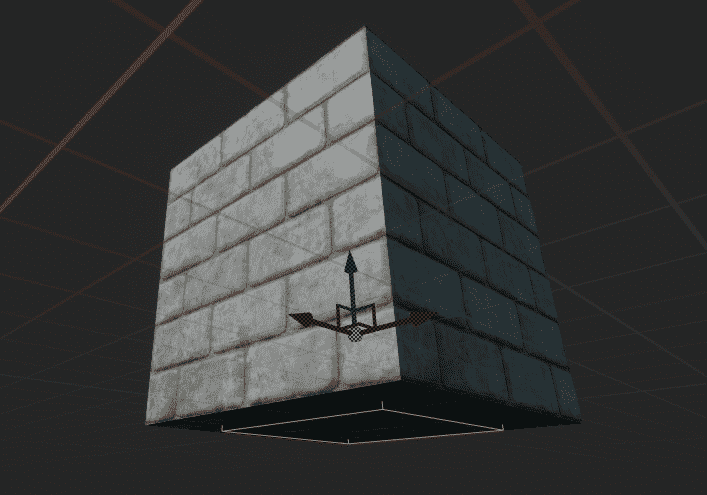

图 15.29 – 现在，BrickCollision 组件刚刚超出 BrickMesh 组件之外

我们对`BrickCollision`组件的位置进行了调整，以便玩家只能在跳到砖块下方时击中`UBoxComponent`。通过将其稍微放在`BrickMesh`组件的外面，我们可以更好地控制它，并确保这个组件不会被玩家以其他方式击中。

注意

你可以在这里找到这个练习的资源和代码：[`github.com/PacktPublishing/Game-Development-Projects-with-Unreal-Engine/tree/master/Chapter15/Exercise15.07`](https://github.com/PacktPublishing/Game-Development-Projects-with-Unreal-Engine/tree/master/Chapter15/Exercise15.07)。

通过完成这个练习，你能够创建`SuperSideScroller_Brick`类的基框架，并将蓝图演员组合起来以在游戏世界中代表砖块。通过添加立方网格和砖块材质，你为砖块增添了美观的视觉效果。在接下来的练习中，你将为砖块添加剩余的 C++逻辑。这将允许玩家摧毁砖块并获得可收集物品。

## 练习 15.08 – 添加砖块类的 C++逻辑

在之前的练习中，你通过添加必要的组件并创建`BP_Brick`蓝图演员来为`SuperSideScroller_Brick`类创建基框架。在这个练习中，你将在*练习 15.07 – 创建砖块类*的 C++代码基础上添加逻辑，以赋予`Brick`类功能。这将允许砖块为玩家提供金币收集物品。按照以下步骤完成此任务：

1.  首先，我们需要创建一个函数，将收集物品添加到玩家。在`SuperSideScroller_Brick.h`头文件中，在`Private Access Modifier`下添加以下函数声明：

    ```cpp
    void AddCollectable(class ASuperSideScroller_Player* Player);
    ```

我们希望传递`SuperSideScroller_Player`类的引用，以便我们可以从该类中调用`IncrementNumberofCollectables()`函数。

1.  接下来，在`Private Access Modifier`下创建一个名为`PlayHitSound()`的 void 函数声明：

    ```cpp
    void PlayHitSound();
    ```

`PlayHitSound()`函数将负责生成你在*练习 15.07 – 创建砖块类*中创建的`HitSound`属性。

1.  最后，在`Private Access Modifier`下创建另一个名为`PlayHitExplosion()`的 void 函数声明：

    ```cpp
    void PlayHitExplosion();
    ```

`PlayHitExplosion()`函数将负责生成你在*练习 15.07 – 创建砖块类*中创建的`Explosion`属性。

在头文件中声明了`SuperSideScroller_Brick`类所需的剩余函数后，让我们继续在源文件中定义这些函数。

1.  在`SuperSideScroller_Brick.cpp`源文件顶部，将以下`#include`语句添加到已存在的此类的`#include`目录列表中：

    ```cpp
    #include "Engine/World.h"
    #include "Kismet/GameplayStatics.h"
    #include "SuperSideScroller_Player.h"
    ```

包含 `World` 和 `GameplayStatics` 类对于生成砖块的 `HitSound` 和 `Explosion` 效果是必要的。包含 `SuperSideScroller_Player` 类是为了调用 `IncrementNumberofCollectables()` 类函数。

1.  让我们从 `AddCollectable()` 函数的定义开始。添加以下代码：

    ```cpp
    void ASuperSideScroller_Brick::AddCollectable(class 
      ASuperSideScroller_Player* Player)
    {
    }
    ```

1.  现在，通过使用 `Player` 函数输入参数来调用 `IncrementNumberofCollectables()` 函数：

    ```cpp
    Player->IncrementNumberofCollectables(CollectableValue);
    ```

1.  对于 `PlayHitSound()` 函数，你需要在调用 `UGameplayStatics` 类中的 `SpawnSoundAtLocation` 函数之前，获取 `UWorld*` 对象的引用并验证 `HitSound` 属性是否有效。这是一个你多次执行过的过程，所以这是整个函数代码：

    ```cpp
    void ASuperSideScroller_Brick::PlayHitSound()
    {
      UWorld* World = GetWorld();
      if (World && HitSound)
      {
          UGameplayStatics::SpawnSoundAtLocation(World, 
          HitSound, 
            GetActorLocation());
      }
    }
    ```

1.  就像 `PlayHitSound()` 函数一样，`PlayHitExplosion()` 函数将以几乎相同的方式工作，并且在这个项目中你已经多次执行过这个过程。添加以下代码以创建函数定义：

    ```cpp
    void ASuperSideScroller_Brick::PlayHitExplosion()
    {
      UWorld* World = GetWorld();
      if (World && Explosion)
      {
          UGameplayStatics::SpawnEmitterAtLocation(World, 
          Explosion, 
            GetActorTransform());
      }
    }
    ```

定义了这些函数后，让我们更新 `OnHit()` 函数，以便如果玩家击中了 `BrickCollision` 组件，我们可以生成 `HitSound` 和 `Explosion`，并给玩家添加一个硬币可收集物品。

1.  首先，在 `OnHit()` 函数中，创建一个名为 `Player` 的新变量，其类型为 `ASuperSideScroller_Player`，等于函数输入参数 `OtherActor` 的 `Cast`，如下所示：

    ```cpp
    ASuperSideScroller_Player* Player = 
      Cast<ASuperSideScroller_Player>(OtherActor);
    ```

1.  接下来，我们只想在 `Player` 有效且 `bHasCollectable` 为 `True` 的情况下继续此函数。添加以下 `if()` 语句：

    ```cpp
    if (Player && bHasCollectable)
    {
    }
    ```

1.  如果 `if()` 语句中的条件得到满足，那就是我们需要调用 `AddCollectable()`、`PlayHitSound()` 和 `PlayHitExplosion()` 函数的时候。确保在 `AddCollectable()` 函数中也传递 `Player` 变量：

    ```cpp
    AddCollectable(Player);
    PlayHitSound();
    PlayHitExplosion();
    ```

1.  最后，在 `if()` 语句中添加销毁砖块的函数调用：

    ```cpp
    Destroy();
    ```

1.  将 `OnHit()` 函数定义为我们需要的样子后，重新编译 C++ 代码，但不要立即返回到 UE5 编辑器。

1.  对于砖块爆炸的 VFX 和 SFX，我们需要从 **Epic Games Launcher** 提供的两个独立项目中迁移资产：**Blueprints** 项目和 **Content Examples** 项目。

1.  使用你从之前的练习中获得的知识，使用 Unreal Engine 版本 4.24 下载并安装这些项目。这两个项目分别可以在 **Samples** 选项卡中的 **UE Legacy Samples** 和 **UE Feature Samples** 类别中找到。

1.  安装完成后，在 **Content Drawer** 区域打开 `P_Pixel_Explosion` 资产。

1.  右键单击此资产，选择 **Asset Actions**，然后选择 **Migrate**。将此资产及其所有引用的资产迁移到你的 **SuperSideScroller** 项目中。

1.  一旦成功迁移了这些资产，请关闭 `Blueprints` 项目。

1.  从 `Blueprints` 项目中，找到 `Blueprints_TextPop01` 资产。

1.  右键点击此资产，然后选择**资产操作**，接着选择**迁移**。将此资产及其所有引用的资产迁移到你的**SuperSideScroller**项目中。

将这些资产迁移到你的项目中后，返回你的**SuperSideScroller**项目的 Unreal Engine 5 编辑器。

1.  导航到`BP_Brick`资产中的`Brick`文件夹以打开它。

1.  在你导入的`Blueprints_TextPop01`声音波形的`HitSound`参数中。

1.  接下来，将你导入到`Explosion`参数中的`P_Pixel_Explosion`粒子添加进去。

1.  重新编译`BP_Brick`蓝图，并将两个这样的演员添加到你的关卡中。

1.  将其中一个砖块设置为`bHasCollectable`参数为`True`；将另一个设置为`False`。请参考以下截图：


图 15.30 – 此砖块演员被设置为具有可收集的生成

1.  使用`PIE`，观察当你尝试用角色的头部跳跃击中砖块的底部时，两个砖块演员之间的行为差异，如图所示：


图 15.31 – 现在，玩家可以击中砖块，它将被摧毁

当`bHasCollectable`为`True`时，`SuperSideScroller_Brick`将播放我们的`HitSound`，生成`Explosion`粒子系统，向玩家添加一个可收集的硬币，并将其摧毁。

注意

你可以在这里找到本练习的资源和代码：[`github.com/PacktPublishing/Game-Development-Projects-with-Unreal-Engine/tree/master/Chapter15/Exercise15.08`](https://github.com/PacktPublishing/Game-Development-Projects-with-Unreal-Engine/tree/master/Chapter15/Exercise15.08)。

通过完成这个练习，你现在已经完成了`SuperSideScroller_Brick`类的游戏机制开发，它可以用于游戏中的平台游戏和硬币收集机制。

现在砖块可以被摧毁，隐藏的硬币可以被收集，我们为**SuperSideScroller**游戏项目设定的所有游戏元素都已完整。

# 摘要

在本章中，你将你的知识应用于测试，以创建**SuperSideScroller**游戏项目的剩余游戏机制。通过结合 C++和蓝图，你开发了药水升级和玩家在关卡中可以收集的硬币。此外，通过使用你在*第十四章*中学到的知识，*生成玩家投射物*，你为这些可收集物品添加了独特的音频和视觉资产，为游戏增添了一层漂亮的润色。

你学习了并利用了 UE5 中的 UMG UI 系统来创建一个简单而有效的 UI 反馈系统，显示玩家收集到的硬币数量。通过使用`Brick`类的绑定功能，结合你在**SuperSideScroller**项目中学到的知识来隐藏硬币，以便玩家可以收集和找到它们。

使用`Animation State Machine`来处理玩家角色的跳跃和移动状态。然后，我们学习了如何使用角色移动组件来控制玩家的移动和跳跃高度。

在*第十二章*，“动画混合和蒙太奇”，我们通过使用`Layered Blend per Bone`功能和`Saved Cached Poses`在`Animation Blueprints`中学习了更多关于动画混合的知识。通过为玩家角色投掷动画的上半身动画添加一个新的`AnimSlot`，我们能够使玩家移动动画和投掷动画平滑地混合在一起。在*第十三章*，“创建和添加敌人人工智能”，我们使用了行为树和黑板的强大系统来开发敌人的 AI 行为。我们创建了一个`Task`，允许敌人 AI 在自定义蓝图（我们同样开发）中移动，该蓝图用于确定 AI 的巡逻点。

在*第十四章*，“生成玩家投射物”，我们学习了如何创建一个`Anim Notify`以及如何在玩家的`Animation Montage`中实现这个通知，以便在玩家角色投掷时生成玩家投射物。然后，我们学习了如何创建投射物以及如何使用**投射物移动组件**使玩家投射物在游戏世界中移动。

最后，在本章中，我们学习了如何使用`UMG`工具集创建用于收集硬币的 UI，以及如何操作我们的`Brick`类，该类可以用来隐藏硬币供玩家寻找和收集。

在下一章中，你将学习关于多玩家、服务器-客户端架构以及 UE5 中用于多玩家的游戏框架类的基础知识。你将使用这些知识来扩展 UE5 中的多玩家 FPS 项目。

这份总结仅仅只是触及了我们**SuperSideScroller**项目中学习和取得的成就的表面。在你继续前进之前，这里有一些挑战供你测试你的知识并扩展这个项目：

# 额外挑战

通过向 SuperSideScroller 项目中添加以下功能来测试你从本节学到的知识。

1.  添加一个新的增益，降低施加给玩家角色的重力。导入自定义网格和音频资源，使这个增益与制作的药水增益有独特的视觉效果。

1.  当玩家角色收集到 10 个硬币时，授予玩家一个增益。

1.  实现当玩家与 AI 重叠时可以摧毁玩家的功能。包括当这种情况发生时能够重新生成玩家。

1.  添加另一个增强道具，使玩家获得免疫力，这样当他们与敌人重叠时就不会被摧毁。（实际上，当使用这个增强道具与敌人重叠时，它可能会摧毁敌人。）

1.  使用为**SuperSideScroller**项目开发的全部游戏元素，创建一个新关卡，利用这些元素制作一个有趣的平台竞技场进行游戏。

1.  添加多个具有有趣巡逻点的敌人，当玩家在区域中导航时挑战他们。

1.  将增强道具放置在难以到达的区域，这样玩家就需要提高他们的平台跳跃技能来获取它们。

1.  为玩家创建危险的陷阱，让他们在地图上穿越，并添加如果玩家掉落地图就会摧毁他们的功能。
