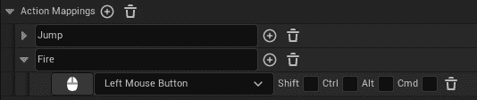
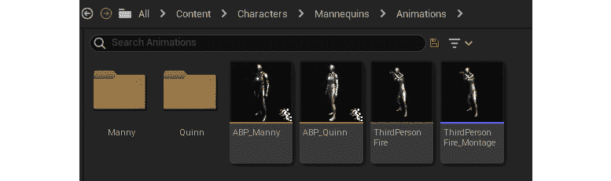
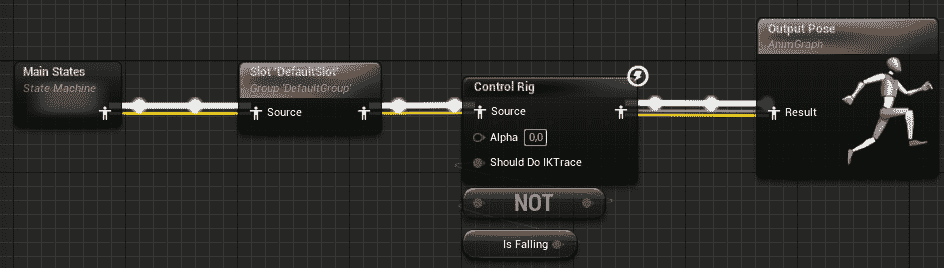
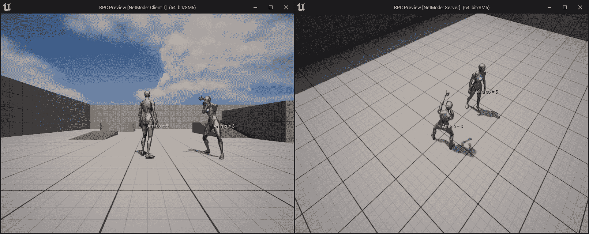
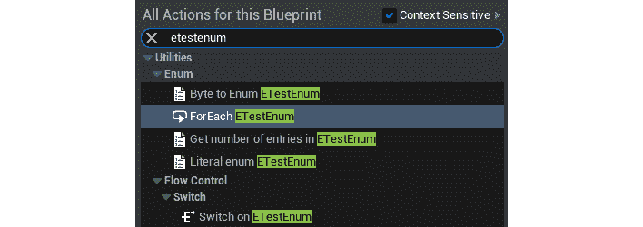
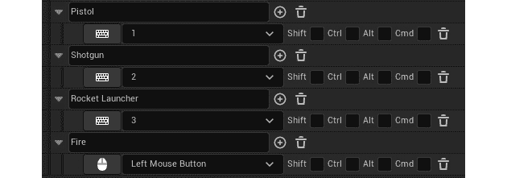
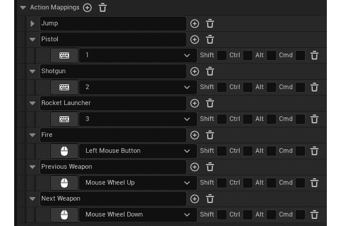
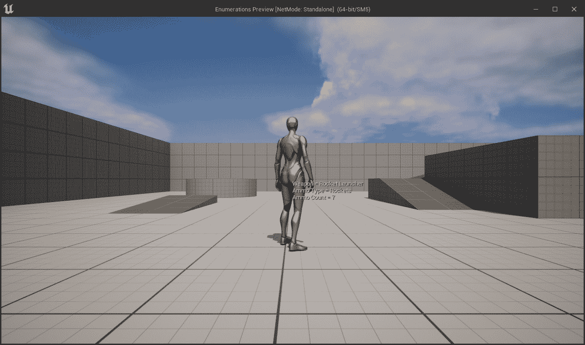
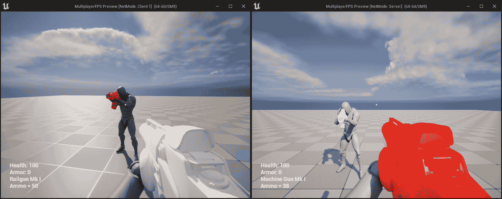

# 第十七章：使用远程过程调用

在上一章中，我们介绍了一些关键的多人游戏概念，包括服务器-客户端架构、连接和所有权、角色以及变量复制。我们还学习了如何创建 2D 混合空间，并使用`Transform (Modify) Bone`节点在运行时修改骨骼。我们利用这些知识创建了一个基本的单人第一人称射击角色，该角色可以行走、跳跃和四处张望。

本章，我们将介绍**远程过程调用**（**RPCs**），这是另一个重要的多人游戏概念，允许服务器在客户端上执行函数，反之亦然。到目前为止，我们已经了解了变量复制作为服务器和客户端之间通信的一种形式。然而，为了进行适当的通信，这还不够。这是因为服务器可能需要在客户端上执行特定的逻辑，而不涉及更新变量的值。客户端也需要一种方式来告诉服务器其意图，以便服务器可以验证该操作并让其他客户端知道。这将确保所有连接的客户端之间的多人游戏世界保持同步。我们还将介绍如何使用枚举并将它们暴露给编辑器，以及数组索引包装，这允许你在两个方向上迭代数组，并在超出其限制时循环。

本章，我们将涵盖以下主要内容：

+   理解远程过程调用

+   将枚举暴露给编辑器

+   使用数组索引包装

到本章结束时，你将了解 RPC 是如何工作，使服务器和客户端在彼此上执行逻辑。你还将能够将枚举暴露给编辑器，并使用数组索引包装在两个方向上循环遍历数组。

# 技术要求

对于本章，你需要以下技术要求：

+   Unreal Engine 5 已安装

+   Visual Studio 2019 已安装

本章的项目可以在本书代码包的`Chapter17`文件夹中找到，该代码包可以在此处下载：[`github.com/PacktPublishing/Elevating-Game-Experiences-with-Unreal-Engine-5-Second-Edition`](https://github.com/PacktPublishing/Elevating-Game-Experiences-with-Unreal-Engine-5-Second-Edition)。

在下一节中，我们将探讨 RPCs。

# 理解远程过程调用

我们在*第十六章*“开始学习多人游戏基础”中介绍了变量复制，虽然这是一个非常有用的功能，但在允许在远程游戏实例（客户端到服务器或服务器到客户端）中执行自定义代码方面还是有点局限，主要有以下两个原因：

+   第一个原因是变量复制严格是一种服务器到客户端的通信形式，因此客户端无法通过更改变量的值来使用变量复制告诉服务器执行一些自定义逻辑。

+   第二个原因是，如名称所示，变量复制是由变量的值驱动的，因此即使变量复制允许客户端到服务器的通信，它也会要求你更改客户端上的变量值，以在服务器上触发一个`RepNotify`函数来运行自定义逻辑，这并不太实用。

为了解决这个问题，Unreal Engine 支持 RPCs，它们的工作方式与正常函数一样，可以定义和调用。然而，它们不会在本地执行，而是在远程游戏实例上执行，而不依赖于变量。要使用 RPCs，请确保你在具有有效连接和开启复制的 actor 中定义它们。

有三种类型的 RPC，每种都服务于不同的目的：

+   服务器 RPC

+   Multicast RPC

+   客户端 RPC

让我们详细看看这三种类型，并解释何时使用它们。

## 服务器 RPC

每次你想让服务器在定义了 RPC 的 actor 上运行一个函数时，你都会使用服务器 RPC。你想要这样做有两个主要原因：

+   第一个原因是安全性。在制作多人游戏，尤其是竞争性游戏时，你总是必须假设客户端会尝试作弊。确保没有作弊的方法是强制客户端通过服务器执行对游戏玩法至关重要的函数。

+   第二个原因是同步性。由于关键的游戏逻辑仅在服务器上执行，重要的变量只会在那里更改，这将自动触发变量复制逻辑，在它们更改时更新客户端。

例如，当客户端的角色试图开火时，由于客户端可能尝试作弊的可能性始终存在，你不能只是本地执行开火逻辑。正确的方法是让客户端调用一个服务器 RPC，告诉服务器通过确保角色有足够的弹药、装备了武器等来验证`Fire`动作。如果一切检查无误，那么它将扣除弹药变量，最后，它将执行一个 Multicast RPC（稍后介绍），告诉所有客户端在该角色上播放开火动画。

### 宣告

要声明服务器 RPC，你可以在`UFUNCTION`宏上使用`Server`指定符。看看以下示例：

```cpp
UFUNCTION(Server, Reliable, WithValidation)
void ServerRPCFunction(int32 IntegerParameter, float FloatParameter, AActor* ActorParameter); 
```

在前面的代码片段中，`Server`指定符用于`UFUNCTION`宏，以表明该函数是一个服务器 RPC。你可以在服务器 RPC 上设置参数，就像正常函数一样，但有一些将在本主题的后面解释的注意事项，以及`Reliable`和`WithValidation`指定符的目的。

### 执行

要执行服务器 RPC，你从定义它的 actor 实例上的客户端调用它。看看以下示例：

```cpp
void ARPCTest::CallMyOwnServerRPC(int32 IntegerParameter)
{
  ServerMyOwnRPC(IntegerParameter);
}
```

上述代码片段实现了 `CallMyOwnServerRPC` 函数，该函数调用其自身 `ARPCTest` 类中定义的 `ServerMyOwnRPC` RPC 函数，并带有整型参数。这将执行该演员实例的服务器版本上的 `ServerMyOwnRPC` 函数的实现。我们也可以从另一个演员实例调用服务器 RPC，如下所示：

```cpp
void ARPCTest::CallServerRPCOfAnotherActor(AAnotherActor* OtherActor)
{
  if(OtherActor != nullptr)
  {
    OtherActor->ServerAnotherActorRPC();
  }
}
```

上述代码片段实现了 `CallServerRPCOfAnotherActor` 函数，该函数在 `AAnotherActor` 中定义的 `ServerAnotherActorRPC` RPC 函数上调用 `OtherActor` 实例，只要它是有效的。这将执行 `ServerAnotherActorRPC` 函数在 `OtherActor` 实例的服务器版本上。

## 多播 RPC

当您希望服务器指示所有客户端在定义了 RPC 的演员上运行一个函数时，您会使用多播 RPC。

例如，当客户端的角色尝试开火时。在客户端调用服务器 RPC 请求开火权限并且服务器验证了请求（已扣除弹药并处理了线迹/投射物）之后，我们需要执行一个多播 RPC，以便所有特定角色的实例都播放开火动画。

### 声明

要声明一个多播 RPC，您需要在 `UFUNCTION` 宏上使用 `NetMulticast` 指定符。请看以下示例：

```cpp
UFUNCTION(NetMulticast, Unreliable)
void MulticastRPCFunction(int32 IntegerParameter, float 
FloatParameter, AActor* ActorParameter); 
```

在上述代码片段中，`NetMulticast` 指定符用于 `UFUNCTION` 宏，表示该函数是一个多播 RPC。您可以在多播 RPC 上有参数，就像普通函数一样，但要注意与服务器 RPC 相同的注意事项。`Unreliable` 指定符将在本主题的后续部分解释。

### 执行

要执行多播 RPC，您必须从定义它的演员实例的服务器上调用它。请看以下示例：

```cpp
void ARPCTest::CallMyOwnMulticastRPC(int32 IntegerParameter)
{
  MulticastMyOwnRPC(IntegerParameter);
}
```

上述代码片段实现了 `CallMyOwnMulticastRPC` 函数，该函数调用其自身 `ARPCTest` 类中定义的 `MulticastMyOwnRPC` RPC 函数，并带有整型参数。这将执行 `MulticastMyOwnRPC` 函数在所有客户端的该演员实例版本上。我们也可以从另一个演员实例调用多播 RPC，如下所示：

```cpp
void ARPCTest::CallMulticastRPCOfAnotherActor(AAnotherActor* 
OtherActor)
{
  if(OtherActor != nullptr)
  {
    OtherActor->MulticastAnotherActorRPC();
  }
}
```

上述代码片段实现了 `CallMulticastRPCOfAnotherActor` 函数，该函数在 `OtherActor` 实例上调用 `AAnotherActor` 中定义的 `MulticastAnotherActorRPC` RPC 函数，只要它是有效的。这将执行 `MulticastAnotherActorRPC` 函数在所有客户端的 `OtherActor` 实例版本上。

## 客户端 RPC

当您希望服务器仅指示拥有客户端在定义了 RPC 的演员上运行一个函数时，您会使用客户端 RPC。要设置拥有客户端，您需要在服务器上调用 `SetOwner` 并使用客户端的玩家控制器设置它。

例如，当一个角色被投射物击中并播放只有该客户端能听到的疼痛声音时。通过从服务器调用客户端 RPC，声音将只在该拥有客户端上播放，而不会在其他客户端上播放。

### 声明

要声明客户端 RPC，您需要在`UFUNCTION`宏上使用`Client`指定符。看看以下示例：

```cpp
UFUNCTION(Client, Unreliable)
void ClientRPCFunction(int32 IntegerParameter, float FloatParameter, Aactor* ActorParameter); 
```

在前面的代码片段中，`Client`指定符被用于`UFUNCTION`宏，表示该函数是一个客户端 RPC。您可以在客户端 RPC 上使用参数，就像在普通函数上一样，但要注意与服务器 RPC 和组播 RPC 相同的注意事项。`Unreliable`指定符将在本主题的后面进行解释。

### 执行

要执行客户端 RPC，您必须从定义它的服务器上的 actor 实例调用它。看看以下示例：

```cpp
void ARPCTest::CallMyOwnClientRPC(int32 IntegerParameter)
{
  ClientMyOwnRPC(IntegerParameter);
}
```

前面的代码片段实现了`CallMyOwnClientRPC`函数，该函数调用在它自己的`ARPCTest`类中定义的`ClientMyOwnRPC` RPC 函数，并带有整型参数。这将执行拥有客户端版本的该 actor 实例的`ClientMyOwnRPC`函数的实现。我们也可以从另一个 actor 实例调用客户端 RPC，如下所示：

```cpp
void ARPCTest::CallClientRPCOfAnotherActor(AAnotherActor* OtherActor)
{
  if(OtherActor != nullptr)
  {
    OtherActor->ClientAnotherActorRPC();
  }
}
```

前面的代码片段实现了`CallClientRPCOfAnotherActor`函数，该函数在`OtherActor`实例上调用在`AAnotherActor`中定义的`ClientAnotherActorRPC` RPC 函数，只要它是有效的。这将执行拥有客户端版本的`OtherActor`实例的`ClientAnotherActorRPC`函数的实现。

## 使用 RPC 时的重要注意事项

RPCs 非常有用，但在使用它们时需要考虑几个问题。

### 实现

RPC 的实现与典型函数的实现略有不同。您不需要像通常那样实现函数，而应该只实现它的`_Implementation`版本，即使您没有在头文件中声明它。看看以下示例。

**服务器 RPC**：

```cpp
void ARPCTest::ServerRPCTest_Implementation(int32 IntegerParameter, float FloatParameter, AActor* ActorParameter)
{
}
```

在前面的代码片段中，我们实现了`ServerRPCTest`函数的`_Implementation`版本，该函数使用三个参数。

**组播 RPC**：

```cpp
void ARPCTest::MulticastRPCTest_Implementation(int32 IntegerParameter, float FloatParameter, AActor* ActorParameter)
{
}
```

在前面的代码片段中，我们实现了`MulticastRPCTest`函数的`_Implementation`版本，该函数使用三个参数。

**客户端 RPC**：

```cpp
void ARPCTest::ClientRPCTest_Implementation(int32 IntegerParameter, float FloatParameter, AActor* ActorParameter)
{
}
```

在前面的代码片段中，我们实现了`ClientRPCTest`函数的`_Implementation`版本，该函数使用三个参数。

如您从前面的示例中看到的，无论您实现的是哪种类型的 RPC，您都应该只实现函数的`_Implementation`版本，而不是普通版本，如下面的代码片段所示：

```cpp
void ARPCTest::ServerRPCFunction(int32 IntegerParameter, float FloatParameter, AActor* ActorParameter)
{
}
```

在前面的代码中，我们正在定义 `ServerRPCFunction` 的正常实现。如果你这样实现 RPC，你会得到一个错误，说它已经被实现。原因在于当你将 RPC 函数声明在头文件中时，虚幻引擎会自动内部创建正常实现，一旦调用，将通过网络发送 RPC 请求的逻辑将被执行，当它到达远程计算机时，它将调用那里的 `_Implementation` 版本。由于你不能有两个相同函数的实现，它将抛出编译错误。为了解决这个问题，只需确保你只实现 RPC 的 `_Implementation` 版本。

接下来，我们将探讨名称前缀。

### 名称前缀

在虚幻引擎中，将 RPC 前缀与其对应类型是良好的实践。看看以下例子：

+   `RPCFunction` 应命名为 `ServerRPCFunction`

+   `RPCFunction` 应命名为 `MulticastRPCFunction`

+   `RPCFunction` 应命名为 `ClientRPCFunction`

### 返回值

由于 RPC 的执行通常在不同的机器上异步进行，因此不能有返回值，所以它总是需要是空的。

### 覆盖

你可以通过在子类中声明和实现没有 `UFUNCTION` 宏的 `_Implementation` 函数来覆盖 RPC 的实现，以扩展或绕过父类的功能。让我们看看一个例子。

以下是对父类的声明：

```cpp
UFUNCTION(Server, Reliable)
void ServerRPCTest(int32 IntegerParameter); 
```

在前面的代码片段中，我们有父类中 `ServerRPCTest` 函数的声明，它使用一个整型参数。

如果我们想在子类中覆盖函数，我们需要使用以下声明：

```cpp
virtual void ServerRPCTest_Implementation(int32 IntegerParameter) override;
```

在前面的代码片段中，我们在子类头文件中覆盖了 `ServerRPCTest_Implementation` 函数的声明。函数的实现就像任何其他覆盖一样，如果你仍然想执行父类功能，还有可能调用 `Super::ServerRPCTest_Implementation`。

### 有效的连接

为了使演员能够执行其 RPC，它们需要有一个有效的连接。如果你尝试在一个没有有效连接的演员上调用 RPC，那么在远程实例上什么都不会发生。你必须确保演员是一个玩家控制器，或者被一个控制器所拥有（如果适用），或者其拥有者有一个有效的连接。

### 支持的参数类型

当使用 RPC 时，你可以像任何其他函数一样添加参数。在撰写本文时，大多数常见类型都受到支持（例如 `bool`、`int32`、`float`、`FText`、`FString`、`FName`、`TArray` 等），但并非所有类型，例如 `TSet` 和 `TMap`。在受支持的类型中，你必须更加注意指向任何 `UObject` 类或子类的指针，尤其是演员。

如果你使用演员参数创建一个 RPC，那么该演员也需要存在于远程游戏实例上；否则，它将具有`nullptr`的值。另一个需要考虑的重要事项是，演员每个版本的实例名称可能不同。这意味着如果你使用演员参数调用 RPC，那么调用 RPC 时演员的实例名称可能与在远程实例上执行 RPC 时的实例名称不同。以下是一个帮助你理解这个的示例：


图 17.1 – 在三个客户端显示角色实例的名称

在前面的示例中，你可以看到有三个客户端正在运行（其中一个是监听服务器），每个窗口都显示了所有角色实例的名称。如果你查看`BP_ThirdPersonCharacter_C_0`，但它在`BP_ThirdPersonCharacter_C_1`上。这意味着如果`BP_ThirdPersonCharacter_C_0`作为一个参数，那么当 RPC 在服务器上执行时，参数将是`BP_ThirdPersonCharacter_C_1`，这是该游戏实例中等效角色的实例名称。

### 在目标机器上执行 RPC

你可以直接在目标机器上调用 RPC，它们仍然会执行。换句话说，你可以在服务器上调用服务器 RPC，它将执行，以及在客户端上调用多播/客户端 RPC，但在后一种情况下，它只会执行调用 RPC 的客户端上的逻辑。无论如何，在这些情况下，你可以直接调用`_Implementation`版本，以更快地执行逻辑。

原因在于`_Implementation`版本仅包含执行逻辑，而不具备常规调用通过网络创建和发送 RPC 请求的开销。

看看以下具有服务器权限的演员示例：

```cpp
void ARPCTest::CallServerRPC(int32 IntegerParameter)
{
  if(HasAuthority())
  {
    ServerRPCFunction_Implementation(IntegerParameter);
  }
  else ServerRPCFunction(IntegerParameter);
}
```

在前面的示例中，你有`CallServerRPC`函数，它以两种不同的方式调用`ServerRPCFunction`。如果演员已经在服务器上，那么它调用`ServerRPCFunction_Implementation`，这将跳过之前提到的开销。

如果演员不在服务器上，那么它通过使用`ServerRPCFunction`执行常规调用，这为通过网络创建和发送 RPC 请求添加了所需的开销。

### 验证

当你定义 RPC 时，你有选项使用一个额外的函数来检查在调用 RPC 之前是否有任何无效的输入。这用于避免由于作弊或其他原因导致输入无效而处理 RPC。

要使用验证，你需要将`WithValidation`指定符添加到`UFUNCTION`宏中。当你使用该指定符时，你将被迫实现函数的`_Validate`版本，它将返回一个布尔值，表示 RPC 是否可以执行。

看看以下示例：

```cpp
UFUNCTION(Server, Reliable, WithValidation)
void ServerSetHealth(float NewHealth);
```

在前面的代码片段中，我们声明了一个经过验证的服务器 RPC `ServerSetHealth`，它接受一个用于`Health`新值的浮点参数。看看它的实现：

```cpp
bool ARPCTest::ServerSetHealth_Validate(float NewHealth)
{
  return NewHealth >= 0.0f && NewHealth <= MaxHealth;
}
void ARPCTest::ServerSetHealth_Implementation(float NewHealth)
{
  Health = NewHealth;
}
```

在前面的代码片段中，我们实现了`_Validate`函数，该函数将检查新的健康值是否在 0 和健康最大值之间。如果客户端尝试作弊并使用`200`调用`ServerSetHealth`，而`MaxHealth`是`100`，则不会调用 RPC，这防止客户端使用超出一定范围的值更改健康。如果`_Validate`函数返回`true`，则通常调用`_Implementation`函数，它使用`NewHealth`的值设置`Health`。

### 可靠性

当你声明一个 RPC 时，你必须在使用`UFUNCTION`宏时使用`Reliable`或`Unreliable`指定符。以下是一个快速概述它们的作用：

+   `可靠的`：当你想要确保 RPC 被执行，通过重复请求直到远程机器确认其接收为止时使用。这应该只用于非常重要的 RPC，例如执行关键游戏逻辑。以下是如何使用它的示例：

    ```cpp
    UFUNCTION(Server, Reliable)
    void ServerReliableRPCFunction(int32 IntegerParameter); 
    ```

+   `不可靠的`：当网络条件不佳，例如播放声音或生成粒子效果时，你不在乎 RPC 是否执行。这应该只用于不太重要或非常频繁调用来更新值的 RPC，因为即使有一些没有通过也没有关系。以下是如何使用它的示例：

    ```cpp
    UFUNCTION(Server, Unreliable)
    void ServerUnreliableRPCFunction(int32 IntegerParameter);
    ```

注意

更多关于 RPC 的信息，请访问[`docs.unrealengine.com/en-US/Gameplay/Networking/Actors/RPCs/index.xhtml`](https://docs.unrealengine.com/en-US/Gameplay/Networking/Actors/RPCs/index.xhtml)。

在下面的练习中，你将学习如何实现不同类型的 RPC。

## 练习 17.01 – 使用远程过程调用

在这个练习中，我们将创建一个使用**第三人称**模板的**C++**项目，并且我们将按以下方式扩展它：

+   添加一个新的`Ammo`整数变量，默认值为`5`，并复制到所有客户端。

+   添加一个播放射击声音的射击动画，并创建一个当服务器告诉客户端射击请求有效时播放的**射击动画蒙太奇**。

+   添加一个**无弹药声音**，当服务器告诉客户端他们没有足够的弹药时播放。

+   每当玩家按下左鼠标按钮时，客户端将执行一个可靠且经过验证的服务器 RPC，以检查角色是否有足够的弹药。如果有，它将从`Ammo`变量中减去`1`，并调用一个不可靠的多播 RPC，在所有客户端中播放射击动画。如果没有弹药，它将执行一个不可靠的客户端 RPC，播放`No Ammo Sound`，这个声音只会被拥有客户端听到。

+   安排一个计时器，在播放射击动画后`1.5s`防止客户端连续点击射击按钮。

按照以下步骤完成此练习：

1.  创建一个新的`RPC`并将其保存到您喜欢的位置。

1.  一旦项目创建完成，它应该也会打开编辑器和 Visual Studio 解决方案。

1.  关闭编辑器并返回 Visual Studio。

1.  打开`RPCCharacter.h`并声明受保护的`FireTimer`变量，该变量将用于防止客户端重复使用`Fire`动作：

    ```cpp
    FTimerHandle FireTimer;
    ```

1.  声明受保护的复制`Ammo`变量，它以`5`发子弹开始：

    ```cpp
    UPROPERTY(Replicated)
    int32 Ammo = 5;
    ```

1.  接下来，声明将在角色射击时播放的受保护动画蒙版变量：

    ```cpp
    UPROPERTY(EditDefaultsOnly, Category = "RPC Character")
    UAnimMontage* FireAnimMontage;
    ```

1.  声明将在角色没有弹药时播放的声音的受保护变量：

    ```cpp
    UPROPERTY(EditDefaultsOnly, Category = "RPC Character")
    USoundBase* NoAmmoSound;
    ```

1.  覆盖`Tick`函数：

    ```cpp
    virtual void Tick(float DeltaSeconds) override;
    ```

1.  声明可靠的已验证服务器 RPC 用于射击：

    ```cpp
    UFUNCTION(Server, Reliable, WithValidation, Category = "RPC Character")
    void ServerFire();
    ```

1.  声明一个不可靠的多播 RPC，它将在所有客户端上播放火焰动画：

    ```cpp
    UFUNCTION(NetMulticast, Unreliable, Category = "RPC Character")
    void MulticastFire();
    ```

1.  声明一个不可靠的客户端 RPC，它只会在拥有客户端播放声音：

    ```cpp
    UFUNCTION(Client, Unreliable, Category = "RPC Character")
    void ClientPlaySound2D(USoundBase* Sound);
    ```

1.  现在，打开`RPCCharacter.cpp`文件，为`PlaySound2D`函数包含`GameplayStatics.h`，以及`UnrealNetwork.h`以便我们可以使用`DOREPLIFETIME_CONDITION`宏：

    ```cpp
    #include "Kismet/GameplayStatics.h""
    #include "Net/UnrealNetwork.h"
    ```

1.  在构造函数的末尾，启用`Tick`函数：

    ```cpp
    PrimaryActorTick.bCanEverTick = true;
    ```

1.  实现使`Ammo`变量复制到所有客户端的`GetLifetimeReplicatedProps`函数：

    ```cpp
    void ARPCCharacter::GetLifetimeReplicatedProps(TArray< 
      FLifetimeProperty >& OutLifetimeProps) const
    {
      Super::GetLifetimeReplicatedProps(OutLifetimeProps);
      DOREPLIFETIME(ARPCCharacter, Ammo);
    }
    ```

1.  接下来，实现`Tick`函数，它显示`Ammo`变量的值：

    ```cpp
    void ARPCCharacter::Tick(float DeltaSeconds)
    {
      Super::Tick(DeltaSeconds);
      const FString AmmoString = 
      FString::Printf(TEXT("Ammo = %d"), Ammo);
      DrawDebugString(GetWorld(), GetActorLocation(), 
      AmmoString, nullptr, FColor::White, 0.0f, true);
    }
    ```

1.  在`SetupPlayerInputController`函数的末尾，将`Fire`动作绑定到`ServerFire`函数：

    ```cpp
    PlayerInputComponent->BindAction("Fire", IE_Pressed, this, &ARPCCharacter::ServerFire);
    ```

1.  实现火焰服务器 RPC 验证函数：

    ```cpp
    bool ARPCCharacter::ServerFire_Validate()
    {
      return true;
    }
    ```

1.  实现火焰服务器 RPC 实现函数：

    ```cpp
    void ARPCCharacter::ServerFire_Implementation()
    {

    }
    ```

1.  现在，添加逻辑以在发射最后一发子弹后，如果火焰计时器仍然活跃，则中止函数：

    ```cpp
    if (GetWorldTimerManager().IsTimerActive(FireTimer))
    {
      return;
    }
    ```

1.  检查角色是否有弹药。如果没有，则只在该控制角色的客户端播放`NoAmmoSound`并中止函数：

    ```cpp
    if (Ammo == 0)
    {
      ClientPlaySound2D(NoAmmoSound);
      return;
    }
    ```

1.  减去弹药并安排`FireTimer`变量以防止在播放火焰动画时重复使用此功能：

    ```cpp
    Ammo--;
    GetWorldTimerManager().SetTimer(FireTimer, 1.5f, false);
    ```

1.  调用火焰多播 RPC 以使所有客户端播放火焰动画：

    ```cpp
    MulticastFire();
    ```

1.  实现播放火焰动画蒙版的火焰多播 RPC：

    ```cpp
    void ARPCCharacter::MulticastFire_Implementation()
    {
      if (FireAnimMontage != nullptr)
      {
        PlayAnimMontage(FireAnimMontage);
      }
    }
    ```

1.  实现播放 2D 声音的客户端 RPC：

    ```cpp
    void ARPCCharacter::ClientPlaySound2D_Implementation(USoundBase* Sound)
    {
      UGameplayStatics::PlaySound2D(GetWorld(), Sound);
    }
    ```

最后，你可以在编辑器中启动项目。

1.  编译代码并等待编辑器完全加载。

1.  前往**项目设置**，然后是**引擎**，接着是**输入**，并添加**Fire**动作绑定：



图 17.2 – 添加新的火焰动作绑定

1.  关闭**项目设置**。

1.  在`Content`文件夹中，创建一个名为`Audio`的新文件夹，并打开它。

1.  点击`Exercise17.01\Assets`文件夹，并导入`NoAmmo.wav`和`Fire.wav`。

1.  保存这两个文件。

1.  前往`Content\Characters\Mannequins\Animations`文件夹。

1.  点击`Exercise17.01\Assets`文件夹，并导入`ThirdPersonFire.fbx`文件。确保它使用`SK_Mannequin`骨架，然后点击**导入**。

1.  打开新的动画，并在`0.3`秒处使用`Fire`声音添加一个`Play Sound` anim notify。

1.  在**详细信息**面板中，找到**启用根运动**选项并将其设置为**true**。这将防止角色在播放动画时移动。

1.  保存并关闭`ThirdPersonFire`。

1.  *右键单击* `ThirdPersonFire` 并选择**创建** | **创建 AnimMontage**。

1.  `Animations`文件夹应该看起来像这样：



图 17.3 – 管理员的动画文件夹

1.  打开`ABP_Manny`并转到`AnimGraph`。

1.  找到`Control Rig`节点并将`Alpha`设置为`0.0`以禁用自动脚部调整。你应该得到以下输出：



图 17.4 – 禁用脚部调整

1.  保存并关闭`ABP_Manny`。

1.  在`Content\Characters\Mannequins\Meshes`文件夹中打开`SK_Mannequin`，并重新定位（如图 *练习 16.04* 所示）`root`和`pelvis`骨骼，以便它们使用`Animation`。其余骨骼应使用`Skeleton`。

1.  保存并关闭`SK_Mannequin`。

1.  打开`Content\ThirdPerson\Blueprints`并打开`BP_ThirdPersonCharacter`蓝图。

1.  在`Class Defaults`中，将`No Ammo Sound`设置为使用`NoAmmo`，并将`Fire Anim Montage`设置为使用`ThirdPersonFire_Montage`。

1.  保存并关闭`BP_ThirdPersonCharacter`。

1.  转到`2`。

1.  将窗口大小设置为`800x600`，并使用**新编辑器窗口 (PIE)** 播放。

你应该得到以下输出：



图 17.5 – 本练习的结果

通过完成这个练习，你可以在每个客户端上玩游戏。每次你按下鼠标左键，客户端的角色将播放`1`。如果你在弹药为`0`时尝试开火，该客户端将听到`No Ammo Sound`，并且不会执行开火动画，因为服务器没有调用 Multicast RPC。如果你尝试连续按开火按钮，你会注意到它只会在新动画完成时触发一次开火。

在本节中，你学习了如何使用所有不同类型的 RPC 以及它们的注意事项。在下一节中，我们将探讨枚举以及如何将它们暴露给编辑器。

# 将枚举暴露给编辑器

枚举是一种用户定义的数据类型，它包含一个整数常数的列表，其中每个项目都由你分配一个人类友好的名称，这使得代码更容易阅读。例如，如果我们想表示一个角色可以处于的不同状态，我们可以使用一个整数变量，其中`0`表示空闲，`1`表示行走，依此类推。这种方法的缺点是，当你看到像`if(State == 0)`这样的代码时，除非你使用某种类型的文档或注释来帮助你，否则很难记住`0`代表什么。为了解决这个问题，你应该使用枚举，你可以编写像`if(State == EState::Idle)`这样的代码，这更加明确且易于理解。

在 C++ 中，你有两种类型的枚举 - 较旧的原始枚举和 C++11 中引入的新枚举类。如果你想在编辑器中使用新的枚举类，你的第一反应可能是以典型的方式去做，即通过使用枚举的变量或函数声明 `UPROPERTY` 或 `UFUNCTION`。

问题在于，如果你尝试这样做，你会得到一个编译错误。看看下面的示例：

```cpp
enum class ETestEnum : uint8
{
  EnumValue1,
  EnumValue2,
  EnumValue3
};
```

在前面的代码片段中，我们声明了一个名为 `ETestEnum` 的枚举类，它有三个可能的值 - `EnumValue1`、`EnumValue2` 和 `EnumValue3`。

之后，尝试在类内部执行以下任一示例：

```cpp
UPROPERTY(EditDefaultsOnly, BlueprintReadOnly, Category = "Test")
ETestEnum TestEnum;
UFUNCTION(BlueprintCallable, Category = "Test")
void SetTestEnum(ETestEnum NewTestEnum) { TestEnum = NewTestEnum; }
```

在前面的代码片段中，我们声明了一个 `UPROPERTY` 变量和一个使用 `ETestEnum` 枚举的 `UFUNCTION` 函数。如果你尝试编译，你会得到以下编译错误：

```cpp
error : Unrecognized type 'ETestEnum' - type must be a UCLASS, USTRUCT or UENUM
```

注意

在 Unreal Engine 中，一个好的做法是在枚举名称前加上字母 `E`。例如，你可以有 `EWeaponType` 和 `EAmmoType`。

这个错误发生是因为当你尝试使用 `UPROPERTY` 或 `UFUNCTION` 宏将类、结构体或枚举暴露给编辑器时，你需要通过使用 `UCLASS`、`USTRUCT` 和 `UENUM` 宏分别将其添加到 Unreal Engine 反射系统中。

注意

你可以在 [`www.unrealengine.com/en-US/blog/unreal-property-system-reflection`](https://www.unrealengine.com/en-US/blog/unreal-property-system-reflection) 上了解更多关于 Unreal Engine 反射系统的内容。

基于这个知识，修复前面的错误很简单。只需做以下操作：

```cpp
UENUM()
enum class ETestEnum : uint8
{
  EnumValue1,
  EnumValue2,
  EnumValue3
};
```

在下一节中，我们将探讨 `TEnumAsByte` 类型。

## TEnumAsByte

如果你想要将一个使用原始枚举的变量暴露给引擎，那么你需要使用 `TEnumAsByte` 类型。如果你使用原始枚举（不是枚举类）声明一个 `UPROPERTY` 变量，你会得到一个编译错误。

看看下面的示例：

```cpp
UENUM()
enum ETestRawEnum
{
  EnumValue1,
  EnumValue2,
  EnumValue3
};
```

假设你使用 `ETestRawEnum` 声明一个 `UPROPERTY` 变量，就像这样：

```cpp
UPROPERTY(EditDefaultsOnly, BlueprintReadOnly, Category = "Test")
ETestRawEnum TestRawEnum;
```

你会得到以下编译错误：

```cpp
error : You cannot use the raw enum name as a type for member variables, instead use TEnumAsByte or a C++11 enum class with an explicit underlying type.
```

为了修复这个错误，你需要将变量的枚举类型（在这种情况下是 `ETestRawEnum`）用 `TEnumAsByte<>` 包围起来，如下所示：

```cpp
UPROPERTY(EditDefaultsOnly, BlueprintReadOnly, Category = "Test")
TEnumAsByte<ETestRawEnum> TestRawEnum;
```

在下一节中，我们将探讨 `UMETA` 宏。

## UMETA

当你使用 `UENUM` 宏将枚举添加到 Unreal Engine 反射系统时，你可以在枚举的每个值上使用 `UMETA` 宏。与 `UPROPERTY` 或 `UFUNCTION` 等其他宏一样，`UMETA` 宏可以使用指定符来通知 Unreal Engine 如何处理该值。让我们看看最常用的 `UMETA` 指定符。

### DisplayName

这个指定符允许你定义一个新名称，当它在编辑器中显示时，枚举值更容易阅读。

看看下面的示例：

```cpp
UENUM()
enum class ETestEnum : uint8
{
  EnumValue1 UMETA(DisplayName = "My First Option"),
  EnumValue2 UMETA(DisplayName = "My Second Option"),
  EnumValue3 UMETA(DisplayName = "My Third Option")
};
```

让我们声明以下变量：

```cpp
UPROPERTY(EditDefaultsOnly, BlueprintReadOnly, Category = "Test")
ETestEnum TestEnum;
```

当你打开编辑器并查看 `TestEnum` 变量时，你会看到一个下拉菜单，其中 `EnumValue1`、`EnumValue2` 和 `EnumValue3` 分别被 `My First Option`、`My Second Option` 和 `My Third Option` 替换。

### 隐藏

此指定符允许您从下拉菜单中隐藏特定的枚举值。这通常用于存在一个枚举值，您只想在 C++ 中使用它，而不在编辑器中使用。

看看以下示例：

```cpp
UENUM()
enum class ETestEnum : uint8
{
  EnumValue1 UMETA(DisplayName = "My First Option"),
  EnumValue2 UMETA(Hidden),
  EnumValue3 UMETA(DisplayName = "My Third Option")
};
```

让我们声明以下变量：

```cpp
UPROPERTY(EditDefaultsOnly, BlueprintReadOnly, Category = "Test")
ETestEnum TestEnum;
```

当你打开编辑器并查看 `TestEnum` 变量时，你会看到一个下拉菜单。你应该注意到 `My Second Option` 没有出现在下拉菜单中，因此无法选择。

注意

有关所有 UMETA 指定符的更多信息，请访问 [`docs.unrealengine.com/en-US/Programming/UnrealArchitecture/Reference/Metadata/#enummetadataspecifiers`](https://docs.unrealengine.com/en-US/Programming/UnrealArchitecture/Reference/Metadata/#enummetadataspecifiers)。

在下一节中，我们将探讨 `UENUM` 宏的 `BlueprintType` 指定符。

## BlueprintType

此 `UENUM` 指定符会将枚举暴露给蓝图。这意味着在创建新变量或函数的输入/输出时，下拉菜单中会有该枚举的条目，如下面的示例所示：


图 17.6 – 将变量设置为使用 ETestEnum 变量类型

它还会创建额外的函数，你可以在编辑器中对枚举调用这些函数，如下面的示例所示：



图 17.7 – 使用 BlueprintType 时可用的附加函数列表

### MAX

当使用枚举时，通常想知道它有多少个值。在 Unreal Engine 中，执行此操作的标准方法是在最后添加 `MAX` 作为值，它将在编辑器中自动隐藏。

看看以下示例：

```cpp
UENUM()
enum class ETestEnum : uint8
{
  EnumValue1,
  EnumValue2,
  EnumValue3,
  MAX
};
```

如果你想知道 C++ 中 `ETestEnum` 有多少个值，你只需要做以下操作：

```cpp
const int32 MaxCount = static_cast<int32>(ETestEnum::MAX);
```

这之所以有效，是因为 C++ 中的枚举在内部存储为数字，其中第一个值是 `0`，第二个是 `1`，依此类推。这意味着只要 `MAX` 是最后一个值，它就总是具有枚举中的值总数。需要考虑的一个重要事项是，为了使 `MAX` 提供正确的值，您不能更改枚举的内部编号顺序，如下所示：

```cpp
UENUM()
enum class ETestEnum : uint8
{
  EnumValue1 = 4,
  EnumValue2 = 78,
  EnumValue3 = 100,
  MAX
};
```

在这种情况下，`MAX` 将是 `101`，因为它将使用紧邻前一个值（`EnumValue3 = 100`）的数字。

使用 `MAX` 仅适用于 C++ 而不是编辑器，因为 `MAX` 值在蓝图中被隐藏，如前所述。要在蓝图中获取枚举的条目数，应在 `UENUM` 宏中使用 `BlueprintType` 指定符来在上下文菜单中公开一些有用的函数。之后，您只需在上下文菜单中键入您枚举的名称。如果您选择 **Get number of entries in ETestEnum** 选项，您将有一个返回该枚举条目数的函数。

在下一个练习中，您将在编辑器中使用 C++ 枚举。

## 练习 17.02 – 在编辑器中使用 C++ 枚举

在这个练习中，我们将创建一个新的 **C++** 项目，该项目使用 **第三人称** 模板。我们将添加以下内容：

+   一个名为 `EWeaponType` 的枚举，包含 **三种** 武器 – 手枪、霰弹枪和火箭发射器。

+   一个名为 `EAmmoType` 的枚举，包含 **3** 种弹药类型 – 子弹、炮弹和火箭。

+   一个名为 `Weapon` 的变量，使用 `EWeaponType` 来表示当前武器的类型。

+   一个名为 `Ammo` 的整型数组变量，用于存储每种类型的弹药数量，其初始值为 `10`。

+   当玩家按下 `1`、`2` 或 `3` 键时，`Weapon` 变量将被设置为 `Pistol`、`Shotgun` 或 `Rocket Launcher`。

+   当玩家按下左鼠标按钮时，当前武器的弹药将被消耗。

+   每次调用 `Tick` 函数时，角色将显示当前武器类型和等效的弹药类型和数量。

按照以下步骤完成此练习：

1.  创建一个新的 `Enumerations` 并将其保存到您喜欢的位置。

一旦创建项目，它应该也会打开编辑器和 Visual Studio 解决方案。

1.  关闭编辑器并返回 Visual Studio。

1.  打开 `Enumerations.h` 文件。

1.  创建一个名为 `ENUM_TO_INT32` 的宏，该宏将枚举转换为 `int32` 数据类型：

    ```cpp
    #define ENUM_TO_INT32(Value) static_cast<int32>(Value)
    ```

1.  创建一个名为 `ENUM_TO_FSTRING` 的宏，该宏将获取枚举数据类型值的显示名称并将其转换为 `FString` 数据类型：

    ```cpp
    #define ENUM_TO_FSTRING(Enum, Value) FindObject<UEnum>(ANY_PACKAGE, TEXT(Enum), true)->GetDisplayNameTextByIndex(ENUM_TO_INT32(Value)).ToString()
    ```

1.  声明 `EWeaponType` 和 `EammoType` 枚举：

    ```cpp
    UENUM(BlueprintType)
    enum class EWeaponType : uint8
    {
      Pistol UMETA(Display Name = "Glock 19"),
      Shotgun UMETA(Display Name = "Winchester M1897"),
      RocketLauncher UMETA(Display Name = "RPG"),    
      MAX
    };
    UENUM(BlueprintType)
    enum class EAmmoType : uint8
    {
      Bullets UMETA(DisplayName = "9mm Bullets"),
      Shells UMETA(Display Name = "12 Gauge Shotgun 
      Shells"),
      Rockets UMETA(Display Name = "RPG Rockets"),
      MAX
    };
    ```

1.  打开 `EnumerationsCharacter.h` 文件，在 `EnumerationsCharacter.generated.h` 之前添加 `Enumerations.h` 头文件：

    ```cpp
    #include "Enumerations.h"
    ```

1.  声明受保护的 `Weapon` 变量，用于存储所选武器的武器类型：

    ```cpp
    UPROPERTY(BlueprintReadOnly, Category = "Enumerations Character")
    EWeaponType Weapon;
    ```

1.  声明受保护的 `Ammo` 数组，用于存储每种类型的弹药数量：

    ```cpp
    UPROPERTY(EditDefaultsOnly, BlueprintReadOnly, Category = "Enumerations Character")
    TArray<int32> Ammo;
    ```

1.  声明 `Begin Play` 和 `Tick` 函数的受保护重写：

    ```cpp
    virtual void BeginPlay() override;
    virtual void Tick(float DeltaSeconds) override;
    ```

1.  声明受保护的输入函数：

    ```cpp
    void Pistol();
    void Shotgun();
    void RocketLauncher();
    void Fire();
    ```

1.  打开 `EnumerationsCharacter.cpp` 文件，并在 `SetupPlayerInputController` 函数的末尾绑定新的动作绑定，如下面的代码片段所示：

    ```cpp
    PlayerInputComponent->BindAction("Pistol", IE_Pressed, this, &AEnumerationsCharacter::Pistol);
    PlayerInputComponent->BindAction("Shotgun", IE_Pressed, this, &AEnumerationsCharacter::Shotgun);
    PlayerInputComponent->BindAction("Rocket Launcher", IE_Pressed, this, &AEnumerationsCharacter::RocketLauncher);
    PlayerInputComponent->BindAction("Fire", IE_Pressed, this, &AEnumerationsCharacter::Fire);
    ```

1.  接下来，实现对`BeginPlay`的覆盖，它执行父逻辑，但同时也初始化`Ammo`数组的大小为`EAmmoType`枚举中的条目数。数组的每个位置也将初始化为`10`的值：

    ```cpp
    void AEnumerationsCharacter::BeginPlay()
    {
      Super::BeginPlay();
      constexpr int32 AmmoTypeCount = 
      ENUM_TO_INT32(EAmmoType::MAX);
      Ammo.Init(10, AmmoTypeCount);
    }
    ```

1.  实现对`Tick`的覆盖：

    ```cpp
    void AEnumerationsCharacter::Tick(float DeltaSeconds)
    {
      Super::Tick(DeltaSeconds);
    }
    ```

1.  将`Weapon`变量转换为`int32`并将`Weapon`变量转换为`FString`：

    ```cpp
    const int32 WeaponIndex = ENUM_TO_INT32(Weapon);
    const FString WeaponString = ENUM_TO_FSTRING("EWeaponType", Weapon);
    ```

1.  将弹药类型转换为`FString`并获取当前武器的弹药数量：

    ```cpp
    const FString AmmoTypeString = ENUM_TO_FSTRING("EAmmoType", Weapon);
    const int32 AmmoCount = Ammo[WeaponIndex];
    ```

我们使用`Weapon`来获取弹药类型字符串，因为`EAmmoType`中的条目与等效`EWeaponType`的弹药类型相匹配。换句话说，`Pistol = 0`使用`Bullets = 0`，`Shotgun = 1`使用`Shells = 1`，`RocketLauncher = 2`使用`Rockets = 2`，因此这是一个我们可以利用的 1 对 1 映射。

1.  在角色的位置显示当前武器的名称及其对应的弹药类型和弹药数量，如下代码片段所示：

    ```cpp
    const FString String = FString::Printf(TEXT("Weapon = %s\nAmmo Type = %s\nAmmo Count = %d"), *WeaponString, *AmmoTypeString, AmmoCount);
    DrawDebugString(GetWorld(), GetActorLocation(), String, nullptr, FColor::White, 0.0f, true);
    ```

1.  实现设置`Weapon`变量的装备输入函数：

    ```cpp
    void AEnumerationsCharacter::Pistol()
    {
      Weapon = EWeaponType::Pistol;
    }
    void AEnumerationsCharacter::Shotgun()
    {
      Weapon = EWeaponType::Shotgun;
    }
    void AEnumerationsCharacter::RocketLauncher()
    {
      Weapon = EWeaponType::RocketLauncher;
    }
    ```

1.  实现一个使用武器索引来获取相应弹药类型数量并减去`1`的火输入函数，只要结果值大于或等于 0：

    ```cpp
    void AEnumerationsCharacter::Fire()
    {
      const int32 WeaponIndex = ENUM_TO_INT32(Weapon);
      const int32 NewRawAmmoCount = Ammo[WeaponIndex] - 1;
      const int32 NewAmmoCount = 
      FMath::Max(NewRawAmmoCount, 0);
      Ammo[WeaponIndex] = NewAmmoCount;
    }
    ```

1.  编译代码并运行编辑器。

1.  前往**项目设置**，然后进入**引擎**，接着**输入**，并添加新的动作绑定：



图 17.8 – 添加手枪、霰弹枪、火箭发射器和火绑定

1.  关闭**项目设置**。

1.  确保点击**新建编辑器窗口（PIE**）；你应该得到以下结果：


图 17.9 – 此练习的结果

通过完成此练习，你可以使用`0`。

在本节中，你学习了如何将枚举暴露给编辑器，以便你可以在蓝图中使用它们。在下一节中，我们将探讨数组索引环绕，这允许你迭代数组超过其限制，并从另一侧环绕回来。

# 使用数组索引环绕

有时，当你使用数组存储信息时，你可能希望双向迭代它，并能够环绕索引，以便它不会超出索引限制并导致游戏崩溃。一个例子是射击游戏中的上一个/下一个武器逻辑，其中你有一个武器数组，并且你想要能够按特定方向循环遍历它们，当你到达第一个或最后一个索引时，你想要分别循环回到最后一个和第一个索引。典型的做法如下：

```cpp
AWeapon * APlayer::GetPreviousWeapon()
{
  if(WeaponIndex - 1 < 0)
  {
    WeaponIndex = Weapons.Num() - 1;
  }
  else
  {
    WeaponIndex--;
  }
  return Weapons[WeaponIndex];
}
AWeapon * APlayer::GetNextWeapon()
{
  if(WeaponIndex + 1 > Weapons.Num() - 1)
  {
    WeaponIndex = 0;
  }
  else
  {
    WeaponIndex++;
  }
  return Weapons[WeaponIndex];
}
```

在前面的代码中，我们将`WeaponIndex`变量（作为类的成员声明）设置为当新的武器索引超出武器数组的限制时循环回，这可能在两种情况下发生。第一种情况是当玩家装备了库存中的最后一件武器，我们想要下一件武器。在这种情况下，它应该回到第一件武器。

第二种情况是当玩家装备了库存中的第一件武器，我们想要前一个武器。在这种情况下，它应该跳到最后一件武器。

虽然示例代码是可行的，但它仍然需要相当多的代码来解决这样一个简单的问题。为了改进这段代码，有一个数学运算可以帮助你在单个函数中自动处理这两种情况。它被称为取模（在 C++中由`%`运算符表示），它给出了两个数字相除的余数。

那么，我们如何使用取模运算来包裹数组的索引呢？让我们使用取模运算符重写之前的例子：

```cpp
AWeapon * APlayer::GetNewWeapon(int32 Direction)
{
  const int32 WeaponCount = Weapons.Num();
  const int32 NewRawIndex = WeaponIndex + Direction;
  const in32 NewWrappedIndex = NewIndex % WeaponCount;
  WeaponIndex = (NewClampedIndex + WeaponCount) % 
  WeaponCount;
  return Weapons[WeaponIndex];
}
```

这是新版本，你可以立刻看出它稍微难懂一些，但功能更强大，结构更紧凑。如果你不使用变量来存储每个操作的中间值，你可能只用一行或两行代码就能完成整个函数。

让我们分解前面的代码片段：

+   `const int WeaponCount = Weapons.Num()`：我们需要知道数组的大小，以确定它应该回到哪个索引。换句话说，如果`WeaponCount = 4`，那么数组有`0`、`1`、`2`和`3`索引，这告诉我们索引`4`是截止索引，它应该回到`0`。

+   `const int32 NewRawIndex = WeaponIndex + Direction`：这是新的原始索引，它不考虑数组的限制。`Direction`变量用于指示我们想要添加到当前数组索引的偏移量。这可以是`-1`，如果我们想要前一个索引，或者`1`，如果我们想要下一个索引。

+   `const int32 NewWrappedIndex = NewRawIndex % WeaponCount`：这将确保`NewWrappedIndex`在`0`到`WeaponCount - 1`的区间内，并在需要时通过取模属性进行循环。所以，如果`NewRawIndex`是`4`，那么`NewWrappedIndex`将变为`0`，因为`4 / 4`的除法没有余数。

如果`Direction`始终为`1`，意味着我们只想获取下一个索引，那么`NewWrappedIndex`的值就足够我们所需。如果我们还想使用`Direction`的`-1`，那么我们会遇到问题，因为取模运算不会正确地包裹负索引。所以，如果`WeaponIndex`是`0`且`Direction`是`-1`，那么`NewWrappedIndex`将是`-1`，这是不正确的。为了解决这个问题，我们需要进行一些额外的计算：

+   `WeaponIndex = (NewWrappedIndex + WeaponCount) % WeaponCount`：这将把`WeaponCount`加到`NewWrappedIndex`上使其变为正数，然后再应用取模运算以获得正确的包裹索引，从而解决问题。

+   `return Weapons[WeaponIndex]`: 这将返回计算出的 `WeaponIndex` 索引位置的武器。

让我们通过一个实际例子来帮助你可视化这一切是如何工作的。

武器：

+   `[0] 刀`

+   `[1] 手枪`

+   `[2] 冲锋枪`

+   `[3] 火箭筒`

`WeaponCount = Weapons.Num()`, 所以它有一个值为 `4`。

假设 `WeaponIndex = 3` 且 `Direction = 1`。

这里，我们将有以下内容：

+   `NewRawIndex = WeaponIndex + Direction`, 所以 `3 + 1 = 4`

+   `NewWrappedIndex = NewRawIndex % WeaponCount`, 所以 `4 % 4 = 0`

+   `WeaponIndex = (NewWrappedIndex + WeaponCount) % WeaponCount, 所以 (0 + 4) % 4 = 0`

在这个例子中，`WeaponIndex` 的起始值是 `3`，即 `火箭筒`，因为我们想得到下一个武器，因为 `Direction` 被设置为 `1`。进行计算后，`WeaponIndex` 现在将是 `0`，即 `刀`。这是期望的行为，因为我们有四个武器，所以我们回到了第一个索引。在这种情况下，由于 `NewRawIndex` 是正数，我们可以直接使用 `NewWrappedIndex` 而不必进行额外的计算。

再次使用不同的值进行调试。

假设 `WeaponIndex = 0` 且 `Direction = -1`：

+   `NewRawIndex = WeaponIndex + Direction`, 所以 `0 + -1 = -1`

+   `NewWrappedIndex = NewIndex % WeaponCount`, 所以 `-1 % 4 = -1`

+   `WeaponIndex = (NewWrappedIndex + WeaponCount) % WeaponCount`, 所以 `(-1 + 4) % 4 = 3`

在这个例子中，`WeaponIndex` 的起始值是 `0`，即 `刀`，因为我们想得到前一个武器，因为 `Direction` 被设置为 `-1`。进行计算后，`WeaponIndex` 现在将是 `3`，即 `火箭筒`。这是期望的行为，因为我们有四个武器，所以我们回到了最后一个索引。在这种情况下，由于 `NewRawIndex` 是负数，我们不能直接使用 `NewWrappedIndex`；我们需要进行额外的计算以获得正确的值。

在下一个练习中，你将使用你获得的知识在两个方向上循环枚举武器。

## 练习 17.03 – 使用数组索引循环枚举

在这个练习中，我们将使用来自 *练习 17.02 – 在编辑器中使用 C++ 枚举* 的项目，并添加两个新的动作映射来循环武器。`鼠标滚轮向上` 将转到前一个武器类型，而 `鼠标滚轮向下` 将转到下一个武器类型。

按照以下步骤完成此练习：

1.  首先，打开来自 *练习 17.02 – 在编辑器中使用 C++ 枚举* 的 Visual Studio 项目。

接下来，你将更新 `Enumerations.h` 并添加一个宏，它将以非常方便的方式处理数组索引循环。

1.  打开 `Enumerations.h` 并添加 `GET_WRAPPED_ARRAY_INDEX` 宏。这将应用我们之前提到的模运算公式：

    ```cpp
    #define GET_WRAPPED_ARRAY_INDEX(Index, Count) (Index % Count + Count) % Count
    ```

1.  打开 `EnumerationsCharacter.h` 并声明用于武器循环的新输入函数：

    ```cpp
    void PreviousWeapon();
    void NextWeapon();
    ```

1.  声明 `CycleWeapons` 函数，如下代码片段所示：

    ```cpp
    void CycleWeapons(int32 Direction);
    ```

1.  打开 `EnumerationsCharacter.cpp` 文件，并在 `SetupPlayerInputController` 函数中绑定新的动作绑定：

    ```cpp
    PlayerInputComponent->BindAction("Previous Weapon", IE_Pressed, this, &AEnumerationsCharacter::PreviousWeapon);
    PlayerInputComponent->BindAction("Next Weapon", IE_Pressed, this, &AEnumerationsCharacter::NextWeapon);
    ```

1.  现在，实现新的输入函数，如下面的代码片段所示：

    ```cpp
    void AEnumerationsCharacter::PreviousWeapon()
    {
      CycleWeapons(-1);
    }
    void AEnumerationsCharacter::NextWeapon()
    {
      CycleWeapons(1);
    }
    ```

在前面的代码片段中，我们定义了处理 `Previous Weapon` 和 `Next Weapon` 动作映射的函数。每个函数都使用 `CycleWeapons` 函数，其中 `-1` 表示上一把武器，`1` 表示下一把武器。

1.  实现 `CycleWeapons` 函数，该函数根据当前武器索引使用 `Direction` 参数进行数组索引回绕：

    ```cpp
    void AEnumerationsCharacter::CycleWeapons(int32 Direction)
    {
      const int32 WeaponIndex = ENUM_TO_INT32(Weapon);
      const int32 AmmoCount = Ammo.Num();
      const int32 NextRawWeaponIndex = WeaponIndex + 
      Direction;
      const int32 NextWeaponIndex = 
      GET_WRAPPED_ARRAY_INDEX(NextRawWeaponIndex , 
      AmmoCount);
      Weapon = static_cast<EWeaponType>(NextWeaponIndex);
    }
    ```

1.  编译代码并运行编辑器。

1.  前往 **项目设置**，然后前往 **引擎**，接着 **输入**，并添加新的动作绑定：



图 17.10 – 添加上一把武器和下一把武器的绑定

1.  关闭 **项目设置**。

1.  确保点击 **新编辑器窗口 (PIE)**；你应该得到以下结果：



图 17.11 – 本练习的结果

通过完成这个练习，你可以使用鼠标滚轮在武器之间循环。如果你选择了火箭发射器，并使用鼠标滚轮向下切换到下一把武器，它将回到手枪。如果你使用鼠标滚轮向下切换到已选择手枪的上一把武器，它将回到火箭发射器。

在下一个活动中，你将向我们在 *第十六章* 中开始的多人 FPS 项目中添加武器和弹药的概念，*多人基础入门*。

# 活动十七点零一 – 向多人 FPS 游戏添加武器和弹药

在此活动中，你将向我们在上一章中开始的多人 FPS 项目中添加武器和弹药的概念。你需要使用本章中介绍的不同类型的 RPC 来完成此活动。

按照以下步骤完成此活动：

1.  从 *活动 16.01 – 为多人 FPS 项目创建角色* 中打开 `MultiplayerFPS` 项目。

1.  创建一个名为 `Upper Body` 的 `AnimMontage` 插槽。

1.  将动画 (`Pistol_Fire.fbx`、`MachineGun_Fire.fbx` 和 `Railgun_Fire.fbx`) 从 `Activity17.01\Assets` 文件夹导入到 `Content\Player\Animations`。

1.  为 `Pistol_Fire`、`MachineGun_Fire` 和 `Railgun_Fire` 创建 `AnimMontage`，并确保它们具有以下配置：

    +   `Blend In` 时间为 `0.01`，`Blend Out` 时间为 `0.1`。确保它使用 `Upper Body` 插槽。

    +   `Blend In` 时间为 `0.01`，`Blend Out` 时间为 `0.1`。确保它使用 `Upper Body` 插槽。

    +   `Upper Body` 插槽。

1.  将 `SK_Weapon.fbx`（将材质导入方法设置为创建新材质）、`NoAmmo.wav`、`WeaponChange.wav` 和 `Hit.wav` 从 `Activity17.01\Assets` 文件夹导入到 `Content\Weapons`。

1.  从`Activity17.01\Assets`导入`Pistol_Fire_Sound.wav`到`Content\Weapons\Pistol`，并在`Pistol_Fire`动画中的`Play Sound`处使用它。

1.  从`M_FPGun`创建一个简单的绿色材质实例，命名为`MI_Pistol`，并将其放置在`Content\Weapons\Pistol`上。

1.  从`Activity17.01\Assets`导入`MachineGun_Fire_Sound.wav`到`Content\Weapons\MachineGun`，并在`MachineGun_Fire`动画中的`Play Sound`处使用它。

1.  从`M_FPGun`创建一个简单的红色材质实例，命名为`MI_MachineGun`，并将其放置在`Content\Weapons\MachineGun`上。

1.  从`Activity17.01\Assets`导入`Railgun_Fire_Sound.wav`到`Content\Weapons\Railgun`，并在`Railgun_Fire`动画中的`Play Sound`处使用它。

1.  从`M_FPGun`创建一个简单的白色材质实例，命名为`MI_Railgun`，并将其放置在`Content\Weapons\Railgun`上。

1.  编辑`SK_Mannequin_Skeleton`，从`hand_r`创建一个名为`GripPoint`的插座，将`相对位置`设置为`(X=-10.403845,Y=6.0,Z=-3.124871)`，将`相对旋转`设置为`(X=0.0,Y=0.0,Z=90.0)`。

1.  使用你在*第四章*，“玩家输入入门”中获得的知识，将以下输入操作添加到`Content\Player\Inputs`：

    +   **IA_Fire (数字)**: *左鼠标按钮*

    +   **IA_Pistol (数字)**: *1*

    +   **IA_MachineGun (数字)**: *2*

    +   **IA_Railgun (数字)**: *3*

    +   **IA_PreviousWeapon (数字)**: *鼠标滚轮向上*

    +   **IA_NextWeapon (数字)**: *鼠标滚轮向下*

1.  将新的输入操作添加到`IMC_Player`。

1.  在`MultiplayerFPS.h`中，创建`ENUM_TO_INT32(Enum)`宏，它将枚举转换为`int32`，以及`GET_WRAPPED_ARRAY_INDEX(Index, Count)`宏，它使用数组索引回绕以确保索引在数组的限制范围内。

1.  创建一个名为`EnumTypes.h`的头部文件，其中包含以下枚举：

`Pistol`，`MachineGun`，`Railgun`，`MAX`

`Single`，`Automatic`

`PistolBullets`，`MachineGunBullets`，`Slugs`，`MAX`

1.  创建一个从`Actor`类派生的 C++类`Weapon`，其根组件是一个骨骼网格组件`Mesh`。

在变量方面，它存储名称、武器类型、弹药类型、射击模式、击中扫描的距离、击中时造成的伤害、射击速率、射击时使用的动画蒙太奇以及没有弹药时播放的声音。在功能方面，它需要能够开始射击（以及停止射击，因为自动射击模式），这会检查玩家是否可以射击。如果可以，则在整个客户端播放射击动画，并在摄像机位置和方向上使用提供的长度进行射线投射，以损坏击中的演员。如果没有弹药，它将仅在拥有客户端上播放声音。

1.  编辑 `FPSCharacter`，使其支持新的 `Fire`、`Pistol`、`Machine Gun`、`Railgun`、`Previous Weapon` 和 `Next Weapon` 输入动作。在变量方面，它需要存储每种类型的弹药数量、当前装备的武器、所有武器类别和生成的实例、击中其他玩家时播放的声音以及更换武器时的声音。在功能方面，它需要能够装备/循环/添加武器、管理弹药（添加、移除和获取）、处理角色受伤时的情况、在所有客户端上播放动画剪辑，以及在拥有客户端上播放声音。

1.  从 `AWeapon` 创建 `BP_Pistol`，将其放置在 `Content\Weapons\Pistol`，并使用以下值进行配置：

    +   `Content\Weapons\SK_Weapon`

    +   `Content\Weapons\Pistol\MI_Pistol`

    +   `Pistol Mk I`

    +   `Pistol`

    +   `Pistol Bullets`

    +   `Automatic`

    +   `9999.9`, `5.0`, `0.5`

    +   `Content\Player\Animations\Pistol_Fire_Montage`

    +   `Content\Weapons\NoAmmo`

1.  从 `Aweapon` 创建 `BP_MachineGun`，将其放置在 `Content\Weapons\MachineGun`，并使用以下值进行配置：

    +   `Content\Weapons\SK_Weapon`

    +   `Content\Weapons\MachineGun\MI_MachineGun`

    +   `Machine Gun Mk I`

    +   `Machine Gun`

    +   `Machine Gun Bullets`

    +   `Automatic`

    +   `9999.9`, `5.0`, `0.1`

    +   `Content\Player\Animations\MachineGun_Fire_Montage`

    +   `Content\Weapons\NoAmmo`

1.  从 `Aweapon` 创建 `BP_Railgun`，将其放置在 `Content\Weapons\Railgun`，并使用以下值进行配置：

    +   `Content\Weapons\SK_Weapon`

    +   `Content\Weapons\Railgun\MI_Railgun`

    +   `Railgun Mk I`

    +   `Railgun`

    +   `Slugs`

    +   `Single`

    +   `9999.9`, `100.0`, `1.5`

    +   `Content\Player\Animations\Railgun_Fire_Montage`

    +   `Content\Weapons\NoAmmo`

1.  使用以下值配置 `BP_Player`：

    +   `BP_Pistol`, `BP_MachineGun`, `BP_Railgun`)

    +   `Content\Weapons\Hit`

    +   `Content\Weapons\WeaponChange`

    +   `Content\Player\Inputs\IA_Fire`

    +   `Content\Player\Inputs\IA_Pistol`

    +   `Content\Player\Inputs\IA_MachineGun`

    +   `Content\Player\Inputs\IA_Railgun`

    +   `Content\Player\Inputs\IA_Previous`

    +   `Content\Player\Inputs\IA_NextWeapon`

1.  使网格组件阻止可见性通道，以便它可以被武器的击中扫描所击中。

1.  编辑 `ABP_Player`，使其在 `spine_01` 骨骼上使用 *Layered blend Per bone* 节点，并启用 `Mesh Space Rotation Blend`，以便上半身动画使用 `Upper Body` 插槽。

1.  编辑 `WBP_HUD`，使其在屏幕中央显示白色十字准星，当前武器，以及位于 `Health` 和 `Armor` 指示器下的弹药计数。

**预期输出**:

结果应该是一个项目，其中每个客户端都将拥有带有弹药的武器，并且能够使用它们向其他玩家开火并造成伤害。您还可以通过使用 *1*、*2* 和 *3* 键以及通过使用鼠标滚轮上下选择上一个和下一个武器：



图 17.12 – 此活动的预期结果

注意

这个活动的解决方案可以在 GitHub 上找到：[`github.com/PacktPublishing/Elevating-Game-Experiences-with-Unreal-Engine-5-Second-Edition/tree/main/Activity%20solutions`](https://github.com/PacktPublishing/Elevating-Game-Experiences-with-Unreal-Engine-5-Second-Edition/tree/main/Activity%20solutions)。

通过完成这个活动，你应该对 RPCs、枚举和数组索引包装的工作原理有了很好的了解。

# 摘要

在本章中，你学习了如何使用 RPCs 允许服务器和客户端在彼此上执行逻辑。你还学习了如何在 Unreal Engine 中使用`UENUM`宏来了解枚举的工作原理，以及如何使用数组索引包装，这有助于你在超出索引限制时双向迭代数组并循环。

通过完成本章的活动，你学会了如何开发一个基本的可玩游戏，玩家可以在游戏中互相射击并切换他们的武器。

在下一章中，我们将学习最常见的游戏框架类实例在多人游戏中的位置，以及了解`Player State`和`Game State`类。我们还将介绍游戏模式中用于多人比赛的一些新概念，以及一些有用的通用内置功能。
