# 第十八章：在多人游戏中使用游戏框架类

在上一章中，我们介绍了**远程过程调用**（**RPCs**），它允许服务器和客户端在对方上执行远程函数。我们还介绍了枚举和数组索引包装，这允许你以两个方向迭代数组，并在超出其限制时循环。

在本章中，我们将探讨最常见的一些游戏框架类，并查看它们的实例在多人环境中的位置。了解这一点很重要，这样你才知道在特定的游戏实例中可以访问哪些实例。例如，只有服务器应该能够访问游戏模式实例，因为你不希望客户端能够修改游戏规则。

我们还将介绍游戏状态和玩家状态类，正如其名称所暗示的，分别存储有关游戏状态和每个玩家状态的信息。最后，在本章末尾，我们将介绍游戏模式中的某些新概念，以及一些有用的内置功能。

在本章中，我们将涵盖以下主要主题：

+   在多人游戏中访问游戏框架实例

+   使用游戏模式、玩家状态和游戏状态

到本章结束时，你将了解最重要的游戏框架类实例在多人游戏中的位置，以及游戏状态和玩家状态如何存储任何客户端都可以访问的信息。你还将了解如何充分利用游戏模式类和其他有用的内置功能。

# 技术要求

本章有以下技术要求：

+   已安装 Unreal Engine 5

+   已安装 Visual Studio 2019

本章的项目可以在本书代码包的`Chapter18`文件夹中找到，该代码包可以在此处下载：[`github.com/PacktPublishing/Elevating-Game-Experiences-with-Unreal-Engine-5-Second-Edition`](https://github.com/PacktPublishing/Elevating-Game-Experiences-with-Unreal-Engine-5-Second-Edition)。

在下一节中，我们将学习如何在多人游戏中访问游戏框架实例。

# 在多人游戏中访问游戏框架实例

Unreal Engine 随带一套内置类（游戏框架），它提供了大多数游戏所需的基本功能，例如定义游戏规则（游戏模式）的方法、控制角色（玩家控制器和兵/角色类）的方法等。当在多人环境中创建游戏框架类的实例时，我们需要知道它是否存在于服务器、客户端或拥有客户端。考虑到这一点，游戏框架类的实例将始终属于以下类别之一：

+   **仅服务器**：实例仅存在于服务器上。

+   **服务器和客户端**：实例将存在于服务器和客户端上。

+   **服务器和拥有客户端**: 实例将存在于服务器和拥有客户端上。

+   **仅客户端拥有**: 实例仅存在于拥有客户端上。

看一下以下图表，它显示了每个类别以及游戏框架中最常见的类属于哪个类别：

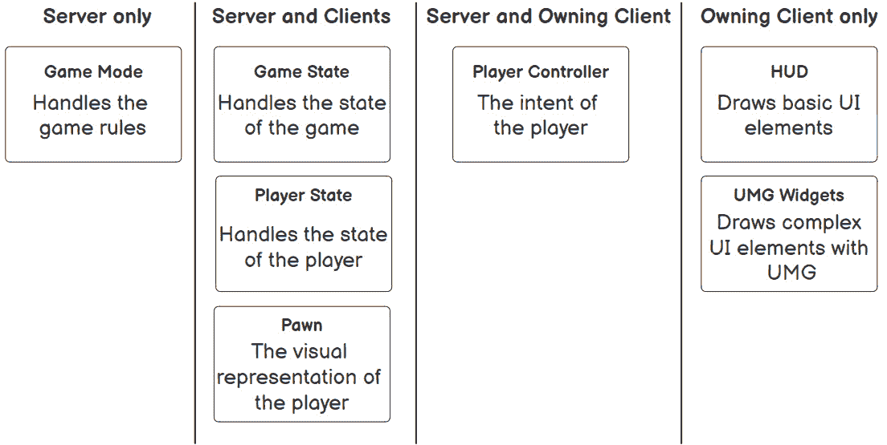

图 18.1 – 最常见的游戏框架类按类别划分

让我们更详细地查看前面图中的每个类别：

+   `Game Mode` 类定义了游戏的规则，其实例只能由服务器访问。如果客户端尝试访问它，实例始终无效，以防止客户端更改游戏规则。

+   **游戏状态（服务器和客户端）**: 游戏状态类存储游戏的状态，其实例可以被服务器和客户端访问。游戏状态将在下一主题中更深入地介绍。

+   **玩家状态（服务器和客户端）**: 玩家状态类存储玩家的状态，其实例可以被服务器和客户端访问。玩家状态将在下一主题中更深入地介绍。

+   `Pawn` 类是玩家的视觉表示，其实例可以被服务器和客户端访问。

+   `Player Controller` 类代表玩家的意图，该意图被传递到当前拥有的 `Pawn`，其实例只能在服务器和拥有客户端上访问。出于安全原因，客户端不能访问其他客户端的玩家控制器，因此它们应该使用服务器进行通信。如果客户端调用 `UGameplayStatics::GetPlayerController` 函数的索引不是 `0`（这将返回其玩家控制器），则返回的实例始终无效。这意味着服务器是唯一可以访问所有玩家控制器的地方。您可以通过调用 `AController::IsLocalController` 函数来找出玩家控制器实例是否在其拥有客户端上。

+   **HUD（仅客户端拥有）**: HUD 类用作立即模式在屏幕上绘制基本形状和文本。由于它用于 UI，其实例仅在拥有客户端上可用，因为服务器和其他客户端不需要了解它。

+   **UMG 小部件（仅客户端拥有）**: UMG 小部件类用于在屏幕上显示复杂的 UI。由于它用于 UI，其实例仅在拥有客户端上可用，因为服务器和其他客户端不需要了解它。

为了帮助您理解这些概念，我们将以 *Dota 2* 为例：

+   游戏模式定义了游戏的不同阶段（英雄选择前的预游戏阶段、实际游戏和带有胜利者的后游戏阶段）以及最终目标是摧毁另一队的古墓。由于游戏模式是一个对游戏至关重要的类，因此不允许客户端访问它。

+   游戏状态存储了经过的时间、是白天还是夜晚、每个队伍的分数等，因此服务器和客户端需要能够访问它。

+   玩家状态存储了玩家的姓名、所选的英雄以及玩家的击杀/死亡/助攻比率，因此服务器和客户端需要能够访问它。

+   兵棋将是英雄、信使、幻象等，由玩家控制，因此服务器和客户端需要能够访问它。

+   玩家控制器是将输入信息传递给受控兵棋的信息中继器，因此只有服务器和拥有客户端需要能够访问它。

+   UI 类（`HUD`和`User Widget`）在拥有客户端上显示所有信息，因此它只需要在那里访问。

在下一个练习中，你将显示最常见的游戏框架类的实例值。

## 练习 18.01 – 显示游戏框架实例值

在这个练习中，我们将创建一个新的使用**第三人称**模板的 C++项目，并且我们将添加以下内容：

+   在拥有客户端上，玩家控制器创建并添加一个简单的 UMG 小部件到视图中，显示菜单实例的名称。

+   在`Tick`函数中，角色显示其实例（作为兵棋）的值，以及它是否有有效的游戏模式、游戏状态、玩家状态、玩家控制器和 HUD 实例。

按照以下步骤完成此练习：

1.  创建一个新的`GFInstances`（如游戏框架实例）并将其保存到你喜欢的位置。一旦项目创建完成，它应该会打开编辑器以及 Visual Studio 解决方案。

1.  在编辑器中，创建一个新的名为`GFInstancePlayerController`的`C++`类，它从`PlayerController`派生。等待编译结束，关闭编辑器，然后回到 Visual Studio。

1.  打开`GFInstancesCharacter.h`文件并声明`Tick`函数的受保护重写：

    ```cpp
    virtual void Tick(float DeltaSeconds) override;
    ```

1.  打开`GFInstancesCharacter.cpp`文件并实现`Tick`函数：

    ```cpp
    void AGFInstancesCharacter::Tick(float DeltaSeconds)
    {
      Super::Tick(DeltaSeconds);
    }
    ```

1.  获取游戏模式、游戏状态、玩家控制器和 HUD 的实例：

    ```cpp
    const AGameModeBase* GameMode = GetWorld()->GetAuthGameMode();
    const AGameStateBase* GameState = GetWorld()->GetGameState();
    const APlayerController* PlayerController = 
      Cast<APlayerController>(GetController());
    const AHUD* HUD = PlayerController != nullptr ? PlayerController->GetHUD() : nullptr;
    ```

在前面的代码片段中，我们将游戏模式、游戏状态、玩家控制器和 HUD 的实例存储在不同的变量中，以便我们可以检查它们是否有效。

1.  为每个游戏框架类创建一个字符串：

    ```cpp
    const FString GameModeString = GameMode != nullptr ? 
      TEXT("Valid") : TEXT("Invalid");
    const FString GameStateString = GameState != nullptr ? 
      TEXT("Valid") : TEXT("Invalid");
    const FString PlayerStateString = GetPlayerState() != nullptr ? TEXT("Valid") : TEXT("Invalid");
    const FString PawnString = GetName();
    const FString PlayerControllerString = PlayerController != nullptr ? TEXT("Valid") : TEXT("Invalid");
    const FString HUDString = HUD != nullptr ? TEXT("Valid"):
      TEXT("Invalid");
    ```

在这里，我们创建了字符串来存储兵棋的名称，并检查了其他游戏框架实例是否有效。

1.  在屏幕上显示每个字符串：

    ```cpp
    const FString String = FString::Printf(TEXT("Game Mode = %s\nGame 
      State = %s\nPlayerState = %s\nPawn = %s\nPlayer Controller = 
      %s\nHUD = %s"), *GameModeString, *GameStateString, 
      *PlayerStateString, *PawnString, 
      *PlayerControllerString, 
      *HUDString);
    DrawDebugString(GetWorld(), GetActorLocation(), String, nullptr, FColor::White, 0.0f, true);
    ```

在前面的代码片段中，我们打印了指示兵棋名称以及其他游戏框架实例是否有效的字符串。

1.  在我们可以继续到`AGFInstancesPlayerController`类之前，我们需要告诉 Unreal Engine 我们想要使用 UMG 功能，这样我们就可以使用`UUserWidget`类。为此，我们需要打开`GFInstances.Build.cs`并将`UMG`添加到`PublicDependencyModuleNames`字符串数组中，如下所示：

    ```cpp
    PublicDependencyModuleNames.AddRange(new string[] { "Core", "CoreUObject", "Engine", "InputCore", "HeadMountedDisplay", "UMG" });
    ```

如果你尝试编译并从添加新模块中获取错误，那么清理并重新编译你的项目。如果这不起作用，尝试重新启动你的 IDE。

1.  打开`GFInstancesPlayerController.h`并添加受保护变量以创建 UMG 小部件：

    ```cpp
    UPROPERTY(EditDefaultsOnly, BlueprintReadOnly, Category = "GF Instance Player Controller")
    TSubclassOf<UUserWidget> MenuClass;
    UPROPERTY()
    UUserWidget* Menu;
    ```

1.  声明`BeginPlay`函数的受保护覆盖：

    ```cpp
    virtual void BeginPlay() override;
    ```

1.  打开`GFInstancesPlayerController.cpp`并包含`UserWidget.h`：

    ```cpp
    #include "Blueprint/UserWidget.h"
    ```

1.  实现的`BeginPlay`函数：

    ```cpp
    void AGFInstancePlayerController::BeginPlay()
    {
      Super::BeginPlay();
    }
    ```

1.  如果是本地控制器且`MenuClass`变量有效，则创建小部件并将其添加到视图中：

    ```cpp
    if (IsLocalController() && MenuClass != nullptr)
    {
      Menu = CreateWidget<UUserWidget>(this, MenuClass);
      if (Menu != nullptr)
      {
        Menu->AddToViewport(0);
      }
    }
    ```

1.  编译并运行代码。

1.  在`Content`文件夹中，创建一个名为`UI`的新文件夹，并打开它。

1.  创建一个新的小部件蓝图`WBP_Menu`并打开它。

1.  在**层次结构**面板中添加一个`Canvas Panel`。

1.  给**画布面板**添加一个`Name`，并将其设置为变量。

1.  将文本块`true`更改。

1.  以以下方式前往`Event Construct`：

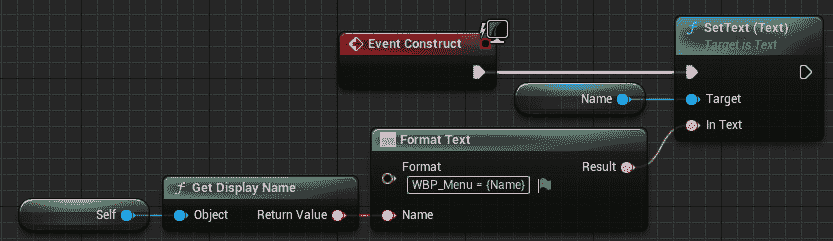

图 18.2 – 显示 WBP_Menu 实例名称的事件构造

1.  保存并关闭`WBP_Menu`。

1.  前往`Content`文件夹，创建一个名为`BP_PlayerController`的蓝图，它继承自`GFInstancesPlayerController`。

1.  打开`BP_PlayerController`并将`Menu Class`设置为使用`WBP_Menu`。

1.  保存并关闭`BP_PlayerController`。

1.  创建一个名为`BP_GameMode`的蓝图，它继承自`GFInstancesGameMode`。

1.  打开`BP_GameMode`并将`Player Controller Class`设置为使用`BP_PlayerController`。

1.  保存并关闭`BP_GameMode`。

1.  前往**世界设置**，将**游戏模式覆盖**设置为**无**，并保存地图。

1.  前往**项目设置**，从左侧面板中选择**地图和模式**，它位于**项目**类别中。

1.  将`默认`游戏模式设置为使用`BP_GameMode`。

1.  关闭**项目设置**。

最后，你可以测试项目。

1.  前往`2`。

1.  将窗口大小设置为`800x600`，并使用**新编辑器窗口（PIE）**进行游戏。

你应该得到以下输出：

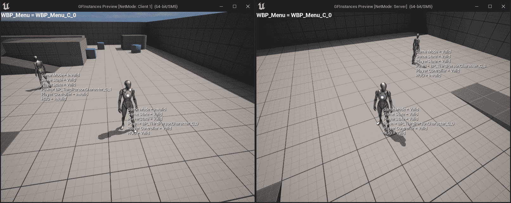

图 18.3 – 服务器和客户端 1 窗口上的预期结果

现在你已经完成了这个练习，你会注意到每个角色都会显示其名称，以及游戏模式、游戏状态、玩家状态、玩家控制器和 HUD 实例是否有效。它还会在屏幕左上角显示`WBP_Menu` UMG 小部件的实例名称。

现在，让我们分析在服务器和客户端 1 窗口中显示的值。

注意

服务器和客户端 1 窗口的两个图将有两个文本块，分别写着`Server Character`和`Client 1 Character`。这些文本块被添加到原始截图中以帮助您理解哪个角色是哪个。

## 服务器窗口输出

查看以下输出，这是之前练习中的`Server`窗口：

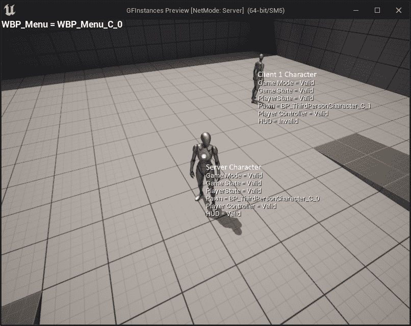

图 18.4 – 服务器窗口

在前面的截图上，你可以看到 `服务器角色` 和 `Client 1 角色` 的值。`WBP_Menu` UMG 小部件显示在左上角，并且只为 `服务器角色` 的玩家控制器创建，因为它是这个窗口中唯一控制角色的玩家控制器。

首先，让我们分析 `服务器角色` 的值。

### 服务器角色

这是监听服务器正在控制的角色。显示在这个角色上的值如下：

+   **游戏模式 = Valid** 因为游戏模式实例仅存在于服务器，而这在这里正是如此

+   **游戏状态 = Valid** 因为游戏状态实例存在于客户端和服务器，而这在这里正是如此

+   **玩家状态 = Valid** 因为玩家状态实例存在于客户端和服务器，而这在这里正是如此

+   **NPC = BP_ThirdPersonCharacter_C_0** 因为 NPC 实例存在于客户端和服务器，而这在这里正是如此

+   **玩家控制器 = Valid** 因为玩家控制器实例存在于拥有客户端和服务器，而这在这里正是如此

+   **HUD = Valid** 因为 HUD 实例仅存在于拥有客户端，而这里正是如此

接下来，我们将查看同一窗口中的 `Client 1 角色`。

### Client 1 角色

这是 `Client 1` 正在控制的角色。显示在这个角色上的值如下：

+   **游戏模式 = Valid** 因为游戏模式实例仅存在于服务器，而这在这里正是如此

+   **游戏状态 = Valid** 因为游戏状态实例存在于客户端和服务器，而这在这里正是如此

+   **玩家状态 = Valid** 因为玩家状态实例存在于客户端和服务器，而这在这里正是如此

+   **NPC = BP_ThirdPersonCharacter_C_1** 因为 NPC 实例存在于客户端和服务器，而这在这里正是如此

+   **玩家控制器 = Valid** 因为玩家控制器实例存在于拥有客户端和服务器，而这在这里正是如此

+   **HUD = Invalid** 因为 HUD 实例仅存在于拥有客户端，而这在这里并不适用

## Client 1 窗口的输出

查看以下来自上一个练习的 `Client 1` 窗口的输出：

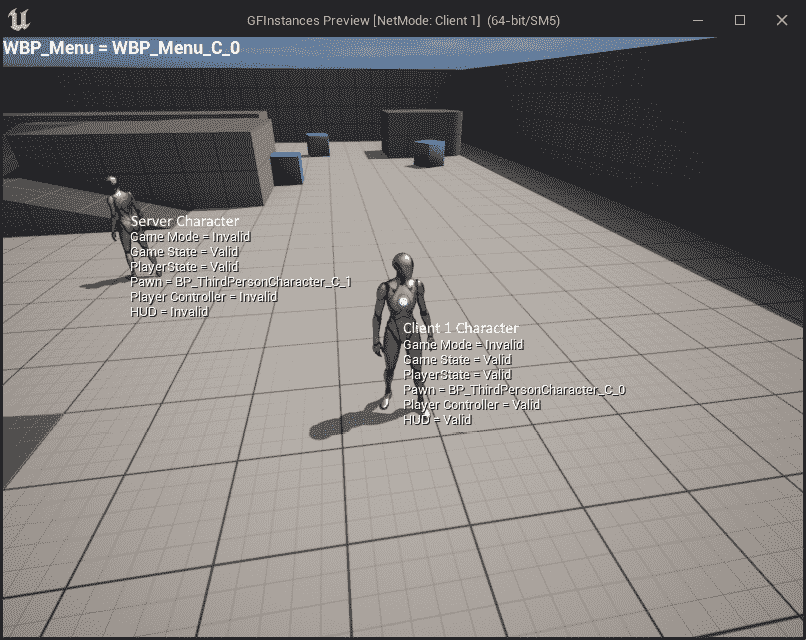

图 18.5 – Client 1 窗口

在前面的截图上，你可以看到 `Client 1 角色` 和 `服务器角色` 的值。`WBP_Menu` UMG 小部件显示在左上角，并且只为 `Client 1 角色` 的玩家控制器创建，因为它是这个窗口中唯一控制角色的玩家控制器。

首先，让我们分析 `Client 1 角色` 的值。

### Client 1 角色

这是 `Client 1` 正在控制的角色。显示在这个角色上的值如下：

+   **游戏模式 = Invalid** 因为游戏模式实例仅存在于服务器，而这在这里并不适用

+   **游戏状态 = 有效** 因为游戏状态实例存在于服务器和客户端上，这里就是这种情况

+   **玩家状态 = 有效** 因为玩家状态实例存在于服务器和客户端上，这里就是这种情况

+   **兵 = BP_ThirdPersonCharacter_C_0** 因为兵实例存在于服务器和客户端上，这里就是这种情况

+   **玩家控制器 = 有效** 因为玩家控制器实例存在于服务器和拥有客户端上，这里就是这种情况

+   **HUD = 有效** 因为 HUD 实例仅存在于拥有客户端上，这里就是这种情况

接下来，我们将在同一窗口中查看`服务器角色`。

### 服务器角色

这是监听服务器所控制的角色。显示在此角色上的值如下：

+   **游戏模式 = 无效** 因为游戏模式实例仅存在于服务器上，这里不是这种情况

+   **游戏状态 = 有效** 因为游戏状态实例存在于服务器和客户端上，这里就是这种情况

+   **玩家状态 = 有效** 因为玩家状态实例存在于服务器和客户端上，这里就是这种情况

+   **兵 = BP_ThirdPersonCharacter_C_1** 因为兵实例存在于服务器和客户端上，这里就是这种情况

+   **玩家控制器 = 无效** 因为玩家控制器实例存在于服务器和拥有客户端上，这里不是这种情况

+   **HUD = 无效** 因为 HUD 实例仅存在于拥有客户端上，这里不是这种情况

通过完成这个练习，你应该对游戏框架类中的每个实例存在于哪里以及不存在于哪里有更好的理解。在下一节中，我们将介绍玩家状态和游戏状态类，以及与游戏模式相关的额外概念和有用的内置功能。

使用游戏模式、玩家状态和游戏状态

到目前为止，我们已经涵盖了游戏框架中的大多数重要类，包括游戏模式、玩家控制器和兵。在本节中，我们将介绍玩家状态、游戏状态以及与游戏模式相关的一些额外概念，以及一些有用的内置功能。

## 游戏模式

我们已经讨论过游戏模式及其工作原理，但还有一些概念是值得了解的。让我们来看看。

### 构造函数

要设置默认类值，你可以使用如下构造函数：

```cpp
ATestGameMode::ATestGameMode()
{
  DefaultPawnClass = AMyCharacter::StaticClass();
  PlayerControllerClass = 
  AMyPlayerController::StaticClass();
  PlayerStateClass = AMyPlayerState::StaticClass();
  GameStateClass = AMyGameState::StaticClass();
}
```

上述代码允许你在使用此游戏模式时指定在生成兵、玩家控制器、玩家状态和游戏状态时要使用的类。

### 获取游戏模式实例

如果你想要访问游戏模式实例，你需要通过以下代码从`GetWorld`函数中获取它：

```cpp
AGameModeBase* GameMode = GetWorld()->GetAuthGameMode();
```

上述代码允许你访问当前的游戏模式实例，但你必须确保你在服务器上调用它，因为由于安全原因，在客户端上这将无效。

### 比赛状态

到目前为止，我们只使用了 `AGameModeBase` 类，这是框架中最基本的游戏模式类。虽然它对于某些类型的游戏来说已经足够，但仍然会有需要更多功能的情况。一个例子是如果我们想要实现一个大厅系统，只有当所有玩家都标记为已准备好时，比赛才会开始。仅使用 `AGameModeBase` 类的内置函数是无法实现这个例子的。对于这些情况，最好使用 `AGameMode` 类，它是 `AGameModeBase` 的子类，增加了对比赛状态的支持。比赛状态的工作方式是通过使用只能处于以下状态之一的状态机：

+   `EnteringMap`：这是世界仍在加载且演员尚未计时时的起始状态。一旦世界加载完成，它将转换到 `WaitingToStart` 状态。

+   `WaitingToStart`：当世界加载完成且演员正在计时，但玩家的兵种尚未生成，因为游戏尚未开始时，此状态被设置。当状态机进入此状态时，它将调用 `HandleMatchIsWaitingToStart` 函数。如果 `ReadyToStartMatch` 函数返回 `true` 或在代码的某处调用了 `StartMatch` 函数，状态机将转换到 `InProgress` 状态。

+   `InProgress`：这是实际游戏发生的状态。当状态机进入此状态时，它将为玩家生成兵种，在世界上所有演员上调用 `BeginPlay`，并调用 `HandleMatchHasStarted` 函数。如果 `ReadyToEndMatch` 函数返回 `true` 或在代码的某处调用了 `EndMatch` 函数，状态机将转换到 `WaitingPostMatch` 状态。

+   `WaitingPostMatch`：当比赛结束时设置此状态。当状态机进入此状态时，它将调用 `HandleMatchHasEnded` 函数。在此状态下，演员仍在计时，但新玩家无法加入。当开始卸载世界时，它将转换到 `LeavingMap` 状态。

+   `LeavingMap`：在卸载世界时设置此状态。当状态机进入此状态时，它将调用 `HandleLeavingMap` 函数。当开始加载新关卡时，状态机将转换到 `EnteringMap` 状态。

+   `Aborted`：这是一个失败状态，只能通过调用 `AbortMatch` 函数来设置，该函数用于标记发生了某些错误，阻止比赛进行。

为了帮助您更好地理解这些概念，我们可以再次使用 *Dota 2* 作为例子：

+   `EnteringMap`：当地图正在加载时，状态机将处于此状态。

+   `WaitingToStart`：一旦地图加载完成且玩家正在选择他们的英雄，状态机将处于此状态。`ReadyToStartMatch` 函数将检查所有玩家是否已选择他们的英雄；如果是，则比赛可以开始。

+   `InProgress`：当游戏进行时，状态机将处于此状态。玩家控制他们的英雄进行耕作和与其他玩家战斗。`ReadyToEndMatch`函数将不断检查每个古人的健康状态，以查看是否有一个被摧毁；如果是，则比赛结束。

+   `WaitingPostMatch`：当游戏结束时，状态机将处于此状态，你可以看到被摧毁的古人和显示获胜队伍名称的消息。

+   `LeavingMap`：当卸载地图时，状态机将处于此状态。

+   `Aborted`：如果玩家在初始阶段未能连接，状态机将处于此状态，因此整个比赛将被取消。

### 玩家重生

当玩家死亡并且你想让他重生时，你通常有两个选择。第一个选择是重用相同的兵实例，手动将其状态重置为默认值，并将其传送到重生位置。第二个选择是销毁当前的兵实例并创建一个新的，这个新的实例的状态已经被重置。如果你更喜欢后者，那么`AGameModeBase::RestartPlayer`函数会为你处理为特定玩家控制器创建新的兵实例的逻辑，并将其放置在玩家起始位置。

一个需要考虑的重要事项是，该函数仅在玩家控制器尚未拥有兵的情况下才会创建新的兵实例，所以确保在调用`RestartPlayer`之前销毁受控的兵。

查看以下示例：

```cpp
void ATestGameMode::OnDeath(APlayerController* VictimController)
{
  if(VictimController == nullptr)
  {
    return;
  }

  APawn* Pawn = VictimController->GetPawn();
  if(Pawn != nullptr)
  {
    Pawn->Destroy();
  }

  RestartPlayer(VictimController);
}
```

在前面的代码中，我们有`OnDeath`函数，它接受已死亡玩家的玩家控制器，销毁其控制的兵，并调用`RestartPlayer`函数来创建一个新的实例。默认情况下，新的兵实例将在玩家第一次出生时使用的玩家起始演员处重生。或者，你可以告诉游戏模式你想要在随机的玩家起始位置重生。为了实现这一点，你需要重写`AGameModeBase::ShouldSpawnAtStartSpot`函数并强制它返回`false`，如下所示：

```cpp
bool ATestGameMode::ShouldSpawnAtStartSpot(AController* Player)
{
  return false;
}
```

前面的代码将使游戏模式使用随机的玩家起始位置，而不是总是使用第一次使用的第一个位置。

注意

更多关于游戏模式的信息，请访问[`docs.unrealengine.com/en-US/Gameplay/Framework/GameMode/#gamemodes`](https://docs.unrealengine.com/en-US/Gameplay/Framework/GameMode/#gamemodes)和[`docs.unrealengine.com/en-US/API/Runtime/Engine/GameFramework/AGameMode/index.xhtml`](https://docs.unrealengine.com/en-US/API/Runtime/Engine/GameFramework/AGameMode/index.xhtml)。

## 玩家状态

玩家状态类存储了其他客户端需要了解的特定玩家的信息（例如他们的当前分数、击杀/死亡/助攻等），因为他们无法访问其玩家控制器。最广泛使用的内置函数是 `GetPlayerName()`、`GetScore` 和 `GetPingInMilliseconds()`，分别提供玩家的名字、分数和延迟。

使用玩家状态的一个好例子是在多人射击游戏（如 *使命召唤*）的得分板上，因为每个客户端都需要知道该玩家的名字、击杀/死亡/助攻数和延迟。玩家状态实例可以通过多种方式访问，让我们看看最常见的方法：

### AController::PlayerState

这个变量包含与控制器关联的玩家状态，并且只能由服务器和拥有该客户端访问。以下示例展示了如何使用这个变量：

```cpp
APlayerState* PlayerState = Controller->PlayerState;
```

### AController::GetPlayerState()

这个函数返回与控制器关联的玩家状态，并且只能由服务器和拥有该客户端访问。此函数还有一个模板版本，以便您可以将其转换为自定义的玩家状态类。以下示例展示了如何使用此函数的默认和模板版本：

```cpp
// Default version
APlayerState* PlayerState = Controller->GetPlayerState();
// Template version
ATestPlayerState* MyPlayerState = Controller->GetPlayerState<ATestPlayerState>();
```

### APawn::GetPlayerState()

这个函数返回拥有兵器的控制器关联的玩家状态，并且可以由服务器和客户端访问。此函数还有一个模板版本，以便您可以将其转换为自定义的玩家状态类。以下示例展示了如何使用此函数的默认和模板版本：

```cpp
// Default version
APlayerState* PlayerState = Pawn->GetPlayerState();
// Template version
ATestPlayerState* MyPlayerState = Pawn-
  >GetPlayerState<ATestPlayerState>();
```

### AGameState::PlayerArray

游戏状态中的这个变量（在下一节中介绍）存储了每个玩家的玩家状态实例，并且可以在服务器和客户端上访问。以下示例展示了如何使用这个变量：

```cpp
TArray<APlayerState*> PlayerStates = GameState->PlayerArray;
```

为了帮助您更好地理解这些概念，我们将再次使用 *Dota 2* 作为示例。玩家状态至少包含以下变量：

+   **名字**：玩家的名字

+   **英雄**：所选的英雄

+   **生命值**：英雄的生命值

+   **魔法值**：英雄的魔法值

+   **统计数据**：英雄的统计数据

+   **等级**：英雄当前所在的等级

+   **击杀/死亡/助攻**：玩家的击杀/死亡/助攻比率

注意

更多关于玩家状态的信息，请访问 [`docs.unrealengine.com/en-US/API/Runtime/Engine/GameFramework/APlayerState/index.xhtml`](https://docs.unrealengine.com/en-US/API/Runtime/Engine/GameFramework/APlayerState/index.xhtml)。

## 游戏状态

游戏状态类存储了其他客户端需要了解的游戏信息（例如比赛的已过时间和赢得比赛所需的分数），因为这些客户端无法访问游戏模式。最常用的变量是`PlayerArray`，它是一个提供每个已连接客户端玩家状态的数组。使用游戏状态的一个好例子是多玩家射击游戏如*使命召唤*的计分板，因为每个客户端都需要知道赢得比赛所需的击杀数，以及每个已连接玩家的名字、击杀/死亡/助攻和 ping 值。

游戏状态实例可以通过多种方式访问。让我们看看。

### UWorld::GetGameState()

此函数返回与世界关联的游戏状态，可以在服务器和客户端上访问。此函数还有一个模板版本，以便您可以将其转换为您的自定义游戏状态类。以下示例展示了如何使用此函数的默认和模板版本：

```cpp
// Default version
AGameStateBase* GameState = GetWorld()->GetGameState();
// Template version
AMyGameState* MyGameState = GetWorld()->GetGameState<AMyGameState>();
```

### AGameModeBase::GameState

此变量包含与游戏模式关联的游戏状态，并且只能在服务器上访问。以下示例展示了如何使用此变量：

```cpp
AGameStateBase* GameState = GameMode->GameState;
```

### AGameModeBase::GetGameState()

此函数返回与游戏模式关联的游戏状态，并且只能在服务器上访问。此函数还有一个模板版本，以便您可以将其转换为您的自定义游戏状态类。以下示例展示了如何使用此函数的默认和模板版本：

```cpp
// Default version
AGameStateBase* GameState = GameMode->GetGameState<AGameStateBase>();
// Template version
AMyGameState* MyGameState = GameMode->GetGameState<AMyGameState>();
```

为了帮助您更好地理解这些概念，我们将再次以*Dota 2*为例。游戏状态将包含以下变量：

+   **已过时间**：比赛进行了多长时间

+   **辐射击杀数**：辐射队杀死了多少个暗影英雄

+   **暗影击杀数**：暗影队杀死了多少个辐射英雄

+   **昼夜计时器**：用于确定是白天还是夜晚

注意

更多关于游戏状态的信息，请访问[`docs.unrealengine.com/en-US/API/Runtime/Engine/GameFramework/AGameState/index.xhtml`](https://docs.unrealengine.com/en-US/API/Runtime/Engine/GameFramework/AGameState/index.xhtml)。

## 有用的内置功能

UE5 内置了许多功能。让我们看看在开发游戏时需要了解的一些示例。

### void AActor::EndPlay(const EEndPlayReason::Type EndPlayReason)

当演员停止播放时，会调用此函数，这是`BeginPlay`函数的相反。此函数有一个名为`EndPlayReason`的参数，它告诉您演员停止播放的原因（如果是被销毁，如果是停止`PIE`，等等）。看看以下示例，它会在屏幕上打印出演员已停止播放的信息：

```cpp
void ATestActor::EndPlay(const EEndPlayReason::Type EndPlayReason)
{
  Super::EndPlay(EndPlayReason);
  const FString String = FString::Printf(TEXT("The actor %s 
  has just stopped playing"), *GetName());
  GEngine->AddOnScreenDebugMessage(-1, 2.0f, FColor::Red, 
  String);
}
```

### void ACharacter::Landed(const FHitResult& Hit)

当玩家从空中落地时，会调用此函数。看看以下示例，当玩家落地时会播放声音：

```cpp
void ATestCharacter::Landed(const FHitResult& Hit)
{
  Super::Landed(Hit);
  UGameplayStatics::PlaySound2D(GetWorld(), LandSound);
}
```

### bool UWorld::ServerTravel(const FString& FURL, bool bAbsolute, bool bShouldSkipGameNotify)

此函数将使服务器加载新地图，并带所有连接的客户端一起。这与使用其他加载地图的方法不同，例如 `UGameplayStatics::OpenLevel` 函数，因为它不会带客户端一起；它只会加载服务器上的地图并断开客户端连接。

请看以下示例，它获取当前地图名称并使用服务器旅行来重新加载它并带连接的客户端：

```cpp
void ATestGameModeBase::RestartMap()
{
  const FString URL = GetWorld()->GetName();
  GetWorld()->ServerTravel(URL, false, false);
}
```

### void TArray::Sort(const PREDICATE_CLASS& Predicate)

`TArray` 数据结构自带 `Sort` 函数，允许你使用返回 `A` 值是否应排在 `B` 值之前的 lambda 函数来对数组中的值进行排序。请看以下示例，它将整数数组从小到大排序：

```cpp
void ATestActor::SortValues()
{
  TArray<int32> SortTest;
  SortTest.Add(43);
  SortTest.Add(1);
  SortTest.Add(23);
  SortTest.Add(8);
  SortTest.Sort([](const int32& A, const int32& B) { return 
  A < B; });
}
```

前面的代码将 `SortTest` 数组的值 [43, 1, 23, 8] 从最小到最大排序——即 [1, 8, 23, 43]。

### void AActor::FellOutOfWorld(const UDamageType& DmgType)

在 Unreal Engine 中，有一个称为 `Z`（在 `Z` 值中设置，将调用 `FellOutOfWorld` 函数，默认情况下，将销毁演员）的概念。请看以下示例，它将打印到屏幕上演员已从世界中掉落：

```cpp
void AFPSCharacter::FellOutOfWorld(const UDamageType& DmgType)
{
  Super::FellOutOfWorld(DmgType);
  const FString String = FString::Printf(TEXT("The actor %s 
  has fell out of the world"), *GetName());
  GEngine->AddOnScreenDebugMessage(-1, 2.0f, FColor::Red, 
  String);
}
```

### URotatingMovementComponent

此组件以每轴一定的速率随时间旋转拥有演员。要使用它，你需要包含以下头文件：

```cpp
#include "GameFramework/RotatingMovementComponent.h"
```

你还必须声明组件变量：

```cpp
UPROPERTY(VisibleAnywhere, BlueprintReadOnly, Category = "Test Actor")
URotatingMovementComponent* RotatingMovement;
```

最后，你必须在演员构造函数中初始化它，如下所示：

```cpp
RotatingMovement = CreateDefaultSubobject
  <URotatingMovementComponent>("Rotating Movement");
RotatingMovement->RotationRate = FRotator(0.0, 90.0f, 0);
```

在前面的代码中，`RotationRate` 设置为每秒在 `Yaw` 轴上旋转 `90` 度。

## 练习 18.02 – 制作一个简单的多人拾取游戏

在这个练习中，我们将创建一个新的 C++ 项目，使用 **第三人称** 模板。以下将发生：

+   在拥有客户端上，玩家控制器将为每个玩家创建并添加到视图中一个 UMG 小部件，显示分数，从高到低排序，以及收集了多少拾取物。

+   创建一个简单的拾取演员类，给拾取它的玩家加 10 分。拾取物也将以每秒 90 度的速率在 `Yaw` 轴上旋转。

+   将 `Kill Z` 设置为 `-500` 并使玩家在每次从世界中掉落时重生并失去 10 分。

+   当没有更多拾取物可用时，游戏将结束。一旦游戏结束，所有角色将被销毁，5 秒后，服务器将进行服务器旅行调用以重新加载相同的地图并带连接的客户端。

按照以下步骤完成此练习的 C++ 部分：

1.  创建一个新的 `Pickups` 并将其保存到你喜欢的位置。

1.  一旦项目创建完成，就应该打开编辑器以及 Visual Studio 解决方案。

现在，让我们创建我们将要使用的新 C++ 类。

1.  创建一个从 `Actor` 继承的 `Pickup` 类：

1.  创建一个从 `GameState` 继承的 `PickupsGameState` 类：

1.  创建一个从 `PlayerState` 继承的 `PickupsPlayerState` 类：

1.  创建一个从 `PlayerController` 继承的 `PickupsPlayerController` 类：

1.  关闭编辑器并打开 Visual Studio。

接下来，我们将处理 `PickupsGameState` 类：

1.  打开 `PickupsGameState.h` 并声明受保护的复制整数变量 `PickupsRemaining`，它告诉所有客户端在关卡中剩余多少拾取物：

    ```cpp
    UPROPERTY(Replicated, BlueprintReadOnly)
    int32 PickupsRemaining;
    ```

1.  声明 `BeginPlay` 函数的受保护覆盖：

    ```cpp
    virtual void BeginPlay() override;
    ```

1.  声明受保护的 `GetPlayerStatesOrderedByScore` 函数：

    ```cpp
    UFUNCTION(BlueprintCallable)
    TArray<APlayerState*> GetPlayerStatesOrderedByScore() const;
    ```

1.  实现公共的 `RemovePickup` 函数，该函数从 `PickupsRemaining` 变量中移除一个拾取物：

    ```cpp
    void RemovePickup() { PickupsRemaining--; }
    ```

1.  实现公共的 `HasPickups` 函数，该函数返回是否还有拾取物剩余：

    ```cpp
    bool HasPickups() const { return PickupsRemaining > 0; }
    ```

1.  打开 `PickupsGameState.cpp` 并包含 `Pickup.h`、`GameplayStatics.h`、`UnrealNetwork.h` 和 `PlayerState.h`：

    ```cpp
    #include "Pickup.h"
    #include "Kismet/GameplayStatics.h"
    #include "Net/UnrealNetwork.h"
    #include "GameFramework/PlayerState.h"
    ```

1.  实现公共的 `GetLifetimeReplicatedProps` 函数，并使 `PickupRemaining` 变量对所有客户端进行复制：

    ```cpp
    void APickupsGameState::GetLifetimeReplicatedProps(TArray< 
      FLifetimeProperty >& OutLifetimeProps) const
    {
      Super::GetLifetimeReplicatedProps(OutLifetimeProps);
      DOREPLIFETIME(APickupsGameState, PickupsRemaining);
    }
    ```

1.  实现覆盖的 `BeginPlay` 函数，并通过获取世界中的所有拾取物来设置 `PickupsRemaining` 的值：

    ```cpp
    void APickupsGameState::BeginPlay()
    {
      Super::BeginPlay();
      TArray<AActor*> Pickups;
      UGameplayStatics::GetAllActorsOfClass(this, 
        APickup::StaticClass(), Pickups);
      PickupsRemaining = Pickups.Num();
    }
    ```

1.  实现公共的 `GetPlayerStatesOrderedByScore` 函数，该函数复制 `PlayerArray` 变量并对其进行排序，以便得分最高的玩家首先出现：

    ```cpp
    TArray<APlayerState*> APickupsGameState::GetPlayerStatesOrderedByScore() const
    {
      TArray<APlayerState*> PlayerStates(PlayerArray);
      PlayerStates.Sort([](const APlayerState& A, const 
      APlayerState& 
        B) { return A.GetScore() > B.GetScore(); });
      return PlayerStates;
    }
    ```

接下来，让我们处理 `PickupsPlayerState` 类。按照以下步骤操作：

1.  打开 `PickupsPlayerState.h` 并声明受保护的复制整数变量 `Pickups`，该变量指示玩家收集了多少拾取物：

    ```cpp
    UPROPERTY(Replicated, BlueprintReadOnly)
    int32 Pickups;
    ```

1.  实现公共的 `AddPickup` 函数，该函数将一个拾取物添加到 `Pickups` 变量中：

    ```cpp
    void AddPickup() { Pickups++; }
    ```

1.  打开 `PickupsPlayerState.cpp` 并包含 `UnrealNetwork.h`：

    ```cpp
    #include "Net/UnrealNetwork.h"
    ```

1.  实现公共的 `GetLifetimeReplicatedProps` 函数，并使 `Pickups` 变量对所有客户端进行复制：

    ```cpp
    void APickupsPlayerState::GetLifetimeReplicatedProps(TArray< 
      FLifetimeProperty >& OutLifetimeProps) const
    {
      Super::GetLifetimeReplicatedProps(OutLifetimeProps);
      DOREPLIFETIME(APickupsPlayerState, Pickups);
    }
    ```

接下来，让我们处理 `PickupsPlayerController` 类。

1.  打开 `PickupsPlayerController.h` 并声明受保护的 `ScoreboardMenuClass` 变量，该变量将设置我们用于计分板的 UMG 小部件类：

    ```cpp
    UPROPERTY(EditDefaultsOnly, BlueprintReadOnly, Category = "Pickup Player Controller")
    TSubclassOf<class UUserWidget> ScoreboardMenuClass;
    ```

1.  声明受保护的 `ScoreboardMenu` 变量，该变量存储我们将在 `BeginPlay` 函数上创建的计分板 UMG 小部件实例：

    ```cpp
    UPROPERTY()
    class UUserWidget* ScoreboardMenu;
    ```

1.  声明 `BeginPlay` 函数的受保护覆盖：

    ```cpp
    virtual void BeginPlay() override;
    ```

1.  打开 `PickupsPlayerController.cpp` 并包含 `UserWidget.h`：

    ```cpp
    #include "Blueprint/UserWidget.h"
    ```

1.  实现覆盖的 `BeginPlay` 函数，对于拥有客户端，它会在视图中创建并添加计分板 UMG 小部件：

    ```cpp
    void ApickupsPlayerController::BeginPlay()
    {
      Super::BeginPlay();
      if (IsLocalController() && ScoreboardMenuClass != 
      nullptr)
      {
        ScoreboardMenu = CreateWidget<UUserWidget>(this, 
        ScoreboardMenuClass);
        if (ScoreboardMenu != nullptr)
        {
          ScoreboardMenu->AddToViewport(0);
        }
      }  
    }
    ```

现在，让我们编辑 `PickupsGameMode` 类：

1.  打开 `PickupsGameMode.h` 并将 `#include` 语句 `GameModeBase.h` 替换为 `GameMode.h`：

    ```cpp
    #include "GameFramework/GameMode.h"
    ```

1.  将类从 `AGameModeBase` 继承改为 `AGameMode`：

    ```cpp
    class APickupsGameMode : public AGameMode
    ```

1.  声明受保护的游戏状态变量 `MyGameState`，它持有 `APickupsGameState` 类的实例：

    ```cpp
    UPROPERTY()
    class APickupsGameState* MyGameState;
    ```

1.  将构造函数移动到受保护区域并删除公共区域。

1.  声明 `BeginPlay` 函数的受保护覆盖：

    ```cpp
    virtual void BeginPlay() override;
    ```

1.  声明`ShouldSpawnAtStartSpot`函数的受保护重写：

    ```cpp
    virtual bool ShouldSpawnAtStartSpot(AController* Player) 
      override;
    ```

1.  声明游戏模式匹配状态函数的受保护重写：

    ```cpp
    virtual void HandleMatchHasStarted() override;
    virtual void HandleMatchHasEnded() override;
    virtual bool ReadyToStartMatch_Implementation() override;
    virtual bool ReadyToEndMatch_Implementation() override;
    ```

1.  声明受保护的`RestartMap`函数：

    ```cpp
    void RestartMap() const;
    ```

1.  打开`PickupsGameMode.cpp`并包含`GameplayStatics.h`和`PickupGameState.h`：

    ```cpp
    #include "Kismet/GameplayStatics.h"
    #include "PickupsGameState.h"
    ```

1.  实现重写`BeginPlay`函数，该函数存储`APickupGameState`实例：

    ```cpp
    void APickupsGameMode::BeginPlay()
    {
      Super::BeginPlay();
      MyGameState = GetGameState<APickupsGameState>();
    }
    ```

1.  实现重写`ShouldSpawnAtStartSpot`函数，该函数指示我们希望玩家在随机的玩家起始点重生，而不是总是在同一个点上：

    ```cpp
    bool APickupsGameMode::ShouldSpawnAtStartSpot
      (AController* Player)
    {
      return false;
    }
    ```

1.  实现重写`HandleMatchHasStarted`函数，该函数将打印到屏幕上，通知玩家游戏已经开始：

    ```cpp
    void APickupsGameMode::HandleMatchHasStarted()
    {
      Super::HandleMatchHasStarted();
      GEngine->AddOnScreenDebugMessage(-1, 2.0f, 
      FColor::Green, "The game has started!");
    }
    ```

1.  实现重写`HandleMatchHasEnded`函数，该函数打印到屏幕上，通知玩家游戏已经结束，销毁所有角色，并安排定时器重新启动地图：

    ```cpp
    void APickupsGameMode::HandleMatchHasEnded()
    {
      Super::HandleMatchHasEnded();
      GEngine->AddOnScreenDebugMessage(-1, 2.0f, 
      FColor::Red, "The game has ended!");
      TArray<AActor*> Characters;
        UGameplayStatics::GetAllActorsOfClass(this, 
        APickupsCharacter::StaticClass(), Characters);
      for (AActor* Character : Characters)
      {
        Character->Destroy();
      }
      FTimerHandle TimerHandle;
      GetWorldTimerManager().SetTimer(TimerHandle, this, 
        &APickupsGameMode::RestartMap, 5.0f);
    }
    ```

1.  实现重写`ReadyToStartMatch_Implementation`函数，该函数指示比赛可以立即开始：

    ```cpp
    bool APickupsGameMode::ReadyToStartMatch_Implementation()
    {
      return true;
    }
    ```

1.  实现重写`ReadyToEndMatch_Implementation`函数，该函数指示当游戏状态中不再有拾取物品时，比赛结束：

    ```cpp
    bool APickupsGameMode::ReadyToEndMatch_Implementation()
    {
      return MyGameState != nullptr && !MyGameState
      ->HasPickups();
    }
    ```

1.  实现重写`RestartMap`函数，该函数执行服务器旅行到同一关卡，并将所有客户端一起带来：

    ```cpp
    void APickupsGameMode::RestartMap() const
    {
      GetWorld()->ServerTravel(GetWorld()->GetName(), 
      false, false);
    }
    ```

现在，让我们编辑`PickupsCharacter`类。按照以下步骤操作：

1.  打开`PickupsCharacter.h`并声明受保护的掉落和着陆声音变量：

    ```cpp
    UPROPERTY(EditDefaultsOnly, BlueprintReadOnly, Category = 
      "Pickups Character")
    USoundBase* FallSound;
    UPROPERTY(EditDefaultsOnly, BlueprintReadOnly, Category = 
      "Pickups Character")
    USoundBase* LandSound;
    ```

1.  声明受保护的函数重写：

    ```cpp
    virtual void EndPlay(const EEndPlayReason::Type EndPlayReason) override;
    virtual void Landed(const FHitResult& Hit) override;
    virtual void FellOutOfWorld(const UDamageType& DmgType) override;
    ```

1.  声明添加分数和拾取物品到玩家状态的公共函数：

    ```cpp
    void AddScore(const float Score) const;
    void AddPickup() const;
    ```

1.  声明在拥有客户端上播放声音的公共客户端 RPC：

    ```cpp
    UFUNCTION(Client, Unreliable)
    void ClientPlaySound2D(USoundBase* Sound);
    ```

1.  打开`PickupsCharacter.cpp`并包含`PickupsPlayerState.h`、`GameMode.h`、`PlayerState.h`和`GameplayStatics.h`：

    ```cpp
    #include "PickupsPlayerState.h"
    #include "GameFramework/GameMode.h"
    #include "GameFramework/PlayerState.h"
    #include "Kismet/GameplayStatics.h"
    ```

1.  实现重写`EndPlay`函数，如果角色被销毁，则播放掉落声音：

    ```cpp
    void APickupsCharacter::EndPlay(const EEndPlayReason::Type EndPlayReason)
    {
      Super::EndPlay(EndPlayReason);
      if (EndPlayReason == EEndPlayReason::Destroyed)
      {
        UGameplayStatics::PlaySound2D(GetWorld(), 
        FallSound);
      }
    }
    ```

1.  实现重写`Landed`函数，该函数播放着陆声音：

    ```cpp
    void APickupsCharacter::Landed(const FHitResult& Hit)
    {
      Super::Landed(Hit);
      UGameplayStatics::PlaySound2D(GetWorld(), LandSound);
    }
    ```

1.  实现重写`FellOutOfWorld`函数，该函数存储控制器，从分数中减去`10`分，销毁角色，并告诉游戏模式使用之前的控制器重新启动玩家：

    ```cpp
    void APickupsCharacter::FellOutOfWorld(const UDamageType& 
      DmgType)
    {
      AController* TempController = Controller;
      AddScore(-10);
      Destroy();
      AGameMode* GameMode = GetWorld()
      ->GetAuthGameMode<AGameMode>();
      if (GameMode != nullptr)
      {
        GameMode->RestartPlayer(TempController);
      }
    }
    ```

1.  实现重写`AddScore`函数，该函数将一定数量的分数添加到玩家状态中的`score`：

    ```cpp
    void APickupsCharacter::AddScore(const float Score) const
    {
      APlayerState* MyPlayerState = GetPlayerState();
      if (MyPlayerState != nullptr)
      {
        const float CurrentScore = MyPlayerState->GetScore();
        MyPlayerState->SetScore(CurrentScore + Score);
      }
    }
    ```

1.  实现重写`AddPickup`函数，该函数将拾取物品添加到我们自定义玩家状态中的`Pickup`变量：

    ```cpp
    void APickupsCharacter::AddPickup() const
    {
      APickupsPlayerState* MyPlayerState = 
        GetPlayerState<APickupsPlayerState>();
      if (MyPlayerState != nullptr)
      {
        MyPlayerState->AddPickup();
      }
    }
    ```

1.  实现重写`ClientPlaySound2D_Implementation`函数，该函数在拥有客户端上播放声音：

    ```cpp
    void APickupsCharacter::ClientPlaySound2D_Implementation(USoundBase* Sound)
    {
      UGameplayStatics::PlaySound2D(GetWorld(), Sound);
    }
    ```

现在，让我们专注于`Pickup`类。按照以下步骤操作：

1.  打开`Pickup.h`并清除所有现有函数并删除公共区域。

1.  声明名为`Mesh`的受保护`Static Mesh`组件：

    ```cpp
    UPROPERTY(VisibleAnywhere, BlueprintReadOnly, Category = 
      "Pickup")
    UStaticMeshComponent* Mesh;
    ```

1.  声明名为`RotatingMovement`的受保护旋转运动组件：

    ```cpp
    UPROPERTY(VisibleAnywhere, BlueprintReadOnly, Category = 
      "Pickup")
    class URotatingMovementComponent* RotatingMovement;
    ```

1.  声明受保护的`PickupSound`变量：

    ```cpp
    UPROPERTY(EditDefaultsOnly, BlueprintReadOnly, Category = 
      "Pickup")
    USoundBase* PickupSound;
    ```

1.  声明受保护的构造函数和`BeginPlay`重写：

    ```cpp
    APickup();
    virtual void BeginPlay() override;
    ```

1.  声明受保护的`OnBeginOverlap`函数：

    ```cpp
    UFUNCTION()
    void OnBeginOverlap(UPrimitiveComponent* OverlappedComp, AActor* 
      OtherActor, UPrimitiveComponent* OtherComp, int32 
      OtherBodyIndex, bool bFromSweep, const FHitResult& 
      Hit);
    ```

1.  打开`Pickup.cpp`并在`Pickup.h`之后包含`PickupsCharacter.h`、`PickupsGameState.h`和`RotatingMovementComponent.h`：

    ```cpp
    #include "PickupsCharacter.h"
    #include "PickupsGameState.h"
    #include "GameFramework/RotatingMovementComponent.h"
    ```

1.  在构造函数中，初始化`Mesh`组件，使其覆盖一切，并使其成为根组件：

    ```cpp
    Mesh = CreateDefaultSubobject<UStaticMeshComponent>("Mesh");
    Mesh->SetCollisionProfileName("OverlapAll");
    RootComponent = Mesh;
    ```

1.  仍然在构造函数中，初始化旋转运动组件，使其在`Yaw`轴上每秒旋转`90`度：

    ```cpp
    RotatingMovement = CreateDefaultSubobject
      <URotatingMovementComponent>("Rotating Movement");
    RotatingMovement->RotationRate = FRotator(0.0, 90.0f, 0);
    ```

1.  为了完成构造函数，启用复制并禁用`Tick`函数：

    ```cpp
    bReplicates = true;
    PrimaryActorTick.bCanEverTick = false;
    ```

1.  在`BeginPlay`函数的末尾，将`Mesh`的`BeginOverlap`事件绑定到`OnBeginOverlap`函数：

    ```cpp
    Mesh->OnComponentBeginOverlap.AddDynamic(this, &APickup::OnBeginOverlap);
    ```

1.  删除`Tick`函数的定义。

1.  实现`OnBeginOverlap`函数，该函数检查角色是否有效并具有权限，从游戏状态中删除拾取物，在拥有客户端上播放拾取物声音，并将`10`分和拾取物添加到角色。完成所有这些后，拾取物将自行销毁：

    ```cpp
    void APickup::OnBeginOverlap(UPrimitiveComponent* OverlappedComp, 
      AActor* OtherActor, UPrimitiveComponent* OtherComp, 
      int32 
      OtherBodyIndex, bool bFromSweep, const FHitResult& 
      Hit)
    {
      APickupsCharacter* Character = 
        Cast<APickupsCharacter>(OtherActor);
      if (Character == nullptr || !HasAuthority())
      {
        return;
      }
      APickupsGameState* GameState = 
        Cast<APickupsGameState>(GetWorld()
      ->GetGameState());
      if (GameState != nullptr)
      {
        GameState->RemovePickup();
      }
      Character->ClientPlaySound2D(PickupSound);
      Character->AddScore(10);
      Character->AddPickup();
      Destroy();
    }
    ```

1.  打开`Pickups.Build.cs`，并将`UMG`模块添加到`PublicDependencyModuleNames`中，如下所示：

    ```cpp
    PublicDependencyModuleNames.AddRange(new string[] { "Core", 
      "CoreUObject", "Engine", "InputCore", 
      "HeadMountedDisplay", 
      "UMG" });
    ```

如果你尝试编译并从添加新模块中获取错误，那么清理并重新编译你的项目。如果那样做不起作用，尝试重启你的 IDE。

1.  编译并运行代码，直到编辑器加载。

一旦加载，我们将导入一些资产并创建一些从我们刚刚创建的 C++类派生的蓝图。

首先，让我们导入声音文件：

1.  在`Content\Sounds`文件夹中。

1.  从`Exercise18.02\Assets`文件夹导入`Pickup.wav`、`Footstep.wav`、`Jump.wav`、`Land.wav`和`Fall.wav`。

1.  保存新文件。

接下来，我们将向角色的某些动画中添加`Play Sound`动画通知。

1.  打开位于`Content\Characters\Mannequins\Animations\Manny`中的`MM_Jump`动画，并在帧`0`使用`Jump`声音添加一个`Play Sound`动画通知。

1.  保存并关闭`MM_Jump`。

1.  打开位于`Content\Characters\Mannequins\Animations\Quinn`中的`MF_Run_Fwd`动画，并在`0.24`、`0.56`、`0.82`、`1.12`、`1.38`和`1.70`秒使用`Footstep`声音添加`Play Sound`动画通知。

1.  保存并关闭`MF_Run_Fwd`。

1.  打开位于`Content\Characters\Mannequins\Animations\Quinn`中的`MF_Walk_Fwd`动画，并在`0.33`、`0.72`、`1.23`和`1.7`秒使用`Footstep`声音添加两个`Play Sound`动画通知。

1.  保存并关闭`MF_Walk_Fwd`。

现在，让我们设置在角色蓝图上使用的声音：

1.  打开位于`Content\ThirdPerson\Blueprints`中的`BP_ThirdPersonCharacter`蓝图，并将`Fall Sound`和`Land Sound`设置为分别使用`Fall`和`Land`声音。

1.  保存并关闭`BP_ThirdPersonCharacter`。

现在，让我们创建拾取物的蓝图。

1.  创建并打开`Content\Blueprints`文件夹。

1.  创建一个名为`BP_Pickup`的新蓝图，它从`Pickup`类派生，并打开它。

1.  按以下方式配置`Static Mesh`组件：

    +   `(X=0.5, Y=0.5, Z=0.5)`

    +   `Engine\BasicShapes\Cube`

    +   `Engine\EngineMaterials\CubeMaterial`

注意

要显示引擎内容，需要点击静态网格的下拉菜单，点击过滤器框旁边的齿轮图标，并确保`true`。

1.  将`Pickup Sound`变量设置为使用`Pickup`声音。

1.  保存并关闭`BP_Pickup`。

现在，让我们创建得分板 UMG 小部件。按照以下步骤操作：

1.  创建并转到`Content\UI`文件夹。

1.  创建一个新的小部件蓝图，命名为`WBP_Scoreboard_Header`：

    +   添加`true`、`true`、`Player Name`和`green`。

    +   添加一个名为`true`、`= 500`、`= 1.0, 0.0`、`true`、`Score`和`green`的文本块。

    +   添加一个名为`true`、`= 650`、`= 1.0, 0.0`、`true`、`Pickups`和`green`的文本块。

1.  保存并关闭`WBP_Scoreboard_Header`。

1.  返回到`WBP_Scoreboard_Header`，将其重命名为`WBP_Scoreboard_Entry`，并打开它。

1.  将所有文本块的色彩改为`white`而不是`green`。

1.  使用以下配置转到`Player State`变量：

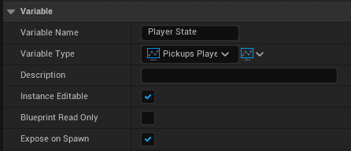

图 18.6 – 创建 Player State 变量

1.  返回到带有`Player Name`的`Name`并绑定到下拉菜单中的`GetPlayerName`函数，如下所示：

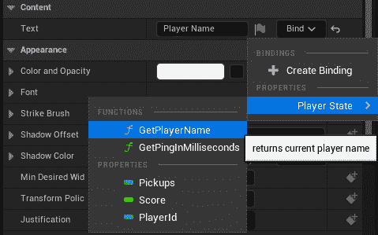

图 18.7 – 绑定玩家名称函数

1.  创建一个名为`Score`的文本块，内容为`Score`，并将其绑定到下拉菜单中的`Score`变量，如下所示：

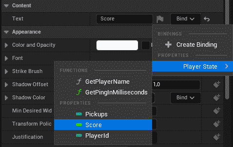

图 18.8 – 绑定玩家得分函数

1.  创建一个名为`Pickups`的文本块，内容为`Pickups`，并将其绑定到下拉菜单中的`Pickups`变量，如下所示：

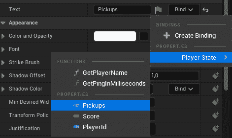

图 18.9 – 绑定拾取计数函数

1.  创建一个纯函数，名为`Get Typeface`，执行以下操作：

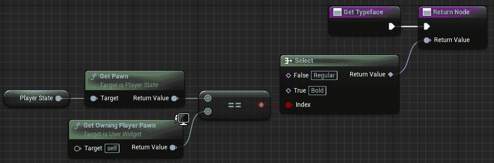

图 18.10 – 确定条目是否应以粗体或常规显示

在前面的代码中，我们使用了`Select`节点，可以通过从返回值拖动一根线并在空白处释放它来创建，然后在过滤器上键入`Select`。从那里，我们从列表中选择了`Select`节点。在这里，我们使用`Select`节点来选择我们将要使用的字体名称，因此如果玩家状态的角色与拥有小部件的角色不同，则应返回`Regular`，如果相同，则返回`Bold`。我们这样做是为了以粗体突出显示玩家的状态条目，以便玩家知道他们的条目是什么。

1.  以以下方式实现`Event Construct`：

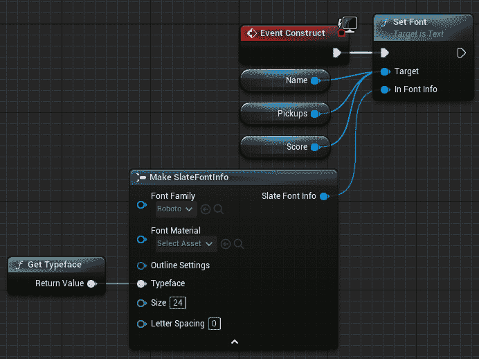

图 18.11 – 设置名称、得分和拾取计数文本的事件图

在前面的代码中，我们将 `Name`、`Score` 和 `Pickups` 的字体设置为使用 `Bold` 字体类型以突出显示与当前客户端玩家相关的计分板条目。对于其余玩家，使用 `Regular` 字体类型。如果您找不到 `Roboto` 字体，则从下拉选项中选择 **Show Engine Content**。

1.  保存并关闭 `WBP_Scoreboard_Entry`。

1.  打开 `WBP_Scoreboard` 并将 **Canvas Panel** 添加到 **Hierarchy** 面板。

1.  前往 `Pickups Game State` 类型的 `Game State`。

1.  返回到带有 `true` 的 `Scoreboard` 画布面板。

1.  在 `Scoreboard` 中添加一个名为 `PickupsRemaining` 的文本块，将 `Text` 设置为 `100 Pickup(s) Remaining`。

1.  在 `PlayerStates` 中添加一个垂直框，将 `Is Variable` 设置为 `true` 并设置顶部填充为 `50`。你应该有以下内容：

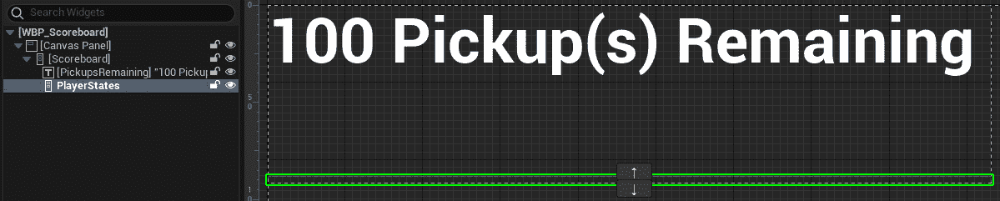

图 18.12 – WBP_Scoreboard 小部件层次结构

1.  将 `PickupsRemaining` 文本块的 `Text` 值绑定到以下函数：

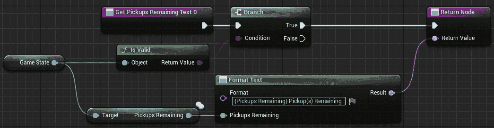

图 18.13 – 显示世界剩余拾取物品的数量

1.  前往 `Add Scoreboard Header`，它将 `WBP_Scoreboard_Header` 的实例添加到 `Player States` 中，如下截图所示：

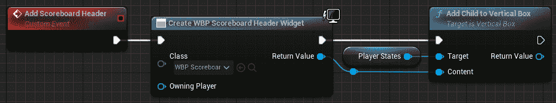

图 18.14 – 添加计分板标题事件

1.  创建一个名为 `Add Scoreboard Entries` 的新事件。该事件按分数顺序遍历所有玩家状态，并将 `WBP_Scoreboard_Entry` 的实例添加到 `Player States` 中，如下截图所示：

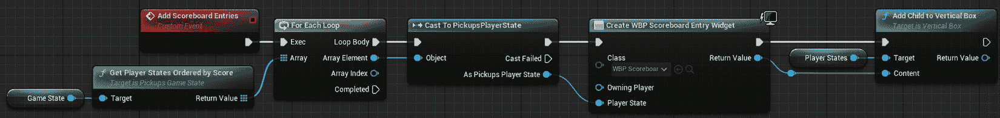

图 18.15 – 添加计分板条目事件

1.  创建一个名为 `Update Scoreboard` 的新事件。该事件清除 `Player States` 中的小部件，并调用 `Add Scoreboard Header` 和 `Add Scoreboard Entries`，如下截图所示：

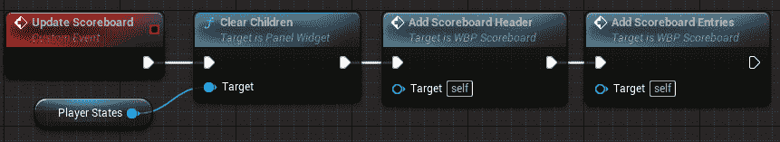

图 18.16 – 更新计分板事件

1.  按以下方式实现 `Event Construct`：

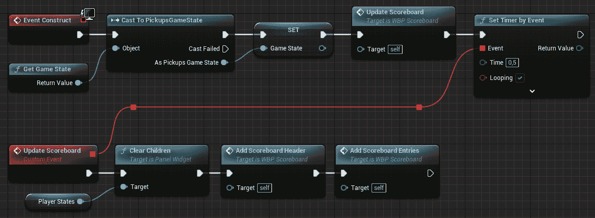

图 18.17 – 事件构造

在前面的代码中，我们获取游戏状态实例，更新计分板，并安排定时器每 `0.5` 秒自动调用 `Update Scoreboard` 事件。

1.  保存并关闭 `WBP_Scoreboard`。

现在，让我们创建玩家控制器的蓝图。按照以下步骤操作：

1.  前往 `Content\Blueprints` 并创建一个名为 `BP_PlayerController` 的新蓝图，它从 `PickupsPlayerController` 类派生。

1.  打开新蓝图并将 `Scoreboard Menu` 设置为使用 `WBP_Scoreboard`。

1.  保存并关闭 `BP_PlayerController`。

接下来，让我们创建游戏模式的蓝图。

1.  创建一个新的蓝图，名为`BP_GameMode`，它从`PickupsGameMode`类派生，打开它，并更改以下变量：

    +   `PickupsGameState`

    +   `BP_PlayerController`

    +   `PickupsPlayerState`

1.  保存并关闭`BP_GameMode`。

1.  接下来，让我们配置**项目设置**，以便它使用新的游戏模式。

1.  转到**项目设置**，从左侧面板中选择**地图和模式**，它位于**项目**类别下。

1.  设置`BP_GameMode`。

1.  关闭**项目设置**。

现在，让我们修改主级别。按照以下步骤操作：

1.  确保你已经打开了`ThirdPersonMap`，位于`Content\ThirdPerson\Maps`。

1.  添加一些立方体演员作为平台。确保它们之间有间隙，迫使玩家跳上去，并可能从级别上掉落。

1.  在地图上添加几个玩家起点演员。

1.  至少添加 50 个`BP_Pickup`实例，并将它们分布在整个地图上。

1.  这里是一个配置地图的可能方式的示例：

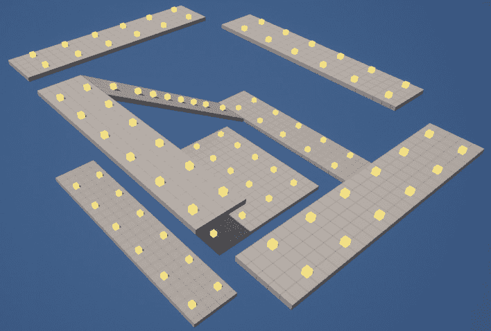

图 18.18 – 地图配置的示例

1.  转到**世界设置**，将**游戏模式覆盖**设置为**无**，并保存一切。

1.  转到`2`。

1.  将窗口大小设置为`800x600`，并使用**新编辑器窗口（PIE）**进行游戏。

你应该得到以下输出：

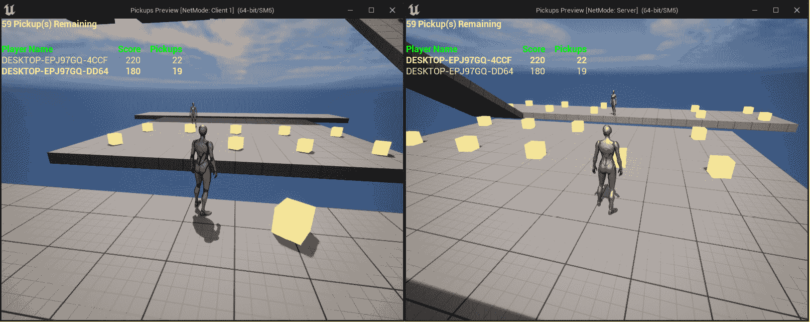

图 18.19 – 监听服务器和客户端 1 在世界中拾取方块

通过完成这个练习，你可以在每个客户端上玩游戏。你会注意到角色可以通过与它们重叠来收集拾取物并获得**10**分。如果一个角色从级别上掉落，它们将在随机的玩家起点重生并失去**10**分。

一旦收集了所有拾取物，游戏将结束，之后**5**秒，它将执行服务器旅行以重新加载同一级别并将所有客户端一起带来。你还会看到 UI 显示级别中剩余的拾取物数量，以及包含每个玩家的姓名、分数和拾取物的计分板。

在下一个活动中，你将添加计分板、死亡/重生概念以及角色在多人 FPS 游戏中拾取武器、弹药、装甲和健康的能力。

# 活动编号 18.01 – 向多人 FPS 游戏添加死亡、重生、计分板、死亡限制和拾取物

在这个活动中，你将添加死亡/重生概念以及角色收集拾取物的能力到我们的多人 FPS 游戏中。我们还将添加计分板和死亡限制，以便游戏有一个最终目标。

按照以下步骤完成此活动：

1.  从*活动 17.01 – 向多人 FPS 游戏添加武器和弹药*中打开`MultiplayerFPS`项目。编译代码并运行编辑器。

1.  创建一个名为 `FPSGameState` 的 C++ 类，它继承自 `GameState` 类，并具有一个击杀限制变量和一个返回按击杀数排序的玩家状态的函数。

1.  创建一个名为 `FPSPlayerState` 的 C++ 类，它继承自 `PlayerState` 类，并存储玩家的击杀数和死亡数。

1.  创建一个名为 `PlayerMenu` 的 C++ 类，它继承自 `UserWidget` 类，并具有一些 `BlueprintImplementableEvent` 函数来切换计分板可见性、设置计分板可见性，并在玩家被击杀时通知。

1.  创建一个名为 `FPSPlayerController` 的 C++ 类，它继承自 `APlayerController`，在拥有客户端上创建 `PlayerMenu` UMG 小部件实例。

1.  创建一个名为 `Pickup` 的 C++ 类，它继承自 `Actor` 类，并具有一个静态网格，该网格在 `Yaw` 轴上每秒旋转 90 度，并且可以在重叠时被玩家拾取。一旦拾取，它将播放拾取声音并禁用碰撞和可见性。经过一段时间后，它将使其可见并能够再次碰撞。

1.  创建一个名为 `AmmoPickup` 的 C++ 类，它继承自 `Pickup` 类，并为玩家添加一定类型的弹药。

1.  创建一个名为 `ArmorPickup` 的 C++ 类，它继承自 `Pickup` 类，并为玩家添加一定量的护甲。

1.  创建一个名为 `HealthPickup` 的 C++ 类，它继承自 `Pickup` 类，并为玩家添加一定量的生命值。

1.  创建一个名为 `WeaponPickup` 的 C++ 类，它继承自 `Pickup` 类，并为玩家添加一定类型的武器。如果玩家已经拥有该武器，则添加一定量的弹药。

1.  编辑 `FPSCharacter` 类，使其执行以下操作：

    +   在角色受损后，它检查角色是否死亡。如果已死亡，则注册杀手角色的击杀和玩家的死亡，并重新生成玩家。如果角色未死亡，则在拥有客户端上播放疼痛声音。

    +   当角色死亡并执行 `EndPlay` 函数时，它应该销毁其所有武器实例。

    +   如果角色从世界中坠落，它将注册玩家的死亡并重新生成。

    +   如果玩家按下 *Tab* 键，它将切换计分板菜单的可见性。

1.  编辑 `MultiplayerFPSGameModeBase` 类，使其执行以下操作：

    +   使用 `GameMode` 类而不是 `GameModeBase`。

    +   存储赢得游戏所需的击杀数。

    +   使用我们自定义的玩家控制器、玩家状态和游戏状态类。

    +   使其实现比赛状态函数，以便比赛立即开始，并在有玩家达到所需击杀数时结束。

    +   当比赛结束时，它将在 `5` 秒后执行服务器旅行到同一级别。

    +   处理玩家死亡的情况，通过向相应的玩家状态添加击杀（当被其他玩家击杀时）和死亡，并在随机玩家起点重新生成玩家。

1.  将 `AmmoPickup.wav` 从 `Activity18.01\Assets` 导入到 `Content\Pickups\Ammo` 中。

1.  从 `AmmoPickup` 创建 `BP_PistolBullets_Pickup`，将其放置在 `Content\Pickups\Ammo` 中，并配置以下值：

    +   `(X=0.5, Y=0.5, Z=0.5)`

    +   `Engine\BasicShapes\Cube`

    +   `Content\Weapon\Pistol\MI_Pistol`

    +   `Pistol Bullets`

    +   `25`

    +   `Content\Pickup\Ammo\AmmoPickup`

1.  从 `AmmoPickup` 创建 `BP_MachineGunBullets_Pickup`，将其放置在 `Content\Pickups\Ammo` 中，并配置以下值：

    +   `(X=0.5, Y=0.5, Z=0.5)`

    +   `Engine\BasicShapes\Cube`

    +   `Content\Weapon\MachineGun\MI_MachineGun`

    +   `Machine Gun Bullets`

    +   `50`

    +   `Content\Pickup\Ammo\AmmoPickup`

1.  从 `AmmoPickup` 创建 `BP_Slugs_Pickup`，将其放置在 `Content\Pickups\Ammo` 中，并配置以下值：

    +   `(X=0.5, Y=0.5, Z=0.5)`

    +   `Engine\BasicShapes\Cube`

    +   `Content\Weapon\Railgun\MI_Railgun`

    +   `Slugs`

    +   `5`

    +   `Content\Pickup\Ammo\AmmoPickup`

1.  将 `ArmorPickup.wav` 从 `Activity18.01\Assets` 导入到 `Content\Pickups\Armor` 中。

1.  在 `Content\Pickups\Armor` 中创建 `M_Armor` 材质，将 `Base Color` 设置为 `蓝色`，将 `Metallic` 设置为 `1`。

1.  从 `ArmorPickup` 创建 `BP_Armor_Pickup`，将其放置在 `Content\Pickups\Armor` 中，并配置以下值：

    +   `(X=1.0, Y=1.5, Z=1.0)`

    +   `Engine\BasicShapes\Cube`

    +   `Content\Pickup\Armor\M_Armor`

    +   `50`

    +   `Content\Pickup\Armor\ArmorPickup`

1.  将 `HealthPickup.wav` 从 `Activity18.01\Assets` 导入到 `Content\Pickups\Health` 中。

1.  在 `Content\Pickups\Health` 中创建 `M_Health` 材质，将 `Base Color` 设置为 `绿色`，将 `Metallic`/`Roughness` 设置为 `0.5`。

1.  从 `HealthPickup` 创建 `BP_Health_Pickup`，将其放置在 `Content\Pickups\Health` 中，并配置以下值：

    +   `Engine\BasicShapes\Sphere`

    +   `Content\Pickup\Health\M_Health`

    +   `50`

    +   `Content\Pickup\Health\HealthPickup`

1.  将 `WeaponPickup.wav` 从 `Activity18.01\Assets` 导入到 `Content\Pickups\Weapon` 中。

1.  从 `WeaponPickup` 创建 `BP_Pistol_Pickup`，将其放置在 `Content\Pickups\Weapon` 中，并配置以下值：

    +   `Content\Pickup\Weapon\SM_Weapon`

    +   `Content\Weapon\Pistol\MI_Pistol`

    +   `Pistol`

    +   `25`

    +   `Content\Pickup\Weapon\WeaponPickup`

1.  从 `WeaponPickup` 创建 `BP_MachineGun_Pickup`，将其放置在 `Content\Pickups\Weapon` 中，并配置以下值：

    +   `Content\Pickup\Weapon\SM_Weapon`

    +   `Content\Weapon\MachineGun\MI_MachineGun`

    +   `Machine Gun`

    +   `50`

    +   `Content\Pickup\Weapon\WeaponPickup`

1.  从 `WeaponPickup` 创建 `BP_Railgun_Pickup`，将其放置在 `Content\Pickups\Weapon` 中，并配置以下值：

    +   `Content\Pickup\Weapon\SM_Weapon`

    +   `Content\Weapon\Railgun\MI_Railgun`

    +   `Railgun`

    +   `5`

    +   `Content\Pickup\Weapon\WeaponPickup`

1.  将 `Land.wav` 和 `Pain.wav` 从 `Activity18.01\Assets` 导入到 `Content\Player\Sounds` 中。

1.  编辑 `BP_Player`，使其使用 `Pain` 和 `Land` 声音，并在 `Begin Play` 事件中删除创建和添加 `WBP_HUD` 实例到视口的节点。

1.  在 `Content\UI` 中创建一个名为 `WBP_Scoreboard_Entry` 的 UMG 小部件，用于显示 `FPSPlayerState` 的名称、击杀数、死亡数和 ping。

1.  创建一个名为 `WBP_Scoreboard_Header` 的 UMG 小部件，用于显示名称、击杀数、死亡数和 ping 的标题。

1.  创建一个名为 `WBP_Scoreboard` 的 UMG 小部件，用于显示游戏状态中的击杀限制，一个包含 `WBP_Scoreboard_Header` 作为第一个条目的垂直框，然后为游戏状态实例中的每个 `FPSPlayerState` 添加一个 `WBP_Scoreboard_Entry`。垂直框将通过计时器每 `0.5` 秒更新一次，通过清除其子项并重新添加它们来实现。

1.  编辑 `WBP_HUD`，以便添加一个名为 `Killed` 的新文本块，其 `Visibility` 设置为 `Hidden`。当玩家击杀某人时，它将使文本块可见，显示被击杀玩家的名称，并在 `1` 秒后隐藏。

1.  从 `PlayerMenu` 创建一个名为 `WBP_PlayerMenu` 的新蓝图，并将其放置在 `Content\UI` 中。使用一个带有 `WBP_HUD` 实例的 widget switcher，将其索引设置为 `0`，并使用一个带有 `WBP_Scoreboard` 实例的 widget switcher，将其索引设置为 `1`。在事件图中，确保覆盖了在 C++ 中设置为 `BlueprintImplementableEvent` 的 `Toggle Scoreboard`、`Set Scoreboard Visibility` 和 `Notify Kill` 事件。`Toggle Scoreboard` 事件在 `0` 和 `1` 之间切换 widget switcher 的活动索引，`Set Scoreboard Visibility` 事件将 widget switcher 的活动索引设置为 `0` 或 `1`，而 `Notify Kill` 事件告诉 `WBP_HUD` 实例设置文本并在 1 秒后隐藏它。

1.  从 `FPSPlayerController` 创建 `BP_PlayerController`，将其放置在 `Content` 文件夹中，并将 `PlayerMenuClass` 变量设置为使用 `WBP_PlayerMenu`。

1.  编辑 `BP_GameMode` 并将 `Player Controller Class` 设置为使用 `BP_PlayerController`。

1.  创建名为 `IA_Scoreboard` 的输入操作，使用 *Tab* 键切换计分板，并更新 `IMC_Player`。

1.  编辑 `DM-Test` 级别，确保至少有三个新玩家起点放置在不同的位置。然后，放置每个不同拾取物的实例。

1.  在 `-500`。

**预期输出**:

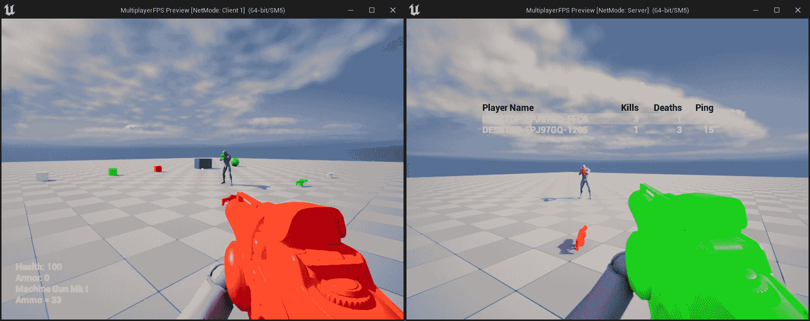

图 18.20 – 活动的预期输出

结果应该是一个项目，其中每个客户端的角色都可以使用并切换到三种不同的武器。如果一个角色击杀了另一个角色，它应该记录击杀和死亡，并在随机玩家起点复活被击杀的角色。你应该有一个显示每个玩家的名称、击杀数、死亡数和 ping 的计分板。一个角色可以从关卡中坠落，这应该只算作一次死亡，并在随机玩家起点复活。角色还应该能够拾取关卡中的不同拾取物以获得弹药、护甲、生命值和武器。当达到击杀限制时，游戏应该通过显示计分板并在 5 秒后将服务器移动到同一关卡来结束。

注意

这个活动的解决方案可以在 GitHub 上找到：[`github.com/PacktPublishing/Elevating-Game-Experiences-with-Unreal-Engine-5-Second-Edition/tree/main/Activity%20solutions`](https://github.com/PacktPublishing/Elevating-Game-Experiences-with-Unreal-Engine-5-Second-Edition/tree/main/Activity%20solutions)。

# 摘要

在本章中，你了解到游戏框架类实例存在于某些特定的游戏实例中，而不是所有实例中。你还学习了游戏状态和玩家状态类的作用，以及游戏模式的新概念和一些有用的内置功能。

在本章的结尾，你创建了一个基本但功能齐全的多人射击游戏，可以作为构建的基础。你添加了新的武器、弹药类型、射击模式、拾取物等，使其功能更完善，游戏性更强。

完成这本书后，你应该现在对如何使用 UE5 使游戏栩栩如生有了更好的理解。我们在本书中涵盖了众多主题，从简单到更高级。你从学习如何使用不同的模板创建项目开始，然后学习了如何使用蓝图创建演员和组件。接着，你学习了如何从头开始创建一个完全功能的**第三人称**模板，包括导入所需的资产、设置动画蓝图、混合空间、游戏模式和角色，以及定义和处理输入。

然后，你开始了你的第一个项目——一个简单的潜行游戏，它使用了游戏物理和碰撞、弹道运动组件、演员组件、接口、蓝图功能库、UMG、声音和粒子效果。在此之后，你学习了如何通过使用 AI、动画蒙太奇和可破坏网格来创建一个简单的横向卷轴游戏。最后，你学习了如何通过使用服务器-客户端架构、变量复制和 RPCs 来创建一个第一人称多人射击游戏，以及玩家状态、游戏状态和游戏模式类的工作原理。

通过参与使用不同部分 Unreal Engine 的多个项目，你现在对 UE5 的工作原理有了深刻的理解。尽管这本书的内容到此结束，但这只是你进入使用 UE5 进行游戏开发世界的旅程的开始。
