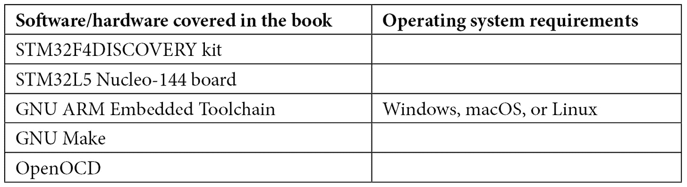

# 前言

由于微电子制造商和设计师在技术进步方面取得的成果，嵌入式系统在过去二十年里变得越来越受欢迎，这些成果旨在提高计算能力并减小微处理器和外设逻辑的尺寸。

设计、实现和集成这些系统的软件组件通常需要直接针对硬件功能的方法，在这种情况下，任务在单个线程中实现，没有操作系统提供抽象以访问 CPU 功能和外部外设。因此，嵌入式开发被认为是软件开发宇宙中的一个独立领域，其中开发者的方法和工作流程需要相应地调整。

本书简要介绍了典型嵌入式系统的硬件架构，介绍了开始开发目标架构所需的工具和方法，然后引导读者通过系统功能和外设交互进行操作。一些领域，如能效和连接性，被更详细地讨论，以更接近地了解设计低功耗和连接系统的技术。在本书的后期，从单个系统组件的实现开始，构建了一个更复杂的设计，其中包含一个（简化的）实时操作系统。最后，在本版的第二版中，我们增加了对 TrustZone-M 实现的分析，这是 ARM 作为其最新嵌入式微控制器系列的一部分引入的 TEE 技术。

讨论通常集中在特定的安全和安全机制上，通过建议旨在提高系统对应用程序代码中的编程错误或甚至恶意尝试破坏其完整性的鲁棒性的特定技术。

# 本书面向对象

如果你是一名希望了解嵌入式编程的软件开发者或设计师，这本书就是为你准备的。如果你是一名经验较少或初学者嵌入式程序员，愿意扩展你对嵌入式系统的知识，这本书也会很有用。更有经验的嵌入式软件工程师可能会发现这本书对刷新他们对设备驱动程序内部、内存安全性、安全数据传输、权限分离和安全执行域的知识很有帮助。

# 本书涵盖的内容

*第一章*, *嵌入式系统——实用方法*, 是基于微控制器嵌入式系统的入门介绍。本书的范围从“嵌入式系统”的更广泛定义到将要分析的领域——具有物理内存映射的 32 位微控制器——得到了明确界定。

*第二章*, *工作环境和工作流程优化*，概述了使用的工具和开发工作流程。这是对工具链、调试器和仿真器的介绍，这些工具可以用来生成二进制格式的代码，该代码可以上传并在目标平台上运行。

*第三章*, *架构模式*，主要关于协作开发和测试的策略和开发方法。本章提出了在开发和测试嵌入式系统软件时通常使用的流程的描述。

*第四章*, *启动过程*，分析了嵌入式系统的启动阶段、启动阶段和引导加载程序。它包含了对启动代码及其用于将软件分成几个启动阶段的机制的详细描述。

*第五章*, *内存管理*，通过指出常见陷阱并解释如何避免可能导致应用程序代码中不可预测或不良行为的内存错误，提出了一些内存管理的最佳策略。

*第六章*, *通用外围设备*，介绍了访问 GPIO 引脚和其他通用集成外围设备的方法。这是目标平台与外部世界的第一次交互，使用电信号执行简单的输入/输出操作。

*第七章*, *本地总线接口*，指导您如何集成串行总线控制器（UART、SPI 和 I2C）。通过解释与嵌入式系统中常见的收发器交互所需的代码，引入了对最常见的总线通信协议的代码导向、详细分析。

*第八章*, *电源管理和节能*，探讨了在节能系统中减少功耗的技术。设计低功耗和超低功耗嵌入式系统需要执行特定步骤以在运行所需任务的同时减少能耗。

*第九章*, *分布式系统和物联网架构*，介绍了构建分布式和连接系统所需的可用协议和接口。物联网系统需要使用第三方库实现的标准化网络协议与远程端点进行通信。特别关注使用安全套接字在端点之间确保通信的安全性。

*第十章*, *并行任务和调度*，通过实现实时任务调度器来解释多任务操作系统的基础设施。本章提出了三种从头开始实现微控制器操作系统的方法，使用不同的调度器（协作、抢占和安全的）。

*第十一章*，*可信执行环境*，描述了在嵌入式系统中通常可用的 TEE 机制，并提供了使用 ARM TrustZone-M 运行安全和非安全域的示例。在现代微控制器中，TEE 提供了通过限制从非安全执行域访问来保护特定内存区域或外围设备的机会。

# 为了充分利用本书

预期您精通 C 语言并了解计算机系统的工作原理。需要一个 GNU 或 Linux 开发机器来应用所解释的概念。有时需要通过提供的示例代码来完全理解实现的机制。鼓励您修改、改进和重用提供的示例，并应用建议的方法。



有关请求工具的附加使用说明可在*第二章**，工作环境和* *工作流程优化*中找到。

**如果您正在使用本书的数字版，我们建议您亲自输入代码或从本书的 GitHub 仓库（下一节中提供链接）获取代码。这样做将帮助您避免与代码的复制和粘贴相关的任何潜在错误** **。**

# 下载示例代码文件

您可以从 GitHub 下载本书的示例代码文件：[`github.com/PacktPublishing/Embedded-Systems-Architecture-Second-Edition`](https://github.com/PacktPublishing/Embedded-Systems-Architecture-Second-Edition)。如果代码有更新，它将在 GitHub 仓库中更新。

我们还从我们丰富的书籍和视频目录中提供了其他代码包，可在[`github.com/PacktPublishing/`](https://github.com/PacktPublishing/)找到。查看它们吧！

# 下载彩色图像

我们还提供了一份包含本书中使用的截图和图表彩色图像的 PDF 文件。您可以从这里下载：[`packt.link/kVMr1`](https://packt.link/kVMr1)。

# 使用的约定

本书使用了多种文本约定。

`文本中的代码`：表示文本中的代码单词、数据库表名、文件夹名、文件名、文件扩展名、路径名、虚拟 URL、用户输入和 Twitter 用户名。以下是一个示例：“必须从命令行调用提供一个单独的配置文件，在`/scripts`目录下提供多个平台和开发板配置。”

代码块设置如下：

```cpp
  /* Jump to non secure app_entry */  asm volatile("mov r12, %0" ::"r"     ((uint32_t)app_entry - 1));  asm volatile("blxns   r12" );
```

当我们希望您注意代码块中的特定部分时，相关的行或项目将以粗体显示：

```cpp
   Secure Area 1:
     SECWM1_PSTRT : 0x0  (0x8000000)
     SECWM1_PEND  : 0x39  (0x8039000)
```

任何命令行输入或输出都按以下方式编写：

```cpp
$ renode /opt/renode/scripts/single-node/stm32f4_discovery.resc
```

调试器控制台的命令按以下方式编写：

```cpp
    > add-symbol-file app.elf 0x1000
    > bt full
```

小贴士或重要注意事项

看起来像这样。

# 联系我们

我们始终欢迎读者的反馈。

`customercare@packtpub.com`并在您的消息主题中提及本书标题。

**勘误表**：尽管我们已经尽一切努力确保内容的准确性，但错误仍然可能发生。如果您在此书中发现错误，我们将非常感激您能向我们报告。请访问[www.packtpub.com/support/errata](http://www.packtpub.com/support/errata)并填写表格。

`copyright@packt.com`，并附有链接到该材料。

**如果您有兴趣成为作者**：如果您在某个领域有专业知识，并且您有兴趣撰写或为书籍做出贡献，请访问[authors.packtpub.com](http://authors.packtpub.com)。

# 分享您的想法

一旦您阅读了《嵌入式系统架构 第 2 版》，我们非常乐意听到您的想法！请[点击此处直接转到该书的亚马逊评论页面](https://packt.link/r/1-803-23954-9)并分享您的反馈。

您的评论对我们和科技社区非常重要，并将帮助我们确保我们提供高质量的内容。

# 下载此书的免费 PDF 副本

感谢您购买此书！

您喜欢在路上阅读，但无法携带您的印刷书籍到处走吗？

您的电子书购买是否与您选择的设备不兼容？

不要担心，现在，随着每本 Packt 书籍的购买，您都可以免费获得该书的 DRM 免费 PDF 版本。

在任何地方、任何设备上阅读。直接从您最喜欢的技术书籍中搜索、复制和粘贴代码到您的应用程序中。

优惠不会就此结束，您还可以获得独家折扣、时事通讯和每日免费内容的每日电子邮件。

按照以下简单步骤获取福利：

1.  扫描下面的二维码或访问以下链接：


[`packt.link/free-ebook/9781803239545`](https://packt.link/free-ebook/9781803239545)

1.  提交您的购买证明

1.  就这样！我们将直接将您的免费 PDF 和其他福利发送到您的电子邮件。

# 第一部分 - 嵌入式系统开发简介

本部分提供了一个俯瞰嵌入式开发的视角，解释了它与开发者可能熟悉的其他技术领域的不同之处。第二章帮助将开发者的工作站转变为实际的硬件/软件开发实验室，并优化了开发、测试、调试和部署嵌入式软件所需的步骤。

本部分包含以下章节：

+   *第一章*，*嵌入式系统——实用方法*

+   *第二章*，*工作环境和工作流程优化*
