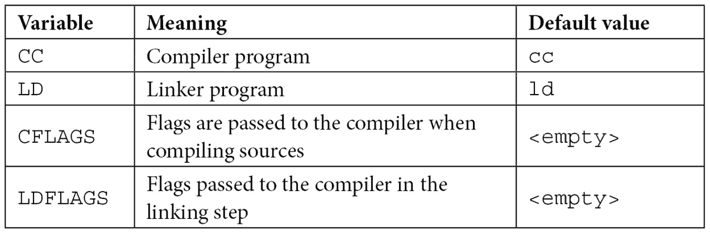
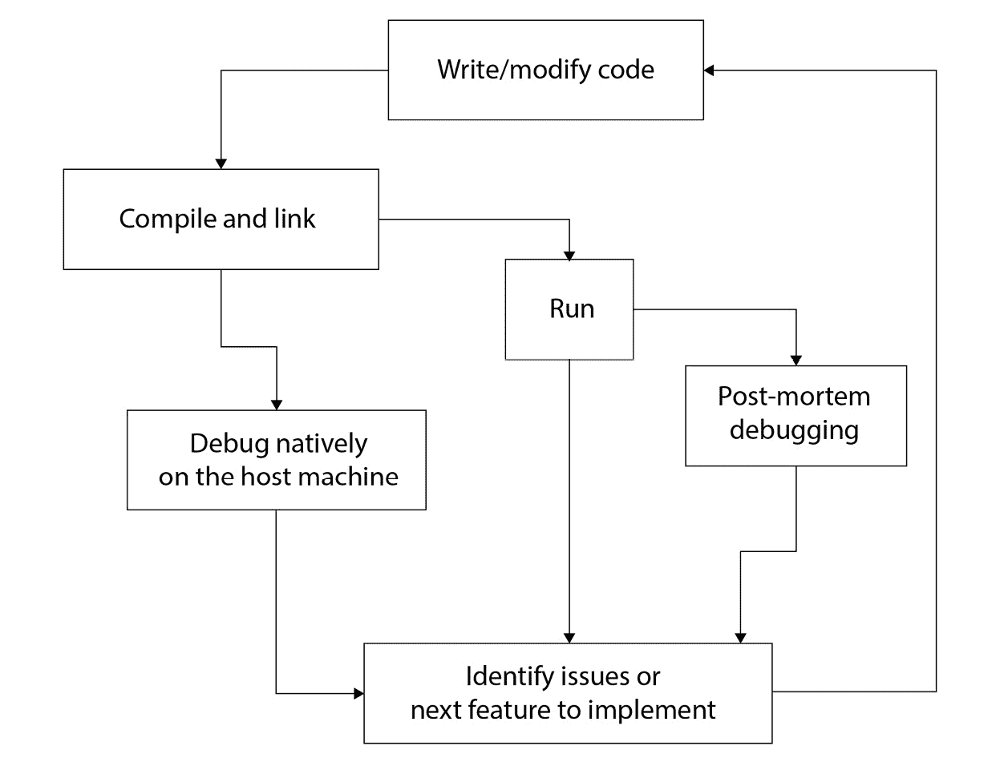
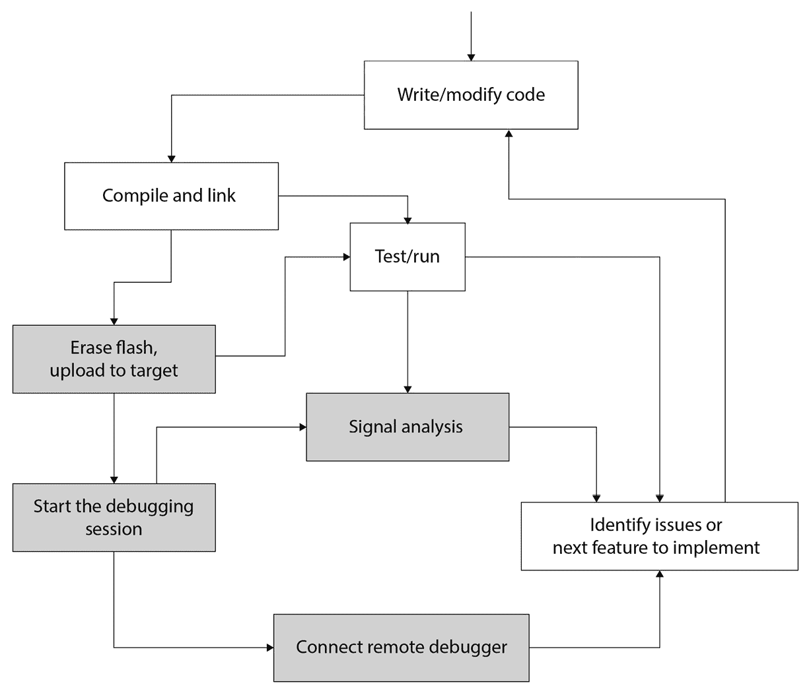
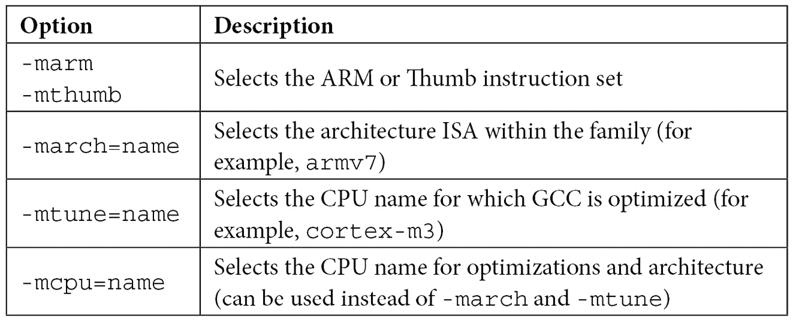
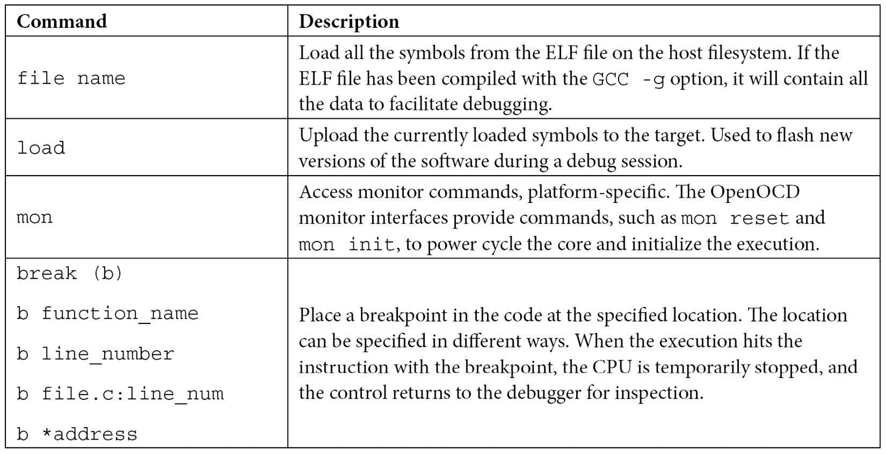
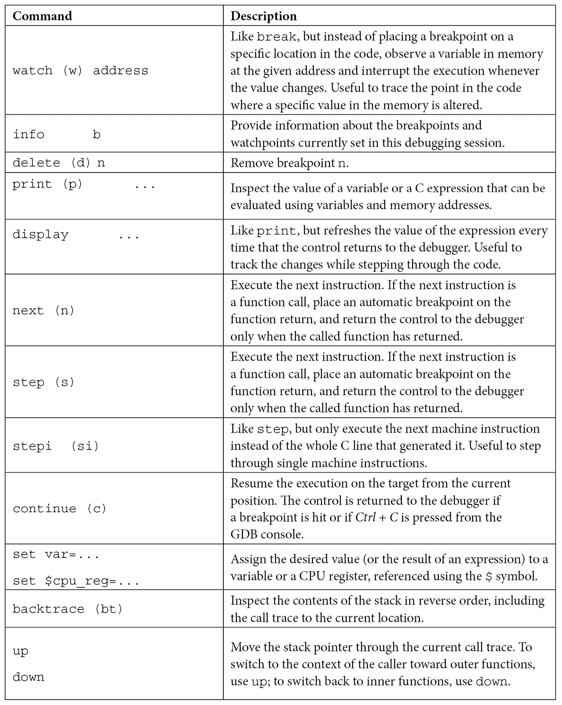

# 2

# 工作环境和工作流程优化

成功软件项目的第一步是选择合适的工具。嵌入式开发需要一套硬件和软件工具，这些工具可以简化开发者的工作，并可能显著提高生产率和缩短总开发时间。本章提供了这些工具的描述，并给出了如何使用它们来改进工作流程的建议。

第一部分为我们概述了原生 C 编程中的工作流程，并逐步揭示了将模型转换为嵌入式开发环境所需的必要变化。通过对其组件的分析，介绍了**GCC 工具链**，这是一套用于构建嵌入式应用的开发工具。

最后，在最后两节中，提出了与目标机交互的策略，以提供对在平台上运行的嵌入式软件进行调试和验证的机制。

本章涵盖的主题如下：

+   工作流程概述

+   文本编辑器与集成环境

+   GCC 工具链

+   与目标机的交互

+   验证

到本章结束时，你将学会如何通过遵循一些基本规则，保持对测试准备的关注，以及一种智能的调试方法，来创建一个优化的工作流程。

# 工作流程概述

使用 C 语言编写软件，以及在其他任何编译型语言中，都需要将代码转换成特定目标机的可执行格式才能运行。C 语言可以在不同的架构和执行环境中进行移植。程序员依赖于一系列工具来编译、链接、执行和调试软件到特定目标。

构建嵌入式系统的固件映像依赖于一套类似的工具，这些工具可以为特定目标生成固件映像，称为**工具链**。本节概述了编写 C 语言软件和生成可直接在编译它们的机器上运行的程序的常用工具集。然后，工作流程必须扩展并适应，以集成工具链组件并为目标平台生成可执行代码。

## C 编译器

**C 编译器**是一种负责将源代码翻译成机器代码的工具，该代码可以被特定的 CPU 解释。每个编译器只能为一种环境生成机器代码，因为它将函数翻译成特定机器的指令，并且它被配置为使用特定架构的地址模型和寄存器布局。大多数 GNU/Linux 发行版中包含的本地编译器是**GNU 编译器集合**，通常称为**GCC**。GCC 是一个自 1987 年以来在 GNU 通用公共许可证下分发的免费软件编译器系统，自那时起，它已成功用于构建类 UNIX 系统。系统中的 GCC 可以编译 C 代码，生成能够在与编译器运行的机器相同架构上运行的应用程序和库。

GCC 编译器以`.c`扩展名的源代码文件作为输入，并生成包含函数和变量初始值的对象文件，这些函数和变量从输入源代码翻译成机器指令。编译器可以被配置在编译结束时执行针对目标平台的特定优化步骤，并插入调试数据以方便后续调试。

使用主机编译器将源文件编译成对象的简约命令行只需要`-c`选项，指示 GCC 程序将源代码编译成同名的对象：

```cpp
$ gcc -c hello.c
```

此声明将尝试编译包含在`hello.c`文件中的 C 源代码，并将其转换为存储在新建的`hello.o`文件中的特定机器代码。

为特定目标平台编译代码需要一套为此目的设计的工具。存在针对特定架构的编译器，它们提供创建特定目标机器指令的编译器，与构建机器不同。为不同目标生成代码的过程称为**交叉编译**。**交叉编译器**在开发机器（主机）上运行，以生成可在目标上执行的特定机器代码。

在下一节中，介绍了一个基于 GCC 的工具链，作为为嵌入式目标创建固件的工具。那里描述了 GCC 编译器的语法和特性。

构建由单独模块组成的程序的第一步是将所有源代码编译成目标文件，以便系统所需的组件在最终步骤中分组和组织在一起，该步骤包括链接所有必需的符号并安排内存区域以准备最终的可执行文件，这由工具链中的另一个专用组件完成。

## 链接器

**链接器**是组合可执行程序并解决作为输入提供的对象文件之间依赖关系的工具。

链接器生成的默认可执行格式是**可执行和链接格式**（**ELF**）。在许多 Unix 和 Unix-like 系统中，ELF 是程序的默认标准格式，对象、共享库甚至 GDB 核心转储。该格式已被设计用于在磁盘和其他媒体上存储程序，以便宿主操作系统可以通过在 RAM 中加载指令并分配程序数据的空间来执行它。

可执行文件被划分为多个部分，这些部分可以映射到程序执行所需的内存中的特定区域。ELF 文件以一个包含指向文件内部各个部分的指针的头部开始，这些部分包含程序的代码和数据。

链接器将描述可执行程序内容的区域映射到以`.`（点）开头的一般部分。运行可执行文件所需的最小部分集合包括以下内容：

+   `.text`：包含程序的代码，以只读模式访问。它包含程序的执行指令。编译进对象文件中的函数由链接器安排在这个部分，程序总是在这个内存区域中执行指令。

+   `.rodata`：包含不能在运行时更改的常量值。编译器将其作为存储常量的默认部分，因为它不允许在运行时修改存储的值。

+   `.data`：包含程序所有初始化变量的值，在运行时以读写模式访问。它是包含所有变量（静态或全局）的部分，这些变量已在代码中初始化。在执行之前，该区域通常被重新映射到 RAM 中的可写位置，并在程序初始化期间自动复制 ELF 的内容，在运行时，在执行主函数之前。

+   `.bss`：这是一个为未初始化数据保留的部分，在运行时以读写模式访问。它的名字来源于 20 世纪 50 年代为 IBM 704 编写的旧微代码中的古老汇编指令。它最初是`main()`函数的缩写。

当在宿主机器上构建本地软件时，链接步骤的许多复杂性都被隐藏了，但链接器默认配置为将编译的符号安排到特定的部分，这些部分可以在程序执行时由操作系统用于在进程虚拟地址空间中分配相应的段。可以通过简单地调用`gcc`来为宿主机器创建一个可工作的可执行文件，这次不使用`-c`选项，提供必须链接在一起以生成 ELF 文件的对象文件列表。`-o`选项用于指定输出文件名，否则默认为`a.out`：

```cpp
$ gcc -o helloworld hello.o world.o
```

此命令将尝试构建`helloworld`文件，这是一个主机系统的 ELF 可执行文件，使用先前编译到两个对象中的符号。

在嵌入式系统中，情况略有不同，因为引导裸机应用程序意味着在链接时必须将部分映射到内存中的物理区域。为了指示链接器将部分关联到已知的物理地址，必须提供一个自定义链接脚本文件，描述可执行裸机应用程序的内存布局，并提供可能由目标系统需要的附加自定义部分。

在“链接可执行文件”部分将提供对链接步骤的更详细解释。

## Make：构建自动化工具

有几种开源工具可用于自动化构建过程，其中一些在不同开发环境中被广泛使用。**Make**是标准的 UNIX 工具，用于自动化从源代码创建所需二进制图像的步骤，检查每个组件的依赖关系，并按正确顺序执行步骤。Make 是一个标准的**POSIX 工具**，它是许多类 UNIX 系统的一部分。在 GNU/Linux 发行版中，它作为一个独立工具实现，是 GNU 项目的一部分。从现在开始，GNU Make 实现将简单地称为 Make。

Make 设计为通过在命令行上不带参数简单地调用`make`命令来执行默认构建，前提是工作目录中存在**makefile**。makefile 是一个特殊的指令文件，包含构建所有所需文件直到生成预期输出文件的规则和配方。提供类似构建自动化解决方案的开源替代品存在，例如 CMake 和 SCons，但本书中的所有示例都是使用 Make 构建的，因为它提供了一个简单且足够基本的构建系统控制环境，并且它是**POSIX**标准化的。

一些集成开发环境使用内置机制来协调构建步骤或生成 makefile，在用户请求构建输出文件时自动调用 Make。然而，手动编辑 makefile 可以完全控制生成最终图像的中间步骤，用户可以自定义用于生成所需输出文件的配方和规则。

对于交叉编译针对 Cortex-M 目标的代码，不需要安装特定版本，但在编写 makefile 中的目标和指令时，需要考虑一些额外参数，例如工具链二进制文件的位置或编译器需要的特定标志。

使用构建过程的一个优点是，目标可能具有来自其他中间组件的隐式依赖关系，这些依赖关系在编译时自动解决。如果所有依赖关系都正确配置，makefile 确保仅在需要时执行中间步骤，当只有少数源文件被更改或单个目标文件被删除时，可以减少整个项目的编译时间。

Makefile 有特定的语法来描述规则。每个规则以期望作为规则输出的目标文件开始，后面跟着一个冒号和先决条件的列表，这些先决条件是执行规则所需的文件。随后是一系列配方项，每个配方项描述 Make 将执行的动作以创建所需的目标：

```cpp
target: [prerequisites]
 recipe
 recipe
 ...
```

默认情况下，Make 将在解析文件时执行遇到的第一个规则，如果命令行中没有指定规则名称。如果任何先决条件不可用，Make 将自动在相同的 makefile 中查找可以递归创建所需文件的规则，直到满足需求链。

Makefile 可以在执行时将自定义文本字符串分配给内部变量。变量名可以使用 `=` 运算符分配，并通过在它们前面加上 `$` 来引用。例如，以下赋值用于将两个目标文件的名称放入 `OBJS` 变量中：

```cpp
OBJS = hello.o world.o
```

在规则中自动分配的一些重要变量如下：


表 2.1 – 可用于 makefile 脚本中的某些自动变量

这些变量在配方动作行中使用起来很方便。例如，从两个目标文件生成 `helloworld` ELF 文件的配方可以写成如下：

```cpp
helloworld: $(OBJS)
 gcc -o $(@) $(^)
```

一些规则是由 Make 隐式定义的。例如，从各自的源文件创建 `hello.o` 和 `world.o` 文件的规则可以省略，因为 Make 期望能够以最明显的方式获得这些目标文件中的每一个，即如果存在，通过编译同名 C 源文件。这意味着这个最小化 makefile 已经能够从源文件编译这两个目标文件，并使用宿主系统的默认选项将它们链接在一起。

如果可执行文件与其中一个先决条件对象（去掉 `.o` 扩展名）同名，链接配方也可以是隐式的。如果最终的 ELF 文件名为 `hello`，我们的 makefile 可以简单地变成以下单行：

```cpp
hello: world.o
```

这将自动解决 `hello.o` 和 `world.o` 的依赖关系，然后使用类似于我们在显式目标中使用的隐式链接器配方将它们链接在一起。

隐式规则使用预定义变量，这些变量在规则执行之前自动分配，但可以在 makefile 中修改。例如，可以通过更改`CC`变量来更改默认的编译器。以下是一个重要的变量列表，这些变量可能用于更改隐式规则和配方：例如，它可能更改默认的编译器。以下是一个重要的变量列表，这些变量可能用于更改隐式规则和配方：



表 2.2 – 指定默认工具链和标志的隐式、预定义变量

当为嵌入式平台链接裸机应用程序时，必须相应地修改 makefile，正如本章后面所示，需要几个标志来正确交叉编译源文件并指示链接器使用所需的内存布局来组织内存部分。此外，通常还需要额外的步骤来操作 ELF 文件并将其转换为可以传输到目标系统的格式。然而，makefile 的语法是相同的，这里显示的简单规则与用于构建示例的规则没有太大区别。如果使用隐式规则，默认变量仍然需要调整以修改默认行为。

当在 makefile 中正确配置所有依赖项时，Make 确保只有在目标文件比其依赖项旧时才执行规则，因此当只有少数源文件被修改或单个目标文件被删除时，可以减少整个项目的编译时间。

Make 是一个非常强大的工具，其功能范围远远超出了本书中用于生成示例的少数功能。掌握构建过程的自动化可能有助于优化构建过程。makefile 的语法包括有用的功能，例如条件语句，可以通过使用不同的目标或环境变量调用 makefile 来产生不同的结果。为了更好地理解 Make 的能力，请参阅可用的 GNU Make 手册，网址为[`www.gnu.org/software/make/manual`](https://www.gnu.org/software/make/manual)。

## 调试器

在宿主环境中，调试在操作系统上运行的应用程序是通过运行调试器工具来完成的，该工具可以附加到现有进程或根据可执行 ELF 文件及其命令行参数启动一个新的进程。GCC 套件提供的默认调试选项称为**GDB**，即**GNU 调试器**的缩写。虽然 GDB 是一个命令行工具，但已经开发了几个前端来提供更好的执行状态可视化，并且一些集成开发环境在跟踪正在执行的单独行时提供了与调试器交互的内置前端。

再次强调，当要调试的软件在远程平台上运行时，情况略有变化。可以在开发机上运行与工具链一起分发的 GDB 版本，以连接到远程调试会话。在远程目标上进行的调试会话需要一个中间工具，该工具配置为将 GDB 命令转换为对核心 CPU 和相关硬件基础设施的实际操作，以建立与核心的通信。

一些嵌入式平台提供了硬件断点，这些断点用于在执行所选指令时触发系统异常。

在本章的后面部分，我们将看到如何与目标建立远程 GDB 会话，以便在当前点中断其执行，逐步执行代码，设置断点和观察点，并检查和修改内存中的值。

介绍了一些 GDB 命令，为 GDB 命令行界面提供的某些功能提供快速参考，这些功能可以有效地用于调试嵌入式应用程序。

调试器提供了对软件在运行时正在做什么的最佳理解，并便于在直接查看执行对内存和 CPU 寄存器的影响的同时查找编程错误。

## 嵌入式工作流程

如果与其他领域相比，嵌入式开发生命周期包括一些额外的步骤。代码必须进行交叉编译，然后处理映像并上传到目标，必须运行测试，并且在测量和验证阶段可能需要涉及硬件工具。使用编译语言时，本地应用程序软件的生命周期看起来像这个图表：



图 2.1 – 应用程序开发的典型生命周期

当在同一架构内编写软件时，测试和调试可以在编译后立即进行，通常更容易发现问题。这导致典型循环的时间更短。此外，如果应用程序由于错误而崩溃，底层操作系统可以生成核心转储，这可以在稍后通过调试器进行分析，方法是恢复虚拟内存内容和 CPU 寄存器上下文，在错误出现的那一刻。

另一方面，由于缺乏其他环境中操作系统提供的虚拟地址和内存分段，在嵌入式目标上拦截致命错误可能稍微更具挑战性，因为可能会出现内存和寄存器损坏的潜在副作用。即使某些目标可以通过触发诊断中断来拦截异常情况，例如 Cortex-M 中的硬故障处理程序，恢复生成错误的原始上下文通常是不可能的。

此外，每次生成新的软件时，都需要执行一些耗时步骤，例如将图像转换为特定格式，以及将图像上传到目标本身，这可能需要几秒钟到一分钟的时间，具体取决于图像的大小和与目标通信所使用的接口速度：



图 2.2 – 嵌入式开发生命周期，包括环境所需的其他步骤

在开发的一些阶段，当可能需要多次连续迭代以最终实现功能或检测缺陷时，编译和测试软件之间的时机会影响整个生命周期的效率。软件中实现的具体任务，涉及通过串行或网络接口进行通信，只能通过信号分析或观察对涉及的外围或远程系统的影响来验证。分析嵌入式系统上的电气效应需要一些硬件设置和仪器配置，这会增加更多的时间。

最后，开发由运行不同软件映像的多个设备组成的分布式嵌入式系统可能会导致为这些设备中的每一个重复前面的迭代。在可能的情况下，应通过在每个设备上使用相同的映像和不同的设置配置参数，以及通过实现并行固件升级机制来消除这些步骤。例如，JTAG 协议支持将软件映像上传到共享相同总线的多个目标，这显著减少了固件升级所需的时间，尤其是在涉及更多设备的分布式系统中。

无论预期的项目有多复杂，通常都值得在开始时投入所需的时间来优化软件开发的生命周期，以便在以后提高效率。没有开发者喜欢长时间将注意力从实际的编码步骤上移开，在一个需要太多时间或人工交互才能完成过程的次优环境中工作可能会令人沮丧。

可以使用文本编辑器从头开始创建嵌入式项目，或者通过在集成开发环境中创建新项目。

# 文本编辑器与集成环境之间的比较

虽然这主要取决于开发者的个人喜好，但在嵌入式社区中，关于是使用独立的文本编辑器还是更喜欢将工具链的所有组件集成到一个图形用户界面中的争论仍然存在。

现代集成开发环境（IDE）集成了以下任务的工具：

+   管理项目的组件

+   快速访问所有用于编辑的文件以及上传软件到板上的扩展

+   通过单击开始调试会话

微控制器制造商通常将他们的开发套件与 IDE 一起分发，这使得访问特定于微控制器的先进功能变得容易，这得益于预配置的设置和向导，它们简化了新项目的创建。大多数 IDE 包含用于自动生成特定微控制器引脚复用设置的设置代码的控件，从图形界面开始。其中一些甚至提供模拟器和工具来预测运行时资源使用情况，例如动态内存和功耗。

这些工具中的大多数都是基于 Eclipse 的某种定制，Eclipse 是一个流行的开源桌面集成开发环境（IDE），最初设计为 Java 软件开发的工具，后来由于扩展和自定义界面的可能性，在许多其他领域也非常成功。

使用 IDE 方法也有其缺点。IDE 通常不将实际的工具链嵌入到代码中。相反，它们提供了一个前端界面来与编译器、链接器、调试器和其他工具交互。为此，它们必须将所有标志、配置选项、包含文件的路径以及编译时定义的符号存储在一个机器可读的配置文件中。一些用户发现通过导航 GUI 的多个菜单来访问这些选项很困难。项目的一些其他关键组件，如链接脚本，也可能隐藏在底层，在某些情况下甚至由 IDE 自动生成，难以阅读。然而，对于大多数 IDE 用户来说，这些缺点被集成环境开发的优点所抵消。

尽管如此，还有一个必须考虑的注意事项。项目迟早会被自动构建和测试，正如在 *Make：构建自动化工具* 部分中分析的那样。机器人通常在 IDE 中是糟糕的用户，尽管它们可以使用命令行界面构建和运行任何测试，甚至与真实目标交互。使用 IDE 进行嵌入式开发的开发团队应始终考虑提供通过命令行替代策略构建和测试任何软件的选项。

尽管工具链的一些复杂性可以通过图形用户界面（GUI）进行抽象，但了解底层应用程序集的功能仍然很有用。本章的剩余部分将探讨 GCC 工具链，这是许多 32 位微控制器最受欢迎的跨架构编译器集。

# GCC 工具链

在 IDE 的情况下，其复杂性是通过用户界面进行抽象的，而工具链是一组独立的软件应用程序，每个应用程序都服务于特定的目的。

GCC 是构建嵌入式系统的参考工具链之一，因为它具有模块化结构，允许为多个架构提供后端。由于其开源模型以及从其构建定制工具链的灵活性，基于 GCC 的工具链是嵌入式系统中最受欢迎的开发工具之一。

使用基于命令行的工具链构建软件具有多个优点，包括自动化中间步骤的可能性，这些步骤将所有模块从源代码构建成最终映像。这在需要连续编程多个设备或需要在持续集成服务器上自动化构建时尤其有用。

ARM 为所有最受欢迎的开发主机分发 GNU Arm Embedded Toolchain。工具链以描述目标的三元组为前缀。在 GNU Arm Embedded Toolchain 的情况下，前缀是 `arm-none-eabi`，表示交叉编译器后端配置为为 ARM 生成对象，没有特定于操作系统的 API 支持，并且具有嵌入式 ABI。

## 交叉编译器

与工具链一起分发的交叉编译器是 GCC 的一个变体，后端配置为构建包含特定架构机器代码的对象文件。编译的输出是一组包含只能由特定目标解释的符号的对象文件。`Arm-none-eabi-gcc`，ARM 提供的用于构建微控制器软件的 GCC 变体，可以将 C 代码编译成适用于多个不同目标的机器指令和 CPU 优化。每个架构都需要自己的特定工具链，该工具链将生成特定目标的可执行文件。

GCC 后端对 ARM 架构支持多个机器特定选项，用于选择 CPU 的正确指令集和机器特定优化参数。

下表列出了 GCC 后端作为 `-m` 标志提供的某些 ARM 特定机器选项：



表 2.3 – GCC ARM 特定架构的编译器选项

要编译与通用 ARM Cortex M4 兼容的代码，每次调用编译器时都必须指定 `-mthumb` 和 `-mcpu=cortex-m4` 选项：

```cpp
$ arm-none-eabi-gcc -c test.c -mthumb -mcpu=cortex-m4
```

这个编译步骤产生的 `test.o` 文件与使用 `gcc` 主机从相同源代码编译的文件非常不同。如果比较的不是两个对象文件，而是中间汇编代码，这种差异将更容易理解。实际上，当使用 `-S` 选项调用编译器时，编译器能够创建中间汇编代码文件，而不是编译和组装的对象。

与主机 GCC 编译器类似，有不同级别的可能优化可供激活。在某些情况下，激活大小优化以生成更小的目标文件是有意义的。然而，在开发过程中，非优化映像适合闪存以方便调试过程更为可取，因为编译器可能会更改代码执行的顺序并隐藏某些变量的内容，这使得优化后的代码流更难跟踪。优化参数可以提供在命令行中，以选择所需的优化级别：


表 2.4 – GCC 优化级别

另一个在调试和原型设计过程中经常使用的通用 GCC 命令行选项是 `-g` 标志，它指示编译器在最终对象中保留调试相关数据，以便在调试器中运行时便于访问函数和变量的可读句柄。

为了通知编译器我们正在运行裸机应用程序，使用 `-ffreestanding` 命令行选项。在 GCC 术语中，独立环境由在链接步骤中可能缺少标准库定义，并且最重要的是，此选项会通知编译器它不应期望使用主函数作为程序的入口点或在执行开始之前提供任何前导代码。当为嵌入式平台编译代码时，此选项是必需的，因为它启用了在*第四章*，“*启动过程*”中描述的启动机制。

GCC 程序支持的命令行选项比这里快速介绍的多得多。要获得功能性的更完整概述，请参阅可用的 GNU GCC 手册，网址为 [`gcc.gnu.org/onlinedocs/`](https://gcc.gnu.org/onlinedocs/)。

要在 Make 的自动构建中集成交叉编译工具链，需要在 makefile 中进行一些更改。

假设工具链已正确安装在开发主机上，并且可在其执行路径中访问，则只需更改 makefile 中的默认编译器命令即可使用 `CC` Make 变量：

```cpp
CC=arm-none-eabi-gcc
```

运行编译选项所需的自定义命令行选项可以通过 `CFLAGS` 变量导出：

```cpp
CFLAGS=-mthumb -mcpu=cortex-m4 -ffreestanding
```

使用默认的 makefile 变量，如 `CC` 和 `CFLAGS`，可以启用隐式 makefile 规则，从具有相同名称的 `C` 源文件构建目标文件，以及自定义编译器配置。

## 编译编译器

GCC 工具链的二进制发行版可用于下载到几个特定的目标和主机机器。为了编译适用于 ARM Cortex-M 微处理器的代码，`arm-none-eabi`工具链对大多数 GNU/Linux 发行版可用。然而，在某些情况下，从头开始构建工具链可能很有用。例如，当某个目标的编译器尚未存在或未以二进制格式提供给我们喜欢的开发环境时。这个过程也有助于更好地理解构建工具所需的各个组件。

`menuconfig`内核。在安装 crosstool-NG 后，可以通过以下方式调用配置器：

```cpp
$ ct-ng menuconfig
```

一旦创建了配置，就可以开始构建过程。由于操作需要检索所有组件、修补它们并构建工具链，因此根据主机机器的速度和互联网连接速度，检索所有组件可能需要几分钟。可以通过以下命令启动构建过程：

```cpp
$ ct-ng build
```

预定义的配置可用于编译常用的工具链，主要用于运行 Linux 的目标。当为 Linux 目标编译工具链时，有几个 C 库可供选择。在我们的案例中，因为我们想要一个裸机工具链，所以`newlib`是默认选择。其他几个库提供了 C 标准库子集的实现，例如`uClibc`和`musl`。`newlib`库是一个小型跨平台 C 库，主要设计用于没有操作系统在板上的嵌入式系统，并且作为默认库在许多 GCC 发行版中提供，包括 ARM 分发的`arm-none-eabi`交叉编译器。

## 链接可执行文件

在命令行中使用`-T filename`选项，链接器被要求用包含在 filename 中的自定义脚本替换程序的默认内存布局。

`.ld`扩展名，并且是用特定语言编写的。一般来说，每个编译对象的符号都被分组在最终可执行映像的各个部分中。

脚本可以与 C 代码交互，通过 GCC 特定的与符号关联的属性，导出脚本内部定义的符号，并遵循代码中提供的指示。GCC 提供了`__attribute__`关键字，用于在符号定义前添加，以激活针对每个符号的 GCC 特定、非标准属性。

一些 GCC 属性可以用来向链接器传达以下信息：

+   弱符号，可以被具有相同名称的符号覆盖

+   要存储在 ELF 文件特定部分的符号，在链接脚本中定义

+   隐式使用的符号，这可以防止链接器丢弃符号，因为代码中没有任何地方引用它

`weak`属性用于定义弱符号，可以在代码的任何其他地方通过具有相同名称的另一个定义来覆盖。例如，考虑以下定义：

```cpp
void __attribute__(weak) my_procedure(int x) {/* do nothing */}
```

在这种情况下，过程被定义为不执行任何操作，但可以在代码库的任何其他地方通过再次定义它来覆盖它，使用相同的名称，但这次不带`weak`属性：

```cpp
void my_procedure(int x) { y = x; }
```

链接步骤确保最终的可执行文件恰好包含每个定义的符号的一个副本，如果没有属性，则是指不带属性的副本。这种机制引入了在代码中具有相同功能的不同实现的可能性，这些实现可以通过在链接阶段包含不同的目标文件来更改。这在编写可移植到不同目标的同时仍保持相同抽象的代码时特别有用。

除了在 ELF 描述中所需的默认部分之外，还可以添加自定义部分来存储特定的符号，例如函数和变量，在固定的内存地址。当数据存储在可能在不同时间上传到闪存的闪存页的起始位置时，这很有用，而软件本身可能在不同的时间上传。在某些情况下，这是针对特定目标的设置的情况。

在定义符号时使用自定义 GCC `section`属性确保符号最终位于最终映像中的期望位置。只要在链接器中存在条目来定位它们，部分可以具有自定义名称。以下是如何将`section`属性添加到符号定义的示例：

```cpp
const uint8_t
 __attribute__((section(".keys")))
 private_key[KEY_SIZE] = {0};
```

在这个例子中，数组被放置在`.keys`部分，这需要在链接器脚本中为其创建自己的条目。

被认为是一种良好的实践，让链接器在最终映像中丢弃未使用的符号，尤其是在使用嵌入式应用程序未完全利用的第三方库时。这可以通过 GCC 使用链接器垃圾收集器来完成，通过`-gc-sections`命令行选项激活。如果提供了此标志，代码中未使用的部分将被自动丢弃，未使用的符号也将被排除在最终映像之外。

为了防止链接器丢弃与特定部分关联的符号，`used`属性将符号标记为程序隐式使用。可以在同一声明中列出多个属性，用逗号分隔，如下所示：

```cpp
const uint8_t    __attribute__((used,section(".keys")))
   private_key[KEY_SIZE] = {0};
```

在这个例子中，属性既表明`private_key`数组属于`.keys`部分，又表明它不能被链接器垃圾收集器丢弃，因为它被标记为已使用。

一个用于嵌入式目标的简单链接脚本至少定义了与`RAM`和`FLASH`映射相关的两个部分，并将一些预定义的符号导出以指导工具链的汇编器了解内存区域。基于 GNU 工具链的裸机系统通常从一个`MEMORY`部分开始，描述系统内两个不同区域的映射，如下所示：

```cpp
MEMORY {
  FLASH(rx) : ORIGIN = 0x00000000, LENGTH=256k
  RAM(rwx) : ORIGIN = 0x20000000, LENGTH=64k
}
```

上述代码片段描述了系统使用的两个内存区域。第一个块是 256k 映射到`FLASH`，其中*r 和 x 标志*表示该区域可进行*读取*和*执行*操作。这强制了整个区域的只读属性，并确保没有变体部分被放置在那里。另一方面，RAM 可以直接以写入模式访问，这意味着变量将被放置在该区域内的某个部分。在这个特定示例中，目标将 FLASH 映射在地址空间的开头，而 RAM 从 512 MB 开始映射。每个目标都有自己的地址空间映射和闪存/RAM 大小，这使得链接脚本针对特定目标。

如本章前面所述，`.text`和`.rodata` ELF 部分只能进行读取访问，因此它们可以安全地存储在 FLASH 区域，因为它们在目标运行时不会被修改。另一方面，`.data`和`.bss`必须映射到 RAM 以确保它们可修改。

可以在脚本中添加额外的自定义部分，在需要将额外的部分存储在内存的特定位置时。链接脚本还可以导出与内存中特定位置或动态大小部分的长度相关的符号，这些符号可以称为外部符号，并在 C 源代码中访问。

链接脚本中的第二个语句块称为`SECTIONS`，包含在定义的内存区域特定位置的部分分配。当脚本中的`.`符号与一个变量相关联时，它代表该区域中的当前位置，该位置从可用的低地址开始逐步填充。

每个部分都必须指定它必须映射到的区域。以下示例虽然仍然不完整，无法运行二进制可执行文件，但它展示了如何使用链接脚本部署不同的部分。`.text`和`.rodata`部分映射到闪存内存：

```cpp
SECTIONS
{
    /* Text section (code and read-only data) */
    .text :
    {
        . = ALIGN(4);
        _start_text = .;
        *(.text*) /* code */
        . = ALIGN(4);
        _end_text = .;
        *(.rodata*) /* read only data */
        . = ALIGN(4);
        _end_rodata = .;
} > FLASH
```

可修改的部分映射在 RAM 中，这里有两个特殊情况需要注意。

`AT`关键字用于向链接器指示加载地址，这是`.data`中变量的原始值存储的区域，而实际使用的执行地址在另一个内存区域。关于`.data`部分的加载地址和虚拟地址的更多详细信息，请参阅*第四章*，*启动过程*。

用于 `.bss` 段的 `NOLOAD` 属性确保该段在 ELF 文件中不存储预定义的值。未初始化的全局和静态变量由链接器映射到由链接器分配的 RAM 区域：

```cpp
_stored_data = .;
.data: AT(__stored_data)
{
    . = ALIGN(4);
    _start_data = .;
    *(.data*)
    . = ALIGN(4);
    _start_data = .;
} > RAM
.bss (NOLOAD):
{
    . = ALIGN(4);
    _start_bss = .;
    *(.bss*)
    . = ALIGN(4);
    _end_bss = .;
} > RAM
```

强制链接器保留段在最终可执行文件中的另一种方法是使用 `KEEP` 指令标记段。请注意，这是之前解释的 `__attribute__((used))` 机制的替代方案：

```cpp
.keys :
{
    . = ALIGN(4);
    *(.keys*) = .;
    KEEP(*(.keys*));
} > FLASH
```

通常来说，让链接器创建一个与结果二进制文件并存的 `.map` 文件是有用的，可以通过在链接步骤中添加 `-Map=filename` 选项来实现，如下所示：

```cpp
$ arm-none-eabi-ld -o image.elf object1.o object2.o 
-T linker_script.ld -Map=map_file.map
```

映射文件包含了所有符号的位置和描述，按段分组。这对于在图像中查找符号的具体位置以及验证由于配置错误而意外丢弃的有用符号非常有用。

交叉编译工具链为通用功能提供标准 C 库，例如字符串操作或标准类型声明。这些实际上是操作系统应用程序空间中可用的库调用子集，包括标准输入/输出函数。这些函数的后端实现通常留给应用程序，因此调用需要与硬件交互的库函数，如 `printf`，意味着在库外实现了一个写入函数，提供最终的设备或外围设备传输。

后端写入函数的实现决定了哪个通道将作为嵌入式应用程序的标准输出。链接器能够自动解析对标准库调用的依赖，使用内置的 `newlib` 实现。为了在链接过程中排除标准 C 库符号，可以将 `-nostdlib` 选项添加到传递给 GCC 的链接步骤的选项中。

## 二进制格式转换

尽管包含所有编译符号的二进制格式，ELF 文件前面有一个包含内容描述和指向文件中各段起始位置指针的头部。所有这些额外信息在嵌入式目标上运行时并不需要，因此链接器生成的 ELF 文件必须转换为一个纯二进制文件。工具链中的一个工具 `objcopy` 可以将图像从一种标准格式转换为其他格式，通常的做法是将 ELF 转换为不带符号的原始二进制图像。要将图像从 ELF 转换为二进制格式，请调用以下命令：

```cpp
$ arm-none-eabi-objcopy -I elf -O binary image.elf image.bin
```

这将创建一个名为 `image.bin` 的新文件，该文件包含原始 ELF 可执行文件中的符号，可以上传到目标设备。

即使通常不适用于使用第三方工具直接上传到目标设备，也可以通过调试器加载符号并将它们上传到闪存地址。原始的 ELF 文件对于 GNU 工具链中的其他诊断工具（如 `nm` 和 `readelf`）的目标也很有用，这些工具显示每个模块中的符号，包括它们的类型和相对于二进制图像的相对地址。此外，通过在最终图像或单个对象文件上使用 `objdump` 工具，可以检索到关于图像的多个细节，包括使用 `-d` 反汇编选项可视化整个汇编代码：

```cpp
arm-none-eabi-objdump -d image.elf
```

到目前为止，工具链已为我们提供了在目标微控制器上运行、调试和分析编译软件所需的所有工件。为了传输图像或开始调试会话，我们需要额外的特定工具，下一节将进行描述。

# 与目标交互

为了开发目的，嵌入式平台通常通过 JTAG 或 SWD 接口进行访问。通过这些通信通道，可以将软件上传到目标设备的闪存中，并访问片上调试功能。市场上存在一些自包含的 JTAG/SWD 适配器，可以通过主机上的 USB 进行控制，而一些开发板配备了额外的芯片，用于控制连接到主机的 JTAG 通道。

一个强大的通用开源工具，用于访问目标上的 JTAG/SWD 功能，是 **Open On-Chip Debugger** (**OpenOCD**)。一旦正确配置，它将创建可以用于命令控制台和与调试器前端交互的本地套接字。一些开发板配备了额外的接口，用于与核心 CPU 通信。例如，STMicroelectronics 为 **Cortex-M** 设计的原理图板很少不配备 ST-Link 芯片技术，这允许直接访问调试和闪存操作功能。得益于其灵活的后端，OpenOCD 可以使用不同的传输类型和物理接口（包括 ST-Link 和其他协议）与这些设备通信。支持多种不同的板，配置文件可以在 OpenOCD 中找到。

当启动时，OpenOCD 在预配置的端口上打开两个本地 TCP 服务器套接字，为目标平台提供通信服务。一个套接字提供了一个可以通过 Telnet 访问的交互式命令控制台，而另一个是用于远程调试的 GDB 服务器，如下一节所述。

OpenOCD 伴随两套配置文件集一起分发，这些配置文件描述了目标微控制器和外设（在 `target/` 目录中），以及用于通过 JTAG 或 SWD 与其通信的调试接口（在 `interface/` 目录中）。第三套配置文件（在 `board/` 目录中）包含针对知名系统的配置文件，例如配备接口芯片的开发板，该芯片通过包含正确的文件将两个接口和目标设置结合起来。

为了配置 OpenOCD 以使用 `openocd.cfg` 配置文件：

```cpp
telnet_port 4444
gdb_port 3333
source [find board/stm32f7discovery.cfg]
```

从 `openocd.cfg` 通过 `source` 指令导入的特定于板的配置文件，指示 OpenOCD 使用 ST-Link 接口与目标通信，并为 STM32F 系列微控制器设置所有 CPU 特定选项。

主配置文件中指定的两个端口，使用 `telnet_port` 和 `gdb_port` 指令，指示 OpenOCD 打开两个监听 TCP 套接字。

通常称为监视控制台的第一个套接字可以通过连接到本地的 **4444 TCP 端口**，使用命令行中的 Telnet 客户端来访问：

```cpp
$ telnet localhost 4444
Open On-Chip Debugger
>
```

OpenOCD 初始化、擦除闪存和传输映像的指令序列以以下内容开始：

```cpp
> init
> halt
> flash probe 0
```

执行在软件映像的开始处停止。在 `probe` 命令之后，闪存被初始化，OpenOCD 将打印一些信息，包括映射到闪存上写入的地址。以下信息显示在 STM32F746 上：

```cpp
device id = 0x10016449
flash size = 1024kbytes
flash "stm32f2x" found at 0x08000000
```

可以使用以下命令检索闪存的几何形状：

```cpp
> flash info 0
```

在 STM32F746 上显示如下：

```cpp
#0 : stm32f2x at 0x08000000, size 0x00100000, buswidth 0, chipwidth 0
# 0: 0x00000000 (0x8000 32kB) not protected
# 1: 0x00008000 (0x8000 32kB) not protected
# 2: 0x00010000 (0x8000 32kB) not protected
# 3: 0x00018000 (0x8000 32kB) not protected
# 4: 0x00020000 (0x20000 128kB) not protected
# 5: 0x00040000 (0x40000 256kB) not protected
# 6: 0x00080000 (0x40000 256kB) not protected
# 7: 0x000c0000 (0x40000 256kB) not protected
STM32F7[4|5]x - Rev: Z
```

该闪存包含八个扇区。如果 OpenOCD 目标支持，可以通过从控制台发出以下命令来完全擦除闪存：

```cpp
> flash erase_sector 0 0 7
```

一旦擦除闪存内存，我们可以使用 `flash write_image` 指令将其上传软件映像，并将其链接并转换为原始二进制格式。由于原始二进制格式不包含关于其在映射区域中目标地址的信息，因此必须将闪存中的起始地址作为最后一个参数提供，如下所示：

```cpp
> flash write_image /path/to/image.bin 0x08000000
```

这些指令可以附加到 `openocd.cfg` 文件中，或者附加到不同的配置文件中，以便自动化执行特定操作所需的所有步骤，例如擦除闪存和上传更新后的映像。

一些硬件制造商提供自己的工具集以与设备交互。STMicroelectronics 设备可以使用 ST-Link 工具进行编程，这是一个开源项目，包括一个闪存工具 (`st-flash`) 和一个 GDB 服务器对应工具 (`st-util`)。一些平台内置了接受替代格式或二进制传输过程的引导加载程序。一个常见的例子是 `dfu-util`，这是一个免费软件工具。

每个工具，无论是通用的还是特定的，都倾向于达到相同的目标，即与设备通信并提供调试代码的接口，尽管它们通常向开发工具暴露不同的接口。

大多数制造商提供的用于与特定系列微控制器一起工作的 IDE，在 IDE 中集成了他们自己的工具或第三方应用程序，以访问闪存映射并控制目标上的执行。虽然，一方面，他们承诺隐藏操作的不必要复杂性并提供一键式固件上传，但另一方面，他们通常不提供方便的界面用于同时编程多个目标，或者至少在需要批量上传初始工厂固件的生产中，效率不高。

了解从命令行界面了解机制和流程，可以让我们理解每次将新固件上传到目标设备时幕后发生的事情，并预测在此阶段可能影响生命周期的相关问题。

## GDB 会话

无论程序员的准确性如何或我们正在工作的项目的复杂性如何，大部分的开发时间都将花费在试图理解我们的软件做什么，或者更有可能的是，什么出了问题以及为什么软件在代码首次编写时没有按照预期行为。调试器是我们工具链中最强大的工具，它允许我们直接与 CPU 通信，设置断点，逐条控制执行流程，并检查 CPU 寄存器、局部变量和内存区域的值。对调试器的良好了解意味着花费在试图弄清楚发生了什么的时间更少，并且更有效地寻找错误和缺陷。

`arm-none-eabi` 工具链包括一个能够解释远程目标内存和寄存器布局的 GDB，并且可以通过与主机 GDB 相同的接口访问，前提是其后端能够与嵌入式平台通信，使用 OpenOCD 或类似的宿主工具通过 GDB 服务器协议与目标通信。如前所述，OpenOCD 可以配置为提供 GDB 服务器接口，在所提出的配置中，该接口位于端口 `3333`。

在启动 `arm-none-eabi-gdb` 之后，我们可以使用 GDB 的 `target` 命令连接到正在运行的工具。在 OpenOCD 运行时连接到 GDB 服务器可以使用 `target` 命令：

```cpp
> target remote localhost:3333
```

所有 GDB 命令都可以缩写，因此命令通常变为以下形式：

```cpp
> tar rem :3333
```

连接后，目标设备通常会停止执行，允许 GDB 获取当前正在执行的指令、堆栈跟踪和 CPU 寄存器值的信息。

从现在开始，可以使用调试器界面正常地逐步执行代码，设置断点和观察点，并在运行时检查和修改 CPU 寄存器和可写内存区域。

GDB 可以完全通过其命令行界面使用，使用快捷键和命令来启动和停止执行，以及访问内存和寄存器。

以下参考表列举了调试会话中可用的几个 GDB 命令，并提供了它们用法的快速解释：



表 2.5 – 一些常用的 GDB 命令

GDB 是一个非常强大和完整的调试器，本节中展示的命令只是其实际潜力的一个小部分。我们建议您通过阅读其手册来发现 GDB 提供的其他功能，以找到最适合您需求的命令集。

IDE 通常提供单独的图形模式来处理调试会话，该模式与编辑器集成，允许你在系统以 *调试模式* 运行时设置断点、观察变量和探索内存区域的内容。

# 验证

仅调试或甚至简单的输出分析在验证系统行为和识别代码中的问题和不良影响时通常是不够的。为了验证单个组件的实现以及在不同条件下的整个系统的行为，可以采取不同的方法。虽然在某些情况下，结果可以直接从主机机器测量，但在更具体的情况下，通常很难重现确切的场景或从系统输出中获取必要的信息。

外部工具在分析更复杂、分布式系统中的通信接口和网络设备时可能很有用。在其他情况下，可以使用模拟或仿真环境在目标之外测试单个模块，以运行代码库的小部分。

本节考虑了不同的测试、验证策略和工具，以提供任何场景的解决方案。

## 功能测试

在编写代码之前编写测试用例通常被认为是现代编程中的最佳实践。首先编写测试不仅加快了开发阶段，还改善了工作流程的结构。通过从一开始就设定明确和可衡量的目标，更难在单个组件的设计中引入概念性缺陷，并且它还强制模块之间有更清晰的分离。更具体地说，嵌入式开发者通过直接交互验证系统正确行为的可能性较小；因此，只要预期的结果可以从主机系统直接测量，**测试驱动开发**（**TDD**）就是验证单个组件以及整个系统的功能行为的首选方法。

然而，必须考虑的是，测试往往引入了对特定硬件的依赖，有时嵌入式系统的输出只能通过特定的硬件工具或非常独特和特殊的用法场景来验证。在这些所有情况下，传统的 TDD 范式不太适用，项目可以通过模块化设计受益，从而在合成环境中（如仿真器或单元测试平台）测试尽可能多的组件。

编写测试通常涉及编程主机，以便在嵌入式软件执行或在与断点之间的执行过程中，可以检索有关运行目标的信息。目标可以配置为通过通信接口（如基于 UART 的串行端口）提供即时输出，该接口可以由主机解析。通常，在主机上使用高级解释型编程语言编写测试工具更为方便，这样可以更好地组织测试用例，并轻松地使用正则表达式集成测试结果的解析。Python、Perl、Ruby 和其他具有类似特性的语言，通常非常适合此目的，也得益于为收集和分析测试结果以及与持续集成引擎交互而设计的库和组件。良好的测试和验证基础设施组织比其他任何因素都更有利于项目的稳定性，因为只有当所有现有测试在每次修改时都重复执行，才能在正确的时间检测到回归。在开发过程中持续运行所有测试用例不仅提高了尽早检测到不期望的影响的效率，而且通过直接测量失败次数，有助于始终使开发目标可见，并使项目生命周期的任何阶段对组件的重构更加可行。

效率是关键，因为嵌入式编程是一个迭代的过程，其中多个步骤需要反复执行，并且对开发者的要求是预测性的，而不是反应性的。

## 硬件工具

如果有一个工具对于辅助嵌入式软件开发人员来说是绝对不可或缺的，那就是逻辑分析仪。通过测量涉及微控制器的输入和输出信号，可以检测信号的电气行为、它们的时序，甚至接口协议中单个比特的数字编码。大多数逻辑分析仪可以通过感应线缆的电压来识别和解码符号序列，这通常是验证协议是否正确实现以及是否符合与外围设备和网络端点通信的合同的最有效方式。虽然逻辑分析仪在历史上仅作为独立的专用计算机提供，但它们通常以其他形式提供，例如可以通过 USB 或以太网接口连接到主机的电子仪器，并使用基于 PC 的软件来捕获和解码信号。这个过程的结果是对涉及信号的完整离散分析，这些信号以恒定的速率采样，然后在屏幕上可视化。

虽然示波器可以执行类似任务，但在处理离散信号时，它们通常比逻辑分析仪配置得更复杂。尽管如此，示波器是分析模拟信号（如模拟音频和无线电收发器之间的通信）的最佳工具。根据任务，可能最好使用其中一个，但总的来说，逻辑分析仪最大的优势是它提供了对离散信号的更好洞察。混合信号逻辑分析仪通常是在示波器的灵活性和离散信号逻辑分析的简单性及洞察力之间的一种良好折衷。

示波器和逻辑分析仪通常用于捕获特定时间窗口内信号的活动，这可能难以与运行中的软件同步。而不是连续捕获这些信号，捕获的开始可以与一个物理事件同步，例如数字信号首次改变其值或模拟信号超过预定义的阈值。这是通过配置仪器使用触发器来启动捕获来实现的，这保证了所捕获的信息只包含对当前诊断有意义的时序片段。

## 测试非目标

另一种提高开发效率的有效方法是尽可能减少与实际目标的交互。当然，这并不总是可能的，尤其是在开发需要在实际硬件上测试的设备驱动程序时，但存在工具和方法可以在开发机上直接部分测试软件。

非特定于 CPU 的代码部分可以编译为主机机器架构，并直接运行，只要它们的周围环境被适当抽象以模拟真实环境。可测试的软件可以小到单个函数，在这种情况下，可以专门为开发架构编写单元测试。

单元测试通常是小型的应用程序，通过提供已知输入并验证其输出来验证单个组件的行为。Linux 系统上有几个工具可以帮助编写单元测试。`check`库提供了一个接口，通过编写几个预处理器宏来定义单元测试。结果是小型自包含的应用程序，每次代码更改时都可以在主机机器上运行。测试函数所依赖的系统组件使用模拟进行抽象。例如，以下代码检测并丢弃来自串行线接口的特定转义序列，*Esc* + *C*，从串行线读取，直到返回`\0`字符：

```cpp
int serial_parser(char *buffer, uint32_t max_len)
{
  int pos = 0;
  while (pos < max_len) {
    buffer[pos] = read_from_serial();
    if (buffer[pos] == (char)0)
      break;
    if (buffer[pos] == ESC) {
       buffer[++pos] = read_from_serial();
       if (buffer[pos] == 'c')
         pos = pos - 1;
         continue;
    }
    pos++;
  }
  return pos;
}
```

一组单元测试，使用检查测试套件来验证此函数，可能看起来如下：

```cpp
START_TEST(test_plain) {
  const char test0[] = "hello world!";
  char buffer[40];
  set_mock_buffer(test0);
  fail_if(serial_parser(buffer, 40) != strlen(test0));
  fail_if(strcmp(test0,buffer) != 0);
}
END_TEST
```

每个测试用例都可以包含在其`START_TEST()/END_TEST`块中，并提供不同的初始配置：

```cpp
START_TEST(test_escape) {
  const char test0[] = "hello world!";
  const char test1[] = "hello \033cworld!";
  char buffer[40];
  set_mock_buffer(test1);
  fail_if(serial_parser(buffer, 40) != strlen(test0));
  fail_if(strcmp(test0,buffer) != 0);
}
END_TEST
START_TEST(test_other) {
  const char test2[] = "hello \033dworld!";
  char buffer[40];
  set_mock_buffer(test2);
  fail_if(serial_parser(buffer, 40) != strlen(test2));
  fail_if(strcmp(test2,buffer) != 0);
}
END_TEST
```

这个第一个`test_plain`测试确保没有转义字符的字符串被正确解析。第二个测试确保跳过了转义序列，第三个测试验证类似的转义字符串没有被输出缓冲区修改。

串行通信是通过一个模拟函数来模拟的，该函数在代码在目标上运行时替换了驱动程序提供的原始`serial_read`功能。这是一个简单的模拟，它向解析器提供了一个可以使用`set_serial_buffer`辅助函数重新初始化的常量缓冲区。模拟代码如下：

```cpp
static int serial_pos = 0;
static char serial_buffer[40];
char read_from_serial(void) {
  return serial_buffer[serial_pos++];
}
void set_mock_buffer(const char *buf)
{
  serial_pos = 0;
  strncpy(serial_buffer, buf, 20);
}
```

单元测试对于提高代码质量非常有用，但当然，在项目经济中实现高代码覆盖率需要消耗大量的时间和资源。功能测试也可以通过将函数分组到自包含的模块中，并实现比模拟更复杂的模拟器来直接在开发环境中运行，这些模拟器针对特定测试用例。在串行解析器的例子中，可以在主机机器上的不同串行驱动程序上测试整个应用程序逻辑，该驱动程序也能够模拟整个串行线的对话，并与系统中的其他组件交互，例如虚拟终端和其他生成输入序列的应用程序。

当在单个测试用例中覆盖更大部分的代码时，模拟环境的复杂性会增加，并且需要复制嵌入式系统在主机上的环境的工作量也会随之增加。尽管如此，将它们作为整个开发周期中的验证工具，甚至集成到自动化测试过程中，是一种良好的实践。

有时，实现一个模拟器可以提供更完整的测试集，或者可能是唯一可行的选择。例如，考虑那些使用 GPS 接收器进行定位的嵌入式系统：在北半球测试带有负纬度的应用程序逻辑是不可能的，因此编写一个模拟器来模仿来自这种接收器的数据是验证我们的最终设备不会在赤道停止工作的最快方式。

## 模拟器

在开发机上运行代码的另一种有效方法，这对我们的代码库影响较小，并放宽了特定的可移植性要求，是在主机 PC 上模拟整个平台。模拟器是一种计算机程序，可以复制整个系统的功能，包括其核心 CPU、内存和一组外围设备。一些现代的 PC 虚拟化管理程序源自`lm3s6965evb`，这是一个基于 Cortex-M 的旧微控制器，制造商不再推荐用于新设计，但它完全由 QEMU 支持。

一旦使用`lm3s6965evb`作为目标创建了一个二进制镜像，并且使用`objcopy`正确转换为原始二进制格式后，可以通过以下方式调用 QEMU 来运行一个完全模拟的系统：

```cpp
$ qemu-system-arm -M lm3s6965evb --kernel image.bin
```

`--kernel`选项指示模拟器在启动时运行镜像，虽然这个名字可能听起来不合适，但它被称为`kernel`是因为 QEMU 广泛用于在其他合成目标上模拟无头 Linux 系统。同样，可以通过使用 QEMU 内置的 GDB 服务器通过`-gdb`选项启动一个方便的调试会话，该选项还可以使系统停止，直到我们的 GDB 客户端连接到它：

```cpp
$ qemu-system-arm -M lm3s6965evb --kernel image.bin -nographic -S -gdb tcp::3333
```

同样，与实际目标一样，我们可以将`arm-none-eabi-gdb`连接到`localhost`上的 TCP 端口`3333`，并开始调试软件镜像，就像它在实际平台上运行时一样。

模拟方法的局限性在于，QEMU 只能用于调试不涉及与实际现代硬件交互的通用特性。尽管如此，使用 Cortex-M3 目标运行 QEMU 可以快速了解通用 Cortex-M 特性，如内存管理、系统中断处理和处理器模式，因为 Cortex-M CPU 的许多特性都得到了精确的模拟。

使用 **Renode** ([`renode.io`](https://renode.io)) 可以实现更精确的微控制器系统模拟。Renode 是一个开源、可配置的模拟器，适用于许多不同的微控制器和基于 CPU 的嵌入式系统。仿真包括外围设备、传感器、LED，甚至无线和有线接口，用于连接多个模拟系统和主机网络。

Renode 是一个带有命令行控制台桌面应用程序。必须从命令行调用提供一个配置文件，在 `/scripts` 目录下提供了多个平台和开发板配置。这意味着一旦安装，可以通过以下命令启动 *STM32F4 开发板* 的模拟器：

```cpp
$ renode /opt/renode/scripts/single-node/stm32f4_discovery.resc
```

此命令将在模拟的 STM32F4 目标闪存中加载演示固件，并将模拟的 UART 串行端口之一的重定向到新窗口中的控制台。要启动演示，请在 Renode 控制台中输入 `start`。

示例脚本包含一个运行 *Contiki 操作系统* 的演示固件映像。固件映像通过 Renode 命令由脚本加载：

```cpp
sysbus LoadELF $bin
```

其中 `$bin` 是一个指向要加载到模拟闪存中的固件 ELF 文件路径（或 URL）的变量。此选项，以及 UART 分析器端口和其他在启动模拟器时执行的特定命令，可以通过自定义脚本文件轻松更改。

Renode 集成了一个 GDB 服务器，可以在启动仿真之前从 Renode 控制台或启动脚本中启动，例如，使用以下命令：

```cpp
machine StartGdbServer 3333
```

在这种情况下，`3333` 是 GDB 服务器将监听的 TCP 端口，正如其他情况下使用 QEMU 和物理目标上的调试器一样。

与非常通用的模拟器 QEMU 不同，Renode 是一个旨在协助嵌入式开发人员在整个生命周期中工作的项目。能够模拟不同的完整平台，为包括 RISC-V 在内的多个架构上的传感器创建模拟，使其成为快速自动化测试多个目标或测试即使实际硬件不可用时的系统独特工具。

最后但同样重要的是，得益于其自己的脚本语言，Renode 与测试自动化系统完美集成，其中可以启动、停止和恢复模拟目标，并在测试运行时更改所有设备和外围设备的配置。

提出的测试策略定义方法考虑了不同的场景。想法是引入一系列可能的软件验证解决方案，从实验室设备到在模拟和仿真环境中进行的离目标测试，供开发者在特定场景中选择。

# 摘要

本章介绍了用于嵌入式系统开发的工具。提出了一种实用方法，帮助您快速上手工具链以及与硬件平台通信所需的实用工具。使用适当的工具可以使嵌入式开发更加容易并缩短工作流程迭代。

在下一章中，我们提供了与大型团队协作时工作流程组织的指示。基于实际经验，我们提出了分割和组织任务、执行测试、在设计阶段迭代以及嵌入式项目定义和实施的解决方案。

# 第二部分 – 核心系统架构

本部分会深入探讨一些内容，首先向您介绍实用软件设计，然后逐步引导您了解正确启动机制和内存管理所需的代码，重点在于内存安全方法。

本部分包含以下章节：

+   *第三章*, *建筑模式*

+   *第四章*, *启动程序*

+   *第五章*, *内存管理*
