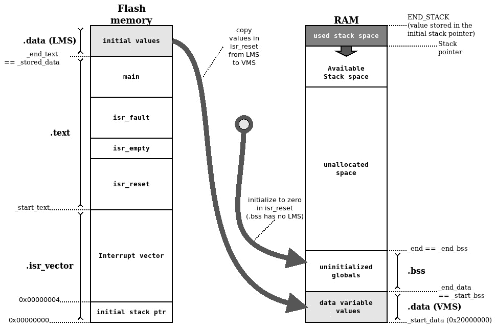
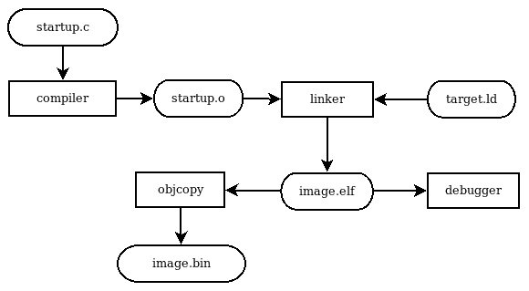
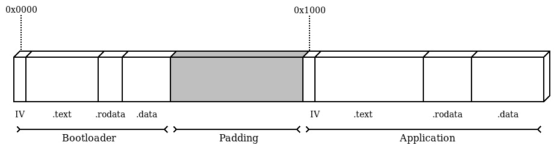
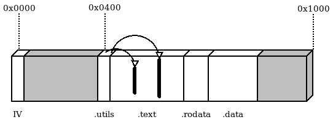

# 第四章：启动程序

现在机制、工具和方法都已经就绪，是时候开始关注在目标上运行软件所需的程序了。启动嵌入式系统是一个通常需要了解特定系统和所涉及的机制的过程。根据目标的不同，我们需要在手册中查找一些指示，以了解系统对开发者的期望，以便成功从闪存中启动可执行文件。本章将专注于启动过程的描述，特别强调我们决定用作参考平台的 Cortex-M 微控制器。特别是，我们将涵盖以下主题：

+   中断向量表

+   内存布局

+   构建和运行启动代码

+   多个启动阶段

到本章结束时，您将了解主循环嵌入式开发的整体情况。

# 技术要求

您可以在 GitHub 上找到本章的代码文件，地址为 [`github.com/PacktPublishing/Embedded-Systems-Architecture-Second-Edition/tree/main/Chapter4`](https://github.com/PacktPublishing/Embedded-Systems-Architecture-Second-Edition/tree/main/Chapter4)。

# 中断向量表

**中断向量表**，通常缩写为 **IVT** 或简单地 **IV**，是一组与 CPU 关联的函数指针，用于处理特定的 *异常*，例如故障、来自应用程序的系统服务请求和来自外设的中断请求。IVT 通常位于二进制图像的开头，因此从闪存的最低地址开始存储。

来自硬件组件或外设的中断请求将迫使 CPU 突然暂停执行并执行向量中相关位置的功能。因此，这些函数被称为 **中断服务例程**（或简称 **ISRs**）。运行时异常和故障可以像处理硬件中断一样处理，因此通过相同的表关联了特殊的服务例程和内部 CPU 触发器。

在向量中枚举的 ISRs 的顺序及其确切位置取决于 CPU 架构、微控制器型号和支持的外设。每条中断线对应一个预定义的中断号，并且根据微控制器的特性，可能被分配一个优先级。

在 Cortex-M 微控制器中，内存的前 16 位位置被保留用于存储系统处理器的指针，这些指针与架构相关，并关联到不同类型的 CPU 运行时异常。最低地址用于存储栈指针的初始值，接下来的 15 个位置被保留用于系统服务和故障处理器。然而，其中一些位置被保留但没有连接到任何事件。在 Cortex-M CPU 中可以使用单独的服务例程处理的系统异常如下：

+   复位

+   **不可屏蔽** **中断** (**NMI**)

+   硬件故障

+   内存异常

+   总线故障

+   使用故障

+   监督调用

+   调试监视器事件

+   PendSV 调用

+   系统滴答

硬件中断的顺序，从位置 16 开始，取决于微控制器配置，因此取决于特定的硅模型，因为中断配置涉及特定的组件、接口和外部外围设备活动。

在本书的代码仓库中可以找到 STM32F407 和 LM3S 目标的外部中断处理程序的全量向量。

## 启动代码

为了启动一个可工作的系统，我们需要定义中断向量和将指针与定义的函数关联起来。我们参考平台的典型启动代码文件使用 GCC 的`section`属性将中断向量放置在专用部分。由于该部分将被放置在映像的起始位置，我们必须从为初始堆栈指针保留的空间开始定义我们的中断向量，然后是系统异常处理程序。

零对应于保留/未使用插槽的位置：

```cpp
__attribute__ ((section(".isr_vector")))
void (* const IV[])(void) =
{
  (void (*)(void))(END_STACK),
  isr_reset,
  isr_nmi,
  isr_hard_fault,
  isr_mem_fault,
  isr_bus_fault,
  isr_usage_fault,
  0, 0, 0, 0,
  isr_svc,
  isr_dbgmon,
  0,
  isr_pendsv,
  isr_systick,
```

从这个位置开始，我们定义外部外围设备的中断线如下：

```cpp
  isr_uart0,
  isr_ethernet,
  /* … many more external interrupts follow */
};
```

启动代码还必须包括数组中引用的每个符号的实现。处理程序可以定义为无参数的`void`过程，其格式与 IV 签名相同。

```cpp
void isr_bus_fault(void) {
  /* Bus error. Panic! */
  while(1);
}
```

由于不可恢复的总线错误，此示例中的中断处理程序永远不会返回，并使系统永远挂起。可以使用弱符号将空的中断处理程序与系统和外部中断关联起来，这些弱符号可以在设备驱动程序模块中通过在相关代码部分重新定义它们来覆盖。

## 重置处理程序

当微控制器上电时，它从`reset`处理程序开始执行。这是一个特殊的 ISR，它不会返回，而是执行`.data`和`.bss`段的初始化，然后调用应用程序的入口点。`.data`和`.bss`段的初始化包括将`.data`段中变量的初始值从闪存复制到运行时访问变量的实际 RAM 段，并在 RAM 中的`.bss`段用零填充，以确保静态符号的初始值按照 C 语言约定为零。

`.data`和`.bss`段在 RAM 中的源地址和目标地址由链接器在生成二进制映像时计算，并通过链接脚本导出为指针。`isr_reset`的实现可能看起来像以下这样：

```cpp
void isr_reset(void)
{
  unsigned int *src, *dst;
  src = (unsigned int *) &_stored_data;
  dst = (unsigned int *) &_start_data;
  while (dst != (unsigned int *)&_end_data) {
    *dst = *src;
    dst++;
    src++;
  }
  dst = &_start_bss;
  while (dst != (unsigned int *)&_end_bss) {
    *dst = 0;
    dst++;
  }
  main();
}
```

当`.bss`和`.data`段中的变量被初始化后，最终可以调用`main`函数，这是应用程序的入口点。应用程序代码通过实现一个无限循环来确保`main`永远不会返回。

## 分配堆栈

为了符合 CPU 的**应用程序二进制接口**（**ABI**），需要在内存中为执行栈分配空间。这可以通过不同的方式完成，但通常，在链接脚本中标记栈空间的末尾并将其关联到 RAM 中未使用的特定区域更为可取，而不是在某个部分中使用。

通过链接脚本导出的`END_STACK`符号所获得的地址指向 RAM 中未使用区域的末尾。如前所述，其值必须存储在向量表的开头，在我们的例子中是在 IV 之前，地址为`0`。栈末尾的地址必须是常量，不能在运行时计算，因为 IV 内容存储在闪存中，因此以后不能修改。

在内存中正确设置执行栈的大小是一项微妙的工作，它包括评估整个代码库，同时考虑到局部变量和执行过程中任何时刻的调用跟踪深度。与栈使用相关所有因素的分析和故障排除将作为下一章中更广泛主题的一部分进行讨论。这里提供的简单启动代码具有足够的栈大小，足以容纳局部变量和函数调用栈，因为它由链接脚本尽可能远地映射到`.bss`和`.data`部分。关于栈放置的进一步方面将在*第五章* *内存管理*中进行考虑。

## 故障处理程序

当发生执行错误或策略违规时，CPU 会触发与故障相关的事件。CPU 能够检测到许多运行时错误，例如以下内容：

+   尝试在标记为可执行的内存区域之外执行代码

+   从无效位置获取数据或执行的下一条指令

+   使用未对齐地址进行非法加载或存储

+   零除

+   尝试访问不可用的协处理器功能

+   尝试在当前运行模式下允许的内存区域之外进行读写/执行

一些核心微控制器根据错误类型支持不同类型的异常。Cortex-M3/M4 可以根据总线错误、使用故障、内存访问违规和通用故障进行区分，触发相关异常。在其他较小的系统中，关于运行时错误类型的详细信息较少。

很常见，故障会使系统无法使用或无法继续执行，因为 CPU 寄存器值或栈被破坏。在某些情况下，即使在异常处理程序中放置断点也不足以检测问题的原因，这使得调试更加困难。一些 CPU 支持关于故障原因的扩展信息，这些信息在异常发生后可以通过内存映射寄存器获得。在 Cortex-M3/M4 的情况下，这些信息通过所有 Cortex-M3/M4 CPU 上的`0xE000ED28`获得。

如果相应的异常处理程序实现了某种恢复策略，内存违规可能不会导致严重后果，并且可以在运行时检测和响应故障，这在多线程环境中特别有用，我们将在第九章“分布式系统和物联网架构”中更详细地看到。

# 内存布局

如我们所知，链接脚本包含了链接器如何组装嵌入式系统组件的指令。更具体地说，它描述了映射到内存中的部分以及它们如何部署到目标机的闪存和 RAM 中，如第二章“工作环境和工作流程优化”中提供的示例所示。

在大多数嵌入式设备中，尤其是在我们的参考平台上，链接脚本中的`.text`输出部分，其中包含所有可执行代码，还应包括专门用于在可执行图像开头存储 IV 的特殊输入部分。

我们通过在`.text`输出部分的开头添加`.isr_vector`部分来集成链接脚本，在其余代码之前：

```cpp
.text :
{
  *(.isr_vector)
  *(.text*)
  *(.rodata*)
} > FLASH
```

在闪存中定义一个只读区域，该区域专门用于向量表，是我们系统正确启动的唯一严格要求，因为 CPU 在启动时从内存中的`0x04`地址检索`isr_reset`函数的地址。

在定义闪存中的文本和只读区域之后，链接脚本应导出当前地址的值，即存储在闪存中的`.data`输出部分的开始。该部分包含在代码中初始化的所有全局和静态变量的初始值。在示例链接脚本中，`.data`部分的开始由`_stored_data`链接脚本变量标记，如下所示：

```cpp
_stored_data = .;
```

数据部分最终将在 RAM 中映射，但其初始化是通过`isr_reset`函数手动完成的，该函数通过从闪存复制内容到 RAM 中实际指定的`.data`部分区域。链接脚本提供了一个机制来分离定义部分中的`AT`关键字。如果没有指定`AT`关键字，则默认情况下，LMA 设置为与 VMA 相同的地址。在我们的例子中，`.data`输入部分的 VMA 位于 RAM 中，并通过`_start_data`指针导出，该指针将被`isr_vector`用作复制从闪存存储的符号值的目标地址。然而，`.data`的 LMA 位于闪存中，因此我们将 LMA 地址设置为闪存中的`_stored_data`指针，同时定义`.data`输出部分：

```cpp
.data : AT (_stored_data)
{
  _start_data = .;
  *(.data*)
  . = ALIGN(4);
  _end_data = .;
} > RAM
```

对于`.bss`，没有 LMA，因为该部分在图像中不存储任何数据。当包含`.bss`输出部分时，其 VMA 将自动设置为`.data`输出部分的末尾：

```cpp
.bss :
{
  _start_bss = .;
  *(.bss*)
  . = ALIGN(4);
  _end_bss = .;
  _end = .;
} > RAM
```

最后，在这个设计中，我们期望链接器提供执行堆栈的初始值。使用内存中的最高地址是单线程应用程序的一个常见选择，尽管，如下一章所讨论的，这可能会在堆栈溢出的情况下引起问题。然而，对于这个例子来说，这是一个可接受的解决方案，我们通过在链接脚本中添加以下行来定义 `END_STACK` 符号：

```cpp
END_STACK = ORIGIN(RAM) + LENGTH(RAM);
```

为了更好地理解每个符号在内存中的位置，可以在代码的不同位置添加变量定义到启动文件中。这样，我们可以在第一次在调试器中运行可执行文件时检查变量在内存中的存储位置。假设我们在 `.data` 和 `.bss` 输出部分中存储了变量，示例启动代码的内存布局可能如下所示：



图 4.1 – 示例启动代码中的内存布局

当可执行文件链接时，符号在编译时自动设置，以指示内存中每个部分的开始和结束。在我们的例子中，指示每个部分开始和结束的变量会根据链接器在创建可执行文件时包含的各部分的大小自动分配正确的值。由于每个部分的大小在编译时是已知的，链接器能够识别出 `.text` 和 `.data` 部分无法适应闪存的情况，并在构建结束时生成链接器错误。创建映射文件对于检查每个符号的大小和位置很有用。在我们的引导示例代码中，映射文件中 `.text` 部分如下所示：

```cpp
.text 0x0000000000000000 0x168
0x0000000000000000 _start_text = .
*(.isr_vector)
.isr_vector 0x0000000000000000 0xf0 startup.o
0x0000000000000000 IV
*(.text*)
.text 0x00000000000000f0 0x78 startup.o
0x00000000000000f0 isr_reset
0x0000000000000134 isr_fault
0x000000000000013a isr_empty
0x0000000000000146 main
```

同样，我们可以在编译时通过链接脚本找到每个部分的边界：

```cpp
0x0000000000000000 _start_text = .
0x0000000000000168 _end_text = .
0x0000000020000000 _start_data = .
0x0000000020000004 _end_data = .
0x0000000020000004 _start_bss = .
0x0000000020000328 _end_bss = .
0x0000000020000328 _end = .
```

`.rodata` 输入部分，在这个极简示例中为空，映射在闪存区域中，位于 `.text` 和数据 LMA 之间。这部分是为常量符号预留的，因为常量不需要映射到 RAM 中。在定义常量符号时强制使用 `const` C 修饰符是明智的，因为 RAM 经常是我们最宝贵的资源，在某些情况下，通过将常量符号移动到闪存中，即使节省几个字节的可写内存也可能对项目开发产生影响，因为闪存通常要大得多，其使用情况在链接时可以很容易地确定。

# 构建和运行引导代码

这里提供的示例是可以在目标设备上运行的简单可执行镜像之一。为了汇编、编译和链接所有内容，我们可以使用一个简单的 makefile，它自动化所有步骤，并允许我们专注于我们的软件生命周期。

当镜像准备就绪时，我们可以将其传输到实际目标设备，或者使用仿真器运行它。

## Makefile

一个非常基本的 Makefile 用于构建我们的启动应用程序，描述了最终目标（`image.bin`）以及构建它所需的中间步骤。一般来说，Makefile 语法非常广泛，涵盖本书范围之外的所有 **Make** 提供的功能。然而，这里解释的几个概念应该足以让你开始自动化构建过程。

在这个例子中，定义我们的 Makefile 的目标相当简单。包含 IV、一些异常处理程序以及我们在示例中使用的 main 和全局变量的 `startup.c` 源文件可以被编译和汇编成一个 `startup.o` 对象文件。链接器使用 `target.ld` 链接器脚本中提供的指示来部署符号到正确的部分，生成 `.elf` 可执行映像。

最后，使用 `objcopy` 将 `.elf` 可执行文件转换为二进制映像，该映像可以传输到目标或使用 QEMU 运行：



图 4.2 – 构建步骤和依赖关系

Makefile 应该包含一些配置变量来描述工具链。`=` 赋值运算符允许你在调用 `make` 命令时为变量设置值。其中一些变量在编译和链接过程中默认使用。通常使用 `CROSS_COMPILE` 变量来定义工具链前缀，并将其用作构建过程中涉及的工具的前缀：

```cpp
CROSS_COMPILE=arm-none-eabi-
CC=$(CROSS_COMPILE)gcc
LD=$(CROSS_COMPILE)ld
OBJCOPY=$(CROSS_COMPILE)objcopy
```

通过运行 `make` 并将不同的值分配给 `CROSS_COMPILE` 环境变量来更改此项目的默认交叉编译器。所有工具的名称都以前缀 `CROSS_COMPILE` 扩展，以便构建步骤将使用给定工具链的组件。同样，我们可以定义编译器和链接器的默认标志：

```cpp
CFLAGS=-mcpu=cortex-m3 -mthumb -g -ggdb -Wall -Wno-main
LDFLAGS=-T target.ld -gc-sections -nostdlib -Map=image.map
```

当不带参数调用时，Make 会构建 `image.bin` Makefile 中定义的第一个目标。可以为 `image.bin` 定义一个新的目标，如下所示：

```cpp
image.bin: image.elf
 $(OBJCOPY) -O binary $^ $@
```

`$@` 和 `$^` 变量将在配方中分别替换为目标和依赖项列表。这意味着在示例中，Makefile 将按照以下方式处理配方：

```cpp
arm-none-eabi-objcopy -O binary image.elf image.bin
```

这是我们需要从 `.elf` 可执行文件生成原始二进制映像的命令。

同样，我们可以定义 `image.elf` 的配方，这是链接步骤，依赖于编译的 `startup.o` 对象文件和链接器脚本：

```cpp
image.elf: startup.o target.ld
 $(LD) $(LDFLAGS) startup.o -o $@
```

在这种情况下，我们不会使用 `$^` 变量来表示依赖项列表，因为配方在链接命令行中使用 `LDFLAGS` 包含了链接器脚本。链接步骤的配方将由 `main` 如下展开：

```cpp
arm-none-eabi-ld -T target.ld -gc-sections -nostdlib -Map=image.map startup.o -o image.elf
```

使用 `-nostdlib` 确保不会自动将工具链中可用的默认 C 库链接到项目中，这些库默认情况下会被链接到可执行文件中。这确保了不会自动提取任何符号。

解决依赖关系的最后一步是将源代码编译成目标文件。这是在 makefile 中隐式配方中完成的，最终在项目默认值使用时转换为以下内容：

```cpp
arm-none-eabi-gcc -c -o startup.o startup.c -mcpu=cortex-m3 -mthumb -g -ggdb -Wall -Wno-main
```

使用 `-mcpu=cortex-m3` 标志确保生成的代码与 Cortex-M3 及以后的 Cortex-M 目标兼容。实际上，相同的二进制文件最终可以在任何 Cortex-M3、M4 或 M7 目标上运行，并且它是通用的，直到我们决定使用任何特定的 CPU 特性，或者定义硬件中断处理程序，因为它们的顺序取决于特定的微控制器。

通过定义一个 `clean` 目标，在任何时候，都可以通过删除中间目标和最终镜像并再次运行 `make` 来从头开始。`clean` 目标通常也包含在同一个 makefile 中。在我们的例子中，它看起来如下所示：

```cpp
clean:
 rm -f image.bin image.elf *.o image.map
```

`clean` 目标通常没有依赖。运行 `make clean` 会按照配方中的指示删除所有中间和最终目标，同时保留源文件和链接脚本不变。

## 运行应用程序

一旦构建了镜像，我们可以在真实目标上运行它，或者使用 `qemu-system-arm`，如*第二章*中所述，*工作环境和流程优化*。由于应用程序在模拟器上运行时不会产生输出，为了更深入地了解软件的实际行为，我们需要将其附加到调试器上。在运行模拟器时，必须使用 `-S` 选项调用 `qemu-system-arm`，这意味着停止，这样它就不会在调试器连接之前开始执行。由于前一步骤中的 `CFLAGS` 变量包含 `-g` 选项，所有符号名称都将保留在 `.elf` 可执行文件中，以便调试器可以逐行跟踪代码执行，设置断点并检查变量的值。

逐步遵循程序，并将地址和值与 `.map` 文件中的进行比较，有助于理解正在发生的事情以及整个引导过程中上下文是如何变化的。

# 多个引导阶段

通过引导加载程序引导目标在多种情况下很有用。在实际场景中，能够在远程位置的设备上更新正在运行的软件意味着开发人员能够在嵌入式系统第一版部署后修复错误和引入新功能。

这在发现现场错误或软件需要重新设计以适应需求变化时，对维护来说是一个巨大的优势。引导加载程序可以实现自动远程升级和其他有用的功能，例如以下内容：

+   从外部存储加载应用程序镜像

+   在引导前验证应用程序镜像的完整性

+   在应用程序损坏情况下的故障转移机制

可以链式连接多个引导加载程序以执行多阶段引导序列。这允许您为多个引导阶段拥有独立的软件映像，这些映像可以独立上传到闪存。如果存在，第一阶段引导通常非常简单，仅用于简单地选择下一阶段的入口点。然而，在某些情况下，早期阶段可能从稍微复杂的设计中受益，以实现软件升级机制或其他功能。这里提出的示例展示了使用许多 Cortex-M 处理器提供的功能实现的两个引导阶段之间的分离。这个简单的引导加载程序的唯一目的是初始化系统，以便在下一阶段引导应用程序。

## 引导加载程序

第一阶段引导加载程序作为正常独立应用程序启动。其 IV 必须位于闪存的开始处，`reset`处理程序初始化相关的`.data`和`.bss`内存段，就像在正常单阶段引导中一样。闪存开始处应预留一个分区用于`.text`和`.data`引导加载程序段。为此，引导加载程序的链接脚本将仅包括闪存内存的开始部分，而应用程序的链接脚本将具有相同大小的偏移量。

实际上，引导加载程序和应用程序将被构建成两个独立的二进制文件。这样，两个链接脚本可以为段使用相同的名称，而仅在链接内存中`FLASH`分区的描述上有所不同。尽管如此，下面建议的方法只是可能配置之一：更复杂的设置可能从使用所有分区的起始地址和大小导出完整几何形状中受益。

如果我们想为引导加载程序分区预留 4 KB，我们可以在引导加载程序的链接脚本中硬编码`FLASH`区域如下：

```cpp
FLASH (rx) : ORIGIN = 0x00000000, LENGTH = 0x00001000
```

类似地，应用程序的链接脚本在原点有一个偏移量，硬编码为引导加载程序的大小，这样应用程序的`.text`输出段始终从`0x1000`地址开始。从应用程序的角度来看，整个`FLASH`区域从`0x00001000`地址开始：

```cpp
FLASH (rx) : ORIGIN = 0x00001000, LENGTH = 0x0003F000
```

在这种情况下，闪存的几何形状如下所示：



图 4.3 – 闪存内容布局，显示引导加载程序和应用程序的段

应用程序中断向量表（IV）中的`reset`处理程序存储在向量表内的偏移量`4`处。

应用程序可以强制实施自己的内存布局。在启动时，它将能够根据新的几何形状初始化新的`.data`和`.bss`段，甚至可以定义新的初始堆栈指针和 IV。引导加载程序可以通过读取存储在地址`0x1000`的 IV 中的前两个单词来获取这两个指针：

```cpp
uint32_t app_end_stack = (*((uint32_t *)(APP_OFFSET)));
void (* app_entry)(void);
app_entry = (void *)(*((uint32_t *)(APP_OFFSET + 4)));
```

在跳转到应用程序的入口点之前，我们希望将主执行堆栈指针重置为堆栈的末尾地址。由于 MSP 是 ARMv7-M 架构中的一个专用 CPU 寄存器，它只能使用汇编指令**从寄存器移动特殊**（**msr**）来写入。以下代码在引导加载程序中内联，以将正确的应用程序堆栈指针设置为存储在应用程序映像开头于闪存的值：

```cpp
asm volatile("msr msp, %0" ::"r"(app_end_stack));
```

在 Cortex-M3 和其他更强大的 32 位 Cortex-M CPU 中，系统控制块区域中存在一个控制寄存器，可以在运行时指定向量表的偏移量。这是`0xE000ED08`。将应用程序偏移量写入此寄存器意味着从那时起，新的 IV 就位了，并且应用程序中定义的中断处理程序将在异常发生时执行：

```cpp
uint32_t * VTOR = (uint32_t *)0xE000ED08;
*VTOR = (uint32_t *)(APP_OFFSET);
```

当此机制不可用时，例如在 Cortex-M0 微控制器中，它没有 VTOR，应用程序在启动后仍然会与引导加载程序共享中断向量。为了提供不同的一组中断处理程序，相关的函数指针可以存储在闪存的不同区域，引导加载程序可以在每次中断时检查应用程序是否已启动，如果是的话，则从应用程序空间中的表中调用相应的处理程序。

在处理指向中断处理程序和其他异常例程的指针时，重要的是要考虑在代码运行期间任何时间都可能发生异常，尤其是如果引导加载程序已启用 CPU 中的外围设备或激活了定时器。为了防止不可预测地跳转到中断例程，在更新指针时建议禁用所有中断。

指令集提供了暂时屏蔽所有中断的机制。在全局禁用中断的情况下运行时，执行不能被任何异常中断，除了 NMI。在 Cortex-M 中，可以使用`cpsid i`汇编语句暂时禁用中断：

```cpp
asm volatile ("cpsid i");
```

要再次启用中断，使用`cpsie i`指令：

```cpp
asm volatile ("cpsie i");
```

禁用中断的情况下运行代码应尽可能严格地执行，而不仅仅是在没有其他解决方案的特殊情况下，因为这会影响整个系统的延迟。在这种情况下，它被用来确保在 IV 被重新定位时不会调用任何服务例程。

引导加载程序在其短暂的生命周期中执行的最后一个操作是直接跳转到应用 IV 中的`reset`处理程序。由于该函数永远不会返回，并且刚刚分配了一个全新的堆栈空间，我们通过将 CPU 程序计数器寄存器的值设置为从`app_entry`地址开始执行来强制无条件跳转，`app_entry`由`isr_reset`指向：

```cpp
asm volatile("mov pc, %0" :: "r"(app_entry));
```

在我们的例子中，这个函数永远不会返回，因为我们替换了执行栈指针的值。这与 `reset` 处理器预期的行为兼容，它反过来会跳转到应用程序中的主函数。

## 构建镜像

由于两个可执行文件将分别构建在单独的 `.elf` 文件中，存在机制将两个分区的内文合并成一个单一镜像，以便上传到目标设备或用于仿真器。可以通过使用 `objcopy` 的 `--pad-to` 选项将引导加载分区填充至其大小，当将 `.elf` 可执行文件转换为二进制镜像时。使用 `0xFF` 值填充填充区域可以减少闪存的使用，这可以通过传递 `--gap-` 选项 `fill=0xFF` 来实现。生成的镜像 `bootloader.bin` 将正好是 `4096` 字节，以便在末尾附加应用程序镜像。组成包含两个分区的镜像的步骤如下：

```cpp
$ arm-none-eabi-objcopy -O binary --pad-to=4096 --gap-fill=0xFF bootloader.elf bootloader.bin
$ arm-none-eabi-objcopy -O binary app.elf app.bin
$ cat bootloader.bin app.bin > image.bin
```

使用十六进制编辑器查看生成的 `image.bin` 文件，应该能够通过识别 `objdump` 使用的填充零模式来识别第一个分区中引导加载器的结束，以及从地址 `0x1000` 开始的应用程序代码。

通过将应用程序偏移量对齐到闪存中物理页面的起始处，甚至可以在单独的步骤中上传两个镜像，例如，允许您升级应用程序代码，同时不修改引导加载分区。

## 调试多阶段系统

两个或更多阶段的分离意味着两个可执行文件的符号被链接到不同的 `.elf` 文件中。使用两组符号进行调试仍然可能，但必须分两步在调试器中加载来自两个 `.elf` 文件的符号。当使用引导加载器的符号执行调试器时，通过将 `bootloader.elf` 文件作为参数添加，或使用 GDB 命令行的文件命令，引导加载器的符号被加载到调试会话的符号表中。要添加来自应用程序 `.elf` 文件的符号，我们可以在稍后阶段使用 `add-symbol-file` 添加相应的 `.elf` 文件。

与 `file` 命令不同，`add-symbol-file` 指令确保第二个可执行文件的符号被加载，而不会覆盖之前加载的符号，并允许您指定 `.text` 部分开始的地址。在本文例中构建的系统，两组符号之间没有冲突，因为两个分区在闪存上不共享任何区域。调试器可以正常继续执行，并在引导加载器跳转到应用程序入口点后仍然拥有所有符号：

```cpp
> add-symbol-file app.elf
add symbol table from file "app.elf"(y or n) y
Reading symbols from app.elf...done.
```

在两个可执行文件之间共享相同的段和符号名称是合法的，因为这两个可执行文件是自包含的，并且没有链接在一起。当我们在调试期间通过名称引用符号时，调试器会意识到重复的名称。例如，如果我们放置一个断点在 `main` 上，并且我们已经正确加载了两个可执行文件的符号，那么断点将在两个位置设置：

```cpp
> b main
Breakpoint 1 at 0x14e: main. (2 locations)
> info b
Num Type Disp Enb Address What
1 breakpoint keep y <MULTIPLE>
1.1 y 0x0000014e in main at startup_bl.c:53
1.2 y 0x00001158 in main at startup.c:53
```

不同的引导阶段彼此完全隔离，不共享任何可执行代码。因此，带有不同许可证的软件，即使它们不兼容，也可以在不同的引导阶段中运行。正如示例所示，两个软件映像可以使用相同的符号名称而不产生冲突，就像它们在两个不同的系统上运行一样。

在某些情况下，然而，多个引导阶段可能具有共同的功能，可以使用相同的库来实现。不幸的是，没有简单的方法可以从单独的软件映像访问库的符号。下一个示例中描述的机制通过只在闪存中存储一次所需的符号，为两个阶段之间的共享库提供访问权限。

## 共享库

假设有一个小型库提供通用工具或设备驱动程序，该库被引导加载程序和应用软件共同使用。即使占位符很小，也不建议在闪存中重复定义相同的功能。相反，库可以链接到引导加载程序的专用部分，并在后续阶段引用。在我们的前两个阶段示例中，我们可以安全地将 API 函数指针放置在地址 `0x400` 的数组中，该地址位于我们当前使用的中断向量之后。在实际项目中，偏移量必须足够高，以便在内存中的实际向量表之后。`.utils` 输入部分放置在链接脚本中，在向量表和引导加载程序中 `.text` 的开始之间：

```cpp
.text :
{
  _start_text = .;
  KEEP(*(.isr_vector))
  . = 0x400;
  KEEP(*(.utils))
  *(.text*)
  *(.rodata*)
  . = ALIGN(4);
  _end_text = .;
} > FLASH
```

实际的功能定义可以放在不同的源文件中，并在引导加载程序中链接。实际上在 `.utils` 部分的是包含指向 `.text` 引导加载程序输出部分内部实际功能地址的指针表：

```cpp
__attribute__((section(".utils"),used))
 static void *utils_interface[4] = {
   (void *)(utils_open),
   (void *)(utils_write),
   (void *)(utils_read),
   (void *)(utils_close)
};
```

现在引导加载程序的布局中增加了这个额外的 `.utils` 部分，地址对齐为 `0x400`，包含一个表，其中包含指向打算从其他阶段导出使用的库函数的指针：



图 4.4 – 带有 .utils 部分的引导加载程序分区

应用程序期望在指定的地址找到功能表：

```cpp
static void **utils_interface = (void**)(0x00000400);
```

现在已经可以访问存储在引导加载程序中的单个函数的地址，但关于这些函数签名的信息却不存在。因此，只有当指针被转换为与预期的函数签名匹配时，应用程序才能正确地访问 API。然后可以提供一个内联包装器，以便应用程序代码可以直接访问该函数：

```cpp
static inline int utils_read(void *buf, int size) {
  int (*do_read)(void*, int) = (int (*)(void*,int))
    (utils_interface[2]);
  return do_read(buf, size);
}
```

在这种情况下，合同在两个模块之间隐式共享，函数签名之间的对应关系在编译时不会被检查，存储在闪存中的函数指针的有效性也不会被检查。另一方面，避免二进制代码重复是一种有效的方法，并且可能通过在分离的上下文中共享符号来有效地减少闪存使用。

## 远程固件更新

在嵌入式系统设计中包含引导加载程序的原因之一通常是提供一个机制，以便从远程位置更新正在运行的应用程序。如前一章所述，可靠的更新机制通常是漏洞管理的一个关键要求。在运行 Linux 的丰富嵌入式系统中，引导加载程序通常配备自己的 TCP/IP 堆栈、网络设备驱动程序和特定协议的实现，以自主地传输内核和文件系统更新。在较小的嵌入式系统中，通常方便将此任务分配给应用程序，在大多数情况下，该应用程序已经使用类似的通信渠道用于其他功能目的。一旦新的固件被下载并存储在任何非易失性存储支持中（例如，在闪存末尾的分区中），引导加载程序可以实现一个机制，通过覆盖**应用程序**分区中的先前固件来安装接收到的更新。

## 安全引导

许多项目需要一个机制来防止执行未经授权或篡改的固件，这种固件可能被攻击者有意破坏以尝试控制系统。这是一个安全引导加载程序的任务，它使用密码学来验证基于板载固件映像内容的签名。实现此类机制的安全引导加载程序依赖于一个信任锚来存储公钥，并要求使用必须附加到固件映像文件上的清单。清单包含由与存储在设备中的公钥相关联的私钥所有者创建的签名。密码学签名验证是一种非常有效的防止未经授权的固件更新的方法，无论是来自远程位置还是来自物理攻击。

从零开始实现一个安全的引导加载程序是一项相当大的工作量。一些开源项目提供了使用加密算法对镜像进行签名和验证的机制。**wolfBoot**是一个提供当前固件和更新安装候选者完整性和真实性检查的安全引导加载程序。它提供了一个在更新安装过程中交换两个固件分区内容的故障安全机制，以在新的更新镜像执行失败时提供备份。引导加载程序附带生成签名并将清单附加到要传输到设备的文件的工具，以及一系列可配置的选项、加密方式和功能。

# 摘要

理解引导过程是开发嵌入式系统的一个关键步骤。我们已经看到了如何直接引导到裸机应用程序，并且我们检查了多阶段系统引导中涉及的架构，例如具有不同入口点的单独链接脚本、通过 CPU 寄存器重定位 IVs 以及跨阶段的共享代码段。

在下一章中，我们将探讨内存管理的机制和方法，这是在开发安全可靠的嵌入式系统时需要考虑的最重要因素。
