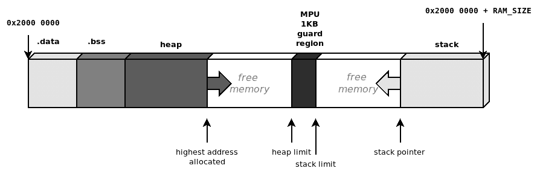

# 内存管理

处理内存是嵌入式系统程序员最重要的任务之一，并且在系统开发的每个阶段都无疑是最重要的考虑因素。本章介绍了在嵌入式系统中管理内存的常用模型、内存的几何形状和映射，以及如何防止可能危害目标上运行的软件稳定性和安全性的问题。

本章分为四个部分：

+   内存映射

+   执行栈

+   堆管理

+   内存保护单元

到本章结束时，你将深入了解如何在嵌入式系统中管理内存。

# 技术要求

你可以在 GitHub 上找到本章的代码文件，地址为[`github.com/PacktPublishing/Embedded-Systems-Architecture-Second-Edition/tree/main/Chapter5/memory`](https://github.com/PacktPublishing/Embedded-Systems-Architecture-Second-Edition/tree/main/Chapter5/memory)。

# 内存映射

应用软件通常可以从环境中可用的内存处理抽象中受益。在现代个人计算机的操作系统上，每个进程都可以访问其自己的内存空间，这些空间也可以通过重新映射内存块到虚拟内存地址来重新定位。此外，通过内核提供的虚拟内存池，可以实现动态内存分配。嵌入式设备不依赖于这些机制，因为没有方法可以将虚拟地址分配给物理内存位置。在所有上下文和运行模式下，所有符号只能通过指向物理地址来访问。

正如我们在上一章中看到的，启动裸机嵌入式应用程序需要在编译时定义分配在可用地址空间指定区域内的段，使用链接脚本。为了正确配置嵌入式软件中的内存段，分析各个区域的特性和我们可以用来组织和管理的内存区域的技术是重要的。

## 内存模型和地址空间

可用地址的总数取决于内存指针的大小。32 位机器可以引用 4 GB 的连续内存空间，这被分割以容纳系统中的所有内存映射设备。这可能会包括以下内容：

+   内部 RAM

+   闪存

+   系统控制寄存器

+   微控制器内部的组件

+   外部外围总线

+   额外的外部 RAM

每个区域都有一个固定的物理地址，这可能会依赖于平台的特性。所有位置都是硬编码的，其中一些是平台特定的。

在 ARM Cortex-M 中，总的地址空间被划分为六个宏区域。根据它们的目的，这些区域有不同的权限，以便存在只能进行读取操作的内存区域，或者不允许在原地执行的区域。这些限制在硬件中实现，但在包含 MPU 的微控制器上可能在运行时可配置：


图 5.1 – ARM Cortex-M 地址空间

通常，只有小部分（与物理组件大小相同）被映射到这些区域中。尝试访问未映射到任何硬件的内存会在 CPU 中触发异常。在接近目标平台时，了解与板上硬件对应的内存部分的地址和大小非常重要，以便在链接脚本和源代码中正确描述可用的地址空间几何形状。

## 代码区域

Cortex-M 微控制器地址空间的最低 512 MB 保留用于可执行代码。支持 XIP 的目标总是将闪存映射到这个区域，并且通常在运行时不允许写入。在我们之前的例子中，`.text` 和 `.rodata` 部分被映射到这个区域，因为它们在软件执行期间保持不变。此外，所有非零定义符号的初始值都放置在这个区域，并且需要显式地复制和重新映射到可写段，以便在运行时修改它们的值。正如我们已知的，`0x00000000`，而其他人选择不同的起始地址（例如，`0x10000000` 或 `0x08000000`）。STM32F4 闪存映射到 `0x08000000` 并提供了一个别名，以便可以在运行时从地址 `0x00000000` 访问相同的内存。

注意

当闪存地址从地址 `0` 开始时，空指针可以被解引用，并将指向代码区域的开始，这通常是可以读取的。虽然这在技术上违反了 C 标准，但在嵌入式 C 代码中，在这种情况下从地址 `0x00000000` 读取是一种常见的做法——例如，在 ARM 的 IVT 中读取初始堆栈指针。

## RAM 区域

内部 RAM 银行被映射到第二个 512 MB 块中的地址，起始地址为 `0x20000000`。外部内存银行可以映射到 1 GB 区域的任何位置，起始地址为 `0x60000000`。根据 Cortex-M 微控制器内部 SRAM 的几何形状或外部内存银行的偏移量，实际上可访问的内存区域可以映射到允许范围内的非连续的不同内存部分。内存管理必须考虑到物理映射的不连续性，并分别引用每个部分。例如，STM32F407 MPU 有两个非连续映射的内部 SRAM 块：

+   地址`0x20000000`（由两个连续的 112 KB 和 16 KB 块组成）的 128 KB SRAM

+   一个独立的 64 KB `0x10000000`银行

这第二个内存与 CPU 紧密耦合，并针对时间关键操作进行了优化，这允许从 CPU 本身进行零等待状态访问。

在这种情况下，我们可以在链接脚本中将这两个块引用为两个单独的区域：

```cpp
flash (rx) : ORIGIN = 0x08000000, LENGTH = 256K
SRAM (rwx) : ORIGIN = 0x20000000, LENGTH = 128K
CCMSRAM(rwx) : ORIGIN = 0x10000000, LENGTH = 64K
```

虽然 RAM 区域是为数据设计的，但它通常保留执行权限，因此代码部分可以被加载到 RAM 中并在运行时执行。在 RAM 中执行代码扩展了系统的灵活性，使我们能够在将代码部分加载到内存之前处理它们。那些不打算在原地执行的二进制文件也可以以其他格式存储在任何设备上，甚至可以使用压缩或加密算法。虽然有时很方便，但使用 RAM 中的部分来存储可执行代码会从系统中夺取宝贵的运行时内存。在设计系统之前必须仔细考虑这些好处，尤其是从应用程序的实际运行时内存需求的角度来看。

## 外设访问区域

内部 RAM 区域之后的 512 MB 区域，从地址`0x40000000`开始，是为通常集成到微控制器中的外设保留的。从地址`0xA0000000`开始的 1 GB 区域则用于映射外部内存芯片和其他可以在 MCU 寻址空间中内存映射但不是原始芯片封装部分的外设。为了正确访问外设，必须事先了解 MCU 封装内部组件的配置和内存映射设备的地址。这些区域不允许代码执行。

## 系统区域

Cortex-M 内存映射的最高 512 MB 是为访问系统配置和私有控制块保留的。这个区域包含系统控制寄存器，这些寄存器用于编程处理器，以及外设控制寄存器，用于配置设备和外设。不允许在这些区域执行代码，并且当处理器在*特权级别*运行时，该区域是唯一可访问的，如在第十章*并行任务*和[*调度*]中更详细地解释。

通过解引用其众所周知的地址来访问硬件寄存器，在运行时设置和获取它们的值是有用的。然而，编译器无法区分映射到 RAM 的变量赋值和系统控制块中的配置寄存器。因此，编译器通常认为通过改变内存事务的顺序来优化代码是一个好主意，这实际上可能会在下一个操作依赖于所有之前内存传输的正确结论时产生不可预测的效果。因此，在访问配置寄存器时需要格外小心，以确保在执行下一个操作之前，内存传输操作已经完成。

## 内存事务的顺序

在 ARM CPU 上，内存系统不保证内存事务的执行顺序与生成它们的指令相同。内存事务的顺序可以被改变以适应硬件的特性，例如访问底层物理内存所需的等待状态，或者通过在微代码级别实现的推测性分支预测机制。虽然 Cortex-M 微控制器保证了涉及外设和系统区域的交易顺序严格，但在所有其他情况下，代码必须相应地进行配置，通过放置足够的内存屏障来确保在执行下一个指令之前，之前的内存事务已经执行。Cortex-M 指令集包括三种类型的屏障：

+   **数据内存** **屏障**（**DMB**）

+   **数据同步** **屏障**（**DSB**）

+   **指令同步** **屏障**（**ISB**）

DSB 是一个**软**屏障，用于确保在下一个内存事务发生之前，所有挂起的交易都已执行。DSB 实际上用于暂停执行，直到所有挂起的交易都已执行。此外，ISB 还会刷新 CPU 流水线，确保在内存事务之后重新获取所有新指令，从而防止由过时的内存内容引起的任何副作用。有许多情况下需要使用屏障：

+   更新 VTOR 以更改 IV 的地址后

+   更新内存映射后

+   在执行修改自身代码的过程中

# 执行栈

如前一章所见，裸机应用程序以空堆栈区域开始执行。执行堆栈向后增长，从启动时提供的高地址到每次存储新项目时的低地址。堆栈始终跟踪函数调用链，通过在每次函数调用时存储分支点，但它在函数执行期间也充当临时存储。每个函数的局部作用域内的变量在函数执行时存储在堆栈中。因此，在开发嵌入式系统时，保持堆栈使用量在控制之下是最关键的任务之一。

嵌入式编程要求我们在编码时始终意识到堆栈使用情况。将大对象放置在堆栈中，例如通信缓冲区或长字符串，通常不是一个好主意，考虑到堆栈的空间总是非常有限。编译器可以被指示在单个函数所需的堆栈空间超过某个阈值时产生警告，例如，在这个代码中：

```cpp
void function(void)
{
   char buffer[200];
   read_serial_buffer(buffer);
}
```

如果使用 GCC 选项 `-Wstack-usage=100` 进行编译，将产生以下警告：

```cpp
main.c: In function 'function':
main.c:15:6: warning: stack usage is 208 bytes [-Wstack-usage=]
```

这可以在编译时拦截。

虽然这种机制有助于识别局部堆栈过度使用，但它不能有效地识别代码中所有潜在的堆栈溢出，因为函数调用可能是嵌套的，它们的堆栈使用量会累加。我们的函数每次被调用时都会使用 208 字节的堆栈，其中 200 字节用于在堆栈中托管 `buffer` 局部变量，另外 8 字节用于存储两个指针：代码部分的调用起源，存储为返回点，以及帧指针，它包含调用之前的旧堆栈指针位置。

按照设计，每次函数被调用时堆栈都会增长，当函数返回时又会缩小。在特定情况下，对运行时堆栈使用量的估计尤其困难，这正是递归函数的目的。因此，在可能的情况下应避免在代码中使用递归，或者将其减少到最小并严格控制在其他情况下，要知道目标中为堆栈保留的内存区域很小：


图 5.2 – 当函数被调用以存储帧指针和局部变量时，堆栈指针向下移动

## 堆栈放置

在启动时，可以通过设置 IV 表的第一词中的所需内存地址来选择堆栈区域的初始指针，该地址对应于在闪存中加载的二进制图像的起始位置。

这个指针可以在编译时设置，有多种方式。来自*第四章*，“启动过程”，的简单示例展示了如何为堆栈分配一个特定区域或使用来自链接脚本导出的符号。

使用链接脚本作为描述内存区域和段的中心点，使得代码在类似平台之间更具可移植性。

由于我们的 STM32F407 在地址 `0x10000000` 提供了一个额外的、紧密耦合的 64-KB 内存银行，我们可能想要为其保留下 16 KB 作为执行栈，并将其余部分保留在单独的部分以供以后使用。链接脚本必须在 `MEMORY` 块中定义顶部的区域：

```cpp
MEMORY
{
  FLASH (rx) : ORIGIN = 0x00000000, LENGTH = 1M
  SRAM (rwx) : ORIGIN = 0x20000000, LENGTH = 128K
  CCRAM(rwx) : ORIGIN = 0x10000000, LENGTH = 64K
}
```

现在可以在文件末尾导出两个符号，通过分配常量、预定义的值：

```cpp
_stack_size = 16 * 1024;
_stack_end = ORIGIN(CCRAM) + _stack_size;
```

`_stack_size` 和 `_stack_end` 的值可以通过应用程序作为普通 C 符号访问。当向量表初始化时，`_stack_end` 被放置在地址 `0`，以指示最高的栈地址：

```cpp
__attribute__ ((section(".isr_vector")))
void (* const IV[])(void) =
{
  (void (*)(void))(&_end_stack),
  isr_reset, // Reset
  isr_fault, // NMI
  isr_fault, // HardFault
  /* more interrupt routines follow */
```

在可能的情况下，将单独的内存区域委托给栈区域是一个好主意，就像在这个例子中一样。不幸的是，这并不是所有平台都可行。

大多数具有物理内存映射的嵌入式设备为整个 RAM 提供一个单一的连续映射区域。在这些情况下，组织内存的常见策略是将初始栈指针放置在可映射内存末尾的最高可用地址。这样，栈可以从内存顶部向下自由增长，而应用程序仍然可以使用内存从未被任何其他部分使用的最低地址分配动态对象。虽然这种机制被认为是最有效的，给人一种似乎可以耗尽所有可用 RAM 的错觉，但它很危险，因为两个向相反方向增长的区域可能会碰撞，导致不可预测的结果。

## 栈溢出

栈大小和放置的主要问题是，在单线程、裸机应用程序中，从栈溢出情况中恢复是非常困难的，甚至可能是不可能的。当栈在其自身的物理区域内自包含，例如在单独的内存银行中，如果其下限是一个未映射到任何设备的区域，栈溢出将导致硬故障异常，这可以被捕获以停止目标。

在其他情况下，例如当相邻内存用于其他目的时，栈指针可能会溢出到其他段，存在破坏其他内存区域的具体风险，包括甚至打开恶意代码注入和针对目标任意代码执行攻击的大门。通常，最佳策略是在启动时分配足够的栈空间，尽可能地将栈与其他内存区隔离开来，并在运行时检查栈的使用情况。将栈配置为使用 RAM 中可用的最低地址确保了栈溢出会导致硬错误，而不是访问内存中相邻区域的有效指针。对于具有单一连续内存映射 RAM 区域的裸机系统，最经典的方法是将初始栈指针放在可用的最高地址，并使其向后增长到较低的地址。链接脚本导出映射的最高地址作为初始栈指针：

```cpp
_end_stack = ORIGIN(RAM) + LENGTH(RAM);
```

`.bss` 区段结束和栈最低地址之间的可用内存可以被应用程序用于动态分配，同时，栈也被允许向相反方向增长。这是利用所有可用内存的有效方法，因为栈不需要一个下界，但只有在从两侧使用的总内存量适合指定区域时才是安全的。如果允许这些区段动态增长到更高的地址，那么如果两侧有重叠，就总有可能发生冲突：


图 5.3 – 堆分配和执行栈向相反方向增长

在具有单一连续内存区域的嵌入式系统中，两个连续内存区域之间的冲突是非常常见且危险的事件。在本章稍后提出的解决方案，即在 *内存保护单元* 部分中，可以通过在中间插入一个不可访问的第三块来将内存分成两个逻辑块，并帮助识别和拦截这些情况。

## 栈着色

测量运行时所需栈空间的有效方法是在估计的栈空间中填充一个已知的模式。这种机制非正式地被称为栈着色，它揭示了执行栈在任何时刻的最大扩展。通过运行带有着色栈的软件，实际上可以通过寻找最后一个可识别的模式来测量使用的栈空间量，并假设栈指针在执行过程中已经移动，但永远不会越过那个点。

我们可以在复位处理程序中手动执行栈绘制，在内存初始化期间进行。为此，我们需要分配一个绘制区域。在这种情况下，将是内存的最后 8 KB，直到`_end_stack`。再次强调，在`reset_handler`函数中操作栈时，不应使用局部变量。`reset_handler`函数将当前栈指针的值存储在`sp`全局变量中：

```cpp
static unsigned int sp;
```

在处理程序中，可以在调用`main()`之前添加以下部分：

```cpp
asm volatile("mrs %0, msp" : "=r"(sp));
dst = ((unsigned int *)(&_end_stack)) – (8192 / sizeof(unsigned int)); ;
while (dst < sp) {
   *dst = 0xDEADC0DE;
   dst++;
}
```

首条汇编指令用于将栈指针的当前值存储到`sp`变量中，确保在区域被绘制后绘画停止，但仅限于栈中最后一个未使用的地址：


图 5.4 – 使用可识别的图案绘制栈区域有助于估计原型中使用的栈内存

可以在运行时定期检查当前的栈使用情况 – 例如，在`main`循环中 – 以检测带有可识别图案的区域。仍然被涂色的区域至今尚未被执行栈使用，表明了仍然可用的栈空间量。

此机制可用于验证应用程序运行时所需的栈空间量。根据设计，此信息可以稍后用于设置栈可用段的安全下限。然而，栈绘制并不总是有效的，因为它提供了执行期间使用的栈的测量值，但它可能忽略了栈使用可能更大的边缘情况。在每次测试结束时关注栈绘制，同时增加测试覆盖率，可能有助于在开发阶段分配适当的栈空间。

# 堆管理

关键安全性的嵌入式系统通常设计为不实现任何动态内存分配。虽然这听起来可能有些极端，但它最小化了应用代码中最常见的编程错误对系统运行的影响，这些错误可能导致系统运行出现灾难性的后果。

另一方面，动态分配是一种强大的工具，因为它提供了对内存块生命周期和大小的完全控制。许多为嵌入式设备设计的第三方库都期望存在动态内存分配的实现。动态内存通过在内存中维护每个分配的状态和大小来管理，通过跟踪指向下一个空闲内存区域的指针，并在处理新的分配请求时重用已释放的块。

堆分配的标准编程接口由两个基本函数组成：

```cpp
void *malloc(size_t size);
void free(void *ptr);
```

这些函数签名由 ANSI-C 标准定义，通常在操作系统中找到。它们允许我们请求一个给定大小的新的内存区域，并释放由指定指针引用的先前分配的区域。更完整的堆管理支持一个额外的调用，`realloc`，它允许我们调整先前分配的内存区域的大小，无论是在原地调整还是将其重新定位到一个足够大的新段，以容纳给定大小的对象：

```cpp
void *realloc(void *ptr, size_t size);
```

虽然 `realloc` 通常被大多数嵌入式系统实现省略，但在某些情况下，调整内存中的对象大小可能是有用的。

根据实现方式，内存管理在连接已释放的连续块以创建更大的可用段时可能更有效率或更低效，而不必分配新空间。实时操作系统通常提供具有不同堆管理的分配器。以 FreeRTOS 为例，它提供了五个不同的可移植堆管理器可供选择。

如果我们选择一个允许动态分配的解决方案，重要的是在设计时要考虑到几个重要因素：

+   堆放置区域的几何形状

+   如果堆与栈共享，则分配给堆的部分的上限，以防止堆栈冲突

+   如果没有足够的内存来满足新分配请求，应采取的政策

+   如何处理内存碎片化并尽可能减小未使用块的开销

+   使用单独的池来分离特定对象和模块使用的内存

+   将单个内存池分散到非连续的区域

当目标上没有可用的分配器时——例如，如果我们从头开始开发裸机应用程序——我们可能需要实现一个响应设计特性的分配器。这可以通过从头开始提供 `malloc`/`free` 函数的自定义实现来完成，或者使用使用的 C 库提供的实现。第一种方法可以完全控制碎片化、内存区域和用于实现堆的池，而后者隐藏了大部分处理，同时仍然允许定制（连续的）内存区域和边界。在接下来的两个部分中，我们将更详细地探讨两种可能策略。

## 自定义实现

与服务器和个人计算机不同，在这些系统中内存分配是通过特定大小的页面来处理的，在裸机嵌入式系统中，堆通常是物理内存的一个或多个连续区域，可以使用任何对齐方式内部划分。基于 `malloc`/`free` 接口的堆内存分配构建包括在内存中跟踪请求的分配。这通常是通过在每个分配前附加一个小型头部来完成的，以跟踪状态和分配部分的大小，这可以在 `free` 函数中使用来验证分配的块并将其提供给下一次分配。一个基本的实现，从 `.bss` 部分结束后的第一个可用地址开始提供动态内存，可能使用以下预头表示内存中的每个块：

```cpp
struct malloc_block {
  unsigned int signature;
  unsigned int size;
};
```

可以分配两个不同的签名来识别有效的块并区分仍在使用的块和已经释放的块：

```cpp
#define SIGNATURE_IN_USE (0xAAC0FFEE)
#define SIGNATURE_FREED (0xFEEDFACE)
#define NULL (((void *)0))
```

`malloc` 函数应该跟踪堆中的最高地址。在这个例子中，一个静态变量被用来标记堆的当前末尾。它在开始时设置为起始地址，并且每次分配新块时都会增长：

```cpp
void *malloc(unsigned int size)
{
  static unsigned int *end_heap = 0;
  struct malloc_block *blk;
  char *ret = NULL;
  if (!end_heap) {
    end_heap = &_start_heap;
  }
```

下面的两行确保请求的块是 32 位对齐的，以优化对 `malloc_block` 的访问：

```cpp
 if (((size >>2) << 2) != size)
   size = ((size >> 2) + 1) << 2;
```

然后 `malloc` 函数首先在堆中查找之前已释放的内存部分：

```cpp
 blk = (struct malloc_block *)&_start_heap;
 while (blk < end_heap) {
   if ((blk->signature == SIGNATURE_FREED) &&
        (blk->size >= size)) {
     blk->signature = SIGNATURE_IN_USE;
     ret = ((char *)blk) + sizeof(struct malloc_block);
     return ret;
   }
   blk = ((char *)blk) + sizeof(struct malloc_block) +
       blk->size;
   }
```

如果找不到可用插槽，或者如果没有一个足够大以满足分配所需的大小，内存将在栈的末尾分配，并且指针相应地更新：

```cpp
   blk = (struct malloc_block *)end_heap;
   blk->signature = SIGNATURE_IN_USE;
   blk->size = size;
   ret = ((char *)end_heap) + sizeof(struct malloc_block);
   end_heap = ret + size;
   return ret;
 }
```

在这两种情况下，返回的地址隐藏了在其前面的 `malloc_block` 控制结构。`end_heap` 变量始终指向堆中最后分配的块的末尾，但它并不是内存使用的指示，因为在此期间可能已经释放了中间的块。这个示例 `free` 函数，演示了一个非常简单的情况，仅对需要释放的块执行基本检查，并将签名设置为指示该块不再被使用：

```cpp
void free(void *ptr)
{
  struct malloc_block *blk = (struct malloc_block *)
        (((char *)ptr)-sizeof(struct malloc_block));
  if (!ptr)
    return;
  if (blk->signature != SIGNATURE_IN_USE)
    return;
  blk->signature = SIGNATURE_FREED;
}
```

尽管这个例子非常简单，但其目的是解释堆分配的基本功能，而不考虑所有现实生活中的限制和限制。实际上，分配和释放不同大小的对象可能会导致碎片化。为了最大限度地减少这种现象对内存使用和活动分配之间浪费空间的影响，`free` 函数至少应该实现某种机制来合并不再使用的相邻区域。此外，前面的例子 `malloc` 假设堆部分没有上限，不对 `end_heap` 指针的新位置进行任何检查，并且在没有可用内存进行分配时没有定义策略。

虽然工具链和库通常提供 `malloc` 和 `free` 的默认实现，但在现有实现不符合要求的情况下，实现自定义基于堆的分配机制仍然是有意义的——例如，如果我们想管理单独的内存池或将单独的物理内存部分合并以在同一个池中使用。

在具有物理内存映射的系统上，无法完全解决碎片化问题，因为无法移动之前分配的块以优化可用的空间。然而，通过控制分配的数量，尽可能多地重用分配的块，并避免频繁调用 `malloc`/`free`，特别是请求不同大小的块，可以减轻这个问题。

不论实现方式如何，动态内存的使用都会引入许多安全问题，并且应该在所有生命关键系统中避免使用，在一般情况下，在不必要的地方也应避免使用。简单的单用途嵌入式系统可以被设计为完全避免使用动态内存分配。在这些情况下，可以提供一个简单的 `malloc` 接口，以允许在启动期间进行永久分配。

## 使用 newlib

工具链可能提供一系列实用工具，通常包括动态内存分配机制。基于 GCC 的微控制器工具链包括一组减少的标准 C 调用，通常在内置的标准 C 库中。一个流行的选择，通常包含在 ARM-GCC 嵌入式工具链中，是 `newlib`。虽然提供了许多标准调用的实现，但 `newlib` 通过允许定制涉及硬件的操作，尽可能保持灵活性。只要实现了所需的系统调用，`newlib` 库就可以集成到单线程、裸机应用程序和实时操作系统中。

对于 `malloc`，`newlib` 需要一个现有的 `sbrk` 函数实现。这个函数预期在每次新的分配需要扩展堆空间时将堆指针向前移动，并将旧的堆值返回给 `malloc`，以便在现有、之前释放且可重用的块在池中找不到时完成分配：


图 5.5 – newlib 实现 malloc 和 free 并依赖于现有的 _sbrk 实现

`_sbrk` 函数的一个可能的实现如下：

```cpp
void * _sbrk(unsigned int incr)
{
  static unsigned char *heap = NULL;
  void *old_heap = heap;
  if (((incr & 0x03) != incr)
    incr = ((incr >> 2) + 1) << 2;
  if (old_heap == NULL)
    old_heap = heap = (unsigned char *)&_start_heap;
  heap += incr;
  return old_heap;
}
```

如果代码在未使用 `-nostdlib` 标志的情况下进行链接，那么在代码的任何地方调用的 `malloc` 和 `free` 函数将会自动在工具链中构建的 `newlib` 库中找到，并包含在最终的二进制文件中。如果没有定义 `_sbrk` 符号，则会导致链接错误。

## 限制堆大小

在迄今为止看到的所有分配函数中，软件对为堆保留的内存量没有设置限制。虽然防止栈溢出通常很难，而且恢复起来极其困难，但应用程序通常可以优雅地处理可用堆内存耗尽的情况——例如，通过取消或推迟需要分配的操作。在更复杂的线程系统中，操作系统可以通过终止非关键进程来主动响应内存短缺，为新分配腾出空间。一些使用页面交换机制的高级系统，如 Linux，可能会在可用内存上实现超分配。这种机制确保内存分配永远不会失败，`malloc`永远不会返回`NULL`来指示失败。

系统中的内存消耗进程可能在任何时候由内核线程，即内存不足杀手，终止，为新分配腾出空间，以便其他资源消耗较少的进程继续运行。在嵌入式系统中，特别是如果没有多线程，当堆上没有剩余物理空间时，最好让分配器返回`NULL`，这样系统可以继续运行，应用程序可能通过识别内存不足事件来恢复。可以通过在链接脚本中导出其上边界地址来限制堆在内存中的部分，如下所示：

```cpp
_heap_end = ORIGIN(RAM) + LENGTH(RAM);
```

`newlib`库`malloc`实现的后端可以考虑到在`_sbrk()`函数中引入的新上限：

```cpp
void * _sbrk(unsigned int incr) {
  static unsigned char *heap = NULL;
  void *old_heap = heap;
  if (((incr & 0x03) != incr)
    incr = ((incr >> 2) + 1) << 2;
  if (old_heap == NULL)
    old_heap = heap = (unsigned char *)&_start_heap;
  if ((heap + incr) >= &_end_heap)
    return (void *)(-1);
  else
    heap += incr;
  return old_heap;
}
```

当`sbrk`因堆分配内存不足而返回特殊值`(void *)(-1)`时，这表示调用`malloc`的内存不足，无法执行所需的分配。然后`malloc`将返回`NULL`给调用者。

在这种情况下，调用者始终检查`malloc()`每次调用的返回值，并且应用程序逻辑能够正确检测系统内存不足，并尝试从中恢复，这一点非常重要。

## 多个内存池

在某些系统中，将内存的独立部分作为动态内存堆保留是有用的，每个部分都专门用于系统中的特定功能。出于不同原因，如确保特定模块或子系统不会使用比编译时分配的更多内存，或者确保具有相同大小的分配可以重用相同的物理内存空间，从而减少碎片化影响，或者甚至为与外围设备或网络设备的 DMA 操作分配预定义的固定内存区域，可以实现使用独立池的堆分配机制。可以通过通常在链接脚本中导出符号的方式来界定不同池的分区。以下示例预先在内存中为两个池分配空间，分别为 8 KB 和 4 KB，位于 RAM 中`.bss`部分的末尾：

```cpp
PROVIDE(_start_pool0 = _end_bss);
PROVIDE(_end_pool0 = _start_pool0 + 8KB);
PROVIDE(_start_pool1 = _end_pool0);
PROVIDE(_end_pool1 = _start_pool1 + 4KB);
```

必须定义一个自定义的分配函数，因为`malloc`接口不支持选择池，但函数可以针对两个池都进行通用化。可以使用全局结构体来填充由链接器导出的值：

```cpp
struct memory_pool {
  void *start;
  void *end;
  void *cur;
};
static struct memory_pool mem_pool[2] = {
  {
    .start = &_start_pool0;
    .end = &_end_pool0;
  },
  {
    .start = &_start_pool1;
    .end = &_end_pool1;
  },
};
```

函数必须接受一个额外的参数来指定池。然后，使用相同的算法执行分配，只需更改当前指针和所选池的边界。在这个版本中，在将当前堆值向前移动之前检测到内存不足错误，返回`NULL`以通知调用者：

```cpp
void *mempool_alloc(int pool, unsigned int size)
{
  struct malloc_block *blk;
  struct memory_pool *mp;
  char *ret = NULL;
  if (pool != 0 && pool != 1)
    return NULL;
  mp = mem_pool[pool];
  if (!mp->cur)
    mp->cur = mp->start;
  if (((size >>2) << 2) != size)
    size = ((size >> 2) + 1) << 2;
  blk = (struct malloc_block *)mp->start;
  while (blk < mp->cur) {
    if ((blk->signature == SIGNATURE_FREED) &&
          (blk->size >= size)) {
      blk->signature = SIGNATURE_IN_USE;
      ret = ((char *)blk) + sizeof(struct malloc_block);
      return ret;
    }
    blk = ((char *)blk) + sizeof(struct malloc_block) +
           blk->size;
  }
  blk = (struct malloc_block *)mp->cur;
  if (mp->cur + size >= mp->end)
    return NULL;
  blk->signature = SIGNATURE_IN_USE;
  blk->size = size;
  ret = ((char *)mp->cur) + sizeof(struct malloc_block);
  mp->cur = ret + size;
  return ret;
}
```

再次强调，此机制不考虑内存碎片，因此`mempool_free`函数可以与`free`具有相同的实现，对于简化的`malloc`来说，唯一必要的事情是将释放的块标记为未使用。

在更完整的情况下，当`free`或单独的垃圾回收例程负责合并连续释放的块时，可能需要在每个池中跟踪释放的块，在列表中或在可以访问以检查合并是否可能的其他数据结构中。

## 常见的堆使用错误

在某些环境中，使用动态内存分配被认为是不安全的，因为它众所周知是导致讨厌的错误的来源，这些错误通常是关键且非常难以识别和修复。动态分配可能难以跟踪，尤其是在代码大小和复杂性增加以及存在许多动态分配的数据结构时。这在多线程环境中已经非常严重，在那里仍然可以实施回退机制，例如终止行为不当的应用程序，但在单线程嵌入式系统中，这些类型的错误通常对系统是致命的。使用堆分配编程时最常见的错误类型如下：

+   `NULL`指针解引用

+   双重`free`

+   `free`之后的使用

+   未调用`free`导致内存泄漏

通过遵循一些简单的规则可以避免其中的一些。`malloc`返回的值在使用指针之前应该始终进行检查。这在资源有限的环境中尤为重要，分配器可以返回`NULL`指针以指示没有可用于分配的内存。首选的方法是确保当所需的内存不可用时有一个明确的策略。在任何情况下，所有动态指针都必须进行检查，以确保在尝试解引用之前它们不指向`NULL`值。

释放`NULL`指针是一个合法的操作，当调用`free`时必须识别。通过在函数开始处包含一个检查，如果指针是`NULL`，则不执行任何操作，并忽略调用。

紧接着，我们还可以检查内存是否在释放之前已被释放。在我们的`free`函数中，我们通过在内存中对`malloc_block`结构的签名实现一个简单的检查。可以添加日志消息，甚至断点来调试第二个`free`函数的来源：

```cpp
if (blk->signature != SIGNATURE_IN_USE) {
  /* Double free detected! */
  asm("BKPT #0") ;
  return;
}
```

不幸的是，这种机制可能只在某些情况下有效。事实上，如果之前释放的块被分配器再次分配，将无法检测到其原始引用的进一步使用，第二次`free`会导致第二个引用也丢失。同样，由于没有方法可以判断已释放的内存块是否再次被访问，使用-after-`free`错误也难以诊断。可以通过在`free`调用后用可识别的模式标记释放的块，这样如果块的 内容在`free`调用后被更改，那么在该块上调用`malloc`的下一个实例可以检测到更改。然而，这并不能保证检测到所有情况，并且仅适用于对释放的指针的写访问；此外，这无法识别所有读取访问释放内存的情况。

内存泄漏容易诊断，但有时难以定位。资源有限时，忘记释放分配的内存很快就会耗尽所有可用的堆。虽然有一些用于追踪分配的技术，但通常足够使用调试器中断软件，寻找相同大小的重复分配来追踪有问题的调用者。

总结来说，由于动态内存错误的灾难性和恐怖性，它们可能是嵌入式系统上最大的挑战之一。因此，编写更安全的应用程序代码在资源方面通常比在系统级别寻找内存错误（例如，对分配器进行仪器化）要便宜得多。彻底分析每个分配对象的生存期，并尽可能使逻辑清晰易读，可以防止大多数与指针处理相关的问题，并节省大量本应花费在调试上的时间。

# 内存保护单元

在没有虚拟地址映射的系统上，创建可以由软件在运行时访问的段的分离更困难。内存保护单元，通常称为 MPU，是许多基于 ARM 的微控制器中可选的组件。MPU 通过设置本地权限和属性来分离内存中的段。这种机制在实际场景中有几种用途，例如，当 CPU 在用户模式下运行时防止访问内存，或者防止从 RAM 的可写位置获取可执行代码。当 MPU 启用时，它通过在违反规则时触发内存异常中断来强制执行这些规则。

虽然操作系统通常用于创建进程堆栈分离并强制对系统内存的特权访问，但 MPU 在许多其他情况下也很有用，包括裸机应用程序。

## MPU 配置寄存器

在 Cortex-M 中，与 MPU 配置相关的控制块区域位于系统控制块中，起始地址为`0xE000ED90`。使用五个寄存器来访问 MPU：

+   `0x00`包含有关 MPU 系统可用性和支持的区域数量的信息。此寄存器也适用于没有 MPU 的系统，以指示不支持该功能。

+   `0x04`用于激活 MPU 系统并启用所有未明确映射在 MPU 中的区域的默认背景映射。如果未启用背景映射，则不允许访问未映射的区域。

+   `RNR`偏移量`0x08`用于选择要配置的区域。

+   可以通过`RBAR`偏移量`0x0C`来访问以更改所选区域的基本地址。

+   `RASR`的偏移量`0x10`定义了所选区域的权限、属性和大小。

## 编程 MPU

Cortex-M 微控制器的 MPU 支持多达八个不同的可编程区域。可以在程序开始时实现并调用一个启用 MPU 并设置所有区域的函数。MPU 寄存器在 HAL 库中映射，但在此情况下，我们将定义自己的版本并直接访问它们：

```cpp
#define MPU_BASE 0xE000ED90
#define MPU_TYPE (*(volatile uint32_t *)(MPU_BASE + 0x00))
#define MPU_CTRL (*(volatile uint32_t *)(MPU_BASE + 0x04))
#define MPU_RNR (*(volatile uint32_t *)(MPU_BASE + 0x08))
#define MPU_RBAR (*(volatile uint32_t *)(MPU_BASE + 0x0c))
#define MPU_RASR (*(volatile uint32_t *)(MPU_BASE + 0x10))
```

在我们的示例中，我们使用了以下定义的位字段值定义来在`RASR`中设置正确的属性：

```cpp
#define RASR_ENABLED (1)
#define RASR_RW (1 << 24)
#define RASR_RDONLY (5 << 24)
#define RASR_NOACCESS (0 << 24)
#define RASR_SCB (7 << 16)
#define RASR_SB (5 << 16)
#define RASR_NOEXEC (1 << 28)
```

可能的大小，最终应在`RASR`的大小字段中以比特 1:5 结束，编码如下：

```cpp
#define MPUSIZE_1K (0x09 << 1)
#define MPUSIZE_2K (0x0a << 1)
#define MPUSIZE_4K (0x0b << 1)
#define MPUSIZE_8K (0x0c << 1)
#define MPUSIZE_16K (0x0d << 1)
#define MPUSIZE_32K (0x0e << 1)
#define MPUSIZE_64K (0x0f << 1)
#define MPUSIZE_128K (0x10 << 1)
#define MPUSIZE_256K (0x11 << 1)
#define MPUSIZE_512K (0x12 << 1)
#define MPUSIZE_1M (0x13 << 1)
#define MPUSIZE_2M (0x14 << 1)
#define MPUSIZE_4M (0x15 << 1)
#define MPUSIZE_8M (0x16 << 1)
#define MPUSIZE_16M (0x17 << 1)
#define MPUSIZE_32M (0x18 << 1)
#define MPUSIZE_64M (0x19 << 1)
#define MPUSIZE_128M (0x1a << 1)
#define MPUSIZE_256M (0x1b << 1)
#define MPUSIZE_512M (0x1c << 1)
#define MPUSIZE_1G (0x1d << 1)
#define MPUSIZE_2G (0x1e << 1)
#define MPUSIZE_4G (0x1f << 1)
```

当我们进入`mpu_enable`函数时，首先要做的是确保我们的目标上具有该功能，通过检查`MPU_TYPE`寄存器：

```cpp
int mpu_enable(void)
{
  volatile uint32_t type;
  volatile uint32_t start;
  volatile uint32_t attr;
  type = MPU_TYPE;
  if (type == 0) {
    /* MPU not present! */
    return -1;
  }
```

为了配置 MPU，我们必须确保在更改基本地址和每个区域的属性时，它处于禁用状态：

```cpp
  MPU_CTRL = 0;
```

包含可执行代码的闪存区域可以被标记为只读区域`0`。`RASR`属性的值如下：

```cpp
  start = 0;
  attr = RASR_ENABLED | MPUSIZE_256K | RASR_SCB |
       RASR_RDONLY;
  mpu_set_region(0, start, attr);
```

整个 RAM 区域可以映射为读写。如果我们不需要从 RAM 中执行代码，我们可以在这种情况下设置`1`：

```cpp
  start = 0x20000000;
  attr = RASR_ENABLED | MPUSIZE_64K | RASR_SCB | RASR_RW 
      | RASR_NOEXEC;
  mpu_set_region(1, start, attr);
```

由于内存映射是按照内存区域编号的顺序处理的，我们可以使用区域`2`在区域`1`内创建一个异常。编号较高的区域比编号较低的区域具有更高的优先级，因此可以在具有较低编号的现有映射内创建异常。

区域 `2` 用于定义一个保护区域，作为栈向后增长的底部边界，其目的是拦截栈溢出。实际上，如果程序在任何时刻尝试访问保护区域，则会触发异常，操作失败。在这种情况下，保护区域占据栈底部的 1 KB。其属性中没有配置访问权限。MPU 确保该区域在运行时不可访问：

```cpp
  start = (uint32_t)(&_end_stack) - (STACK_SIZE + 1024);
  attr = RASR_ENABLED | MPUSIZE_1K | RASR_SCB |
  RASR_NOACCESS | RASR_NOEXEC;
  mpu_set_region(2, start, attr);
```

最后，我们将系统区域描述为一个可读写、不可执行且不可缓存的区域，以便在 MPU 再次激活后程序仍然能够访问系统寄存器。我们为此使用区域 `3`：

```cpp
  start = 0xE0000000;
  attr = RASR_ENABLED | MPUSIZE_256M | RASR_SB
  RASR_RW | RASR_NOEXEC;
  mpu_set_region(3, start, attr);
```

作为最后一步，我们再次启用 MPU。MPU 将允许我们定义一个 *背景区域*，为那些在活动区域配置中未覆盖的区域设置默认权限。在这种情况下，背景策略的定义缺失导致所有未明确映射的区域都无法访问：

```cpp
  MPU_CTRL = 1;
  return 0;
}
```

设置内存区域起始地址和属性的辅助函数看起来如下：

```cpp
static void mpu_set_region(int region, uint32_t start, uint32_t attr)
{
  MPU_RNR = region;
  MPU_RBAR = start;
  MPU_RNR = region;
  MPU_RASR = attr;
}
```

在此示例中用于设置 `MPU_RASR` 中属性和大小的值是根据寄存器本身的结构定义的。`MPU_RASR` 是一个位域寄存器，包含以下字段：

+   **位 0**：启用/禁用区域。

+   **位 1:5**：分区的大小（请参阅分配给此字段的特殊值）。

+   **位 16:18**：分别指示内存是否可缓冲、可缓存和共享。设备和系统寄存器应始终标记为不可缓存，以确保事务的严格顺序，如本章开头所述。

+   **位 24:26**：访问权限（读/写），分别针对用户模式和监督模式。

+   `XN` 标志）。

现在可以编写一个溢出栈的程序，并在调用 `mpu_enable` 函数和不调用时，在调试器中看到差异。如果目标上可用 MPU，现在它能够拦截栈溢出，在 CPU 中触发异常：



图 5.6 – 在 MPU 中将保护区域标记为不可访问，以防止栈溢出

我们在这个案例中为 MPU 使用的配置非常严格，不允许访问任何内存，除了映射闪存和 RAM 的区域。额外的 1-KB 保护区域确保我们可以在运行时检测到栈溢出。实际上，这种配置通过引入一个复制不可访问块的块，在物理上连续的空间中引入了两个分配给堆和栈区域的区域之间的虚假分离。尽管超出堆限制的堆分配不会直接触发溢出，但保护区域中的任何内存访问都会导致内存故障。

在实际应用中，MPU 的配置可能更加复杂，甚至可能在运行时改变其值。例如，在*第十章*，*并行任务和调度*中，我们将解释如何在实时操作系统中使用 MPU 来隔离线程地址空间。

# 摘要

嵌入式系统中的内存管理是大多数关键错误的来源，因此，必须特别关注为使用的平台和应用目的设计和实现正确的解决方案。当可能时，应仔细放置、调整大小和限定执行堆栈。

不提供动态分配的系统更安全，但具有更高复杂性的嵌入式系统从动态分配技术中受益。程序员必须意识到，内存处理中的错误可能对系统至关重要，并且非常难以发现，因此在代码处理动态分配的指针时需要格外小心。

MPU 可以是一个重要的工具，用于在内存区域上强制执行访问权限和属性，并且它可以用于多个目的。在下面的示例中，我们实现了一个基于 MPU 的机制来强制执行堆栈指针的物理边界。

在下一章中，我们将检查现代微控制器中包含的其他常见组件。我们将学习如何处理时钟设置、中断优先级、通用 I/O 通信以及其他可选功能。

# 第三部分 – 设备驱动程序和通信接口

本部分解释了如何编写嵌入式系统典型的接口和设备驱动程序。本部分将涵盖从外部世界到系统的所有系统通信，直至通过 TCP/IP 进行通信的分布式系统，并将特别关注提高物联网解决方案的安全性。

本部分包含以下章节：

+   *第六章*，*通用外围设备*

+   *第七章*，*局部总线接口*

+   *第八章*，*电源管理和节能*

+   *第九章*，*分布式系统和物联网架构*
