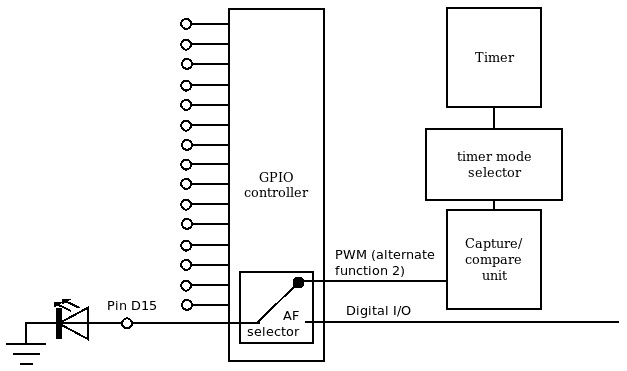
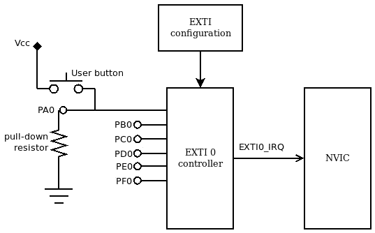

# 第六章：通用外设

现代微控制器集成了多个功能，有助于构建稳定可靠的嵌入式系统。一旦系统启动并运行，就可以访问内存和外设，并具备基本功能。只有在此之后，才能通过激活相关外设的系统寄存器、设置时钟线的正确频率以及配置和激活中断来初始化系统的所有组件。在本章中，我们将描述微控制器暴露的接口，以访问内置外设和一些基本系统功能。我们将重点关注以下主题：

+   中断控制器

+   系统时间

+   通用定时器

+   **通用** **输入/输出** （**GPIO**）

+   看门狗

虽然这些外设通常可以通过芯片制造商实现和分发的硬件支持库访问，但我们的方法涉及完全理解硬件组件和所有相关寄存器的含义。这将通过配置和使用微控制器中通过硬件逻辑导出的接口的功能来实现。

在为特定平台设计驱动程序时，有必要研究微控制器提供的用于访问外设和 CPU 功能的接口。在提供的示例中，STM32F4 微控制器被用作实现平台特定功能的参考目标。尽管如此，检查我们参考平台上的可能实现使我们能够更好地了解如何使用硅制造商提供的文档与具有类似功能的通用目标进行交互。

# 技术要求

您可以在 GitHub 上找到本章的代码文件，地址为[`github.com/PacktPublishing/Embedded-Systems-Architecture-Second-Edition/tree/main/Chapter6`](https://github.com/PacktPublishing/Embedded-Systems-Architecture-Second-Edition/tree/main/Chapter6)。

## 位操作

本章的示例广泛使用了位操作来检查、设置和清除大寄存器（在大多数情况下，为 32 位长）内的单个位。你应该已经熟悉 C 语言中的位逻辑运算。

在示例中常用的操作如下：

+   `R |= (1 << N)`: 寄存器 R 的新值将包含其原始值与一个掩码进行位或操作的位运算结果，该掩码除了我们想要设置的位对应的位置外，其余位均为零，该位被设置为 1

+   `R &= ~(1 << N)`: 寄存器的新值是其原始值与一个掩码进行位与操作的位运算结果，该掩码除了我们想要清除的位对应的位置外，其余位均为 1，该位被设置为 0

+   `(R & (1 << N) == (1 << N))`: 只有当寄存器的第 N 位被设置时，才返回`true`

让我们快速跳到第一个主题。

# 中断控制器

由于现代嵌入式系统的快速发展，特别是中断控制器的研究，实时系统的精度得到了提高。为中断线路分配不同的优先级确保了高优先级中断源具有更低的中断延迟，使系统能够更快地响应优先级事件。然而，中断可能在系统运行时任何时候发生，包括在执行另一个中断服务例程期间。在这种情况下，中断控制器提供了一种链式中断处理程序的方法，执行顺序取决于分配给中断源的优先级级别。

Cortex-M 系列微处理器在实时和低功耗嵌入式应用中的流行，其中一个原因可能是其可编程实时控制器的设计——即嵌套向量中断控制器，简称**NVIC**。NVIC 支持多达 240 个中断源，这些中断源可以根据存储在微处理器逻辑中的优先级位进行分组，最多可达 256 个优先级级别。这些特性使其非常灵活，因为优先级也可以在系统运行时更改，从而最大化程序员的选择自由度。正如我们所知，NVIC 连接到代码区域开头的向量表。每当发生中断时，处理器会自动将执行应用的当前状态推入堆栈，并执行与中断线路相关联的服务例程。

没有中断优先级机制的系统实现连续中断处理。在这些情况下，中断链意味着在执行第一个服务例程结束时恢复上下文，然后在进入下一个服务例程时再次保存。NVIC 实现了一个尾链机制来执行嵌套中断。如果在另一个服务例程执行期间发生一个或多个中断，通常在中断结束时发生的从堆栈恢复上下文的拉取操作将被取消，控制器将取而代之从中断向量中获取第二个处理器的位置，并确保它在第一个之后立即执行。由于在硬件中实现了堆栈保存和恢复操作的加速，因此在所有这些中断链的情况下，中断延迟都显著降低。得益于其实现，NVIC 允许我们在系统运行时更改参数，并且能够根据优先级重新排列待处理信号的关联中断服务例程的执行顺序。此外，不允许在同一个处理器链中两次运行相同的中断，这可能是由于在其他处理器中更改优先级所引起的。这由 NVIC 逻辑内在强制执行，确保链中不可能出现循环。

## 外设的中断配置

每个中断线都可以通过位于地址 `0xE000E100` 和 `0xE000E180` 的 NVIC 中断设置/清除使能寄存器 `NVIC_ISER` 和 `NVIC_ICER` 来启用和禁用。如果目标支持超过 32 个外部中断，则将在相同位置映射 32 位寄存器数组。寄存器中的每个位都用于激活一个预定义的中断线，与该特定寄存器中的位位置相关联。例如，在 STM32F4 微控制器上，为了激活 `NVIC_ISER` 区域的中断线。

通用 NVIC 函数，用于启用中断，会在关联的 `NVIC_ISER` 寄存器中激活对应于 NVIC 中断号的标志：

```cpp
#define NVIC_ISER_BASE (0xE000E100)
static inline void nvic_irq_enable(uint8_t n)
{
  int i = n / 32;
  volatile uint32_t *nvic_iser =
    ((volatile uint32_t *)(NVIC_ISER_BASE + 4 * i));
  *nvic_iser |= (1 << (n % 32));
}
```

同样，要禁用中断，`nvic_irq_disable` 函数会在中断清除寄存器中激活相应的位：

```cpp
#define NVIC_ICER_BASE (0xE000E180)
static inline void nvic_irq_disable(uint8_t n)
{
  int i = n / 32;
  volatile uint32_t *nvic_icer =
    ((volatile uint32_t *)(NVIC_ICER_BASE + 4 * i));
  *nvic_icer |= (1 << (n % 32));
}
```

中断优先级映射在一个 8 位寄存器数组中，每个寄存器包含对应中断线的优先级值，从地址 `0xE000E400` 开始，以便它们可以独立访问以在运行时更改优先级：

```cpp
#define NVIC_IPRI_BASE (0xE000E400)
static inline void nvic_irq_setprio(uint8_t n,
    uint8_t prio)
{
  volatile uint8_t *nvic_ipri = ((volatile uint8_t *)
   (NVIC_IPRI_BASE + n));
  *nvic_ipri = prio;
}
```

这些函数在为外设启用中断时，将有助于路由和优先级排序中断线。

# 系统时间

时间管理几乎是任何嵌入式系统的基本要求。微控制器可以被编程为在固定时间间隔触发中断，这通常用于递增单调系统时钟。为此，必须在启动时执行几个配置步骤，以便有一个稳定的滴答中断。许多处理器可以使用与 CPU 相同的振荡器作为源以自定义频率运行。振荡器的输入频率，可以是 CPU 内部或外部的，用于推导处理器的主时钟。集成到 CPU 中的可配置逻辑通过一个 **锁相环**（**PLL**）实现，该环将外部稳定源的输入时钟乘以，产生 CPU 和集成外设使用的所需频率。

## 调整闪存等待状态

如果初始化代码是从闪存中运行的，在更改系统时钟之前可能需要设置闪存内存的等待状态。如果微处理器以高频率运行，它可能需要在两个连续访问操作之间对具有 `0x40023800` 的持久性内存设置几个等待状态。**访问控制寄存器**（**ACR**），我们需要访问以设置等待状态的寄存器，位于该区域的开始处：

```cpp
#define FLASH_BASE (0x40023C00)
#define FLASH_ACR (*(volatile uint32_t *)(FLASH_BASE +
   0x00))
```

`FLASH_ACR` 寄存器的最低三位用于设置等待状态的数量。根据 STM32F407 数据手册，当系统以 168 MHz 运行时，访问闪存的理想等待状态数量是 `5`。同时，我们可以通过激活位 `10` 和 `9` 分别启用数据和指令缓存：

```cpp
void flash_set_waitstates(void) {
  FLASH_ACR = 5 | (1 << 10) | (1 << 9);
}
```

设置等待状态后，在将 CPU 频率设置得更高后，从闪存中运行代码是安全的，因此我们可以继续进行实际的时钟配置和分配到外设。

## 时钟配置

Cortex-M 微控制器中的时钟配置是通过位于内部外设区域特定地址的 **重置和时钟控制**（**RCC**）寄存器来完成的。RCC 配置是供应商特定的，因为它取决于微控制器中实现的 PLL 逻辑。寄存器在微控制器的文档中描述，通常，芯片制造商提供示例源代码，演示如何在微控制器上正确配置时钟。在我们的参考目标 STM32F407 上，假设使用外部 8 MHz 振荡器作为源，以下过程配置了一个 168 MHz 系统时钟，并确保时钟也分配到每个外设总线。以下代码确保 PLL 以所需值初始化，并且 CPU 时钟以期望的频率滴答。此过程在许多 STM Cortex-M 微控制器中很常见，PLL 配置的值可以从芯片文档中获得，或使用 ST 提供的软件工具计算。

此处提供的软件示例将使用系统特定模块，导出配置时钟和设置闪存延迟所需的函数。我们现在分析两种可能的 PLL 配置实现，针对两种不同的 Cortex-M 微控制器。

要访问 STM32F407-Discovery 中 PLL 的配置，首先，我们定义了一些快捷宏到由`RCC`提供的寄存器地址：

```cpp
#define RCC_BASE (0x40023800)
#define RCC_CR (*(volatile uint32_t *)(RCC_BASE + 0x00))
#define RCC_PLLCFGR (*(volatile uint32_t *)(RCC_BASE +
    0x04))
#define RCC_CFGR (*(volatile uint32_t *)(RCC_BASE + 0x08))
#define RCC_CR (*(volatile uint32_t *)(RCC_BASE + 0x00))
```

为了提高可读性，并确保代码在未来可维护，我们还定义了与相应寄存器中单比特值相关的助记符：

```cpp
#define RCC_CR_PLLRDY (1 << 25)
#define RCC_CR_PLLON (1 << 24)
#define RCC_CR_HSERDY (1 << 17)
#define RCC_CR_HSEON (1 << 16)
#define RCC_CR_HSIRDY (1 << 1)
#define RCC_CR_HSION (1 << 0)
#define RCC_CFGR_SW_HSI 0x0
#define RCC_CFGR_SW_HSE 0x1
#define RCC_CFGR_SW_PLL 0x2
#define RCC_PLLCFGR_PLLSRC (1 << 22)
#define RCC_PRESCALER_DIV_NONE 0
#define RCC_PRESCALER_DIV_2 8
#define RCC_PRESCALER_DIV_4 9
```

最后，我们定义了用于配置 PLL 的平台特定常量值：

```cpp
#define CPU_FREQ (168000000)
#define PLL_FULL_MASK (0x7F037FFF)
#define PLLM 8
#define PLLN 336
#define PLLP 2
#define PLLQ 7
#define PLLR 0
```

定义了一个额外的宏来调用`DMB`汇编指令，为了简洁起见，因为它将在代码中使用，以确保在执行下一个语句之前完成任何挂起的配置寄存器内存传输：

```cpp
#define DMB() asm volatile ("dmb");
```

下一个函数将确保执行 PLL 初始化序列，以设置正确的 CPU 频率。首先，它将启用内部高速振荡器，并通过轮询 CR 来等待其就绪：

```cpp
void rcc_config(void)
{
  uint32_t reg32;
  RCC_CR |= RCC_CR_HSION;
  DMB();
  while ((RCC_CR & RCC_CR_HSIRDY) == 0)
    ;
```

然后选择内部振荡器作为临时时钟源：

```cpp
  reg32 = RCC_CFGR;
  reg32 &= ~((1 << 1) | (1 << 0));
  RCC_CFGR = (reg32 | RCC_CFGR_SW_HSI);
  DMB();
```

然后以相同的方式激活外部振荡器：

```cpp
  RCC_CR |= RCC_CR_HSEON;
  DMB();
  while ((RCC_CR & RCC_CR_HSERDY) == 0)
    ;
```

在此设备上，时钟可以通过三个系统总线分布到所有外围设备。使用预分频器，每个总线的频率可以按 2 或 4 的倍数缩放。在这种情况下，我们将 HPRE、PPRE1 和 PPRE2 的时钟速度分别设置为 168、84 和 46 MHz：

```cpp
  reg32 = RCC_CFGR;
  reg32 &= ~0xF0;
  RCC_CFGR = (reg32 | (RCC_PRESCALER_DIV_NONE << 4));
  DMB();
  reg32 = RCC_CFGR;
  reg32 &= ~0x1C00;
  RCC_CFGR = (reg32 | (RCC_PRESCALER_DIV_2 << 10));
  DMB();
  reg32 = RCC_CFGR;
  reg32 &= ~0x07 << 13;
  RCC_CFGR = (reg32 | (RCC_PRESCALER_DIV_4 << 13));
  DMB();
```

PLL 配置寄存器被设置为包含将外部振荡器频率正确缩放到所需值的参数：

```cpp
  reg32 = RCC_PLLCFGR;
  reg32 &= ~PLL_FULL_MASK;
  RCC_PLLCFGR = reg32 | RCC_PLLCFGR_PLLSRC | PLLM |
    (PLLN << 6) | (((PLLP >> 1) - 1) << 16) |
    (PLLQ << 24);
  DMB();
```

然后激活 PLL，执行将暂停，直到输出稳定：

```cpp
  RCC_CR |= RCC_CR_PLLON;
  DMB();
  while ((RCC_CR & RCC_CR_PLLRDY) == 0);
```

将 PLL 选为系统时钟的最终源：

```cpp
  reg32 = RCC_CFGR;
  reg32 &= ~((1 << 1) | (1 << 0));
  RCC_CFGR = (reg32 | RCC_CFGR_SW_PLL);
  DMB();
  while ((RCC_CFGR & ((1 << 1) | (1 << 0))) !=
    RCC_CFGR_SW_PLL);
```

内部振荡器不再使用，可以禁用。控制权返回调用者，所有时钟都成功设置。

如前所述，时钟初始化的步骤严格依赖于微控制器中的 PLL 配置。为了正确初始化 CPU 和外围设备所需的系统时钟，以便在期望的频率下运行，始终建议参考硅制造商提供的微控制器数据手册。作为第二个例子，我们可以验证`RCC`和`RCC2`：

```cpp
#define RCC (*(volatile uint32_t*))(0x400FE060)
#define RCC2 (*(volatile uint32_t*))(0x400FE070)
```

要将`RCC`寄存器重置到已知状态，必须在启动时将这些寄存器写入重置值：

```cpp
#define RCC_RESET (0x078E3AD1)
#define RCC2_RESET (0x07802810)
```

此微控制器使用原始中断来通知 PLL 已锁定到请求的频率。可以通过读取**原始中断状态**（**RIS**）寄存器中的位`6`来检查中断状态：

```cpp
#define RIS (*(volatile uint32_t*))(0x400FE050)
#define PLL_LRIS (1 << 6)
```

在这种情况下，时钟配置例程首先重置`RCC`寄存器，并设置适当的值以配置 PLL。PLL 被配置为从 8 MHz 振荡器源生成 400 MHz 时钟：

```cpp
void rcc_config(void)
{
  RCC = RCC_RESET;
  RCC2 = RCC2_RESET;
  DMB();
  RCC = RCC_SYSDIV_50MHZ | RCC_PWMDIV_64 |
    RCC_XTAL_8MHZ_400MHZ | RCC_USEPWMDIV;
```

从这个主 400 MHz 时钟通过系统分频器得到的 50 MHz CPU 频率。时钟先被预分频两次，然后应用一个`4`的倍数：

```cpp
  RCC2 = RCC2_SYSDIV2_4;
  DMB();
```

外部振荡器也被启用：

```cpp
  RCC &= ~RCC_OFF;
  RCC2 &= ~RCC2_OFF;
```

并且系统时钟分频器也被启用。同时，设置旁路位确保振荡器被用作系统时钟的源，PLL 被旁路：

```cpp
  RCC |= RCC_BYPASS | RCC_USESYSDIV;
  DMB();
```

执行将保持，直到 PLL 稳定并锁定在所需的频率：

```cpp
 while ((RIS & PLL_LRIS) == 0)   ;
```

在此点禁用`RCC`寄存器中的旁路位足以将 PLL 输出连接到系统时钟：

```cpp
  RCC &= ~RCC_BYPASS;
  RCC2 &= ~RCC2_BYPASS;
}
```

## 时钟分配

一旦总线时钟可用，`RCC`逻辑可以被编程以将时钟分配给单个外设。为此，`RCC`公开了位图外设时钟源寄存器。在其中一个寄存器中设置相应的位将启用微控制器中每个映射外设的时钟。每个寄存器可以控制 32 个外设的时钟门控。

外设的顺序以及相应的寄存器和位严格依赖于特定的微控制器。STM32F4 有三个寄存器专门用于此目的。例如，为了启用内部看门狗的时钟源，只需在地址`0x40021001c`的时钟使能寄存器中将位号`9`设置为`1`：

```cpp
#define APB1_CLOCK_ER (*(uint32_t *)(0x4002001c))
#define WDG_APB1_CLOCK_ER_VAL (1 << 9)
APB1_CLOCK_ER |= WDG_APB1_CLOCK_ER_VAL;
```

关闭未使用外设的时钟源可以节省电源；因此，如果目标支持时钟门控，它可以通过在运行时通过它们的时钟门控禁用单个外设来实现功耗的优化和微调。

## 启用 SysTick

一旦设置了稳定的 CPU 频率，我们就可以配置系统上的主定时器——SysTick。由于并非所有 Cortex-M 都需要特定的系统定时器实现，有时有必要使用普通辅助定时器来跟踪系统时间。然而，在大多数情况下，可以通过访问其配置来启用 SysTick 中断，该配置位于系统配置区域内的系统控制块中。在所有包含系统滴答的 Cortex-M 微控制器中，配置可以从地址`0xE000E010`开始找到，并公开了四个寄存器：

+   控制状态寄存器（`SYSTICK_CSR`）偏移量为`0`

+   重载值寄存器（`SYSTICK_RVR`）偏移量为`4`

+   当前值寄存器（`SYSTICK_CVR`）偏移量为`8`

+   校准寄存器（`SYSTICK_CALIB`）偏移量为`12`

SysTick 作为一个倒计时计时器工作。它持有一个 24 位值，每次 CPU 时钟滴答时该值会减少。当计时器达到`0`时，它会重新加载相同的值，如果配置为这样做，则触发 SysTick 中断。

作为访问 SysTick 寄存器的快捷方式，我们定义了它们的地址：

```cpp
#define SYSTICK_BASE (0xE000E010)
#define SYSTICK_CSR (*(volatile uint32_t *)(SYSTICK_BASE +
    0x00))
#define SYSTICK_RVR (*(volatile uint32_t *)(SYSTICK_BASE +
    0x04))
#define SYSTICK_CVR (*(volatile uint32_t *)(SYSTICK_BASE +
    0x08))
#define SYSTICK_CALIB (*(volatile uint32_t *)(SYSTICK_BASE
    + 0x0C))
```

由于我们知道 CPU 的频率（Hz），我们可以通过设置`0`中的值来定义系统滴答间隔，这样在启用倒计时后，第一个中断立即触发。通过配置控制/状态寄存器，SysTick 最终可以启用。CSR 最低三位的意义如下：

+   **位 0**：启用倒计时。在此位设置后，SysTick 计时器的计数器在每次 CPU 时钟间隔自动减少。

+   `0`，将生成 SysTick 中断。

+   **位 2**：源时钟选择。如果此位被清除，则使用外部参考时钟作为源。当此位被设置时，使用 CPU 时钟作为源。

我们将定义一个自定义的 SysTick 中断处理程序，因此我们还想设置位`1`。因为我们正确地配置了 CPU 时钟，并且我们在其上缩放系统滴答间隔重载值，所以我们还想设置位`2`。我们`systick_enable`例程的最后一行将一起在 CSR 中启用这三个位：

```cpp
void systick_enable(void) {
  SYSTICK_RVR = ((CPU_FREQ / 1000) - 1);
  SYSTICK_CVR = 0;
  SYSTICK_CSR = (1 << 0) | (1 << 1) | (1 << 2);
}
```

我们配置的系统计时器与**实时操作系统**（RTOSs）用于启动进程切换所使用的计时器相同。在我们的情况下，保持一个单调的系统墙钟，测量自时钟配置以来经过的时间，可能会有所帮助。系统计时器的中断服务例程的最小化实现可能如下所示：

```cpp
volatile unsigned int jiffies = 0;
void isr_systick(void)
{
  ++jiffies;
}
```

这个简单的函数以及相关的全局`volatile`变量足以在应用程序运行时透明地跟踪时间。实际上，系统滴答中断是独立发生的，在`jiffies`变量在中断处理程序中增加时，以固定的时间间隔发生，而不改变主应用程序的流程。实际上发生的情况是，每当系统滴答计数器达到`0`时，执行被暂停，中断例程快速执行。当`isr_systick`返回时，通过恢复中断发生前存储在内存中的相同的执行上下文，主应用程序的流程得以恢复。

系统计时器变量必须在所有地方定义为`volatile`的原因是，其值在执行应用程序时可能会以与编译器对局部执行上下文行为可能预测的方式独立地改变。在这种情况下，`volatile`关键字确保编译器被迫产生代码，每次实例化变量时都检查变量的值，通过禁止使用基于变量未由局部代码修改的虚假假设的优化。

这里是一个使用前面函数来启动系统、配置主时钟和启用 SysTick 的示例主程序：

```cpp
void main(void) {
  flash_set_waitstates();
  clock_config();
  systick_enable();
  while(1) {
    WFI();
  }
}
```

定义了**WFI**汇编指令的快捷方式（代表**等待中断**）。它在主应用程序中使用，以保持 CPU 在下一个中断发生之前不活动：

```cpp
#define WFI() asm volatile ("wfi")
```

为了验证 SysTick 实际上正在运行，可以在调试器附加的情况下执行程序，并在一段时间后停止。如果系统滴答已正确配置，`jiffies`变量应始终显示自引导以来经过的毫秒数。

# 通用定时器

对于低端微控制器，提供 SysTick 定时器不是强制性的。某些目标可能没有系统定时器，但它们都暴露了某种类型的接口，以便程序能够实现时间驱动的操作。定时器通常非常灵活且易于配置，并且通常能够以固定间隔触发中断。STM32F4 提供了多达 17 个定时器，每个定时器都有不同的特性。定时器通常相互独立，因为每个定时器都有自己的中断线和单独的外设时钟门。例如，在 STM32F4 上，启用定时器 2 的时钟源和中断线的步骤如下。定时器接口基于一个计数器，它在每个滴答时增加或减少。该平台暴露的接口非常灵活，支持多个功能，包括选择不同的时钟源作为输入，将定时器串联的可能性，甚至可以编程的定时器实现内部结构。可以配置定时器向上或向下计数，并在内部计数器的不同值上触发中断事件。定时器可以是单次或连续的。

通常可以在硅供应商提供的支持库中找到对`定时器`接口的抽象，或者在其他开源库中。然而，为了理解微控制器暴露的接口，这里提供的示例再次直接通过配置寄存器与外围设备进行通信。

此示例主要使用 STM32F407 上通用定时器的默认设置。默认情况下，计数器在每个滴答时增加，直到其自动重载值，并在溢出时连续生成中断事件。可以设置预分频值来分频时钟源，以增加可能间隔的范围。为了生成以恒定间隔分散的中断，只需要访问几个寄存器：

+   **控制寄存器 1**和**2**（**CR1**和**CR2**）

+   **直接内存访问（DMA）/中断使能寄存器**（**DIER**）

+   **状态寄存器**（**SR**）

+   **预分频计数器**（**PSC**）

+   **自动重载寄存器**（**ARR**）

通常，这些寄存器的偏移量对所有定时器都是相同的，因此，给定基本地址，它们可以通过宏来计算。在这种情况下，只定义了正在使用的定时器的寄存器：

```cpp
#define TIM2_BASE (0x40000000)
#define TIM2_CR1 (*(volatile uint32_t *)(TIM2_BASE + 0x00))
#define TIM2_DIER (*(volatile uint32_t *)(TIM2_BASE +
    0x0c))
#define TIM2_SR (*(volatile uint32_t *)(TIM2_BASE + 0x10))
#define TIM2_PSC (*(volatile uint32_t *)(TIM2_BASE + 0x28))
#define TIM2_ARR (*(volatile uint32_t *)(TIM2_BASE + 0x2c))
```

此外，为了提高可读性，我们在将要配置的寄存器中定义了一些相关的位位置：

```cpp
#define TIM_DIER_UIE (1 << 0)
#define TIM_SR_UIF (1 << 0)
#define TIM_CR1_CLOCK_ENABLE (1 << 0)
#define TIM_CR1_UPD_RS (1 << 2)
```

首先，我们将定义一个服务例程。`timer`接口要求我们在状态寄存器中清除一个标志，以确认中断。在这个简单的例子中，我们只是增加一个局部变量，以便我们可以通过在调试器中检查它来验证`timer`是否正在执行。我们将`timer2_ticks`变量标记为`volatile`，这样编译器就不会将其优化掉，因为它在代码中从未使用过：

```cpp
void isr_tim2(void)
{
  static volatile uint32_t timer2_ticks = 0;
  TIM2_SR &= ~TIM_SR_UIF;
  timer2_ticks++;
}
```

服务例程必须通过在`startup.c`中定义的中断向量中正确位置包含函数指针来关联：

```cpp
isr_tim2 , // TIM2_IRQ 28
```

如果计时器连接到时钟树中的不同分支，就像这个例子一样，我们需要在计算预分频器和重载阈值时，考虑到时钟总线（为计时器供电）和实际 CPU 时钟频率之间的额外缩放因子。在 STM32F407 上，计时器 2 连接到**高级外设总线**（**APB**）总线，该总线运行在 CPU 频率的一半。

此初始化是一个函数示例，该函数自动计算`TIM2_PSC`和`TIM2_ARR`值，并根据给定的毫秒数间隔初始化计时器。时钟变量必须设置为计时器时钟源的频率，这可能与 CPU 频率不同。

以下定义仅适用于我们的平台，将时钟门控配置的地址和我们要使用的设备的中断号映射：

```cpp
#define APB1_CLOCK_ER (*(volatile uint32_t *)(0x40023840))
#define APB1_CLOCK_RST (*(volatile uint32_t *)
     (0x40023820))
#define TIM2_APB1_CLOCK_ER_VAL (1 << 0)
#define NVIC_TIM2_IRQN (28)
```

以下是从`main`函数中调用的函数，用于在期望的间隔内启用连续的计时器中断：

```cpp
int timer_init(uint32_t clock, uint32_t interval_ms)
{
  uint32_t val = 0;
  uint32_t psc = 1;
  uint32_t err = 0;
  clock = (clock / 1000) * interval_ms;
  while (psc < 65535) {
    val = clock / psc;
    err = clock % psc;
    if ((val < 65535) && (err == 0)) {
      val--;
      break;
    }
    val = 0;
    psc++;
  }
  if (val == 0)
    return -1;
  nvic_irq_enable(NVIC_TIM2_IRQN);
  nvic_irq_setprio(NVIC_TIM2_IRQN, 0);
  APB1_CLOCK_RST |= TIM2_APB1_CLOCK_ER_VAL;
  DMB();
  TIM2_PSC = psc;
  TIM2_ARR = val;
  TIM2_CR1 |= TIM_CR1_CLOCK_ENABLE;
  TIM2_DIER |= TIM_DIER_UIE;
  DMB();
  return 0;
}
```

这里展示的示例只是系统定时器可能应用的一种可能。在参考平台上，定时器可用于不同的目的，例如测量脉冲之间的间隔、相互同步或根据选择的频率和占空比定期激活信号。这种最后一种用法将在本章后面的*PWM*小节中解释。对于目标上通用定时器的所有其他用途，请参阅所使用微控制器的参考手册。现在，我们的系统已配置就绪，可以运行，并且我们已经学会了如何管理时间和生成同步事件，现在是时候介绍我们的第一个外设，开始与外部世界通信了。在下一节中，我们将介绍 GPIO 引脚的多种配置，这些配置允许驱动或感应单个微控制器引脚上的电压。

# GPIO

大多数微控制器芯片的引脚代表可配置的 I/O 线。每个引脚都可以配置为通过驱动引脚的电压作为数字输出来表示逻辑电平，或者通过比较电压作为数字输入来感知逻辑状态。尽管如此，一些通用引脚可以与替代功能相关联，例如模拟输入、串行接口或计时器的输出脉冲。引脚可能有几种可能的配置，但一次只能激活一个。GPIO 控制器公开所有引脚的配置，并在使用替代功能时管理引脚与子系统的关联。

## 引脚配置

根据 GPIO 控制器的逻辑，引脚可以全部激活、单独激活或分组激活。为了实现设置引脚并按需使用它们的驱动程序，可以参考微控制器的数据手册或硅供应商提供的任何示例实现。

在 STM32F4 的情况下，GPIO 引脚被分为组。每个组连接到一个单独的时钟门，因此，要使用与组关联的引脚，必须启用时钟门。以下代码将时钟源分配给组 `D` 的 GPIO 控制器：

```cpp
#define AHB1_CLOCK_ER (*(volatile uint32_t *)(0x40023840))
#define GPIOD_AHB1_CLOCK_ER (1 << 3)
AHB1_CLOCK_ER |= GPIOD_AHB1_CLOCK_ER;
```

与 GPIO 控制器关联的配置寄存器映射到外设区域中的特定区域。对于 `GPIOD` 控制器，基本地址为 `0x40020C00`。在 STM32F4 微控制器上，有 10 个不同的寄存器用于配置和使用每个数字 I/O 组。由于组最多由 16 个引脚组成，一些寄存器可能使用每引脚 2 位的表示：

+   模式寄存器（地址空间中的偏移量 `0`）选择模式（在数字输入、数字输出、替代功能或模拟输入之间），每引脚使用 2 位

+   输出类型寄存器（偏移量 `4`）选择输出信号驱动逻辑（推挽或开漏）

+   输出速度寄存器（偏移量 `8`）选择输出驱动速度

+   拉起寄存器（偏移量 `12`）启用或禁用内部上拉或下拉电阻

+   端口输入数据（偏移量 `16`）用于读取数字输入引脚的状态

+   端口输出数据（偏移量 `20`）包含数字输出的当前值

+   端口位设置/重置（偏移量 `24`）用于驱动数字输出信号高或低

+   端口配置锁定（偏移量 `28`）

+   替代功能低位寄存器（偏移量 `32`），每引脚 4 位，引脚 0-7

+   替代功能高位寄存器（偏移量 `36`），每引脚 4 位，引脚 8-15

在使用之前必须配置引脚，并配置时钟门以将源时钟路由到控制器的组。此 GPIO 控制器上的配置可以通过查看具体示例来更好地解释。

## 数字输出

通过在模式寄存器中对应于给定引脚的位中将模式设置为输出，可以启用数字输出。为了能够控制连接到我们参考平台上的 LED 的 D13 引脚的电平，我们需要访问以下寄存器：

```cpp
#define GPIOD_BASE 0x40020c00
#define GPIOD_MODE (*(volatile uint32_t *)(GPIOD_BASE +
    0x00))
#define GPIOD_OTYPE (*(volatile uint32_t *)(GPIOD_BASE +
    0x04))
#define GPIOD_PUPD (*(volatile uint32_t *)(GPIOD_BASE +
    0x0c))
#define GPIOD_ODR (*(volatile uint32_t *)(GPIOD_BASE +
    0x14))
#define GPIOD_BSRR (*(volatile uint32_t *)(GPIOD_BASE +
    0x18))
```

在后续示例中，使用备用功能来更改引脚分配。包含备用功能设置的寄存器如下所示：

```cpp
#define GPIOD_AFL (*(volatile uint32_t *)(GPIOD_BASE +
    0x20))
#define GPIOD_AFH (*(volatile uint32_t *)(GPIOD_BASE +
    0x24))
```

以下简单函数旨在控制连接到 STM32F4 上的蓝色 LED 的 D15 引脚的输出。主程序必须在调用任何其他函数之前调用`led_setup`，以便将引脚配置为输出并激活上拉/下拉内部电阻：

```cpp
#define LED_PIN (15)
void led_setup(void)
{
  uint32_t mode_reg;
```

首先，配置时钟门控以启用`GPIOD`控制器的时钟源：

```cpp
  AHB1_CLOCK_ER |= GPIOD_AHB1_CLOCK_ER;
```

模式寄存器被修改以设置 GPIO D15 的模式为数字输出。此操作分为两步。在寄存器中对应于引脚模式位置的 2 位中设置的任何先前值都会被清除：

```cpp
   GPIOD_MODE &= ~ (0x03 << (LED_PIN * 2));
```

在相同的位置，设置值为`1`，这意味着引脚现在配置为数字输出：

```cpp
   GPIOD_MODE |= 1 << (LED_PIN * 2);
```

要启用上拉和下拉内部电阻，我们执行相同的操作。在这种情况下要设置的值是`2`，对应以下内容：

```cpp
   GPIOD_PUPD &= ~(0x03 << (LED_PIN * 2));
   GPIOD_PUPD |= 0x02 << (LED_PIN * 2);
}
```

在调用`setup`函数之后，应用程序和中断处理程序可以调用导出的函数，通过操作设置/重置寄存器来设置引脚的高电平或低电平值：

```cpp
void led_on(void)
{
  GPIOD_BSRR |= 1 << LED_PIN;
}
```

`BSRR`的最高半部分用于重置引脚。在重置寄存器位中写入`1`将引脚逻辑电平驱动到低电平：

```cpp
void led_off(void)
{
  GPIOD_BSRR |= 1 << (LED_PIN + 16);
}
```

定义了一个便利函数，用于在开和关之间切换 LED 值：

```cpp
void led_toggle(void)
{
  if ((GPIOD_ODR & (1 << LED_PIN)) == (1 << LED_PIN))
    led_off();
  else
    led_on();
}
```

使用上一节中配置的`timer`，可以运行一个小程序，闪烁 STM32F407-Discovery 上的蓝色 LED。`led_toggle`函数可以从上一节中实现的`timer`的服务例程内部调用：

```cpp
void isr_tim2(void)
{
  TIM2_SR &= ~TIM_SR_UIF;
  led_toggle();
}
```

在主程序中，在启动定时器之前必须初始化 LED 驱动器：

```cpp
void main(void) {
  flash_set_waitstates();
  clock_config();
  led_setup();
  timer_init(CPU_FREQ, 1, 1000);
  while(1)
  WFI();
}
```

程序的主循环为空。每秒调用一次`led_toggle`操作来闪烁 LED。

## PWM

**脉冲宽度调制**，或简称**PWM**，是一种常用的技术，用于控制不同类型的执行器，将消息编码到具有不同脉冲宽度的信号中，并且通常在数字输出线上以固定频率和可变占空比生成脉冲，用于不同的目的。

`timer`接口可能允许将引脚关联到输出 PWM 信号。在我们的参考微控制器上，四个输出比较通道可以与通用定时器关联，连接到 OC 通道的引脚可以配置为自动输出编码输出。在 STM32F407-Discovery 板上，用于演示数字输出功能的先前示例中的蓝色 LED 引脚 PD15，与可以由定时器 4 驱动的 OC4 关联。根据芯片文档，选择引脚的备用功能 2 直接将输出引脚连接到 OC4。

以下图示显示了使用备用功能 2 将引脚连接到定时器输出的引脚配置：



图 6.1 – 配置引脚 D15 使用备用功能 2 将其连接到定时器的输出

引脚被初始化，并设置为使用备用配置而不是普通数字输出，通过清除`MODE`寄存器位并将值设置为`2`：

```cpp
GPIOD_MODE &= ~ (0x03 << (LED_PIN * 2));
GPIOD_MODE |= (2 << (LED_PIN * 2));
```

本 GPIO 组中的引脚 0 到 7 在`GPIOD`控制器的 AFL 寄存器中每个使用 4 位。更高位的引脚，在 8-15 范围内，在 AFH 寄存器中每个使用 4 位。一旦选择了备用模式，正确的备用功能号被编程到与引脚 15 关联的 4 位中，因此在这种情况下我们使用 AFH 寄存器：

```cpp
uint32_t value;
if (LED_PIN < 8) {
   value = GPIOD_AFL & (~(0xf << (LED_PIN * 4)));
   GPIOD_AFL = value | (0x2 << (LED_PIN * 4));
} else {
   value = GPIOD_AFH & (~(0xf << ((LED_PIN - 8) * 4)));
   GPIOD_AFH = value |(0x2 << ((LED_PIN - 8) * 4));
}
```

`pwm_led_init()`函数，我们可以从主程序中调用它来配置 LED 引脚 PD15，将如下所示：

```cpp
void led_pwm_setup(void)
{
  AHB1_CLOCK_ER |= GPIOD_AHB1_CLOCK_ER;
  GPIOD_MODE &= ~ (0x03 << (LED_PIN * 2));
  GPIOD_MODE |= (2 << (LED_PIN * 2));
  GPIOD_OSPD &= ~(0x03 << (LED_PIN * 2));
  GPIOD_OSPD |= (0x03 << (LED_PIN * 2));
  GPIOD_PUPD &= ~(0x03 << (LED_PIN * 2));
  GPIOD_PUPD |= (0x02 << (LED_PIN * 2));
  GPIOD_AFH &= ~(0xf << ((LED_PIN - 8) * 4));
  GPIOD_AFH |= (0x2 << ((LED_PIN - 8) * 4));
}
```

设置定时器以生成 PWM 的函数与数字输出示例中使用的简单中断生成定时器中的函数类似，除了配置定时器以输出 PWM 需要修改四个额外的寄存器值：

+   **捕获/比较使能** **寄存器** (**CCER**)

+   **捕获/比较模式寄存器 1** 和 **2** (**CCMR1** 和 **CCMR2**)

+   **捕获通道 4** (**CC4**) 配置

我们将在示例中用于配置给定占空比的 PWM 函数的签名如下：

```cpp
int pwm_init(uint32_t clock, uint32_t dutycycle)
{
```

启用时钟门控以打开定时器 4 仍然是必需的：

```cpp
  APB1_CLOCK_RST &= ~TIM4_APB1_CLOCK_ER_VAL;
  APB1_CLOCK_ER |= TIM4_APB1_CLOCK_ER_VAL;
```

定时器和其输出比较通道暂时禁用，以便从干净的状态开始配置：

```cpp
  TIM4_CCER &= ~TIM_CCER_CC4_ENABLE;
  TIM4_CR1 = 0;
  TIM4_PSC = 0;
```

对于本例，我们可以使用固定的 PWM 频率 100 kHz，通过将自动重载值设置为输入时钟的`1`/`100000`，并强制不使用预分频器：

```cpp
  uint32_t val = clock / 100000;
```

负载周期是根据传递给`pwm_init()`函数的第二个参数的值计算的，该值以百分比表示。为了计算相应的阈值水平，使用以下简单公式，例如，值为 80 表示 PWM 将在 4/5 的时间内处于活动状态。结果值减去 1，除非为零，以避免下溢：

```cpp
  lvl = (val * threshold) / 100;
  if (lvl != 0)
    lvl--;
```

比较器值寄存器`CCR4`和自动重载值寄存器`ARR`相应设置。此外，在这种情况下，`ARR`的值减少 1，以考虑基于零的计数器：

```cpp
  TIM4_ARR = val - 1;
  TIM4_CCR4 = lvl;
```

为了正确设置此平台上的 PWM 信号，我们首先确保我们将要配置的`CCMR1`寄存器部分被正确清除。这包括捕获选择和模式配置：

```cpp
  TIM4_CCMR1 &= ~(0x03 << 0);
  TIM4_CCMR1 &= ~(0x07 << 4);
```

选择的`PWM1`模式是基于捕获/比较定时器的可能交替配置之一。为了启用该模式，我们在清除寄存器相关位后，在`CCMR2`中设置`PWM1`值：

```cpp
  TIM4_CCMR1 &= ~(0x03 << 0);
  TIM4_CCMR1 &= ~(0x07 << 4);
  TIM4_CCMR1 |= TIM_CCMR1_OC1M_PWM1;
  TIM4_CCMR2 &= ~(0x03 << 8);
  TIM4_CCMR2 &= ~(0x07 << 12);
  TIM4_CCMR2 |= TIM_CCMR2_OC4M_PWM1;
```

最后，我们启用输出比较器 OC4。然后，定时器被设置为在计数器溢出时自动重载其存储的值：

```cpp
  TIM4_CCMR2 |= TIM_CCMR2_OC4M_PWM1;
  TIM4_CCER |= TIM_CCER_CC4_ENABLE;
  TIM4_CR1 |= TIM_CR1_CLOCK_ENABLE | TIM_CR1_ARPE;
}
```

使用 PWM 驱动 LED 上的电压可以改变其亮度，根据配置的占空比。例如，以下示例程序将 LED 的亮度降低到 50%，与由恒定电压输出供电的 LED 相比，例如数字输出示例中的 LED：

```cpp
void main(void) {
  flash_set_waitstates();
  clock_config();
  led_pwm_setup();
  pwm_init(CPU_FREQ, 50);
  while(1)
    WFI();
}
```

通过动态改变占空比，可以更好地可视化 PWM 对 LED 亮度的效果。例如，可以设置一个定时器，每隔 50 毫秒产生一个中断。在中断处理程序中，占空比因子在 0-80%的范围内循环，使用 16 个步骤。在前 8 个步骤中，每个中断占空比增加 10%，从 0 增加到 80%，在最后 8 个步骤中，以相同的速率减少，将占空比恢复到`0`：

```cpp
void isr_tim2(void) {
  static uint32_t tim2_ticks = 0;
  TIM2_SR &= ~TIM_SR_UIF;
  if (tim2_ticks > 16)
    tim2_ticks = 0;
  if (tim2_ticks > 8)
    pwm_init(master_clock, 10 * (16 - tim2_ticks));
  else
    pwm_init(master_clock, 10 * tim2_ticks);
  tim2_ticks++;
}
```

如果我们在主程序中将定时器 2 初始化为触发恒定间隔中断，就像前面的示例一样，我们可以看到 LED 以有节奏的节奏闪烁，明暗交替。

在这种情况下，定时器 2 由主程序初始化，其关联的中断处理程序每秒更新定时器 4 的设置 20 次：

```cpp
void main(void) {
  flash_set_waitstates();
  clock_config();
  led_pwm_setup();
  pwm_init(CPU_FREQ, 0);
  timer_init(CPU_FREQ, 1, 50);
  while(1)
    WFI();
}
```

## 数字输入

一个配置为输入模式的 GPIO 引脚检测施加在其上的电压的逻辑电平。GPIO 控制器上所有输入引脚的逻辑值都可以从**输入数据寄存器**（**IDR**）中读取。在参考板上，引脚 A0 连接到用户按钮，因此可以在应用程序运行时随时读取按钮的状态。

可以通过时钟门控来开启`GPIOA`控制器：

```cpp
#define AHB1_CLOCK_ER (*(volatile uint32_t *)(0x40023830))
#define GPIOA_AHB1_CLOCK_ER (1 << 0)
```

控制器本身映射到地址`0x40020000`：

```cpp
#define GPIOA_BASE 0x40020000
#define GPIOA_MODE (*(volatile uint32_t *)(GPIOA_BASE +
     0x00))
#define GPIOA_IDR (*(volatile uint32_t *)(GPIOA_BASE +
     0x10))
```

为了设置引脚为输入，我们只需确保模式设置为`0`，通过清除与引脚`0`相关的两个模式位：

```cpp
#define BUTTON_PIN (0)
void button_setup(void)
{
  AHB1_CLOCK_ER |= GPIOA_AHB1_CLOCK_ER;
  GPIOA_MODE &= ~ (0x03 << (BUTTON_PIN * 2));
}
```

应用程序现在可以通过读取 IDR 的最低位来随时检查按钮的状态。当按钮被按下时，参考电压连接到引脚，对应引脚的位值从`0`变为`1`：

```cpp
int button_is_pressed(void)
{
  return (GPIOA_IDR & (1 << BUTTON_PIN)) >> BUTTON_PIN;
}
```

## 基于中断的输入

在许多情况下，需要通过不断轮询 IDR 来主动读取引脚值并不方便，尤其是在应用需要响应状态变化时。微控制器通常提供机制将数字输入引脚连接到中断线上，以便应用能够实时响应与输入相关的事件，因为执行被中断以执行相关服务例程。

在参考**微控制器单元**（**MCU**）上，引脚 A0 可以连接到外部中断和事件控制器，也称为**EXTI**。EXTI 提供边缘检测触发器，可以附加到中断线上。引脚在 GPIO 组中的编号决定了与它关联的 EXTI 中断编号，因此如果需要，EXTI 0 中断例程可以连接到任何 GPIO 组的引脚 0：



图 6.2 – EXTI0 控制器将边缘检测触发器关联到连接到 PA0 的用户按钮

`EXTI_CR`寄存器位于地址`0x40013808`。每个寄存器用于设置与 EXTI 线关联的中断控制器。第一个寄存器的最低四位与 EXTI 线 0 相关。GPIO 组 A 的编号为 0，因此我们需要确保第一个`EXTI_CR`寄存器中的相应位被清除。下一个示例的目标是演示如何启用`EXTI_CR`寄存器以设置 GPIO 组 A：

```cpp
#define EXTI_CR_BASE (0x40013808)
#define EXTI_CR0 (*(volatile uint32_t *)(EXTI_CR_BASE +
    0x00))
#define EXTI_CR_EXTI0_MASK (0x0F)
```

`EXTI0`中断连接到 NVIC 行号`6`，因此我们添加此定义以配置 NVIC：

```cpp
#define NVIC_EXTI0_IRQN (6)
```

STM32F4 微控制器中的 EXTI 控制器位于地址`0x40013C00`，并提供以下寄存器：

+   `0`. 设置/清除相应的位以启用/禁用每个 EXTI 线的中断。

+   `4`. 设置/清除相应的位以启用/禁用对应 EXTI 线的触发事件。

+   `8`. 设置相应的位，当相关的数字输入电平从 0 切换到 1 时生成事件和中断。

+   `12`. 设置相应的位，当相关的信号从逻辑值`1`下降回`0`时生成事件和中断。

+   `16`. 如果此寄存器中设置了位，则相关的中断事件将立即生成，并执行服务例程。此机制可用于实现自定义软件中断。

+   `20`. 要清除挂起的中断，服务例程应设置对应 EXTI 线的位，否则中断将保持挂起状态。直到 EXTI 线的 PR 位被清除，才会产生新的服务例程。

为了方便，我们可以定义寄存器如下：

```cpp
#define EXTI_BASE (0x40013C00)
#define EXTI_IMR (*(volatile uint32_t *)(EXTI_BASE + 0x00))
#define EXTI_EMR (*(volatile uint32_t *)(EXTI_BASE + 0x04))
#define EXTI_RTSR (*(volatile uint32_t *)(EXTI_BASE +
    0x08))
#define EXTI_FTSR (*(volatile uint32_t *)(EXTI_BASE +
    0x0c))
#define EXTI_SWIER (*(volatile uint32_t *)(EXTI_BASE +
    0x10))
#define EXTI_PR (*(volatile uint32_t *)(EXTI_BASE + 0x14))
```

在 PA0 上升沿触发中断，与按钮按下相关联的步骤如下：

```cpp
void button_setup(void)
{
  AHB1_CLOCK_ER |= GPIOA_AHB1_CLOCK_ER;
  GPIOA_MODE &= ~ (0x03 << (BUTTON_PIN * 2));
  EXTI_CR0 &= ~EXTI_CR_EXTI0_MASK;
  nvic_irq_enable(NVIC_EXTI0_IRQN);
  EXTI_IMR |= 1 << BUTTON_PIN;
  EXTI_EMR |= 1 << BUTTON_PIN;
  EXTI_RTSR |= 1 << BUTTON_PIN;
}
```

已设置 ISR、IMR 和 RTSR 对应位，并在 NVIC 中启用了中断。我们不再需要轮询数字输入值的变化，现在可以定义一个服务例程，每次按钮按下时都会调用它：

```cpp
volatile uint32_t button_presses = 0;
void isr_exti0(void)
{
  EXTI_PR |= 1 << BUTTON_PIN;
  button_presses++;
}
```

在这个简单的例子中，`button_presses`计数器预计在每次按钮按下事件时增加一次。在实际场景中，基于机械接触的按钮（如 STM32F407-Discovery 上的按钮）使用此机制控制可能很棘手。实际上，单个物理按钮按下可能在过渡阶段触发上升沿中断多次。这种现象称为按钮抖动效应，可以使用特定的*去抖动*技术来减轻，这些技术在此未讨论。

## 模拟输入

一些引脚可以动态测量施加的电压，并将一个离散的数字分配给测量的值，使用**模拟-数字信号转换器**，或**ADC**。这对于从广泛范围的传感器获取数据非常有用，这些传感器能够以输出电压或简单地使用可变电阻的形式传递信息。

ADC 子系统的配置在不同平台上可能会有很大差异。现代微控制器上的 ADC 提供了广泛的配置选项。参考微控制器配备了 3 个独立的 ADC 控制器，共享 16 个输入通道，每个通道的分辨率为 12 位。提供了多种功能，例如获取数据的 DMA 传输和监控两个看门狗阈值之间的信号。

ADC 控制器通常设计为每秒自动采样输入值多次，并提供稳定的结果，这些结果立即可用。我们分析的这个案例更简单，它由单次读取操作的单次转换组成。

如果引脚支持并且通过通道连接到配置为模拟输入的其中一个，可以通过检查控制器上通道的映射来将特定引脚关联到控制器。在这个例子中，引脚 B1 用作模拟输入，可以通过通道`9`连接到`ADB1`控制器。以下常量和寄存器被定义为配置`ADB1`控制器：

```cpp
#define APB2_CLOCK_ER (*(volatile uint32_t *)(0x40023844))
#define ADC1_APB2_CLOCK_ER_VAL (1 << 8)
#define ADC1_BASE (0x40012000)
#define ADC1_SR (*(volatile uint32_t *)(ADC1_BASE + 0x00))
#define ADC1_CR1 (*(volatile uint32_t *)(ADC1_BASE +
     0x04))
#define ADC1_CR2 (*(volatile uint32_t *)(ADC1_BASE +
     0x08))
#define ADC1_SMPR1 (*(volatile uint32_t *)(ADC1_BASE +
     0x0c))
#define ADC1_SMPR2 (*(volatile uint32_t *)(ADC1_BASE +
     0x10))
#define ADC1_SQR3 (*(volatile uint32_t *)(ADC1_BASE +
     0x34))
#define ADC1_DR (*(volatile uint32_t *)(ADC1_BASE + 0x4c))
#define ADC_CR1_SCAN (1 << 8)
#define ADC_CR2_EN (1 << 0)
#define ADC_CR2_CONT (1 << 1)
#define ADC_CR2_SWSTART (1 << 30)
#define ADC_SR_EOC (1 << 1)
#define ADC_SMPR_SMP_480CYC (0x7)
```

这些是配置 GPIO 的常规定义，这次映射为`GPIOB`：

```cpp
#define AHB1_CLOCK_ER (*(volatile uint32_t *)(0x40023830))
#define GPIOB_AHB1_CLOCK_ER (1 << 1)
#define GPIOB_BASE (0x40020400)
#define GPIOB_MODE (*(volatile uint32_t *)(GPIOB_BASE +
     0x00))
#define ADC_PIN (1)
#define ADC_PIN_CHANNEL (9)
```

这三个模数转换器（ADC）共享一些用于常见设置的寄存器，例如时钟预分频因子，因此它们将以相同的频率运行。ADC 的预分频因子必须在数据手册推荐的转换器工作范围内设置——在目标平台上，通过公共预分频器将`APB2`时钟频率减半。公共 ADC 配置寄存器从端口`0x40012300`开始：

```cpp
#define ADC_COM_BASE (0x40012300)
#define ADC_COM_CCR (*(volatile uint32_t *)(ADC_COM_BASE +
    0x04))
```

根据这些定义，初始化函数可以编写如下。首先，我们启用 ADC 控制器和 GPIO 组的时钟门控：

```cpp
int adc_init(void)
{
  APB2_CLOCK_ER |= ADC1_APB2_CLOCK_ER_VAL;
  AHB1_CLOCK_ER |= GPIOB_AHB1_CLOCK_ER;
```

PB1 设置为模拟输入模式，对应模式寄存器中的值`3`：

```cpp
  GPIOB_MODE |= 0x03 << (ADC_PIN * 2);
```

`ADC1`暂时关闭以设置所需的配置。公共时钟预分频器设置为`0`，意味着从输入时钟中除以 2。这确保了馈送到 ADC 控制器的频率在其操作范围内。扫描模式被禁用，连续模式也被禁用，因为我们在这个示例中不使用这些功能：

```cpp
  ADC1_CR2 &= ~(ADC_CR2_EN);
  ADC_COM_CCR &= ~(0x03 << 16);
  ADC1_CR1 &= ~(ADC_CR1_SCAN);
  ADC1_CR2 &= ~(ADC_CR2_CONT);
```

通过使用两个寄存器`SMPR1`和`SMPR2`，可以根据使用的通道设置采样频率。每个寄存器使用 3 位表示一个通道的采样率，因此通道`0`到`9`可以使用`SMPR1`进行配置，而所有其他通道则通过`SMPR2`。PB1 的通道设置为`9`，因此在这种情况下，使用`SMPR1`寄存器，但为了提醒这一点，提供了在任何通道上设置采样率的通用机制：

```cpp
  if (ADC_PIN_CHANNEL > 9) {
    uint32_t val = ADC1_SMPR2;
    val = ADC_SMPR_SMP_480CYC << ((ADC_PIN_CHANNEL - 10) *
    3);
    ADC1_SMPR2 = val;
  } else {
    uint32_t val = ADC1_SMPR1;
    val = ADC_SMPR_SMP_480CYC << (ADC_PIN_CHANNEL * 3);
    ADC1_SMPR1 = val;
  }
```

最后，在 ADC 控制器的转换序列中启用通道，使用`SQR3`到`SQR1`。每个源通道用五位表示，因此每个寄存器最多包含六个源，除了`SQR1`，它存储五个，并保留高位来指示寄存器中存储的堆栈长度减一。在我们的情况下，不需要设置长度减一字段，因为它对于`SQR1`中的单个源将是零：

```cpp
  ADC1_SQR3 |= (ADC_PIN_CHANNEL);
```

最后，通过设置`CR2`控制寄存器中的使能位，再次启用了`ADC1`模拟转换器，初始化函数成功返回：

```cpp
  ADC1_CR2 |= ADC_CR2_EN;
  return 0;
}
```

在 ADC 初始化并配置为转换 PB1 上的模拟信号后，可以随时开始 A/D 转换。一个简单的阻塞读取函数将启动转换，等待转换成功开始，然后等待转换完成，通过查看状态寄存器中的**转换结束**（**EOC**）位：

```cpp
int adc_read(void)
{
  ADC1_CR2 |= ADC_CR2_SWSTART;
  while (ADC1_CR2 & ADC_CR2_SWSTART)
    ;
  while ((ADC1_SR & ADC_SR_EOC) == 0)
    ;
```

当转换完成时，相应的离散值在数据寄存器的最低 12 位上可用，并且可以被返回给调用者：

```cpp
  return (int)(ADC1_DR);
}
```

我们已经学会了如何使用 GPIO 与外界通信。相同的 GPIO 设置和管理接口将在下一章中再次有用，用于配置更复杂的本地总线接口，使用相关 GPIO 线的备用功能：

接下来的部分介绍了看门狗，这是本章分析的最后一个通用系统特性。看门狗通常存在于多个微控制器中，它提供了一个方便的紧急恢复程序，无论出于何种原因，当系统冻结且无法恢复其正常执行时。

# 看门狗

许多微控制器中常见的功能是存在看门狗定时器。看门狗确保系统不会陷入无限循环或其他代码中的任何阻塞情况。这在依赖于事件驱动的循环的裸机应用程序中特别有用，其中调用要求不阻塞，并在允许的时间内返回到主事件循环。

监视器必须被视为恢复无响应系统的最后手段，通过触发强制重启，无论 CPU 当前执行状态如何。

参考平台提供了一个独立的看门狗定时器，其计数器与通用定时器类似，具有 12 位分辨率和预分频因子。然而，看门狗的预分频因子以 2 的倍数表示，范围在 4（由值 0 表示）到 256（值 6）之间。

时钟源连接到一个较低速度的振荡器，通过时钟分布的独立分支。因此，时钟门控不涉及此外围设备的激活。

看门狗配置区域映射在外围设备地址区域中，由四个寄存器组成：

+   键寄存器（偏移量`0`），用于通过在最低 16 位写入预定义值来触发三个解锁、启动和重置操作

+   预分频寄存器（偏移量`4`），用于设置计数器的预分频因子

+   重载寄存器（偏移量`8`），包含计数器的重载值

+   状态寄存器（偏移量`12`），提供状态标志以同步设置操作

可以使用快捷宏来引用寄存器：

```cpp
#define IWDG_BASE (0x40003000)
#define IWDG_KR (*(volatile uint32_t *)(IWDG_BASE + 0x00))
#define IWDG_PR (*(volatile uint32_t *)(IWDG_BASE + 0x04))
#define IWDG_RLR (*(volatile uint32_t *)(IWDG_BASE + 0x08))
#define IWDG_SR (*(volatile uint32_t *)(IWDG_BASE + 0x0c))
```

通过键寄存器可以触发的三种可能操作如下：

```cpp
#define IWDG_KR_RESET 0x0000AAAA
#define IWDG_KR_UNLOCK 0x00005555
#define IWDG_KR_START 0x0000CCCC
```

状态中提供了两个有意义的状态位，并且必须检查以确保在解锁和设置预分频和重载值之前看门狗不忙：

```cpp
#define IWDG_SR_RVU (1 << 1)
#define IWDG_SR_PVU (1 << 0)
```

初始化函数用于配置和启动看门狗，可能如下所示：

```cpp
int iwdt_init(uint32_t interval_ms)
{
   uint32_t pre = 0;
   uint32_t counter;
```

在下一行，以毫秒为单位的输入值缩放到看门狗时钟的频率，该频率为 32 kHz：

```cpp
   counter = interval_ms << 5;
```

最小预分频因子是 4，因此值应该再次除以。然后我们寻找最小的预分频值，使得计数器适合 12 位，通过将计数器值减半并增加预分频因子，直到计数器适当地缩放：

```cpp
   counter >>= 2;
   while (counter > 0xFFF) {
     pre++;
     counter >>= 1;
   }
```

以下检查确保提供的间隔不会导致计数器为零或值太大，以至于无法适用于可用的缩放因子：

```cpp
   if (counter == 0)
     counter = 1;
   if (pre > 6)
     return -1;
```

实际上已经完成了寄存器的初始化，但设备要求我们通过解锁操作来启动写入，并且只有在检查寄存器可用于写入之后：

```cpp
   while(IWDG_SR & IWDG_SR_PR_BUSY);
   IWDG_KR = IWDG_KR_UNLOCK;
   IWDG_PR = pre;
   while (IWDG_SR & IWDG_SR_RLR_BUSY);
   IWDG_KR = IWDG_KR_UNLOCK;
   IWDG_RLR = counter;
```

启动看门狗简单地说就是将键寄存器中的`START`命令设置为启动操作：

```cpp
   IWDG_KR = IWDG_KR_START;
   return 0;
}
```

一旦启动，看门狗就无法停止，将一直运行，直到计数器减到零，然后重启系统。

防止系统重启的唯一方法是通过手动重置计时器，这一操作通常被称为*踢看门狗*。看门狗驱动程序应该导出一个函数，允许应用程序重置计数器——例如，在主循环的每次迭代结束时。以下是我们提供的示例：

```cpp
void iwdt_reset(void)
{
   IWDG_KR = IWDG_KR_RESET;
}
```

作为对看门狗驱动程序的简单测试，可以在`main()`函数中初始化一个 2 秒的看门狗计数器：

```cpp
void main(void) {
  flash_set_waitstates();
  clock_config();
  button_setup();
  iwdt_init(2000);
  while(1)
    WFI();
}
```

当按下按钮时，看门狗会在 GPIO 按钮的中断服务例程中被重置：

```cpp
void isr_exti0(void)
{
  EXTI_PR |= (1 << BUTTON_PIN);
  iwdt_reset();
}
```

在这个测试中，如果用户按钮连续 2 秒没有被按下，系统将会重启，因此保持系统运行的唯一方法是通过反复按下按钮。

# 摘要

时钟配置、计时器和 I/O 线是本章中展示的通用外设，通常由广泛的微控制器支持。尽管在其他目标上，实现细节如寄存器名称和位置可能有所不同，但提出的方法在大多数嵌入式平台上都是有效的，通用外设是构建最基本系统功能以及与传感器和执行器交互的基石。

在下一章中，我们将重点关注大多数微处理器提供的串行通信通道，作为与其他设备以及目标系统附近的外设的通信接口。
