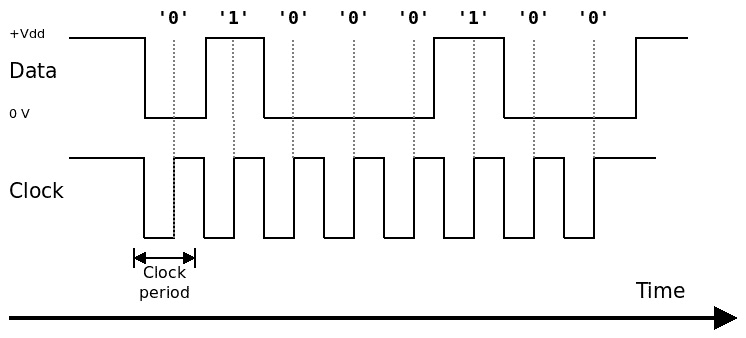
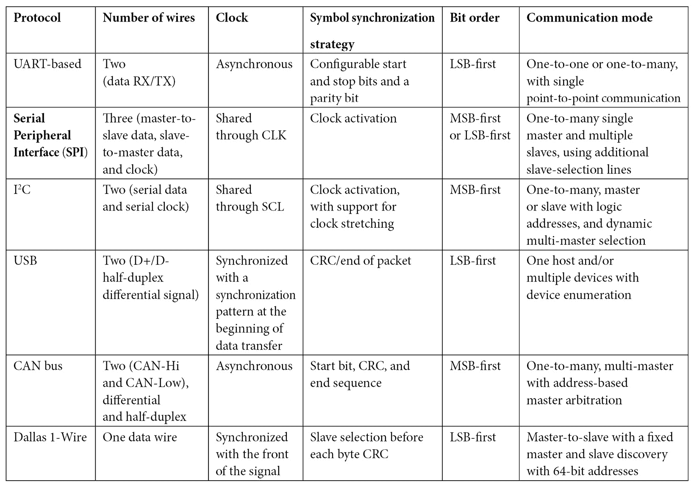
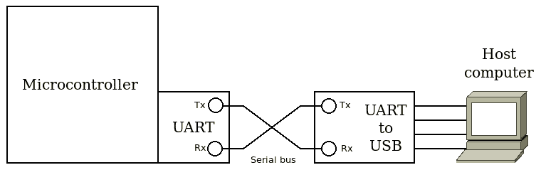
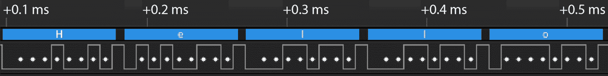
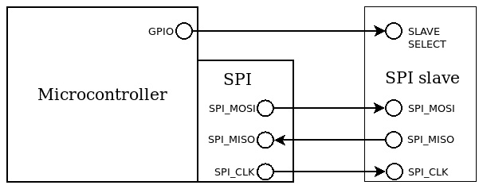
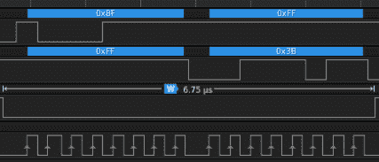
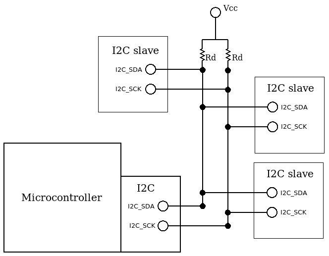
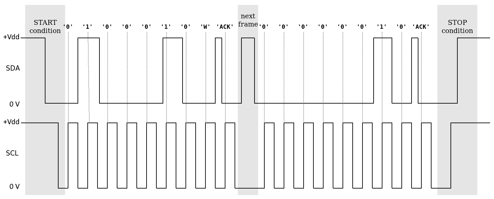
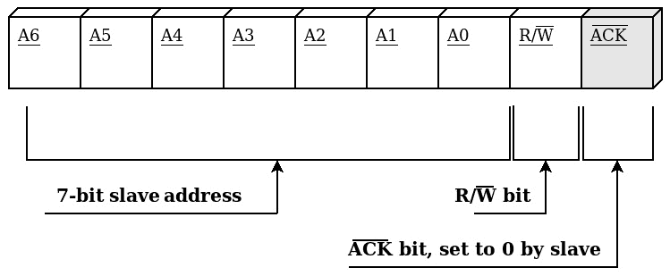
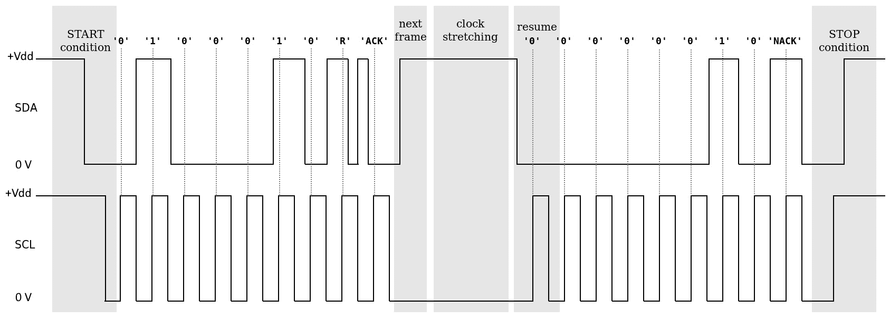

# 7

# 本地总线接口

嵌入式系统与其周围其他系统之间的通信通过一些协议实现。大多数为嵌入式系统设计的微控制器支持最常用的接口，这些接口控制和规范对串行线的访问。其中一些协议非常流行，以至于它们已成为微控制器之间有线芯片通信的标准，以及控制电子设备（如传感器、执行器、显示器、无线收发器以及许多其他外围设备）的标准。本章描述了这些协议的工作原理，特别是通过在参考平台上运行的示例，具体关注系统软件的实现。特别是，本章将涵盖以下主题：

+   介绍串行通信

+   基于 UART 的异步串行总线

+   SPI 总线

+   I2C 总线

到本章结束时，您将学习如何集成常见的串行通信协议。

# 技术要求

您可以在 GitHub 上找到本章的代码文件，地址为[`github.com/PacktPublishing/Embedded-Systems-Architecture-Second-Edition/tree/main/Chapter7`](https://github.com/PacktPublishing/Embedded-Systems-Architecture-Second-Edition/tree/main/Chapter7)。

# 介绍串行通信

本章中我们将分析的协议管理对串行总线的访问，该总线可能由一根或多根线组成，以对应逻辑电平零和一的电气信号形式传输信息，当与特定的时间间隔相关联时。这些协议在数据总线线上传输和接收信息的方式上有所不同。为了传输一个字节，收发器将其编码为位序列，该序列与时钟同步。位逻辑值由接收器通过在时钟的特定前端读取其值来解释，这取决于时钟的极性。

每个协议指定了时钟的极性和传输数据所需的位顺序，这可以以最高有效位或最低有效位开始。例如，一个系统通过上升沿时钟调节的串行线传输 ASCII 字符*D*，并且以最高有效位首先发送，将产生如下信号：



图 7.1 – 在时钟上升沿的总线逻辑电平被解释为从最高有效位（MSB）开始，转换为字节值 0x44

我们现在将根据不同的标准定义串行通信接口的特性。特别是，我们将指出两个交换数据的端点之间时钟同步的选项；指定每个协议用于访问物理媒体的信号布线；最后，编程访问外围设备的实现细节，这些细节可能在不同平台上有所不同。

## 时钟和符号同步

为了使接收方理解消息，时钟必须在各个部分之间同步。时钟同步可能是隐式的，例如，在总线上设置相同的读写数据速率，或者通过使用额外的线从一侧共享时钟线来显式同步发送数据速率。不预见共享时钟线的串行协议称为异步。

符号同步应该明确。因为我们期望以字节的形式发送和接收信息，所以每个 8 位序列的开始应该通过在数据线上使用特殊的预同步序列或在正确的时间打开和关闭时钟来标记。每个协议定义的符号同步策略不同。

## 总线布线

建立双向通信所需的线条数量也取决于特定的协议。由于一根线一次只能在一个方向上传输 1 位信息，为了实现全双工通信，收发器应该连接到两根不同的线，用于发送和接收数据。如果协议支持半双工通信，它应该提供一种可靠的机制来调节媒体访问，并在同一根线上在接收和发送数据之间切换。

重要注意事项

两个端点必须共享一个共同的参考地电压，这意味着如果设备本身没有共享一个共同的地线，可能需要额外添加一根线来连接地线。

根据协议的不同，访问总线的设备可能要么共享类似的实现并作为对等体，要么在参与通信时分配不同的角色——例如，如果主设备负责同步时钟或调节对媒体访问的控制。

串行协议可能预见在同一总线上进行多于两个设备的通信。这可以通过为每个共享同一总线的从设备使用额外的从设备选择线，或者通过为每个端点分配逻辑地址，并在每个传输的预同步中包含通信的目的地址来实现。基于这些分类，以下表格给出了在嵌入式目标中实现的最流行的串行协议采用的方法概述：



本章详细介绍的协议只有前三个，因为它们在与嵌入式外围设备通信中最广泛使用。

## 编程外围设备

实现了之前描述的协议的多个外围设备通常集成到微控制器中，这意味着相关的串行总线可以直接连接到微控制器的特定引脚。外围设备可以通过时钟门控启用，并通过访问映射在内存空间外围区域的配置寄存器进行控制。连接到串行总线的引脚也必须配置以实现相应的备用功能，并且涉及的中断线应配置为在向量表中处理。

一些微控制器，包括我们的参考平台，支持**直接内存访问**（**DMA**）以加快外围设备和物理 RAM 之间的内存操作。在许多情况下，此功能有助于在更短的时间内处理通信数据，并提高系统的响应性。DMA 控制器可以被编程来启动传输操作，并在完成时触发中断。

控制与每个协议相关的功能的接口是针对外围设备暴露的功能特定的。在下一节中，将分析 UART、SPI 和 I2C 外围设备暴露的接口，并提供针对参考平台的代码示例，作为类似设备驱动程序可能实现的一种可能实现的示例。

# 基于 UART 的异步串行总线

由于其异步特性的简单性，UART 在历史上被用于许多不同的目的，它可以追溯到计算机的起源，并且仍然是在许多环境中使用的一种非常流行的电路。直到 2000 年代初，个人电脑至少包含一个 RS-232 串行端口，该端口由 UART 控制器和允许在更高电压下操作的收发器实现。如今，USB 已经取代了个人电脑上的串行通信，但主机计算机仍然可以通过 USB-UART 外围设备访问 TTL 串行总线。微控制器有一对或多对引脚可以与内部 UART 控制器相关联，并连接到串行总线，以配置一个双向、异步、全双工通信通道，用于连接到同一总线的设备。

## 协议描述

如前所述，异步串行通信依赖于发送器和接收器之间位率的隐式同步，以确保数据在通信接收端被正确处理。如果外围时钟足够快，可以保持设备以高频率运行，异步串行通信可能达到每秒几兆比特。

符号同步策略基于识别线上每个字节传输的开始。当没有设备传输时，总线处于空闲状态。

要开始传输，收发器将 TX 线拉低到低逻辑电平，持续的时间至少是位采样周期的一半，具体取决于位速率。随后，正在传输的字节组成位被转换为逻辑 `0` 或 `1` 值，这些值根据位速率保持在 TX 线上，对应于每个位的时间。在此启动条件被接收器轻松识别后，符号组成位按照特定的顺序依次传输，从最低有效位到最高有效位。

组成符号的数据位数也是可配置的。默认的数据长度为 8 位，允许每个符号转换为字节。在数据末尾，可以配置一个可选的奇偶校验位来计算活动位的数量，作为一种非常简单的冗余校验形式。如果存在奇偶校验位，可以配置为指示符号中 `1` 值的数量是奇数还是偶数。在返回空闲状态时，必须使用 1 或 2 个停止位来指示符号的结束。

停止位是通过在整个位传输期间将信号拉高来传输的，标记当前符号的结束，并迫使接收器开始接收下一个符号。1 个停止位是最常用的默认设置；1.5 和 2 个停止位设置提供了更长的符号间空闲间隔，这在过去与较慢、响应较慢的硬件通信时很有用，但今天很少使用。

在开始通信之前，两个端点必须了解这些设置。串行控制器通常不支持动态检测符号速率或连接到另一端的设备设置的任何设置，因此，成功尝试任何串行通信的唯一方法是在总线上使用相同的已知设置编程两个设备。作为回顾，这些设置如下：

+   比特率，以每秒比特数表示

+   每个符号中的数据位数（通常是 8 位）

+   奇偶校验位的意义，如果存在（`O` 表示奇数，`E` 表示偶数，`N` 表示不存在）

+   停止位的数量

此外，发送器必须配置为在每个传输结束时发送 1、1.5 或 2 个停止位。1.5 和 2 个停止位在过去更广泛地使用，用于与古老的机电设备同步通信。如今，对于使用现代收发器的通信，奇偶校验和超过 1 个的停止位不再需要，并且很少使用。

这组设置通常被缩写为例如 115200-8-N-1 或 38400-8-O-2，分别表示一个 115.2 Kbps 的串行线路，每个符号有 8 个数据位，无奇偶校验和 1 个停止位，以及一个具有相同数据位、奇数奇偶校验和 2 个停止位的 38400 线路。

## 编程控制器

开发板通常提供多个 UART，我们的参考，STM32F407，也不例外。根据手册，`UART3` 可以与 PD8（TX）和 PD9（RX）引脚相关联，我们将在本例中使用这些引脚。打开 `D` GPIO 组时钟并设置 `8` 和 `9` 引脚为交替模式，交替函数为 `7` 的代码如下：

```cpp
#define AHB1_CLOCK_ER (*(volatile uint32_t *)(0x40023830))
#define GPIOD_AHB1_CLOCK_ER (1 << 3)
#define GPIOD_BASE 0x40020c00
#define GPIOD_MODE (*(volatile uint32_t *)(GPIOD_BASE + 0x00))
#define GPIOD_AFL (*(volatile uint32_t *)(GPIOD_BASE + 0x20))
#define GPIOD_AFH (*(volatile uint32_t *)(GPIOD_BASE + 0x24))
#define GPIO_MODE_AF (2)
#define UART3_PIN_AF (7)
#define UART3_RX_PIN (9)
#define UART3_TX_PIN (8)
static void uart3_pins_setup(void)
{
  uint32_t reg;
  AHB1_CLOCK_ER |= GPIOD_AHB1_CLOCK_ER;
  reg = GPIOD_MODE & ~ (0x03 << (UART3_RX_PIN * 2));
  GPIOD_MODE = reg | (2 << (UART3_RX_PIN * 2));
  reg = GPIOD_MODE & ~ (0x03 << (UART3_TX_PIN * 2));
  GPIOD_MODE = reg | (2 << (UART3_TX_PIN * 2));
  reg = GPIOD_AFH & ~(0xf << ((UART3_TX_PIN - 8) * 4));
  GPIOD_AFH = reg | (UART3_PIN_AF << ((UART3_TX_PIN - 8) *
     4));
  reg = GPIOD_AFH & ~(0xf << ((UART3_RX_PIN - 8) * 4));
  GPIOD_AFH = reg | (UART3_PIN_AF << ((UART3_RX_PIN - 8) *
     4));
}
```

设备在其 `APB1_CLOCK_ER` 寄存器中有一个自己的时钟门控配置位，位于位置 `18`：

```cpp
#define APB1_CLOCK_ER (*(volatile uint32_t *)(0x40023840))
#define UART3_APB1_CLOCK_ER_VAL (1 << 18)
```

每个 UART 控制器都可以通过映射到外设区域的寄存器来访问，这些寄存器相对于 UART 控制器基本地址有固定的偏移量：

+   `0`

+   `4`

+   `8`

+   `UART_CRx` 寄存器位于偏移量 `12`，用于设置串行端口参数、启用中断和 DMA，以及启用和禁用收发器

在本例中，我们定义了快捷宏来访问以下 `UART3` 的寄存器：

```cpp
#define UART3 (0x40004800)
#define UART3_SR (*(volatile uint32_t *)(UART3))
#define UART3_DR (*(volatile uint32_t *)(UART3 + 0x04))
#define UART3_BRR (*(volatile uint32_t *)(UART3 + 0x08))
#define UART3_CR1 (*(volatile uint32_t *)(UART3 + 0x0c))
#define UART3_CR2 (*(volatile uint32_t *)(UART3 + 0x10))
```

我们定义了对应位字段中的位置：

```cpp
#define UART_CR1_UART_ENABLE (1 << 13)
#define UART_CR1_SYMBOL_LEN (1 << 12)
#define UART_CR1_PARITY_ENABLED (1 << 10)
#define UART_CR1_PARITY_ODD (1 << 9)
#define UART_CR1_TX_ENABLE (1 << 3)
#define UART_CR1_RX_ENABLE (1 << 2)
#define UART_CR2_STOPBITS (3 << 12)
#define UART_SR_TX_EMPTY (1 << 7)
```

`uart3_pins_setup` 辅助函数可以在初始化函数的开始处调用，以设置引脚。该函数接受参数来设置 `UART3` 端口的波特率、奇偶校验位和停止位：

```cpp
int uart3_setup(uint32_t bitrate, uint8_t data,
char parity, uint8_t stop)
{
  uart3_pins_setup();
```

设备已开启：

```cpp
  APB1_CLOCK_ER |= UART3_APB1_CLOCK_ER_VAL;
```

在 `CR1` 配置寄存器中，设置启用发送器的位：

```cpp
  UART3_CR1 |= UART_CR1_TX_ENABLE;
```

`UART_BRR` 设置为包含时钟速度和所需波特率之间的除数：

```cpp
  UART3_BRR = CLOCK_SPEED / bitrate;
```

我们的功能还接受一个字符来指示所需的奇偶校验。选项为 `O` 或 `E`，分别表示奇数或偶数。任何其他字符都将禁用奇偶校验：

```cpp
  /* Default: No parity */
  UART3_CR1 &= ~(UART_CR1_PARITY_ENABLED | 
      UART_CR1_PARITY_ODD);
   switch (parity) {
       case 'O':
           UART3_CR1 |= UART_CR1_PARITY_ODD;
           /* fall through to enable parity */
       case 'E':
           UART3_CR1 |= UART_CR1_PARITY_ENABLED;
           break;
}
```

根据参数设置停止位的数量。配置使用寄存器的 2 位存储，值为 `0` 表示 1 个停止位，值为 `2` 表示 2 个：

```cpp
  reg = UART3_CR2 & ~UART_CR2_STOPBITS;
  if (stop > 1)
    UART3_CR2 = reg | (2 << 12);
```

配置现在完成。可以开启 UART 以开始传输：

```cpp
  UART3_CR1 |= UART_CR1_UART_ENABLE;
  return 0;
}
```

现在可以通过在 `UART_DR` 寄存器上逐字节复制一个字节来在 PD8 上传输串行数据。

## Hello world!

在开发嵌入式系统时，最有用的功能之一是将可用的 UART 之一转换为日志端口，这样就可以在主机计算机上使用串行到 USB 转换器读取执行期间产生的调试消息和其他信息：



图 7.2 – 主机通过转换器连接到目标平台的串行端口

UART 逻辑在两个方向上都包含 FIFO 缓冲区。通过在 `UART_DR` 寄存器上写入数据来填充发送 FIFO。在轮询模式下实际在 UART TX 线路上输出数据时，我们选择在写入每个字符之前检查 FIFO 是否为空，以确保一次不会将超过一个字符放入 FIFO。当 FIFO 为空时，设备会将 `UART3_SR` 中与 `TX_FIFO_EMPTY` 标志相关联的位设置为 `1`。以下函数展示了如何通过将作为参数传递的整个字符字符串传递，并在每个字节后等待 FIFO 为空来发送：

```cpp
void uart3_write(const char *text)
{
  const char *p = text;
  int i;
  volatile uint32_t reg;
  while(*p) {
    do {
      reg = UART3_SR;
    } while ((reg & UART_SR_TX_EMPTY) == 0);
    UART3_DR = *p;
    p++;
  }
}
```

在主程序中，可以调用此函数，传递一个预格式化、以`NULL`结尾的字符串：

```cpp
#include "system.h"
#include "uart.h"
void main(void) {
  flash_set_waitstates();
  clock_config();
  uart3_setup(115200, 8, 'N', 1);
  uart3_write("Hello World!\r\n");
  while(1)
    WFI();
}
```

如果主机连接到串行总线的另一个端点，因此，我们可以使用主机上的串行终端程序，例如`minicom`，来可视化`Hello World!`消息。

通过捕获用作目标`UART_TX`的 PD8 引脚的输出，并设置正确的串行解码选项，我们可以更好地了解接收端如何解析串行流。逻辑分析仪可以显示在每个起始条件之后如何采样数据位，并揭示与线上的字节相关的 ASCII 字符。逻辑分析仪工具通常能够解码在线捕获的位，并将每个传输的字节转换回 ASCII 格式。此功能提供了一种快速准确的方法来验证我们的串行通信是否合规，连续位之间的时间符合所选波特率，线上的内容与发送到 UART 收发器的数据匹配，如下面的图所示，它显示了我们的嵌入式目标从字符串发送“`Hello`”并将其传递给`uart3_write`函数。



图 7.3 – 使用 UART3 发送给主机的前 5 个字节的逻辑分析仪工具截图

## newlib printf

编写预格式化字符串不是访问串行端口以提供调试消息的最理想 API。应用程序开发者肯定会希望系统公开一个标准的 C `printf`函数。当工具链包含标准 C 库的实现时，它通常给你连接主程序的标准输出的可能性。幸运的是，用于参考平台的工具链允许我们链接到`newlib`函数。类似于我们在*第五章*中做的，*内存管理*，使用`newlib`中的`malloc`和`free`函数，我们提供了一个后端函数叫做`_write()`，它从所有调用`printf()`格式化的字符串中获取输出。这里实现的`_write`函数将接收所有由`printf()`预格式化的字符串：

```cpp
int _write(void *r, uint8_t *text, int len)
{
  char *p = (char *)text;
  int i;
  volatile uint32_t reg;
  text[len - 1] = 0;
  while(*p) {
    do {
       reg = UART3_SR;
    } while ((reg & UART_SR_TX_EMPTY) == 0);
    UART3_DR = *p;
    p++;
  }
  return len;
}
```

因此，在这种情况下，与`newlib`链接使我们能够使用`printf`来生成消息，包括其变长参数解析，如本例中的`main()`函数：

```cpp
#include <stdio.h>
#include "system.h"
#include "uart.h"
void main(void) {
  char name[] = "World";
  flash_set_waitstates();
  clock_config();
  uart3_setup(115200, 8, 'N', 1);
  printf("Hello %s!\r\n", name);
  while(1)
    WFI();
```

第二个示例将产生与第一个示例相同的输出，但这次使用`newlib`中的`printf`函数。

## 接收数据

要在相同的 UART 上启用接收器，初始化函数还应该通过`UART_CR1`寄存器中的相应开关打开接收器：

```cpp
UART3_CR1 |= UART_CR1_TX_ENABLE | UART_CR1_RX_ENABLE;
```

这确保了收发器的接收端也被启用。为了在轮询模式下读取数据，阻塞直到接收到一个字符，我们可以使用以下函数，该函数将返回读取的字节值：

```cpp
char uart3_read(void)
{
  char c;
  volatile uint32_t reg;
  do {
    reg = UART3_SR;
  } while ((reg & UART_SR_RX_NOTEMPTY) == 0);
  c = (char)(UART3_DR & 0xff);
  return c;
}
```

这样，例如，我们可以将主机接收到的每个字符回显到控制台：

```cpp
void main(void) {
  char c[2];
  flash_set_waitstates();
  clock_config();
  uart3_setup(115200, 8, 'N', 1);
  uart3_write("Hello World!\r\n");
  while(1) {
    c[0] = uart3_read();
    c[1] = 0;
    uart3_write(c);
    uart3_write("\r\n");
  }
}
```

## 基于中断的输入/输出

本节中的示例基于通过连续检查`UART_SR`的标志来轮询 UART 的状态。写操作包含一个忙循环，该循环可以持续数毫秒，具体取决于字符串的长度。更糟糕的是，之前提供的读取函数在忙循环中旋转，直到从外围设备读取数据，这意味着整个系统在接收到新数据之前都会挂起。在单线程嵌入式系统中，以尽可能短的延迟返回主循环对于保持系统响应性非常重要。

要在不阻塞的情况下执行 UART 通信，请使用与 UART 相关联的中断线来根据接收的事件触发操作。UART 可以配置为在多种事件上触发中断信号。正如我们之前在示例中看到的，为了调节输入和输出操作，我们特别关注两个特定的事件：

+   一个 TX FIFO 空事件，允许传输更多数据

+   一个 RX FIFO 非空事件，表示有新接收的数据

通过设置`UART_CR1`中的相应位，可以启用这两个事件的中断。我们定义了两个辅助函数，其目的是独立地打开和关闭中断：

```cpp
#define UART_CR1_TXEIE (1 << 7)
#define UART_CR1_RXNEIE (1 << 5)
static void uart3_tx_interrupt_onoff(int enable)
{
  if (enable)
    UART3_CR1 |= UART_CR1_TXEIE;
  else
    UART3_CR1 &= ~UART_CR1_TXEIE;
}
static void uart3_rx_interrupt_onoff(int enable)
{
  if (enable)
    UART3_CR1 |= UART_CR1_RXNEIE;
  else
    UART3_CR1 &= ~UART_CR1_RXNEIE;
}
```

一个服务例程可以与中断事件相关联，然后检查`UART_SR`中的标志以确定中断的原因：

```cpp
void isr_uart3(void)
{
  volatile uint32_t reg;
  reg = UART3_SR;
  if (reg & UART_SR_RX_NOTEMPTY) {
     /* Receive a new byte */
  }
  if ((reg & UART_SR_TX_EMPTY)
  {
     /* resume pending transmission */
  }
}
```

中断例程的实现取决于特定的系统设计。RTOS 可能会决定将串行端口的多路复用访问到多个线程，并唤醒等待访问资源的线程。在单线程应用程序中，可以添加中间系统缓冲区以提供非阻塞调用，这些调用在从接收缓冲区或发送缓冲区复制数据后立即返回。中断服务例程从总线上填充接收缓冲区以包含新数据，并从挂起缓冲区发送数据。使用适当的结构，例如循环缓冲区来实现系统输入和输出队列，可以确保分配的内存使用得到优化。

# SPI 总线

SPI 总线提供了一种基于主从通信的不同方法。正如其名所示，该接口最初是为了控制外围设备而设计的。这反映在设计上，因为所有通信总是由总线上的主设备发起。得益于全双工引脚配置和同步时钟，它可能比异步通信快得多，因为对共享总线的系统之间的时钟偏移具有更好的鲁棒性。SPI 因其简单的逻辑和从设备无需预先配置以与主设备上预定义的速度通信的灵活性而被广泛用作多种不同设备的通信协议。只要定义了媒体访问策略，多个外围设备可以共享同一总线。主设备通常通过使用单独的 GPIO 线来控制从设备选择来控制一次控制一个外围设备，尽管这确实需要为每个从设备额外一根线。

## 协议描述

SPI 收发器的配置非常灵活。通常，微控制器上的收发器既能作为主设备也能作为从设备。必须事先知道一些预定义的设置，并在同一总线上共享主设备和所有从设备之间：

+   时钟极性，指示时钟滴答对应于时钟的上升沿还是下降沿

+   时钟相位，指示时钟空闲位置是高电平还是低电平

+   数据包的长度，介于 4 到 16 位之间的任何值

+   位顺序，指示数据是从最高有效位开始传输还是从最低有效位开始传输

由于时钟是同步的，并且始终由主设备强制，因此 SPI 没有预定义的操作频率，尽管使用过高的速度可能无法与所有外围设备和微控制器一起工作。

在主设备启动事务之前，SPI 与从设备的通信是禁用的。在每个事务的开始，主设备通过激活其从设备选择线来选择从设备：



图 7.4 – 可以使用一个额外的信号来选择总线上特定的从设备

要启动通信，主设备必须激活时钟，并且可以在 MOSI 线上向从设备发送命令序列。当检测到时钟时，从设备可以立即开始使用 MISO 线向相反方向传输字节。

即使主设备已经完成传输，它也必须遵守从设备实现的协议，并允许它在事务期间通过保持时钟活跃来回复。从设备被赋予一个预定义的字节数来与主设备通信。

为了即使在没有数据要传输给从设备的情况下也能保持时钟活跃，主设备可以通过 MOSI 线发送*哑字节*，这些字节会被从设备忽略。同时，只要主设备确保时钟持续运行，从设备就可以通过 MISO 线发送数据。与 UART 不同，在 SPI 中实现的从主通信模型中，从设备永远不会自发地启动 SPI 通信，因为主设备是唯一允许在总线上发送时钟的设备。每个 SPI 事务都是自包含的，在结束时，通过关闭相应的从设备选择信号来取消从设备的选中状态。

## 编程收发器

在参考板上，一个加速度计作为从设备连接到`SPI1`总线，因此我们可以通过配置收发器并执行一个双向事务到外围设备来检查如何在微控制器上实现通信的主设备部分。

`SPI1`总线在其配置寄存器映射到外设区域：

```cpp
#define SPI1 (0x40013000)
#define SPI1_CR1 (*(volatile uint32_t *)(SPI1))
#define SPI1_CR2 (*(volatile uint32_t *)(SPI1 + 0x04))
#define SPI1_SR (*(volatile uint32_t *)(SPI1 + 0x08))
#define SPI1_DR (*(volatile uint32_t *)(SPI1 + 0x0c))
```

外设公开了总共四个寄存器：

+   两个位字段配置寄存器

+   一个状态寄存器

+   一个双向数据寄存器

很明显，接口与 UART 收发器类似，因为通信参数的配置是通过`SPI_CRx`寄存器进行的，FIFO 的状态可以通过查看`SPI_SR`来监控，而`SPI_DR`可以用来读取和写入串行总线上的数据。

配置寄存器 CR1 的值包含以下内容：

+   时钟相位，0 或 1，在位 0

+   时钟极性在位 1

+   位 2 中的 SPI 主模式标志

+   位率缩放因子在位 3-5

+   位 6 中的 SPI 使能标志

+   其他配置参数，如字长、LSB-first 和其他标志，在这个例子中不会使用，因为这些参数将保持默认值

`CR2`配置寄存器包含启用中断事件和 DMA 传输的标志，以及与这个例子相关的**从设备选择输出使能**（**SSOE**）标志。

`SPI1_SR`状态寄存器与上一节中的 UART 状态寄存器类似，因为它包含确定发送 FIFO 是否为空的标志，以及当接收侧的 FIFO 不为空时，调节传输的相位。

在这个例子中使用的标志对应的位定义为以下：

```cpp
#define SPI_CR1_MASTER (1 << 2)
#define SPI_CR1_SPI_EN (1 << 6)
#define SPI_CR2_SSOE (1 << 2)
#define SPI_SR_RX_NOTEMPTY (1 << 0)
#define SPI_SR_TX_EMPTY (1 << 1)
```

RCC 控制着指向连接到`APB2`总线的`SPI1`收发器的时钟和复位线：

```cpp
#define APB2_CLOCK_ER (*(volatile uint32_t *)(0x40023844))
#define APB2_CLOCK_RST (*(volatile uint32_t
      *)(0x40023824))
#define SPI1_APB2_CLOCK_ER_VAL (1 << 12)
```

通过从 RCC 发送复位脉冲可以重置收发器：

```cpp
static void spi1_reset(void)
{
   APB2_CLOCK_RST |= SPI1_APB2_CLOCK_ER_VAL;
   APB2_CLOCK_RST &= ~SPI1_APB2_CLOCK_ER_VAL;
}
```

PA5、PA6 和 PA7 引脚可以通过设置适当的备用功能与`SPI1`收发器相关联：

```cpp
#define SPI1_PIN_AF 5
#define SPI1_CLOCK_PIN 5
#define SPI1_MOSI_PIN 6
#define SPI1_MISO_PIN 7
static void spi1_pins_setup(void)
{
  uint32_t reg;
  AHB1_CLOCK_ER |= GPIOA_AHB1_CLOCK_ER;
  reg = GPIOA_MODE & ~(0x03 << (SPI1_CLOCK_PIN * 2));
  reg &= ~(0x03 << (SPI1_MOSI_PIN));
  reg &= ~(0x03 << (SPI1_MISO_PIN));
  reg |= (2 << (SPI1_CLOCK_PIN * 2));
  reg |= (2 << (SPI1_MOSI_PIN * 2)) | (2 << (SPI1_MISO_PIN
      *2))
  GPIOA_MODE = reg;
  reg = GPIOA_AFL & ~(0xf << ((SPI1_CLOCK_PIN) * 4));
  reg &= ~(0xf << ((SPI1_MOSI_PIN) * 4));
  reg &= ~(0xf << ((SPI1_MISO_PIN) * 4));
  reg |= SPI1_PIN_AF << ((SPI1_CLOCK_PIN) * 4);
  reg |= SPI1_PIN_AF << ((SPI1_MOSI_PIN) * 4);
  reg |= SPI1_PIN_AF << ((SPI1_MISO_PIN) * 4);
  GPIOA_AFL = reg;
}
```

连接到加速度计“片选”线的附加引脚是 PE3，它被配置为输出，并带有上拉内部电阻。该引脚的逻辑是低电平有效，因此逻辑零将打开芯片：

```cpp
#define SLAVE_PIN 3
static void slave_pin_setup(void)
{
  uint32_t reg;
  AHB1_CLOCK_ER |= GPIOE_AHB1_CLOCK_ER;
  reg = GPIOE_MODE & ~(0x03 << (SLAVE_PIN * 2));
  GPIOE_MODE = reg | (1 << (SLAVE_PIN * 2));
  reg = GPIOE_PUPD & ~(0x03 << (SLAVE_PIN * 2));
  GPIOE_PUPD = reg | (0x01 << (SLAVE_PIN * 2));
  reg = GPIOE_OSPD & ~(0x03 << (SLAVE_PIN * 2));
  GPIOE_OSPD = reg | (0x03 << (SLAVE_PIN * 2));
}
```

收发器的初始化从配置涉及的四个引脚开始。然后激活时钟门，并通过 RCC 通过脉冲接收复位信号：

```cpp
void spi1_setup(int polarity, int phase)
{
  spi1_pins_setup();
  slave_pin_setup();
  APB2_CLOCK_ER |= SPI1_APB2_CLOCK_ER_VAL;
  spi1_reset();
```

默认参数（MSB-first，8 位字长）保持不变。此控制器的比特率缩放因子以 2 的幂表示，从`2`开始，对应于位字段值为`0`，每次增加时翻倍。通用驱动程序应根据所需的时钟速率和外设时钟频率计算正确的缩放因子。在这个简单的情况下，我们强制使用硬编码的缩放因子 64，对应于值`5`。

然后将`SPI1_CR1`设置为以下内容：

```cpp
  SPI1_CR1 = SPI_CR1_MASTER | (5 << 3) | (polarity << 1) | 
      (phase << 0);
```

最后，我们在`SPI1_CR2`中设置对应于`SSOE`标志位的位，并启用收发器：

```cpp
  SPI1_CR2 |= SPI_CR2_SSOE;
  SPI1_CR1 |= SPI_CR1_SPI_EN;
}
```

读写操作现在可以开始了，因为主从 SPI 控制器都已准备好执行事务。

## SPI 事务

读写函数代表了 SPI 事务的两个不同阶段。大多数 SPI 从设备都能够使用全双工机制进行通信，这样在时钟活跃时，字节可以在两个方向上交换。在每一个间隔期间，一个字节在两个方向上独立地通过 MISO 和 MOSI 线进行传输。

许多从设备实现的一种常见策略是通过使用设备数据表中记录的已知命令处理程序，在从设备中访问寄存器以进行读写操作。

STM32F407DISCOVERY 板上连接了一个加速度计到`SPI1`总线，该加速度计响应预定义的命令，访问设备内存中的特定寄存器以进行读写。在这些情况下，读写操作是顺序执行的：在第一个间隔期间，主设备传输命令处理程序，而设备没有要传输的内容，然后在随后的间隔中，实际字节在两个方向上传输。

这里描述的示例操作包括使用`0x8F`命令处理程序读取加速度计中的`WHOAMI`寄存器。外围设备应该响应包含`0x3B`值的 1 个字节，这正确地识别了设备并证明了 SPI 通信是正常工作的。然而，在传输命令字节期间，设备还没有要传输的内容，因此第一次读操作的结果可以被丢弃。同样，在发送命令后，主设备没有其他要传达给从设备的内容，因此它在读取从设备通过 MISO 线传输的字节的同时，在 MOSI 线上输出`0xFF`值。

在此特定设备上成功执行 1 字节读操作所需的步骤如下：

1.  通过拉低从设备选择信号来开启从设备。

1.  发送一个包含 1 字节读操作代码的字节。

1.  当从设备使用时钟传输回复时，发送 1 个空字节。

1.  在第二次间隔期间读取从设备传输的值。

1.  通过将从设备选择信号拉高来关闭从设备。

为了做到这一点，我们定义如下阻塞读取和写入函数：

```cpp
uint8_t spi1_read(void)
{
  volatile uint32_t reg;
  do {
    reg = SPI1_SR;
  } while ((reg & SPI_SR_RX_NOTEMPTY) == 0);
  return (uint8_t)SPI1_DR;
}
void spi1_write(const char byte)
{
  int i;
  volatile uint32_t reg;
  SPI1_DR = byte;
  do {
    reg = SPI1_SR;
  } while ((reg & SPI_SR_TX_EMPTY) == 0);
}
```

读取操作等待`RX_NOTEMPTY`标志在`SPI1_SR`上启用，然后传输数据寄存器的内容。发送函数将传输的字节值传输到数据寄存器，然后通过等待`TX_EMPTY`标志来轮询操作结束。

这两个操作现在可以连接起来。主设备必须明确发送总共 2 个数据字节，因此我们的主要应用可以通过以下方式查询加速度计识别寄存器：

```cpp
 slave_on();
 spi1_write(0x8F);
 b = spi1_read();
 spi1_write(0xFF);
 b = spi1_read();
 slave_off();
```

这是在总线上发生的情况：

+   在第一次写入时，将命令`0x8F`发送到 MOSI。

+   使用第一个`spi1_read`函数读取的值是从设备在监听传入命令时放入 MISO 的空字节位。在这个特定情况下，获得的值没有意义 – 因此，它被丢弃。

+   第二次写入将空字节位放在 MOSI 线上，因为主设备没有其他要传输的内容。这强制生成第二个字节的时钟，这是从设备回复命令所需的。

+   第二次读取处理主设备在写入空字节时通过 MISO 线传输的回复。在这个第二次事务中获得的值是来自从设备的有效回复，根据文档中命令的描述。

通过逻辑分析仪查看串行事务，我们可以清楚地区分两个阶段，以及相关的交替内容 – 首先，在 MOSI 上发送命令，然后是在 MISO 上接收回复：



图 7.5 – 双向 SPI 事务，包含主设备的请求和从设备的回复（从上到下：SPI1_MISO，SPI1_MOSI，SLAVE_SELECT，和 SPI1_CLOCK）

再次强调，使用带有忙循环的阻塞操作是一种非常不好的做法。这里之所以展示它，是为了解释成功完成双向 SPI 事务所需的原始操作。在实际嵌入式系统中，始终建议使用基于中断的传输，以确保 CPU 在等待传输完成时不会被忙循环占用。SPI 控制器提供中断信号，以指示控制器 FIFO 缓冲区的状态，以便将 SPI 事务与数据在任一方向上传输时所需采取的操作同步。

## 基于中断的 SPI 传输

用于启用 SPI 收发器中断的接口实际上与上一节中看到的 UART 接口非常相似。为了正确实现非阻塞事务，必须在它们的读和写阶段之间进行拆分，以便允许事件触发相关操作。

在`SPI1_CR2`寄存器中设置这两个位将分别启用在发送 FIFO 为空和接收 FIFO 非空时触发中断：

```cpp
#define SPI_CR2_TXEIE (1 << 7)
#define SPI_CR2_RXNEIE (1 << 6)
```

包含在中断向量中的相关服务例程仍然可以查看`SPI1_SR`中的值，以推进事务到下一阶段：

```cpp
void isr_spi1(void)
{
  volatile uint32_t reg;
  reg = SPI1_SR;
  if (reg & SPI_SR_RX_NOTEMPTY) {
    /* End of transmission: new data available on MISO*/
  }
  if ((reg & SPI_SR_TX_EMPTY)
  {
    /* End of transmission: the TX FIFO is empty*/
  }
}
```

再次强调，中断上半部分的实现留给读者来完成，因为它依赖于系统需要实现的 API、事务的性质以及它们对系统响应性的影响。然而，短而高速的 SPI 事务可能会在时间上分散且短暂，以至于即使实现阻塞操作对系统延迟的影响也较小。

# I2C 总线

本章分析的第三种串行通信协议是 I2C。从通信策略的角度来看，该协议与 SPI 有一些相似之处。然而，I2C 通信的默认比特率要低得多，因为该协议优先考虑低功耗而不是吞吐量。

同样的双线总线可以容纳多个参与者，包括主设备和从设备，并且不需要额外的信号来物理选择事务的从设备，因为从设备有固定的逻辑地址分配：



图 7.6 – 带有三个从机和外部上拉电阻的 I2C 总线

一根线传输由主设备生成的时钟，另一根用作双向同步数据路径。这是由于通道仲裁的独特机制，该机制依赖于收发器的电子设计，并且可以非常干净地处理同一总线上存在多个主设备的情况。

这两个信号必须通过上拉电阻连接到总线的较高电压（通常是 3.3V）。控制器从不驱动信号到高电平，而是让它在传输 1 时通过上拉电阻浮动到其默认值。因此，逻辑电平零始终占主导地位；如果任何连接到总线的设备通过拉低线路来强制零，那么所有设备都将读取该线路为低电平，无论有多少其他发送器在总线上保持逻辑电平 1。这使得总线可以由多个收发器同时控制，并且可以通过仅在总线可用时启动新事务来协调传输操作。在本节中，我们将介绍协议，以便介绍用于管理 I2C 控制器外设的软件工具。有关 I2C 总线通信和相关文档的更多信息，请参阅[`www.i2c-bus.org/`](https://www.i2c-bus.org/)。

## 协议描述

主从设备之间的同步是通过一个可识别的**START 条件**和一个**STOP 条件**来实现的，分别确定事务的开始和结束。总线最初处于空闲状态，当所有参与者都在空闲时，两个信号都处于高逻辑状态。

`START`条件是唯一一个可以通过 SDA 事务从低电平到高电平来识别`STOP`条件的情况，而 SCL 保持高电平。在`STOP`条件之后，总线再次空闲，只有当发送新的`START`条件时，才能启动通信。

主设备通过按此顺序将 SDA 和 SCL 拉低来发送一个`START`条件。一个帧由九个时钟周期组成。在每个时钟脉冲的边缘上升后，SDA 的电平不会改变，直到时钟再次变低。这允许我们在前 8 个时钟上升沿中传输 1 帧 8 字节。在最后一个时钟脉冲期间，主设备不驱动 SDA 线，此时由上拉电阻将其保持在高电平。任何想要确认帧接收的接收器都可以驱动信号变低。这个在第 9 个时钟脉冲上的条件被称为**ACK**。如果没有接收设备确认帧，SDA 保持高电平，发送器理解到帧没有达到预期的目的地：



图 7.7 – 总线上的单字节 I2C 事务，具有正确的 START 和 STOP 条件以及由接收器设置的 ACK 标志

一笔交易由两个或多个帧组成，并且始终由处于主模式的设备发起。每笔交易的第一帧被称为**地址帧**，其中包含下一个操作的地址和模式。交易中的所有后续帧都是数据帧，每个数据帧包含 1 个字节。主设备通过在执行**停止条件**之前保持交易活跃一定数量的帧数来决定交易由多少帧组成以及数据传输的方向。

从设备具有固定的 7 位地址，可以通过总线与之通信。当从设备在总线上检测到**启动条件**时，它必须监听地址帧并将其与自己的地址进行比较。如果地址匹配，必须在帧传输过程中的第九个时钟脉冲期间将 SDA 线拉低来确认地址帧。

数据始终以**最高有效位**（**MSB**）为前缀进行传输，地址帧的格式如下：



图 7.8 – 包含目标 7 位地址和 R/*W̅*标志的地址帧格式

上述图示显示了地址帧使用的格式。*R/W̅*位由主设备设置以指示交易的方向。*R/W̅*读作读取，而不是写入，这意味着`0`值表示写入操作，而`1`值表示读取操作。根据此位的值，交易后的数据字节要么流向从设备（写入操作），要么从选定的从设备流向主设备（读取操作）。在读取操作中，ACK 位的方向也会在选定从设备后的数据帧中反转，并且主设备应确认交易中接收到的每个帧。主设备可以选择在任何时候通过不在最后一个帧上拉低 ACK 位来终止传输，并在之后执行`停止条件`。

在传输地址帧之后，交易继续进行，数据可以通过后续的数据帧进行传输，每个数据帧包含 1 个字节，并且可以被接收器确认。如果地址帧中的*R/W̅*位设置为`0`，则主设备意图发起一个写入操作。一旦从设备通过识别自己为目标地址来确认地址帧，它就准备好接收数据，并确认数据帧，直到主设备发送`停止条件`。

I2C 协议规定，如果在事务结束时重复 `START` 条件，而不是发送 `STOP` 条件，可以直接开始新的交易，而不需要将总线设置为空闲状态。重复的 `START` 条件确保可以在同一总线上执行两个或更多事务而不会中断，例如，防止另一个主设备在他们之间开始通信。

一种不太流行的格式预计从设备有 10 位地址。10 位地址是标准的扩展，在后来引入，以与同一总线上可寻址的 7 位地址设备兼容。地址是通过使用 2 个连续帧来选择的，第一个 5 位是 `11110`，以指示选择 10 位地址。根据协议规范，以 `0000` 或 `1111` 开头的地址是保留的，并且从设备不得使用。在 10 位格式中，最高两位位包含在第一个帧的 **A1** 和 **A0** 中，而第二个帧包含剩余的 8 位。*R/W̅* 位在第一个帧中保持其位置。这种寻址机制并不常见，因为只有少数从设备支持它。

## 时钟拉伸

我们观察到，在 I2C 事务中，主设备是唯一驱动 SCL 信号的设备。这始终是正确的，除非从设备尚未准备好从主设备传输请求的数据。在这种情况下，从设备可能会决定通过保持时钟线处于低电平来延迟交易，这会导致交易被挂起。主设备意识到其无法振荡时钟，因为释放 SCL 信号到浮空状态不会导致总线上逻辑电平变为高电平。主设备将继续尝试将 SCL 信号释放到其自然的高电平位置，直到从设备最终提供所需的数据，从而释放对线的锁定。

在被无限期挂起后，传输现在可以恢复，并且仍然期望主设备产生九个时钟脉冲以完成传输。因为在这个事务中不再期望有更多帧，所以主设备在最后不会将 ACK 位拉低，而是发送 `STOP` 条件以正确完成交易：



图 7.9 – 使用时钟拉伸技术延迟响应帧的 I2C 读取事务

尽管并非所有设备都支持时钟拉伸，但这种机制在请求的数据略微延迟时完成事务非常有用。时钟拉伸是 I2C 的一个非常独特的特性，使其成为与传感器和其他输入外围设备通信的非常灵活的协议。与无法及时提供值以完成事务的较慢设备通信时，时钟拉伸非常重要。建议由设计用于与通用 I2C 从设备通信的主设备正确支持此功能。在从设备端，为了强制执行时钟拉伸，设备必须提供硬件配置，允许我们将 SCL 线保持在逻辑低电平，直到它再次准备好。这意味着在这种情况下，SCL 线必须是双向的，从设备应该被设计为访问它，以强制下拉以保持事务活跃，同时准备下一帧的传输。

## 多个主设备

I2C 提供了一种确定性的机制来检测和响应总线上的多个主设备的存在，这同样基于 SDA 线的电气特性。

在开始任何通信之前，主设备通过检测 SDA 和 SCL 线来确保总线可用。`START`条件的设计方式本身就可以排除大多数冲突。当在两个边缘之间的初始宽限期内在 SDA 线上检测到低电平时，可以随时中断并发启动条件。仅此机制本身并不能防止两个 I2C 主设备同时访问通道，因为由于信号在电线上的传播时间，冲突仍然可能发生。

两个同时发起事务的主设备会持续比较线的状态，在每个比特被传输后。在两个主设备为两个不同传输完美同步的情况下，两个源上具有不同值的第一个比特只会被发送`1`值的主设备注意到，因为预期的值没有反映实际的线状态。该主设备会立即中止事务，发送器可以检测到网络上的冲突错误，在这种情况下，意味着仲裁权被让给了另一个主设备。同时，另一个主设备以及从设备都不会注意到任何事情，因为尽管总线线被无声地竞争，事务仍然会继续。

## 控制器编程

微控制器可能提供一个或多个 I2C 控制器，这些控制器可以使用备用功能绑定到特定的引脚。在我们的参考板上，为了启用`I2C1`总线，我们激活时钟门控，并通过访问映射在外围内存区域的控制、数据和状态寄存器来启动初始化过程：

```cpp
#define APB1_CLOCK_ER (*(volatile uint32_t *)(0x40023840))
#define APB1_CLOCK_RST (*(volatile uint32_t *)(0x40023820))
#define I2C1_APB1_CLOCK_ER_VAL (1 << 21)
```

当配置为`AF 4`备用功能时，STM32F407 上的`I2C1`控制器与 PB6 和 PB9 引脚相关联：

```cpp
#define I2C1_PIN_AF 4
#define I2C1_SCL 6
#define I2C1_SDA 9
#define GPIO_MODE_AF (2)
static void i2c1_pins_setup(void)
{
  uint32_t reg;
  AHB1_CLOCK_ER |= GPIOB_AHB1_CLOCK_ER;
  /* Set mode = AF */
  reg = GPIOB_MODE & ~(0x03 << (I2C1_SCL * 2));
  reg &= ~(0x03 << (I2C1_SDA * 2));
  GPIOB_MODE = reg | (2 << (I2C1_SCL * 2)) | 
      (2 << (I2C_SDA * 2));
  /* Alternate function: */
  reg = GPIOB_AFL & ~(0xf << ((I2C1_SCL) * 4));
  GPIOB_AFL = reg | (I2C1_PIN_AF << ((I2C1_SCL - 8) * 4));
  reg = GPIOB_AFH & ~(0xf << ((I2C1_SDA - 8) * 4));
  GPIOB_AFH = reg | (I2C1_PIN_AF << ((I2C1_SDA - 8) * 4));
}
```

初始化函数访问 I2C 控制器的配置寄存器，这些寄存器映射在周边区域。在完成引脚配置和 RCC 启动序列后，通过使用`APB1`总线时钟的频率（MHz）来校准收发器的速度。当时钟校准完成后，通过在`CR1`寄存器中设置一个位来启用收发器。这里使用的参数将主总线时钟配置为以 400 kHz 运行。虽然协议的默认设置预见到 100 kHz 的时钟，但 400 kHz 选项后来被添加，并且现在许多设备都支持：

```cpp
#define I2C1 (0x40005400)
#define APB1_SPEED_IN_MHZ (42)
#define I2C1_CR1 (*(volatile uint32_t *)(I2C1))
#define I2C1_CR2 (*(volatile uint32_t *)(I2C1 + 0x04))
#define I2C1_OAR1 (*(volatile uint32_t *)(I2C1 + 0x08))
#define I2C1_OAR2 (*(volatile uint32_t *)(I2C1 + 0x0c))
#define I2C1_DR (*(volatile uint32_t *)(I2C1 + 0x10))
#define I2C1_SR1 (*(volatile uint32_t *)(I2C1 + 0x14))
#define I2C1_SR2 (*(volatile uint32_t *)(I2C1 + 0x18))
#define I2C1_CCR (*(volatile uint32_t *)(I2C1 + 0x1c))
#define I2C1_TRISE (*(volatile uint32_t *)(I2C1 + 0x20))
#define I2C_CR2_FREQ_MASK (0x3ff)
#define I2C_CCR_MASK (0xfff)
#define I2C_TRISE_MASK (0x3f)
#define I2C_CR1_ENABLE (1 << 0)
void i2c1_setup(void)
{
  uint32_t reg;
  i2c1_pins_setup();
  APB1_CLOCK_ER |= I2C1_APB1_CLOCK_ER_VAL;
  I2C1_CR1 &= ~I2C_CR1_ENABLE;
  i2c1_reset();
  reg = I2C1_CR2 & ~(I2C_CR2_FREQ_MASK);
  I2C1_CR2 = reg | APB1_SPEED_IN_MHZ;
  reg = I2C1_CCR & ~(I2C_CCR_MASK);
  I2C1_CCR = reg | (APB1_SPEED_IN_MHZ * 5);
  reg = I2C1_TRISE & ~(I2C_TRISE_MASK);
  I2C1_TRISE = reg | APB1_SPEED_IN_MHZ + 1;
  I2C1_CR1 |= I2C_CR1_ENABLE;
}
```

从此刻起，控制器已准备好配置和使用，无论是主模式还是从模式。可以使用`I2C1_DR`读取和写入数据，就像 SPI 和 UART 一样。这里的主要区别是，对于主 I2C 设备，必须在`I2C1_CR1`寄存器中手动触发`START`和`STOP`条件。以下函数旨在实现此目的：

```cpp
static void i2c1_send_start(void)
{
  volatile uint32_t sr1;
  I2C1_CR1 |= I2C_CR1_START;
  do {
    sr1 = I2C1_SR1;
  } while ((sr1 & I2C_SR1_START) == 0);
}
static void i2c1_send_stop(void)
{
  I2C1_CR1 |= I2C_CR1_STOP;
}
```

在每个条件的末尾，必须测试总线以检查可能出现的错误或异常事件。`I2C1_CR1`和`I2C1_CR2`中的标志组合必须反映事务继续所需的预期状态，或者在超时或不可恢复的错误发生时，必须优雅地终止。

由于事务设置期间可能发生的大量事件引起的复杂性，有必要实现一个完整的有限状态机，以跟踪传输的各个阶段，以便在主模式下使用收发器。

作为与收发器基本交互的演示，我们可以编写与总线进行顺序交互的代码，但在现实场景中，我们需要跟踪每个事务的状态，并对`I2C1_SR1`和`I2C1_SR2`中包含的标志组合可能出现的多种场景做出反应。此序列启动一个针对地址为`0x42`的 I2C 从设备的事务，如果从设备响应，它将发送两个字节，值分别为`0x00`和`0x01`。此序列的唯一目的是展示与收发器的交互，并且不会从任何可能的错误中恢复。在事务开始时，我们将与 ACK 或`STOP`条件相关的标志清零，并使用`CR1`中的最低位启用收发器：

```cpp
void i2c1_test_sequence(void)
{
  volatile uint32_t sr1, sr2;
  const uint8_t address = 0x42;
  I2C1_CR1 &= ~(I2C_CR1_ENABLE | I2C_CR1_STOP |
      I2C_CR1_ACK);
  I2C1_CR1 |= I2C_CR1_ENABLE;
```

为了确保没有其他主设备占用总线，程序将挂起，直到收发器中的忙标志被清除：

```cpp
  do {
    sr2 = I2C1_SR2;
  } while ((sr2 & I2C_SR2_BUSY) != 0);
```

使用之前定义的函数发送`START`条件，这将等待总线出现相同的`START`条件：

```cpp
  i2c1_send_start();
```

目标地址设置为即将发送的字节的最高 7 位。最低位也关闭，表示写操作。在接收从设备确认正确的地址选择后，必须将`I2C1_SR2`中的两个标志设置，以指示已选择主模式并且总线仍然被占用：

```cpp
  I2C1_DR = (address << 1);
  do {
    sr2 = I2C1_SR2;
  } while ((sr2 & (I2C_SR2_BUSY | I2C_SR2_MASTER)) !=
          (I2C_SR2_BUSY | I2C_SR2_MASTER));
```

与从设备的数据通信现在已经启动，可以传输 2 个数据字节。TX FIFO `EMPTY` 事件指示在事务中的帧内每个字节何时已传输：

```cpp
  I2C1_DR = (0x00);
  do {
    sr1 = I2C1_SR1;
  } while ((sr1 & I2C_SR1_TX_EMPTY) != 0);
  I2C1_DR = (0x01);
  do {
    sr1 = I2C1_SR1;
  } while ((sr1 & I2C_SR1_TX_EMPTY) != 0);
```

最后，设置`STOP`条件，事务结束：

```cpp
  i2c1_send_stop();
}
```

## 中断处理

参考目标上的 I2C 控制器的事件接口足够复杂，可以为每个收发器提供两个独立的中断处理程序。针对通用 I2C 主机的建议实现包括适当的中断设置和定义所有状态和事件之间的组合。I2C 控制器可以配置为将中断与总线上发生的所有相关事件相关联，允许对特定角落情况进行微调，并实现 I2C 协议的更多或更完整的实现。

这就带我们来到了本章的结尾。

# 摘要

本章为我们提供了开始编程嵌入式目标上最流行的本地总线通信接口系统支持所需的信息。访问同一地理位置的外围设备和其他微控制器是嵌入式系统与传感器、执行器和其他设备交互的典型要求。

已经存在几种实现，为这里分析的收发器提供了更高层次的抽象。本章涵盖的串行通信协议，即 UART、SPI 和 I2C，通常可以通过作为板级支持包一部分的驱动程序访问，无需从头重新实现。然而，本章故意专注于从尽可能接近的角度研究组件的行为，以更好地理解硬件制造商提供的接口，并可能提供设计新方法访问接口的工具，这些方法针对特定平台或场景进行了定制或优化，同时理解某些协议设计特性背后的选择。

在下一章中，我们将描述通过研究现代嵌入式设备中存在的低功耗和超低功耗特性来降低嵌入式系统功耗的机制。
