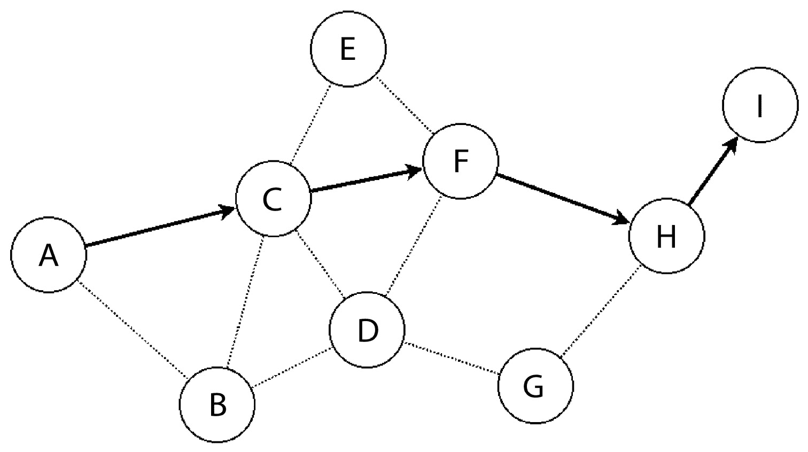

# 分布式系统和物联网架构

通过访问通信外围设备，如网络控制器和无线接口，微控制器能够与附近的设备以及通过互联网的远程服务器建立数据通信。

一组相互连接并交互的嵌入式目标可以被视为一个自包含的分布式系统。可以使用非标准，甚至专有的协议来实现同质化的机器到机器通信。

根据它实现的协议集，嵌入式系统可能能够成功地与异构的远程系统通信。实现标准化的或广泛支持的协议引入了与同一地理区域内网关交互，以及通过互联网与远程云服务器交互的可能性。

小型嵌入式设备的连接范围可能包括使用**信息技术**（**IT**）系统进行远程协调。这两个世界的相遇改变了现代对分布式系统的解释：低功耗、低成本的设备现在可以成为根植于 IT 的服务的一部分，反过来，它们可以将分支扩展到本地化和专业化的传感器和执行器，从而创造出所谓的**物联网**（**IoT**）。

这一技术步骤被许多人视为革命性的，能够永远改变我们获取技术的方式，以及人机交互过程。不幸的是，物联网通信的安全方面往往被忽视，导致不愉快的事件，可能损害传输数据的机密性和完整性，并允许攻击者控制远程设备。

本章分析了可以集成到嵌入式目标中的电信技术和协议，利用它们从整个嵌入式系统的角度更好地理解设计，直至集成到物联网网络中。

我们将学习网络模型，从物理层和建立无线或有线链路的可能技术开始，直至定制嵌入式应用程序，它们可以使用标准通信协议与云服务建立安全通信。

尤其，我们将关注以下内容：

+   网络接口

+   互联网协议

+   TLS

+   应用协议

到本章结束时，你将深入理解当今微控制器的物联网功能。

# 技术要求

在本章中，我们假设您已经熟悉现代计算机网络的一般概念，尽管不需要有分布式应用的经验。为了更全面地了解与本章内容相关的网络编程背景，我们建议进一步阅读《动手实践 C 语言网络编程》（L. Van Winkle – Packt Publishing 2019）。本书的仓库中没有提供本章的具体示例。更完整的 TCP 和**传输层安全性**（**TLS**）客户端/服务器通信示例可以在这里展示的开源项目的源代码分布中找到。

# 网络接口

嵌入式设备通常集成了一个或多个通信接口。许多微控制器集成了以太网接口的**媒体访问控制**（**MAC**）部分，因此连接一个**物理层收发器**（**PHY**）就可以实现局域网访问。一些设备与无线电收发器相连，在固定的频率范围内工作，并实现一个或多个协议以通过无线链路进行通信。无线通信中常用的频率是 2.4 GHz 频段，蓝牙和 802.11 Wi-Fi 都在使用这个频段，以及一些低于 1 GHz 的特定 ISM 频段，这些频段取决于当地法规。可用的亚 GHz 频率包括欧盟的 868 MHz ISM 频段和美国的 915 MHz ISM 频段。收发器通常设计为根据特定的链路协议访问物理层，调节两个或多个设备之间对物理媒体的共享访问。虽然访问相同媒体的两个接口可以有不同的配置，但实现的 MAC 模型必须遵循所有端点上的相同规范，以便建立点对点通信。MAC 层的一部分可能是在设备本身中实现的，它反过来可以使用并行或串行接口将数据传输到和从微控制器。

硬件制造商可能会分发设备驱动程序以访问链路层。当完整的源代码可用时，开发者更容易定制媒体访问，集成设备通信功能，并将通信定制为媒体支持的任何协议栈。然而，许多设备驱动程序只是部分开源，有时限制了与开放标准的集成可能性。此外，将第三方专有代码集成到嵌入式系统中会影响项目维护，通常需要解决已知问题或启用制造商未预见的功能，并且肯定会影响系统的安全模型。

在嵌入式系统中实现设备驱动程序，无论是有线还是无线网络接口，包括在通信逻辑中集成相关的访问控制机制，并处理特定的信道特性。链路的一些特性可能会影响高级通信的设计，从而影响整个分布式系统的架构。在可靠地与 MAC 机制交互的同时，比特率、延迟和最大数据包大小等问题必须在设计阶段解决和评估，以根据系统的目标评估所需资源。

下一个部分提供了嵌入式世界中一些流行网络接口的概述，这些接口通常由连接的设备用于与其他分布式系统组件通信。接下来的部分将建议一些标准，以在通信基础设施和协议设计过程中选择最适合特定目的的技术。

## MAC

在任何物理媒体上建立成功通信链路的最重要组件被归类在 MAC 逻辑中，其实现通常是软件和硬件共同的责任。不同的技术已经发展起来，以定义标准来访问现在用于机器对机器通信的链路，而只有少数能够在没有进行协议转换的中间网关的地理分布式物联网系统中扩展。

一些标准直接源自 IT 世界，并包括现有 TCP/IP 技术的改编，这些技术能够缩小规模以适应嵌入式系统有限的资源。其他标准完全在小型嵌入式设备的背景下发展起来，通过与经典 IT 基础设施的建模在低功耗无线技术之上实现 TCP/IP 协议的交互。在两种情况下，研究融合是由将小型、低成本、自供电设备更广泛集成到物联网服务中的需求所决定的。

对于嵌入式系统来说，没有一种万能的解决方案来定义网络访问。嵌入式行业的需求差异促使开发了定制的 MAC 协议和技术，这些协议和技术既有标准的也有专有的，每个都针对特定功能或一系列嵌入式系统的需求进行定制。

在以下子部分中，将描述一些最成功的机器对机器通信 MAC 技术，考虑到与采用该技术和集成模式相关的方面。

### 以太网

即使对于整个系统的大小与 RJ-45 连接器相当的情况可能听起来有点不切实际，以太网仍然是可集成到嵌入式系统中最可靠和最快的通信通道。

许多 Cortex-M 微控制器配备了一个以太网 MAC 控制器，该控制器必须与外部 PHY 集成。其他链路层协议实现了相同的链路层寻址机制，即在每个传输的包中附加一个 14 字节的预头，指示源和目的链路地址以及正在传输的包中包含的有效载荷类型。每当数据包通过 TCP/IP 堆栈路由到类似以太网的接口时，MAC 地址都会被重写，以便与数据包在其前往最终目的地的旅程中必须穿越的下一个链路相匹配。

设备驱动程序可以激活过滤器，丢弃所有不涉及主机的流量，否则这些流量将不必要地影响 TCP/IP 堆栈处理的背景数据通信量。

### Wi-Fi

在无线宇宙的所有可能性中，802.11 Wi-Fi 被选中，因为它具有高速、低延迟的信道，以及最广泛可能的拓扑兼容性，包括与个人计算机和移动设备。然而，Wi-Fi 收发器的功耗有时对于低功耗设备来说可能难以承受。调节媒体访问的协议和机制的复杂性需要一定量的控制软件，这些软件通常以二进制形式分发，因此没有制造商的支持，无法进行调试和维护。

Wi-Fi 提供了大带宽和合理的低延迟，并且可以在数据链路层实现身份验证和加密。

虽然在技术上可以通过配置 Wi-Fi 收发器以对等模式操作来实现本地网状网络，但配备 802.11 技术的嵌入式系统主要用于连接到现有基础设施，以与其他便携式设备交互并访问互联网。

市场上可提供几种嵌入式低成本平台，配备 TCP/IP 堆栈和内置的 RTOS，可以作为独立平台使用，或集成到完整的系统中，以作为工作站或提供接入点的方式访问无线局域网。

### 低速率无线个人区域网络 (LR-WPANs)

传感器网状网络广泛使用无线技术，在局部地理区域内建立通信。802.15.4 标准规定了 2.4 GHz 和亚 GHz 频段的接入，为有限范围的局域网提供典型最大比特率为 250 Kbps，可以使用低成本、低功耗的收发器进行访问。媒体接入不基于基础设施，并在 MAC 层支持争用解决和碰撞检测，使用信标系统。每个节点可以使用 2 个字节进行寻址，特殊地址`0xFFFF`保留用于广播流量，以到达所有可见节点。802.15.4 帧的最大有效载荷大小固定为 127 字节，因此无法封装从以太网或无线局域网链路路由的全尺寸 IP 数据包。能够通过 802.15.4 接口进行通信的网络协议实现，要么是特定应用的，要么不支持 IP 网络，或者提供分片和压缩机制，以在多个无线帧之间传输和接收每个数据包。

虽然 LR-WPAN 并不是专门为物联网设计的，也不直接与经典 IP 基础设施兼容，但有多种选择可以在 802.15.4 之上构建网络。事实上，虽然标准规定了在可见节点之间交换帧的 MAC 协议，但已经开发了多种链路层技术，包括标准和非标准技术，以在 802.15.4 之上定义网络。

### LR-WPAN 工业链路层扩展

多亏了收发器的灵活性，以及传输和接收 802.15.4 原始帧的能力，实现 LR-WPAN 的网络协议相对容易。

在物联网时代之前，过程自动化行业是第一个采用 802.15.4 技术的，并且长期以来一直在寻找一个标准协议栈，以实现不同制造商设备之间的兼容性。Zigbee 协议栈努力成为 802.15.4 网络的事实上、行业强制标准，考虑到其商业使用中适用的专有、封闭源代码和版税，取得了显著的成功。在平行努力中，**国际自动化学会**（**ISA**）提出了一份开放标准 ISA100.11a 的建议，旨在定义基于 802.15.4 链路构建网络的指南，用于工业自动化过程。另一个工业自动化协议，最初由一个企业联盟开发，然后由**国际电工委员会**（**IEC**）批准为工业自动化标准，是 WirelessHART。

类似于 Zigbee、ISA100.1 和 WirelessHART 的技术定义了 802.15.4 之上的整个协议栈，包括网络定义和传输机制，提供定制地址机制和通信模型，并导出一个 API，该 API 可用于集成应用程序。从分布式系统设计的角度来看，为定制网络中的设备启用互联网连接，不实现 IP 栈，需要一个或多个设备充当网关，重新路由和转换每个数据包以适应定制 LR-WPAN 协议栈。然而，这种转换过程违反了 TCP/IP 通信的端到端语义，影响了通信的各个方面，包括端到端安全。

### 6LoWPAN

6LoWPAN，在 RFC 4944 中描述，是 IETF 标准化的 802.15.4 链路协议，能够传输 IPv6 数据包，并且是 IP 兼容性 LR-WPANs 的既定标准。6LoWPAN 使得嵌入式系统能够通过 802.15.4 接口访问互联网，只要节点实现了 TCP/IP 网络，并且链路层提供了使用短 LR-WPAN 帧传输和接收完整 IP 数据包的机制。数据包的内容被分割并传输到连续的传输单元中，网络和传输头部可以选压缩以减少传输开销。

目前没有 6LoWPAN 标准的 IPv4 对应版本；然而，IETF 正在评估采用类似方法的提案，以使嵌入式节点能够实现传统的 IPv4 连接。

6LoWPAN 是多个网络栈实现的一部分，也是近期创建工业联盟 Thread group 的尝试之一，该联盟的目标是推广基于开放标准协议的完全 IPv6、低功耗的网状网络技术，这些协议是为物联网设计的。多个免费和开源的 TCP/IP 栈以及嵌入式操作系统支持 6LoWPAN，并且可以访问 802.15.4 收发器，提供构建基于功能和协议的 IP 网络的必要链路基础设施。

网状网络可以可选地添加到链路层，以提供一种名为“网状下”的透明桥接机制，其中所有帧都由链路层重复发送到网状网络的远程角落，直到到达目的地。

由于 6LoWPAN 为构建网络拓扑提供了基础设施，因此网状网络可以采用不同的方法，使用应用层协议在 IP 级别更新路由表。这些机制被称为“网状路由”，基于标准化的动态路由机制，也可以用于扩展跨越不同物理链路的网状网络。

### 蓝牙

另一种不断发展的机器到机器连接技术是蓝牙。其物理层基于 2.4 GHz 通信来建立主机/设备通信或为支持多个协议（包括 TCP/IP 通信）的 PAN 提供基础设施。得益于其长期的成功及其在个人电脑和便携式设备市场中的广泛采用，蓝牙连接已经开始在嵌入式微控制器领域获得人气，这主要归因于最近标准在降低功耗方向上的发展。

最初设计为近距离设备的无线串行通信替代品，*经典*的蓝牙技术已经发展到支持集成专用通道，包括具有 TCP/IP 功能的网络接口和专用音频和视频流链接。

标准定义的第 4 版引入的协议栈的低功耗变体，旨在限制嵌入式传感器节点的能耗，并引入了一组新的服务。传感器设备可以导出**通用属性配置文件**（**GATT**），客户端（通常为主机机器）可以通过它来建立与设备的通信。当目标设备上的收发器处于非活动状态时，它消耗少量电力，同时仍然可以从客户端发现其属性并启动 GATT 传输。蓝牙现在主要用于短距离通信；从个人电脑和便携式设备访问传感器节点；与远程音频设备（如扬声器、耳机和无绳汽车语音接口）交换多媒体内容；以及在几个医疗保健应用中，因为一些配置文件专门为此目的而设计。

### 移动网络

使用与便携式设备通过移动网络（如 GSM/GPRS、3G 和 LTE）访问互联网相同的技术，现在可以将没有固定基础设施的远程设备连接起来。接入宽带移动连接的设备所具有的日益增长的复杂性、成本和能源需求，使得将此类网络通信集成到基于微控制器的嵌入式设备中的影响日益增加。移动网络原生支持 TCP/IP 协议，并提供直接连接到互联网，或在某些情况下，连接到接入基础设施提供的受限网络。

尽管在某些特定市场（如汽车和铁路）中仍然很受欢迎，但宽带网络接入配置文件通常对于从远程传感器设备传输少量信息来说过于冗余，而用于访问较老、窄带宽技术的简单调制解调器正逐渐从市场上消失。

随着移动网络技术的发展，专注于手机市场的需求，嵌入式设备架构师正在寻找更适合分布式物联网系统需求的新技术。新技术更好地满足嵌入式市场的目标，并朝着低功耗、低成本、长距离通信的方向发展。

### 低功耗广域网（LPWANs）

LWPANs 是一系列新兴技术，填补了市场对低成本、低功耗、长距离、窄带通信的需求。至于 LR-WPANs，不同的工业联盟已经形成，试图征服市场，并在某些情况下，为通用 LPWAN 网络建立标准协议栈。这个过程导致了在功能、成本和节能特性方面的健康竞争。

LPWAN 技术通常基于亚 GHz 的物理信道，但使用不同的无线电设置，从而增加了通信范围。设备可以通过空中相互通信，在某些情况下，使用基础设施来增加覆盖范围，甚至在基站可视范围内跨越数千公里。

在这个领域最引人注目的新兴技术包括以下内容：

+   **LoRa**/**LoRaWAN**：基于专利的无线接入机制和完全专有的协议栈，这项技术提供了与类似技术相比具有高比特率的远程通信。虽然它提供了几个有趣的功能，例如在无基础设施的情况下进行本地节点到节点的通信，但封闭的协议方法使得这种方法对嵌入式市场不太吸引人，并且不太可能最终在 LPWAN 竞争中保持其位置，而是更倾向于更开放的标准。

+   **Sigfox**：这种超窄带无线电技术需要基础设施才能运行，并在非常长的范围内提供特别低的比特率。受监管的基础设施接入允许每天从或向节点传输有限数量的字节，并且消息的有效负载固定为 12 字节。尽管物理层实现是专有的，但协议栈以源代码形式分发。然而，一些国家的无线电法规仍然是一个开放的问题，可能会影响这项技术在全球范围内的开发，尽管它在欧洲市场取得了相当大的成功。

+   **Weightless**：另一种基于超窄带的科技，Weightless 是 LPWAN 在亚 GHz 范围内运行的完全开放标准。在范围和性能方面与 Sigfox 相似，它提供了一个改进的安全模型，作为经典预共享密钥部署机制的替代方案，允许通过空中安全密钥协商机制。

+   **DASH7**：这里描述的技术中最年轻的是基于完全开放的设计。整个轻量级协议栈的源代码由 DASH7 联盟提供，这使得该技术更容易集成到嵌入式系统中。这个协议栈旨在在设计分布式系统时提供灵活性，因为定义网络拓扑结构有多种选择。

LPWAN 协议与 IP 不直接兼容，需要网络中的一个节点根据从节点获取的远程通信数据生成 TCP/IP 流量。网络流量的间歇性和低比特率特性使这些技术在其自己的领域内运行，并需要节点在分布式系统架构预见访问互联网上的远程节点时能够重新路由数据。

## 选择合适的网络接口

根据用例，每个嵌入式系统都可能从本节中描述的技术提供的通信设施中受益。由于某些嵌入式设备的高度专业化，针对特定用例的设计甚至可能超出这种分类，并使用为特定用例设计的科技。在某些情况下，由于某些环境中的辐射法规或媒体无法可靠地传输无线电波（如水下或通过人体），无线通信是不可能的。

潜艇可能通过特定的收发器进行通信，使用声波来表示数据。同时，也有其他广泛的技术可用于有线通信。电力线通信允许重用现有电线来更新旧设备，并带来本地网络连接，通过使用不会影响电线原有用途的高频调制来扩展以太网或串行接口总线。

实际上，嵌入式设备在连接性方面有广泛的可能性。最佳选择始终取决于具体的用例和系统上可用的资源，这些资源用于实现达到通信另一端所需的协议和标准。在选择通信技术时，可能需要考虑几个方面：

+   通信范围

+   数据传输所需的比特率

+   总拥有成本（收发器价格、集成努力和服务成本）

+   媒体特定的限制，例如由收发器引入的任何延迟

+   射频干扰对硬件设计要求的影响

+   最大传输单元

+   功耗和能源足迹

+   支持与第三方系统兼容的协议或标准

+   符合互联网协议以集成到物联网系统中

+   网络拓扑的灵活性、动态路由和网状网络可行性

+   安全模型

+   实现特定技术驱动程序和协议所需资源

+   使用开放标准以避免长期项目的锁定

连接设备的技术每一种都提供了不同的方法来处理其内在设计中这些方面的解决方式，也取决于技术是否是从不同的上下文中借用的，例如以太网或 GSM/LTE，或者是否是为低功耗嵌入式系统设计的，如 LR-WPAN 和 LWPAN 协议。

在设计分布式系统时选择适当的通信通道是一项需要硬件和软件设计严格协作的操作。创建连接设备涉及一个更复杂的层次，尤其是在低功耗领域。

下一节将重点介绍如何实现互联网协议以适应缩小到嵌入式设备，以产生在标准内操作且功能丰富的网络端点。TCP/IP 堆栈实现可以扩展和配置以满足物联网分布式系统的需求。这里不涵盖将非 IP 协议通过边界网关翻译以在物联网系统中集成非标准通信的情况（边缘网关），因为这些通常涉及具有多个网络接口的更大专用系统。

正如我们所观察到的，嵌入式行业已经足够专业化，能够在标准边缘进行操作，但一个新的研究趋势正在将 TCP/IP 通信重新定位回其作为网络通信既定标准的原始位置，这是由于现有 IT 基础设施在分布式系统中的影响力日益增加，包括小型、低功耗、成本效益的嵌入式系统。这也最近在市场上扩展到标准安全功能，增加了在嵌入式系统中安全端到端通信协议（如 TLS 和 DTLS）的存在。

# 互联网协议

在 20 世纪 80 年代初标准化，现在通常被称为 TCP/IP 的 IP 栈，是一组网络、传输和应用协议，提供在广泛的技术和接口上提供标准通信。在接下来的小节中，我们将讨论这些标准协议如何集成到嵌入式系统中，描述嵌入式应用程序用于与远程端点通信的接口，以及如何与堆栈的不同层进行交互，从网络接口到套接字抽象，以建立与远程对等方的连接或无连接会话。

## 标准协议，定制实现

使用非标准协议栈设计分布式通信，在几乎所有情况下，都不值得付出重新发明最先进技术的努力。TCP/IP 标准已经经过了数十年的广泛研究，并且已经成为我们今天所知道的互联网的主要构建块，整合了数十亿种异构设备。为嵌入式系统配备 TCP/IP 功能不再是开创性的任务，因为存在几个开源实现，并且它们可以轻松地集成到小型嵌入式系统中，只要它们可以访问提供两个或更多端点之间数据传输能力的物理通信通道。

套接字是访问网络应用中传输层通信的标准方式。伯克利套接字模型，后来由 POSIX 标准化，包括函数和组件的命名标准以及 UNIX 操作系统的行为。如果 TCP/IP 栈与操作系统集成，调度器可以提供一个机制在等待特定输入时挂起调用者，并且可以实现对 POSIX 规范的套接字调用 API 的实现。然而，在裸机事件驱动应用程序中，使用回调与套接字同步，以遵循主循环的事件驱动模型。因此，编写与网络协议交互的应用程序在 API 和范例方面略有不同。在单个线程的非阻塞网络应用程序中，除了主循环函数本身外，没有任何操作应该在等待事件时使 CPU 忙碌。套接字函数调用也不例外，需要一种机制来启动操作，注册一个处理操作结束的回调函数，然后立即返回主循环。

## TCP/IP 栈

现代 TCP/IP 栈可能是分布式嵌入式系统最基本的部分。通信的可靠性取决于标准协议实现得有多准确，而设备上运行的服务安全性可能会因 TCP/IP 栈实现、其接口驱动程序以及提供套接字抽象的粘合代码中的缺陷而受到损害。

最受欢迎的嵌入式设备开源 TCP/IP 库是**轻量级 IP**栈，最好称为**lwIP**。它集成了许多实时操作系统，甚至由硬件制造商捆绑分发，lwIP 提供了 IPv4 和 IPv6 网络、UDP 和 TCP 套接字通信、DNS 和 DHCP 客户端，以及可以仅使用几十 KB 内存集成到嵌入式系统中的丰富应用层协议。尽管为小型微控制器量身定制，但像 lwIP 这样的功能齐全的栈所需资源对于一些较小的设备来说超出了范围，包括大多数具有超低功耗特性的传感器处理目标。

**微 IP**，通常称为 **uIP**，是一个基于处理单个缓冲区一次的非凡但绝妙的直觉的最小化 TCP/IP 实现。不需要在内存中分配多个缓冲区，可以将 TCP/IP 通信所需的 RAM 量限制在尽可能小的范围内，并简化 TCP 和其他协议的实现复杂性，从而减少了整个堆栈的代码大小。uIP 并未设计用于扩展到更高的比特率或实现高级功能，但有时它是连接资源非常有限的节点（主要是 LR-WPAN 网络）的最佳折衷方案。

picoTCP 是一个具有较近历史的免费软件 TCP/IP 堆栈。它与 lwIP 具有相似的资源占用和功能列表，但具有不同的模块化设计和对物联网协议的更强关注，提供动态路由、IP 过滤和 NAT 功能。通过在 802.15.4 设备上对 6LoWPAN 的原生支持，picoTCP 可以用于构建网状网络，既可以利用 6LoWPAN 中的网状功能，也可以使用更经典的通过路由协议（如 OLSR 和 AODV）提供的动态路由方法。

对于开源和专有 TCP/IP 堆栈，都存在其他实现，这些实现可以集成到裸机应用程序和嵌入式操作系统中，通常提供类似的 API 以集成接口驱动程序并与系统交互，以向高级应用程序提供套接字通信。嵌入式 TCP/IP 堆栈通过设备驱动程序连接到网络设备，提供发送帧到网络的功能，并能够使用入口点函数交付接收到的数据包，该函数是 TCP/IP 堆栈用来接管数据包的。当前由 TCP/IP 堆栈处理的数据包可能需要异步操作，因此应用程序或操作系统必须确保定期调用堆栈循环函数，以便它可以处理缓冲区中的数据包。最后，传输层为应用程序提供套接字接口，以便创建和使用套接字与远程端点通信。

## 网络设备驱动程序

为了集成网络接口的驱动程序，TCP/IP 堆栈向其底层暴露了一个接口，发送和接收包含帧或数据包的缓冲区。如果设备支持链路层以太网地址，TCP/IP 堆栈必须连接一个额外的组件来处理以太网帧，并激活邻居发现协议，在开始任何 IP 通信之前找到接收设备的 MAC 地址。

lwIP 提供了一个 `netif` 结构，描述了一个网络接口，该结构必须由驱动程序代码分配，但随后由堆栈使用 `netif_add` 函数自动初始化：

```cpp
struct *netif netif_add(struct netif *mynetif,
    struct ip_addr *ipaddr,
    struct ip_addr *netmask,
    struct ip_addr *gw, void *state,
    err_t (* init)(struct netif *netif),
    err_t (* input)(struct pbuf *p, struct netif *netif));
```

`ipaddr`、`netmask`和`gw`参数可用于设置通过此接口创建的链路的初始 IPv4 配置。lwIP 支持每个接口一个 IPv4 地址和三个 IPv6 地址，但所有这些都可以在稍后通过访问`netif`结构中的相关字段进行重新配置。IP 地址可以通过静态 IP 地址或自动分配机制进行配置，例如 DHCP 协商，或从链路本地地址推导。

`state`变量是一个用户定义的指针，可以在驱动程序代码中使用`netif->state`指针创建网络设备和私有字段之间的关联。

提供给`init`参数的函数指针在栈初始化期间被调用，使用相同的`netif`指针，并且驱动程序必须使用它来初始化`netif`设备的剩余字段。

通过输入参数提供的函数指针描述了栈在从网络接收到数据包时必须执行的内联操作。如果设备使用以太网帧进行通信，则应提供`ethernet_input`函数以指示在解析帧内容之前需要为以太网帧进行额外处理，并且网络支持邻居发现协议，在传输数据之前将 IP 地址关联到 MAC 地址。如果驱动程序处理裸 IP 数据包，则接收函数应为`ip_input`。

设备驱动程序初始化在`init`函数中完成，该函数还必须为`netif`结构中的其他重要字段分配值：

+   `hw_addr`：包含以太网设备的 MAC 地址，如果支持的话。

+   `mtu`：此接口允许的最大传输单元大小。

+   `name`/`num`：用于系统中的设备标识。

+   `output`：此函数指针由栈调用，用于向准备传输的 IP 数据包追加自定义链路头。对于以太网设备，此指针应指向`etharp_output`以触发邻居发现机制。

+   `link_output`：当缓冲区准备好传输时，栈调用此函数指针。

在通过调用`netif_up`将链路标记为`up`之后，设备驱动程序可以在接收到新数据包时调用输入函数，而栈本身将调用`output`/`link_output`函数与驱动程序进行交互。

picoTCP 导出类似的接口以实现设备驱动程序，但它支持每个接口多个地址，因此 IP 配置与设备驱动程序分开。每个设备都有一个与其关联的 IPv4 和 IPv6 链接列表，每个链接都有自己的 IP 配置，以实现多宿主服务。在 picoTCP 中，设备驱动程序结构必须以 `pico_device` 结构的物理条目作为其第一个字段开始。这样，两个结构都指向相同的地址，设备可以在 `pico_device` 结构的末尾维护自己的私有字段。为了初始化设备，结构在驱动程序中分配，并调用 `pico_device_init`：

```cpp
int pico_device_init(struct pico_device *dev, const char *name, const uint8_t *mac);
```

需要的三个参数是预分配的设备结构、用于系统内识别的名称，以及如果有的话，以太网 MAC 地址。如果 MAC 为空，堆栈将绕过以太网协议，并且由驱动程序处理的全部流量都是没有链路层扩展的裸 IP 数据包。驱动程序必须实现 `send` 函数，该函数由堆栈使用，以将接口要传输的帧或数据包发送出去，输入通过 `pico_stack_recv` 函数进行管理：

```cpp
int32_t pico_stack_recv(struct pico_device *dev, uint8_t *buffer, uint32_t len);
```

设备再次作为参数传递，以便堆栈自动识别接口是接收以太网帧还是没有头部的原始 IP 数据包，并相应地做出反应。可以使用 `pico_ipv4_link_add` 和 `pico_ipv6_link_add` 配置 IP 地址，并通过其 API 访问路由表以添加网关和特定网络的静态路由。

## 运行 TCP/IP 堆栈

要集成网络堆栈，系统通常必须提供一些商品，例如时间管理和堆内存管理。堆栈所需的全部系统功能在编译时通过系统特定的配置头文件关联，该文件相应地关联函数和全局值。

根据物理通道的特性以及要达到的吞吐量，TCP/IP 堆栈在堆内存的使用上可能会变得非常苛刻，直到上层能够处理它们，它都会分配空间给新的接收缓冲区。在某些设计中，为 TCP/IP 堆栈操作分配单独的内存池可能有助于通过设置阈值和硬限制来控制堆栈的内存使用，而不会影响系统上其他组件的功能。

大多数库使用系统提供的单调计数器来实现自己的内部计时器，该计数器由系统提供并由系统中的另一个组件独立增加。可以通过使用`SysTick`中断来增加时间跟踪值，从而提供足够的精度，以便堆栈可以为协议组织定时操作。对于 lwIP，只需导出一个名为`lwip_sys_now`的全局变量即可，该变量包含自启动以来经过的时间，以毫秒为单位。picoTCP 需要导出一个名为`PICO_TIME_MS`的宏或内联函数，返回相同的值。这两个堆栈都期望应用程序的主循环通过调用核心 API 中的函数，提供重复的入口点，以管理系统协议的内部状态。

要检查是否有任何挂起的计时器已过期，系统在 lwIP 中调用`sys_check_timeouts`，或在 picoTCP 中调用`pico_stack_tick`，从主事件循环或当在操作系统内运行时，调用一个专用线程。连续调用之间的间隔可能会影响计时器的精度，通常不应超过几毫秒，以确保网络堆栈对定时事件做出响应。

网络接口还必须轮询来自网络的输入，无论是连续的还是通过系统实现的适当中断处理。当有新数据可用时，设备驱动程序分配新的缓冲区，并通过调用数据链路或网络层的输入函数来启动处理。

使用 lwIP 的典型裸机应用程序首先执行堆栈和设备驱动程序的初始化步骤。网络接口的结构在主函数堆栈中分配，并使用静态 IPv4 配置初始化。以下代码假设设备驱动程序导出一个名为`driver_netdev_create`的函数，该函数填充接口特定的字段和回调：

```cpp
void main(void)
{
  struct netif netif;
  struct ip_addr ipaddr, gateway, netmask;
  IP4_ADDR(&ipaddr, 192,168,0,2);
  IP4_ADDR(&gw, 192,168,0,1);
  IP4_ADDR(&netmask, 255,255,255,0);
  lwip_init();
  netif_add(&netif, &ipaddr, &netmask, &gw, NULL,
  driver_netdev_create, ethernet_input);
  netif_set_default(&netif);
```

然后在 TCP/IP 堆栈中激活网络接口：

```cpp
  netif_set_up(&netif);
```

在进入主循环之前，应用程序通过创建和配置套接字以及关联回调来初始化通信：

```cpp
  application_init_sockets();
```

在这种情况下，主循环依赖于驱动程序导出一个名为`driver_netdev_poll`的函数，这是驱动程序在接收到新帧时调用`ethernet_input`的函数。最后，调用`sys_check_timeouts`，以便 lwIP 可以跟踪挂起的计时器：

```cpp
  while (1) {
   /* poll netif, pass packet to lwIP */
   driver_netdev_poll(&netif);
   sys_check_timeouts();
   WFI();
  }
}
```

预期裸机应用程序运行 picoTCP 时会有类似的流程。设备驱动程序的初始化与堆栈无关，并且驱动程序预期会在包含在自定义`driver_device`类型的`pico_device`结构中作为强制第一个成员调用`pico_device_init`。驱动程序仅导出`driver_netdev_create`函数，该函数还关联其特定的网络轮询函数指针，该指针将由`pico_stack_tick`调用。堆栈期望在驱动程序的`poll`函数有新到达的待处理数据包时调用`pico_stack_recv`回调：

```cpp
void main(void)
{
  struct driver_device dev;
  struct ip4 addr, netmask, gw, zero, any;
  pico_string_to_ipv4("192.168.0.2", &ipaddr.addr);
  pico_string_to_ipv4("255.255.255.0", &netmask.addr);
  pico_string_to_ipv4("192.168.0.1", &gw.addr);
  any.addr = 0;
  pico_stack_init();
  driver_netdev_create(&dev);
```

IPv4 地址配置是通过访问 IPv4 模块的 API 来完成的。应用程序可以通过调用`pico_ipv4_link_add`并指定地址和子网掩码来关联一个或多个 IP 地址配置。在 IP 协议中自动创建一个路由，通过接口到达子网中的所有邻居：

```cpp
  pico_ipv4_link_add(&dev, ipaddr, netmask);
```

要添加默认路由，将网关与`0.0.0.0`地址（表示任何主机）关联，并设置度量值为`1`。默认网关可以在以后通过为其他子网定义更具体的路由来覆盖：

```cpp
  pico_ipv4_route_add(any, any, gw, 1, NULL);
```

与前一个示例类似，应用程序现在可以初始化其套接字并关联堆栈在需要时将调用的回调：

```cpp
  application_init_sockets();
```

这个简单的主循环会重复调用`pico_stack_tick`，这将轮询所有关联的网络接口，并在所有协议模块中执行所有挂起的操作：

```cpp
  while (1)
  pico_stack_tick();
  WFI();
}
```

所有 TCP/IP 操作都与套接字回调相关联，当应用程序需要响应网络和超时事件时，这些回调会被调用。当需要管理单个协议的内部状态时，堆栈会自动设置超时。如前所述，在无操作系统的环境中，提供访问套接字通信的接口基于自定义回调，具体取决于特定堆栈的实现。下一节将展示如何在两种不同的 TCP/IP 堆栈实现中使用非阻塞套接字 API。

## 套接字通信

lwIP 为裸机套接字通信提供的接口，也称为原始套接字 API，由自定义调用组成，每个调用都指定在堆栈期望事件发生时调用的回调。当发生特定事件时，lwIP 将从主循环函数中调用回调。

lwIP 中对 TCP 套接字的描述包含在 TCP 特定的协议控制块结构中，即`tcp_pcb`。为了为监听 TCP 套接字分配一个新的控制块，使用以下函数：

```cpp
struct tcp_pcb *tcp_new(void);
```

要接受 TCP 连接，裸机 lwIP TCP 服务器首先会调用以下：

```cpp
err_t tcp_bind(struct tcp_pcb *pcb, ip_addr_t *ipaddr,
    u16_t port);
err_t tcp_listen(struct tcp_pcb *pcb);
```

这些非阻塞函数将套接字绑定到本地地址并将其置于监听状态。

在这一点上，一个使用阻塞套接字的 POSIX 应用程序会调用 `accept` 函数，该函数会在套接字上无限期地等待下一个传入的连接。相反，lwIP 原生应用程序会调用以下函数：

```cpp
void tcp_accept(struct tcp_pcb *pcb,
    err_t (* accept)(void *arg, struct tcp_pcb *newpcb,
    err_t err)
);
```

这仅仅表明服务器已准备好接受新的连接，并且希望在建立新的传入连接时被回调到已作为参数传递的 `accept` 函数的地址。

使用相同的机制，为了接收下一个数据段，应用程序调用以下函数：

```cpp
void tcp_recv(struct tcp_pcb *pcb,
    err_t (* recv)(void *arg, struct tcp_pcb *tpcb,
    struct pbuf *p, err_t err)
);
```

这表示 TCP/IP 堆栈应用程序已准备好接收 TCP 连接上的下一个段，并且可以在有新缓冲区可用时执行操作，因为堆栈调用了在调用 `tcp_recv` 时指定的实际 `recv` 函数。

类似地，picoTCP 将一个回调函数与每个套接字对象关联起来。该回调函数是一个公共点，用于响应任何与套接字相关的事件，例如新的传入 TCP 连接、套接字缓冲区中有新数据要读取，或者上一个写入操作的结束。

当创建套接字时指定回调函数：

```cpp
struct pico_socket *pico_socket_open(uint16_t net,
    uint16_t proto,
void (*wakeup)(uint16_t ev, 
    struct pico_socket *s));
```

前面的函数在指定的网络和传输协议上下文中创建一个新的套接字对象，`net` 和 `proto` 参数分别，并通过调用应用程序提供的 `wakeup` 函数来响应所有套接字事件。使用此机制，picoTCP 成功检测到半关闭的套接字连接和其他事件，这些事件可能不是与当前操作直接相关，但可能由于套接字通信模型中的状态变化而发生。

可以使用这些函数在新建的套接字上配置 TCP 套接字服务器：

```cpp
int pico_socket_bind(struct pico_socket *s,
    void *local_addr,
    uint16_t *port);
int pico_socket_listen(struct pico_socket *s, int backlog);
```

在这一点上，应用程序必须等待传入的连接而不调用 `accept`。每当建立一个新的传入连接时，就会生成一个事件，该事件调用 `wakeup` 函数，然后应用程序最终可以调用 `accept` 来生成新的套接字对象，对应于传入的连接：

```cpp
struct pico_socket *pico_socket_accept(
    struct pico_socket *s,
    void *orig,
    uint16_t *local_port);
```

传递给 picoTCP `wakeup` 回调函数的第一个参数是一个掩码，表示在套接字上发生的事件类型。事件可能如下所示：

+   `EV_RD`：指示在传入数据缓冲区中有数据可读。

+   `EV_CONN`：指示在调用 `connect` 之后或处于监听状态等待时，已建立新的连接，在调用 `accept` 之前。

+   `EV_CLOSE`：当连接的另一端发送一个 `FIN` TCP 段时触发，表示它已经完成了传输。套接字处于 `CLOSE_WAIT` 状态，意味着在终止连接之前，应用程序可能仍然可以发送数据。

+   `EV_FIN`：指示套接字已被关闭，并且在回调函数返回后不再可用。

+   `EV_ERR`：发生了错误。

TCP/IP 堆栈提供的回调接口一开始可能使用起来有些晦涩，但它是实现更高吞吐量的非常有效的方法，当在应用中正确实现时。

我们分析的两个 TCP/IP 堆栈都能够通过在单独的线程中运行 TCP/IP 库主循环，并通过系统调用提供对套接字的访问，与操作系统结合提供更标准化的 API。

套接字通信只是 TCP/IP 堆栈公开的 API 之一。堆栈中实现的其它协议提供它们自己的函数签名；这些在两个库的手册中都有描述。

## 无连接协议

TCP 是一种广泛使用的传输协议，在连接导向模式对应用有意义的地方。它的无连接对应协议 UDP，主要用于解决不同范围的问题，但在某些情况下，它可以满足小型、资源受限的嵌入式系统的所有需求。实际上，TCP 实现很大，在某些平台上，它们占据了可用的闪存空间相当大的部分。这是由于 TCP 的复杂内部机制，导致需要包含大量代码来管理重传、超时和确认；组织缓冲区；以及跟踪每个套接字的多态状态机。

另一方面，UDP 非常简单，对从套接字接口到网络以及相反方向的数据进行很少的转换。通常，UDP 实现的大小要小得多，由于缺乏可靠性要求，不需要跟踪已传输或接收的数据的顺序和间隙，这影响了运行时 RAM 的使用。当网络特性允许时，使用 UDP 进行低流量冗余数据传输通常是一个可行的选择。

## 网状网络和动态路由

如前所述，链路层协议可能能够实现网状下机制，这为上层隐藏了拓扑的复杂性。当链路层协议不实现此功能，或者当网状解决方案可能扩展到不同的网络接口时，采用不同的方法，此时必须实现一个标准协议，该协议与接口无关。每个链路直接连接两个设备，这些设备反过来协调以检测到达远程节点的最佳网络路径，基于检测到的拓扑。路径上的中间节点被配置为根据当前拓扑上的信息路由流量到目的地：



图 9.1 – 网状网络拓扑示例（节点 A 选择节点 C 将数据包路由到 I，在检测到最佳的四跳路由后）

在某些情况下，拓扑不是固定的，而是在路径中的节点不可用或更改其位置时演变，改变其与相邻节点的直接可见性。具有非静态拓扑的网状网络被称为**移动自组织网络** (**MANETs**)。为 MANETs 设计的动态路由机制必须能够对拓扑变化做出反应并相应地更新其路由，因为网络是持续演变的。

路由在网状机制是在 TCP/IP 堆栈中实现的，因为它们必须能够在运行时重新配置 IP 路由表，并访问套接字通信。基于动态 IP 路由的网状网络依赖于不同的协议，这些协议可以分为两类：

+   **主动动态路由协议**：每个网络节点发送广播消息来宣布其在网络上的存在，其他节点可以通过读取消息来检测邻居的存在，并将邻居列表传达给邻居。网状网络始终处于可用状态，并且在拓扑变化时需要固定的重新配置时间。

+   **反应式动态路由协议**：在没有数据交换时，节点可以处于空闲状态，然后通过查询每个邻居来配置路径，请求到达目的地的路由。然后重复消息，增加计数器以跟踪跳数，直到到达目的地，此时，使用回复，网络可以定义发送者请求的路径。这些机制意味着动态路由是在需要时形成的，因此通信的第一条消息可能会遭受额外的延迟；另一方面，它需要的能量更少，可能对拓扑变化的反应更快。

前一组中最广泛使用的协议如下：

+   **优化链路状态路由** (**OLSR**)，由 IETF 在 RFC3626 和 RFC7181 中标准化

+   **更好的移动自组织网络** **方法** (**B.A.T.M.A.N.**)

+   Babel (IETF RFC6126)

+   **目的序列距离** **向量** (**DSDV**)

IETF 标准化的反应式、按需路由协议如下：

+   **自组织、按需、距离向量** (**AODV**)，RFC3561

+   动态源路由 (RFC4728)

路由协议的选择，再次强调，取决于需要构建的网状网络的要求。在数据稀疏和电池供电的节点网络中，反应式、按需协议是最合适的，在这些网络中，路由协议的较长时间反应是可以接受的。始终开启的嵌入式系统可能从主动路由机制中受益，这些机制确保路由表始终更新到网络的最新已知状态，并且每个节点始终知道到达每个可能的最佳路由，但与此同时，需要定期更新以广播包的形式穿越网络，不断刷新网络节点及其邻居的状态。

picoTCP，它被设计用来为物联网设备提供高级路由技术，支持一种网状下层机制，在 6LoWPAN 链路层，以及两种路由上层协议，即 OLSR（反应式）和 AODV（主动式），为将 TCP/IP 通信集成到移动、自组织网络提供了更广泛的选择。例如，要启用 OLSR，只需编译支持 OLSR 的堆栈，OLSR 守护服务将自动在主 TCP/IP 堆栈循环中启用并运行。所有必须参与网状网络定义的设备都必须通过调用 `pico_olsr_add` 添加：

```cpp
pico_olsr_add(struct pico_device *dev);
```

AODV 网络可以通过类似的方式启用，接口是通过 `pico_aodv_add` 函数添加的：

```cpp
pico_aodv_add(struct pico_devices *dev);
```

在这两种情况下，服务将透明地为用户运行，并在检测到网络上的新节点时更改路由表，对于 OLSR 来说是在检测到新节点时，或者每次我们请求与远程节点通信并创建一个按需路由以到达它时。不在直接可见范围内的节点指定一个第一跳网关，以确保目标节点可以通过路由度量作为跳数指示符被到达，这样当找到一个新的、更短的路径时，路由将被替换，通信可以继续，理想情况下不会因路由替换而造成中断。

路由协议，如 OLSR，在计算网状网络中给定目的地的最佳路径时，可以考虑比跳数更多的参数。例如，在计算最佳路径时，可以集成有关无线链路质量的信息，如信噪比或接收信号强度的指示。这允许我们根据多个参数选择路由，并始终选择无线信号方面的最佳选项。

路由上层网状网络策略没有预见转发广播包的机制，这些广播包必须由链路层协议重复转发，以便到达网络中的所有节点。然而，已知实现此类机制可以轻易触发乒乓效应，即单个数据包在两个或更多节点之间弹跳，因此链路层实现的广播转发机制必须通过跟踪最近几帧通过这种方式转发的帧来避免重复转发相同的帧。

对于现实世界中的物联网系统，通信需要实现传输中数据的安全。这包括但不限于加密，以确保传输数据的机密性。

实施标准安全协议确保网络中异构组件（例如，设备与远程服务器之间）之间的互操作性，以端到端的方式，并依赖于与经典 IT 世界中使用的协议完美兼容的软件解决方案。下一节将探讨传输层安全，并提出了建议。

# TLS

链路层协议通常提供一些基本的安全机制，以确保连接到特定网络的客户端的认证，并通过使用如 AES 之类的对称密钥加密数据。在大多数情况下，链路层的认证足以保证基本的安全级别。然而，在 LR-WPAN 网络堆栈中经常使用的预共享、众所周知的密钥可能容易受到多种攻击，并且如果密钥被泄露，使用预共享密钥将允许攻击者解密在同一链路上之前捕获的任何流量。

参与物联网分布式系统的设备需要实现更高等级的安全性，尤其是在没有任何内存保护措施的嵌入式设备中，任何后门都意味着攻击者可以控制设备，并检索所有敏感信息，例如用于与远程系统通信的认证和加密的私钥。TLS 是一套旨在通过标准 TCP/IP 套接字提供安全通信的加密协议。该组件的责任主要集中在分布式系统中安全通信的三个关键要求上：

+   通过使用对称加密，确保涉及部分之间的**机密性**。TLS 定义了旨在生成一次性对称密钥的加密技术，这些密钥在它们生成的会话结束时失效。

+   使用公钥加密技术对通信中涉及的各方进行**认证**，以签署和验证挑战负载。由于非对称密钥的性质，只有拥有秘密私钥的部分才能签署负载，而任何人都可以通过检查与签名消息的公钥对应项来验证签名的真实性。

+   使用消息摘要确保通信的**完整性**，从而验证消息在其路径上没有被修改。

几种开源的协议套件实现可用于嵌入式市场，以启用标准加密算法和安全的套接字通信策略。

**注意**

在此背景下，应尽可能避免使用闭源的专有安全组件实现，因为在封闭系统中追踪安全问题是相当困难的，并且必须盲目信任实现源以进行漏洞管理。

由免费和开源软件库**wolfSSL**提供的实现是最完整和最新的之一。该库提供了 TLS 和 DTLS 的最新标准版本，并针对小型嵌入式系统中的性能和可靠性进行了设计，包括对许多用于系统安全的嵌入式平台的硬件加速器和随机数生成器的支持。

wolfSSL 在其核心库（`wolfCrypt`）中实现了加密原语，并将它们分组为 TLS 套接字使用的密码套件，这些套接字可以轻松集成到裸机网络应用程序和任何提供传输套接字通信 API 的嵌入式操作系统中。这些加密原语针对嵌入式设备进行了优化，并使用汇编代码对性能最关键的操作进行优化，以获得最佳性能。

为微控制器设计的 TLS/SSL 库的主要优势是它实现了与互联网上任何 PC 或服务器相同的协议，但代码大小只有一小部分，并且在所有时候都保持资源使用（如最昂贵的加密操作期间的内存使用）在控制之下。

采用支持尖端加密算法的 TLS 库，可以使物联网网络中经典 IT 基础设施组件实施的安全措施实现完美集成。在云端，旨在由远程嵌入式系统访问的服务应允许根据椭圆曲线选择更高效的密码套件，因为基于 RSA 的公钥加密需要更大的密钥和复杂的计算才能达到相同的安全级别。TLS 1.3 规范中包含了基于公钥加密的新标准，如 Curve22519，以提供更多资源系统的有效密钥处理，同时保持较老算法相同的安全级别。在选择异构系统之间 TLS 通信的加密算法时，必须考虑在目标上执行的操作的计算时间，例如加密、会话密钥生成、有效载荷签名和验证。

## 保护套接字通信

wolfSSL 内置了对许多嵌入式操作系统的支持，以适应不同范例提供的特定内存配置和套接字接口，并且可以集成到任何兼容的 TCP/IP 堆栈的裸机系统中，或者通过通用的基于回调的**输入/输出**（**I/O**）接口轻松适应。

在任何情况下，无论是裸机还是操作系统，应用程序都必须设计为访问 `wolfSSL_accept` 或 `wolfSSL_connect`，分别以服务器模式或客户端模式，以与远程系统启动 TLS 握手。然后可以使用 `wolfSSL_read` 和 `wolfSSL_write` 函数进行数据通信，而不是使用 TCP/IP 堆栈导出的正常套接字读写函数，这样流就可以由 TLS 库在顶部构建的附加 SSL 处理。

以下使用示例涉及使用 wolfSSL 在 TCP 连接之上创建 TLS 套接字。在 UDP 之上创建 DTLS 套接字（无连接套接字的 TLS 等价物）的方法相当类似，并且仍然使用与 TLS 相同的连接/接受范例，尽管 UDP 通常以点对点方式使用，不暴露客户端和服务器之间的网络区别，而 TCP 则有这种区别。有关创建 DTLS 无连接安全套接字的更多信息，请参阅 wolfSSL 用户手册 ([`www.wolfssl.com/documentation/manuals/wolfssl/index.html`](https://www.wolfssl.com/documentation/manuals/wolfssl/index.html))。

在我们的简单使用示例中，在访问任何 API 之前，首先使用 `wolfSSL_Init` 初始化库。这是初始化和创建通常称为上下文的新对象的要求。单个上下文实现一个特定方法（本例中的 TLS v. 1.2 服务器）并将通过一个称为 `WOLFSSL` 的不同抽象与一个或多个现有套接字相关联。从同一上下文生成的多个 SSL 对象共享相同的加密密钥和 I/O 回调函数，wolfSSL 可以使用这些函数查询系统以获取传入数据，或通过套接字连接传输处理后的数据：

```cpp
wolfSSL_Init();
wolfSSL_CTX *ctx;
ctx = wolfSSL_CTX_new(wolfTLSv1_2_server_method());
wolfSSL_SetIORecv(ctx, wolfssl_recv_cb);
wolfSSL_SetIOSend(ctx, wolfssl_send_cb);
```

系统中实现了两个回调函数，用于通过使用特定于系统的 TCP 套接字 API 访问 TCP/IP 堆栈中的套接字通信。例如，假设一个自定义 TCP 实现在裸机环境中导出读写函数为 `tcp_socket_write` 和 `tcp_socket_read`，并且当 TCP/IP 堆栈忙碌或未准备好处理缓冲区时，这些函数返回 `0`。`wolfssl_send_cb` 回调函数可以实现，以在成功的情况下返回处理的数据大小，或者返回特殊值 `WOLFSSL_CBIO_ERR_WANT_WRITE`，这表示 I/O 操作无法在不阻塞的情况下完成：

```cpp
int wolfssl_send_cb(WOLFSSL* ssl, char *buf, int sz, void *sk_ctx)
{
 tcp_ip_socket *sk = (tcp_ip_socket *)sk_ctx;
 int ret = tcp_socket_write(sk, buf, sz);
 if (ret > 0)
   return ret;
 else
   return WOLFSSL_CBIO_ERR_WANT_WRITE;
}
```

相应的读取回调将使用相应的 `WOLFSSL_CBIO_ERR_WANT_READ` 特殊值来指示从堆栈中没有可处理的数据：

```cpp
int wolfssl_recv_cb(WOLFSSL *ssl, char *buf, int sz, void *sk_ctx)
{
  tcp_ip_socket *sk = (tcp_ip_socket *)sk_ctx;
  int ret = tcp_socket_read(sk, buf, sz);
  if (ret > 0)
    return ret;
  else
    return WOLFSSL_CBIO_ERR_WANT_READ;
}
```

对于大多数常用的操作系统和 TCP/IP 堆栈 API，wolfSSL 已经提供了默认的 I/O 回调函数，因此只要激活正确的配置选项，就不需要实现自定义回调函数。

与每个连接关联的`wolfSSL_CTX`对象，在开始任何通信之前必须配备一组证书和密钥。在更复杂的系统中，证书和密钥存储在文件系统中，当 wolfSSL 集成到使用文件操作时可以访问。在通常不支持文件系统的嵌入式系统中，证书和密钥可以存储在内存中，并使用指向内存中位置的指针将其加载到上下文中：

```cpp
wolfSSL_CTX_use_certificate_buffer(ctx, certificate, len, SSL_FILETYPE_ASN1);
wolfSSL_CTX_use_PrivateKey_buffer(ctx, key, len,SSL_FILETYPE_ASN1 );
```

将套接字上下文传递给回调函数是在底层 TCP 连接建立之后设置的。对于服务器，这可以在`accept`函数的上下文中完成，而客户端可以在`connect`函数成功返回后关联套接字到特定的 SSL 上下文。在服务器端接受 SSL 连接需要应用程序调用`wolfSSL_accept`，以便在任何实际数据传输之前完成 SSL 握手。SSL 接受过程应该在将 TCP/IP 套接字对象的指针关联为 SSL 对象的上下文之后，并用作与该套接字相关的回调函数的`sk_ctx`参数：

```cpp
tcp_ip_socket new_sk = accept(listen_sk, origin);
WOLFSSL ssl = wolfSSL_new(ctx);
if (new_sk) {
  wolfSSL_SetIOReadCtx(ssl, new_sk);
  wolfSSL_SetIOWriteCtx(ssl, new_sk);
```

`wolfSSL_accept`是在设置套接字上下文之后调用的，因为`accept`机制可能已经需要调用底层堆栈以通过其状态：

```cpp
 int ret = wolfSSL_accept(ssl);
```

如果 SSL 握手成功，`wolfSSL_accept`返回`WOLFSSL_SUCCESS`特殊值，因此安全套接字现在可以通过`wolfSSL_read`和`wolfSSL_write`函数进行通信。在裸机应用程序中运行时，`wolfSSL_read`和`wolfSSL_write`必须在非阻塞模式下使用，通过在运行时在 SSL 会话对象上设置此标志：

```cpp
  wolfSSL_set_using_nonblock(ssl, 1);
```

使用非阻塞 I/O 为 wolfSSL 函数确保可以保持之前描述的用于传输套接字的事件驱动主循环模型，因为调用库函数永远不会使系统停滞。wolfSSL 中的 API 函数被设计为立即返回特定的值（例如`WANT_WRITE`和`WANT_READ`），以指示操作正在进行中，并且相关的函数（例如，在这种情况下是`wolfSSL_accept`）应该在稍后当底层 TCP 套接字有新数据可用时再次调用。

一旦运输端点之间的通信得到保障，就可以使用安全套接字通信来交换数据。以下是对物联网系统中使用的一些最常见应用协议的概述。

# 应用协议

为了能够在分布式场景中与远程设备和云服务器通信，嵌入式系统必须实现与现有基础设施兼容的标准协议。在设计远程服务时采取的最常见方法有两种：

+   基于 Web 的服务

+   消息协议

前者主要是经典的、基于客户端-服务器的**表示状态转移**（**REST**）通信，这种通信在通过个人电脑或便携式设备访问的 Web 服务中很受欢迎。Web 服务在云端不需要特别适应来支持嵌入式系统，除了选择一个嵌入式友好的密码集，如*安全套接字通信*部分所述。然而，请求-回复通信模型在分布式应用程序的设计上引入了一些限制。HTTP 协议可以通过两个 HTTP 端点的共同协议升级，并支持 WebSocket，这是一个在 HTTP 服务之上提供对称、双向通道抽象的协议。

消息协议是一种不同的方法，更好地反映了传感器或执行器嵌入式系统的功能，其中信息通过使用短二进制消息进行交换，这些消息可以通过中间代理进行中继，并从服务器节点收集或分发。当网络包括较小的节点时，消息协议是首选选择，因为与基于人类可读字符串的 Web 服务相比，它具有更简单的数据表示。Web 服务通常基于人类可读字符串，并为必须处理 ASCII 字符串的目标增加了更大的传输大小和内存占用。

在这两种情况下，TLS 应在基础设施和设备级别得到支持，以实现端到端加密和可靠的设备识别。明文认证和预共享密钥加密是过时的技术，因此不应成为现代分布式系统安全策略的一部分。

## 消息协议

基于消息的通信协议在计算机网络软件中并非新奇，但与物联网分布式系统特别匹配，尤其是在一个基于消息的一对多模型允许我们同时到达许多设备并建立双向通信，或者来自不同位置的多个设备可以通过充当通信代理的外部服务器相互通信的场景中。这一领域的标准化不足导致了几个不同的模型，每个模型都有自己的 API 和网络协议定义。

然而，一些特定的开放标准已经被设计用来实现安全的分布式消息系统，这些系统专门针对资源减少和带宽有限的网络，通过包括一些在小代码足迹内合理可行的规范。这种情况适用于**消息队列遥测传输**（**MQTT**）协议。得益于其发布者-订阅者模型和通过 TCP/IP 在不同物理位置互联嵌入式设备的能力，MQTT 已被广泛使用，并得到多个云架构的支持。

该协议依赖于 TCP 来建立与中央代理的连接，该代理将发布者的消息分发到订阅者。发布者推送特定主题的数据，该主题由 URI 描述，订阅者可以在连接时过滤他们想要跟踪的主题，以便代理只转发与过滤器匹配的消息。

对于小型嵌入式设备也存在一些客户端库的实现，尽管其中许多缺乏对安全机制的支持。该协议支持明文密码认证机制，这不是一种有效的安全措施，并且绝不应该在清晰的 TCP/IP 通信之上使用，因为密码很容易在路径中被截获。

根据标准，除了通过 IANA 注册的 TCP 端口`1883`进行的基于套接字的 TCP 通信外，还可以建立一个 SSL 会话，该会话使用 TCP 端口`8883`。wolfSSL 提供了一个使用 SSL 会话在 TCP 之上提供的安全实现，这是一个名为**wolfMQTT**的独立 GPL 库。该库默认提供安全的 MQTT 套接字连接。它能够通过证书和公钥实现客户端和服务器身份验证，并通过建立的会话提供对称密钥加密。

## REST 架构模式

**REST**是由 Roy Fielding 提出的术语，用于描述 Web 服务使用无状态协议与远程系统通信的模式。在符合 REST 的系统中，资源以针对特定 URI 的 HTTP 请求的形式访问，使用与通过远程浏览器请求获得的网页相同的协议栈。实际上，REST 请求是扩展的 HTTP 请求，将所有数据表示为编码字符串，通过可读的 HTTP 流在 TCP 上传输。

采用这种模式在服务器端提供了许多架构上的好处，并允许我们构建具有非常高的可扩展性的分布式系统。尽管这种方法并不非常高效，而且肯定不是针对嵌入式系统资源设计的，但嵌入式系统可以通过实现一个简单的 REST 客户端与由 RESTful 系统公开的远程 Web 服务进行交互。

## 分布式系统 – 单点故障

设计分布式系统还意味着要考虑链路缺陷、不可达网关和其他故障。嵌入式设备在断开互联网连接时不应停止工作，而应提供基于本地网关的回退机制。例如，考虑一个用于控制房屋中所有加热和冷却单元的民用电物联网系统，可以通过便携式设备访问，并使用任何网络访问远程协调。温度传感器、加热器和冷却器使用嵌入式设备的网状网络进行控制，而中央控制位于远程云服务器上。系统可以根据用户设置和传感器读数远程控制执行器。这使我们能够在远程位置访问服务，允许用户根据用户界面发送的命令调整系统，以在每个房间设置所需的温度，这些命令由云处理并转发，以到达嵌入式设备。只要所有组件都连接到互联网，物联网系统就会按预期工作。

然而，在连接失败的情况下，用户将无法控制系统或激活任何功能。在局域网内终止本地设备上的应用程序服务确保了在互联网连接失败以及任何阻止本地网络访问远程云设备的故障情况下服务的连续性。如果这种机制得以实施，即使系统与互联网断开连接，仍可以提供故障转移替代方案来访问传感器和执行器，前提是所有参与者在一个共同的局域网中连接。此外，拥有一个本地系统处理和转发设置和命令可以减少请求动作的延迟，因为请求不需要穿越互联网进行处理和转发回同一网络。设计可靠的物联网网络必须包括对所有用于提供服务的链接和设备的单点故障的仔细评估，这必须包括用于访问服务、消息代理和远程设备的骨干链路，这些设备可能会在整个系统中引起故障或其他问题。

# 摘要

本章为我们概述了机器到机器分布式系统和物联网服务的架构设计，包括连接的嵌入式设备，重点关注在嵌入式开发中常被忽视或低估的安全元素。所提出的技术允许在非常小的目标上实现全面、专业级、安全和快速的 TCP/IP 连接，并使用最先进的技术，如最新的 TLS 加密套件。在考虑针对基于微控制器的目标可用的硬件和软件技术方面，已经考虑了多种方法，以更广泛地了解构建分布式嵌入式系统所用的技术、协议和安全算法。

下一章将通过解释如何从头开始编写适用于 Cortex-M 微处理器的小型调度器，来展示现代嵌入式微控制器的多任务可能性，并将总结在嵌入式目标上运行的实时操作系统的关键角色。

# 第四部分 – 多线程

本部分通过调度器的开发和 ARM CPU 中上下文变化的解释，介绍了并行多线程应用程序。在最后一章中，解释了 TEE 方法，并举例说明了使用 TrustZone-M 安全系统。

本部分包含以下章节：

+   *第十章*，*并行任务与调度*

+   *第十一章*，*可信执行环境*
