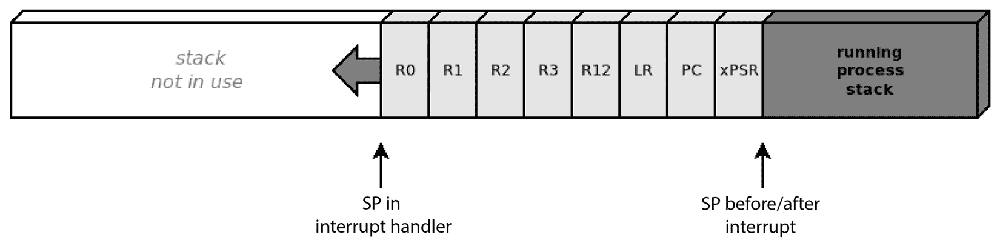
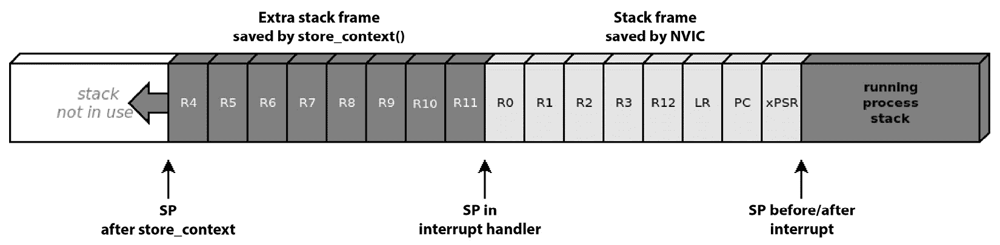
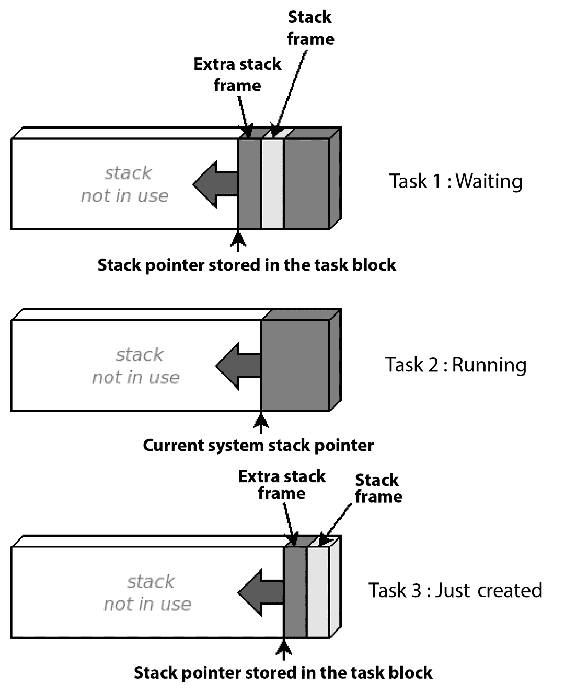
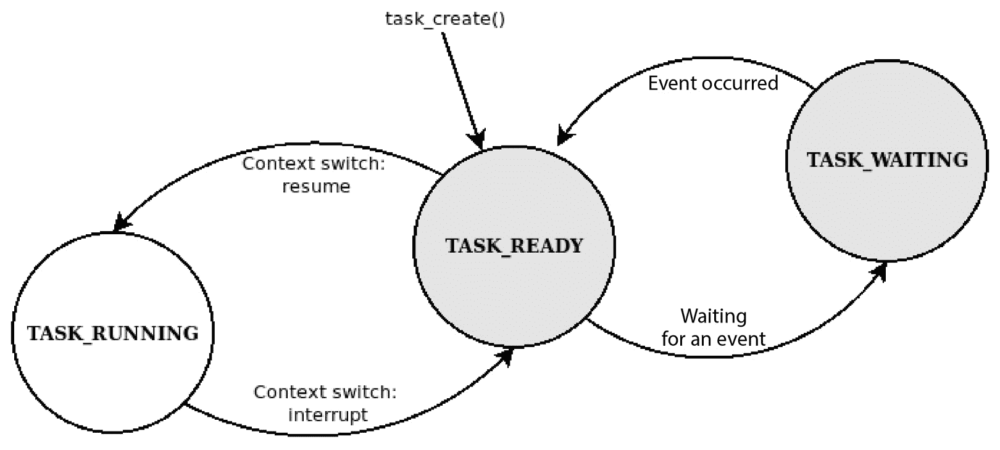

# 10

# 并行任务和调度

当系统的复杂性增加，软件需要同时管理多个外围设备和事件时，依赖操作系统来协调和同步所有不同的操作会更加方便。将应用程序逻辑分离到不同的线程中提供了一些重要的架构优势。每个组件在其运行单元内执行设计的操作，并且当它暂停或等待输入或超时事件时，它可以释放 CPU。

在本章中，将介绍实现多线程嵌入式操作系统的机制。这将通过开发针对参考平台定制的最小化操作系统来完成，并从头开始逐步编写，提供一个可运行的调度器以并行运行多个任务。

调度器的内部实现主要在系统服务调用中完成，其设计影响系统的性能和其他特性，例如实时相关任务的优先级水平和时间约束。在示例代码中，将解释和实现一些可能的调度策略，针对不同的上下文。

并行运行多个线程意味着资源可以被共享，并且存在对同一内存的并发访问的可能性。大多数设计用于运行多线程系统的微处理器提供原始函数，通过特定的汇编指令可访问，以实现如信号量之类的锁定机制。我们的示例操作系统公开了互斥锁和信号量原始函数，线程可以使用它们来控制对共享资源的访问。

通过引入内存保护机制，可以根据它们的地址提供资源分离，并让内核通过系统调用接口监督所有涉及硬件的操作。大多数实时嵌入式操作系统更喜欢无段化的扁平模型，以尽可能减小内核代码的大小，并使用最小化的 API 来优化应用程序可用的资源。示例内核将向我们展示如何创建系统调用 API 来集中控制资源，使用物理内存分段来保护内核、系统控制块、映射的外围设备和其他任务，以增加系统的安全性级别。

本章分为以下部分：

+   任务管理

+   调度器实现

+   同步

+   系统资源分离

到本章结束时，您将学会如何构建一个多线程嵌入式环境。

# 技术要求

您可以在 GitHub 上找到本章的代码文件，链接为[`github.com/PacktPublishing/Embedded-Systems-Architecture-Second-Edition/tree/main/Chapter10`](https://github.com/PacktPublishing/Embedded-Systems-Architecture-Second-Edition/tree/main/Chapter10)。

# 任务管理

操作系统通过交替运行并行应用程序来提供并行运行进程和线程的抽象。实际上，在单 CPU 系统中，一次只能有一个运行线程。当运行线程执行时，所有其他线程都在等待队列中，直到下一个任务切换。

在协作模型中，任务切换始终是线程实现请求的自愿行为。相反的方法，称为**抢占**，要求内核在任务的任何执行点定期中断任务，暂时保存状态并恢复下一个任务。

切换正在运行的任务包括将 CPU 寄存器的值存储在 RAM 中，并从内存中加载已选为运行的下个任务的值。这个操作更广为人知的是**上下文切换**，它是调度系统的核心。

## 任务块

在系统中，任务以任务块结构的形式表示。此对象包含调度器在所有时间跟踪任务状态所需的所有信息，并且依赖于调度器的设计。任务可能在编译时定义，在内核启动后启动，或者在系统运行时生成和终止。

每个任务块可能包含一个指向起始函数的指针，该函数定义了在任务生成时执行的代码的开始，以及一组可选参数。为每个任务分配内存作为其私有堆栈区域。这样，每个线程和进程的执行上下文就与其他所有上下文分离，当任务被中断时，寄存器的值可以存储在特定于任务的内存区域中。特定于任务的堆栈指针存储在任务块结构中，并在上下文切换时用于存储 CPU 寄存器的值。

使用单独的堆栈运行需要预先保留一些内存，并将其与每个任务关联。在最简单的情况下，所有使用相同大小堆栈的任务都在调度器启动之前创建，并且不能被终止。这样，已保留以与私有堆栈关联的内存可以连续，并关联到每个新任务。用于堆栈区域的内存区域可以在链接脚本中定义。

参考平台有一个独立的内核耦合内存，映射在`0x10000000`。在众多安排内存段的方法中，我们决定将用于将堆栈区域与线程关联的堆栈空间起始部分映射到 CCRAM 的开始处。剩余的 CCRAM 空间用作内核的堆栈，这样就将所有 SRAM（除了`.data`和`.bss`部分）留给了堆分配。指针通过链接脚本中的以下`PROVIDE`指令导出：

```cpp
PROVIDE(_end_stack = ORIGIN(CCRAM) + LENGTH(CCRAM));
PROVIDE(stack_space = ORIGIN(CCRAM));
PROVIDE(_start_heap = _end);
```

在内核源代码中，`stack_space`被声明为外部，因为它由链接脚本导出。我们还声明了为每个任务的执行堆栈保留的空间量（以四字节词表示）：

```cpp
extern uint32_t stack_space;
#define STACK_SIZE (256)
```

每次创建新任务时，堆栈空间中的下一个千字节被分配为其执行堆栈，初始堆栈指针被设置为该区域的最高地址，因为执行堆栈向后增长：


图 10.1 – 为任务提供单独执行堆栈所使用的内存配置

可以声明一个简单的任务块结构，如下所示：

```cpp
#define TASK_WAITING 0
#define TASK_READY 1
#define TASK_RUNNING 2
#define TASK_NAME_MAXLEN 16;
struct task_block {
  char name[TASK_NAME_MAXLEN];
  int id;
  int state;
  void (*start)(void *arg);
  void *arg;
  uint32_t *sp;
};
```

定义了一个全局数组来包含系统的所有任务块。我们必须使用全局索引来跟踪已创建的任务，以便我们可以使用相对于任务标识符和当前运行任务的 ID 在内存中的位置：

```cpp
#define MAX_TASKS 8
static struct task_block TASKS[MAX_TASKS];
static int n_tasks = 1;
static int running_task_id = 0;
#define kernel TASKS[0]
```

使用此模型，任务块在数据段中预先分配，字段就地初始化，并跟踪索引。数组的第一个元素是为内核的任务块保留的，它是当前正在运行的过程。

在我们的例子中，通过调用`task_create`函数并提供一个名称、入口点和其参数来创建任务。对于具有预定义任务数量的静态配置，这通常在内核初始化时完成，但更高级的调度器可能允许我们在调度器运行时分配新的控制块以在运行时生成新进程：

```cpp
struct task_block *task_create(char *name, void (*start)(void *arg), void *arg)
{
  struct task_block *t;
  int i;
  if (n_tasks >= MAX_TASKS)
    return NULL;
  t = &TASKS[n_tasks];
  t->id = n_tasks++;
  for (i = 0; i < TASK_NAME_MAXLEN; i++) {
    t->name[i] = name[i];
    if (name[i] == 0)
      break;
  }
  t->state = TASK_READY;
  t->start = start;
  t->arg = arg;
  t->sp = ((&stack_space) + n_tasks * STACK_SIZE);
  task_stack_init(t);
  return t;
}
```

要实现`task_stack_init`函数，该函数初始化进程开始运行时堆栈中的值，我们需要了解上下文切换的工作原理，以及当调度器运行时如何启动新任务。

## 上下文切换

上下文切换过程包括在执行期间获取 CPU 寄存器的值，并将它们保存在当前正在运行的任务的堆栈底部。然后，我们必须恢复下一个任务的值以恢复其执行。此操作必须在中断上下文中发生，其内部机制是 CPU 特定的。在参考平台上，任何中断处理程序都可以替换当前正在运行的任务并恢复另一个上下文，但这种操作更常在关联于系统事件的断电服务例程中完成。Cortex-M 提供了两个 CPU 异常，它们旨在为上下文切换提供基本支持，因为它们可以在任何上下文中任意触发：

+   **PendSV**：这是抢占式内核在设置系统控制块中特定寄存器的一个位后，强制在不久的将来发生中断的默认方式，它通常与下一个任务的上下文切换相关联。

+   **SVCall**：这是用户应用程序提交正式请求以访问由内核管理的资源的入口点。这个特性是为了提供一个 API 来安全地访问内核，请求从组件或驱动程序的操作。由于操作的结果可能不会立即可用，SVCall 还可以允许抢占调用任务以提供阻塞系统调用的抽象。

在上下文切换期间用于将 CPU 寄存器的值存储到或从内存中恢复的例程在 Cortex-M CPU 上部分由硬件实现。这意味着当进入中断时，寄存器的一部分副本会自动推送到堆栈中。堆栈中的寄存器副本称为 **堆栈帧**，包含 **R0** 到 **R3**、**R12**、**LR**、**PC** 和 **xPSR** 寄存器，顺序如下所示：



图 10.2 – 当进入中断处理程序时，寄存器会自动复制到堆栈中

然而，堆栈指针不包括 CPU 寄存器的另一半 – 即 R4 到 R11。因此，为了成功完成上下文切换，打算替换正在运行的进程的系统处理程序必须存储包含这些寄存器值的额外堆栈帧，并在从处理程序返回之前恢复下一个任务的额外堆栈帧。ARM Thumb-2 汇编提供了如何将连续 CPU 寄存器的值推送到堆栈并恢复到原位的指令。以下两个函数用于在堆栈中推入和弹出额外堆栈帧：

```cpp
static void __attribute__((naked)) store_context(void)
{
  asm volatile("mrs r0, msp");
  asm volatile("stmdb r0!, {r4-r11}");
  asm volatile("msr msp, r0");
  asm volatile("bx lr");
}
static void __attribute__((naked)) restore_context(void)
{
  asm volatile("mrs r0, msp");
  asm volatile("ldmfd r0!, {r4-r11}");
  asm volatile("msr msp, r0");
  asm volatile("bx lr");
}
```

`((naked))` 属性用于防止 GCC 将由几个汇编指令组成的序言和尾随序列放入编译代码中。序言会改变额外堆栈帧区域中的一些寄存器的值，这些值将在尾随中恢复，这与使用汇编指令访问寄存器值的函数的目的相冲突。由于缺少尾随，`naked` 函数通过跳转回调用指令（存储在 LR 寄存器中）来返回。

由于汇编 push 操作的结果，被抢占的进程的堆栈看起来是这样的：



图 10.3 – 剩余的寄存器值被复制到堆栈中以完成上下文切换

## 创建任务

当系统运行时，除了正在运行的进程外，所有任务都处于 *等待* 状态，这意味着完整的堆栈帧被保存在堆栈底部，堆栈指针被存储在控制块中以供调度器用于恢复每个进程。

新创建的任务将在上下文切换的中间醒来第一次。在那个时刻，预期任务将保留其 CPU 寄存器的先前状态，但显然，新任务没有这样的东西。在堆栈创建时，一个伪造的堆栈帧被推到堆栈的末尾，以便当任务恢复时，存储的值被复制到系统寄存器中，任务可以从其入口点恢复。

`task_create`函数依赖于一个堆栈初始化函数`task_stack_init`，该函数将系统寄存器的初始值推送到堆栈，以便任务可以恢复，并将存储的堆栈指针移动到额外帧的开始，该帧可以留作未初始化。为了方便访问堆栈帧中存储的寄存器，我们必须声明一个`stack_frame`结构，该结构使用一个字段对应一个寄存器，以及一个`extra_frame`结构，仅为了完整性：

```cpp
struct stack_frame {
  uint32_t r0, r1, r2, r3, r12, lr, pc, xpsr;
};
struct extra_frame {
  uint32_t r4, r5, r6, r7, r8, r9, r10, r11;
};
static void task_stack_init(struct task_block *t)
{
  struct stack_frame *tf;
  t->sp -= sizeof(struct stack_frame);
  tf = (struct stack_frame *)(t->sp);
  tf->r0 = (uint32_t) t->arg;
  tf->pc = (uint32_t) t->start;
  tf->lr = (uint32_t) task_terminated;
  tf->xpsr = (1 << 24);
  t->sp -= sizeof(struct extra_frame);
}
```

一旦上下文已恢复，异常处理程序返回过程会自动从我们正在构建的堆栈帧中恢复上下文。起始任务的寄存器初始化如下：

+   **程序计数器**（**PC**）包含起始函数的地址，系统将跳转到该地址以切换到该任务，这是第一次切换到该任务。

+   `task_create`。

+   **执行程序状态寄存器**（**xPSR**）必须编程为仅在位 24 处设置强制性的 Thumb 标志。

+   `task_terminated`函数只是一个无限循环，被视为系统错误。在其他情况下，如果允许任务终止，可以设置一个函数作为任务的通用退出点，以执行从起始函数返回所需的清理操作。

一旦创建了初始堆栈帧，任务就可以参与多任务，并且可以在任何时间被调度器选中以恢复执行，从与所有其他未运行任务相同的状态：



图 10.4 – 在不同执行状态下三个任务的栈指针

我们简单的内核主函数现在可以创建进程并准备堆栈，但尚未实际运行它们，直到我们实现了调度器的内部机制。在这种情况下，时间跟踪很有用，因此`SysTick`在启动时被启用以跟踪系统中的时间。内核的任务块被初始化，并创建了两个新任务：

```cpp
void main(void) {
  clock_pll_on(0);
  systick_enable();
  led_setup();
  kernel.name[0] = 0;
  kernel.id = 0;
  kernel.state = TASK_RUNNING;
  task_create("test0",task_test0, NULL);
  task_create("test1",task_test1, NULL);
  while(1) {
    schedule();
  }
}
```

创建的两个主要任务指向不同的起始函数，并且两者都将参数设置为`NULL`。这两个函数都不应该返回，并且可以根据实现的调度器策略被中断和恢复。

要从这一点继续，需要实现调度器的内部机制以启动和交替执行我们刚刚定义的并行任务。

# 调度器实现

系统的架构取决于调度器的实现方式。任务可以在协作模式下运行，直到它们自愿决定将 CPU 交由下一个任务，或者操作系统可以决定触发中断以在幕后交换正在运行的任务，并应用特定策略来决定任务切换之间的间隔以及选择下一个任务的优先级。在两种情况下，上下文切换都发生在可用的监督调用之一中，用于决定下一个要调度的任务，并执行上下文切换。在本节中，将通过 PendSV 添加完整的上下文切换过程到我们的示例中，然后分析并实现一些可能的调度策略。

## 监督调用

调度器的核心组件是与系统中断事件（如 PendSV 和 SVCall）关联的异常处理器。在 Cortex-M 上，可以通过设置 `PENDSET` 标志在任何时候由软件触发 PendSV 异常，对应于中断控制和状态寄存器的第 28 位，位于地址 `0xE000ED04` 的 SCB 中。定义了一个简单的宏来通过设置标志来启动上下文切换：

```cpp
#define SCB_ICSR (*((volatile uint32_t *)0xE000ED04))
#define schedule() SCB_ICSR |= (1 << 28)
```

来自内核的调度调用以及所有后续调用都将导致上下文切换，现在可以在 PendSV 处理器中实现。为了完成上下文切换，处理器必须执行以下步骤：

1.  将当前栈指针从 SP 寄存器存储到任务块中。

1.  通过调用 `store_context` 将额外的栈帧推入栈中。

1.  将当前任务的状态更改为 `TASK_READY`。

1.  选择一个新任务以恢复。

1.  将新任务的状态更改为 `TASK_RUNNING`。

1.  从关联的任务块中检索新的栈指针。

1.  通过调用 `restore_context` 从栈中弹出额外的栈帧。

1.  为中断处理器设置一个特殊的返回值，以在 PendSV 服务例程结束时激活线程模式。

`isr_pendsv` 函数必须是裸函数，因为它通过 `store` 和 `restore_context` 函数直接访问 CPU 寄存器：

```cpp
void __attribute__((naked)) isr_pendsv(void)
{
  store_context();
  asm volatile("mrs %0, msp" : "=r"(
          TASKS[running_task_id].sp));
  TASKS[running_task_id].state = TASK_READY;
  running_task_id++;
  if (running_task_id >= n_tasks)
    running_task_id = 0;
  TASKS[running_task_id].state = TASK_RUNNING;
  asm volatile("msr msp, %0"::"r"(
                 TASKS[running_task_id].sp));
  restore_context();
  asm volatile("mov lr, %0" ::"r"(0xFFFFFFF9));
  asm volatile("bx lr");
}
```

在返回之前加载到 LR 的值用于指示我们在中断结束时返回到线程模式。根据最后 3 位值的差异，服务例程通知 CPU 在从中断返回时使用哪个栈指针。在这种情况下使用的 `0xFFFFFFF9` 值对应于使用主栈指针的线程模式。在示例扩展以支持内核和进程之间具有单独栈指针时，将需要不同的值。

这样，完整的上下文已经在 PendSV 服务例程中实现，目前它只是选择下一个任务，并在数组中的最后一个任务之后执行具有 ID `0` 的内核。每当调用调度宏时，都会触发服务例程以处理模式运行。

## 协作调度器

可以定义不同的策略来交替系统中任务的执行。在最简单的情况下，每个任务通过调用调度宏自愿挂起其执行。

在这个示例实现中，定义了两个线程。它们都将打开一个 LED，并在关闭 LED 并显式调用`schedule()`函数以触发上下文切换之前，在忙循环中占用 CPU 1 秒钟：

```cpp
void task_test0(void *arg)
{
  uint32_t now = jiffies;
  blue_led_on();
  while(1) {
    if ((jiffies - now) > 1000) {
      blue_led_off();
      schedule();
      now = jiffies;
      blue_led_on();
    }
  }
}
void task_test1(void *arg)
{
  uint32_t now = jiffies;
  red_led_on();
  while(1) {
    if ((jiffies - now) > 1000) {
      red_led_off();
      schedule();
      now = jiffies;
      red_led_on();
    }
  }
}
```

这个小操作系统终于运行起来了，内核正在按顺序调度两个任务。具有 ID `0` 的任务在每个循环的开始时也会恢复，但在这种简单的情况下，内核任务只是在循环中调用调度，立即恢复 ID 为 `1` 的任务。这种设计下，系统的反应性完全取决于任务的实现，因为每个任务可以无限期地占用 CPU，从而阻止其他任务运行。协作模型仅在非常特定的场景中使用，其中每个任务直接负责调节其 CPU 周期并与其他线程协作，这可能会影响整个系统的响应性和公平性。

为了简化，这个实现没有考虑到`jiffies`变量的回绕。如果每毫秒增加一次，`jiffies`会在大约 42 天后溢出其最大值。与我们的简单示例不同，真正的操作系统必须实现一个适当的机制来比较时间变量，这里没有展示，该机制可以在计算时间差时检测到回绕。

## 并发和时间片

另一种方法是为每个任务分配短时间段的 CPU 时间，并在非常短的时间间隔内不断交换进程。抢占式调度器可以自主中断正在运行的任务，以恢复下一个任务，而无需任务本身的显式请求。它还可以强制执行其关于选择下一个要运行的任务以及 CPU 分配给每个任务的持续时间（即其时间片）的政策。

从任务的角度来看，执行现在可以连续进行，并且完全独立于调度器，调度器在幕后不断中断和恢复每个任务，给人一种所有任务都在同时运行的错觉。可以将线程重新定义为在两个不同的间隔闪烁 LED：

```cpp
void task_test0(void *arg)
{
  uint32_t now = jiffies;
  blue_led_on();
  while(1) {
    if ((jiffies - now) > 500) {
      blue_led_toggle();
      now = jiffies;
    }
  }
}
void task_test1(void *arg)
{
  uint32_t now = jiffies;
  red_led_on();
  while(1) {
    if ((jiffies - now) > 125) {
      red_led_toggle();
      now = jiffies;
    }
  }
}
```

为了以轮询方式交替任务，我们可以在 SysTick 处理程序内部触发 PendSV 的执行，这会导致在固定间隔发生任务切换。新的 SysTick 处理程序每`TIMESLICE`毫秒触发一次上下文切换：

```cpp
#define TIMESLICE (20)
void isr_systick(void)
{
  if ((++jiffies % TIMESLICE) == 0)
  schedule();
}
```

在这个新的配置中，我们现在有一个更完整的模型，允许多个任务独立运行，并且调度完全由内核监督。

## 阻塞任务

我们迄今为止实现的简单调度器只为任务提供了两种状态：`TASK_READY`和`TASK_RUNNING`。可以实施第三个状态来定义一个不需要恢复的任务，因为它已被阻塞并正在等待事件或超时。任务可以等待某种类型的系统事件，如下所示：

+   来自正在使用的**输入/输出**（**I/O**）设备的中断事件

+   来自另一个任务的通信，例如 TCP/IP 堆栈

+   同步机制，如互斥锁或信号量，用于访问系统中当前不可用的共享资源

+   超时事件

为了管理不同的状态，调度器可以实施两个或更多列表来区分当前正在运行或准备运行的任务与等待事件的那些任务。然后，调度器从`TASK_READY`状态的那些任务中选择下一个任务，并忽略列表中阻塞的任务：



图 10.5 – 描述任务执行状态的有限状态机

这个调度器的第二个版本使用全局指针跟踪当前正在运行的任务，而不是数组的索引，并将任务组织成两个列表：

+   `tasklist_active`：这包含正在运行的任务的任务块以及所有处于`TASK_READY`状态的等待调度任务

+   `tasklist_waiting`：这包含当前阻塞的任务的任务块

对于这种新机制，最容易实现的展示是`sleep_ms`函数，它可以由任务用来临时切换到等待状态并在未来设置一个恢复点以便再次调度。提供这种设施允许我们的任务在 LED 切换动作之间休眠，而不是运行一个忙等待循环，反复检查计时器是否已过期。这些新任务不仅更高效，因为它们不会在忙等待循环中浪费 CPU 周期，而且也更易于阅读：

```cpp
void task_test0(void *arg){
  blue_led_on();
  while(1) {
    sleep_ms(500);
    blue_led_toggle();
  }
}
void task_test1(void *arg)
{
  red_led_on();
  while(1) {
    sleep_ms(125);
    red_led_toggle();
  }
}
```

为了将任务块排列成列表，必须在结构中添加一个指向下一个元素的指针，以便在运行时填充两个列表。为了管理`sleep_ms`函数，必须添加一个新的字段来跟踪任务应该被放入活动列表以恢复时的时间系统：

```cpp
struct task_block {
  char name[TASK_NAME_MAXLEN];
  int id;
  int state;
  void (*start)(void *arg);
  void *arg;
  uint8_t *sp;
  uint32_t wakeup_time;
  struct task_block *next;
};
```

这些列表可以用两个简单的函数来管理，用于插入/删除元素：

```cpp
struct task_block *tasklist_active = NULL;
struct task_block *tasklist_waiting = NULL;
static void tasklist_add(struct task_block **list,struct task_block *el)
{
  el->next = *list;
  *list = el;
}
static int tasklist_del(struct task_block **list, struct task_block *delme)
{
  struct task_block *t = *list;
  struct task_block *p = NULL;
  while (t) {
    if (t == delme) {
      if (p == NULL)
        *list = t->next;
      else
        p->next = t->next;
      return 0;
    }
    p = t;
    t = t->next;
  }
  return -1;
}
```

必须添加两个额外的函数来将任务从活动列表移动到等待列表，反之亦然，这还会改变任务本身的状态：

```cpp
static void task_waiting(struct task_block *t)
{
  if (tasklist_del(&tasklist_active, t) == 0) {
    tasklist_add(&tasklist_waiting, t);
    t->state = TASK_WAITING;
  }
}
static void task_ready(struct task_block *t)
{
  if (tasklist_del(&tasklist_waiting, t) == 0) {
    tasklist_add(&tasklist_active, t);
    t->state = TASK_READY;
  }
}
```

`sleep_ms`函数设置恢复时间并将任务移动到等待状态，然后激活调度器以使任务被抢占：

```cpp
void sleep_ms(int ms)
{
  if (ms < TASK_TIMESLICE)
    return;
  t_cur->wakeup_time = jiffies + ms;
  task_waiting(t_cur);
  schedule();
}
```

新的 PendSV 处理器从活动列表中选择下一个要运行的任务，假设该列表始终至少包含一个任务，因为内核主任务永远不会被置于等待状态。新线程通过 `tasklist_next_ready` 函数选择，该函数还确保如果当前任务已从活动列表中移除，或者处于队列末尾，则选择活动列表的头部作为下一个时间片：

```cpp
static inline struct task_block *tasklist_next_ready(struct task_block *t)
{
  if ((t->next == NULL) || (t->next->state != TASK_READY))
    return tasklist_active;
  return t->next;
}
```

这个小型函数是新基于双列表调度器的核心，在每个上下文切换的中间调用以选择 PendSV 中的下一个活动任务：

```cpp
void __attribute__((naked)) isr_pendsv(void)
{
  store_context();
  asm volatile("mrs %0, msp" : "=r"(t_cur->sp));
  if (t_cur->state == TASK_RUNNING) {
    t_cur->state = TASK_READY;
  }
  t_cur = tasklist_next_ready(t_cur);
  t_cur->state = TASK_RUNNING;
  asm volatile("msr msp, %0" ::"r"(t_cur->sp));
  restore_context();
  asm volatile("mov lr, %0" ::"r"(0xFFFFFFF9));
  asm volatile("bx lr");
}
```

最后，为了检查每个休眠任务的唤醒时间，内核遍历等待任务列表，并在唤醒时间到达时将任务块移回活动列表。内核初始化现在包括一些额外的步骤，以确保内核任务本身在启动时被放入运行任务列表中：

```cpp
void main(void) {
  clock_pll_on(0);
  led_setup();
  button_setup();
  systick_enable();
  kernel.name[0] = 0;
  kernel.id = 0;
  kernel.state = TASK_RUNNING;
  kernel.wakeup_time = 0;
  tasklist_add(&tasklist_active, &kernel);
  task_create("test0",task_test0, NULL);
  task_create("test1",task_test1, NULL);
  task_create("test2",task_test2, NULL);
  while(1) {
    struct task_block *t = tasklist_waiting;
    while (t) {
      if (t->wakeup_time && (t->wakeup_time < jiffies)) {
        t->wakeup_time = 0;
        task_ready(t);
      }
      t = t->next;
    }
    WFI();
  }
}
```

## 等待资源

在给定时间间隔内阻塞只是任务暂时从活动列表中排除的一种可能性。内核可能实现其他事件和中断处理程序，以便将任务带回到调度循环中，从而使任务可以阻塞，在 `TASK_WAITING` 状态下等待来自特定资源集的 I/O 事件。

在我们的示例代码中，可以实现一个读取函数来从任务中检索按钮的状态，该任务会阻塞，直到按钮被按下才返回。在此期间，调用任务保持在等待列表中，并且永远不会被调度。每次按钮被按下时切换绿色 LED 的任务依赖于 `button_read()` 作为其阻塞点：

```cpp
#define BUTTON_DEBOUNCE_TIME 120
void task_test2(void *arg)
{
  uint32_t toggle_time = 0;
  green_led_off();
  while(1) {
    if (button_read()) {
      if((jiffies - toggle_time) > BUTTON_DEBOUNCE_TIME)
      {
        green_led_toggle();
        toggle_time = jiffies;
      }
    }
  }
}
```

`button_read` 函数跟踪调用任务，因此当按钮被按下时，使用 `button_task` 指针唤醒它。任务被移动到等待列表中，并在驱动程序中启动读取操作，然后任务被抢占：

```cpp
struct task_block *button_task = NULL;
int button_read(void)
{
  if (button_task)
    return 0;
  button_task = t_cur;
  task_waiting(t_cur);
  button_start_read();
  schedule();
  return 1;
}
```

为了在按钮按下时通知调度器，驱动程序使用一个回调，该回调由内核在初始化时指定，并将其作为参数传递给 `button_setup`：

```cpp
static void (*button_callback)(void) = NULL;
void button_setup(void (*callback)(void))
{
  AHB1_CLOCK_ER |= GPIOA_AHB1_CLOCK_ER;
  GPIOA_MODE &= ~ (0x03 << (BUTTON_PIN * 2));
  EXTI_CR0 &= ~EXTI_CR_EXTI0_MASK;
  button_callback = callback;
}
```

内核将 `button_wakeup` 函数与驱动程序回调相关联，以便当发生事件时，如果任务正在等待按钮按下通知，它将被移回活动任务列表，并在调度器选择它运行时立即恢复：

```cpp
void button_wakeup(void)
{
  if (button_task) {
    task_ready(button_task);
    button_task = NULL;
    schedule();
  }
}
```

在按钮驱动程序中，为了启动阻塞操作，启用中断并将其与信号的上升沿相关联，这对应于按钮按下事件：

```cpp
void button_start_read(void)
{
  EXTI_IMR |= (1 << BUTTON_PIN);
  EXTI_EMR |= (1 << BUTTON_PIN);
  EXTI_RTSR |= (1 << BUTTON_PIN);
  nvic_irq_enable(NVIC_EXTI0_IRQN);
}
```

当检测到事件时，回调函数在中断上下文中执行。中断被禁用，直到下一次调用 `button_start_read`：

```cpp
void isr_exti0(void)
{
  nvic_irq_disable(NVIC_EXTI0_IRQN);
  EXTI_PR |= (1 << BUTTON_PIN);
  if (button_callback)
    button_callback();
}
```

任何依赖中断处理来解锁相关任务的设备驱动程序或系统模块都可能使用回调机制与调度器交互。使用类似的阻塞策略，可以实施读写操作，以保持调用任务在等待列表中，直到检测到所需事件并处理调度器代码中的回调。

其他为裸机嵌入式应用设计的系统组件和库可能需要额外的层来通过阻塞调用集成到操作系统中。嵌入式 TCP/IP 堆栈实现，如 lwIP 和 picoTCP，提供了一个可移植的 RTOS 集成层，包括通过在专用任务中运行循环函数实现的阻塞套接字调用，该任务管理与其他任务中使用的套接字 API 的通信。预期将互斥锁和信号量等锁定机制实现为阻塞调用，当请求的资源不可用时，将挂起任务。

我们迄今为止实施的调度策略非常反应灵敏，在任务之间提供了完美的交互水平，但它没有预见优先级级别，这在设计实时系统时是必要的。

## 实时调度

实时操作系统的一个关键要求是能够通过在短时间内执行相关代码来对选定的几个事件做出反应。为了实现具有严格时间要求的特性，操作系统必须专注于快速中断处理和调度，而不是其他指标，如吞吐量或公平性。每个任务可能有特定的要求，例如*截止日期*，表示执行必须开始或停止的确切时间，或者与可能引入系统其他任务依赖的共享资源相关。一个能够以*确定性*时间要求执行任务的系统必须能够在可测量的固定时间内满足截止日期。

接近实时调度是一个复杂的问题。关于这个主题有权威的文献，因此这里不会对主题进行详细解释。研究表明，基于为每个任务分配的*优先级*的几种方法，结合在运行时切换任务的适当策略，可以提供足够的近似，以提供针对实时要求的通用解决方案。

为了支持具有确定截止日期的硬实时任务，操作系统应考虑实现以下特性：

+   在调度器中实现快速上下文切换过程

+   系统在禁用中断的情况下运行的可测量间隔

+   短中断处理程序

+   支持中断优先级

+   支持任务优先级以最小化硬实时任务的延迟

从任务调度的角度来看，实时任务的延迟主要与系统在外部事件发生时恢复任务的能力有关。

为了保证一组选定任务具有确定性的延迟，RTOS 通常实现固定优先级级别，这些级别在任务创建时分配，并在调度器监督调用每次执行时确定下一个任务的选择顺序。

应当在具有较高优先级的任务中实现时间关键操作。已经研究了多种调度策略，以优化实时任务的反应时间，同时保持系统响应，并允许与可能饥饿的较低优先级任务相关的问题。为特定场景找到最优的调度策略可能非常困难；关于确定性地计算实时系统延迟和抖动的细节超出了本书的范围。

提出的一种方法在实时操作系统（RTOS）中非常受欢迎。它通过在调度器监督调用每次调用时，从准备执行的任务中选择具有最高优先级的任务，为实时任务提供立即的上下文切换。这种称为**静态优先级驱动抢占式调度**的调度策略在所有情况下都不是最优的，因为任务的延迟取决于同一优先级级别的任务数量，并且没有预见任何机制来防止在系统负载较高的情况下，具有较低优先级的任务可能出现的饥饿问题。然而，该机制足够简单，可以轻松实现以展示优先级机制对实时任务延迟的影响。

另一种可能的方法是在运行时根据任务的特征动态重新分配优先级。实时调度器可能从一种确保首先选择最接近截止日期的任务的机制中受益。这种称为`SCHED_DEADLINE`调度器的做法，从 Linux 3.14 版本开始包含在内，是实现这种机制的实现，尽管实现起来相对简单，但在嵌入式操作系统中并不那么受欢迎。

此示例展示了静态优先级驱动调度器的简单实现。我们使用四个独立的列表来存储活动任务，每个列表对应于系统支持的每个优先级级别。每个任务在创建时都会分配一个优先级级别，内核的优先级保持在`0`，其主要任务仅在所有其他任务都处于睡眠状态时运行，其唯一目的是检查睡眠任务的计时器。当任务准备好时，可以将它们插入具有相应优先级级别的活动任务列表中，当它们被阻塞时，它们将被移动到等待列表中。为了跟踪任务的静态优先级，将优先级字段添加到任务块中：

```cpp
struct task_block {
  char name[TASK_NAME_MAXLEN];
  int id;
  int state;
  void (*start)(void *arg);
  void *arg;
  uint8_t *sp;
  uint32_t wakeup_time;
  uint8_t priority;
  struct task_block *next;
};
```

必须定义两个快捷函数来快速将任务块添加到具有相同优先级的任务列表中，并从中移除：

```cpp
static void tasklist_add_active(struct task_block *el)
{
  tasklist_add(&tasklist_active[el->priority], el);
}
static int tasklist_del_active(struct task_block *el)
{
  return tasklist_del(&tasklist_active[el->priority], el);
}
```

当任务被移除或插入到给定优先级的活动任务列表中时，它们可以用于新的`task_waiting`和`task_ready`函数版本：

```cpp
static void task_waiting(struct task_block *t)
{
  if (tasklist_del_active(t) == 0) {
    tasklist_add(&tasklist_waiting, t);
    t->state = TASK_WAITING;
  }
}
static void task_ready(struct task_block *t)
{
  if (tasklist_del(&tasklist_waiting, t) == 0) {
    tasklist_add_active(t);
    t->state = TASK_READY;
  }
}
```

在系统中创建了三个任务，但按钮按下事件会阻塞的那个任务具有更高的优先级级别：

```cpp
void main(void) {
  clock_pll_on(0);
  led_setup();
  button_setup(button_wakeup);
  systick_enable();
  kernel.name[0] = 0;
  kernel.id = 0;
  kernel.state = TASK_RUNNING;
  kernel.wakeup_time = 0;
  kernel.priority = 0;
  tasklist_add_active(&kernel);
  task_create("test0",task_test0, NULL, 1);
  task_create("test1",task_test1, NULL, 1);
  task_create("test2",task_test2, NULL, 3);
  while(1) {
    struct task_block *t = tasklist_waiting;
    while (t) {
      if (t->wakeup_time && (t->wakeup_time < jiffies)) {
        t->wakeup_time = 0;
        task_ready(t);
      }
      t = t->next;
    }
    WFI();
  }
}
```

选择下一个任务的功能被重新设计，以找到那些准备运行的任务中优先级最高的任务。为此，从最高优先级到最低优先级遍历优先级列表。如果最高优先级的列表与当前任务之一相同，则如果可能，选择同一级别的下一个任务，以确保在相同优先级级别内竞争 CPU 的任务之间有一个轮询机制。在其他任何情况下，选择最高优先级列表中的第一个任务：

```cpp
static int idx;
static inline struct task_block *
tasklist_next_ready(struct task_block *t)
{
 for (idx = MAX_PRIO - 1; idx >= 0; idx--) {
    if ((idx == t->priority) && (t->next != NULL) &&
        (t->next->state == TASK_READY))
      return t->next;
    if (tasklist_active[idx])
      return tasklist_active[idx];
  }
  return t;
}
```

与具有单个优先级级别的调度器相比，在处理 ID 等于`2`的任务的按钮按下事件时，主要区别在于按钮按下事件和任务本身的反应之间的时间间隔。这两个调度器都通过在按钮事件的中断处理程序中立即将任务放回就绪状态来实现抢占。

然而，在第一种情况下，任务会回到正在调度的任务轮询中，与其他相同优先级的任务竞争，这可能导致任务反应的延迟。在最坏的情况下，我们可以估计这将是*N* * `TIMESLICE`，其中*N*是中断发生时准备运行的过程数。

使用基于优先级的调度方法，在发生中断后，实时任务是第一个被调度的任务，这样从中断到恢复任务所需的时间是可测量的，大约是几微秒，因为 CPU 执行可预测数量的指令以执行所有中间操作。

实时嵌入式操作系统对于实现生命关键系统至关重要，主要是在交通和医疗行业。另一方面，它们依赖于简化的模型来尽可能保持基本系统操作轻量级，并具有最小的系统调用接口和系统 API 开销。相反的方法可能包括增加内核的复杂性，以引入吞吐量、任务交互、内存安全性改进和其他性能指标方面的优化，这可能更适合具有宽松或不存在实时要求的嵌入式系统。更严格的基于优先级的调度策略可以提高延迟并保证在受控场景中的实时响应，但在通用嵌入式系统中使用时不太灵活，在其他约束比任务延迟更有力的情况下，基于时间的抢占式调度方法可能提供更好的结果。

# 同步

在一个多线程环境中，内存、外设和系统访问是共享的，系统应提供同步机制，以允许任务在系统级可用资源的仲裁上协作。

互斥锁和信号量是并行线程之间最常用的同步机制，因为它们提供了解决大多数并发问题的最小集合。可能阻塞调用任务的函数必须能够与调度器交互，在资源不可用且锁未释放或信号量增加之前，将任务移动到等待状态。

## 信号量

信号量是最常见的同步原语，它提供了一个具有独占访问权限的计数器，并且被两个或更多线程用于在特定共享资源的仲裁上协作。提供给任务提供的 API 必须保证该对象可以用来实现一个具有独占访问权限的计数器，这通常需要在 CPU 上提供一些辅助功能。因此，同步策略的内部实现依赖于目标处理器中实现的微代码。

在 Cortex-M3/M4 上，锁定机制的实现依赖于 CPU 提供的执行独占操作的指令。参考平台的指令集提供了以下两个指令：

+   **加载寄存器独占**（**LDREX**）：从内存中的地址加载一个值到 CPU 寄存器中。

+   **存储寄存器独占**（**STREX**）：尝试将寄存器中包含的新值存储在内存中的地址，该地址对应于最后一个 LDREX 指令。如果 STREX 成功，CPU 保证内存中的值写入是独占的，并且自上次 LDREX 调用以来该值没有被修改。在两个并发 LDREX/STREX 部分之间，只有一个将导致寄存器成功写入；第二个 STREX 指令将失败，返回零。

这些指令的特性保证了独占访问一个计数器，然后用于实现信号量和互斥锁的基本功能。

`sem_trywait`函数尝试减少信号量的值。除非信号量的值为`0`，否则操作总是允许的，这将导致立即失败。函数在成功时返回`0`，如果信号量值为零，则返回`-1`，此时不可能减少信号量的值。

`sem_trywait`事件序列如下：

1.  信号量变量的值（一个通过独占加载和存储指令访问的整数）从函数参数指向的内存中读取到寄存器 R1 中。

1.  如果 R1 的值为`0`，则信号量无法获取，函数返回`-1`。

1.  R1 的值减一。

1.  R1 的值存储在由函数参数指向的内存中，STREX 操作的结果放入 R2。

1.  如果操作成功，R2 包含 `0`，信号量被获取并成功递减，函数可以返回成功状态。

1.  如果存储操作失败（尝试并发访问），则立即重复该过程进行第二次尝试。

以下汇编例程实现了所有步骤，成功时返回 `0`，递减失败时返回 `-1`：

```cpp
sem_trywait:
  LDREX r1, [r0]
  CMP r1, #0
  BEQ sem_trywait_fail
  SUBS r1, #1
  STREX r2, r1, [r0]
  CMP r2, #0
  BNE sem_trywait
  DMB
  MOVS r0, #0
  BX lr
sem_trywait_fail:
  DMB
  MOV r0, #-1
  BX lr
```

以下代码是增加信号量的相应函数，它与等待例程类似，除了计数信号量被增加，并且操作最终将成功，即使多个任务同时尝试访问信号量。函数在成功时返回 `0`，除非计数器之前的值是零，在这种情况下它返回 `1`，以提醒调用者通知任何处于等待状态下的监听者值已增加，相关资源现在可用：

```cpp
.global sem_dopost
sem_dopost:
  LDREX r1, [r0]
  ADDS r1, #1
  STREX r2, r1, [r0]
  CMP r2, #0
  BNE sem_dopost
  CMP r0, #1
  DMB
  BGE sem_signal_up
  MOVS r0, #0
  BX lr
sem_signal_up:
  MOVS r0, #1
  BX lr
```

为了将 `sem_wait` 函数的阻塞状态集成到调度器中，操作系统对任务公开的信号量接口将非阻塞的 `sem_trywait` 调用包装成其阻塞版本，当信号量的值为零时，该任务将被阻塞。

为了实现信号量接口的阻塞版本，`semaphore` 对象可能跟踪访问资源并等待后置事件的任务。在这种情况下，任务的标识符存储在名为 `listeners` 的数组中：

```cpp
#define MAX_LISTENERS 4
struct semaphore {
  uint32_t value;
  uint8_t listeners[MAX_LISTENERS];
};
typedef struct semaphore semaphore;
```

当等待操作失败时，任务将被阻塞，并且只有在另一个任务成功执行后置操作后才会再次尝试。任务标识符被添加到该资源的监听者数组中：

```cpp
int sem_wait(semaphore *s)
{
  int i;
  if (s == NULL)
    return -1;
  if (sem_trywait(s) == 0)
    return 0;
  for (i = 0; i < MAX_LISTENERS; i++) {
    if (!s->listeners[i])
      s->listeners[i] = t_cur->id;
    if (s->listeners[i] == t_cur->id)
      break;
  }
  task_waiting(t_cur);
  schedule();
  return sem_wait(s);}
```

汇编例程 `sem_dopost` 如果后置操作触发了从零到一的增量，则返回正值，这意味着如果存在监听者，它们必须恢复以尝试获取刚刚变得可用的资源。

## 互斥锁

`1` 允许第一个锁定操作。

由于信号量的性质，在值达到 `0` 之后尝试递减其计数器将失败，因此我们快速实现的互斥锁接口将信号量原语 `sem_wait` 和 `sem_post` 分别重命名为 `mutex_lock` 和 `mutex_unlock`。

两个任务可以同时尝试递减未上锁的互斥锁，但只有一个会成功；另一个将失败。在示例调度器的互斥锁的阻塞版本中，基于信号量函数构建的互斥锁 API 包装器如下：

```cpp
typedef semaphore mutex;
#define mutex_init(m) sem_init(m, 1)
#define mutex_trylock(m) sem_trywait(m)
#define mutex_lock(x) sem_wait(x)
#define mutex_unlock(x) sem_post(x)
```

对于信号量和互斥锁，到目前为止编写的示例操作系统为与调度器集成的同步机制提供了一个完整的 API。

## 优先级反转

在使用基于抢占和优先级的调度器以及集成同步机制开发操作系统时，经常会遇到优先级反转现象。这种情况会影响与其他低优先级任务共享资源的实时任务的反应时间，在某些情况下，可能会导致高优先级任务因不可预测的时间而饥饿。当高优先级任务等待低优先级任务释放资源时，这一事件发生，而此时低优先级任务可能被系统中的其他无关任务抢占。

特别是，可能触发此现象的事件序列如下：

1.  T1、T2 和 T3 是三个正在运行的任务，分别具有 1、2 和 3 的优先级。

1.  T1 使用资源*X*上的互斥锁获取锁。

1.  T1 被优先级更高的 T3 抢占。

1.  T3 试图访问共享资源*X*，并在互斥锁上阻塞。

1.  T1 在临界区恢复执行。

1.  T1 被优先级更高的 T2 抢占。

1.  在 T1 释放锁并唤醒 T3 之前，任意数量的优先级大于 1 的任务可以中断 T1 的执行。

避免这种情况的一种可能机制称为**优先级继承**。该机制包括临时将共享资源的任务的优先级提高到所有访问该资源的任务的最高优先级。这样，低优先级任务不会导致高优先级任务的调度延迟，并且实时需求仍然得到满足。

# 系统资源分离

我们在本章中构建的示例操作系统已经具有许多有趣的功能，但它仍然具有扁平模型的特点，没有内存分段或权限分离。简约系统不提供任何机制来分离系统资源并规范对内存空间的访问。相反，系统中的任务被允许执行任何特权操作，包括读取和修改其他任务的内存，在内核地址空间中执行操作，以及在运行时直接访问外围设备和 CPU 寄存器。

目标平台上有不同的方法，旨在通过在内核中引入有限数量的修改来提高系统的安全性：

+   实施内核/进程权限分离

+   在调度器中集成内存保护

+   通过监督调用提供系统调用接口以访问资源

让我们详细讨论每个方法。

## 权限级别

Cortex-M CPU 设计为以两种不同的特权级别运行代码。当在系统上运行不受信任的应用程序代码时，特权分离非常重要，允许内核始终保持对执行的掌控，并防止由于用户线程的不当行为而导致系统故障。启动时的默认执行级别是特权级别，以允许内核启动。应用程序可以配置为在用户级别执行，并在上下文切换操作期间使用不同的栈指针寄存器。

特权级别的更改只能在异常处理程序期间进行，并且是通过使用特殊的异常返回值来完成的，该值在从执行上下文切换的异常处理程序返回之前存储在 LR 中。控制特权级别的标志是 `CONTROL` 寄存器的最低位，可以在返回异常处理程序之前在上下文切换期间更改，以将应用程序线程降级到用户特权级别运行。

此外，大多数 Cortex-M CPU 提供了两个独立的栈指针 CPU 寄存器：

+   **主栈指针**（**MSP**）

+   **进程栈指针**（**PSP**）

遵循 ARM 的推荐，操作系统必须使用 PSP 来执行用户线程，而 MSP 则由中断处理程序和内核使用。栈的选择取决于异常处理程序结束时的特殊返回值。我们迄今为止实现的调度器将此值硬编码为 `0xFFFFFFF9`，用于在中断后以线程模式返回，并保持以特权级别执行代码。从中断处理程序返回 `0xFFFFFFFD` 值会告诉 CPU 在返回线程模式时选择 PSP 作为栈指针寄存器。

为了正确实现特权分离，用于切换任务的 PendSV 处理程序必须修改为使用被抢占任务的正确栈指针来保存和恢复上下文。我们迄今为止使用的 `store_context` 和 `restore_context` 函数分别重命名为 `store_kernel_context` 和 `restore_kernel_context`，因为内核仍在使用主栈指针。还添加了两个新函数，用于从新的上下文切换例程中存储和恢复线程上下文，该例程使用 PSP 寄存器，用于存储和恢复线程的上下文：

```cpp
static void __attribute__((naked)) store_user_context(void)
{
  asm volatile("mrs r0, psp");
  asm volatile("stmdb r0!, {r4-r11}");
  asm volatile("msr psp, r0");
  asm volatile("bx lr");
}
static void __attribute__((naked)) restore_user_context(void)
{
  asm volatile("mrs r0, psp");
  asm volatile("ldmfd r0!, {r4-r11}");
  asm volatile("msr psp, r0");
  asm volatile("bx lr");
}
```

在调度器的安全版本中，PendSV 服务例程选择正确的栈指针来存储和恢复上下文，并调用相关的例程。根据新的上下文，存储在 LR 中的返回值用于选择用作新栈指针的寄存器，并将特权级别设置在 `CONTROL` 寄存器中，以便在即将到来的线程模式中使用 `1` 或 `0` 的值分别切换到用户或特权级别：

```cpp
void __attribute__((naked)) isr_pendsv(void)
{
  if (t_cur->id == 0) {
    store_kernel_context();
    asm volatile("mrs %0, msp" : "=r"(t_cur->sp));
  } else {
    store_user_context();
    asm volatile("mrs %0, psp" : "=r"(t_cur->sp));
  }
  if (t_cur->state == TASK_RUNNING) {
    t_cur->state = TASK_READY;
  }
  t_cur = tasklist_next_ready(t_cur);
  t_cur->state = TASK_RUNNING;
  if (t_cur->id == 0) {
    asm volatile("msr msp, %0" ::"r"(t_cur->sp));
    restore_kernel_context();
    asm volatile("mov lr, %0" ::"r"(0xFFFFFFF9));
    asm volatile("msr CONTROL, %0" ::"r"(0x00));
  } else {
    asm volatile("msr psp, %0" ::"r"(t_cur->sp));
    restore_user_context();
    asm volatile("mov lr, %0" ::"r"(0xFFFFFFFD));
    asm volatile("msr CONTROL, %0" ::"r"(0x01));
  }
  asm volatile("bx lr");
}
```

在`CONTROL`寄存器中设置特权模式位运行的任务对系统的资源访问有限制。特别是，线程无法访问 SCB 区域中的寄存器，这意味着一些基本操作，例如通过 NVIC 启用和禁用中断，仅限于内核的专用使用。当与 MPU 结合使用时，通过在访问级别实施内存分离，特权分离可以进一步提高系统的安全性，从而检测并中断行为不当的应用程序代码。

## 内存分段

动态内存分段策略可以集成到调度器中，以确保单个任务不会访问与系统关键组件关联的内存区域，并且需要内核监督的资源可以从用户空间访问。

在*第五章* *内存管理*中，我们看到了如何使用 MPU 来界定连续的内存段，并禁止系统上运行的任何代码访问特定区域。MPU 控制器提供了一个权限掩码，以更细粒度地更改单个内存区域的属性。特别是，只有当 CPU 在特权级别运行时，我们才允许访问某些区域，这是一种有效的方法，可以防止用户应用程序在没有内核监督的情况下访问系统的某些区域。一个安全的操作系统可能会决定完全排除应用程序任务访问外围区域和系统寄存器，为此可以使用仅内核权限标志对这些区域进行设置。与 MPU 区域属性寄存器中特定权限相关联的值可以定义如下：

```cpp
#define RASR_KERNEL_RW (1 << 24)
#define RASR_KERNEL_RO (5 << 24)
#define RASR_RDONLY (6 << 24)
#define RASR_NOACCESS (0 << 24)
#define RASR_USER_RW (3 << 24)
#define RASR_USER_RO (2 << 24)
```

MPU 配置可以在引导时由内核强制执行。在这个例子中，我们将闪存区域设置为全局可读，作为区域`0`，使用`RASR_RDONLY`，并将 SRAM 区域设置为全局可访问，作为区域`1`，映射到地址`0x20000000`：

```cpp
int mpu_enable(void)
{
  volatile uint32_t type;
  volatile uint32_t start;
  volatile uint32_t attr;
  type = MPU_TYPE;
  if (type == 0)
    return -1;
  MPU_CTRL = 0;
  start = 0;
  attr = RASR_ENABLED | MPUSIZE_256K | RASR_SCB | 
         RASR_RDONLY;
  mpu_set_region(0, start, attr);
  start = 0x20000000;
  attr = RASR_ENABLED | MPUSIZE_128K | RASR_SCB |         RASR_USER_RW | RASR_NOEXEC;
  mpu_set_region(1, start, attr);
```

更严格的策略甚至可以限制非特权模式下用户任务对 SRAM 的使用，但这需要对任务启动时映射的`.data`和`.bss`区域进行重新组织。在这个例子中，我们只是演示了如何将每个任务的内存保护策略集成到调度器中，以防止访问系统资源并保护其他任务的堆栈区域。CCRAM 是我们想要保护的区域，因为它包含内核的执行堆栈，以及系统中其他任务的堆栈。为此，CCRAM 区域必须标记为仅对内核专有的访问权限，作为区域`2`。随后，在上下文切换期间必须为选定的任务创建一个异常，以允许访问其自己的堆栈空间：

```cpp
  start = 0x10000000;
  attr = RASR_ENABLED | MPUSIZE_64K | RASR_SCB |
         RASR_KERNEL_RW | RASR_NOEXEC;
  mpu_set_region(2, start, attr);
```

外围区域和系统寄存器是我们系统中的受限区域，因此在运行时它们也被标记为仅限内核访问。在我们的安全操作系统设计中，想要访问外围设备的任务必须使用系统调用来执行受监督的特权操作：

```cpp
  start = 0x40000000;
  attr = RASR_ENABLED | MPUSIZE_1G | RASR_SB |
         RASR_KERNEL_RW | RASR_NOEXEC;
  mpu_set_region(4, start, attr);
  start = 0xE0000000;
  attr = RASR_ENABLED | MPUSIZE_256M | RASR_SB |
         RASR_KERNEL_RW | RASR_NOEXEC;
  mpu_set_region(5, start, attr);
  SHCSR |= MEMFAULT_ENABLE;
  MPU_CTRL = 1;
  return 0;
}
```

在上下文切换期间，在从`isr_pendsv`服务例程返回之前，调度器可以调用我们自定义 MPU 模块导出的函数，以临时允许以非特权模式访问下一个要运行的任务的堆栈区域：

```cpp
void mpu_task_stack_permit(void *start)
{
  uint32_t attr = RASR_ENABLED | MPUSIZE_1K |
           RASR_SCB | RASR_USER_RW;
  MPU_CTRL = 0;
  DMB();
  mpu_set_region(3, (uint32_t)start, attr);
  MPU_CTRL = 1;
}
```

这些进一步的限制限制了当前实现的任务直接访问任何资源的可能性。为了保持与之前相同的功能，示例系统现在必须导出一个新的安全 API，以便任务请求系统操作。

## 系统调用

本章中我们实现的示例操作系统的最新版本不再允许我们的任务控制系统资源，例如输入输出外围设备，甚至不允许任务自愿阻塞，因为`sleep_ms`函数不允许设置挂起标志以启动上下文切换。

操作系统导出一个 API，任务可以通过系统调用机制通过 SVCall 异常访问该 API，该异常由`isr_svc`服务例程处理，并且可以在任何时间通过`svc`指令从任务触发。

在这个简单的示例中，我们使用`svc 0`汇编指令通过定义快捷宏`SVC()`来切换到处理程序模式：

```cpp
#define SVC() asm volatile ("svc 0")
```

我们将这个指令封装在一个 C 函数中，以便我们可以向它传递参数。平台提供的 ABI 在模式切换过程中通过 R0-R3 寄存器传递调用参数的前四个参数。我们的示例 API 不允许我们将任何参数传递给系统调用，而是使用 R0 中的第一个参数来识别从应用程序传递到内核的请求：

```cpp
static int syscall(int arg0)
{
  SVC();
}
```

这样，我们为这个操作系统实现了整个系统调用接口，该接口由以下无参数的系统调用组成。每个系统调用都有一个关联的识别号，通过`arg0`传递。系统调用列表是任务和内核之间接口的契约，也是任务使用系统保护资源的唯一方式：

```cpp
#define SYS_SCHEDULE 0
#define SYS_BUTTON_READ 1
#define SYS_BLUELED_ON 2
#define SYS_BLUELED_OFF 3
#define SYS_BLUELED_TOGGLE 4
#define SYS_REDLED_ON 5
#define SYS_REDLED_OFF 6
#define SYS_REDLED_TOGGLE 7
#define SYS_GREENLED_ON 8
#define SYS_GREENLED_OFF 9
#define SYS_GREENLED_TOGGLE 10
```

这些系统调用必须在`isr_svc`中处理。通过调用处理程序上下文中的驱动程序函数来控制外围设备和系统阻塞寄存器是可以完成的，即使在这里这样做只是为了简洁。在适当的设计中，需要多个指令才能完成的操作应该推迟到内核任务下次调度时运行。以下代码仅用于展示一个可能的`isr_svc`实现，该实现响应系统 API 允许的用户请求，以控制板上的 LED 和按钮，同时提供一个可以扩展以实现阻塞系统调用的机制。

`svc`服务例程执行由处理程序本身传递的请求命令。如果系统调用是阻塞的，例如`SYS_SCHEDULE`系统调用，则处理程序内会选择一个新的任务以完成任务切换。

`svc`例程现在可以处理内部命令，如下面的示例处理函数所示：

```cpp
void __attribute__((naked)) isr_svc(int arg)
{
   store_user_context();
   asm volatile("mrs %0, psp" : "=r"(t_cur->sp));
   if (t_cur->state == TASK_RUNNING) {
       t_cur->state = TASK_READY;
   }
   switch(arg) {
    case SYS_BUTTON_READ: /* cmd to read button value */
       button_start_read();
       break;
    case SYS_SCHEDULE: /* cmd to schedule the next task */
       t_cur = tasklist_next_ready(t_cur);
       t_cur->state = TASK_RUNNING;
       break;
    case SYS_BLUELED_ON: /* cmd to turn on blue LED */
       blue_led_on();
       break;
    /* case ... (more LED related cmds follow) */
}
```

与`PendSV`中一样，在例程结束时恢复上下文，尽管这是可选的，但如果调用必须阻塞，则可能会发生任务切换：

```cpp
   if (t_cur->id == 0) {
       asm volatile("msr msp, %0" ::"r"(t_cur->sp));
       restore_kernel_context();
       asm volatile("mov lr, %0" ::"r"(0xFFFFFFF9));
       asm volatile("msr CONTROL, %0" ::"r"(0x00));
   } else {
       asm volatile("msr psp, %0" ::"r"(t_cur->sp));
       restore_user_context();
       mpu_task_stack_permit(((uint8_t *)((&stack_space))
            +(t_cur->id << 10)));            asm volatile("mov lr, %0" ::"r"(0xFFFFFFFD));
       asm volatile("msr CONTROL, %0" ::"r"(0x01));
   }
   asm volatile("bx lr");}
```

虽然功能有限，但新系统导出所有必要的 API，以便我们的应用程序线程在从任务代码中移除所有禁止的特权调用并调用新创建的系统调用后再次运行：

```cpp
void task_test0(void *arg)
{
  while(1) {
    syscall(SYS_BLUELED_ON);
    mutex_lock(&m);
    sleep_ms(500);
    syscall(SYS_BLUELED_OFF);
    mutex_unlock(&m);
    sleep_ms(1000);
  }
}
void task_test1(void *arg)
{
  syscall(SYS_REDLED_ON);
  while(1) {
    sleep_ms(50);
    mutex_lock(&m);
    syscall(SYS_REDLED_TOGGLE);
    mutex_unlock(&m);
  }
}
void task_test2(void *arg)
{
  uint32_t toggle_time = 0;
  syscall(SYS_GREENLED_OFF);
  while(1) {
    button_read();
    if ((jiffies - toggle_time) > 120) {
      syscall(SYS_GREENLED_TOGGLE);
      toggle_time = jiffies;
    }
  }
}
```

如果安全操作系统在内核空间中实现所有操作并必须提供所有允许的系统调用的实现，其代码大小可能会迅速增长。另一方面，它为任务之间提供了物理内存分离，并保护系统资源和其他内存区域免受应用程序代码中意外错误的影响。

# 嵌入式操作系统

如本章前几节所示，从头开始构建针对定制解决方案的调度器并非不可能，如果做得恰当，将提供与所需架构最接近的近似，并专注于目标硬件提供的特定特性。然而，在现实场景中，建议考虑许多可用的嵌入式操作系统选项之一，这些选项已准备好集成到架构中，并支持所选硬件平台，同时提供本章中我们了解到的功能。

许多适用于微控制器的内核实现都是开源的，并且处于良好的开发状态，因此它们在嵌入式市场中的既定角色是当之无愧的。其中一些足够流行且经过广泛测试，可以为构建可靠的嵌入式多任务应用程序提供基础。

## 操作系统选择

选择最适合开发目的和开发平台操作系统的任务是一项微妙的工作，它会影响整体架构，可能对整个开发模型产生影响，并可能在应用程序代码库中引入 API 锁定。选择标准根据硬件特性、与其他组件（如第三方库）的集成、提供与外围设备和接口交互的设施以及最重要的是，系统设计旨在覆盖的使用案例范围而有所不同。

除了调度器和内存管理之外，操作系统通常还包括一系列集成库、模块和工具。根据目的，嵌入式操作系统可能提供一套覆盖多个领域的套件，包括以下内容：

+   平台特定的硬件抽象层

+   常见外设的设备驱动程序

+   TCP/IP 堆栈集成以实现连接性

+   文件系统和文件抽象

+   集成电源管理系统

根据调度器中线程模型的实现，一些系统可能会以预定义的任务数量运行，这些任务在编译时配置，而其他系统则选择更复杂的进程和线程层次结构，允许我们在运行时创建新的线程，并在执行过程中的任何时刻终止它们。然而，在嵌入式系统中，动态任务创建和终止很少是必需的，在这些情况下，替代的设计可能有助于我们绕过这一限制。

更复杂的系统由于系统异常代码中的额外逻辑而引入了一些开销，并且不太适合关键实时操作，这也是为什么如今大多数成功的实时操作系统（RTOS）都保持其简单的架构，提供运行多个线程所需的最基本功能，采用易于管理的平坦内存模式，并且不需要额外的上下文切换来管理操作权限，以保持低延迟并符合实时要求。

由于可用的选项众多，以及随着技术进步的持续发展，提供嵌入式设备的操作系统的详尽列表超出了本书的范围。与 PC 领域不同，那里只有少数几个操作系统主导整个市场，而嵌入式操作系统在设计和 API、驱动程序、支持的硬件以及构建工具等方面都彼此非常不同。

在本章的最后部分，我们将通过比较并行任务执行、内存管理和可用辅助功能的设计选择，来探讨两种最流行的嵌入式设备开源操作系统：FreeRTOS 和 Riot OS。

## FreeRTOS

在撰写本文时，FreeRTOS 可能是嵌入式设备开源操作系统中最受欢迎的，其活跃开发已接近 20 年，FreeRTOS 在许多嵌入式平台上具有极高的可移植性，拥有数十个可用的硬件端口，并支持大多数，如果不是所有嵌入式 CPU 架构。

该系统在设计时考虑到代码占用小和接口简单，不提供完整的驱动程序平台或高级 CPU 特定功能，而是专注于两个方面：线程的实时调度和堆内存管理。其设计的简单性使其能够移植到大量平台上，并使开发重点集中在少量经过充分测试和可靠的操作上。

另一方面，硬件制造商提供的第三方库和示例代码通常将 FreeRTOS 集成到他们的软件套件中，大多数情况下作为测试应用程序和示例中裸机方法的唯一替代方案。由于第三方代码不是直接包含在 FreeRTOS 中，这促进了不同解决方案之间的竞争，例如，它可以与许多 TCP/IP 堆栈实现集成以提供网络支持，尽管它们都不是核心系统的一部分或与内核紧密集成。设备驱动程序不包括在内核中，但有一些基于 FreeRTOS 与板级支持包集成的完整系统演示，这些板级支持包由制造商分发或作为更广泛生态系统的一部分，其中 FreeRTOS 作为内核的一部分。

调度器是抢占式的，具有固定的优先级级别，并通过共享互斥锁实现优先级继承。所有线程的优先级级别和堆栈空间大小是在创建线程时确定的。一个典型的 FreeRTOS 应用程序从其`main`函数开始，负责初始化线程和启动调度器。可以使用`xTaskCreate`函数创建新任务：

```cpp
xTaskCreate(task_entry_fn, "TaskName", task_stack_size,
      ( void * ) custom_params, priority, task_handle);
```

第一个参数是`main`函数的指针，它将是任务的入口点。当任务入口点被调用时，作为第四个参数指定的自定义参数将作为函数的唯一参数传递，允许我们在任务创建时与线程共享用户定义的参数。`xTaskCreate`的第二个参数只是任务的可打印字符串名称，用于调试目的。第三个和第五个参数分别指定此任务的堆栈大小和优先级。最后，最后一个参数是可选的指向任务内部结构的指针，当`xTaskCreate`返回时，如果提供了有效的指针，则会填充。此对象是`TaskHandle_t`类型，用于访问一些任务功能，例如任务通知或通用任务实用工具。

一旦应用程序创建了其任务，主函数通过调用以下内容来调用主调度器：

```cpp
    vTaskStartScheduler();
```

如果一切顺利，此函数永远不会返回，并且应用程序的主函数成为实际的内核任务，负责调度之前定义的任务以及以后可以添加的新任务。

FreeRTOS 提供的最有趣的功能之一是堆内存管理，它提供了五种针对不同设计优化的风味：

+   **堆 1**：允许在堆中只进行一次性的静态分配，没有释放内存的可能性。如果应用程序可以在开始时分配所有所需的空间，那么这很有用，因为内存将永远不会再次对系统可用。

+   **堆 2**：允许释放内存，但不重新组装已释放的块。此机制适用于具有有限堆分配数量的实现，特别是如果它们保持与之前释放的对象相同的大小。如果使用不当，此模型可能会导致严重碎片化的堆栈，长期运行中存在堆耗尽的风险，即使分配对象的总体大小没有增加，也是由于缺乏内存重组。

+   由第三方库提供的 `malloc`/`free` 实现确保在 FreeRTOS 多线程上下文中使用时，包装的内存操作成为线程安全的。此模型允许我们通过在单独的模型中定义 `malloc`/`free` 函数或使用库实现并附加 `sbrk()` 系统调用来定义自定义的内存管理方法，正如在 *第五章* 中所见，*内存管理*。

+   `free` 块被合并，并执行一些维护工作以优化来自不同线程的异构分配的堆使用。此方法限制了堆的碎片化并提高了长期内存使用效率。

+   **堆 5**：此方法与堆 4 使用相同的机制，但允许我们定义多个非连续内存区域作为同一堆空间的组成部分。只要在初始化时定义这些区域并通过可用的 API 提供给系统，这种方法就是解决物理碎片化的现成解决方案。

选择特定的堆模型包括包含定义相同函数但实现不同的可用源文件之一。这些文件是 FreeRTOS 分发的一部分，具有可识别的名称（`heap_1.c`、`heap_2.c` 等）。只能选择其中一个，并将其链接到最终应用程序以管理内存。

FreeRTOS 堆内存管理器公开的重要函数是 `pvPortMalloc` 和 `pvPortFree`，它们与我们在 *第五章* 中看到的 `malloc` 和 `free` 函数具有类似的签名和效果，*内存管理*。

支持 MPU 和线程模式，线程可以在受限模式下运行，此时唯一可访问的内存是分配给特定线程的内存。当在受限模式下运行线程时，系统 API 仍然可用，因为系统函数被映射到内存中的特定区域。主要安全策略是通过自愿将任务置于受限模式并允许任务仅访问其自己的堆栈以及映射内存中的最多三个可配置区域来定义内存访问边界。

低功耗管理仅限于睡眠模式，默认情况下没有实现深度睡眠机制。然而，系统允许我们重新定义调度回调函数以进入自定义的低功耗模式，这些模式可以作为实施定制节能策略的起点。

FreeRTOS 的最新版本包括特定的第三方代码分发版，作为构建安全连接平台（用于物联网系统）的起点。相同的作者还创建了一个为 FreeRTOS 设计的 TCP/IP 栈，它作为 FreeRTOS Plus 套件的一部分与内核和 wolfSSL 库一起分发，以支持安全套接字通信。

## RIOT OS

主要建立在受限制的微控制器之上，如 Cortex-M0，低功耗嵌入式系统通常是小型、电池供电或能量收集设备，偶尔使用无线技术连接到远程服务。这些小型、低成本的系统在物联网项目和即装即用场景中都有应用，它们可以在单一集成电源上运行多年，几乎无需维护成本。

在这些用例中，裸机架构仍然非常流行。然而，一些非常轻量级的操作系统被设计出来，以尽可能少的资源来组织和同步任务，同时仍然专注于节能和连接性。开发这类操作系统时的挑战是找到一种方法，将复杂的网络协议放入几千字节内存中。为物联网服务设计的未来证明系统提供了本机 IPv6 网络连接，通常通过 6LoWPAN 实现，并配备了完整的、极简的 TCP/IP 栈，旨在牺牲吞吐量以换取更小的内存占用。

由于它们的代码量小，这些系统可能由于设计而缺乏一些高级功能。例如，它们可能不提供任何内存安全策略，或者具有有限的连接栈以节省资源。在仅使用 UDP 网络栈上运行这类系统并不罕见。

Riot OS 拥有一个快速增长的爱好者群体和系统开发者社区。项目的目标是提供一个为低功耗设计的系统，考虑到将设备集成到更大分布式系统的需求。核心系统非常可扩展，因为单个组件可以在编译时排除。

Riot OS 使用的方案与我们在 FreeRTOS 中看到的极简主义概念不同，在 FreeRTOS 中，最基本数量的代码是操作系统核心的一部分，而其他所有内容都作为外部组件集成。Riot OS 提供了广泛的库和设备支持代码，包括网络栈和无线驱动程序通信，这使得该系统特别适合物联网。不属于操作系统核心功能的组件被划分为可选模块，并设计了一个基于 makefile 的自定义构建系统，以方便将这些模块包含到应用程序中。

从 API 角度来看，Riot 社区的选择是尽可能模仿 POSIX 接口。这改善了来自不同背景的程序员进行嵌入式应用程序开发的体验，并用于使用标准 C 语言提供的 API 编写代码以访问系统资源。然而，系统仍然运行在平面模型上。系统级别没有实现权限分离，用户空间应用程序仍然应该通过直接引用系统内存来访问系统资源。

作为额外的安全措施，MPU 可以通过在堆栈底部放置一个小型只读区域来检测单线程中的堆栈溢出，如果线程试图超出其分配的堆栈空间写入，则会触发异常。

Riot 实现了一些通信堆栈作为模块，包括一个名为 **GNRC** 的最小化 IP 堆栈。GNRC 是一个仅支持 IPv6 的实现，针对底层 802.15.4 网络的特性进行了优化，并提供了一个套接字实现，用于编写轻量级的物联网应用程序。网络支持包括一个 lwIP 兼容层。lwIP 作为模块包含在内，以便在需要时提供更完整的 TCP/IP 实现。WolfSSL 也作为一个模块提供，这为使用最新 TLS 版本来保护套接字通信以及利用加密功能来保护静态数据（例如）提供了可能性。

Riot 提供的一个功能是访问低功耗模式的配置，该配置通过电源管理模块集成到系统中。该模块为管理特定平台的功能提供了抽象，例如 Cortex-M 平台上的停止和待机模式。低功耗模式可以在运行时从应用程序代码中激活，以促进在架构中集成低功耗策略。这是通过实时时钟、看门狗定时器或其他外部信号返回到正常运行模式来实现的。

Riot OS 中的调度器是无滴答的，主要基于协作。任务可以通过调用 `task_yield` 函数或通过调用任何阻塞函数来访问内核功能（如 IPC 和定时器）和硬件外围设备来显式地挂起自己。Riot OS 不强制基于时间片的并发；当接收到硬件中断时，任务会被唯一地强制中断。使用此调度器编程应用程序需要特别注意，因为在一个任务中意外创建一个忙循环可能会导致整个系统因饥饿而锁定。

Riot OS 中的任务可以通过 `thread_create` 函数创建：

```cpp
 thread_create(task_stack_mem, task_stack_size, priority, 
     flags, task_entry_fn, (void*)custom_args, "TaskName");
```

虽然 `thread_create` 的语法可能看起来与 FreeRTOS 中等效函数的语法相似，但我们可以在两个调度器的处理方法中找到一些差异。例如，在 Riot OS 中，为创建的任务保留的堆栈空间必须由调用者分配。堆栈空间不能在任务创建时自动分配，这意味着调用者需要更多的代码，但也提供了在内存中自定义每个堆栈空间位置的更多灵活性。正如我们之前提到的，调度器是无滴答的，因此没有必要手动启动它。任务可以在执行过程中随时创建和停止。

由于是为具有少量可用 RAM 的嵌入式目标设计的，Riot OS 中不建议使用动态分配的内存。然而，该系统提供了三种不同的堆内存管理方法：

+   `malloc` 函数使用此实现，而 `free` 函数没有效果。

+   **内存数组分配器**：一个静态分配的缓冲区可以用作固定、预定义大小的伪动态分配请求的内存池。这种分配器在应用程序处理多个相同大小的缓冲区的情况下可能很有用。这个分配器有一个自定义的 API，并且不会修改默认的 malloc 函数的行为。

+   `malloc` 是一个可选模块。当编译进模块时，该模块将替换一次性分配器提供的 `malloc` 和 `free` 函数，然后禁用该分配器。

Riot OS 是一个有趣的起点，用于物联网系统。它提供了一系列设备驱动程序和模块，这些驱动程序和模块是在一个轻量级且节能的核心系统之上构建和集成的，包括一个具有抢占式调度器的微内核。

# 摘要

在本章中，我们通过从头开始实现一个嵌入式操作系统，仅为了研究系统的内部结构，以及各种机制如何集成到调度器中，以及如何为任务提供阻塞调用、驱动程序 API 和同步机制，从而探讨了嵌入式操作系统的典型组件。

然后，我们分析了两个非常流行的开源实时嵌入式微控制器操作系统的组件，即 FreeRTOS 和 Riot OS，以突出设计选择、实现和为应用程序提供的工作线程和内存管理 API 的差异。

到目前为止，我们可以选择最适合我们架构的操作系统，并在需要时通过实现我们喜欢的调度、优先级机制、任务和内核本身的特权分离以及内存分段来编写自己的操作系统。

在下一章中，我们将更深入地探讨**可信执行环境**（**TEEs**），特别是 ARM 在其最新系列微控制器中最近引入的 TrustZone-M 功能，它增加了新的正交特权分离级别。
