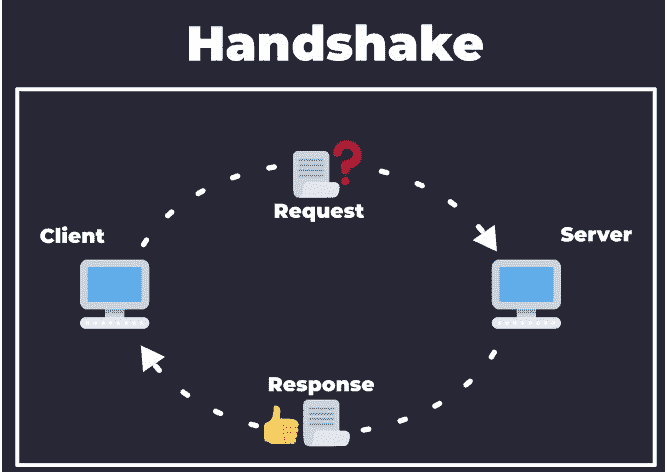
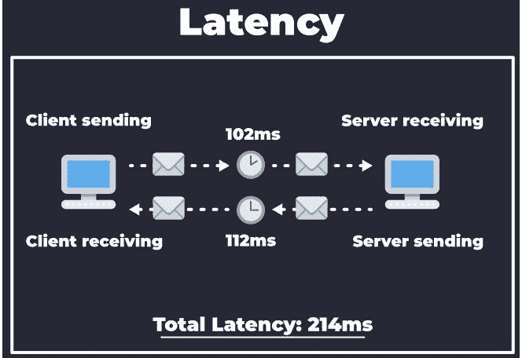
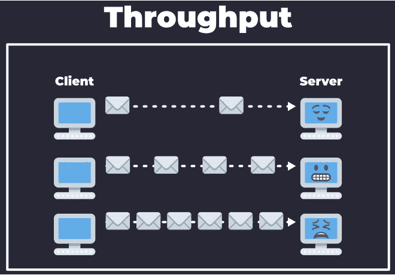
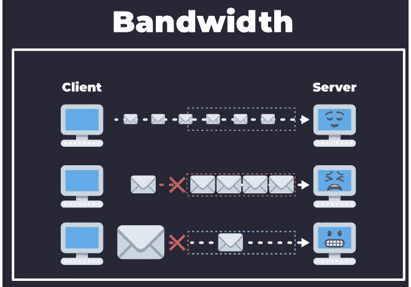
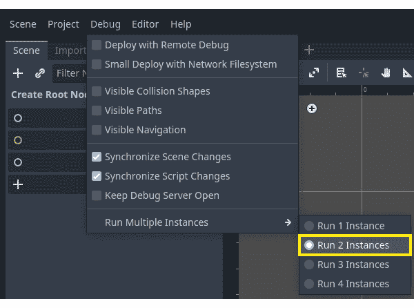
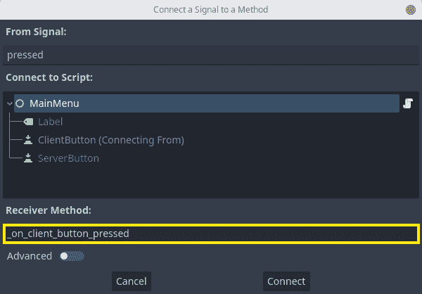

# 第一章：设置服务器

欢迎来到 *《使用 Godot 4.0 创建多人游戏必备指南》*。在这本实践手册中，你将学习用于使用 Godot Engine 4.0 网络 API 创建在线多人游戏的核心概念。

首先，我们将了解一些关于计算机通过网络进行通信的基本方面以及主要协议，包括哪些对于制作在线多人游戏更为相关。

之后，我们将了解 Godot Engine 4.0 如何使用并提供其网络 API 的低级和高级实现。我们将了解一些核心类，我们可以使用这些类在同一个网络上的多台计算机之间传递数据。然后我们将关注称为`ENetMultiplayerPeer`的高级 API。

在基础知识到位后，我们将利用我们刚刚学到的知识将本地游戏功能转换为在线游戏功能。为此，我们将开发五个游戏项目：

+   在线问答游戏

+   检查器

+   乒乓球

+   合作平台游戏

+   俯视冒险游戏

然后，我们将学习一些技术，我们可以使用这些技术通过优化游戏发送、接收和处理网络数据的方式来提高玩家的体验。我们将了解我们不需要持续更新，我们可以用小块数据完成大部分游戏玩法，并让客户端的计算机自行填补空白。

在每一章中，你将扮演一个为虚构的独立游戏开发工作室工作的网络工程师。在每一章中，你将应用你最近学到的知识来解决工作室同伴提出的虚构问题。你将专注于他们展示的每个项目的网络方面，这样你就不会浪费宝贵的时间去理解不必要的方面。

在本章中，你将学习建立计算机网络的最重要的方面：将它们全部连接起来。你将了解这个过程是如何发生的，为什么要这样做，建立这种连接需要什么，以及我们如何使用 Godot 引擎提供的 API 来实现这一点。

我们将在本章中介绍以下主题：

+   网络简介

+   理解 Godot 引擎网络 API

+   设置客户端

+   设置服务器端

+   制作你的第一个握手

到本章结束时，你将拥有一个应用程序的客户端和服务器版本，该应用程序建立了两台或多台计算机之间的连接。这是我们将在整本书中看到的一切的核心，有了这些知识，你将了解如何开始让计算机在网络中通信，这正是你在在线多人游戏中需要做的。

# 技术要求

Godot 引擎有自己的独立文本编辑器，这就是我们将用它来编写所有实践课程的代码。

如前所述，在这本书中，你将扮演一个虚构独立游戏工作室的网络工程师。因此，我们将提供所有非网络相关工作的预制作项目。你可以在本书的 GitHub 仓库中找到它们：[`github.com/PacktPublishing/The-Essential-Guide-to-Creating-Multiplayer-Games-with-Godot-4.0`](https://github.com/PacktPublishing/The-Essential-Guide-to-Creating-Multiplayer-Games-with-Godot-4.0)。

在将项目正确添加到你的 Godot 引擎项目管理器后，打开项目并转到`res://01.setting-up-a-server`文件夹。在这里，你可以找到你需要遵循本章（后续部分）的内容。

# 网络简介

构建一个连接的计算机网络是一项相当艰巨的任务。在本章中，我们将了解在线网络的核心概念。我们还将介绍 Godot 引擎如何为我们可能面临的每个问题提供解决方案，以制作在线多人游戏。

**网络**是一组相互连接的设备，它们相互通信。在这些通信中，这些设备交换信息并相互共享资源。你可以有一个本地网络，比如在家庭或办公室中，或者一个全球网络，比如互联网。这个想法是相同的。

为了使这些设备能够通信，它们需要执行我们所说的**握手**。握手是设备识别另一设备并建立它们的通信协议的方式。这样，它们就知道它们可以请求什么，期望得到什么，以及需要向对方发送什么。

握手开始于一个设备向另一个设备发送消息。我们称这个消息为*握手请求*。设备使用这个消息来启动握手过程。发送请求的设备等待接收方的消息。我们称这个第二个消息为*握手响应*。



图 1.1 – 握手过程

当请求的设备通过握手响应发送确认时，它们建立了它们的通信。之后，设备开始交换数据。这标志着握手过程的结束。我们通常称请求数据的设备为*客户端*。至于提供数据的设备，我们称它为*服务器*。

注意，我们第一次交互时使用这些名称。在这第一次交互之后，这些角色发生变化是很常见的。从这个意义上说，沟通是*动态的*。服务器可能从客户端请求数据，而客户端可能向服务器提供数据。

在本章中，我们将使用 Godot 引擎网络 API 进行我们的第一次握手。我们还将创建和同步网络上的玩家数据。所以，请系好安全带，因为你将学习以下内容：

+   ENet 库是什么以及为什么我们在游戏中使用它

+   如何使用`ENetMultiplayerPeer`类进行握手

为了做到这一点，你将创建一个 Godot 项目，该项目列出已连接的玩家并允许他们编辑和同步一行文本。这是一个简单而优雅的项目，涵盖了在 Godot 引擎中设置在线多人环境的基础。

# 理解 ENetMultiplayerPeer 类

Godot 引擎网络 API 的核心特性之一是 `ENetMultiplayerPeer` 类。通过使用这个类，我们可以在我们的游戏服务器和客户端之间执行握手。

`ENetMultiplayerPeer` 类是 ENet 库的高级实现。让我们了解这个库以及为什么我们在在线多人游戏中使用它。

## ENet 库是什么？

**ENet**是一个轻量级、开源的网络库，在游戏开发行业中广泛使用。它被设计成一个高性能、可靠且易于使用的库，用于创建多人游戏和其他网络应用。ENet 库的一个优点是它是跨平台的，用 **C** 语言编写。因此，它具有小体积和低开销。

该库提供了一个简单且易于使用的 API，使得开发者能够轻松创建和管理网络连接，发送和接收数据包，并处理网络事件，如断开连接和数据包丢失。

在这个背景下，**数据包**是服务器和客户端在网络中传输的小数据单元。我们使用它们在网络上不同设备之间传输诸如游戏状态、玩家输入和其他类型的数据。

ENet 库提供了对多个通道的支持，使我们能够轻松地在单个连接中创建多个数据流，如语音和视频。这对于许多多人游戏来说是非常出色的。

在多人游戏中使用 ENet 的另一个原因是它易于使用的基于 UDP 协议的网络库。这是一个了解主要网络协议之一的好机会，让我们来做这件事。

# UDP 协议是什么？

**UDP 协议**是一种无连接协议，非常适合实时、高带宽的应用，如在线游戏。这是因为它具有低延迟并能处理高吞吐量。为了保持一致，在网络术语的世界里，延迟指的是数据通过网络传输和接收的时间。

例如，在在线多人游戏中谈论延迟是非常常见的：玩家执行动作和游戏对其做出反应之间的时间。下一图展示了延迟是如何工作以及如何计算的：



图 1.2 – 延迟的视觉演示

它基本上是指数据穿越网络、由服务器正确处理并向客户端提供响应所需的时间。

带宽是指在一定时间内，我们可以通过给定的网络路由发送多少数据，在它被淹没之前。例如，当我们谈论**DDoS 攻击**时，这是一个基本概念，黑客通过大量的未解决请求淹没服务器，阻止其他客户端访问服务。在以下图中，你可以看到带宽概念的视觉表示：



图 1.3 – 带宽的视觉演示

带宽是指网络中可用通信通道的大小。你可以将其想象为一个传输数据的管道。更大的管道允许在任意给定时间内传输大量数据，而较小的管道可能甚至不允许传输任何大小数据。你可以在以下图中看到这一概念的解释：



图 1.4 – 带宽的视觉演示

与更常用的**传输控制协议**（**TCP**）不同，**用户数据报协议**（**UDP**）在传输数据之前并不在两个设备之间建立专用连接。相反，它只是将数据包发送到指定的目标地址，而不确保数据包已被接收或确认。

听起来…很糟糕，对吧？但实际上恰恰相反。

这种缺乏可靠性通常被视为 UDP 的缺点，但在在线多人游戏的环境中，这实际上可以是一个优势。在游戏中，响应速度和低延迟至关重要，建立和维护连接的开销可能是一个重要的瓶颈。

由于 UDP 不需要专用连接，因此允许更快、更有效地传输数据。此外，由于 UDP 不需要接收方确认接收数据包，因此它受网络拥塞或延迟的影响较小，这在维护高带宽、高延迟环境（如在线游戏）中的稳定和响应性连接时可能至关重要。

此外，UDP 的不可靠性在在线多人游戏的环境中实际上可能是有益的。在游戏中，即使是一小部分数据包丢失或延迟也可能对玩家的体验产生重大影响，因此游戏能够适应这些类型的网络条件非常重要。通过不提供数据包投递的保证，UDP 允许游戏以最适合特定游戏及其机制的方式处理数据包丢失和延迟。

考虑以下情况。

我们建立连接。在这个连接中，我们向网络中的所有玩家更新关于其他玩家角色在世界中的位置。这样，每个人共享相同的世界状态。

如果我们使用 TCP 协议，每个人都必须等待每个其他玩家发送他们的位置并确认他们已经收到了每个其他玩家位置的变化，同时还要尝试保持位置变化的正确时间顺序。

因此，在这个例子中，如果一个玩家向左移动五个单位并发送了包含所有移动数据的 15 个数据包，包括空闲状态，所有其他玩家都必须确认他们已经收到了这 15 个数据包。

使用 UDP，玩家可以忽略除最新更新之外的所有更新，这是实时体验中唯一相关的信息：现在游戏世界的状态是什么？它如何到达这个点并不重要；重要的是它就在这个时刻。

我们将看到这也会带来一些麻烦。但我们可以创建方法并理解技术来减轻这些问题。我们将在后续章节中讨论这一点。

# 这连接是如何发生的？

要建立 UDP 连接，我们需要两个核心要素：

+   同伴的 IP 地址，主要是服务器

+   他们将交换数据的端口

为了测试目的，在我们所有的项目中，我们将使用`localhost` IP 地址。这是到你的本地 IP 地址掩码的快捷方式。IP 地址就像一个房子或公寓的地址。它是给定数据包应该送达的确切位置，代表了计算机在网络中的地址。端口基本上是主机允许建立给定通信的特定通道；我们将使用`9999`作为我们的默认端口。这没有什么特别之处；它只是一个任意的选择。

考虑到这一点，让我们第一次看看`ENetMultiplayerPeer`类的实际应用。正如你可以想象的，这种设置需要双方面的方法。我们需要为我们的服务器设置一个游戏架构，并为客户端设置不同的架构。

让我们从服务器架构开始。

## 创建服务器

Godot 引擎中的`ENetMultiplayerPeer`类提供了一个方便的方式来创建和管理在线多人游戏的网络连接。这个类最重要的方法之一是`create_server()`方法，它用于创建一个新的服务器，该服务器可以接受来自客户端的连接。此方法使用简单，除了有五个参数外，它只需要一个参数就可以开始：

+   `ENetMultiplayerPeer.create_server()`方法的第一个参数是服务器将监听传入连接的端口。这是客户端将用于连接服务器的端口号。例如，如果你想服务器在端口`9999`上监听，你会调用`ENetMultiplayerPeer.create_server(9999)`。这是调用此方法的唯一必需参数。

+   第二个参数是 `max_clients`，这是服务器允许同时连接的最大客户端数。此参数是可选的，如果没有指定，服务器将允许最多 4,095 个客户端连接。

+   第三个参数是 `max_channels`，这是服务器允许每个客户端使用的最大通道数。通道用于分离不同类型的数据，例如语音和视频，并且对于在单个连接中创建多个数据流非常有用。此参数是可选的，如果没有指定，服务器将允许无限数量的通道。

+   第四个参数是 `in_bandwidth`，这是服务器允许每个客户端的最大入带宽。此参数是可选的，如果没有指定，服务器将允许无限入带宽。

+   第五个参数是 `out_bandwidth`，这是服务器允许每个客户端的最大出带宽。此参数是可选的，如果没有指定，服务器将允许无限出带宽。

让我们在 Godot Engine 中创建我们的服务器。打开之前提供的 GitHub 链接中的项目。打开项目后，执行以下步骤：

1.  创建一个新的场景并使用 `Node` 实例作为根节点。

1.  添加一个新的 `Server.gd` 文件。

1.  保存场景并打开脚本。

1.  定义一个名为 `PORT` 的常量并将其设置为我们的默认端口号，以便服务器可以监听它：

    ```cpp
    const PORT = 9999
    ```

1.  使用 `new()` 构造函数创建一个新的 `ENetMultiplayerPeer`。让我们将其存储在一个名为 `peer` 的变量中：

    ```cpp
    var peer = ENetMultiplayerPeer.new()
    ```

1.  在 `_ready()` 函数中，调用 `peer` 变量的 `create_server()` 方法，并将 `PORT` 常量作为参数传入：

    ```cpp
    func _ready():
        peer.create_server(PORT)
    ```

1.  仍然在 `_ready()` 回调中，将 `peer` 变量分配给此节点内置的 `multiplayer` 成员变量：

    ```cpp
        multiplayer.multiplayer_peer = peer
    ```

1.  将 `multiplayer` 变量的 `peer_connected` 信号连接到名为 `_on_peer_connected` 的函数。我们将在下面创建此回调方法：

    ```cpp
    multiplayer.peer_connected.connect(_on_peer_connected)
    ```

1.  创建一个名为 `_on_peer_connected()` 的新方法，它应该接收 `peer_id` 作为参数：

    ```cpp
    func _on_peer_connected(peer_id):
    ```

1.  在 `_on_peer_connected()` 函数中，使用 `print()` 在控制台上打印传递的 `peer_id` 参数：

    ```cpp
      print(peer_id)
    ```

    完整的脚本应该看起来像这样：

    ```cpp
    extends Node
    const PORT = 9999
    var peer = ENetMultiplayerPeer.new()
    func _ready():
        var error = peer.create_server(PORT)
        multiplayer.multiplayer_peer = peer
        multiplayer.peer_connected.connect
            (_on_peer_connected)
    func _on_peer_connected(peer_id):
        print(peer_id)
    ```

重要的是要注意，此脚本使用了 Godot Engine 4.0 网络 API 中每个 `Node` 实例都有的内置 `multiplayer` 成员变量，它是一个 `MultiplayerAPI` 类的实例。

完成：我们的服务器已经准备好了。我告诉过你，这会很简单！

## 创建客户端

接下来，让我们创建我们的客户端。过程相当相似。主要区别是客户端需要服务器的 IP 地址才能在网络中找到它。

我们使用 `ENetMultiplayerPeer.create_client()` 方法将客户端连接到服务器。此方法非常简单易用，并且只需要两个参数即可工作：

+   `create_client()` 方法的第一个参数是服务器的地址。这可以是服务器的 IP 地址或主机名。例如，如果您想客户端连接到 IP 地址为 `192.168.1.1` 的服务器，您将调用 `create_client("192.168.1.1")`。但为了简化，我们将使用 `"localhost"`，这是指向我们自己的 IP 地址掩码的快捷方式。

+   `create_client()` 方法的第二个参数是服务器监听传入连接的端口。这是客户端将用于连接到服务器的端口号。例如，如果服务器正在监听端口 `9999`，您将调用 `create_client("192.168.1.1", 9999)`。

+   `create_client()` 方法的第三个参数是 `channel_count`，这是客户端将用于与服务器通信的通道数。通道用于分离不同类型的数据，例如语音和视频，并在单个连接内创建多个数据流非常有用。此参数是可选的，如果未指定，客户端将使用默认值 `1` 个通道。

+   `create_client()` 方法的第四个参数是 `in_bandwidth`，这是客户端在每个连接中允许的最大传入带宽。此参数是可选的，如果未指定，客户端将使用默认值 `0`，允许无限的传入带宽。

+   `create_client()` 方法的第五个参数是 `out_bandwidth`，这是客户端在每个连接中允许的最大传出带宽。此参数是可选的，如果未指定，客户端将使用默认值 `0`，允许无限的传出带宽。

+   `create_client()` 方法的第六个参数是 `local_port`，这是客户端将绑定到的本地端口。此参数是可选的，如果未指定，客户端将使用默认值 `0`。

现在，让我们看看我们如何创建连接的 *客户端* 部分，以便它可以连接到我们的 *服务器* 并建立握手：

1.  创建一个新的场景并添加一个 `Node` 实例作为根节点。

1.  将一个新的脚本附加到它上面。

1.  将脚本保存为 `Client.gd`。

1.  在脚本中定义一个名为 `ADDRESS` 的常量，并将其设置为服务器的 IP 地址。在这种情况下，我们将使用 `"localhost"`：

    ```cpp
    const ADDRESS = "localhost"
    ```

1.  定义一个名为 `PORT` 的常量，并将其设置为默认端口号。确保这个数字与我们在 `Server.gd` 中使用的数字相匹配非常重要，否则这些对等体将无法找到彼此：

    ```cpp
    const PORT = 9999
    ```

1.  使用 `new()` 构造函数创建一个新的 `ENetMultiplayerPeer` 并将其存储在名为 `peer` 的变量中：

    ```cpp
    var peer = ENetMultiplayerPeer.new()
    ```

1.  在 `_ready()` 回调中，调用 `peer` 变量上的 `create_client()` 方法，传入 `ADDRESS` 和 `PORT` 常量作为参数：

    ```cpp
    func _ready():
      peer.create_client(ADDRESS, PORT)
    ```

1.  将 `peer` 变量分配给节点的内置 `multiplayer` 成员变量：

    ```cpp
    multiplayer.multiplayer_peer = peer
    ```

    完整的脚本应该看起来像这样：

    ```cpp
    extends Node
    const ADDRESS = "localhost"
    const PORT = 9999
    var peer = ENetMultiplayerPeer.new()
    func _ready():
        peer.create_client(ADDRESS, PORT)
        multiplayer.multiplayer_peer = peer
    ```

好的，我们的服务器和客户端已经准备好了。现在，我们该如何测试它们呢？

## 测试我们的握手

Godot 引擎 4.0 拥有一个有用的调试功能：能够打开多个独立的游戏实例。这个功能允许我们同时测试不同的场景，使调试过程更加容易和快速。

要打开多个游戏实例，我们需要在 **Debug** | **Run Multiple Instances** 菜单中的最多四个选项中选择一个。



图 1.5 – 运行多个实例菜单

然后，当我们按下 **Run Project** 或 **Run Current Scene** 按钮时，Godot 将启动我们之前设置的实例。让我们在这个项目中坚持使用两个实例。

这个功能对于测试在线多人游戏非常有用，因为它允许我们在同一运行中打开服务器和客户端。但是，正如你所看到的，它并不直接。当我们运行项目时，它实际上打开了同一场景的两个实例。

让我们创建一个最小的菜单，我们可以选择我们是客户端还是服务器：

1.  创建一个新的场景，使用 `Control` 作为根节点并将其命名为 `MainMenu`。

1.  将 `Label` 节点作为根节点的子节点添加。

1.  将两个 `Button` 节点作为根节点的子节点添加。

1.  将第一个 `Button` 命名为 `ClientButton`，第二个命名为 `ServerButton`：


图 1.6 – `MainMenu` 的场景树结构

1.  将 `Button` 节点的 `text` 属性分别设置为 **I’m a client** 和 **I’m a server** 并将它们并排放置在屏幕中间。

1.  将 `Label` 节点的 `text` 属性设置为 **Are you a…** 并将其放置在屏幕中间。


图 1.7 – `MainMenu` 的场景 UI

1.  添加一个新的 `MainMenu` 节点并打开它。

1.  连接 `_on_client_button_pressed`。



图 1.8 – ClientButton 的按下信号连接

1.  连接 `_on_server_button_pressed` 的按下信号。

1.  在 `_on_client_button_pressed()` 回调中，让我们在 `get_tree()` 实例上调用 `change_scene_to_file()` 方法，传入 `"res://Client.tscn"` 作为参数：

    ```cpp
    extends Control
    func _on_client_pressed():
        get_tree().change_scene_to_file
            ("res://Client.tscn")
    ```

1.  在 `_on_server_button_pressed()` 回调中，与之前相同，传入 `"res://Server.tscn"` 代替。

    完整的脚本应该看起来像这样：

    ```cpp
    extends Control
    func _on_client_pressed():
        get_tree().change_scene_to_file
            ("res://Client.tscn")
    func _on_server_pressed():
        get_tree().change_scene_to_file("res://Server.tscn")
    ```

现在，让我们确保在测试之前保存场景。之后，我们只需要点击 **Run Current Scene** 按钮并观察场景变得生动。所有艰苦的工作都已经完成，现在我们只需要欣赏结果。

一旦我们有两个调试实例正在运行，我们需要先选择一个作为服务器。为此，我们可以按下 `Server.tscn` 场景并开始监听传入的连接。

然后，在另一个实例中，我们需要按下`Client.tscn`场景并尝试连接到服务器。如果一切如预期进行，我们应该在服务器实例的控制台中看到打印出的`peer_id`。

这意味着客户端和服务器已经成功建立了连接，现在可以开始交换消息了。恭喜你，你刚刚创建了你第一个握手！

# 摘要

在本章中，我们探讨了网络连接的基础，即通过称为握手的程序建立连接。

握手确保两台计算机在网络中相互识别并建立这种通信的协议。这一点非常重要，因为这是我们所有进一步努力的基石。如果没有这个，我们的玩家和服务器将会断开连接。一个将会向虚空发送数据，而另一个将会无限期地等待某物到来。

说到发送数据，既然我们的计算机已经连接并开放以接收和发送数据，现在是时候看看如何做到这一点了。在本章中，你看到了如何使用 ENet 库正确建立连接，以及 Godot 引擎如何提供高级别的握手方法，以至于我们几乎看不到是否真的发生了握手。

在下一章中，我们将使用 UDP 协议来在客户端和服务器之间建立连接。但这一次，我们将进一步挖掘，并实际上从客户端向服务器发送数据，以及反过来。

使用 UDP 协议来理解当我们最终开始习惯 Godot 引擎的`ENetMultiplayer` API 时，底层可能发生的事情是非常重要的。

现在，让我们看看下一章中低级数据传输的混乱世界，这样我们就可以理解，有了新的高级网络 API，我们的生活将变得多么容易！
