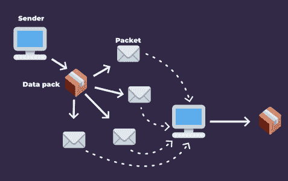
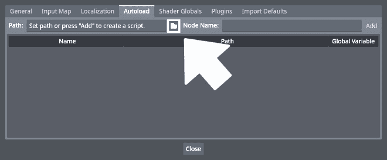
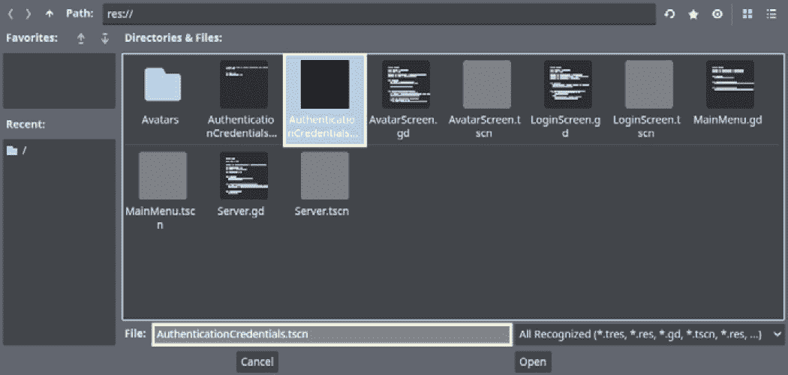
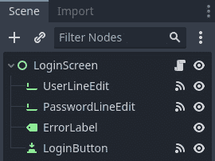
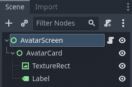
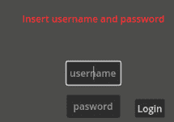
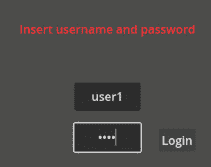

# 发送和接收数据

在上一章中，我们看到了如何使用 Godot 引擎的高级 `ENetMultiplayerPeer` API 在两台计算机之间建立连接。但之后我们做什么呢？为什么我们要在计算机之间建立连接？网络的基础是连接计算机之间的通信，允许它们发送和接收数据。这些数据通过将内容分解成称为 **数据包** 的小块来传输。

每个数据包就像一张包含必要信息的明信片，例如发送者和接收者的 IP 地址、通信端口以及消息的内容。然后我们将这些数据包通过网络发送，它们可以被路由到预期的接收者。使用通信协议，如 UDP 协议，我们在发送端将数据分解成数据包，并在关系的接收端重新组装它们。

本章中，我们将讨论数据包发送和接收的基本原理以及使 UDP 协议独特之处。为此，我们需要稍微深入一些，并使用 Godot 引擎的 `UDPServer` 和 `PacketPeerUDP` 类。这些是低级 API 类，因此在这里我们将讨论一些内容。

本章我们将涵盖以下主题：

+   理解数据包

+   **JavaScript 对象表示法**（**JSON**）格式简介

+   使用 `PacketPeerUDP` 发送数据包

+   使用 `UDPServer` 监听数据包

+   验证玩家身份

+   加载玩家的头像

# 技术要求

在本章中，我们将继续在 Godot 引擎中跟进我们的项目，但这次，我们将使用 `res://02.sending-and-receiving-data` 文件夹中提供的文件。因此，如果您还没有这样做，请使用此链接下载项目的仓库：[`github.com/PacktPublishing/The-Essential-Guide-to-Creating-Multiplayer-Games-with-Godot-4.0`](https://github.com/PacktPublishing/The-Essential-Guide-to-Creating-Multiplayer-Games-with-Godot-4.0)。

然后，将项目添加到您的 Godot 引擎项目管理器中，打开项目并转到 `res://02.sending-and-receiving-data` 文件夹。

# 理解数据包

**数据包** 是使用 UDP 协议在网络中进行通信的基本构建块。它们是包含所有必要信息以到达其预期接收者的数据小块。这包括发送者和接收者的 IP 地址、通信端口以及消息的内容。

发送者通过网络将数据包发送到接收者。接收端重新组装数据包，使接收者能够理解发送的消息。这个过程被称为 **数据包交换**。您可以在以下位置看到这个过程的视觉表示：



图 2.1 – 数据包交换过程

与 TCP 协议等其他协议不同，UDP 协议不保证数据包会按发送顺序到达。这意味着该协议不太可靠，但更高效、更快。

UDP 与其他协议的不同之处还在于其缺乏连接状态。每个数据包都包含它到达接收端所需的所有数据。我们单独处理它们，网络根据每个数据包自己的信息进行路由。这与 TCP 协议形成对比，因为后者需要通过传统的握手程序建立一个预先安排的、固定的数据通道。

这意味着我们可以使用 UDP 协议发送这些数据包而不需要握手。只要我们的服务器在指定的端口上监听消息，它就能接收发送方的消息。

由于所有这些原因，UDP 协议在发送网络游戏数据时更加高效，因为它速度快，不需要在接收端等待每个数据包的确认。这对于在线多人游戏来说是一个巨大的优势，尤其是在玩家的反应时间对游戏很重要的情况下。

使用 UDP 协议进行快速消息系统和甚至语音通话也很常见。使用 UDP 进行语音通话可能带来的一个问题是有时音频无法按正确顺序或任何顺序到达对方。这会引起一些问题，但由于通信旨在实时进行，用户可以要求对话另一端的人重复，UDP 协议已成为此类服务的首选解决方案。重要的是要理解——何时以及何时不是正确的选择。

现在我们已经浏览了我们可以通过网络交换数据的协议，我们需要了解这些数据看起来是什么样子。我们能否通过网络发送对象的实例？它们将在接收端如何组装？

在这个意义上，网络通信要低级一些；我们需要在数据结构中发送只有发送方和接收方端点都能理解的相关信息。为此，我们通常避免传递二进制数据，例如对象。

相反，我们将重要信息序列化，并通过网络传输必要的块，以便接收端可以使用我们传输的数据创建一个全新的对象副本。这更加可靠，并且允许更小的带宽使用。我们常用的一个数据结构是以 JSON 文件格式组织的字典。

# JSON 格式简介

在网络编程中，直接通过网络传输对象并不总是可靠的，因为数据可能在传输过程中被损坏或丢失。此外，如果代码是恶意的，包含可执行代码的对象的传输可能存在安全风险。这就是为什么使用数据序列化将对象转换为易于通过网络传输的格式是一种常见的做法。

最常用的数据序列化格式之一是 JSON。JSON 是一种轻量级的基于文本的格式，可以表示复杂的数据结构，如数组和对象，使其成为网络通信的理想选择。

当使用 Godot 引擎网络 API 和 UDP 时，发送和接收 JSON 文件是一种常见做法。使用 JSON，我们可以快速高效地进行序列化和反序列化。JSON 文件是可读的，这使得开发者更容易调试和排除问题。JSON 文件也是灵活的，这意味着我们可以只选择需要发送的相关数据，使网络通信更加高效。

与二进制格式不同，JSON 文件易于阅读和修改。这使得在数据传输过程中出现任何问题时更容易进行调试和故障排除。

现在我们已经了解了 JSON 格式的优点和背后的整体理念，我们如何正确地使用它？JSON 文件如何帮助我们通过网络传输数据并保持玩家在相同的游戏上下文中？

如本节所述，序列化是我们挑选出关于数据结构（如对象）的必要信息，并将其转换为可以传递甚至存储的格式的过程。序列化是软件工程领域（包括网络）中需要学习的重要技能之一。

正是通过序列化，我们可以将应用程序的状态转换为其他应用程序实例可以通过时间进一步复制此状态——例如，实现保存和加载系统，或者通过空间，正如我们将在在线多人游戏中做的那样。因此，让我们了解序列化是如何工作的以及如何进行序列化。

## 序列化

`Sprite2D` 节点，转换成一个简单、线性的表示，我们可以将其存储在文件中。例如，`*.tscn` 文件是序列化文件，代表 Godot 引擎编辑器中的一个场景。

序列化涉及将对象转换为可以在另一台机器或另一个上下文中轻松重建的格式。这可能涉及以标准格式（如 JSON）编码对象的属性、数据和相关信息。序列化在网络通信中至关重要，因为它允许数据高效、可靠地传输和接收，同时还能实现不同编程语言和系统之间的互操作性。

例如，如果我们想在客户端根据服务器提供的数据重新创建一个 `Sprite2D` 节点，我们可以序列化重要的属性，如其位置、旋转、缩放和纹理。它看起来会是这样：

```cpp
{
  "position": {
    "x": 2244,
    "y": 1667
  },
  "rotation": 45,
  "scale": {
    "x": 2,
    "y": 2
  },
  "texture_path": "res://assets/objects/Bullet.png"
}
```

因此，在客户端，我们实例化一个新的 `Sprite2D` 节点，并使用这些数据确保它代表服务器希望客户端看到的内容。我们将在接下来的工作中大量使用序列化。在 Godot 中，我们有 `JSON` 辅助类用于创建和解析 JSON 数据。

`JSON.stringify()` 方法用于将对象或数据类型（如整数或字典）序列化为 JSON 格式的字符串。此方法接受一个对象作为输入，并返回包含输入对象 JSON 表示的字符串。

该字符串可以随后在网络中传输、存储在文件中或用于任何需要对象字符串表示的上下文中。使用 `JSON.parse_string()` 方法，生成的字符串可以轻松地反序列化为对象。

另一方面，`JSON.parse_string()` 方法用于将 JSON 格式的字符串反序列化为可识别的 Godot 数据类型或对象。此方法接受一个字符串作为输入，并返回反序列化的数据。生成的对象可以用于任何需要原始对象的地方。

在反序列化 JSON 字符串时，该方法负责将 JSON 值映射到适当的 Godot 引擎数据类型。这包括将字符串映射到字符串、数字映射到数字以及布尔值映射到布尔值，还包括解析更复杂的数据类型，如字典和对象。

通过 `JSON.stringify()` 和 `JSON.parse_string()` 方法，Godot 引擎提供了一个简单且可靠的方式来将数据转换为可以在网络中传输或存储在文件中的格式。

我们看到了如何将我们的相关数据转换为可理解的标准格式，以便我们可以在接收端存储、传输和重新创建。让我们了解如何在网络中传递这些数据。

当我们处理在线多人游戏时，这是基本知识，因为我们将通过这个过程在玩家之间重新创建对象，甚至整个游戏状态，使他们共享相同的游戏世界。

# 使用 PacketPeerUDP 发送数据包

现在，让我们转向实际知识。在本章中，你的任务是为一个游戏实现一个登录系统。我们的项目已经有一个酷炫的用户界面，能够收集玩家数据，例如他们的登录名和密码。你的任务是确保只有授权的玩家可以通过实现安全认证功能来访问游戏内容。

一旦玩家成功登录，你需要根据我们在数据库中保存的内容显示他们的角色头像。作为一名网络工程师，你明白在线系统中的安全性至关重要。你知道一个强大的身份验证系统对于确保只有合法用户被授予访问游戏内容是必不可少的。

因此，你需要开发一个登录系统，该系统将检查玩家的凭证与安全数据库的匹配情况，并验证他们是否有权访问游戏的功能。

根据你的技能和经验，你需要创建一个系统，该系统能够在确保玩家数据安全的同时提供卓越的用户体验。所以，接受这个挑战，让我们创建一个登录系统，这将证明你作为网络工程师的技能！

在我们的项目仓库中，打开`res://02.sending-and-receiving-data//MainMenu.tscn`场景，让我们开始吧。

## 创建 AuthenticationCredentials Autoload

在 Godot 引擎中，**Autoloads**是当游戏开始时 Godot 自动加载的单例。我们可以在编辑器中创建和编辑它们，并从游戏中的任何脚本中访问它们。我们使用 Autoloads 来存储游戏范围内的数据或提供全局功能，这使得它们成为携带玩家凭证穿越游戏的一种便捷方式。

使用 Autoloads 携带玩家凭证的主要优势之一是它们在场景变化期间始终可用。这意味着任何游戏中的脚本都可以访问 Autoload 并在需要时检索玩家的凭证。这消除了从一个脚本传递凭证到另一个脚本的必要性，使得代码更干净且更容易维护。

此外，由于 Autoloads 在整个游戏生命周期中都是持久的，只要玩家不关闭游戏，我们就可以访问他们的凭证。

这可以使实现具有身份验证功能的登录系统的过程更加高效和流畅。

那么，让我们创建我们的`AuthenticationCredentials` Autoload，如下所示：

1.  使用`Node`节点作为根节点创建一个新的场景。

1.  重命名根节点`AuthenticationCredentials`。

1.  向其附加一个新的脚本，将其保存为`AuthenticationCredentials.gd`，并打开它。

1.  创建一个变量来存储玩家的用户名；我们可以将这个变量命名为`user`，并且它应该默认为空字符串：

    ```cpp
    extends Node
    var user = ""
    ```

1.  然后，创建一个变量来存储我们在成功验证登录时保存的会话令牌：

    ```cpp
    var session_token = ""
    ```

1.  保存场景，然后转到**项目** | **项目设置**并打开**Autoload**选项卡。

1.  在**路径**字段中，点击小文件夹图标：




1.  从弹出菜单中选择`AuthenticationCredentials.tscn`：



图 2.3 – 从文件菜单中选择 AuthenticationCredentials 场景

1.  将 **节点名称** 字段保留为 **AuthenticationCredentials** 并点击 **添加** 按钮。

现在我们已经完成了。现在，您可以通过调用 `AuthenticationCredentials` 单例在任何地方访问在 `AuthenticationCredentials.gd` 场景脚本中定义的变量和函数。

这对于跟踪游戏中多个场景和节点之间的全局状态非常有用。需要注意的是，这个 Autoload 应该只存在于多人游戏的客户端端，而不是服务器端。所以，请确保从您的服务器应用程序中删除它。

现在，让我们看看我们如何收集并发送玩家的凭证到服务器。为此，我们将直接在登录屏幕本身上工作！打开 `LoginScreen.tscn`，然后继续进行有趣的部分。

## 发送玩家的凭证

命名为 **LoginScreen** 的 `Control` 节点，其用户界面用于捕获玩家的凭证，以便我们可以进行身份验证并让他们访问我们的世界：



图 2.4 – 登录屏幕场景的节点层次结构

界面包括两个 `LineEdit` 节点，一个允许玩家输入他们的登录凭证。如果发生任何错误，我们可以使用 **ErrorLabel** 节点来显示必要的消息。

由于我们在这里收集玩家的凭证，我们可以使用 **LoginButton** 节点来触发登录过程。有了这个场景，一旦玩家成功登录，他们就可以安全地访问他们的头像屏幕。

但现在，我们需要在加载他们的头像之前验证他们的登录。所以，让我们动手吧。按照以下步骤进行操作：

1.  打开 `LoginScreen.gd` 脚本并进入 `send_credentials()` 函数。

1.  在 `send_credentials()` 函数内部，创建一个名为 `message` 的字典，其中包含我们将要在服务器上验证的用户凭证。

1.  要存储这些凭证，在消息字典中创建一个名为 `'authenticate_credentials'` 的键；其值也应该是一个字典。我们将用它来存储玩家的凭证。

1.  使用 `user_line_edit` 和 `password_line_edit` 文本属性来捕获玩家输入的用户名和密码：

    ```cpp
        var message = {'authenticate_credentials':
            {'user': user_line_edit.text, 'password':
                password_line_edit.text}}
    ```

1.  使用 `PacketPeerUDP.new()` 构造函数实例化一个新的名为 `packet` 的 `PacketPeerUDP` 对象：

    ```cpp
        var packet = PacketPeerUDP.new()
    ```

1.  使用 `connect_to_host()` 方法将 `packet` 对象连接到服务器的地址和端口。在这里，我们使用默认的 `ADDRESS` 和 `PORT` 常量，它们分别代表客户端连接到的服务器的 IP 地址和端口号。它们分别是 `127.0.0.1` 和 `9999`：

    ```cpp
    packet.connect_to_host(ADDRESS, PORT)
    ```

1.  使用 `JSON.stringify()` 方法将消息字典对象序列化为 JSON 格式的字符串，并使用 `packet.put_var()` 方法将其发送到服务器：

    ```cpp
        packet.put_var(JSON.stringify(message))
    ```

1.  创建一个 `while` 循环以等待来自服务器的响应。`packet.wait()` 方法等待数据包到达绑定的地址。如果它收到数据包，则返回 `OK` 错误常量；否则，它返回基于 Godot 错误常量的错误代码。因此，我们可以使用它来等待我们的数据包到达服务器端：

    ```cpp
        while packet.wait() == OK:
    ```

1.  当我们收到响应时，我们需要使用 `JSON.parse_string()` 方法将响应数据从 JSON 格式反序列化为字典对象。让我们将其存储在一个名为 `response` 的变量中：

    ```cpp
            var response = JSON.parse_string
                (packet.get_var())
    ```

1.  使用 `in` 操作符检查 `response` 字典中是否存在认证令牌。如果存在 `"token"` 字符串，将其值存储在 `AuthenticationCredentials.session_token` 中：

    ```cpp
            if "token" in response:
                AuthenticationCredentials.session_token =
                    response['token']
    ```

1.  之后，我们还可以将我们从服务器收到的消息中存在的 `user` 存储为玩家的用户名：

    ```cpp
                AuthenticationCredentials.user = message
                    ['authenticate_credentials']['user']
    ```

1.  更新用户界面以指示成功认证，并切换到 `AvatarScreen.tscn` 场景。如果令牌不存在，向玩家显示错误消息：

    ```cpp
                error_label.text = "logged!!"
    ```

1.  然后，在所有这些之后，我们可以使用 `get_tree().change_scene_to_file("res://AvatarScreen.tscn")` 方法将场景更改为实际的头像屏幕，并中断 `while` 循环：

    ```cpp
                get_tree().change_scene_to_file
                    ("res://AvatarScreen.tscn")
                break
    ```

1.  如果我们从服务器收到响应，但其中不包含 `"token"` 键，我们将使用 `error_label.text` 显示认证失败消息，并中断 `while` 循环：

    ```cpp
            else:
                error_label.text = "login failed,
                    check your credentials"
                break
    ```

    到这一点，`send_credentials()` 方法应该看起来像这样：

    ```cpp
    func send_credentials():
        var message = {'authenticate_credentials':
            {'user': user_line_edit.text, 'password':
                password_line_edit.text}}
        var packet = PacketPeerUDP.new()
        packet.connect_to_host(ADDRESS, PORT)
        packet.put_var(JSON.stringify(message))
        while packet.wait() == OK:
            var data = JSON.parse_string(packet.get_var())
            if "token" in data:
                error_label.text = "logged!!"
                AuthenticationCredentials.user = message
                    ['authenticate_credentials']['user']
                AuthenticationCredentials.session_token =
                    data['token']
                get_tree().change_scene_to_file
                    ("res://AvatarScreen.tscn")
                break
            else:
                error_label.text = "login failed,
                    check your credentials"
                break
    ```

现在我们已经了解了客户端的工作原理以及它将如何处理玩家数据，让我们了解连接的另一端将如何接收这些数据并处理它。为此，打开 `Server.tscn` 场景。

# 使用 UDPServer 监听数据包

欢迎来到我们的 Godot 引擎服务器场景！这个场景是我们游戏服务器逻辑的实现之处。

服务器是我们游戏的骨架，负责验证玩家并向他们提供有关其头像的数据，例如他们的名字和纹理文件。这个节点被称为 `Server`，它包含一个预写的脚本，其中包含一些基本变量。其中两个至关重要的变量是 `database_file_path` 和 `logged_users`。

`database_file_path` 变量是 `FakeDatabase` JSON 文件的路径，它代表一个包含玩家数据的假数据库。`logged_users` 变量是一个字典，用于存储当前登录的玩家。

这些变量对我们服务器的功能至关重要，我们将使用它们来验证玩家并向他们提供他们所需的数据。

让我们实现 `Server` 节点最重要的功能，即监听数据包。按照以下步骤进行：

1.  打开 `Server.gd` 文件。

1.  声明一个 `server` 变量并将其设置为 `UDPServer.new()`。这创建了一个新的 `UDPServer` 类实例，它将允许我们监听传入的连接：

    ```cpp
    var server = UDPServer.new()
    ```

1.  在 `_ready()` 函数中，调用 `server` 变量的 `listen()` 方法，并将我们的默认 `PORT` 常量作为参数传递。这将启动服务器并使其监听传入的连接：

    ```cpp
    func _ready():
        server.listen(PORT)
    ```

1.  在 `_process(delta)` 函数中，调用 `server` 变量的 `poll()` 方法来检查是否有任何传入的消息。此方法不会阻塞游戏循环，因此我们可以在 `_process(delta)` 函数中安全地调用它：

    ```cpp
    func _process(delta):
        server.poll()
    ```

1.  在 `server` 变量上调用 `is_connection_available()` 方法来检查是否有客户端发送了消息。如果它返回 `true`，则调用 `take_connection()` 方法以获取一个 `PacketPeerUDP` 实例，我们可以用它来读取传入的消息：

    ```cpp
    if server.is_connection_available():
        var peer = server.take_connection()
    ```

1.  使用我们从 `PacketPeerUDP` 实例获得的 `get_var()` 方法来获取传入的消息。由于我们知道消息是 JSON 格式的字符串，我们可以使用 `JSON.parse_string()` 方法将其转换为我们可以工作的字典对象：

    ```cpp
    var message = JSON.parse_string(peer.get_var())
    ```

1.  检查传入的消息是否包含 `"authenticate_credentials"` 键。如果包含，则调用 `authenticate_player()` 函数，并将 `peer` 和 `message` 作为参数传递：

    ```cpp
    if "authenticate_credentials" in message:
        authenticate_player(peer, message)
    ```

    我们将在稍后创建 `authenticate_player()` 方法，但就目前而言，我们的脚本应该看起来像这样：

    ```cpp
    extends Node
    const PORT = 9999
    @export var database_file_path =
        "res://FakeDatabase.json"
    var database = {}
    var logged_users = {}
    var server = UDPServer.new()
    func _ready():
        server.listen(PORT)
    func _process(delta):
        server.poll()
        if server.is_connection_available():
            var peer = server.take_connection()
            var message = JSON.parse_string
                (peer.get_var())
            if "authenticate_credentials" in message:
                authenticate_player(peer, message)
    ```

我们刚刚看到了如何打开客户端和服务器之间的通信通道并开始监听消息。有了这个，我们可以过滤这些消息，以便服务器知道客户端正在请求什么——在我们的案例中，是验证玩家的凭证。

这是一个网络 API 的低级实现。有了这个，我们可以创建标准消息格式和内容，在服务器端触发事件，并期望从服务器获得标准响应。让我们看看我们的服务器如何回应这个客户端请求。

# 验证玩家

验证玩家凭证是多玩家游戏的一个关键方面。在我们的项目中，我们正在使用 Godot 引擎构建一个游戏的登录系统。该登录系统允许玩家使用他们的用户名和密码登录，并在登录成功后显示他们的角色头像。

我们将使用一个假数据库，以 JSON 文件的形式存储，来表示玩家的凭证。虽然这种方法比使用完整的数据库管理系统更简单，但它有自己的安全风险。因此，在准备就绪的项目中，请注意此方法的风险。

在我们的项目中验证玩家凭证时，我们还将使用 Godot 的 `FileAccess` 类从 JSON 文件加载假数据库并解析数据。这将允许我们比较玩家的登录凭证与数据库中的数据，并在凭证匹配时验证玩家。

## 加载假数据库

现在，让我们加载我们的数据库，以便我们可以检查从玩家客户端获取的数据是否与服务器上的任何数据匹配。简而言之，数据库是有组织的数据集合。在我们的案例中，我们将使用 JSON 文件格式作为我们的数据库。

使用 JSON 文件作为数据库的优势在于它们易于操作，并且您不需要具备数据库结构和安全性的先验知识。

例如，我们的模拟数据库由以下内容组成：

```cpp
{
  "user1": {
    "password":"test",
    "avatar":"res://Avatars/adventurer_idle.png",
    "name":"Sakaki"
  },
  "user2": {
    "password":"test",
    "avatar":"res://Avatars/player_idle.png",
    "name":"Keyaki"
  }
}
```

您甚至可以在 Godot 文本编辑器中打开它；只需双击我们基础项目中提供的`res://FakeDatabase.json`文件。

前面的 JSON 文件代表一个简单的数据库，包含两个用户条目，`"user1"`和`"user2"`，每个用户都有相应的一组数据。每个用户包含的数据包括密码、头像和姓名。

`"password"`字段包含每个用户的纯文本密码。这是一种非常简单的存储密码的方法，因为它不安全，因为可能被泄露。然而，它适合教育目的。

`"avatar"`字段包含一个指向表示用户头像的文件的引用。在这种情况下，它引用了我们游戏中的两个不同的图像文件，每个用户一个。

最后，`"name"`字段简单地存储了一个表示玩家头像名称的字符串。

注意，数据库文件绝对不应该对客户端可用。因此，在您的最终项目中，请确保将数据库文件从 Godot 的项目中移除，并放入一个安全的数据库设备中。

虽然 JSON 文件对于某些项目来说是一个很好的选择，但它们可能不适合其他项目。以下是一些需要考虑的优点和缺点：

+   **优点**：

    +   它们易于读写，这使得它们成为小型项目或开发速度优先时的理想选择。

    +   JSON 文件可以被大多数编程语言原生解析，包括我们之前看到的 GDScript，这意味着您不需要安装任何额外的软件或库来与之工作。

    +   正如我们刚才看到的，JSON 文件是可读的，可以使用简单的文本编辑器打开和编辑，这使得它们非常适合调试。

+   **缺点**：

    +   它们不适合大型项目，特别是有大量并发用户的项目，因为可能存在数据一致性和性能问题。

    +   JSON 文件在查询数据和执行复杂操作方面不如其他数据库格式灵活。

为了加载和读取我们的 JSON 模拟数据库文件中的数据，我们将使用 Godot 引擎的`FileAccess`类。

`FileAccess`类是一个内置的 Godot 类，它提供了一个接口来加载、读取、写入和保存文件到用户的磁盘。它是一个强大的工具，对于任何需要从用户设备访问文件的游戏或应用程序来说都是必不可少的。

让我们具体探讨如何使用这个类将我们的 JSON 模拟数据库文件加载并解析到游戏中，如下所示：

1.  前往`Server.gd`脚本中的`load_database()`函数。

1.  在函数中，通过调用`open`方法并传入 JSON 文件的路径作为第一个参数，以及`FileAccess.READ`作为第二个参数来创建`FileAccess`类的新实例。`READ`常量告诉`FileAccess`类文件应该以读取模式打开：

    ```cpp
    func load_database(path_to_database_file):
        var file = FileAccess.open(path_to_database_file,
            FileAccess.READ)
    ```

1.  文件打开后，调用`get_as_text()`方法以读取文件的内容作为文本字符串：

    ```cpp
        var file_content = file.get_as_text()
    ```

1.  接下来，使用`JSON.parse_string()`方法解析文件的正文作为 JSON 字符串，并将结果字典存储在`fake_database`变量中：

    ```cpp
        fake_database = JSON.parse_string(file_content)
    ```

    在我们继续回复玩家的认证请求之前，让我们看看这个函数在这些步骤结束时的样子：

    ```cpp
    func load_database(path_to_database_file):
        var file = FileAccess.open(database_file_path,
            FileAccess.READ)
        var file_content = file.get_as_text()
        database = JSON.parse_string(file_content)
    ```

在我们的数据库就绪后，我们可以查看我们的有效玩家，并检查客户端发送的消息中接收到的凭证是否与我们存储的凭证匹配。理想情况下，我们会使用更安全的格式来避免任何数据泄露或黑客攻击，但这对我们的小型应用程序来说应该足够了。

现在，让我们看看如何根据玩家是否成功认证或认证失败来向客户提供一个有效的响应。在前一种情况下，我们将向玩家提供一个认证令牌，以便他们可以在整个游戏会话中使用它，从而无需进一步的认证程序来保持他们登录状态。

## 回复认证请求

当客户端将凭证发送到服务器进行认证时，服务器将接收它们并开始认证过程。服务器将使用凭证在我们的包含用户数据的假数据库中搜索匹配的记录。如果凭证匹配，服务器将生成会话令牌并将其发送回客户端。

会话令牌是一串唯一的字符，用于在服务器端标识客户端，客户端必须在所有后续请求中出示它以证明其身份。

为了验证凭证，我们调用`load_database`函数，我们可以在`_ready()`函数中这样做，将假数据库加载到我们的服务器中。

然后，我们将使用玩家通过`logged_users`字典提供的用户名，以及用户名，来跟踪已认证的用户。

如果客户端尝试使用无效或过期的会话令牌，服务器将拒绝请求，客户端将需要重新认证。这样，我们可以确保只有已认证的客户端在玩游戏时才能访问服务器的资源。

现在，让我们继续到`authenticate_player()`函数，并创建我们的认证逻辑。按照以下步骤进行：

1.  从`message`字典中访问`authenticate_credentials`键，并将其存储在`credentials`变量中，如下所示：

    ```cpp
    func authenticate_player(peer, message):
        var credentials = message
            ['authenticate_credentials']
    ```

1.  通过运行以下代码来检查`credentials`字典中是否存在`user`和`password`键：

    ```cpp
        if "user" in credentials and "password" in
            credentials:
    ```

1.  如果存在键，从`credentials`字典中提取`user`和`password`键的值并将它们存储在单独的变量中：

    ```cpp
    var user = credentials["user"]
    var password = credentials["password"]
    ```

1.  检查我们刚刚存储的`user`键是否存在于我们的`fake_database`字典键中：

    ```cpp
    if user in fake_database.keys():
    ```

1.  如果`user`键存在，检查`password`键是否与存储在`fake_database`字典中的匹配：

    ```cpp
    if fake_database[user]["password"] == password:
    ```

1.  如果`password`键匹配，生成一个随机整数令牌并将其存储在以`user`为键的`logged_users`字典中，这样我们就可以在必要时始终检查它们：

    ```cpp
    var token = randi()
    logged_users[user] = token
    ```

1.  创建一个名为`response`的字典，包含一个键值对。键是`token`，值是`token`变量：

    ```cpp
    var response = {"token":token}
    ```

1.  使用`peer.put_var()`方法以 JSON 格式将`response`字典发送回客户端：

    ```cpp
    peer.put_var(JSON.stringify(response))
    ```

1.  如果密码不匹配，向客户端发送一个空字符串以指示认证失败：

    ```cpp
    else:
        peer.put_var("")
    ```

    有了这些，我们应该有一个正确处理并回复玩家认证请求的方法。让我们看看它最终是如何完成的：

    ```cpp
    func authenticate_player(peer, message):
        var credentials = message['authenticate_
            credentials']
        if "user" in credentials and "password" in
            credentials:
            var user = credentials["user"]
            var password = credentials["password"]
            if user in database.keys():
                if database[user]["password"] == password:
                    var token = randi()
                    var response = {"token":token}
                    logged_users[user] = token
                    peer.put_var(JSON.stringify(response))
                else:
                    peer.put_var("")
    ```

现在，让我们继续到整个过程中的一个重要部分。玩家将收到一个带有令牌的请求，正如我们在*发送玩家凭据*部分所看到的，他们将在`AuthenticationCredentials`自动加载中存储这个令牌。因此，之后，玩家的游戏将改变场景到**AvatarScreen**并尝试请求他们的头像。

让我们看看玩家将如何在整个过程中保持他们的会话有效。以下部分在玩家实际开始玩游戏后仍然至关重要。所以，请保持关注，了解我们如何始终确保玩家持有有效的令牌。

## 维持玩家的会话

任何在线游戏最重要的一个方面是保持玩家的会话在整个游戏过程中活跃。在我们的项目中，我们将确保玩家的令牌在整个游戏会话中都是可用的，即使在切换到不同的场景时也是如此。这样，我们可以在玩家玩游戏时保持他们的身份。

为了实现这一点，我们将使用`AuthenticationCredentials`单例在玩家的机器上存储令牌。这样，玩家的令牌将可供所有游戏脚本使用，使我们能够在进行任何其他场景之前检查玩家是否仍然处于认证状态。

通过在玩家的机器上保留令牌，我们可以避免不断向服务器发送登录请求以重新认证玩家，从而确保游戏体验更快更流畅。为了确保玩家的凭据仍然有效，我们将使用`get_authentication_token()`方法允许玩家的客户端向服务器请求他们的认证令牌。

当玩家即将过渡到新场景或自上次请求以来经过一定时间时，我们调用此方法。这样，我们可以确保玩家仍然处于认证状态，并且可以无任何问题地继续他们的游戏。

因此，仍然在 `Server.gd` 脚本中，转到 `get_authentication_token()` 方法，让我们开始为玩家提供他们需要玩我们的游戏所需的东西，继续以下步骤：

1.  在 `get_authentication_token()` 方法内部，让我们从 `message` 参数中提取用户信息。为此，我们可以创建一个名为 `credentials` 的新变量，并将其赋值为 `message` 参数：

    ```cpp
    func get_authentication_token(peer, message):
        var credentials = message
    ```

1.  然后，让我们检查 `credentials` 字典中是否有名为 `"user"` 的键：

    ```cpp
        if "user" in credentials:
    ```

1.  检查客户端提供的 `token` 键是否与存储的用户 `token` 键匹配：

    ```cpp
        if credentials['token'] == logged_users
            [credentials['user']]:
    ```

1.  创建一个名为 `token` 的变量来存储在 `logged_users` 变量中找到的 `token` 键。然后，让我们通过调用 `peer.put_var()` 方法并传递 JSON 格式的令牌字符串来返回用户的认证 `token` 键，以便客户端从服务器接收响应：

    ```cpp
        var token = logged_users[credentials['user']]
        peer.put_var(JSON.stringify(token))
    ```

    我们的功能应该如下所示：

    ```cpp
    func get_authentication_token(peer, message):
        var credentials = message
        if "user" in credentials:
            if credentials['token'] == logged_users
                [credentials['user']]:
                Var token = logged_users[credentials
                    ['user']]
                peer.put_var(JSON.stringify(token))
    ```

现在，无论何时我们需要执行任何需要服务器确认玩家仍在有效游戏会话中的程序，我们都可以调用此函数。但为了实际执行，我们需要在我们的服务器中添加两行代码，以便它能够理解客户端何时发出此类请求。

在 `_process()` 函数中，我们检查客户端是否正在请求 `authenticate_credentials()` 方法。让我们检查客户端是否正在请求 `get_session_token()` 方法，如果是的话，我们就调用它。`_process()` 函数应该如下所示：

```cpp
func _process(delta):
    server.poll()
    if server.is_connection_available():
        var peer = server.take_connection()
        var message = JSON.parse_string(peer.get_var())
        if "authenticate_credentials" in message:
            authenticate_player(peer, message)
        elif "get_authentication_token" in message:
            get_authentication_token(peer, message)
```

现在，让我们继续我们这个小型项目的最后一部分，我们将提供和加载玩家的头像数据。

# 加载玩家的头像

欢迎来到 **AvatarScreen**！这是玩家将能够自定义他们的头像外观并在我们（模拟）游戏的最终版本中选择一个独特名称的地方。为了显示他们当前可用的头像，我们需要从数据库中加载玩家的头像数据并在屏幕上显示它。

为了做到这一点，我们有一个名为 `Control` 的 `Control` 节点，称为 **AvatarCard**：



图 2.5 – AvatarScreen 场景的节点层次结构

**AvatarCard** 节点包含一个用于使用纹理文件显示头像图像的 **TextureRect** 节点，以及一个用于显示头像名称的 **Label** 节点。

要加载玩家的头像，我们首先需要从我们的模拟数据库中检索图像文件的路径，我们之前已经用头像信息填充了这个数据库。因此，在我们深入 `Server.gd` 脚本中的动作之前，这次让我们专注于 `get_avatar()` 函数。继续以下步骤：

1.  在 `get_avatar()` 函数内部，创建一个包含消息内容的本地 `dictionary` 变量：

    ```cpp
    func get_avatar(peer, message):
        var dictionary = message
    ```

1.  检查 `dictionary` 变量中是否存在 `"user"` 键：

    ```cpp
        if "user" in dictionary:
    ```

1.  如果在这个字典中找到 `"user"` 键，让我们创建一个本地 `user` 变量，它等于 `dictionary` 变量中 `"user"` 键的值：

    ```cpp
            var user = dictionary['user']
    ```

1.  检查`dictionary`变量中的`'token'`键是否与由`user`键指定的用户存储在`logged_users`字典中的令牌匹配：

    ```cpp
            if dictionary['token'] == logged_users[user]:
    ```

1.  如果是这样，创建一个本地`avatar`变量，其值等于`fake_database`字典中由`'user'`键指定的用户的`'avatar'`键的值：

    ```cpp
                var avatar = fake_database[dictionary
                    ['user']]['avatar']
    ```

1.  创建一个本地`nick_name`变量，其值等于`fake_database`字典中由`user`键指定的用户的`name`键的值：

    ```cpp
                var nick_name = fake_database[dictionary
                    ['user']]['name']
    ```

1.  创建一个包含`avatar`和`name`键的`response`字典，其中`avatar`和`nick_name`的值分别对应于`avatar`和`nick_name`：

    ```cpp
                var response = {"avatar": avatar, "name":
                    nick_name}
    ```

1.  使用`peer.put_var()`方法将`response`字典作为 JSON 字符串发送给客户端：

    ```cpp
                peer.put_var(JSON.stringify(response))
    ```

    这样，我们就完成了服务器的封装，因此我们准备好移动到`get_avatar()`函数来继续我们的工作：

    ```cpp
    func get_avatar(peer, message):
        var dictionary = message
        if "user" in dictionary:
            var user = dictionary['user']
            if dictionary['token'] == logged_users[user]:
                var avatar = database[dictionary
                    ['user']]['avatar']
                var nick_name = database[dictionary
                    ['user']]['name']
                var response = {"avatar": avatar, "name":
                    nick_name}
                peer.put_var(JSON.stringify(response))
    ```

    现在，让我们打开`AvatarScreen.gd`脚本，以便我们最终可以显示玩家的头像！前往`request_authentication()`函数，因为如前所述，每次我们需要对玩家的数据进行操作时，我们都需要验证他们的凭据：

1.  在`request_authentication()`函数内部，创建一个名为`request`的变量，它包含一个具有`'get_authentication_token'`、`'user'`和`'token'`键的字典。`'get_authentication_token'`的值应设置为`true`，以便服务器理解请求，而`'user'`和`'token'`的值应从`AuthenticationCredentials`单例中检索：

    ```cpp
    func request_authentication(packet):
        var request = {'get_authentication_token': true,
            "user": AuthenticationCredentials.user, "token
               ": AuthenticationCredentials.session_token}
    ```

1.  使用`packet`将请求发送到服务器，通过使用`JSON.stringify()`将请求编码为 JSON 字符串，然后使用`put_var()`方法发送它：

    ```cpp
        packet.put_var(JSON.stringify(request))
    ```

1.  使用`while`循环等待服务器的响应。在循环内部，创建一个名为`data`的变量来存储服务器返回的 JSON 响应，使用`JSON.parse_string()`进行解码：

    ```cpp
        while packet.wait() == OK:
            var data = JSON.parse_string(packet.get_var())
    ```

1.  检查`data`变量是否等于存储在`AuthenticationCredentials`单例中的`session_token`变量。如果是，调用`request_avatar`函数并退出循环：

    ```cpp
            if data == AuthenticationCredentials.
                session_token:
                request_avatar(packet)
                break
    ```

    最后，我们的`request_authentication()`函数应如下所示：

    ```cpp
    func request_authentication(packet):
        var request = {'get_authentication_token': true,
            "user": AuthenticationCredentials.user,
                 "token": AuthenticationCredentials.
                      session_token}
        packet.put_var(JSON.stringify(request))
        while packet.wait() == OK:
            var data = JSON.parse_string(packet.get_var())
            if data == AuthenticationCredentials.
                session_token:
                request_avatar(packet)
                break
    ```

    现在是检索玩家头像数据并显示他们的头像，以便他们可以参与我们的游戏世界的时候了！为此，让我们转到`request_avatar()`函数，创建头像请求和显示逻辑：

1.  在`request_avatar()`函数内部，创建一个名为`request`的字典，包含`'get_avatar'`、`'token'`和`"user"`键及其相应的值。我们从`AuthenticationCredentials` Autoload 获取用户和会话令牌：

    ```cpp
    func request_avatar(packet):
        var request = {'get_avatar': true, 'token':
            AuthenticationCredentials.session_token,
                "user": AuthenticationCredentials.user}
    ```

1.  使用`packet.put_var()`方法将`request`字典作为 JSON 格式的字符串发送到服务器：

    ```cpp
        packet.put_var(JSON.stringify(request))
    ```

1.  创建一个`while`循环以等待服务器响应。在循环内部，使用`JSON.parse_string`方法将响应解析为字典，并将其存储在名为`data`的变量中：

    ```cpp
        while packet.wait() == OK:
            var data = JSON.parse_string(packet.get_var())
    ```

1.  检查字典数据是否包含`"avatar"`键。如果包含，则从`"avatar"`键值中的路径加载头像图像的纹理，并将其设置为`texture_rect`的纹理。同时，将`label`的值设置为`data`字典中`"name"`键的值。最后，使用`break`退出`while`循环：

    ```cpp
            if "avatar" in data:
                var texture = load(data['avatar'])
                texture_rect.texture = texture
                label.text = data['name']
                break
    ```

    我们几乎完成了登录屏幕！在我们添加最后的润色之前，让我们看看`request_avatar()`方法是如何结束的：

    ```cpp
    func request_avatar(packet):
        var request = {'get_avatar': true, 'token':
            AuthenticationCredentials.session_token,
                "user": AuthenticationCredentials.user}
        packet.put_var(JSON.stringify(request))
        while packet.wait() == OK:
            var data = JSON.parse_string(packet.get_var())
            if "avatar" in data:
                var texture = load(data['avatar'])
                texture_rect.texture = texture
                label.text = data['name']
                break
    ```

1.  现在，最后的润色是向`Server.gd`脚本添加另一个检查，以处理我们收到头像请求的情况。因此，`_process()`方法应该变成如下所示：

    ```cpp
    func _process(delta):
        server.poll()
        if server.is_connection_available():
            var peer = server.take_connection()
            var message = JSON.parse_string
                (peer.get_var())
            if "authenticate_credentials" in message:
                authenticate_player(peer, message)
            elif "get_authentication_token" in message:
                get_authentication_token(peer, message)
            elif "get_avatar" in message:
                get_avatar(peer, message)
    ```

    如果我们通过点击**播放**按钮来测试我们的游戏，或者测试**主菜单**场景，我们可以验证我们的游戏是否正在运行！

1.  我们需要做的第一件事是在一个调试实例中选择**服务器**按钮：


图 2.6 – 在主菜单场景中按下服务器按钮

1.  然后，在另一个实例中，选择**客户端**，它应该立即打开**登录屏幕**场景：



图 2.7 – 将玩家的用户名插入到客户端的登录屏幕 UserLineEdit 中

1.  选择我们假数据库中可用的一个用户，并插入他们的凭证：



图 2.8 – 将玩家的用户名插入到客户端的登录屏幕 PasswordLineEdit 中

1.  一旦你按下带有正确凭证的**登录**按钮，它应该加载带有相应头像的**头像屏幕**场景：


图 2.9 – 显示玩家头像的 AvatarScreen 场景，在成功认证后

恭喜！你已经制作了第一个带有认证功能的登录屏幕，在整个网络中序列化和反序列化玩家的数据。为自己感到骄傲——这是一项了不起的成就！

# 摘要

在本章中，我们看到了如何使用 Godot 引擎网络 API 中的 UDP 协议实现来在服务器和客户端之间建立连接。有了这个，网络对等体可以打开通信通道并交换数据。

由于这种实现采用了一种相当低级的方法，我们看到了如何为我们的同伴创建一个简单的 API，以便他们可以制作、理解和回复彼此的请求。根据请求的不同，可能需要遵循一个称为序列化的过程，这是我们如何从游戏状态中提取相关信息并将其转换为我们可以存储和传递的格式。在我们的案例中，我们看到了 JSON 格式是最常见的序列化格式之一。

使用 JSON 格式，我们看到了如何将我们的 Godot 引擎字符串解析为 JSON，以及如何将 JSON 文件转换为字典，这样我们就可以使用 GDScript 更高效地处理它。

在本章末尾，我们看到了如何验证玩家的凭据，将它们与一个假数据库进行匹配。在成功验证后，我们收集了玩家的数据，根据他们在我们数据库中的数据显示他们各自的头像。

在下一章中，我们将通过允许多个客户端登录到同一服务器并最终共享体验来增加一个新的复杂度级别。为此，我们将创建一个显示所有已登录玩家名称和头像的 `Lobby` 节点！
