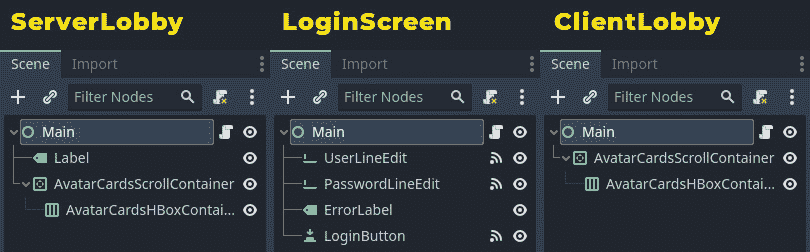
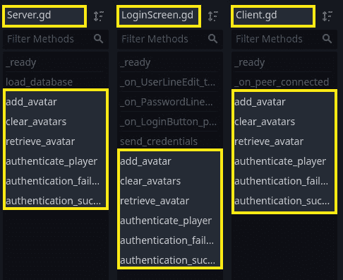
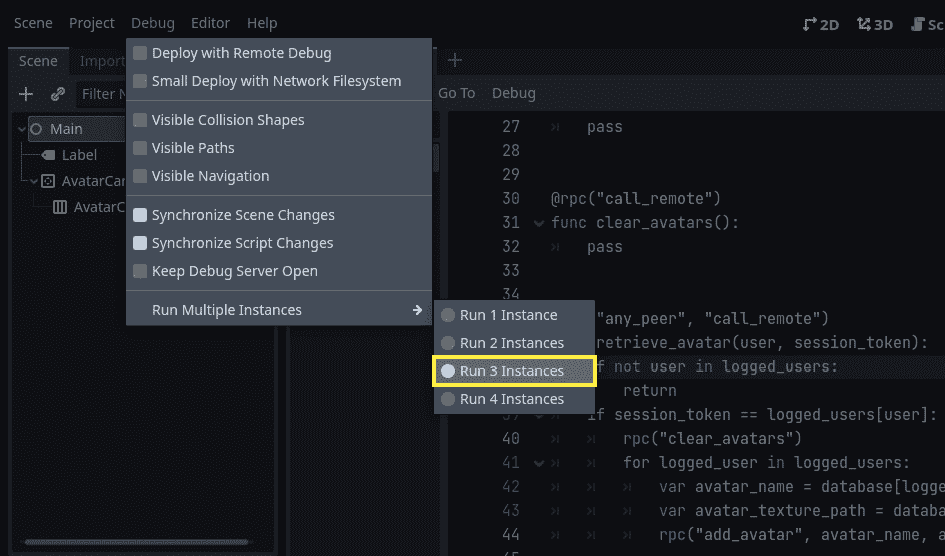
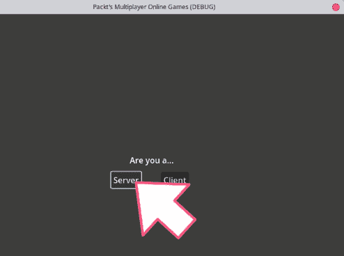
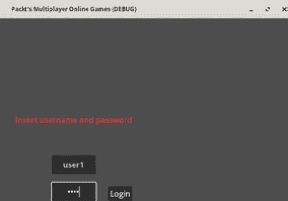
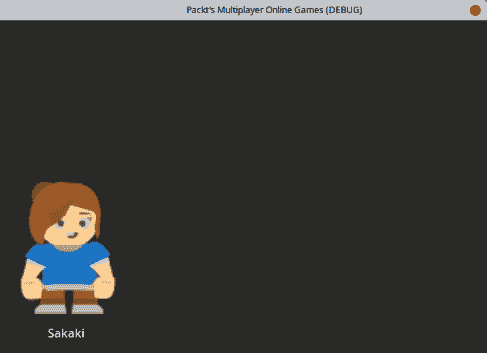
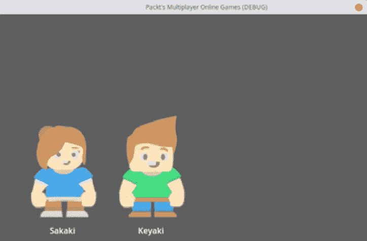

# 3

# 创建一个大厅以聚集玩家

在上一章中，我们讨论了如何使用 UDP 数据包在游戏中的多个玩家之间交换数据。虽然这种方法非常高效，但需要大量手动工作来确保数据能够正确发送和接收。在本章中，我们将探讨 Godot 引擎的高级网络 API，它通过提供一组内置工具和函数来简化网络过程，从而简化了网络操作。

具体来说，我们将重点关注**ENetMultiplayerPeer API**，这是 Godot 引擎为其 ENet 库实现提供的包装类，以及**远程过程调用**（**RPC**），这是一种通信协议，允许我们像在本地调用一样对远程计算机上的函数和方法进行调用。我们将使用这些工具来创建大厅，验证玩家身份，从伪造的 JSON 数据库中检索玩家头像数据，并在玩家进入大厅时同步所有玩家。我们将探讨使用 RPC 而不是交换 UDP 数据包的好处，以及这种方法如何简化在多个玩家之间同步游戏状态的过程。

本章我们将涵盖以下主题：

+   使用 RPC 远程调用函数

+   理解多人游戏权限

+   比较 UDP 和 ENet 方法

+   使用 RPC 重新制作登录界面

+   添加玩家的头像

+   检索玩家头像

+   测试大厅

到本章结束时，你将牢固地理解如何使用 Godot 引擎的高级网络 API 和 RPC 来创建一个健壮的多玩家大厅。

# 技术要求

在本章中，我们将使用 Godot 引擎构建另一个项目。记住，在整个本书中，我们使用的是 Godot 引擎版本 4.0，这也是一个要求。

这次，我们将使用`res://03.making-lobby-to-gather-players`文件夹中提供的文件。所以，如果你还没有项目仓库，可以通过这个链接下载它：

[`github.com/PacktPublishing/The-Essential-Guide-to-Creating-Multiplayer-Games-with-Godot-4.0`](https://github.com/PacktPublishing/The-Essential-Guide-to-Creating-Multiplayer-Games-with-Godot-4.0)

然后，将项目添加到 Godot 引擎的项目管理器中，打开项目并进入`res://03.making-lobby-to-gather-players`文件夹。

# 使用 RPC 远程调用函数

在网络环境中，**RPC**代表**远程过程调用**，这是一种协议，允许一个程序在另一台机器或网络上运行的程序上调用函数或过程。在 Godot 引擎的上下文中，RPC 允许对象在网络之间交换数据，这是创建多人游戏的关键特性。

要在 Godot 引擎中使用 RPCs，我们需要使用 `ENetMultiplayerPeer` API，它提供了一个高级网络接口，用于处理网络连接、发送和接收数据，以及管理 RPCs。通过使用 `ENetMultiplayerPeer`，我们可以轻松发送和接收 RPCs，并更直接地处理网络通信。

当使用 RPCs 交换数据时，对象可以通过函数交换数据，这使得过程比使用 UDP 数据包交换数据更直接。使用 UDP 数据包时，我们需要发送请求程序的包并等待响应，然后才能获取数据。这个过程可能很复杂且难以管理，正如我们在上一章中看到的，尤其是在有大量对象交换数据的大型游戏中。

RPCs 的一项限制是它们不允许通过网络传输对象，如节点或资源。这对于需要在不同机器之间交换复杂对象的游戏来说可能是一个挑战。然而，有几种方法可以解决这个问题，例如发送序列化数据或使用自定义序列化方法。我们在*第二章*，“发送和接收数据”中学习了如何做到这一点，所以这对我们来说不会是问题。

RPCs 是创建多人游戏的有力工具，在 Godot 引擎中使用 `ENetMultiplayerPeer` API 可以轻松使用它们。尽管 RPCs 有局限性，例如无法通过网络传输对象，但它们仍然是创建强大且无缝多人体验的关键部分。

## 介绍 @rpc 注解

Godot 引擎 4.0 引入了一个名为 `@rpc` 函数注解的新功能。`@rpc` 注解用于标记在多人游戏中可以通过网络远程调用的函数。

我们可以向 `@rpc` 注解添加几个选项，这些选项控制了函数在网络上的调用和执行方式。

让我们更详细地看看每个选项：

+   我们有调用选项，这意味着当我们对这个函数进行远程过程调用（RPC）时会发生什么：

    +   `call_remote`: 这个选项表示该函数应该只在其他节点的节点实例上远程调用，而不是在节点的本地实例上调用。

    +   `call_local`: 这个选项表示该函数也应该在当前节点的本地实例上调用。这在我们需要同步网络中的所有节点，包括调用者时非常有用。

+   然后，我们有调用者选项，意味着谁可以远程调用这个函数：

    +   `authority`: 这个选项表示该函数只能由多人游戏管理权限调用。我们很快就会看到更多关于它的内容。

    +   `any_peer`: 这个选项表示该函数可以被网络中的任何节点调用。这对于那些可以被多个节点在多人游戏中执行，而不仅仅是多人游戏管理权限的函数来说非常有用。

+   当我们向此函数发出 RPC 时，我们还有关于远程数据交换可靠性的选项：

    +   `reliable`: 此选项表示函数应在网络上可靠地执行，这意味着函数调用将保证到达其目的地。这对于需要无数据丢失风险执行的函数是有用的。

    +   `unreliable`: 此选项表示函数应以低可靠性执行，这意味着在网络中可能有一些数据可能会丢失或延迟。这对于可以容忍一些数据丢失的函数是有用的。

    +   `unreliable_ordered`: 此选项与`unreliable`类似，但确保函数调用在网络中按顺序执行。这对于需要按特定顺序执行但可以容忍一些数据丢失的函数是有用的。

我们还可以指定 RPC 应该使用哪个连接通道来传输其数据。这有助于防止瓶颈或为特定功能保留一些通道。例如，我们可以选择使用`reliable`数据的通道，例如玩家之间消息的传输。然后，我们可以有另一个使用`unreliable_ordered`数据的通道，例如更新玩家关于他们头像当前位置的信息。

在这种意义上，我们只需要最新的位置信息到达；其他任何带有先前位置的调用都是无关紧要的。因此，当一个通道等待消息到达时，另一个通道会持续接收关于头像位置的新更新，并且它们都不会阻塞对方。

我们传递这些选项的顺序对于 Godot 引擎本身来说并不重要。唯一的例外是通道，它应该是传递的*最后一个选项*。以下是一个例子：

```cpp
@rpc("any_peer", "unreliable_ordered")
func update_pos():
    pass
@rpc("unreliable_order", "any_peer")
func update_pos():
    pass
```

建立 RPC 选项的这两种方式是相同的，并且都会生效。现在，以下注释存在一个问题：

```cpp
# This wouldn't work
@rpc(2, "any_peer", "unreliable_ordered")
func update_pos():
    pass
# This would work
@rpc("any_peer", "unreliable_ordered", 2)
func update_pos():
    pass
```

只有第二个 RPC 注释会生效，因为我们把通道作为注释的最后一个参数传递。在第一个 RPC 注释示例中，我们把通道作为第一个参数传递，所以它不会生效。

现在我们已经了解了如何将一个函数标记为`rpc`函数以及我们可以使用哪些选项来微调它并实现我们在游戏中的需求，让我们看看我们需要什么才能调用这样的函数并将它们在网络中传播。

## RPC 需要什么？

要在 Godot 引擎中实现 RPC，首先，我们必须设置一个`ENetMultiplayerPeer`连接，它管理网络连接并处理节点之间的数据传输。我们在第一章中已经做到了这一点，但我们也会在这里介绍这个过程。

一旦设置了 `ENetMultiplayerPeer` 连接，我们必须确保接收 RPC 的节点的 `NodePath` 是精确的。这意味着目标节点的 `NodePath` 必须在网络中的所有玩家上完全相同。如果 `NodePath` 不精确，RPC 可能不会被发送到正确的节点，或者根本不会发送。

我们可以为我们的根节点设置一个默认名称以避免问题。我们选择根节点来方便之后的逻辑，因为它是在层次结构中的第一个节点。

例如，在我们的即将到来的 `Main` 中：



图 3.1 – ServerLobby、LoginScreen 和 ClientLobby 场景及其根节点命名为 Main

还需要注意的是，网络中的每个节点都应该共享所有标记为 `@rpc` 的方法，即使它们没有被任何人调用或使用。这是因为 Godot 引擎要求所有节点都能访问相同的方法集以正常工作。这可能对开发者来说是一个小的不便，因为它可能会使一些类膨胀，包含不必要的函数，但对于 Godot 的网络系统有效地工作来说是必要的。

例如，这些是我们即将到来的 **大厅** 项目中每个场景中找到的方法。请注意，它们都在其非 RPC 方法之上共享突出显示的方法：



图 3.2 – Server.gd、LoginScreen.gd 和 Client.gd 脚本共享带有 @rpc 注解的函数

在 Godot 引擎中制作 RPC 需要设置 `ENetMultiplayerPeer` 连接，确保目标节点的 `NodePath` 是精确的，并确保网络中的所有节点共享所有标记为 RPC 的方法。虽然这可能需要一些额外的设置和轻微的不便，但它使开发者能够轻松高效地创建多人游戏。

有了这些，我们理解了 Godot 引擎中 RPC 的核心。我们看到了我们需要设置我们的游戏以支持 RPC，`@rpc` 注解是如何工作的，以及我们如何调整它以匹配我们的设计。在这些调整选项之一中，我们看到了只允许多人权限调用特定的 RPC 函数是可能的。让我们看看多人权限是什么，以及我们可以用它做什么。

# 理解多人权限

在 Godot 引擎的高级网络 API 中，**多人权限**是一个概念，指的是在多人游戏中有权决定节点状态的节点。当两个或更多玩家在多人游戏中连接时，拥有一个集中式的玩家来决定哪些更改是有效的并且应该同步到所有连接的客户端是非常重要的。

在游戏中，多人权限被分配给特定的对等节点，通常是服务器或主机，这个节点有权决定哪些来自特定节点的更改应该被接受并在所有连接的客户端之间同步。这一点很重要，因为在多人游戏中，多个玩家可能会同时尝试更改游戏状态，而多人权限负责正确管理、验证和同步这些更改。

在多人游戏中，每个连接的客户端都会分配一个唯一的对等节点 ID，这是一个在游戏网络中识别客户端的数字。对等节点 ID 由 `Node.multiplayer.multiplayer_peer` 对象管理，它是 `ENetMultiplayerPeer` 对象的引用，该对象处理游戏的网络连接。`multiplayer_peer` 对象可以用来在连接的客户端之间发送和接收数据，以及管理游戏网络连接的状态。

我们可以使用 `Node.get_multiplayer_authority()` 方法检索节点的当前多人权限，也可以使用 `Node.set_multiplayer_authority()` 方法设置不同的权限，将节点 ID 作为参数传递。更改节点的多人权限将允许新的节点在网络上对节点进行更改和同步，这可能会相当危险。

例如，如果一个玩家负责包含其生命值的节点，玩家可能会以某种方式黑客攻击它，并能够自我管理他们的生命值，最终变得不朽。

# 比较 UDP 和 ENet 方法

`UDPServer` 和 `PacketPeerUDP` 类是低级别的网络工具，允许通过 UDP 数据包交换数据。这种方法需要我们做更多的工作，因为我们必须自己管理数据包的发送和接收。例如，要使用 `UDPServer` 和 `PacketPeerUDP` 创建登录系统，我们需要创建一个包含用户登录信息的数据包，将其发送到服务器，然后等待响应。

在*第二章*的*发送和接收数据*项目中，我们看到了如何使用 `UDPServer` 和 `PacketPeerUDP` 来传递数据。我们看到了使用这些类，我们可以在系统的每个端点（客户端和服务器）序列化和反序列化数据。使用这种方法，我们需要轮询数据包并等待请求和响应的到来。这确实有效，但你看到了它可能会变得有点复杂。

使用 `UDPServer` 和 `PacketPeerUDP` 类的一个优点是它们提供了对网络过程的更多控制，这对于需要精细调整网络的高级游戏非常有用。然而，这种方法也更容易出现错误，因为我们必须自己处理数据包的发送和接收，这可能导致数据包丢失或数据包顺序错误等问题。

另一方面，使用`ENetMultiplayerPeer`和 RPCs 提供了一种更高级别的网络解决方案，简化了创建登录系统的过程。使用这种方法，开发者可以使用`@rpc`函数注释标记一个方法为 RPC，这使得它可以从网络中的任何节点调用。

例如，要使用`ENetMultiplayerPeer`和 RPCs 创建登录系统，我们可以将处理登录过程的方法标记为 RPC，然后从客户端节点调用它。我们将在稍后看到这一点，你将了解 Godot 引擎的高级网络 API 是多么强大和简单。

使用`ENetMultiplayerPeer`和 RPCs 简化了网络过程，并使创建多人游戏变得更加容易。`ENetMultiplayerPeer`的内置功能，如自动数据包排序和错误纠正，使得创建稳定的网络连接更加容易。此外，`@rpc`注释使得从网络中的任何节点调用方法变得简单，简化了开发过程。

虽然`UDPServer`和`PacketPeerUDP`类提供了对网络过程的更多控制，但使用`ENetMultiplayerPeer`和 RPCs 提供了创建多人游戏的更简单、更流畅的方法。最终的选择取决于你正在制作的游戏的具体需求，但在大多数情况下，使用 Godot 引擎提供的更高级别的工具将导致更快速、更高效的开发过程。

现在我们已经了解了 Godot 引擎的高级网络 API 如何通过`ENetMultiplayerPeer`类解决许多问题，以及它与 UDP 方法相比的优势，比如它能够轻松地允许我们需要的 RPC 功能，使我们的游戏更容易，让我们重新制作在*第二章*“发送和接收数据”中制作的登录界面，使用这些新工具。这将使我们能够在理解底层方法的同时，了解使用高级方法的优势。

# 使用 RPCs 重新制作登录界面

欢迎回到我们的工作室，亲爱的网络工程师！在*第二章*“发送和接收数据”中，我们学习了如何使用 Godot 引擎的`UDPServer`和`PacketPeerUDP`类创建一个基本的登录系统。虽然这种方法非常适合我们的小型项目，但随着我们向前发展，我们需要提升游戏级别并创建一个大厅！

不要担心，我们为你找到了完美的解决方案——Godot 引擎的`ENetMultiplayerPeer`和 RPCs！这两个强大的工具将帮助我们构建一个强大且高效的系统，可以轻松扩展以支持多个连接的客户端——根据我们的研究，最多可以支持 4,095 个同时连接的玩家！

使用 Godot 引擎的`ENetMultiplayerPeer`，我们可以轻松管理多个连接并在所有连接的客户端之间同步游戏数据。这意味着我们的登录系统将能够处理更多的连接，我们的游戏将比以往任何时候都运行得更顺畅！

这样一来，我们也将能够进行 RPCs！RPCs 是 Godot 引擎网络中的关键部分。它们允许我们在网络中的其他节点上调用函数，就像它们是本地函数一样。有了 RPCs，我们可以轻松地在所有连接的客户端之间共享数据和执行操作，使我们的登录系统更加健壮和高效。

那么，准备好提升我们的游戏，网络工程师！在接下来的章节中，我们将深入探讨使用`ENetMultiplayerPeer`和 RPCs 实现新登录系统，并将玩家头像同步到大厅。

我们还将介绍一些使用`ENetMultiplayerPeer`和 RPCs 的最佳实践和技巧，以确保我们的多人游戏运行得既顺畅又高效。有了这些强大的工具，我们将能够创建一个令人惊叹的多人游戏，让玩家们欲罢不能。

让我们从使用`ENetMultiplayerPeer`API 在玩家和服务器之间建立连接开始。

## 建立 ENetMultiplayerPeer 连接

让我们从第一章回顾一下如何使用高级`ENetMultiplayerPeer`类建立连接。我们将从服务器开始。

这次，我们还将添加来自*第二章*“发送和接收数据”的元素，例如伪造的数据库和登录用户。这将使我们能够验证玩家并跟踪谁已连接以及他们的会话令牌。好的，无需多言，让我们深入探讨吧！

我们将首先在端口`9999`上设置 ENet 多玩家服务器，加载我们的伪造 JSON 数据库文件，并将`peer`实例分配给节点的`multiplayer`对象的`multiplayer_peer`属性，以便我们可以进行 RPCs。记住，我们只能在建立的 ENet 连接内执行 RPCs：

1.  打开`res://03.making-lobby-to-gather-players/LobbyServer.tscn`场景，然后打开**主**节点的脚本。

1.  声明一个常量变量`PORT`，并分配我们的默认值`9999`。这个变量将用于稍后指定服务器监听传入连接的端口号：

    ```cpp
    const PORT = 9999
    ```

1.  使用`@export`装饰器创建一个新的变量`database_file_path`，它可以从**检查器**面板中进行编辑。这个变量将存储包含我们伪造用户数据库的 JSON 文件的路径。我们正在使用与上一章相同的文件：

    ```cpp
    @export var database_file_path = "res://02.sending-and-receiving-data/FakeDatabase.json"
    ```

1.  创建一个新的`ENetMultiplayerPeer`实例，并将其分配给`peer`变量。这将是我们用于在客户端和服务器之间发送和接收数据以及进行 RPCs 的高级网络接口：

    ```cpp
    var peer = ENetMultiplayerPeer.new()
    ```

1.  创建一个名为 `database` 的空字典和一个名为 `logged_users` 的空字典。这些变量将用于存储我们的假用户数据，并分别跟踪哪些用户当前已登录：

    ```cpp
    var database = {}
    var logged_users = {}
    ```

1.  在 `_ready()` 回调中，调用 `peer.create_server(PORT)` 创建一个新的多玩家服务器，该服务器在由 `PORT` 变量指定的端口号上监听传入的连接：

    ```cpp
    func _ready():
        peer.create_server(PORT)
    ```

1.  仍然在 `_ready()` 回调中，将 `peer` 分配给 `multiplayer.multiplayer_peer`。这个变量使我们的 `peer` 对象成为游戏中所有节点的默认网络接口：

    ```cpp
    func _ready():
        peer.create_server(PORT)
        multiplayer.multiplayer_peer = peer
    ```

1.  最后，仍然在 `_ready()` 回调中，调用 `load_database()` 方法。我们将在稍后创建它。我们这样做是为了让数据库从服务器准备好开始就在内存中：

    ```cpp
    func _ready():
        peer.create_server(PORT)
        multiplayer.multiplayer_peer = peer
        load_database()
    ```

1.  现在，定义一个新的函数 `load_database()`，它接受一个可选参数 `path_to_database_file`。此函数将用于将用户数据从 JSON 文件加载到我们的 `database` 字典中：

    ```cpp
    func load_database(path_to_database_file =
        database_file_path):
    ```

1.  在 `load_database()` 内部，使用 `FileAccess.open()` 打开由 `path_to_database_file` 指定的文件，并将其分配给 `file` 变量：

    ```cpp
    func load_database(path_to_database_file =
        database_file_path):
        var file = FileAccess.open(path_to_database_file,
            FileAccess.READ)
    ```

1.  使用 `file.get_as_text()` 获取文件的文本内容，并将其分配给 `file_content` 变量：

    ```cpp
    func load_database(path_to_database_file =
        database_file_path):
        var file = FileAccess.open(path_to_database_file,
            FileAccess.READ)
        var file_content = file.get_as_text()
    ```

1.  使用 `JSON.parse_string()` 将 `file_content` 的内容解析为 JSON，并将结果字典分配给 `database`：

    ```cpp
    func load_database(path_to_database_file =
        database_file_path):
        var file = FileAccess.open(path_to_database_file,
            FileAccess.READ)
        var file_content = file.get_as_text()
        database = JSON.parse_string(file_content)
    ```

    到目前为止，这是我们的 `LobbyServer.gd` 应该看起来像这样：

    ```cpp
    extends Control
    const PORT = 9999
    @export var database_file_path = "res://
        02.sending-and-receiving-data/FakeDatabase.json"
    var peer = ENetMultiplayerPeer.new()
    var database = {}
    var logged_users = {}
    func _ready():
        peer.create_server(PORT)
        multiplayer.multiplayer_peer = peer
        load_database()
    func load_database(path_to_database_file =
        database_file_path):
        var file = FileAccess.open(path_to_database_file,
            FileAccess.READ)
        var file_content = file.get_as_text()
        database = JSON.parse_string(file_content)
    ```

这样，我们就到了动手实践有趣部分和本章核心的时候了。接下来，我们将最终创建将在我们即将到来的类中使用的 `@rpc` 方法。

## 创建 RPC 函数模板

这样，我们可以开始定义我们的 `@rpc` 方法，这样当我们转到 `LobbyLogin` 时，我们就已经知道我们将调用什么以及它是如何工作的。所以，仍然在 `LobbyServer` 中，让我们创建一些 RPC 方法。

这些方法也将用于 `LobbyLogin` 和 `LobbyClient`。记住，所有执行 RPC 的类应该共享相同的 RPC 方法，即使它们没有使用它们。

因此，让我们创建这个接口：

1.  这行代码上的 `@rpc` 注解是一个 RPC 注解，它告诉 Godot 这个函数只能由多玩家权限（即服务器本身）远程调用。远程调用意味着当 `LobbyServer` 对此函数进行 RPC 调用时，它不会在本地执行。我们将使用 `add_avatar()` 方法向游戏大厅添加新头像，并在 `LobbyClient` 上实现它：

    ```cpp
    @rpc
    func add_avatar(avatar_name, texture_path):
        pass
    ```

1.  `clear_avatars()` 函数将删除大厅中的所有头像。我们使用此函数从游戏中清除所有头像，以便与新玩家同步。这也是一个我们将在 `LobbyClient` 上实现的方法：

    ```cpp
    @rpc
    func clear_avatars():
        pass
    ```

1.  这个 `@rpc("any_peer", "call_remote")` 注解告诉 Godot 任何节点都可以远程调用这个函数。我们将使用 `retrieve_avatar()` 方法来检索特定玩家的头像纹理路径。我们将在 `LobbyServer` 中很快实现这个方法，而 `LobbyClient` 将会远程调用它：

    ```cpp
    @rpc("any_peer", "call_remote")
    func retrieve_avatar(user, session_token):
        pass
    ```

1.  `authenticate_player()` 方法将使用用户名和密码验证玩家。我们使用这个函数来验证玩家的凭证，并在 `logged_users` 字典中将它们与一个会话令牌配对。这也是 `LobbyServer` 中的一个方法，但现在 `LobbyLogin` 将会远程调用它：

    ```cpp
    @rpc("any_peer", "call_remote")
    func authenticate_player(user, password):
        pass
    ```

1.  然后，我们使用 `authentication_failed()` 方法来通知玩家他们的身份验证失败。当服务器无法验证玩家发送的凭证时，我们将从 `LobbyServer` 在 `LobbyClient` 上调用这个方法。

    注意，虽然带有 `@rpc` 注解的每个函数都应该在所有与之交互的其他类中都有，但这些类不需要有相同的 `@rpc` 选项。当我们跳转到 `LobbyLogin` 和 `LobbyClient` 时，你会更好地理解这一点：

    ```cpp
    @rpc
    func authentication_failed(error_message):
        pass
    ```

1.  我们还有 `authentication_succeed()`。我们从 `LobbsyServer` 在玩家的 `LobbyClient` 上调用这个函数，告诉他们他们的身份验证成功，并为他们提供会话令牌：

    ```cpp
    @rpc
    func authentication_succeed(user, session_token):
        pass
    ```

    这样，我们就有了在大厅系统中将要使用的所有 RPC 函数。`LobbyServer` 的 RPC 部分应该看起来像这样：

    ```cpp
    @rpc
    func add_avatar(avatar_name, texture_path):
        pass
    @rpc
    func clear_avatars():
        pass
    @rpc("any_peer", "call_remote")
    func retrieve_avatar(user, session_token):
        pass
    @rpc("any_peer", "call_remote")
    func authenticate_player(user, password):
        pass
    @rpc
    func authentication_failed(error_message):
        pass
    @rpc
    func authentication_succeed(user, session_token):
        pass
    ```

我们的模板已经准备好了。它包含了组成我们大厅的类之间需要共享的 `@rpc` 方法，以便在我们的网络中进行通信。记住，这是一个必要的步骤；即使某些类没有实现该方法，它们也应该至少共享这个接口。例如，接下来，我们将在大厅服务器中实现身份验证逻辑，但其他类只需要该方法的签名即可工作。让我们看看这个过程会如何进行。

## 玩家身份验证

在这个部分，我们将专注于在大厅服务器中验证玩家。我们将使用之前在服务器脚本中定义的 `authenticate_player()` RPC 方法来验证玩家的身份并授予大厅的访问权限。

`authenticate_player()` 方法将接受一个用户名和一个密码作为参数，并返回一个错误消息或会话令牌。如果凭证无效，该方法将向 `authentication_failed()` 方法发出远程调用，并带有一个错误消息来解释失败的原因。

如果凭证有效，该方法将向 `authentication_succeed()` 方法发出远程调用，传递一个会话令牌并将其返回给玩家的 `LobbyClient`。会话令牌是一个唯一的整数，用于标识玩家，并在后续的 RPC 中用于验证玩家。

让我们看看我们如何使用 Godot 引擎中可用的工具来实现这个逻辑：

1.  在 `LobbyServer` 的 `authenticate_player()` 方法内部，使用 `multiplayer.get_remote_sender_id()` 方法获取发送认证请求的玩家的 `peer_id`。这是我们识别谁发送了请求，以便我们可以正确地响应请求的方式：

    ```cpp
    func authenticate_player(user, password):
        var peer_id = multiplayer.get_remote_sender_id()
    ```

1.  检查用户是否存在于 `database` 字典中。如果不存在，使用 `rpc_id()` 方法在 `peer_id` 上调用 `authentication_failed` RPC 方法，消息为 `"User doesn't exist"`。为此，我们可以使用 `rpc_id()` 方法，它直接向给定 ID 的对等方发起 RPC：

    ```cpp
        if not user in database:
            rpc_id(peer_id, "authentication_failed",
                "User doesn't exist")
    ```

1.  如果用户存在于数据库中，检查密码是否与用户关联的密码匹配。如果匹配，使用 `randi()` 内置方法生成一个随机令牌：

    ```cpp
            elif database[user]['password'] == password:
                var token = randi()
    ```

1.  然后，将认证过的用户添加到 `logged_users` 字典中，并在 `peer_id` 上调用 `authentication_succeed` RPC 方法，传递令牌作为参数：

    ```cpp
            logged_users[user] = token
            rpc_id(peer_id, "authentication_succeed",
                token)
    ```

    这个方法应该看起来是这样的：

    ```cpp
    func authenticate_player(user, password):
        var peer_id = multiplayer.get_remote_sender_id()
        if not user in database:
            rpc_id(peer_id, "authentication_failed",
                "User doesn't exist")
        elif database[user]['password'] == password:
            var token = randi()
            logged_users[user] = token
            rpc_id(peer_id, "authentication_succeed", token)
    ```

注意使用 RPC 的便利性。我们不需要轮询或等待数据包到达目的地，也不必担心序列化函数参数。我们甚至不需要创建一个 *请求* API 来检测请求者试图实现什么，就像我们之前所做的那样。它非常直接，几乎就像创建一个本地应用程序，你直接访问对象。

现在，让我们看看如何在 `LobbyLogin` 上调用这个函数。我将假设你已经理解了如何使用 `ENetMultiplayerPeer.create_client()` 方法连接到服务器。如果你对此有任何疑问，请参考第一章；程序是相同的。

`LobbyLogin` 与上一章的登录方式相似，所以我们可以直接跳到 `send_credentials()` 方法，在这里它与 `LobbyServer` 进行通信。你会注意到它也有我们在 `LobbyServer` 中看到的 RPC 方法。在这种情况下，它们都使用了默认选项，因为服务器是唯一应该调用这些方法的对象：

1.  在 `send_credentials()` 方法中，从 `user_line_edit` 节点检索 `text` 字符串属性，并将其存储在 `user` 变量中：

    ```cpp
    func send_credentials():
        var user = user_line_edit.text
    ```

1.  然后，用 `password_line_edit` 做同样的操作，并将其存储在 `password` 变量中：

    ```cpp
        var password = password_line_edit.text
    ```

1.  最后，向多玩家权限发起 RPC 调用，调用 `authenticate_player()` 方法，并传递 `user` 和 `password` 参数。这将仅在 `LobbyServer` 上执行此调用：

    ```cpp
        rpc_id(get_multiplayer_authority(),
            "authenticate_player", user, password)
    ```

    最终，`LobbyLogin.send_credentials()` 方法将看起来是这样的：

    ```cpp
    func send_credentials():
        var user = user_line_edit.text
        var password = password_line_edit.text
        rpc_id(get_multiplayer_authority(),
            "authenticate_player", user, password)
    ```

让我们看看 `authentication_failed()` 和 `authentication_succeed()` 方法，以便我们了解它们是如何工作的，以及我们如何跨场景保持玩家的认证凭据。

`authentication_succeed()` 接收一个名为 `session_token` 的参数，这是服务器在验证玩家的凭据时传递的，正如我们之前所看到的。

然后，我们使用 `user_line_edit.text` 和 `session_token` 参数更新 `AuthenticationCredentials.user` 和 `AuthenticationCredentials.session_token` 的值。就像在上一章中一样，`AuthenticationCredentials` 是一个单例自动加载，用于存储玩家的用户名和会话令牌，以便我们可以在后续场景中使用它。

谈到后续场景，在更新 `AuthenticationCredentials` 单例之后，我们使用 `get_tree().change_scene_to_file(lobby_screen_scene)` 将场景更改为 `lobby_screen_scene`。这意味着玩家已成功登录，我们可以将他们带到游戏大厅：

```cpp
@rpc
func authentication_succeed(session_token):
    AuthenticationCredentials.user = user_line_edit.text
    AuthenticationCredentials.session_token = session_token
    get_tree().change_scene_to_file(lobby_screen_scene)
```

对于 `authentication_failed()`，我们将 `error_label.text` 设置为从 `LobbyServer` 收到的错误消息。这将向玩家显示错误：

```cpp
@rpc
func authentication_failed(error_message):
    error_label.text = error_message
```

现在我们已经了解了双方如何进行通信以及他们如何处理他们传递和从对方那里获得的数据，是时候继续前进，看看游戏如何处理这些数据，并将玩家的头像显示给彼此，每次有新玩家加入会话时都在网络上同步新玩家。

在接下来的部分中，我们将看到玩家端的大厅屏幕看起来是什么样子，以及我们如何在网络上加载、显示和同步玩家的头像。

# 添加玩家的头像

在任何在线游戏中，玩家的头像都是代表他们在虚拟世界中的关键元素。在上一节中，我们成功验证了玩家，并将他们的会话令牌和用户名保存在我们的 `AuthenticationCredentials` 自动加载中。现在，是时候使用这些信息在大厅中显示玩家的头像了。

为了实现这一点，我们将从我们的模拟数据库中检索玩家的头像信息，并创建一个新的 `AvatarCard`，这是一个包含 `TextureRect` 节点以显示头像图片和标签以显示其名称的自定义场景。这样，玩家将能够轻松地识别彼此，并感觉与游戏世界更加紧密相连。

为了做到这一点，让我们打开 `LobbyClient.gd` 脚本。在这里，我们将做三件主要事情：

1.  通过对 `retrieve_avatar()` 方法进行 RPC 调用来从服务器检索头像信息。

1.  实现 `LobbyServer` 在检索头像数据后调用的 `add_avatar()` 方法。

1.  实现 `LobbyServer` 在向大厅添加新头像之前调用的 `clear_avatars()` 方法。

我们将从后两个开始，然后我们可以再次转向 `LobbyServer.gd` 文件以实现 `retrieve_avatar()` 方法：

1.  在 `add_avatar()` 方法中，创建一个新的 `avatar_card_scene` 实例：

    ```cpp
    @rpc
    func add_avatar(avatar_name, texture_path):
        var avatar_card = avatar_card_scene.instantiate()
    ```

1.  将新创建的 `avatar_card` 实例添加到 `avatar_card_container`。这是一个位于 `ScrollContainer` 节点内的 `HBoxContainer` 节点：

    ```cpp
        avatar_card_container.add_child(avatar_card)
    ```

1.  在继续执行代码之前，等待下一帧进行处理。我们这样做是因为在更新数据之前，`AvatarCard` 需要准备好：

    ```cpp
        await(get_tree().process_frame)
    ```

1.  在 `avatar_card` 实例上调用 `update_data()` 方法，使用传递给 `add_avatar()` 方法的参数来更新其数据。这样，大厅将使用 `avatar_name` 来显示玩家的头像名称，并将加载存储在 `texture_path` 中的图像来显示他们的头像图像：

    ```cpp
        avatar_card.update_data(avatar_name, texture_path)
    ```

    整个 `add_avatar()` 方法应该看起来像这样：

    ```cpp
    @rpc
    func add_avatar(avatar_name, texture_path):
        var avatar_card = avatar_card_scene.instantiate()
        avatar_card_container.add_child(avatar_card)
        await(get_tree().process_frame)
        avatar_card.update_data(avatar_name, texture_path)
    ```

使用 `@rpc` 注解，我们创建了一个方法，游戏服务器可以在客户端上调用，以将新的玩家头像添加到所有玩家的大厅屏幕上，但这会导致一个小问题。实际上，此方法可能会添加在较新玩家加入之前已经在大厅中的头像。

因此，我们首先需要清除所有之前的头像，然后再次添加所有当前登录玩家的头像。这确保了大厅中只有正确的头像。

在接下来的部分，我们将创建一个方法，该方法将遍历所有当前头像并将它们移除，以便我们使用一个空的 `HBoxContainer` 来添加新的头像。

## 清理头像卡

如前所述，每当服务器向大厅添加新的头像时，它首先清理大厅并从头开始重新创建所有头像。我们将详细说明这一点，当我们实现 `retrieve_avatar()` 方法时。

`clear_avatars()` 方法释放了 `avatar_card_container` 节点上的所有现有头像。它遍历 `avatar_card_container` 的所有子节点，并对每个子节点调用 `queue_free()`。在此函数执行后，之前在大厅中显示的所有头像都将从容器中移除。

在 `clear_avatars()` 方法中，使用 `for` 循环遍历 `avatar_card_container` 中的每个子节点，并对每个子节点调用 `queue_free()` 方法，将其从 `SceneTree` 中移除并释放其资源：

```cpp
@rpc
func clear_avatars():
    for child in avatar_card_container.get_children():
        child.queue_free()
```

就这样；很简单，对吧？

在我们回到 `LobbyServer.gd` 之前，让我们向多玩家权限发出一个 RPC，以便它检索当前玩家的头像。我们在 `_ready()` 方法中这样做：

```cpp
func _ready():
    rpc_id(get_multiplayer_authority(), "retrieve_avatar",
        AuthenticationCredentials.user,
            AuthenticationCredentials.session_token)
```

我们使用 `rpc_id()` 方法在多玩家权限上调用 `retrieve_avatar()` RPC 方法，在这种情况下是 `LobbyServer`。我们将玩家的 `username` 和 `session_token` 作为参数传递给 `retrieve_avatar()` 方法，这些参数存储在 `AuthenticationCredentials` 单例自动加载中。现在，是时候回到 `LobbyServer.gd` 了。

# 获取玩家头像

在本节中，我们将实现 `LobbyServer.gd` 脚本上的 `retrieve_avatar()` 方法，这将允许玩家从服务器请求他们的头像数据。头像数据存储在模拟数据库中。服务器将通过一些 RPC 响应来更新所有玩家，以显示他们的头像在共享大厅中。

使用这种方法，我们将完成**大厅**项目的功能。玩家将能够进行身份验证并在大厅中显示他们的头像。这将为在下一章中构建更复杂的多人游戏提供一个坚实的基础，因为已经涵盖了网络的基本知识。

让我们开始吧！

1.  在`retrieve_avatar()`方法中，通过验证用户是否存在于`logged_users`字典中来检查用户是否已登录。如果用户未登录，则退出函数：

    ```cpp
    func retrieve_avatar(user, session_token):
        if not user in logged_users:
            return
    ```

1.  然后，检查远程对等节点提供的会话令牌是否与存储在`logged_users`字典中用户的会话令牌匹配：

    ```cpp
        if session_token == logged_users[user]:
    ```

1.  如果令牌匹配，则在所有已连接的对等节点上调用`clear_avatars()`函数以清除其大厅屏幕上的任何现有头像：

    ```cpp
            rpc("clear_avatars")
    ```

1.  遍历存储在`logged_users`字典中的所有已登录用户：

    ```cpp
            for logged_user in logged_users:
    ```

1.  从`database`字典中检索当前`logged_user`的头像名称和纹理路径：

    ```cpp
                Var avatar_name = database[logged_user]
                    ['name']
                var avatar_texture_path = database
                    [logged_user]['avatar']
    ```

1.  在所有已连接的对等节点上调用`add_avatar()`方法，并传入`avatar_name`和`avatar_texture_path`作为参数以在大厅中显示头像：

    ```cpp
               rpc("add_avatar", avatar_name,
                   avatar_texture_path)
    ```

    这就是经过所有这些步骤后的`retrieve_avatar()`方法应该看起来像：

    ```cpp
    @rpc("any_peer", "call_remote")
    func retrieve_avatar(user, session_token):
        if not user in logged_users:
            return
        if session_token == logged_users[user]:
            rpc("clear_avatars")
            for logged_user in logged_users:
                var avatar_name = database
                    [logged_user]['name']
                Var avatar_texture_path = database
                    [logged_user]['avatar']
                rpc("add_avatar", avatar_name,
                    avatar_texture_path)
    ```

注意其`@rpc`注解选项。注意，任何对等节点都可以远程调用它。这就是我们在 Godot 引擎中为我们的在线多人游戏创建 RPC API 的方式。

一些方法应该只由多人游戏管理员远程调用，一些应该在本地调用，还有一些可以被网络上的任何对等节点调用。决定和管理对等节点如何相互交互的责任在我们。

在所有这些准备就绪后，是时候使用多个实例来测试我们的游戏了，以模拟服务器和连接到我们网络的多个玩家。让我们在下一节中这样做！

# 测试大厅

为了测试这一点，我们将运行三个游戏实例：

1.  前往**调试** | **运行多个实例**并选择**运行** **3 个实例**。



图 3.3 – 在“运行多个实例”菜单中选择运行三个实例

1.  然后，打开`res://03.making-lobby-to-gather-players/MainMenu.tscn`场景并按下**播放**按钮。

1.  选择一个实例作为游戏的服务器。为此，只需点击**服务器**按钮。



图 3.4 – 在主菜单屏幕上按下“服务器”按钮

1.  现在，选择另一个实例并点击`LobbyLogin`屏幕，在那里您可以输入第一个假玩家的凭据。

1.  在用户名字段中输入`user1`，在密码字段中输入`test`。这是我们为第一个用户添加到`FakeDatabase.json`中的凭据。然后，按下带有单个头像的`LobbyClient`屏幕。



图 3.5 – 显示玩家凭证的 LobbyLogin 屏幕图

有了这些，服务器将验证玩家的凭证，并允许玩家进入下一个屏幕，显示基于数据库文件中匹配的数据的玩家角色的头像和名称。在下面的屏幕截图中，我们可以看到成功登录后的下一个屏幕。



图 3.6 – 登录后 LobbyClient 显示玩家的头像

1.  然后，选择最后一个实例，点击 `LobbyLogin` 屏幕图，使用第二位玩家的凭证。在第一个字段中，输入 `user2`，然后在第二个字段中，输入 `test`。这将带您进入 `LobbyClient` 屏幕图，现在应该有两个头像。您可以检查其他客户端实例，它们将具有相同的头像。



图 3.7 – 第二位玩家登录后显示两位玩家头像的游戏

我们可以看到一切都在按我们的预期工作！玩家可以输入他们的凭证，服务器验证它们，并在验证后提供会话令牌以保持他们登录。登录后，他们可以看到他们的头像。不仅如此，我们的游戏还能在新的玩家加入会话时同步玩家的头像。

我们使用强大的 `@rpc` 注解完成了所有这些工作，当使用 `ENetMultiplayerPeer` API 连接对等节点时，可以使用此注解。

# 摘要

在本章中，我们学习了 RPC 及其在多玩家游戏架构中的重要性。我们看到了如何使用 RPC 在 Godot 引擎中的节点之间交换数据。我们还看到了多玩家权限节点是什么，以及如何设置一个管理网络对等体之间所有游戏状态的节点。除此之外，我们还看到，通过使用多玩家 API 和 `ENetMultiplayerPeer`，我们可以轻松处理节点之间的通信。

在本章中，我们创建了一个大厅，这是一个具有大厅的多玩家游戏，玩家可以在其中一起加入。我们看到了如何创建客户端-服务器架构，使用 RPC 验证用户，并在服务器和客户端之间交换数据。我们还学习了如何使用多玩家 API 和 `ENetMultiplayerPeer` 在客户端和服务器之间建立连接。

我们学到的基本概念之一是 `ENetMultiplayerPeer` 如何简化与低级 UDP 方法相比的多玩家游戏创建过程。它抽象掉了低级网络编程的复杂性，例如发送和接收数据包、管理连接和处理错误。这使得我们更容易专注于实现游戏的游戏机制，而不是担心网络通信的低级细节。

总体而言，本章为在 Godot 引擎中开发多人游戏提供了一个坚实的基础。通过遵循本章中概述的步骤，开发者可以创建一个基于大厅的简单多人游戏，该游戏利用 RPC、身份验证和多人 API。

在接下来的章节中，我们将测试 `ENetMultiplayerPeer` 的能力，以交换、更新和同步玩家。为此，我们将创建一个聊天室，玩家可以在其中相互交流，并最终创造一个共享体验和社区感。
