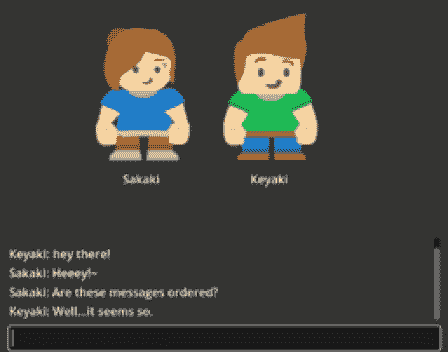
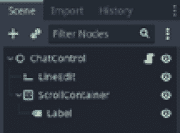
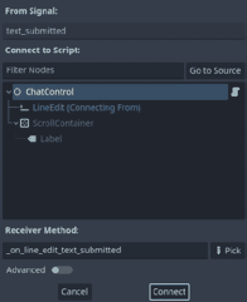
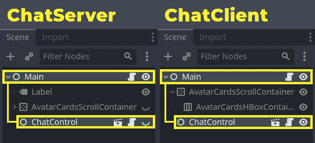

# 4

# 创建在线聊天

欢迎来到我们关于使用 Godot Engine 4.0 制作在线多人游戏的书籍的下一章！

在上一章中，我们了解了如何为玩家创建大厅以及它在进入游戏前聚集玩家的重要性。现在，我们将更进一步，探讨使用 Godot 的网络 API 开发在线聊天的过程。

正如我们所见，Godot 的网络 API 为我们提供了一套强大的工具，用于构建实时多人游戏。在本章中，我们将使用 `ENetMultiplayerPeer` 类在玩家之间建立可靠的连接，并使用一些 **远程过程调用**（**RPC**）方法来处理聊天系统的逻辑。

如您可能已经知道，在任何在线多人游戏中，聊天系统都是必不可少的，因为它允许玩家在游戏过程中相互沟通。一个设计良好的聊天系统可以极大地提升玩家体验，使团队成员之间的协调更加顺畅，并鼓励玩家之间的社交互动。

在本章中，我们还将探讨在网络中使用多个通信渠道的重要性。我们在上一章中介绍了这个概念，但现在我们将看到如何在实际的 RPC 方法中使用这个功能，以便我们的网络能够顺畅地在玩家之间传递数据。在以下逐步指导的末尾，我们将得到以下结果：



图 4.1 – 玩家交换信息的聊天界面

本章我们将涵盖以下主题：

+   理解数据交换和通道

+   发送聊天消息

+   远程更新玩家的数据

# 技术要求

通过本章，我们将使用 Godot 引擎项目仓库的第四个文件夹，该文件夹可通过以下链接获取：

[`github.com/PacktPublishing/The-Essential-Guide-to-Creating-Multiplayer-Games-with-Godot-4.0`](https://github.com/PacktPublishing/The-Essential-Guide-to-Creating-Multiplayer-Games-with-Godot-4.0)

在将项目导入你的 Godot 引擎项目管理器后，打开它并导航到 `res://04.creating-an-online-chat` 文件夹。然后，打开 `ChatControl.tscn` 和 `ChatControl.gd` 文件。它们将是本章的重点。

在本章接下来的内容中，我们将学习可靠和不可靠数据交换的基本概念以及通道的工作原理，以便为我们的聊天系统打下基础。

# 理解数据交换和通道

聊天系统本质上是一个按时间顺序排列的消息堆栈，我们根据玩家之间发送的消息来排序。由于这个系统需要一个连贯的时间顺序，我们需要了解如何防止数据在网络传输过程中变得混乱和无序。我们还需要防止这种排序影响其他系统和组件。为此，我们将学习如何可靠地发送数据包，以及如何使用多个通道进行数据交换。

## 可靠和不可靠的包

Godot 引擎的网络 API 允许在节点之间进行可靠和不可靠的数据交换。`@rpc` 注解提供了一种使用不同的传输协议（如 UDP 和 TCP）在客户端和服务器之间安全传输数据的方法。可靠的数据交换确保数据按顺序交付，并且在传输过程中不会丢失，这使得它非常适合像聊天消息这样的关键数据。不可靠的数据交换更快、更高效，但无法保证数据的顺序或交付，这使得它非常适合像玩家位置或实时更新这样的非关键数据。在我们的聊天系统中，我们使用可靠的 `@rpc` 选项来确保聊天消息能够及时无误地送达。可靠的数据交换确保玩家能够跟随对话并做出适当的回应。通道提供了对数据交换的又一层控制，通过优先处理或分离通过不同通道发送的数据，从而实现更好的网络优化。

在接下来的部分中，我们将学习通道是如何工作的，以及我们可以用它们做什么。

## 理解通道

当在 Godot 引擎中开发多人游戏时，理解网络 API 中通信通道的工作方式对于优化网络性能和最小化延迟至关重要。在 Godot 引擎网络 API 的上下文中，通信通道用于在节点之间交换的不同类型的数据进行分离。例如，你可能希望使用一个通道来更新游戏状态，另一个通道来发送聊天消息，还有另一个通道来发送玩家移动数据。

Godot 引擎网络 API 中的 `@rpc` 注解提供了一个选项，用于指定 RPC 方法在发送和接收数据时应使用的通道。默认情况下，所有 RPC 方法都使用通道 `0`。然而，我们可以通过在 `@rpc` 注解中将一个整数作为最后一个选项传递来指定不同的通道。例如，如果你想为游戏状态更新使用一个通道，你可以将游戏状态更新分配给通道 `1`，将聊天消息分配给通道 `2`。

在你的 Godot 引擎多人游戏中使用多个通道可以帮助提高网络性能并最小化延迟。通过将不同类型的数据分离到不同的通道中，你可以优先处理更重要的数据，并防止单个通道上的拥堵。

值得注意的是，使用多个通道也可以在数据包丢失或网络拥塞的情况下帮助防止数据丢失和损坏。通过将数据分离到不同的通道，你可以确保一个通道上的数据丢失或损坏不会影响其他通道。这有助于防止诸如同伴之间的不同步或损坏的游戏数据等问题。我们将在下一节中讨论这一点。

记住，我们将使用可靠的数据交换来处理我们的消息，因此我们不能因为数据交换通道仍在等待聊天消息到达，就阻止玩家更新其他关键信息，例如他们和他人头像的位置。为此使用另一个通道是明智的。让我们看看它是如何工作的。

打开 `res://04.creating-an-online-chat/ChatControl.tscn` 场景，你会注意到它已经按照我们制作聊天系统所需的全部节点进行了结构化。因此，我们将重点放在脚本上。以下图显示了 `ChatControl` 场景节点的层次结构：



图 4.2 – ChatControl 场景节点层次结构

从那里，打开 `res://04.creating-an-online-chat/ChatControl.gd` 文件，并使负责向聊天添加消息的方法：

1.  在 `add_message()` 方法上方创建一个 `@rpc` 注解。这个 RPC 方法应该对任何同伴都可用；它也应该在本地调用自己。在此基础上，它将是一个可靠的方法。最后，在这里，我们将使用一个单独的通道来交换数据，所以让我们使用通道 `2`：

    ```cpp
    @rpc("any_peer", "call_local", "reliable", 2)
    func add_message(_avatar_name, message):
        pass
    ```

1.  在 `add_message()` 方法内部，创建一个名为 `message_text` 的新变量，它将使用 `_avatar_name` 字符串和消息参数来创建一个使用两个冒号分隔的占位符的文本，如下所示：

    ```cpp
        var message_text = "%s: %s" % [_avatar_name,
            message]
    ```

1.  然后，连接 `label.text` 字符串，换行，然后添加 `message_text` 字符串。这将把最新的消息添加到玩家的可见聊天中：

    ```cpp
        label.text = label.text + "\n" + message_text
    ```

1.  最后，为了确保玩家的聊天总是显示最新的消息，我们将 `container.scroll_vertical` 更新为与 `label.size.y float` 匹配。这样，它将滚动到聊天标签的底部，显示最新的消息：

    ```cpp
        container.scroll_vertical = label.size.y
    ```

    到目前为止，`add_message()` 方法应该看起来像这样：

    ```cpp
    @rpc("any_peer", "call_local", "reliable", 2)
    func add_message(_avatar_name, message):
        var message_text = "%s: %s" % [_avatar_name,
            message]
        label.text = label.text + "\n" + message_text
        container.scroll_vertical = label.size.y
    ```

通过这样，我们可以使用专用通道从一名玩家传输消息到另一名玩家，并在每个玩家的聊天界面中显示它们。使用独立的数据传输通道就像在函数的 `@rpc` 注解的最后选项中添加一个整数一样简单。

在下一节中，让我们学习如何收集玩家的消息并实际处理它，将其发送到我们同伴网络中的其他玩家。

# 发送聊天消息

Godot 引擎的 RPC 允许在多人游戏中在客户端和服务器之间进行高效的数据传输。我们可以为这个特定目的创建一个 RPC 方法，将消息数据作为参数。传输可以是可靠的或不可靠的，具体取决于应用程序的需求。一旦消息被发送，它就会被适当的接收者（包括客户端和服务器）接收，并适当地处理，例如显示给用户或记录。我们在*理解数据交换和通道*部分做到了这一点，当时我们创建了`add_message()`方法。

使用 Godot 的 RPC 发送消息是一个直接的过程，涉及定义消息格式。在我们的例子中，我们使用玩家的头像名称和消息内容，如之前所见，调用 RPC 方法来传输消息，并在接收端适当地处理消息。

我们将实现一个方法来读取玩家使用`LineEdit`节点输入的消息，并将其发送到网络上的所有对等节点。为此，我们将使用连接到`_on_line_edit_text_submitted()`回调方法的`LineEdit.text_submitted`信号，如下面的图像所示：



图 4.3 – LineEdit 文本提交信号连接

信号连接后，打开脚本，让我们来处理`_on_line_edit_text_submitted()`方法：

1.  我们需要做的第一件事是防止处理空消息。为此，让我们在`new_text`参数是空字符串时从函数中返回：

    ```cpp
    func _on_line_edit_text_submitted(new_text):
        if new_text == "":
            return
    ```

1.  然后，我们可以调用`add_message()`方法进行 RPC。这将调用所有已连接节点的此方法。我们将传递`ChatControl.avatar_name`字符串和`new_text`字符串作为参数，以便对等节点有适当的数据来创建他们的聊天消息：

    ```cpp
        rpc("add_message", avatar_name, new_text)
    ```

1.  最后，我们清除`line_edit.text`字符串，以视觉上传达游戏已收到玩家的消息并正在处理它：

    ```cpp
        line_edit.clear()
    ```

    完整的`_on_line_edit_text_submitted()`方法应如下所示：

    ```cpp
    func _on_line_edit_text_submitted(new_text):
        if new_text == "":
            return
        rpc("add_message", avatar_name, new_text)
        line_edit.clear()
    ```

使用此方法，游戏中的任何玩家都将能够输入一条消息，并要求所有对等节点（包括他们自己）根据我们之前看到的`add_message()`逻辑添加一条新消息到他们的聊天中。

现在，我们需要了解我们将如何更新每个玩家关于其他玩家消息的情况。在下一节中，我们将学习如何在场景的根节点之外的节点上使用 RPC。有了这个，我们将能够编写更简洁的脚本，因为我们不会在不会实现的方法中膨胀我们的类。

# 远程更新对等节点数据

Godot 引擎的 Network API 中真正酷的地方是我们可以利用 RPC 在各个地方传递数据。例如，我们已经看到我们在消息中使用玩家的头像名称。但你有没有想过在这些步骤中我们是如何检索这些数据的？

你可能看到了一个名为`set_avatar_name()`的 RPC 方法，对吧？由于它的`@rpc`注解没有任何选项，你可以假设它使用默认选项。了解这一点很重要，因为正如我们之前所看到的，这意味着它应该只由**多人游戏权限**（在这种情况下，服务器）远程调用。

让我们打开`ChatServer.gd`文件，了解幕后发生了什么。本质上，大部分内容与`retrieve_avatar()` RPC 方法几乎相同。在*第 39 行*，我们有以下指令：

```cpp
var peer_id = multiplayer.get_remote_sender_id()
```

我们看到这是一种方法，可以将最新 RPC 的发送者保存在内存中，以便在必要时可以回溯，在这种情况下，这是必要的。

在*第 45 行*，我们向刚刚请求其头像数据的玩家调用`rpc_id()`方法来调用`set_avatar_name()`方法：

```cpp
chat.rpc_id(peer_id, "set_avatar_name", database[user]
    ['name'])
```

注意，还有其他一些内容。我们是从`ChatControl`节点调用这个`rpc_id()`方法，它是`Main`根节点的子节点。

这是服务器的`ChatControl`节点。由于服务器和客户端的场景树具有相同的`NodePath`到它们的`ChatControl`节点，我们可以在服务器的`ChatControl`节点上执行这个`rpc_id()`调用，而不是从`Main`节点调用，它将远程调用它，请求其头像数据的玩家：



图 4.4–ChatServer 和 ChatClient 的场景节点层次结构

这是一个防止单个类因包含许多 RPC 方法而膨胀的好方法，因为记住，如果调用者有一个 RPC 方法，所有节点都应该在其等效节点上具有相同的`NodePath`上的此方法。

这也是一种非常有效的方法，可以远程更新节点的新数据。RPCs（远程过程调用）是我们在使用 Godot 引擎制作在线多人游戏时，可以拥有的非常令人印象深刻且有用的工具。

# 摘要

在本章中，我们看到了如何使用`RPC`方法在网络的多个节点之间传递数据和执行操作。我们还理解了可靠和不可靠数据交换之间的核心区别，并看到了一些使用每种情况的示例。由于我们可以在网络节点之间交换数据的方式存在这种核心区别，我们也理解了一种方式可能会阻塞另一种方式，因此我们可以使用通道来防止这种类型的数据阻碍与该交换无关的其他类型的数据。

通过创建一个玩家可以聊天的在线大厅，我们看到了如何使用`@rpc`注解及其一些可用选项，包括允许其他玩家进行远程调用而不是只有多人游戏权限。

在下一章中，我们将使用我们刚刚获得的知识来构建一个实际的实时多人体验。我们将创建一个多人在线问答游戏，玩家将竞争看谁能够最快地选择正确的答案。那里见！

# 第二部分：创建在线多人游戏机制

在了解我们可用于创建在线多人游戏的工具后，我们通过创建实际的游戏原型来将这些工具置于具体情境中。在本部分中，我们学习如何将单人游戏转变为在线多人游戏，从问答游戏开始，以 MMORPG 游戏的原型结束。

本部分包含以下章节：

+   *第五章**,* *制作在线问答游戏*

+   *第六章*, *构建在线国际象棋游戏*

+   *第七章*, *开发在线乒乓球游戏*

+   *第八章*, *设计在线合作平台游戏*

+   *第九章*, *创建在线冒险原型*
