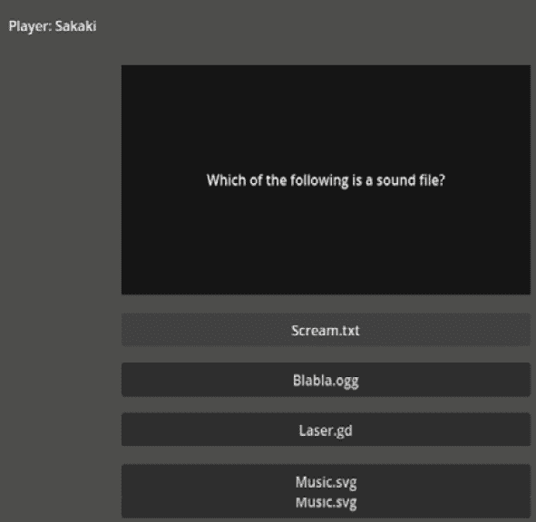
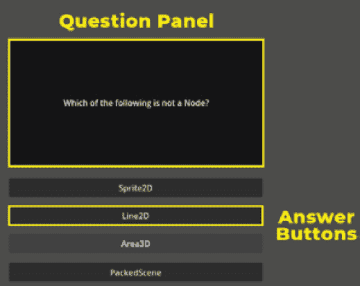
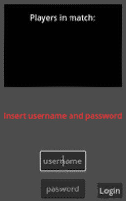

# 5

# 制作在线问答游戏

在本章中，我们将深入探讨使用 Godot 引擎 4.0 提供的强大网络 API 创建在线问答游戏的迷人领域。我们将探讨如何利用 Godot 引擎的网络 API 创建一个引人入胜且互动性强的问答游戏，可以与朋友或在线陌生人一起玩。我们将涵盖在线多人游戏开发的基本概念，包括客户端-服务器架构、游戏同步和玩家交互。

在这里，我们不会深入探讨这类游戏的游戏设计方面：计分、管理激励措施、平衡等等；相反，我们将专注于方程的工程方面：如何同步答案，防止玩家在另一位玩家已经回答时回答，更新双方的问题数据等等。

我们将首先设置问答游戏的服务器端，包括创建一个可以处理多个客户端传入连接和答案的专用服务器。然后，我们将转向设计游戏的核心功能，包括处理玩家输入、管理答案和问答问题，同时处理客户端和服务器之间的通信。

在本章中，我们将学习如何使用 Godot 引擎的 **RPCs** 来管理连接，处理数据同步，并实现实时多人游戏机制。我们还将涵盖管理游戏状态等主题。

本章将涵盖以下主题：

+   介绍在线问答游戏

+   为问答游戏设置大厅

+   实现在线回合

+   将本地机制转变为远程游戏

到本章结束时，你将牢固地理解如何使用 Godot 引擎 4.0 的网络 API 创建在线问答游戏。你将学习到制作在线异步游戏的关键概念和技术，包括服务器端设置、客户端实现和网络通信。以下截图展示了我们的在线问答游戏的最终结果：



图 5.1 – 显示问题和选项的在线问答游戏玩法屏幕

在下一节中，我们将讨论问答游戏的组件，以便我们可以确定作为网络工程师，我们必须在何处实现将游戏的本地多人版本转变为在线多人版本所需的必要功能。

# 介绍在线问答游戏

欢迎网络工程师！我们的工作室需要你将我们的问答游戏转变为在线多人游戏体验！我们已经经历了各种挑战来创建一个吸引人的问答游戏。现在，是时候通过添加在线多人功能将其提升到下一个层次了。

想象一下来自世界各地的玩家在实时中进行竞争，测试他们的知识和技能。在本章中，你将深入了解游戏开发中的网络世界，并学习如何使用 GDScript 实现多人游戏功能。那么，让我们开始，让我们的测验游戏成为难忘的多人游戏体验！

我们在线多人测验游戏的一个关键特性是从 JSON 数据库动态加载问题。数据库中的每个问题都包含所有必要的数据，例如问题本身和四个供玩家选择的备选答案。只有一个备选答案是正确的，并且这个信息也存储在数据库中，以确保游戏的公平性和一致性。

为了提供一个简单直观的用户界面，我们的游戏提供了四个按钮，每个按钮代表屏幕上显示的问题的一个答案。一个带有标签的面板显示游戏信息，包括玩家必须回答以在回合中获得分数的当前问题。游戏界面设计用于为玩家在浏览问题和答案时提供无缝体验。



图 5.2 – 显示本回合问题和可用答案的测验界面

随着玩家正确回答问题，他们可以进入下一轮。当玩家赢得一轮时，游戏会更新问题和答案选项，确保玩家始终面临新的问题挑战。游戏将继续进行，直到没有更多问题可以回答，从而为玩家提供引人入胜且具有竞争力的多人游戏体验。


图 5.3 – 显示本回合获胜者的测验界面

在下一节中，我们将深入探讨我们的测验游戏的大厅。我们将探讨如何创建一个无缝的多人大厅系统，允许玩家加入游戏并在一个有趣且引人入胜的多人环境中竞争。

# 设置测验游戏的大厅

在接下来的章节中，我们将深入探讨为我们的测验游戏设置大厅的过程。`QuizLobby` 场景是玩家互动和为游戏做准备的中心。



图 5.4 – 显示用户名和密码字段以及比赛中玩家的登录界面

确认玩家的过程与我们之前章节中做的方法类似，利用玩家提交的数据与 `FakeDatabase` 进行匹配。这确保只有拥有有效凭证的注册玩家才能访问大厅。

一旦玩家成功登录，他们的名字将出现在其他玩家面前，为当前大厅中的玩家提供可见性。你可以选择将之前的聊天也添加到这个场景中，以便玩家在比赛开始前进行互动。这将营造社区感，并允许玩家在等待游戏开始时相互连接和互动。

`QuizLobby` 场景与我们的前一个大厅相似。因此，在本节中，我们将重点介绍它在大厅（第三章，“制作大厅以聚集玩家”）基础上增加的核心功能。

在下一节中，我们将创建并理解这个新大厅迭代中的附加功能。为此，打开 `res://05.quiz-online/QuizLobby.gd` 脚本，并转到 `add_logged_player()` 方法。

## 显示新玩家

在这次更新的大厅中，我们将拥有的新功能之一是查看加入当前比赛的所有玩家的能力。为了实现这一点，让我们采取以下步骤：

1.  在 `add_logged_player()` 方法内部，将 `logged_players_label.text` 属性设置为 `player_name`；此函数接收一个参数。生成的文本应在当前内容下方追加 `player_name`，为此，我们将字符串与一个跳行占位符字符串连接，并将占位符格式化为 `player_name`：

    ```cpp
    @rpc
    func add_logged_player(player_name):
        logged_players_label.text = logged_players_
            label.text + "\n%s" % player_name
    ```

1.  然后，转到 `start_game()` 方法，并在 `@rpc` 注解中添加 `"authority"` 和 `"call_local"` 选项：

    ```cpp
    @rpc("authority", "call_local")
    func start_game():
        pass
    ```

1.  然后，在函数内部，让我们告诉 SceneTree 将当前场景更改为 `quiz_screen_scene`，这是一个指向 `QuizScreenClient.tscn` 的变量：

    ```cpp
    @rpc("authority", "call_local")
    func start_game():
        get_tree().change_scene_to_file(quiz_screen_scene)
    ```

1.  最后，在 `_on_StartButton_pressed()` 回调中，我们将直接调用多玩家权限的 `start_game()` 方法，而无需在本地调用：

    ```cpp
    func _on_StartButton_pressed():
        rpc_id(get_multiplayer_authority(), "start_game")
    ```

在游戏开发中，确保公平的游戏玩法并为玩家提供愉快的体验是创建成功游戏的关键方面。这涉及到实现各种功能和特性，使游戏引人入胜且动态。其中一项功能是在玩家加入游戏时将玩家添加到比赛中。这可以通过创建一个面板来实现，该面板显示当前参与游戏的玩家名单。

在多人游戏中，服务器和客户端之间的通信至关重要。确保只有授权实体可以执行特定操作是至关重要的。这确保了游戏机制和流程对所有玩家都是一致和可靠的。

最后，一旦所有玩家都进入游戏，比赛即将开始，下一步是将他们和服务器移动到下一个游戏屏幕。这个屏幕将显示有关游戏的所有必要信息，例如目标、规则和游戏机制。

这确保了所有玩家都在同一页面上，并知道他们可以期待游戏中的什么。总的来说，实现这些功能确保游戏运行顺畅，玩家拥有积极的游戏体验。

这样，每次有玩家加入比赛时，他们的名字都会被添加到`start_game()`方法中，只有多人游戏权限者可以远程调用它，对吧？我们很快就会看到一些新东西。

在服务器端，我们将对此方法有不同的实现。在下一节中，我们将看到比赛是如何实际开始的，以及为什么我们将所有玩家和服务器移动到下一个游戏屏幕。

## 开始比赛

这种实现方式是为了防止一个玩家在没有其他玩家也开始游戏的情况下，对其他玩家或自己调用`start_game()`方法。想法是，按下**开始**按钮的玩家将请求多人游戏权限者开始游戏。

反过来，多人游戏权限者，在本例中是服务器，将告诉每个玩家也开始比赛。它是通过在每个玩家上调用`start_game()`方法来做到这一点的。让我们看看这是如何完成的：

1.  打开`res://05.online-quiz/QuizServer.gd`脚本并找到`start_game()`方法。

1.  在`@rpc`注解行中，添加`"any_peer"`和`"call_remote"`选项。这将允许网络上的任何节点对该方法进行远程调用：

    ```cpp
    @rpc("any_peer", "call_remote")
    func start_game():
    ```

1.  然后，告诉 SceneTree 使用`get_tree().change_scene_to_file()`方法切换到`quiz_screen_scene_path`。这将通知服务器也更新其上下文到`QuizScreenServer`场景中的那个。这对于实际游戏的运行是必要的：

    ```cpp
    @rpc("any_peer", "call_remote")
    func start_game():
    get_tree().change_scene_to_file(quiz_screen_scene_path)
    ```

1.  最后，也是最重要的，向其他节点的`start_game`方法发起 RPC 调用，这样网络上的每个人都会移动到各自的`QuizScreenClient`场景：

    ```cpp
    @rpc("any_peer", "call_remote")
    func start_game():
        get_tree().change_scene_to_file
            (quiz_screen_scene_path)
        rpc("start_game")
    ```

大厅系统是任何在线多人游戏的关键组成部分，因为它作为玩家连接和准备比赛的入口。在我们的问答游戏中，我们已经成功使用 Godot 内置的**远程过程调用**（**RPC**）功能实现了大厅系统。此功能使我们能够在客户端和服务器之间建立可靠的双向通信通道，确保所有玩家保持同步。

在设置了大厅系统后，玩家可以加入比赛，他们的名字将被添加到`start_game()`方法中，只有多人游戏权限者可以调用此方法，以防止未经授权的调用并确保游戏的完整性。此方法的客户端实现将不同，我们将在下一节中探讨这一点。

如果你想在大厅系统中添加更多功能，你可以创建一个类似于在*魔兽争霸 III：混乱之治*中找到的倒计时计时器。这个功能增加了比赛的兴奋和期待感，并有助于玩家为即将到来的比赛做好心理准备。然而，对于我们的问答游戏，我们已经准备好进入下一步。

有了这些，我们的问答游戏的大厅部分已经准备好，可以聚集一些玩家并为他们设置，以便开始比赛。我们看到了如何使用 Godot 提供的`@rpc`注解选项来创建双向通信，我们可以使用它来同步玩家并将他们全部移动到实际游戏中。

大厅系统是任何在线多人游戏的关键部分，我们已经成功地使用 Godot 内置的 RPC 功能在我们的问答游戏中实现了它。该系统允许玩家加入比赛并与其数据同步到服务器，确保游戏公平且一致。虽然我们可以在大厅系统中添加更多功能，例如倒计时计时器，但我们现在准备进入开发下一个阶段。

在下一节中，我们将创建一个机制来禁用其他玩家已经选择了正确答案时玩家的动作。有了这个机制，你甚至可以创建一个*回合制*机制，这正是我们将在*第六章*中做的，*构建在线* *国际象棋游戏*。

# 实现在线回合

在设计问答游戏时，确保玩家只能对一个给定问题提供一个答案非常重要。当创建多人游戏时，这可能特别具有挑战性，因为多个玩家可能会同时尝试回答问题。

为了防止这种情况，有必要实现一个系统，一旦其他玩家提供了有效答案，就禁用玩家回答问题的能力。

实现这个系统的一个常见方法是在玩家提供回应后禁用代表潜在答案的按钮。这可以通过识别哪个按钮被按下并将其与游戏数据库中存储的正确答案进行比较的代码来完成。一旦确定了答案，代码就可以禁用按钮并防止其他玩家回答问题。

为了进一步提高玩家的体验，在提供答案后通常也会包含一个短暂的暂停。在这段时间里，玩家可以回顾问题和答案，游戏可以显示关于答案是否正确的反馈。这有助于在游戏中建立紧张和兴奋的气氛，同时也给玩家一个反思自己表现并提高技能的机会。

我们需要防止玩家在另一位玩家已经回答过同一问题后再次回答。为此，我们可以在提供有效响应后禁用代表答案的按钮。为了更好的体验，我们可以在切换到下一个问题之前添加一个短暂的暂停。

在本节中，我们将了解如何防止玩家的动作，最终创建一个伪回合制机制。

让我们了解如何实现这种伪回合制机制：

1.  打开 `res://05.online-quiz/QuizScreenServer.gd` 脚本，并实现其主方法。

1.  首先，让我们将 `"any_peer"` 添加到 `answered()` 方法的 `@rpc` 注解中。这将允许任何玩家在正确回答问题时触发我们即将描述的行为。

1.  在 `answered()` 方法内部，我们将告诉 `quiz_panel` 更新本回合的获胜者，通过调用 `"update_winner"` 方法并传递存储在数据库中的玩家姓名来执行 RPC。这将更新每个对等方的 `QuizPanel`，告知本回合的获胜者：

    ```cpp
    @rpc("any_peer")
    func answered(user):
        quiz_panel.rpc("update_winner", database[user]
            ["name"])
    ```

1.  然后，我们启动一个本地计时器，等待足够的时间让玩家消化本回合的获胜者。我们还对 `wait_label` 进行 RPC 调用，以确保每个人的 `WaitLabel` 显示正确的等待时间：

    ```cpp
    @rpc("any_peer")
    func answered(user):
        quiz_panel.rpc("update_winner", database[user]
            ["name"])
        timer.start(turn_delay_in_seconds)
        wait_label.rpc("wait", turn_delay_in_seconds)
    ```

1.  现在，让我们在 `missed()` 方法上做同样的事情。但我们将对 `"player_missed"` 进行 RPC 调用：

    ```cpp
    @rpc("any_peer")
    func missed(user):
        quiz_panel.rpc("player_missed", database[user]
            ["name"])
        timer.start(turn_delay_in_seconds)
        wait_label.rpc("wait", turn_delay_in_seconds)
    ```

有了这个，`QuizScreenServer` 处理玩家在赢得或输掉回合时的游戏状态。使用 RPC，我们可以更新所有对等方关于游戏中的发生情况，并使他们为下一回合做好准备。但我们还没有看到这是如何实际工作的。接下来，让我们看看在调用 `update_winner()` 和 `player_missed()` 方法时 `QuizPanel` 发生了什么。

## 更新玩家关于本回合的信息

在多人问答游戏中，保持所有玩家与游戏状态同步至关重要，尤其是在有人已经正确回答了问题的情况下。`QuizScreenServer` 主节点负责更新游戏状态，并通知所有连接的玩家关于当前回合中刚刚发生的事情。为此，`QuizScreenServer` 主节点会对所有对等方的 `QuizPanels` 进行 RPC 调用。每个玩家侧的 `QuizPanel` 节点将本地更新游戏状态，并防止在下一回合开始前进行任何进一步交互。

这些方法的实现确保所有玩家处于同一页面，玩家之间的游戏状态没有差异。采用这种方法，我们可以为游戏中的所有玩家提供公平和一致的游戏体验。

打开 `res://05.online-quiz/QuizPanel.gd` 文件，并实现 `update_winner()` 和 `player_missed()` 方法，以及它们的辅助方法，例如 `lock_answers()` 和 `unlock_answers()`：

1.  找到`update_winner()`方法，并为其`@rpc`注解添加`"call_local"`选项。我们这样做是因为当我们在这个服务器上执行这个 RPC 时，它也应该更新自己的`QuizPanel`节点：

    ```cpp
    @rpc("call_local")
    func update_winner(winner_name):
    ```

1.  然后，在`update_winner()`方法内部，更新`question_label.text`属性以显示包含`winner_name`的消息：

    ```cpp
    @rpc("call_local")
    func update_winner(winner_name):
        question_label.text = "%s won the round!!" %
            winner_name
    ```

1.  最后，我们将调用`lock_answers()`方法。这将使玩家等待下一轮，正如我们很快就会看到的：

    ```cpp
    @rpc("call_local")
    func update_winner(winner_name):
        question_label.text = "%s won the round!!" %
            winner_name
        lock_answers()
    ```

1.  我们可以在`player_missed()`方法中做完全相同的事情。但在这里，我们将显示不同的消息，传达玩家错过了答案：

    ```cpp
    @rpc("call_local")
    func player_missed(loser_name):
        question_label.text = "%s missed the question!!" %
            loser_name
        lock_answers()
    ```

    因此，我们的用户界面正在更新玩家关于他们同伴行动的信息。如果一个玩家回答正确，他们会知道；如果一个玩家回答错误，他们也会知道。现在是让他们为下一轮做好准备的时候了。让我们看看`lock_answers()`和`unlock_answers()`方法。

1.  在`lock_answers()`方法中，我们将遍历所有`AnswerButtons`，它们是`Answers`节点的子节点，并将它们禁用。这样，玩家就无法再与这些按钮交互，从而防止他们回答问题：

    ```cpp
    func lock_answers():
        for answer in answer_container.get_children():
            answer.disabled = true
    ```

1.  在`unlock_answers()`方法中，我们做的是相反的操作，关闭每个`AnswerButton`节点上的禁用属性：

    ```cpp
    func unlock_answers():
        for answer in answer_container.get_children():
            answer.disabled = false
    ```

这将阻止并允许玩家与当前问题的可用答案进行交互。我们可以使用相同的方法创建一个实际的轮流制系统，其中玩家轮流尝试一次回答一个问题。这里有一个挑战给你，我们的网络工程师。作为一个练习，使用你刚刚获得的知识实现一个轮流制系统。你拥有所有必要的资源。

轮流制系统是一种构建游戏玩法的方式，其中每个玩家轮流进行移动，然后传递控制权给下一个玩家。这与实时游戏玩法形成对比，在实时游戏玩法中，所有玩家同时行动。轮流制系统通常用于策略游戏，在这些游戏中，玩家需要仔细规划他们的移动。

要在你的问答游戏中实现轮流制系统，你需要修改现有的代码以添加一个新的逻辑层。一种方法是为玩家创建一个队列，每个玩家按顺序轮流。当轮到玩家时，他们可以回答问题，而其他玩家则被锁定。一旦他们回答完毕，他们的回合就结束了，队列中的下一个玩家接着进行他们的回合。

要创建这个系统，你可以将`lock_answer()`和`unlock_answer()`转换为 RPC 方法，并使用`rpc_id()`方法直接根据玩家是否是当前活动玩家来锁定或解锁玩家的答案选项。

在下一节中，我们将了解如何将问答游戏的基本机制应用于在线环境。这将是本章的核心内容，我们将看到我们如何评估玩家是否正确回答了问题，以及我们如何加载新问题，确保所有玩家都在查看相同的问题。

# 将本地机制转化为远程游戏

现在我们能够管理玩家的交互并向玩家传达游戏状态，是时候实现问答的核心功能了。接下来，我们将实现问题和答案。为此，我们将使用一个问题数据库，在其中我们将它们与可能的答案和正确答案索引一起存储。

在这里，我们将看到我们如何加载和反序列化这些问题到`QuizPanel`中。除此之外，我们还将了解我们如何利用 RPC 来保持所有人的同步。当然，我们还将实现当玩家选择正确和错误答案时的逻辑。

当玩家选择一个答案时，我们需要将其与正确答案索引进行比较，如果正确，我们应该通知`QuizScreenServer`关于正确答案。我们还将需要使用 RPC 来保持所有人关于当前问题和答案状态的同步。

此外，我们还需要实现当玩家选择错误答案时背后的逻辑。我们可以使用之前使用的相同锁定机制来防止玩家在有人已经提供了有效答案时回答。一旦我们处理了错误答案，我们需要通知`QuizScreenServer`关于错误答案，并进入下一轮。

通过实现所有这些功能，我们可以创建一个健壮且引人入胜的多人同时可玩的问答游戏。通过使用数据库来加载问题，我们可以使游戏动态多变。并且通过使用 RPC 和锁定机制，我们可以确保游戏运行顺畅，并且每个人都处于同一页面上。

## 理解问题数据库

首先，让我们先看看我们的问题数据库。打开文件`res://05.online-quiz/QuizQuestions.json`。它看起来是这样的：

```cpp
{
    "question_01":
        {
            "text": "Which of the following is not a
                Node?",
            "alternatives": ["Sprite2D", "Line2D",
                "Area3D", "PackedScene"],
            "correct_answer_index" : 3
        },
    "question_02":
        {
            "text": "Which of the following is an image
                file?",
            "alternatives": ["Bot.png", "Landscape.txt",
                "BeautifulTown.json", "UglyDuck.md"],
            "correct_answer_index" : 0
        },
    "question_03":
        {
            "text": "Which of the following is a sound
                file?",
            "alternatives": ["Scream.txt", "Blabla.ogg",
                "Laser.gd", "Music.svg"],
            "correct_answer_index": 1
        }
}
```

注意，我们代表每个问题作为一个既是*键*也是字典。每个问题有三个键：`"text"`、`"alternatives"`和`"correct_answer_index"`。`"text"`键是实际的问题陈述，`"alternatives"`是一个可能的答案数组，我们将将其转换为`AnswerButtons`，而`"correct_answer_index"`是`"alternatives"`数组中正确答案的索引。

了解这一点后，你可以自行创建一些问题。请注意，默认情况下，我们有四个`AnswerButtons`，所以在`"alternatives"`键中尝试提供四个值。否则，你需要实现一个`AnswerButtons`工厂，根据我们从问题中加载的答案数量动态创建它们。

## 加载和更新问题

现在，让我们了解在`QuizPanel`内部是如何实现这个过程的。打开位于`res://05.online-quiz/QuizPanel.gd`的脚本，并找到`update_question()`方法。你首先会注意到它有一个`@rpc`注解。

这是因为我们设计得这样，是服务器调用它并告诉它加载哪个问题。我们将在稍后看到这一点，但现在，让我们实现这个方法的逻辑：

1.  创建一个名为`question`的变量，并将其设置为对`available_questions`调用`pop_at()`方法的结果，传入`new_question_index`参数。这样，我们将从可用问题列表中删除当前问题并将其存储起来以便继续使用：

    ```cpp
    func update_question(new_question_index):
        var question = available_questions.pop_at
            (new_question_index)
    ```

1.  检查问题是否不等于`null`。由于`pop_at()`方法在提供的索引中找不到值时返回`null`，我们检查这一点以了解是否还有我们没有使用的问题，换句话说，如果`available_questions`为空：

    ```cpp
        if not question == null:
    ```

1.  如果我们得到的问题不是`null`，将`question_label.text`属性设置为存储在`questions`数组中的问题字典的`'text'`属性。这就是我们显示问题陈述的方式：

    ```cpp
        question_label.text = questions[question]['text']
    ```

1.  创建一个名为`correct_answer`的变量，并将其值设置为存储在`questions`数组中的问题字典的`'correct_answer_index'`属性。这样做，我们可以保留正确的答案以便在玩家回答时进行比较：

    ```cpp
        correct_answer = questions[question]
            ['correct_answer_index']
    ```

1.  使用`range()`函数和`for`循环遍历数字`0`到`3`（包含），对于每次迭代，创建一个名为`alternative`的变量，并将其设置为`i`，即存储在问题字典中的`'alternatives'`数组中的当前元素。将`answer_container`节点的当前子节点的文本设置为`alternative`。这样，我们就在各自的`AnswerButton`上显示了备选答案的文本：

    ```cpp
        for i in range(0, 4):
            var alternative = questions[question]
                ['alternatives'][i]
            answer_container.get_child(i).text =
                alternative
    ```

1.  在加载问题和其答案后，让我们调用`unlock_answers()`函数。这基本上开始了当前回合，允许玩家再次与`QuizPanel`交互：

    ```cpp
            unlock_answers()
    ```

1.  如果`question`是`null`，意味着我们没有剩余的问题可以玩测验，我们需要使用`for`循环遍历`answer_container`节点的每个子节点。对于每次迭代，我们将`question_label`节点的文本设置为`'No more questions'`：

    ```cpp
        else:
            for answer in answer_container.get_children():
                question_label.text = "No more questions"
    ```

1.  由于我们已经到达了我们的测验比赛的终点，我们可以调用`lock_answers()`函数来防止任何进一步的交互：

    ```cpp
                lock_answers()
    ```

在这些步骤之后，`update_question()`方法应该看起来像这样：

```cpp
@rpc
func update_question(new_question_index):
    var question = available_questions.pop_at
        (new_question_index)
    if not question == null:
        question_label.text = questions[question]['text']
        correct_answer = questions[question]
            ['correct_answer_index']
        for i in range(0, 4):
            var alternative = questions[question]
                ['alternatives'][i]
            answer_container.get_child(i).text =
                alternative
        unlock_answers()
    else:
        for answer in answer_container.get_children():
            question_label.text = "No more questions"
        lock_answers()
```

通过这种方式，我们已经设置了主要的测验机制。我们可以从我们的数据库中选择一个问题并显示给我们的玩家。你可以检查`_ready()`回调来了解我们如何将问题加载到内存中并将它们分配给`available_questions`变量。

如前所述，我们将在这里关注重点。说到重点，我们仍然缺少一个机制，那就是我们如何验证答案，对吧？找到 `evaluate_answer()` 方法，让我们来实现它：

1.  在 `evaluate_answer()` 方法的内部，创建一个名为 `is_answer_correct` 的变量，并将其设置为 `answer_index` 和 `correct_answer` 变量的比较。这将检查给定的答案索引是否与正确答案的索引匹配：

    ```cpp
        var is_answer_correct = answer_index == correct_answer
    ```

1.  发射一个名为 `answered` 的信号，其参数为 `is_answer_correct` 变量。这个信号将被测验的其他部分用来告知玩家的答案是否正确：

    ```cpp
        answered.emit(is_answer_correct)
    ```

    最后，我们的 `evaluate_answer()` 方法相当简单，只做我们需要知道玩家是否正确回答当前问题的事情：

    ```cpp
    func evaluate_answer(answer_index):
        var is_answer_correct = answer_index == correct_answer
        answered.emit(is_answer_correct)
    ```

你可能已经注意到 `evaluate_answer()` 方法不是一个 RPC 函数，对吧？它本质上发射一个信号，告诉我们玩家的答案是否正确。那么服务器是如何管理这个的呢？

在接下来的部分，我们将了解这些信息是如何在我们测验的客户端和服务器实现之间传递的。

## 将玩家的答案发送到服务器

现在，让我们了解我们机制的最后一块以及它在多人网络中的行为。在前一节中，我们最终得到了对玩家答案的评估，这导致了 `answered` 信号的发射。

`answered` 信号需要以特定的方式处理，以确保所有玩家保持同步，并且所有对等方的游戏状态保持一致。当玩家提交答案时，会发射 `answered` 信号，并通过 RPC 调用服务器更新所有对等方关于这一点。

`answered` 信号及其相关方法对于维护多人网络中所有玩家游戏状态的一致性至关重要。没有它们，玩家可能会看到不同的游戏状态，并拥有不同的体验，这会使游戏变得不那么有趣，甚至可能不公平。

在本节中，我们将了解这个信号是如何在网络中传播并更新所有对等方关于玩家答案的。

打开 `res://05.online-quiz/QuizScreenClient.gd` 脚本，你将注意到，在最开始，我们有一个对 `QuizPanel.answered` 信号的回调。

让我们来实现这个回调：

1.  在方法体内，使用 `if` 语句检查 `is_answer_correct` 是否为真：

    ```cpp
    func _on_quiz_panel_answered(is_answer_correct):
        if is_answer_correct:
    ```

1.  如果 `is_answer_correct` 是 `true`，则使用 `rpc_id()` 方法调用服务器上的 `answered` 方法。有了这个，服务器将更新所有对等方关于本回合胜者的信息：

    ```cpp
    func _on_quiz_panel_answered(is_answer_correct):
        if is_answer_correct:
           rpc_id(
               get_multiplayer_authority(),
               "answered",
               AuthenticationCredentials.user
           )
    ```

1.  如果 `is_answer_correct` 是 `false`，则使用 `rpc_id()` 方法调用服务器上的错过方法。最后，如果玩家选择了错误的答案，服务器将更新所有对等方关于这一点：

    ```cpp
        else:
           rpc_id(
               get_multiplayer_authority(),
               "missed",
               AuthenticationCredentials.user
           )
    ```

`_on_quiz_panel_answered()` 的整个实现应该看起来像这样：

```cpp
func _on_quiz_panel_answered(is_answer_correct):
    if is_answer_correct:
       rpc_id(
           get_multiplayer_authority(),
           "answered",
           AuthenticationCredentials.user
       )
    else:
       rpc_id(
           get_multiplayer_authority(),
           "missed",
           AuthenticationCredentials.user
       )
```

因此，客户端实现将通知服务器有关玩家交互的信息。反过来，服务器将更新游戏状态，并告诉所有同伴也更新他们的游戏状态以匹配服务器的状态。之后，我们就位了缺失的网络组件，我们的在线问答游戏已经准备就绪。请随意测试并尝试更多问题！

# 摘要

在本章中，我们看到了如何使用 Godot Engine 4.0 网络 API 创建在线问答游戏。我们涵盖了在线多人游戏开发的基本概念，包括客户端-服务器架构、游戏同步和玩家交互。通过问答游戏，我们看到了如何从 JSON 数据库动态加载问题，以及如何在问答比赛中显示当前玩家。我们创建了一个机制，防止玩家在另一位玩家已经回答问题后回答，从而创建了一个伪回合制机制。最后，我们看到了如何管理玩家交互，将游戏状态传达给玩家，以及如何实现正确和错误答案背后的逻辑，一轮接一轮地加载新问题，直到没有更多问题可以显示。

在下一章的项目中，我们将更深入地实现我们的在线问答游戏的回合制机制。正如我们在本章中看到的，我们可以使用与伪回合制机制类似的方法，但进行一些修改以使其成为一个真正的回合制系统。

此外，我们将探讨如何传递有关玩家回合的信息，例如谁正在轮到他们，对手回合期间发生了什么，以及更多内容。我们还将学习如何设置胜负条件并更新同伴们关于这些条件的信息，这对于在我们的游戏中营造成就感与挑战感至关重要。

到下一章结束时，你将更深入地了解游戏开发过程，包括如何创建引人入胜的在线多人游戏机制，并使用 Godot Engine 4.0 网络 API 实现它们。那里见！
